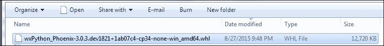

# 第九章 使用 wxPython 库扩展我们的 GUI

在本章中，我们将通过使用 wxPython 库来增强我们的 Python GUI。

+   如何安装 wxPython 库

+   如何在 wxPython 中创建我们的 GUI

+   使用 wxPython 快速添加控件

+   尝试将主 wxPython 应用嵌入到主 tkinter 应用中

+   尝试将我们的 tkinter GUI 代码嵌入到 wxPython 中

+   如何使用 Python 控制两个不同的 GUI 框架

+   如何在两个连接的 GUI 之间进行通信

# 简介

在本章中，我们将介绍另一个目前不随 Python 一起提供的 Python GUI 工具包。它被称为 wxPython。

这个库有两个版本。原始版本被称为 Classic，而最新版本则被称为其开发项目的代号，Phoenix。

在这本书中，我们仅使用 Python 3 进行编程，并且由于新的凤凰项目旨在支持 Python 3，因此这是我们本章使用的 wxPython 版本。

首先，我们将创建一个简单的 wxPython 图形用户界面，然后我们将尝试将本书中开发的基于 tkinter 的 GUI 与新的 wxPython 库连接起来。

### 注意

wxPython 是 wxWidgets 的 Python 绑定。

wxPython 中的 w 代表 Windows 操作系统，而 x 代表基于 Unix 的操作系统，例如 Linux 和 OS X。

如果使用这两个 GUI 工具包同时操作不成功，我们将尝试使用 Python 来解决任何问题，然后我们将在 Python 中使用**进程间通信**（**IPC**）来确保我们的 Python 代码按预期工作。

# 如何安装 wxPython 库

wxPython 库并非随 Python 一起安装，因此，为了使用它，我们首先必须安装它。

这个菜谱将向我们展示在哪里以及如何找到正确的版本进行安装，以确保与所安装的 Python 版本和正在运行的操作系统相匹配。

### 注意事项

wxPython 第三方库已经存在超过 17 年，这表明它是一个健壮的库。

## 准备就绪

为了使用 wxPython 与 Python 3 兼容，我们必须安装 wxPython Phoenix 版本。

## 如何做到这一点...

在网上搜索 wxPython 时，我们可能会找到官方网站 [www.wxpython.org](http://www.wxpython.org)。


如果我们点击 MS Windows 的下载链接，我们可以看到几个 Windows 安装程序，所有这些安装程序都仅适用于 Python 2.x。


要在 Python 3 中使用 wxPython，我们必须安装 wxPython/Phoenix 库。我们可以在快照构建链接中找到安装程序：

[`wxpython.org/Phoenix/snapshot-builds/`](http://wxpython.org/Phoenix/snapshot-builds/)

从这里，我们可以选择与我们的 Python 版本和操作系统版本相匹配的 wxPython/Phoenix 版本。我正在使用运行在 64 位 Windows 7 操作系统上的 Python 3.4。


Python 轮子（`.whl`）安装包有一个编号方案。

对于我们来说，这个方案最重要的部分是我们正在安装适用于 Python 3.4（安装程序名称中的 cp34）和 Windows 64 位操作系统（安装程序名称中的 win_amd64 部分）的 wxPython/Phoenix 构建。



在成功下载 wxPython/Phoenix 软件包后，我们现在可以导航到它所在的目录，并使用 pip 安装此软件包。


我们在 Python 的`site-packages`文件夹中有一个名为`wx`的新文件夹。


### 注意

`wx` 是 wxPython/Phoenix 库安装到的文件夹名称。我们将把这个模块导入到我们的 Python 代码中。

我们可以通过执行来自官方 wxPython/Phoenix 网站的简单演示脚本来验证我们的安装是否成功。官方网站的链接是 [`wxpython.org/Phoenix/docs/html/`](http://wxpython.org/Phoenix/docs/html/)。

```py
import wx
app = wx.App()
frame = wx.Frame(None, -1, "Hello World")
frame.Show()
app.MainLoop()
```

运行前面的 Python 3 脚本将使用 wxPython/Phoenix 创建以下 GUI。


## 它是如何工作的...

在这个菜谱中，我们成功安装了适用于 Python 3 的正确版本的 wxPython 工具包，我们可以用它来使用 Python 3。我们找到了这个 GUI 工具包的 Phoenix 项目，它是当前活跃的开发线。Phoenix 将在适当的时候取代 Classic wxPython 工具包，并且特别针对与 Python 3 的良好兼容性。

在成功安装了 wxPython/Phoenix 工具包之后，我们只用五行代码就创建了图形用户界面。

### 注意事项

我们之前通过使用 tkinter 实现了相同的结果。

# 如何在 wxPython 中创建我们的 GUI

在这个菜谱中，我们将开始使用 wxPython GUI 工具包创建我们的 Python GUI。

我们将首先重新创建我们之前使用 tkinter 创建的几个小部件，tkinter 是 Python 自带的一个库。

然后，我们将探讨 wxPython GUI 工具包提供的一些小部件，这些小部件使用 tkinter 创建起来较为困难。

## 准备就绪

之前的配方向您展示了如何安装与您所使用的 Python 版本和操作系统相匹配的正确版本的 wxPython。

## 如何做到这一点...

开始探索 wxPython GUI 工具包的好地方是访问以下网址：[`wxpython.org/Phoenix/docs/html/gallery.html`](http://wxpython.org/Phoenix/docs/html/gallery.html)

这个网页展示了多个 wxPython 小部件。点击任何一个，我们就会被带到它们的文档页面，这是一个非常不错且实用的功能，可以快速了解 wxPython 控件。


以下截图展示了 wxPython 按钮小部件的文档。


我们可以非常快速地创建一个带有标题、菜单栏和状态栏的工作窗口。当鼠标悬停在菜单项上时，状态栏会显示该菜单项的文本。这可以通过编写以下代码实现：

```py
# Import wxPython GUI toolkit
import wx

# Subclass wxPython frame
class GUI(wx.Frame):
    def __init__(self, parent, title, size=(200,100)):
        # Initialize super class
        wx.Frame.__init__(self, parent, title=title, size=size)

        # Change the frame background color 
        self.SetBackgroundColour('white')

        # Create Status Bar
        self.CreateStatusBar() 

        # Create the Menu
        menu= wx.Menu()

        # Add Menu Items to the Menu
        menu.Append(wx.ID_ABOUT, "About", "wxPython GUI")
        menu.AppendSeparator()
        menu.Append(wx.ID_EXIT,"Exit"," Exit the GUI")

        # Create the MenuBar
        menuBar = wx.MenuBar()

        # Give the MenuBar a Title
        menuBar.Append(menu,"File") 

        # Connect the MenuBar to the frame
        self.SetMenuBar(menuBar)  

        # Display the frame
        self.Show()

# Create instance of wxPython application
app = wx.App()

# Call sub-classed wxPython GUI increasing default Window size
GUI(None, "Python GUI using wxPython", (300,150))

# Run the main GUI event loop
app.MainLoop()
```

这创建了一个以下 GUI，它使用 wxPython 库用 Python 编写。


在之前的代码中，我们继承了`wx.Frame`。在下面的代码中，我们继承了`wx.Panel`并将`wx.Frame`传递给我们的类`__init__()`方法。

### 注意事项

在 wxPython 中，顶级 GUI 窗口被称为框架。没有框架就无法创建 wxPython GUI，并且框架必须作为 wxPython 应用程序的一部分来创建。

我们在我们的代码底部创建了应用和框架。

为了将小部件添加到我们的图形用户界面(GUI)中，我们必须将它们附加到一个面板上。面板的父级是框架（我们的顶级窗口），而我们放置到面板中的小部件的父级是面板。

以下代码向一个父级为框架的面板添加了一个多行文本框小部件。我们还向面板小部件添加了一个按钮小部件，当点击该按钮时，会在文本框中打印出一些文本。

这里是完整的代码：

```py
import wx               # Import wxPython GUI toolkit
class GUI(wx.Panel):    # Subclass wxPython Panel
    def __init__(self, parent):

        # Initialize super class
        wx.Panel.__init__(self, parent)

        # Create Status Bar
        parent.CreateStatusBar() 

        # Create the Menu
        menu= wx.Menu()

        # Add Menu Items to the Menu
        menu.Append(wx.ID_ABOUT, "About", "wxPython GUI")
        menu.AppendSeparator()
        menu.Append(wx.ID_EXIT,"Exit"," Exit the GUI")

        # Create the MenuBar
        menuBar = wx.MenuBar()

        # Give the Menu a Title
        menuBar.Append(menu,"File") 

        # Connect the MenuBar to the frame
        parent.SetMenuBar(menuBar)  

        # Create a Print Button
        button = wx.Button(self, label="Print", pos=(0,60))

        # Connect Button to Click Event method 
        self.Bind(wx.EVT_BUTTON, self.printButton, button)

        # Create a Text Control widget 
        self.textBox = wx.TextCtrl(
self, size=(280,50), style=wx.TE_MULTILINE)

    def printButton(self, event):
        self.textBox.AppendText(
"The Print Button has been clicked!") 

app = wx.App()      # Create instance of wxPython application
frame = wx.Frame(None, title="Python GUI using wxPython", size=(300,180))     # Create frame
GUI(frame)          # Pass frame into GUI
frame.Show()        # Display the frame
app.MainLoop()      # Run the main GUI event loop
```

运行前面的代码并点击我们的 wxPython 按钮小部件，将产生以下 GUI 输出：


## 它是如何工作的...

在这个菜谱中，我们使用成熟的 wxPython GUI 工具包创建了我们自己的 GUI。仅用几行 Python 代码，我们就能够创建一个带有 `最小化`、`最大化` 和 `退出` 按钮的完整功能 GUI。我们添加了一个菜单栏、一个多行文本控件和一个按钮。我们还创建了一个状态栏，当选择菜单项时它会显示文本。我们将所有这些小部件放置在一个面板容器小部件中。

我们将打印按钮连接到了文本控件。

当鼠标悬停在菜单项上时，一些文本会在状态栏中显示。

# 使用 wxPython 快速添加控件

在这个菜谱中，我们将重新创建本书早期使用 tkinter 创建的 GUI，但这次我们将使用 wxPython 库。我们将看到使用 wxPython GUI 工具包创建自己的 Python GUI 是多么简单快捷。

我们不会重新创建在前面章节中创建的全部功能。例如，我们不会国际化我们的 wxPython GUI，也不会将其连接到 MySQL 数据库。我们将重新创建 GUI 的视觉方面，并添加一些功能。

### 注意事项

比较不同的库为我们提供了选择用于我们自己的 Python GUI 开发的工具包，我们可以在自己的 Python 代码中结合使用这些工具包中的几个。

## 准备就绪

确保您已安装 wxPython 模块以遵循此配方。

## 如何做到这一点...

首先，我们像之前使用 tkinter 一样创建我们的 Python `OOP` 类，但这次我们继承并扩展了 `wx.Frame` 类。为了清晰起见，我们不再将我们的类命名为 `OOP`，而是将其重命名为 `MainFrame`。

### 注意

在 wxPython 中，主要的 GUI 窗口被称为 Frame。

我们还创建了一个回调方法，当点击`退出`菜单项时关闭 GUI，并声明浅灰色`元组`作为我们 GUI 的背景颜色。

```py
import wx
BACKGROUNDCOLOR = (240, 240, 240, 255)

class MainFrame(wx.Frame):
    def __init__(self, *args, **kwargs):
        wx.Frame.__init__(self, *args, **kwargs)

        self.createWidgets()
        self.Show()

    def exitGUI(self, event):     # callback
        self.Destroy()

    def createWidgets(self):   
        self.CreateStatusBar()      # wxPython built-in method
        self.createMenu()
       self.createNotebook()
```

接下来，我们通过创建一个 wxPython `Notebook` 类的实例并将其分配为我们自定义的名为 `Widgets` 的类的父类，向我们的 GUI 添加一个标签控制。

`notebook` 类实例变量以 `wx.Panel` 作为其父类。

```py
    def createNotebook(self):
        panel = wx.Panel(self)
        notebook = wx.Notebook(panel)
        widgets = Widgets(notebook) # Custom class explained below
        notebook.AddPage(widgets, "Widgets")
        notebook.SetBackgroundColour(BACKGROUNDCOLOR) 
        # layout
        boxSizer = wx.BoxSizer()
        boxSizer.Add(notebook, 1, wx.EXPAND)
        panel.SetSizerAndFit(boxSizer)  
```

### 注意事项

在 wxPython 中，标签控件被命名为`Notebook`，就像在 tkinter 中一样。

每个`Notebook`小部件都需要有一个父级，并且为了在 wxPython 中的`Notebook`中布局小部件，我们使用不同类型的布局管理器。

### 注意事项

wxPython 的 sizer 是类似于 tkinter 的网格布局管理器的布局管理器。

接下来，我们在笔记本页面中添加控件。我们通过创建一个继承自`wx.Panel`的单独类来实现这一点。

```py
class Widgets(wx.Panel):
    def __init__(self, parent):
        wx.Panel.__init__(self, parent)
        self.createWidgetsFrame()
        self.addWidgets()
        self.layoutWidgets()
```

我们通过将 GUI 代码拆分成小方法来模块化它，遵循 Python 面向对象编程的最佳实践，这使得我们的代码易于管理和理解。

```py
    #------------------------------------------------------
    def createWidgetsFrame(self):
        self.panel = wx.Panel(self)
        staticBox = wx.StaticBox( self.panel, -1, "Widgets Frame" )    
        self.statBoxSizerV = wx.StaticBoxSizer(staticBox, 
                                               wx.VERTICAL)
    #-----------------------------------------------------
    def layoutWidgets(self):         
        boxSizerV = wx.BoxSizer( wx.VERTICAL )
        boxSizerV.Add( self.statBoxSizerV, 1, wx.ALL )
        self.panel.SetSizer( boxSizerV )
        boxSizerV.SetSizeHints( self.panel )

    #------------------------------------------------------
    def addWidgets(self):
        self.addCheckBoxes()        
        self.addRadioButtons()
        self.addStaticBoxWithLabels()
```

### 注意事项

当使用 wxPython StaticBox 小部件时，为了成功布局它们，我们使用 `StaticBoxSizer` 和常规的 `BoxSizer` 的组合。wxPython 的 StaticBox 小部件与 tkinter 的 LabelFrame 小部件非常相似。

在 tkinter 中，将一个`StaticBox`嵌入另一个`StaticBox`是直接的，但使用 wxPython 则稍微不那么直观。使其工作的一种方法如下所示：

```py
    def addStaticBoxWithLabels(self):
        boxSizerH = wx.BoxSizer(wx.HORIZONTAL)
        staticBox = wx.StaticBox( self.panel, -1, 
"Labels within a Frame" )
        staticBoxSizerV = wx.StaticBoxSizer( staticBox, wx.VERTICAL )
        boxSizerV = wx.BoxSizer( wx.VERTICAL )
        staticText1 = wx.StaticText( self.panel, -1,
"Choose a number:" )
        boxSizerV.Add( staticText1, 0, wx.ALL)
        staticText2 = wx.StaticText( self.panel, -1,"Label 2")
        boxSizerV.Add( staticText2, 0, wx.ALL )
        #------------------------------------------------------
        staticBoxSizerV.Add( boxSizerV, 0, wx.ALL )
        boxSizerH.Add(staticBoxSizerV)
        #------------------------------------------------------
        boxSizerH.Add(wx.TextCtrl(self.panel))
        # Add local boxSizer to main frame
        self.statBoxSizerV.Add( boxSizerH, 1, wx.ALL )
```

首先，我们创建一个水平 `BoxSizer`。接下来，我们创建一个垂直 `StaticBoxSizer`，因为我们想在这个框架中将两个标签以垂直布局排列。

为了将另一个小部件安排在嵌入的`StaticBox`右侧，我们必须将嵌入的`StaticBox`及其子控件以及下一个小部件都分配给水平`BoxSizer`，然后将这个`BoxSizer`（现在包含我们的嵌入`StaticBox`和我们的其他小部件）分配给主`StaticBox`。

这听起来是不是很困惑？

您必须亲自尝试这些尺寸调整器，以了解如何使用它们。从本菜谱的代码开始，注释掉一些代码，或者修改一些 x 和 y 坐标，以观察效果。

也可以阅读官方的 wxPython 文档来获取更多信息。

### 注意事项

重要的是要知道在代码中添加到不同尺寸调整器的位置，以便实现我们想要的布局。

为了在第一个`StaticBox`下方创建第二个，我们创建单独的`StaticBoxSizers`并将它们分配到同一个面板。

```py
class Widgets(wx.Panel):
    def __init__(self, parent):
        wx.Panel.__init__(self, parent)
        self.panel = wx.Panel(self)
        self.createWidgetsFrame()
        self.createManageFilesFrame()
        self.addWidgets()
        self.addFileWidgets()
        self.layoutWidgets()

    #----------------------------------------------------------
    def createWidgetsFrame(self):
        staticBox = wx.StaticBox( 
self.panel, -1, "Widgets Frame", size=(285, -1) )   
        self.statBoxSizerV = wx.StaticBoxSizer(
staticBox, wx.VERTICAL)   

    #----------------------------------------------------------
    def createManageFilesFrame(self):
        staticBox = wx.StaticBox( 
self.panel, -1, "Manage Files", size=(285, -1) )   
        self.statBoxSizerMgrV = wx.StaticBoxSizer(
staticBox, wx.VERTICAL)

    #----------------------------------------------------------
    def layoutWidgets(self):         
        boxSizerV = wx.BoxSizer( wx.VERTICAL )
        boxSizerV.Add( self.statBoxSizerV, 1, wx.ALL )
        boxSizerV.Add( self.statBoxSizerMgrV, 1, wx.ALL )

        self.panel.SetSizer( boxSizerV )
        boxSizerV.SetSizeHints( self.panel )

    #----------------------------------------------------------
    def addFileWidgets(self):   
        boxSizerH = wx.BoxSizer(wx.HORIZONTAL)
        boxSizerH.Add(wx.Button(
self.panel, label='Browse to File...'))   
        boxSizerH.Add(wx.TextCtrl(
self.panel, size=(174, -1), value= "Z:\\" ))

        boxSizerH1 = wx.BoxSizer(wx.HORIZONTAL)
        boxSizerH1.Add(wx.Button(
self.panel, label='Copy File To:    ')) 
        boxSizerH1.Add(wx.TextCtrl(
self.panel, size=(174, -1), value= "Z:\\Backup" ))    

        boxSizerV = wx.BoxSizer(wx.VERTICAL)
        boxSizerV.Add(boxSizerH)
        boxSizerV.Add(boxSizerH1)        

        self.statBoxSizerMgrV.Add( boxSizerV, 1, wx.ALL )
```

以下代码实例化了主事件循环，该循环运行我们的 wxPython 图形用户界面程序。

```py
#======================
# Start GUI
#======================
app = wx.App()
MainFrame(None, title="Python GUI using wxPython", size=(350,450))
app.MainLoop()
```

我们使用 wxPython 构建的 GUI 最终效果如下：


## 它是如何工作的...

我们在几个类中设计和布局我们的 wxPython GUI。

一旦我们在 Python 模块的底部部分完成这个操作，我们就创建一个 wxPython 应用程序的实例。接下来，我们实例化我们的 wxPython GUI 代码。

之后，我们调用主 GUI 事件循环，该循环执行此应用程序进程内运行的所有 Python 代码。这显示了我们的 wxPython GUI。

### 注意事项

无论我们在创建应用程序和调用其主事件循环之间放置什么代码，它都将成为我们的 wxPython GUI。

真正熟悉 wxPython 库及其 API 可能需要一些时间，但一旦我们了解了如何使用它，这个库就变得非常有趣，并且是构建我们自己的 Python 图形用户界面（GUIs）的强大工具。wxPython 还有一个可以与之配合使用的可视化设计工具：[`www.cae.tntech.edu/help/programming/wxdesigner-getting-started/view`](http://www.cae.tntech.edu/help/programming/wxdesigner-getting-started/view)

这个菜谱使用面向对象编程（OOP）来学习如何使用 wxPython 图形用户界面（GUI）工具包。

# 尝试将主 wxPython 应用嵌入到主 tkinter 应用中

现在我们已经使用 Python 内置的 tkinter 库以及 wxWidgets 库的 wxPython 包装器创建了相同的 GUI，我们确实需要将这些技术创建的 GUI 结合起来。

### 注意事项

wxPython 和 tkinter 库各自都有其优势。在诸如 [`stackoverflow.com/`](http://stackoverflow.com/) 这样的在线论坛中，我们经常看到类似的问题，比如：哪一个更好？我应该使用哪个 GUI 工具包？这表明我们必须做出一个“非此即彼”的选择。我们不必做出这样的决定。

在这样做的主要挑战之一是，每个 GUI 工具包都必须有自己的事件循环。

在这个菜谱中，我们将尝试通过从我们的 tkinter GUI 中调用它来嵌入一个简单的 wxPython GUI。

## 准备就绪

我们将重用我们在第一章中构建的 tkinter GUI，即*创建 GUI 表单和添加小部件*。

## 如何做到这一点...

我们从一个看起来是这样的简单 tkinter GUI 开始：


接下来，我们将尝试调用一个简单的 wxPython 图形用户界面（GUI），这是我们在这个章节之前的一个菜谱中创建的。

这是用简单、非面向对象的方式完成此操作的完整代码：

```py
#===========================================================
import tkinter as tk
from tkinter import ttk
from tkinter import scrolledtext

win = tk.Tk()    

win.title("Python GUI")
aLabel = ttk.Label(win, text="A Label")
aLabel.grid(column=0, row=0)    
ttk.Label(win, text="Enter a name:").grid(column=0, row=0)
name = tk.StringVar()
nameEntered = ttk.Entry(win, width=12, textvariable=name)
nameEntered.grid(column=0, row=1)
ttk.Label(win, text="Choose a number:").grid(column=1, row=0)
number = tk.StringVar()
numberChosen = ttk.Combobox(win, width=12, textvariable=number)
numberChosen['values'] = (1, 2, 4, 42, 100)
numberChosen.grid(column=1, row=1)
numberChosen.current(0)
scrolW  = 30
scrolH  =  3
scr = scrolledtext.ScrolledText(win, width=scrolW, height=scrolH, wrap=tk.WORD)
scr.grid(column=0, sticky='WE', columnspan=3)
nameEntered.focus()  

#===========================================================
def wxPythonApp():
    import wx
    app = wx.App()
    frame = wx.Frame(None, -1, "wxPython GUI", size=(200,150))
    frame.SetBackgroundColour('white')
    frame.CreateStatusBar()
    menu= wx.Menu()
    menu.Append(wx.ID_ABOUT, "About", "wxPython GUI")
    menuBar = wx.MenuBar()
    menuBar.Append(menu,"File") 
    frame.SetMenuBar(menuBar)     
    frame.Show()
    app.MainLoop()

action = ttk.Button(win, text="Call wxPython GUI", command= wxPythonApp ) 
action.grid(column=2, row=1)

#======================
# Start GUI
#======================
win.mainloop()
```

运行前面的代码，在点击 tkinter 的`Button`控件后，将从一个 tkinter GUI 启动一个 wxPython GUI。


## 它是如何工作的...

重要的是，我们将整个 wxPython 代码放入了一个名为 `def wxPythonApp()` 的独立函数中。

在按钮点击事件的回调函数中，我们只需调用此代码。

### 注意事项

需要注意的一点是，在继续使用 tkinter GUI 之前，我们必须关闭 wxPython GUI。

# 尝试将我们的 tkinter GUI 代码嵌入到 wxPython 中

在这个菜谱中，我们将与之前的菜谱相反的方向，尝试从 wxPython GUI 内部调用我们的 tkinter GUI 代码。

## 准备就绪

我们将重用本章之前的一个菜谱中创建的一些 wxPython GUI 代码。

## 如何做到这一点...

我们将从简单的 wxPython 图形用户界面（GUI）开始，它看起来像这样：


接下来，我们将尝试调用一个简单的 tkinter GUI。

这是用简单、非面向对象的方式完成此操作的完整代码：

```py
#=============================================================
def tkinterApp():
    import tkinter as tk
    from tkinter import ttk
    win = tk.Tk()    
    win.title("Python GUI")
    aLabel = ttk.Label(win, text="A Label")
    aLabel.grid(column=0, row=0)    
    ttk.Label(win, text="Enter a name:").grid(column=0, row=0)
    name = tk.StringVar()
    nameEntered = ttk.Entry(win, width=12, textvariable=name)
    nameEntered.grid(column=0, row=1)
    nameEntered.focus()  
    def buttonCallback():
        action.configure(text='Hello ' + name.get())
    action = ttk.Button(win, text="Print", command=buttonCallback)
    action.grid(column=2, row=1)
    win.mainloop()

#=============================================================
import wx
app = wx.App()
frame = wx.Frame(None, -1, "wxPython GUI", size=(200,180))
frame.SetBackgroundColour('white')
frame.CreateStatusBar()
menu= wx.Menu()
menu.Append(wx.ID_ABOUT, "About", "wxPython GUI")
menuBar = wx.MenuBar()
menuBar.Append(menu,"File") 
frame.SetMenuBar(menuBar) 
textBox = wx.TextCtrl(frame, size=(180,50), style=wx.TE_MULTILINE)

def tkinterEmbed(event):
    tkinterApp()

button = wx.Button(frame, label="Call tkinter GUI", pos=(0,60)) 
frame.Bind(wx.EVT_BUTTON, tkinterEmbed, button)
frame.Show()

#======================
# Start wxPython GUI
#======================
app.MainLoop()
```

运行前面的代码，在点击 wxPython 的 `Button` 控件后，将启动一个 tkinter GUI。然后我们可以将文本输入到 tkinter 的文本框中。通过点击其按钮，按钮文本会更新为相应的名字。


在启动 tkinter 事件循环后，wxPython GUI 仍然可以响应，因为我们可以在 tkinter GUI 运行时输入到 `TextCtrl` 小部件中。

### 注意事项

在之前的配方中，我们无法使用我们的 tkinter GUI，直到我们关闭了 wxPython GUI。意识到这种差异可以帮助我们做出设计决策，如果我们想要结合这两种 Python GUI 技术的话。

我们也可以通过多次点击 wxPython GUI 按钮来创建几个 tkinter GUI 实例。然而，当任何 tkinter GUI 还在运行时，我们无法关闭 wxPython GUI。我们必须先关闭它们。


## 它是如何工作的...

在这个菜谱中，我们与之前的菜谱相反，首先使用 wxPython 创建了一个 GUI，然后，在它内部，创建了几个使用 tkinter 构建的 GUI 实例。

当一个或多个 tkinter GUI 运行时，wxPython GUI 仍然保持响应。然而，点击 tkinter 按钮只在其第一次点击时更新其按钮文本。

# 如何使用 Python 控制两个不同的 GUI 框架

在这个菜谱中，我们将探讨从 Python 控制 tkinter 和 wxPython GUI 框架的方法。在前一章中，我们已经使用了 Python 线程模块来保持我们的 GUI 响应，因此在这里我们将尝试使用相同的方法。

我们将看到事情并不总是以直观的方式运作。

然而，当我们从其中调用 wxPython GUI 的实例时，我们将改进我们的 tkinter GUI，使其不再无响应。

## 准备就绪

这个菜谱将扩展本章中之前的一个菜谱，其中我们尝试将一个主要的 wxPython GUI 嵌入我们的 tkinter GUI。

## 如何做到这一点...

当我们从 tkinter GUI 创建了一个 wxPython GUI 实例后，我们就不能再使用 tkinter GUI 控件，直到关闭 wxPython GUI 的那个实例。现在让我们来改进这一点。

我们第一次尝试可能是使用来自 tkinter 按钮回调函数的线程。

例如，我们的代码可能看起来像这样：

```py
def wxPythonApp():
    import wx
    app = wx.App()
    frame = wx.Frame(None, -1, "wxPython GUI", size=(200,150))
    frame.SetBackgroundColour('white')
    frame.CreateStatusBar()
    menu= wx.Menu()
    menu.Append(wx.ID_ABOUT, "About", "wxPython GUI")
    menuBar = wx.MenuBar()
    menuBar.Append(menu,"File") 
    frame.SetMenuBar(menuBar)     
    frame.Show()
    app.MainLoop()

def tryRunInThread():
    runT = Thread(target=wxPythonApp)
    runT.setDaemon(True)    
    runT.start()
    print(runT)
    print('createThread():', runT.isAlive())    

action = ttk.Button(win, text="Call wxPython GUI", command=tryRunInThread)
```

首先，这似乎是有效的，这很直观，因为 tkinter 控件不再被禁用，我们可以通过点击按钮创建几个 wxPython GUI 的实例。我们还可以在其他的 tkinter 小部件中输入和选择内容。


然而，一旦我们尝试关闭 GUIs，我们就会从 wxWidgets 那里收到一个错误，并且我们的 Python 可执行文件会崩溃。


为了避免这种情况，我们不必尝试在单独的线程中运行整个 wxPython 应用程序，而是可以将代码修改为仅让 wxPython 的 `app.MainLoop` 在线程中运行。

```py
def wxPythonApp():
    import wx
    app = wx.App()
    frame = wx.Frame(None, -1, "wxPython GUI", size=(200,150))
    frame.SetBackgroundColour('white')
    frame.CreateStatusBar()
    menu= wx.Menu()
    menu.Append(wx.ID_ABOUT, "About", "wxPython GUI")
    menuBar = wx.MenuBar()
    menuBar.Append(menu,"File") 
    frame.SetMenuBar(menuBar)     
    frame.Show()

    runT = Thread(target=app.MainLoop)
    runT.setDaemon(True)    
    runT.start()
    print(runT)
    print('createThread():', runT.isAlive())

action = ttk.Button(win, text="Call wxPython GUI", command=wxPythonApp) 
action.grid(column=2, row=1)
```

## 它是如何工作的...

我们最初尝试在一个线程中运行整个 wxPython GUI 应用程序，但这样做并没有成功，因为 wxPython 的主事件循环期望成为应用程序的主线程。

我们通过仅在一个线程中运行 wxPython 的 `app.MainLoop` 来解决这个问题，这让它误以为自己是主线程。

这种方法的一个副作用是，我们不能再单独关闭所有的 wxPython GUI 实例。至少有一个实例只有在关闭创建线程作为守护进程的 wxPython GUI 时才会关闭。

我并不完全清楚这是为什么。直观上，人们可能会期望能够关闭所有守护线程，而无需等待创建它们的父线程先关闭。

这可能是因为在我们主线程仍在运行时，引用计数器没有被设置为零。

在实用层面上，这是它目前的工作方式。

# 如何在两个连接的 GUI 之间进行通信

在之前的菜谱中，我们找到了连接 wxPython GUI 和 tkinter GUI 的方法，可以从一个调用另一个，反之亦然。

虽然这两个图形用户界面（GUIs）同时成功运行，但它们实际上并没有相互通信，因为它们只是互相启动。

在这个菜谱中，我们将探讨如何让这两个图形用户界面相互通信。

## 准备就绪

阅读之前的某个食谱可能是为这个食谱做准备的一个好方法。

在这个菜谱中，我们将使用与上一个菜谱略有修改的 GUI 代码，但大部分基本的 GUI 构建代码是相同的。

## 如何做到这一点...

在之前的菜谱中，我们面临的主要挑战之一是如何结合两种旨在成为应用程序唯一 GUI 工具包的 GUI 技术。我们发现了很多简单的方法来实现它们的结合。

我们将再次从 tkinter GUI 主事件循环中启动 wxPython GUI，并在 tkinter 进程内部启动其自己的线程来运行 wxPython GUI。

为了做到这一点，我们将使用一个共享的全局多进程 Python 队列。

### 注意事项

虽然在这个菜谱中通常最好避免使用全局数据，但它们是一个实用的解决方案，并且 Python 的全局变量实际上仅在它们被声明的模块中是全局的。

这里是使两个 GUI 在某种程度上相互通信的 Python 代码。为了节省空间，这并非纯面向对象编程（OOP）代码。

我们也没有展示所有小部件的创建代码。该代码与之前的食谱相同。

```py
# Ch09_Communicate.py
import tkinter as tk
from tkinter import ttk
from threading import Thread

win = tk.Tk()       
win.title("Python GUI")   

from multiprocessing import Queue
sharedQueue = Queue()
dataInQueue = False

def putDataIntoQueue(data):
    global dataInQueue
    dataInQueue =  True
    sharedQueue.put(data)

def readDataFromQueue():
    global dataInQueue
    dataInQueue = False
    return sharedQueue.get() 
#===========================================================
import wx               
class GUI(wx.Panel):    
    def __init__(self, parent):
        wx.Panel.__init__(self, parent)
        parent.CreateStatusBar() 
        button = wx.Button(self, label="Print", pos=(0,60))
        self.Bind(wx.EVT_BUTTON, self.writeToSharedQueue, button)

    #--------------------------------------------------------
    def writeToSharedQueue(self, event):
        self.textBox.AppendText(
                        "The Print Button has been clicked!\n") 
        putDataIntoQueue('Hi from wxPython via Shared Queue.\n')
        if dataInQueue: 
            data = readDataFromQueue()
            self.textBox.AppendText(data)

            text.insert('0.0', data) # insert data into GUI

#============================================================
def wxPythonApp():
        app = wx.App()
        frame = wx.Frame(
            None, title="Python GUI using wxPython", size=(300,180))
        GUI(frame)          
        frame.Show()        
        runT = Thread(target=app.MainLoop)
        runT.setDaemon(True)    
        runT.start()
        print(runT)
        print('createThread():', runT.isAlive())
#============================================================
action = ttk.Button(win, text="Call wxPython GUI", command=wxPythonApp) 
action.grid(column=2, row=1)

#======================
# Start GUI
#======================
win.mainloop()
```

首先运行前面的代码会创建程序中的 tkinter 部分，当我们点击这个 GUI 中的按钮时，它将运行 wxPython GUI。这两个 GUI 仍然像之前一样同时运行，但这次，两个 GUI 之间增加了一个额外的通信层级。


前一个截图的左侧显示了 tkinter 图形用户界面，通过点击**调用 wxPython GUI**按钮，我们可以调用 wxPython GUI 的一个实例。我们可以通过多次点击按钮来创建多个实例。

### 注意事项

所有创建的 GUI 都保持响应。它们不会崩溃也不会冻结。

点击任何 wxPython GUI 实例上的 **打印** 按钮，会在其自身的 `TextCtrl` 小部件中写入一句话，然后还会写入另一行到自身以及 tkinter GUI 中。您需要向上滚动才能在 wxPython GUI 中看到第一句话。

### 注意事项

这种工作方式是通过使用模块级队列和 tkinter 的 `Text` 小部件

需要注意的一个重要元素是，我们创建了一个线程来运行 wxPython 的 `app.MainLoop`，就像我们在之前的菜谱中做的那样。

```py
def wxPythonApp():
        app = wx.App()
        frame = wx.Frame(
None, title="Python GUI using wxPython", size=(300,180))
        GUI(frame)          
        frame.Show()        
        runT = Thread(target=app.MainLoop)
        runT.setDaemon(True)    
        runT.start()
```

我们创建了一个从 `wx.Panel` 继承的类，并将其命名为 `GUI`。然后，我们在前面的代码中实例化了这个类的实例。

在这个类中，我们创建了一个按钮点击事件回调方法，然后调用上面编写的程序代码。正因为如此，这个类可以访问这些函数并且可以向共享队列写入。

```py
    #------------------------------------------------------
    def writeToSharedQueue(self, event):
        self.textBox.AppendText(
"The Print Button has been clicked!\n") 
        putDataIntoQueue('Hi from wxPython via Shared Queue.\n')
        if dataInQueue: 
            data = readDataFromQueue()
            self.textBox.AppendText(data)
            text.insert('0.0', data) # insert data into tkinter
```

我们首先检查数据是否已经在先前方法中放置到共享队列中，如果是这样，我们随后将公共数据打印到两个 GUI 上。

### 注意事项

`putDataIntoQueue()` 这一行将数据放入队列，而 `readDataFromQueue()` 则从队列中读取数据，并将其保存在 `data` 变量中。

`text.insert('0.0', data)` 是将此数据写入 tkinter GUI 的 **打印** 按钮的 wxPython 回调方法的代码行。

以下是在代码中被调用并使代码工作的过程函数（不是方法，因为它们没有绑定）。

```py
from multiprocessing import Queue
sharedQueue = Queue()
dataInQueue = False

def putDataIntoQueue(data):
    global dataInQueue
    dataInQueue =  True
    sharedQueue.put(data)

def readDataFromQueue():
    global dataInQueue
    dataInQueue = False
    return sharedQueue.get()
```

我们使用一个简单的布尔标志`dataInQueue`来通信，当数据在队列中可用时。

## 它是如何工作的...

在这个菜谱中，我们成功地将我们以前以类似方式创建的两个 GUI 结合起来，但之前是独立的，彼此之间没有交流。然而，在这个菜谱中，我们通过让一个 GUI 启动另一个 GUI，并通过简单的 Python 多进程队列机制，使它们能够相互通信，将数据从共享队列写入两个 GUI 中。

有许多非常先进和复杂的技术可用于连接不同的进程、线程、线程池、锁、管道、TCP/IP 连接等等。

在 Python 的精神中，我们找到了一个对我们来说简单有效的解决方案。一旦我们的代码变得复杂，我们可能需要重构它，但这是一个良好的开端。
