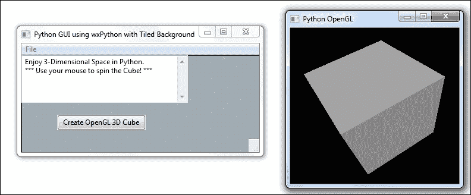
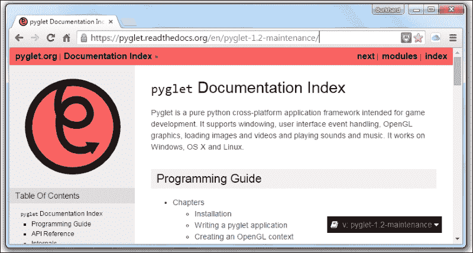

# 第十章. 使用 PyOpenGL 和 PyGLet 创建惊人的 3D GUIs

在本章中，我们将创建令人惊叹的 Python GUI，它能够显示真正的三维图像，这些图像可以围绕自身旋转，以便我们从各个角度观察它们。

+   PyOpenGL 将我们的 GUI 进行转换

+   我们的 3D 图形用户界面！

+   使用位图使我们的 GUI 看起来更美观

+   PyGLet 比 PyOpenGL 更容易转换我们的 GUI

+   我们的用户界面色彩绚丽

+   使用 tkinter 创建幻灯片

# 简介

在本章中，我们将通过赋予它真正的三维能力来转换我们的 GUI。我们将使用两个 Python 第三方库。PyOpenGL 是 OpenGL 标准的 Python 绑定，它是一个所有主要操作系统都内置的图形库。这使得生成的控件具有原生外观和感觉。

Pyglet 是 OpenGL 库的另一个 Python 绑定，但它也可以创建 GUI 应用程序，这使得使用 Pyglet 进行编码比使用 PyOpenGL 更为简便。

# PyOpenGL 转换我们的 GUI

在这个菜谱中，我们将成功创建一个 Python GUI，它实际上会导入 PyOpenGL 模块并正常工作！

为了做到这一点，我们需要克服一些初始挑战。

这个菜谱将展示一种经过验证确实有效的方法。如果你在自己的实验中遇到困难，请记住托马斯·爱迪生所说的著名话语。

### 注意事项

托马斯·爱迪生，白炽灯泡的发明者，回答了一位记者关于爱迪生失败的问题。爱迪生回答说：

*"我没有失败，我只是找到了一万种行不通的方法。"*

首先，我们必须安装 PyOpenGL 扩展模块。

在成功安装与我们的操作系统架构相匹配的 PyOpenGL 模块后，我们将创建一些示例代码。

## 准备就绪

我们将安装 PyOpenGL 包。在这本书中，我们使用的是 Windows 7 64 位操作系统和 Python 3.4。下面跟随的下载截图是为了这个配置。

我们还将使用 wxPython。如果您尚未安装 wxPython，您可以阅读前一章中关于如何安装 wxPython 以及如何使用此 GUI 框架的一些食谱。

### 注意事项

我们正在使用 wxPython Phoenix 版本，这是最新的版本，并计划在未来取代原始的 Classic wxPython 版本。

## 如何做到这一点...

为了使用 PyOpenGL，我们首先需要安装它。以下网址是官方的 Python 软件包安装网站：

[`pypi.python.org/pypi/PyOpenGL/3.0.2#downloads`](https://pypi.python.org/pypi/PyOpenGL/3.0.2#downloads)


这看起来是正确的安装方式，但结果证明，它不适用于 Windows 7 64 位操作系统和 Python 3.4.3 64 位。

在前一章的食谱中提到了一个更好的地方来查找 Python 安装包。你可能已经熟悉它了。我们下载与我们的操作系统和 Python 版本相匹配的包。它带有新的 `.whl` 格式，因此我们首先需要安装 Python 轮子包。

### 注意事项

如何安装 Python 轮子包在之前的菜谱中有描述。

使用`pip`命令通过`PyOpenGL-3.1.1a1-cp34-none-win_amd64.whl`文件安装 PyOpenGL 既成功又安装了我们所需的全部 64 位模块。

将 `<your full path>` 替换为你下载 wheel 安装程序的完整路径。

```py
pip install <your full path> PyOpenGL-3.1.1a1-cp34-none-win_amd64.whl
```

当我们现在尝试导入一些 PyOpenGL 模块时，它工作正常，如下代码示例所示：

```py
# Ch10_import_OpenGL.py
import wx                  
from wx import glcanvas
from OpenGL.GL import *
from OpenGL.GLUT import *
```

所有这些代码所做的只是导入几个 OpenGL Python 模块。它没有做其他任何事情，但是当我们运行我们的 Python 模块时，我们没有得到任何错误。

这证明了我们已经成功地将 OpenGL 绑定安装到了 Python 中。

现在我们的开发环境已经成功搭建完成，我们可以使用 wxPython 来尝试它。

### 注意事项

许多在线示例仅限于使用 Python 2.x，以及使用 wxPython 的经典版本。我们正在使用 Python 3 和 Phoenix。

使用基于 wxPython 示例代码创建了一个工作的 3D 立方体。相比之下，运行圆锥示例没有成功，但这个示例让我们走上了正确的道路。

这里是网址：

[`wiki.wxpython.org/GLCanvas%20update`](http://wiki.wxpython.org/GLCanvas%20update)

这里是对代码的一些修改：

```py
import wx
from wx import glcanvas
from OpenGL.GL import *
from OpenGL.GLUT import *

class MyCanvasBase(glcanvas.GLCanvas):
    def __init__(self, parent):
        glcanvas.GLCanvas.__init__(self, parent, -1)

# This context was missing from the code
        self.context = glcanvas.GLContext(self)  # <- added

    def OnPaint(self, event):
        dc = wx.PaintDC(self)
# We have to pass in a context ------
#         self.SetCurrent()                      # commented out
        self.SetCurrent(self.context)            # <- changed
```

我们现在可以创建以下 GUI：


在 wxPython 的古典版本中，`SetCurrent()`函数不需要上下文。以下是在网上搜索时可能会找到的一些代码。

```py
    def OnPaint(self, event):

        dc = wx.PaintDC(self)
        self.SetCurrent()
        if not self.init:
            self.InitGL()
            self.init = True
        self.OnDraw()
```

在使用 wxPython Phoenix 时，前面的代码无法正常工作。我们可以在网上查找 Phoenix 的正确语法。


## 它是如何工作的...

在这个菜谱中，我们第一次使用 PyOpenGL Python 绑定库体验了 OpenGL。虽然 OpenGL 能够在真正的 3D 中创建真正惊人的图像，但在过程中我们遇到了一些挑战，然后找到了解决这些挑战的方法，使它得以工作。

### 注意

我们正在用 Python 编写代码，创建 3D 图像！

# 我们的三维 GUI！

在这个菜谱中，我们将使用 wxPython 创建自己的图形用户界面。我们正在重用一些来自 wxPython 演示示例的代码，我们将这些代码简化到仅显示 3D OpenGL 所需的最小代码量。

### 注意事项

OpenGL 是一个非常庞大的库。我们不会对这个库进行详细的解释。如果你想要进一步学习 OpenGL，有很多书籍和在线文档可供参考。它有自己的着色语言。

## 准备就绪

阅读之前的食谱可能是为这个食谱做的良好准备。

## 如何做到这一点...

由于整个 Python 代码在这里有点长，我们将只展示一小部分代码。

整个代码可在网上找到，这个 Python 模块被称为：

```py
# Ch10_wxPython_OpenGL_GUI
import wx                  
from wx import glcanvas
from OpenGL.GL import *
from OpenGL.GLUT import *

#---------------------------------------------------
class CanvasBase(glcanvas.GLCanvas):
    def __init__(self, parent):
        glcanvas.GLCanvas.__init__(self, parent, -1)
        self.context = glcanvas.GLContext(self)
        self.init = False

        # Cube 3D start rotation
        self.last_X = self.x = 30
        self.last_Y = self.y = 30

        self.Bind(wx.EVT_SIZE, self.sizeCallback)
        self.Bind(wx.EVT_PAINT, self.paintCallback)
        self.Bind(wx.EVT_LEFT_DOWN, self.mouseDownCallback)
        self.Bind(wx.EVT_LEFT_UP, self.mouseUpCallback)
        self.Bind(wx.EVT_MOTION, self.mouseMotionCallback)

    def sizeCallback(self, event):
        wx.CallAfter(self.setViewport)
        event.Skip()

    def setViewport(self):
        self.size = self.GetClientSize()
        self.SetCurrent(self.context)
        glViewport(0, 0, self.size.width, self.size.height)

    def paintCallback(self, event):
        wx.PaintDC(self)
        self.SetCurrent(self.context)
        if not self.init:
            self.initGL()
            self.init = True
        self.onDraw()

    def mouseDownCallback(self, event):
        self.CaptureMouse()
        self.x, self.y = self.last_X, self.last_Y = event.GetPosition()

    def mouseUpCallback(self, evt):
        self.ReleaseMouse()

    def mouseMotionCallback(self, evt):
        if evt.Dragging() and evt.LeftIsDown():
            self.last_X, self.last_Y = self.x, self.y
            self.x, self.y = evt.GetPosition()
            self.Refresh(False)

#-----------------------------------------------------
class CubeCanvas(CanvasBase):
    def initGL(self):
        # set viewing projection
        glMatrixMode(GL_PROJECTION)
        glFrustum(-0.5, 0.5, -0.5, 0.5, 1.0, 3.0)

        # position viewer
        glMatrixMode(GL_MODELVIEW)
        glTranslatef(0.0, 0.0, -2.0)

        # position object
        glRotatef(self.y, 1.0, 0.0, 0.0)
        glRotatef(self.x, 0.0, 1.0, 0.0)

        glEnable(GL_DEPTH_TEST)
        glEnable(GL_LIGHTING)
        glEnable(GL_LIGHT0)

    def onDraw(self):
        # clear color and depth buffers
        glClear(GL_COLOR_BUFFER_BIT | GL_DEPTH_BUFFER_BIT)

        # draw six faces of a cube
        glBegin(GL_QUADS)
        glNormal3f( 0.0, 0.0, 1.0)
        glVertex3f( 0.5, 0.5, 0.5)
        glVertex3f(-0.5, 0.5, 0.5)
        glVertex3f(-0.5,-0.5, 0.5)
        glVertex3f( 0.5,-0.5, 0.5)

        glNormal3f( 0.0, 0.0,-1.0)
        glVertex3f(-0.5,-0.5,-0.5)

#===========================================================
app = wx.App()
frame = wx.Frame(None, title="Python GUI using wxPython", size=(300,230))
GUI(frame)
frame.Show()        
app.MainLoop()      
```


前面的截图展示了我们的 wxPython 图形用户界面。当我们点击按钮控件时，以下第二个窗口就会出现。


### 注意

我们现在可以使用鼠标来旋转立方体，以便看到它的六个面。


我们还可以最大化这个窗口，坐标将会缩放，我们可以在这么大的窗口中旋转这个立方体！


这个立方体也可以是一艘《星际迷航》太空船！

如果这是我们想要发展的，我们只需成为这个技术的高级程序员即可。

### 注意事项

许多视频游戏正在使用 OpenGL 进行开发。

## 它是如何工作的...

我们首先创建了一个常规的 wxPython 图形用户界面，并在其上放置了一个按钮控件。点击此按钮将调用导入的 OpenGL 3D 库。所使用的代码是 wxPython 示例代码的一部分，我们稍作修改以使其与 Phoenix 兼容。

### 注意

这个配方将我们自己的 GUI 粘合到这个库上。

OpenGL 是一个如此庞大且令人印象深刻的库。这个菜谱展示了如何在 Python 中创建一个工作示例的技巧。

### 注意事项

通常，一个工作示例就足以让我们开始我们的旅程。

# 使用位图使我们的 GUI 看起来更美观

这份食谱灵感来源于一个曾经工作过的 wxPython IDE 构建框架。

它不适用于 Python 3 和 wxPython Phoenix，但代码非常酷。

我们将重用该项目提供的代码中的大量位图图像。

在时间耗尽之前，你可以在 GitHub 上 fork 谷歌的代码。


## 准备就绪

我们将继续在本食谱中使用 wxPython，因此阅读前一章的部分内容可能有助于为制作本食谱做准备。

## 如何做到这一点...

在对 gui2py 代码进行逆向工程并对该代码进行其他修改后，我们可能会得到以下窗口小部件，它显示了一个漂亮的、拼贴式的背景。


当然，我们在重构之前提到的网站上的代码时丢失了很多小部件，但这也确实给了我们一个酷炫的背景，点击**退出**按钮仍然有效。

下一步是弄清楚如何将代码中的有趣部分整合到我们自己的图形用户界面中。

我们通过在之前菜谱的 GUI 中添加以下代码来实现这一点。

```py
#----------------------------------------------------------
class GUI(wx.Panel):              # Subclass wxPython Panel
    def __init__(self, parent):
        wx.Panel.__init__(self, parent)

        imageFile = 'Tile.bmp'
        self.bmp = wx.Bitmap(imageFile)
        # react to a resize event and redraw image
        parent.Bind(wx.EVT_SIZE, self.canvasCallback)

    def canvasCallback(self, event=None):
        # create the device context
        dc = wx.ClientDC(self)
        brushBMP = wx.Brush(self.bmp)
        dc.SetBrush(brushBMP)
        width, height = self.GetClientSize()
        dc.DrawRectangle(0, 0, width, height)
```

### 注意事项

我们必须绑定到父级，而不是自身，否则我们的位图将不会显示。

现在运行我们的改进代码，将位图作为我们 GUI 的背景。


点击按钮仍然调用我们的 OpenGL 3D 绘图，所以我们没有丢失任何功能。



## 它是如何工作的...

在这个菜谱中，我们通过使用位图作为背景来增强了我们的图形用户界面。我们将位图图像平铺，当我们调整 GUI 窗口大小时，位图会自动调整自身以填充我们在设备上下文中绘制的 Canvas 整个区域。

### 注意事项

前面的 wxPython 代码可以加载不同的图像文件格式。

# PyGLet 比 PyOpenGL 更容易转换我们的 GUI

在这个菜谱中，我们将使用 PyGLet 图形用户界面开发框架来创建我们的 GUI。

PyGLet 比 PyOpenGL 更易于使用，因为它自带了 GUI 事件循环，所以我们不需要使用 tkinter 或 wxPython 来创建我们的 GUI。

## 如何做到这一点...

为了使用 Pyglet，我们首先必须安装这个第三方 Python 插件。

使用`pip`命令，我们可以轻松地安装库，一个成功的安装在我们 Python 的`site-packages`文件夹中看起来是这样的：


在线文档位于当前版本的此网站：

[`pyglet.readthedocs.org/en/pyglet-1.2-maintenance/`](https://pyglet.readthedocs.org/en/pyglet-1.2-maintenance/)



首次使用 Pyglet 库的经验可能看起来是这样的：

```py
import pyglet

window = pyglet.window.Window()
label = pyglet.text.Label('PyGLet GUI', 
                          font_size=42,
                          x=window.width//2, y=window.height//2,
                          anchor_x='center', anchor_y='center')

@window.event
def on_draw():
    window.clear()
    label.draw()

pyglet.app.run()
```

上述代码来自官方 pyglet.org 网站，并生成以下功能齐全的 GUI：


## 它是如何工作的...

在这个菜谱中，我们使用了另一个封装了 OpenGL 库的第三方 Python 模块。

这个库自带事件循环处理能力，这使得我们无需依赖另一个库来创建一个运行的 Python GUI。

我们已经探索了展示我们如何安装和使用这个出色的 GUI 库的官方网站。

# 我们的用户界面色彩绚丽

在这个菜谱中，我们将扩展之前菜谱中使用的 Pyglet 编写的 GUI，将其转变为真正的 3D。

我们还将为它添加一些炫酷的颜色。这个食谱灵感来源于《OpenGL SuperBible》系列书籍中的某些示例代码。它创建了一个非常多彩的立方体，我们可以使用键盘的上、下、左、右按钮在三维空间中旋转它。

我们对示例代码进行了轻微改进，使得在按下任意一个键时图片会转动，而不是需要按下并释放键。

## 准备就绪

之前的配方解释了如何安装 PyGLet，并为您介绍了这个库。如果您还没有这样做，浏览那一章可能是个不错的主意。

### 注意事项

在在线文档中，PyGLet 通常全部使用小写字母拼写。虽然这可能是一种 Python 风格的做法，但我们将类名首字母大写，并且对于变量、方法和函数名，我们使用小写字母来开始每个名称。

在这本书中，除非为了澄清代码，我们不会使用下划线。

## 如何做到这一点...

以下代码创建了下方显示的 3 维彩色立方体。这次，我们将使用键盘方向键来旋转图像，而不是鼠标。

```py
import pyglet
from pyglet.gl import *
from pyglet.window import key
from OpenGL.GLUT import *

WINDOW    = 400
INCREMENT = 5

class Window(pyglet.window.Window):

    # Cube 3D start rotation
    xRotation = yRotation = 30    

    def __init__(self, width, height, title=''):
        super(Window, self).__init__(width, height, title)
        glClearColor(0, 0, 0, 1)
        glEnable(GL_DEPTH_TEST)    

    def on_draw(self):
        # Clear the current GL Window
        self.clear()

        # Push Matrix onto stack
        glPushMatrix()

        glRotatef(self.xRotation, 1, 0, 0)
        glRotatef(self.yRotation, 0, 1, 0)

        # Draw the six sides of the cube
        glBegin(GL_QUADS)

        # White
        glColor3ub(255, 255, 255)
        glVertex3f(50,50,50)

        # Yellow
        glColor3ub(255, 255, 0)
        glVertex3f(50,-50,50)

        # Red
        glColor3ub(255, 0, 0)
        glVertex3f(-50,-50,50)
        glVertex3f(-50,50,50)

        # Blue
        glColor3f(0, 0, 1)
        glVertex3f(-50,50,-50)

        # <… more color defines for cube faces>

        glEnd()

        # Pop Matrix off stack
        glPopMatrix()

    def on_resize(self, width, height):
        # set the Viewport
        glViewport(0, 0, width, height)

        # using Projection mode
        glMatrixMode(GL_PROJECTION)
        glLoadIdentity()

        aspectRatio = width / height
        gluPerspective(35, aspectRatio, 1, 1000)

        glMatrixMode(GL_MODELVIEW)
        glLoadIdentity()
        glTranslatef(0, 0, -400)

    def on_text_motion(self, motion): 
        if motion == key.UP:
            self.xRotation -= INCREMENT
        elif motion == key.DOWN:
            self.xRotation += INCREMENT
        elif motion == key.LEFT:
            self.yRotation -= INCREMENT
        elif motion == key.RIGHT:
            self.yRotation += INCREMENT

if __name__ == '__main__':
    Window(WINDOW, WINDOW, 'Pyglet Colored Cube')
    pyglet.app.run()
```


使用键盘方向键，我们可以旋转 3D 立方体。


## 它是如何工作的...

在这个菜谱中，我们使用了 pyglet 来创建一个彩色的立方体，我们可以通过键盘的方向键在三维空间中旋转它。

我们为立方体的六个面定义了多种颜色，并使用 pyglet 创建了主窗口框架。

代码与本章中之前的配方类似，其中我们使用了 wxPython 库来创建一个立方体。这样做的原因是，在底层，wxPython 和 pyglet 都使用了 OpenGL 库。

# 使用 tkinter 创建幻灯片

在这个菜谱中，我们将使用纯 Python 创建一个不错的可工作幻灯片 GUI。

我们将看到 Python 核心内置函数的限制，然后我们将探索另一个名为 Pillow 的第三方模块，该模块扩展了 tkinter 内置的功能，特别是在图像处理方面。

虽然 Pillow 这个名字一开始听起来可能有点奇怪，但实际上它背后有着丰富的历史。

### 注意事项

本书仅使用 Python 3.4 及以上版本。

我们不会回到 Python 2。

吉多已经表达了他有意打破向后兼容性的决定，并决定 Python 3 是 Python 编程的未来。

对于 GUI 和图像，Python 2 的老版本有一个名为 PIL 的非常强大的模块，代表 Python Image Library。这个库包含大量功能，在 Python 3 非常成功创建后的几年里，这些功能尚未被翻译成 Python 3。

许多开发者仍然选择使用 Python 2 而不是按照 Python 的仁慈独裁者所设计的未来版本，因为 Python 2 仍然拥有更多的库可用。

这有点令人难过。

幸运的是，已经创建了一个新的图像库，它可以与 Python 3 一起使用，并且它被命名为 PIL 加上一些东西。

### 注意事项

Pillow 与 Python 2 PIL 库不兼容。

## 准备就绪

在本食谱的第一部分，我们将使用纯 Python。为了提高代码质量，我们将使用 pip 功能安装另一个 Python 模块。因此，尽管你很可能熟悉 pip，但了解如何使用它可能是有用的。

## 如何做到这一点...

首先，我们将使用纯 Python 创建一个工作界面，该界面可以在窗口框架内随机排列幻灯片。

这里是工作代码，以下是运行此代码的结果截图：

```py
from tkinter import Tk, PhotoImage, Label
from itertools import cycle
from os import listdir

class SlideShow(Tk):
    # inherit GUI framework extending tkinter
    def __init__(self, msShowTimeBetweenSlides=1500):
        # initialize tkinter super class
        Tk.__init__(self)

        # time each slide will be shown
        self.showTime = msShowTimeBetweenSlides

        # look for images in current working directory 
        listOfSlides = [slide for slide in listdir() if slide.endswith('gif')]

        # cycle slides to show on the tkinter Label 
        self.iterableCycle = cycle((PhotoImage(file=slide), slide) for slide in listOfSlides)

        # create tkinter Label widget which can display images
        self.slidesLabel = Label(self)

        # create the Frame widget
        self.slidesLabel.pack()

    def slidesCallback(self):
        # get next slide from iterable cycle
        currentInstance, nameOfSlide = next(self.iterableCycle)

        # assign next slide to Label widget
        self.slidesLabel.config(image=currentInstance)

        # update Window title with current slide
        self.title(nameOfSlide)

        # recursively repeat the Show
        self.after(self.showTime, self.slidesCallback)

#=================================
# Start GUI
#=================================
win = SlideShow()
win.after(0, win.slidesCallback())
win.mainloop()
```


这里是展开幻灯片中的另一个时刻。


虽然幻灯片滑动确实令人印象深刻，但纯 Python tkinter GUIs 的内置功能不支持非常流行的`.jpg`格式，因此我们不得不求助于另一个 Python 库。

为了使用 Pillow，我们首先必须使用`pip`命令进行安装。

成功安装后的样子如下：


Pillow 支持`.jpg`格式，为了使用它，我们不得不稍微改变我们的语法。

使用 Pillow 是一个高级主题，本书的这一版不会涉及。

## 它是如何工作的...

Python 是一个非常出色的工具，在这份食谱中，我们探讨了多种使用和扩展它的方法。

### 注意事项

当手指指向月亮时，那不是月亮本身，而只是一个指示者。
