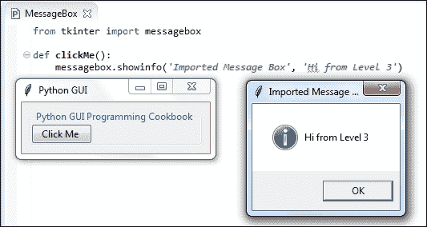
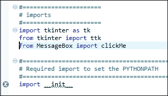

# 第十一章 最佳实践

在本章中，我们将探讨与我们的 Python 图形用户界面相关的最佳实践。

+   避免意大利面式代码

+   使用 `__init__` 连接模块

+   混合面向对象编程（OOP）和瀑布式开发

+   使用代码命名约定

+   何时不使用面向对象编程

+   如何成功使用设计模式

+   避免复杂性

# 简介

在本章中，我们将探讨不同的最佳实践，这些实践可以帮助我们以高效的方式构建我们的图形用户界面（GUI），并保持其可维护性和可扩展性。

这些最佳实践也将帮助我们调试我们的 GUI，使其达到我们想要的样子。

# 避免意大利面式代码

在这个菜谱中，我们将探讨创建 spaghetti 代码的典型方法，然后我们将看到一种避免此类代码的更好方法。

### 注意事项

意大利面代码是指功能相互交织在一起的代码。

## 准备就绪

我们将使用内置的 Python 库 tkinter 创建一个新且简单的 GUI。

## 如何做到这一点...

在网上搜索并阅读了文档之后，我们可能首先会编写以下代码来创建我们的图形用户界面：

```py
# Spaghetti Code #############################
def PRINTME(me):print(me)
import tkinter 
x=y=z=1
PRINTME(z) 
from tkinter import *
scrolW=30;scrolH=6
win=tkinter.Tk()
if x:chVarUn=tkinter.IntVar()
from tkinter import ttk
WE='WE'
import tkinter.scrolledtext
outputFrame=tkinter.ttk.LabelFrame(win,text=' Type into the scrolled text control: ')
scr=tkinter.scrolledtext.ScrolledText(outputFrame,width=scrolW,height=scrolH,wrap=tkinter.WORD)
e='E'
scr.grid(column=1,row=1,sticky=WE)
outputFrame.grid(column=0,row=2,sticky=e,padx=8)
lFrame=None
if y:chck2=tkinter.Checkbutton(lFrame,text="Enabled",variable=chVarUn)
wE='WE'
if y==x:PRINTME(x) 
lFrame=tkinter.ttk.LabelFrame(win,text="Spaghetti")
chck2.grid(column=1,row=4,sticky=tkinter.W,columnspan=3)  
PRINTME(z)
lFrame.grid(column=0,row=0,sticky=wE,padx=10,pady=10) 
chck2.select()
try: win.mainloop()
except:PRINTME(x)
chck2.deselect()
if y==x:PRINTME(x) 
# End Pasta #############################
```

运行前面的代码将产生以下图形用户界面：


这并不是我们想要的图形用户界面。我们希望它看起来更像是这样：


虽然这段意大利面代码创建了一个图形用户界面，但由于代码中存在很多混乱，这段代码非常难以调试。

以下为生成所需图形用户界面的代码：

```py
#======================
# imports
#======================
import tkinter as tk
from tkinter import ttk
from tkinter import scrolledtext

#======================
# Create instance
#======================
win = tk.Tk()   

#======================
# Add a title       
#====================== 
win.title("Python GUI")

#=========================
# Disable resizing the GUI
#=========================
win.resizable(0,0)

#=============================================================
# Adding a LabelFrame, Textbox (Entry) and Combobox  
#=============================================================
lFrame = ttk.LabelFrame(win, text="Python GUI Programming Cookbook")
lFrame.grid(column=0, row=0, sticky='WE', padx=10, pady=10)

#=============================================================
# Using a scrolled Text control    
#=============================================================
outputFrame = ttk.LabelFrame(win, text=' Type into the scrolled text control: ')
outputFrame.grid(column=0, row=2, sticky='E', padx=8)
scrolW  = 30
scrolH  =  6
scr = scrolledtext.ScrolledText(outputFrame, width=scrolW, height=scrolH, wrap=tk.WORD)
scr.grid(column=1, row=0, sticky='WE')

#=============================================================
# Creating a checkbutton
#=============================================================
chVarUn = tk.IntVar()
check2 = tk.Checkbutton(lFrame, text="Enabled", variable=chVarUn)
check2.deselect()
check2.grid(column=1, row=4, sticky=tk.W, columnspan=3) 

#======================
# Start GUI
#======================
win.mainloop()
```

## 它是如何工作的...

在这个菜谱中，我们比较了面条代码和良好代码。良好代码相对于面条代码具有许多优势。

它有清晰的注释部分。

意大利面代码：

```py
def PRINTME(me):print(me)
import tkinter 
x=y=z=1
PRINTME(z) 
from tkinter import *
```

好的代码：

```py
#======================
# imports
#======================
import tkinter as tk
from tkinter import ttk
```

它具有一种自然流动，遵循小部件在 GUI 主表单中的布局方式。

在面条代码中，底部的 LabelFrame 在顶部 LabelFrame 之前被创建，并且它与一个导入语句和一些小部件创建混合在一起。

意大利面代码：

```py
import tkinter.scrolledtext
outputFrame=tkinter.ttk.LabelFrame(win,text=' Type into the scrolled text control: ')
scr=tkinter.scrolledtext.ScrolledText(outputFrame,width=scrolW,height=scrolH,wrap=tkinter.WORD)
e='E'
scr.grid(column=1,row=1,sticky=WE)
outputFrame.grid(column=0,row=2,sticky=e,padx=8)
lFrame=None
if y:chck2=tkinter.Checkbutton(lFrame,text="Enabled",variable=chVarUn)
wE='WE'
if y==x:PRINTME(x) 
lFrame=tkinter.ttk.LabelFrame(win,text="Spaghetti")
```

好的代码：

```py
#=============================================================
# Adding a LabelFrame, Textbox (Entry) and Combobox  
#=============================================================
lFrame = ttk.LabelFrame(win, text="Python GUI Programming Cookbook")
lFrame.grid(column=0, row=0, sticky='WE', padx=10, pady=10)

#=============================================================
# Using a scrolled Text control    
#=============================================================
outputFrame = ttk.LabelFrame(win, text=' Type into the scrolled text control: ')
outputFrame.grid(column=0, row=2, sticky='E', padx=8)
```

它不包含不必要的变量赋值，也没有一个`print`函数，这个函数并不能完成阅读代码时人们期望它所做的调试工作。

意大利面代码：

```py
def PRINTME(me):print(me)
x=y=z=1
e='E'
WE='WE'
scr.grid(column=1,row=1,sticky=WE)
wE='WE'
if y==x:PRINTME(x) 
lFrame.grid(column=0,row=0,sticky=wE,padx=10,pady=10) 
PRINTME(z)
try: win.mainloop()
except:PRINTME(x)
chck2.deselect()
if y==x:PRINTME(x) 
```

好的代码：

没有以上任何一种。

`import` 语句仅导入所需的模块。它们不会在代码中造成混乱。没有重复的 `import` 语句。没有 `import *` 语句。

意大利面代码：

```py
import tkinter 1
x=y=z=1
PRINTME(z) 
from tkinter import *
scrolW=30;scrolH=6
win=tkinter.Tk()
if x:chVarUn=tkinter.IntVar()
from tkinter import ttk
WE='WE'
import tkinter.scrolledtext
```

好的代码：

```py
import tkinter as tk
from tkinter import ttk
from tkinter import scrolledtext
```

选择的变量名非常有意义。没有不必要的`if`语句使用数字`1`代替`True`。

意大利面代码：

```py
x=y=z=1
if x:chVarUn=tkinter.IntVar()
wE='WE'
```

好的代码：

```py
#=============================================================
# Using a scrolled Text control    
#=============================================================
outputFrame = ttk.LabelFrame(win, text=' Type into the scrolled text control: ')
outputFrame.grid(column=0, row=2, sticky='E', padx=8)
scrolW  = 30
scrolH  =  6
scr = scrolledtext.ScrolledText(outputFrame, width=scrolW, height=scrolH, wrap=tk.WORD)
scr.grid(column=1, row=0, sticky='WE')
```

我们没有丢失预期的窗口标题，并且我们的复选按钮最终位于正确的位置。我们还使围绕复选按钮的`LabelFrame`可见。

意大利面代码：

我们丢失了窗口标题，并且没有显示顶部的`LabelFrame`。检查按钮最终出现在了错误的位置。

优秀的代码：

```py
#======================
# Create instance
#======================
win = tk.Tk()   

#======================
# Add a title       
#====================== 
win.title("Python GUI")

#=============================================================
# Adding a LabelFrame, Textbox (Entry) and Combobox  
#=============================================================
lFrame = ttk.LabelFrame(win, text="Python GUI Programming Cookbook")
lFrame.grid(column=0, row=0, sticky='WE', padx=10, pady=10)

#=============================================================
# Creating a checkbutton
#=============================================================
chVarUn = tk.IntVar()
check2 = tk.Checkbutton(lFrame, text="Enabled", variable=chVarUn)
check2.deselect()
check2.grid(column=1, row=4, sticky=tk.W, columnspan=3) 

#======================
# Start GUI
#======================
win.mainloop()
```

# 使用 `__init__` 连接模块

当我们使用 Eclipse IDE 的 PyDev 插件创建一个新的 Python 项目时，它会自动创建一个 `__init__.py` 模块。如果我们不使用 Eclipse，我们也可以手动创建它。

### 注意事项

`__init__.py` 模块通常为空，其大小为 0 千字节。

我们可以使用这个通常为空的模块，通过向其中输入代码来连接不同的 Python 模块。本食谱将展示如何进行这一操作。

## 准备就绪

我们将创建一个与之前菜谱中创建的类似的新的图形用户界面。

## 如何做到这一点...

随着我们的项目规模越来越大，我们自然会将其拆分成几个 Python 模块。使用像 Eclipse 这样的现代 IDE，查找位于不同子文件夹中、要么在需要导入它的代码之上要么之下的模块，竟然出奇地复杂。

克服这一限制的一个实用方法是使用`__init__.py`模块。

### 注意事项

在 Eclipse 中，我们可以将 Eclipse 内部项目环境设置为特定的文件夹，我们的 Python 代码将会找到它。但 outside of Eclipse，例如从命令窗口运行时，Python 模块导入机制有时会出现不匹配，导致代码无法运行。

这里是空的 `__init__.py` 模块的截图，当在 Eclipse 代码编辑器中打开时，它显示的不是 `__init__` 这个名字，而是它所属的 PyDev 包的名字。"1" 位于代码编辑器的左侧是行号，而不是在这个模块中编写的任何代码。这个空的 `__init__.py` 模块中绝对没有任何代码。


此文件为空，但它确实存在。


当我们运行以下代码并点击`clickMe 按钮`，我们会得到代码下方显示的结果。这是一个尚未使用`__init__.py`模块的常规 Python 模块。

### 注意事项

`__init__.py` 模块与 Python 类的 `__init__(self)` 方法并不相同。

```py
#  Ch11_GUI__init.py
#======================
# imports
#======================
import tkinter as tk
from tkinter import ttk

#======================
# Create instance
#======================
win = tk.Tk()   

#======================
# Add a title       
#====================== 
win.title("Python GUI")

#=============================================================
# Adding a LabelFrame and a Button
#=============================================================
lFrame = ttk.LabelFrame(win, text="Python GUI Programming Cookbook")
lFrame.grid(column=0, row=0, sticky='WE', padx=10, pady=10)

def clickMe():
    from tkinter import messagebox
    messagebox.showinfo('Message Box', 'Hi from same Level.')

button = ttk.Button(lFrame, text="Click Me ", command=clickMe)
button.grid(column=1, row=0, sticky=tk.S)  

#======================
# Start GUI
#======================
win.mainloop()
```


在前面的代码中，我们创建了以下函数，该函数导入 Python 的消息框，然后使用它来显示消息框窗口：

```py
def clickMe():
    from tkinter import messagebox
    messagebox.showinfo('Message Box', 'Hi from same Level.')
```

当我们将`clickMe()`消息框代码移动到嵌套的目录文件夹中，并尝试将其`导入`到我们的 GUI 模块时，我们遇到了一些问题。

我们在 Python 模块所在的下方创建了三个子文件夹。然后我们将`clickMe()`消息框代码放入了一个新的 Python 模块中，我们将其命名为`MessageBox.py`。这个模块位于`Folder3`中，距离我们的 Python 模块有三层。

我们需要导入这个`MessageBox.py`模块，以便使用该模块包含的`clickMe()`函数。

首先，它似乎可以正常工作，因为我们从 Eclipse IDE 没有收到任何错误或警告，看起来我们可以像导入其他模块一样导入这个新的嵌套模块。

我们正在使用 Python 的相对导入语法：

```py
from .Folder1.Folder2.Folder3.MessageBox import clickme
```

这可以在以下屏幕截图中看到：


我们已经删除了本地的`clickMe()`函数，现在我们的回调应该使用导入的`clickMe()`函数，但它并没有按预期工作。当我们运行代码时，没有得到预期的弹出窗口，而是出现了一个导入系统错误：


我们可以通过访问 PyDev 项目的属性，并将我们自己的新函数所在的子文件夹添加为外部库，在 Eclipse 中将其添加为外部库。这看起来可能不太直观，但它确实有效。


当我们现在注释掉文件夹结构，而是直接从嵌套了三层的模块中导入函数时，代码按预期工作。

```py
#======================
# imports
#======================
import tkinter as tk
from tkinter import ttk
# from .Folder1.Folder2.Folder3.MessageBox import clickMe
from MessageBox import clickMe
```

此函数在消息框中显示不同的文本：



实现相同结果的一个更好的方法是使用 Python 内置的 `__init__.py` 模块。

删除了之前特定的 Eclipse 外部库依赖后，我们现在可以直接使用此模块。

### 注意事项

我们将代码放入此模块，如果我们在程序中导入`__init__.py`模块，那么在 Python 3.4.3 版本中，这段代码将先于我们其他所有代码执行。

忽略 PyDev 未解析导入（带叉号的红色圆圈）错误。这个 `import` 是必要的；它使我们的代码运行，并使整个 Python 导入机制正常工作。



在将`__init__.py`模块导入到我们的程序之后，我们就可以使用它了。第一个测试它是否工作的是在这个模块中编写一个打印语句。


通过添加以下代码，我们可以通过编程方式找出我们的位置：


现在，我们可以在本地的`__init__.py`模块中初始化 Python 搜索路径，只需将以下代码添加到相同的`__init__.py`模块中：

```py
print('hi from GUI init\n')
from sys import path
from pprint import pprint
#=======================================================
# Required setup for the PYTONPATH in order to find
# all package folders
#=======================================================
from site import addsitedir
from os import getcwd, chdir, pardir
for _ in range(10):
    curFull = getcwd()
    curDir = curFull.split('\\')[-1] 
    if 'B04829_Ch11_Code' == curDir:
        addsitedir(curFull)
        addsitedir(curFull + '\\Folder1\\Folder2\\Folder3\\')
        break
    chdir(pardir)
pprint(path)
```

当我们现在运行我们的 GUI 代码时，我们得到相同的预期窗口，但我们已经移除了对 Eclipse `PYTHONPATH`变量的依赖。

现在我们可以在 Eclipse PyDev 插件之外成功运行相同的代码。

### 注意

我们的代码变得更加 Pythonic。

## 它是如何工作的...

在这个菜谱中，我们发现了一个使用免费随 Eclipse IDE 提供的出色且免费的 PyDev 插件的局限性。

我们首先在 Eclipse IDE 中找到了一种解决方案，然后通过变得 Pythonic，我们摆脱了这一 IDE 的依赖。

### 注意事项

使用纯 Python 通常是最佳选择。

# 混合面向对象编程（OOP）和瀑布式开发

Python 是一种面向对象的编程语言，但并不总是使用面向对象编程（OOP）有意义。对于简单的脚本任务，传统的瀑布式编码风格仍然适用。

在这个菜谱中，我们将创建一个新的图形用户界面（GUI），它结合了传统的逐行编码风格和更现代的面向对象编程（OOP）风格。

我们将创建一个面向对象的类，当我们将鼠标悬停在用瀑布式创建的 Python GUI 中的小部件上时，它将显示一个工具提示。

### 注意事项

下降式和瀑布式编码风格是相同的。这意味着我们必须在物理上将代码放置在代码之上，然后才能从下面的代码中调用它。在这个范式下，当我们执行代码时，代码实际上是从程序顶部逐行下降到程序底部的。

## 准备就绪

在这个菜谱中，我们将使用 tkinter 创建一个 GUI，这与本书第一章中创建的 GUI 类似。

## 如何做到这一点...

在 Python 中，我们可以通过使用`self`关键字将函数绑定到类中，将其转换为方法。这是 Python 真正美妙的功能之一，它使我们能够创建可理解和可维护的大型系统。

有时候，当我们只编写简短的脚本时，面向对象编程（OOP）并不适用，因为我们发现自己需要在很多变量前加上`self`关键字，而当代码不需要这样大时，它就会变得不必要地庞大。

让我们先使用 tkinter 创建一个 Python GUI，并以瀑布式进行编码。

以下代码创建 GUI：

```py
#======================
# imports
#======================
import tkinter as tk
from tkinter import ttk
from tkinter import messagebox

#======================
# Create instance
#======================
win = tk.Tk()   

#======================
# Add a title       
#====================== 
win.title("Python GUI")

#=========================
# Disable resizing the GUI
#=========================
win.resizable(0,0)

#=============================================================
# Adding a LabelFrame, Textbox (Entry) and Combobox  
#=============================================================
lFrame = ttk.LabelFrame(win, text="Python GUI Programming Cookbook")
lFrame.grid(column=0, row=0, sticky='WE', padx=10, pady=10)

#=============================================================
# Labels
#=============================================================
ttk.Label(lFrame, text="Enter a name:").grid(column=0, row=0)
ttk.Label(lFrame, text="Choose a number:").grid(column=1, row=0, sticky=tk.W)

#=============================================================
# Buttons click command
#=============================================================
def clickMe(name, number):
    messagebox.showinfo('Information Message Box', 'Hello '+name+
                        ', your number is: ' + number)

#=============================================================
# Creating several controls in a loop
#=============================================================
names         = ['name0', 'name1', 'name2']
nameEntries   = ['nameEntry0', 'nameEntry1', 'nameEntry2']

numbers       = ['number0', 'number1', 'number2']
numberEntries = ['numberEntry0', 'numberEntry1', 'numberEntry2']

buttons = []

for idx in range(3):
    names[idx] = tk.StringVar()
    nameEntries[idx] = ttk.Entry(lFrame, width=12, textvariable=names[idx])
    nameEntries[idx].grid(column=0, row=idx+1)
    nameEntries[idx].delete(0, tk.END)
    nameEntries[idx].insert(0, '<name>')

    numbers[idx] = tk.StringVar()
    numberEntries[idx] = ttk.Combobox(lFrame, width=14, textvariable=numbers[idx])
    numberEntries[idx]['values'] = (1+idx, 2+idx, 4+idx, 42+idx, 100+idx)
    numberEntries[idx].grid(column=1, row=idx+1)
    numberEntries[idx].current(0)

    button = ttk.Button(lFrame, text="Click Me "+str(idx+1), command=lambda idx=idx: clickMe(names[idx].get(), numbers[idx].get()))
    button.grid(column=2, row=idx+1, sticky=tk.W)  
    buttons.append(button)
#======================
# Start GUI
#======================
win.mainloop()
```

当我们运行代码时，我们会得到图形用户界面，它看起来是这样的：


我们可以通过添加工具提示来改进我们的 Python 图形用户界面。实现这一点的最佳方式是将创建工具提示功能的代码从我们的 GUI 中分离出来。

我们通过创建一个具有提示功能的不同类来实现这一点，然后我们在创建我们 GUI 的同一 Python 模块中创建这个类的实例。

使用 Python，我们无需将我们的`ToolTip`类放入一个单独的模块中。我们只需将它放置在过程代码之上，然后从该代码下方调用它。

代码现在看起来是这样的：

```py
#======================
# imports
#======================
import tkinter as tk
from tkinter import ttk
from tkinter import messagebox

#-----------------------------------------------
class ToolTip(object):
    def __init__(self, widget):
        self.widget = widget
        self.tipwindow = None
        self.id = None
        self.x = self.y = 0

#-----------------------------------------------
def createToolTip(widget, text):
    toolTip = ToolTip(widget)
    def enter(event): toolTip.showtip(text)
    def leave(event): toolTip.hidetip()
    widget.bind('<Enter>', enter)
    widget.bind('<Leave>', leave)

#-----------------------------------------------
# further down the module we call the createToolTip function
#-----------------------------------------------

for idx in range(3):
    names[idx] = tk.StringVar()
    nameEntries[idx] = ttk.Entry(
lFrame, width=12, textvariable=names[idx])
    nameEntries[idx].grid(column=0, row=idx+1)
    nameEntries[idx].delete(0, tk.END)
    nameEntries[idx].insert(0, '<name>')

    numbers[idx] = tk.StringVar()
    numberEntries[idx] = ttk.Combobox(
lFrame, width=14, textvariable=numbers[idx])
    numberEntries[idx]['values'] = (
1+idx, 2+idx, 4+idx, 42+idx, 100+idx)
    numberEntries[idx].grid(column=1, row=idx+1)
    numberEntries[idx].current(0)

    button = ttk.Button(
lFrame, text="Click Me "+str(idx+1), command=lambda idx=idx: clickMe(names[idx].get(), numbers[idx].get()))
    button.grid(column=2, row=idx+1, sticky=tk.W)  
    buttons.append(button)

#-----------------------------------------------
    # Add Tooltips to more widgets
    createToolTip(nameEntries[idx], 'This is an Entry widget.') 
    createToolTip(
numberEntries[idx], 'This is a DropDown widget.') 
    createToolTip(buttons[idx], 'This is a Button widget.')
#-----------------------------------------------
```

运行代码会在我们鼠标悬停在组件上时为我们的组件创建工具提示。


## 它是如何工作的...

在这个菜谱中，我们以过程式的方式创建了一个 Python GUI，后来，我们在模块顶部添加了一个类。

我们可以非常容易地在同一个 Python 模块中混合使用过程式和面向对象编程。

# 使用代码命名约定

本书之前提供的食谱尚未使用结构化的代码命名约定。本食谱将向您展示遵循代码命名方案的价值，因为它有助于我们找到想要扩展的代码，同时也提醒我们关于程序设计的考虑。

## 准备就绪

在这个菜谱中，我们将查看本书第一章中的 Python 模块名称，并将它们与更好的命名约定进行比较。

## 如何做到这一点...

在本书的第一章中，我们创建了我们的第一个 Python 图形用户界面。我们通过递增不同的代码模块名称的序号来改进我们的 GUI。

它看起来是这样的：


虽然这是一种典型的编码方式，但它并没有提供太多意义。当我们开发时编写 Python 代码，很容易增加数字。

后来，当我们回到这段代码时，我们并不清楚哪个 Python 模块提供了哪些功能，有时，我们最近更新的模块并不如早期版本好。

### 注意

明确的命名规范确实有帮助。

我们可以将第一章中的模块名称*创建 GUI 表单和添加小部件*与第八章中的名称*国际化与测试*进行比较，后者要更有意义。


虽然并不完美，但为不同的 Python 模块选定的名称表明了每个模块的责任所在。当我们想要添加更多单元测试时，可以清楚地知道它们位于哪个模块中。

以下是如何使用代码命名规范在 Python 中创建 GUI 的另一个示例：


### 注意

将单词 `PRODUCT` 替换为你目前正在工作的产品名称。

整个应用程序是一个图形用户界面。所有部分都是相互连接的。`DEBUG.py`模块仅用于调试我们的代码。与所有其他模块相比，调用 GUI 的主要函数名称是反向的。它以`Gui`开头，以`.pyw`扩展名结尾。

这是唯一具有此扩展名的 Python 模块。

从这个命名规范来看，如果你对 Python 足够熟悉，那么很明显，为了运行这个图形用户界面，你需要双击 `Gui_PRODUCT.pyw` 模块。

所有其他 Python 模块都包含向 GUI 提供功能以及执行底层业务逻辑以实现 GUI 所针对目的的功能。

## 它是如何工作的...

Python 代码模块的命名规范对我们保持高效和记住原始设计非常有帮助。当我们需要调试和修复缺陷或添加新功能时，它们是我们首先查阅的资源。

### 注意事项

通过数字递增模块名称并不十分有意义，最终还会浪费开发时间。

另一方面，Python 变量的命名更偏向自由形式。Python 会推断类型，因此我们不必指定一个变量将是 `<list>` 类型（它可能不是，或者实际上，在代码的后续部分，它可能变成另一种类型）。

变量命名的良好建议是使它们具有描述性，同时也不宜过度缩写。

如果我们想要指出某个变量被设计为类型`<list>`，那么使用完整的单词`list`而不是`lst`会更加直观。

对于`number`和`num`来说，情况类似。

虽然给变量起非常描述性的名字是个好主意，但有时名字可能会变得过长。在苹果的 Objective-C 语言中，一些变量和函数的名字非常极端：`thisIsAMethodThatDoesThisAndThatAndAlsoThatIfYouPassInNIntegers:1:2:3`

### 注意

在命名变量、方法和函数时，请使用常识。

# 何时不使用面向对象编程（OOP）

Python 自带面向对象编程的能力，但与此同时，我们也可以编写不需要使用 OOP 的脚本。

对于某些任务，面向对象编程（OOP）并不适用。

这个菜谱将展示何时不使用面向对象编程（OOP）。

## 准备就绪

在这个菜谱中，我们将创建一个类似于之前菜谱的 Python GUI。我们将比较面向对象（OOP）代码与非面向对象编程的替代方式。

## 如何做到这一点...

让我们先使用**面向对象**的方法创建一个新的 GUI。下面的代码将创建显示在代码下面的 GUI：

```py
import tkinter as tk
from tkinter import ttk
from tkinter import scrolledtext
from tkinter import Menu

class OOP():
    def __init__(self): 
        self.win = tk.Tk()         
        self.win.title("Python GUI")      
        self.createWidgets()

    def createWidgets(self):    
        tabControl = ttk.Notebook(self.win)     
        tab1 = ttk.Frame(tabControl)            
        tabControl.add(tab1, text='Tab 1')    
        tabControl.pack(expand=1, fill="both")  
        self.monty = ttk.LabelFrame(tab1, text=' Monty Python ')
        self.monty.grid(column=0, row=0, padx=8, pady=4)        

        ttk.Label(self.monty, text="Enter a name:").grid(
column=0, row=0, sticky='W')
        self.name = tk.StringVar()
        nameEntered = ttk.Entry(
self.monty, width=12, textvariable=self.name)
        nameEntered.grid(column=0, row=1, sticky='W')

        self.action = ttk.Button(self.monty, text="Click Me!")   
        self.action.grid(column=2, row=1)

        ttk.Label(self.monty, 
text="Choose a number:").grid(column=1, row=0)
        number = tk.StringVar()
        numberChosen = ttk.Combobox(self.monty, 
width=12, textvariable=number)
        numberChosen['values'] = (42)
        numberChosen.grid(column=1, row=1)
        numberChosen.current(0)

        scrolW = 30; scrolH = 3
        self.scr = scrolledtext.ScrolledText(
self.monty, width=scrolW, height=scrolH, wrap=tk.WORD)
        self.scr.grid(column=0, row=3, sticky='WE', columnspan=3)

        menuBar = Menu(tab1)
        self.win.config(menu=menuBar)
        fileMenu = Menu(menuBar, tearoff=0)
        menuBar.add_cascade(label="File", menu=fileMenu)
        helpMenu = Menu(menuBar, tearoff=0)
        menuBar.add_cascade(label="Help", menu=helpMenu)

        nameEntered.focus()     
#==========================
oop = OOP()
oop.win.mainloop()
```


我们可以通过稍微重构我们的代码，在不使用面向对象编程（OOP）方法的情况下实现相同的图形用户界面（GUI）。首先，我们移除`OOP`类及其`__init__`方法。

接下来，我们将所有方法移动到左侧，并移除`self`类引用，这样它们就变成了未绑定函数。

我们还移除了之前代码中所有的`self`引用。然后，我们将`createWidgets`函数调用移至函数声明之下。我们将其放置在`mainloop`调用之上。

最后，我们实现了相同的 GUI，但没有使用面向对象编程（OOP）。

重构后的代码如下所示：

```py
import tkinter as tk
from tkinter import ttk
from tkinter import scrolledtext
from tkinter import Menu   

def createWidgets():    
    tabControl = ttk.Notebook(win)     
    tab1 = ttk.Frame(tabControl)            
    tabControl.add(tab1, text='Tab 1')    
    tabControl.pack(expand=1, fill="both")  
    monty = ttk.LabelFrame(tab1, text=' Monty Python ')
    monty.grid(column=0, row=0, padx=8, pady=4)        

    ttk.Label(monty, text="Enter a name:").grid(
column=0, row=0, sticky='W')
    name = tk.StringVar()
    nameEntered = ttk.Entry(monty, width=12, textvariable=name)
    nameEntered.grid(column=0, row=1, sticky='W')

    action = ttk.Button(monty, text="Click Me!")   
    action.grid(column=2, row=1)

    ttk.Label(monty, text="Choose a number:").grid(
column=1, row=0)
    number = tk.StringVar()
    numberChosen = ttk.Combobox(
monty, width=12, textvariable=number)
    numberChosen['values'] = (42)
    numberChosen.grid(column=1, row=1)
    numberChosen.current(0)

    scrolW = 30; scrolH = 3
    scr = scrolledtext.ScrolledText(
monty, width=scrolW, height=scrolH, wrap=tk.WORD)
    scr.grid(column=0, row=3, sticky='WE', columnspan=3)

    menuBar = Menu(tab1)
    win.config(menu=menuBar)
    fileMenu = Menu(menuBar, tearoff=0)
    menuBar.add_cascade(label="File", menu=fileMenu)
    helpMenu = Menu(menuBar, tearoff=0)
    menuBar.add_cascade(label="Help", menu=helpMenu)

    nameEntered.focus()     
#======================
win = tk.Tk()         
win.title("Python GUI")   
createWidgets()
win.mainloop()
```

## 它是如何工作的...

Python 使我们能够在合理的情况下使用面向对象编程（OOP）。其他语言如 Java 和 C#则强制我们始终使用面向对象编程的编码方法。在本食谱中，我们探讨了一种不适合使用面向对象编程的情况。

### 注意事项

如果代码库不断增长，面向对象（OOP）方法将更具可扩展性，但如果确定只需要这一种代码，那么就没有必要采用面向对象（OOP）方法。

# 如何成功使用设计模式

在这个菜谱中，我们将通过使用工厂设计模式来创建我们的 Python GUI 小部件。

在之前的菜谱中，我们手动逐个创建小部件，或者通过循环动态创建。

使用工厂设计模式，我们将使用工厂来创建我们的小部件。

## 准备就绪

我们将创建一个具有三个按钮的 Python 图形用户界面，每个按钮都有不同的样式。

## 如何做到这一点...

在我们的 Python GUI 模块顶部，紧接在导入语句下方，我们创建了几个类：

```py
import tkinter as tk
from tkinter import ttk
from tkinter import scrolledtext
from tkinter import Menu

class ButtonFactory():
    def createButton(self, type_):
        return buttonTypes[type_]()

class ButtonBase():     
    relief     ='flat'
    foreground ='white'
    def getButtonConfig(self):
        return self.relief, self.foreground

class ButtonRidge(ButtonBase):
    relief     ='ridge'
    foreground ='red'        

class ButtonSunken(ButtonBase):
    relief     ='sunken'
    foreground ='blue'        

class ButtonGroove(ButtonBase):
    relief     ='groove'
    foreground ='green'        

buttonTypes = [ButtonRidge, ButtonSunken, ButtonGroove] 

class OOP():
    def __init__(self): 
        self.win = tk.Tk()         
        self.win.title("Python GUI")      
        self.createWidgets()
```

我们创建了一个基类，我们的不同按钮样式类都继承自这个基类，并且每个子类都覆盖了`relief`和`foreground`配置属性。所有子类都从该基类继承`getButtonConfig`方法。此方法返回一个元组。

我们还创建了一个按钮工厂类和一个列表，用于存储我们按钮子类的名称。我们将这个列表命名为`buttonTypes`，因为我们的工厂将创建不同类型的按钮。

在模块的下方，我们使用相同的`buttonTypes`列表创建按钮小部件。

```py
    def createButtons(self):

        factory = ButtonFactory()

        # Button 1
        rel = factory.createButton(0).getButtonConfig()[0]
        fg  = factory.createButton(0).getButtonConfig()[1]
        action = tk.Button(self.monty, 
text="Button "+str(0+1), relief=rel, foreground=fg)   
        action.grid(column=0, row=1)  

        # Button 2
        rel = factory.createButton(1).getButtonConfig()[0]
        fg  = factory.createButton(1).getButtonConfig()[1]
        action = tk.Button(self.monty, 
text="Button "+str(1+1), relief=rel, foreground=fg)   
        action.grid(column=1, row=1)  

        # Button 3
        rel = factory.createButton(2).getButtonConfig()[0]
        fg  = factory.createButton(2).getButtonConfig()[1]
        action = tk.Button(self.monty, 
text="Button "+str(2+1), relief=rel, foreground=fg)   
       action.grid(column=2, row=1)   
```

首先，我们创建一个按钮工厂的实例，然后我们使用我们的工厂来创建我们的按钮。

### 注意事项

`buttonTypes` 列表中的项是我们子类的名称。

我们调用`createButton`方法，然后立即调用基类的`getButtonConfig`方法，并使用点符号获取配置属性。

当我们运行整个代码时，我们得到以下 Python tkinter 图形用户界面：


我们可以看到，我们的 Python GUI 工厂确实创建了不同的按钮，每个按钮都有不同的样式。它们在文字颜色和浮雕属性上有所不同。

## 它是如何工作的...

在这个示例中，我们使用了工厂设计模式来创建具有不同样式的几个小部件。我们可以轻松地使用这种设计模式来创建整个 GUI。

设计模式是我们软件开发工具箱中一个非常激动人心的工具。

# 避免复杂性

在这个菜谱中，我们将扩展我们的 Python 图形用户界面，并学习处理软件开发工作中不断增长的复杂性的方法。

我们的合作者和客户都喜欢我们用 Python 创建的图形用户界面，并不断要求添加更多功能到我们的 GUI 中。

这增加了复杂性，并且很容易毁掉我们原本良好的设计。

## 准备就绪

我们将创建一个新的 Python GUI，类似于之前食谱中的那些，并且将以小部件的形式添加许多新功能。

## 如何做到这一点...

我们将从一个具有两个标签页的 Python 图形用户界面开始，其外观如下：


我们收到的第一个新功能请求是向**Tab 1**添加功能，该功能清除`scrolledtext`小部件。

简单得很。我们只需在**标签 1**中添加另一个按钮。

```py
        # Adding another Button
        self.action = ttk.Button(.
self.monty, text="Clear Text", command=self.clearScrol)   
        self.action.grid(column=2, row=2)
```

我们还必须创建回调方法以添加所需的功能，我们将在类的顶部定义该方法，并在创建我们的小部件的方法之外定义它。

```py
    # Button callback
    def clickMe(self):
        self.action.configure(text='Hello ' + self.name.get())

    # Button callback Clear Text   
    def clearScrol(self):
        self.scr.delete('1.0', tk.END)
```

现在我们的 GUI 有一个新的按钮，当我们点击它时，我们将`ScrolledText`小部件的文本清空。


为了添加这个功能，我们不得不在同一个 Python 模块的两个地方添加代码。

我们在`createWidgets`方法（未显示）中插入了新的按钮，然后创建了一个新的回调方法，当我们的新按钮被点击时，它会调用这个方法。我们将这段代码放置在第一个按钮的回调方法下方。

我们下一个功能请求是添加更多功能。业务逻辑封装在另一个 Python 模块中。我们通过在**Tab 1**中添加三个更多按钮来调用这个新功能。我们使用循环来完成这个操作。

```py
        # Adding more Feature Buttons
        for idx in range(3):
            b = ttk.Button(
self.monty, text="Feature" + str(idx+1))   
            b.grid(column=idx, row=4)
```

我们的用户界面现在看起来是这样的：


接下来，我们的客户要求更多功能，我们采用同样的方法。我们的图形用户界面现在看起来如下：


### 注意

这还不错。当我们收到关于另外 50 个新功能的新的功能请求时，我们开始怀疑我们的方法是否仍然是最佳使用方法……

处理我们 GUI 必须处理的日益增加的复杂性的一个方法是通过添加标签页。通过添加更多标签页并将相关功能放入各自的标签页中，我们能够掌控复杂性，并使我们的 GUI 更加直观。

这里是创建我们新的**Tab 3**的代码，在其下方是我们的新 Python GUI：

```py
# Tab Control 3  -----------------------------------------
        tab3 = ttk.Frame(tabControl)          # Add a tab
        tabControl.add(tab3, text='Tab 3')    # Make tab visible

        monty3 = ttk.LabelFrame(tab3, text=' New Features ')
        monty3.grid(column=0, row=0, padx=8, pady=4)

        # Adding more Feature Buttons
        startRow = 4
        for idx in range(24):
            if idx < 2:
                colIdx = idx
                col = colIdx
            else:
                col += 1
            if not idx % 3: 
                startRow += 1
                col = 0

            b = ttk.Button(monty3, text="Feature " + str(idx+1))
            b.grid(column=col, row=startRow)    

        # Add some space around each label
        for child in monty3.winfo_children(): 
            child.grid_configure(padx=8)
```


## 它是如何工作的...

在这个菜谱中，我们向我们的 GUI 添加了几个新的小部件，以便为我们的 Python GUI 添加更多功能。我们看到了随着越来越多的新功能请求，我们的精美 GUI 设计很容易陷入一种状态，使得如何使用 GUI 变得不那么清晰。

### 注意事项

突然，小玩意儿们统治了世界…

我们看到了如何通过模块化我们的 GUI 来处理复杂性，即将大型功能拆分成更小的部分，并使用标签将它们安排在功能相关区域。

虽然复杂性有许多方面，但模块化和重构代码通常是处理软件代码复杂性的一个非常有效的方法。

### 注意事项

在编程中，有时我们会遇到一道墙，陷入困境。我们不断地撞击这堵墙，但没有任何进展。

有时候我们感觉好像想要放弃。

然而，奇迹确实会发生……

如果我们持续不断地撞击这堵墙，在某个时刻，墙将会倒塌，道路就会畅通。

在那个时刻，我们可以在软件宇宙中留下积极的印记。
