# 第一章. 使用 Raspberry Pi 计算机入门

在本章中，我们将涵盖以下菜谱：

+   连接 Raspberry Pi

+   使用 NOOBS 设置你的 Raspberry Pi SD 卡

+   通过 LAN 连接器将你的 Raspberry Pi 连接到互联网进行网络连接

+   在 Raspberry Pi 上使用内置的 Wi-Fi 和蓝牙

+   手动配置你的网络

+   直接连接到笔记本电脑或计算机

+   通过 USB Wi-Fi 拨号连接将你的 Raspberry Pi 连接到互联网

+   通过代理服务器连接到互联网

+   通过 VNC 在网络上远程连接到 Raspberry Pi

+   通过 SSH（和 X11 转发）在网络上远程连接到 Raspberry Pi

+   使用 SMB 与 Raspberry Pi 的家目录共享

+   保持 Raspberry Pi 更新

# 简介

本章介绍了 Raspberry Pi 以及首次设置的过程。我们将连接 Raspberry Pi 到合适的显示器、电源和外设。我们将在 SD 卡上安装操作系统。这是系统启动所必需的。接下来，我们将确保我们能够通过本地网络成功连接到互联网。

最后，我们将利用网络提供远程连接到和/或控制 Raspberry Pi 的方法，以及确保系统保持更新。

一旦你完成了本章中的步骤，你的 Raspberry Pi 就可以用于编程了。如果你已经设置了你的 Raspberry Pi 并正在运行，请确保你浏览以下部分，因为这里有许多有用的提示。

## 介绍 Raspberry Pi

Raspberry Pi 是由 **Raspberry Pi 基金会**创建的单板电脑，该基金会是一个慈善机构，其主要目的是将低级计算机技能重新引入英国的儿童。目标是重新点燃 20 世纪 80 年代的微型计算机革命，这场革命产生了一代熟练的程序员。

即使在 2012 年 2 月底发布电脑之前，很明显 Raspberry Pi 已经在全球范围内获得了巨大的关注，并且在撰写本书时，销量已超过 1000 万台。以下图片显示了几个不同的 Raspberry Pi 型号：

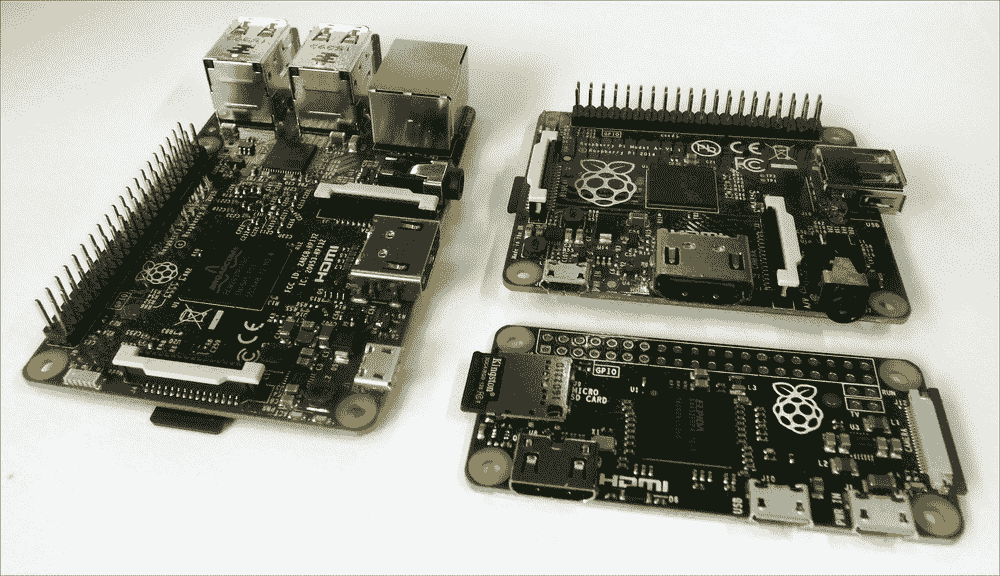

Raspberry Pi Model 3B、Model A+ 和 Pi Zero

## 这个名字有什么含义？

Raspberry Pi 这个名字是创建一个基于水果的替代电脑（如苹果、黑莓和杏）的愿望与对原始概念的一种致敬，即一个可以用 **Python**（简称 **Pi**）编程的简单电脑。

在这本书中，我们将探讨这个小电脑，找出如何设置它，然后使用 Python 编程语言逐章探索其功能。

## 为什么选择 Python？

人们经常问，“为什么选择 Python 作为 Raspberry Pi 上的编程语言？”事实是，Python 只是可以在 Raspberry Pi 上使用的许多编程语言之一。

你可以选择许多编程语言，从高级图形块编程，如**Scratch**，到传统的**C**，再到**BASIC**，甚至原始的**机器代码汇编器**。一个好的程序员通常必须成为代码多语言者，以便能够发挥每种语言的优势和劣势，以最好地满足他们期望的应用需求。了解不同的语言（和编程技术）如何尝试克服将“你想要的”转换为“你得到的”的挑战是有用的，因为这也是你在编程时试图做到的事情。

Python 被选为学习编程的好起点，因为它提供了一套丰富的编码工具，同时仍然允许编写简单的程序而无需烦恼。这使得初学者可以逐渐接触现代编程语言所基于的概念和方法，而无需一开始就了解所有内容。它非常模块化，有许多额外的库可以导入，以快速扩展功能。你会发现随着时间的推移，这会鼓励你做同样的事情，你将想要创建自己的模块，可以将它们插入到自己的程序中，从而迈出结构化编程的第一步。

与所有编程语言一样，Python 并不完美；例如，在行首添加空格通常会破坏你的代码（在 Python 中，缩进非常重要；它们定义了代码块是如何组合在一起的）。一般来说，Python 运行速度较慢；由于它是解释的，它在运行程序时需要时间来创建模块。如果你需要响应时间敏感的事件，这可能会成为一个问题。然而，你可以预编译 Python 或使用用其他语言编写的模块来克服这个问题。它隐藏了细节；这既是优点也是缺点。它非常适合初学者，但在你必须猜测数据类型等细节时可能会很困难。然而，这反过来又迫使你考虑所有可能性，这可能是好事。

## Python 2 和 Python 3

对于初学者来说，一个巨大的困惑来源是，Raspberry Pi 上有两个版本的 Python（**版本 2.7**和**版本 3.4**），它们之间不兼容，因此为 Python 2.7 编写的代码可能无法在 Python 3.4 上运行（反之亦然）。

**Python 软件基金会**一直在努力改进和推动语言的发展，这有时意味着他们不得不牺牲向后兼容性，以便拥抱新的改进（并且重要的是，移除冗余和过时的做事方式）。

### 注意

**支持 Python 2 或 Python 3**

有许多工具可以帮助从 Python 2 过渡到 Python 3，包括像`2to3`这样的转换器，它将解析并更新你的代码以使用 Python 3 的方法。这个过程并不完美，在某些情况下，你可能需要手动重写部分代码并完全重新测试一切。你可以编写同时支持两者的代码和库。`import __future__`语句允许你导入 Python 3 的友好方法，并使用 Python 2.7 运行它们。

## 应该使用哪个版本的 Python？

实际上，选择使用哪个版本将取决于你的意图。例如，你可能需要 Python 2.7 库，这些库在 Python 3.4 中尚未提供。Python 3 自 2008 年以来一直可用，因此这些通常是较旧或较大的库，尚未被翻译。在许多情况下，有新的替代方案可以替代旧库；然而，它们的支持可能各不相同。

在这本书中，我们使用了 Python 3.4，它也与 Python 3.3 和 3.2 兼容。

## 树莓派家族——Pi 的简要历史

自从发布以来，树莓派经历了各种迭代，包括对原始树莓派 Model B 单元的小型和大型的更新和改进。虽然一开始可能会让人困惑，但目前有三种基本的树莓派型号（以及一个特殊型号）。

主要的旗舰型号被称为**Model B**。它拥有所有的连接和功能，以及最大的 RAM 和最新的处理器。多年来，已经推出了几个版本，最值得注意的是 Model B（最初有 256 MB RAM，后来增加到 512 MB RAM）和 Model B+（将 26 针 GPIO 增加到 40 针，改为使用 micro SD 卡槽，并且有四个 USB 端口而不是两个）。这些原始型号都使用了 Broadcom BCM2835 SOC（系统级芯片的简称），由一个 700 MHz 的 ARM11 核心和 VideoCore IV GPU（图形处理单元的简称）组成。

2015 年发布的树莓派 2B 型（也称为 2B）引入了新的 Broadcom BCM2836 系统级芯片（SOC），提供了一款四核 32 位 ARM Cortex A7 1.2 GHz 处理器和 GPU，以及 1 GB 的 RAM。改进的 SOC 增加了对 Ubuntu 和 Windows 10 IoT 的支持。最后我们有了最新的树莓派 3B 型，它使用了另一个新的 Broadcom BCM2837 SOC，提供了一款四核 64 位 ARM Cortex-A53 和 GPU，同时还增加了板载 Wi-Fi 和蓝牙。

**Model A**一直被定位为一个简化版本。虽然与 Model B 具有相同的 SOC，但连接有限，仅有一个 USB 端口和没有有线网络（LAN）。Model A+再次增加了更多的 GPIO 引脚和 micro SD 插槽。然而，RAM 后来升级到 512 MB，并且仍然只有一个 USB 端口/没有 LAN。Model A 上的 Broadcom BCM2835 SOC 尚未更新（因此仍然是单核 ARM11）；然而，预计 2016/2017 年将推出 Model 3A（很可能是使用 BCM2837）。

**Pi Zero**是 Raspberry Pi 的超紧凑版本，旨在用于成本和空间至关重要的嵌入式应用。它具有与其他型号相同的 40 针 GPIO 和微型 SD 卡插槽，但缺少板载显示（CSI 和 DSI）连接。它仍然具有 HDMI（通过迷你 HDMI）和单个微型 USB OTG（即插即用）连接。尽管在 Pi Zero 的第一版中未提供，但最新型号也包括用于板载摄像头的 CSI 连接。

### 注意

Pi Zero 在 2015 年因其与 Raspberry Pi 基金会杂志《The MagPi》一同赠送而闻名，这使得该杂志成为首个在其封面上赠送电脑的杂志！这让我感到非常自豪，因为（正如你可能在本书开头的传记中读到的那样）我是该杂志的创始人之一。

这种特殊型号被称为**计算模块**。它采用 200 针 SO-DIMM 卡的形式。它旨在用于工业用途或商业产品中，其中所有外部接口都由主机/主板提供，模块将被插入其中。示例产品包括 Slice 媒体播放器([`fiveninjas.com`](http://fiveninjas.com))和 Otto 相机。当前模块使用 BCM2835，尽管预计 2016 年将推出更新的计算模块（CM3）。

Raspberry Pi 的维基百科页面提供了所有不同版本及其规格的完整列表：

[`en.wikipedia.org/wiki/Raspberry_Pi#Specifications`](https://en.wikipedia.org/wiki/Raspberry_Pi#Specifications)

## 应该选择哪个 Pi？

本书的所有章节都与所有当前版本的 Raspberry Pi 兼容，但建议从 Model 3B 开始，这是最佳选择。它提供了最佳性能（特别是对于第五章中使用的 GPU 示例，即*创建 3D 图形*，以及第八章中使用的 OpenCV 示例，即*使用 Raspberry Pi 摄像头模块创建项目*非常有用），许多连接，以及内置 Wi-Fi，这可以非常方便。

Pi Zero 推荐用于那些希望低功耗或减小重量/尺寸但不需要 Model 3B 完整处理能力的项目。然而，由于其超低成本，Pi Zero 在开发完成后部署完整项目时非常理想。

# 连接 Raspberry Pi

有许多方法可以连接 Raspberry Pi 并使用各种接口查看和控制内容。对于典型用途，大多数用户将需要电源、显示（带音频）以及键盘和鼠标等输入方法。要访问互联网，请参考*通过 LAN 连接器连接 Raspberry Pi 的网络和连接到互联网*或*在 Raspberry Pi 上使用内置 Wi-Fi 和蓝牙*的食谱。

## 准备工作

在您可以使用树莓派之前，您需要一个安装了操作系统或带有**新开箱系统**（**NOOBS**）的 SD 卡，正如在*使用 NOOBS 设置您的树莓派 SD 卡*菜谱中讨论的那样。

以下部分将详细介绍您可以连接到树莓派的设备类型，以及如何和在哪里连接它们。

正如您稍后会发现的那样，一旦您设置了树莓派，您可能会决定通过远程连接并通过网络链接使用它，在这种情况下，您只需要电源和网络连接。请参阅以下部分：*通过 VNC 远程连接到树莓派的网络*和*通过 SSH（以及 X11 转发）远程连接到树莓派的网络*。

## 如何操作…

树莓派的布局如下所示：

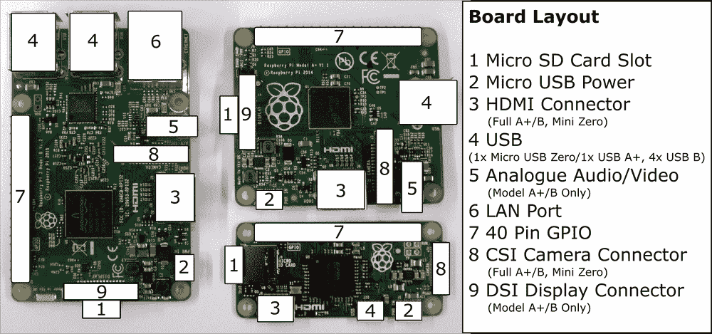

树莓派的连接布局（3B 型号、A+型号和 Pi Zero）

以下是对前一个图的描述：

+   **显示**：树莓派支持以下三种主要显示连接；如果同时连接了 HDMI 和复合视频，它将默认只使用 HDMI。

    +   **HDMI**

        为了获得最佳效果，请使用具有 HDMI 连接的电视或显示器，这样就可以实现最佳分辨率显示（1080p），并且还可以输出数字音频。如果您的显示器有 DVI 连接，您可能可以使用适配器通过 HDMI 连接。DVI 连接有几种类型；一些支持模拟（DVI-A），一些支持数字（DVI-D），还有一些两者都支持（DVI-I）。树莓派只能通过 HDMI 提供数字信号，因此建议使用 HDMI-to-DVI-D 适配器（以下截图中有勾选标记）。这缺少了四个额外的模拟引脚（以下截图中有叉号标记），因此它可以适应 DVI-D 和 DVI-I 类型的插座：

        

        HDMI-to-DVI 连接（DVI-D 适配器）

        如果您想使用较旧的显示器（具有 VGA 连接），则需要额外的 HDMI-to-VGA 转换器。树莓派还支持一个基本的 VGA 适配器（VGA Gert666 适配器），它直接从 GPIO 引脚驱动。然而，这会占用 40 引脚头上的所有引脚（较旧的 26 引脚型号将不支持 VGA 输出）。

    +   **模拟**

        另一种显示方法是使用模拟复合视频连接（通过话筒插座）；这也可以连接到 S-Video 或欧洲 SCART 适配器。然而，模拟视频输出的最大分辨率为 640 x 480 像素，因此它不适合一般使用。

        

        3.5mm 话筒模拟连接

    +   当使用 RCA 连接或 DVI 输入时，必须通过模拟音频连接单独提供音频。为了简化制造过程（通过避免通孔组件），Pi Zero 没有模拟音频或 RCA 插座用于模拟视频（尽管可以通过一些修改添加它们）。

        **直接显示 DSI**

        由树莓派基金会生产的触摸显示屏可以直接连接到 DSI 插槽。这可以在同时连接和使用 HDMI 或模拟视频输出时创建一个双显示器设置。

+   **立体声模拟音频（除 Pi Zero 外所有型号）**：这为耳机或放大扬声器提供模拟音频输出。可以通过桌面上的树莓派配置工具在模拟（立体声插座）和数字（HDMI）之间切换音频，或者通过命令行使用`amixer`或`alsamixer`。

    ### 注意

    要在终端读取手册之前获取有关特定命令的更多信息，您可以在终端中使用以下`man`命令（大多数命令都应该有一个）：

    ```py
    man amixer

    ```

    一些命令也支持`--help`选项以提供更简洁的帮助，如下所示：

    ```py
    amixer --help

    ```

+   **网络（不包括 A 型和 Pi Zero 型号）**：网络连接将在本章后面的“*网络和通过 LAN 连接器连接树莓派到互联网*”配方中进行讨论。如果我们使用 A 型树莓派，可以添加 USB 网络适配器以添加有线或甚至无线网络（请参阅“*通过 USB Wi-Fi 适配器连接树莓派到互联网的网络和连接*”配方）。

+   **板载 Wi-Fi 和蓝牙（仅限 3B 型号）：**

+   3B 型号内置 802.11n Wi-Fi 和蓝牙 4.1；请参阅“*在树莓派上使用内置 Wi-Fi 和蓝牙*”配方。

+   **USB（A 型和 Zero 型号 x1，1B 型号 x2，2B 和 3B 型号 x4）——使用键盘和鼠标：**

    树莓派应该与大多数可用的 USB 键盘和鼠标兼容。您还可以使用使用 RF 适配器的无线鼠标和键盘，但对于使用蓝牙适配器的项目，需要额外的配置。

    如果电源供应不足或设备消耗过多电流，您可能会遇到键盘按键似乎卡住的情况，在严重的情况下，SD 卡可能会损坏。

    ### 注意

    USB 电源可能在 2012 年 10 月之前可用的早期 Model B 修订版 1 的板子上成为一个更大的问题。它们在 USB 输出上增加了额外的**多熔丝**，如果超过 140 mA 的电流，则会跳闸。多熔丝可能需要几个小时或几天才能完全恢复，因此即使在电源改善后，也可能出现不可预测的行为。

    您可以通过它缺少的四个安装孔来识别修订版 1 的板子。

    Debian Linux（Raspbian 所基于的操作系统）支持许多常见的 USB 设备，例如闪存驱动器、硬盘驱动器（可能需要外部电源），相机、打印机、蓝牙和 Wi-Fi 适配器。一些设备将自动检测，而其他设备则需要安装驱动程序。

+   **微型 USB 电源**：Raspberry Pi 需要一个 5V 电源，可以舒适地提供至少 1000 mA（建议 1500 mA 或更多，尤其是对于更耗电的 Model 2 和 3），通过微型 USB 连接。可以使用便携式电池组为单元供电，例如适合为平板电脑供电或充电的电池组。同样，确保它们可以提供 1000 mA 或以上的 5V 电压。

在连接电源之前，你应该尽量将所有其他连接到 Raspberry Pi 上。然而，USB 设备、音频和网络在运行时可以连接和移除，而不会出现问题。

## 还有更多...

除了你会在计算机上期望看到的标准主要连接外，Raspberry Pi 还有许多其他连接。

### 二级硬件连接

以下每个连接都为 Raspberry Pi 提供了额外的接口：

+   **20 x 2 GPIO 引脚头（Model A+、B+、2 B、3 B 和 Pi Zero）**：这是 Raspberry Pi 的主要 40 引脚 GPIO 引脚头，用于直接与硬件组件接口。我们在第 6、7、9 和 10 章中使用此连接。本书中的食谱也与具有 13 x 2 GPIO 引脚头的较老型号的 Raspberry Pi 兼容。

+   **P5 8 x 2 GPIO 引脚头（仅限 Model 1 B 版本 2.0）**：我们在书中没有使用这个。

+   **复位连接**：这在较晚的型号上存在（没有引脚）。当引脚 1（复位）和引脚 2（地）连接在一起时，会触发复位。我们在第六章的*使用 Python 驱动硬件*食谱中使用此功能。

+   **GPU/LAN JTAG**：**联合测试行动小组**（**JTAG**）是一种编程和调试接口，用于配置和测试处理器。这些在新型号上作为表面焊盘存在。使用此接口需要专用 JTAG 设备。我们在书中没有使用此功能。

+   **直接相机 CSI 连接**：此连接支持 Raspberry Pi 相机模块（如第八章中所述，*使用 Raspberry Pi 相机模块创建项目*）。请注意，Pi Zero 的 CSI 连接器比其他型号小，因此需要不同的排线连接器。

+   **直接显示 DSI**：此连接支持直接连接的显示器，一个 7 英寸 800 x 600 电容式触摸屏。

# 使用 NOOBS 设置你的 Raspberry Pi SD 卡

Raspberry Pi 在启动前需要将操作系统加载到 SD 卡上。设置 SD 卡最简单的方法是使用**NOOBS**；你可能发现你可以购买已经预装了 NOOBS 的 SD 卡。

NOOBS 提供了一个初始启动菜单，提供将多个可用的操作系统安装到 SD 卡上的选项。

## 准备工作

由于 NOOBS 创建了一个**恢复**分区以保留原始安装镜像，建议使用 8 GB 或更大的 SD 卡。您还需要一个 SD 卡读卡器（经验表明，一些内置读卡器可能会引起问题，因此建议使用外部 USB 类型读卡器）。

如果您使用的是之前使用过的 SD 卡，您可能需要重新格式化它以删除任何之前的分区和数据。NOOBS 期望 SD 卡包含一个单独的 FAT32 分区。如果您使用 Windows 或 Mac OS X，您可以使用 SD 协会的格式化工具，如下面的截图所示（可在[`www.sdcard.org/downloads/formatter_4/`](https://www.sdcard.org/downloads/formatter_4/)找到）：

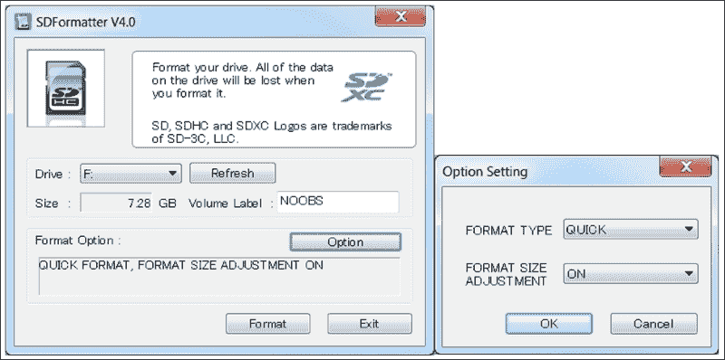

使用 SD formatter 删除 SD 卡上的任何分区

在**选项设置**对话框中，设置**格式大小调整**。这将删除之前创建的所有 SD 卡分区。

如果使用 Linux，您可以使用`gparted`清除任何之前的分区并将其重新格式化为 FAT32 分区。

完整的 NOOBS 包（通常略大于 1 GB）包含 Raspbian，这是最受欢迎的 Raspberry Pi 操作系统镜像。还有一个没有预装操作系统的 NOOBS 精简版（尽管需要 20 MB 的初始下载和 Raspberry Pi 的网络连接，以便直接下载您打算使用的操作系统）。

NOOBS 可在[`www.raspberrypi.org/downloads`](http://www.raspberrypi.org/downloads)找到，文档可在[`github.com/raspberrypi/noobs`](https://github.com/raspberrypi/noobs)找到。

## 如何操作…

通过执行以下步骤，我们将准备 SD 卡以运行 NOOBS。这将允许我们选择和安装我们想要使用的操作系统：

1.  准备您的 SD 卡。

1.  在新格式化的或新的 SD 卡上，复制`NOOBS_vX.zip`文件的文件内容。当复制完成时，您应该得到以下类似 SD 卡的截图：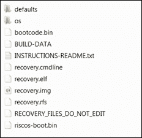

    NOOBS 文件已提取到 SD 卡上

    ### 注意

    文件可能因 NOOBS 的不同版本而略有不同，您电脑上显示的图标也可能不同。

1.  现在，您可以将卡插入 Raspberry Pi，连接键盘和显示器，并打开电源。有关所需物品和如何操作的详细信息，请参阅*连接 Raspberry Pi*菜谱。

默认情况下，NOOBS 将通过 HDMI 连接显示。如果您有另一种类型的屏幕（或者您什么也没看到），您需要手动通过按*1*、*2*、*3*或*4*来选择输出类型，具体功能如下：

+   键 1 代表**标准 HDMI**模式（默认模式）

+   键 2 代表**安全 HDMI**模式（如果未检测到输出，则为替代 HDMI 设置）

+   键 3 代表**复合 PAL**（用于通过 RCA 模拟视频连接的连接）

+   键 4 代表**复合 NTSC**（再次，用于通过 RCA 连接器连接）

此显示设置也将应用于已安装的操作系统。

稍后，您将看到 NOOBS 选择屏幕，列出了可用的发行版（离线版本仅包括 Raspbian）。还有更多可用的发行版，但只有选定的那些可以通过 NOOBS 系统直接访问。点击**Raspbian**，因为这是本书中使用的操作系统。

按下*Enter*键或点击**安装操作系统**，并确认您希望覆盖卡上的所有数据。这将覆盖之前使用 NOOBS 安装的任何发行版，但不会删除 NOOBS 系统；您可以在任何时候通过在开机时按下*Shift*键返回。

根据卡的速度，将数据写入卡中大约需要 20 到 40 分钟。当操作完成并且出现**图像应用成功**的消息时，点击**确定**，树莓派将开始启动进入**树莓派桌面**。

## 如何工作…

以这种方式将镜像文件写入 SD 卡的目的，是为了确保 SD 卡格式化带有预期的文件系统分区和正确启动操作系统所需的文件。

当树莓派开机时，它会加载 GPU 内部内存中的一些特殊代码（通常由树莓派基金会称为**二进制 blob**）。二进制 blob 提供了读取 SD 卡上**BOOT 分区**所需的指令，在这种情况下（如果是 NOOBS 安装），将从`RECOVERY`分区加载 NOOBS。如果在此时按下*Shift*键，NOOBS 将加载恢复和安装菜单。否则，NOOBS 将开始加载存储在**设置分区**中的偏好设置的操作系统。

在加载操作系统时，它将通过`BOOT`分区使用`config.txt`中定义的设置和`cmdline.txt`中的选项启动，最终加载到**根分区**上的桌面。请参考以下图表：

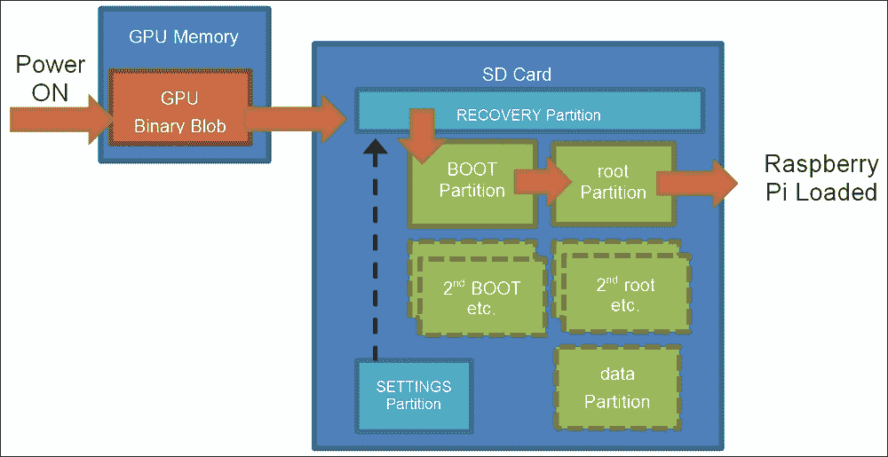

NOOBS 在 SD 卡上创建几个分区，以便安装多个操作系统并提供恢复功能

NOOBS 允许用户选择性地在同一张卡上安装多个操作系统，并提供一个启动菜单来选择它们（在超时期间提供设置默认值的选项）。

如果您以后添加、删除或重新安装操作系统，请首先确保您复制了任何文件，包括您希望保留的系统设置，因为 NOOBS 可能会覆盖 SD 卡上的所有内容。

## 还有更多...

当您第一次启动 Raspberry Pi 时，它将直接启动桌面。您现在可以使用**Raspberry Pi 配置**程序（在桌面的“首选项”菜单下或通过`sudo raspi-config`命令）来配置系统设置，这将允许您对 SD 卡进行更改并设置您的通用首选项。

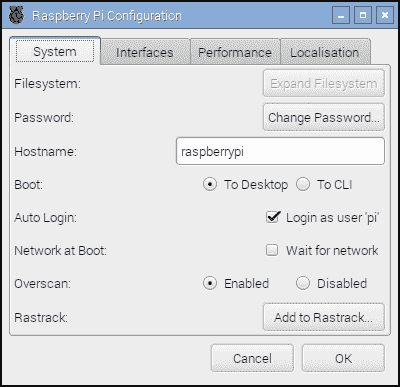

Raspberry Pi 配置程序

### 更改默认用户密码

一旦登录，请确保您更改`pi`用户账户的默认密码，因为默认密码是众所周知的。如果您连接到公共网络，这尤其重要。您可以使用以下截图所示的`passwd`命令来完成此操作：

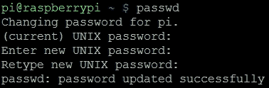

为 pi 用户设置新密码

这提供了更大的信心，因为如果您稍后连接到另一个网络，只有您才能访问您的文件并控制您的 Raspberry Pi。

### 确保您安全关机

为了避免任何数据损坏，您必须确保通过发出`shutdown`命令正确关闭 Raspberry Pi，如下所示：

```py
sudo shutdown –h now

```

或者使用这个：

```py
sudo halt

```

您必须等待此命令完成后再从 Raspberry Pi 断电（在 SD 卡访问指示灯停止闪烁后至少等待 10 秒钟）。

您也可以使用`reboot`命令重新启动系统，如下所示：

```py
sudo reboot

```

### 手动准备 SD 卡

使用 NOOBS 的另一种选择是手动将操作系统镜像写入 SD 卡。虽然这最初是安装操作系统的唯一方法，但一些用户仍然更喜欢这种方法。它允许在 Raspberry Pi 中使用之前准备 SD 卡。它还可以提供更容易访问启动和配置文件，并且为用户留下更多可用空间（与 NOOBS 不同，不包括`RECOVERY`分区）。

默认的 Raspbian 镜像实际上由两个分区组成，`BOOT`和`SYSTEM`，它们可以适应 2GB 的 SD 卡（建议使用 4GB 或更大）。

您需要一个运行 Windows/Mac OS X/Linux 的计算机（尽管可以使用另一个 Raspberry Pi 来写入您的卡，但请准备好非常长的等待时间）。

下载您希望使用的操作系统的最新版本。在本书中，假设您正在使用可在[`www.raspberrypi.org/downloads`](http://www.raspberrypi.org/downloads)找到的最新版本的 Raspbian。

根据您计划用于写入 SD 卡的计算机类型执行以下步骤（您需要的`.img`文件有时是压缩的，因此，在您开始之前，您需要提取文件）。

以下步骤适用于 Windows：

1.  确保您已下载 Raspbian 镜像，如前所述，并将其提取到方便的文件夹中，以获得`.img`文件。

1.  从 [`www.sourceforge.net/projects/win32diskimager`](http://www.sourceforge.net/projects/win32diskimager) 获取可用的 `Win32DiskImager.exe` 文件。

1.  从下载位置运行 `Win32DiskImager.exe`。

1.  单击文件夹图标并导航到 `.img` 文件的位置，然后单击 **Save**。

1.  如果您还没有这样做，请将 SD 卡插入您的卡读卡器并将其连接到计算机。

1.  从小下拉框中选择与您的 SD 卡对应的 **Device** 驱动器字母。请务必确认这是正确的设备（因为当您写入镜像时，程序将覆盖设备上的所有内容）。

    ### 注意

    驱动器字母可能不会列出，直到您选择源镜像文件。

1.  最后，单击 **Write** 按钮，等待程序将镜像写入 SD 卡，如图所示：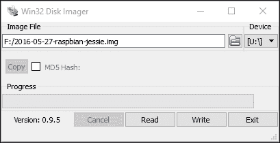

    使用 Disk Imager 手动将操作系统镜像写入 SD 卡

完成后，您可以退出程序。您的 SD 卡已准备就绪！

以下步骤适用于大多数 Linux 发行版，如 Ubuntu 和 Debian：

1.  使用您首选的网页浏览器下载 Raspbian 镜像并将其保存在合适的位置。

1.  从文件管理器中提取文件或在终端中定位文件夹，并使用以下命令解压缩 `.img` 文件：

    ```py
    unzip filename.zip

    ```

1.  如果您还没有这样做，请将 SD 卡插入您的卡读卡器并将其连接到计算机。

1.  使用 `df –h` 命令并识别 SD 卡的 **sdX** 标识符。每个分区将显示为 **sdX1**、**sdX2** 等，其中 **X** 将是设备 ID 的 `a`、`b`、`c`、`d` 等。

1.  确保使用 `umount /dev/sdXn` 命令为每个分区卸载 SD 卡上的所有分区，其中 `sdXn` 是正在卸载的分区。

1.  使用以下命令将镜像文件写入 SD 卡：

    ```py
    sudo dd if=filename.img of=/dev/sdX bs=4M

    ```

1.  写入 SD 卡的过程将花费一些时间，完成后将返回终端提示符。

1.  在从计算机中移除 SD 卡之前，使用以下命令卸载 SD 卡：

    ```py
    umount /dev/sdX1

    ```

以下步骤适用于大多数 OS X 版本：

1.  使用您首选的网页浏览器下载 Raspbian 镜像并将其保存在合适的位置。

1.  从文件管理器中提取文件或在终端中定位文件夹，并使用以下命令解压缩 `.img` 文件：

    ```py
    unzip filename.zip

    ```

1.  如果您还没有这样做，请将 SD 卡插入您的卡读卡器并将其连接到计算机。

1.  使用 `diskutil list` 命令并识别 SD 卡的 **disk#** 标识符。每个分区将显示为 **disk#s1**、**disk#s2** 等，其中 **#** 将是设备 ID 的 `1`、`2`、`3`、`4` 等。

    ### 注意

    如果列出 **rdisk#**，请使用此方法进行更快的写入（这使用原始路径并跳过数据缓冲）。

1.  确保使用 `unmountdisk /dev/diskX` 命令卸载 SD 卡，其中 `diskX` 是正在卸载的设备。

1.  使用以下命令将镜像文件写入 SD 卡：

    ```py
    sudo dd if=filename.img of=/dev/diskX bs=1M

    ```

1.  将过程写入 SD 卡需要一些时间，完成后将返回终端提示符。

1.  在从计算机中移除 SD 卡之前，请使用以下命令卸载 SD 卡：

    ```py
    unmountdisk /dev/diskX

    ```

    参考以下图片：

    

    手动安装的 OS 镜像的启动过程

### 将系统扩展以适应您的 SD 卡

手动编写的镜像将具有固定大小（通常制作成适合尽可能小的 SD 卡）。为了充分利用 SD 卡，您需要将系统分区扩展以填充 SD 卡的剩余部分。这可以通过使用 Raspberry Pi 配置工具实现。

选择`Expand Filesystem`，如下面的屏幕截图所示：


Raspberry Pi 配置工具

### 访问 RECOVERY/BOOT 分区

Windows 和 Mac OS X 不支持`ext4`格式，因此当您读取 SD 卡时，只能访问**文件分配表**（**FAT**）分区。此外，Windows 只支持 SD 卡上的第一个分区，因此如果您已安装 NOOBS，则只能看到`RECOVERY`分区。如果您手动写入卡，您将能够访问`BOOT`分区。

`data`分区（如果您通过 NOOBS 安装）和`root`分区都是`ext4`格式，通常在非 Linux 系统上不可见。

### 注意

如果您确实需要使用 Windows 从 SD 卡读取文件，一款免费软件程序**Linux Reader**（可在[www.diskinternals.com/linux-reader](http://www.diskinternals.com/linux-reader)获取）可以提供对 SD 卡上所有分区的只读访问。

从 Raspberry Pi 访问分区。要查看当前挂载的分区，请使用`df`，如下面的屏幕截图所示：

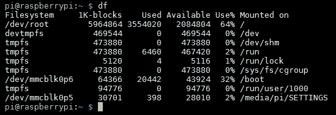

df 命令的结果

要从 Raspbian 内部访问`BOOT`分区，请使用以下命令：

```py
cd /boot/

```

要访问`RECOVERY`或`data`分区，我们必须通过以下步骤将其挂载：

1.  通过列出所有分区（包括未挂载的分区）来确定分区的名称，系统通过该名称引用它。`sudo fdisk -l`命令列出分区，如下面的屏幕截图所示：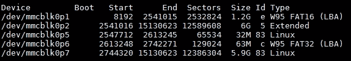

    Raspbian NOOBS 安装的分区表和数据分区

    | `mmcblk0p1` | `(vfat) RECOVERY` |
    | --- | --- |
    | `mmcblk0p2` | `(扩展分区)包含(root, data, BOOT)` |
    | `mmcblk0p5` | `(ext4) root` |
    | `mmcblk0p6` | `(vfat) BOOT` |
    | `mmcblk0p7` | `(ext4) SETTINGS` |

    如果您在同一张卡上安装了额外的操作系统，前面表格中显示的分区标识将不同。

1.  创建一个文件夹并将其设置为分区的挂载点，如下所示：

    +   对于`RECOVERY`分区，请使用以下命令：

        ```py
        mkdir ~/recovery
        sudo mount –t vfat /dev/mmcblk0p1 ~/recovery

        ```

为了确保它们在每次系统启动时都挂载，请执行以下步骤：

1.  在 `exit 0` 之前将 sudo mount 命令添加到 `/etc/rc.local`。如果你有不同的用户名，你需要将 `pi` 改变以匹配：

    ```py
    sudo nano /etc/rc.local
    sudo mount -t vfat /dev/mmcblk0p1 /home/pi/recovery

    ```

1.  按 *Ctrl* + *X*，*Y* 和 *Enter* 保存并退出。

### 注意

添加到 `/etc/rc.local` 的命令将为任何登录到 Raspberry Pi 的用户运行。如果你只想为当前用户挂载驱动器，可以将命令添加到 `.bash_profile` 中。

如果你必须在同一张卡上安装额外的操作系统，这里显示的分区标识符将不同。

### 使用工具备份 SD 卡以防故障

你可以使用 **Win32 Disk Imager** 通过将 SD 卡插入你的读卡器，启动程序，并创建一个用于存储镜像的文件名来制作 SD 卡的完整备份镜像。只需点击 **Read** 按钮即可从 SD 卡读取镜像并将其写入新的镜像文件。

要备份你的系统，或使用 Raspberry Pi 将其克隆到另一个 SD 卡，请使用 SD 卡复制器（可通过桌面菜单中的 **Accessories** | **SD Card Copier** 获取）。

将 SD 卡插入到 Raspberry Pi 的一个备用 USB 端口的卡读卡器中，并选择新的存储设备，如下面的截图所示：

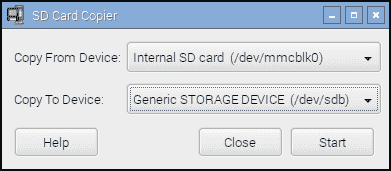

SD 卡复制器程序

在继续之前，SD 卡复制器将确认你是否希望格式化和覆盖目标设备，如果空间足够，将制作系统的一个克隆。

可以使用类似的 `dd` 命令来备份卡，如下所示：

+   对于 Linux，将 `sdX` 替换为你的设备 ID，使用此命令：

    ```py
    sudo dd if=/dev/sdX of=image.img.gz bs=1M

    ```

+   对于 OS X，将 `diskX` 替换为你的设备 ID，使用以下命令：

    ```py
    sudo dd if=/dev/diskX of=image.img.gz bs=1M

    ```

+   你还可以使用 `gzip` 和 split 来压缩卡的内容，并在需要时将它们分割成多个文件，如下所示：

    ```py
    sudo dd if=/dev/sdX bs=1M | gzip –c | split –d –b 2000m – image.img.gz

    ```

+   要恢复分割的镜像，使用以下命令：

    ```py
    sudo cat image.img.gz* | gzip –dc | dd of=/dev/sdX bs=1M

    ```

# 通过 LAN 连接器将 Raspberry Pi 连接到互联网

将 Raspberry Pi 连接到互联网最简单的方式是通过 Model B 上的内置 LAN 连接。如果你使用的是 Model A Raspberry Pi，可以使用 USB-to-LAN 转换器（有关如何配置此转换器的详细信息，请参阅 *Networking and connecting your Raspberry Pi to the Internet via a USB Wi-Fi dongle* 菜单中的 *There's more…* 部分）。

## 准备工作

你需要访问一个合适的有线网络，该网络将连接到互联网，并使用标准网络线（带有 **RJ45** 类型连接器，用于连接到 Raspberry Pi）。

## 如何操作…

许多网络使用 **动态主机配置协议**（**DHCP**）自动连接和配置，由路由器或交换机控制。如果是这种情况，只需将网络线缆插入路由器或网络交换机上的备用网络端口（如果适用，也可以是墙壁网络插座）。

或者，如果没有 DHCP 服务器可用，你必须手动配置设置（有关详细信息，请参阅 *还有更多...* 部分）。

你可以通过以下步骤确认其成功运行：

1.  确保 Raspberry Pi 两边的两个 LED 灯亮起（左边的橙色 LED 表示连接，右边的绿色 LED 通过闪烁显示活动）。这将表明与路由器和设备的物理连接存在，设备已供电并正常工作。

1.  使用 ping 命令测试本地网络链接。首先，找出网络上另一台计算机的 IP 地址（或者可能是路由器的地址，通常是 `192.168.0.1` 或 `192.168.1.254`）。现在，在 Raspberry Pi 终端上使用 ping 命令（使用 `-c 4` 参数只发送四条消息；否则，按 *Ctrl* + *C* 停止）来 ping IP 地址，如下所示：

    ```py
    sudo ping 192.168.1.254 -c 4

    ```

1.  按以下方式测试互联网链接（如果你通常通过代理服务器连接到互联网，这将失败）：

    ```py
    sudo ping www.raspberrypi.org -c 4

    ```

1.  最后，你可以通过在 Raspberry Pi 上使用 `hostname -I` 命令来发现 IP 地址，来测试链接回 Raspberry Pi。然后，你可以在网络上另一台计算机上使用 ping 命令来确保其可访问（用 Raspberry Pi 的 IP 地址代替 [www.raspberrypi.org](http://www.raspberrypi.org)）。Windows 版本的 `ping` 命令将执行五个 ping 并自动停止，不需要 `-c 4` 选项。

如果上述测试失败，你需要检查你的连接，然后确认你的网络配置正确。

## 还有更多...

如果你经常在网络上使用你的 Raspberry Pi，你不会希望每次想要连接到它时都要查找 IP 地址。

在某些网络上，你可能可以使用 Raspberry Pi 的主机名而不是其 IP 地址（默认为 `raspberrypi`）。为此，你可能需要一些额外的软件，如 **Bonjour**，以确保网络上主机名的正确注册。如果你有 OS X Mac，你将已经运行了 Bonjour。在 Windows 上，你可以安装 iTunes（如果你还没有安装，它也包含该服务），或者你可以单独安装它（通过从 [`support.apple.com/kb/DL999`](https://support.apple.com/kb/DL999) 可用的 Apple Bonjour 安装程序）。然后你可以使用主机名 `raspberrypi` 或 `raspberrypi.local` 来通过网络连接到 Raspberry Pi。如果你需要更改主机名，你可以在之前显示的 Raspberry Pi 配置工具中这样做。

或者，您可能发现手动设置 IP 地址到一个已知值很有帮助。但是，请记住，在连接到另一个网络时将其切换回使用 DHCP。

一些路由器还将有一个选项来设置**静态 IP DHCP 地址**，这样就可以始终给 Raspberry Pi 分配相同的地址（如何在路由器上设置将因路由器而异）。

了解您的 Raspberry Pi 的 IP 地址或使用主机名特别有用，如果您打算使用后面描述的远程访问解决方案之一，这可以避免需要显示器。

# 在 Raspberry Pi 上使用内置 Wi-Fi 和蓝牙

许多家庭网络通过 Wi-Fi 提供无线网络；如果您有 Raspberry Pi 3，则可以利用板载 Broadcom Wi-Fi 来连接。Raspberry Pi 3 还支持蓝牙，因此您可以连接大多数标准蓝牙设备，并像在其他任何计算机上一样使用它们。

此方法也应适用于任何支持的 USB Wi-Fi 和蓝牙设备，请参阅*通过 USB Wi-Fi 外置网卡连接 Raspberry Pi 到互联网的网络和连接*配方以获取识别设备和安装固件（如果需要）的额外帮助。

## 准备工作

Raspbian 的最新版本包括一些有用的实用程序，可以快速轻松地通过图形界面配置 Wi-Fi 和蓝牙。

### 注意

**注意**：如果您需要通过命令行配置 Wi-Fi，请参阅*通过 USB Wi-Fi 外置网卡连接 Raspberry Pi 到互联网的网络和连接*配方以获取详细信息。

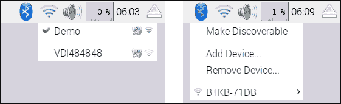

Wi-Fi 和蓝牙配置应用程序

您可以使用内置的蓝牙连接无线键盘、鼠标甚至无线扬声器。这在需要额外电缆和线缆的项目中特别有用，例如机器人项目，或者当 Raspberry Pi 安装在难以触及的位置时（作为服务器或安全摄像头）。

## 如何操作…

### 连接到您的 Wi-Fi 网络

要配置您的 Wi-Fi 连接，请点击网络符号以列出可用的本地 Wi-Fi 网络：

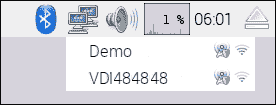

该区域可用的接入点 Wi-Fi 列表

选择所需的网络（例如，`Demo`），如果需要，输入您的密码（也称为`预共享密钥`）：

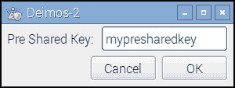

提供接入点的密码

稍等片刻，您应该会看到您已经连接到网络，图标将更改为 Wi-Fi 符号。如果您遇到问题，请确保您有正确的密码/密钥。

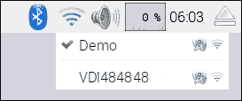

成功连接到接入点

就这么简单！

您现在可以使用网络浏览器导航到网站或通过在终端中使用以下命令来测试您的连接并确保它正在工作：

```py
sudo ping www.raspberrypi.com

```

### 连接到蓝牙设备

首先，我们需要通过点击蓝牙图标并选择**设置为可发现**来将蓝牙设备置于可发现模式。您还需要将您想要连接的设备设置为可发现并准备好配对；这可能会因设备而异（例如，按配对按钮）。

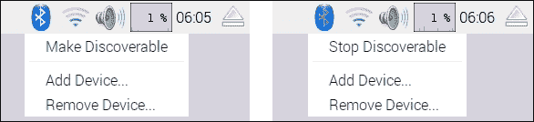

将蓝牙设置为可发现

接下来，选择**添加设备...**并选择目标设备，然后**配对**：

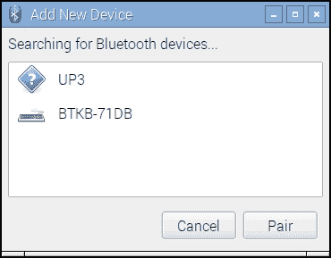

选择并配对所需的设备

然后开始配对过程；例如，**BTKB-71DB**键盘需要将配对码`467572`输入到键盘上以完成配对。其他设备可能使用默认配对码，通常设置为 0000、1111、1234 或类似。

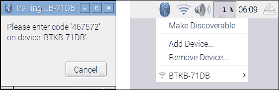

按照说明使用所需的配对码配对设备

一旦过程完成，设备将被列出，并且每次设备出现并启动时都会自动连接。

# 手动配置您的网络

如果您的网络不包含 DHCP 服务器或它已被禁用（通常，这些功能集成在大多数现代 ADSL/电缆调制解调器或路由器中），您可能需要手动配置网络设置。

## 准备工作

在开始之前，您需要确定您网络的网络设置。

您需要从路由器的设置或连接到网络的另一台计算机中获取以下信息：

+   **IPv4 地址**：此地址需要选择，以便与其他网络上的计算机相似（通常，前三个数字应该匹配，即如果`子网掩码`是`255.255.255.0`，则为`192.168.1.X`），但它不应已被其他计算机使用。然而，避免使用`x.x.x.255`作为最后一个地址，因为这个地址已被保留为广播地址。

+   **子网掩码**：此数字确定计算机将响应的地址范围（对于家庭网络，通常是`255.255.255.0`，这允许最多 254 个地址）。这有时也被称为**子网掩码**。

+   **默认网关地址**：此地址通常是您的路由器的 IP 地址，通过该地址计算机连接到互联网。

+   **DNS 服务器**：DNS 服务器（**域名服务**）通过查找将名称转换为 IP 地址。通常，它们已经配置在您的路由器上，在这种情况下，您可以使用路由器的地址。或者，您的**互联网服务提供商**（**ISP**）可能提供一些地址，或者您可以使用位于地址`8.8.8.8`和`8.8.4.4`的谷歌公共 DNS 服务器。在某些系统中，这些也被称为**名称服务器**。

对于 Windows，您可以通过连接到互联网并运行以下命令来获取此信息：

```py
ipconfig /all

```

定位活动连接（如果您使用有线连接，通常称为 **本地连接 1** 或类似名称；如果您使用 Wi-Fi，则称为无线网络连接）并找到所需信息，如下所示：

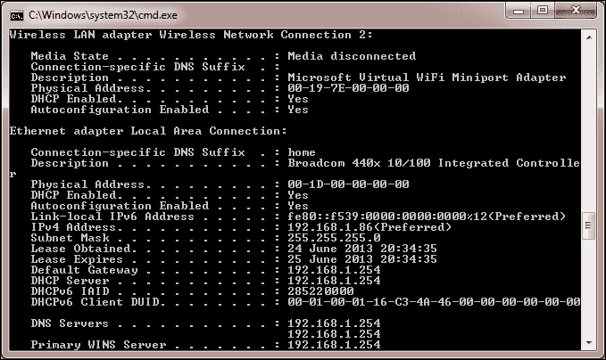

`ipconfig/all` 命令显示了有关您的网络设置的有用信息

对于 Linux 和 Mac OS X，您可以使用以下命令获取所需信息（注意：它是 `ifconfig` 而不是 `ipconfig`）：

```py
ifconfig

```

DNS 服务器被称为名称服务器，通常列在 `resolv.conf` 文件中。您可以使用以下 `less` 命令来查看其内容（完成查看后按 *Q* 退出）：

```py
less /etc/resolv.conf

```

## 如何做到这一点...

要设置网络接口设置，使用以下代码编辑 `/etc/network/interfaces`：

```py
sudo nano /etc/network/interfaces

```

现在，执行以下步骤：

1.  我们可以为我们的特定网络添加详细信息，包括我们想要分配给它的 IP `地址`、网络的 `子网掩码` 地址和 `网关` 地址，如下所示：

    ```py
    iface eth0 inet static
     address 192.168.1.10
     netmask 255.255.255.0
     gateway 192.168.1.254

    ```

1.  通过按 *Ctrl* + *X*, *Y* 和 *Enter* 来保存并退出。

1.  要设置 DNS 的名称服务器，使用以下代码编辑 `/etc/resolv.conf`：

    ```py
    sudo nano /etc/resolv.conf

    ```

1.  按照以下方式添加您的 DNS 服务器地址：

    ```py
    nameserver 8.8.8.8
    nameserver 8.8.4.4

    ```

1.  通过按 *Ctrl* + *X*, *Y* 和 *Enter* 来保存并退出。

## 更多内容...

您可以通过编辑 `BOOT` 分区中的 `cmdline.txt` 来配置网络设置，并在启动命令行中添加设置 `ip`。

`ip` 选项采用以下形式：

```py
ip=client-ip:nfsserver-ip:gw-ip:netmask:hostname:device:autoconf

```

+   `client-ip` 选项是您想要分配给 Raspberry Pi 的 IP 地址

+   `gw-ip` 选项将在您需要手动设置时设置网关服务器地址

+   `netmask` 选项将直接设置网络的子网掩码

+   `hostname` 选项将允许您更改默认的 `raspberrypi` 主机名

+   `device` 选项允许您在存在多个网络设备的情况下指定默认网络设备

+   `autoconf` 选项允许您打开或关闭自动配置

# 直接连接到笔记本电脑或计算机

有可能使用一根网络线缆直接将 Raspberry Pi 的 LAN 端口连接到笔记本电脑或计算机。这将创建计算机之间的本地网络链路，允许您在没有集线器或路由器的情况下执行所有连接到普通网络时可以做的事情，包括如果使用以下 **互联网连接共享**（**ICS**）连接到互联网：

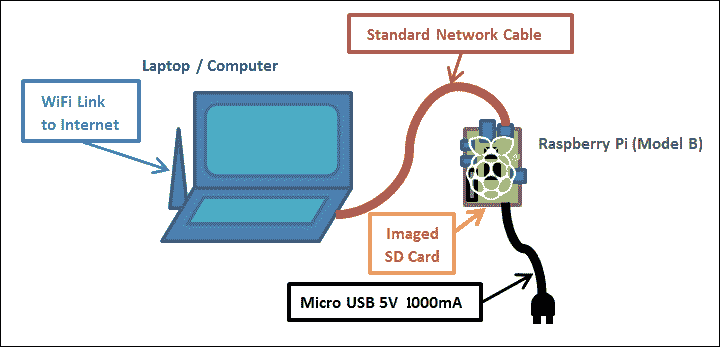

利用仅网络线缆、标准镜像 SD 卡和电源的 Raspberry Pi

ICS 允许 Raspberry Pi 通过另一台计算机连接到互联网。然而，为了在链路中进行通信，需要对计算机进行一些额外的配置，因为 Raspberry Pi 不会自动分配自己的 IP 地址。

我们将使用 ICS 从另一个网络链接共享连接，例如笔记本电脑上的内置 Wi-Fi。如果不需要互联网或计算机只有一个网络适配器，我们还可以使用直接网络链接（请参阅“更多内容”部分下的“直接网络链接”部分）。

### 注意

虽然这个设置应该适用于大多数计算机，但有些设置比其他设置更复杂。有关更多信息，请参阅[www.pihardware.com/guides/direct-network-connection](http://www.pihardware.com/guides/direct-network-connection)。

## 准备就绪

您需要一个带电源的标准网络线缆的树莓派。

### 注意

树莓派 Model B LAN 芯片包括**Auto-MDIX**（**自动介质依赖接口交叉**）。无需使用特殊交叉线缆（一种特殊的有线网络线缆，其传输线连接到接收线以实现直接网络链接），芯片将自动决定并更改设置。

如果这是您第一次尝试此操作，那么拥有键盘和显示器进行额外的测试可能也有帮助。

为了确保您可以将网络设置恢复到原始值，您应该检查它是否有固定 IP 地址或网络是否已自动配置。

要检查 Windows 10 上的网络设置，请执行以下步骤：

1.  从开始菜单打开**设置**，然后选择**网络和互联网**，然后选择**以太网**，并从**相关设置**列表中单击**更改适配器选项**。

要检查 Windows 7 和 Vista 上的网络设置，请执行以下步骤：

1.  从**控制面板**中打开**网络和共享中心**，然后单击左侧的**更改适配器设置**。

1.  要检查 Windows XP 上的网络设置，请从**控制面板**打开**网络连接**。

1.  找到与您的有线网络适配器相关的项目（默认情况下，这通常被称为**以太网**或**本地连接**，如下面的截图所示）：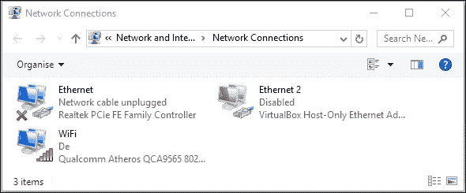

    定位您的有线网络连接

1.  右键单击其图标并单击**属性**。将出现一个对话框，如下面的截图所示：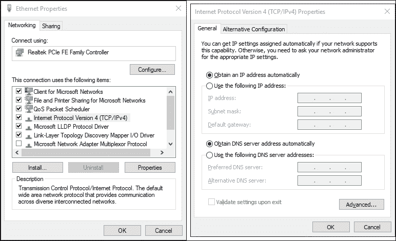

    选择 TCP/IP 属性并检查设置

1.  如果有两个版本（另一个是版本 6），请选择**互联网协议（TCP/IP）**或**互联网协议版本 4（TCP/IPv4）**，然后单击**属性**按钮。

1.  您可以使用自动设置或指定 IP 地址（如果需要，请注意此地址和其余详细信息，因为您可能希望在以后恢复设置）来确认您的网络设置。

要检查 Linux 上的网络设置，请执行以下步骤：

1.  打开**网络设置**对话框并选择**配置接口**。请参考以下截图：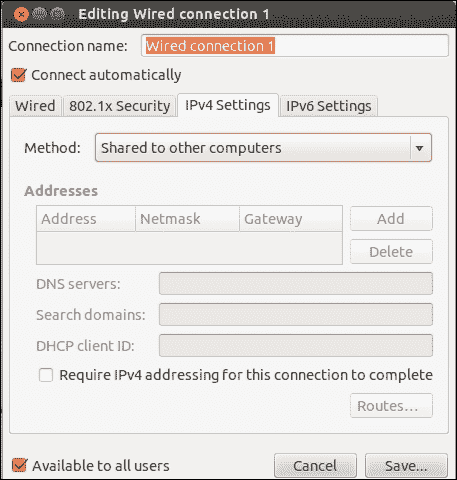

    Linux 网络设置对话框

1.  确保如果任何设置是手动设置的，你记下它们，以便如果你想的话可以稍后恢复。

要检查 Mac OS X 上的网络设置，请执行以下步骤：

1.  打开**系统偏好设置**并点击**网络**。然后你可以确认 IP 地址是否是自动分配的（使用 DHCP）或不是。

1.  确保如果任何设置是手动设置的，你记下它们，以便如果你想的话可以稍后恢复。参考以下截图：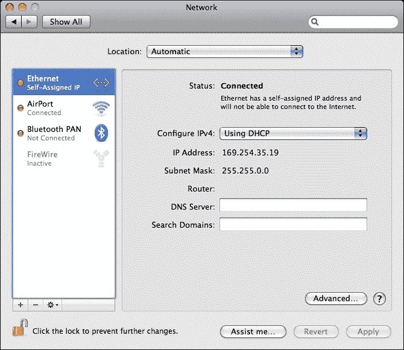

    OS X 网络设置对话框

如果你只需要在没有互联网连接的情况下访问或控制 Raspberry Pi，请参考*更多内容…*部分中的*直接网络链接*部分。

## 如何操作…

首先，我们需要在我们的网络设备上启用 ICS。在这种情况下，我们将通过连接到 Raspberry Pi 的**以太网**连接来共享可用的互联网，该互联网通过**无线网络连接**提供。

对于 Windows，请执行以下步骤：

1.  返回网络适配器列表，右键点击连接到互联网的连接（在这种情况下，是**WiFi**或**无线网络连接**设备），然后点击**属性**。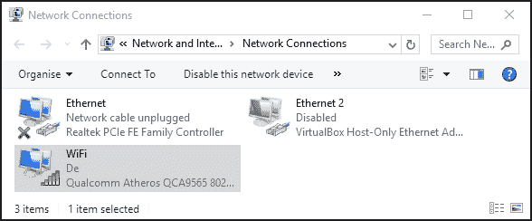

    右键点击你的无线设备并选择属性

1.  在窗口顶部，选择第二个标签页（在 Windows XP 中称为**高级**；在 Windows 7 和 Windows 10 中称为**共享**），如图所示：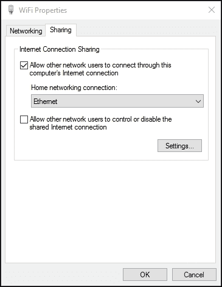

    选择 TCP/IP 属性并记下分配的 IP 地址

1.  在**互联网连接共享**部分，勾选**允许其他网络用户通过此计算机的互联网连接连接**（如果存在，使用下拉框选择**家庭网络连接**选项作为**以太网**或**本地连接**）。点击**确定**并确认你是否之前为**本地连接**设置了一个固定的 IP 地址。

对于 Mac OS X，要启用 ICS，请执行以下步骤：

1.  点击**系统偏好设置**然后点击**共享**。

1.  点击**互联网共享**并选择我们想要共享互联网的连接（在这种情况下，将是 Wi-Fi **AirPort**）。然后选择我们将连接 Raspberry Pi 的连接（在这种情况下，**以太网**）。

对于 Linux，要启用 ICS，请执行以下步骤：

1.  从**系统**菜单，点击**偏好设置**然后点击**网络连接**。选择你想要共享的连接（在这种情况下，**无线**）并点击**编辑**或**配置**。在**IPv4 设置**标签页，将**方法**选项更改为**共享给其他计算机**。

网络适配器的 IP 地址将是树莓派上使用的**网关 IP**地址，并分配一个同一范围内的 IP 地址（除了最后一位）。例如，如果电脑的有线连接现在是`192.168.137.1`，树莓派的网关 IP 将是`192.168.137.1`，其自身的 IP 地址可能设置为`192.168.137.10`。

幸运的是，由于操作系统的更新，Raspbian 现在将自动分配一个合适的 IP 地址以加入网络，并适当地设置网关。然而，除非我们将屏幕连接到树莓派或扫描我们的网络中的设备，否则我们不知道树莓派分配给自己的是什么 IP 地址。

幸运的是（如“更多...”部分中提到的*网络和通过 LAN 连接器连接树莓派到互联网*食谱中所述），苹果的**Bonjour**软件将自动确保网络上的主机名正确注册。如前所述，如果你有一台 OSX Mac，Bonjour 已经运行。在 Windows 上，你可以安装 iTunes，或者可以单独安装（从[`support.apple.com/kb/DL999`](https://support.apple.com/kb/DL999)获取）。默认情况下，可以使用主机名**raspberrypi**。

我们现在可以按照以下步骤测试新的连接：

1.  将网络线缆连接到树莓派和电脑的网络端口，然后开启树莓派，确保如果之前已经移除 SD 卡，则重新插入。如果你在树莓派上编辑了文件，要重启树莓派，请使用`sudo reboot`命令来重启。

1.  等待一分钟或两分钟，让树莓派完全启动。我们现在可以测试连接。

1.  从连接的笔记本电脑或电脑，通过以下命令测试连接，使用树莓派的计算机名进行 ping 操作（在 Linux 或 OS X 上，添加`-c 4`以限制为四条消息或按*Ctrl* + *C*退出）：

    ```py
    ping raspberrypi

    ```

希望你能找到一个有效的连接，并从树莓派收到回复。

如果你将键盘和屏幕连接到树莓派，你可以执行以下步骤：

1.  你可以从树莓派终端返回 ping 电脑（例如，`192.168.137.1`）如下：

    ```py
    sudo ping 192.168.137.1 -c 4

    ```

1.  你可以通过使用`ping`命令连接到以下知名网站来测试互联网连接，假设你不是通过代理服务器访问互联网：

    ```py
    sudo ping www.raspberrypi.org -c 4

    ```

如果一切顺利，你将通过电脑获得完整的互联网连接，允许你浏览网页以及更新和安装新软件。

如果连接失败，请执行以下步骤：

1.  重复此过程，确保前三个数字组与树莓派和网络适配器的 IP 地址相匹配。

1.  你还可以检查当树莓派启动时，是否使用以下命令设置了正确的 IP 地址：

    ```py
    hostname -I

    ```

1.  检查防火墙设置，确保它没有阻止内部网络连接。

## 它是如何工作的…

当我们在主计算机上启用 ICS 时，操作系统将自动为计算机分配一个新的 IP 地址。一旦连接并通电，树莓派将设置自己到一个兼容的 IP 地址，并使用主计算机的 IP 地址作为互联网网关。

通过使用 Apple Bonjour，我们能够使用`raspberrypi`主机名从连接的计算机连接到树莓派。

最后，我们检查计算机是否可以通过直接网络链路与树莓派通信，反过来也可以，并且还可以连接到互联网。

## 还有更多…

如果你不需要在树莓派上使用互联网，或者你的计算机只有一个网络适配器，我们仍然可以通过直接网络链路将计算机连接起来。请参考以下图表：

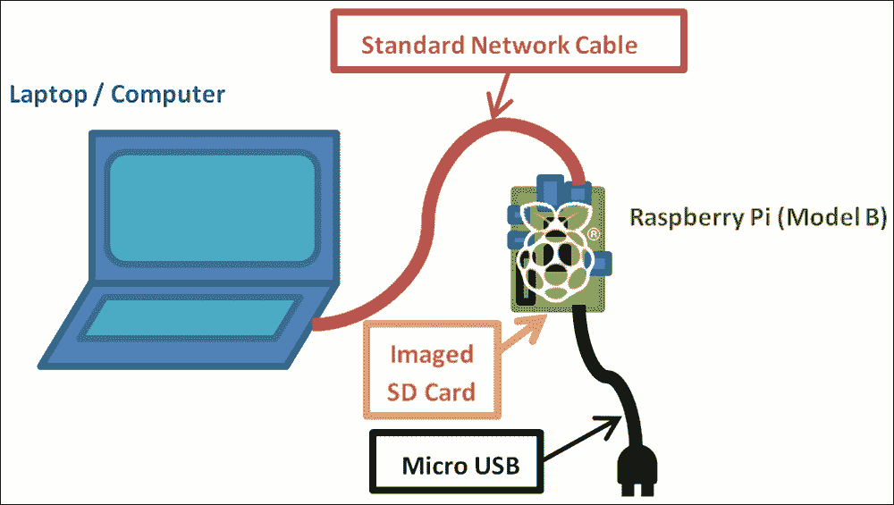

仅使用网络线缆、标准镜像 SD 卡和电源连接和使用树莓派

### 直接网络链路

为了在两台计算机之间建立网络链路，它们需要使用相同的地址范围。允许的地址范围由子网掩码确定（例如，`255.255.0.0`或`255.255.255.0`意味着除了 IP 地址的最后两个或最后一个数字之外，所有 IP 地址都应该相同；否则，它们将被过滤）。

要使用直接链路而不启用 ICS，请检查你将要连接的适配器的 IP 设置，并确定它是自动分配的还是固定到特定的 IP 地址。

大多数直接连接到另一台计算机的 PC 将会分配一个在`169.254.X.X`范围内的 IP 地址（子网掩码为`255.255.0.0`）。然而，我们必须确保网络适配器设置为**自动获取 IP 地址**。

为了树莓派能够通过直接链路通信，它需要有一个在同一地址范围内的 IP 地址，`169.254.X.X`。如前所述，树莓派将自动给自己一个合适的 IP 地址并连接到网络。

因此，假设我们有了**Apple Bonjour**（详情请见前文），我们只需要知道分配给树莓派的计算机名（`raspberrypi`）。

## 参见

如果你没有将键盘或屏幕连接到树莓派，你可以使用这个网络链路远程访问树莓派，就像在普通网络上一样（只需使用你为连接设置的新 IP 地址）。请参考*通过 VNC 远程连接到树莓派的网络*和*通过 SSH（以及 X11 转发）远程连接到树莓派的网络*这两个菜谱。

在我的网站上有很多额外的信息，[`pihw.wordpress.com/guides/direct-network-connection`](https://pihw.wordpress.com/guides/direct-network-connection)，包括额外的故障排除技巧和几种不需要专用屏幕和键盘即可连接到你的树莓派的其他方法。

# 通过 USB 无线网卡连接树莓派到互联网

通过将**USB 无线网卡**插入树莓派的 USB 端口，即使没有内置 Wi-Fi 的型号也可以连接并使用 Wi-Fi 网络。

## 准备工作

您需要获取一个合适的 USB 无线网卡；在某些情况下，您可能需要一个带电的 USB 集线器（这取决于您拥有的树莓派的硬件版本和电源质量）。USB 无线网卡的通用适用性将取决于内部使用的芯片组和可用的 Linux 支持水平。您可能会发现某些 USB 无线网卡无需安装额外的驱动程序即可工作（在这种情况下，您可以跳转到配置无线网络）。

支持的无线适配器列表可在[`elinux.org/RPi_USB_Wi-Fi_Adapters`](http://elinux.org/RPi_USB_Wi-Fi_Adapters)找到。

您需要确保您的无线适配器也与您打算使用的网络兼容；例如，它支持相同的信号类型**802.11bgn**和加密**WEP**、**WPA**和**WPA2**（尽管大多数网络都是向后兼容的）。

您还需要以下网络详细信息：

+   **服务集标识符（SSID）**：这是您无线网络的名字，如果您使用以下命令，它应该是可见的：

    ```py
    sudo iwlist scan | grep SSID

    ```

+   **加密类型和密钥**：此值将是**无**、**WEP**、**WPA**或**WPA2**，密钥将是您连接手机或笔记本电脑到无线网络时通常输入的代码（有时，它打印在路由器上）。

您需要有一个正常工作的互联网连接（即有线以太网）来下载所需的驱动程序。否则，您可能能够找到所需的固件文件（它们将是`.deb`文件），并将它们复制到树莓派上（即通过 USB 闪存驱动器；如果您在桌面模式下运行，驱动器应自动挂载）。将文件复制到合适的位置，并使用以下命令进行安装：

```py
sudo apt-get install firmware_file.deb

```

## 如何操作…

此任务分为两个阶段；首先，我们识别并安装无线适配器的固件，然后我们需要为无线网络进行配置。

我们将尝试识别您无线适配器的芯片组（处理连接的部分）；这可能与设备的实际制造商不匹配。

可以使用以下命令找到支持的固件的大致列表：

```py
sudo apt-cache search wireless firmware

```

这将产生类似于以下输出的结果（忽略任何标题中不带`firmware`的结果）：

```py
atmel-firmware - Firmware for Atmel at76c50x wireless networking chips.
firmware-atheros - Binary firmware for Atheros wireless cards
firmware-brcm80211 - Binary firmware for Broadcom 802.11 wireless cards
firmware-ipw2x00 - Binary firmware for Intel Pro Wireless 2100, 2200 and 2915
firmware-iwlwifi - Binary firmware for Intel PRO/Wireless 3945 and 802.11n cards
firmware-libertas - Binary firmware for Marvell Libertas 8xxx wireless cards
firmware-ralink - Binary firmware for Ralink wireless cards
firmware-realtek - Binary firmware for Realtek wired and wireless network adapters
libertas-firmware - Firmware for Marvell's libertas wireless chip series (dummy package)
zd1211-firmware - Firmware images for the zd1211rw wireless driver

```

要找出无线适配器的芯片组，将无线适配器插入树莓派，然后在终端运行以下命令：

```py
dmesg | grep 'Product:\|Manufacturer:'

```

### 注意

此命令将两个命令合并为一个。首先，`dmesg`显示内核的消息缓冲区（这是自开机以来发生的系统事件的内部记录，例如检测到的 USB 设备）。您可以单独尝试此命令以观察完整的输出。

`|`（管道符）将输出发送到`grep`命令，`grep 'Product:\|Manuf'`检查它，并且只返回包含`Product`或`Manuf`的行（因此我们应该得到任何列出的`Product`和`Manufacturer`的项目的摘要）。如果你没有找到任何内容或者想要查看所有 USB 设备，尝试使用`grep 'usb'`代替。

这应该返回类似于以下输出（在这种情况下，我有一个**ZyXEL**设备，它有一个**ZyDAS**芯片组（快速谷歌搜索显示`zd1211-firmware`是用于 ZyDAS 设备的））：

```py
[    1.893367] usb usb1: Product: DWC OTG Controller
[    1.900217] usb usb1: Manufacturer: Linux 3.6.11+ dwc_otg_hcd
[    3.348259] usb 1-1.2: Product: ZyXEL G-202
[    3.355062] usb 1-1.2: Manufacturer: ZyDAS

```

一旦你确定了你的设备和正确的固件，你就可以像安装任何其他通过`apt-get`提供的包一样安装它（其中`zd1211-firmware`可以替换为你需要的固件）。这显示在以下命令中：

```py
sudo apt-get install zd1211-firmware

```

移除并重新插入 USB Wi-Fi 网卡，以便检测并加载驱动程序。现在我们可以使用`ifconfig`测试新适配器是否正确安装。输出如下所示：

```py
wlan0     IEEE 802.11bg  ESSID:off/any
 Mode:Managed  Access Point: Not-Associated   Tx-Power=20 dBm
 Retry  long limit:7   RTS thr:off   Fragment thr:off
 Power Management:off

```

命令将显示系统上存在的网络适配器。对于 Wi-Fi，这通常是`wlan0`，或者如果你安装了多个，可能是`wlan1`等。如果没有，请再次检查所选固件，也许尝试一个替代方案或查看网站上的故障排除提示。

一旦我们为 Wi-Fi 适配器安装了固件，我们还需要配置它以连接我们希望连接的网络。我们可以使用如图所示的 GUI，或者我们可以通过以下步骤手动通过终端配置它：

1.  我们需要将无线适配器添加到网络接口列表中，该列表设置在`/etc/network/interfaces`中，如下所示：

    ```py
    sudo nano -c /etc/network/interfaces 

    ```

    如果需要，用之前的`wlan#`值替换`wlan0`，添加以下命令：

    ```py
    allow-hotplug wlan0
    iface wlan0 inet manual
    wpa-conf /etc/wpa_supplicant/wpa_supplicant.conf

    ```

    当更改完成后，通过按*Ctrl* + *X*，*Y*和*Enter*保存并退出。

1.  我们现在将把我们的 Wi-Fi 网络设置存储在`wpa_supplicant.conf`文件中（如果你的网络没有使用`wpa`加密，不要担心；这只是文件的默认名称）：

    ```py
    sudo nano -c /etc/wpa_supplicant/wpa_supplicant.conf

    ```

    它应该包括以下内容：

    ```py
    ctrl_interface=DIR=/var/run/wpa_supplicant GROUP=netdev
    update_config=1
    country=GB
    ```

    网络设置可以按照以下方式写入此文件（即，如果 SSID 设置为`theSSID`）：

    +   如果没有使用加密，请使用以下代码：

        ```py
        network={
          ssid="theSSID"
          key_mgmt=NONE
        }
        ```

    +   使用`WEP`加密（即，如果`WEP`密钥设置为`theWEPkey`），请使用以下代码：

        ```py
        network={
          ssid="theSSID"
          key_mgmt=NONE
          wep_key0="theWEPkey"
        }
        ```

    +   对于`WPA`或`WPA2`加密（即，如果`WPA`密钥设置为`theWPAkey`），请使用以下代码：

        ```py
        network={
          ssid="theSSID"
          key_mgmt=WPA-PSK
          psk="theWPAkey"	
        }
        ```

1.  你可以使用以下命令启用适配器（再次，如果需要，替换`wlan0`）：

    ```py
    sudo ifup wlan0

    ```

    使用以下命令列出无线网络连接：

    ```py
    iwconfig

    ```

    你应该会看到你的无线网络连接，你的 SSID 如下列出：

    ```py
    wlan0     IEEE 802.11bg  ESSID:"theSSID"
     Mode:Managed  Frequency:2.442 GHz  Access Point: 00:24:BB:FF:FF:FF
     Bit Rate=48 Mb/s   Tx-Power=20 dBm
     Retry  long limit:7   RTS thr:off   Fragment thr:off
     Power Management:off
     Link Quality=32/100  Signal level=32/100
     Rx invalid nwid:0  Rx invalid crypt:0  Rx invalid frag:0
     Tx excessive retries:0  Invalid misc:15   Missed beacon:0

    ```

    如果没有，调整你的设置，并使用`sudo ifdown wlan0`关闭网络接口，然后使用`sudo ifup wlan0`重新打开它。

    这将确认你已经成功连接到你的 Wi-Fi 网络。

1.  最后，我们需要检查我们是否有互联网访问权限。这里，我们假设网络已自动配置为 DHCP，并且没有使用代理服务器。如果不是这样，请参考 *通过代理服务器连接到互联网* 的配方。

    如果仍然连接，请拔掉有线网络电缆，并查看您是否可以像以下这样 ping 树莓派网站：

    ```py
    sudo ping www.raspberrypi.org

    ```

### 小贴士

如果您想快速了解当前树莓派正在使用的 IP 地址，可以使用 `hostname -I`。或者，要找出哪个适配器连接到哪个 IP 地址，可以使用 `ifconfig`。

## 更多内容...

模型 A 版本的树莓派没有内置网络端口；因此，为了获得网络连接，必须添加一个 USB 网络适配器（要么是前面章节中解释的 Wi-Fi 拨号器，要么是下一章节中描述的 LAN 到 USB 适配器）。

### 使用 USB 有线网络适配器

就像 USB Wi-Fi 一样，适配器的支持将取决于所使用的芯片组和可用的驱动程序。除非设备随 Linux 驱动程序一起提供，否则您可能需要在网上搜索以获取合适的 Debian Linux 驱动程序。

如果您找到一个合适的 `.deb` 文件，可以使用以下命令进行安装：

```py
sudo apt-get install firmware_file.deb

```

也请使用 `ifconfig` 进行检查，因为某些设备将自动支持，显示为 `eth1`（或模型 A 上的 `eth0`），并立即准备好使用。

# 通过代理服务器连接到互联网

一些网络，如工作场所或学校，通常要求您通过代理服务器连接到互联网。

## 准备工作

您将需要您尝试连接的代理服务器的地址，包括如果需要的话，用户名和密码。

您应该确认树莓派已经连接到网络，并且您可以访问代理服务器。

使用 `ping` 命令如下检查：

```py
ping proxy.address.com -c 4

```

如果这失败了（您没有收到任何响应），在继续之前，您需要确保您的网络设置是正确的。

## 如何做到这一点...

使用 `nano` 创建一个新文件，如下所示（如果文件中已有内容，您可以将代码添加到末尾）：

```py
sudo nano -c ~/.bash_profile

```

要在使用代理服务器的同时通过程序如 **midori** 允许基本的网页浏览，可以使用以下脚本：

```py
function proxyenable {
# Define proxy settings
PROXY_ADDR="proxy.address.com:port"
# Login name (leave blank if not required):
LOGIN_USER="login_name"
# Login Password (leave blank to prompt):
LOGIN_PWD=
#If login specified - check for password
if [[ -z $LOGIN_USER ]]; then
  #No login for proxy
  PROXY_FULL=$PROXY_ADDR
else
  #Login needed for proxy Prompt for password -s option hides input
  if [[ -z $LOGIN_PWD ]]; then
    read -s -p "Provide proxy password (then Enter):" LOGIN_PWD
    echo
  fi
  PROXY_FULL=$LOGIN_USER:$LOGIN_PWD@$PROXY_ADDR
fi
#Web Proxy Enable: http_proxy or HTTP_PROXY environment variables
export http_proxy="http://$PROXY_FULL/"
export HTTP_PROXY=$http_proxy
export https_proxy="https://$PROXY_FULL/"
export HTTPS_PROXY=$https_proxy
export ftp_proxy="ftp://$PROXY_FULL/"
export FTP_PROXY=$ftp_proxy
#Set proxy for apt-get
sudo cat <<EOF | sudo tee /etc/apt/apt.conf.d/80proxy > /dev/null
Acquire::http::proxy "http://$PROXY_FULL/";
Acquire::ftp::proxy "ftp://$PROXY_FULL/";
Acquire::https::proxy "https://$PROXY_FULL/";
EOF
#Remove info no longer needed from environment
unset LOGIN_USER LOGIN_PWD PROXY_ADDR PROXY_FULL
echo Proxy Enabled
}

function proxydisable {
#Disable proxy values, apt-get and git settings
unset http_proxy HTTP_PROXY https_proxy HTTPS_PROXY
unset ftp_proxy FTP_PROXY
sudo rm /etc/apt/apt.conf.d/80proxy
echo Proxy Disabled
}
```

完成后，通过按 *Ctrl* + *X*，*Y* 和 *Enter* 保存并退出。

### 注意

该脚本被添加到用户的 `.bash_profile` 文件中，当该特定用户登录时运行。这将确保为每个用户保留单独的代理设置。如果您想让所有用户使用相同的设置，可以将代码添加到 `/etc/rc.local` 中（此文件必须以 `exit 0` 结尾）。

## 它是如何工作的...

许多利用互联网的程序在连接之前会检查 `http_proxy` 或 `HTTP_PROXY` 环境变量。如果存在，它们将使用代理设置进行连接。一些程序也可能使用 `HTTPS` 和 `FTP` 协议，因此我们也可以在这里为它们设置代理设置。

### 注意

如果代理服务器需要用户名，则会提示输入密码。通常不建议在脚本中存储您的密码，除非您确信没有人会访问您的设备（无论是物理上还是通过网络）。

最后的部分允许任何使用`sudo`命令执行的程序在作为超级用户操作时使用代理环境变量（大多数程序会首先尝试使用正常权限访问网络，即使以超级用户身份运行，因此并不总是需要）。

## 还有更多...

我们还需要允许某些程序使用代理设置，这些程序在访问网络时使用超级用户权限（这取决于程序；大多数不需要这样做）。我们需要通过以下步骤将命令添加到存储在`/etc/sudoers.d/`目录中的文件中：

### 注意

在这里使用`visudo`非常重要，因为它确保了文件权限被正确创建，以便`sudoers`目录（只允许`root`用户读取）。

1.  使用以下命令打开一个新的`sudoer`文件：

    ```py
    sudo visudo -f /etc/sudoers.d/proxy

    ```

1.  在文件中（单行内）输入以下文本：

    ```py
    Defaults env_keep += "http_proxy HTTP_PROXY https_proxy HTTPS_PROXY ftp_proxy FTP_PROXY"

    ```

1.  完成后，通过按*Ctrl* + *X*，*Y*和*Enter*保存并退出；不要更改`proxy.tmp`文件名（这对于`visudo`来说是正常的；完成时会将其更改为 proxy）。

1.  如果提示`接下来做什么？`，则命令存在错误。按*X*退出而不保存，并重新输入命令！

1.  重新启动（使用`sudo reboot`）后，您可以使用以下命令分别启用和禁用代理：

    ```py
    proxyenable
    proxydisable

    ```

# 通过网络使用 VNC 远程连接到树莓派

通常，通过网络远程连接并控制树莓派更可取，例如，使用笔记本电脑或台式计算机作为屏幕和键盘，或者当树莓派连接到其他地方时，可能甚至连接到它需要靠近的某些硬件。

VNC 只是您远程连接到树莓派的一种方式。它将创建一个新的桌面会话，该会话将被远程控制和访问。这里的 VNC 会话与可能正在树莓派显示器上活动的会话是分开的。

## 准备工作

确保您的树莓派已开机并连接到互联网。我们将使用互联网连接通过`apt-get`安装程序。这是一个允许我们从官方仓库直接查找和安装应用程序的程序。

## 如何操作...

首先，我们需要使用以下命令在树莓派上安装**TightVNC**服务器。建议首先运行一个`update`命令，以获取您要安装的软件包的最新版本，如下所示：

```py
sudo apt-get update
sudo apt-get install tightvncserver

```

接受提示以安装，并等待安装完成。要开始会话，请使用以下命令启动会话：

```py
vncserver :1

```

第一次运行此程序时，它会要求您输入一个密码（不超过八个字符），以便访问桌面（当您从计算机连接时将使用此密码）。

以下消息应确认已启动新的桌面会话：

```py
New 'X' desktop is raspberrypi:1

```

如果你还没有知道 Raspberry Pi 的 IP 地址，请使用 `hostname –I` 并记下它。

接下来，我们需要运行一个 VNC 客户端，**VNC Viewer** 是一个合适的程序，可在 [`www.realvnc.com/`](http://www.realvnc.com/) 获取，并且应该在 Windows、Linux 和 OS X 上运行。

当你运行 VNC Viewer 时，你将需要输入 **服务器** 地址和 **加密** 类型。使用你的 Raspberry Pi 的 IP 地址加上 `:1`。例如，对于 IP 地址 **192.168.1.69**，使用 `192.168.1.69:1` 地址。

你可以将加密类型设置为 **关闭** 或 **自动**。

根据你的网络，你可能能够使用主机名；默认为 **raspberrypi**，即 `raspberrypi:1`。

你可能会收到关于之前未连接到计算机或没有加密的警告。如果你在使用公共网络或通过互联网进行连接（以阻止他人拦截你的数据），你应该启用加密。

## 更多信息…

你可以向命令行添加选项来指定分辨率以及显示的颜色深度。分辨率和颜色深度越高（可以调整到每像素使用 8 到 32 位以提供低或高颜色细节），通过网络链路传输的数据就越多。如果你觉得刷新率有点慢，可以尝试按以下方式减少这些数值：

```py
vncserver :1 –geometry 1280x780 –depth 24

```

要在开机时自动启动 VNC 服务器，可以将 `vncserver` 命令添加到 `.bash_profile`（每次 Raspberry Pi 启动时都会执行）。

按照以下方式使用 `nano` 编辑器（`-c` 选项允许显示行号）：

```py
sudo nano -c ~/.bash_profile

```

将以下行添加到文件末尾：

```py
vncserver :1

```

下次开机时，你应该能够从另一台计算机使用 VNC 远程连接。

# 通过 SSH（和 X11 转发）在网络中远程连接到 Raspberry Pi

**SSH**（**安全壳**）通常是建立远程连接的首选方法，因为它只允许终端连接，并且通常需要的资源更少。

SSH 的一个额外功能是将 **X11** 数据传输到运行在你机器上的 **X Windows** 服务器。这允许你启动通常在 Raspberry Pi 桌面上运行的程序，它们将在本地计算机上显示为独立的窗口，如下所示：

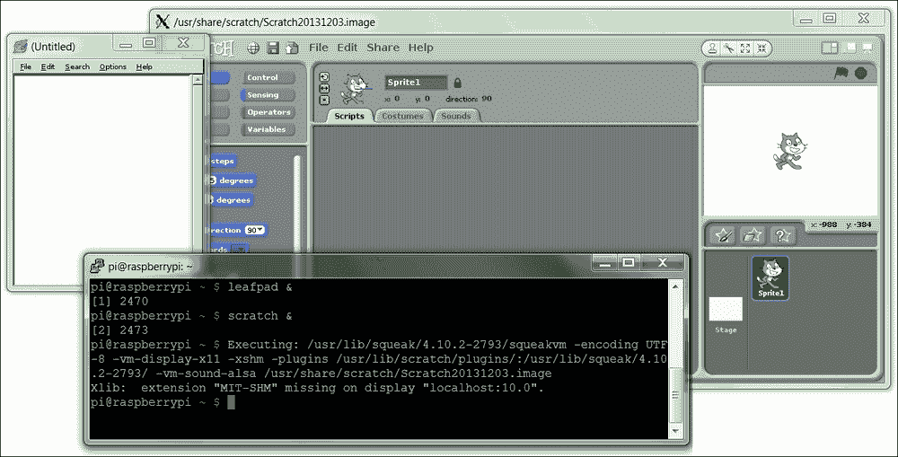

在本地显示上启用 X11 转发

可以使用 X 转发来显示在 Raspberry Pi 上运行的应用程序，在 Windows 计算机上显示。

## 准备工作

如果你正在运行最新的 Raspbian 版本，SSH 和 X11 转发将默认启用（否则，请检查 *如何工作…* 部分中解释的设置）。

## 如何操作…

Linux 和 OS X 内置了对 X11 转发的支持；但如果你使用的是 Windows，你将需要在你的计算机上安装并运行 X Windows 服务器。

从**Xming**网站（[`sourceforge.net/projects/xming/`](http://sourceforge.net/projects/xming/））下载并运行`xming`。

安装`xming`，按照安装步骤进行，包括如果你还没有的话安装**PuTTY**。你也可以从[http://www.putty.org/](http://www.putty.org/)单独下载 PuTTY。

接下来，我们需要确保我们使用的 SSH 程序在连接时启用了 X11。

对于 Windows 系统，我们将使用 PuTTY 连接到树莓派。

在**PuTTY 配置**对话框中，导航到**连接** | **SSH** | **X11**，勾选**X11 转发**复选框。如果你留空**X 显示位置**选项，它将默认为`Server 0:0`（你可以通过在 Xming 运行时将鼠标移到系统托盘中的 Xming 图标上来确认服务器编号）：

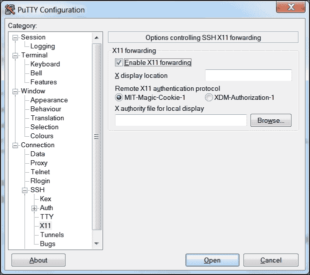

在 PuTTY 配置中启用 X11 转发

在**会话**设置中输入树莓派的 IP 地址（你也许也可以在这里使用树莓派的计算机名；默认计算机名是`raspberrypi`）。

使用合适的名称，例如`RaspberryPi`，保存设置，然后点击**打开**以连接到你的树莓派。

你可能会看到一个警告消息弹出，表明你之前没有连接到该计算机（这允许你在继续之前检查你是否一切都设置正确）。

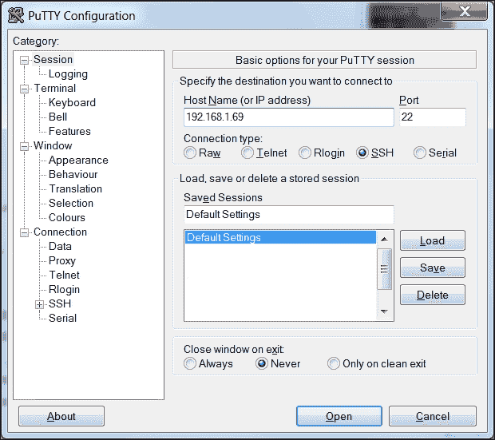

使用 PuTTY 打开到树莓派的 SSH 连接

对于 OS X 或 Linux，点击**终端**以打开到树莓派的连接。

要使用默认的`pi`用户名，IP 地址为`192.168.1.69`，请使用以下命令；`-X`选项启用 X11 转发：

```py
ssh -X pi@192.168.1.69

```

如果一切顺利，你应该会看到一个提示输入密码的提示符（记住`pi`用户的默认密码是`raspberry`）。

通过从你的计算机的开始菜单启动 Xming 程序来确保 Xming 正在运行。然后，在终端窗口中，输入通常在树莓派桌面中运行的程序，例如`leafpad`或`scratch`。稍等片刻，程序应该会出现在你的计算机桌面上（如果你收到错误，你可能忘记启动 Xming，所以请运行它并再次尝试）。

## 它是如何工作的…

X Windows 和 X11 是提供方法，使得树莓派（以及许多其他基于 Linux 的计算机）可以作为桌面的一部分显示和控制图形窗口。

要在网络连接上使 X11 转发工作，我们需要在树莓派上同时启用 SSH 和 X11 转发。执行以下步骤：

1.  要开启（或关闭）SSH，您可以在 **桌面** 的 **首选项** 菜单下访问 **Raspberry Pi 配置** 程序，然后在 **接口** 选项卡中点击 **SSH**，如下面的截图所示（SSH 在大多数发行版中通常默认启用，以帮助允许远程连接，而无需监视器来配置它）：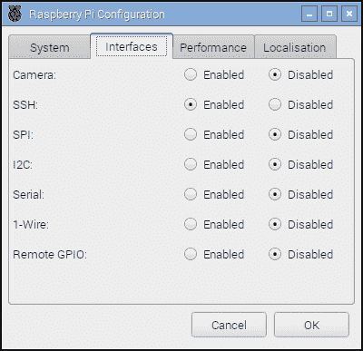

    Raspberry Pi 配置工具中的“接口”选项卡

1.  确保在 Raspberry Pi 上启用了 X11 Forwarding（再次提醒，现在大多数发行版默认都启用了此功能）。

1.  使用以下命令的 `nano`：

    ```py
    sudo nano /etc/ssh/sshd_config

    ```

1.  在 `/etc/ssh/sshd_config` 文件中查找控制 X11 Forwarding 的行，并确保它说 `yes`（前面没有 `#` 符号），如下所示：

    ```py
    X11Forwarding yes

    ```

1.  如果需要，按 *Ctrl* + *X*、*Y* 和 *Enter* 保存，并根据需要重新启动（如果需要更改它）如下所示：

    ```py
    sudo reboot

    ```

## 还有更多…

SSH 和 X 11 Forwarding 是远程控制 Raspberry Pi 的便捷方式；在接下来的几节中，我们将探讨一些如何有效使用它的额外技巧。

### 使用 X11 Forwarding 运行多个程序

如果您想运行 **X 程序**，但仍然能够使用相同的终端控制台进行其他操作，您可以通过以下方式在后台运行命令：`&`

```py
leafpad &

```

只需记住，您运行的程序越多，一切都会变得越慢。您可以通过输入 `fg` 切换到后台程序，并通过 `bg` 检查后台任务。

### 以桌面形式运行并启用 X11 Forwarding

您甚至可以通过 X11 运行完整的桌面会话，尽管它并不特别用户友好，VNC 会产生更好的结果。为了实现这一点，您必须使用 `lxsession` 而不是 `startx`（就像您通常从终端启动桌面一样）。

另一个选择是使用 `lxpanel`，它提供了一个程序菜单栏，您可以从菜单中启动和运行程序，就像在桌面上一样。

### 使用 X11 Forwarding 运行 PyGame 和 Tkinter

当运行 **PyGame** 或 **Tkinter** 脚本时，您可能会遇到以下错误（或类似错误）：

```py
_tkinter.TclError: couldn't connect to display "localhost:10.0"

```

在这种情况下，使用以下命令来修复错误：

```py
sudo cp ~/.Xauthority ~root/

```

# 使用 SMB 共享 Raspberry Pi 的主文件夹

当您将 Raspberry Pi 连接到您的网络时，您可以通过设置文件共享来访问主文件夹；这使得文件传输变得容易得多，并提供了一种快速简单的方法来备份您的数据。**服务器消息块**（**SMB**）是一种与 Windows 文件共享、OS X 和 Linux 兼容的协议。

## 准备工作

确保您的 Raspberry Pi 已开启并运行，并且与互联网有正常连接。

您还需要另一台在同一本地网络上的计算机来测试新的共享。

## 如何操作…

首先，我们需要安装 `samba`，这是一款软件，它以与 Windows 共享方法兼容的格式处理文件夹共享。

确保您使用以下命令来获取最新可用的软件包列表：`update`

```py
sudo apt-get update
sudo apt-get install samba

```

安装需要大约 20MB 的空间，并花费几分钟时间。

安装完成后，我们可以按照以下步骤复制配置文件，以便在需要时恢复默认设置：

```py
sudo cp /etc/samba/smb.conf /etc/samba/smb.conf.backup
sudo nano /etc/samba/smb.conf

```

滚动并找到名为`身份验证`的部分；将`# security = user`行更改为`security = user`。

如文件所述，此设置确保你必须输入树莓派的用户名和密码才能访问文件（这对于共享网络来说很重要）。

找到名为`共享定义`和`[homes]`的部分，将`read only = yes`行更改为`read only = no`。

这将允许我们查看并写入共享主文件夹中的文件。完成后，通过按*Ctrl* + *X*，*Y*和*Enter*保存并退出。

### 注意

如果你已将默认用户从`pi`更改为其他名称，请在以下说明中替换它。

现在，我们可以将`pi`（默认用户）添加到使用`samba`：

```py
sudo pdbedit -a -u pi

```

现在，输入密码（你可以使用与登录相同的密码或选择一个不同的密码，但避免使用默认的树莓派密码，因为这很容易被人猜到）。按照以下步骤重启`samba`以使用新的配置文件：

```py
sudo /etc/init.d/samba restart
[ ok ] Stopping Samba daemons: nmbd smbd.
[ ok ] Starting Samba daemons: nmbd smbd.

```

为了测试，你需要知道树莓派的计算机名（默认计算机名是`raspberrypi`）或其 IP 地址。你可以使用以下命令找到这两个信息：

```py
hostname

```

对于 IP 地址，添加`-I`：

```py
hostname –I

```

在网络上的另一台计算机上，在资源管理器路径中输入`\\raspberrypi\pi`地址。

根据你的网络，计算机应该能在网络上定位到树莓派，并提示输入用户名和密码。如果它无法使用主机名找到共享，你可以直接使用 IP 地址，其中`192.168.1.69`应更改为匹配的 IP 地址`\\192.168.1.69\pi`。

# 保持树莓派更新

树莓派使用的 Linux 镜像通常会更新，包括增强、修复和对系统的改进，以及添加对新硬件的支持或对最新板所做的更改。你安装的大多数软件包也可以更新。

这尤其重要，如果你计划在另一块树莓派板上（尤其是较新的板上）使用相同的系统镜像（尤其是较旧的镜像将不支持任何布线更改或替代 RAM 芯片）。新固件应在较旧的树莓派板上工作，但较旧的固件可能不与最新硬件兼容。

幸运的是，你不必每次有新版本发布时都刷新你的 SD 卡，因为你可以选择更新它。

## 准备工作

你需要连接到互联网才能更新你的系统。始终建议首先备份你的镜像（至少复制你的重要文件）。

你可以使用`uname -a`命令检查你的当前固件版本，如下所示：

```py
Linux raspberrypi 4.4.9-v7+ #884 SMP Fri May 6 17:28:59 BST 2016 armv7l GNU/Linux

```

可以使用`/opt/vc/bin/vcgencmd version`命令检查 GPU 固件，如下所示：

```py
 May  6 2016 13:53:23
Copyright (c) 2012 Broadcom
version 0cc642d53eab041e67c8c373d989fef5847448f8 (clean) (release) 
This is important if you are using an older version of firmware (pre-November 2012) on a newer board since the original Model B board was only 254 MB RAM. Upgrading allows the firmware to make use of the extra memory if available.
```

`free -h` 命令将详细显示主处理器（总 RAM 在 GPU 和 ARM 核心之间分配）可用的 RAM，并将给出以下输出：

```py
 total       used       free     shared    buffers     cached
Mem:          925M       224M       701M       7.1M        14M       123M
-/+ buffers/cache:        86M       839M
Swap:          99M         0B        99M

```

然后，在重启后重新检查前面的输出，以确认它们已被更新（尽管它们可能已经是最新版本）。

## 如何做到这一点…

在运行任何升级或安装任何软件包之前，确保你有仓库中最新软件包列表是值得的。`update` 命令获取最新可用的软件和版本列表：

```py
sudo apt-get update

```

如果你只想获取当前软件包的升级，`upgrade` 将将它们全部更新到最新：

```py
sudo apt-get upgrade

```

为了确保你正在运行最新的 Raspbian 版本，你可以运行`dist-upgrade`（警告：这可能需要一个小时左右，具体取决于需要升级的内容量）。这将执行`upgrade`将执行的所有更新，但还会删除冗余软件包并清理：

```py
sudo apt-get dist-upgrade

```

这两种方法都将升级软件，包括启动和启动时使用的固件（`bootcode.bin`和`start.elf`）。

## 还有更多…

你经常会发现你想要对你的设置进行干净安装；然而，这意味着你将不得不从头开始安装一切。为了避免这种情况，我开发了 Pi-Kitchen 项目（[`github.com/PiHw/Pi-Kitchen`](https://github.com/PiHw/Pi-Kitchen)），基于 Kevin Hill 的基础工作。该项目旨在提供一个灵活的平台，用于创建可自动部署到 SD 卡的定制设置。


Pi Kitchen 允许在开机前配置 Raspberry Pi

Pi-Kitchen 允许配置一系列口味，这些口味可以从 NOOBS 菜单中选择。每种口味都由一系列食谱组成，每个食谱都为最终操作系统提供特定的功能或特性。食谱的范围可以从为 Wi-Fi 设备设置自定义驱动程序，到映射网络上的共享驱动器，到提供开箱即用的完整功能 Web 服务器，所有这些组合起来使你的所需设置成为可能。

此项目处于测试阶段，作为一个概念验证而开发，但一旦你配置好一切，直接将完整工作的设置部署到 SD 卡上可以非常有用。最终，该项目可以与 Kevin Hill 的高级版本 NOOBS 相结合，称为 PINN（代表 PINN Is Not NOOBS），旨在为高级用户提供额外功能，例如允许操作系统和配置存储在网络或外部 USB 闪存驱动器上。
