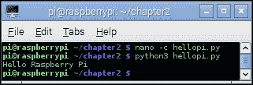
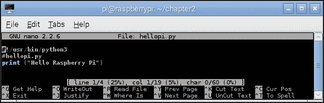
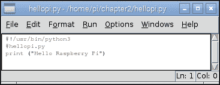
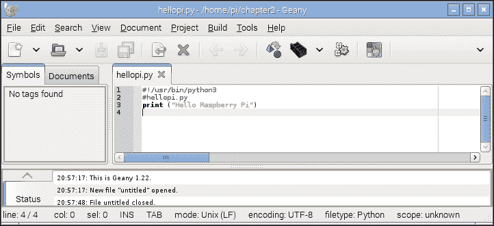
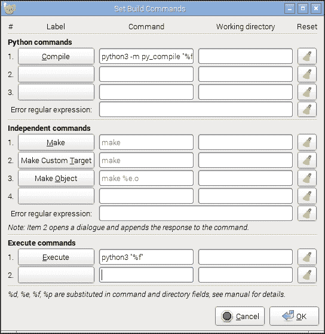
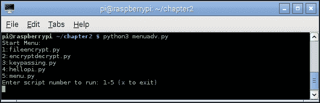

# 第二章. 从 Python 字符串、文件和菜单开始

在本章中，我们将涵盖以下主题：

+   处理文本和字符串

+   使用文件和处理错误

+   创建启动菜单

+   创建一个自我定义的菜单

# 介绍

在本章中，我们将讨论如何使用 Python 通过打乱字母来执行一些基本的加密。这将介绍一些基本的字符串操作、用户输入，并逐步创建可重用的模块和图形用户界面。

接下来，我们将创建一些有用的 Python 脚本，可以将它们添加到启动时运行或在需要时快速运行的命令，提供对常用或频繁使用的命令的快捷方式。进一步来说，我们将利用线程来运行多个任务，并引入类来定义多个对象。

由于任何编程练习的传统做法都是以 *Hello World* 示例开始，我们现在就从这个例子开始。

使用 `nano` 创建 `hellopi.py` 文件，如下所示：

```py
nano -c hellopi.py

```

在我们的 `hellopi.py` 文件中，添加以下代码：

```py
#!/usr/bin/python3
#hellopi.py
print ("Hello Raspberry Pi")
```

完成后，保存并退出（*Ctrl* + *X*，*Y*，和 *Enter*）。要运行文件，请使用以下命令：

```py
python3 hellopi.py

```

恭喜，您已经创建了您的第一个程序！

您的结果应类似于以下截图：



Hello Raspberry Pi 输出

# 处理文本和字符串

Python 的一个良好起点是了解基本的文本处理和字符串。字符串是一组字符作为一个值存储在一起。正如您将学到的，它们可以被视为字符的简单列表。

我们将创建一个脚本来获取用户的输入，使用字符串操作来交换字母，并打印出编码后的消息。然后我们将通过演示如何在不透露编码方法的情况下在各方之间传递编码消息，同时展示如何在其他 Python 模块中重用代码段来扩展这个示例。

## 准备就绪

您可以使用大多数文本编辑器来编写 Python 代码。它们可以直接在 Raspberry Pi 上使用，或者通过 VNC 或 SSH 远程使用。

以下是一些与 Raspberry Pi 一起提供的文本编辑器：

+   **nano**：这个文本编辑器在终端可用，包括语法高亮和行号（使用 `-c` 选项）。请参考以下截图：

    nano 命令行编辑器

+   **IDLE3**：这个 Python 编辑器包括语法高亮功能、上下文帮助，并且可以直接从编辑器中运行脚本（按 *F5*）。此程序需要 X-Windows（Debian 桌面）或 X11 转发以远程运行。本书将使用 Python 3，所以请确保您运行 IDLE3（而不是 IDLE），它将使用 Python 3 来运行脚本，如下面的截图所示：

    IDLE3 Python 编辑器

+   **Geany**：这个文本编辑器提供了一个**集成开发环境**（**IDE**），支持多种编程语言，语法高亮，自动完成和易于代码导航。这是一个功能丰富的编辑器，但对于初学者来说可能难以使用，并且在 Raspberry Pi 上运行时有时可能会变慢。再次提醒，您需要使用 Debian 桌面或 X11 转发来运行此编辑器。请参考以下截图：

    Geany IDE

    要安装 Geany，请使用以下命令，然后从**编程**菜单项运行**Geany**：

    ```py
    sudo apt-get install geany

    ```

    为了确保当你点击**执行**按钮（运行你的脚本）时 Geany 使用 Python 3，你需要更改**构建**命令。加载`hellopi.py`，然后点击**构建**菜单并选择**设置构建命令**。在出现的窗口中，如图所示，将**编译**和**执行**部分中的`python`更改为`python3`。Python 在运行时总是自动编译（生成临时的`.pyc`文件），所以你不需要使用**编译**按钮，除非你可能需要检查代码的语法：

    

    Geany 为 Python 3 的构建命令设置

如果你将 Raspberry Pi 的`home`目录通过网络共享（请参阅第一章中的*使用 SMB 共享 Raspberry Pi 的 home 文件夹*菜谱），你可以在另一台计算机上编辑文件。但是请注意，如果你使用 Windows，你必须使用支持 Linux 行结束符的编辑器，例如 Notepad++（你不应该使用标准的记事本程序）。

要为你的 Python 脚本创建空间，我们将使用以下命令在你的`home`目录中添加一个`python_scripts`文件夹：

```py
mkdir ~/python_scripts

```

现在，你可以打开这个文件夹，并在需要时使用以下命令列出文件：

```py
cd ~/python_scripts
ls

```

### 小贴士

你可以使用**Tab**键帮助在终端中完成命令，例如，键入`cd ~/pyt`然后按**Tab**键将为你完成命令。如果有多个以`pyt`开头的选项，再次按**Tab**键将列出它们。

要重复或编辑较旧的命令，请使用上箭头键和下箭头键在较旧和较新的命令之间切换，根据需要操作。

## 如何操作…

按照以下方式创建`encryptdecrypt.py`脚本：

```py
#!/usr/bin/python3
#encryptdecrypt.py

#Takes the input_text and encrypts it, returning the result
def encryptText(input_text,key):
  input_text=input_text.upper()
  result = ""
  for letter in input_text:
    #Ascii Uppercase 65-90  Lowercase 97-122 (Full range 32-126)
    ascii_value=ord(letter)
    #Exclude non-characters from encryption
    if (ord("A") > ascii_value) or (ascii_value > ord("Z")):
      result+=letter
    else:
      #Apply encryption key
      key_value = ascii_value+key
      #Ensure we just use A-Z regardless of key
      if not((ord("A")) < key_val < ord("Z")):
        key_val = ord("A")+(key_val-ord("A"))\
                         %(ord("Z")-ord("A")+1)
      #Add the encoded letter to the result string
      result+=str(chr(key_value))
  return result

#Test function
def main():
  print ("Please enter text to scramble:")
  #Get user input
  try:
    user_input = input()
    scrambled_result = encryptText(user_input,10)
    print ("Result: " + scrambled_result)
    print ("To un-scramble, press enter again")
    input()
    unscrambled_result = encryptText(scrambled_result,-10)
    print ("Result: " + unscrambled_result)
  except UnicodeDecodeError:
    print ("Sorry: Only ASCII Characters are supported")

main()
#End
```

### 小贴士

在这个菜谱的*还有更多…*部分，我们将把`main()`更改为以下代码：

```py
if __name__=="__main__":
  main()
```

如果你想跳过这一部分，请确保你在`encryptdecrypt.py`文件中包含这个更改，因为我们稍后会用到它。

## 它是如何工作的…

上述脚本实现了一种非常基本的通过称为**凯撒密码**的简单字符替换形式来打乱文本的方法。这种方法是以罗马皇帝凯撒命名的，他最初使用这种方法向他的军队发送秘密命令。

该文件定义了两个函数，`encryptText()`和`main()`。

当脚本运行时，`main()`函数使用`input()`命令获取用户的输入。结果存储在`user_input`变量中（该命令将在用户按下*Enter*键之前等待），如下所示：

```py
user_input = input()
```

### 注意

`input()`函数不会处理非 ASCII 字符，因此我们使用`try…except`来处理这种情况，这会导致抛出`UnicodeDecodeError`。有关使用`try…except`的更多信息，请参阅本章的*使用文件和处理错误*配方。

我们将使用两个参数调用`encryptText()`函数，即要加密的文本和密钥。文本加密后，结果将被打印出来：

```py
scrambled_result = encryptText(user_input,10)
print ("Result: " + scrambled_result)
```

最后，我们将使用`input()`再次等待用户输入（在这种情况下，提示按*Enter*；任何其他输入都将被忽略）。现在，我们将通过再次调用`encryptText()`并使用密钥的负值来反转加密，并显示结果，结果应该是原始消息。

`encryptText()`函数通过将消息中的字母替换为字母表中另一个字母（由加密`key`指定的字母数量决定）来执行一种简单的加密形式。这样，当加密`key`为`2`时，字母`A`将变为`C`。

为了简化过程，该函数将所有字符转换为大写。这使得我们可以使用 ASCII 字符集轻松地将每个字符转换为数字；字母`A`表示为`65`，而`Z`表示为`90`。这是通过`input_text=input_text.upper()`实现的，然后使用`ord(letter)`将其转换为 ASCII 值，这给我们提供了字符的数字表示。ASCII 是一个将数字 0 到 254（一个 8 位值）映射到常用字符和符号的标准：

| A | B | C | D | E | F | G | H | I | J | K | L | M |
| --- | --- | --- | --- | --- | --- | --- | --- | --- | --- | --- | --- | --- |
| 65 | 66 | 67 | 68 | 69 | 70 | 71 | 72 | 73 | 74 | 75 | 76 | 77 |
| **N** | **O** | **P** | **Q** | **R** | **S** | **T** | **U** | **V** | **W** | **X** | **Y** | **Z** |
| 78 | 79 | 80 | 81 | 82 | 83 | 84 | 85 | 86 | 87 | 88 | 89 | 90 |

> 大写字母的 ASCII 表

接下来，我们将确保我们有一个空字符串，我们可以在这个字符串中构建我们的结果（`result = ""`），同时我们也将我们的加密`key`设置为密钥值。

`input_text`变量包含我们的字符串，它被存储为一个字母列表（这与数组类似）。我们可以使用`input_text[0]`访问列表中的第一个项目，依此类推；然而，Python 还允许我们使用`for…in`循环遍历列表，依次访问每个项目。

`for letter in input_text:` 这一行代码允许我们通过遍历 `input_text` 中的每个项目（在这种情况下，字符串中的字母）来将其拆分，并且将字母设置为该项目。所以如果 `input_text` 等于 `HELLO`，它将运行命令下缩进的所有代码五次；每次，`letter` 变量将被设置为 `H`、`E`、`L`、`L`，最后是 `O`。这使得我们可以单独读取每个字母，处理它，并将新的加密字母添加到 `result` 字符串中。

下一个部分，`if (ord("A") > ascii_value) or (ascii_value > ord("Z")):` 检查我们正在查看的字符是否不在 `A` 和 `Z` 之间，这意味着它可能是一个数字或标点符号。在这种情况下，我们将从加密中排除该字符（直接将字符不变地传递到 `result` 字符串中）。

如果字母在 `A` 和 `Z` 之间，我们可以将我们的加密 `key` 的值添加到我们的字母的值，以获得我们新的编码字母。也就是说，对于加密 `key` 为 `10` 的情况，我们在输出中最终得到以下字母集：

```py
Input Letter:  A B C D E F G H I J K L M N O P Q R S T U V W X Y Z
Output Letter: K L M N O P Q R S T U V W X Y Z A B C D E F G H I J

```

由于我们希望加密的消息易于书写，我们已将输出限制在 `A` 和 `Z` 之间。所以，如果字母以 `X` 开头，我们希望它绕回并从 `A` 继续计数。我们可以通过使用 `%`（模数）函数来实现这一点，它给出了当我们用一个数除以另一个数时的余数值。所以，如果 `X` 是 `24`，我们加上 `10` 得到 `34`。`34%26`（其中 `26` 是字母的总数）的值是 `8`。从 `A` 开始计数 `8`，我们到达 `H`。

然而，在 ASCII 中，字母 `A` 是数字 `65`，因此我们将从 `key_value` 中减去这个偏移量，然后在得到模数值后将其加回。以下代码确保我们将 ASCII 值限制在 `A` 和 `Z` 之间：

```py
#Ensure we just use A-Z regardless of key
if not((ord("A")) < key_value < ord("Z")):
  key_value = ord("A")+(key_value-ord("A"))\
                       %(ord("Z")-ord("A")+1)
```

实际上，如果值不在 `A` 或 `Z` 的值之间，我们将允许值通过（通过使用 `A` 和 `Z` 之间字母的总数计算模数，即 `26`）。这也适用于密钥大于 `26` 的情况，或者我们在相反方向计数时，例如，如果加密密钥是负数，那么解密密钥就是正数。

最后，我们可以通过使用 `chr()` 和 `str()` 函数将 `key_value` 转换回字母，并将其添加到结果字符串中。

### 注意

注意，我们使用 `\` 来将代码拆分到另一行，这不会影响计算。Python 对换行非常挑剔，在某些情况下，你可以在代码中找到一个自然的断点，并用回车换行符分隔行，然而在其他时候，我们必须使用 `\` 符号强制换行。

当然，在很短的时间内，这种简单的加密方法很容易被破解。记住，在加密结果重复之前，只有 25 种可能的组合可以选择（26 的倍数将导致没有任何加密）。

## 还有更多…

你可以尝试这个简单的实验。目前，使用这种基本的加密形式，你将向任何你想阅读你信息的人提供方法和密钥。然而，如果你想在不发送方法和密钥的情况下发送安全的传输会发生什么呢？

答案是发送相同的信息往返三次，如下面的图示所示：


我们不需要与其他人交换加密密钥

第一次，我们将对其进行加密并发送给另一方。然后他们将以自己的加密方式再次加密并发送回来。此时，信息已经应用了两层加密。我们现在可以移除我们的加密并返回。最后，他们将只收到他们的加密信息，他们可以移除并阅读信息。

只需记住，凯撒密码只有 25 种有用的加密组合，因此他们可能意外地解密了信息。

我们可以使用之前的文件作为模块，通过以下`import`命令使用：

```py
import encryptdecrypt as ENC
```

这将允许使用`ENC`作为参考，访问`encryptdecrypt`文件中的任何函数。当导入此类文件时，它将运行通常会被运行的任何代码；在这种情况下，`main()`函数。

### 注意

为了避免这种情况，我们可以只将`main()`函数的调用改为在文件直接运行时发生。

如果文件直接运行，Python 将`__name__`设置为`"__main__"`全局属性。通过使用以下代码，我们可以在其他脚本中重用此 Python 脚本中的函数，而无需运行任何其他代码：

```py
if __name__=="__main__":
  main()
```

在与`encryptdecrypt.py`相同的目录下创建`keypassing.py`脚本，使用以下代码：

```py
#!/usr/bin/python3
#keypassing.py
import encryptdecrypt as ENC

KEY1 = 20
KEY2 = 50

print ("Please enter text to scramble:")
#Get user input
user_input = input()
#Send message out
encodedKEY1 = ENC.encryptText(user_input,KEY1)
print ("USER1: Send message encrypted with KEY1 (KEY1): " + encodedKEY1)
#Receiver encrypts the message again
encodedKEY1KEY2 = ENC.encryptText(encodedKEY1,KEY2)
print ("USER2: Encrypt with KEY2 & returns it (KEY1+KEY2): " + encodedKEY1KEY2)
#Remove the original encoding
encodedKEY2 = ENC.encryptText(encodedKEY1KEY2,-KEY1)
print ("USER1: Removes KEY1 & returns with just KEY2 (KEY2): " + encodedKEY2)
#Receiver removes their encryption
message_result = ENC.encryptText(encodedKEY2,-KEY2)
print ("USER2: Removes KEY2 & Message received: " + message_result)
#End
```

在运行前面的脚本时，我们可以看到，其他人不需要知道我们使用的加密密钥，任何拦截信息的人都将无法看到其内容。该脚本产生以下输出：

```py
Please enter text to scramble:
"A message to a friend."
USER1: Send message encrypted with KEY1 (KEY1): U GYMMUAY NI U ZLCYHX.
USER2: Encrypt with KEY2 & returns it (KEY1+KEY2): S EWKKSYW LG S XJAWFV.
USER1: Removes KEY1 & returns with just KEY2 (KEY2): Y KCQQYEC RM Y DPGCLB.
USER2: Removes KEY2 & Message received: A MESSAGE TO A FRIEND.

```

这种方法被称为**三次传递协议**，由 Adi Shamir 于 1980 年开发（[`en.wikipedia.org/wiki/Three-pass_protocol`](http://en.wikipedia.org/wiki/Three-pass_protocol)）。这种方法的一个特定缺点是，第三方可能拦截信息（所谓的中间人攻击）并通过插入已知值和分析响应来识别加密方法。

# 使用文件和处理错误

除了易于字符串处理外，Python 还允许你轻松地读取、编辑和创建文件。因此，通过在先前的脚本上构建，我们可以利用我们的`encryptText()`函数来编码完整的文件。

读取和写入文件可能非常依赖于脚本直接控制之外的因素，例如我们试图打开的文件是否存在或文件系统是否有空间存储新文件。因此，我们还将探讨如何处理异常并保护可能产生错误的操作。

## 准备工作

以下脚本将允许你通过命令行指定一个文件，该文件将被读取并编码以生成输出文件。创建一个名为`infile.txt`的小文本文件并保存它，以便我们可以测试脚本。它应包含类似于以下的消息：

```py
This is a short message to test our file encryption program.
```

## 如何操作…

使用以下代码创建`fileencrypt.py`脚本：

```py
#!/usr/bin/python3
#fileencrypt.py
import sys #Imported to obtain command line arguments
import encryptdecrypt as ENC

#Define expected inputs
ARG_INFILE=1
ARG_OUTFILE=2
ARG_KEY=3
ARG_LENGTH=4

def covertFile(infile,outfile,key):
  #Convert the key text to an integer
  try:
    enc_key=int(key)
  except ValueError:
    print ("Error: The key %s should be an integer value!" % (key))
  #Code put on to two lines
  else:
    try:
      #Open the files
      with open(infile) as f_in:
        infile_content=f_in.readlines()
    except IOError:
      print ("Unable to open %s" % (infile))
    try:
      with open(outfile,'w') as f_out:
        for line in infile_content:
          out_line = ENC.encryptText(line,enc_key)
          f_out.writelines(out_line)
    except IOError:
      print ("Unable to open %s" % (outfile))
    print ("Conversion complete: %s" % (outfile))
  finally:
    print ("Finish")

#Check the arguments
if len(sys.argv) == ARG_LENGTH:
  print ("Command: %s" %(sys.argv))
  covertFile(sys.argv[ARG_INFILE], sys.argv[ARG_OUTFILE], sys.argv[ARG_KEY])
else:
  print ("Usage: fileencrypt.py infile outfile key")
#End
```

要运行脚本，请使用以下命令（在这里，`infile`可以是任何我们想要加密的文本文件，`outfile`是我们的加密版本，`key`是我们希望使用的密钥值）：

```py
python3 fileencrypt.py infile outfile key

```

例如，要使用`30`作为密钥加密`infile.txt`并输出为`encrypted.txt`，请使用以下命令：

```py
python3 fileencrypt.py infile.txt encrypted.txt 30

```

要查看结果，使用`less encrypted.txt`。按*Q*键退出。

要使用`-30`作为密钥解密`encrypted.txt`并输出为`decrypted.txt`，请使用以下命令：

```py
python3 fileencrypt.py encrypted.txt decrypted.txt -30

```

要查看结果，使用`less decrypted.txt`。按*Q*键退出。

## 它是如何工作的…

脚本要求我们使用命令行提供的参数。我们将通过导入名为`sys`的 Python 模块来访问它们。就像我们之前做的那样，我们也将使用`import`命令导入我们的`encryptdecrypt`模块。我们将使用`as`部分来允许我们使用`ENC`来引用它。

接下来，我们将设置值来定义每个命令行参数将代表什么。当你运行它时，你会看到`sys.argv[]`是一个值列表，如下所示：

```py
['fileencrypt.py', 'infile.txt', 'encrypted.txt', '30']
```

因此，输入文件在列表中的索引是`1`（索引始终从 0 开始），然后是输出文件，最后是密钥，参数总数为`ARG_LENGTH=4`。

接下来，我们将定义`convertFile()`函数，我们将在下一块代码中调用它。

为了避免错误，我们将检查`sys.argv`值的长度是否与命令行期望的参数数量相匹配。这将确保用户已经提供了足够的参数，我们不会尝试引用`sys.argv[]`列表中不存在的项。否则，我们将返回一条简短的消息，解释我们期望的内容。

我们现在将使用命令行值调用`convertFile()`函数，并利用 Python 内置的异常处理功能来确保错误得到相应的响应。

`try…except`代码允许你尝试运行一些代码，并在程序内部处理任何异常（错误），而不是让一切突然停止。

`try`代码伴随着以下四个可选部分：

+   `except ValueError:` – 当发生错误时，可以指定并处理特定类型的异常，具体取决于我们希望处理的错误（即，对于`ValueError`，我们可以检查值是否为浮点值并将其转换为整数，或者提示输入新的值）。根据需要，可以使用`except (ValueError, IOError)`捕获多个异常。

+   `except:` – 这是一个通用的捕获情况，其中我们可以处理我们尚未处理的任何其他异常。对于可能从其他地方调用的代码，我们可能还希望使用`raise`命令再次引发异常，以便其他程序部分可以处理它（例如，作为 GUI 的一部分，我们可以警告用户输入不正确，而无需在此阶段这样做）。通常，你应该处理特定的异常或确保再次引发它，以便特定的错误在失败时可见；如果根本未处理，Python 将在终端上报告它，并附带发生错误的函数的跟踪信息。

+   `else:` – 如果`try`代码成功且没有引发异常，则始终执行此代码段；然而，此代码中的任何错误都不会由它所属的`try…except`部分处理。

+   `finally:` – 无论是否引发异常或`try`代码运行无问题，此代码总是执行。

如果你熟悉其他语言，你会发现`try…except`类似于`try…catch`，`raise`和`throw`是等效的。处理异常可以是一种相当的艺术形式；然而，使你的代码能够优雅有效地处理问题是良好设计的一部分。在许多情况下，捕捉出错的情况与成功执行预期功能一样重要。

如果将`key`参数转换为整数没有问题，我们将继续打开指定的输入文件，并将内容读取到`infile_content`列表中。这将包含文件内容，按单独的行分割成列表。

### 注意

在此示例中，我们将使用一种稍微不同的方法在`print`语句中显示值。

考虑以下代码作为示例：

print ("错误：键%s 应该是整数值！"%key)

这允许我们使用`%s`符号来确定键值打印的位置，也可以指定格式（`%s`是一个字符串）。对于数值，如浮点数和整数，我们可以使用`%d`显示整数，`%f`用于浮点数，甚至`%.4f`将值限制为四位小数。

你可能已经注意到我们使用`with…as…:`部分打开了文件。这是一种特殊的打开文件方式，它将确保文件完成操作后关闭（即使有错误）。请参考以下代码：

```py
try:
  #Open the files
  with open(infile) as f_in:
    infile_content=f_in.readlines()
except IOError:
  print ("Unable to open %s" % (infile))
```

这相当于以下内容：

```py
try:
  f_in = open(infile)
  try:
    infile_content=f_in.readlines()
  finally:
    f_in.close()
  except IOError:
    print ("Unable to open %s" % (infile))
```

如果在打开文件时出现异常（例如，如果文件不存在，它将引发`IOError`），我们可以向用户标记提供的文件名/路径存在问题。我们还将使用`except:`单独处理可能遇到的任何其他问题，例如编码类型或非文本文件。

接下来，我们将使用`'w'`模式打开一个文件作为可写文件进行输出。如果文件不存在，它将创建一个新文件；否则，它将覆盖文件。我们还将有使用`'a'`模式追加到文件的选择。我们将逐项遍历`infile_content`中的每个项目，通过传递它通过我们的`ENC.encryptText()`函数并将行写入`f_out`文件来转换每一行。再次强调，当我们完成`with…as…:`部分时，文件将被关闭，转换完成。

# 创建启动菜单

我们现在将应用之前脚本中介绍的方法，并将它们重新应用于创建一个我们可以自定义以展示一系列快速运行的命令和程序的菜单。

## 如何实现...

使用以下代码创建`menu.py`脚本：

```py
#!/usr/bin/python3
#menu.py
from subprocess import call

filename="menu.ini"
DESC=0
KEY=1
CMD=2

print ("Start Menu:")
try:
  with open(filename) as f:
    menufile = f.readlines()
except IOError:
  print ("Unable to open %s" % (filename))
for item in menufile:
  line = item.split(',')
  print ("(%s):%s" % (line[KEY],line[DESC]))
#Get user input
running = True
while(running):
  user_input = input()
  #Check input, and execute command
  for item in menufile:
    line = item.split(',')
    if (user_input == line[KEY]):
      print ("Command: " + line[CMD])
      #call the script
      #e.g. call(["ls", "-l"])
      commands = line[CMD].rstrip().split()
      print (commands)
      running = False
      #Only run command is one if available
      if len(commands):
        call(commands)
  if (running==True):
    print ("Key not in menu.")
print ("All Done.")
#End
```

创建一个包含以下菜单项和命令的`menu.ini`文件：

```py
Start Desktop,d,startx
Show IP Address,i,hostname -I
Show CPU speed,s,cat /sys/devices/system/cpu/cpu0/cpufreq/scaling_cur_freq
Show Core Temperature,t,sudo /opt/vc/bin/vcgencmd measure_temp
Exit,x,
```

您可以向列表中添加自己的命令，创建自己的自定义启动菜单。脚本将假设`menu.ini`文件格式正确，因此如果您遇到错误（例如`ErrorIndex`），那可能是因为文件不符合预期（例如缺少逗号或空白行）。我们可以使用`except ErrorIndex:`来处理任何错误，但我们最好突出显示输入文件中存在问题，以便可以修复。

## 工作原理...

为了在 Python 脚本中执行其他程序，我们需要使用`call`命令。这次，我们只想使用`subprocess`模块的`call`部分，因此我们可以简单地使用`from subprocess import call`。这仅仅导入了我们需要的部分。

我们将打开文件并将所有行读入一个`menufile`列表。然后我们可以使用`item.split(',')`处理每个项目（或文件的每一行），这将创建一个新的列表，该列表由`','`符号分隔的行的各个部分组成，如下所示：

```py
line = ['Start Desktop', 'd', 'startx\n']
```

如`print`语句所示，我们现在可以独立访问每个部分，因此我们可以打印出执行特定命令所需按下的键以及命令的描述。

一旦我们打印出整个命令菜单，我们将等待用户输入。这是在`while`循环中完成的；它将继续运行，直到我们将`running`内部的条件设置为`False`。这意味着如果按下了无效的键，我们可以输入另一个键，直到选择了一个命令或使用了退出项。然后我们将检查输入键是否与菜单项分配的键匹配，如下所示：

```py
user_input == line[KEY]
```

如果有匹配项，我们将提取我们希望调用的命令。`call`命令要求命令及其参数是一个列表，因此我们将使用`.split()`将命令部分拆分成一个列表（其中命令中的每个空格都是列表中的新项）。此外，请注意`startx`之后有`/n`，这是来自`menu.ini`文件的行结束符。我们将首先使用`.rstrip()`移除它，该函数会从字符串的末尾移除任何空白（空格、制表符或换行符）。

一旦命令被格式化为参数列表，我们将设置 `running` 为 `False`（这样 `while` 循环就不会进入另一个循环），执行我们的命令，并完成脚本。如果用户选择 `x`，则不会有 `commands` 设置，这样我们就可以在未调用任何内容的情况下退出菜单。脚本会生成一个包含选项的小菜单，如下所示：

```py
Start Menu:
(d):Start Desktop
(i):Show IP Address
(s):Show CPU speed
(t):Show Core Temperature
(x):Exit
g
Key not in menu.
i
Command: hostname -I
['hostname', '-I']
All Done.

```

## 更多内容…

为了让脚本每次都能运行，我们将启动树莓派；我们可以从 `.bash_profile` 中调用它，这是一个在用户配置文件加载时运行的 bash 脚本。

按照以下方式创建或编辑文件：

```py
nano -c ~/.bash_profile

```

添加以下命令（假设 `menu.py` 位于 `/home/pi/python_scripts` 目录中）：

```py
cd /home/pi/python_scripts
python3 menu.py

```

完成后，保存并退出（*Ctrl* + *X*，*Y*，和 *Enter*）。

下次您启动树莓派时，您将有一个菜单可以从中运行您喜欢的命令，而无需记住它们。

### 注意

您也可以直接运行 Python 脚本，而不需要 `python3` 命令，使它们可执行，如下所示：

```py
chmod +x menu.py

```

现在输入 `./menu.py`，脚本将使用文件第一行定义的程序运行，如下所示：

```py
#!/usr/bin/python3
```

# 创建一个自定义菜单

虽然前面的菜单对于定义我们在运行树莓派时可能使用的最常见命令和功能非常有用，但我们会经常改变我们正在做的事情或开发脚本来自动化复杂任务。

为了避免需要不断更新和编辑 `menu.ini` 文件，我们可以创建一个可以列出已安装脚本并从其中动态构建菜单的菜单，如下面的截图所示：



当前目录中所有 Python 脚本的菜单

## 如何做到这一点…

使用以下代码创建 `menuadv.py` 脚本：

```py
#!/usr/bin/python3
#menuadv.py
import os
from subprocess import call

SCRIPT_DIR="." #Use current directory
SCRIPT_NAME=os.path.basename(__file__)

print ("Start Menu:")
scripts=[]
item_num=1
for files in os.listdir(SCRIPT_DIR):
  if files.endswith(".py"):
    if files != SCRIPT_NAME:
      print ("%s:%s"%(item_num,files))
      scripts.append(files)
      item_num+=1
running = True
while (running):
  print ("Enter script number to run: 1-%d (x to exit)" % (len(scripts)))
  run_item = input()
  try:
    run_number = int(run_item)
    if len(scripts) >= run_number > 0:
      print ("Run script number:" + run_item)
      commands = ["python3",scripts[run_number-1]]
      print (commands)
      call(commands)
      running = False
  except ValueError:
    #Otherwise, ignore invalid input
    if run_item == "x":
      running = False
      print ("Exit")
#End
```

## 它是如何工作的…

此脚本允许我们采取不同的方法。而不是预先定义命令或应用程序的列表，我们只需保留一个有用的脚本文件夹，并扫描它以创建一个可供选择的列表。在这种情况下，菜单将只列出 Python 脚本，并调用它们而不带任何命令行选项。

为了能够访问目录中的文件列表，我们可以使用 `os` 模块的 `os.listdir()` 函数。此函数允许我们指定一个目录，它将返回该目录中文件和目录的列表。

使用 `SCRIPT_DIR="."` 将允许我们在当前目录（即脚本运行的目录）中搜索。我们可以指定一个绝对路径（即 `"//home/pi/python_scripts"`），一个相对路径（即 `"./python_scripts_subdirectory"`），或者从当前目录导航到结构中的其他目录（即 `"../more_scripts"`，其中 `..` 符号将从当前目录向上移动一个级别，然后进入 `more_scripts` 目录，如果它存在的话）。

### 注意

如果目录不存在，将会抛出一个异常（`OSError`）。由于这个菜单的目的是简单地运行并显示列表，我们最好让异常引发错误并停止脚本。这将鼓励用户修复目录而不是尝试处理错误（例如，每次都提示输入另一个路径）。当脚本不运行时，用户也更容易找到并纠正路径。

我们还将使用`os.path.basename(__file__)`获取脚本的名称，这允许我们稍后从列表选项中排除`menuadv.py`脚本。

我们将创建一个空的`scripts`列表，并确保将`item_num`初始化为`1`。现在，我们将在`for…in`循环中直接调用`os.listdir(SCRIPT_DIR)`，这样我们就可以处理它返回的每个目录或文件名。接下来，我们可以使用`endswith()`函数（另一个有用的字符串函数）检查每个项目的末尾，这允许我们查找字符串的特定结尾（在这种情况下，Python 脚本的结尾）。在这个阶段，如果找到，我们还可以从列表中排除`menuadv.py`脚本。

我们将脚本的名称与`item_num`一起打印出来，并将其添加到脚本列表中，最后递增`item_num`以确保它对下一个项目是正确的。

我们现在将提示用户输入相关的脚本编号（介于`1`和脚本总数之间），并等待用户通过`input()`输入。脚本将检查输入是否有效。如果是数字，它将停留在`try`部分，然后我们可以检查该数字是否在正确的范围内（列表中的脚本编号之一）。如果正确，脚本将使用`['python3', 'scriptname.py']`和之前的`call()`函数调用。如果输入不是数字（例如，`x`），它将引发`ValueError`异常。在`ValueError`异常中，我们可以检查是否按下了`x`并通过将`running`设置为`False`退出`while`循环（否则，循环将重新打印提示并等待新输入）。

脚本现在已完成。

### 小贴士

如果需要，您可以调整前面的脚本以支持其他类型的脚本。只需将其他文件扩展名，如`.sh`，添加到脚本列表中，并使用`sh`或`bash`而不是`python3`来调用。

## 更多内容…

我们可以通过将所有有用的脚本放在一个地方并将`menu`脚本添加到路径中来进一步扩展这个例子。

### 替代脚本位置

虽然这并非完全必要（默认情况下，脚本将在当前目录中查找），但创建一个合适的位置来保存您希望与菜单一起使用的脚本将很有用。这可以是在您的`home`文件夹中的一个位置（`~`是`home`文件夹路径的缩写，默认情况下是`/home/pi`）。以下是一个示例命令行：

```py
mkdir ~/menupy
cd ~/menupy

```

### 小贴士

要复制文件，你可以使用 `cp sourcefile targetfile` 命令。如果你使用 `-r` 选项，如果目录不存在，它也会创建该目录。要移动或重命名文件，请使用 `mv sourcefile targetfile` 命令。要删除文件，请使用 `rm targetfile` 命令。你必须使用 `-r` 选项来删除目录。

确保如果脚本不在同一位置，更新 `SCRIPT_DIR` 的路径以指向所需的位置。

### 将脚本添加到 PATH

如前所述，我们可以将此脚本添加到启动文件，例如 `.bash_profile`，以便用户登录到 Raspberry Pi 时出现菜单。或者，我们可以将这些脚本放入如 `/home/pi/bin` 这样的文件夹中，我们可以在其中包含全局值调用 `PATH`。`PATH` 设置是一系列目录，当脚本和程序尝试定位不在当前目录中的文件时（通常是已安装的程序和软件，但也包括常见的配置文件和脚本）会检查这些目录。

这将允许我们无论当前在哪个目录下都能运行脚本。

我们可以使用以下命令查看当前的 `PATH` 设置：

```py
echo $PATH
/usr/local/sbin:/usr/local/bin:/usr/sbin:/usr/bin:/sbin:/bin:/usr/local/games:/usr/games

```

`PATH` 设置的实际内容将取决于你使用的发行版的初始设置，以及你安装的应用程序。

如果 `/home/pi/bin` 没有包含在内，我们可以使用以下命令临时添加，直到下一次启动：

```py
PATH=/home/pi/bin:$PATH

```

我们也可以将其添加到 `.bash_profile` 中，为当前用户每次设置，如下所示：

```py
PATH=$HOME/bin:$PATH
export PATH

```

下次我们重启时，`PATH` 设置将如下所示（对于名为 `pi` 的用户）：

```py
/home/pi/bin:/usr/local/sbin:/usr/local/bin:/usr/sbin:/usr/bin:/sbin:/bin:/usr/local/games:/usr/games

```

### 注意

当项目通过 `PATH` 自动定位时，可能很难找到特定版本的一个文件或程序。为了克服这个问题，在文件名/命令前使用 `whereis`，它将列出所有可以找到的位置。

最后，如果你确实将脚本移动到 `bin` 目录，请确保更新 `os.listdir("//home/pi/bin")` 中的路径，以便定位和列出你希望在菜单中显示的脚本。
