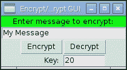
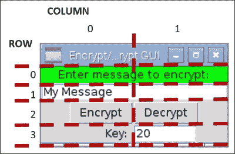
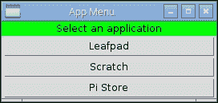
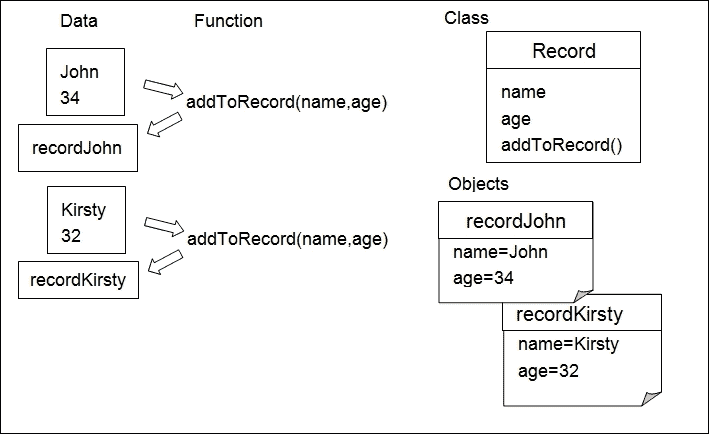
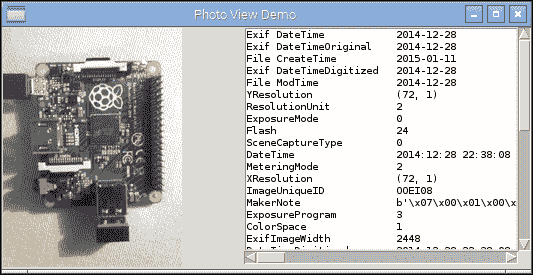
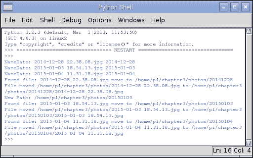
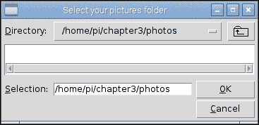

# 第三章. 使用 Python 进行自动化和生产力

在本章中，我们将涵盖以下主题：

+   使用 Tkinter 创建图形用户界面

+   创建图形化启动菜单应用程序

+   在应用程序中显示照片信息

+   自动组织您的照片

# 简介

到目前为止，我们主要关注的是命令行应用程序；然而，树莓派的功能远不止命令行。通过使用 **图形用户界面**（**GUIs**），通常更容易从用户那里获取输入并以更自然的方式提供反馈。毕竟，我们不断地处理多个输入和输出，所以为什么我们非得限制自己使用命令行的过程格式，而不必这样做呢？

幸运的是，Python 可以支持这一点。与其他编程语言类似，如 Visual Basic 和 C/C++/C#，这可以通过提供标准控件的前构建对象来实现。我们将使用一个名为 **Tkinter** 的模块，它提供了一系列控件（也称为 **小部件**）和工具，用于创建图形应用程序。

首先，我们将使用之前在 *Working with text and strings* 章节中 *How to do it…* 小节讨论的 `encryptdecrypt.py` 模块，并在 第二章 *Starting with Python Strings, Files, and Menus* 中展示如何编写和以多种方式重用有用的模块。这是一个良好的编码实践的测试。我们应该努力编写可以彻底测试并在许多地方重用的代码。

接下来，我们将通过创建一个小的图形化启动菜单应用程序来扩展我们之前的示例，以便从该应用程序运行我们的最爱应用。

然后，我们将探讨在应用程序中使用 **类** 来显示和组织照片。

# 使用 Tkinter 创建图形用户界面

我们将创建一个小的图形用户界面（GUI），允许用户输入信息，然后程序可以用来加密和解密这些信息。

## 准备工作

您需要确保您已经完成了 第二章 *Starting with Python Strings, Files, and Menus* 章节中 *There's more…* 小节 *Working with text and strings* 的说明，其中我们创建了可重用的 `encryptdecrypt.py` 模块。您必须确保此文件放置在与以下脚本相同的目录中。

### 注意

由于我们正在使用 Tkinter（Python 可用的许多附加组件之一），我们需要确保它已安装。它应该默认安装在标准的 Raspbian 映像中。我们可以通过从 Python 提示符导入它来确认它已安装，如下所示：

```py
python3
>>> import tkinter

```

如果它尚未安装，将会引发一个 `ImportError` 异常，在这种情况下，您可以使用以下命令进行安装（使用 *Ctrl* + *Z* 退出 Python 提示符）：

```py
sudo apt-get install python3-tk

```

如果模块已加载，您可以使用以下命令了解更多关于模块的信息（阅读完毕后使用*Q*退出）：

```py
>>>help(tkinter)

```

您还可以使用以下命令获取模块中所有类、函数和方法的信息：

```py
>>>help(tkinter.Button)

```

以下`dir`命令将列出模块作用域内的任何有效命令或变量：

```py
>>>dir(tkinter.Button)

```

您会看到我们自己的模块将包含由三引号标记的函数信息；如果我们使用`help`命令，这些信息将会显示。

命令行无法显示本章中创建的图形显示，因此您必须启动 Raspberry Pi 桌面（使用命令`startx`），或者如果您正在远程使用，请确保您已启用**X11 转发**并且有一个**X 服务器**正在运行（见第一章，*使用 Raspberry Pi 计算机入门*）。

## 如何操作…

我们将使用`tkinter`模块为我们在上一章中编写的`encryptdecrypt.py`脚本生成 GUI。

要生成 GUI，我们将创建以下`tkencryptdecrypt.py`脚本：

```py
#!/usr/bin/python3
#tkencryptdecrypt.py
import encryptdecrypt as ENC
import tkinter as TK

def encryptButton():
    encryptvalue.set(ENC.encryptText(encryptvalue.get(),
                                     keyvalue.get()))

def decryptButton():
    encryptvalue.set(ENC.encryptText(encryptvalue.get(),
                                     -keyvalue.get()))
#Define Tkinter application
root=TK.Tk()
root.title("Encrypt/Decrypt GUI")
#Set control & test value
encryptvalue = TK.StringVar()
encryptvalue.set("My Message") 
keyvalue = TK.IntVar()
keyvalue.set(20)
prompt="Enter message to encrypt:"
key="Key:"

label1=TK.Label(root,text=prompt,width=len(prompt),bg='green')
textEnter=TK.Entry(root,textvariable=encryptvalue,
                   width=len(prompt))
encryptButton=TK.Button(root,text="Encrypt",command=encryptButton)
decryptButton=TK.Button(root,text="Decrypt",command=decryptButton)
label2=TK.Label(root,text=key,width=len(key))
keyEnter=TK.Entry(root,textvariable=keyvalue,width=8)
#Set layout
label1.grid(row=0,columnspan=2,sticky=TK.E+TK.W)
textEnter.grid(row=1,columnspan=2,sticky=TK.E+TK.W)
encryptButton.grid(row=2,column=0,sticky=TK.E)
decryptButton.grid(row=2,column=1,sticky=TK.W)
label2.grid(row=3,column=0,sticky=TK.E)
keyEnter.grid(row=3,column=1,sticky=TK.W)

TK.mainloop()
#End
```

使用以下命令运行脚本：

```py
python3 tkencryptdecrypt

```

## 工作原理…

我们首先导入两个模块；第一个是我们的`encryptdecrypt`模块，第二个是`tkinter`模块。为了更容易地看到哪些项目来自哪里，我们使用`ENC`/`TK`。如果您想避免额外的引用，可以使用`from <module_name> import *`直接引用模块项目。

当我们点击**加密**和**解密**按钮时，将调用`encryptButton()`和`decryptButton()`函数；它们将在以下部分中解释。

主 Tkinter 窗口是通过使用`Tk()`命令创建的，它返回可以放置所有小部件/控件的主窗口。

我们将定义以下六个控件：

+   `标签`: 这会显示提示**输入要加密的消息**：

+   `输入框`: 这提供了一个文本框，用于接收用户要加密的消息

+   `按钮`: 这是一个**加密**按钮，用于触发消息加密

+   `按钮`: 这是一个**解密**按钮，用于反转加密

+   `标签`: 这会显示**密钥**字段，提示用户输入加密密钥值

+   `输入框`: 这提供了一个第二个文本框，用于接收加密密钥的值

这些控件将生成一个与以下屏幕截图相似的 GUI：



加密/解密消息的 GUI

让我们来看看第一个`label1`定义：

```py
label1=TK.Label(root,text=prompt,width=len(prompt),bg='green')
```

所有控件都必须链接到应用程序窗口；因此，我们必须指定我们的 Tkinter 窗口`root`。用于标签的文本由`text`设置；在这种情况下，我们将其设置为名为`prompt`的字符串，该字符串之前已定义，包含我们所需的文本。我们还设置了`width`以匹配消息的字符数（虽然不是必需的，但如果我们以后添加更多文本到标签，它将提供更整洁的结果），最后，我们使用`bg='green'`设置了背景颜色。

接下来，我们定义用于消息的文本`Entry`框：

```py
textEnter=TK.Entry(root,textvariable=encryptvalue,
                   width=len(prompt))
```

我们将定义`textvariable`——这是一种将变量链接到框内容的实用方法，它是一个特殊的字符串变量。我们可以直接使用`textEnter.get()`访问`text`，但我们将使用`Tkinter StringVar()`对象间接访问它。如果需要，这将允许我们将我们正在处理的数据与处理 GUI 布局的代码分开。`enycrptvalue`变量在每次使用`.set()`命令时自动更新它所链接的`Entry`小部件（并且`.get()`命令从`Entry`小部件获取最新值）。

接下来，我们有我们的两个`Button`小部件，**Encrypt**和**Decrypt**，如下所示：

```py
encryptButton=TK.Button(root,text="Encrypt",command=encryptButton)
decryptButton=TK.Button(root,text="Decrypt",command=decryptButton)
```

在这种情况下，我们可以通过设置`command`属性来设置当`Button`小部件被点击时调用的函数。我们可以定义当每个按钮被点击时将调用的两个函数。在下面的代码片段中，我们有`encryptButton()`函数，该函数将设置控制第一个`Entry`框内容的`encryptvalue StringVar`。该字符串被设置为通过调用`ENC.encryptText()`并传递我们想要加密的消息（`encryptvalue`的当前值）和`keyvalue`变量所得到的结果。`decrypt()`函数与它完全相同，除了我们将`keyvalue`变量设置为负值以解密消息：

```py
def encryptButton():
    encryptvalue.set(ENC.encryptText(encryptvalue.get(),
                                     keyvalue.get()))
```

我们然后以类似的方式设置了最终的`Label`和`Entry`小部件。请注意，如果需要，`textvariable`也可以是一个整数（数值），但没有内置的检查来确保只能输入数字。当使用`.get()`命令时，您将得到一个`ValueError`异常。

在我们定义了 Tkinter 窗口中要使用的所有小部件之后，我们必须设置布局。在 Tkinter 中有三种定义布局的方式：place、pack 和 grid。

`place`布局允许我们使用精确的像素位置指定位置和大小。`pack`布局按照它们被添加的顺序将项目放置在窗口中。`grid`布局允许我们将项目放置在特定的布局中。建议尽可能避免使用`place`布局，因为任何一个小部件的微小变化都可能对其他所有小部件的位置和大小产生连锁反应；其他布局通过确定它们相对于窗口中其他项目的位置来解决这个问题。

我们将按照以下截图所示放置项目：



加密/解密 GUI 的网格布局

使用以下代码设置 GUI 中前两个项目的位置：

```py
label1.grid(row=0,columnspan=2,sticky= TK.E+TK.W)
textEnter.grid(row=1,columnspan=2,sticky= TK.E+TK.W)
```

我们可以指定第一个 `Label` 和 `Entry` 框将跨越两个列（`columnspan=2`），并且我们可以设置粘性值以确保它们跨越到边缘。这是通过设置东边 `TK.E` 和西边 `TK.W` 来实现的。如果我们需要垂直地做同样的事情，我们将使用 `TK.N` 对于北边和 `TK.S` 对于南边。如果未指定 `column` 值，则网格函数默认为 `column=0`。其他项目以类似方式定义。

最后一步是调用 `TK.mainloop()`，这允许 Tkinter 运行；这允许监控按钮的点击，并调用与它们链接的函数。

# 创建图形应用程序 – 开始菜单

本食谱中的示例展示了我们如何定义自己的 Tkinter 对象变体来生成自定义控件，并使用它们动态构建菜单。我们还将快速查看如何使用线程，以便在执行特定任务时允许其他任务继续运行。

## 准备工作

要查看 GUI 显示，您需要一个显示 Raspberry Pi 桌面的监视器，或者需要连接到运行 X 服务器的另一台计算机。

## 如何操作…

要创建图形开始菜单应用程序，创建以下 `graphicmenu.py` 脚本：

```py
#!/usr/bin/python3
# graphicmenu.py
import tkinter as tk
from subprocess import call
import threading

#Define applications ["Display name","command"]
leafpad = ["Leafpad","leafpad"]
scratch = ["Scratch","scratch"]
pistore = ["Pi Store","pistore"]
app_list = [leafpad,scratch,pistore]
APP_NAME = 0
APP_CMD  = 1

class runApplictionThread(threading.Thread):
    def __init__(self,app_cmd):
        threading.Thread.__init__(self)
        self.cmd = app_cmd
    def run(self):
        #Run the command, if valid
        try:
            call(self.cmd)
        except:
            print ("Unable to run: %s" % self.cmd)

class appButtons:
    def __init__(self,gui,app_index):
        #Add the buttons to window
        btn = tk.Button(gui, text=app_list[app_index][APP_NAME],
                        width=30, command=self.startApp)
        btn.pack()
        self.app_cmd=app_list[app_index][APP_CMD]
    def startApp(self):
        print ("APP_CMD: %s" % self.app_cmd)
        runApplictionThread(self.app_cmd).start()       

root = tk.Tk()
root.title("App Menu")
prompt = '      Select an application      '
label1 = tk.Label(root, text=prompt, width=len(prompt), bg='green')
label1.pack()
#Create menu buttons from app_list
for index, app in enumerate(app_list):
    appButtons(root,index)
#Run the tk window
root.mainloop()
#End
```

之前的代码生成以下应用程序：



应用程序菜单 GUI

## 工作原理…

我们创建 Tkinter 窗口的方式与之前相同；然而，我们不是单独定义所有项目，而是为应用程序按钮创建一个特殊类。

我们创建的 **类** 作为 `appButtons` 项目所需内容的蓝图或规范。每个项目将包括一个用于 `app_cmd` 的字符串值，一个名为 `startApp()` 的函数，以及一个 `__init__()` 函数。`__init__()` 函数是一个特殊函数（称为 **构造函数**），在创建 `appButtons` 项目时被调用；它将允许我们创建所需的任何设置。

在这种情况下，`__init__()` 函数允许我们创建一个新的 Tkinter 按钮，按钮上的文本设置为 `app_list` 中的项目，当按钮被点击时，将调用 `startApp()` 函数中的命令。使用 `self` 关键字，所调用的命令将是项目的一部分；这意味着每个按钮都将调用一个本地定义的函数，该函数可以访问项目的本地数据。

我们将 `self.app_cmd` 的值设置为 `app_list` 中的命令，并使其准备好由 `startApp()` 函数使用。现在我们创建 `startApp()` 函数。如果我们在这里直接运行应用程序命令，Tkinter 窗口将冻结，直到我们打开的应用程序再次关闭。为了避免这种情况，我们可以使用 Python 的 **Threading** 模块，它允许我们同时执行多个操作。

`runApplicationThread()`类是通过使用`threading.Thread`类作为模板创建的——这在新类中继承了`threading.Thread`类的所有功能。就像我们之前的类一样，我们也为这个类提供了一个`__init__()`函数。我们首先调用继承类的`__init__()`函数以确保其正确设置，然后我们将`app_cmd`值存储在`self.cmd`中。在`runApplicationThread()`函数创建并初始化后，调用`start()`函数。这个函数是`threading.Thread`的一部分，我们的类可以使用它。当调用`start()`函数时，它将创建一个单独的应用程序线程（即模拟同时运行两件事），允许 Tkinter 在执行类内的`run()`函数的同时继续监控按钮点击。

因此，我们可以将代码放置在`run()`函数中以运行所需的应用程序（使用`call(self.cmd)`）。

## 还有更多...

使 Python 特别强大的一点是它支持**面向对象设计**（**OOD**）中使用的编程技术。现代编程语言通常使用它来帮助我们将程序要执行的任务转化为代码中的有意义的构造和结构。OOD 的原则在于，我们认为大多数问题都由几个对象（一个 GUI 窗口、一个按钮等）组成，这些对象相互作用以产生期望的结果。

在上一节中，我们发现我们可以使用类来创建可重复使用的标准化对象。我们创建了一个`appButton`类，它生成一个具有所有类特征的对象，包括它自己的`app_cmd`版本，该版本将由`startApp()`函数使用。另一个`appButton`类型的对象将有自己的无关的`[app_cmd]`数据，其`startApp()`函数将使用。

你可以看到，类有助于将相关变量和函数集合在一个对象中，并且类将在一个地方保存其自己的数据。拥有多个相同类型的对象（类），每个对象内部都有它们自己的函数和数据，这会导致更好的程序结构。传统的方法是将所有信息放在一个地方，并将每个项目来回发送给各种函数处理；然而，在大型系统中这可能会变得繁琐。

以下图表显示了相关函数和数据的组织结构：



相关函数和数据可以组织到类和对象中

到目前为止，我们已经使用 Python 模块将程序的各个部分分离到不同的文件中；这使得我们可以在概念上分离程序的不同部分（一个接口、编码器/解码器，或者类库，例如 Tkinter）。模块可以提供控制特定硬件的代码，定义互联网的接口，或者提供常用功能的库；然而，它最重要的功能是控制接口（当导入项目时可用的一组函数、变量和类）。一个实现良好的模块应该有一个清晰的接口，这个接口围绕其使用方式而不是实现方式。这允许你创建多个模块，它们可以轻松地互换和更改，因为它们共享相同的接口。在我们的上一个例子中，想象一下，仅通过支持 `encryptText(input_text,key)`，如何轻松地更换 `encryptdecrypt` 模块为另一个模块。复杂的功能可以被拆分成更小、更易于管理的块，这些块可以在多个应用程序中重复使用。

Python 一直使用类和模块。每次你导入一个库，如 `sys` 或 Tkinter，或者使用 `value.str()` 转换值，或者使用 `for...in` 遍历列表时，你都可以使用它们而不用担心细节。你不需要在编写的每一行代码中使用类或模块，但它们是程序员工具箱中非常有用的工具，在它们适合你所做的事情时可以使用。

我们将通过在本书的示例中使用类和模块，来理解它们如何帮助我们产生结构良好的代码，这些代码更容易测试和维护。

# 在应用程序中显示照片信息

在这个例子中，我们将创建一个实用类来处理照片，这个类可以被其他应用程序（作为一个模块）用来轻松访问照片元数据和显示预览图像。

## 准备工作

以下脚本使用了 **Python 图像库**（**PIL**）；Python 3 的兼容版本是 **Pillow**。

Pillow 没有包含在 Raspbian 存储库中（由 `apt-get` 使用）；因此，我们需要使用名为 **PIP** 的 **Python 包管理器**来安装 Pillow。

要为 Python 3 安装包，我们将使用 Python 3 版本的 PIP（这需要 50 MB 的可用空间）。

以下命令可以用来安装 PIP：

```py
sudo apt-get update
sudo apt-get install python3-pip

```

在使用 PIP 之前，请确保你已经安装了 `libjpeg-dev`，以便 Pillow 能够处理 JPEG 文件。你可以使用以下命令来完成此操作：

```py
sudo apt-get install libjpeg-dev

```

现在，你可以使用以下 PIP 命令来安装 Pillow：

```py
sudo pip-3.2 install pillow

```

PIP 还使得使用 `uninstall` 而不是 `install` 来卸载包变得容易。

最后，你可以通过运行 `python3` 来确认它已经成功安装：

```py
>>>import PIL
>>>help(PIL)

```

你不应该遇到任何错误，并且会看到很多关于 PIL 及其用途的信息（按 *Q* 键完成）。如下检查安装的版本：

```py
>>PIL.PILLOW_VERSION

```

你应该看到 `2.7.0`（或类似版本）。

### 注意

可以通过使用以下命令安装 pip-2.x 来使用 PIP 与 Python 2 一起使用：

**sudo apt-get install python-pip**

使用 `sudo pip install` 安装的任何包都仅适用于 Python 2。

## 如何做到这一点...

要在应用程序中显示照片信息，创建以下 `photohandler.py` 脚本：

```py
##!/usr/bin/python3
#photohandler.py
from PIL import Image
from PIL import ExifTags
import datetime
import os

#set module values
previewsize=240,240
defaultimagepreview="./preview.ppm"
filedate_to_use="Exif DateTime"
#Define expected inputs
ARG_IMAGEFILE=1
ARG_LENGTH=2

class Photo:
    def __init__(self,filename):
        """Class constructor"""
        self.filename=filename
        self.filevalid=False
        self.exifvalid=False
        img=self.initImage()
        if self.filevalid==True:
            self.initExif(img)
            self.initDates()

    def initImage(self):
        """opens the image and confirms if valid, returns Image"""
        try:
            img=Image.open(self.filename)
            self.filevalid=True
        except IOError:
            print ("Target image not found/valid %s" %
                   (self.filename))
            img=None
            self.filevalid=False
        return img

    def initExif(self,image):
        """gets any Exif data from the photo"""
        try:
            self.exif_info={
                ExifTags.TAGS[x]:y
                for x,y in image._getexif().items()
                if x in ExifTags.TAGS
            }
            self.exifvalid=True
        except AttributeError:
            print ("Image has no Exif Tags")
            self.exifvalid=False

    def initDates(self):
        """determines the date the photo was taken"""
        #Gather all the times available into YYYY-MM-DD format
        self.filedates={}
        if self.exifvalid:
            #Get the date info from Exif info
            exif_ids=["DateTime","DateTimeOriginal",
                      "DateTimeDigitized"]
            for id in exif_ids:
                dateraw=self.exif_info[id]
                self.filedates["Exif "+id]=
                                dateraw[:10].replace(":","-")
        modtimeraw = os.path.getmtime(self.filename)
        self.filedates["File ModTime"]="%s" %
            datetime.datetime.fromtimestamp(modtimeraw).date()
        createtimeraw = os.path.getctime(self.filename)
        self.filedates["File CreateTime"]="%s" %
            datetime.datetime.fromtimestamp(createtimeraw).date()

    def getDate(self):
        """returns the date the image was taken"""
        try:
            date = self.filedates[filedate_to_use]
        except KeyError:
            print ("Exif Date not found")
            date = self.filedates["File ModTime"]
        return date

    def previewPhoto(self):
        """creates a thumbnail image suitable for tk to display"""
        imageview=self.initImage()
        imageview=imageview.convert('RGB')
        imageview.thumbnail(previewsize,Image.ANTIALIAS)
        imageview.save(defaultimagepreview,format='ppm')
        return defaultimagepreview        
```

上述代码定义了我们的 `Photo` 类；在我们将其在 *还有更多...* 部分和下一个示例中运行之前，对我们来说它没有用处。

## 它是如何工作的...

我们定义了一个通用的类 `Photo`；它包含有关自身的详细信息，并提供访问 **可交换图像文件格式** （**EXIF**）信息和生成预览图像的功能。

在 `__init__()` 函数中，我们为我们的类变量设置值并调用 `self.initImage()`，这将使用 PIL 的 `Image()` 函数打开图像。然后我们调用 `self.initExif()` 和 `self.initDates()` 并设置一个标志来指示文件是否有效。如果无效，`Image()` 函数将引发 `IOError` 异常。

`initExif()` 函数使用 PIL 从 `img` 对象中读取 EXIF 数据，如下面的代码片段所示：

```py
self.exif_info={
                ExifTags.TAGS[id]:y
                for id,y in image._getexif().items()
                if id in ExifTags.TAGS
               }
```

上述代码是一系列复合语句，其结果是 `self.exif_info` 被填充为一个包含标签名称及其相关值的字典。

`ExifTag.TAGS` 是一个包含可能标签名称列表的字典，这些名称与它们的 ID 相关联，如下面的代码片段所示：

```py
ExifTag.TAGS={
4096: 'RelatedImageFileFormat',
513: 'JpegIFOffset',
514: 'JpegIFByteCount',
40963: 'ExifImageHeight',
…etc…}
```

`image._getexif()` 函数返回一个包含所有由相机设置的值的字典，每个值都与相关的 ID 相关联，如下面的代码片段所示：

```py
Image._getexif()={
256: 3264,
257: 2448,
37378: (281, 100),
36867: '2016:09:28 22:38:08',
…etc…}
```

`for` 循环将遍历图像 EXIF 值字典中的每个项目，并检查其在 `ExifTags.TAGS` 字典中的出现；结果将存储在 `self.exif_info` 中。此代码如下：

```py
self.exif_info={
'YResolution': (72, 1),
 'ResolutionUnit': 2,
 'ExposureMode': 0, 
'Flash': 24,
…etc…}
```

再次，如果没有异常，我们设置一个标志来指示 EXIF 数据有效，或者如果没有 EXIF 数据，我们引发 `AttributeError` 异常。

`initDates()` 函数使我们能够收集所有可能的文件日期和 EXIF 数据中的日期，以便我们可以选择其中之一作为我们希望用于文件的日期。例如，它允许我们将所有图像重命名为标准日期格式的文件名。我们创建一个 `self.filedates` 字典，并用从 EXIF 信息中提取的三个日期填充它。然后，为了以防没有 EXIF 数据可用，我们添加文件系统日期（创建和修改）。`os` 模块允许我们使用 `os.path.getctime()` 和 `os.path.getmtime()` 获取文件的纪元值——它也可以是文件被移动的日期和时间——以及文件修改——最后一次写入时（例如，它通常指的是拍照的日期）。纪元值是自 1970 年 1 月 1 日以来的秒数，但我们可以使用 `datetime.datetime.fromtimestamp()` 将其转换为年、月、日、小时和秒。添加 `date()` 仅将其限制为年、月和日。

现在，如果 `Photo` 类要被另一个模块使用，并且我们希望知道拍摄图像的日期，我们可以查看 `self.dates` 字典并选择一个合适的日期。然而，这要求程序员知道 `self.dates` 值是如何排列的，如果我们后来更改了它们的存储方式，这会破坏他们的程序。因此，建议我们通过访问函数来访问类中的数据，这样实现就独立于接口（这个过程被称为**封装**）。我们提供了一个在调用时返回日期的函数；程序员不需要知道它可能是五个可用日期之一，甚至不需要知道它们是以纪元值存储的。使用函数，我们可以确保无论数据如何存储或收集，接口都将保持不变。

最后，我们希望 `Photo` 类提供的最后一个函数是 `previewPhoto()`。这个函数提供了一个生成小缩略图并将其保存为**便携式像素格式**（**PPM**）文件的方法。正如我们很快就会发现的，Tkinter 允许我们在其 `Canvas` 小部件上放置图像，但遗憾的是，它不支持 JPG（只支持 GIF 或 PPM）。因此，我们只需将我们想要显示的图像的小副本保存为 PPM 格式——附带一个额外的注意事项，即图像调色板也必须转换为 RGB——然后当需要时让 Tkinter 将其加载到 `Canvas` 上。

总结来说，我们创建的 `Photo` 类如下：

| 操作 | 描述 |
| --- | --- |
| `__init__(self,filename)` | 这是对象初始化函数 |
| `initImage(self)` | 这返回 `img`，一个 PIL 类型的图像对象 |
| `initExif(self,image)` | 这将提取所有存在的 EXIF 信息 |
| `initDates(self)` | 这将创建一个包含文件和照片信息中所有可用日期的字典 |
| `getDate(self)` | 这返回照片拍摄/创建时的日期字符串 |
| `previewPhoto(self)` | 这返回预览缩略图的文件名字符串 |

属性及其相应描述如下：

| 属性 | 描述 |
| --- | --- |
| `self.filename` | 照片的文件名 |
| `self.filevalid` | 如果文件成功打开，则设置为 `True` |
| `self.exifvalid` | 如果照片包含 EXIF 信息，则设置为 `True` |
| `self.exif_info` | 这包含来自照片的 EXIF 信息 |
| `self.filedates` | 这包含来自文件和照片信息的可用日期的字典 |

为了测试新类，我们将创建一些测试代码来确认一切是否按预期工作；请参阅以下部分。

## 还有更多...

我们之前创建了 `Photo` 类。现在我们可以在模块中添加一些测试代码，以确保它按预期工作。我们可以像之前一样使用 `__name__ ="__main__"` 属性来检测模块是否被直接运行。

我们可以在 `photohandler.py` 脚本的末尾添加后续代码部分，以生成以下测试应用程序，其外观如下：



照片查看演示应用程序

在 `photohandler.py` 的末尾添加以下代码：

```py
#Module test code
def dispPreview(aPhoto):
    """Create a test GUI"""
    import tkinter as TK

    #Define the app window
    app = TK.Tk()
    app.title("Photo View Demo")

    #Define TK objects
    # create an empty canvas object the same size as the image
    canvas = TK.Canvas(app, width=previewsize[0],
                       height=previewsize[1])
    canvas.grid(row=0,rowspan=2)
    # Add list box to display the photo data
    #(including xyscroll bars)
    photoInfo=TK.Variable()
    lbPhotoInfo=TK.Listbox(app,listvariable=photoInfo,
                           height=18,width=45,
                           font=("monospace",10))
    yscroll=TK.Scrollbar(command=lbPhotoInfo.yview,
                         orient=TK.VERTICAL)
    xscroll=TK.Scrollbar(command=lbPhotoInfo.xview,
                         orient=TK.HORIZONTAL)
    lbPhotoInfo.configure(xscrollcommand=xscroll.set,
                          yscrollcommand=yscroll.set)
    lbPhotoInfo.grid(row=0,column=1,sticky=TK.N+TK.S)
    yscroll.grid(row=0,column=2,sticky=TK.N+TK.S)
    xscroll.grid(row=1,column=1,sticky=TK.N+TK.E+TK.W)

    # Generate the preview image
    preview_filename = aPhoto.previewPhoto()
    photoImg = TK.PhotoImage(file=preview_filename)
    # anchor image to NW corner
    canvas.create_image(0,0, anchor=TK.NW, image=photoImg) 

    # Populate infoList with dates and exif data
    infoList=[]
    for key,value in aPhoto.filedates.items():
        infoList.append(key.ljust(25) + value)
    if aPhoto.exifvalid:
        for key,value in aPhoto.exif_info.items():
           infoList.append(key.ljust(25) + str(value))
    # Set listvariable with the infoList
    photoInfo.set(tuple(infoList))

    app.mainloop()

def main():
    """called only when run directly, allowing module testing"""
    import sys
    #Check the arguments
    if len(sys.argv) == ARG_LENGTH:
        print ("Command: %s" %(sys.argv))
        #Create an instance of the Photo class
        viewPhoto = Photo(sys.argv[ARG_IMAGEFILE])
        #Test the module by running a GUI
        if viewPhoto.filevalid==True:
            dispPreview(viewPhoto)
    else:
        print ("Usage: photohandler.py imagefile")

if __name__=='__main__':
  main()
#End
```

之前的测试代码将运行 `main()` 函数，该函数接受要使用的照片文件名并创建一个名为 `viewPhoto` 的新 `Photo` 对象。如果 `viewPhoto` 打开成功，我们将调用 `dispPreview()` 来显示图像及其详细信息。

`dispPreview()` 函数创建四个 Tkinter 小部件以供显示：一个用于加载缩略图的 `Canvas`，一个用于显示照片信息的 `Listbox` 小部件，以及两个用于控制 `Listbox` 的滚动条。首先，我们创建一个大小与缩略图相同的 `Canvas` 小部件（`previewsize`）。

接下来，我们创建 `photoInfo`，它将成为我们的 `listvariable` 参数，并将其链接到 `Listbox` 小部件。由于 Tkinter 不提供 `ListVar()` 函数来创建合适的项，我们使用通用的 `TK.Variable()` 类型，并在设置值之前确保将其转换为元组类型。我们将 `Listbox` 小部件添加进去；我们需要确保 `listvariable` 参数设置为 `photoInfo`，并且设置字体为 `monospace`。这将允许我们使用空格对齐数据值，因为 `monospace` 是固定宽度字体，所以每个字符占据的宽度与其他任何字符相同。

我们通过设置垂直和水平滚动条的 `Scrollbar` 命令参数为 `lbPhotoInfo.yview` 和 `lbPhotoInfo.xview` 来定义两个滚动条，并将它们链接到 `Listbox` 小部件。然后，我们使用以下命令调整 `Listbox` 的参数：

```py
 lbPhotoInfo.configure(xscrollcommand=xscroll.set, 
 yscrollcommand=yscroll.set)

```

`configure`命令允许我们在创建小部件后添加或更改其参数，在这种情况下，将两个滚动条链接起来，以便`Listbox`小部件也可以在用户在列表中滚动时控制它们。

和以前一样，我们使用网格布局来确保`Listbox`小部件旁边正确放置两个滚动条，而`Canvas`小部件位于`Listbox`小部件的左侧。

现在我们使用`Photo`对象来创建`preview.ppm`缩略图文件（使用`aPhoto.previewPhoto()`函数），并创建一个`TK.PhotoImage`对象，然后可以使用以下命令将其添加到`Canvas`小部件中：

```py
canvas.create_image(0,0, anchor=TK.NW, image=photoImg)

```

最后，我们使用`Photo`类收集的日期信息和 EXIF 信息（确保它有效）来填充`Listbox`小部件。我们通过将每个项目转换为使用`.ljust(25)`分隔的字符串列表来实现这一点——它为名称添加左对齐并填充到 25 个字符宽。一旦我们有了列表，我们就将其转换为元组类型并设置`listvariable`（`photoInfo`）参数。

和往常一样，我们调用`app.mainloop()`来开始对事件的监控以进行响应。

# 自动整理您的照片

现在我们有一个可以让我们收集照片信息的类，我们可以将这些信息应用于执行有用的任务。在这种情况下，我们将使用文件信息来自动将一个装满照片的文件夹组织成基于拍摄日期的子文件夹集合。以下截图显示了脚本的输出：



应用程序将使用照片信息按拍摄日期将图片排序到文件夹中

## 准备工作

您需要在 Raspberry Pi 上的一个文件夹中放置一组照片。或者，您可以将带有照片的 USB 闪存盘或卡读卡器插入——它们将位于`/mnt/`。但是，请确保您首先使用照片的副本测试脚本，以防万一有任何问题。

## 如何操作…

在`filehandler.py`文件中创建以下脚本来自动整理您的照片：

```py
#!/usr/bin/python3
#filehandler.py
import os
import shutil
import photohandler as PH
from operator import itemgetter

FOLDERSONLY=True
DEBUG=True
defaultpath=""
NAME=0
DATE=1

class FileList:
  def __init__(self,folder):
    """Class constructor"""
    self.folder=folder
    self.listFileDates()

  def getPhotoNamedates(self):
    """returns the list of filenames and dates"""
    return self.photo_namedates

  def listFileDates(self):
    """Generate list of filenames and dates"""
    self.photo_namedates = list()
    if os.path.isdir(self.folder):
      for filename in os.listdir(self.folder):
        if filename.lower().endswith(".jpg"):
          aPhoto = PH.Photo(os.path.join(self.folder,filename))
          if aPhoto.filevalid:
            if (DEBUG):print("NameDate: %s %s"%
                             (filename,aPhoto.getDate()))
            self.photo_namedates.append((filename,
                                         aPhoto.getDate()))
            self.photo_namedates = sorted(self.photo_namedates,
                                    key=lambda date: date[DATE])

  def genFolders(self):
    """function to generate folders"""
    for i,namedate in enumerate(self.getPhotoNamedates()):
      #Remove the - from the date format
      new_folder=namedate[DATE].replace("-","")
      newpath = os.path.join(self.folder,new_folder)
      #If path does not exist create folder
      if not os.path.exists(newpath):
        if (DEBUG):print ("New Path: %s" % newpath)
        os.makedirs(newpath)
      if (DEBUG):print ("Found file: %s move to %s" %
                        (namedate[NAME],newpath))
      src_file = os.path.join(self.folder,namedate[NAME])
      dst_file = os.path.join(newpath,namedate[NAME])
      try:
        if (DEBUG):print ("File moved %s to %s" %
                          (src_file, dst_file))
        if (FOLDERSONLY==False):shutil.move(src_file, dst_file)
      except IOError:
        print ("Skipped: File not found")

def main():
  """called only when run directly, allowing module testing"""
  import tkinter as TK
  from tkinter import filedialog
  app = TK.Tk()
  app.withdraw()
  dirname = TK.filedialog.askdirectory(parent=app,
      initialdir=defaultpath,
      title='Select your pictures folder')
  if dirname != "":
    ourFileList=FileList(dirname)
    ourFileList.genFolders()

if __name__=="__main__":
  main()
#End
```

## 工作原理…

我们将创建一个名为`FileList`的类；它将使用`Photo`类来管理特定文件夹内的照片。为此有两个主要步骤：我们首先需要找到文件夹内的所有图像，然后生成一个包含文件名和照片日期的列表。我们将使用这些信息来生成新的子文件夹并将照片移动到这些文件夹中。

当我们创建`FileList`对象时，我们将使用`listFileDates()`创建列表。然后我们将确认提供的文件夹是有效的，并使用`os.listdir`来获取目录中的文件完整列表。我们将检查每个文件是否是`.jpg`文件，并获取每张照片的日期（使用`Photo`类中定义的函数）。接下来，我们将文件名和日期作为一个元组添加到`self.photo_namedates`列表中。

最后，我们将使用内置的`sorted`函数按日期顺序排列所有文件。虽然我们在这里不需要这样做，但这个函数如果我们在其他地方使用此模块，将更容易删除重复的日期。

### 注意

`sorted`函数需要排序的列表，在这种情况下，我们希望按`date`值排序。

```py
sorted(self.photo_namedates,key=lambda date: date[DATE])

```

我们将`date[DATE]`替换为`lambda date:`作为排序的值。

一旦初始化了`FileList`对象，我们就可以通过调用`genFolders()`来使用它。首先，我们将日期文本转换为适合我们文件夹的格式（YYYYMMDD），以便我们的文件夹可以按日期顺序排序。接下来，如果它们不存在，它将在当前目录中创建文件夹。最后，它将每个文件移动到所需的子文件夹中。

我们最终得到一个准备测试的`FileList`类：

| 操作 | 描述 |
| --- | --- |
| `__init__(self,folder)` | 这是对象初始化函数 |
| `getPhotoNamedates(self)` | 这个函数返回照片的文件名和日期列表 |
| `listFileDates(self)` | 这个函数创建文件夹中照片的文件名和日期列表 |
| `genFolders(self)` | 这个函数根据照片的日期创建新文件夹，并将文件移动到其中 |

属性如下列出：

| 属性 | 描述 |
| --- | --- |
| `self.folder` | 我们正在处理的文件夹 |
| `self.photo_namedates` | 这包含了一个文件名和日期列表 |

`FileList`类封装了所有函数和相关的数据，将所有内容保持在逻辑上的一致位置：



使用 Tkinter 的 filediaglog.askdirectory()选择照片目录

为了测试这个功能，我们使用 Tkinter 的`filedialog.askdirectory()`小部件来允许我们选择一个目标图片目录。我们使用`app.withdrawn()`来隐藏主 Tkinter 窗口，因为这次不需要它。我们只需要创建一个新的`FileList`对象，然后调用`genFolders()`来将所有我们的照片移动到新的位置！

### 注意

在这个脚本中定义了两个额外的标志，提供了额外的测试控制。`DEBUG`允许我们通过设置为`True`或`False`来启用或禁用额外的调试消息。此外，当设置为`True`时，`FOLDERSONLY`只生成文件夹，不移动文件（这对于测试新子文件夹是否正确非常有用）。

一旦运行了脚本，你可以检查所有文件夹是否已正确创建。最后，将`FOLDERSONLY`改为`True`，下次程序将自动根据照片的日期移动和组织你的照片。建议你只在照片的副本上运行此操作，以防出现错误。
