# 第六章。使用 Python 驱动硬件

在本章中，我们将涵盖以下主题：

+   控制 LED

+   响应按钮

+   一个受控的关机按钮

+   GPIO 键盘输入

+   复合色 LED

+   使用视觉持久性写入消息

# 简介

Raspberry Pi 计算机的一个关键特性是它能够直接与其他硬件接口，这使得它区别于大多数其他家庭/办公室计算机。Raspberry Pi 上的硬件 **通用输入/输出** （**GPIO**）引脚可以控制从 **发光二极管** （**LED**）到开关、传感器、电机、伺服机构和甚至额外显示器的广泛低级电子设备。

本章将重点介绍将 Raspberry Pi 与一些简单电路连接，并掌握使用 Python 控制和响应连接组件的方法。

Raspberry Pi 硬件接口由位于板边一侧的 40 个引脚组成。

### 注意

GPIO 引脚及其布局会根据您所拥有的特定型号略有不同。

Raspberry Pi 2 和 Raspberry Pi 1 Model A Plus 以及 B Plus 都有相同的 40 引脚布局。

较旧的 Raspberry Pi 1 型号（非 plus 类型）有一个 26 引脚的排针，这与较新型号的 1-26 引脚相同。


Raspberry Pi 2 和 Raspberry Pi Model Plus GPIO 排针引脚（引脚功能）

连接器的布局在之前的图中显示；引脚编号是从 GPIO 排针的引脚 1 观察到的。

**引脚 1** 位于最靠近 SD 卡的末端，如下面的图片所示：

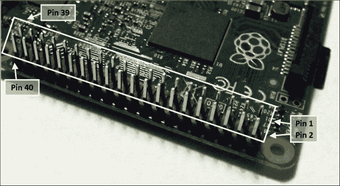

Raspberry Pi GPIO 排针位置

使用 GPIO 排针时需小心，因为它还包括电源引脚（3V3 和 5V）以及地线引脚（GND）。所有 GPIO 引脚都可以用作标准 GPIO，但其中几个也有特殊功能；这些被标记并用不同颜色突出显示。

### 提示

工程师通常使用 3V3 符号来指定原理图中的值，以避免使用容易遗漏的小数点（使用 33V 而不是 3.3V 会造成严重损坏）。同样，这也适用于其他值，例如电阻，因此例如，1.2k 欧姆可以写成 1k2 欧姆。

有 **TX** 和 **RX** 引脚，用于串行 RS232 通信，借助电压等级转换器，信息可以通过串行电缆传输到另一台计算机或设备。

我们有**SDA**和**SCL**引脚，它们能够支持一种称为**I²C**的双线总线通信协议（在 Model Plus 和 Raspberry Pi 2 板上，有两个 I²C 通道：**通道 1 ARM**用于通用，而**通道 0 VC**通常用于识别顶部附加的硬件模块（HAT））。还有**SPI MOSI**、**SPI MISO**、**SPI SCLK**、**SPI CE0**和**SPI CE1**引脚，它们支持另一种称为**SPI**的高速数据总线协议。最后，我们还有**PWM0/1**，它允许生成**脉冲宽度调制**信号，这对于伺服和生成模拟信号非常有用。

然而，在本章中，我们将专注于使用标准的 GPIO 功能。GPIO 引脚布局如图所示：


Raspberry Pi GPIO 引脚（GPIO.BOARD 和 GPIO.BCM）

### 提示

Raspberry Pi Rev 2（2014 年 7 月之前）与 Raspberry Pi 2 GPIO 布局有以下不同之处：

+   26 个 GPIO 引脚头（与第一个 26 个引脚相匹配）

+   在引脚头旁边额外的一组八个孔（P5）。具体如下：


Raspberry Pi Rev 2 P5 GPIO 引脚头

原始的 Raspberry Pi Rev 1（2012 年 10 月之前）总共只有 26 个 GPIO 引脚（与当前 Raspberry Pi 的前 26 个引脚相匹配，除了以下细节）：

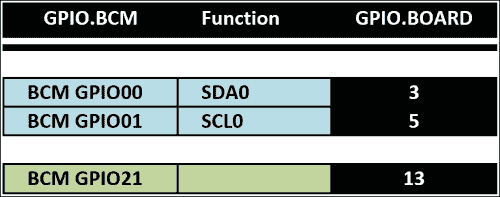

Raspberry Pi Rev 1 GPIO 引脚头差异**RPi.GPIO**库可以使用两种系统之一来引用 Raspberry Pi 上的引脚。中间显示的数字是引脚的物理位置，也是 RPi.GPIO 在**GPIO.BOARD**模式下引用的数字。外部的数字（**GPIO.BCM**）是引脚连接到的处理器物理端口的实际引用（这就是为什么它们没有特定的顺序）。当模式设置为**GPIO.BCM**时，它们用于控制 GPIO 引脚头和连接到其他 GPIO 线的任何外围设备。这包括 BCM GPIO 4 上的附加摄像头上的 LED 和板上的状态 LED。然而，这也可以包括用于读取/写入 SD 卡的 GPIO 线，如果被干扰，将导致严重错误。

如果你使用其他编程语言来访问 GPIO 引脚，编号方案可能不同，因此了解 BCM GPIO 引用会有所帮助，这些引用指的是处理器的物理 GPIO 端口。

### 提示

一定要查看附录，*硬件和软件列表*，其中列出了本章中使用的所有项目及其获取地点。

# 控制一个 LED

硬件上的`hello world`等效于 LED 闪烁，这是一个很好的测试，以确保一切正常并且你已经正确接线。为了使其更有趣，我建议使用 RGB LED（它将红、绿、蓝 LED 组合成一个单元），但如果你只有可用的单独 LED，也可以使用。

## 准备就绪

你将需要以下设备：

+   4 x 杜邦公对母排线

+   小型面包板（170 个接线点）或更大的一个

+   RGB LED（共阴极）/3 个标准 LED（理想情况下为红/绿/蓝）

+   面包板线（实心芯线）

+   3 x 470 欧姆电阻

之前提到的每个组件只需花费几美元，并且在之后的项目中可以重复使用。面包板是一个特别有用的物品，它允许你在不需要焊接的情况下尝试自己的电路。

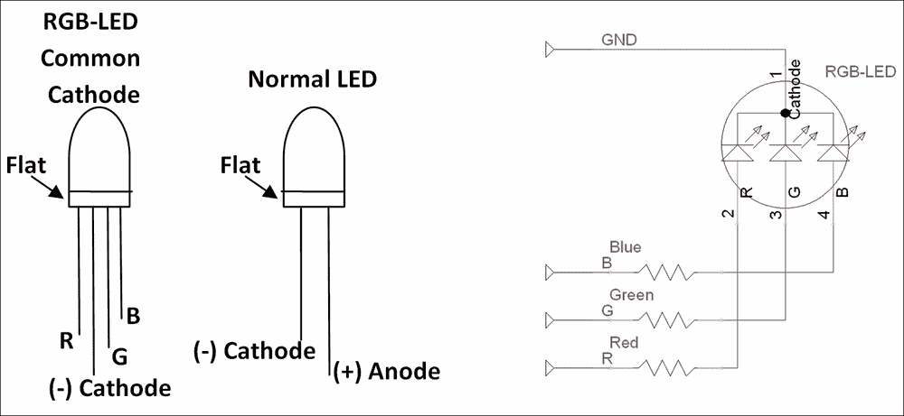

RGB LED、标准 LED 和 RGB 电路的图示

以下图示显示了面包板电路：

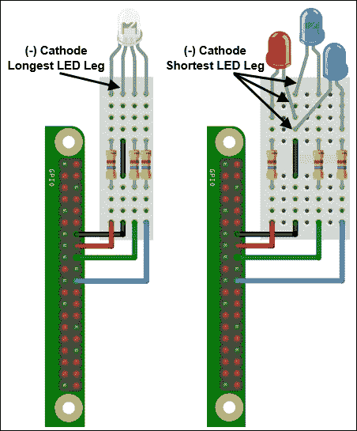

连接到 GPIO 引脚的 RGB LED/标准 LED 的接线

### 注意

可用的 RGB LED 有多种变体，因此请检查你组件的数据表以确认你拥有的引脚顺序和类型。有些是红、蓝、绿（RBG），因此请确保相应地接线或调整代码中的`RGB_`引脚设置。你也可以得到共阳极变体，这将需要将阳极连接到 3V3（GPIO-Pin1）才能点亮（并且需要将`RGB_ENABLE`和`RGB_DISABLE`设置为`0`和`1`）。

本书中的面包板和组件图是使用一个名为**Fritzing**的免费工具创建的（[www.fritzing.org](http://www.fritzing.org)）；它非常适合规划自己的树莓派项目。

## 如何做…

创建`ledtest.py`脚本如下：

```py
#!/usr/bin/python3
#ledtest.py
import time
import RPi.GPIO as GPIO
# RGB LED module
#HARDWARE SETUP
# GPIO
# 2[======XRG=B==]26[=======]40
# 1[=============]25[=======]39
# X=GND R=Red G=Green B=Blue 
#Setup Active States
#Common Cathode RGB-LED (Cathode=Active Low)
RGB_ENABLE = 1; RGB_DISABLE = 0

#LED CONFIG - Set GPIO Ports
RGB_RED = 16; RGB_GREEN = 18; RGB_BLUE = 22
RGB = [RGB_RED,RGB_GREEN,RGB_BLUE]

def led_setup():
  #Setup the wiring
  GPIO.setmode(GPIO.BOARD)
  #Setup Ports
  for val in RGB:
    GPIO.setup(val,GPIO.OUT)

def main():
  led_setup()
  for val in RGB:
    GPIO.output(val,RGB_ENABLE)
    print("LED ON")
    time.sleep(5)
    GPIO.output(val,RGB_DISABLE)
    print("LED OFF")

try:
  main()
finally:
  GPIO.cleanup()
  print("Closed Everything. END")
#End
```

`RPi.GPIO`库需要`sudo`权限来访问 GPIO 引脚硬件，因此你需要使用以下命令运行脚本：

```py
sudo python3 ledtest.py

```

当你运行脚本时，你应该看到 LED 的红色、绿色和蓝色部分（或每个 LED，如果使用单独的 LED）依次点亮。如果没有，请检查你的接线，或者通过临时将红色、绿色或蓝色线连接到 3V3 引脚（GPIO 引脚 1）来确认 LED 是否工作。

### 提示

对于大多数与硬件相关的脚本，需要使用`sudo`命令，因为用户通常不会在如此低级别直接控制硬件。例如，设置或清除 SD 卡控制器的一部分控制引脚可能会损坏正在写入的数据。因此，出于安全考虑，需要超级用户权限以防止程序意外（或恶意意图）使用硬件。

## 它是如何工作的…

要使用 Python 访问 GPIO 引脚，我们导入`RPi.GPIO`，这允许通过模块函数直接控制引脚。我们还需要`time`模块来暂停程序设定的时间数秒。

我们为 LED 布线和活动状态定义值（见*更多内容…*部分中的*控制 GPIO 电流*）。

在程序使用 GPIO 引脚之前，我们需要通过指定编号方法（`GPIO.BOARD`）和方向（`GPIO.OUT`或`GPIO.IN`）（在这种情况下，我们将所有 RGB 引脚设置为输出）来设置它们。如果将引脚配置为输出，我们将能够设置引脚状态；同样，如果将其配置为输入，我们将能够读取引脚状态。

接下来，我们使用`GPIO.output()`通过指定 GPIO 引脚的编号和我们希望其处于的状态（`1` = 高/开和`0` = 低/关）来控制引脚。我们打开每个 LED，等待 5 秒钟，然后将其关闭。

最后，我们使用`GPIO.cleanup()`将 GPIO 引脚恢复到其原始默认状态，并释放引脚以供其他程序使用。

## 更多内容…

在 Raspberry Pi 上使用 GPIO 引脚时必须小心，因为这些引脚直接连接到 Raspberry Pi 的主处理器，没有任何额外的保护。必须小心操作，因为任何错误的接线都可能损坏 Raspberry Pi 处理器，并导致其完全停止工作。

或者，您可以使用许多可直接插入 GPIO 引脚头部的模块之一（减少接线错误的机会）。

### 小贴士

例如，Pi-Stop 是一个简单的预构建 LED 板，模拟一组交通信号灯，旨在为那些对控制硬件感兴趣但想避免损坏 Raspberry Pi 的风险的人提供一个跳板。在掌握基础知识之后，它也是一个出色的指示器，有助于调试。

只需确保更新`ledtest.py`脚本中的`LED CONFIG`引脚引用，以便引用您所使用的硬件的引脚布局和位置。

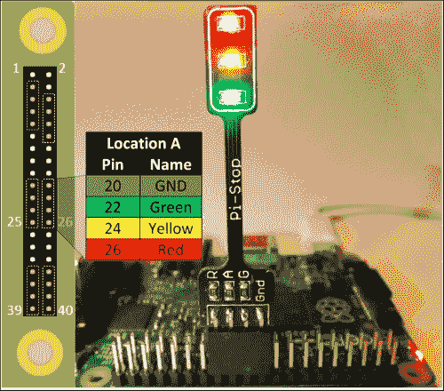

请参阅附录，*硬件和软件列表*，以获取 Raspberry Pi 硬件零售商的列表。

### 控制 GPIO 电流

每个 GPIO 引脚在烧毁之前只能处理一定量的电流（单个引脚不超过 16 mA，总电流不超过 30 mA），同样，RGB LED 也应限制在不超过 100 mA。通过在 LED 之前或之后添加电阻，我们可以限制通过它的电流，并控制其亮度（电流越大，LED 越亮）。

由于我们可能希望同时驱动多个 LED，我们通常试图将电流设置得尽可能低，同时仍然提供足够的功率来点亮 LED。

我们可以使用欧姆定律来告诉我们需要使用多少电阻来提供特定的电流。该定律如下所示：

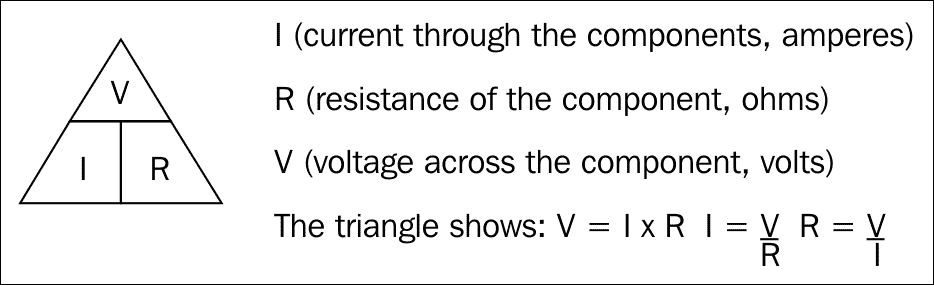

欧姆定律描述了电路中电流、电阻和电压之间的关系

我们将目标设定为最小电流（3 mA）和最大电流（16 mA），同时仍然从每个 LED 产生足够亮的光。为了得到 RGB LED 的平衡输出，我测试了不同的电阻，直到它们提供接近白色的光（通过卡片观察）。每个 LED 选择了 470 欧姆的电阻（你的 LED 可能略有不同）。

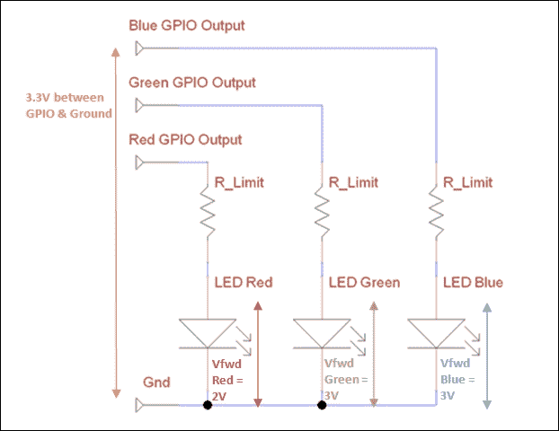

需要电阻来限制通过 LED 的电流

电阻两端的电压等于 GPIO 电压（Vgpio = 3.3V）减去特定 LED 上的电压降（`Vfwd`）；然后我们可以使用这个电阻来计算每个 LED 使用的电流，如下图中所示：

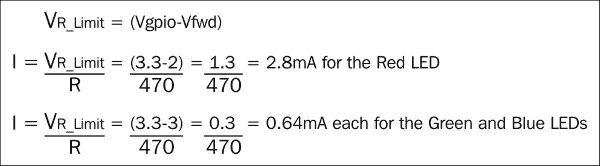

我们可以计算每个 LED 的电流消耗

# 响应按钮

许多使用树莓派的应用程序都需要在没有键盘和屏幕连接的情况下激活操作。GPIO 引脚为树莓派提供了一个非常好的方式，通过你的按钮和开关来控制，而不需要鼠标/键盘和屏幕。

## 准备就绪

你将需要以下设备：

+   2 x 杜邦公对母跳线

+   小型面包板（170 个接线点）或更大的一个

+   按钮开关（瞬间闭合）或通过导线连接来闭合/断开电路

+   面包板导线（实心芯）

+   1k 欧姆电阻

开关如下图中所示：

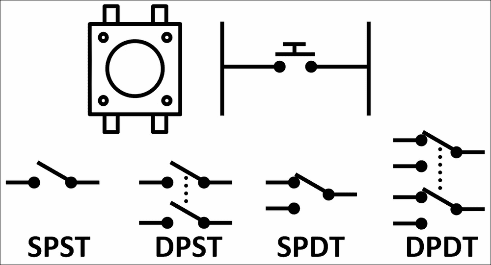

按钮开关和其他类型的开关

### 注意

在以下示例中使用的开关是**单刀单掷**（**SPST**）瞬间闭合按钮开关。**单刀**（**SP**）意味着有一组触点会建立连接。在这里使用的按钮开关的情况下，每侧的腿通过中间的单刀开关连接在一起。**双刀**（**DP**）开关的行为就像单刀开关一样，除了两侧在电路上是分开的，允许你同时打开/关闭两个不同的组件。

**单掷**（**ST**）表示开关将仅在一种位置上建立连接；另一侧将保持断开。**双掷**（**DT**）表示开关的两个位置都将连接到不同的部分。

**瞬间闭合**意味着按钮在被按下时会闭合开关，并在释放时自动打开。**锁定**按钮开关将保持闭合，直到再次按下。

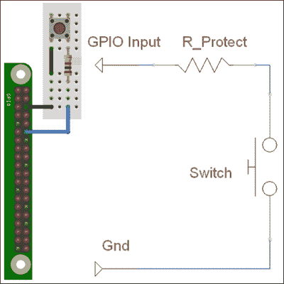

按钮电路布局

在这个例子中，我们将使用声音，因此你还需要将扬声器或耳机连接到树莓派的音频插座。

你需要使用以下命令安装名为`flite`的程序，这将使我们能够让树莓派说话：

```py
sudo apt-get install flite

```

安装完成后，你可以使用以下命令进行测试：

```py
sudo flite -t "hello I can talk"

```

如果声音有点太小（或太大），你可以使用以下命令调整音量（0-100%）：

```py
amixer set PCM 100%

```

## 如何做...

创建`btntest.py`脚本如下：

```py
#!/usr/bin/python3
#btntest.py
import time
import os
import RPi.GPIO as GPIO
#HARDWARE SETUP
# GPIO
# 2[==X==1=======]26[=======]40
# 1[=============]25[=======]39
#Button Config
BTN = 12

def gpio_setup():
  #Setup the wiring
  GPIO.setmode(GPIO.BOARD)
  #Setup Ports
  GPIO.setup(BTN,GPIO.IN,pull_up_down=GPIO.PUD_UP)

def main():
  gpio_setup()
  count=0
  btn_closed = True
  while True:
    btn_val = GPIO.input(BTN)
    if btn_val and btn_closed:
       print("OPEN")
       btn_closed=False
    elif btn_val==False and btn_closed==False:
       count+=1
       print("CLOSE %s" % count)
       os.system("flite -t '%s'" % count)
       btn_closed=True
    time.sleep(0.1)

try:
  main()
finally:
  GPIO.cleanup()
  print("Closed Everything. END")
#End
```

## 它是如何工作的...

如前一个配方中所述，我们设置了所需的 GPIO 引脚，但这次将其设置为输入，并且我们还启用了内部拉电阻（有关更多信息，请参阅本配方中“还有更多...”部分的*拉电阻和下拉电阻电路*），使用以下代码：

```py
GPIO.setup(BTN,GPIO.IN,pull_up_down=GPIO.PUD_UP)
```

在设置 GPIO 引脚后，我们创建一个循环，该循环将连续检查`BTN`的状态，使用`GPIO.input()`。如果返回的值是`false`，则引脚通过开关连接到 0V（地），我们将使用`flite`大声计数每次按钮被按下。

由于我们在`try`/`finally`条件内调用了主函数，即使我们使用*Ctrl* + *Z*关闭程序，它仍然会调用`GPIO.cleanup()`。

### 注意

我们在循环中使用短暂的延迟；这确保了忽略开关接触上的任何噪声。这是因为当我们按下按钮时，我们按下或释放它时并不总是完美的接触，如果我们太快地再次按下它，可能会产生几个触发。这被称为**软件去抖动**；我们在这里忽略信号的抖动。

## 还有更多...

树莓派的 GPIO 引脚必须谨慎使用；用于输入的电压应在特定范围内，并且应通过保护电阻最小化从它们中吸取的任何电流。

### 安全电压

我们必须确保我们只连接介于 0（地）和 3.3V 之间的输入。一些处理器使用 0 到 5V 之间的电压，因此需要额外的组件才能安全地与之接口。除非你确定它是安全的，否则不要连接使用 5V 的输入或组件，否则会损坏树莓派的 GPIO 端口。

### 拉电阻和下拉电阻电路

之前的代码将 GPIO 引脚设置为使用内部拉电阻。如果没有在 GPIO 引脚上使用拉电阻（或下拉电阻），电压可以自由浮动在 3.3V 和 0V 之间，实际的逻辑状态将不确定（有时为 1，有时为 0）。

树莓派的内部拉电阻为 50k 欧姆-65k 欧姆，下拉电阻也是 50k 欧姆-65k 欧姆。外部拉电阻/下拉电阻通常用于 GPIO 电路（如下所示），通常使用 10k 欧姆或更大的电阻，原因类似（在不活动时提供非常小的电流消耗）。

拉电阻允许一小部分电流通过 GPIO 引脚，当开关未按下时，将提供高电压。当按下开关时，小电流被流向 0V 的大电流所取代，因此 GPIO 引脚上的电压变低。开关在按下时是低电平且逻辑 0。它的工作原理如下所示：

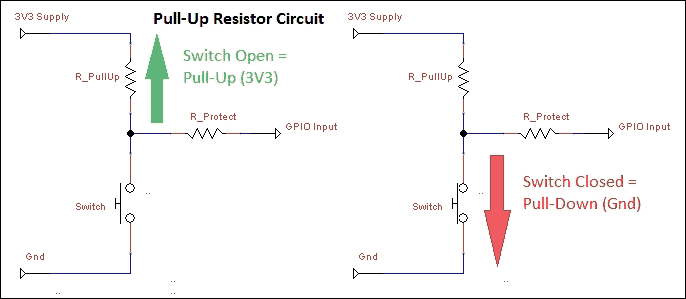

拉电阻电路

下拉电阻的工作方式相同，只是开关是高电平有效（当按下时 GPIO 引脚为逻辑 1）。它的工作方式如下所示：

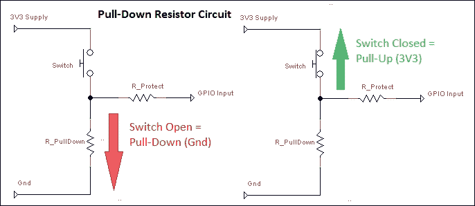

一个下拉电阻电路

### 保护电阻

除了开关外，电路还包括一个与开关串联的电阻来保护 GPIO 引脚，如下所示：


一个 GPIO 保护限流电阻

保护电阻的目的是在 GPIO 引脚意外设置为输出而不是输入时保护 GPIO 引脚。想象一下，例如，我们的开关连接在 GPIO 和地之间。现在，GPIO 引脚被设置为输出并在按下开关时立即打开（将其驱动到 3.3V）。如果没有电阻，GPIO 引脚将直接连接到 0V。GPIO 仍然会尝试将其驱动到 3.3V；这会导致 GPIO 引脚烧毁（因为它会使用过多的电流将引脚驱动到高电平状态）。如果我们在这里使用一个 1k 欧姆的电阻，引脚就能够使用可接受的电流驱动到高电平（I = V/R = 3.3/1k = 3.3mA）。

# 一个控制关断按钮

Raspberry Pi 应该始终正确关机，以避免 SD 卡在执行写入操作时因断电而损坏。如果你没有连接键盘或屏幕（如果你正在运行自动化程序或通过网络远程控制并忘记关闭它），这可能会造成问题，因为你无法输入命令或看到你在做什么。通过添加我们自己的按钮和 LED 指示灯，我们可以轻松地发出关机、重置和再次启动的命令，以指示系统何时处于活动状态。

## 准备中

你需要以下设备：

+   3 x 杜邦公对母排线

+   小型面包板（170 个接线点）或更大的一个

+   按钮开关（瞬间闭合）

+   通用 LED

+   2 x 470 欧姆电阻

+   面包板线（实心芯线）

关断电路的整体布局将如下所示：

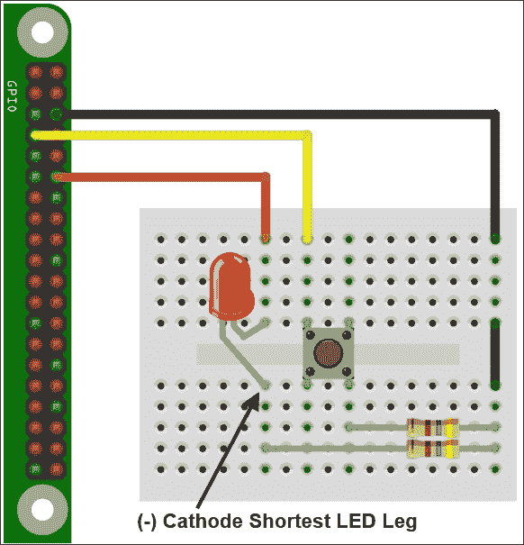

控制关断电路布局

## 如何做…

创建`shtdwn.py`脚本如下：

```py
#!/usr/bin/python3
#shtdwn.py
import time
import RPi.GPIO as GPIO
import os

# Shutdown Script
DEBUG=True #Simulate Only
SNDON=True
#HARDWARE SETUP
# GPIO
# 2[==X==L=======]26[=======]40
# 1[===1=========]25[=======]39

#BTN CONFIG - Set GPIO Ports
GPIO_MODE=GPIO.BOARD
SHTDWN_BTN = 7 #1
LED = 12       #L

def gpio_setup():
  #Setup the wiring
  GPIO.setmode(GPIO_MODE)
  #Setup Ports
  GPIO.setup(SHTDWN_BTN,GPIO.IN,pull_up_down=GPIO.PUD_UP)
  GPIO.setup(LED,GPIO.OUT)

def doShutdown():
  if(DEBUG):print("Press detected")
  time.sleep(3)
  if GPIO.input(SHTDWN_BTN):
    if(DEBUG):print("Ignore the shutdown (<3sec)")
  else:
    if(DEBUG):print ("Would shutdown the RPi Now")
    GPIO.output(LED,0)
    time.sleep(0.5)
    GPIO.output(LED,1)
    if(SNDON):os.system("flite -t 'Warning commencing power down 3 2 1'")
    if(DEBUG==False):os.system("sudo shutdown -h now")
    if(DEBUG):GPIO.cleanup()
    if(DEBUG):exit()

def main():
  gpio_setup()
  GPIO.output(LED,1)
  while True:
    if(DEBUG):print("Waiting for >3sec button press")
    if GPIO.input(SHTDWN_BTN)==False:
       doShutdown()
    time.sleep(1)

try:
  main()
finally:
  GPIO.cleanup()
  print("Closed Everything. END")
#End
```

要使此脚本自动运行（一旦测试通过），我们可以将其放置在`~/bin`中（如果我们只想复制它，可以使用`cp`而不是`mv`）并将其添加到`crontab`中，如下所示：

```py
mkdir ~/bin
mv shtdwn.py ~/bin/shtdwn.py 
crontab –e
```

在文件末尾，我们添加以下代码：

```py
@reboot sudo python3 ~/bin/shtdwn.py
```

## 它是如何工作的…

这次，当我们设置 GPIO 引脚时，我们将连接到关断按钮的引脚定义为输入，将连接到 LED 的引脚定义为输出。我们打开 LED 以指示系统正在运行。

通过将`DEBUG`标志设置为`True`，我们可以在不实际关机的情况下测试脚本的功能（通过读取终端消息）；我们只需确保在使用脚本时将`DEBUG`设置为`False`。

我们进入一个`while`循环，每秒检查一次 GPIO 引脚是否设置为`LOW`（开关已被按下）；如果是，我们进入`doShutdown()`函数。

程序将等待 3 秒钟，然后再次测试以查看按钮是否仍在被按下。如果按钮不再被按下，我们将返回到之前的`while`循环。然而，如果在 3 秒后按钮仍然被按下，程序将闪烁 LED 并触发关机（同时使用`flite`提供音频警告）。

当我们对我们脚本的运行方式满意时，我们可以禁用`DEBUG`标志（将其设置为`False`）并将脚本添加到`crontab`。Crontab 是一个特殊的程序，它在后台运行，允许我们在系统启动时（`@reboot`）安排（在特定时间、日期或定期）程序和动作。这允许脚本在每次树莓派上电时自动启动。当我们按下并保持关机按钮超过 3 秒时，它会安全地关闭系统并进入低功耗状态（LED 在此之前关闭，表示可以安全地在之后不久断电）。要重启树莓派，我们短暂地断电；这将重启系统，当树莓派加载时 LED 会点亮。

## 还有更多…

我们可以通过使用复位引脚来进一步扩展此示例，通过添加额外功能并利用额外的 GPIO 连接（如果可用）。

### 重置和重启树莓派

树莓派有孔可以安装复位引脚（在树莓派 2/3 上标记为**RUN**，在树莓派 1 Model B Rev 2 和 Model As 上标记为**P6**）。复位引脚允许使用按钮重置设备，而不是每次都拔掉微型 USB 连接器来循环电源：

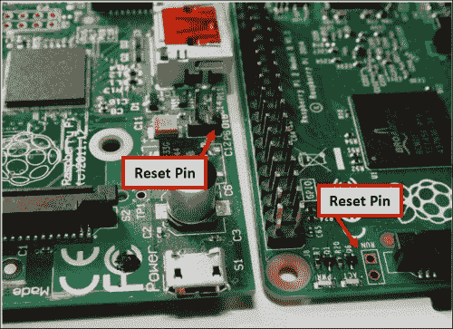

树莓派复位引脚 – 左边是树莓派 Model A/B（Rev2），右边是树莓派 2

要使用它，您需要将电线或引脚头焊接在树莓派上，并将其连接到按钮上（或每次短暂触摸两个孔之间的电线）。或者，我们可以扩展我们之前的电路，如下面的图所示：

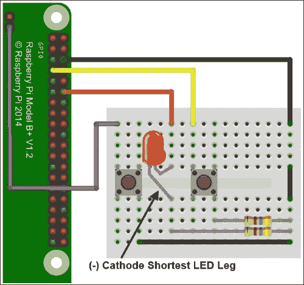

控制关机电路布局和复位按钮

我们可以将这个额外的按钮添加到我们的电路中，该按钮可以连接到复位引脚（这是树莓派 2 上靠近中间的孔，在其他型号上靠近边缘的孔）。当通过连接到地（例如旁边的孔或 GPIO 引脚 6 等另一个地点）临时将其拉低时，该引脚将重置树莓派，并在关机后允许其重新启动。

### 添加额外功能

由于我们现在始终在监控关机按钮的脚本，我们可以添加额外的按钮/开关/跳线以同时监控。这将允许我们通过更改输入来触发特定程序或设置特定状态。以下示例允许我们轻松地在自动 DHCP 网络（默认网络设置）和使用直接 IP 地址之间切换，正如在第一章中“直接连接到笔记本电脑或计算机”食谱中使用的，用于直接 LAN 连接。

向前面的电路添加以下组件：

+   一个 470 欧姆的电阻

+   两个带有跳线连接器的引脚头（或可选的开关）

+   面包板电线（实心芯）

添加了前面的组件后，我们的控制关机电路现在看起来如下：

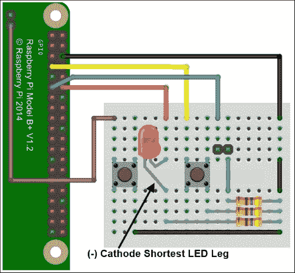

控制关机电路布局、复位按钮和跳线引脚

在前面的脚本中，我们添加了一个额外的输入来检测`LAN_SWA`引脚的状态（我们添加到电路中的跳线引脚）使用以下代码：

```py
LAN_SWA = 11    #2
```

确保在`gpio_setup()`函数中将它设置为输入（带有上拉电阻）使用以下代码：

```py
  GPIO.setup(LAN_SWA,GPIO.IN,pull_up_down=GPIO.PUD_UP)
```

添加一个新函数以在 LAN 模式之间切换，并读取新的 IP 地址。`doChangeLAN()`函数检查自上次调用以来`LAN_SWA`引脚的状态是否已更改，如果是，则将网络适配器设置为 DHCP 或相应地设置直接 LAN 设置（如果可用，则使用`flite`说出新的 IP 设置）。最后，设置为直接连接的 LAN 会导致 LED 在此模式下缓慢闪烁。使用以下代码执行此操作：

```py
def doChangeLAN(direct):
  if(DEBUG):print("Direct LAN: %s" % direct)
  if GPIO.input(LAN_SWA) and direct==True:
    if(DEBUG):print("LAN Switch OFF")
    cmd="sudo dhclient eth0"
    direct=False
    GPIO.output(LED,1)
  elif GPIO.input(LAN_SWA)==False and direct==False:
    if(DEBUG):print("LAN Switch ON")
    cmd="sudo ifconfig eth0 169.254.69.69"
    direct=True
  else:
    return direct
  if(DEBUG==False):os.system(cmd)
  if(SNDON):os.system("hostname -I | flite")
  return direct
```

添加另一个函数`flashled()`，每次调用时只需切换 LED 的状态。此函数的代码如下：

```py
def flashled(ledon):
  if ledon:
    ledon=False
  else:
    ledon=True
  GPIO.output(LED,ledon)
  return ledon
```

最后，我们调整主循环以也调用`doChangeLAN()`并使用结果来决定是否使用`ledon`调用`flashled()`以跟踪 LED 的先前状态。现在`main()`函数应该更新如下：

```py
def main():
  gpio_setup()
  GPIO.output(LED,1)
  directlan=False
  ledon=True
  while True:
    if(DEBUG):print("Waiting for >3sec button press")
    if GPIO.input(SHTDWN_BTN)==False:
       doShutdown()
    directlan= doChangeLAN(directlan)
    if directlan:
      flashled(ledon)
    time.sleep(1)
```

# GPIO 键盘输入

我们已经看到我们可以如何监控 GPIO 上的输入以启动应用程序和控制树莓派；然而，有时我们需要控制第三方程序。使用`uInput`库，我们可以模拟键盘按键（甚至鼠标移动）来控制任何程序，使用我们自己的定制硬件。

更多关于使用`uInput`的信息，请访问[`tjjr.fi/sw/python-uinput/`](http://tjjr.fi/sw/python-uinput/)。

## 准备工作

执行以下步骤以安装`uInput`：

1.  首先，我们需要下载`uInput`。

    您需要使用以下命令从 GitHub 下载`uInput` Python 库（约 50 KB）：

    ```py
    wget https://github.com/tuomasjjrasanen/python-uinput/archive/master.zip
    unzip master.zip

    ```

    库将解压到名为`python-uinput-master`的目录。

    完成后，您可以使用以下命令删除 ZIP 文件：

    ```py
    rm master.zip

    ```

1.  使用以下命令安装所需的软件包（如果您已经安装了它们，`apt-get` 命令将忽略它们）：

    ```py
    sudo apt-get install python3-setuptools python3-dev
    sudo apt-get install libudev-dev

    ```

1.  使用以下命令编译和安装 `uInput`：

    ```py
    cd python-uinput-master
    sudo python3 setup.py install

    ```

1.  最后，我们使用以下命令加载新的 `uinput` 内核模块：

    ```py
    sudo modprobe uinput

    ```

    为了确保它在启动时加载，我们可以使用以下命令将 `uinput` 添加到 `modules` 文件中：

    ```py
    sudo nano /etc/modules

    ```

    在文件中将 `uinput` 放在新的一行，并保存它（*Ctrl* + *X*, *Y*）。

1.  使用以下设备创建以下电路：

    +   面包板（半尺寸或更大）

    +   7 x 杜邦公对母排线

    +   六个按键

    +   6 x 470 欧姆电阻

    +   面包板线（实心芯线）

    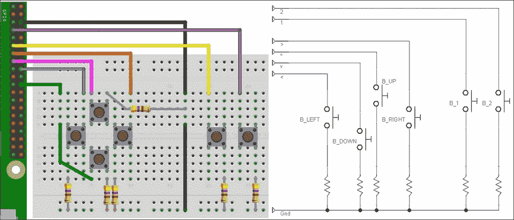

    GPIO 键盘电路布局

    键盘电路也可以通过将组件焊接到一个 Vero 原型板（也称为条形板）中而永久构建，如图所示：

    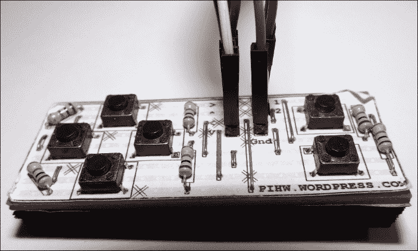

    GPIO 键盘 Pi 硬件模块

    ### 注意

    此电路可作为 [PiHardware.com](http://PiHardware.com) 的自焊套件获得。

1.  按照以下方式将电路连接到 Raspberry Pi 的 GPIO 引脚：

    |   | 按钮 | GPIO 引脚 |
    | --- | --- | --- |
    | GND |   | 6 |
    | v | B_DOWN | 22 |
    | < | B_LEFT | 18 |
    | ^ | B_UP | 15 |
    | > | B_RIGHT | 13 |
    | 1 | B_1 | 11 |
    | 2 | B_2 | 7 |

## 如何操作...

创建以下 `gpiokeys.py` 脚本：

```py
#!/usr/bin/python3
#gpiokeys.py
import time
import RPi.GPIO as GPIO
import uinput

#HARDWARE SETUP
# GPIO
# 2[==G=====<=V==]26[=======]40
# 1[===2=1>^=====]25[=======]39
B_DOWN  = 22    #V
B_LEFT  = 18   #<
B_UP    = 15   #^
B_RIGHT = 13   #>
B_1  = 11   #1
B_2  = 7   #2

DEBUG=True
BTN = [B_UP,B_DOWN,B_LEFT,B_RIGHT,B_1,B_2]
MSG = ["UP","DOWN","LEFT","RIGHT","1","2"]

#Setup the DPad module pins and pull-ups
def dpad_setup():
  #Set up the wiring
  GPIO.setmode(GPIO.BOARD)
  # Setup BTN Ports as INPUTS
  for val in BTN:
    # set up GPIO input with pull-up control
    #(pull_up_down can be:
    #    PUD_OFF, PUD_UP or PUD_DOWN, default PUD_OFF)
    GPIO.setup(val, GPIO.IN, pull_up_down=GPIO.PUD_UP)

def main():
  #Setup uinput
  events = (uinput.KEY_UP,uinput.KEY_DOWN,uinput.KEY_LEFT,
           uinput.KEY_RIGHT,uinput.KEY_ENTER,uinput.KEY_ENTER)
  device = uinput.Device(events)
  time.sleep(2) # seconds
  dpad_setup()
  print("DPad Ready!")

  btn_state=[False,False,False,False,False,False]
  key_state=[False,False,False,False,False,False]
  while True:
    #Catch all the buttons pressed before pressing the related keys
    for idx, val in enumerate(BTN):
      if GPIO.input(val) == False:
        btn_state[idx]=True
      else:
        btn_state[idx]=False

    #Perform the button presses/releases (but only change state once)
    for idx, val in enumerate(btn_state):
      if val == True and key_state[idx] == False:
        if DEBUG:print (str(val) + ":" + MSG[idx])
        device.emit(events[idx], 1) # Press.
        key_state[idx]=True
      elif val == False and key_state[idx] == True:
        if DEBUG:print (str(val) + ":!" + MSG[idx])
        device.emit(events[idx], 0) # Release.
        key_state[idx]=False

    time.sleep(.1)

try:
  main()
finally:
  GPIO.cleanup()
#End
```

## 工作原理...

首先，我们导入 `uinput` 并定义键盘按钮的布线。对于 `BTN` 中的每个按钮，我们将其启用为输入，并启用内部上拉电阻。

接下来，我们设置 `uinput`，定义我们想要模拟的按键并将它们添加到 `uinput.Device()` 函数中。我们等待几秒钟以允许 `uinput` 初始化，设置初始按钮和按键状态，并开始我们的 `main` 循环。

`main` 循环分为两部分：第一部分检查按钮并记录在 `btn_state` 中的状态，第二部分将 `btn_state` 与当前的 `key_state` 数组进行比较。这样，我们可以检测 `btn_state` 的变化并调用 `device.emit()` 来切换按键的状态。

为了允许我们在后台运行此脚本，我们可以使用 `&` 如以下命令所示运行它：

```py
sudo python3 gpiokeys.py &

```

### 注意

`&` 字符允许命令在后台运行，因此我们可以继续使用命令行运行其他程序。您可以使用 `fg` 将其带到前台，或者如果您有多个命令正在运行，可以使用 `%1`、`%2` 等等。使用 `jobs` 获取列表。

您甚至可以通过按 *Ctrl* + *Z* 暂停进程/程序以获取命令提示符，然后使用 `bg`（这将允许它在后台运行）来恢复它。

您可以使用第四章中*创建顶部滚动游戏*食谱中创建的游戏来测试按键，您现在可以使用 GPIO 方向垫来控制它。别忘了，如果您是通过远程连接到 Raspberry Pi，任何按键操作都只会激活本地连接的屏幕。

## 更多内容…

我们可以使用`uinput`来为其他程序提供硬件控制，包括那些需要鼠标输入的程序。

### 生成其他按键组合

您可以在文件中创建多个不同的键映射来支持不同的程序。例如，`events_z80`键映射对于**fuze**这样的 Spectrum 模拟器非常有用（有关详细信息，请浏览[`raspi.tv/2012/how-to-install-fuse-zx-spectrum-emulator-on-raspberry-pi`](http://raspi.tv/2012/how-to-install-fuse-zx-spectrum-emulator-on-raspberry-pi)）。`events_omx`键映射适合通过以下命令控制通过 OMX Player 播放的视频：

```py
omxplayer filename.mp4

```

您可以使用`-k`参数获取`omxplayer`支持的按键列表。

将定义`events`列表的行替换为新键映射，并通过以下代码将不同的映射分配给事件：

```py
events_dpad = (uinput.KEY_UP,uinput.KEY_DOWN,uinput.KEY_LEFT,
              uinput.KEY_RIGHT,uinput.KEY_ENTER,uinput.KEY_ENTER)
events_z80 = (uinput.KEY_Q,uinput.KEY_A,uinput.KEY_O,
             uinput.KEY_P,uinput.KEY_M,uinput.KEY_ENTER)
events_omx = (uinput.KEY_EQUAL,uinput.KEY_MINUS,uinput.KEY_LEFT,
             uinput.KEY_RIGHT,uinput.KEY_P,uinput.KEY_Q)
```

您可以在`input.h`文件中找到所有的`KEY`定义；您可以使用`less`命令查看它（按*Q*退出），如下所示：

```py
less /usr/include/linux/input.h

```

### 模拟鼠标事件

`uinput`库可以模拟鼠标和摇杆事件以及键盘按键。要使用按钮模拟鼠标，我们可以调整脚本以使用鼠标事件（以及定义`mousemove`来设置移动的步长）使用以下代码：

```py
MSG = ["M_UP","M_DOWN","M_LEFT","M_RIGHT","1","Enter"]
events_mouse=(uinput.REL_Y,uinput.REL_Y, uinput.REL_X,
             uinput.REL_X,uinput.BTN_LEFT,uinput.BTN_RIGHT)
mousemove=1
```

我们还需要修改按钮处理，以提供连续的运动，因为我们不需要跟踪鼠标按键的状态。为此，请使用以下代码：

```py
    #Perform the button presses/releases
    #(but only change state once)
    for idx, val in enumerate(btn_state):
      if MSG[idx] == "M_UP" or MSG[idx] == "M_LEFT":
        state = -mousemove
      else:
        state = mousemove
      if val == True:
        device.emit(events[idx], state) # Press.
      elif val == False:
        device.emit(events[idx], 0) # Release.

    time.sleep(0.01)
```

# 复用彩色 LED

本章的下一个示例演示了，如果用软件控制，一些看似简单的硬件可以产生一些令人印象深刻的结果。我们回到使用一些 RGB LED，这些 LED 的连接方式使得我们只需要使用八个 GPIO 引脚，通过一种称为**硬件复用**（见本食谱*更多内容*部分的*硬件复用*子部分）的方法来控制五个 RGB LED 的红色、绿色和蓝色元素。

## 准备就绪

您需要以下图片中显示的 RGB LED 模块：

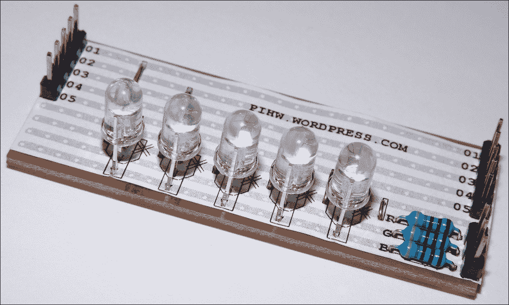

来自 PiHardware.com 的 RGB LED 模块

如前图所示，来自[PiHardware.com](http://PiHardware.com)的 RGB LED 模块附带 GPIO 引脚和 Dupont 公对公电缆，用于连接。尽管有两套标有 1 到 5 的引脚，但只需连接其中一边。

或者，您可以使用以下电路重新创建自己的电路，该电路使用五个常见的阴极 RGB LED、3 个 470 欧姆电阻和一个 Vero 原型板（或大型面包板）。电路将如下所示：

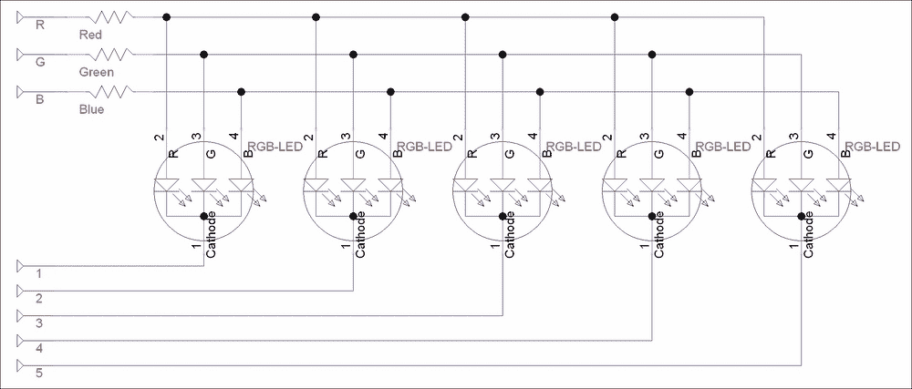

RGB LED 模块电路图

### 注意

严格来说，在这个电路中我们应该使用 15 个电阻（每个 RGB LED 元件一个），这将避免 LED 共享相同电阻时的干扰，并且如果同时开启，也会延长 LED 本身的使用寿命。然而，这种优势微乎其微，尤其是当我们打算独立驱动每个 RGB LED 以实现多彩效果时。

您需要将电路连接到 Raspberry Pi 的 GPIO 引脚，如下所示：

| RGB LED |   |   |   |   |   | 1 |   | 2 | 3 |   | 4 |   |   |   |   |   |   |   |   |   |
| --- | --- | --- | --- | --- | --- | --- | --- | --- | --- | --- | --- | --- | --- | --- | --- | --- | --- | --- | --- | --- |
| **Rpi GPIO 引脚** | 2 | 4 | 6 | 8 | 10 | 12 | 14 | 16 | 18 | 20 | 22 | 24 | 26 | 28 | 30 | 32 | 34 | 36 | 38 | 40 |
| **Rpi GPIO 引脚** | 1 | 3 | 5 | 7 | 9 | 11 | 13 | 15 | 17 | 19 | 21 | 23 | 25 | 27 | 29 | 31 | 33 | 35 | 37 | 39 |
| **RGB LED** |   |   |   | 5 |   | R | G | B |   |   |   |   |   |   |   |   |   |   |   |   |

## 如何做…

创建`rgbled.py`脚本并执行以下步骤：

1.  使用以下代码导入所有必需的模块并定义要使用的值：

    ```py
    #!/usr/bin/python3
    #rgbled.py
    import time
    import RPi.GPIO as GPIO

    #Setup Active states
    #Common Cathode RGB-LEDs (Cathode=Active Low)
    LED_ENABLE = 0; LED_DISABLE = 1
    RGB_ENABLE = 1; RGB_DISABLE = 0
    #HARDWARE SETUP
    # GPIO
    # 2[=====1=23=4==]26[=======]40
    # 1[===5=RGB=====]25[=======]39
    #LED CONFIG - Set GPIO Ports
    LED1 = 12; LED2 = 16; LED3 = 18; LED4 = 22; LED5 = 7
    LED = [LED1,LED2,LED3,LED4,LED5]
    RGB_RED = 11; RGB_GREEN = 13; RGB_BLUE = 15
    RGB = [RGB_RED,RGB_GREEN,RGB_BLUE]
    #Mixed Colors
    RGB_CYAN = [RGB_GREEN,RGB_BLUE]
    RGB_MAGENTA = [RGB_RED,RGB_BLUE]
    RGB_YELLOW = [RGB_RED,RGB_GREEN]
    RGB_WHITE = [RGB_RED,RGB_GREEN,RGB_BLUE]
    RGB_LIST = [RGB_RED,RGB_GREEN,RGB_BLUE,RGB_CYAN,
                RGB_MAGENTA,RGB_YELLOW,RGB_WHITE]
    ```

1.  使用以下代码定义设置 GPIO 引脚的函数：

    ```py
    def led_setup():
      '''Setup the RGB-LED module pins and state.'''
      #Set up the wiring
      GPIO.setmode(GPIO.BOARD)
      # Setup Ports
      for val in LED:
        GPIO.setup(val, GPIO.OUT)
      for val in RGB:
        GPIO.setup(val, GPIO.OUT)
      led_clear()
    ```

1.  使用以下代码定义我们的实用函数，以帮助控制 LED：

    ```py
    def led_gpiocontrol(pins,state):
      '''This function will control the state of
      a single or multiple pins in a list.'''
      #determine if "pins" is a single integer or not
      if isinstance(pins,int):
        #Single integer - reference directly
        GPIO.output(pins,state)
      else:
        #if not, then cycle through the "pins" list
        for i in pins:
          GPIO.output(i,state)

    def led_activate(led,color):
      '''Enable the selected led(s) and set the required color(s)
      Will accept single or multiple values'''
      #Enable led
      led_gpiocontrol(led,LED_ENABLE)
      #Enable color
      led_gpiocontrol(color,RGB_ENABLE)

    def led_deactivate(led,color):
      '''Deactivate the selected led(s) and set the required
      color(s) will accept single or multiple values'''
      #Disable led
      led_gpiocontrol(led,LED_DISABLE)
      #Disable color
      led_gpiocontrol(color,RGB_DISABLE)

    def led_time(led, color, timeon):
      '''Switch on the led and color for the timeon period'''
      led_activate(led,color)
      time.sleep(timeon)
      led_deactivate(led,color)

    def led_clear():
      '''Set the pins to default state.'''
      for val in LED:
        GPIO.output(val, LED_DISABLE)
      for val in RGB:
        GPIO.output(val, RGB_DISABLE)

    def led_cleanup():
      '''Reset pins to default state and release GPIO'''
      led_clear()
      GPIO.cleanup()
    ```

1.  创建一个测试函数以演示模块的功能：

    ```py
    def main():
      '''Directly run test function.
      This function will run if the file is executed directly'''
      led_setup()
      led_time(LED1,RGB_RED,5)
      led_time(LED2,RGB_GREEN,5)
      led_time(LED3,RGB_BLUE,5)
      led_time(LED,RGB_MAGENTA,2)
      led_time(LED,RGB_YELLOW,2)
      led_time(LED,RGB_CYAN,2) 

    if __name__=='__main__':
      try:
        main()
      finally:
        led_cleanup()
    #End
    ```

## 它是如何工作的…

首先，我们通过定义根据使用的 RGB LED（公共阴极）类型来**启用**和**禁用**LED 所需的状态来定义硬件设置。如果您使用的是公共阳极设备，只需反转**启用**/**禁用**状态即可。

接下来，我们定义 GPIO 到引脚的映射，以匹配我们之前所做的布线。

我们还通过组合红色、绿色和/或蓝色来定义一些基本的颜色组合，如下所示：

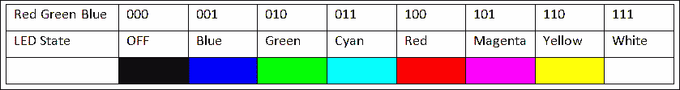

LED 颜色组合

我们定义了一系列有用的函数，第一个是`led_setup()`，它将 GPIO 编号设置为`GPIO.BOARD`并定义所有用作输出的引脚。我们还调用一个名为`led_clear()`的函数，该函数将引脚设置为默认状态，所有引脚均被禁用。

### 注意

这意味着 LED 引脚 1-5（每个 LED 的公共阴极）被设置为`HIGH`，而 RGB 引脚（每个颜色的独立阳极）被设置为`LOW`。

我们创建了一个名为 `led_gpiocontrol()` 的函数，它将允许我们设置一个或多个引脚的状态。`isinstance()` 函数允许我们测试一个值以查看它是否与特定类型匹配（在这种情况下，一个单独的整数）；然后我们可以设置该单个引脚的状态，或者遍历引脚列表并设置每个引脚。

接下来，我们定义两个函数，`led_activate()` 和 `led_deactivate()`，它们将启用和禁用指定的 LED 和颜色。最后，我们定义 `led_time()`，它将允许我们指定一个 LED、颜色和时间来开启它。

我们还创建了 `led_cleanup()` 函数来将引脚（和 LED）重置为默认值，并调用 `GPIO.cleanup()` 来释放使用的 GPIO 引脚。

此脚本旨在成为一个库文件，因此我们将使用 `if __name__=='__main__'` 检查来仅在直接运行文件时执行我们的测试代码：

### 注意

通过检查 `__name__` 的值，我们可以确定文件是直接运行的（它将等于 `__main__`）还是被另一个 Python 脚本导入的。

这允许我们定义仅在直接加载和运行文件时执行的特定测试代码。如果我们将此文件作为模块包含在其他脚本中，则此代码将不会执行。

我们在 第二章 的 *There's more…* 部分和 *Working with text and strings* 菜单中使用了这种技术。

如前所述，我们将使用 `try`/`finally` 来确保我们总是能够执行清理操作，即使我们在早期退出。

为了测试脚本，我们将设置 LED 依次以各种颜色发光。

## 还有更多...

我们可以通过同时开启 RGB LED 的一个或多个部分来创建几种不同的颜色。然而，通过一些巧妙的编程，我们可以创建整个光谱的颜色。此外，我们可以在每个 LED 上显示不同的颜色，看起来似乎是同时进行的。

### 硬件复用

一个 LED 需要在阳极侧施加高电压，在阴极侧施加低电压才能发光。电路中使用的 RGB LED 是共阴极，因此我们必须在 RGB 引脚上施加高电压（3.3V），在阴极引脚上施加低电压（0V）（每个 LED 连接到 1 到 5 号引脚）。

阴极和 RGB 引脚状态如下：

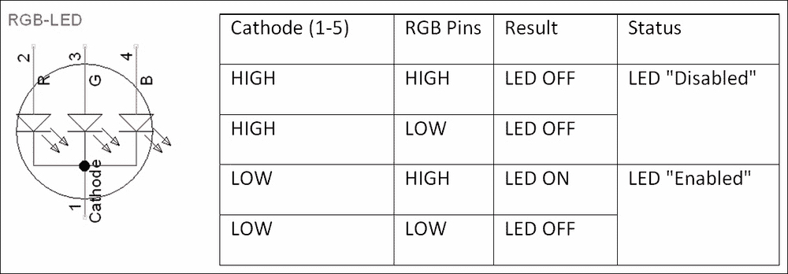

阴极和 RGB 引脚状态

因此，我们可以启用一个或多个 RGB 引脚，但仍能控制哪些 LED 是亮的。我们启用我们想要点亮的 LED 的引脚，并禁用我们不需要的引脚。这允许我们使用比单独控制每个 15 个 RGB 线所需的引脚数量少得多。

### 显示随机图案

我们可以向我们的库添加新功能以产生不同的效果，例如生成随机颜色。以下函数使用 `randint()` 获取 1 到颜色数量的值。我们忽略任何超过可用颜色数量的值，这样我们可以控制 LED 灯关闭的频率。执行以下步骤添加所需的函数：

1.  将 `randint()` 函数从 `random` 模块添加到 `rgbled.py` 脚本中，使用以下代码：

    ```py
    from random import randint
    ```

1.  现在添加 `led_rgbrandom()` 使用以下代码：

    ```py
    def led_rgbrandom(led,period,colors):
       ''' Light up the selected led, for period in seconds,
       in one of the possible colors. The colors can be
       1 to 3 for RGB, or 1-6 for RGB plus combinations,
       1-7 includes white. Anything over 7 will be set as
       OFF (larger the number more chance of OFF).''' 
      value = randint(1,colors)
      if value < len(RGB_LIST):
        led_time(led,RGB_LIST[value-1],period)
    ```

1.  在 `main()` 函数中使用以下命令创建一系列闪烁的 LED：

    ```py
      for i in range(20):
        for j in LED:
          #Select from all, plus OFF
          led_rgbrandom(j,0.1,20)
    ```

### 混合多种颜色

到目前为止，我们一次只在单个或多个 LED 上显示一种颜色。如果你考虑电路是如何连接的，你可能想知道我们如何让一个 LED 显示一种颜色，而另一个同时显示不同的颜色？简单的答案是，我们不需要——我们只是做得很快！

我们需要做的只是每次显示一种颜色，但非常快速地交替改变，这样颜色看起来就像两种（甚至三种红/绿/蓝 LED 的组合）。幸运的是，这是像 Raspberry Pi 这样的计算机可以非常容易做到的事情，甚至允许我们将 RGB 元素组合起来，使所有五个 LED 显示多种颜色的阴影。执行以下步骤来混合颜色：

1.  在 `rgbled.py` 脚本的顶部添加组合颜色定义，在混合颜色定义之后，使用以下代码：

    ```py
    #Combo Colors
    RGB_AQUA = [RGB_CYAN,RGB_GREEN]
    RGB_LBLUE = [RGB_CYAN,RGB_BLUE]
    RGB_PINK = [RGB_MAGENTA,RGB_RED]
    RGB_PURPLE = [RGB_MAGENTA,RGB_BLUE]
    RGB_ORANGE = [RGB_YELLOW,RGB_RED]
    RGB_LIME = [RGB_YELLOW,RGB_GREEN]
    RGB_COLORS = [RGB_LIME,RGB_YELLOW,RGB_ORANGE,RGB_RED,
                  RGB_PINK,RGB_MAGENTA,RGB_PURPLE,RGB_BLUE,
                  RGB_LBLUE,RGB_CYAN,RGB_AQUA,RGB_GREEN]
    ```

    上述代码将提供颜色组合以创建我们的阴影，其中 `RGB_COLORS` 提供了阴影的平滑过渡。

1.  接下来，我们需要创建一个名为 `led_combo()` 的函数来处理单色或多色。该函数的代码如下：

    ```py
    def led_combo(pins,colors,period):
      #determine if "colors" is a single integer or not
      if isinstance(colors,int):
        #Single integer - reference directly
        led_time(pins,colors,period)
      else:
        #if not, then cycle through the "colors" list
        for i in colors:
          led_time(pins,i,period)
    ```

1.  现在我们可以创建一个新的脚本，`rgbledrainbow.py`，来利用我们 `rgbled.py` 模块中的新功能。`rgbledrainbow.py` 脚本如下：

    ```py
    #!/usr/bin/python3
    #rgbledrainbow.py
    import time
    import rgbled as RGBLED

    def next_value(number,max):
      number = number % max
      return number

    def main():
      print ("Setup the RGB module")
      RGBLED.led_setup()

      # Multiple LEDs with different Colors
      print ("Switch on Rainbow")
      led_num = 0
      col_num = 0
      for l in range(5):
        print ("Cycle LEDs")
        for k in range(100):
          #Set the starting point for the next set of colors
          col_num = next_value(col_num+1,len(RGBLED.RGB_COLORS))
          for i in range(20):  #cycle time
            for j in range(5): #led cycle
              led_num = next_value(j,len(RGBLED.LED))
              led_color = next_value(col_num+led_num,
                                     len(RGBLED.RGB_COLORS))
              RGBLED.led_combo(RGBLED.LED[led_num],
                               RGBLED.RGB_COLORS[led_color],0.001)

        print ("Cycle COLORs")        
        for k in range(100):
          #Set the next color
          col_num = next_value(col_num+1,len(RGBLED.RGB_COLORS))
          for i in range(20): #cycle time
            for j in range(5): #led cycle
              led_num = next_value(j,len(RGBLED.LED))
              RGBLED.led_combo(RGBLED.LED[led_num],
                               RGBLED.RGB_COLORS[col_num],0.001)
      print ("Finished")

    if __name__=='__main__':
      try:
        main()
      finally:
        RGBLED.led_cleanup()
    #End
    ```

`main()` 函数将首先循环 LED，将 `RGB_COLORS` 数组中的每种颜色设置在所有 LED 上。然后，它将循环颜色，在 LED 上创建彩虹效果：


在五个 RGB LED 上循环多种颜色

# 使用视觉持久性书写信息

**视觉持久性 (POV)** 显示可以产生几乎神奇的效果，通过快速移动一串 LED 灯的来回或圆形旋转，在空中显示图像。这种效果之所以有效，是因为你的眼睛无法快速调整以分离出单个的光闪，因此你观察到的是一个合并的图像（显示的消息或图片）。


使用 RGB LED 的视觉持久性

## 准备工作

此配方也使用之前配方中使用的 RGB LED 套件；你还需要以下额外物品：

+   面板（半尺寸或更大）

+   2 x 杜邦公对母排线

+   倾斜开关（球轴承类型适合）

+   1 x 470 欧姆电阻（R_Protect）

+   面包板线（实心芯）

倾斜开关应添加到 RGB LED（如 *多路复用彩色 LED* 菜谱的 *准备就绪* 部分所述）。倾斜开关的接线如下：

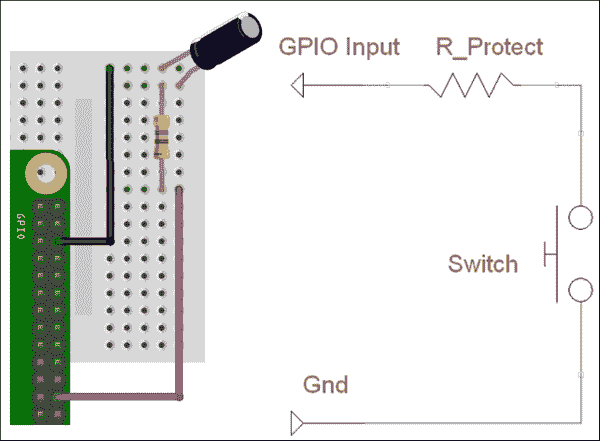

倾斜开关连接到 GPIO 输入（GPIO 引脚 24）和 Gnd（GPIO 引脚 6）

要重现 POV 图像，你需要能够快速移动 LED 和倾斜开关。注意倾斜开关是如何倾斜安装到侧面的，这样当移动到左侧时开关会打开。建议将硬件安装在一根木头或其他类似材料上。你甚至可以使用便携式 USB 电池组和 Wi-Fi 拨号器，通过远程连接为 Raspberry Pi 提供电源和控制（有关详细信息，请参阅 第一章，*使用 Raspberry Pi 入门 – 通过 SSH（和 X11 转发）在网络中远程连接到 Raspberry Pi*）：

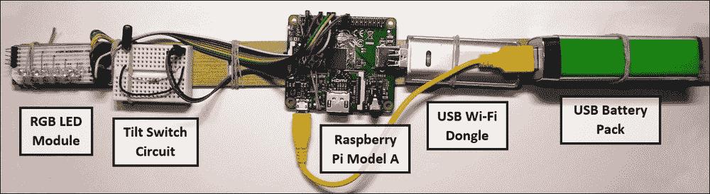

视觉持久性硬件设置

你还需要完成的 `rgbled.py` 文件，我们将在 *如何做到这一点*… 部分进一步扩展。

## 如何做到这一点…

创建一个名为 `tilt.py` 的脚本，以报告倾斜开关的状态：

```py
#!/usr/bin/python3
#tilt.py
import RPi.GPIO as GPIO
#HARDWARE SETUP
# GPIO
# 2[===========T=]26[=======]40
# 1[=============]25[=======]39
#Tilt Config
TILT_SW = 24

def tilt_setup():
  #Setup the wiring
  GPIO.setmode(GPIO.BOARD)
  #Setup Ports
  GPIO.setup(TILT_SW,GPIO.IN,pull_up_down=GPIO.PUD_UP)

def tilt_moving():
  #Report the state of the Tilt Switch
  return GPIO.input(TILT_SW)

def main():
  import time
  tilt_setup()
  while True:
    print("TILT %s"% (GPIO.input(TILT_SW)))
    time.sleep(0.1)

if __name__=='__main__':
  try:
    main()
  finally:
    GPIO.cleanup()
    print("Closed Everything. END")
#End
```

你可以通过以下命令直接运行脚本来测试脚本：

```py
sudo python3 tilt.py

```

将以下 `rgbled_pov()` 函数添加到我们之前创建的 `rgbled.py` 脚本中；这将使我们能够显示图像的单行：

```py
def rgbled_pov(led_pattern,color,ontime):
  '''Disable all the LEDs and re-enable the LED pattern in the required color'''
  led_deactivate(LED,RGB)
  for led_num,col_num in enumerate(led_pattern):
    if col_num >= 1:
      led_activate(LED[led_num],color)
  time.sleep(ontime)
```

我们现在将创建一个名为 `rgbledmessage.py` 的文件，以执行显示消息所需的操作。首先我们将导入使用的模块，更新的 `rgbled` 模块，新的 `tilt` 模块，以及 python 的 `os` 模块。最初，我们将 `DEBUG` 设置为 `True`，以便 Python 终端在脚本运行时显示额外的信息：

```py
#!/usr/bin/python3
# rgbledmessage.py
import rgbled as RGBLED
import tilt as TILT
import os

DEBUG = True
```

添加一个 `readMessageFile()` 函数来读取 `letters.txt` 文件的内容，然后添加 `processFileContent()` 来生成每个字母的 LED 模式的 **Python 字典**：

```py
def readMessageFile(filename):
  assert os.path.exists(filename), 'Cannot find the message file: %s' % (filename)
  try:
    with open(filename, 'r') as theFile:
    fileContent = theFile.readlines()
  except IOError:
    print("Unable to open %s" % (filename))
  if DEBUG:print ("File Content START:")
  if DEBUG:print (fileContent)
  if DEBUG:print ("File Content END")
  dictionary = processFileContent(fileContent)
  return dictionary 

def processFileContent(content):
  letterIndex = [] #Will contain a list of letters stored in the file
  letterList = []  #Will contain a list of letter formats
  letterFormat = [] #Will contain the format of each letter
  firstLetter = True
  nextLetter = False
  LETTERDIC={}
  #Process each line that was in the file
  for line in content:
    # Ignore the # as comments
    if '#' in line:
      if DEBUG:print ("Comment: %s"%line)
    #Check for " in the line = index name  
    elif '"' in line:
      nextLetter = True
      line = line.replace('"','') #Remove " characters
      LETTER=line.rstrip()
      if DEBUG:print ("Index: %s"%line)
    #Remaining lines are formatting codes
    else:
      #Skip firstLetter until complete
      if firstLetter:
        firstLetter = False
        nextLetter = False
        lastLetter = LETTER
      #Move to next letter if needed
      if nextLetter:
        nextLetter = False
        LETTERDIC[lastLetter]=letterFormat[:]
        letterFormat[:] = []
        lastLetter = LETTER
      #Save the format data
      values = line.rstrip().split(' ')
      row = []
      for val in values:
        row.append(int(val))
      letterFormat.append(row)
  LETTERDIC[lastLetter]=letterFormat[:]
  #Show letter patterns for debugging
  if DEBUG:print ("LETTERDIC: %s" %LETTERDIC)
  if DEBUG:print ("C: %s"%LETTERDIC['C'])
  if DEBUG:print ("O: %s"%LETTERDIC['O'])
  return LETTERDIC
```

添加一个 `createBuffer()` 函数，该函数将消息转换为每个字母的 LED 模式序列（假设字母由 `letters.txt` 文件定义）：

```py
def createBuffer(message,dictionary):
  buffer=[]
  for letter in message:
    try:
      letterPattern=dictionary[letter]
    except KeyError:
      if DEBUG:print("Unknown letter %s: use _"%letter)
      letterPattern=dictionary['_']
    buffer=addLetter(letterPattern,buffer)
  if DEBUG:print("Buffer: %s"%buffer)
  return buffer

def addLetter(letter,buffer):
  for row in letter:
    buffer.append(row)
  buffer.append([0,0,0,0,0])
  buffer.append([0,0,0,0,0])
  return buffer
```

接下来，我们定义 `displayBuffer()` 来使用 `rgbled` 模块中的 `rgbled_pov()` 函数显示 LED 模式：

```py
def displayBuffer(buffer):
  position=0
  while(1):
    if(TILT.tilt_moving()==False):
      position=0
    elif (position+1)<len(buffer):
      position+=1
      if DEBUG:print("Pos:%s ROW:%s"%(position,buffer[position]))
    RGBLED.rgbled_pov(buffer[position],RGBLED.RGB_GREEN,0.001)
    RGBLED.rgbled_pov(buffer[position],RGBLED.RGB_BLUE,0.001)
```

最后，我们创建一个 `main()` 函数来执行每个必需的步骤：

1.  设置硬件组件（RGB LED 和倾斜开关）。

1.  读取 `letters.txt` 文件。

1.  定义 LED 字母模式字典。

1.  生成一个缓冲区来表示所需的消息。

1.  使用 `rgbled` 模块和 `tilt` 模块显示缓冲区：

    ```py
    def main():
      RGBLED.led_setup()
      TILT.tilt_setup()
      dict=readMessageFile('letters.txt')
      buffer=createBuffer('_COOKBOOK_',dict)
      displayBuffer(buffer)

    if __name__=='__main__':
      try:
        main()
      finally:
        RGBLED.led_cleanup()
        print("Closed Everything. END")
    #End
    ```

创建以下文件，命名为`letters.txt`，以定义显示示例`'_COOKBOOK_'`消息所需的 LED 模式。注意，此文件只需为消息中的每个唯一字母或符号定义一个模式：

```py
#COOKBOOK
"C"
0 1 1 1 0
1 0 0 0 1
1 0 0 0 1
"O"
0 1 1 1 0
1 0 0 0 1
1 0 0 0 1
0 1 1 1 0
"K"
1 1 1 1 1
0 1 0 1 0
1 0 0 0 1
"B"
1 1 1 1 1
1 0 1 0 1
0 1 0 1 0
"_"
0 0 0 0 0
0 0 0 0 0
0 0 0 0 0
0 0 0 0 0
0 0 0 0 0
```

## 如何工作…

第一个函数`readMessageFile()`将打开并读取给定文件的正文（正如我们在第二章中之前所做的那样，*从 Python 字符串、文件和菜单开始*；有关更多详细信息，请参阅*使用文件和处理错误*配方）。然后它将使用`processFileContent()`返回一个包含文件中定义的字母对应模式的 Python **字典**。文件中的每一行都会被处理，忽略任何包含`#`字符的行，并检查`"`字符以指示随后的 LED 模式的名称。在文件被处理后，我们最终得到一个包含`'_'`、`'C'`、`'B'`、`'K'`和`'O'`字符的 LED 模式的 Python 字典：

```py
'_': [[0, 0, 0, 0, 0], [0, 0, 0, 0, 0], [0, 0, 0, 0, 0], [0, 0, 0, 0, 0], [0, 0, 0, 0, 0]]
'C': [[0, 1, 1, 1, 0], [1, 0, 0, 0, 1], [1, 0, 0, 0, 1]]
'B': [[1, 1, 1, 1, 1], [1, 0, 1, 0, 1], [0, 1, 0, 1, 0]]
'K': [[1, 1, 1, 1, 1], [0, 1, 0, 1, 0], [1, 0, 0, 0, 1]]
'O': [[0, 1, 1, 1, 0], [1, 0, 0, 0, 1], [1, 0, 0, 0, 1], [0, 1, 1, 1, 0]]
```

现在我们有了一组可供选择的字母，我们可以使用`createBuffer()`函数创建一个 LED 模式序列。正如其名所示，该函数将通过查找消息中的每个字母并逐行添加相关模式来构建一个 LED 模式的缓冲区。如果一个字母在字典中找不到，则将使用空格代替。

最后，我们现在有一个准备显示的 LED 模式列表。为了控制何时开始序列，我们将使用 TILT 模块并检查倾斜开关的状态：

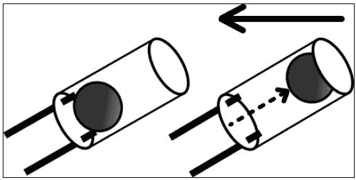

倾斜开关在未移动（左侧）和移动（右侧）时的位置

倾斜开关由一个装在空心绝缘圆柱体内的微型滚珠轴承组成；当球在圆柱体底部静止时，两个引脚之间的连接是闭合的。当球被移动到圆柱体的另一端，与引脚失去接触时，倾斜开关是打开的：

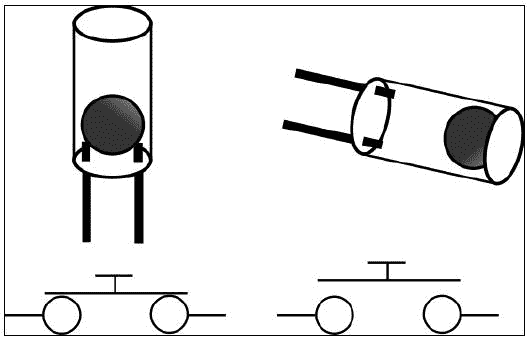

倾斜开关电路，开关关闭和开关打开

之前显示的倾斜开关电路将允许 GPIO 引脚 24 在开关关闭时连接到地，然后如果我们读取该引脚，当它处于静止状态时将返回`False`。通过将 GPIO 引脚设置为输入并启用内部上拉电阻，当倾斜开关打开时，它将报告`True`。

如果倾斜开关是打开的（报告`True`），则我们假设单元正在移动，并开始显示 LED 序列，每次显示 LED 模式的一行时，都会递增当前位置。为了使模式更加多彩（只是因为我们能这么做！），我们将每一行重复一遍，用另一种颜色。一旦`TILT.tilt_moving()`函数报告我们停止移动或正在朝相反方向移动，我们将重置当前位置，以便再次从头开始整个模式：


信息是由 RGB LED 显示的——这里使用绿色和蓝色一起显示

当 RGB LED 模块和倾斜开关来回移动时，我们应该能看到空中显示的信息！

尝试使用不同的颜色组合、速度和手臂摆动来观察你能产生哪些效果。你甚至可以创建一个安装在轮子上的类似装置，以产生连续的 POV 效果。
