# 第七章. 感知和显示现实世界数据

在本章中，我们将涵盖以下主题：

+   使用带有 I²C 总线的设备

+   使用模数转换器读取模拟数据

+   记录和绘制数据

+   使用 I/O 扩展器扩展 Raspberry Pi GPIO

+   在 SQLite 数据库中捕获数据

+   从您的自有网络服务器查看数据

+   感知并将数据发送到在线服务

# 简介

在上一章中，我们使用了 Raspberry Pi GPIO 直接通过控制或读取 GPIO 引脚来控制并响应连接的硬件。在本章中，我们将学习如何从现实世界收集模拟数据并对其进行处理，以便我们可以显示、记录、绘图并共享数据，并在我们的程序中使用它。

我们将通过使用 Raspberry Pi 的 GPIO 连接与**模数转换器**（**ADC**）、LCD 数码显示屏和数字端口扩展器来扩展 Raspberry Pi 的功能。

### 小贴士

请务必查看附录，*硬件和软件列表*，其中列出了本章中使用的所有项目及其获取地点。

# 使用带有 I²C 总线的设备

Raspberry Pi 可以支持多种高级协议，这使得更广泛的设备可以轻松连接。在本章中，我们将重点关注最常用的总线，称为**I²C**（**I-squared-C**）。它提供了一个中速总线，用于通过两根线与设备通信。在本节中，我们将使用 I²C 与 8 位 ADC 进行接口。该设备将测量模拟信号，将其转换为介于 0 和 255 之间的相对值，并将该值作为数字信号（由 8 位表示）通过 I²C 总线发送到 Raspberry Pi。

## 准备工作

I²C 总线并非在所有 Raspberry Pi 图像中都已启用；因此，我们需要启用模块并安装一些支持工具。Raspbian 的新版本使用**设备树**来处理硬件外围设备和驱动程序。

为了使用 I²C 总线，我们需要在 `\boot\config.txt` 文件中启用 ARM I²C。

您可以使用以下命令自动完成此操作：

```py
sudo raspi-config

```

如以下截图所示，从菜单中选择**高级选项**，然后选择**I²C**。当被询问时，选择**是**以启用接口，并默认加载模块。

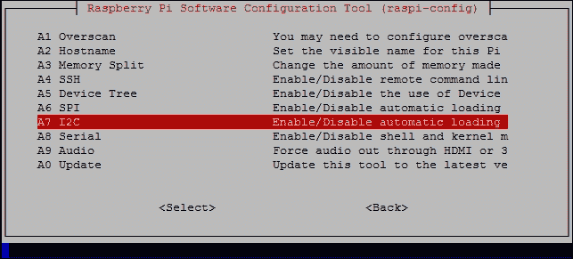

从菜单中选择**I²C**，并选择**是**以启用接口并默认加载模块。

### 小贴士

`raspi-config` 程序通过修改 `/boot/config.txt` 以包含 `dtparam=i2c_arm=on` 来启用 `I2C_ARM` 接口。另一个总线（I2C_VC）通常保留用于与 Raspberry Pi HAT 扩展板进行接口（从板载存储设备读取配置信息）；然而，您可以使用 `dtparam=i2c_vc=on` 来启用它。

如果您愿意，也可以通过 `raspi-config` 列表启用 SPI，这是另一种可以在第十章，*与技术接口*中看到的总线类型。

接下来，我们应该包含在开机时加载的 I²C 模块，如下所示：

```py
sudo nano /etc/modules

```

在单独的行上添加以下内容并保存（*Ctrl + X, Y, Enter*）：

```py
i2c-dev
i2c-bcm2708

```

同样，我们也可以通过添加 `spi-bcm2708` 来启用 SPI 模块。

接下来，我们将安装一些工具，以便可以直接从命令行使用 I²C 设备，如下所示：

```py
sudo apt-get update
sudo apt-get install i2c-tools

```

最后，在连接硬件之前关闭 Raspberry Pi，以便应用更改，如下所示：

```py
sudo halt

```

您需要一个 PCF8591 模块（这些模块的零售商列在附录， *硬件和软件列表*中），或者您可以单独获取 PCF8591 芯片并构建自己的电路（有关电路的详细信息，请参阅 *还有更多…* 部分）。

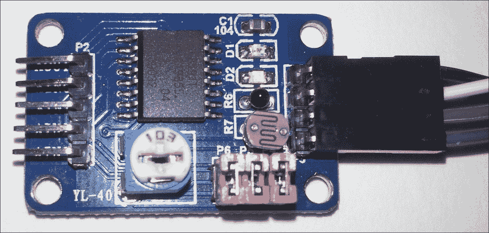

来自 dx.com 的 PCF8591 ADC 和传感器模块

将 **GND**、**VCC**、**SDA** 和 **SCL** 引脚连接到 Raspberry Pi GPIO 引脚，如下所示：

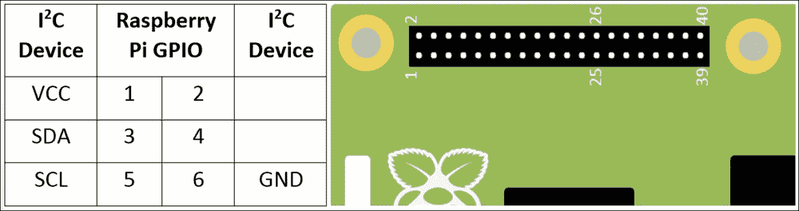

Raspberry Pi GPIO 引脚上的 I²C 连接

### 注意

您可以通过研究设备的规格书来使用相同的 I²C 工具/代码与其他 I²C 设备进行交互，以找出要发送/读取的消息以及用于控制您的设备的哪些寄存器。

## 如何操作...

使用以下命令通过 `i2cdetect`（使用 `--y` 选项跳过关于可能与其他硬件（可能连接到 I²C 总线）发生干扰的任何警告）检测 I²C 设备：

```py
sudo i2cdetect -y 0
sudo i2cdetect -y 1

```

根据您的 Raspberry Pi 板修订版，设备的地址应列在总线 0 上（对于 B 型 Rev1 板）或总线 1 上（对于 Raspberry Pi 2 & 3，Raspberry Pi 1 Model A 和 Model B Rev2）。默认情况下，PCF8591 地址为 `0x48`。

| 要使用的 I²C 总线编号 | 总线 00 | 总线 11 |
| --- | --- | --- |
| Raspberry Pi 2 & 3 | HAT ID (I2C_VC) | GPIO (I2C_ARM) |
| A 型和 B 型修订 2 | P5 | GPIO |
| B 型修订 1 | GPIOGPIO | n/a |

以下截图显示了 `i2cdetect` 的输出：

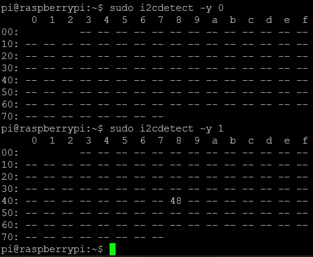

PCF8591 地址（48）在此显示在总线 1 上

如果没有列出任何内容，请关闭并检查您的连接（来自 [www.dx.com](http://www.dx.com) 的 ADC 模块在供电时会显示红色 LED）。

### 注意

如果您收到 `/dev/i2c1` 总线不存在的错误，您可以执行以下检查。

确保文件 `/etc/modprobe.d/raspi-blacklist.conf` 为空（即，模块没有被列入黑名单），使用以下命令查看文件：

```py
sudo nano /etc/modprobe.d/raspi-blacklist.conf

```

如果文件中存在任何内容（例如 `blacklist i2c-bcm2708`），请将其删除并保存。

检查 `/boot/config` 并确保没有一行包含 `device_tree_param=`（这将禁用对新设备树配置的支持，并禁用对某些 Raspberry Pi HAT 扩展板的兼容性支持）。

使用`lsmod`检查模块是否已加载，并查找`i2c-bcm2708`和`i2c_dev`。

使用检测到的总线号（`0`或`1`）和设备地址（`0x48`），使用`i2cget`从设备读取（在上电或通道更改后，你需要读取设备两次以查看最新值），如下所示：

```py
sudo i2cget -y 1 0x48
sudo i2cget -y 1 0x48

```

要从通道`1`（这是模块上的温度传感器）读取，我们可以使用`i2cset`将`0x01`写入 PCF8591 控制寄存器。同样，使用两次读取从通道`1`获取一个新的样本，如下所示：

```py
sudo i2cset -y 1 0x48 0x01
sudo i2cget -y 1 0x48
sudo i2cget -y 1 0x48

```

要循环遍历每个输入通道，请使用`i2cset`将控制寄存器设置为`0x04`，如下所示：

```py
sudo i2cset -y 1 0x48 0x04

```

我们还可以使用以下命令来控制 AOUT 引脚，将其完全打开（点亮 LED D1）：

```py
sudo i2cset -y 1 0x48 0x40 0xff

```

最后，我们可以使用以下命令将其完全关闭（关闭 LED D1）：

```py
sudo i2cset -y 1 0x48 0x40 0x00

```

## 它是如何工作的...

在上电后从设备读取第一次将返回`0x80`，并也会触发从通道 0 的新样本。如果你再次读取，它将返回之前读取的样本并生成一个新的样本。每次读取都将是一个 8 位值（范围从`0`到`255`），表示电压从 0 到 VCC（在这种情况下，0V 到 3.3V）。在[www.dx.com](http://www.dx.com)模块上，通道 0 连接到一个光传感器，所以如果你用手遮住模块并重新发送命令，你会观察到值的变化（变暗意味着值更高，变亮意味着值更低）。你会发现读取值总是落后一步；这是因为当它返回前一个样本时，它会捕获下一个样本。

我们使用以下命令来指定要读取的特定通道：

```py
sudo i2cset -y 1 0x48 0x01

```

这将读取的通道更改为通道 1（在模块上标记为**AIN1**）。记住，你需要在看到新选择通道的数据之前执行两次读取。以下表格显示了通道和引脚名称以及哪些跳线连接器启用/禁用每个传感器：

| 通道 | 0 | 1 | 2 | 3 |
| --- | --- | --- | --- | --- |
| 引脚名称 | AIN0 | AIN1 | AIN2 | AIN3 |
| 传感器 | 光敏电阻 | 热敏电阻 | 外部引脚 | 滑动变阻器 |
| 跳线 | P5 | P4 |   | P6 |

接下来，我们通过设置控制寄存器的模拟输出使能标志（位 6）来控制 AOUT 引脚，并使用下一个值来设置模拟电压（0V-3.3V 0x00-0xFF），如下所示：

```py
sudo i2cset -y 1 0x48 0x40 0xff 

```

最后，你可以将位 2（`0x04`）设置为自动递增，并按如下方式循环遍历输入通道：

```py
sudo i2cset -y 1 0x48 0x04

```

每次运行`i2cget -y 1 0x48`，下一个通道将被选择，从通道 AIN0 开始，然后是 AIN1 到 AIN3，再回到 AIN0。

### 注意

要了解如何设置一个值中的特定位，查看数字的二进制表示很有帮助。8 位值`0x04`可以写成二进制`b0000 0100`（`0x`表示值是以十六进制或十六进制形式编写的，而 b 表示一个二进制数）。

二进制数中的位从右到左计数，从 0 开始，即 MSB 7 6 5 4 3 2 1 0 LSB。

位 7 被称为 **最高有效位**（**MSB**），位 0 被称为 **最低有效位**（**LSB**）。因此，通过设置位 2，我们最终得到 `b0000 0100`（这是 `0x04`）。

## 还有更多...

I²C 总线使我们能够通过仅使用几根线轻松地连接多个设备。PCF8591 芯片可以用来将您的传感器连接到模块或只是芯片。

### 使用多个 I²C 设备

I²C 总线上的所有命令都是针对特定的 I²C 设备的（许多设备可以选择将一些引脚设置为高电平或低电平以选择额外的地址，并允许多个设备存在于同一总线上）。每个设备都必须有一个唯一的地址，这样在任何时候只有一个设备会响应。PCF8591 的起始地址是 `0x48`，通过三个地址引脚可选择到 `0x4F`。这允许在同一总线上使用多达八个 PCF8591 设备。

### 注意

如果您决定使用位于 GPIO 引脚 27 和 28（或 Model A 和 Rev2 Model B 设备上的 P5 头部）的 I2C_VC 总线，您可能需要在 I²C 线和 3.3V 之间添加一个 1k8 欧姆的上拉电阻。这些电阻已经存在于 GPIO 连接器上的 I²C 总线上。然而，一些 I²C 模块，包括 PCF8591 模块，已经安装了自己的电阻，因此无需额外的电阻即可工作。

### I²C 总线和电平转换

I²C 总线由两根线组成，一根是数据（SDA），另一根是时钟（SCL）。两者都通过上拉电阻被动地拉到 VCC（在 Raspberry Pi 上，这是 3.3V）。Raspberry Pi 将通过在每个周期中将时钟拉低来控制时钟，数据线可以通过 Raspberry Pi 拉低来发送命令，或者由连接的设备拉低以响应数据。

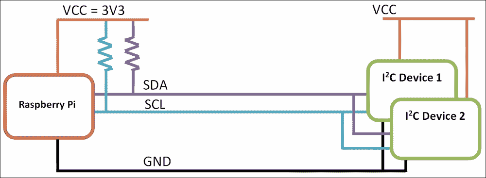

Raspberry Pi 的 I²C 引脚包括 SDA 和 SCL 上的上拉电阻

由于从设备只能将数据线拉到 **GND**，因此设备可以由 **3.3V** 或甚至 **5V** 供电，而不会存在驱动 GPIO 引脚过高的风险（记住 Raspberry Pi 的 GPIO 不能处理超过 3.3V 的电压）。只要设备的 I²C 总线能识别 3.3V 而不是 5V 的逻辑高电平，这应该就可以工作。I²C 设备不得配备自己的上拉电阻，因为这会导致 GPIO 引脚被拉到 I²C 设备的供电电压。

注意，本章中使用的 PCF8591 模块已安装了电阻；因此，我们只能使用 VCC=3V3。可以使用双向逻辑电平转换器来解决任何逻辑电平问题。这样的设备之一是 **Adafruit** I²C 双向逻辑电平转换器，如图所示：

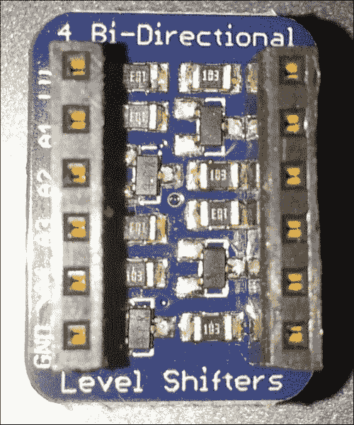

Adafruit I²C 双向逻辑电平转换模块

除了确保任何逻辑电压适合您所使用的设备外，它还将允许总线通过更长的电线扩展（电平转换器还将充当总线中继器）。

### 仅使用 PCF8591 芯片或添加替代传感器

以下图示显示了未连接传感器的 PCF8591 模块的电路图：

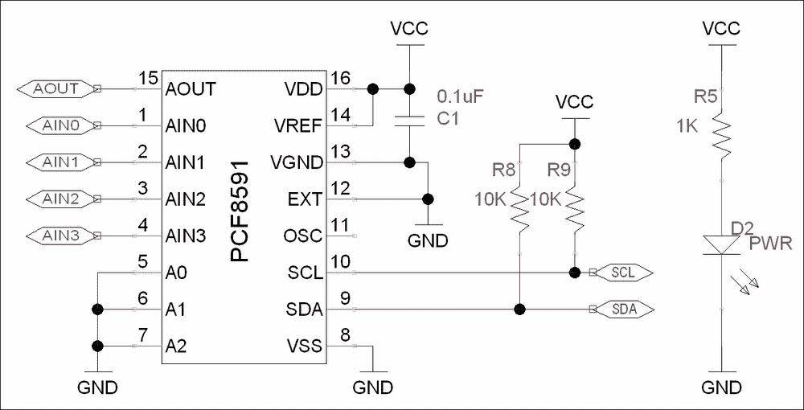

PCF8591 ADC 电路 – VCC、GND、SCL 和 SDA 如前所述连接到 Raspberry Pi

如您所见，除了传感器外，只有五个额外的组件。我们有一个电源滤波电容（C1）和电源指示 LED（D2）以及限流电阻（R5），所有这些都是可选的。

应注意，该模块包含两个 10k 上拉电阻（R8 和 R9）用于 SCL 和 SDA 信号。然而，由于 Raspberry Pi 上的 GPIO I²C 连接也包含上拉电阻，因此在该模块上不需要这些电阻（并且可以移除）。这也意味着我们应仅将此模块连接到 VCC=3.3V（如果我们使用 5V，则 SCL 和 SDA 上的电压将约为 3.56V，这对 Raspberry Pi 的 GPIO 引脚来说太高）。

PCF891 模块上的传感器都是电阻性的，因此当传感器的电阻变化时，模拟输入上的电压将在 GND 和 VCC 之间变化。

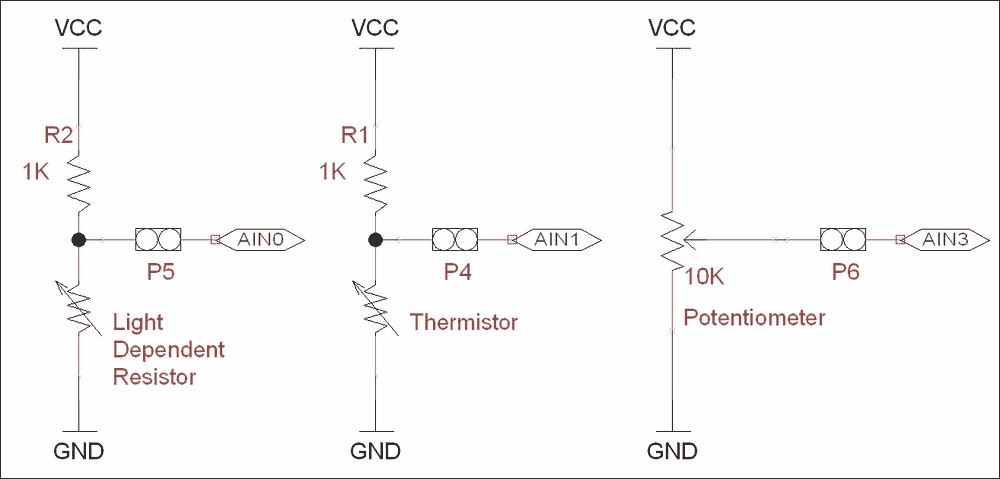

电位分压器电路用于提供与传感器电阻成比例的电压

该模块使用一种称为电位分压器的电路。顶部的电阻平衡底部传感器的电阻，以提供介于 VCC 和 GND 之间的电压。

电位分压器输出电压（*Vout*）的计算如下：


Rt 和 Rb 分别是顶部和底部的电阻值，VCC 是供电电压。

模块中的电位计电阻在顶部和底部之间根据调节器的位置分为 10k 欧姆。因此，在中点，每侧有 5k 欧姆，输出电压为 1.65V；四分之一处（顺时针方向），我们有 2.5k 欧姆和 7.5k 欧姆，产生 0.825V。

### 注意

我没有展示 AOUT 电路，它是一个电阻和 LED。然而，正如您将发现的，LED 不适合指示模拟输出（除了显示开/关状态）。

对于更敏感的电路，您可以使用更复杂的电路，如**惠斯通电桥**（允许检测非常小的电阻变化），或者您可以使用基于其读数的专用传感器输出模拟电压（如**TMP36**温度传感器）。PCF891 还支持差分输入模式，其中一个通道可以与另一个通道的输入进行比较（结果读数将是两个之间的差值）。

关于 PCF8591 芯片的更多信息，请参阅[`www.nxp.com/documents/data_sheet/PCF8591.pdf`](http://www.nxp.com/documents/data_sheet/PCF8591.pdf)的数据表。

# 使用模数转换器读取模拟数据

I2CTools（在上一节中使用）在命令行中调试 I²C 设备非常有用，但它们在 Python 中使用并不实用，因为它们会变慢，并且使用时需要大量的开销。幸运的是，有几个 Python 库提供了 I²C 支持，允许高效地使用 I²C 与连接的设备通信并提供易于操作。

我们将使用这样的库来创建自己的 Python 模块，使我们能够快速轻松地从 ADC 设备获取数据，并在我们的程序中使用它。该模块设计得如此之好，以至于其他硬件或数据源可以替换它，而不会影响剩余的示例。

## 准备就绪

要使用 Python 3 的 I²C 总线，我们将使用 Gordon Henderson 的`wiringPi2`（更多详情请见[`wiringpi.com/`](http://wiringpi.com/)）。

安装`wiringPi2`最简单的方法是使用 Python 3 的 PIP。PIP 是 Python 的一个包管理器，其工作方式与`apt-get`类似。您希望安装的任何包都将自动从在线仓库下载并安装。

要安装 PIP，请使用以下命令：

```py
sudo apt-get install python3-dev python3-pip

```

然后使用以下命令安装`wiringPi2`：

```py
sudo pip-3.2 install wiringpi2

```

安装完成后，您应该会看到以下内容，表示成功：


成功安装 wiringPi2

您需要将 PCF8591 模块按照之前的方式连接到 Raspberry Pi 的 I²C 连接。

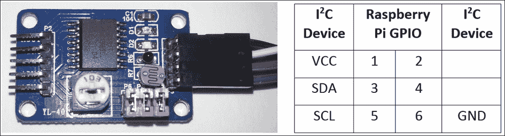

PCF8591 模块和引脚连接到 Raspberry Pi 的 GPIO 连接器（如前所述）

## 如何操作...

在下一节中，我们将编写一个脚本，使我们能够收集数据，然后在本章的后续部分使用这些数据。

创建以下脚本，`data_adc.py`，如下所示：

1.  首先，导入模块并创建我们将使用的变量，如下所示：

    ```py
    #!/usr/bin/env python3
    #data_adc.py
    import wiringpi2
    import time

    DEBUG=False
    LIGHT=0;TEMP=1;EXT=2;POT=3
    ADC_CH=[LIGHT,TEMP,EXT,POT]
    ADC_ADR=0x48
    ADC_CYCLE=0x04
    BUS_GAP=0.25
    DATANAME=["0:Light","1:Temperature",
              "2:External","3:Potentiometer"]
    ```

1.  创建一个名为`device`的类，并使用构造函数来初始化它，如下所示：

    ```py
    class device:
      # Constructor:
      def __init__(self,addr=ADC_ADR):
        self.NAME = DATANAME
        self.i2c = wiringpi2.I2C()
        self.devADC=self.i2c.setup(addr)
        pwrup = self.i2c.read(self.devADC) #flush powerup value
        if DEBUG==True and pwrup!=-1:
          print("ADC Ready")
        self.i2c.read(self.devADC) #flush first value
        time.sleep(BUS_GAP)
        self.i2c.write(self.devADC,ADC_CYCLE)
        time.sleep(BUS_GAP)
        self.i2c.read(self.devADC) #flush first value
    ```

1.  在类中，定义一个函数以提供如下通道名称列表：

    ```py
      def getName(self):
        return self.NAME
    ```

1.  定义另一个函数（仍然作为类的一部分），以如下方式返回来自 ADC 通道的新样本集：

    ```py
      def getNew(self):
        data=[]
        for ch in ADC_CH:
          time.sleep(BUS_GAP)
          data.append(self.i2c.read(self.devADC))
        return data
    ```

1.  最后，在设备类之后，创建一个测试函数来测试我们的新`device`类，如下所示。这仅在脚本直接执行时运行：

    ```py
    def main():
      ADC = device(ADC_ADR)
      print (str(ADC.getName()))
      for i in range(10):
        dataValues = ADC.getNew()
        print (str(dataValues))
        time.sleep(1)

    if __name__=='__main__':
      main()
    #End
    ```

您可以使用以下命令运行此模块的测试函数：

```py
sudo python3 data_adc.py

```

## 它是如何工作的...

我们首先导入 `wiringpi2`，以便我们稍后可以与我们的 I²C 设备通信。我们将创建一个类来包含控制 ADC 所需的功能。当我们创建类时，我们可以初始化 `wiringPi2` 以便它可以使用 I²C 总线（使用 `wiringpi2.I2C()`），并且我们使用芯片的总线地址设置一个通用的 I²C 设备（使用 `self.i2c.setup(0x48)`）。

### 注意

`wiringPi2` 还有一个用于与 PCF8591 芯片一起使用的专用类；然而，在这种情况下，使用标准的 I²C 功能来展示如何使用 `wiringPi2` 控制任何 I²C 设备更有用。通过参考设备数据表，你可以使用类似的命令与任何连接的 I²C 设备通信（无论它是否直接受支持）。

如前所述，我们执行设备读取并配置 ADC 在通道之间循环，但不是使用 `i2cget` 和 `i2cset`，而是使用 I²C 对象的 `wiringPi2` 读写函数。一旦初始化，设备将准备好读取每个通道上的模拟信号。

该类还将有两个成员函数。第一个函数 `getName()` 返回一个通道名称列表（我们可以用它来关联我们的数据与其来源），第二个函数 `getNew()` 返回所有通道的新数据集。数据通过 `i2c.read()` 函数从 ADC 读取，并且由于我们已经将其置于循环模式，每次读取都将来自下一个通道。

由于我们计划稍后重用此类，我们将使用 `if __name__` 测试来允许我们在直接执行文件时运行一些代码。在我们的 `main()` 函数中，我们创建了一个 ADC 实例，它是我们新设备类的一个实例。如果我们需要，可以选择非默认地址；否则，将使用芯片的默认地址。我们使用 `getName()` 函数打印出通道名称，然后我们可以从 `ADC`（使用 `getNew()`）收集数据并显示它们。

## 还有更多...

以下内容允许我们在 `data_adc.py` 中定义设备类的替代版本，以便它可以替代 ADC 模块使用。这将使得本章剩余部分可以在不需要任何特定硬件的情况下进行尝试。

### 无硬件收集模拟数据

如果你没有 ADC 模块可用，Raspberry Pi 内部有大量数据可供使用。

创建以下脚本，`data_local.py`：

```py
#!/usr/bin/env python3
#data_local.py
import subprocess
from random import randint
import time

MEM_TOTAL=0
MEM_USED=1
MEM_FREE=2
MEM_OFFSET=7
DRIVE_USED=0
DRIVE_FREE=1
DRIVE_OFFSET=9
DEBUG=False
DATANAME=["CPU_Load","System_Temp","CPU_Frequency",
          "Random","RAM_Total","RAM_Used","RAM_Free",
          "Drive_Used","Drive_Free"]

def read_loadavg():
  # function to read 1 minute load average from system uptime
  value = subprocess.check_output(
            ["awk '{print $1}' /proc/loadavg"], shell=True)
  return float(value)

def read_systemp():
  # function to read current system temperature
  value = subprocess.check_output(
            ["cat /sys/class/thermal/thermal_zone0/temp"],
            shell=True)
  return int(value)

def read_cpu():
  # function to read current clock frequency
  value = subprocess.check_output(
            ["cat /sys/devices/system/cpu/cpu0/cpufreq/"+
             "scaling_cur_freq"], shell=True)
  return int(value)

def read_rnd():
  return randint(0,255)

def read_mem():
  # function to read RAM info
  value = subprocess.check_output(["free"], shell=True)
  memory=[]
  for val in value.split()[MEM_TOTAL+
                           MEM_OFFSET:MEM_FREE+
                           MEM_OFFSET+1]:
    memory.append(int(val))
  return(memory)

def read_drive():
  # function to read drive info
  value = subprocess.check_output(["df"], shell=True)
  memory=[]
  for val in value.split()[DRIVE_USED+
                           DRIVE_OFFSET:DRIVE_FREE+
                           DRIVE_OFFSET+1]:
    memory.append(int(val))
  return(memory)

class device:
  # Constructor:
  def __init__(self,addr=0):
    self.NAME=DATANAME

  def getName(self):
    return self.NAME

  def getNew(self):
    data=[]
    data.append(read_loadavg())
    data.append(read_systemp())
    data.append(read_cpu())
    data.append(read_rnd())
    memory_ram = read_mem()
    data.append(memory_ram[MEM_TOTAL])
    data.append(memory_ram[MEM_USED])
    data.append(memory_ram[MEM_FREE])
    memory_drive = read_drive()
    data.append(memory_drive[DRIVE_USED])
    data.append(memory_drive[DRIVE_FREE])
    return data

def main():
  LOCAL = device()
  print (str(LOCAL.getName()))
  for i in range(10):
    dataValues = LOCAL.getNew()
    print (str(dataValues))
    time.sleep(1)

if __name__=='__main__':
  main()
#End
```

以下脚本允许我们使用以下命令从 Raspberry Pi 收集系统信息（`subprocess` 模块允许我们捕获结果并处理它们）：

+   CPU 速度：

    ```py
    cat /sys/devices/system/cpu/cpu0/cpufreq/scaling_cur_freq

    ```

+   CPU 负载：

    ```py
    awk '{print $1}' /proc/loadavg

    ```

+   核心温度（按 1,000 缩放）：

    ```py
    cat /sys/class/thermal/thermal_zone0/temp

    ```

+   驱动信息：

    ```py
    df

    ```

+   RAM 信息：

    ```py
    free

    ```

每个数据项使用其中一个函数进行采样。在驱动和 RAM 信息的情况下，我们将响应拆分为一个列表（由空格分隔）并选择我们想要监控的项目（如可用内存和已用驱动器空间）。

这一切都被打包起来，以便以与 `data_adc.py` 文件和 `device` 类相同的方式工作（因此你可以在以下示例中选择使用其中一个，只需将 `data_adc` 包含文件替换为 `data_local`）。

# 日志记录和绘图数据

现在我们能够采样和收集大量数据，因此我们能够捕获和分析它变得非常重要。我们将使用一个名为 `matplotlib` 的 Python 库，它包括许多用于操作、绘图和分析数据的实用工具。我们将使用 `pyplot`（它是 `matplotlib` 的一部分）来生成我们捕获数据的图表。有关 `pyplot` 的更多信息，请访问 [`matplotlib.org/users/pyplot_tutorial.html`](http://matplotlib.org/users/pyplot_tutorial.html)。

## 准备工作

要使用 `pyplot`，我们需要安装 `matplotlib`。

### 注意

由于 `matplotlib` 安装程序的问题，使用 pip-3.2 进行安装并不总是正确。以下方法将通过手动执行 PIP 所做的所有步骤来克服这个问题；然而，这可能需要超过 30 分钟才能完成。

为了节省时间，你可以尝试使用 PIP 安装，这会快得多。如果不起作用，你可以使用这种方法手动安装。

尝试使用以下命令使用 PIP 安装 `matplotlib`：

```py
sudo apt-get install tk-dev python3-tk libpng-dev
sudo pip-3.2 install numpy
sudo pip-3.2 install matplotlib

```

你可以通过运行 `python3` 并尝试从 Python 终端导入它来确认 `matplotlib` 是否已安装，如下所示：

```py
import matplotlib

```

### 注意

如果安装失败，它将响应如下：

```py
ImportError: No module named matplotlib

```

否则，将没有错误。

使用以下步骤手动安装 `matplotlib`：

1.  按如下方式安装支持包：

    ```py
    sudo apt-get install tk-dev python3-tk python3-dev libpng-dev
    sudo pip-3.2 install numpy
    sudo pip-3.2 install matplotlib

    ```

1.  从 Git 仓库下载源文件（命令应该是一行）如下：

    ```py
    wget https://github.com/matplotlib/matplotlib/archive/master.zip

    ```

1.  解压并打开创建的 `matplotlib-master` 文件夹，如下所示：

    ```py
    unzip master.zip
    rm master.zip
    cd matplotlib-master

    ```

1.  运行设置文件进行构建（这将需要一段时间）并按如下方式安装：

    ```py
    sudo python3 setup.py build
    sudo python3 setup.py install

    ```

1.  以与自动安装相同的方式进行安装测试。

我们可能需要 PCF8591 ADC 模块（并且之前已安装 `wiringPi2`），或者我们可以使用上一节中的 `data_local.py` 模块（只需在脚本的导入部分将 `data_adc` 替换为 `data_local`）。我们还需要将 `data_adc.py` 和 `data_local.py` 放在新脚本相同的目录中，具体取决于你使用哪个。

## 如何操作...

1.  创建以下脚本，`log_adc.py`：

    ```py
    #!/usr/bin/python3
    #log_adc.c
    import time
    import datetime
    import data_adc as dataDevice

    DEBUG=True
    FILE=True
    VAL0=0;VAL1=1;VAL2=2;VAL3=3 #Set data order
    FORMATHEADER = "\t%s\t%s\t%s\t%s\t%s"
    FORMATBODY = "%d\t%s\t%f\t%f\t%f\t%f"

    if(FILE):f = open("data.log",'w')

    def timestamp():
      ts = time.time() 
      return datetime.datetime.fromtimestamp(ts).strftime(
                                        '%Y-%m-%d %H:%M:%S')

    def main():
        counter=0
        myData = dataDevice.device()
        myDataNames = myData.getName()
        header = (FORMATHEADER%("Time",
                            myDataNames[VAL0],myDataNames[VAL1],
                            myDataNames[VAL2],myDataNames[VAL3]))
        if(DEBUG):print (header)
        if(FILE):f.write(header+"\n")
        while(1):
          data = myData.getNew()
          counter+=1
          body = (FORMATBODY%(counter,timestamp(),
                            data[0],data[1],data[2],data[3]))
          if(DEBUG):print (body)
          if(FILE):f.write(body+"\n")
          time.sleep(0.1)

    try:
      main()
    finally:
      f.close()
    #End
    ```

1.  创建第二个脚本，`log_graph.py`，如下所示：

    ```py
    #!/usr/bin/python3
    #log_graph.py
    import numpy as np
    import matplotlib.pyplot as plt

    filename = "data.log"
    OFFSET=2
    with open(filename) as f:
        header = f.readline().split('\t')

    data = np.genfromtxt(filename, delimiter='\t', skip_header=1,
                        names=['sample', 'date', 'DATA0',
                               'DATA1', 'DATA2', 'DATA3'])
    fig = plt.figure(1)
    ax1 = fig.add_subplot(211)#numrows, numcols, fignum
    ax2 = fig.add_subplot(212)
    ax1.plot(data['sample'],data['DATA0'],'r',
             label=header[OFFSET+0])
    ax2.plot(data['sample'],data['DATA1'],'b',
             label=header[OFFSET+1])
    ax1.set_title("ADC Samples")    
    ax1.set_xlabel('Samples')
    ax1.set_ylabel('Reading')
    ax2.set_xlabel('Samples')
    ax2.set_ylabel('Reading')

    leg1 = ax1.legend()
    leg2 = ax2.legend()

    plt.show()
    #End
    ```

## 它是如何工作的...

第一个脚本 `log_adc.py` 允许我们收集数据并将其写入日志文件。

我们可以通过将 `data_adc` 导入为 `dataDevice` 来使用 ADC 设备，或者我们可以导入 `data_local` 来使用系统数据。给 `VAL0` 到 `VAL3` 分配的数字允许我们更改通道的顺序（如果使用 `data_local` 设备，则选择其他通道）。我们还定义了日志文件中标题和每行的格式字符串（以创建一个用制表符分隔数据的文件），使用 `%s`，`%d` 和 `%f` 来允许我们替换字符串、整数和浮点值，如下表所示：

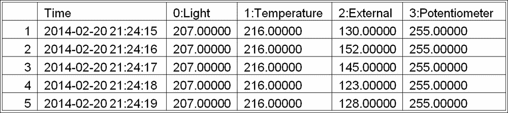

从 ADC 传感器模块捕获的数据表

如果将日志记录到文件（当 `FILE=True` 时），我们使用 `'w'` 选项以写入模式打开 `data.log`（这将覆盖任何现有文件；要追加到文件，请使用 `'a'`）。

作为我们数据日志的一部分，我们使用 `time` 和 `datetime` 生成 `timestamp`，以获取当前的 **纪元时间**（这是自 1970 年 1 月 1 日以来的毫秒数），使用 `time.time()` 命令。我们使用 `strftime()` 将值转换为更友好的 `年-月-日 时:分:秒` 格式。

`main()` 函数首先创建我们 `device` 类的一个实例（我们在前面的示例中创建了它），这将提供数据。我们从 `data` 设备获取通道名称并构建 `header` 字符串。如果 `DEBUG` 设置为 `True`，数据将被打印到屏幕上；如果 `FILE` 设置为 `True`，它将被写入文件。

在主循环中，我们使用设备的 `getNew()` 函数收集数据并将其格式化以在屏幕上显示或记录到文件。使用 `try: finally:` 命令调用 `main()` 函数，这将确保当脚本被终止时，文件将被正确关闭。

第二个脚本 `log_graph.py` 允许我们读取日志文件并生成记录数据的图表，如下所示：

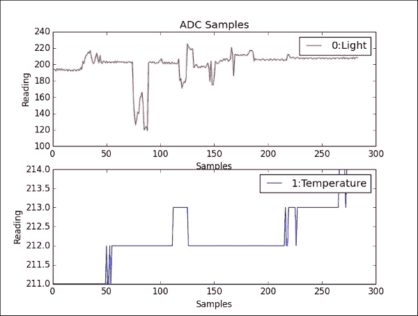

由 light 和温度传感器生成的 log_graph.py 产生的图表

我们首先打开日志文件并读取第一行；这包含标题信息（然后我们可以使用它来识别后续的数据）。接下来，我们使用 `numpy`，这是一个专业的 Python 库，它扩展了我们可以操作数据和数字的方式。在这种情况下，我们使用它来读取文件中的数据，根据制表符分隔符拆分它，并为每个数据通道提供标识符。

我们定义一个图形来保存我们的图表，添加两个子图（位于 2 x 1 网格中，网格位置为 1 和 2 - 由值 `211` 和 `212` 设置）。接下来，我们定义我们想要绘制的值，提供 `x` 值（`data['sample']`），`y` 值（`data['DATA0']`），`color` 值（`'r'` 代表红色或 `'b'` 代表蓝色），以及 `label`（设置为从文件顶部读取的标题文本）。

最后，我们为每个子图设置一个标题，`x` 和 `y` 标签，启用图例（以显示标签），并显示图表（使用 `plt.show()`）。

## 还有更多...

现在我们有了查看我们一直在捕获的数据的能力，我们可以通过在采样时显示数据来更进一步。这将使我们能够立即看到数据如何对环境或刺激的变化做出反应。我们还可以校准数据，以便我们可以分配适当的缩放比例以产生实际单位中的测量值。

### 实时数据绘图

除了从文件中绘制数据外，我们还可以使用`matplotlib`绘制采样时的传感器数据。为了实现这一点，我们可以使用`plot-animation`功能，该功能会自动调用一个函数来收集新数据并更新我们的图表。

创建以下脚本，`live_graph.py`：

```py
#!/usr/bin/python3
#live_graph.py
import numpy as np
import matplotlib.pyplot as plt
import matplotlib.animation as animation
import data_local as dataDevice

PADDING=5
myData = dataDevice.device()
dispdata = []
timeplot=0
fig, ax = plt.subplots()
line, = ax.plot(dispdata)

def update(data):
  global dispdata,timeplot
  timeplot+=1
  dispdata.append(data)
  ax.set_xlim(0, timeplot)
  ymin = min(dispdata)-PADDING
  ymax = max(dispdata)+PADDING
  ax.set_ylim(ymin, ymax)
  line.set_data(range(timeplot),dispdata)
  return line

def data_gen():
  while True:
    yield myData.getNew()[1]/1000

ani = animation.FuncAnimation(fig, update, 
                              data_gen, interval=1000)
plt.show()
#End
```

我们首先定义我们的`dataDevice`对象并创建一个空数组`dispdata[]`，它将保存所有收集到的数据。接下来，我们定义我们的子图和将要绘制的线条。

`FuncAnimation()`函数允许我们通过定义一个更新函数和一个生成函数来更新一个图形（`fig`）。生成函数（`data_gen()`）将每隔（1,000 毫秒）被调用一次，并产生一个数据值。

此示例使用核心温度读数，当除以 1,000 时，给出实际的温度`degC`。

### 小贴士

要使用 ADC 数据，请将`dataDevice`的导入更改为`data_adc`，并调整以下行以使用除`[1]`以外的通道，并应用不同于 1,000 的缩放比例：

```py
yield myData.getNew()[1]/1000

```

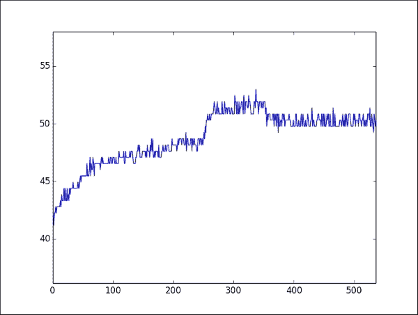

树莓派实时绘图（核心温度（以摄氏度为单位）与时间（以秒为单位））

数据值传递给`update()`函数，这使得我们可以将其添加到我们的`dispdata[]`数组中，该数组将包含所有要在图中显示的数据值。我们调整*x*轴的范围，使其接近数据的`min`和`max`值，同时调整*y*轴，以便在继续采样更多数据时增长。

### 注意

`FuncAnimation()`函数需要`data_gen()`对象是一个特殊类型的函数，称为`generator`。`generator`函数在每次被调用时都会产生一系列连续的值，如果需要，甚至可以使用其先前状态来计算下一个值。这用于执行绘图时的连续计算；这就是为什么在这里使用它的原因。在我们的情况下，我们只想连续运行相同的采样函数（`new_data()`），因此每次调用它时，它将产生一个新的样本。

最后，我们使用`dispdata[]`数组（使用`set_data()`函数）更新*x*和*y*轴的数据，这将绘制我们的样本与采样秒数的对应关系。要使用其他数据或绘制来自 ADC 的数据，请调整`dataDevice`的导入，并在`data_gen()`函数中选择所需的通道（和缩放比例）。

### 数据缩放和校准

你可能已经注意到，有时从模数转换器（ADC）读取的数据可能很难解释，因为它的值只是一个数字。除了告诉你它比前一个样本稍微热一点或暗一点之外，数字并没有太大的帮助。然而，如果你可以使用另一个设备提供可比较的值（例如当前房间温度），那么你可以校准你的传感器数据以提供更有用的现实世界信息。

为了获得粗略的校准，我们将使用两个样本来创建一个线性拟合模型，然后可以使用该模型来估计其他 ADC 读取的真实世界值（这假设传感器本身的响应主要是线性的）。以下图显示了在 25 度和 30 摄氏度下的两个读取值，为其他温度提供了估计的 ADC 值：

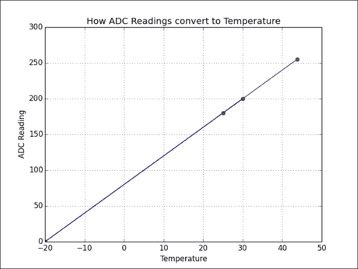

样本用于线性校准温度传感器读取

我们可以使用以下函数来计算我们的模型：

```py
  def linearCal(realVal1,readVal1,realVal2,readVal2):
    #y=Ax+C
    A = (realVal1-realVal2)/(readVal1-readVal2)
    C = realVal1-(readVal1*A)
    cal = (A,C)
    return cal
```

这将返回`cal`，它将包含模型斜率（`A`）和偏移量（`C`）。

我们可以使用以下函数通过使用该通道计算出的`cal`值来计算任何读取的值：

```py
  def calValue(readVal,cal = [1,0]):
    realVal = (readVal*cal[0])+cal[1]
    return realVal
```

为了提高精度，你可以取几个样本，并在值之间使用线性插值（或者根据需要将数据拟合到其他更复杂的数学模型）。

# 使用 I/O 扩展器扩展 Raspberry Pi GPIO

正如我们所见，利用高级总线协议使我们能够快速轻松地连接到更复杂的硬件。通过使用 I²C 来扩展 Raspberry Pi 上的可用 I/O 以及提供额外的电路保护（在某些情况下，还可以提供额外的电源来驱动更多硬件），I²C 可以得到很好的利用。

有很多设备可以提供 I²C 总线的 I/O 扩展（以及 SPI），但最常用的是 28 引脚设备，MCP23017，它提供了 16 个额外的数字输入/输出引脚。作为一个 I²C 设备，它只需要两个信号（SCL 和 SDA 连接加上地线和电源）并且可以与其他 I²C 设备在同一总线上愉快地工作。

我们将看到 Adafruit I²C 16x2 RGB LCD Pi Plate 如何使用这些芯片之一来通过 I²C 总线控制 LCD 字符显示和键盘（如果没有 I/O 扩展器，这通常需要多达 15 个 GPIO 引脚）。

## 准备工作

你将需要 Adafruit I²C 16x2 RGB LCD Pi Plate（它还包括五个按键），如下图所示：

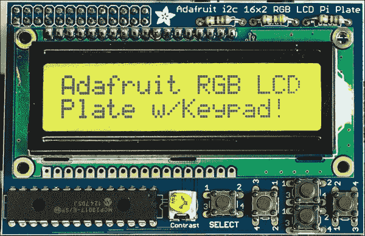

带有按键的 Adafruit I²C 16x2 RGB LCD Pi Plate

Adafruit I²C 16x2 RGB LCD Pi Plate 直接连接到 Raspberry Pi 的 GPIO 连接器。

如前所述，我们可以使用 PCF8591 ADC 模块或使用上一节中的`data_local.py`模块（在脚本的导入部分使用`data_adc`或`data_local`）。`data_adc.py`和`data_local.py`文件应与新的脚本在同一目录中。

### 小贴士

LCD Pi 板只需要五个引脚（SDA，SCL，GND 和 5V）；它连接到整个 GPIO 引脚头。如果我们想与其他设备一起使用它，例如 PCF8591 ADC 模块，则可以使用类似 PiBorg 的 TriBorg（它将 GPIO 端口分成三个部分）。

## 如何做到这一点...

1.  创建以下脚本，`lcd_i2c.py`：

    ```py
    #!/usr/bin/python3
    #lcd_i2c.py
    import wiringpi2
    import time
    import datetime
    import data_local as dataDevice

    AF_BASE=100
    AF_E=AF_BASE+13;     AF_RW=AF_BASE+14;   AF_RS=AF_BASE+15
    AF_DB4=AF_BASE+12;   AF_DB5=AF_BASE+11;  AF_DB6=AF_BASE+10
    AF_DB7=AF_BASE+9

    AF_SELECT=AF_BASE+0; AF_RIGHT=AF_BASE+1; AF_DOWN=AF_BASE+2
    AF_UP=AF_BASE+3;     AF_LEFT=AF_BASE+4;  AF_BACK=AF_BASE+5

    AF_GREEN=AF_BASE+6;  AF_BLUE=AF_BASE+7;  AF_RED=AF_BASE+8
    BNK=" "*16 #16 spaces

    def gpiosetup():
      global lcd
      wiringpi2.wiringPiSetup()
      wiringpi2.mcp23017Setup(AF_BASE,0x20)
      wiringpi2.pinMode(AF_RIGHT,0)
      wiringpi2.pinMode(AF_LEFT,0)
      wiringpi2.pinMode(AF_SELECT,0)
      wiringpi2.pinMode(AF_RW,1)
      wiringpi2.digitalWrite(AF_RW,0)
      lcd=wiringpi2.lcdInit(2,16,4,AF_RS,AF_E,
                            AF_DB4,AF_DB5,AF_DB6,AF_DB7,0,0,0,0)

    def printLCD(line0="",line1=""):
      wiringpi2.lcdPosition(lcd,0,0)
      wiringpi2.lcdPrintf(lcd,line0+BNK)
      wiringpi2.lcdPosition(lcd,0,1)
      wiringpi2.lcdPrintf(lcd,line1+BNK)

    def checkBtn(idx,size):
      global run
      if wiringpi2.digitalRead(AF_LEFT):
        idx-=1
        printLCD()
      elif wiringpi2.digitalRead(AF_RIGHT):
        idx+=1
        printLCD()
      if wiringpi2.digitalRead(AF_SELECT):
        printLCD("Exit Display")
        run=False
      return idx%size

    def main():
      global run
      gpiosetup()
      myData = dataDevice.device()
      myDataNames = myData.getName()
      run=True
      index=0
      while(run):
        data = myData.getNew()
        printLCD(myDataNames[index],str(data[index]))
        time.sleep(0.2)
        index = checkBtn(index,len(myDataNames))

    main()
    #End
    ```

1.  连接 LCD 模块后，按如下方式运行脚本：

    ```py
    sudo python3 lcd_i2c.py

    ```

使用左右按钮选择要显示的数据通道，然后按**SELECT**按钮退出。

## 它是如何工作的...

`wiringPi2`库对 I/O 扩展器芯片（如用于 AdaFruit LCD 字符模块的芯片）有很好的支持。要使用 Adafruit 模块，我们需要为 MCP23017 端口 A 的所有引脚设置引脚映射，如下表所示（然后我们使用偏移量`100`设置 I/O 扩展器引脚）：

| Name | SELECT | RIGHT | DOWN | UP | LEFT | GREEN | BLUE | RED |
| --- | --- | --- | --- | --- | --- | --- | --- | --- |
| MCP23017 PortA | A0 | A1 | A2 | A3 | A4 | A6 | A7 | A8 |
| WiringPiPin | 100 | 101 | 102 | 103 | 104 | 106 | 107 | 108 |

MCP23017 端口 B 的所有引脚的引脚映射如下：

| Name | DB7 | DB6 | DB5 | DB4 | E | RW | RS |
| --- | --- | --- | --- | --- | --- | --- | --- |
| MCP23017 PortB | B1 | B2 | B3 | B4 | B5 | B6 | B7 |
| WiringPiPin | 109 | 110 | 111 | 112 | 113 | 114 | 115 |

要设置 LCD 屏幕，我们初始化`wiringPiSetup()`和 I/O 扩展器，`mcp23017Setup()`。然后我们指定 I/O 扩展器的引脚偏移和总线地址。接下来，我们将所有硬件按钮设置为输入（使用`pinMode(pin number,0)`），并将 LCD 的 RW 引脚设置为输出。`wiringPi2` LCD 库期望 RW 引脚被设置为`LOW`（强制进入只读模式），因此我们将引脚设置为`LOW`（使用`digitalWrite(AF_RW,0)`）。

我们通过定义屏幕的行数和列数，以及我们是否使用 4 位或 8 位数据模式（我们使用 8 条数据线中的 4 条，因此是 4 位模式）来创建一个`lcd`对象。我们还提供了我们使用的引脚映射（最后四条设置为`0`，因为我们只使用四条数据线）。

现在我们创建一个名为`PrintLCD()`的函数，它将允许我们向显示的每一行发送字符串。我们使用`lcdPosition()`在`lcd`对象上设置每行的光标位置，然后打印每行的文本。我们还在每行末尾添加一些空白空间，以确保整行被覆盖。

下一个函数`checkBtn()`简要检查左右和选择按钮是否被按下（使用`digitalRead()`函数）。如果左右按钮被按下，则索引设置为数组中的前一个或下一个项目。如果**SELECT**按钮被按下，则`run`标志设置为`False`（这将退出主循环，允许脚本完成）。

以下图示展示了如何将电压稳压器连接到 I/O 扩展器（或其他设备）以提供更多电流来驱动额外的硬件：

## 还有更多...

使用如 MCP23017 的扩展器芯片提供了一种极好的方法来增加与树莓派的硬件连接数量，同时也提供了一层额外的保护（更换扩展器芯片比更换树莓派便宜）。

### I/O 扩展器电压和限制

端口扩展器在使用时仅消耗少量电力，但如果您使用 3.3V 电源供电，那么您从所有引脚中总共只能抽取最大 50 mA 的电流。如果您抽取过多电力，那么您可能会遇到系统冻结或 SD 卡上的读/写损坏。

如果您使用 5V 电源为扩展器供电，那么只要您的 USB 电源足够强大，您就可以抽取扩展器所能支持的最大电流（每个引脚最大约 25 mA，总电流 125 mA）。

我们必须记住，如果扩展器使用 5V 供电，输入/输出和中断线也将是 5V，并且绝不应该连接回树莓派（除非使用电平转换器将电压降至 3.3V）。

通过改变扩展器芯片上的地址引脚（A0、A1 和 A2）的布线，可以同时使用多达八个模块在同一 I²C 总线上。为了确保每个模块都有足够的电流，我们需要使用单独的 3.3V 电源。一个如 LM1117-3.3 的线性稳压器就非常合适（这将在 3.3V 下提供高达 800 mA 的电流，每个模块 100 mA），并且只需要以下简单的电路：

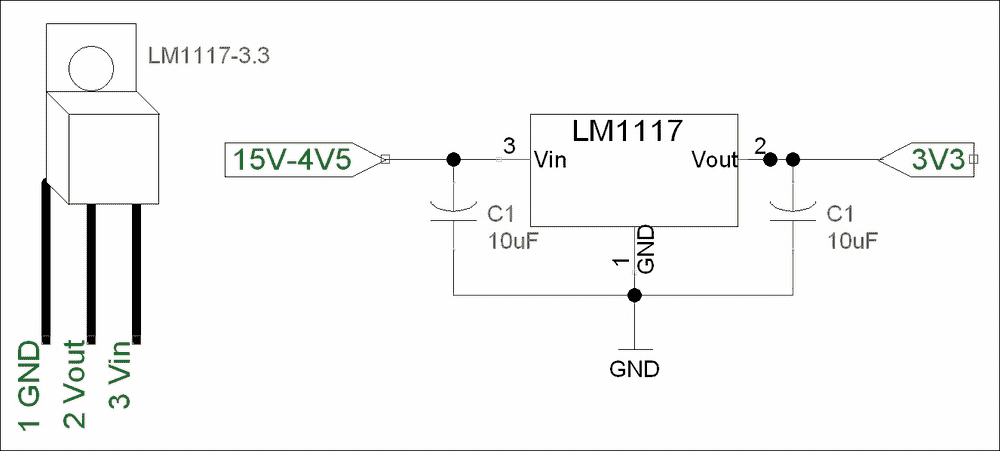

LM1117 线性电压稳压器电路

使用您自己的 I/O 扩展器模块

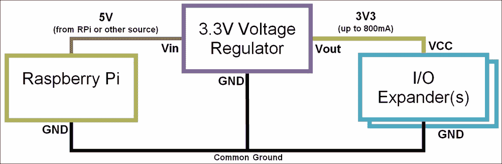

使用电压稳压器与树莓派一起使用

输入电压（Vin）由树莓派提供（例如，来自 GPIO 引脚头，如 5V 引脚 2）。然而，Vin 可以由任何其他电源（或电池组）提供，只要它在 4.5V 到 15V 之间，并且能够提供足够的电流。重要的是确保树莓派、电源（如果使用单独的电源）、稳压器和 I/O 扩展器的地连接（GND）都连接在一起（作为公共地）。

### 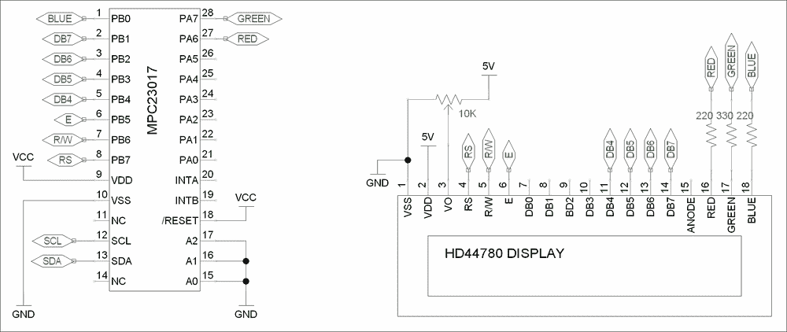

您可以使用可用的 I/O 扩展器模块（或以下电路中的 MCP23017 芯片）来控制大多数与 HD44780 兼容的 LCD 显示器：

`main()`函数调用`gpiosetup()`来创建我们的`lcd`对象；然后我们创建我们的`dataDevice`对象并获取数据名称。在主循环中，我们获取新的数据；然后我们使用我们的`printLCD()`函数在顶部行显示数据名称，在第二行显示数据值。最后，我们检查按钮是否被按下，并根据需要设置索引到我们的数据。

I/O 扩展器和 HD44780 兼容显示屏

在 第六章 的食谱 *The GPIO keypad input* 中解释的 D-Pad 电路，也可以连接到扩展器的剩余 Port A 引脚（`PA0` 到按钮 1，`PA1` 到右，`PA2` 到下，`PA3` 到上，`PA4` 到左，`PA5` 到按钮 2）。与前面的示例一样，按钮将是 `PA0` 到 `PA4`（WiringPiPin 编号 100 到 104）；除此之外，我们还在 `PA5`（WiringPiPin 编号 105）上添加了第二个按钮。

### 直接控制 LCD 数码显示屏

或者，您也可以使用以下连接直接从 Raspberry Pi 驱动屏幕：

| **LCD** | VSS | VDD | V0 | RS | RW | E | DB4 | DB5 | DB6 | DB7 |
| --- | --- | --- | --- | --- | --- | --- | --- | --- | --- | --- |
| **LCD 引脚** | 1 | 2 | 3 | 4 | 5 | 6 | 11 | 12 | 13 | 14 |
| **Raspberry Pi GPIO** | 6 (GND) | 2 (5V) | 对比度 | 11 | 13 (GND) | 15 | 12 | 16 | 18 | 22 |

以下表格列出了 Raspberry Pi 和 HD44780 兼容数码显示屏模块之间所需的连接。

对比度引脚（V0）可以像以前一样连接到一个可变电阻（一边接 5V，另一边接 GND）；尽管如此，根据屏幕的不同，您可能发现可以直接连接到 GND/5V 以获得最大对比度。

wiringPi2 LCD 库假定 RW 引脚连接到 GND（只读）；这避免了 LCD 在直接连接到 Raspberry Pi 时发送数据的风险（这将是一个问题，因为屏幕由 5V 供电，会使用 5V 逻辑发送数据）。

确保您使用新的 `AF_XX` 引用更新代码，并在 `gpiosetup()` 函数中更改设置以通过物理引脚编号进行引用。我们还可以跳过 MCP23017 设备的设置。

查看以下命令：

```py
wiringpi2.wiringPiSetup()
wiringpi2.mcp23017Setup(AF_BASE,0x20)

```

将前面的命令替换为以下命令：

```py
wiringpi.wiringPiSetupPhys()

```

您可以看到，我们只需更改引脚引用即可在使用 I/O 扩展器和不使用它之间切换，这显示了 wiringPi2 实现的便利性。

# 在 SQLite 数据库中捕获数据

数据库是存储大量结构化数据的同时保持访问和搜索特定数据能力的完美方式。**结构化查询语言**（**SQL**）是一组标准的命令，用于更新和查询数据库。在此示例中，我们将使用 SQLite（一个轻量级的自包含 SQL 数据库系统实现）。

在本章中，我们将从我们的 ADC（或本地数据源）收集原始数据，并构建我们自己的数据库。然后我们可以使用名为 `sqlite3` 的 Python 库将数据添加到数据库中，然后查询它。

```py
   ##            Timestamp  0:Light  1:Temperature   2:External  3:Potentiometer
    0 2015-06-16 21:30:51      225            212          122              216
    1  2015-06-16 21:30:52      225            212          148              216
    2  2015-06-16 21:30:53      225            212          113              216
    3  2015-06-16 21:30:54      225            212          137              216
    4  2015-06-16 21:30:55      225            212          142              216
    5  2015-06-16 21:30:56      225            212          115              216
    6  2015-06-16 21:30:57      225            212          149              216
    7  2015-06-16 21:30:58      225            212          128              216
    8  2015-06-16 21:30:59      225            212          123              216
    9  2015-06-16 21:31:02      225            212          147              216 
```

## 准备工作

要在数据库中捕获数据，我们将安装 SQLite 以与 Python 的 `sqlite3` 内置模块一起使用。使用以下命令安装 SQLite：

```py
sudo apt-get install sqlite3

```

接下来，我们将使用 SQLite 执行一些基本操作，以了解如何使用 SQL 查询。

直接运行 SQLite，使用以下命令创建一个新的`test.db`数据库文件：

```py
sqlite3 test.db
SQLite version 3.7.13 2012-06-11 02:05:22
Enter ".help" for instructions
Enter SQL statements terminated with a ";"
sqlite>

```

这将在其中直接输入 SQL 命令的 SQLite 控制台内打开。例如，以下命令将创建一个新表，添加一些数据，显示内容，然后删除表：

```py
CREATE TABLE mytable (info TEXT, info2 TEXT,);
INSERT INTO mytable VALUES ("John","Smith");
INSERT INTO mytable VALUES ("Mary","Jane");
John|Smith
Mary|Jane
DROP TABLE mytable;
.exit

```

你需要与之前配方中详细说明的*准备就绪*部分相同的硬件设置。

## 如何做...

创建以下脚本，`mysqlite_adc.py`:

```py
#!/usr/bin/python3
#mysql_adc.py
import sqlite3
import datetime
import data_adc as dataDevice
import time
import os

DEBUG=True
SHOWSQL=True
CLEARDATA=False
VAL0=0;VAL1=1;VAL2=2;VAL3=3 #Set data order
FORMATBODY="%5s %8s %14s %12s %16s"
FORMATLIST="%5s %12s %10s %16s %7s"
DATEBASE_DIR="/var/databases/datasite/"
DATEBASE=DATEBASE_DIR+"mydatabase.db"
TABLE="recordeddata"
DELAY=1 #approximate seconds between samples

def captureSamples(cursor):
    if(CLEARDATA):cursor.execute("DELETE FROM %s" %(TABLE))
    myData = dataDevice.device()
    myDataNames=myData.getName()

    if(DEBUG):print(FORMATBODY%("##",myDataNames[VAL0],
                                myDataNames[VAL1],myDataNames[VAL2],
                                myDataNames[VAL3]))
    for x in range(10):
        data=myData.getNew()
        for i,dataName in enumerate(myDataNames):
            sqlquery = "INSERT INTO %s (itm_name, itm_value) " %(TABLE) + \
                       "VALUES('%s', %s)" \
                        %(str(dataName),str(data[i]))
            if (SHOWSQL):print(sqlquery)
            cursor.execute(sqlquery)

        if(DEBUG):print(FORMATBODY%(x,
                                    data[VAL0],data[VAL1],
                                    data[VAL2],data[VAL3]))
        time.sleep(DELAY)
    cursor.commit()

def displayAll(connect):
    sqlquery="SELECT * FROM %s" %(TABLE)
    if (SHOWSQL):print(sqlquery)
    cursor = connect.execute (sqlquery)
    print(FORMATLIST%("","Date","Time","Name","Value"))

    for x,column in enumerate(cursor.fetchall()):
       print(FORMATLIST%(x,str(column[0]),str(column[1]),
                         str(column[2]),str(column[3])))

def createTable(cursor):
    print("Create a new table: %s" %(TABLE))
    sqlquery="CREATE TABLE %s (" %(TABLE) + \
             "itm_date DEFAULT (date('now','localtime')), " + \
             "itm_time DEFAULT (time('now','localtime')), " + \
             "itm_name, itm_value)" 
    if (SHOWSQL):print(sqlquery)
    cursor.execute(sqlquery)
    cursor.commit()

def openTable(cursor):
    try:
        displayAll(cursor)
    except sqlite3.OperationalError:
        print("Table does not exist in database")
        createTable(cursor)
    finally:
        captureSamples(cursor)
        displayAll(cursor)

try:
    if not os.path.exists(DATEBASE_DIR):
        os.makedirs(DATEBASE_DIR)
    connection = sqlite3.connect(DATEBASE)
    try:
        openTable(connection)
    finally:
        connection.close()
except sqlite3.OperationalError:
    print("Unable to open Database")
finally:
    print("Done")

#End
```

### 注意

如果你没有 ADC 模块硬件，你可以通过将`dataDevice`模块设置为`data_local`来捕获本地数据。确保你有一个`data_local.py`（来自*还有更多…*部分中的*使用模拟数字转换器读取模拟数据*配方），它与该脚本位于同一目录下：

```py
import data_local as dataDevice

```

这将捕获本地数据（RAM、CPU 活动、温度等）到 SQLite 数据库，而不是 ADC 样本。

## 工作原理...

当脚本首次运行时，它将创建一个新的 SQLite 数据库文件，名为`mydatabase.db`，并添加一个名为`recordeddata`的表。该表由`createTable()`生成，它运行以下 SQLite 命令：

```py
CREATE TABLE recordeddata
(
    itm_date DEFAULT (date('now','localtime')),
    itm_time DEFAULT (time('now','localtime')),
    itm_name,
    itm_value
)
```

新表将包含以下数据项：

| Name | Description |
| --- | --- |
| `itm_date` | 用于存储数据样本的日期。当创建数据记录时，当前日期（使用`date('now','localtime')`）作为默认值应用。 |
| `itm_time` | 用于存储数据样本的时间。当创建数据记录时，当前时间（使用`time('now','localtime')`）作为默认值应用。 |
| `itm_name` | 用于记录样本的名称。 |
| `itm_value` | 用于保存采样值。 |

我们然后使用与之前在*记录和绘图*数据配方中相同的方法从 ADC 捕获十个数据样本（如函数`captureSamples()`所示）。然而，这次我们将添加捕获的数据到我们新的 SQLite 数据库表中，使用以下 SQL 命令（通过`cursor.execute(sqlquery)`应用）：

```py
INSERT INTO recordeddata
    (itm_name, itm_value) VALUES ('0:Light', 210)
```

每条记录在创建时都会默认添加当前日期和时间。最终我们得到一组 40 条记录（每个 ADC 采样周期有 4 条记录），这些记录现在存储在 SQLite 数据库中。

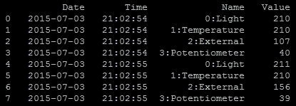

已捕获并存储在 SQLite 数据库中的 ADC 样本有 8 个

在创建记录后，我们必须记得调用`cursor.commit()`，这将保存所有新记录到数据库中。

脚本的最后部分调用`displayAll()`，它将使用以下 SQL 命令：

```py
 SELECT * FROM recordeddata
```

这将选择`recordeddata`表中的所有数据记录，我们使用`cursor.fetch()`提供选定的数据作为我们可以迭代的列表：

```py
    for x,column in enumerate(cursor.fetchall()):
       print(FORMATLIST%(x,str(column[0]),str(column[1]),
                         str(column[2]),str(column[3])))
```

这允许我们打印出数据库的全部内容，显示捕获的数据。

### 注意

注意，在这里我们使用 `try`、`except` 和 `finally` 构造来尝试处理用户在运行脚本时可能遇到的大部分情况。

首先，我们确保如果数据库目录不存在，我们创建它。接下来，我们尝试打开数据库文件；如果不存在数据库文件，此过程将自动创建一个新的数据库文件。如果这些初始步骤中的任何一个失败（例如，由于没有读写权限），我们无法继续，因此我们报告无法打开数据库并简单地退出脚本。

接下来，我们尝试在数据库中打开所需的表并显示它；如果数据库文件是全新的，此操作将始终失败，因为它将是空的。然而，如果发生这种情况，我们只是捕获异常，在继续脚本以将样本数据添加到表并显示之前创建表。

这允许脚本优雅地处理潜在的问题，采取纠正措施，然后继续顺利运行。下次运行脚本时，数据库和表已经存在，因此我们不需要再次创建它们，我们可以将样本数据追加到同一数据库文件中的表内。

## 还有更多...

可用的 SQL 服务器版本有很多（例如 MySQL、Microsoft SQL Server 或 PostgreSQL）；然而，它们至少应该具备以下主要命令（或等效命令）：

```py
CREATE, INSERT, SELECT, WHERE, UPDATE, SET, DELETE, and DROP
```

你应该会发现，即使你选择使用与这里使用的 SQLite 不同的 SQL 服务器，SQL 命令也将相对相似。

### CREATE

`CREATE TABLE` 命令用于通过指定列名（如果需要，还可以设置默认值）来定义新表：

```py
CREATE TABLE table_name (
    column_name1 TEXT, 
    column_name2 INTEGER DEFAULT 0,
    column_name3 REAL )
```

之前的 SQL 命令将创建一个名为 `table_name` 的新表，包含三个数据项。一列将包含文本，另一列包含整数（例如，1、3、-9），最后是一列用于实数（例如，5.6、3.1749、1.0）。

### INSERT

`INSERT` 命令将向数据库中的表添加特定的条目：

```py
INSERT INTO table_name (column_name1name1, column_name2name2, column_name3)name3)
    VALUES ('Terry'Terry Pratchett', 6666, 27.082015)082015)
```

这将把提供的值输入到表中的相应列中。

### SELECT

`SELECT` 命令允许我们指定数据库表中的特定列或列，返回包含数据的记录列表：

```py
SELECT column_name1, column_name2 FROM table_name
```

或者要选择所有项目，使用此命令：

```py
SELECT * FROM table_name
```

### WHERE

`WHERE` 命令用于指定要选择、更新或删除的具体条目：

```py
SELECT * FROM table_name
    WHERE column_name1= 'Terry Pratchett'
```

这将 `SELECT` 任何 `column_name1` 与 `'Terry Pratchett'` 匹配的记录。

### UPDATE

`UPDATE` 命令将允许我们更改（`SET`）指定列中的数据值。我们还可以将此与 `WHERE` 命令结合使用，以限制更改应用到的记录：

```py
UPDATE table_name
    SET column_name2=49name2=49,column_name3=30name3=30.111997
    WHERE column_name1name1= 'Douglas Adams'Adams';
```

### DELETE

`DELETE` 命令允许使用 `WHERE` 选择的任何记录从指定的表中删除。但是，如果选择整个表，使用 `DELETE * FROM table_name` 将删除表中的全部内容：

```py
DELETE FROM table_name
    WHERE columncolumn_name2=9999
```

### DROP

`DROP` 命令允许将表完全从数据库中删除：

```py
DROP table_name

```

警告：这将永久删除指定表中存储的所有数据及其结构。

# 查看您自己的网络服务器上的数据

收集和整理信息到数据库非常有用，但如果它们被锁在数据库或文件中，就没什么用了。然而，如果我们允许通过网页查看存储的数据，它将更容易访问；我们不仅可以从其他设备查看数据，还可以与同一网络上的其他人共享它。

我们将创建一个本地网络服务器来查询和显示捕获的 SQLite 数据，并通过 PHP 网络界面允许查看。这将允许数据不仅可以通过 Raspberry Pi 的网络浏览器查看，还可以在本地网络上的其他设备，如手机或平板电脑上查看：


通过网页显示的 SQLite 数据库中捕获的数据

使用网络服务器来输入和显示信息是允许广泛用户与您的项目互动的一种强大方式。以下示例演示了一个可以针对各种用途定制的网络服务器设置。

## 准备工作

确保您已完成了前面的食谱，以便传感器数据已被收集并存储在 SQLite 数据库中。我们需要安装一个网络服务器（**Apache2**）并启用 PHP 支持以允许 SQLite 访问。

使用以下命令安装一个网络服务器和 PHP：

```py
sudo apt-get update
sudo aptitude install apache2 php5 php5-sqlite

```

`/var/www/` 目录由网络服务器使用；默认情况下，它将加载 `index.html`（或 `index.php`），否则它将仅显示目录内文件的链接列表。

要测试网络服务器是否正在运行，创建一个默认的 `index.html` 页面。为此，您需要使用 `sudo` 权限创建文件（`/var/www/` 目录受普通用户更改的保护）。使用以下命令：

```py
sudo nano /var/www/index.html

```

创建包含以下内容的 `index.html`：

```py
<h1>It works!</h1>
```

关闭并保存文件（使用 *Ctrl + X*，*Y* 和 *Enter*）。

如果您使用带有屏幕的 Raspberry Pi，可以通过加载桌面来检查它是否工作：

```py
startx

```

然后，打开网络浏览器（**epiphany-browser**）并将 `http://localhost` 作为地址输入。您应该看到以下测试页面，表明网络服务器正在运行：

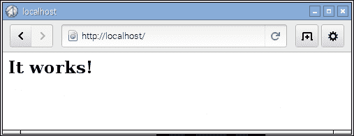

Raspberry Pi 浏览器显示的测试页面，位于 http://localhost

如果您远程使用 Raspberry Pi 或它连接到您的网络，您也应该能够在您的网络上另一台计算机上查看该页面。首先，确定 Raspberry Pi 的 IP 地址（使用 `sudo hostname -I`），然后在您的网络浏览器中使用此地址。您甚至可能发现您可以使用 Raspberry Pi 的实际主机名（默认情况下这是 [`raspberrypi/`](http://raspberrypi/)）。

### 注意

如果您无法从另一台计算机上看到网页，请确保您没有启用防火墙（在计算机本身或您的路由器上），这可能正在阻止它。

接下来，我们可以测试 PHP 是否运行正确。我们可以创建以下网页 `test.php` 并确保它位于 `/var/www/` 目录中：

```py
<?php
phpinfo();
?>;
```

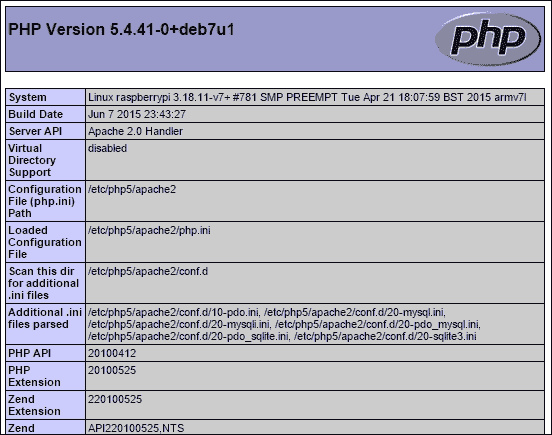

在以下位置查看 `test.php` 页面：http://localhost/test.php

我们已经准备好编写自己的 PHP 网页来查看 SQLite 数据库中的数据。

## 如何操作...

在 web 服务器目录 `/var/www/./` 中创建以下 PHP 文件并保存：

使用以下命令创建 PHP 文件：

```py
sudo nano /var/www/show_data_lite.php

```

`show_data_lite.php` 文件应包含：

```py
<head>
<title>DatabaseDatabase Data</title>
<meta http-equiv="refresh" content="10" >
</head>
<body>

Press button to remove the table data
<br>
<input type="button" onclick="location.href = 'del_data_lite.php';" value="Delete">
<br><br>
<b>Recorded Data</b><br>
<?php
$db = new PDO("sqlite:/var/databases/datasitedatasite/mydatabase.db");
//SQL query
$strSQL = "SELECT * FROM recordeddatarecordeddata WHERE itmitm_name LIKE '%'%temp%'";
//Excute the query
$response = $db->query($strSQL);
//Loop through the response
while($column = $response->fetch())
{
   //Display the content of the response
   echo $column[0] . " ";
   echo $column[1] . " ";
   echo $column[2] . " ";
   echo $column[3] . "<br />";
}
?>
Done
</body>
</html>
```

使用以下命令创建 PHP 文件：

```py
sudo nano /var/www/del_data_lite.php
<html>
<body>

Remove all the data in the table.
<br>
<?php
$db = new PDO("sqlite:/var/databases/datasitedatasite/mydatabase.db");
//SQL query
$strSQL = "DROPDROP TABLErecordeddata recordeddata";
//ExecuteExecute the query
$response = $db->query($strSQL);

if ($response == 1)
{
 echo "Result: DELETED DATA";
}
else
{
 echo "Error: Ensure table exists and database directory is owned by www-data";
}
?>
<br><br>
Press button to return to data display.
<br>
<input type="button" onclick="location.href = 'show'show_data_lite.php';" value="Return">

</body>
</html>

```

### 注意

注意：为了让 PHP 代码能够删除数据库中的表，它需要被 web 服务器可写。使用以下命令来允许它可写：

```py
sudo chown www-data /var/databases/datasite -R

```

如果您通过以下地址在网页浏览器中打开 `show_data_lite.php`，它将显示为一个网页：

```py
http://localhost/showshow_data_lite.php
```

或者，您可以通过引用树莓派的 IP 地址（使用 `hostname -I` 来确认 IP 地址）来打开网页（包括您网络中的另一台计算机）：

```py
http://192.168.1.101/showshow_data_lite.php
```

您可能可以使用主机名代替（默认情况下，这将使地址为 [`raspberrypi/show_data_lite.php`](http://raspberrypi/show_data_lite.php)）。然而，这可能取决于您的网络设置。

如果没有数据，请确保您运行 `mysqlite_adc.py` 脚本来捕获更多数据。

要在访问您的树莓派的网页地址时自动显示 `show_data_lite.php` 页面（而不是 "`It works!`" 页面），我们可以将 `index.html` 改为以下内容：

```py
<meta http-equiv="refresh" content="0; URL='show_data_lite.php' " />
```

这将自动将浏览器重定向到加载我们的 `show_data_lite.php` 页面。

## 工作原理...

`show_data_lite.php` 文件应显示存储在 SQLite 数据库中的温度数据（无论是来自 ADC 样本还是本地数据源）。

`show_data_lite.php` 文件由标准的 HTML 代码以及特殊的 PHP 代码部分组成。HTML 代码将 `ACD 数据` 设置为页面标题部分的标题，并使用以下命令使页面每 10 秒自动重新加载：

```py
<meta http-equiv="refresh" content="10" >
```

接下来，我们定义一个 `删除` 按钮，当点击时将加载 `del_data_lite.php` 页面：

```py
<input type="button" onclick="location.href = 'del_data_lite.php';" value="Delete">
```

最后，我们使用 PHP 代码部分来加载 SQLite 数据库并显示通道 0 的数据。

我们使用以下 PHP 命令来打开我们之前存储数据的 SQLite 数据库（位于 `/var/databases/testsites/mydatabase.db`）：

```py
$db = new PDO("sqlite:/var/databases/testsite/mydatabase.db");
```

接下来，我们使用以下 SQLite 查询来选择所有文本中包含 `0:` 的条目（例如，`0:Light`）：

```py
SELECT * FROM recordeddatarecordeddata WHERE itm_namename LIKE '%temp%''

```

### 注意

注意，尽管我们现在使用 PHP，但我们与 SQLite 数据库使用的查询与使用 SQLite3 Python 模块时相同。

我们现在将查询结果收集到 `$response` 变量中：

```py
$response = $db->query($strSQL);
Allowing us to use fetch() (like we used cursor.fetchall() previously) to list all the data columns in each of the data entries within the response.
while($column = $response->fetch())
{
   //Display the content of the response
   echo $column[0] . " ";
   echo $column[1] . " ";
   echo $column[2] . " ";
   echo $column[3] . "<br />";
}
?>
```

`del_data_lite.php` 文件相当相似；它首先像之前一样重新打开 `mydatabase.db` 文件。然后执行以下 SQLite 查询：

```py
DROP TABLE recordeddata
```

如在*更多... DROP*部分所述，这将从数据库中删除`recordeddata`表。如果`response`不等于 1，则操作未完成。最可能的原因是包含`mydatabase.db`文件的目录无法被 Web 服务器写入（请参阅*如何做*部分中关于更改文件所有者为`www-data`的说明）。

最后，我们提供了一个按钮，用户点击后会返回到`show_data_lite.php`页面（这将显示记录的数据已经被清除）。

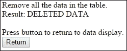

del_data_lite.php 页面包括一个按钮，用于返回到数据展示页面（show_data_lite.php）。

## 还有更多...

你可能已经注意到，这个食谱更多地关注 HTML 和 PHP 而不是 Python（是的，看看封面，这仍然是一本针对 Python 程序员的书籍！）。然而，重要的是要记住，工程的关键部分是将不同的技术集成和组合起来以产生预期的结果。

按照设计，Python 非常适合这类任务，因为它允许轻松定制并与大量其他语言和模块集成。我们本可以只用 Python 来完成所有这些...但为什么不利用现有的解决方案呢？毕竟，它们通常有很好的文档记录，经过广泛的测试，并且通常是行业标准。

### 安全性

SQL 数据库被用于许多地方来存储从产品信息到客户详情的各种信息。在这种情况下，用户可能需要输入信息，然后这些信息会被形成 SQL 查询。在一个实施不当的系统里，恶意用户可能能够在他们的响应中包含额外的 SQL 语法，从而允许他们破坏 SQL 数据库（例如访问敏感信息、修改它或简单地删除它）。

例如，当在网页中请求用户名时，用户可能会输入以下文本：

```py
John; DELETE FROM Orders

```

如果直接使用它来构造 SQL 查询，我们最终会得到以下结果：

```py
SELECT * FROM Users WHERE UserName = John; DELETE FROM CurrentOrders

```

结果是我们刚刚允许攻击者删除`CurrentOrders`表中的所有内容！

使用用户输入来形成 SQL 查询的一部分意味着我们必须小心允许执行哪些命令。在这个例子中，用户可能能够删除可能非常重要的信息，这对公司及其声誉可能造成很大的损失。

这种技术被称为 SQL 注入，可以通过使用 SQLite `execute()`函数的参数选项轻松防范。我们可以将我们的 Python SQLite 查询替换为一个更安全的版本，如下所示：

```py
sqlquery = "INSERT INTO %s (itm_name, itm_value) VALUES(?, ?)" %(TABLE)
cursor.execute(sqlquery, (str(dataName), str(data[i]))
```

而不是盲目地构建 SQL 查询，SQLite 模块将首先检查提供的参数是否是数据库中可以输入的有效值，然后它会确保将这些参数插入到命令中不会产生额外的 SQL 操作。最后，`dataName`和`data[i]`参数的值将被用来替换`?`字符，生成最终的安全的 SQLite 查询。

### 使用 MySQL 代替

在本食谱中使用的 SQLite 只是许多 SQL 数据库中的一种。它适用于只需要相对较小的数据库和最少资源的较小项目。然而，对于需要额外功能（如用户账户以控制访问和额外的安全性）的较大项目，您可以使用 MySQL 等替代品。

要使用不同的 SQL 数据库，您需要调整我们用来捕获条目的 Python 代码，以使用合适的 Python 模块。

对于 MySQL（`mysql-server`），我们可以使用一个与 Python 3 兼容的库，称为**PyMySQL**，来与之接口。有关如何使用此库的更多信息，请参阅 PyMySQL 网站（[`github.com/PyMySQL/PyMySQL`](https://github.com/PyMySQL/PyMySQL)）。

要使用 PHP 与 MySQL，你还需要 PHP MySQL（`php5-mysql`）；更多信息，请参阅 W3 Schools 上的优秀资源（[`www.w3schools.com/php/php_mysql_connect.asp`](http://www.w3schools.com/php/php_mysql_connect.asp)）。

您会注意到，尽管 SQL 实现之间有细微差别，但无论您选择哪个，一般概念和命令现在都应该熟悉。

# 感应并发送数据到在线服务

在本节中，我们将使用一个名为 Xively 的在线服务；该服务允许我们在线连接、传输和查看数据。Xively 使用一个常见的协议，即用于通过 HTTP 传输信息的 REST 协议。许多服务，如 Facebook 和 Twitter，都使用各种密钥和访问令牌来确保数据在授权应用程序和验证网站之间安全传输。

您可以使用一个名为`requests`的 Python 库手动执行大多数 REST 操作（如`POST`、`GET`、`SET`等），[`docs.python-requests.org`](http://docs.python-requests.org)。

然而，通常更容易使用为打算使用的服务提供的特定库。它们将处理授权过程；提供访问函数；如果服务发生变化，则可以更新库而不是您的代码。

我们将使用`xively-python`库，它提供了 Python 函数，使我们能够轻松地与该网站交互。

有关`xively-python`库的详细信息，请参阅[`xively.github.io/xively-python/`](http://xively.github.io/xively-python/)。

Xively 收集的数据如下截图所示：

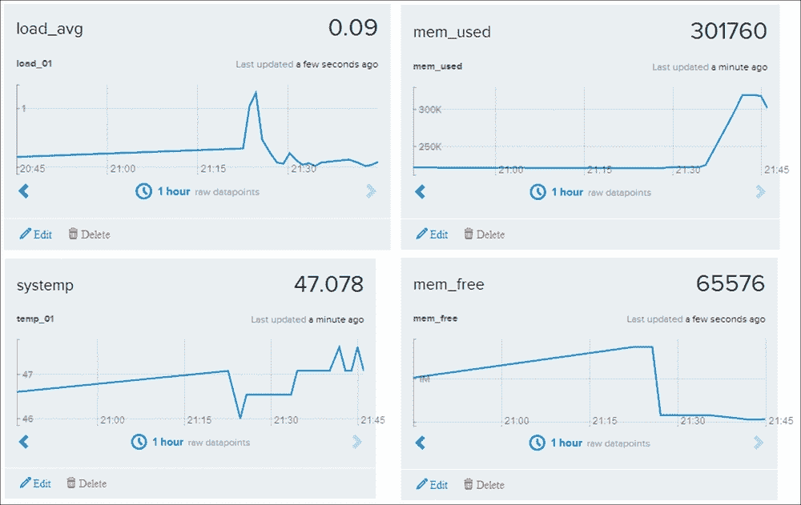

Xively 收集并绘制使用 REST 传输的数据

## 准备就绪

您需要在[www.xively.com](http://www.xively.com)上创建一个账户，我们将使用它来接收我们的数据。访问网站并注册一个免费的开发者账户（通过*开发者*部分，[`personal.xively.com/signup`](https://personal.xively.com/signup)）。


注册并创建 Xively 账户

在注册并验证您的账户后，您可以按照说明进行测试驾驶示例。这将演示如何将数据从您的智能手机（陀螺仪数据、位置等）链接到，这将让您尝到我们可以用树莓派做什么。

当你登录时，你将被带到**开发设备**仪表板（位于**WebTools**下拉菜单中）：

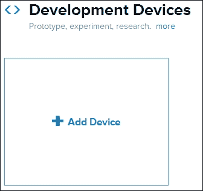

添加新设备

选择**+添加设备**并填写详细信息，给你的设备起一个名字，并将**设备**设置为**私有**。

你现在将看到你远程设备的控制页面，其中包含你连接所需的所有信息，以及你的数据将显示的位置。

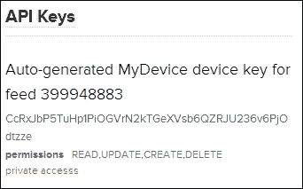

示例 API 密钥和频道编号（这将为您设备唯一）

虽然这个页面上有很多信息，但你只需要其中的两部分：

+   API 密钥（在`API Keys`部分的长代码），如下所示：

    ```py
    API_KEY = CcRxJbP5TuHp1PiOGVrN2kTGeXVsb6QZRJU236v6PjOdtzze
    ```

+   频道编号（在`API Keys`部分提及，并在页面顶部列出），如下所示：

    ```py
    FEED_ID = 399948883
    ```

现在我们有了连接 Xively 所需的详细信息，我们可以专注于树莓派这一方面。

我们将使用 pip-3.2 来安装 Xively，如下所示：

```py
sudo pip-3.2 install xively-python

```

确保安装报告显示以下内容：

```py
Successfully installed xively-python requests

```

你现在可以开始从你的树莓派发送一些数据了。

## 如何操作...

创建以下脚本，`xivelyLog.py`。确保在代码中设置`FEED_ID`和`API_KEY`以匹配您创建的设备：

```py
#!/usr/bin/env python3
#xivelylog.py
import xively
import time
import datetime
import requests
from random import randint
import data_local as dataDevice

# Set the FEED_ID and API_KEY from your account
FEED_ID = 399948883
API_KEY = "CcRxJbP5TuHp1PiOGVrN2kTGeXVsb6QZRJU236v6PjOdtzze"
api = xively.XivelyAPIClient(API_KEY) # initialize api client
DEBUG=True

myData = dataDevice.device()
myDataNames=myData.getName()

def get_datastream(feed,name,tags):
  try:
    datastream = feed.datastreams.get(name)
    if DEBUG:print ("Found existing datastream")
    return datastream
  except:
    if DEBUG:print ("Creating new datastream")
    datastream = feed.datastreams.create(name, tags=tags)
    return datastream

def run():
  print ("Connecting to Xively")
  feed = api.feeds.get(FEED_ID)
  if DEBUG:print ("Got feed" + str(feed))
  datastreams=[]
  for dataName in myDataNames:
    dstream = get_datastream(feed,dataName,dataName)
    if DEBUG:print ("Got %s datastream:%s"%(dataName,dstream))
    datastreams.append(dstream)

  while True:
    data=myData.getNew()
    for idx,dataValue in enumerate(data):
      if DEBUG:
        print ("Updating %s: %s" % (dataName,dataValue))
      datastreams[idx].current_value = dataValue
      datastreams[idx].at = datetime.datetime.utcnow()
    try:
      for ds in datastreams:
        ds.update()
    except requests.HTTPError as e:
      print ("HTTPError({0}): {1}".format(e.errno, e.strerror))
    time.sleep(60)

run()
#End
```

## 它是如何工作的...

首先，我们初始化 Xively API 客户端，并向其提供`API_KEY`（这授权我们向之前创建的`Xively`设备发送数据）。接下来，我们使用`FEED_ID`将我们链接到我们想要发送数据的特定频道。最后，我们请求要连接的数据流（如果它已经在频道中存在，`get_datastream()`函数将为我们创建一个）。

对于频道中的每个数据流，我们提供一个`name`函数和`tags`（这些是帮助我们识别数据的关键词；我们可以使用我们的数据名称来这样做）。

一旦我们定义了数据流，我们进入`main`循环；在这里，我们从`dataDevice`收集我们的数据值。然后我们设置每个数据项的`current_value`函数以及数据的时间戳，并将其应用于我们的数据流对象。

最后，当所有数据准备就绪时，我们更新每个数据流，并将数据发送到 Xively，几分钟后在设备的仪表板上显示。

我们可以使用标准网络浏览器登录到我们的 Xively 账户，并查看传入的数据。这提供了在任何地方发送数据和远程监控数据的方法（如果需要，可能一次从多个 Raspberry Pi 上进行）。该服务甚至支持创建触发器，如果某些项目超出预期范围、达到特定值或匹配设置的标准，则可以发送额外的消息。这些触发器反过来可以用来控制其他设备或触发警报等。

## 参见

AirPi 空气质量和天气项目 ([`airpi.es`](http://airpi.es)) 展示了如何添加您自己的传感器或使用他们的 AirPi 套件来创建您自己的空气质量和水文站（并将数据记录到您的 Xively 账户）。该网站还允许您与世界各地的其他人共享您的 Xively 数据流。
