# 第八章。使用 Raspberry Pi 摄像头模块创建项目

在本章中，我们将涵盖以下主题：

+   开始使用 Raspberry Pi 摄像头模块

+   使用 Python 使用摄像头

+   生成延时视频

+   创建定格动画

+   制作 QR 码阅读器

+   探索和实验 OpenCV

+   使用 OpenCV 进行颜色检测

+   使用 OpenCV 进行运动跟踪

# 简介

Raspberry Pi 摄像头模块是 Raspberry Pi 的一个特殊附加组件，它利用**摄像头串行接口**（**CSI**）**连接器**。它直接连接到 Raspberry Pi 处理器的 GPU 核心，允许直接在单元上捕获图像。

我们将使用在第三章和第四章中使用的`tkinter`库创建一个基本的**图形用户界面**（**GUI**）。这些章节分别是《使用 Python 进行自动化和生产率》和《创建游戏和图形》。这将构成以下三个示例的基础，在这些示例中，我们将通过添加额外的控件来扩展 GUI，以便我们可以将相机用于各种不同的项目。

最后，我们将设置功能强大的**开放计算机视觉**（**OpenCV**）库以执行一些高级图像处理。我们将学习 OpenCV 的基础知识，并使用它根据颜色跟踪对象或检测运动。

### 小贴士

本章使用 Raspberry Pi 摄像头模块，该模块可在附录中列出的大多数零售商处获得，该附录位于*Makers, hobbyists, and Raspberry Pi specialists*部分，即《硬件和软件列表》。

# 开始使用 Raspberry Pi 摄像头模块

我们将首先安装和设置 Raspberry Pi 摄像头模块；然后我们将创建一个小的相机 GUI，使我们能够预览和拍照。我们将创建的第一个 GUI 如图所示：

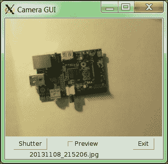

Raspberry Pi 摄像头模块的基本相机 GUI

## 准备工作

Raspberry Pi 摄像头模块由一个安装在小型**印刷电路板**（**PCB**）上的摄像头组成，该电路板通过小型扁平电缆连接。扁平电缆可以直接连接到 Raspberry Pi 板的 CSI 端口（标记为**S5**，该端口位于 Raspberry Pi 上的 USB 和 HDMI 端口之间）。以下图像显示了 Raspberry Pi 摄像头模块：

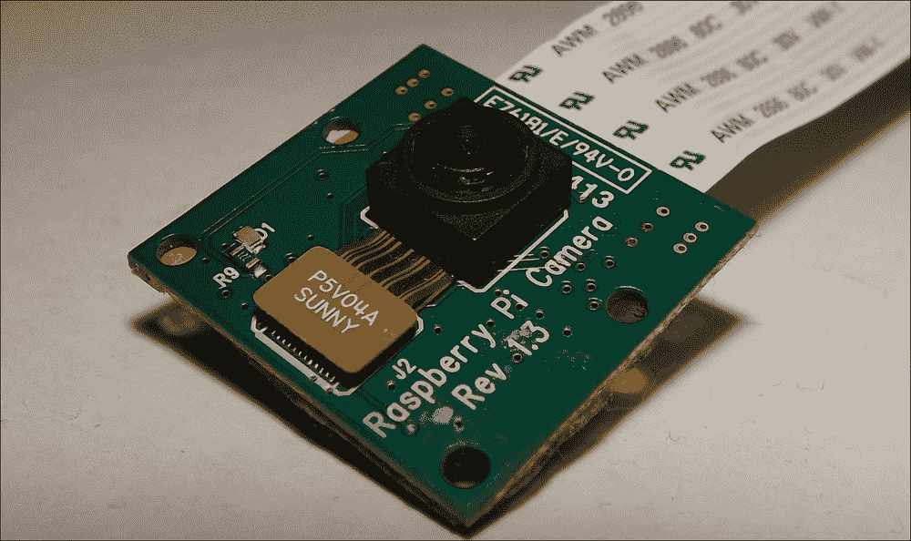

Raspberry Pi 摄像头模块

Raspberry Pi 基金会提供了有关如何在[`www.raspberrypi.org/archives/3890`](http://www.raspberrypi.org/archives/3890)安装摄像头的详细说明（以及视频）；执行以下步骤：

1.  首先，将相机安装如图所示（确保您首先已将 Raspberry Pi 从任何电源断开）：

    摄像头模块的接插件位于 HDMI 插座旁边

    要将扁平电缆插入 CSI 插座，您需要轻轻抬起并松开扁平电缆插座的卡扣。将扁平电缆插入带有金属触点的插槽中，面向 HDMI 端口。注意不要弯曲或折叠扁平电缆，确保它在插座中牢固且水平，然后再将卡扣推回原位。

1.  最后，启用摄像头。您可以通过 Raspbian 桌面上的 Raspberry Pi 配置 GUI 来完成此操作（通过 **接口** 菜单打开）。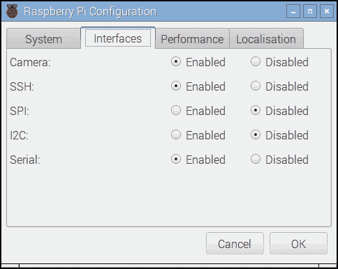

    通过 Raspberry Pi 配置屏幕中的 **接口** 选项卡启用 Raspberry Pi 摄像头

或者，您也可以通过命令行使用 `raspi-config` 来完成此操作。使用 `sudo raspi-config` 来运行它，找到 **启用摄像头** 的菜单项，并启用它。之后，您将被提示重新启动。

## 如何操作…

您可以使用作为升级部分安装的两个程序——`raspivid` 和 `raspistill`——来测试摄像头。

要拍摄一张照片，请使用以下命令（`-t 0` 立即拍照）：

```py
raspistill -o image.jpg -t 0

```

要以 H.264 格式拍摄一个短的视频，时长为 10 秒，请使用以下命令（`-t` 值以毫秒为单位）：

```py
raspivid -o video.h264 -t 10000

```

## 它是如何工作的…

摄像头和 `raspivid`、`raspistill` 工具的完整文档可在 Raspberry Pi 网站上找到，链接为 [`www.raspberrypi.org/wp-content/uploads/2013/07/RaspiCam-Documentation.pdf`](http://www.raspberrypi.org/wp-content/uploads/2013/07/RaspiCam-Documentation.pdf)。

### 小贴士

要获取有关每个程序的信息，您可以使用 `less` 命令查看说明（使用 `q` 退出）如下所示：

```py
raspistill > less
raspivid > less

```

每个命令都提供了对摄像头设置的全面控制，例如曝光、白平衡、锐度、对比度、亮度和分辨率。

# 使用 Python 操作摄像头

Raspberry Pi 上的摄像头模块不仅仅是一个标准网络摄像头。由于我们能够从自己的程序中完全访问控制和设置，它允许我们掌握控制权并创建自己的摄像头应用程序。

在本章中，我们将使用由 Dave Hughes 创建的名为 `picamera` 的 Python 模块来控制摄像头模块，该模块执行 `raspivid` 和 `raspistill` 所支持的所有功能。

请参阅 [`picamera.readthedocs.org`](http://picamera.readthedocs.org) 以获取更多文档和大量有用的示例。

## 准备工作

Raspberry Pi 摄像头模块应按照上一节中的详细说明连接和安装。

此外，我们还需要安装 Python 3 Pillow 库（如何在 第三章的 *在应用程序中显示照片信息* 菜谱中完成此操作的详细信息已涵盖），*使用 Python 进行自动化和生产率*。

现在，使用以下命令为 Python 3 安装 `picamera`：

```py
sudo apt-get install python3-picamera

```

## 如何操作…

1.  创建以下`cameraGUI.py`脚本，该脚本应包含 GUI 的主类：

    ```py
    #!/usr/bin/python3
    #cameraGUI.py
    import tkinter as TK
    from PIL import Image
    import subprocess
    import time
    import datetime
    import picamera as picam

    class SET():
      PV_SIZE=(320,240)
      NORM_SIZE=(2592,1944)
      NO_RESIZE=(0,0)
      PREVIEW_FILE="PREVIEW.gif"
      TEMP_FILE="PREVIEW.ppm"

    class cameraGUI(TK.Frame):
      def run(cmd):
        print("Run:"+cmd)
        subprocess.call([cmd], shell=True)
      def camCapture(filename,size=SET.NORM_SIZE):
        with picam.PiCamera() as camera:
          camera.resolution = size
          print("Image: %s"%filename)
          camera.capture(filename)
      def getTKImage(filename,previewsize=SET.NO_RESIZE):
        encoding=str.split(filename,".")[1].lower()
        print("Image Encoding: %s"%encoding)
        try:
          if encoding=="gif" and previewsize==SET.NO_RESIZE:
            theTKImage=TK.PhotoImage(file=filename)
          else:
            imageview=Image.open(filename)
            if previewsize!=SET.NO_RESIZE:
              imageview.thumbnail(previewsize,Image.ANTIALIAS)
            imageview.save(SET.TEMP_FILE,format="ppm")
            theTKImage=TK.PhotoImage(file=SET.TEMP_FILE)
        except IOError:
          print("Unable to get: %s"%filename)
        return theTKImage
      def timestamp():
        ts=time.time() 
        tstring=datetime.datetime.fromtimestamp(ts)
        return tstring.strftime("%Y%m%d_%H%M%S")

      def __init__(self,parent):
        self.parent=parent
        TK.Frame.__init__(self,self.parent)
        self.parent.title("Camera GUI")
        self.previewUpdate = TK.IntVar()
        self.filename=TK.StringVar()
        self.canvas = TK.Canvas(self.parent,
                                width=SET.PV_SIZE[0],
                                height=SET.PV_SIZE[1])
        self.canvas.grid(row=0,columnspan=4)
        self.shutterBtn=TK.Button(self.parent,text="Shutter",
                                        command=self.shutter)
        self.shutterBtn.grid(row=1,column=0)
        exitBtn=TK.Button(self.parent,text="Exit",
                                 command=self.exit)
        exitBtn.grid(row=1,column=3)
        previewChk=TK.Checkbutton(self.parent,text="Preview",
                                  variable=self.previewUpdate)
        previewChk.grid(row=1,column=1)
        labelFilename=TK.Label(self.parent,
                               textvariable=self.filename)
        labelFilename.grid(row=2,column=0,columnspan=3)
        self.preview()
      def msg(self,text):
        self.filename.set(text)
        self.update()
      def btnState(self,state):
        self.shutterBtn["state"] = state
      def shutter(self):
        self.btnState("disabled")
        self.msg("Taking photo...")
        self.update()
        if self.previewUpdate.get() == 1:
          self.preview()
        else:
          self.normal()
        self.btnState("active")
      def normal(self):
        name=cameraGUI.timestamp()+".jpg"
        cameraGUI.camCapture(name,SET.NORM_SIZE)
        self.updateDisp(name,previewsize=SET.PV_SIZE)
        self.msg(name)
      def preview(self):
        cameraGUI.camCapture(SET.PREVIEW_FILE,SET.PV_SIZE)
        self.updateDisp(SET.PREVIEW_FILE)
        self.msg(SET.PREVIEW_FILE)
      def updateDisp(self,filename,previewsize=SET.NO_RESIZE):
        self.msg("Loading Preview...")
        self.myImage=cameraGUI.getTKImage(filename,previewsize)
        self.theImage=self.canvas.create_image(0,0,
                                      anchor=TK.NW,
                                      image=self.myImage)
        self.update()
      def exit(self):
        exit()
    #End
    ```

1.  接下来，创建以下`cameraGUI1normal.py`文件以使用 GUI：

    ```py
    #!/usr/bin/python3
    #cameraGUI1normal.py
    import tkinter as TK
    import cameraGUI as GUI

    root=TK.Tk()
    root.title("Camera GUI")
    cam=GUI.cameraGUI(root)
    TK.mainloop()
    #End
    ```

1.  使用以下命令运行示例：

    ```py
    python3 cameraGUI1normal.py

    ```

## 如何工作…

在`cameraGUI.py`文件中，我们使用一个名为`SET`的类来包含应用程序的设置（你将在下面的示例中看到为什么这特别有用，并允许我们将所有对设置的引用都放在一个地方）。

我们将定义一个名为`cameraGUI`的基类（这样我们就可以将其附加到 Tkinter 对象上），它继承自`TK.Frame`类。`cameraGUI`类将包含创建 Tkinter 应用程序所需的所有方法，包括布局控件和提供所有必需的函数。

我们为该类定义了以下三个实用函数：

+   `run()`: 此函数将允许我们使用`subprocess.call`在命令行上发送要运行的命令（我们将在下面的示例中使用`subprocess.call`来执行视频编码和其他应用程序）。

+   `getTKImage()`: 此函数将允许我们创建一个适合在 Tkinter 画布上显示的`TK.PhotoImage`对象。Tkinter 画布无法直接显示 JPG 图像，因此我们使用**Pillow 库**（**PIL**）将其调整大小以进行显示，并将其转换为**PPM**文件（**可移植像素图**格式，支持比 GIF 更多的颜色）。由于此转换和调整大小过程可能需要几秒钟，我们将使用 GIF 图像来提供快速的相机预览图像。

+   `timestamp()`: 此函数将允许我们生成一个时间戳字符串，我们可以使用它来自动命名我们拍摄的任何图像。

在类初始化器（`__init__()`）中，我们定义所有控制变量，生成我们想要使用的所有 GUI 对象和控件，并使用`grid()`函数定位对象。GUI 布局如图所示：

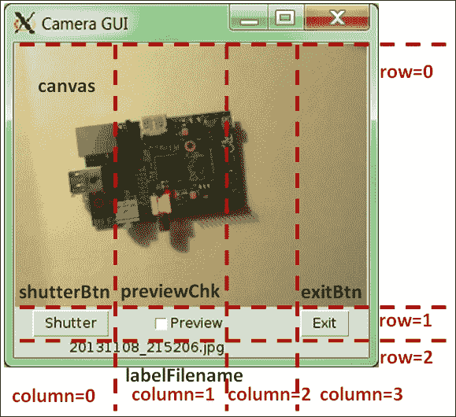

相机 GUI 布局

我们定义以下控制变量：

+   `self.previewUpdate`: 这与**预览**复选框（`previewChk`）的状态相关联

+   `self.filename`: 这与`labelFilename`小部件显示的文本相关联

我们还将**快门**按钮（`shutterBtn`）链接到`self.shutter()`，每当按下**快门**按钮时，都会调用此函数，并将**退出**按钮（`exitBtn`）链接到`self.exit()`函数。

最后，在`__init__()`函数中，我们调用`self.preview()`，这将确保**相机 GUI**在应用程序启动后立即拍照并显示。

当按下**快门**按钮时，会调用`self.shutter()`。这会调用`this.btnState("disabled")`来禁用**快门**按钮，在我们拍摄新照片时，这将防止拍摄任何照片。当其他操作完成时，使用`this.btnState("active")`来重新启用按钮。

`self.shutter()`函数将根据**预览**复选框的状态（通过获取`self.previewUpdate`的值）调用`self.normal()`或`self.preview()`函数。

`cameraGUI.camCapture()`函数使用`pycamera`创建摄像头对象，设置分辨率，并使用所需的文件名捕获图像。`self.preview()`函数使用在`SET`类中定义的`PV_SIZE`分辨率的一个名为`PREVIEW_FILE`的图像。

接下来，调用`self.updateDisp(PREVIEW_FILE)`，它将使用`cameraGUI.getTKImage()`打开生成的`PREVIEW.gif`文件作为`TK.PhotoImage`对象，并将其应用到 GUI 中的`Canvas`对象上。现在我们调用`self.update()`，这是一个从`TK.Frame`类继承来的函数；`self.update()`将允许 Tkinter 显示更新（在这种情况下，使用新图像）。最后，`self.preview()`函数也会调用`self.msg()`，这将更新`self.filename`值，以显示的图像文件名（`PREVIEW.gif`）为准。同样，这也使用`self.update()`来更新显示。

如果**预览**复选框未选中，那么`self.shutter()`函数将调用`self.normal()`。然而，这次它将捕获一个更大的 2,592 x 1,944（500 万像素）JPG 图像，文件名设置为从`self.timestamp()`获取的最新`<timestamp>`值。生成的图像也将被调整大小并转换为 PPM 图像，以便它可以作为`TK.PhotoImage`对象加载，并在应用程序窗口中显示。

## 还有更多...

摄像头应用程序使用类结构来组织代码并使其易于扩展。在接下来的章节中，我们将解释我们定义的方法和函数类型，以允许这样做。

树莓派还可以使用标准的 USB 摄像头或网络摄像头。或者，我们可以使用额外的 Video4Linux 驱动程序，使摄像头模块像标准网络摄像头一样工作。

### 类成员和静态函数

`cameraGUI`类定义了两种类型的函数。首先，我们定义了一些静态方法（`run()`、`getTKImage()`和`timestamp()`）。这些方法与类相关联，而不是与特定实例相关联；这意味着我们可以使用它们而不需要引用特定的`cameraGUI`对象，而是直接引用类本身。这很有用，因为可以定义与类相关的实用函数，因为它们可能在程序的其它部分也有用，并且可能不需要访问`cameraGUI`对象中的数据/对象。这些函数可以通过`cameraGUI.run("command")`来调用。

接下来，我们定义类成员函数，就像我们在之前的类中使用的那样，包括对`self`的引用。这意味着它们只能由类的实例（`cameraGUI`类型的对象）访问，并且可以使用对象内部包含的数据（使用`self`引用）。

### 使用 USB 网络摄像头代替

树莓派摄像头模块并不是唯一可以添加摄像头到树莓派的方法；在大多数情况下，你也可以使用 USB 摄像头。当前的树莓派 Raspbian 镜像应该会在你插入时自动检测到最常见的摄像头设备；然而，支持可能会有所不同。

要确定你的摄像头是否已被检测到，请运行以下命令检查系统上是否已创建以下设备文件：

```py
ls /dev/video*

```

如果检测成功，你将看到`/dev/video0`或类似的内容，这将是你用来访问摄像头的参考。

使用以下命令安装一个合适的图像捕捉程序，例如`fswebcam`：

```py
sudo apt-get install fswebcam

```

你可以使用以下命令进行测试：

```py
fswebcam -d /dev/video0 -r 320x240 testing.jpg

```

或者，你也可以使用以下方式使用`dd`进行测试：

```py
dd if=/dev/video0 of=testing.jpeg bs=11M count=1

```

### 注意

摄像头可能需要从树莓派的 USB 端口获取额外的电源；如果你遇到错误，你可能发现使用带电源的 USB 集线器有帮助。有关支持的设备列表和故障排除信息，请参阅树莓派维基页面[`elinux.org/RPi_USB_Webcams`](http://elinux.org/RPi_USB_Webcams)。

在前面的示例中，按照以下方式修改`cameraGUI`类中的以下函数：

1.  从文件开头移除`camCapture()`和`import picamera as picam`。

1.  在`normal()`函数中，将`cameraGUI.camCapture(name,SET.NORM_SIZE)`替换为以下内容：

    ```py
        cameraGUI.run(SET.CAM_PREVIEW+SET.CAM_OUTPUT+
                      SET.PREVIEW_FILE)
    ```

1.  在`preview()`函数中，将`cameraGUI.camCapture(SET.PREVIEW_FILE,SET.PV_SIZE)`替换为以下内容：

    ```py
        cameraGUI.run(SET.CAM_NORMAL+SET.CAM_OUTPUT+name)
    ```

1.  在`SET`类中，定义以下变量：

    ```py
    CAM_OUTPUT=" "
    CAM_PREVIEW="fswebcam -d /dev/video0 -r 320x240"
    CAM_NORMAL="fswebcam -d /dev/video0 -r 640x480"
    ```

通过对`cameraGUI`类进行之前的修改，连接的 USB 摄像头将负责捕捉图像。

### 树莓派摄像头的额外驱动程序

Video4Linux 驱动程序适用于树莓派摄像头模块。虽然这些额外的驱动程序还不是官方的，但它们很可能在它们成为官方时被包含在 Raspbian 镜像中。有关更多详细信息，请参阅[`www.linux-projects.org/uv4l/`](http://www.linux-projects.org/uv4l/)。

驱动程序将允许你像使用 USB 摄像头一样使用摄像头模块，作为一个`/dev/video*`设备，尽管在本章的示例中你可能不需要这样做。

执行以下步骤来安装额外的驱动程序：

1.  首先，下载`apt`密钥并将源添加到`apt`源列表中。你可以使用以下命令完成此操作：

    ```py
    wget http://www.linux-projects.org/listing/uv4l_repo/lrkey.asc
    sudo apt-key add ./lrkey.asc
    sudo nano /etc/apt/souces.list 

    ```

1.  将以下内容添加到文件中（单行）：

    ```py
    deb http://www.linux-projects.org/listing/uv4l_repo/raspbian/ wheezy main

    ```

1.  使用以下命令安装驱动程序：

    ```py
    sudo apt-get update
    sudo apt-get install uv4l uv4l-raspicam

    ```

1.  要使用`uv4l`驱动程序，使用以下命令加载它（单行）：

    ```py
    uv4l --driver raspicam --auto-video_nr --width 640 –height480 --encoding jpeg
    ```

然后，你可以通过`/dev/video0`（取决于你是否安装了其他视频设备）访问树莓派。它可以与标准的摄像头程序一起使用。

## 参见

关于使用 Tkinter 库的更多示例，请参阅第三章使用 Python 进行自动化和生产力，*使用 Python 进行自动化和生产力*，以及第四章创建游戏和图形，*创建游戏和图形*。

# 生成时间间隔视频

将相机连接到计算机为我们提供了一个在可控间隔拍照并自动将它们处理成视频以创建时间间隔序列的绝佳方式。`pycamera` Python 模块有一个特殊的 `capture_continuous()` 函数，可以创建一系列图像。对于时间间隔视频，我们将指定每张图像之间的时间和需要拍摄的总图像数。为了帮助用户，我们还将计算视频的总时长，以提供所需时间的指示。

我们将向之前的 GUI 界面添加控件以运行时间间隔，并自动从结果生成视频剪辑。GUI 现在看起来类似于以下截图：

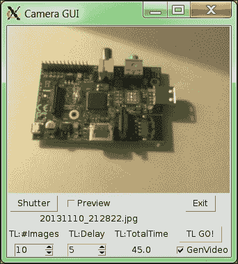

时间间隔应用程序

## 准备工作

您需要设置与上一个示例相同，包括在同一目录中创建的 `cameraGUI.py` 文件和安装的 `pycamera`。我们还将使用 `mencoder`，这将允许我们将时间间隔图像组合成视频剪辑。

要安装 `mencoder`，使用 `apt-get`，如下所示：

```py
sudo apt-get install mencoder

```

命令行选项的解释可以在 `mencoder` 的 man 页面中找到。

## 如何操作...

在与 `cameraGUI.py` 相同的目录下创建 `timelapseGUI.py`，按照以下步骤操作：

1.  首先导入支持模块（包括 `cameraGUI`），如下所示：

    ```py
    #!/usr/bin/python3
    #timelapseGUI.py
    import tkinter as TK
    from tkinter import messagebox
    import cameraGUI as camGUI
    import time
    ```

1.  将 `cameraGUI.SET` 类扩展为以下时间间隔和编码设置：

    ```py
    class SET(camGUI.SET):
      TL_SIZE=(1920,1080)
      ENC_PROG="mencoder -nosound -ovc lavc -lavcopts"
      ENC_PROG+=" vcodec=mpeg4:aspect=16/9:vbitrate=8000000"
      ENC_PROG+=" -vf scale=%d:%d"%(TL_SIZE[0],TL_SIZE[1])
      ENC_PROG+=" -o %s -mf type=jpeg:fps=24 mf://@%s"
      LIST_FILE="image_list.txt"
    ```

1.  通过以下方式扩展主 `cameraGUI` 类以执行时间间隔的附加功能：

    ```py
    class cameraGUI(camGUI.cameraGUI):
      def camTimelapse(filename,size=SET.TL_SIZE,
                        timedelay=10,numImages=10):
        with camGUI.picam.PiCamera() as camera:
          camera.resolution = size
          for count, name in \
                enumerate(camera.capture_continuous(filename)):
            print("Timelapse: %s"%name)
            if count == numImages:
              break
            time.sleep(timedelay)
    ```

1.  添加以下代码片段中所示的时间间隔 GUI 的额外控件：

    ```py
      def __init__(self,parent):
        super(cameraGUI,self).__init__(parent)
        self.parent=parent
        TK.Frame.__init__(self,self.parent,background="white")
        self.numImageTL=TK.StringVar()
        self.peroidTL=TK.StringVar()
        self.totalTimeTL=TK.StringVar()
        self.genVideoTL=TK.IntVar()
        labelnumImgTK=TK.Label(self.parent,text="TL:#Images")
        labelperoidTK=TK.Label(self.parent,text="TL:Delay")
        labeltotalTimeTK=TK.Label(self.parent,
                                  text="TL:TotalTime")
        self.numImgSpn=TK.Spinbox(self.parent,
                           textvariable=self.numImageTL,
                           from_=1,to=99999,
                           width=5,state="readonly",
                           command=self.calcTLTotalTime)
        self.peroidSpn=TK.Spinbox(self.parent,
                           textvariable=self.peroidTL,
                           from_=1,to=99999,width=5,
                           command=self.calcTLTotalTime)
        self.totalTime=TK.Label(self.parent,
                           textvariable=self.totalTimeTL)
        self.TLBtn=TK.Button(self.parent,text="TL GO!",
                                 command=self.timelapse)
        genChk=TK.Checkbutton(self.parent,text="GenVideo",
                                 command=self.genVideoChk,
                                 variable=self.genVideoTL)
        labelnumImgTK.grid(row=3,column=0)
        self.numImgSpn.grid(row=4,column=0)
        labelperoidTK.grid(row=3,column=1)
        self.peroidSpn.grid(row=4,column=1)
        labeltotalTimeTK.grid(row=3,column=2)
        self.totalTime.grid(row=4,column=2)
        self.TLBtn.grid(row=3,column=3)
        genChk.grid(row=4,column=3)
        self.numImageTL.set(10)
        self.peroidTL.set(5)
        self.genVideoTL.set(1)
        self.calcTLTotalTime()
    ```

1.  添加以下支持函数来计算设置和处理时间间隔：

    ```py
      def btnState(self,state):
        self.TLBtn["state"] = state
        super(cameraGUI,self).btnState(state)
      def calcTLTotalTime(self):
        numImg=float(self.numImageTL.get())-1
        peroid=float(self.peroidTL.get())
        if numImg<0:
          numImg=1
        self.totalTimeTL.set(numImg*peroid)
      def timelapse(self):
        self.msg("Running Timelapse")
        self.btnState("disabled")
        self.update()
        self.tstamp="TL"+cameraGUI.timestamp()
        cameraGUI.camTimelapse(self.tstamp+'{counter:03d}.jpg',
                               SET.TL_SIZE,
                               float(self.peroidTL.get()),
                               int(self.numImageTL.get()))
        if self.genVideoTL.get() == 1:
          self.genTLVideo()
        self.btnState("active")
        TK.messagebox.showinfo("Timelapse Complete",
                               "Processing complete")
        self.update()
    ```

1.  添加支持函数来处理和生成时间间隔视频，如下所示：

    ```py
      def genTLVideo(self):
        self.msg("Generate video...")
        cameraGUI.run("ls "+self.tstamp+"*.jpg > "
                                    +SET.LIST_FILE)
        cameraGUI.run(SET.ENC_PROG%(self.tstamp+".avi",
                                          SET.LIST_FILE))
        self.msg(self.tstamp+".avi")
    #End
    ```

1.  接下来，创建以下 `cameraGUI2timelapse.py` 脚本来使用 GUI：

    ```py
    #!/usr/bin/python3
    #cameraGUI2timelapse.py
    import tkinter as TK
    import timelapseGUI as GUI

    root=TK.Tk()
    root.title("Camera GUI")
    cam=GUI.cameraGUI(root)
    TK.mainloop()
    #End
    ```

我们导入 `timelapseGUI` 而不是 `cameraGUI`；这将把 `timelapseGUI` 模块添加到 `cameraGUI` 脚本中。

使用以下命令运行示例：

```py
python3 cameraGUI2timelapse.py

```

## 它是如何工作的...

`timelapseGUI.py` 脚本允许我们使用 `cameraGUI.py` 中定义的类并扩展它们。之前的 `cameraGUI` 类继承了 `TK.Frame` 类的所有内容，通过使用相同的技巧，我们也可以在我们的应用程序中继承 `SET` 和 `cameraGUI` 类。

我们向 `SET` 类添加一些额外的设置，以提供 `mencoder`（用于编码视频）的设置。

我们将通过从 `camGUI.cameraGUI` 继承并定义类的新版本 `__init__()` 来扩展基本的 `cameraGUI` 类。使用 `super()`，我们可以包含原始 `__init__()` 函数的功能，然后定义我们想要添加到 GUI 中的额外控件。扩展后的 GUI 如下截图所示：


扩展基本相机 GUI 的时间流逝 GUI 布局

我们定义以下控制变量：

+   `self.numImageTL`: 这与`numImgSpn`微调框控制器的值相关联，用于指定我们想要在时间流逝中拍摄的照片数量（并为`camTimelapse`提供`numimages`值）。

+   `self.peroidTL`: 这与`peroidSpn`微调框控制器的值相关联；它决定了时间流逝图像之间应该有多少秒（并为`camTimelapse`提供`timedelay`值）。

+   `self.totalTimeTL`: 这与`totalTime`标签对象相关联。它通过图像数量和每张图像之间的`timedelay`时间来计算，以指示时间流逝将运行多长时间。

+   `self.genVideoTL`: 这控制着`genChk`复选框控件的状态。它用于确定在拍摄时间流逝图像之后是否已生成视频。

我们将两个微调框控制器链接到`self.calcTLTotalTime()`，以便当它们被更改时，`totalTimeTL`值也会更新（尽管如果它们被直接编辑则不会调用）。我们将`genChk`链接到`self.genVideoChk()`，将`TLBtn`链接到`self.timelapse()`。

最后，我们使用`grid()`指定控件的位置，并为时间流逝设置一些默认值。

当`genChk`复选框被勾选或清除时，会调用`self.genVideoChk()`函数。这允许我们通过生成一个弹出消息框来告知用户此复选框的效果，说明视频是否将在时间流逝结束时生成，或者只是创建图像。

当按下**TL GO!**按钮（`TLBtn`）时，会调用`self.timelapse()`；这将禁用**快门**和**TL GO!**按钮（因为我们还扩展了`self.btnState()`函数）。`self.timelapse()`函数还将设置`self.tstamp`值，以便可以使用相同的时间戳用于图像和生成的视频文件（如果生成）。

时间流逝是通过`camTimelapse()`函数运行的，如下面的代码所示：

```py
def camTimelapse(filename,size=SET.TL_SIZE,
                    timedelay=10,numImages=10):
    with camGUI.picam.PiCamera() as camera:
      camera.resolution = size
      for count, name in \
            enumerate(camera.capture_continuous(filename)):
        print("Timelapse: %s"%name)
        if count == numImages:
          break
        time.sleep(timedelay)
```

我们创建一个新的`PiCamera`对象，设置图像分辨率，并启动一个`for…in`循环用于`capture_continuous()`。每次拍摄图像时，我们打印文件名，然后等待所需的`timedelay`值。最后，当拍摄了所需数量的图像时，我们退出循环并继续。

一旦完成，我们检查`self.genVideoTL`的值以确定是否要生成视频（由`genTLVideo()`处理）。

要生成视频，我们首先运行以下命令以创建一个包含图像的`image_list.txt`文件：

```py
ls <self.tstamp>*.jpg > image_list.txt

```

然后，我们使用合适的设置运行`mencoder`（参见`mencoder`手册页面了解每个项目的作用）来创建一个从时间流逝图像列表中生成的 MPEG4 编码（8 Mbps）AVI 文件，每秒 24 帧（fps）。等效命令（由`ENC_PROG`定义）如下：

```py
mencoder -nosound -ovc lavc \
 -lavcopts vcodec=mpeg4:aspect=16/9:vbitrate=8000000 \
 -vf scale=1920:1080 -o <self.tstamp>.avi \
 -mf type=jpeg:fps=24 mf://@image_list.txt

```

### 小贴士

在命令终端中，可以使用`\`字符将长命令拆分为多行。这允许你在另一行继续编写命令，只有在你完成一行且没有`\`字符时才会执行该命令。

## 还有更多...

本章使用类继承和函数重写等方法以多种不同的方式组织和重用我们的代码。当正确使用时，这些方法可以让我们以逻辑和灵活的方式设计复杂的系统。

此外，在生成自己的延时摄影序列时，你可以选择关闭相机模块上的 LED 灯或使用树莓派相机的低光版本：NoIR 相机。

### 类继承和函数重写

在前面的例子中，我们使用了一些巧妙的编码来重用我们的原始`cameraGUI`类并创建一个扩展其功能的插件文件。

类名不必与`cameraGUI`相同（我们只是在这个例子中使用它，这样我们就可以通过更改导入的文件来替换额外的 GUI 组件）。实际上，我们可以定义一个包含几个通用函数的基本类，然后通过继承将其扩展到多个子类中；在这里，每个子类定义特定的行为、函数和数据。子类的扩展和结构在以下图中显示：

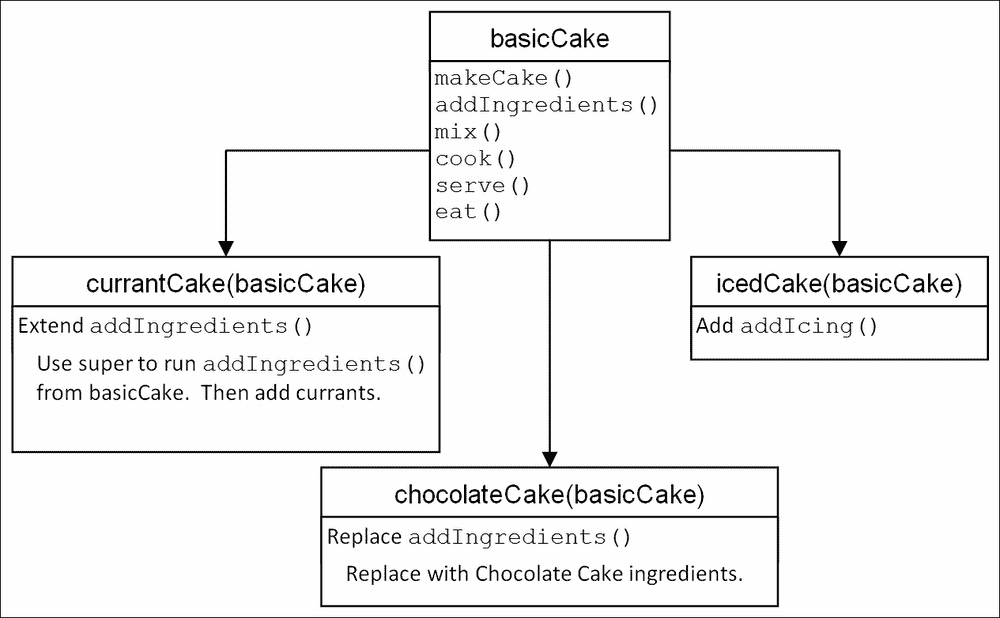

此图显示了类如何扩展和结构化

为了说明这一点，我们将举一个非代码示例，其中我们编写了一个制作蛋糕的通用食谱。然后你可以通过继承所有`basicCake`元素来扩展`basicCake`食谱，并添加一些额外的步骤（相当于代码函数），例如在顶部添加糖霜/奶油霜以制作`icedCake(basicCake)`类。我们通过向现有类添加额外项（我们只是选择不更改名称）来这样做我们的`SET`类。

我们还可以向现有步骤添加一些额外的元素（在`addIngredients`步骤中添加一些葡萄干并创建`currantCake(basicCake)`）。我们通过在代码中使用`super()`函数，通过向`__init__()`函数添加额外部分来实现这一点。例如，我们会使用`super(basicCake.self).addIngredients()`来包含在`basicCake`类中定义的`addIngredients()`函数中的所有步骤，然后添加一个额外的步骤来包含葡萄干。优点是，如果我们随后更改基本蛋糕的成分，它也会影响到所有其他类。

你甚至可以通过用新函数替换它们来覆盖一些原始函数；例如，你可以用制作`chocolateCake(basicCake)`的食谱替换原始的`basicCake`食谱，同时仍然使用相同的烹饪说明，等等。我们可以通过定义具有相同名称的替换函数来实现这一点，而不使用`super()`。

以这种方式使用结构化设计可以变得非常强大，因为我们可以轻松地创建许多相同类型对象的变体，但所有公共元素都定义在同一个地方。这在测试、开发和维护大型复杂系统时具有许多优点。关键在于在开始之前对整个项目有一个全面的了解，并尝试识别公共元素。你会发现，你拥有的结构越好，开发和改进它就越容易。

关于这方面的更多信息，值得阅读关于面向对象设计方法和如何使用**统一建模语言**（**UML**）来帮助您描述和理解您的系统的内容。

### 禁用摄像头 LED

如果你想在夜间或靠近窗户时创建时间流逝视频，你可能注意到红色摄像头 LED（每次拍摄都会点亮）会添加不需要的光线或反射。幸运的是，可以通过 GPIO 控制摄像头 LED。LED 是通过`GPIO.BCM`引脚 5 控制的；不幸的是，没有与之等效的`GPIO.BOARD`引脚编号。

要将其添加到 Python 脚本中，请使用以下代码：

```py
import RPi.GPIO as GPIO

GPIO.cleanup()
GPIO.setmode(GPIO.BCM)
CAMERALED=5 #GPIO using BCM numbering
GPIO.setup(CAMERALED, GPIO.OUT)
GPIO.output(CAMERALED,False)
```

或者，你也可以将 LED 用于其他用途，例如，作为延迟计时器的一部分的指示器，该计时器提供倒计时和警告，表明相机即将拍照。

### Pi NoIR – 拍摄夜景

还有一种名为**Pi NoIR**的 Raspberry Pi 摄像头模块的变体。这种摄像头的版本与原始版本相同，只是内部的红外滤光片已被移除。除此之外，这允许你在夜间使用红外灯光照亮区域（就像大多数夜间安全摄像头一样），并看到在黑暗中发生的一切！

*《The MagPi》* 第 18 期 ([`www.raspberrypi.org/magpi/`](https://www.raspberrypi.org/magpi/)) 发布了一篇出色的特色文章，解释了 Pi NoIR 摄像头模块的其他用途。

# 创建定格动画

定格动画（或逐帧动画）是拍摄一系列静态图像的过程，同时在每个帧中进行非常小的移动（通常是易于移动的对象，如娃娃或塑料模型）。当这些帧组合成视频时，小的移动组合起来产生动画。


可以将多张图片组合成动画

传统上，这类动画是通过在电影摄像机（如 Cine Super 8 电影摄像机）上拍摄数百甚至数千张单独的照片来制作的，然后将胶片寄出进行冲洗，并在几周后播放结果。尽管 Aardman Animations 的 Nick Park 创作了一些鼓舞人心的作品，包括《华莱士和吉姆》系列（这是全长的定格动画电影），但对于大多数人来说，这仍然是一项有点难以触及的爱好。

在现代数字时代，我们可以快速轻松地拍摄多张照片，并且几乎可以立即查看结果。现在任何人都可以尝试制作自己的动画杰作，成本或努力都非常低。

我们将扩展我们的原始**Camera GUI**类，添加一些额外功能，这将使我们能够创建自己的停止帧动画。它将允许我们在生成最终视频之前，先以序列的形式拍摄图像并尝试它们。

## 准备中

此示例的软件设置将与之前的延时摄影示例相同。同样，我们需要安装`mencoder`，并且需要在同一目录中包含`cameraGUI.py`文件。

你还需要一些可以动画化的东西，理想情况下是你可以将其置于不同姿势的东西，就像以下图像中显示的两个娃娃一样：

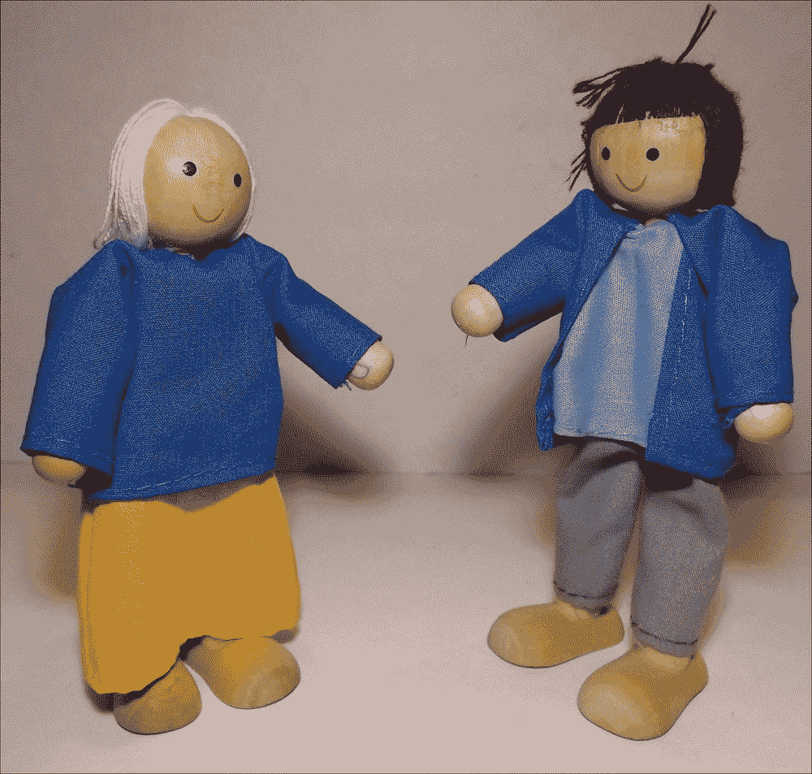

我们停止帧动画的两个潜在明星

## 如何做到这一点...

通过以下步骤在`cameraGUI.py`同一目录中创建`animateGUI.py`：

1.  首先导入支持模块（包括`cameraGUI`），如下所示：

    ```py
    #!/usr/bin/python3
    #animateGUI.py
    import tkinter as TK
    from tkinter import messagebox
    import time
    import os
    import cameraGUI as camGUI
    ```

1.  如下扩展`cameraGUI.SET`类，以设置图像大小和编码：

    ```py
    class SET(camGUI.SET):
      TL_SIZE=(1920,1080)
      ENC_PROG="mencoder -nosound -ovc lavc -lavcopts"
      ENC_PROG+=" vcodec=mpeg4:aspect=16/9:vbitrate=8000000"
      ENC_PROG+=" -vf scale=%d:%d"%(TL_SIZE[0],TL_SIZE[1])
      ENC_PROG+=" -o %s -mf type=jpeg:fps=24 mf://@%s"
      LIST_FILE="image_list.txt"
    ```

1.  如下扩展主`cameraGUI`类，以添加动画所需的函数：

    ```py
    class cameraGUI(camGUI.cameraGUI):
      def diff(a, b):
        b = set(b)
        return [aa for aa in a if aa not in b]
      def __init__(self,parent):
        super(cameraGUI,self).__init__(parent)
        self.parent=parent
        TK.Frame.__init__(self,self.parent,
                          background="white")
        self.theList = TK.Variable()
        self.imageListbox=TK.Listbox(self.parent,
                       listvariable=self.theList,
                           selectmode=TK.EXTENDED)
        self.imageListbox.grid(row=0, column=4,columnspan=2,
                                  sticky=TK.N+TK.S+TK.E+TK.W)
        yscroll = TK.Scrollbar(command=self.imageListbox.yview,
                                            orient=TK.VERTICAL)
        yscroll.grid(row=0, column=6, sticky=TK.N+TK.S)
        self.imageListbox.configure(yscrollcommand=yscroll.set)
        self.trimBtn=TK.Button(self.parent,text="Trim",
                                      command=self.trim)
        self.trimBtn.grid(row=1,column=4)
        self.speed = TK.IntVar()
        self.speed.set(20)
        self.speedScale=TK.Scale(self.parent,from_=1,to=30,
                                      orient=TK.HORIZONTAL,
                                       variable=self.speed,
                                       label="Speed (fps)")
        self.speedScale.grid(row=2,column=4)
        self.genBtn=TK.Button(self.parent,text="Generate",
                                     command=self.generate)
        self.genBtn.grid(row=2,column=5)
        self.btnAniTxt=TK.StringVar()
        self.btnAniTxt.set("Animate")
        self.animateBtn=TK.Button(self.parent,
                  textvariable=self.btnAniTxt,
                          command=self.animate)
        self.animateBtn.grid(row=1,column=5)
        self.animating=False
        self.updateList()
    ```

1.  使用以下代码片段向列表中添加函数以列出已拍摄的照片，并从列表中删除它们：

    ```py
      def shutter(self):
        super(cameraGUI,self).shutter()
        self.updateList()

      def updateList(self):
        filelist=[]
        for files in os.listdir("."):
          if files.endswith(".jpg"):
            filelist.append(files)
        filelist.sort()
        self.theList.set(tuple(filelist))
        self.canvas.update()

      def generate(self):
        self.msg("Generate video...")
        cameraGUI.run("ls *.jpg > "+SET.LIST_FILE)
        filename=cameraGUI.timestamp()+".avi"
        cameraGUI.run(SET.ENC_PROG%(filename,SET.LIST_FILE))
        self.msg(filename)
        TK.messagebox.showinfo("Encode Complete",
                               "Video: "+filename)
      def trim(self):
        print("Trim List")
        selected = map(int,self.imageListbox.curselection())
        trim=cameraGUI.diff(range(self.imageListbox.size()),
                                                    selected)
        for item in trim:
          filename=self.theList.get()[item]
          self.msg("Rename file %s"%filename)
          #We could delete os.remove() but os.rename() allows
          #us to change our minds (files are just renamed).
          os.rename(filename,
                    filename.replace(".jpg",".jpg.bak"))
          self.imageListbox.selection_clear(0,
                          last=self.imageListbox.size())
        self.updateList()
    ```

1.  包含以下使用图像列表执行测试动画的函数：

    ```py
      def animate(self):
        print("Animate Toggle")
        if (self.animating==True):
          self.btnAniTxt.set("Animate")
          self.animating=False
        else:
          self.btnAniTxt.set("STOP")
          self.animating=True
          self.doAnimate()

      def doAnimate(self):
        imageList=[]
        selected = self.imageListbox.curselection()
        if len(selected)==0:
          selected=range(self.imageListbox.size())
        print(selected)
        if len(selected)==0:
          TK.messagebox.showinfo("Error",
                          "There are no images to display!")
          self.animate()
        elif len(selected)==1:
          filename=self.theList.get()[int(selected[0])]
          self.updateDisp(filename,SET.PV_SIZE)
          self.animate()
        else:
          for idx,item in enumerate(selected):
            self.msg("Generate Image: %d/%d"%(idx+1,
                                            len(selected)))
            filename=self.theList.get()[int(item)]
            aImage=cameraGUI.getTKImage(filename,SET.PV_SIZE)
            imageList.append(aImage)
          print("Apply Images")
          canvasList=[]
          for idx,aImage in enumerate(imageList):
            self.msg("Apply Image: %d/%d"%(idx+1,
                                           len(imageList)))
            canvasList.append(self.canvas.create_image(0, 0,
                                      anchor=TK.NW,
                                      image=imageList[idx],
                                      state=TK.HIDDEN))
          self.cycleImages(canvasList)

      def cycleImages(self,canvasList):
        while (self.animating==True):
          print("Cycle Images")
          for idx,aImage in enumerate(canvasList):
            self.msg("Cycle Image: %d/%d"%(idx+1,
                                      len(canvasList)))
            self.canvas.itemconfigure(canvasList[idx],
                                      state=TK.NORMAL)
            if idx>=1:
              self.canvas.itemconfigure(canvasList[idx-1],
                                          state=TK.HIDDEN)
            elif len(canvasList)>1:
              self.canvas.itemconfigure(
                            canvasList[len(canvasList)-1],
                                          state=TK.HIDDEN)
            self.canvas.update()
            time.sleep(1/self.speed.get())
    #End
    ```

1.  接下来，创建以下`cameraGUI3animate.py`文件以使用 GUI：

    ```py
    #!/usr/bin/python3
    #cameraGUI3animate.py
    import tkinter as TK
    import animateGUI as GUI

    #Define Tkinter App
    root=TK.Tk()
    root.title("Camera GUI")
    cam=GUI.cameraGUI(root)
    TK.mainloop()
    #End
    ```

1.  使用以下命令运行示例：

    ```py
    python3 cameraGUI3animate.py

    ```

## 它是如何工作的…

再次，我们基于原始`cameraGUI`类创建了一个新类。这次，我们定义了以下具有六个额外控件的 GUI：


动画 GUI 布局

我们创建了一个列表框控件（`imageListbox`），它将包含当前目录（`self.theList`）中的`.jpg`图像列表。此控件有一个与之链接的垂直滚动条（`yscroll`），以便轻松滚动列表，并且使用`selectmode=TK.EXTENDED`允许使用*Shift*和*Ctrl*（用于块和组选择）进行多选。

接下来，我们添加一个**Trim**按钮（`timeBtn`），它将调用`self.trim()`。这将删除列表中未选中的任何项目。我们使用`curselection()`从`imageListbox`控件获取当前选中的项目列表。`curselection()`函数通常返回一个索引列表，这些索引是数值字符串，因此我们使用`map(int,...)`将结果转换为整数列表。

我们使用此列表通过我们的实用程序`diff(a,b)`函数获取所有未选中的索引。该函数将完整的索引列表与选中的索引进行比较，并返回任何未选中的索引。

`self.trim()`函数使用`os.rename()`将所有非选中图片的文件扩展名从`.jpg`更改为`.jpg.bak`。我们可以使用`os.remove()`删除它们，但我们真正想要的是将它们重命名以防止它们出现在列表和最终视频中。列表通过`self.updateList()`重新填充，该函数更新`self.theList`为所有可用的`.jpg`文件列表。

我们添加了一个与`self.speed`链接的刻度控制（`speedScale`），用于控制动画测试的播放速度。同样，我们添加了一个**Generate**按钮（`genBtn`），它调用`self.generate()`。

最后，我们添加了**Animate**按钮（`animateBtn`）。按钮的文本链接到`self.btnAniTxt`（这使得在程序中更改它变得容易），当按下时，按钮调用`self.animate()`。

### 注意

我们通过添加对`self.updateList()`的调用覆盖了原始`cameraGUI`脚本中的原始`shutter()`函数。这确保了在拍摄完一张图片后，图像列表会自动更新为新图片。再次使用`super()`确保也执行了原始功能。

`animate()` 函数（通过点击**Animate**按钮调用）允许我们测试一系列图片，看看它们是否能够制作出好的动画。当按钮被点击时，我们将按钮的文本改为**STOP**，将`self.animating`标志设置为**True**（表示动画模式正在运行），并调用`doAnimate()`。

`doAnimate()` 函数首先获取`imageListbox`控件中当前选中的图片列表，生成一系列`TK.PhotoImage`对象，并将它们附加到 GUI 中的`self.canvas`对象。然而，如果只选中了一张图片，我们将直接使用`self.updateDisp()`显示它。或者，如果没有选中任何图片，它将尝试使用所有图片（除非列表为空，在这种情况下，它将通知用户没有图片可以动画化）。当我们有多个`TK.PhotoImage`对象链接到画布时，我们可以使用`cycleImages()`函数遍历它们。

`TK.PhotoImage`对象都创建时其状态设置为`TK.HIDDEN`，这意味着它们在画布上不可见。为了产生动画效果，`cycleImages()`函数将每个图像设置为`TK.NORMAL`，然后再次设置为`TK.HIDDEN`，使得每个帧在显示下一帧之前显示 1 除以`self.speed`（由 Scale 控件设置的 fps 值）秒。

`cycleImages()`函数将在`self.animating`为**True**时执行动画，也就是说，直到再次点击`animateBtn`对象。

一旦用户对他们的动画满意，他们可以使用**Generate**按钮（`genBtn`）生成视频。`generate()`函数将调用`mencoder`生成`imageListbox`控件中所有图片的最终视频。

如果你真的想从事动画制作，你应该考虑添加一些额外的功能来帮助你，例如能够复制和重新排列帧的能力。你可能还想为相机添加一些手动调整，以避免由相机自动设置引起的白平衡和光照波动。

## 还有更多...

由于其小型尺寸和远程控制能力，相机模块非常适合近距离摄影。通过使用小镜头或添加硬件控制，你可以制作一个专用的动画机。

### 提高焦点

树莓派相机的镜头主要是为中等到长距离摄影设计的，因此它难以聚焦于 25 厘米（10 英寸）以内的物体。然而，使用一些基本镜头，我们可以调整有效焦距，使其更适合微距摄影。你可以使用适用于手机的附加镜头或信用卡式放大镜镜头来调整焦点，如下面的图片所示：

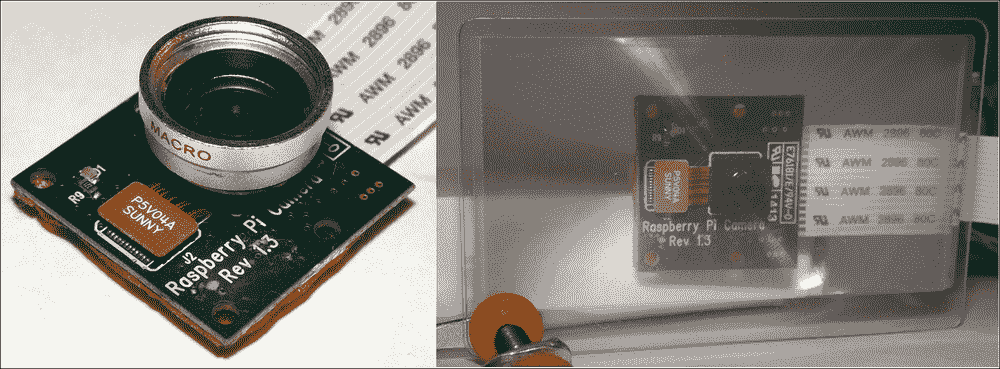

一个附加的宏观镜头（右）和一个信用卡放大镜（左）可以提高近距离物品的焦点

### 创建硬件快门

当然，虽然有一个可用的显示屏来查看拍摄的照片是有用的，但通常能够简单地按下一个物理按钮来拍摄照片也很方便。幸运的是，这只是一个将按钮（和电阻）连接到 GPIO 引脚的问题，就像我们之前做的那样（参见第六章中的*响应按钮*配方，*使用 Python 驱动硬件*），并创建适当的 GPIO 控制代码来调用我们的`cameraGUI.camCapture()`函数。代码如下：

```py
#!/usr/bin/python3
#shutterCam.py
import RPi.GPIO as GPIO
import cameraGUI as camGUI
import time

GPIO.setmode(GPIO.BOARD)
CAMERA_BTN=12 #GPIO Pin 12
GPIO.setup(CAMERA_BTN,GPIO.IN,pull_up_down=GPIO.PUD_UP)
count=1
try:
  while True:
    btn_val = GPIO.input(CAMERA_BTN)
    #Take photo when Pin 12 at 0V
    if btn_val==False:
      camGUI.cameraGUI.camCapture("Snap%03d.jpg"%count,
                                   camGUI.SET.NORM_SIZE)
      count+=1
    time.sleep(0.1)
finally:
  GPIO.cleanup()
#End
```

当按钮被按下时，前面的代码将拍摄照片。以下图示显示了实现这一功能的连接和电路图：

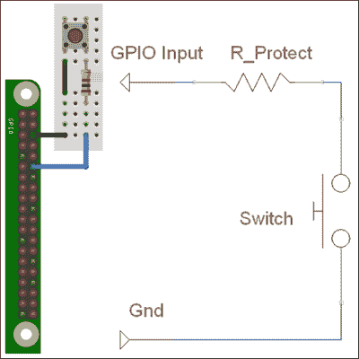

按钮（以及 1K 欧姆电阻）应该连接在 12 号引脚和 6 号引脚（GND）之间

你甚至不需要停止在这里，因为如果你想要的话，可以为相机上的任何控制或设置添加按钮和开关。你甚至可以使用其他硬件（如红外传感器等）来触发相机拍摄照片或视频。

# 制作二维码读取器

你可能已经在各种地方见过二维码，也许甚至使用过几个来从海报或广告中获取链接。然而，如果你自己制作，它们可以变得更有用。以下示例讨论了我们可以如何使用树莓派来读取二维码和隐藏的内容（或者甚至链接到音频文件或视频）。

这可以用来创建你自己的个性化树莓派二维码音乐盒，也许作为帮助儿童解决数学问题的辅助工具，或者甚至在他们一页一页地跟随时播放你阅读孩子最喜欢的书籍的音频文件。以下截图是一个二维码的示例：


您可以使用 QR 码制作神奇的自读书籍

## 准备工作

此示例需要与之前的示例类似的设置（除了这次我们不需要 `mencoder`）。我们需要安装 **ZBar**，这是一个跨平台的 QR 码和条形码阅读器，以及 **flite**（一个文本到语音工具，我们在第六章使用 Python 驱动硬件中使用过，*使用 Python 驱动硬件*）。

要安装 ZBar 和 flite，请使用以下命令中的 `apt-get`：

```py
sudo apt-get install zbar-tools flite

```

### 小贴士

目前有适用于 Zbar 的 Python 2.7 库，但它们目前与 Python 3 不兼容。Zbar 还包括一个实时扫描器（`zbarcam`），它使用视频输入自动检测条形码和 QR 码。不幸的是，这与 Raspberry Pi 相机也不兼容。

对于我们来说这不是大问题，因为我们可以直接使用 `zbarimg` 程序从 `picamera` 拍摄的图像中检测 QR 码。

安装完软件后，您将需要一些 QR 码来扫描（请参阅 *生成 QR 码* 部分的 *更多内容…*），以及一些合适的 MP3 文件（这些可以是您阅读书籍页面的录音或音乐曲目）。

## 如何操作…

在与 `cameraGUI.py` 相同的目录中创建以下 `qrcodeGUI.py` 脚本：

```py
#!/usr/bin/python3
#qrcodeGUI.py
import tkinter as TK
from tkinter import messagebox
import subprocess
import cameraGUI as camGUI

class SET(camGUI.SET):
  QR_SIZE=(640,480)
  READ_QR="zbarimg "

class cameraGUI(camGUI.cameraGUI):
  def run_p(cmd):
    print("RunP:"+cmd)
    proc=subprocess.Popen(cmd,shell=True,stdout=subprocess.PIPE)
    result=""
    for line in proc.stdout:
      result=str(line,"utf-8")
    return result
  def __init__(self,parent):
    super(cameraGUI,self).__init__(parent)
    self.parent=parent
    TK.Frame.__init__(self,self.parent,background="white")
    self.qrScan=TK.IntVar()
    self.qrRead=TK.IntVar()
    self.qrStream=TK.IntVar()
    self.resultQR=TK.StringVar()
    self.btnQrTxt=TK.StringVar()
    self.btnQrTxt.set("QR GO!")
    self.QRBtn=TK.Button(self.parent,textvariable=self.btnQrTxt,
                                              command=self.qrGet)
    readChk=TK.Checkbutton(self.parent,text="Read",
                               variable=self.qrRead)
    streamChk=TK.Checkbutton(self.parent,text="Stream",
                                 variable=self.qrStream)
    labelQR=TK.Label(self.parent,textvariable=self.resultQR)
    readChk.grid(row=3,column=0)
    streamChk.grid(row=3,column=1)
    self.QRBtn.grid(row=3,column=3)
    labelQR.grid(row=4,columnspan=4)
    self.scan=False
  def qrGet(self):
    if (self.scan==True):
      self.btnQrTxt.set("QR GO!")
      self.btnState("active")
      self.scan=False
    else:
      self.msg("Get QR Code")
      self.btnQrTxt.set("STOP")
      self.btnState("disabled")
      self.scan=True
      self.qrScanner()
  def qrScanner(self):
    found=False
    while self.scan==True:
      self.resultQR.set("Taking image...")
      self.update()
      cameraGUI.camCapture(SET.PREVIEW_FILE,SET.QR_SIZE)
      self.resultQR.set("Scanning for QRCode...")
      self.update()
      #check for QR code in image
      qrcode=cameraGUI.run_p(SET.READ_QR+SET.PREVIEW_FILE)
      if len(qrcode)>0:
        self.msg("Got barcode: %s"%qrcode)
        qrcode=qrcode.strip("QR-Code:").strip('\n')
        self.resultQR.set(qrcode)
        self.scan=False
        found=True
      else:
        self.resultQR.set("No QRCode Found")
    if found:
      self.qrAction(qrcode)
      self.btnState("active")
      self.btnQrTxt.set("QR GO!")
    self.update()
  def qrAction(self,qrcode):
    if self.qrRead.get() == 1:
      self.msg("Read:"+qrcode)
      cameraGUI.run("sudo flite -t '"+qrcode+"'")
    if self.qrStream.get() == 1:
      self.msg("Stream:"+qrcode)
      cameraGUI.run("omxplayer '"+qrcode+"'")
    if self.qrRead.get() == 0 and self.qrStream.get() == 0:
      TK.messagebox.showinfo("QR Code",self.resultQR.get())
#End
```

接下来，创建 `cameraGUItimelapse.py` 或 `cameraGUIanimate.py` 的副本，并将其命名为 `cameraGUIqrcode.py`。再次确保您使用以下代码导入新的 GUI 文件：

```py
import qrcodeGUI as GUI
```

带有 QR 码的 GUI 将看起来如下截图所示：

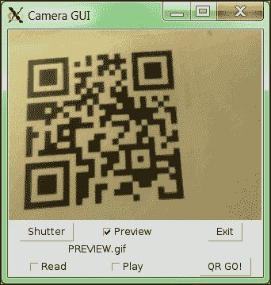

QR 码图形用户界面

## 如何工作…

新的 `qrcodeGUI.py` 文件添加了 **读取** 和 **播放** 复选框控件以及一个按钮控件来开始扫描 QR 码。当点击 **QR GO!** 时，`self.qrGet()` 将启动一个循环，通过 `zbarimg` 拍摄图像并检查结果。如果 `zbarimg` 在图像中找到 QR 码，则扫描将停止，并将结果显示出来。否则，它将继续扫描，直到点击 **停止** 按钮。在扫描过程中，`QRBtn` 的文本将更改为 **停止**。

为了捕获 `zbarimg` 的输出，我们需要稍微改变运行命令的方式。为此，我们定义 `run_p()`，它使用以下代码：

```py
proc=subprocess.Popen(cmd,shell=True,stdout=subprocess.PIPE)
```

这将 `stdout` 作为 `proc` 对象的一部分返回，其中包含 `zbarimg` 程序的输出。然后我们从图像中提取读取到的结果 QR 码（如果找到了）。

当选择 **读取** 时，使用 `flite` 读取 QR 码，如果选择 **播放**，则使用 `omxplayer` 播放文件（假设 QR 码包含合适的链接）。

为了获得最佳结果，建议您先拍摄一个预览照片，以确保在运行 QR 扫描器之前正确对齐目标 QR 码。


示例 QR 码页面标记（page001.mp3 和 page002.mp3）

之前的二维码包含 `page001.mp3` 和 `page002.mp3`。这些二维码允许我们在与脚本相同的目录下播放同名文件。您可以通过遵循本食谱中 *还有更多…* 部分的说明来生成您自己的二维码。

您甚至可以使用书的 ISBN 条形码根据读取的条形码选择不同的 MP3 目录；条形码允许您为任何喜欢的书籍重用同一组编号的二维码。

## 还有更多…

要使用前面的示例，您可以使用下一节的示例生成一系列二维码以供使用。

### 生成二维码

您可以使用 **PyQRCode**（更多信息请参阅 [`pypi.python.org/pypi/PyQRCode`](https://pypi.python.org/pypi/PyQRCode)）来创建二维码。

您可以使用以下命令通过 PIP Python 管理器安装 PyQRCode（请参阅第三章中 *显示应用程序中的照片信息* 食谱的 *准备就绪* 部分，*使用 Python 进行自动化和生产率*）：

```py
sudo pip-3.2 install pyqrcode

```

要将二维码编码为 PNG 格式，PyQrCode 使用 PyPNG ([`github.com/drj11/pypng`](https://github.com/drj11/pypng))，可以使用以下命令安装：

```py
sudo pip-3.2 install pypng

```

使用以下 `generateQRCodes.py` 脚本生成二维码以链接到文件，例如您已记录的 `page001.mp3` 和 `page002.mp3` 文件：

```py
#!/usr/bin/python3
#generateQRCodes.py
import pyqrcode
valid=False
print("QR-Code generator")
while(valid==False):
    inputpages=input("How many pages?")
    try:
      PAGES=int(inputpages)
      valid=True
    except ValueError:
      print("Enter valid number.")
      pass
print("Creating QR-Codes for "+str(PAGES)+" pages:")
for i in range(PAGES):
  file="page%03d"%(i+1)
  qr_code = pyqrcode.create(file+".mp3")
  qr_code.png(file+".png")
  print("Generated QR-Code for "+file)
print("Completed")
#End
```

使用以下命令运行此代码：

```py
python3 generateQRCodes.py

```

之前的代码将创建一组二维码，可用于激活所需的 MP3 文件并大声读出页面（或播放您链接到它的文件）。

## 参见

**开源计算机视觉**（**OpenCV**）项目是一个非常强大的图像和视频处理引擎；更多详细信息请参阅 [`opencv.org`](http://opencv.org)。

通过将摄像头与 OpenCV 结合，Raspberry Pi 能够识别并与其环境交互。

这的一个优秀例子是 Samuel Matos 的 RS4 OpenCV 自平衡机器人([`roboticssamy.blogspot.pt`](http://roboticssamy.blogspot.pt))，它可以寻找并响应各种自定义标志；摄像头模块可用于导航和控制机器人。

# 探索和实验 OpenCV

OpenCV 库是一个旨在为多个平台提供实时计算机视觉处理的广泛库。本质上，如果您想进行任何严肃的图像处理、物体识别或分析，那么 OpenCV 是您开始的地方。

幸运的是，OpenCV（版本 3）的最新版本已添加了对通过 Python 3 进行接口的支持。尽管进行实时视频处理通常需要具有强大 CPU 的计算机，但它可以在相对有限的设备上运行，例如原始的 Raspberry Pi（版本 1）。强烈推荐使用更强大的 Raspberry Pi 2 来运行以下食谱。

图像和视频处理背后的概念和底层方法可能相当复杂。本食谱将演示如何使用 OpenCV，更重要的是提供一个简单的方法来可视化可能用于处理图像的各种阶段。

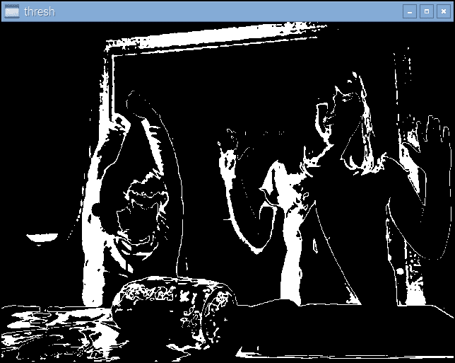

在进行相机测试时，请确保您有合适的测试对象可用

## 准备工作

OpenCV 库是用 C++编写的，在我们能够在 Raspberry Pi 上使用它之前，需要对其进行编译。为此，我们需要安装所有必需的包，然后从 OpenCV Git 仓库下载一个发布版本。OpenCV 在编译时可能需要大约 2.5GB 的空间；然而，从 NOOBS 安装的标准 Raspbian 版本大约需要 5.5GB。这意味着在 8GB SD 卡上可能空间不足。可能可以将 OpenCV 压缩到更小的 SD 卡上（通过安装自定义的 Raspbian 镜像或利用 USB 闪存设备）；然而，为了避免复杂问题，建议您至少使用 16GB SD 卡来编译和安装 OpenCV。

此外，虽然这本书中的大多数菜谱都可以通过网络连接使用 SSH 和 X11 转发来运行，但如果您连接到本地屏幕（通过 HDMI）并直接使用本地输入设备，OpenCV 显示窗口似乎功能更为有效。

安装 OpenCV 是一个相当漫长的过程，但我认为结果是值得努力的：

1.  确保 Raspberry Pi 尽可能更新，使用以下命令：

    ```py
    sudo apt-get update
    sudo apt-get upgrade
    sudo rpi-update
    ```

1.  并执行重启以应用更改：

    ```py
    sudo reboot

    ```

1.  在我们编译 OpenCV 之前，我们需要安装一些依赖项以支持构建过程：

    ```py
    sudo apt-get install build-essential cmake pkg-config
    sudo apt-get install python2.7-dev python3-dev
    ```

1.  我们还需要安装 OpenCV 使用的许多支持库和包（我们可能不会使用所有这些，但它们是构建过程的一部分）。这些也将为 OpenCV 内提供的广泛图像和视频格式提供支持：

    ```py
    sudo apt-get install libjpeg-dev libtiff5-dev libjasper-dev libpng12-dev
    sudo apt-get install libavcodec-dev libavformat-dev libswscale-dev libv4l-dev
    sudo apt-get install libxvidcore-dev libx264-dev
    sudo apt-get install libgtk2.0-dev

    ```

1.  我们还可以安装 NumPy，这在 OpenCV 中操作图像数组时非常有用，**自动调优线性代数软件**（**ATLAS**），以及 GFortran 以提供额外的数学功能：

    ```py
    sudo apt-get install python3-numpy
    sudo apt-get install libatlas-base-dev gfortran

    ```

1.  现在我们有了支持包，我们可以直接从 GitHub 下载 OpenCV 和 OpenCV 贡献（额外模块）。我们还将创建一个用于下一步的构建位置：

    ```py
    cd ~
    wget -O opencv.zip https://github.com/Itseez/opencv/archive/3.0.0.zip
    unzip opencv.zip
    wget -O opencv_contrib.zip https://github.com/Itseez/opencv_contrib/archive/3.0.0.zip
    unzip opencv_contrib.zip
    cd opencv-3.0.0
    mkdir build
    cd build

    ```

    ### 注意

    **注意**：您可以使用以下链接下载最新版本，并选择特定的发布标签；然而，您可能需要额外的依赖项或模块才能成功编译该软件包。请确保您选择与 OpenCV 和贡献模块相同的发布版本。

    [`github.com/Itseez/opencv/`](https://github.com/Itseez/opencv/)

    [`github.com/Itseez/opencv_contrib/`](https://github.com/Itseez/opencv_contrib/)

1.  `make`文件可以使用以下命令创建。这大约需要 10 分钟才能完成（见以下截图）：

    ```py
    cmake -D CMAKE_BUILD_TYPE=RELEASE \
     -D CMAKE_INSTALL_PREFIX=/usr/local \
     -D INSTALL_C_EXAMPLES=ON \
     -D INSTALL_PYTHON_EXAMPLES=ON \
     -D OPENCV_EXTRA_MODULES_PATH=~/opencv_contrib-3.0.0/modules \
     -D BUILD_EXAMPLES=ON ..

    ```

    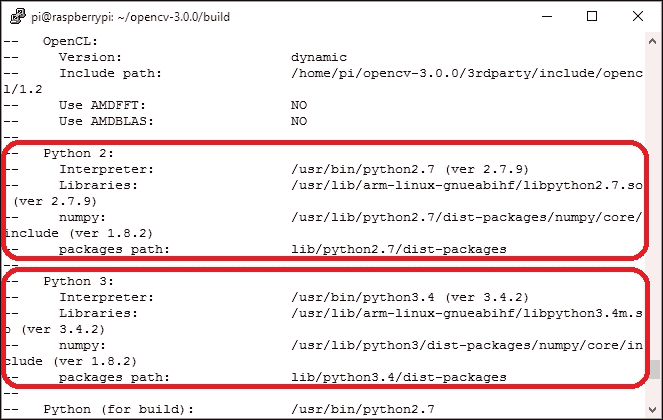

    确保 Python 2.7 和 Python 3 部分与这个截图匹配

1.  我们现在可以编译 OpenCV 了；请注意，这个过程可能需要相当长的时间才能完成。幸运的是，如果你需要停止这个过程或者出现问题时，你可以继续执行 `make` 命令，检查并跳过任何已经完成的组件。要从头开始重新启动 `make`，请使用 `make clean` 清除构建并重新开始。

### 注意

**注意**：通过使用 Raspberry Pi 2 的所有四个处理核心，构建时间可以缩短到一小时以上。使用 `–j4` 开关来启用四个核心，这将允许在构建过程中运行多个作业。

构建过程可能需要近三个小时才能完成。如果你已经加载了 Raspbian 桌面或者你在后台运行其他任务，建议你注销到命令行并停止任何额外的作业，否则这个过程可能需要更长的时间才能完成。

对于 Raspberry Pi 1，使用以下命令使用单线程的 `make` 作业：

```py
make

```

对于 Raspberry Pi 2，使用以下命令启用最多四个同时作业：

```py
make -j4

```

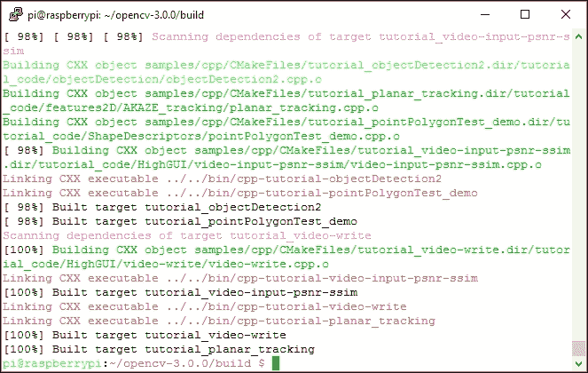

完成的构建应该看起来像这样

OpenCV 编译成功后，可以安装：

```py
sudo make install

```

现在所有这些都已完成，我们可以快速测试 OpenCV 是否现在可以通过 Python 3 使用。运行以下命令以打开 Python 3 终端：

```py
python3

```

在 Python 3 终端中输入以下内容：

```py
import cv2
cv2.__version__

```

这将显示你刚刚安装的 OpenCV 版本！

### 注意

**注意**：OpenCV 库会定期更新，这可能会在构建过程中引起问题。因此，如果你遇到问题，Py Image Search 网站 ([`www.pyimagesearch.com`](http://www.pyimagesearch.com)) 是一个极好的资源，它包含了在 Raspberry Pi 上安装 OpenCV 的最新指南和视频教程。

## 如何操作...

对于我们的第一个 OpenCV 测试，我们将使用它来显示捕获的图像。创建以下 `openimage.py` 文件：

```py
#!/usr/bin/python3
#openimage.py
import cv2

# Load a color image in grayscale
img = cv2.imread('testimage.jpg',0)
cv2.imshow('Frame',img)
cv2.waitKey(0)
cv2.destroyAllWindows()
```

在运行脚本之前，请确保使用以下命令捕获要显示的图像：

```py
raspistill -o testimage.jpg -w 640 -h 480

```

使用以下命令运行脚本：

```py
python3 openimage.py

```

## 工作原理…

简单的测试程序首先通过导入 OpenCV (`cv2`) 和使用 `cv2.imread()` 加载图像。然后我们使用 `cv2.imshow()` 在一个带有标题 `'Frame'` 的图像框中显示我们的图像 (`img`)。然后我们等待按下任意键 (`cv2.waitKey(0)`) 才关闭显示窗口。


图像以灰度图像的形式显示在标准框架中

# 使用 OpenCV 进行颜色检测

我们将通过在实时图像数据上执行一些基本操作来开始使用 OpenCV 进行实验。在这个菜谱中，我们将执行一些基本的图像处理，以便检测不同颜色的物体并跟踪它们在屏幕上的位置。

## 准备就绪

除了之前的配方设置外，您还需要一个合适的彩色物体来跟踪。例如，一个小彩球、一个合适的彩色杯子，或者一个贴有彩色纸片的铅笔是理想的。示例应该允许您检测蓝色、绿色、红色、洋红色（粉红色）或黄色物体的位置（由颜色点指示）。

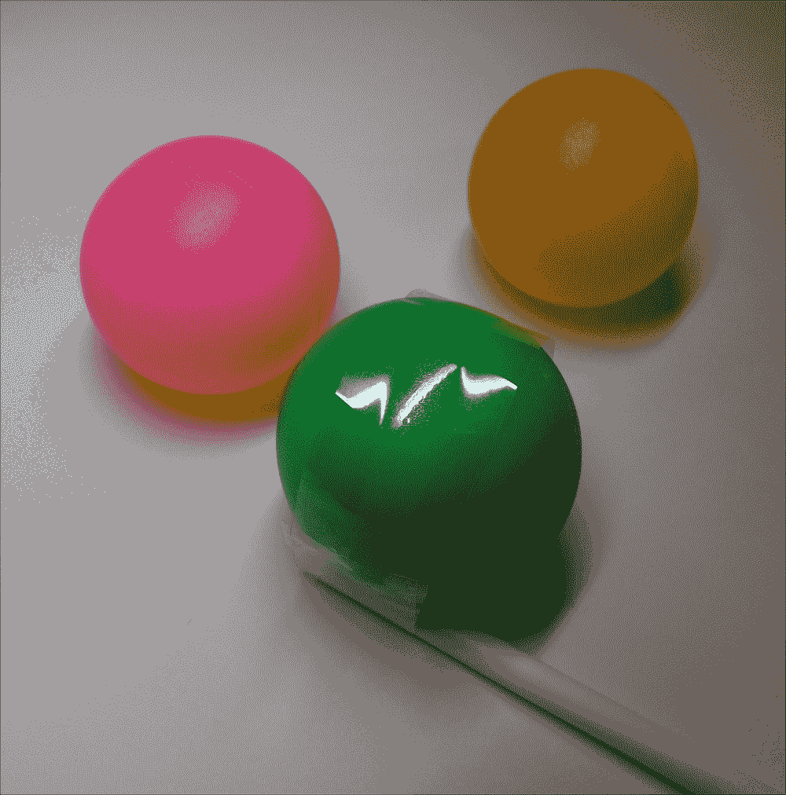

我们可以使用 OpenCV 在图像中检测彩色物体

## 如何操作…

创建以下 `opencv_display.py` 脚本：

```py
#!/usr/bin/python3
#opencv_display.py
from picamera.array import PiRGBArray
from picamera import PiCamera
import time
import cv2

import opencv_color_detect as PROCESS  

def show_images(images,text,MODE):          
  # show the frame
  cv2.putText(images[MODE], "%s:%s" %(MODE,text[MODE]), (10,20),
              cv2.FONT_HERSHEY_SIMPLEX, 0.5, (255,255,255), 2)
  cv2.imshow("Frame", images[MODE])

def begin_capture():
  # initialize the camera and grab a reference to the raw camera capture
  camera = PiCamera()
  camera.resolution = (640, 480)
  camera.framerate = 50
  camera.hflip = True

  rawCapture = PiRGBArray(camera, size=(640, 480))

  # allow the camera to warmup
  time.sleep(0.1)
  print("Starting camera...")
  MODE=0

  # capture frames from the camera
  for frame in camera.capture_continuous(rawCapture, format="bgr", use_video_port=True):
    # capture any key presses
    key = cv2.waitKey(1) & 0xFF

	# grab the raw NumPy array representing the image
    images, text = PROCESS.process_image(frame.array,key)

    #Change display mode or quit
    if key == ord("m"):
      MODE=MODE%len(images)
    elif key == ord("q"):
      print("Quit")
      break

  #Display the output images
    show_images(images,text,MODE)

  # clear the stream in preparation for the next frame
    rawCapture.truncate(0)

begin_capture()
#End
```

在与 `opencv_display.py` 相同的目录中创建以下 `opencv_color_detect.py` 脚本：

```py
#!/usr/bin/python3
#opencv_color_detect.py
import cv2
import numpy as np

BLUR=(5,5)
threshold=0
#Set the BGR color thresholds
THRESH_TXT=["Blue","Green","Red","Magenta","Yellow"]
THRESH_LOW=[[80,40,0],[40,80,0],[40,00,80],[80,0,80],[0,80,80]]
THRESH_HI=[[220,100,80],[100,220,80],[100,80,220],[220,80,220],[80,220,220]]

def process_image(raw_image,control):
  global threshold
  text=[]
  images=[]

  #Switch color threshold
  if control == ord("c"):
    threshold=(threshold+1)%len(THRESH_LOW)
  #Display contour and hierarchy details
  elif control == ord("i"):
    print("Contour: %s"%contours)
    print("Hierarchy: %s"%hierarchy)

  #Keep a copy of the raw image
  text.append("Raw Image %s"%THRESH_TXT[threshold])
  images.append(raw_image)

  #Blur the raw image
  text.append("with Blur...%s"%THRESH_TXT[threshold])
  images.append(cv2.blur(raw_image, BLUR))

  #Set the color thresholds
  lower = np.array(THRESH_LOW[threshold],dtype="uint8")
  upper = np.array(THRESH_HI[threshold], dtype="uint8")

  text.append("with Threshold...%s"%THRESH_TXT[threshold])
  images.append(cv2.inRange(images[-1], lower, upper))

  #Find contours in the threshold image
  text.append("with Contours...%s"%THRESH_TXT[threshold])
  images.append(images[-1].copy())
  image, contours, hierarchy = cv2.findContours(images[-1],
                                                cv2.RETR_LIST,
                                                cv2.CHAIN_APPROX_SIMPLE)

  #Display contour and hierarchy details
  if control == ord("i"):
    print("Contour: %s"%contours)
    print("Hierarchy: %s"%hierarchy)

  #Find the contour with maximum area and store it as best_cnt
  max_area = 0
  best_cnt = 1
  for cnt in contours:
    area = cv2.contourArea(cnt)
    if area > max_area:
      max_area = area
      best_cnt = cnt

  #Find the centroid of the best_cnt and draw a circle there
  M = cv2.moments(best_cnt)
  cx,cy = int(M['m10']/M['m00']), int(M['m01']/M['m00'])

  if max_area>0:
    cv2.circle(raw_image,(cx,cy),8,(THRESH_HI[threshold]),-1)
    cv2.circle(raw_image,(cx,cy),4,(THRESH_LOW[threshold]),-1)

  return(images,text)
#End
```

运行示例，请使用以下命令：

```py
python3 opencv_display.py

```

使用 *M* 键在可用的显示模式之间循环，使用 *C* 键更改我们想要检测的特定颜色（蓝色、绿色、红色、洋红色或黄色），并使用 *I* 键显示检测到的轮廓和层次结构数据的详细信息。


原始图像（左上角）经过模糊（右上角）、阈值（左下角）和轮廓（右下角）操作处理。

## 工作原理…

第一个脚本（`opencv_display.py`）为我们提供了一个运行 OpenCV 示例的通用基础。该脚本包含两个函数，`begin_capture()` 和 `show_images()`。

`begin_capture()` 函数设置 PiCamera 以连续捕获帧（50 fps 和 640x480 分辨率），并将它们转换为适合 OpenCV 处理的原始图像格式。我们在这里使用相对较低的分辨率图像，因为我们不需要很多细节来执行我们旨在进行的处理。实际上，图像越小，它们使用的内存越少，我们需要的处理强度也越低。

通过使用 PiCamera 库的 `camera.capture_continuous()` 函数，我们将获得一个准备好的图像帧供我们处理。我们将每个新帧传递给 `process_image()` 函数，该函数将由 `opencv_color_detect.py` 文件提供，包括任何捕获的按键（以使用户获得一些控制）。`process_image()` 函数（我们将在稍后详细介绍）返回两个数组（图像和文本）。

我们将图像和文本数组传递给 `show_images()` 函数，以及选定的 `MODE`（用户通过按 `M` 键循环选择）。在 `show_images()` 函数中，我们使用给定的 MODE 的文本，并使用 `putText()` 将其添加到我们正在显示的图像中（再次强调，对应于所选的 `MODE`）。最后，我们使用 `cv2.imshow()` 在单独的窗口中显示图像。


脚本显示原始图像（包括跟踪标记）

所有真正的乐趣都包含在 `opencv_color_detect.py` 脚本中，该脚本执行所有必要的图像处理以处理我们的原始视频流。目标是简化源图像，然后识别任何匹配所需颜色的区域的中心。

### 小贴士

**注意**：脚本故意保留了每个处理阶段，以便您可以自己看到每个步骤对前一个图像的影响。这是迄今为止理解我们如何从标准视频图像到计算机能够理解的内容的最好方式。为了实现这一点，我们使用数组收集我们生成的图像（使用`images.append()`添加每个新图像，并使用一种*Pythonic*的方式来引用数组中的最后一个元素，即`[-1]`表示法。在其他编程语言中，这会产生错误，但 Python 中使用负数从数组的末尾向前计数是完全可接受的，因此-1 是数组末尾的第一个元素，-2 将是第二个从末尾开始）。

`process_image()`图像函数应生成四个不同的图像（我们在`images`数组中提供了对这些图像的引用）。在第一张图像中，我们只是保留了我们原始图像的副本（显示为`0: Raw Image [Color]`）。由于这是一个未受干扰的全彩图像，因此这将是我们要展示检测到的对象位置的图像（这将在函数末尾添加）。

我们生成的下一张图像是原始图像（显示为`1: with Blur…[Color]`）的模糊版本，通过使用`cv2.blur()`函数和`BLUR`元组来指定在(*x,y*)轴上的模糊量。通过轻微模糊图像，我们希望消除图像中的任何不必要的细节或错误噪声；这是理想的，因为我们只对大块的颜色感兴趣，所以细微的细节是不相关的。

第三张图像（显示为`2:with Threshold…[color]`）是使用`cv2.inRange()`函数应用给定的高阈值和低阈值的结果。这产生了一个简单的黑白图像，其中任何位于上下颜色阈值之间的图像部分都以白色显示。希望您能够在将测试对象移到相机前时清楚地看到它作为一个大块白色区域。您可以检查这张图像，以确保您的背景不会与目标对象混淆。如果阈值图像主要是白色，则尝试不同的颜色目标，将相机移到不同的位置，或调整阈值数组中使用的颜色（`THRESH_LOW/HI`）。

### 注意

注意：本例中使用的颜色映射是 OpenCV 的**BGR**格式。这意味着像素颜色以三个整数的数组形式存储，分别代表蓝色、绿色和红色。因此，颜色阈值以这种格式指定；这与 HTML 网页颜色中更典型的 RGB 颜色格式相反。

最后一张图像提供了拼图的最后一部分；显示为`3:with Contours...[color]`，它显示了`cv2.findContours()`函数的结果。OpenCV 将在图像中计算轮廓。这将发现阈值图像中的所有形状边缘，并将它们作为一个列表（轮廓）返回。每个单独的轮廓是图像中每个形状边界点的(*x,y*)坐标数组。

### 小贴士

**注意**：`cv2.findContours()`函数直接将轮廓应用于提供的图像，这就是为什么我们制作阈值图像的副本（使用`images[-1].copy()`），这样我们就可以看到我们过程中的两个步骤。我们还使用`cv2.CHAIN_APPROX_SIMPLE`，它试图简化存储的坐标，因此可以跳过任何不需要的点（例如，任何沿直线上的点可以删除，只要我们有起点和终点）。或者，我们也可以使用`cv2.CHAIN_APPROX_NONE`，它保留所有点。

我们可以使用轮廓列表来确定每个轮廓的面积；在我们的案例中，我们最感兴趣的是最大的一个（它可能包含我们正在跟踪的对象，作为图像中具有给定阈值的颜色区域的最大面积）。我们将使用`cv2.contourArea()`对每个发现的轮廓进行面积计算，并保留最终面积最大的那个。

最后，我们可以列出矩度，它们是一系列数字，提供了形状的数学近似。矩度为我们提供了一个简单的计算方法，以获得形状的重心。重心就像形状的*质心*；例如，如果它是由一块平板固体材料制成，那么它将是你可以将其放在手指尖上平衡的点。

*cx, cy = M['m10'] / M['m00'], M['m01'] / M['m00'])*

我们使用计算出的坐标显示一个小标记（由上、下阈值颜色组成），以指示检测到的物体位置。

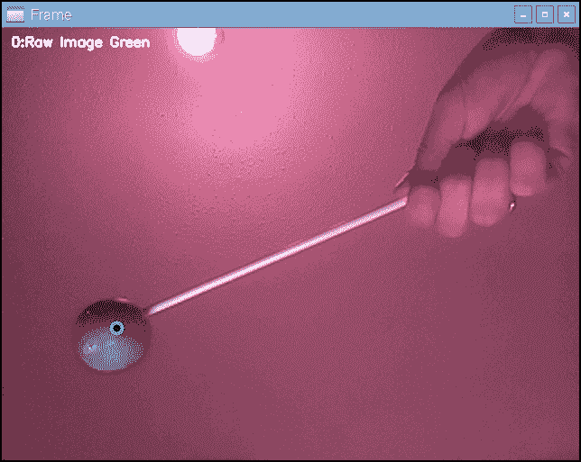

物体的位置在图像中跟踪时用彩色点标记

关于 OpenCV 的轮廓和矩度的更多信息，请参阅 OpenCV-Python 教程([`goo.gl/eP9Cn3`](http://goo.gl/eP9Cn3))。

## 还有更多…

这个配方允许我们通过检测摄像头帧内的所需颜色来跟踪对象，这将提供对象的相对*x*和*y*位置。

我们可以将树莓派摄像头安装在可移动平台上，例如一个漫游/昆虫机器人平台（如第九章中描述的第九章），或者使用伺服控制的倾斜和旋转摄像头支架（如图所示）。


树莓派摄像头可以通过伺服支架进行控制

通过结合摄像头输入和物体坐标，我们可以让树莓派追踪物体无论它去哪里。如果我们检测到物体已经移动到摄像头框架的一侧，我们可以使用树莓派硬件控制将物体重新定位在摄像头框架内（通过控制机器人或倾斜和移动摄像头）。

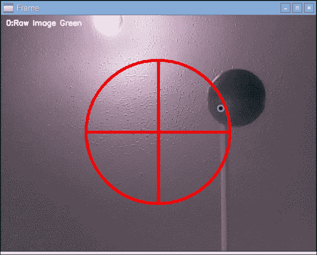

物体已经在屏幕的右上角被检测到，所以将摄像头转向右边和上方以追踪物体

# 使用 OpenCV 进行运动追踪

虽然能够追踪特定颜色的物体很有用，但有时我们只是对实际的运动过程感兴趣。这尤其适用于我们希望追踪的物体可能融入背景的情况。

### 注意

**注意**：安全摄像头通常使用红外探测器作为触发器；然而，这些依赖于检测传感器上检测到的热量的变化。这意味着如果物体相对于背景没有发出额外的热量，它们将无法工作，并且它们不会追踪运动的方向。

[`learn.adafruit.com/pir-passive-infrared-proximity-motion-sensor/how-pirs-work`](https://learn.adafruit.com/pir-passive-infrared-proximity-motion-sensor/how-pirs-work)

以下食谱将演示如何使用 OpenCV 检测运动，并提供物体在一段时间内移动的记录。

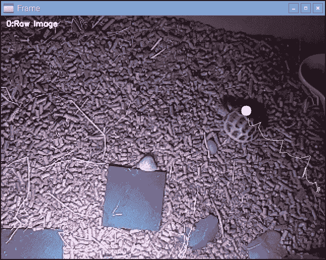

框架内物体的运动在屏幕上被追踪，允许记录并研究运动模式

## 准备中

以下脚本将使我们能够追踪一个物体并在屏幕上显示其路径。为此任务，我自愿选择了我们家的家龟；然而，任何移动的物体都可以使用。

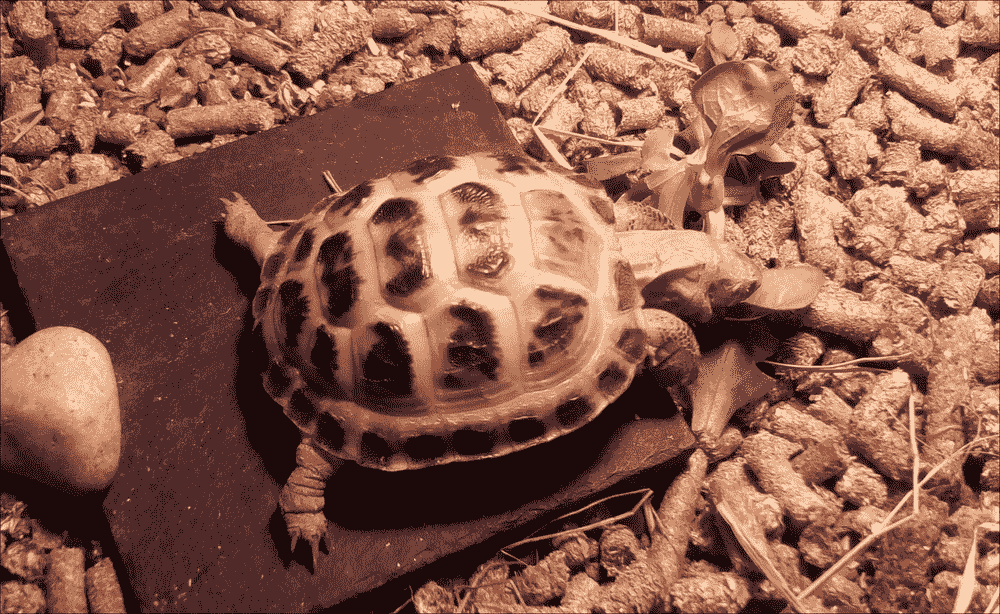

我们的乌龟是一个出色的测试对象；看到她在白天四处游荡非常有趣

在这种情况下，设置效果特别好的原因如下。首先，由于乌龟的颜色与背景相似，我们无法使用之前的方法进行颜色检测（除非我们在她身上贴上一些标记）。其次，乌龟的笼子上方有一个有用的架子，允许树莓派和摄像头直接安装在上方。最后，笼子是人工照明的，所以在我们的测试期间，除了乌龟的运动外，观察到的图像应该保持相对稳定。当使用外部因素，如自然光进行此任务时，你可能会发现它们会干扰运动检测（使得很难确定变化是由于运动还是环境变化——参见*更多内容*部分以获取克服此问题的技巧）。

其余的设置将与之前的 OpenCV 食谱相同（参见*使用 OpenCV 进行颜色检测*）。

## 如何做到这一点…

创建以下脚本，命名为`opencv_detect_motion.py`：

```py
#!/usr/bin/python3
#opencv_motion_detect.py
import cv2
import numpy as np

GAUSSIAN=(21,21)

imageBG=None
gray=True

movement=[]
AVG=2
avgX=0
avgY=0
count=0

def process_image(raw_image,control):
  global imageBG
  global count,avgX,avgY,movement,gray

  text=[]
  images=[]
  reset=False

  #Toggle Gray and reset background
  if control == ord("g"):
    if gray:
      gray=not gray
    reset=True
    print("Toggle Gray")
  #Reset the background image
  elif control == ord("r"):
    reset=True

  #Clear movement record and reset background
  if reset:
    print("Reset Background")
    imageBG=None
    movement=[]

  #Keep a copy of the raw image
  text.append("Raw Image")
  images.append(raw_image)

  if gray:
    raw_image=cv2.cvtColor(raw_image,cv2.COLOR_BGR2GRAY)

  #Blur the raw image
  text.append("with Gaussian Blur...")
  images.append(cv2.GaussianBlur(raw_image, GAUSSIAN))

  #Initialise background
  if imageBG is None:
    imageBG=images[-1]

  text.append("with image delta...")  
  images.append(cv2.absdiff(imageBG,images[-1]))

  text.append("with threshold mask...")                
  images.append(cv2.threshold(images[-1], 25, 255,
                             cv2.THRESH_BINARY)[1])

  text.append("with dilation...")                
  images.append(cv2.dilate(images[-1],None, iterations=3))

  #Find contours
  if not gray:
    #Require gray image to find contours
    text.append("with dilation gray...")
    images.append(cv2.cvtColor(images[-1],cv2.COLOR_BGR2GRAY))
  text.append("with contours...")
  images.append(images[-1].copy())
  aimage, contours, hierarchy = cv2.findContours(images[-1],
                                                 cv2.RETR_LIST,
                                                 cv2.CHAIN_APPROX_SIMPLE)

  #Display contour and hierarchy details
  if control == ord("i"):
    print("Contour: %s"%contours)
    print("Hierarchy: %s"%hierarchy)

  #Determine the area of each of the contours
  largest_area=0
  found_contour=None
  for cnt in contours:
    area = cv2.contourArea(cnt)
    #Find which one is largest
    if area > largest_area:
      largest_area=area
      found_contour=cnt

  if found_contour != None:
    #Find the centre of the contour
    M=cv2.moments(found_contour)
    cx,cy=int(M['m10']/M['m00']),int(M['m01']/M['m00'])
    #Calculate the average
    if count<AVG:
      avgX=(avgX+cx)/2
      avgY=(avgY+cy)/2
      count=count+1
    else:
      movement.append((int(avgX),int(avgY)))
      avgX=cx
      avgY=cy
      count=0

  #Display
  if found_contour != None:
    cv2.circle(images[0],(cx,cy),10,(255,255,255),-1)
  if len(movement) > 1:
    for i,j in enumerate(movement):
      if i>1:
        cv2.line(images[0],movement[i-1],movement[i],(255,255,255))

  return(images,text)  
#End
```

接下来，在 `opencv_display.py` 文件中找到以下行（来自前面的食谱）：

```py
import opencv_color_detect as PROCESS 

```

变更为以下：

```py
import opencv_motion_detect as PROCESS

```

要运行示例，请使用以下命令：

```py
python3 opencv_display.py

```

使用 *M* 键在可用的显示模式之间循环，使用 *G* 键切换灰度模式，使用 *I* 键显示检测到的轮廓和层次结构数据的信息，使用 *B* 键重置我们设置为背景的图像。

## 它是如何工作的…

这种运动检测方法背后的原理简洁而优雅。首先，我们将初始图像作为我们的金图像（此时没有动作发生）；我们将将其视为我们的静态背景。现在我们只需将任何后续图像与这个原始背景图像进行比较。如果与第一幅图像有任何显著差异，我们假设差异是由于运动引起的。一旦我们检测到运动，我们将在帧上生成运动轨迹并显示它。

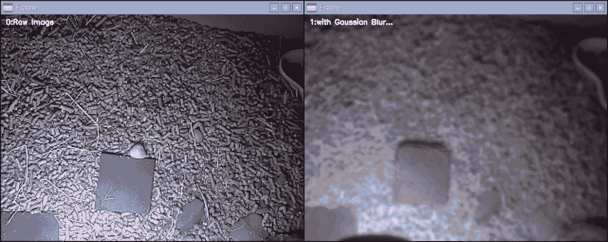

金图像（右侧）是原始图像（左侧）的灰度版本，并应用了高斯模糊。

当脚本运行时，我们确保重置标志设置为 `True`，这确保我们使用捕获的第一幅图像作为金图像（此外，如果用户按下 *R*，我们允许金图像通过新图像刷新）。我们还检测用户是否按下 *G*，这将切换在灰度或彩色中处理图像。默认是灰度，因为这种处理更有效，颜色在检测运动时并不重要（但看到图像仍然为彩色时的相同处理结果也很有趣）。

就像前面的食谱一样，我们将保留每个图像的副本，以便更好地理解过程中的每个阶段。首先显示的图像是 `0:原始图像`，它是相机图像的直接副本（我们将在该图像上叠加检测到的运动）。

在下一张图像中，`1:with Gaussian Blur…`，我们使用 `cv2.GaussianBlur(raw_image, GAUSSIAN, 0)`，提供原始图像的平滑版本（希望从图像中去除高斯噪声）。像 `blur` 函数一样，我们提供要处理的图像和 *x,y* 放大值（对于高斯算法，这些值必须是正数且为奇数）。

### 注意

注意：您可以通过插入以下代码（在高斯模糊部分之前）并在模式之间循环来比较高斯模糊与标准模糊方法：

```py
  text.append("with Low Blur...")
  images.append(cv2.blur(raw_image, (5,5))
  text.append("with High Blur...")
  images.append(cv2.blur(raw_image, (30,30))
```

使用此模糊图像设置背景图像（如果之前尚未设置或已重置）。

我们使用 `cv2.absdiff(imageBG,images[-1])` 来确定 `imageBG`（原始背景图像）和最新高斯模糊图像之间的差异，以提供 `2:with image delta...`。

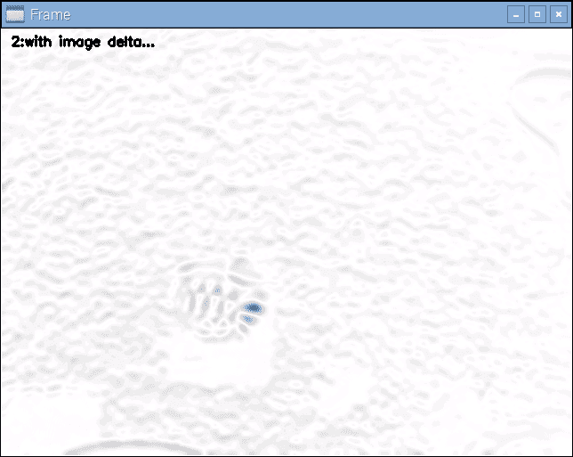

这张图像（在此处反转以使其更清晰）显示了与金图像的差异。乌龟移动到了图像的中间附近

接下来，我们应用二值阈值掩码（显示为`3:with threshold mask…`），这将设置介于上限（255）和下限（25）之间的任何像素为 255，从而得到一个显示主要运动区域的黑白图像。

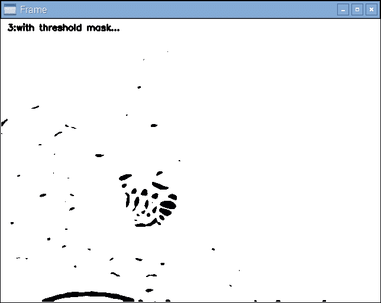

对差分图像应用阈值滤波器，突出显示图像中的最大变化。

现在，我们使用`cv2.dilate(images[-1], None, iterations=3)`对阈值图像（显示为`4:with dilation…`）进行膨胀。`dilate`操作通过在每次迭代中使图像的白色部分增长一个像素来实现。通过将`None`作为第二个参数，我们设置内核使用默认值（或者，可以使用由 0s 和 1s 组成的数组来完全控制膨胀的应用方式）。


膨胀图像使检测到的运动点增长。

我们使用`cv2.contours()`函数，就像在之前的食谱中做的那样，来检测检测到的形状的轮廓；结果显示为`5:with contours…`。如果图像还不是灰度图，我们必须将其转换为灰度图，因为该函数最适合二值图像（黑白图像）。

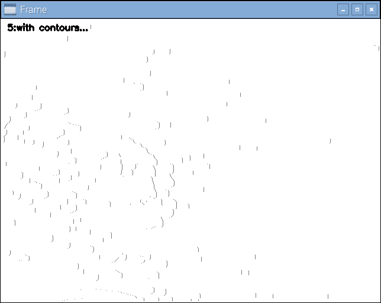

计算轮廓的面积并用于确定主要运动区域的定位。

与之前一样，我们计算每个轮廓的面积，并使用`cv2.contourArea()`找出最大的轮廓。然后，我们通过找到矩（通过`cv2.moments()`）来确定所选轮廓中心的坐标。最后，我们将这些坐标添加到矩数组中，以便在原始图像上显示检测到的运动的轨迹。

此外，为了追踪相对缓慢移动的物体，我们还可以平均几个检测到的坐标，以提供更平滑的运动轨迹。

如开头所述，外部因素可能会干扰这个简单的算法，即使是环境中的细微变化也可能导致运动检测错误。幸运的是，通过将长期平均应用于背景图像（而不是单次快照），可以将任何逐渐变化，如光照，纳入背景图像中。

## 还有更多…

尽管我们只是简要地触及了 OpenCV 库的一个小方面，但应该很清楚，它非常适合与树莓派一起使用。我们已经看到 OpenCV 提供了相对容易的非常强大的处理能力，而树莓派（尤其是树莓派 2 型）是运行它的理想平台。

如你所想，仅仅通过几个示例来涵盖 OpenCV 能够做到的所有事情并不实际，但我希望这至少已经激起了你的兴趣（并且为你提供了一个现成的设置，你可以从中进行实验并创建自己的项目）。

幸运的是，不仅网上有大量的教程和指南，还有几本书详细介绍了 OpenCV；特别是以下 Packt 出版的书籍被推荐：

+   *《使用 Python 的 OpenCV 计算机视觉》* 由 *约瑟夫·豪斯* 编著

+   *《树莓派计算机视觉编程》* 由 *阿什温·帕贾卡尔* 编著

在最后两个例子中，我尽量使代码尽可能简短，同时确保易于观察背后的工作原理。通过导入不同的模块以及使用你自己的 `process_images()` 函数，应该非常容易对其进行修改或添加。

对于更多想法和项目，以下网站上有一个非常优秀的列表：

[`www.intorobotics.com/20-hand-picked-raspberry-pi-tutorials-in-computer-vision/`](http://www.intorobotics.com/20-hand-picked-raspberry-pi-tutorials-in-computer-vision/)
