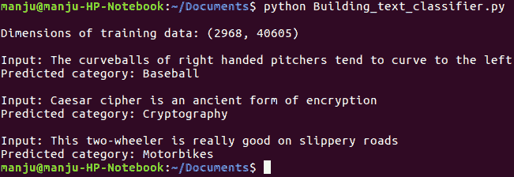
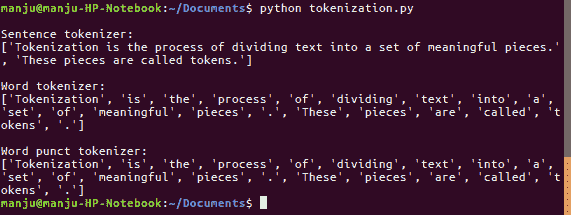
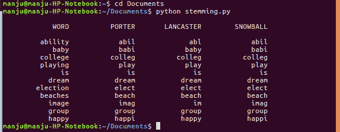
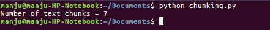
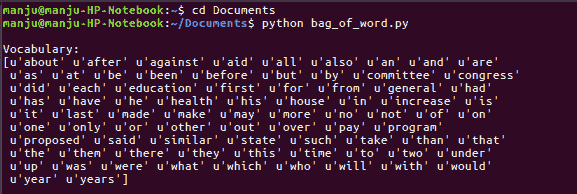
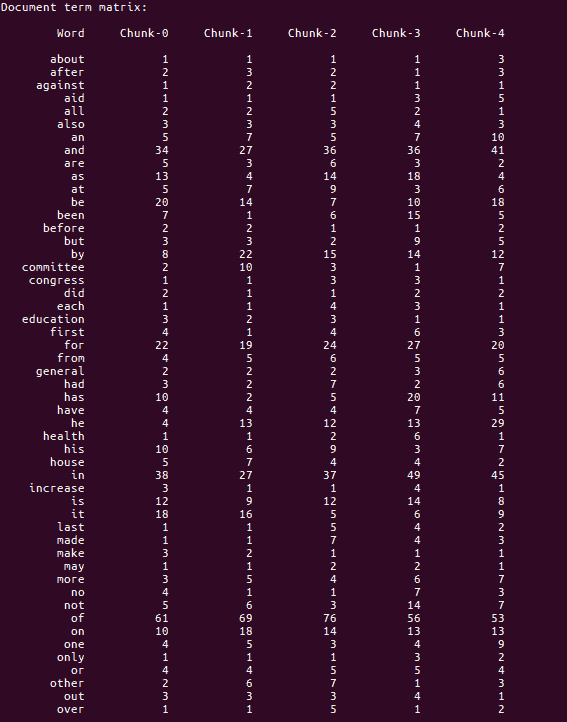

# 分割文本数据并构建文本分类器

本章介绍了以下食谱：

+   构建文本分类器

+   使用分词进行数据处理

+   对文本数据进行词干提取

+   使用分块划分文本

+   构建词袋模型

+   文本分类器的应用

# 简介

本章介绍了构建文本分类器的配方。这包括从数据库中提取关键特征、训练、测试和验证文本分类器。最初，文本分类器使用常用词汇进行训练。随后，训练好的文本分类器用于预测。构建文本分类器包括使用分词对数据进行预处理、对文本数据进行词干提取、使用分块对文本进行划分，以及构建词袋模型。

# 构建文本分类器

分类单元通常被认为是将数据库划分为各种类别。在文献中，朴素贝叶斯分类方案被广泛认为可以根据训练模型来分离文本。本章的这一部分最初考虑了一个包含关键词的文本数据库；特征提取从文本中提取关键短语并训练分类系统。然后，实施**词频-逆文档频率**（**tf-idf**）转换来指定单词的重要性。最后，使用分类系统预测并打印输出。

# 如何做到这一点...

1.  在一个新的 Python 文件中包含以下行以添加数据集：

```py
from sklearn.datasets import fetch_20newsgroups 
category_mapping = {'misc.forsale': 'Sellings', 'rec.motorcycles': 'Motorbikes', 
        'rec.sport.baseball': 'Baseball', 'sci.crypt': 'Cryptography', 
        'sci.space': 'OuterSpace'} 

training_content = fetch_20newsgroups(subset='train', 
categories=category_mapping.keys(), shuffle=True, random_state=7) 
```

1.  对文本执行特征提取以提取主要单词：

```py
from sklearn.feature_extraction.text import CountVectorizer 

vectorizing = CountVectorizer() 
train_counts = vectorizing.fit_transform(training_content.data) 
print "nDimensions of training data:", train_counts.shape 
```

1.  训练分类器：

```py
from sklearn.naive_bayes import MultinomialNB 
from sklearn.feature_extraction.text import TfidfTransformer 

input_content = [ 
    "The curveballs of right handed pitchers tend to curve to the left", 
    "Caesar cipher is an ancient form of encryption", 
    "This two-wheeler is really good on slippery roads" 
] 

tfidf_transformer = TfidfTransformer() 
train_tfidf = tfidf_transformer.fit_transform(train_counts) 
```

1.  实现多项式朴素贝叶斯分类器：

```py
classifier = MultinomialNB().fit(train_tfidf, training_content.target) 
input_counts = vectorizing.transform(input_content) 
input_tfidf = tfidf_transformer.transform(input_counts) 
```

1.  预测输出类别：

```py
categories_prediction = classifier.predict(input_tfidf) 
```

1.  打印输出：

```py
for sentence, category in zip(input_content, categories_prediction): 
    print 'nInput:', sentence, 'nPredicted category:',  
            category_mapping[training_content.target_names[category]] 
```

以下截图提供了基于数据库输入预测对象的示例：



# 它是如何工作的...

本章的前一部分提供了关于实现分类器部分和一些样本结果的见解。分类器部分是基于在训练好的朴素贝叶斯分类器中的先前文本与测试序列中的关键测试之间的比较来工作的**。**

# 参见

请参阅以下文章：

+   *情感分析算法与应用：综述* [`www.sciencedirect.com/science/article/pii/S2090447914000550`](https://www.sciencedirect.com/science/article/pii/S2090447914000550).

+   在线评论的情感分类：使用基于句子的语言模型来学习情感预测是如何工作的。[`www.tandfonline.com/doi/abs/10.1080/0952813X.2013.782352?src=recsys&journalCode=teta20`](https://www.tandfonline.com/doi/abs/10.1080/0952813X.2013.782352?src=recsys&journalCode=teta20).

+   *使用产品评论数据进行情感分析* 和 *在存在模态的情况下进行句子级情感分析*，以了解更多在[`journalofbigdata.springeropen.com/articles/10.1186/s40537-015-0015-2`](https://journalofbigdata.springeropen.com/articles/10.1186/s40537-015-0015-2) 和 [`link.springer.com/chapter/10.1007/978-3-642-54903-8_1`](https://link.springer.com/chapter/10.1007/978-3-642-54903-8_1)中使用的推荐系统指标。

# 使用分词进行数据预处理

数据预处理涉及将现有文本转换为学习算法可接受的信息。

分词是将文本划分为一组有意义的片段的过程。这些片段被称为标记。

# 如何进行操作...

1.  介绍句子分词：

```py
from nltk.tokenize import sent_tokenize
```

1.  形成一个新的文本分词器：

```py
tokenize_list_sent = sent_tokenize(text)
print "nSentence tokenizer:" 
print tokenize_list_sent 
```

1.  形成一个新的单词分词器：

```py
from nltk.tokenize import word_tokenize 
print "nWord tokenizer:" 
print word_tokenize(text) 
```

1.  介绍一个新的 WordPunct 分词器：

```py
from nltk.tokenize import WordPunctTokenizer 
word_punct_tokenizer = WordPunctTokenizer() 
print "nWord punct tokenizer:" 
print word_punct_tokenizer.tokenize(text) 
```

分词器得到的结果在此展示。它将一个句子划分为词组：



# 文本数据归一化

词干处理过程涉及为分词器中的单词创建一个带有减少字母的合适单词。

# 如何做到这一点...

1.  使用新的 Python 文件初始化词干提取过程：

```py
from nltk.stem.porter import PorterStemmer 
from nltk.stem.lancaster import LancasterStemmer 
from nltk.stem.snowball import SnowballStemmer 
```

1.  让我们描述一些需要考虑的词汇，如下所示：

```py
words = ['ability', 'baby', 'college', 'playing', 'is', 'dream', 'election', 'beaches', 'image', 'group', 'happy'] 
```

1.  确定要使用的一组`词干提取器`：

```py
stemmers = ['PORTER', 'LANCASTER', 'SNOWBALL'] 
```

1.  初始化所选`stemmers`所需的必要任务：

```py
stem_porter = PorterStemmer() 
stem_lancaster = LancasterStemmer() 
stem_snowball = SnowballStemmer('english') 
```

1.  格式化表格以打印结果：

```py
formatted_row = '{:>16}' * (len(stemmers) + 1) 
print 'n', formatted_row.format('WORD', *stemmers), 'n' 
```

1.  反复检查单词列表，并使用选定的`词干提取器`对它们进行排列：

```py
for word in words:
  stem_words = [stem_porter.stem(word), 
  stem_lancaster.stem(word), 
  stem_snowball.stem(word)] 
  print formatted_row.format(word, *stem_words) 
```

从词干处理过程中获得的结果显示在下述截图：



# 使用分块划分文本

块状处理程序可以用来将大文本分割成小而有意义的单词。

# 如何做到这一点...

1.  使用 Python 开发并导入以下包：

```py
import numpy as np 
from nltk.corpus import brown 
```

1.  描述一个将文本分割成块的功能：

```py
# Split a text into chunks 
def splitter(content, num_of_words): 
   words = content.split(' ') 
   result = [] 
```

1.  初始化以下编程行以获取指定的变量：

```py
   current_count = 0 
   current_words = []
```

1.  使用以下词汇开始迭代：

```py
   for word in words: 
     current_words.append(word) 
     current_count += 1 
```

1.  在获得基本词汇量后，重新组织变量：

```py
     if current_count == num_of_words: 
       result.append(' '.join(current_words)) 
       current_words = [] 
       current_count = 0 
```

1.  将块附加到输出变量：

```py
       result.append(' '.join(current_words)) 
       return result 
```

1.  导入`布朗语料库`的数据，并考虑前`10000`个单词：

```py
if __name__=='__main__': 
  # Read the data from the Brown corpus 
  content = ' '.join(brown.words()[:10000]) 
```

1.  描述每个块中的字大小：

```py
  # Number of words in each chunk 
  num_of_words = 1600 
```

1.  初始化一对重要变量：

```py
  chunks = [] 
  counter = 0 
```

1.  通过调用`splitter`函数来打印结果：

```py
  num_text_chunks = splitter(content, num_of_words) 
  print "Number of text chunks =", len(num_text_chunks) 
```

1.  将数据块化后得到的结果如下截图所示：



# 构建词袋模型

当处理包含大量单词的文本文档时，我们需要将它们转换为几种不同的算术表示形式。我们需要将它们制定成适合机器学习算法的形式。这些算法需要算术信息，以便它们可以检查数据并提供重要的细节。词袋（Bag-of-words）过程帮助我们实现这一点。词袋通过使用文档中的所有单词来发现词汇，创建一个文本模型。随后，它通过构建文本中所有单词的直方图来为每篇文本创建模型。

# 如何做到这一点...

1.  通过导入以下文件来初始化一个新的 Python 文件：

```py
import numpy as np 
from nltk.corpus import brown 
from chunking import splitter 
```

1.  定义`main`函数并从`Brown 语料库`读取输入数据：

```py
if __name__=='__main__': 
        content = ' '.join(brown.words()[:10000]) 
```

1.  将文本内容分成块：

```py
    num_of_words = 2000 
    num_chunks = [] 
    count = 0 
    texts_chunk = splitter(content, num_of_words) 
```

1.  基于这些`文本`块构建词汇：

```py
    for text in texts_chunk: 
      num_chunk = {'index': count, 'text': text} 
      num_chunks.append(num_chunk) 
      count += 1
```

1.  提取文档词矩阵，该矩阵有效地统计文档中每个单词出现的次数：

```py
  from sklearn.feature_extraction.text      
  import CountVectorizer
```

1.  提取文档术语 `matrix:`

```py
from sklearn.feature_extraction.text import CountVectorizer 
vectorizer = CountVectorizer(min_df=5, max_df=.95) 
matrix = vectorizer.fit_transform([num_chunk['text'] for num_chunk in num_chunks]) 
```

1.  提取词汇并打印：

```py
vocabulary = np.array(vectorizer.get_feature_names()) 
print "nVocabulary:" 
print vocabulary 
```

1.  打印文档项`矩阵`：

```py
print "nDocument term matrix:" 
chunks_name = ['Chunk-0', 'Chunk-1', 'Chunk-2', 'Chunk-3', 'Chunk-4'] 
formatted_row = '{:>12}' * (len(chunks_name) + 1) 
print 'n', formatted_row.format('Word', *chunks_name), 'n' 
```

1.  遍历所有单词，并打印每个单词在各种块中的重复出现：

```py
for word, item in zip(vocabulary, matrix.T): 
# 'item' is a 'csr_matrix' data structure 
 result = [str(x) for x in item.data] 
 print formatted_row.format(word, *result)
```

1.  执行词袋模型后得到的结果如下所示：



为了理解它在特定句子中的工作原理，请参考以下内容：

+   *情感分析简介*，在此处解释：[`blog.algorithmia.com/introduction-sentiment-analysis/`](https://blog.algorithmia.com/introduction-sentiment-analysis/)

# 文本分类器的应用

文本分类器用于分析客户情绪，在产品评论中，在互联网搜索查询时，在社会标签中，预测研究文章的新颖性，等等。
