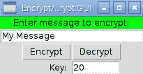
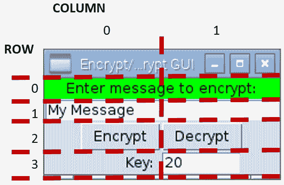
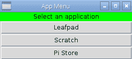
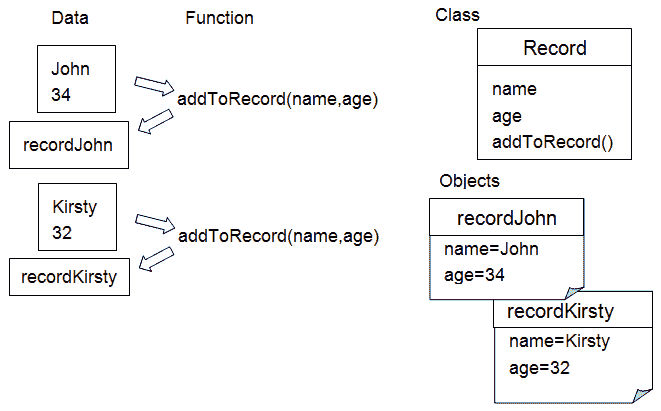
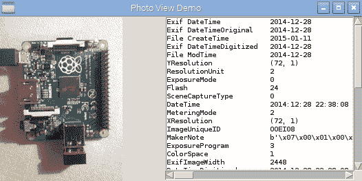
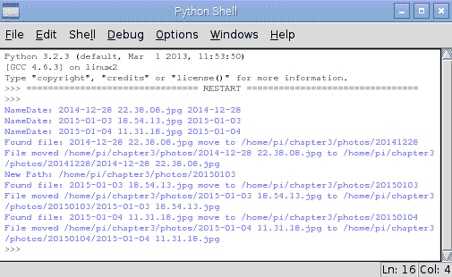
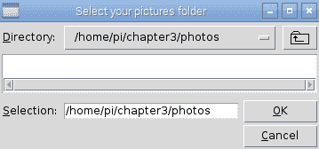

# 使用 Python 进行自动化和生产力提升

在本章中，我们将涵盖以下主题：

+   使用 Tkinter 创建图形用户界面

+   创建图形化启动菜单应用程序

+   在应用程序中显示照片信息

+   自动整理您的照片

# 简介

到目前为止，我们一直专注于命令行应用程序；然而，树莓派的功能远不止命令行那么简单。通过使用**图形用户界面**（**GUIs**），通常更容易从用户那里获取输入并以更简单的方式提供反馈。毕竟，我们一直在不断地处理多个输入和输出，所以为什么非得限制自己只使用命令行的程序格式呢？

幸运的是，Python 可以支持这一点。和其他编程语言一样，例如 Visual Basic 和 C/C++/C#，这可以通过使用预构建的对象来实现，这些对象提供了标准控件。我们将使用一个名为 **Tkinter** 的模块，它提供了一系列良好的控件（也称为 **小部件**）和工具，用于创建图形应用程序。

首先，我们将以一个示例，`encryptdecrypt.py`，来展示如何以多种方式编写和重用有用的模块。这是一个良好的编码实践示例。我们应该努力编写可以彻底测试并在许多地方重用的代码。

接下来，我们将通过创建一个小的图形化启动菜单应用程序来扩展我们之前的示例，以便从该应用程序运行我们的最爱应用。

然后，我们将探讨在我们的应用程序中使用**类**来显示信息，然后进行操作的方法。

组织照片。

# 使用 Tkinter 创建图形用户界面

我们将创建一个基本的图形用户界面，以便用户输入信息，然后程序可以用来加密和解密这些信息。

# 准备就绪

您必须确保此文件放置在同一目录下。

由于我们正在使用 Tkinter（Python 众多可用插件之一），我们需要确保它已安装。它应该默认安装在标准的 Raspbian 镜像中。我们可以通过从 Python 提示符导入它来确认它已安装，如下所示：

`   Python3`

`   >>> import tkinter`

如果未安装，将会抛出 `ImportError` 异常，在这种情况下，您可以使用以下命令进行安装（使用 *Ctrl* + *Z* 退出 Python 提示符）：

`sudo apt-get install python3-tk`

如果模块已成功加载，您可以使用以下命令来了解更多关于该模块的信息（阅读完毕后，使用 *Q* 退出）：

`>>>help(tkinter)`

您也可以使用以下命令获取模块中所有类、函数和方法的详细信息：

`>>>help(tkinter.Button)`

以下 `dir` 命令将列出 `module:` 范围内的任何有效命令或变量。

`>>>dir(tkinter.Button)`

你会发现我们自己的模块将包含由三引号标记的函数信息；如果我们使用`help`命令，这些信息将会显示出来。

命令行无法显示本章中创建的图形显示，因此您需要启动树莓派桌面（使用命令`startx`），或者如果您正在远程使用它。

确保您已启用**X11 转发**并且有一个**X 服务器**正在运行（参见第一章，*使用 Raspberry Pi 3 计算机入门*）。

# 如何做到这一点...

我们将使用 `tkinter` 模块为 `encryptdecrypt.py` 脚本创建一个图形用户界面。

要生成 GUI，我们将创建以下`tkencryptdecrypt.py`脚本：

```py
#!/usr/bin/python3 
#tkencryptdecrypt.py 
import encryptdecrypt as ENC 
import tkinter as TK 

def encryptButton(): 
    encryptvalue.set(ENC.encryptText(encryptvalue.get(), 
                                     keyvalue.get())) 

def decryptButton(): 
    encryptvalue.set(ENC.encryptText(encryptvalue.get(), 
                                     -keyvalue.get())) 
#Define Tkinter application 
root=TK.Tk() 
root.title("Encrypt/Decrypt GUI") 
#Set control & test value 
encryptvalue = TK.StringVar() 
encryptvalue.set("My Message")  
keyvalue = TK.IntVar() 
keyvalue.set(20) 
prompt="Enter message to encrypt:" 
key="Key:" 

label1=TK.Label(root,text=prompt,width=len(prompt),bg='green') 
textEnter=TK.Entry(root,textvariable=encryptvalue, 
                   width=len(prompt)) 
encryptButton=TK.Button(root,text="Encrypt",command=encryptButton) 
decryptButton=TK.Button(root,text="Decrypt",command=decryptButton) 
label2=TK.Label(root,text=key,width=len(key)) 
keyEnter=TK.Entry(root,textvariable=keyvalue,width=8) 
#Set layout 
label1.grid(row=0,columnspan=2,sticky=TK.E+TK.W) 
textEnter.grid(row=1,columnspan=2,sticky=TK.E+TK.W) 
encryptButton.grid(row=2,column=0,sticky=TK.E) 
decryptButton.grid(row=2,column=1,sticky=TK.W) 
label2.grid(row=3,column=0,sticky=TK.E) 
keyEnter.grid(row=3,column=1,sticky=TK.W) 

TK.mainloop() 
#End 
```

使用以下命令运行脚本：

```py
python3 tkencryptdecrypt
```

# 它是如何工作的...

我们首先导入两个模块；第一个是我们自己的`encryptdecrypt`模块，第二个是`tkinter`模块。为了更方便地看到哪些项目来自哪里，我们使用`ENC`/`TK`。如果你想要避免额外的引用，你可以使用`from <module_name> import *`来直接引用模块中的项目。

当我们点击加密和解密按钮时，将会调用`encryptButton()`和`decryptButton()`函数；它们将在接下来的章节中进行解释。

使用 `Tk()` 命令创建主 Tkinter 窗口，该命令返回一个主窗口，其中可以放置所有小部件/控件。

我们将如下定义六个控制项：

+   `标签`: 这会显示用于加密的提示输入信息：

+   `Entry`: 这提供了一个文本框，用于接收用户要加密的消息

+   `按钮`: 这是一个加密按钮，用于触发消息加密

+   `按钮`: 这是一个解密按钮，用于反转加密

+   `标签`: 这会显示“键：”字段以提示用户输入加密密钥值

+   `条目`：这提供了一个第二个文本框来接收加密密钥的值

这些控件将生成一个类似于以下截图所示的图形用户界面：



加密/解密消息的 GUI

让我们来看看第一个`label1`的定义：

```py
label1=TK.Label(root,text=prompt,width=len(prompt),bg='green') 
```

所有控件都必须与应用程序窗口相关联；因此，我们必须指定我们的 Tkinter 窗口`root`。用于标签的文本由`text`设置；在这种情况下，我们将其设置为名为`prompt`的字符串，该字符串之前已经定义了我们需要的文本。我们还设置了`width`以匹配消息的字符数（虽然不是必需的，但如果我们以后要添加更多文本到标签中，它将提供一个更整洁的结果），最后，我们使用`bg='green'`设置了背景颜色。

接下来，我们为我们的消息定义文本`Entry`框：

```py
textEnter=TK.Entry(root,textvariable=encryptvalue, 
                   width=len(prompt)) 
```

我们将定义`textvariable`——一种将变量链接到框内容的实用方法，该框是一个特殊的字符串变量。我们可以直接使用`textEnter.get()`来访问`text`，但我们将使用`Tkinter StringVar()`对象来间接访问它。如果需要，这将允许我们将我们正在处理的数据与处理 GUI 布局的代码分开。每当使用`.set()`命令时（以及使用`.get()`命令从`Entry`小部件获取最新值时），`enycrptvalue`变量会自动更新它所链接的`Entry`小部件。

接下来，我们有我们的两个`按钮`小部件，加密和解密，如下所示：

```py
encryptButton=TK.Button(root,text="Encrypt",command=encryptButton) 
decryptButton=TK.Button(root,text="Decrypt",command=decryptButton) 
```

在这种情况下，我们可以通过设置`command`属性来定义一个在点击`Button`小部件时被调用的函数。我们可以定义当每个按钮被点击时将被调用的两个函数。在下面的代码片段中，我们有`encryptButton()`函数，该函数将设置控制第一个`Entry`框内容的`encryptvalue StringVar`。这个字符串被设置为通过调用`ENC.encryptText()`得到的我们想要加密的消息（`encryptvalue`的当前值）和`keyvalue`变量。`decrypt()`函数与此完全相同，只是我们将`keyvalue`变量设置为负值以解密消息：

```py
def encryptButton(): 
    encryptvalue.set(ENC.encryptText(encryptvalue.get(), 
                                     keyvalue.get())) 
```

我们随后以类似的方式设置了最终的`标签`和`条目`小部件。请注意，如果需要，`textvariable`也可以是一个整数（数值），但是没有内置的检查来确保只能输入数字。当使用`.get()`命令时，你将遇到`ValueError`异常。

在我们定义了 Tkinter 窗口中要使用的所有小部件之后，我们必须设置布局。在 Tkinter 中有三种定义布局的方法：*放置*、*打包*和*网格*。

场地布局允许我们使用精确的像素位置来指定位置和大小。打包布局按照项目添加的顺序将项目放置在窗口中。网格布局允许我们在特定的布局中放置项目。建议尽可能避免使用场地布局，因为对任何一个项目的微小更改都可能对其他所有项目的位置和大小产生连锁反应；其他布局通过确定它们相对于窗口中其他项目的位置来解决这个问题。

我们将按照以下截图所示放置项目：



加密/解密 GUI 的网格布局

使用以下代码设置 GUI 中前两项的位置：

```py
label1.grid(row=0,columnspan=2,sticky= TK.E+TK.W) 
textEnter.grid(row=1,columnspan=2,sticky= TK.E+TK.W) 
```

我们可以指定第一个`标签`和`条目`框将跨越两列（`columnspan=2`），并且我们可以设置粘性值以确保它们延伸到边缘。这是通过设置东边的`TK.E`和西边的`TK.W`来实现的。如果我们需要垂直地做同样的事情，我们可以使用`TK.N`代表北边和`TK.S`代表南边。如果未指定`column`值，网格函数默认为`column=0`。其他项目也是类似定义的。

最后一步是调用 `TK.mainloop()`，这允许 Tkinter 运行；这允许监控按钮的点击事件，并且 Tkinter 会调用与它们关联的函数。

# 创建图形应用程序 – 开始菜单

本食谱中的示例展示了我们如何定义自己的 Tkinter 对象变体以生成自定义控件，并使用它们动态构建菜单。我们还将简要探讨使用线程，以便在执行特定任务的同时允许其他任务继续运行。

# 准备就绪

要查看 GUI 显示，您需要一个显示 Raspberry Pi 桌面的显示器，或者您需要连接到运行 X 服务器的另一台计算机。

# 如何做到这一点...

1.  要创建一个图形化启动菜单应用程序，创建以下`graphicmenu.py`脚本：

```py
#!/usr/bin/python3 
# graphicmenu.py 
import tkinter as tk 
from subprocess import call 
import threading 

#Define applications ["Display name","command"] 
leafpad = ["Leafpad","leafpad"] 
scratch = ["Scratch","scratch"] 
pistore = ["Pi Store","pistore"] 
app_list = [leafpad,scratch,pistore] 
APP_NAME = 0 
APP_CMD  = 1 

class runApplictionThread(threading.Thread): 
    def __init__(self,app_cmd): 
        threading.Thread.__init__(self) 
        self.cmd = app_cmd 
    def run(self): 
        #Run the command, if valid 
        try: 
            call(self.cmd) 
        except: 
            print ("Unable to run: %s" % self.cmd) 

class appButtons: 
    def __init__(self,gui,app_index): 
        #Add the buttons to window 
        btn = tk.Button(gui, text=app_list[app_index][APP_NAME], 
                        width=30, command=self.startApp) 
        btn.pack() 
        self.app_cmd=app_list[app_index][APP_CMD] 
    def startApp(self): 
        print ("APP_CMD: %s" % self.app_cmd) 
        runApplictionThread(self.app_cmd).start()        

root = tk.Tk() 
root.title("App Menu") 
prompt = '      Select an application      ' 
label1 = tk.Label(root, text=prompt, width=len(prompt), bg='green') 
label1.pack() 
#Create menu buttons from app_list 
for index, app in enumerate(app_list): 
    appButtons(root,index) 
#Run the tk window 
root.mainloop() 
#End
```

1.  之前的代码生成了以下应用：



应用菜单 GUI

# 它是如何工作的...

我们创建 Tkinter 窗口的方式与之前相同；然而，我们不是单独定义所有项目，而是为应用程序按钮创建一个特殊的类。

我们创建的类充当了`appButtons`项目所需包含内容的蓝图或规范。每个项目将包括一个用于`app_cmd`的字符串值，一个名为`startApp()`的函数，以及一个`__init__()`函数。`__init__()`函数是一个特殊函数（称为**构造函数**），在我们创建`appButtons`项目时会被调用；它将允许我们创建所需的任何设置。

在这种情况下，`__init__()` 函数允许我们创建一个新的 Tkinter 按钮，按钮上的文本将被设置为 `app_list` 中的一个项目，并且当按钮被点击时，将调用 `startApp()` 函数中的命令。使用 `self` 关键字是为了确保被调用的命令是该项目的部分；这意味着每个按钮都会调用一个本地定义的函数，该函数可以访问项目的本地数据。

我们将`self.app_cmd`的值设置为`app_list`中的命令，并通过`startApp()`函数使其准备就绪使用。我们现在创建`startApp()`函数。如果我们在这里直接运行应用程序命令，Tkinter 窗口将冻结，直到我们打开的应用程序再次关闭。为了避免这种情况，我们可以使用 Python 的线程模块，它允许我们同时执行多个操作。

使用 `threading.Thread` 类作为模板创建的 `runApplicationThread()` 类——这将在新类中继承 `threading.Thread` 类的所有功能。就像我们之前的类一样，我们也为这个类提供了一个 `__init__()` 函数。我们首先调用继承类的 `__init__()` 函数以确保其正确设置，然后将 `app_cmd` 值存储在 `self.cmd` 中。在 `runApplicationThread()` 函数创建并初始化后，调用 `start()` 函数。这个函数是 `threading.Thread` 的一部分，我们的类可以使用它。当调用 `start()` 函数时，它将创建一个单独的应用程序线程（即模拟同时运行两件事），允许 Tkinter 在类内部执行 `run()` 函数的同时继续监控按钮点击。

因此，我们可以将代码放置在`run()`函数中以运行所需的应用程序（使用`call(self.cmd)`）。

# 还有更多...

Python 特别强大的一个方面是它支持**面向对象设计**（**OOD**）中使用的编程技术。这在现代编程语言中是常见的，用于帮助我们将我们希望程序执行的任务转化为代码中的有意义的构造和结构。OOD 的原则在于，我们将大多数问题视为由几个对象（如 GUI 窗口、按钮等）组成，这些对象相互交互以产生期望的结果。

在上一节中，我们发现我们可以使用类来创建独特的对象，这些对象可以被多次重用。我们创建了一个`appButton`类，它生成一个具有类所有特性的对象，包括它自己的个人版本`app_cmd`，该版本将由`startApp()`函数使用。另一个`appButton`类型的对象将拥有其自己的无关的`[app_cmd]`数据，其`startApp()`函数将使用这些数据。

你可以看到，类（classes）对于将一组相关的变量和函数组合在一个单一的对象中非常有用，并且类会在一个地方保存它自己的数据。拥有多个相同类型的对象（类），每个对象内部都有它们自己的函数和数据，这会导致程序结构更加良好。传统的方法是将所有信息都保存在一个地方，并将每个项目来回传递给不同的函数进行处理；然而，在大系统中这可能会变得繁琐。

以下图表展示了相关功能和数据的组织结构：



数据和函数

到目前为止，我们已经使用 Python 模块将我们的程序的不同部分分离成不同的

文件；这使我们能够在概念上分离程序的不同部分（一个接口、编码器/解码器，或者类库，例如 Tkinter）。模块可以提供代码来控制特定的硬件部分，定义互联网接口，或者提供常用功能的库；然而，它最重要的功能是控制接口（当导入项目时可用的一组函数、变量和类）。一个实现良好的模块应该有一个清晰的接口，这个接口围绕其使用方式而非实现方式来设计。这允许你创建多个模块，它们可以轻松地互换和更改，因为它们共享相同的接口。在我们的前一个例子中，想象一下，仅通过支持`encryptText(input_text,key)`，如何轻松地更换`encryptdecrypt`模块为另一个模块。复杂的功能可以被拆分成更小、更易于管理的块，这些块可以在多个应用程序中重复使用。

Python 一直都在使用类和模块。每次你导入一个库，比如 `sys` 或 Tkinter，或者使用 `value.str()` 转换一个值，以及使用 `for...in` 遍历一个列表时，你都可以使用它们而无需担心细节。你不必在所写的每一行代码中都使用类或模块，但它们是程序员工具箱中非常有用的工具，在你所做的事情适合它们的时候。

我们将通过在本书的示例中使用类和模块，来理解它们如何使我们能够编写出结构良好、易于测试和维护的代码。

# 在应用程序中显示照片信息

在本例中，我们将创建一个实用类来处理照片，该类可以被其他应用程序（作为模块）用来轻松访问照片元数据和显示预览图像。

# 准备就绪

以下脚本使用了**Python 图像库**（**PIL**）；适用于 Python 3 的兼容版本是**Pillow**。

Pillow 没有包含在 Raspbian 仓库（由 `apt-get` 使用）中；因此，我们需要使用一个名为 **PIP** 的 **Python 包管理器** 来安装 Pillow。

要安装 Python 3 的包，我们将使用 Python 3 版本的 PIP（这需要 50 MB 的可用空间）。

以下命令可用于安装 PIP:

```py
sudo apt-get update
sudo apt-get install python3-pip 
```

在使用 PIP 之前，请确保您已安装 `libjpeg-dev` 以允许 Pillow 处理 JPEG 文件。您可以使用以下命令来完成此操作：

```py
sudo apt-get install libjpeg-dev

```

现在您可以使用以下 PIP 命令安装 Pillow：

```py
sudo pip-3.2 install pillow  
```

PIP 还使得使用 `uninstall` 而不是 `install` 来卸载包变得简单。

最后，您可以通过运行 `python3` 来确认它已成功安装：

```py
>>>import PIL
>>>help(PIL)  
```

你不应该遇到任何错误，并且会看到很多关于 PIL 及其用途的信息（按 *Q* 键完成）。如下检查已安装的版本：

```py
>>PIL.PILLOW_VERSION
```

你应该看到`2.7.0`（或类似版本）。

PIP 也可以通过使用以下命令安装 pip-2.x 与 Python 2 一起使用：

`sudo apt-get install python-pip`

使用 `sudo pip install` 安装的任何包都仅适用于 Python 2。

# 如何做到这一点...

在应用程序中显示照片信息，请创建以下`photohandler.py`脚本：

```py
##!/usr/bin/python3 
#photohandler.py 
from PIL import Image 
from PIL import ExifTags 
import datetime 
import os 

#set module values 
previewsize=240,240 
defaultimagepreview="./preview.ppm" 
filedate_to_use="Exif DateTime" 
#Define expected inputs 
ARG_IMAGEFILE=1 
ARG_LENGTH=2 

class Photo: 
    def __init__(self,filename): 
        """Class constructor""" 
        self.filename=filename 
        self.filevalid=False 
        self.exifvalid=False 
        img=self.initImage() 
        if self.filevalid==True: 
            self.initExif(img) 
            self.initDates() 

    def initImage(self): 
        """opens the image and confirms if valid, returns Image""" 
        try: 
            img=Image.open(self.filename) 
            self.filevalid=True 
        except IOError: 
            print ("Target image not found/valid %s" % 
                   (self.filename)) 
            img=None 
            self.filevalid=False 
        return img 

    def initExif(self,image): 
        """gets any Exif data from the photo""" 
        try: 
            self.exif_info={ 
                ExifTags.TAGS[x]:y 
                for x,y in image._getexif().items() 
                if x in ExifTags.TAGS 
            } 
            self.exifvalid=True 
        except AttributeError: 
            print ("Image has no Exif Tags") 
            self.exifvalid=False 

    def initDates(self): 
        """determines the date the photo was taken""" 
        #Gather all the times available into YYYY-MM-DD format 
        self.filedates={} 
        if self.exifvalid: 
            #Get the date info from Exif info 
            exif_ids=["DateTime","DateTimeOriginal", 
                      "DateTimeDigitized"] 
            for id in exif_ids: 
                dateraw=self.exif_info[id] 
                self.filedates["Exif "+id]= 
                                dateraw[:10].replace(":","-") 
        modtimeraw = os.path.getmtime(self.filename) 
        self.filedates["File ModTime"]="%s" % 
            datetime.datetime.fromtimestamp(modtimeraw).date() 
        createtimeraw = os.path.getctime(self.filename) 
        self.filedates["File CreateTime"]="%s" % 
            datetime.datetime.fromtimestamp(createtimeraw).date() 

    def getDate(self): 
        """returns the date the image was taken""" 
        try: 
            date = self.filedates[filedate_to_use] 
        except KeyError: 
            print ("Exif Date not found") 
            date = self.filedates["File ModTime"] 
        return date 

    def previewPhoto(self): 
        """creates a thumbnail image suitable for tk to display""" 
        imageview=self.initImage() 
        imageview=imageview.convert('RGB') 
        imageview.thumbnail(previewsize,Image.ANTIALIAS) 
        imageview.save(defaultimagepreview,format='ppm') 
        return defaultimagepreview         
```

之前的代码定义了我们的`Photo`类；在我们将其在*还有更多...*部分和下一个示例中运行之前，它对我们没有任何用处。

# 它是如何工作的...

我们定义了一个通用的类，称为`Photo`；它包含关于自身的详细信息并提供

访问**可交换图像文件格式**（**EXIF**）信息并生成功能的函数

预览图片。

在`__init__()`函数中，我们为我们的类变量设置值，并调用`self.initImage()`，这将使用 PIL 的`Image()`函数打开图像。然后我们调用`self.initExif()`和`self.initDates()`，并设置一个标志来指示文件是否有效。如果无效，`Image()`函数将引发`IOError`异常。

`initExif()` 函数使用 PIL 从 `img` 对象中读取 EXIF 数据，如下代码片段所示：

```py
self.exif_info={ 
                ExifTags.TAGS[id]:y 
                for id,y in image._getexif().items() 
                if id in ExifTags.TAGS 
               } 
```

之前的代码是一系列复合语句，其结果是`self.exif_info`被填充了一个包含标签名称及其相关值的字典。

`ExifTag.TAGS` 是一个包含可能标签名称列表及其 ID 的字典，如下代码片段所示：

```py
ExifTag.TAGS={ 
4096: 'RelatedImageFileFormat', 
513: 'JpegIFOffset', 
514: 'JpegIFByteCount', 
40963: 'ExifImageHeight', 
...etc...}
```

`image._getexif()` 函数返回一个字典，其中包含图像相机设置的所有值，每个值都与它们的相关 ID 相链接，如下所示代码片段：

```py
Image._getexif()={ 
256: 3264, 
257: 2448, 
37378: (281, 100), 
36867: '2016:09:28 22:38:08', 
...etc...} 
```

`for`循环将遍历图像 EXIF 值字典中的每个条目，并在`ExifTags.TAGS`字典中检查其出现情况；结果将被存储在`self.exif_info`中。相应的代码如下：

```py
self.exif_info={ 
'YResolution': (72, 1), 
 'ResolutionUnit': 2, 
 'ExposureMode': 0,  
'Flash': 24, 
...etc...} 
```

再次强调，如果没有异常，我们设置一个标志来指示 EXIF 数据是有效的，或者如果没有 EXIF 数据，我们抛出一个`AttributeError`异常。

`initDates()` 函数使我们能够收集所有可能的文件日期以及从 EXIF 数据中提取的日期，以便我们可以从中选择一个作为我们希望用于文件的日期。例如，它允许我们将所有图片重命名为标准日期格式的文件名。我们创建一个 `self.filedates` 字典，并用从 EXIF 信息中提取的三个日期填充它。然后，我们添加文件系统日期（创建和修改），以防没有 EXIF 数据可用。`os` 模块允许我们使用 `os.path.getctime()` 和 `os.path.getmtime()` 来获取文件创建的纪元值。它也可以是文件被移动时的日期和时间——以及文件修改——最后一次被写入时（例如，它通常指的是拍照的日期）。纪元值是自 1970 年 1 月 1 日以来的秒数，但我们可以使用 `datetime.datetime.fromtimestamp()` 将其转换为年、月、日、小时和秒。添加 `date()` 仅将其限制为年、月和日。

现在，如果`Photo`类要被其他模块使用，而我们又想了解所拍摄图片的日期，我们可以查看`self.dates`字典并挑选一个合适的日期。然而，这要求程序员知道`self.dates`值的排列方式，而且如果我们后来改变了它们的存储方式，这将会破坏他们的程序。因此，建议我们通过访问函数来访问类中的数据，这样实现就与接口独立（这个过程被称为**封装**）。我们提供了一个当被调用时返回日期的函数；程序员不需要知道它可能是五个可用日期中的任何一个，甚至不需要知道它们是以纪元值存储的。使用函数，我们可以确保无论数据如何存储或收集，接口都将保持不变。

最后，我们希望`Photo`类提供的最后一个功能是`previewPhoto()`。这个函数提供了一个生成小缩略图并保存为**便携式像素格式**（**PPM**）文件的方法。正如我们很快就会发现的，Tkinter 允许我们在其`Canvas`小部件上放置图像，但遗憾的是，它不支持 JPEG 格式，只支持 GIF 或 PPM。因此，我们只需将想要显示的图像的小副本保存为 PPM 格式——附带警告，图像调色板也必须转换为 RGB 格式——然后当需要时让 Tkinter 将其加载到`Canvas`上。

总结来说，我们创建的`Photo`类如下：

| **操作** | **描述** |
| --- | --- |
| `__init__(self,filename)` | 这是对象初始化器。 |
| `initImage(self)` | 这返回 `img`，一个 PIL 类型的图像对象。 |
| `initExif(self,image)` | 这将提取所有存在的 EXIF 信息。 |
| `initDates(self)` | 这将创建一个包含从文件和照片信息中可用的所有日期的字典。 |
| `getDate(self)` | 这返回了照片拍摄/创建时的日期字符串。 |
| `previewPhoto(self)` | 这返回预览缩略图的文件名字符串。 |

属性及其相应的描述如下：

| **属性** | **描述** |
| --- | --- |
| `self.filename` | 照片的文件名。 |
| `self.filevalid` | 如果文件成功打开，则此值设置为 `True`。 |
| `self.exifvalid` | 如果照片包含 EXIF 信息，则此值设置为`True`。 |
| `self.exif_info` | 这包含照片的 EXIF 信息。 |
| `self.filedates` | 这包含了一个从文件和照片信息中获取的可用日期的字典。 |

为了测试新类，我们将编写一些测试代码以确认一切按预期工作；请参阅以下部分。

# 还有更多...

我们之前创建了`Photo`类。现在我们可以在我们的模块中添加一些测试代码来确保它按预期工作。我们可以使用`__name__ ="__main__"`属性

如前所述，以检测模块是否被直接运行。

我们可以在`photohandler.py`脚本的末尾添加后续的代码部分，以生成以下测试应用程序，其外观如下：



照片查看演示应用程序

在`photohandler.py`文件的末尾添加以下代码：

```py
#Module test code 
def dispPreview(aPhoto): 
    """Create a test GUI""" 
    import tkinter as TK 

    #Define the app window 
    app = TK.Tk() 
    app.title("Photo View Demo") 

    #Define TK objects 
    # create an empty canvas object the same size as the image 
    canvas = TK.Canvas(app, width=previewsize[0], 
                       height=previewsize[1]) 
    canvas.grid(row=0,rowspan=2) 
    # Add list box to display the photo data 
    #(including xyscroll bars) 
    photoInfo=TK.Variable() 
    lbPhotoInfo=TK.Listbox(app,listvariable=photoInfo, 
                           height=18,width=45, 
                           font=("monospace",10)) 
    yscroll=TK.Scrollbar(command=lbPhotoInfo.yview, 
                         orient=TK.VERTICAL) 
    xscroll=TK.Scrollbar(command=lbPhotoInfo.xview, 
                         orient=TK.HORIZONTAL) 
    lbPhotoInfo.configure(xscrollcommand=xscroll.set, 
                          yscrollcommand=yscroll.set) 
    lbPhotoInfo.grid(row=0,column=1,sticky=TK.N+TK.S) 
    yscroll.grid(row=0,column=2,sticky=TK.N+TK.S) 
    xscroll.grid(row=1,column=1,sticky=TK.N+TK.E+TK.W) 

    # Generate the preview image 
    preview_filename = aPhoto.previewPhoto() 
    photoImg = TK.PhotoImage(file=preview_filename) 
    # anchor image to NW corner 
    canvas.create_image(0,0, anchor=TK.NW, image=photoImg)  

    # Populate infoList with dates and exif data 
    infoList=[] 
    for key,value in aPhoto.filedates.items(): 
        infoList.append(key.ljust(25) + value) 
    if aPhoto.exifvalid: 
        for key,value in aPhoto.exif_info.items(): 
           infoList.append(key.ljust(25) + str(value)) 
    # Set listvariable with the infoList 
    photoInfo.set(tuple(infoList)) 

    app.mainloop() 

def main(): 
    """called only when run directly, allowing module testing""" 
    import sys 
    #Check the arguments 
    if len(sys.argv) == ARG_LENGTH: 
        print ("Command: %s" %(sys.argv)) 
        #Create an instance of the Photo class 
        viewPhoto = Photo(sys.argv[ARG_IMAGEFILE]) 
        #Test the module by running a GUI 
        if viewPhoto.filevalid==True: 
            dispPreview(viewPhoto) 
    else: 
        print ("Usage: photohandler.py imagefile") 

if __name__=='__main__': 
  main() 
#End 
```

之前的测试代码将运行 `main()` 函数，该函数接受要使用的照片文件名并创建一个名为 `viewPhoto` 的新 `Photo` 对象。如果 `viewPhoto` 成功打开，我们将调用 `dispPreview()` 来显示图像及其详细信息。

`dispPreview()` 函数创建四个 Tkinter 小部件以供显示：一个用于加载缩略图的 `Canvas` 小部件，一个用于显示照片信息的 `Listbox` 小部件，以及两个滚动条来控制 `Listbox`。首先，我们创建一个大小与缩略图相同的 `Canvas` 小部件（`previewsize`）。

接下来，我们创建`photoInfo`，它将成为我们的`listvariable`参数，与`Listbox`小部件相链接。由于 Tkinter 没有提供创建合适项目的`ListVar()`函数，我们使用通用的类型`TK.Variable()`，并在设置值之前确保将其转换为元组类型。我们将添加`Listbox`小部件；我们需要确保将`listvariable`参数设置为`photoInfo`，并且设置字体为`monospace`。这将允许我们使用空格对齐我们的数据值，因为`monospace`是一种固定宽度字体，所以每个字符占据的宽度与其他任何字符相同。

我们通过设置垂直和水平滚动条的`Scrollbar`命令参数为`lbPhotoInfo.yview`和`lbPhotoInfo.xview`，将两个滚动条定义为与`Listbox`小部件相关联。然后，我们使用以下命令调整`Listbox`的参数：

```py
lbPhotoInfo.configure(xscrollcommand=xscroll.set, 
 yscrollcommand=yscroll.set)

```

`configure` 命令允许我们在创建小部件后添加或更改其参数，在这种情况下，将两个滚动条链接起来，这样当用户在列表内滚动时，`Listbox` 小部件也可以控制它们。

如前所述，我们利用网格布局来确保`Listbox`小部件的两个滚动条正确地放置在其旁边，并且`Canvas`小部件位于`Listbox`小部件的左侧。

我们现在使用`Photo`对象来创建`preview.ppm`缩略图文件（使用`aPhoto.previewPhoto()`函数），并创建一个可以随后通过以下命令添加到`Canvas`小部件的`TK.PhotoImage`对象：

```py
canvas.create_image(0,0, anchor=TK.NW, image=photoImg)

```

最后，我们使用`Photo`类收集的日期信息和 EXIF 信息（首先确保其有效性）来填充`Listbox`小部件。我们通过将每个项目转换为使用`.ljust(25)`间隔的字符串列表来实现这一点——它为名称添加左对齐并填充至 25 个字符宽。一旦我们有了列表，我们就将其转换为元组类型，并设置`listvariable`（`photoInfo`）参数。

和往常一样，我们调用`app.mainloop()`来开始监控事件以进行响应。

# 自动整理您的照片

现在我们有一个可以让我们收集照片信息的类，我们可以将这个信息应用到执行有用任务中。在这种情况下，我们将使用文件信息自动将一个装满照片的文件夹组织成基于日期的子文件夹集合

照片是在...拍摄的。以下截图显示了脚本的输出：



将脚本输出到文件夹中组织照片

# 准备就绪

您需要在 Raspberry Pi 上的一个文件夹中放置一组照片。或者，您可以将带有照片的 USB 存储棒或读卡器插入——它们将位于 `/mnt/`。然而，请确保您首先使用您照片的副本测试脚本，以防万一有任何问题。

# 如何做到这一点...

在 `filehandler.py` 文件中创建以下脚本以自动整理您的照片：

```py
#!/usr/bin/python3 
#filehandler.py 
import os 
import shutil 
import photohandler as PH 
from operator import itemgetter 

FOLDERSONLY=True 
DEBUG=True 
defaultpath="" 
NAME=0 
DATE=1 

class FileList: 
  def __init__(self,folder): 
    """Class constructor""" 
    self.folder=folder 
    self.listFileDates() 

  def getPhotoNamedates(self): 
    """returns the list of filenames and dates""" 
    return self.photo_namedates 

  def listFileDates(self): 
    """Generate list of filenames and dates""" 
    self.photo_namedates = list() 
    if os.path.isdir(self.folder): 
      for filename in os.listdir(self.folder): 
        if filename.lower().endswith(".jpg"): 
          aPhoto = PH.Photo(os.path.join(self.folder,filename)) 
          if aPhoto.filevalid: 
            if (DEBUG):print("NameDate: %s %s"% 
                             (filename,aPhoto.getDate())) 
            self.photo_namedates.append((filename, 
                                         aPhoto.getDate())) 
            self.photo_namedates = sorted(self.photo_namedates, 
                                    key=lambda date: date[DATE]) 

  def genFolders(self): 
    """function to generate folders""" 
    for i,namedate in enumerate(self.getPhotoNamedates()): 
      #Remove the - from the date format 
      new_folder=namedate[DATE].replace("-","") 
      newpath = os.path.join(self.folder,new_folder) 
      #If path does not exist create folder 
      if not os.path.exists(newpath): 
        if (DEBUG):print ("New Path: %s" % newpath) 
        os.makedirs(newpath) 
      if (DEBUG):print ("Found file: %s move to %s" % 
                        (namedate[NAME],newpath)) 
      src_file = os.path.join(self.folder,namedate[NAME]) 
      dst_file = os.path.join(newpath,namedate[NAME]) 
      try: 
        if (DEBUG):print ("File moved %s to %s" % 
                          (src_file, dst_file)) 
        if (FOLDERSONLY==False):shutil.move(src_file, dst_file) 
      except IOError: 
        print ("Skipped: File not found") 

def main(): 
  """called only when run directly, allowing module testing""" 
  import tkinter as TK 
  from tkinter import filedialog 
  app = TK.Tk() 
  app.withdraw() 
  dirname = TK.filedialog.askdirectory(parent=app, 
      initialdir=defaultpath, 
      title='Select your pictures folder') 
  if dirname != "": 
    ourFileList=FileList(dirname) 
    ourFileList.genFolders() 

if __name__=="__main__": 
  main() 
#End 
```

# 它是如何工作的...

我们将创建一个名为 `FileList` 的类；它将使用 `Photo` 类来管理

在特定文件夹内的照片。这个操作主要有两个步骤：我们首先需要找到文件夹内的所有图片，然后生成一个包含文件名和照片日期的列表。我们将使用这些信息来生成新的子文件夹并将照片移动到这些文件夹中。

当我们创建`FileList`对象时，我们将使用`listFileDates()`来创建列表。然后，我们将确认提供的文件夹是有效的，并使用`os.listdir`来获取目录中文件的完整列表。我们将检查每个文件是否为 JPEG 文件，并获取每张照片的日期（使用`Photo`类中定义的函数）。接下来，我们将文件名和日期作为一个元组添加到`self.photo_namedates`列表中。

最后，我们将使用内置的 `sorted` 函数来按照文件的日期顺序排列所有文件。虽然在这里我们不需要这样做，但如果我们在其他地方使用这个模块，这个函数将使删除重复日期变得更加容易。

`sorted` 函数需要列表已排序，在这种情况下，我们希望按 `日期值` 排序：

`sorted(self.photo_namedates, key=lambda date: date[DATE])`

我们将用 `lambda date:` 替换 `date[DATE]` 作为排序的值。

一旦初始化了`FileList`对象，我们就可以通过调用`genFolders()`来使用它。首先，我们将日期文本转换为适合我们文件夹的格式（YYYYMMDD），以便我们的文件夹可以按日期顺序轻松排序。接下来，如果当前目录中不存在这些文件夹，它将创建这些文件夹。最后，它将每个文件移动到所需的子文件夹中。

我们最终得到了一个准备测试的`FileList`类：

| **操作** | **描述** |
| --- | --- |
| `__init__(self,folder)` | 这是对象初始化器。 |
| `getPhotoNamedates(self)` | 这将返回照片日期的文件名列表。 |
| `listFileDates(self)` | 这将创建一个包含文件夹中照片的文件名和日期的列表。 |
| `genFolders(self)` | 这将根据照片的日期创建新的文件夹，并将文件移动到这些文件夹中。 |

属性如下列出：

| **属性** | **描述** |
| --- | --- |
| `self.folder` | 我们正在工作的文件夹。 |
| `self.photo_namedates` | 这包含了一个文件名和日期的列表。 |

`FileList` 类封装了所有功能和相关数据，将一切保持在逻辑上的一个位置：



Tkinter filediaglog.askdirectory() 用于选择照片目录

为了测试这个功能，我们使用 Tkinter 的`filedialog.askdirectory()`小部件来允许我们选择一个目标图片目录。我们使用`app.withdrawn()`来隐藏主 Tkinter 窗口，因为这次不需要它。我们只需要创建一个新的`FileList`对象，然后调用`genFolders()`来将我们所有的照片移动到新的位置！

在此脚本中定义了两个额外的标志，它们为测试提供了额外的控制。`DEBUG` 允许我们通过将它们设置为 `True` 或 `False` 来启用或禁用额外的调试信息。此外，当 `FOLDERSONLY` 设置为 `True` 时，只会生成文件夹，不会移动文件（这对于测试新子文件夹是否正确非常有用）。

一旦运行了脚本，你可以检查所有文件夹是否已正确创建。最后，将`FOLDERSONLY`更改为`True`，下次程序将自动根据照片的日期移动和组织你的照片。建议你

只在您照片的副本上运行此操作，以防出现错误。
