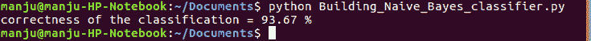
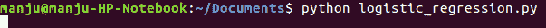
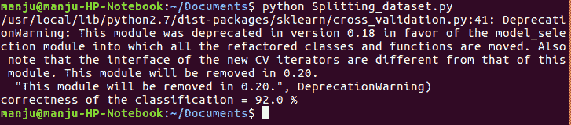
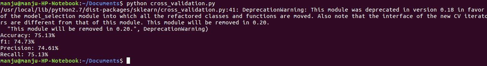
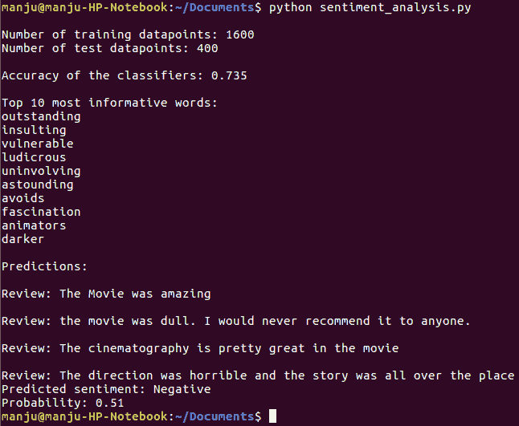
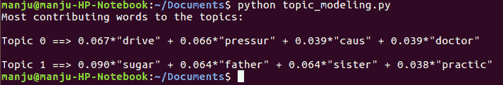

# 第四章：预测词语中的情感

本章介绍了以下食谱：

+   构建朴素贝叶斯分类器

+   逻辑回归分类器

+   将数据集拆分为训练和测试

+   使用交叉验证评估准确性

+   分析句子的情感

+   使用主题模型在文本中识别模式

+   情感分析的应用

# 构建朴素贝叶斯分类器

高斯贝叶斯分类器使用贝叶斯定理构建一个监督模型。

# 如何操作...

1.  导入以下包：

```py
from sklearn.naive_bayes import GaussianNB
import numpy as np
import matplotlib.pyplot as plt
```

1.  使用以下数据文件，其中包含以逗号分隔的算术数据：

```py
in_file = 'data_multivar.txt'
a = []
b = []
with open(in_file, 'r') as f:
  for line in f.readlines():
    data = [float(x) for x in line.split(',')]
    a.append(data[:-1])
    b.append(data[-1])
a = np.array(a)
b = np.array(b)
```

1.  构建一个朴素贝叶斯分类器：

```py
classification_gaussiannb = GaussianNB()
classification_gaussiannb.fit(a, b)
b_pred = classification_gaussiannb.predict(a)
```

1.  计算朴素贝叶斯算法的准确率：

```py
correctness = 100.0 * (b == b_pred).sum() / a.shape[0]
print "correctness of the classification =", round(correctness, 2), "%"
```

1.  绘制分类器的结果：

```py
def plot_classification(classification_gaussiannb, a , b):
  a_min, a_max = min(a[:, 0]) - 1.0, max(a[:, 0]) + 1.0
  b_min, b_max = min(a[:, 1]) - 1.0, max(a[:, 1]) + 1.0
  step_size = 0.01
  a_values, b_values = np.meshgrid(np.arange(a_min, a_max,   step_size), np.arange(b_min, b_max, step_size))
  mesh_output1 = classification_gaussiannb.predict(np.c_[a_values.ravel(), b_values.ravel()])
  mesh_output2 = mesh_output1.reshape(a_values.shape)
  plt.figure()
  plt.pcolormesh(a_values, b_values, mesh_output2, cmap=plt.cm.gray)
  plt.scatter(a[:, 0], a[:, 1], c=b , s=80, edgecolors='black', linewidth=1,cmap=plt.cm.Paired)
```

1.  指定图形的边界：

```py
plt.xlim(a_values.min(), a_values.max())
plt.ylim(b_values.min(), b_values.max())
*# specify the ticks on the X and Y axes* plt.xticks((np.arange(int(min(a[:, 0])-1), int(max(a[:, 0])+1), 1.0)))
plt.yticks((np.arange(int(min(a[:, 1])-1), int(max(a[:, 1])+1), 1.0)))
plt.show()
plot_classification(classification_gaussiannb, a, b)
```

执行朴素贝叶斯分类器后获得的准确度显示在下述截图：



# 参见

请参阅以下文章：

+   要了解分类器如何工作的示例，请参考以下链接：

[朴素贝叶斯分类器](https://en.wikipedia.org/wiki/Naive_Bayes_classifier)

+   要了解更多关于使用所提出分类器的文本分类信息，请参阅以下链接：

[`sebastianraschka.com/Articles/2014_naive_bayes_1.html`](http://sebastianraschka.com/Articles/2014_naive_bayes_1.html)

+   要了解更多关于朴素贝叶斯分类算法的信息，请参考以下链接：

[`software.ucv.ro/~cmihaescu/ro/teaching/AIR/docs/Lab4-NaiveBayes.pdf`](http://software.ucv.ro/~cmihaescu/ro/teaching/AIR/docs/Lab4-NaiveBayes.pdf)

# 逻辑回归分类器

这种方法适用于输出只能取两个值的情况，例如 0 或 1、通过/失败、赢/输、生/死、健康/生病等。在因变量有超过两个结果类别的情况下，可以使用多项逻辑回归进行分析。

# 如何做到这一点...

1.  安装完必需的包后，让我们构建一些训练标签：

```py
import numpy as np
from sklearn import linear_model
import matplotlib.pyplot as plt
a = np.array([[-1, -1], [-2, -1], [-3, -2], [1, 1], [2, 1], [3, 2]])
b = np.array([1, 1, 1, 2, 2, 2])
```

1.  初始化分类器：

```py
classification = linear_model.LogisticRegression(solver='liblinear', C=100)
classification.fit(a, b)
```

1.  绘制数据点和边距：

```py
def plot_classification(classification, a , b):
  a_min, a_max = min(a[:, 0]) - 1.0, max(a[:, 0]) + 1.0
  b_min, b_max = min(a[:, 1]) - 1.0, max(a[:, 1]) + 1.0 step_size = 0.01
  a_values, b_values = np.meshgrid(np.arange(a_min, a_max, step_size), np.arange(b_min, b_max, step_size))
  mesh_output1 = classification.predict(np.c_[a_values.ravel(), b_values.ravel()])
  mesh_output2 = mesh_output1.reshape(a_values.shape)
  plt.figure()
  plt.pcolormesh(a_values, b_values, mesh_output2, cmap=plt.cm.gray)
  plt.scatter(a[:, 0], a[:, 1], c=b , s=80, edgecolors='black',linewidth=1,cmap=plt.cm.Paired)
 # specify the boundaries of the figure  plt.xlim(a_values.min(), a_values.max())
  plt.ylim(b_values.min(), b_values.max())
 # specify the ticks on the X and Y axes  plt.xticks((np.arange(int(min(a[:, 0])-1), int(max(a[:, 0])+1), 1.0)))
  plt.yticks((np.arange(int(min(a[:, 1])-1), int(max(a[:, 1])+1), 1.0)))
  plt.show()
  plot_classification(classification, a, b)
```

执行逻辑回归的命令如下截图所示：



# 将数据集拆分为训练和测试

分割有助于将数据集划分为训练和测试序列。

# 如何做到这一点...

1.  将以下代码片段添加到相同的 Python 文件中：

```py
from sklearn import cross_validation
from sklearn.naive_bayes import GaussianNB
import numpy as np
import matplotlib.pyplot as plt
in_file = 'data_multivar.txt'
a = []
b = []
with open(in_file, 'r') as f:
  for line in f.readlines():
    data = [float(x) for x in line.split(',')]
    a.append(data[:-1])
    b.append(data[-1])
a = np.array(a)
b = np.array(b)
```

1.  分配 75%的数据用于训练和 25%的数据用于测试：

```py
a_training, a_testing, b_training, b_testing = cross_validation.train_test_split(a, b, test_size=0.25, random_state=5)
classification_gaussiannb_new = GaussianNB()
classification_gaussiannb_new.fit(a_training, b_training)
```

1.  评估分类器在测试数据上的性能：

```py
b_test_pred = classification_gaussiannb_new.predict(a_testing)
```

1.  计算分类系统的准确率：

```py
correctness = 100.0 * (b_testing == b_test_pred).sum() / a_testing.shape[0]
print "correctness of the classification =", round(correctness, 2), "%"
```

1.  绘制测试数据的点集和边界：

```py
def plot_classification(classification_gaussiannb_new, a_testing , b_testing):
  a_min, a_max = min(a_testing[:, 0]) - 1.0, max(a_testing[:, 0]) + 1.0
  b_min, b_max = min(a_testing[:, 1]) - 1.0, max(a_testing[:, 1]) + 1.0
  step_size = 0.01
  a_values, b_values = np.meshgrid(np.arange(a_min, a_max, step_size), np.arange(b_min, b_max, step_size))
  mesh_output = classification_gaussiannb_new.predict(np.c_[a_values.ravel(), b_values.ravel()])
  mesh_output = mesh_output.reshape(a_values.shape)
  plt.figure()
  plt.pcolormesh(a_values, b_values, mesh_output, cmap=plt.cm.gray)
  plt.scatter(a_testing[:, 0], a_testing[:, 1], c=b_testing , s=80, edgecolors='black', linewidth=1,cmap=plt.cm.Paired)
 # specify the boundaries of the figure  plt.xlim(a_values.min(), a_values.max())
  plt.ylim(b_values.min(), b_values.max())
  # specify the ticks on the X and Y axes
  plt.xticks((np.arange(int(min(a_testing[:, 0])-1), int(max(a_testing[:, 0])+1), 1.0)))
  plt.yticks((np.arange(int(min(a_testing[:, 1])-1), int(max(a_testing[:, 1])+1), 1.0)))
  plt.show()
plot_classification(classification_gaussiannb_new, a_testing, b_testing)
```

在以下屏幕截图中显示了在分割数据集时获得的准确性：



# 使用交叉验证评估准确性

交叉验证在机器学习中至关重要。最初，我们将数据集分为训练集和测试集。接下来，为了构建一个鲁棒的分类器，我们需要重复这个步骤，但需要避免模型过拟合。过拟合意味着我们在训练集上获得出色的预测结果，但在测试集上结果非常糟糕。过拟合会导致模型泛化能力差。

# 如何操作...

1.  导入所需的包：

```py
from sklearn import cross_validation
from sklearn.naive_bayes import GaussianNB
import numpy as np
in_file = 'cross_validation_multivar.txt'
a = []
b = []
with open(in_file, 'r') as f:
  for line in f.readlines():
    data = [float(x) for x in line.split(',')]
    a.append(data[:-1])
    b.append(data[-1])
a = np.array(a)
b = np.array(b)
classification_gaussiannb = GaussianNB()
```

1.  计算分类器的准确率：

```py
num_of_validations = 5
accuracy = cross_validation.cross_val_score(classification_gaussiannb, a, b, scoring='accuracy', cv=num_of_validations)
print "Accuracy: " + str(round(100* accuracy.mean(), 2)) + "%"
f1 = cross_validation.cross_val_score(classification_gaussiannb, a, b, scoring='f1_weighted', cv=num_of_validations)
print "f1: " + str(round(100*f1.mean(), 2)) + "%"
precision = cross_validation.cross_val_score(classification_gaussiannb,a, b, scoring='precision_weighted', cv=num_of_validations)
print "Precision: " + str(round(100*precision.mean(), 2)) + "%"
recall = cross_validation.cross_val_score(classification_gaussiannb, a, b, scoring='recall_weighted', cv=num_of_validations)
print "Recall: " + str(round(100*recall.mean(), 2)) + "%"
```

1.  执行交叉验证后得到的结果如下所示：



为了了解它在一个特定的句子数据集上的工作原理，请参考以下内容：

+   逻辑回归简介：

[机器学习中的逻辑回归](https://machinelearningmastery.com/logistic-regression-for-machine-learning/)

# 分析句子的情感

情感分析指的是寻找文本指定部分是正面、负面还是中性的过程。这项技术通常被认为可以了解人们对特定情况的想法。它评估消费者在不同形式中的情感，例如广告活动、社交媒体和电子商务客户。

# 如何做到这一点...

1.  创建一个新文件并导入选定的包：

```py
import nltk.classify.util
from nltk.classify import NaiveBayesClassifier
from nltk.corpus import movie_reviews
```

1.  描述一个提取特征的函数：

```py
def collect_features(word_list):
  word = []
  return dict ([(word, True) for word in word_list])
```

1.  将 NLTK 中的电影评论作为训练数据：

```py
if __name__=='__main__':
  plus_filenum = movie_reviews.fileids('pos')
  minus_filenum = movie_reviews.fileids('neg')
```

1.  将数据分为正面和负面评论：

```py
  feature_pluspts = [(collect_features(movie_reviews.words(fileids=[f])),
'Positive') for f in plus_filenum]
  feature_minuspts = [(collect_features(movie_reviews.words(fileids=[f])),
'Negative') for f in minus_filenum]
```

1.  将数据划分为训练集和测试集：

```py
  threshold_fact = 0.8
  threshold_pluspts = int(threshold_fact * len(feature_pluspts))
  threshold_minuspts = int(threshold_fact * len(feature_minuspts))
```

1.  提取特征：

```py
  feature_training = feature_pluspts[:threshold_pluspts] + feature_minuspts[:threshold_minuspts]
  feature_testing = feature_pluspts[threshold_pluspts:] + feature_minuspts[threshold_minuspts:]
  print "nNumber of training datapoints:", len(feature_training)
  print "Number of test datapoints:", len(feature_testing)
```

1.  考虑朴素贝叶斯分类器，并使用指定的目标对其进行训练：

```py
  # Train a Naive Bayes classifiers
  classifiers = NaiveBayesClassifier.train(feature_training)
  print "nAccuracy of the classifiers:",nltk.classify.util.accuracy(classifiers,feature_testing)
  print "nTop 10 most informative words:"
  for item in classifiers.most_informative_features()[:10]:print item[0]
 # Sample input reviews  in_reviews = [
  "The Movie was amazing",
  "the movie was dull. I would never recommend it to anyone.",
  "The cinematography is pretty great in the movie",
  "The direction was horrible and the story was all over the place"
  ]
  print "nPredictions:"
  for review in in_reviews:
    print "nReview:", review
  probdist = classifiers.prob_classify(collect_features(review.split()))
  predict_sentiment = probdist.max()
  print "Predicted sentiment:", predict_sentiment
  print "Probability:", round(probdist.prob(predict_sentiment), 2)
```

1.  情感分析得到的结果如下所示：



# 使用主题模型在文本中识别模式

主题建模指的是在文献信息中识别隐藏模式的过程。其目标是揭示一组文档中的一些隐藏主题配置。

# 如何做这件事...

1.  导入以下包：

```py
from nltk.tokenize import RegexpTokenizer
from nltk.stem.snowball import SnowballStemmer
from gensim import models, corpora
from nltk.corpus import stopwords
```

1.  加载输入数据：

```py
def load_words(in_file):
  element = []
  with open(in_file, 'r') as f:
    for line in f.readlines():
      element.append(line[:-1])
  return element
```

1.  文本预处理课程：

```py
classPreprocedure(object):
  def __init__(self):
 # Create a regular expression tokenizer    self.tokenizer = RegexpTokenizer(r'w+')
```

1.  获取一个停止词列表以终止程序执行：

```py
    self.english_stop_words= stopwords.words('english')
```

1.  创建一个 Snowball 词干提取器：

```py
    self.snowball_stemmer = SnowballStemmer('english')  
```

1.  定义一个函数以执行分词、停用词移除和词干提取：

```py
  def procedure(self, in_data):
# Tokenize the string
    token = self.tokenizer.tokenize(in_data.lower())
```

1.  从文本中删除停用词：

```py
    tokenized_stopwords = [x for x in token if not x in self.english_stop_words]
```

1.  在标记上实现词干提取：

```py
    token_stemming = [self.snowball_stemmer.stem(x) for x in tokenized_stopwords]
```

1.  返回处理后的标记：

```py
    return token_stemming
```

1.  从`main`函数中加载输入数据：

```py
if __name__=='__main__':
 # File containing input data  in_file = 'data_topic_modeling.txt'
 # Load words  element = load_words(in_file)
```

1.  创建一个对象：

```py
  preprocedure = Preprocedure()
```

1.  处理文件并提取标记：

```py
  processed_tokens = [preprocedure.procedure(x) for x in element]
```

1.  基于分词文档创建一个字典：

```py
  dict_tokens = corpora.Dictionary(processed_tokens)
  corpus = [dict_tokens.doc2bow(text) for text in processed_tokens]
```

1.  开发一个 LDA 模型，定义所需参数，并初始化 LDA 目标：

```py
  num_of_topics = 2
  num_of_words = 4
  ldamodel = models.ldamodel.LdaModel(corpus,num_topics=num_of_topics, id2word=dict_tokens, passes=25)
  print "Most contributing words to the topics:"
  for item in ldamodel.print_topics(num_topics=num_of_topics, num_words=num_of_words):
    print "nTopic", item[0], "==>", item[1]
```

1.  执行`topic_modelling.py`时得到的结果如下截图所示：



# 情感分析的应用

情感分析被用于社交媒体如 Facebook 和 Twitter，以找出公众对一个问题的情感（正面/负面）。它们也被用来确定人们对广告的情感，以及人们对你的产品、品牌或服务的感受。
