# 创建游戏和图形

在本章中，我们将涵盖以下主题：

+   使用 IDLE3 调试您的程序

+   使用鼠标在 Tkinter Canvas 上绘制线条

+   创建一个棒球游戏

+   创建一个滚屏游戏

# 简介

游戏通常是一个探索和扩展编程技能的绝佳方式，因为它们本身就具有内在的激励力量，促使你修改和改进你的创作，添加新功能，并创造新的挑战。它们也非常适合与他人分享你的想法，即使他们不感兴趣编程。

本章重点介绍如何使用 Tkinter Canvas 小部件在屏幕上创建和显示用户可以与之交互的对象。利用这些技术，可以创建各种游戏和应用，其局限性仅取决于您的创造力。

我们还将快速浏览一下如何在 IDLE3 中使用内置的调试器，这是一个在无需编写大量测试代码的情况下测试和开发程序的有用工具。

第一个示例演示了我们可以如何监控并利用鼠标来创建对象并在画布小部件上直接绘制。然后，我们创建了一个蝙蝠与球游戏，展示了如何控制对象的位置以及如何检测和响应它们之间的交互。最后，我们更进一步，使用 Tkinter 将我们自己的图形放置到画布小部件上，以创建一个俯视图寻宝游戏。

# 使用 IDLE3 调试您的程序

编程的一个关键方面是能够测试和调试你的代码，而实现这一目标的一个有用工具是调试器。IDLE 编辑器（确保你使用 IDLE3 以支持本书中使用的 Python 3 代码）包含一个基本的调试器。它允许你逐步执行你的代码，观察局部和全局变量的值，并设置断点。

# 如何做到这一点...

1.  要启用调试器，请启动 IDLE3 并从调试菜单中选择调试器；它将打开以下窗口（如果你当前正在运行某些代码，你需要先停止它）：

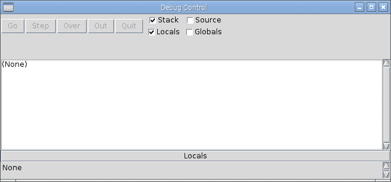

IDLE3 调试器窗口

1.  打开你想要测试的代码（通过文件 | 打开...），然后尝试运行它（*F5*）。你会发现代码无法启动，因为调试器已经自动停止在第一行。以下截图显示了调试器已经停止在`filehandler.py`代码的第一行，即`line 3: import os`：

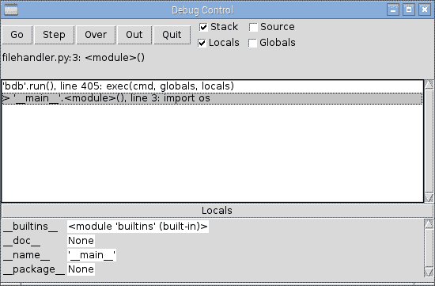

代码开始处的 IDLE3 调试器

# 它是如何工作的...

下面的截图显示的控制按钮允许您运行和/或跳过代码：

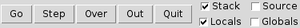

调试器控制

控制按钮的功能如下：

+   Go: 此按钮将正常执行代码。

+   步骤：此按钮将逐行执行代码块，然后再次停止。如果调用了一个函数，它将进入该函数，并允许你逐行执行该函数。

+   Over：此按钮类似于 Step 命令，但如果存在函数调用，它将执行整个函数并在下一行停止。

+   输出：此按钮将一直执行代码，直到它完成当前函数，继续执行直到你退出该函数。

+   退出：此按钮立即结束程序。

除了之前提到的控制之外，你可以在代码中直接设置断点和清除断点。断点是一个可以在代码中插入的标记（通过在编辑器窗口上右键单击），当调试器到达该标记时，它将始终中断（停止），如下面的截图所示：

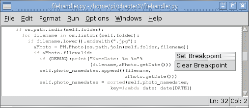

直接在您的代码中设置和清除断点

复选框（位于控制按钮的右侧）允许您选择在遍历代码或当调试器由于断点而停止时显示哪些信息。堆栈显示在主窗口中，类似于程序遇到未处理的异常时您会看到的情况。堆栈选项显示了为到达代码当前位置所调用的所有函数调用，直至它停止的行。源选项突出显示当前正在执行的代码行，在某些情况下，还包括导入模块中的代码（如果它们是非编译库）。

您还可以选择是否显示局部变量和/或全局变量。默认情况下，源代码和全局变量选项通常被禁用，因为如果需要显示大量数据，这可能会使过程变得相当缓慢。

Python 使用局部和全局变量的概念来定义作用域（变量在哪里以及何时可见和有效）。全局变量在文件的顶层定义，并且在其定义之后可以从代码的任何位置访问。然而，为了从除了顶层以外的任何地方更改其值，Python 需要你首先使用 global 关键字。如果没有使用 global 关键字，你将创建一个具有相同名称的局部副本（其值将在你退出代码块时丢失）。局部变量是在你在一个函数内创建变量时定义的；一旦超出函数范围，该变量就会被销毁，并且不再可见。

在栈数据之后是局部变量 – 在这种情况下，`aPhoto`、`filename` 和 `self`。然后（如果启用），我们拥有所有当前有效的全局值，提供了关于程序状态的详细信息（例如 `DATE = 1`、`DEBUG = True`、`FOLDERSONLY = True` 等）：

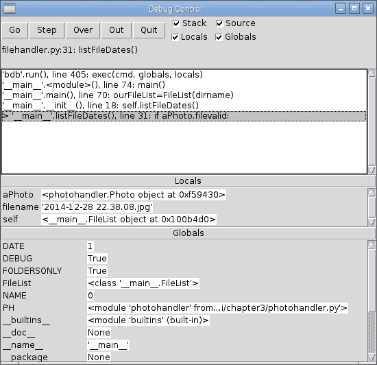

调试器中的 Stack（栈）、Locals（局部变量）和 Globals（全局变量）选项

调试器并不特别先进，因为它不允许你展开复杂对象，例如`photohandler.Photo`对象，以查看它包含的数据。然而，如果需要，你可以在测试期间调整你的代码，并将你想要观察的数据分配给一些临时变量。

值得学习如何使用调试器，因为它是一种更简单的方法来追踪特定问题并检查事物是否按预期运行。

# 使用鼠标在 Tkinter Canvas 上绘制线条

Tkinter Canvas 小部件提供了一个区域来创建和绘制对象。以下脚本演示了如何使用鼠标事件与 Tkinter 进行交互。通过检测鼠标点击，我们可以使用 Tkinter 绘制一条跟随鼠标移动的线：

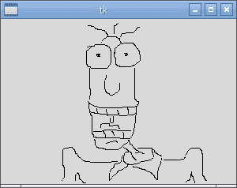

使用 Tkinter 的一个简单绘图应用程序

# 准备就绪

如前所述，我们需要安装 Tkinter，并且要么是 Raspbian 桌面正在运行（通过命令行执行`startx`），要么是带有 X11 转发和一个正在运行的 X 服务器的 SSH 会话（参见第一章，*使用 Raspberry Pi 3 计算机入门*）。我们还需要连接一个鼠标。

# 如何做到这一点...

创建以下脚本，`painting.py`：

```py
#!/usr/bin/python3 
#painting.py 
import tkinter as TK 

#Set defaults 
btn1pressed = False 
newline = True 

def main(): 
  root = TK.Tk() 
  the_canvas = TK.Canvas(root) 
  the_canvas.pack() 
  the_canvas.bind("<Motion>", mousemove) 
  the_canvas.bind("<ButtonPress-1>", mouse1press) 
  the_canvas.bind("<ButtonRelease-1>", mouse1release) 
  root.mainloop() 

def mouse1press(event): 
  global btn1pressed 
  btn1pressed = True 

def mouse1release(event): 
  global btn1pressed, newline 
  btn1pressed = False 
  newline = True 

def mousemove(event): 
  if btn1pressed == True: 
    global xorig, yorig, newline 
    if newline == False: 
      event.widget.create_line(xorig,yorig,event.x,event.y, 
                               smooth=TK.TRUE) 
    newline = False 
    xorig = event.x 
    yorig = event.y 

if __name__ == "__main__": 
  main() 
#End
```

# 它是如何工作的...

Python 代码创建了一个包含名为`Canvas`对象的 Tkinter 窗口

`the_canvas`. 我们在这里使用 `bind` 函数，它将此小部件（`the_canvas`）上发生的特定事件绑定到特定动作或按键。在这种情况下，我们绑定了鼠标的 `<Motion>` 函数，以及第一个鼠标按钮的点击和释放（`<ButtonPress-1>` 和 `<ButtonRelease-1>`）。然后，这些事件分别用于调用 `mouse1press()`、`mouse1release()` 和 `mousemove()` 函数。

这里逻辑是使用`mouse1press()`和`mouse1release()`函数跟踪鼠标按钮的状态。

如果鼠标按钮已被点击，`mousemove()` 函数将检查我们是在绘制一条新线（我们为此设置了新的坐标）还是继续一条旧线（我们从上一个坐标绘制一条线到触发 `mousemove()` 的当前事件的坐标）。我们只需确保在鼠标按钮释放时重置到 `newline` 命令，以重置线的起始位置。

# 创建一个棒球游戏

使用`canvas`绘图工具和检测物体碰撞，可以创建一个经典的蝙蝠和球游戏。用户将能够控制绿色的挡板，使用左右光标键瞄准球，击打砖块，直到它们全部被摧毁：

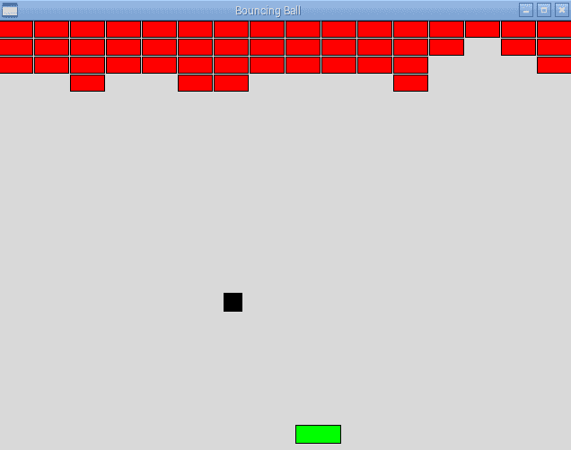

正在进行的游戏

# 准备中

此示例需要图形输出，因此您必须将屏幕和键盘连接到树莓派，或者如果从另一台计算机远程连接，则使用 X11 转发和 X 服务器。

# 如何做到这一点...

创建以下脚本，`bouncingball.py`：

1.  首先，导入`tkinter`和`time`模块，并定义相关常量。

    游戏图形：

```py
#!/usr/bin/python3 
# bouncingball.py 
import tkinter as TK 
import time 

VERT,HOREZ=0,1 
xTOP,yTOP = 0,1 
xBTM,yBTM = 2,3 
MAX_WIDTH,MAX_HEIGHT = 640,480 
xSTART,ySTART = 100,200 
BALL_SIZE=20 
RUNNING=True 
```

1.  接下来，创建用于关闭程序、移动挡板左右以及计算球的方向的函数：

```py
def close(): 
  global RUNNING 
  RUNNING=False 
  root.destroy() 

def move_right(event): 
  if canv.coords(paddle)[xBTM]<(MAX_WIDTH-7): 
    canv.move(paddle, 7, 0) 

def move_left(event): 
  if canv.coords(paddle)[xTOP]>7: 
    canv.move(paddle, -7, 0) 

def determineDir(ball,obj): 
  global delta_x,delta_y 
  if (ball[xTOP] == obj[xBTM]) or (ball[xBTM] ==  
      obj[xTOP]): 
    delta_x = -delta_x 
  elif (ball[yTOP] == obj[yBTM]) or (ball[yBTM] ==  
        obj[yTOP]): 
    delta_y = -delta_y 
```

1.  设置 `tkinter` 窗口并定义 `canvas`：

```py
root = TK.Tk() 
root.title("Bouncing Ball") 
root.geometry('%sx%s+%s+%s' %(MAX_WIDTH, MAX_HEIGHT, 100, 100)) 
root.bind('<Right>', move_right) 
root.bind('<Left>', move_left) 
root.protocol('WM_DELETE_WINDOW', close) 

canv = TK.Canvas(root, highlightthickness=0) 
canv.pack(fill='both', expand=True)
```

1.  将边框、`球`和`挡板`对象添加到`画布`中：

```py
top = canv.create_line(0, 0, MAX_WIDTH, 0, fill='blue', 
                       tags=('top')) 
left = canv.create_line(0, 0, 0, MAX_HEIGHT, fill='blue', 
                        tags=('left')) 
right = canv.create_line(MAX_WIDTH, 0, MAX_WIDTH, MAX_HEIGHT, 
                         fill='blue', tags=('right')) 
bottom = canv.create_line(0, MAX_HEIGHT, MAX_WIDTH, MAX_HEIGHT, 
                          fill='blue', tags=('bottom')) 

ball = canv.create_rectangle(0, 0, BALL_SIZE, BALL_SIZE, 
                             outline='black', fill='black',  
                             tags=('ball')) 
paddle = canv.create_rectangle(100, MAX_HEIGHT - 30, 150, 470, 
                               outline='black',  
                               fill='green', tags=('rect')) 
```

1.  绘制所有砖块并设置球和挡板的位置：

```py
brick=list() 
for i in range(0,16): 
  for row in range(0,4): 
    brick.append(canv.create_rectangle(i*40, row*20, 
                 ((i+1)*40)-2, ((row+1)*20)-2, 
                 outline='black', fill='red', 
                 tags=('rect'))) 

delta_x = delta_y = 1 
xold,yold = xSTART,ySTART 
canv.move(ball, xold, yold) 
```

1.  为游戏创建主循环以检测碰撞并处理挡板和球体的移动：

```py
while RUNNING: 
  objects = canv.find_overlapping(canv.coords(ball)[0], 
                                  canv.coords(ball)[1], 
                                  canv.coords(ball)[2], 
                                  canv.coords(ball)[3]) 

  #Only change the direction once (so will bounce off 1st 
  # block even if 2 are hit) 
  dir_changed=False 
  for obj in objects: 
    if (obj != ball): 
      if dir_changed==False: 
        determineDir(canv.coords(ball),canv.coords(obj)) 
        dir_changed=True 
      if (obj >= brick[0]) and (obj <= brick[len(brick)-1]): 
        canv.delete(obj) 
      if (obj == bottom): 
        text = canv.create_text(300,100,text="YOU HAVE MISSED!") 
        canv.coords(ball, (xSTART,ySTART, 
                    xSTART+BALL_SIZE,ySTART+BALL_SIZE)) 
        delta_x = delta_y = 1 
        canv.update() 
        time.sleep(3) 
        canv.delete(text) 
  new_x, new_y = delta_x, delta_y 
  canv.move(ball, new_x, new_y) 

  canv.update() 
  time.sleep(0.005) 
#End 
```

# 它是如何工作的...

我们创建了一个 640 x 480 像素的 Tkinter 应用程序，并将`<Right>`和`<Left>`光标键绑定到`move_right()`和`move_left()`函数。我们使用`root.protocol('WM_DELETE_WINDOW', close)`来检测窗口何时关闭，以便我们可以干净地退出程序（通过`close()`函数，该函数将`RUNNING`设置为`False`）。

我们随后将一个用于存放所有对象的 Canvas 小部件添加到应用程序中。我们创建了以下对象：`top`、`left`、`right` 和 `bottom`。这些构成了我们游戏区域的边界。`canvas` 坐标在左上角为 `0,0`，在右下角为 `640,480`，因此可以确定每一边的起始和结束坐标（使用 `canv.create_line(xStart, yStart, xEnd, yEnd)`）：

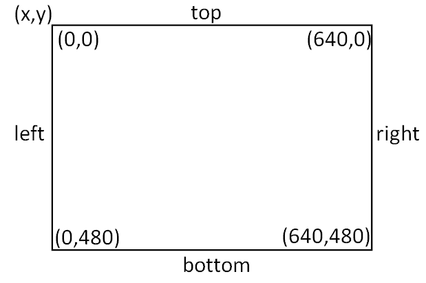

Canvas 小部件的坐标

你还可以给对象添加多个 `标签`；`标签` 通常用于定义对象的特定动作或行为。例如，当特定的对象或积木被击中时，它们允许发生不同类型的事件。我们将在下一个示例中看到 `标签` 的更多用途。

接下来，我们定义球和桨的物体，这些物体是通过使用`canv.create_rectangle()`添加的。这需要两组坐标，用于定义图像的对角线（在这种情况下，是左上角和右下角）。

Tkinter 矩形由两个角坐标定义：

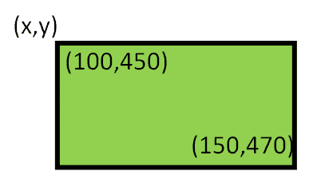

Tkinter 矩形示例

最后，我们可以创建砖块了！

我们希望我们的砖块宽度为 40 x 20 像素，这样我们可以在 640 像素的游戏区域（分为四行）中放置 16 块砖。我们可以创建一个带有自动定义位置的砖块对象列表，如下面的代码所示：

```py
brick=list() 
for i in range(0,16): 
  for row in range(0,4): 
    brick.append(canv.create_rectangle(i*40, row*20,  
                 ((i+1)*40)-2, ((row+1)*20)-2, outline='black',  
                 fill='red', tags=('rect'))) 
```

通过将砖块略微缩小（`-2`）以创建一个小缝隙，从而产生类似砖块的效果：

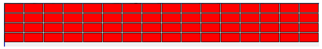

4 x 16 行块

我们现在将在开始主控制循环之前设置默认设置。球的移动将由`delta_x`和`delta_y`控制，这些值在每个周期中会加到或从球的当前位置中减去。

接下来，我们设置球的起始位置，并使用`canv.move()`函数将球移动相应的距离。`move()`函数将`100`加到球对象的`x`和`y`坐标上，该球对象最初是在位置`0,0`创建的。

现在一切都已经设置好了，主循环可以运行；这将检查球是否没有碰到任何东西（使用`canv.find_overlapping()`函数），对`delta_x`或`delta_y`值进行任何调整，然后将它们应用到移动球到下一个位置。

`delta_x` 和 `delta_y` 的符号决定了球的方向。正值会使球斜向下向右移动，而 `-delta_x` 将使其向左移动——是向下还是向上取决于 `delta_y` 是正值还是负值。

球被移动后，我们使用 `canv.update()` 来重新绘制对显示所做的任何更改，而 `time.sleep()` 允许在再次检查和移动球之前有一个短暂的延迟。

使用 `canv.find_overlapping()` 函数来检测对象碰撞。此函数返回一个列表，其中包含被发现在由提供的坐标定义的矩形边界重叠的 `canvas` 对象。例如，在正方形球体的案例中，是否有任何 `canvas` 对象的坐标位于球体占据的空间内？请参见以下内容：

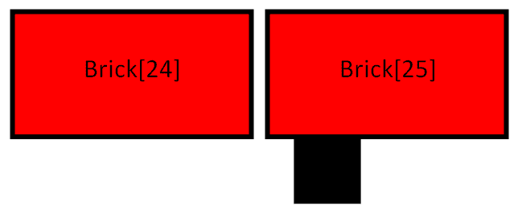

检查对象以确定它们是否相互重叠

如果球被发现在与其他物体重叠，例如墙壁、球拍或一块或多块砖，我们需要确定球接下来应该向哪个方向移动。由于我们使用球的坐标作为检查区域，球总是会被列出，因此在我们检查物体列表时，我们可以忽略它们。

我们使用`dir_changed`标志来确保在同时击中两个砖块时，我们在移动球之前不会改变方向两次。否则，它会导致球继续沿同一方向移动，即使它已经与砖块发生了碰撞。

因此，如果球体与另一个物体重叠，我们可以使用球体和物体的坐标调用`determineDir()`方法来计算出新的方向应该是什么。

当球与物体碰撞时，我们希望球从其上弹开；幸运的是，这很容易模拟，因为我们只需要改变`delta_x`或`delta_y`的符号，具体取决于我们是否击中了侧面或顶部/底部。如果球击中了另一个物体的底部，这意味着我们之前是向上移动的，现在应该向下移动。然而，我们将在`x`轴上继续以相同方向移动（无论是向左还是向右，或者只是向上）。这可以从以下代码中看出：

```py
if (ball[xTOP] == obj[xBTM]) or (ball[xBTM] == obj[xTOP]): 
    delta_x = -delta_x 
```

`determineDir()` 函数会查看球体和物体的坐标，并寻找左右 `x` 坐标或上下 `y` 坐标的匹配。这足以判断碰撞是在侧面还是顶部/底部，我们可以相应地设置 `delta_x` 或 `delta_y` 的符号，如下面的代码所示：

```py
if (obj >= brick[0]) and (obj <= brick[-1]): 
    canv.delete(obj) 
```

接下来，我们可以通过检查重叠的对象 ID 是否位于第一个和最后一个 ID 砖块之间来确定是否遇到了障碍。如果是砖块，我们可以使用`canv.delete()`将其移除。

Python 允许索引值循环，而不是访问无效内存，因此索引值 `-1` 将为我们提供列表中的最后一个项目。我们用这个来引用最后一个砖块为 `brick [-1]`。

我们还会检查被覆盖的对象是否是底线（在这种情况下，玩家用球拍没接到球），因此会短暂显示一条简短信息。我们重置`ball`的位置和`delta_x`/`delta_y`值。`canv.update()`函数确保在删除信息（三秒后）之前，显示先被刷新。

最后，球通过`delta_x`/`delta_y`距离移动，并且显示更新。这里添加了小的延迟以减少更新速率和使用的 CPU 时间。否则，你会发现如果你的树莓派将 100%的精力用于运行程序，它将变得无响应。

当用户按下光标键时，会调用`move_right()`和`move_left()`函数。它们会检查挡板对象的位置，如果挡板不在边缘，挡板将会相应地移动。如果球击中挡板，碰撞检测将确保球反弹，就像它击中了一块砖块一样。

您可以通过为每个被摧毁的方块添加分数来进一步扩展这个游戏，让玩家拥有有限的生命值，当玩家错过球时生命值会减少，甚至可以编写一些代码来读取新的砖块布局。

# 创建一个滚屏游戏

通过在我们的程序中使用对象和图像，我们可以创建许多类型的二维图形游戏。

在这个菜谱中，我们将创建一个寻宝游戏，玩家试图找到隐藏的宝藏（通过按下 *Enter* 键来挖掘）。每次宝藏未被找到时，玩家都会得到一个关于宝藏距离的线索；然后玩家可以使用光标键四处移动并搜索，直到找到宝藏：

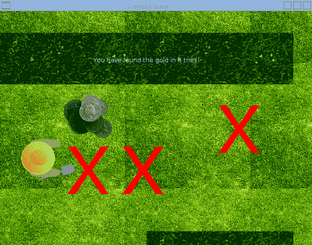

在你自己的滚动游戏中挖掘宝藏

尽管这是一个游戏的基本概念，但它可以很容易地扩展，包括多个布局、陷阱和需要避免的敌人，甚至可能还有额外的工具或需要解决的谜题。只需对图形进行一些调整，角色就可以探索地牢、太空船，或者跳跃在云层之间，收集彩虹！

# 准备就绪

以下示例使用了多个图片；这些图片作为本书资源的一部分提供。您需要将这九张图片放置在与 Python 脚本相同的目录中。

所需的图片文件可以在本章的代码包中查看。

# 如何做到这一点...

创建以下脚本，`scroller.py`：

1.  首先导入所需的库和参数：

```py
#!/usr/bin/python3 
# scroller.py 
import tkinter as TK 
import time 
import math 
from random import randint 

STEP=7 
xVAL,yVAL=0,1 
MAX_WIDTH,MAX_HEIGHT=640,480 
SPACE_WIDTH=MAX_WIDTH*2 
SPACE_HEIGHT=MAX_HEIGHT*2 
LEFT,UP,RIGHT,DOWN=0,1,2,3 
SPACE_LIMITS=[0,0,SPACE_WIDTH-MAX_WIDTH, 
              SPACE_HEIGHT-MAX_HEIGHT] 
DIS_LIMITS=[STEP,STEP,MAX_WIDTH-STEP,MAX_HEIGHT-STEP] 
BGN_IMG="bg.gif" 
PLAYER_IMG=["playerL.gif","playerU.gif", 
            "playerR.gif","playerD.gif"] 
WALL_IMG=["wallH.gif","wallV.gif"] 
GOLD_IMG="gold.gif" 
MARK_IMG="mark.gif" 
newGame=False 
checks=list() 
```

1.  提供处理玩家移动的功能：

```py
def move_right(event): 
  movePlayer(RIGHT,STEP) 
def move_left(event): 
  movePlayer(LEFT,-STEP) 
def move_up(event): 
  movePlayer(UP,-STEP) 
def move_down(event): 
  movePlayer(DOWN,STEP) 

def foundWall(facing,move): 
  hitWall=False 
  olCoords=[canv.coords(player)[xVAL], 
            canv.coords(player)[yVAL], 
            canv.coords(player)[xVAL]+PLAYER_SIZE[xVAL], 
            canv.coords(player)[yVAL]+PLAYER_SIZE[yVAL]] 
  olCoords[facing]+=move 
  objects = canv.find_overlapping(olCoords[0],olCoords[1], 
                                  olCoords[2],olCoords[3]) 
  for obj in objects: 
    objTags = canv.gettags(obj) 
    for tag in objTags: 
      if tag == "wall": 
        hitWall=True 
  return hitWall 

def moveBackgnd(movement): 
  global bg_offset 
  bg_offset[xVAL]+=movement[xVAL] 
  bg_offset[yVAL]+=movement[yVAL] 
  for obj in canv.find_withtag("bg"): 
    canv.move(obj, -movement[xVAL], -movement[yVAL]) 

def makeMove(facing,move): 
  if facing == RIGHT or facing == LEFT: 
    movement=[move,0] #RIGHT/LEFT 
    bgOffset=bg_offset[xVAL] 
    playerPos=canv.coords(player)[xVAL] 
  else: 
    movement=[0,move] #UP/DOWN 
    bgOffset=bg_offset[yVAL] 
    playerPos=canv.coords(player)[yVAL] 
  #Check Bottom/Right Corner 
  if facing == RIGHT or facing == DOWN:  
    if (playerPos+PLAYER_SIZE[xVAL]) < DIS_LIMITS[facing]: 
      canv.move(player, movement[xVAL], movement[yVAL]) 
    elif bgOffset < SPACE_LIMITS[facing]: 
      moveBackgnd(movement) 
  else: 
    #Check Top/Left Corner 
    if (playerPos) > DIS_LIMITS[facing]: 
      canv.move(player, movement[xVAL], movement[yVAL]) 
    elif bgOffset > SPACE_LIMITS[facing]: 
      moveBackgnd(movement) 

def movePlayer(facing,move): 
  hitWall=foundWall(facing,move) 
  if hitWall==False: 
    makeMove(facing,move) 
  canv.itemconfig(player,image=playImg[facing])
```

1.  添加功能以检查玩家距离隐藏的金币有多远：

```py
def check(event): 
  global checks,newGame,text 
  if newGame: 
    for chk in checks: 
      canv.delete(chk) 
    del checks[:] 
    canv.delete(gold,text) 
    newGame=False 
    hideGold() 
  else: 
    checks.append( 
                  canv.create_image(canv.coords(player)[xVAL], 
                  canv.coords(player)[yVAL], 
                  anchor=TK.NW, image=checkImg, 
                  tags=('check','bg'))) 
    distance=measureTo(checks[-1],gold) 
    if(distance<=0): 
      canv.itemconfig(gold,state='normal') 
      canv.itemconfig(check,state='hidden') 
      text = canv.create_text(300,100,fill="white", 
                              text=("You have found the gold in"+  
                              " %d tries!"%len(checks))) 
      newGame=True 
    else: 
      text = canv.create_text(300,100,fill="white", 
                              text=("You are %d steps away!"%distance)) 
      canv.update() 
      time.sleep(1) 
      canv.delete(text) 

def measureTo(objectA,objectB): 
  deltaX=canv.coords(objectA)[xVAL]- 
                     canv.coords(objectB)[xVAL] 
  deltaY=canv.coords(objectA)[yVAL]- 
                     canv.coords(objectB)[yVAL] 
  w_sq=abs(deltaX)**2 
  h_sq=abs(deltaY)**2 
  hypot=math.sqrt(w_sq+h_sq) 
  return round((hypot/5)-20,-1)
```

1.  添加功能以帮助找到一个藏匿金子的地点：

```py
def hideGold(): 
  global gold 
  goldPos=findLocationForGold() 
  gold=canv.create_image(goldPos[xVAL], goldPos[yVAL], 
                         anchor=TK.NW, image=goldImg, 
                         tags=('gold','bg'), 
                         state='hidden') 

def findLocationForGold(): 
  placeGold=False 
  while(placeGold==False): 
    goldPos=[randint(0-bg_offset[xVAL], 
             SPACE_WIDTH-GOLD_SIZE[xVAL]-bg_offset[xVAL]), 
             randint(0-bg_offset[yVAL], 
             SPACE_HEIGHT-GOLD_SIZE[yVAL]-bg_offset[yVAL])] 
    objects = canv.find_overlapping(goldPos[xVAL], 
                                    goldPos[yVAL], 
                                    goldPos[xVAL]+GOLD_SIZE[xVAL], 
                                    goldPos[yVAL]+GOLD_SIZE[yVAL]) 
    findNewPlace=False 
    for obj in objects: 
      objTags = canv.gettags(obj) 
      for tag in objTags: 
        if (tag == "wall") or (tag == "player"): 
          findNewPlace=True 
    if findNewPlace == False: 
      placeGold=True 
  return goldPos 
```

1.  创建 Tkinter 应用程序窗口并绑定键盘事件：

```py
root = TK.Tk() 
root.title("Overhead Game") 
root.geometry('%sx%s+%s+%s' %(MAX_WIDTH,  
                              MAX_HEIGHT,  
                              100, 100)) 
root.resizable(width=TK.FALSE, height=TK.FALSE) 
root.bind('<Right>', move_right) 
root.bind('<Left>', move_left) 
root.bind('<Up>', move_up) 
root.bind('<Down>', move_down) 
root.bind('<Return>', check) 

canv = TK.Canvas(root, highlightthickness=0) 
canv.place(x=0,y=0,width=SPACE_WIDTH,height=SPACE_HEIGHT)
```

1.  初始化所有游戏对象（背景瓷砖、玩家、墙壁等）

    the gold):

```py
#Create background tiles 
bgnImg = TK.PhotoImage(file=BGN_IMG) 
BGN_SIZE = bgnImg.width(),bgnImg.height() 
background=list() 
COLS=int(SPACE_WIDTH/BGN_SIZE[xVAL])+1 
ROWS=int(SPACE_HEIGHT/BGN_SIZE[yVAL])+1 
for col in range(0,COLS): 
  for row in range(0,ROWS): 
    background.append(canv.create_image(col*BGN_SIZE[xVAL], 
                      row*BGN_SIZE[yVAL], anchor=TK.NW, 
                      image=bgnImg, 
                      tags=('background','bg'))) 
bg_offset=[0,0] 

#Create player 
playImg=list() 
for img in PLAYER_IMG: 
  playImg.append(TK.PhotoImage(file=img)) 
#Assume images are all same size/shape 
PLAYER_SIZE=playImg[RIGHT].width(),playImg[RIGHT].height() 
player = canv.create_image(100,100, anchor=TK.NW, 
                           image=playImg[RIGHT], 
                           tags=('player')) 

#Create walls 
wallImg=[TK.PhotoImage(file=WALL_IMG[0]), 
         TK.PhotoImage(file=WALL_IMG[1])] 
WALL_SIZE=[wallImg[0].width(),wallImg[0].height()] 
wallPosH=[(0,WALL_SIZE[xVAL]*1.5), 
          (WALL_SIZE[xVAL],WALL_SIZE[xVAL]*1.5), 
          (SPACE_WIDTH-WALL_SIZE[xVAL],WALL_SIZE[xVAL]*1.5), 
          (WALL_SIZE[xVAL],SPACE_HEIGHT-WALL_SIZE[yVAL])] 
wallPosV=[(WALL_SIZE[xVAL],0),(WALL_SIZE[xVAL]*3,0)] 
wallPos=[wallPosH,wallPosV] 
wall=list() 
for i,img in enumerate(WALL_IMG): 
  for item in wallPos[i]: 
    wall.append(canv.create_image(item[xVAL],item[yVAL], 
                anchor=TK.NW, image=wallImg[i], 
                tags=('wall','bg'))) 

#Place gold 
goldImg = TK.PhotoImage(file=GOLD_IMG) 
GOLD_SIZE=[goldImg.width(),goldImg.height()] 
hideGold() 
#Check mark 
checkImg = TK.PhotoImage(file=MARK_IMG) 
```

1.  最后，启动 `mainloop()` 命令以允许 Tkinter 监视事件：

```py
#Wait for actions from user 
root.mainloop() 
#End 
```

# 它是如何工作的...

如前所述，我们创建了一个新的 Tkinter 应用程序，其中包含一个 `Canvas` 小部件，这样我们就可以添加所有的游戏对象。我们确保我们绑定了右键、左键、上键、下键和 *Enter* 键，这些将在游戏中作为我们的控制键。

首先，我们将背景图片(`bg.gif`)放置到`Canvas`小部件上。我们计算可以沿长度和宽度方向容纳的图片数量，以铺满整个画布空间，并使用合适的坐标定位它们。

接下来，我们创建玩家图像（通过创建`playImg`，一个包含玩家可以转向的每个方向的 Tkinter 图像对象的列表）并将其放置在画布上。

我们现在创建墙壁，其位置由`wallPosH`和`wallPosV`列表定义。这些可以通过精确坐标来定义，也许甚至可以从文件中读取，以提供一个简单的方法来加载不同级别的布局，如果需要的话。通过遍历列表，水平墙壁和垂直墙壁的图像被放置在画布上。

要完成布局，我们只需将金币隐藏在某个地方即可。使用`hideGold()`函数，我们可以随机确定一个合适的位置来放置金币。在`findLocationForGold()`函数中，我们使用`randint(0,value)`来生成一个介于`0`和`value`之间的伪随机数（它不是完全随机的，但对于这个用途已经足够好了）。在我们的例子中，我们想要的值介于`0`和画布空间的边缘之间，减去金币图像的大小以及可能已经应用到画布上的任何`bg_offset`。这确保了它不会超出屏幕边缘。然后我们检查潜在的位置，使用`find_overlapping()`函数来查看是否有带有`wall`或`player`标签的对象挡在路上。如果是这样，我们选择一个新的位置。否则，我们在画布上放置金币，但使用`state="hidden"`值，这将使其从视图中隐藏。

我们随后创建`checkImg`（一个 Tkinter 图像），在检查黄金时使用它来标记我们已检查的区域。最后，我们只需等待用户按下其中一个键。

当按下任意一个光标键时，角色将在屏幕上移动。玩家的移动由`movePlayer()`函数决定；它首先会检查玩家是否试图移动到墙壁上，然后（在`makeMove()`函数内）确定玩家是否位于显示或画布空间的边缘。

每当按下光标键时，我们使用图中所示的逻辑来确定要执行的操作：

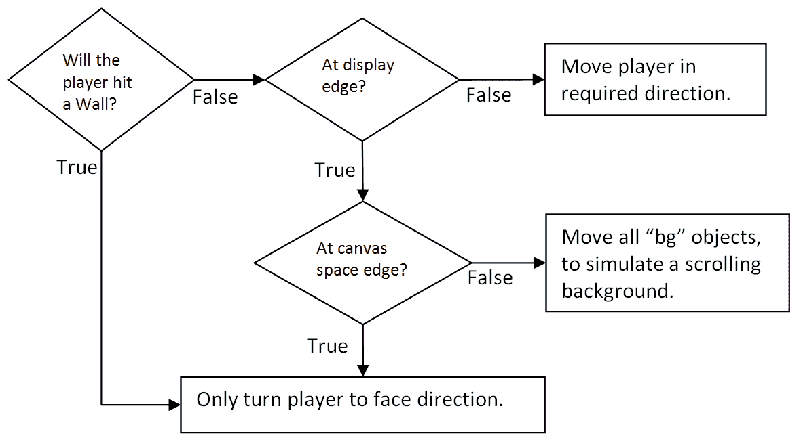

光标键按下动作逻辑

`foundWall()` 函数通过检查玩家图像覆盖区域内的任何带有 `wall` 标签的对象，以及玩家将要移动到的区域的一点点额外空间，来确定玩家是否会撞到墙壁。以下图表展示了如何确定 `olCoords` 坐标：

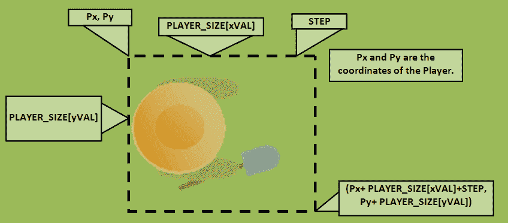

olCoords 坐标确定

`makeMove()` 函数检查玩家是否将移动到显示器的边缘（由 `DIS_LIMITS` 定义），以及他们是否位于画布空间的边缘（由 `SPACE_LIMITS` 定义）。在显示器内，玩家可以朝向光标的方向移动，或者画布空间内所有标记为 `bg` 的对象都朝相反方向移动，模拟玩家背后的滚动。这是通过 `moveBackground()` 函数实现的。

当玩家按下 *Enter* 键时，我们希望检查当前位置是否有金子。使用 `measureTo()` 函数，比较玩家的位置和金子的位置（计算每个的 `x` 和 `y` 坐标之间的距离，如下所示图所示）：

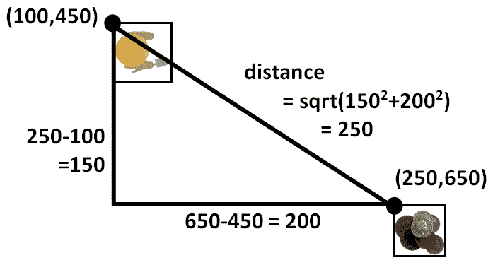

玩家和金币距离计算

结果被缩放以提供一个大致的指示，说明玩家距离金子有多远。如果距离大于零，我们显示玩家距离金子的距离，并留下一个十字来表示我们检查过的地方。如果玩家找到了金子，我们会显示一条消息说明这一点，并将`newGame`设置为`True`。下次玩家按下*Enter*键时，带有十字标记的地方将被移除，金子将被重新放置到新的位置。

再次隐藏了金子，玩家准备重新开始！
