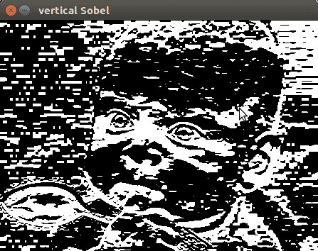

# 第六章：在图像中检测边缘和轮廓

本章介绍了以下食谱：

+   加载、显示和保存图片

+   图像翻转和缩放

+   侵蚀和膨胀

+   图像分割

+   图像模糊和锐化

+   图像边缘检测

+   直方图均衡化

+   在图像中检测角点

# 简介

图像处理在几乎所有工程和医学应用中都发挥着至关重要的作用，用于从灰度/彩色图像中提取和评估感兴趣的区域。图像处理方法包括预处理、特征提取和分类。预处理用于提高图像质量；这包括自适应阈值、对比度增强、直方图均衡化和边缘检测。特征提取技术用于从图像中提取显著特征，这些特征可以随后用于分类。

在菜谱中介绍了构建图像预处理方案的步骤。

# 加载、显示和保存图片

本节介绍了如何通过 OpenCV-Python 处理图像。此外，我们还讨论了如何加载、显示和保存图像。

# 如何做到这一点...

1.  导入计算机视觉包 - `cv2`:

```py
import cv2 
```

1.  使用内置的 `imread` 函数读取图像：

```py
image = cv2.imread('image_1.jpg')
```

1.  使用内置的 `imshow` 函数显示原始图像：

```py
cv2.imshow("Original", image) 
```

1.  等待直到按下任意键：

```py
cv2.waitKey(0) 
```

1.  使用内置的 `imwrite` 函数保存图片：

```py
cv2.imwrite("Saved Image.jpg", image) 
```

1.  执行 Python 程序 `Load_Display_Save.py` 所使用的命令如下：


1.  执行`Load_Display_Save.py`后得到的结果如下所示：


# 图像翻转

在图像翻转操作中，我们可以水平翻转、垂直翻转、水平翻转和垂直翻转输入图像。

# 如何做到这一点...

1.  导入计算机视觉包 - `cv2`:

```py
import cv2 
```

1.  使用内置的 `imread` 函数读取图像：

```py
image = cv2.imread('image_2.jpg')
```

1.  使用内置的 `imshow` 函数显示原始图像：

```py
cv2.imshow("Original", image) 
```

1.  等待直到按下任意键：

```py
cv2.waitKey(0) 
```

1.  在测试图像上执行所需的操作：

```py
# cv2.flip is used to flip images 
# Horizontal flipping of images using value '1' 
flipping = cv2.flip(image, 1) 
```

1.  显示水平翻转的图像：

```py
# Display horizontally flipped image 
cv2.imshow("Horizontal Flipping", flipping) 
```

1.  等待直到按下任意键：

```py
cv2.waitKey(0) 
```

1.  对输入图像进行垂直翻转：

```py
# Vertical flipping of images using value '0' 
flipping = cv2.flip(image, 0) 
```

1.  显示垂直翻转的图像：

```py
cv2.imshow("Vertical Flipping", flipping) 
```

1.  等待直到按下任意键：

```py
cv2.waitKey(0) 
```

1.  显示处理后的图像：

```py
# Horizontal & Vertical flipping of images using value '-1' 
flipping = cv2.flip(image, -1) 
# Display horizontally & vertically flipped image 
cv2.imshow("Horizontal & Vertical Flipping", flipping) 
# Wait until any key is pressed 
cv2.waitKey(0)
```

1.  停止执行并显示结果：

```py
# Close all windows 
cv2.destroyAllWindows() 
```

1.  执行 `Flipping.py` Python 程序所使用的命令如下：


1.  执行`Flipping.py`后获得的原始图像和水平翻转图像如下所示：


以下是水平翻转的图片：


1.  垂直和水平翻转的图像，在执行`Flipping.py`后获得，如下所示：


沿着水平和垂直翻转的图片：


# 图像缩放

图像缩放用于根据需求修改输入图像的尺寸。在 OpenCV 中，通常使用三种类型的缩放算子，它们是立方插值、面积插值和线性插值。

# 如何做到这一点...

1.  创建一个新的 Python 文件并导入以下包：

```py
# Scaling (Resizing) Images - Cubic, Area, Linear Interpolations 
# Interpolation is a method of estimating values between known data points  
# Import Computer Vision package - cv2 
import cv2 
# Import Numerical Python package - numpy as np 
import numpy as np 
```

1.  使用内置的 `imread` 函数读取图像：

```py
image = cv2.imread('image_3.jpg') 
```

1.  使用内置的 `imshow` 函数显示原始图像：

```py
cv2.imshow("Original", image) 
```

1.  等待直到按下任意键：

```py
cv2.waitKey() 
```

1.  根据操作员的指令调整图像大小：

```py
# cv2.resize(image, output image size, x scale, y scale, interpolation) 
```

1.  使用三次插值调整图像大小：

```py
# Scaling using cubic interpolation 
scaling_cubic = cv2.resize(image, None, fx=.75, fy=.75, interpolation = cv2.INTER_CUBIC) 
```

1.  显示输出图像：

```py
# Display cubic interpolated image 
cv2.imshow('Cubic Interpolated', scaling_cubic) 
```

1.  等待直到按下任意键：

```py
cv2.waitKey()
```

1.  使用区域插值调整图像大小：

```py
# Scaling using area interpolation 
scaling_skewed = cv2.resize(image, (600, 300), interpolation = cv2.INTER_AREA) 
```

1.  显示输出图像：

```py
# Display area interpolated image 
cv2.imshow('Area Interpolated', scaling_skewed)  
```

1.  等待操作员的指令：

```py
# Wait until any key is pressed 
cv2.waitKey() 
```

1.  使用线性插值调整图像大小：

```py
# Scaling using linear interpolation 
scaling_linear  = cv2.resize(image, None, fx=0.5, fy=0.5, interpolation = cv2.INTER_LINEAR) 
```

1.  显示输出图像：

```py
# Display linear interpolated image 
cv2.imshow('Linear Interpolated', scaling_linear)  
```

1.  等待直到按下任意键：

```py
cv2.waitKey() 
```

1.  完成图像缩放任务后，终止程序执行：

```py
# Close all windows 
cv2.destroyAllWindows() 
```

1.  执行`Scaling.py` Python 程序的命令如下所示：


1.  用于缩放的原始图像如下所示：


1.  执行`Scaling.py`文件后得到的线性插值输出如下所示：


1.  执行`Scaling.py`文件后得到的面积插值输出如下所示：


1.  执行`Scaling.py`文件后得到的立方插值输出如下所示：


# 侵蚀与膨胀

腐蚀和膨胀是形态学操作。腐蚀移除图像中物体边界的像素，而膨胀则向图像中物体边界添加像素。

# 如何做到这一点...

1.  导入计算机视觉包 – `cv2`:

```py
import cv2 
```

1.  导入数值 Python 包 – `numpy as np`:

```py
import numpy as np 
```

1.  使用内置的 `imread` 函数读取图像：

```py
image = cv2.imread('image_4.jpg')
```

1.  使用内置的 `imshow` 函数显示原始图像：

```py
cv2.imshow("Original", image) 
```

1.  等待直到按下任意键：

```py
cv2.waitKey(0) 
```

1.  给定形状和类型，用 1 填充它：

```py
# np.ones(shape, dtype) 
# 5 x 5 is the dimension of the kernel, uint8: is an unsigned integer (0 to 255) 
kernel = np.ones((5,5), dtype = "uint8") 
```

1.  `cv2.erode` 是用于腐蚀的内置函数：

```py
# cv2.erode(image, kernel, iterations) 
erosion = cv2.erode(image, kernel, iterations = 1) 
```

1.  使用内置的 `imshow` 函数显示腐蚀后的图像：

```py
cv2.imshow("Erosion", erosion) 
```

1.  等待直到按下任意键：

```py
cv2.waitKey(0) 
```

1.  `cv2.dilate` 是用于膨胀操作的内置函数：

```py
# cv2.dilate(image, kernel, iterations) 
dilation = cv2.dilate(image, kernel, iterations = 1) 
```

1.  使用内置的 `imshow` 函数显示放缩后的图像：

```py
cv2.imshow("Dilation", dilation) 
```

1.  等待直到按下任意键：

```py
cv2.waitKey(0) 
```

1.  关闭所有窗口：

```py
cv2.destroyAllWindows()
```

1.  执行`Erosion_Dilation.py`文件所使用的命令如下：


1.  用于执行`Erosion_Dilation.py`文件输入的图像如下所示：


1.  执行`Erosion_Dilation.py`文件后获得的侵蚀图像如下所示：


1.  执行`Erosion_Dilation.py`文件后得到的膨胀图像如下所示：


# 图像分割

分割是将图像划分为不同区域的过程。轮廓是围绕物体边界的线条或曲线。本节讨论了使用轮廓进行图像分割的内容。

# 如何做到这一点...

1.  导入计算机视觉包 - `cv2`:

```py
import cv2 
# Import Numerical Python package - numpy as np 
import numpy as np 
```

1.  使用内置的 `imread` 函数读取图像：

```py
image = cv2.imread('image_5.jpg') 
```

1.  使用内置的 `imshow` 函数显示原始图像：

```py
cv2.imshow("Original", image) 
```

1.  等待直到按下任意键：

```py
cv2.waitKey(0) 
```

1.  执行 `Canny` 边缘检测系统：

```py
# cv2.Canny is the built-in function used to detect edges 
# cv2.Canny(image, threshold_1, threshold_2) 
canny = cv2.Canny(image, 50, 200) 
```

1.  使用内置的 `imshow` 函数显示边缘检测输出图像：

```py
cv2.imshow("Canny Edge Detection", canny) 
```

1.  等待直到按下任意键：

```py
cv2.waitKey(0)
```

1.  执行轮廓检测系统：

```py
# cv2.findContours is the built-in function to find contours 
# cv2.findContours(canny, contour retrieval mode, contour approximation mode) 
# contour retrieval mode: cv2.RETR_LIST (retrieves all contours)  
# contour approximation mode: cv2.CHAIN_APPROX_NONE (stores all boundary points) 
contours, hierarchy = cv2.findContours(canny, cv2.RETR_LIST, cv2.CHAIN_APPROX_NONE) 
```

1.  在图像上绘制轮廓：

```py
# cv2.drawContours is the built-in function to draw contours 
# cv2.drawContours(image, contours, index of contours, color, thickness) 
cv2.drawContours(image, contours, -1, (255,0,0), 10) 
# index of contours = -1 will draw all the contours 
```

1.  显示图像的草图轮廓：

```py
# Display contours using imshow built-in function 
cv2.imshow("Contours", image) 
```

1.  等待直到按下任意键：

```py
cv2.waitKey() 
```

1.  终止程序并显示结果：

```py
# Close all windows 
cv2.destroyAllWindows() 
```

1.  执行`Image_Segmentation.py`文件后得到的结果如下所示：


以下是边缘检测的输出：


# 模糊和锐化图像

模糊和锐化是用于增强输入图像的图像处理操作。

# 如何做到这一点...

1.  导入计算机视觉包 - `cv2`:

```py
import cv2 
# Import Numerical Python package - numpy as np 
import numpy as np 
```

1.  使用内置的 `imread` 函数读取图像：

```py
image = cv2.imread('image_6.jpg') 
```

1.  使用内置的 `imshow` 函数显示原始图像：

```py
cv2.imshow("Original", image) 
```

1.  等待直到按下任意键：

```py
cv2.waitKey(0) 
```

1.  使用模糊操作执行像素级动作：

```py
# Blurring images: Averaging, cv2.blur built-in function 
# Averaging: Convolving image with normalized box filter 
# Convolution: Mathematical operation on 2 functions which produces third function. 
# Normalized box filter having size 3 x 3 would be: 
# (1/9)  [[1, 1, 1], 
#         [1, 1, 1], 
#         [1, 1, 1]] 
blur = cv2.blur(image,(9,9)) # (9 x 9) filter is used  
```

1.  显示模糊图像：

```py
cv2.imshow('Blurred', blur) 
```

1.  等待直到按下任意键：

```py
cv2.waitKey(0)
```

1.  使用锐化操作执行像素级动作：

```py
# Sharpening images: Emphasizes edges in an image 
kernel = np.array([[-1,-1,-1],  
                   [-1,9,-1],  
                   [-1,-1,-1]]) 
# If we don't normalize to 1, image would be brighter or darker respectively     
# cv2.filter2D is the built-in function used for sharpening images 
# cv2.filter2D(image, ddepth, kernel) 
# ddepth = -1, sharpened images will have same depth as original image 
sharpened = cv2.filter2D(image, -1, kernel) 
```

1.  显示锐化的图像：

```py
cv2.imshow('Sharpened', sharpened) 
```

1.  等待直到按下任意键：

```py
cv2.waitKey(0) 
```

1.  终止程序执行：

```py
# Close all windows 
cv2.destroyAllWindows() 
```

1.  执行`Blurring_Sharpening.py` Python 程序文件的命令如下所示：


1.  用于执行`Blurring_Sharpening.py`文件输入的图像如下所示：


1.  执行`Blurring_Sharpening.py`文件后得到的模糊图像如下所示：


1.  执行`Blurring_Sharpening.py`文件后得到的锐化图像如下所示：


# 图像边缘检测

边缘检测用于检测图像中的边界。它提供了关于形状和区域特性的详细信息。这包括周长、主轴尺寸和副轴尺寸。

# 如何操作...

1.  导入必要的包：

```py
import sys 
import cv2 
import numpy as np 
```

1.  读取输入图像：

```py
in_file = sys.argv[1] 
image = cv2.imread(in_file, cv2.IMREAD_GRAYSCALE) 
```

1.  实现 Sobel 边缘检测方案：

```py
horizontal_sobel = cv2.Sobel(image, cv2.CV_64F, 1, 0, ksize=5) 
vertical_sobel = cv2.Sobel(image, cv2.CV_64F, 0, 1, ksize=5) 
laplacian_img = cv2.Laplacian(image, cv2.CV_64F) 
canny_img = cv2.Canny(image, 30, 200) 
```

1.  显示输入图像及其对应输出：

```py
cv2.imshow('Original', image) 
cv2.imshow('horizontal Sobel', horizontal_sobel) 
cv2.imshow('vertical Sobel', vertical_sobel) 
cv2.imshow('Laplacian image', laplacian_img) 
cv2.imshow('Canny image', canny_img) 
```

1.  等待操作员的指令：

```py
cv2.waitKey() 
```

1.  显示输入图像及其对应的结果：

```py
cv2.imshow('Original', image) 
cv2.imshow('horizontal Sobel', horizontal_sobel) 
cv2.imshow('vertical Sobel', vertical_sobel) 
cv2.imshow('Laplacian image', laplacian_img) 
cv2.imshow('Canny image', canny_img) 
```

1.  等待操作员的指令：

```py
cv2.waitKey()
```

1.  执行`Detecting_edges.py` Python 程序文件以及输入图像（`baby.jpg`）所使用的命令如下所示：


1.  执行`Detecting_edges.py`文件后得到的输入图像和水平 Sobel 滤波器输出如下所示：


1.  执行`Detecting_edges.py`文件后得到的垂直 Sobel 滤波器输出和拉普拉斯图像输出如下所示：



以下为拉普拉斯图像输出：


1.  执行`Detecting_edges.py`文件后得到的`Canny`边缘检测输出如下所示：


# 它是如何工作的...

读者可以参考以下文档来了解边缘检测及其对测试图像的影响：

[`citeseerx.ist.psu.edu/viewdoc/summary?doi=10.1.1.301.927`](http://citeseerx.ist.psu.edu/viewdoc/summary?doi=10.1.1.301.927)

# 参见

请参阅以下文档：

+   [边缘检测的概念](https://www.tutorialspoint.com/dip/concept_of_edge_detection.htm)

# 直方图均衡化

直方图均衡化用于增强图像的可见性和对比度。它通过改变图像强度来实现。这些过程在这里有清晰的描述。

# 如何操作……

1.  导入必要的包：

```py
import sys 
import cv2 
import numpy as np 
```

1.  加载输入图像：

```py
in_file = sys.argv[1] 
image = cv2.imread(in_file) 
```

1.  将 RGB 图像转换为灰度图：

```py
image_gray = cv2.cvtColor(image, cv2.COLOR_BGR2GRAY) 
cv2.imshow('Input grayscale image', image_gray) 
```

1.  调整灰度图像的直方图：

```py
image_gray_histoeq = cv2.equalizeHist(image_gray) 
cv2.imshow('Histogram equalized - grayscale image', image_gray_histoeq) 
```

1.  调整 RGB 图像的直方图：

```py
image_yuv = cv2.cvtColor(image, cv2.COLOR_BGR2YUV) 
image_yuv[:,:,0] = cv2.equalizeHist(image_yuv[:,:,0]) 
image_histoeq = cv2.cvtColor(image_yuv, cv2.COLOR_YUV2BGR) 
```

1.  显示输出图像：

```py
cv2.imshow('Input image', image) 
cv2.imshow('Histogram equalized - color image', image_histoeq) 
cv2.waitKey()
```

1.  执行`histogram.py` Python 程序文件的命令，以及输入图像（`finger.jpg`），如下所示：


1.  用于执行`histogram.py`文件输入的图像如下所示：


1.  执行`histogram.py`文件后得到的直方图均衡化灰度图像如下所示：


1.  执行`histogram.py`文件后得到的直方图均衡化彩色图像如下所示：


# 在图像中检测角点

角点是用于提取图像中特殊特征的边界，这些特征可以推断出图像的内容。角点检测常用于图像配准、视频跟踪、图像拼接、运动检测、3D 建模、全景拼接和物体识别。

# 如何操作...

1.  导入必要的包：

```py
import sys 
import cv2 
import numpy as np 
```

1.  加载输入图像：

```py
in_file = sys.argv[1] 
image = cv2.imread(in_file) 
cv2.imshow('Input image', image) 
image_gray1 = cv2.cvtColor(image, cv2.COLOR_BGR2GRAY) 
image_gray2 = np.float32(image_gray1) 
```

1.  实现哈里斯角点检测方案：

```py
image_harris1 = cv2.cornerHarris(image_gray2, 7, 5, 0.04) 
```

1.  放大输入图像并构建角点：

```py
image_harris2 = cv2.dilate(image_harris1, None) 
```

1.  实现图像阈值化：

```py
image[image_harris2 > 0.01 * image_harris2.max()] = [0, 0, 0] 
```

1.  显示输入图像：

```py
cv2.imshow('Harris Corners', image) 
```

1.  等待操作员的指令：

```py
cv2.waitKey() 
```

1.  执行`Detecting_corner.py` Python 程序文件以及输入图像（`box.jpg`）所使用的命令如下所示：


1.  用于执行`Detecting_corner.py`文件的输入图像如下所示：


1.  执行`Detecting_corner.py`文件后获得的 Harris 角点如下所示：


为了了解输入图像的工作原理，请参考以下内容：

+   图像角点检测涉及在给定图片中寻找边缘/角点。它可以用于从灰度和 RGB 图片中提取关键形状特征。请参阅关于边缘和角点检测的这篇综述论文：

[`pdfs.semanticscholar.org/24dd/6c2c08f5601e140aad5b9170e0c7485f6648.pdf`](https://pdfs.semanticscholar.org/24dd/6c2c08f5601e140aad5b9170e0c7485f6648.pdf).
