# 第七章：创建 3D 图形

在本章中，我们将涵盖以下主题：

+   开始学习 3D 坐标和顶点

+   创建和导入 3D 模型

+   创建一个可探索的 3D 世界

+   构建三维地图和迷宫

# 简介

原始树莓派（搭载一款**博通 BCM2835 处理器**）的核心芯片最初是为了作为移动和嵌入式应用的**图形处理单元**（**GPU**）而设计的。由于芯片上还有额外的空间，因此添加了驱动树莓派大部分功能的 ARM 核心；这使得这个强大的 GPU 能够作为**片上系统**（**SoC**）解决方案使用。

一个 SoC 是一个集成了所有必要的电子电路和计算机或电子系统部件的集成服务微芯片，它用于智能手机或可穿戴计算机，集成在一个**集成电路**（**IC**）上。

如您所想，如果那个原始的 ARM 核心（**ARM1176JZF-S**，它是**ARMv6**架构）仅占 Raspberry Pi 芯片的一小部分，那么您认为 GPU 必须表现相当出色是正确的。

Raspberry Pi 3 的核心处理器已经升级（升级到了**Broadcom BCM2837**处理器）；它现在包含四个 ARM 核心（**Cortex A53 ARMv8A**），每个都比原始的**ARMv6**更强大。与上一代相同的 GPU 相结合，Raspberry Pi 3 在执行构建 3D 环境所需的计算方面装备得更加完善。然而，尽管 Raspberry Pi 3 将更快地加载示例，但一旦生成 3D 模型，两种芯片版本的表现都相当出色。

**VideoCore IV GPU**由 48 个专门设计的处理器组成，其中一些提供对 1080p 高清视频编码和解码的支持，而另一些则支持**OpenGL ES 2.0**，这为 3D 图形提供了快速的运算。据说其图形处理能力相当于苹果 iPhone 4S 和原始的微软 Xbox。如果你在树莓派上运行**Quake 3**或**OpenArena**，这一点会更加明显（详情请访问[`www.raspberrypi.org/openarena-for-raspberry-pi`](http://www.raspberrypi.org/openarena-for-raspberry-pi)）。

在本章中，我希望向大家展示，虽然你可以通过使用树莓派的 ARM 端执行操作来取得很多成就，但如果你冒险进入隐藏 GPU 的那一侧，你可能会发现这个小巧的电脑比最初看起来还有更多潜力。

由`pi3d`团队（帕特里克·冈特、汤姆·斯威利、蒂姆·斯凯尔曼等人）创建的`pi3d`库提供了一种通过创建 3D 图形来利用 GPU 的方法。

`pi3d` 维基和文档页面可以在以下链接找到：[`pi3d.github.io/html/index.html.`](http://pi3d.github.io/html/index.html)

支持和开发小组可以在以下链接找到：[`groups.google.com/forum/#!forum/pi3d.`](https://groups.google.com/forum/#!forum/pi3d)

该库包含许多功能，因此在下述示例中不可能涵盖所有可用内容。建议您也花些时间尝试一下`pi3d`演示。要发现更多用于创建和处理 3D 图形的选项，您可以查看构成库本身的某些 Python 模块（在文档或 GitHub 上的代码中描述，网址为[`github.com/pi3d/pi3d.github.com`](https://github.com/pi3d/pi3d.github.com)）。希望这一章能向您介绍足够的概念，以展示您可利用的一些原始潜力。

# 开始学习 3D 坐标和顶点

我们周围的世界是三维的，因此为了模拟世界的一部分，我们可以创建一个 3D 表示并在我们的 2D 屏幕上显示它。

树莓派使我们能够模拟一个 3D 空间，在其中放置 3D 对象，并从选定的视角观察它们。我们将使用 GPU 将 3D 视图表示为 2D 图像，以便在屏幕上显示。

以下示例将向您展示我们如何使用`pi3d`（一个适用于 Raspberry Pi 的 OpenGL ES 库）来放置一个单独的 3D 对象并在 3D 空间中显示它。然后我们将允许鼠标围绕对象旋转视图：

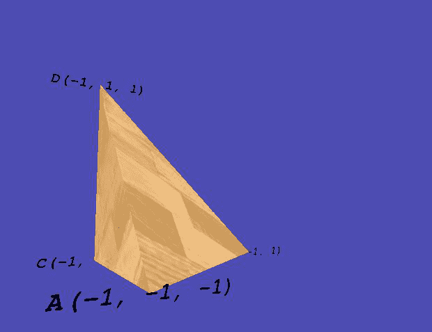

单个 3D 对象

# 准备中

Raspberry Pi 必须直接连接到显示器，无论是通过 HDMI 还是模拟视频输出。GPU 渲染的 3D 图形将仅在本地显示器上显示，即使您通过网络远程连接到 Raspberry Pi。您还需要使用本地连接的鼠标进行控制（然而，通过 SSH 连接键盘控制也是可行的）。

第一次使用 `pi3d`，我们需要按照以下步骤下载和安装它：

1.  `pi3d` 库使用 Pillow，这是与 Python 3 兼容的 Python 图像库版本，用于导入模型中使用的图形（例如纹理）

    以及背景)。

Pillow 的安装已在第三章的“准备就绪”部分中介绍，即*使用 Python 进行自动化和生产效率提升*。

安装命令显示在下面的代码中（如果您之前已经安装过，它将跳过它们并继续）：

```py
sudo apt-get update
sudo apt-get install python3-pip
sudo apt-get install libjpeg-dev
sudo pip-3.2 install pillow  
```

1.  我们现在可以使用 `pip` 通过以下命令安装 `pi3d`：

```py
sudo pip-3.2 install pi3d    
```

`pi3d` 团队正在持续开发和改进这个库；如果你遇到问题，可能意味着新版本与之前的版本不兼容。

您也可以在附录中的“**硬件和软件列表**”中查看确认您所使用的`pi3d`版本，并在需要的情况下安装列表中列出的相同版本。或者，您可以通过 Google 群组联系`pi3d`团队；他们将乐意提供帮助！

从 GitHub 网站获取`pi3d`演示，如下命令行所示。您需要大约 90 MB 的空闲空间来下载和解压文件：

`cd ~`

`wget  https://github.com/pi3d/pi3d_demos/archive/master.zip`

`  unzip master.zip`

`  rm master.zip`

你会发现演示已经解压到 `pi3d_demos-master`。

默认情况下，演示文件预期位于 `home/pi/pi3d`；因此，我们将重命名此目录为 `pi3d`，如下命令所示：

```py
mv pi3d_demos-master pi3d  
```

1.  最后，检查 Raspberry Pi 的内存分割。运行 `raspi-config` (`sudo raspi-config`) 并确保您的内存分割设置为 128 MB。（如果您之前更改过，则只需这样做，因为 128 MB 是默认值。）这确保您为 GPU 分配了足够的 RAM，以便在需要时能够处理大量的 3D 对象。

1.  测试一切是否运行正常。你现在应该能够运行`pi3d_demos-master`目录中的任何脚本。有关它们如何工作的详细信息，请参阅`pi3d`维基页面([`pi3d.github.io/html/ReadMe.html`](http://pi3d.github.io/html/ReadMe.html))。为了获得最佳性能，建议从命令提示符（不加载桌面）运行脚本：

```py
cd pi3d
python3 Raspberry_Rain.py     
```

`pi3d.Keyboard` 对象也支持通过 SSH 进行键盘控制（参见第一章，*使用 Raspberry Pi 3 计算机入门*中的*通过 SSH 远程连接到 Raspberry Pi 并使用 X11 转发*部分）。

配置您自己的脚本设置。由于我们将使用一些来自演示的纹理和模型，建议您在`pi3d`目录内创建您的脚本。如果您有一个与默认 Pi 账户不同的用户名，您将需要调整`/pi3d/demo.py`文件。通过编辑文件，将`USERNAME`部分替换为您自己的用户名：

`  nano ~/pi3d/demo.py`

`  import sys`

`  sys.path.insert(1, '/home/USERNAME/pi3d')`

如果你想要将文件移动到其他位置，请确保在包含所需资源文件正确路径的文件夹中添加`demo.py`的副本。

# 如何做到这一点...

创建以下 `3dObject.py` 脚本：

```py
#!/usr/bin/python3 
""" Create a 3D space with a Tetrahedron inside and rotate the 
    view around using the mouse. 
""" 
from math import sin, cos, radians 

import demo 
import pi3d 

KEY = {'ESC':27,'NONE':-1} 

DISPLAY = pi3d.Display.create(x=50, y=50) 
#capture mouse and key presses 
mykeys = pi3d.Keyboard() 
mymouse = pi3d.Mouse(restrict = False) 
mymouse.start() 

def main(): 
  CAMERA = pi3d.Camera.instance() 
  tex = pi3d.Texture("textures/stripwood.jpg") 
  flatsh = pi3d.Shader("uv_flat") 

  #Define the coordinates for our shape (x,y,z)  
  A = (-1.0,-1.0,-1.0) 
  B = (1.0,-1.0,1.0) 
  C = (-1.0,-1.0,1.0) 
  D = (-1.0,1.0,1.0) 
  ids = ["A","B","C","D"] 
  coords = [A,B,C,D] 
  myTetra = pi3d.Tetrahedron(x=0.0, y=0.0, z=0.0, 
                             corners=(A,B,C,D)) 
  myTetra.set_draw_details(flatsh,[tex]) 
  # Load ttf font and set the font to black 
  arialFont = pi3d.Font("fonts/FreeMonoBoldOblique.ttf", 
                        "#000000") 
  mystring = [] 
  #Create string objects to show the coordinates 
  for i,pos in enumerate(coords): 
    mystring.append(pi3d.String(font=arialFont, 
                            string=ids[i]+str(pos), 
                            x=pos[0], y=pos[1],z=pos[2])) 
    mystring.append(pi3d.String(font=arialFont, 
                            string=ids[i]+str(pos), 
                            x=pos[0], y=pos[1],z=pos[2], ry=180)) 
  for string in mystring: 
    string.set_shader(flatsh) 

  camRad = 4.0 # radius of camera position 
  rot = 0.0 # rotation of camera 
  tilt = 0.0 # tilt of camera 
  k = KEY['NONE'] 
  omx, omy = mymouse.position() 

  # main display loop 
  while DISPLAY.loop_running() and not k == KEY['ESC']: 
    k = mykeys.read() 
    mx, my = mymouse.position() 
    rot -= (mx-omx)*0.8 
    tilt += (my-omy)*0.8 
    omx = mx 
    omy = my 

    CAMERA.reset() 
    CAMERA.rotate(-tilt, rot, 0) 
    CAMERA.position((camRad * sin(radians(rot)) * 
                     cos(radians(tilt)),  
                     camRad * sin(radians(tilt)),  
                     -camRad * cos(radians(rot)) * 
                     cos(radians(tilt)))) 
    #Draw the Tetrahedron 
    myTetra.draw() 
    for string in mystring: 
      string.draw() 

try: 
  main() 
finally: 
  mykeys.close() 
  mymouse.stop() 
  DISPLAY.destroy() 
  print("Closed Everything. END") 
#End 
```

运行脚本，请使用 `python3 3dObject.py`。

# 它是如何工作的...

我们导入`math`模块（用于计算角度，以便根据鼠标移动来控制视图）。我们还导入了 demo 模块，它仅提供此示例中**着色器**和**纹理**的路径。

我们首先定义一些关键元素，这些元素将由 `pi3d` 用于生成和显示我们的对象。我们将放置对象的空间是 `pi3d.Display` 对象；这定义了空间的大小，并初始化屏幕以生成和显示 OpenGL ES 图形。

接下来，我们定义一个`pi3d.Camera`对象，这将允许我们定义如何查看

在我们的空间内的对象。为了渲染我们的对象，我们定义了一个要应用到表面的纹理和一个将纹理应用到对象上的着色器。着色器用于将所有效果和光照应用到对象上，并且它被编码为使用 GPU 的 OpenGL ES 核心而不是 ARM 处理器。

我们使用 `pi3d.keyboard()` 和 `pi3d.mouse()` 定义了 `keyboard` 和 `mouse` 对象，以便我们可以响应键盘和鼠标输入。`mouse` 对象的 `restrict` 标志允许鼠标的绝对位置超出屏幕限制（这样我们就可以连续旋转我们的 3D 对象）。当主循环运行时，会检查是否按下了 *Esc* 键，然后关闭所有内容（包括调用 `DISPLAY.destroy()` 释放屏幕）。我们使用 `try: finally:` 方法来确保正确关闭显示，即使在 `main()` 中发生异常也是如此。

鼠标移动是通过`mymouse.position()`在主显示循环中收集的，该函数返回*x*和*y*坐标。*x*和*y*移动的差值用于围绕对象旋转。

鼠标移动决定了摄像机的位置和角度。对鼠标前后位置的任何调整都用于将其移动到物体上方或下方，并改变摄像机的角度（使用`倾斜`），使其始终指向物体。同样，任何侧向移动都将使用`CAMERA.reset()`函数使摄像机围绕物体移动。这确保了显示更新摄像机视图以显示新位置，`CAMERA.rotate()`用于改变角度，并使用`CAMERA.position()`将摄像机移动到距离物体中心`camRad`单位的某个位置。

我们将绘制一个称为**四面体**的三维物体，它是由四个三角形组成的形状，形成一个底面为三角形的金字塔。该形状的四个角（三个在底部周围，一个在顶部）将由三维坐标**A**、**B**、**C**和**D**定义，如下所示图所示：

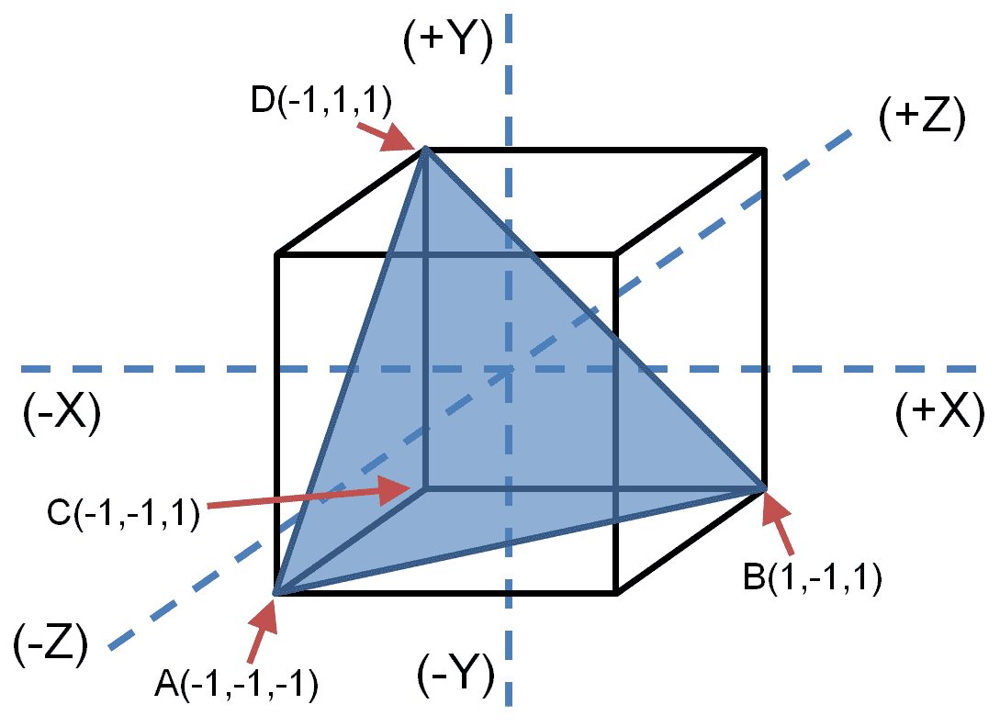

将四面体放置在三维坐标系中

`pi3d.Tetrahedron` 对象通过指定四个点的 *x*、*y* 和 *z* 坐标来定位其在空间中的位置，然后指定将连接形成构成该形状的四个三角形的角。

使用 `set_draw_details(flatsh,[text])`，我们应用我们希望使用的着色器（们）和对象的纹理（们）。在我们的例子中，我们只使用了一个纹理，但某些着色器可以使用多个纹理以产生复杂效果。

为了帮助突出坐标的位置，我们将通过设置字符串文本来指定 ID 和坐标，并在它们旁边放置一些`pi3d.String`对象，将其放置在所需的位置。对于每个位置，我们将创建两个字符串对象，一个朝前，另一个朝后（`ry=180`在*Y*轴上旋转对象 180 度）。`pi3d.String`对象是单面的，所以如果我们只有一面朝前，当视图旋转时，从后面看就不会可见，而且会直接消失（此外，如果可见，文本也会是反的）。再次强调，我们使用`flatsh`着色器通过`set_shader()`字符串对象来渲染它。

现在剩下的工作就是绘制我们的四面体和绳子对象，同时检查任何键盘事件。每次`while`循环完成时，都会调用`DISPLAY.loop_running()`，这将根据需要更新显示，调整相机设置。

# 还有更多...

除了介绍如何在三维空间中绘制基本对象之外，前面的示例还使用了以下在三维图形编程中使用的四个关键元素。

# 相机

照相机代表我们在三维空间中的视角；探索和查看更多空间的一种方法是通过移动照相机。`Camera`类定义如下：

```py
pi3d.Camera.Camera(at=(0, 0, 0), eye=(0, 0, -0.1), 
                   lens=None, is_3d=True, scale=1.0) 
```

摄像机通过提供两个位置来定义，一个是要看的对象（通常是我们希望看到的对象，由`at`定义），另一个是观察的位置（对象的方位，由`eye`定义）。摄像机的其他特性，如其视野（`lens`）等，可以通过默认设置进行调整或使用。

如果我们没有在我们的显示中定义相机，系统将创建一个默认相机，该相机指向原点（即显示的中心，也就是`0,0,0`），并稍微位于其前方（`0,0,-0.1`）。

查看有关相机模块的`pi3d`文档以获取更多详细信息。

# 着色器

着色器非常有用，因为它们允许将将纹理和光照应用到物体上的复杂工作卸载到更强大的 Raspberry Pi GPU 上。`Shader`类定义如下：

```py
class pi3d.Shader.Shader(shfile=None, vshader_source=None, 
                                      fshader_source=None) 
```

这允许你在文件中指定一个着色器文件（`shfile`）以及所需的特定顶点和片段着色器（如果需要的话）。

`pi3d` 库中包含几个着色器，其中一些允许使用多个纹理来实现反射、近距离细节和透明效果。着色器的实现方式将决定光线和纹理如何应用于对象（在某些情况下，例如 `uv_flat`，着色器将忽略任何光照效果）。

着色器文件列在 `pi3dshaders` 目录中。尝试使用不同的着色器进行实验，例如 `mat_reflect`，它将忽略纹理/字体但仍然应用光照效果，或者 `uv_toon`，它将对纹理应用卡通效果。

每个着色器由两个文件组成，`vs`（顶点着色器）和`fs`（片段着色器），使用类似 C 语言的代码编写。它们协同工作以将所需的效果应用到对象上。顶点着色器负责将顶点的 3D 位置映射到 2D 显示。片段着色器（有时也称为像素着色器）负责将光照和纹理效果应用到像素本身。这些着色器的构建和操作超出了本章的范围，但在`pi3dshaders`目录中，你可以比较、更改和实验几个示例着色器。

# 灯光

在 3D 世界中，光照非常重要；它可以从简单的泛光照明（如我们示例中使用的）到从不同方向提供不同强度和颜色的多个光源。光照与物体相互作用以及它们产生的效果将由用于渲染它们的纹理和着色器决定。

灯光通过其方向、颜色和亮度来定义，同时通过环境光来定义背景（非方向性）光。`Light` 类的定义如下：

```py
class pi3d.Light (lightpos=(10, -10, 20), 
                       lightcol=(1.0, 1.0, 1.0), 
                       lightamb=(0.1, 0.1, 0.2)) 
```

默认情况下，显示将定义具有以下属性的光：

+   `lightpos=(10, -10, 20)`: 这是一个从空间前方（靠近左上角）向下照射到空间后方的灯光（向右方）

+   `lightcol=(1.0, 1.0, 1.0)`: 这是一个明亮、白色的方向性光源（方向由前一个维度定义，颜色由 RGB 值`1.0, 1.0, 1.0`定义）

+   `ightamb=(0.1, 0.1, 0.2)`: 这是一个整体略显暗淡、略带蓝色的光

# 纹理

纹理能够通过将精细细节应用于物体的表面来为物体增添真实感；这可能是用于墙面的砖块图像或显示在角色上的人脸。当着色器使用纹理时，它通常可以被重新缩放，并且可以添加反射效果；一些着色器甚至允许你应用表面细节。

我们可以将多种纹理应用于一个物体，将它们组合起来产生不同的效果；具体如何应用将由着色器来决定。

# 创建和导入 3D 模型

直接从代码创建复杂形状通常会很繁琐且耗时。幸运的是，您可以将预构建的模型导入到您的 3D 空间中。

甚至可以使用图形 3D 建模程序来生成模型，然后将其导出为适合您使用的格式。此示例生成一个纽威尔茶壶模型

在树莓派主题中，如下截图所示：

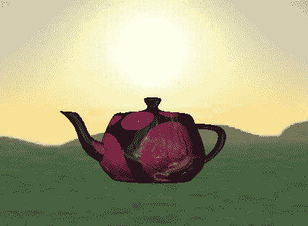

新 ell 树莓派茶壶

# 准备就绪

`pi3dmodels`.

建模茶壶是显示*Hello World*的 3D 传统等效。计算机图形学研究员马丁·纽厄尔（Martin Newell）于 1975 年首次创建了纽厄尔茶壶（Newell Teapot），作为他工作的基本测试模型。纽厄尔茶壶很快成为了快速检查 3D 渲染系统是否正常工作的标准模型（它甚至出现在了*玩具总动员*和*辛普森一家*的 3D 集中）。

其他模型可在`pi3dmodels`目录中找到（`monkey.obj/mdl`，后来在书中资源文件中使用过）。

# 如何做到这一点...

创建并运行以下`3dModel.py`脚本：

```py
#!/usr/bin/python3 
""" Wavefront obj model loading. Material properties set in 
    mtl file. Uses the import pi3d method to load *everything* 
""" 
import demo 
import pi3d 
from math import sin, cos, radians 

KEY = {'ESC':27,'NONE':-1} 

# Setup display and initialise pi3d 
DISPLAY = pi3d.Display.create() 
#capture mouse and key presses 
mykeys = pi3d.Keyboard() 
mymouse = pi3d.Mouse(restrict = False) 
mymouse.start() 

def main(): 
  #Model textures and shaders 
  shader = pi3d.Shader("uv_reflect") 
  bumptex = pi3d.Texture("textures/floor_nm.jpg") 
  shinetex = pi3d.Texture("textures/stars.jpg") 
  # load model 
  #mymodel = pi3d.Model(file_string='models/teapot.obj', z=10) 
  mymodel = pi3d.Model(file_string='models/monkey.obj', z=10) 
  mymodel.set_shader(shader) 
  mymodel.set_normal_shine(bumptex, 4.0, shinetex, 0.5) 

  #Create environment box 
  flatsh = pi3d.Shader("uv_flat") 
  ectex = pi3d.loadECfiles("textures/ecubes","sbox") 
  myecube = pi3d.EnvironmentCube(size=900.0, maptype="FACES", 
                                 name="cube") 
  myecube.set_draw_details(flatsh, ectex) 

  CAMERA = pi3d.Camera.instance() 
  rot = 0.0 # rotation of camera 
  tilt = 0.0 # tilt of camera 
  k = KEY['NONE'] 
  omx, omy = mymouse.position() 

  while DISPLAY.loop_running() and not k == KEY['ESC']: 
    k = mykeys.read() 
    #Rotate camera - camera steered by mouse 
    mx, my = mymouse.position() 
    rot -= (mx-omx)*0.8 
    tilt += (my-omy)*0.8 
    omx = mx 
    omy = my 
    CAMERA.reset() 
    CAMERA.rotate(tilt, rot, 0) 
    #Rotate object 
    mymodel.rotateIncY(2.0) 
    mymodel.rotateIncZ(0.1) 
    mymodel.rotateIncX(0.3) 
    #Draw objects 
    mymodel.draw() 
    myecube.draw() 

try: 
  main() 
finally: 
  mykeys.close() 
  mymouse.stop() 
  DISPLAY.destroy() 
  print("Closed Everything. END") 
#End 
```

# 它是如何工作的...

类似于 `3dObject.py` 示例，我们定义了 `DISPLAY` 着色器（这次使用 `uv_reflect`）和一些额外的纹理——`bumptex` (`floor_nm.jpg`) 和 `shinetex` (`stars.jpg`)——以便稍后使用。我们定义了一个想要导入的模型，将其放置在 `z=10`（如果没有给出坐标，它将被放置在 `(0,0,0)`）。由于我们没有指定相机位置，默认情况下它将被放置在视图中（有关相机的详细信息，请参阅相关章节）。

我们使用 `set_shader()` 函数应用着色器。接下来，我们使用 `bumptex` 作为表面纹理（按 `4` 缩放）添加一些纹理和效果。我们通过 `set_normal_shine()` 函数应用额外的闪亮效果，并设置反射强度为 `0.5`（强度范围从 0.0，最弱，到 1.0，最强）。如果你仔细观察模型的表面，`bumptex` 纹理提供了额外的表面细节，而 `shinetex` 纹理则可以看作是表面上的反射。

为了在比默认蓝色空间更有趣的环境中展示我们的模型，我们将创建一个`EnvironmentCube`对象。这定义了一个内部空间应用了特殊纹理的大空间（在这个例子中，它将从`texturesecubes`目录中加载`sbox_front/back/bottom/left`和`sbox_right`图像），因此它有效地包围了其中的对象。结果是，你得到了一个令人愉悦的背景来展示你的对象。

再次，我们定义了一个默认的 `CAMERA` 对象，并带有 `rot` 和 `tilt` 变量来控制视图。在 `DISPLAY.loop_running()` 部分中，我们可以控制视图。

使用鼠标操作`CAMERA`对象，并绕其轴以不同速度旋转模型，以便

旋转并展示其所有侧面（使用`RotateIncX/Y/Z()`函数来指定旋转速度）。最后，我们通过绘制模型和环境立方体来确保`DISPLAY`被更新。

# 还有更多...

我们可以在模拟环境中创建各种对象进行放置。`pi3d` 提供了导入我们自己的模型并将多种纹理应用于它们的方法。

# 创建或加载您自己的对象

如果你想在这个示例中使用自己的模型，你需要创建一个正确格式的模型；`pi3d`支持**obj**（波前对象文件）和**egg**（Panda3D）。

一款优秀且免费的 3D 建模程序叫做**Blender**（可在[`www.blender.org`](http://www.blender.org)获取）。他们的网站上有很多示例和教程，可以帮助你开始学习基本的建模（[`www.blender.org/education-help/tutorials`](http://www.blender.org/education-help/tutorials)）。

`pi3d`模型支持有限，不会支持 Blender 可以嵌入导出模型中的所有功能，例如可变形网格。因此，只支持基本的多部件模型。需要几个步骤来简化模型，以便它可以由`pi3d`加载。

将 `.obj` 模型转换为与 `pi3d` 一起使用，请按照以下步骤操作：

1.  在 Blender 中创建或加载一个模型——在尝试更复杂的模型之前，先从简单的对象开始。

1.  选择每个对象并切换到编辑模式（按*Tab*键）。

1.  选择所有顶点（按 *A* 键）并对其进行 uv 映射（按 *U* 键然后选择 Unwrap）。

1.  返回对象模式（按*Tab*键）。

1.  导出为 obj 文件 – 从顶部菜单的文件菜单中选择导出，然后选择 Wavefront (.obj)。确保在左下角的选项列表中也勾选了 Include Normals。

1.  点击保存，并将`.obj`和`.mtl`文件放置在`pi3dmodels`目录中，同时确保您更新脚本以包含模型的文件名，如下所示：

```py
mymodel = pi3d.Model(file_string='models/monkey.obj', 
   name='monkey', z=4) 
```

当你运行更新后的脚本时，你将在 3D 空间中看到你的模型。例如，`monkey.obj`模型在下面的屏幕截图中显示：

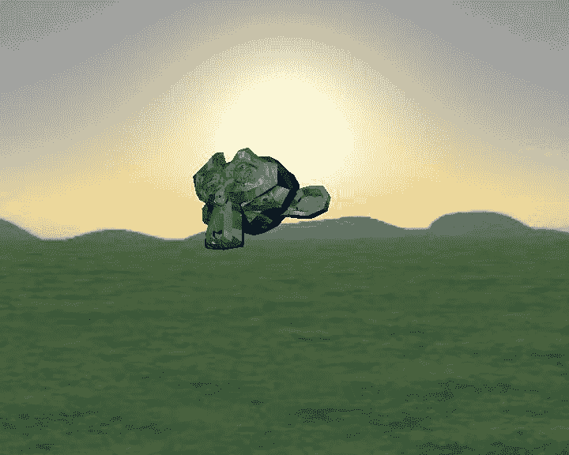

使用 Blender 创建并由 pi3d 展示的猴子头模型

# 更改对象的纹理和 .mtl 文件

模型表面所应用的纹理包含在模型的 `.mtl` 文件中。此文件定义了纹理及其应用方式，这些方式由建模软件设定。复杂的模型可能包含多个纹理，用于对象的各个部分。

如果没有定义材质，则使用着色器中的第一个纹理（在我们的例子中，这是`bumptex`纹理）。要向对象添加新的纹理，请在`.mtl`文件中添加（或编辑）以下行（即使用`water.jpg`）:

```py
map_Kd ../textures/water.jpg 
```

关于`.mtl`文件和`.obj`文件的更多信息可以在以下链接找到

维基百科链接：[`zh.wikipedia.org/wiki/Wavefront_.obj 文件`](https://zh.wikipedia.org/wiki/Wavefront_.obj_file)[ ](https://zh.wikipedia.org/wiki/Wavefront_.obj_file)

# 捕获屏幕截图

`pi3d` 库包含一个有用的截图功能，可以捕获屏幕并将其保存为 `.jpg` 或 `.png` 文件。我们可以添加一个新的按键事件来触发它，并调用 `pi3d.screenshot("filename.jpg")` 来保存图片（或使用计数器来拍摄多张截图），如下面的代码所示：

```py
shotnum = 0 #Set counter to 0 
while DISPLAY.loop_running() 
... 
  if inputs.key_state("KEY_P"): 
    while inputs.key_state("KEY_P"): 
      inputs.do_input_events()         # wait for key to go up 
      pi3d.screenshot("screenshot%04d.jpg"%( shotnum)) 
      shotnum += 1 
... 
```

# 创建一个可探索的 3D 世界

现在我们能够在我们的 3D 空间内创建模型和对象，以及

生成背景时，我们可能想要在内部创建一个更有趣的环境

哪里放置它们。

3D 地形图提供了一种优雅的方式来定义非常复杂的地形。地形是通过使用灰度图像来设定土地的高程来定义的。以下示例展示了我们如何定义自己的景观并模拟在其上飞越，甚至在其表面行走：

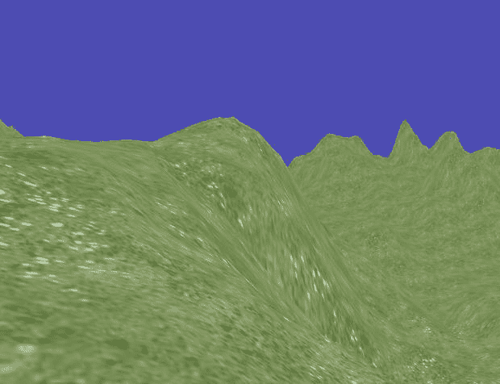

由地形图生成的 3D 景观

# 准备就绪

您需要将 `Map.png` 文件（可在书籍资源文件中找到）放置在 `pi3d` 库的 `pi3d/textures` 目录下。或者，您可以使用已经存在的其中一个高程图——将 `Map.png` 的引用替换为另一个高程图，例如 `testislands.jpg`。

# 如何做到这一点...

创建以下 `3dWorld.py` 脚本：

```py
#!/usr/bin/python3 
from __future__ import absolute_import, division 
from __future__ import print_function, unicode_literals 
""" An example of generating a 3D environment using a elevation map 
""" 
from math import sin, cos, radians 
import demo 
import pi3d 

KEY = {'R':114,'S':115,'T':116,'W':119,'ESC':27,'NONE':-1} 

DISPLAY = pi3d.Display.create(x=50, y=50) 
#capture mouse and key presses 
mykeys = pi3d.Keyboard() 
mymouse = pi3d.Mouse(restrict = False) 
mymouse.start() 

def limit(value,min,max): 
  if (value < min): 
    value = min 
  elif (value > max): 
    value = max 
  return value 

def main(): 
  CAMERA = pi3d.Camera.instance() 
  tex = pi3d.Texture("textures/grass.jpg") 
  flatsh = pi3d.Shader("uv_flat") 
  # Create elevation map 
  mapwidth,mapdepth,mapheight = 200.0,200.0,50.0 
  mymap = pi3d.ElevationMap("textures/Map.png", 
                width=mapwidth, depth=mapdepth, height=mapheight, 
                divx=128, divy=128, ntiles=20) 
  mymap.set_draw_details(flatsh, [tex], 1.0, 1.0) 

  rot = 0.0 # rotation of camera 
  tilt = 0.0 # tilt of camera 
  height = 20 
  viewhight = 4 
  sky = 200 
  xm,ym,zm = 0.0,height,0.0 
  k = KEY['NONE'] 
  omx, omy = mymouse.position() 
  onGround = False 
  # main display loop 
  while DISPLAY.loop_running() and not k == KEY['ESC']: 
    CAMERA.reset() 
    CAMERA.rotate(-tilt, rot, 0) 
    CAMERA.position((xm,ym,zm)) 
    mymap.draw() 

    mx, my = mymouse.position() 
    rot -= (mx-omx)*0.8 
    tilt += (my-omy)*0.8 
    omx = mx 
    omy = my 

    #Read keyboard keys 
    k = mykeys.read() 
    if k == KEY['W']: 
      xm -= sin(radians(rot)) 
      zm += cos(radians(rot)) 
    elif k == KEY['S']: 
      xm += sin(radians(rot)) 
      zm -= cos(radians(rot)) 
    elif k == KEY['R']: 
      ym += 2 
      onGround = False 
    elif k == KEY['T']: 
      ym -= 2 
    ym -= 0.1 #Float down! 
    #Limit the movement 
    xm = limit(xm,-(mapwidth/2),mapwidth/2) 
    zm = limit(zm,-(mapdepth/2),mapdepth/2) 
    if ym >= sky: 
      ym = sky 
    #Check onGround 
    ground = mymap.calcHeight(xm, zm) + viewhight 
    if (onGround == True) or (ym <= ground): 
      ym = mymap.calcHeight(xm, zm) + viewhight 
      onGround = True 

try: 
  main() 
finally: 
  mykeys.close() 
  mymouse.stop() 
  DISPLAY.destroy() 
  print("Closed Everything. END") 
#End 
```

# 它是如何工作的...

一旦我们定义了将要使用的显示、相机、纹理和着色器，我们就可以定义`ElevationMap`对象。

它通过根据图像所选点的像素值为地形图像分配高度来工作。例如，图像的单行将提供`ElevationMap`对象的切片和 3D 表面上的一个高程点行：

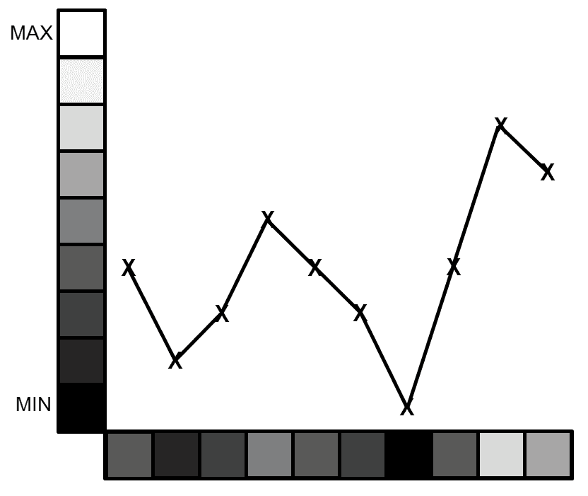

将地图.png 像素色调映射到地形高度

我们通过提供用于梯度信息的图像文件名（`textures/Map.png`）来创建一个`ElevationMap`对象，同时我们也创建了地图的尺寸（`width`、`depth`和`height`——这是白色空间与黑色空间相比的高度）：


高程图对象

`Map.png`纹理提供了一个示例地形图，该图被转换成

三维曲面。

我们还指定了 `divx` 和 `divy`，它们决定了地形图细节的使用程度（使用地形图中的多少点来创建高程表面）。最后，`ntiles` 指定使用的纹理将被缩放到覆盖表面的 `20 倍`。

在主`DISPLAY.loop_running()`部分，我们将控制相机，绘制`高程图`，响应用户输入，并限制我们在空间中的移动。

如前所述，我们使用一个`Keyboard`对象来捕捉鼠标移动并将它们转换为控制相机。我们还将使用`mykeys.read()`来确定是否按下了*W*、*S*、*R*和*T*键，这允许我们前进和后退，以及上升和下降。

为了方便在返回值和它们等效意义之间进行转换，我们将使用一个 Python 字典：

词典提供了一种简单的方法在给定的值和结果字符串之间进行转换。要访问键的值，我们使用 `KEY['W']`。我们还在第三章，《使用 Python 进行自动化和生产效率》，中使用了一个字典来在图像 EXIF 标签名称和 ID 之间进行转换。

为了确保我们不会穿过`ElevationMap`对象表面

我们移动到它上面，可以使用 `mymap.calcHeight()` 来提供其高度

在特定位置（`x,y,z`）的地形。我们可以通过确保相机设置为等于这个值来跟随地面，或者通过确保我们从未低于它来飞行于空中。当我们检测到我们在地面上时，我们确保我们保持在地面直到

我们按*R*键再次升起。

# 构建三维地图和迷宫

我们已经看到，`pi3d`库可以用来创建许多有趣的对象和环境。通过使用一些更复杂的类（或者通过构建我们自己的类），可以为用户设计出整个定制的空间供其探索。

在以下示例中，我们使用一个名为**Building**的特殊模块，该模块已被设计为允许您使用单个图像文件来提供布局，从而构建整个建筑：

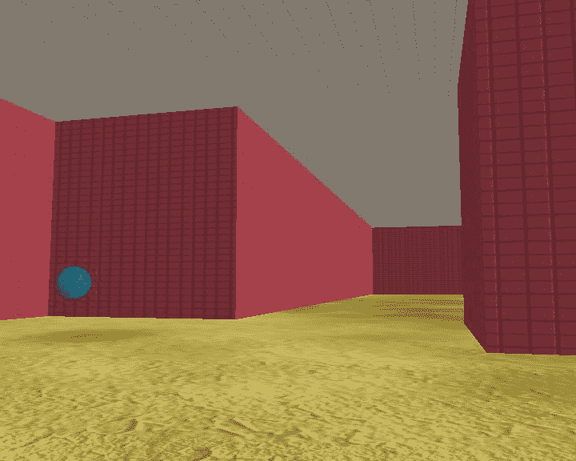

探索迷宫并找到标记出口的球体

# 准备就绪

您需要确保在`pi3d/textures`目录中拥有以下文件：

+   `squareblocksred.png`

+   `floor.png`

+   `inside_map0.png`, `inside_map1.png`, `inside_map2.png`

这些文件作为书籍资源的一部分提供，位于`Chapter07resourcesource_filestextures`。

# 如何做到这一点...

让我们按照以下步骤运行以下`3dMaze.py`脚本：

1.  首先，我们使用以下代码设置模型的键盘、鼠标、显示器和设置：

```py
#!/usr/bin/python3 
"""Small maze game, try to find the exit 
""" 
from math import sin, cos, radians 
import demo 
import pi3d 
from pi3d.shape.Building import Building, SolidObject 
from pi3d.shape.Building import Size, Position 

KEY = {'A':97,'D':100,'H':104,'R':114,'S':115,'T':116, 
       'W':119,'ESC':27,'APOST':39,'SLASH':47,'NONE':-1} 

# Setup display and initialise pi3d 
DISPLAY = pi3d.Display.create() 
#capture mouse and key presses 
mykeys = pi3d.Keyboard() 
mymouse = pi3d.Mouse(restrict = False) 

#Load shader 
shader = pi3d.Shader("uv_reflect") 
flatsh = pi3d.Shader("uv_flat") 
# Load textures 
ceilingimg = pi3d.Texture("textures/squareblocks4.png") 
wallimg = pi3d.Texture("textures/squareblocksred.png") 
floorimg = pi3d.Texture("textures/dunes3_512.jpg") 
bumpimg = pi3d.Texture("textures/mudnormal.jpg") 
startimg = pi3d.Texture("textures/rock1.jpg")     
endimg = pi3d.Texture("textures/water.jpg") 
# Create elevation map 
mapwidth = 1000.0 
mapdepth = 1000.0 
#We shall assume we are using a flat floor in this example 
mapheight = 0.0 
mymap = pi3d.ElevationMap(mapfile="textures/floor.png", 
                width=mapwidth, depth=mapdepth, height=mapheight, 
                divx=64, divy=64) 
mymap.set_draw_details(shader,[floorimg, bumpimg],128.0, 0.0) 
levelList = ["textures/inside_map0.png","textures/inside_map1.png", 
             "textures/inside_map2.png"] 
avhgt = 5.0 
aveyelevel = 4.0 
MAP_BLOCK = 15.0 
aveyeleveladjust = aveyelevel - avhgt/2 
PLAYERHEIGHT = (mymap.calcHeight(5, 5) + avhgt/2) 
#Start the player in the top-left corner 
startpos = [(8*MAP_BLOCK),PLAYERHEIGHT,(8*MAP_BLOCK)] 
endpos = [0,PLAYERHEIGHT,0] #Set the end pos in the centre 
person = SolidObject("person", Size(1, avhgt, 1), 
                Position(startpos[0],startpos[1],startpos[2]), 1) 
#Add spheres for start and end, end must also have a solid object 
#so we can detect when we hit it 
startobject = pi3d.Sphere(name="start",x=startpos[0], 
                          y=startpos[1]+avhgt,z=startpos[2]) 
startobject.set_draw_details(shader, [startimg, bumpimg], 
                             32.0, 0.3) 
endobject = pi3d.Sphere(name="end",x=endpos[0], 
                        y=endpos[1],z=endpos[2]) 
endobject.set_draw_details(shader, [endimg, bumpimg], 32.0, 0.3) 
endSolid = SolidObject("end", Size(1, avhgt, 1), 
                Position(endpos[0],endpos[1],endpos[2]), 1) 

mazeScheme = {"#models": 3, 
      (1,None): [["C",2]],      #white cell : Ceiling 
      (0,1,"edge"): [["W",1]],  #white cell on edge next 
                                #   black cell : Wall 
      (1,0,"edge"): [["W",1]],  #black cell on edge next 
                                #   to white cell : Wall 
      (0,1):[["W",0]]}          #white cell next 
                                #   to black cell : Wall 

details = [[shader, [wallimg], 1.0, 0.0, 4.0, 16.0], 
            [shader, [wallimg], 1.0, 0.0, 4.0, 8.0], 
            [shader, [ceilingimg], 1.0, 0.0, 4.0, 4.0]] 

arialFont = pi3d.Font("fonts/FreeMonoBoldOblique.ttf", 
                      "#ffffff", font_size=10) 
```

1.  我们随后创建函数以便我们使用以下代码重新加载关卡并向玩家显示消息：

```py
def loadLevel(next_level): 
  print(">>> Please wait while maze is constructed...") 
  next_level=next_level%len(levelList) 
  building = pi3d.Building(levelList[next_level], 0, 0, mymap, 
      width=MAP_BLOCK, depth=MAP_BLOCK, height=30.0, 
      name="", draw_details=details, yoff=-15, scheme=mazeScheme) 
  return building 

def showMessage(text,rot=0): 
  message = pi3d.String(font=arialFont, string=text, 
                        x=endpos[0],y=endpos[1]+(avhgt/4), 
                        z=endpos[2], sx=0.05, sy=0.05,ry=-rot) 
  message.set_shader(flatsh) 
  message.draw() 
```

1.  在主函数中，我们使用以下代码设置 3D 环境和绘制所有对象：

```py
def main(): 
  #Load a level 
  level=0 
  building = loadLevel(level) 
  lights = pi3d.Light(lightpos=(10, -10, 20), 
                      lightcol =(0.7, 0.7, 0.7), 
                      lightamb=(0.7, 0.7, 0.7)) 
  rot=0.0 
  tilt=0.0 
  #capture mouse movements 
  mymouse.start() 
  omx, omy = mymouse.position() 

  CAMERA = pi3d.Camera.instance() 
  while DISPLAY.loop_running() and not  
                               inputs.key_state("KEY_ESC"): 
    CAMERA.reset() 
    CAMERA.rotate(tilt, rot, 0) 
    CAMERA.position((person.x(), person.y(), 
                     person.z() - aveyeleveladjust)) 
    #draw objects 
    person.drawall() 
    building.drawAll() 
    mymap.draw() 
    startobject.draw() 
    endobject.draw() 
    #Apply the light to all the objects in the building 
    for b in building.model: 
      b.set_light(lights, 0) 
    mymap.set_light(lights, 0) 

   #Get mouse position 
    mx, my = mymouse.position() 
    rot -= (mx-omx)*0.8 
    tilt += (my-omy)*0.8 
    omx = mx 
    omy = my 
    xm = person.x() 
    ym = person.y() 
    zm = person.z() 
```

1.  最后，我们监控按键，处理与物体的任何碰撞，并在迷宫中按照以下方式移动：

```py
#Read keyboard keys 
k = mykeys.read() 
if k == KEY['APOST']: #' Key 
  tilt -= 2.0 
elif k == KEY['SLASH']: #/ Key 
  tilt += 2.0 
elif k == KEY['A']: 
  rot += 2.0 
elif k == KEY['D']: 
  rot -= 2.0 
elif k == KEY['H']: 
  #Use point_at as help - will turn the player to face 
  #  the direction of the end point 
  tilt, rot = CAMERA.point_at([endobject.x(), endobject.y(), 
                                   endobject.z()]) 
elif k == KEY['W']: 
  xm -= sin(radians(rot)) 
  zm += cos(radians(rot)) 
elif k == KEY['S']: 
  xm += sin(radians(rot)) 
  zm -= cos(radians(rot)) 

NewPos = Position(xm, ym, zm) 
collisions = person.CollisionList(NewPos) 
if collisions: 
  #If we reach the end, reset to start position! 
  for obj in collisions: 
    if obj.name == "end": 
      #Required to remove the building walls from the 
      #  solidobject list 
      building.remove_walls() 
      showMessage("Loading Level",rot) 
      DISPLAY.loop_running() 
      level+=1 
      building = loadLevel(level) 
      showMessage("") 
      person.move(Position(startpos[0],startpos[1], 
                               startpos[2])) 
else: 
  person.move(NewPos) 

try: 
  main() 
finally: 
  mykeys.close() 
  mymouse.stop() 
  DISPLAY.destroy() 
  print("Closed Everything. END") 
#End 
```

# 它是如何工作的...

我们定义了在前面示例中使用到的许多元素，例如显示、纹理、着色器、字体和光照。我们还定义了对象，如建筑本身、`ElevationMap` 对象，以及迷宫的起点和终点。此外，我们还使用 SolidObjects 来帮助检测空间内的移动。有关更多信息，请参阅此食谱中 *There's more...* 部分的 *Using *SolidObjects* *to detect collisions* 子部分。

最后，我们根据选定的地图图像创建实际的 `Building` 对象（使用 `loadLevel()` 函数），并将摄像机（代表我们的第一人称视角）定位在起始位置。有关更多信息，请参阅此食谱中 *There's more...* 部分的 *The Building module* 子节。

在`main`循环中，我们绘制我们空间中的所有对象并应用光照效果。我们还将监控鼠标（以控制相机的倾斜和旋转）或键盘的移动来移动玩家（或退出/提供帮助）。

控制方式如下：

+   **鼠标移动**：这会改变相机的倾斜和旋转。

+   **' 或 / 键**：这会将相机倾斜向上或向下。

+   **A 或 D**：这会将相机旋转从左到右或反之。

+   **W 或 S**: 这将使玩家向前或向后移动。

+   **H**: 这通过旋转玩家使其面对迷宫的终点来帮助玩家。有用的 `CAMERA.point_at()` 函数用于快速旋转和倾斜摄像机的视角，使其指向提供的坐标（终点位置）。

每当玩家移动时，我们检查新位置(`NewPos`)是否与另一个`SolidObject`发生碰撞，使用`CollisionList(NewPos)`。该函数将返回与提供的坐标重叠的任何其他`SolidObject`的列表。

如果没有障碍物挡道，我们就让玩家移动；否则，我们检查是否有 SolidObject 的名称是`end`对象，在这种情况下，我们就到达了迷宫的尽头。

当玩家到达终点时，我们从旧的`Building`对象中移除墙壁并显示加载信息。如果我们不移除墙壁，属于前一个`Building`的所有 SolidObjects 仍然会保留，从而在下一级中创建不可见的障碍物。

我们将使用`showMessage()`函数来通知用户下一级关卡即将加载（因为构建对象可能需要一段时间）。我们需要确保在绘制消息后调用`DISPLAY.loop_running()`，这样可以确保在开始加载关卡之前（在此之后，玩家将无法移动，因为正在加载）消息已经在屏幕上显示。我们需要确保无论玩家的哪一侧与`end`对象发生碰撞，消息总是面向玩家，通过使用摄像机的旋转（`rot`）来调整其角度：

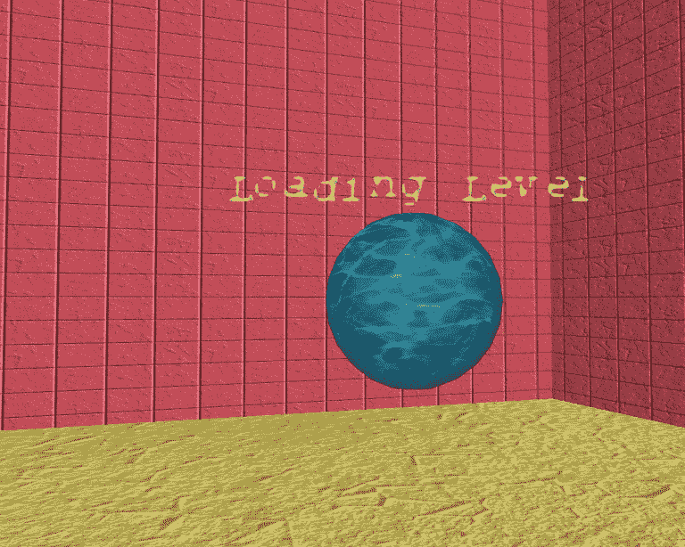

当找到出口球时，加载下一级

当列表中的下一级被加载（或者在所有级别都完成后再次加载第一级时），我们将消息替换为一个空白消息以移除它，并将该人的位置重置回起始位置。

您可以通过创建额外的地图文件（20 x 20 的 PNG 文件，用黑色像素标记墙壁，用白色表示通道）并在`levelList`中列出它们来设计和添加自己的关卡。玩家将从地图的左上角开始，出口放置在中心。

你会注意到加载关卡可能需要相当长的时间；这是相对较慢的树莓派 ARM 处理器在执行构建迷宫和定位所有组件所需的所有计算。一旦迷宫构建完成，更强大的 GPU 接管，这使得玩家探索空间时图形快速且流畅。

本食谱展示了原始树莓派处理器与树莓派 2 之间的区别。树莓派 2 加载第一级需要大约 1 分 20 秒，而原始树莓派可能需要长达 4 分 20 秒。树莓派 3 加载同一级仅需惊人的 4 秒。

# 还有更多...

上述示例为玩家创建了一个可以探索和交互的建筑。为了实现这一点，我们使用`pi3d`的`Building`模块来创建建筑，并使用`SolidObject`来检测碰撞。

# 建筑模块

`pi3d.Building`模块允许您使用地图文件定义建筑物的整个楼层或楼层。就像前一个示例中使用的地形图一样，像素的颜色将被转换为不同部分的楼层。在我们的例子中，黑色用于墙壁，白色用于通道和走廊，并配有天花板：

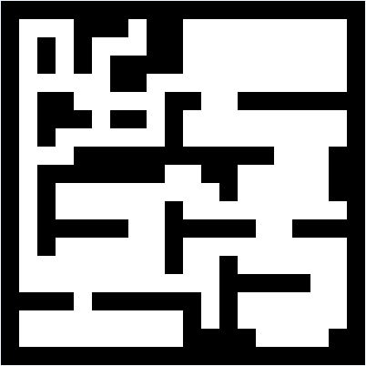

建筑布局由图像中的像素定义

由`Building`对象构建的章节由所使用的`Scheme`定义。`Scheme`由两个部分定义，首先是模型的数量，然后是针对模型各个方面的定义，如下面的代码所示：

```py
mazeScheme = {"#models": 3, 
  (1,None): [["C",2]],     #white cell : Ceiling 
  (0,1,"edge"): [["W",1]], #white cell on edge by black cell : Wall 
  (1,0,"edge"): [["W",1]], #black cell on edge by white cell : Wall 
  (0,1):[["W",0]]}         #white cell next to black cell : Wall  
```

第一个**元组**定义了所选模型应应用于哪种类型的单元格/方块。由于地图中有两种像素颜色，方块将是黑色（`0`）或白色（`1`）。通过确定特定单元格/方块的位置和类型，我们可以定义我们想要应用哪些模型（墙壁、天花板或屋顶）。

我们可以定义三种主要的单元格/方块位置类型：

+   **一个完整的平方（1，None）**：这是一个代表开放空间的白色单元格。

    这座建筑。

+   **相邻的两个单元格，在边缘（0,1,"edge"）**：这是地图边缘旁边的一个黑色单元格和一个白色单元格。这还包括 `(1,0,"edge")`。这将会代表建筑的外墙。

+   **紧挨着白色细胞（0,1）的任何黑色细胞**：这代表建筑物的所有内部墙壁。

接下来，我们分配一种（或多种）对象类型以应用于该类型（`W` 或 `C`）：

+   **墙 (W)**: 这是一个放置在指定单元格之间（例如黑色和白色单元格之间）的垂直墙。

+   **天花板（C）**：这是覆盖当前单元格的水平天花板部分。

+   **屋顶 (R)**: 这是一个放置在天花板稍上方的额外水平部分，用于提供屋顶效果。它通常用于可能需要从外部观看的建筑（在我们的示例中不使用）。

+   **天花板边缘 (CE)**: 这用于将天花板部分连接到建筑物的屋顶边缘（在我们的示例中不使用，因为我们的模型是室内模型）。

最后，我们指定每个对象将使用的模型。在这个示例中我们使用了三种模型（普通墙壁、边缘上的墙壁和天花板），因此我们可以通过指定`0`、`1`或`2`来定义所使用的模型。

每个模型都在`details`数组中定义，这使得我们可以为每个模型设置所需的纹理和着色器（这包含通常由`.set_draw_details()`函数设置的相同信息），如下面的代码所示：

```py
details = [[shader, [wallimg], 1.0, 0.0, 4.0, 16.0], 
           [shader, [wallimg], 1.0, 0.0, 4.0, 8.0], 
           [shader, [ceilingimg], 1.0, 0.0, 4.0, 4.0]] 
```

在我们的示例中，内部墙壁分配给了`wallimg`纹理（`textures/squareblocksred.png`），而天花板分配给了`ceilingimg`纹理（`textures/squareblocks4.png`）。您可能可以从下面的屏幕截图中发现，我们可以将不同的纹理模型（在我们的情况下，稍微不同的缩放）应用于不同类型的方块。迷宫外部的墙壁（带有边缘标识符）将使用`wallimg`模型纹理，缩放为 4 x 8（`details[1]`），而对于内部墙壁，相同的模型纹理将缩放为 4 x 16（`details[0]`）：

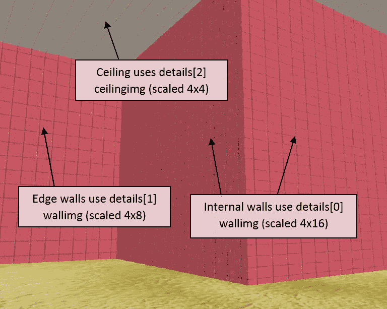

不同缩放的墙壁

当创建`pi3d.Building`对象时，`scheme`和`draw_details`都被设置，如下面的代码所示：

```py
building = pi3d.Building(levelList[next_level], 0, 0, mymap,
    width=MAP_BLOCK, depth=MAP_BLOCK, height=30.0, name="",
      draw_details=details, yoff=-15, scheme=mazeScheme) 
```

使用地图文件（`levelList[next_level`]），方案（`mazeScheme`）和绘制细节（`details`），整个建筑在环境中被创建出来：

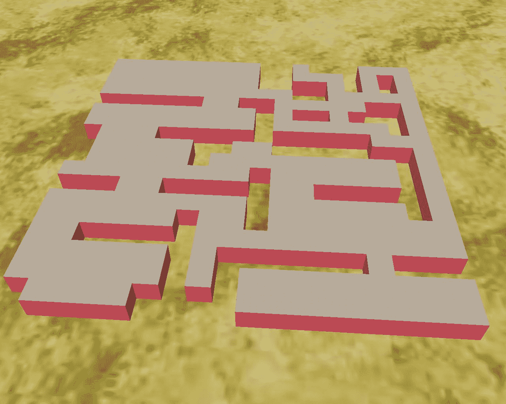

我们创建的 3D 迷宫的俯视图

尽管在这个例子中我们只使用了黑白两种颜色，但也可以使用其他彩色像素来定义额外的方块类型（以及如果需要的话，不同的纹理）。如果添加了另一种颜色（例如灰色），颜色映射的索引就会移动，使得黑色方块被引用为`0`，新的彩色方块为`1`，白色方块为`2`。有关详细信息，请参阅`pi3d`演示中的**Silo**示例。

我们还需要定义一个 `ElevationMap` 对象：`mymap`。`pi3d.Building` 模块利用 `ElevationMap` 对象的 `calcHeight()` 函数来正确地将墙壁放置在 `ElevationMap` 对象的表面之上。在这个例子中，我们将使用 `textures/floor.png` 应用一个基本的 `ElevationMap` 对象，这将生成一个平面表面，`Building` 对象将被放置在这个表面上。

# 使用 SolidObjects 检测碰撞

除了`Building`对象之外，我们还将定义一个玩家对象，并定义两个对象来标记迷宫的起点和终点。尽管玩家的视角是第一人称视角（也就是说，我们实际上看不到他们，因为视角实际上是透过他们的眼睛），但我们仍需要定义一个**SolidObject**来代表他们。

SolidObject 是一种特殊类型的不可见对象，可以通过检查来确定一个 SolidObject 将要占据的空间是否与另一个对象重叠。这将使我们能够使用`person.CollisionList(NewPos)`来获取任何其他 SolidObjects 的列表，这些 SolidObjects 将在`NewPos`位置与`person`对象接触。由于`Building`类为`Building`对象的各个部分定义了 SolidObjects，因此我们能够检测到玩家试图穿过墙壁（或者，出于某种原因，屋顶/天花板）并阻止他们穿过。

我们还在迷宫中使用 SolidObjects 来定义起点和终点。玩家开始的位置被设置为地图的左上角（地图左上角的空白像素）并由`startpos`对象标记（一个带有`rock1.jpg`纹理的小`pi3d.Sphere`，放置在人物头部上方）。迷宫的终点由另一个`pi3d.Sphere`对象（带有`water.jpg`纹理）标记，位于地图中心。我们还定义了另一个 SolidObject 在终点，这样我们就可以检测到玩家到达它并与它碰撞（并加载下一级）。
