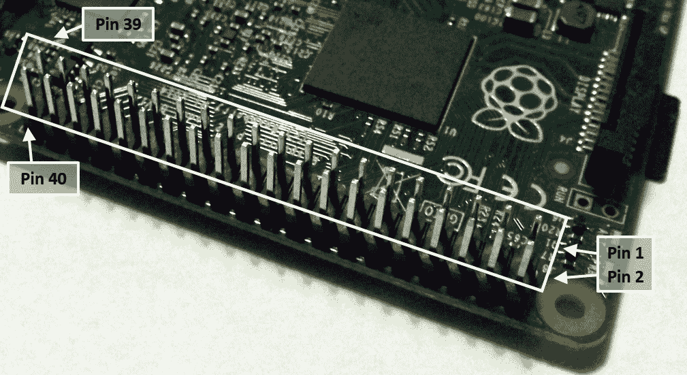

# 使用 Python 驱动硬件

在本章中，我们将涵盖以下主题：

+   控制 LED

+   响应按钮

+   控制关机按钮

+   GPIO 键盘输入

+   多路复用彩色 LED

+   使用视觉暂留原理编写信息

# 简介

树莓派电脑的一个关键特性，使其与其他大多数家用/办公电脑区别开来的是，它能够直接与其他硬件进行接口。树莓派上的**通用输入/输出**（**GPIO**）引脚可以控制一系列低级电子设备，从**发光二极管**（**LEDs**）到开关、传感器、电机、伺服机构和甚至额外的显示屏。

本章将专注于将树莓派与一些简单的电路连接起来，并掌握使用 Python 来控制和响应连接组件的方法。

树莓派硬件接口由位于板边一侧的 40 个引脚组成。

GPIO 引脚及其布局将根据您所拥有的特定型号略有不同。

Raspberry Pi 3、Raspberry Pi 2 和 Raspberry Pi B+都拥有相同的 40 针布局。

较早的 Raspberry Pi 1 型号（非 plus 型号）有一个 26 针引脚，这与较新型号的 1-26 针相同。


Raspberry Pi 2、Raspberry Pi B+和 Raspberry Pi Model Plus 的 GPIO 引脚（引脚功能）

连接器的布局显示在先前的图中；引脚编号是从 GPIO 引脚 1 处看到的。

**引脚 1**位于最靠近 SD 卡的一端，如图所示：



树莓派 GPIO 引脚位置

使用 GPIO 引脚时需小心，因为它还包括电源引脚（3V3 和 5V），以及**地**（**GND**）引脚。所有的 GPIO 引脚都可以用作标准 GPIO，但其中一些也具有特殊功能；这些引脚被标记并用不同颜色突出显示。

工程师们通常会在电路图中使用 3V3 这样的记法来指定值，以避免使用容易被遗漏的小数点（使用 33V 而不是 3.3V 会对电路造成严重损坏）。同样的方法也适用于其他组件的值，例如，1.2K 欧姆可以写成 1K2 欧姆。

**TX** 和 **RX** 引脚用于串行通信，借助电压等级转换器，信息可以通过串行电缆传输到另一台计算机或设备。

我们还有 **SDA** 和 **SCL** 引脚，它们能够支持一种称为 **I²C** 的双线总线通信协议（在 Raspberry Pi 3 和 Model Plus 板上，有两个 I²C 通道：**通道 1 ARM**，用于通用，以及 **通道 0 VC**，通常用于识别 **顶部连接的硬件**（**HAT**）模块）。还有 **SPI MOSI**、**SPI MISO**、**SPI SCLK**、**SPI CE0** 和 **SPI CE1** 引脚，它们支持另一种称为 **SPI** 的总线协议，用于高速数据传输。最后，我们还有 **PWM0/1** 引脚，它允许生成 **脉冲宽度调制** 信号，这对于伺服系统和生成模拟信号非常有用。

然而，在本章中我们将专注于仅使用标准的 GPIO 功能。GPIO 引脚布局如图所示：


树莓派 GPIO 引脚头（GPIO.BOARD 和 GPIO.BCM）

Raspberry Pi Rev 2（2014 年 7 月之前）与 Raspberry Pi 2 GPIO 布局相比有以下不同之处：

+   26-GPIO 引脚排针（与第一个 26 个引脚相匹配）。

+   位于引脚头旁边的额外一组八个孔（P5）。具体细节如下：


Raspberry Pi Rev 2 P5 GPIO 头引脚

+   原始的 Raspberry Pi Rev 1（2012 年 10 月之前）总共只有 26 个 GPIO 引脚，（与当前 Raspberry Pi 的前 26 个引脚相匹配，除了以下细节：


Raspberry Pi Rev 1 GPIO 头部差异

`RPi.GPIO` 库可以使用两种系统之一来引用 Raspberry Pi 上的引脚。中间显示的数字代表引脚的物理位置，也是 `RPi.GPIO` 库在 **GPIO.BOARD** 模式下所引用的数字。外部的数字（**GPIO.BCM**）是处理器物理端口的实际参考编号，它们指示哪些引脚是连接的（这就是为什么它们没有特定的顺序）。当模式设置为 **GPIO.BCM** 时，它们被用来控制 GPIO 头部引脚以及连接到其他 GPIO 线的任何外围设备。这包括连接到 BCM GPIO 4 的附加摄像头上的 LED 以及板上的状态 LED。然而，这也可以包括用于读取/写入 SD 卡的 GPIO 线，如果被干扰，将导致严重错误。

如果你使用其他编程语言来访问 GPIO 引脚，编号方案可能不同，因此了解 BCM GPIO 引用会有所帮助，这些引用指的是处理器的物理 GPIO 端口。

一定要查看附录，*硬件和软件列表*，其中列出了本章中使用的所有物品以及你可以从中获取它们的地方。

# 控制 LED

硬件上的`hello world`相当于一个 LED 闪烁，这是一个很好的测试，以确保一切正常工作并且你已经正确地连接了线路。为了让它更有趣，我建议使用一个**红色、蓝色和绿色**（RGB）的 LED，但如果这是你唯一可用的 LED，也请随意使用。

# 准备就绪

你需要以下设备：

+   4 x 杜邦公对母贴片线

+   小型面包板（170 个接线点）或更大型的面包板

+   RGB LED（共阴极）/3 标准 LED（理想情况下为红色、绿色和蓝色）

+   面板线（实心芯）

+   3 x 470 欧姆电阻

上述每个组件的成本都不应超过几美元，并且在之后的项目中可以重复使用。面包板是一个特别有用的物品，它允许你在不需要焊接的情况下尝试自己的电路：


RGB LED、标准 LED 和 RGB 电路的图示

以下图表展示了面包板电路：


连接到 GPIO 头部的 RGB LED/标准 LED 的接线

市面上有多种不同类型的 RGB LED 可供选择，因此请检查您组件的数据表以确认您所拥有的引脚顺序和类型。有些是 RGB 类型的，所以请确保您正确接线或调整代码中的`RGB_`引脚设置。您还可以获得常见的正极版本，这需要将正极连接到 3V3（GPIO 引脚 1）才能点亮（并且它们还需要将`RGB_ENABLE`和`RGB_DISABLE`分别设置为`0`和`1`）。

本书中的面包板和组件图都是使用一款名为**Fritzing**的免费工具制作的([www.fritzing.org](http://www.fritzing.org))；它非常适合规划您自己的树莓派项目。

# 如何做到这一点...

1.  创建 `ledtest.py` 脚本如下：

```py
#!/usr/bin/python3 
#ledtest.py 
import time 
import RPi.GPIO as GPIO 
# RGB LED module 
#HARDWARE SETUP 
# GPIO 
# 2[======XRG=B==]26[=======]40 
# 1[=============]25[=======]39 
# X=GND R=Red G=Green B=Blue  
#Setup Active States 
#Common Cathode RGB-LED (Cathode=Active Low) 
RGB_ENABLE = 1; RGB_DISABLE = 0 

#LED CONFIG - Set GPIO Ports 
RGB_RED = 16; RGB_GREEN = 18; RGB_BLUE = 22 
RGB = [RGB_RED,RGB_GREEN,RGB_BLUE] 

def led_setup(): 
  #Setup the wiring 
  GPIO.setmode(GPIO.BOARD) 
  #Setup Ports 
  for val in RGB: 
    GPIO.setup(val,GPIO.OUT) 

def main(): 
  led_setup() 
  for val in RGB: 
    GPIO.output(val,RGB_ENABLE) 
    print("LED ON") 
    time.sleep(5) 
    GPIO.output(val,RGB_DISABLE) 
    print("LED OFF") 

try: 
  main() 
finally: 
  GPIO.cleanup() 
  print("Closed Everything. END") 
#End
```

1.  `RPi.GPIO` 库访问 GPIO 引脚硬件需要 `sudo` 权限，因此您需要使用以下命令来运行脚本：

```py
sudo python3 ledtest.py  
```

当你运行脚本时，你应该看到 LED（或如果你使用的是单独的 LED，则是每个 LED）的红、绿、蓝部分依次点亮。如果没有，请检查你的接线是否正确，或者通过临时将红、绿或蓝线连接到 3V3 引脚（GPIO 引脚的 1 号引脚）来确认 LED 是否工作。

`sudo`命令对于大多数与硬件相关的脚本来说是必需的，因为用户通常不会在如此低级别直接控制硬件。例如，设置或清除 SD 卡控制器的一部分控制引脚可能会损坏正在写入的数据。因此，出于安全考虑，需要超级用户权限以防止程序意外（或恶意意图）使用硬件。

# 它是如何工作的...

要使用 Python 访问 GPIO 引脚，我们需要导入`RPi.GPIO`库，该库允许通过模块函数直接控制引脚。我们还需要`time`模块来暂停程序，使其暂停设定的时间数秒。

我们随后为 LED 的布线和激活状态定义值（参见本食谱“更多内容...”部分中的*控制 GPIO 电流*部分）。

在程序使用 GPIO 引脚之前，我们需要通过指定编号方法—`GPIO.BOARD`—和方向—`GPIO.OUT`或`GPIO.IN`（在这种情况下，我们将所有 RGB 引脚设置为输出）来设置它们。如果一个引脚被配置为输出，我们将能够设置引脚状态；同样地，如果它被配置为输入，我们将能够读取引脚状态。

接下来，我们通过使用 `GPIO.output()` 函数来控制引脚，指定 GPIO 引脚的编号和我们希望其处于的状态（`1` = 高/开，`0` = 低/关）。我们依次打开每个 LED，等待五秒钟，然后将其关闭。

最后，我们使用 `GPIO.cleanup()` 将 GPIO 引脚恢复到它们原始的默认状态，并释放对引脚的控制权，以便其他程序使用。

# 还有更多...

在使用树莓派的 GPIO 引脚时必须小心谨慎，因为这些引脚直接连接到树莓派的主处理器，没有任何额外的保护措施。必须小心操作，因为任何错误的接线都可能损坏树莓派处理器，并导致其完全停止工作。

或者，您可以使用许多可直接插入 GPIO 引脚头部的模块之一（从而降低布线的错误率）：

例如，Pi-Stop 是一块简单的预构建 LED 板，它模拟了一套交通信号灯，旨在为那些对控制硬件感兴趣但希望避免损坏他们的 Raspberry Pi 的用户提供一个过渡。在掌握基础知识之后，它也成为一个出色的指示器，有助于调试。

确保您已将 `ledtest.py` 脚本中的 `LED CONFIG` 引脚引用更新为引用您所使用的硬件的引脚布局和位置。


请参阅附录，*硬件和软件列表*，以获取树莓派硬件零售商的列表。

# 控制 GPIO 电流

每个 GPIO 引脚在烧毁之前只能处理一定电流（单个引脚最大为 16 mA，总电流为 30 mA），同样地，RGB LED 也应该限制在不超过 100 mA。通过在 LED 之前或之后添加一个电阻，我们就能限制通过它的电流，并控制其亮度（电流越大，LED 越亮）。

由于我们可能希望同时点亮多个 LED，我们通常的目标是将电流设置得尽可能低，同时仍然提供足够的电力来点亮 LED。

我们可以使用欧姆定律来告诉我们需要使用多少电阻来提供特定的电流。该定律如图所示：


欧姆定律：电流、电阻和电压在电路中的关系

我们的目标是确保电流最小（3 mA）和最大（16 mA），同时从每个 LED 中发出足够明亮的光。为了获得 RGB LED 的平衡输出，我测试了不同的电阻，直到它们提供了接近白色的光（通过卡片观察）。每个 LED 选择了 470 欧姆的电阻（你的 LED 可能略有不同）：


需要使用电阻来限制通过 LED 的电流

电阻两端的电压等于 GPIO 电压（**Vgpio** = 3.3V）减去特定 LED 上的电压降（**Vfwd**）；然后我们可以利用这个电阻来计算每个 LED 所使用的电流，如下公式所示：


我们可以计算每个 LED 所吸取的电流

# 响应按钮

许多使用树莓派的程序都需要在不连接键盘和屏幕的情况下激活动作。GPIO 引脚为树莓派通过您自己的按钮和开关进行控制提供了一种极好的方式，无需鼠标/键盘和屏幕。

# 准备就绪

你需要以下设备：

+   2 x 杜邦公对母贴片线

+   小型面包板（170 个接线点）或更大型的面包板

+   按钮开关（瞬时闭合）或通过电线连接来闭合/断开电路

+   面板线（实心芯线）

+   1K 欧姆电阻

开关的配置如图所示：


按钮开关和其他类型的开关

在以下示例中使用的开关是**单刀单掷**（**SPST**），瞬时闭合，按钮开关。**单刀**（**SP**）意味着有一组触点可以建立连接。在本例中使用的推开关的情况下，每侧的腿通过中间的单刀开关连接在一起。**双刀**（**DP**）开关的作用就像一个 SP 开关，只不过两侧在电气上是分离的，允许你同时切换两个独立组件的开启/关闭。

**单掷**（**ST**）表示开关只会与一个位置建立连接；另一侧将保持断开。**双掷**（**DT**）表示开关的两个位置都会连接到不同的部分。

**瞬间关闭**意味着按钮在被按下时会关闭开关，并在释放时自动打开。一个**锁定**的按钮开关将保持关闭状态，直到再次被按下。

# 尝试使用树莓派连接扬声器或耳机


按钮电路的布局

在本例中，我们将使用声音，因此您还需要将扬声器或耳机连接到树莓派的音频插孔。

您需要使用以下命令安装名为 `flite` 的程序，这将使我们能够让树莓派说话：

```py
sudo apt-get install flite  
```

安装完成后，您可以使用以下命令进行测试：

```py
sudo flite -t "hello I can talk"  
```

如果声音有点太安静（或者太响），你可以使用以下命令来调整音量（0-100 百分比）：

```py
amixer set PCM 100%  
```

# 如何做到这一点...

创建 `btntest.py` 脚本如下：

```py
#!/usr/bin/python3 
#btntest.py 
import time 
import os 
import RPi.GPIO as GPIO 
#HARDWARE SETUP 
# GPIO 
# 2[==X==1=======]26[=======]40 
# 1[=============]25[=======]39 
#Button Config 
BTN = 12 

def gpio_setup(): 
  #Setup the wiring 
  GPIO.setmode(GPIO.BOARD) 
  #Setup Ports 
  GPIO.setup(BTN,GPIO.IN,pull_up_down=GPIO.PUD_UP) 

def main(): 
  gpio_setup() 
  count=0 
  btn_closed = True 
  while True: 
    btn_val = GPIO.input(BTN) 
    if btn_val and btn_closed: 
       print("OPEN") 
       btn_closed=False 
    elif btn_val==False and btn_closed==False: 
       count+=1 
       print("CLOSE %s" % count) 
       os.system("flite -t '%s'" % count) 
       btn_closed=True 
    time.sleep(0.1) 

try: 
  main() 
finally: 
  GPIO.cleanup() 
  print("Closed Everything. END") 
#End 
```

# 它是如何工作的...

如前一道菜谱中所述，我们按照要求设置了 GPIO 引脚，但这次将其设置为输入模式，并且我们还启用了内部上拉电阻（有关更多信息，请参阅本菜谱“更多内容...”部分的*上拉和下拉电阻电路*），使用以下代码：

```py
GPIO.setup(BTN,GPIO.IN,pull_up_down=GPIO.PUD_UP) 
```

在设置好 GPIO 引脚后，我们创建一个循环，该循环将不断使用`GPIO.input()`检查`BTN`的状态。如果返回的值是`false`，则表示引脚通过开关连接到了 0V（地），每次按钮被按下时，我们将使用`flite`为我们大声计数。

由于我们在`try`/`finally`条件内部调用了主函数，即使我们使用*Ctrl* + *Z*关闭程序，它仍然会调用`GPIO.cleanup()`。

我们在循环中使用短暂的延迟；这确保了开关接触上的任何噪音都被忽略。这是因为当我们按下按钮时，并不总是能够完美接触，当我们按下或释放它时，如果再次按下得太快，可能会产生几个触发信号。这被称为**软件去抖动**；我们在这里忽略信号的抖动。

# 还有更多...

Raspberry Pi 的 GPIO 引脚必须谨慎使用；用于输入的电压应该是

在特定范围内，并且从它们中抽取的任何电流都应该被最小化使用

保护电阻。

# 安全电压

我们必须确保我们只连接介于 0（地线）和 3V3 之间的输入。一些处理器使用 0V 到 5V 之间的电压，因此需要额外的组件才能安全地与它们接口。除非你确定它是安全的，否则不要连接使用 5V 的输入或组件，否则你会损坏树莓派的 GPIO 端口。

# 拉上和下拉电阻电路

之前的代码将 GPIO 引脚设置为使用内部上拉电阻。如果没有在 GPIO 引脚上使用上拉电阻（或下拉电阻），电压将在 3V3 和 0V 之间自由浮动，实际的逻辑状态将无法确定（有时为 1，有时为 0）。

树莓派的内部上拉电阻为 50K 欧姆-65K 欧姆，下拉电阻也是 50K 欧姆-65K 欧姆。在 GPIO 电路中（如下所示图），通常使用 10K 欧姆或更大的外部上拉/下拉电阻，出于类似的原因（当它们不活跃时，电流消耗非常小）。

拉伸电阻允许少量电流通过 GPIO 引脚，当开关未被按下时，将提供高电压。当按下开关时，小电流被流向 0V 的大电流所取代，因此 GPIO 引脚上得到的是低电压。开关在按下时为低电平，逻辑 0。其工作原理如下图中所示：


拉伸电阻电路

拉下电阻器的工作原理相同，只是开关是高电平激活（当按下时 GPIO 引脚为逻辑 1）。其工作原理如图所示：


拉下拉电阻电路

# 保护电阻

除了开关之外，电路还包括一个与开关串联的电阻，以保护 GPIO 引脚，如下所示图示：


一个 GPIO 保护限流电阻

保护电阻的作用是在 GPIO 引脚意外设置为输出而不是输入时对其进行保护。想象一下，例如，我们的开关连接在 GPIO 和地之间。现在 GPIO 引脚被设置为输出并打开（驱动它到 3V3），当我们按下开关时，如果没有电阻，GPIO 引脚将直接连接到 0V。GPIO 仍然会尝试将其驱动到 3V3；这将导致 GPIO 引脚烧毁（因为它将使用过多的电流来驱动引脚到高电平状态）。如果我们在这里使用一个 1K 欧姆的电阻，引脚就能够使用可接受的电流量被驱动到高电平（I = V/R = 3.3/1K = 3.3 mA）。

# 一个受控的关机按钮

Raspberry Pi 应始终正确关机，以避免 SD 卡在执行写入操作时因断电而损坏。如果你没有连接键盘或屏幕（你可能正在运行自动化程序或通过网络远程控制它并忘记关闭），这可能会造成问题，因为你无法输入命令或看到你在做什么。通过添加我们自己的按钮和 LED 指示灯，我们可以轻松地发出关机和重置命令，然后再次启动以指示系统何时处于活动状态。

# 准备就绪

你需要以下设备：

+   3 x 杜邦公对母贴片线

+   小型面包板（170 个接线点）或更大型的面包板

+   按钮式开关（瞬时闭合）

+   通用 LED

+   2 x 470 欧姆电阻

+   面板线（实心线）

关断电路的整体布局将如图所示：


控制关机电路布局

# 如何做到这一点...

1.  按照以下步骤创建 `shtdwn.py` 脚本：

```py
#!/usr/bin/python3 
#shtdwn.py 
import time 
import RPi.GPIO as GPIO 
import os 

# Shutdown Script 
DEBUG=True #Simulate Only 
SNDON=True 
#HARDWARE SETUP 
# GPIO 
# 2[==X==L=======]26[=======]40 
# 1[===1=========]25[=======]39 

#BTN CONFIG - Set GPIO Ports 
GPIO_MODE=GPIO.BOARD 
SHTDWN_BTN = 7 #1 
LED = 12       #L 

def gpio_setup(): 
  #Setup the wiring 
  GPIO.setmode(GPIO_MODE) 
  #Setup Ports 
  GPIO.setup(SHTDWN_BTN,GPIO.IN,pull_up_down=GPIO.PUD_UP) 
  GPIO.setup(LED,GPIO.OUT) 

def doShutdown(): 
  if(DEBUG):print("Press detected") 
  time.sleep(3) 
  if GPIO.input(SHTDWN_BTN): 
    if(DEBUG):print("Ignore the shutdown (<3sec)") 
  else: 
    if(DEBUG):print ("Would shutdown the RPi Now") 
    GPIO.output(LED,0) 
    time.sleep(0.5) 
    GPIO.output(LED,1) 
    if(SNDON):os.system("flite -t 'Warning commencing power down 3 2 1'") 
    if(DEBUG==False):os.system("sudo shutdown -h now") 
    if(DEBUG):GPIO.cleanup() 
    if(DEBUG):exit() 

def main(): 
  gpio_setup() 
  GPIO.output(LED,1) 
  while True: 
    if(DEBUG):print("Waiting for >3sec button press") 
    if GPIO.input(SHTDWN_BTN)==False: 
       doShutdown() 
    time.sleep(1) 

try: 
  main() 
finally: 
  GPIO.cleanup() 
  print("Closed Everything. END") 
#End
```

1.  要使此脚本自动运行（一旦我们测试过它），我们可以将脚本放置在`~/bin`目录下（如果我们只想复制它，可以使用`cp`代替`mv`）并使用以下代码将其添加到`crontab`：

```py
mkdir ~/bin 
mv shtdwn.py ~/bin/shtdwn.py  
crontab -e 
```

1.  在文件末尾，我们添加以下代码：

```py
@reboot sudo python3 ~/bin/shtdwn.py 
```

# 它是如何工作的...

这次，当我们设置 GPIO 引脚时，我们将连接到关机按钮的引脚定义为输入，将连接到 LED 的引脚定义为输出。我们打开 LED 以指示系统正在运行。

通过将`DEBUG`标志设置为`True`，我们可以在不实际关闭的情况下测试脚本的功能（通过读取终端消息）；我们只需确保在使用脚本进行实际操作时将`DEBUG`设置为`False`即可。

我们进入一个`while`循环，每秒检查一次引脚，看 GPIO 引脚是否设置为`LOW`（即检查是否按下了开关）；如果是，我们进入`doShutdown()`函数。

程序将等待三秒钟，然后再次测试以查看按钮是否仍在被按下。如果按钮不再被按下，我们将返回到之前的`while`循环。然而，如果在三秒后按钮仍然被按下，程序将闪烁 LED 并触发关机（并且使用`flite`提供音频警告）。

当我们对脚本的运行情况感到满意时，我们可以禁用`DEBUG`标志（将其设置为`False`）并将脚本添加到`crontab`。`crontab`是一个特殊的程序，它在后台运行，并允许我们在系统启动时（在特定时间、日期或周期性地）安排程序和动作（`@reboot`）。这允许脚本在每次树莓派开机时自动启动。当我们按下并保持关机按钮超过三秒钟时，它会安全地关闭系统并进入低功耗状态（在此之前的 LED 灯熄灭，表示可以在稍后安全地移除电源）。要重启树莓派，我们短暂地移除电源；这将重启系统，当树莓派加载完成后，LED 灯会亮起。

# 还有更多...

我们可以通过使用重置头进一步扩展这个示例，通过添加额外功能并利用额外的 GPIO 连接（如果可用）。

# 重置和重启树莓派

树莓派上设有用于安装复位跳线的孔（在树莓派 3/2 上标记为**RUN**，在树莓派 1 型号 A 和型号 B Rev 2 上标记为**P6**）。复位引脚允许通过按钮来重置设备，而不是每次都需要拔掉微型 USB 连接器。

周转电力时间：


树莓派重置引脚 - 在左侧，树莓派型号 A/B（Rev2），在右侧，树莓派 3

要使用它，您需要将一根电线或引脚头焊接在树莓派上，并将一个按钮连接到它（或者每次短暂触摸两个孔之间的电线）。或者，我们可以扩展我们之前的电路，如下面的图所示：


控制关机电路布局和复位按钮

我们可以向电路中添加这个额外的按钮，该按钮可以连接到复位引脚头（这是在 Raspberry Pi 3 上靠近中间的孔，在其他型号上则靠近边缘）。当这个引脚通过连接到地（例如旁边的孔或另一个地线点，如 GPIO 引脚头的 6 号引脚）临时被拉低时，它将重置 Raspberry Pi，并允许它在关机后再次启动。

# 添加额外功能

由于我们现在有脚本持续监控关机按钮，我们可以添加额外的按钮/开关/跳线同时进行监控。这将使我们能够通过改变输入来触发特定的程序或设置特定的状态。以下示例允许我们轻松地在自动 DHCP 网络（默认网络设置）和使用直接 IP 地址之间切换，正如在第一章，“使用 Raspberry Pi 3 计算机入门”中*直接连接到笔记本电脑或计算机*的食谱中所述，用于直接 LAN 连接。

将以下组件添加到之前的电路中：

+   一个 470 欧姆的电阻

+   两个带有跳线连接器（或可选的开关）的引脚头

+   面板线（实心芯）

在添加了前面的组件之后，我们的控制关机电路现在看起来如下所示：


控制关机电路布局、复位按钮和跳线引脚

在之前的脚本中，我们添加了一个额外的输入来检测`LAN_SWA`引脚的状态（我们添加到电路中的跳线引脚）使用以下代码：

```py
LAN_SWA = 11    #2 
```

确保在`gpio_setup()`函数中将它设置为输入（带有上拉电阻）使用以下代码：

```py
GPIO.setup(LAN_SWA,GPIO.IN,pull_up_down=GPIO.PUD_UP) 
```

添加一个新功能以在局域网模式之间切换并读取新的 IP 地址。`doChangeLAN()` 函数检查自上次调用以来 `LAN_SWA` 引脚的状态是否已更改，如果是，则将网络适配器设置为 DHCP 或相应地设置直接局域网设置（如果可用，则使用 `flite` 语音新 IP 设置）。最后，当设置为直接连接时，该模式激活期间 LED 会缓慢闪烁。使用以下代码来完成此操作：

```py
def doChangeLAN(direct): 
  if(DEBUG):print("Direct LAN: %s" % direct) 
  if GPIO.input(LAN_SWA) and direct==True: 
    if(DEBUG):print("LAN Switch OFF") 
    cmd="sudo dhclient eth0" 
    direct=False 
    GPIO.output(LED,1) 
  elif GPIO.input(LAN_SWA)==False and direct==False: 
    if(DEBUG):print("LAN Switch ON") 
    cmd="sudo ifconfig eth0 169.254.69.69" 
    direct=True 
  else: 
    return direct 
  if(DEBUG==False):os.system(cmd) 
  if(SNDON):os.system("hostname -I | flite") 
  return direct 
```

添加另一个函数，`flashled()`，每次调用时只会切换 LED 的状态。该函数的代码如下：

```py
def flashled(ledon): 
  if ledon: 
    ledon=False 
  else: 
    ledon=True 
  GPIO.output(LED,ledon) 
  return ledon
```

最后，我们将主循环调整为同时调用 `doChangeLAN()` 并使用其结果来决定是否使用 `ledon` 调用 `flashled()` 以跟踪每次 LED 的先前状态。现在应将 `main()` 函数更新如下：

```py
def main(): 
  gpio_setup() 
  GPIO.output(LED,1) 
  directlan=False 
  ledon=True 
  while True: 
    if(DEBUG):print("Waiting for >3sec button press") 
    if GPIO.input(SHTDWN_BTN)==False: 
       doShutdown() 
    directlan= doChangeLAN(directlan) 
    if directlan: 
      flashled(ledon) 
    time.sleep(1) 
```

# GPIO 按键输入

我们已经看到如何通过 GPIO 监控输入来启动应用程序和控制树莓派；然而，有时我们需要控制第三方程序。使用`uInput`库，我们可以模拟键盘（甚至鼠标移动）的按键操作，从而通过我们自己的定制硬件来控制任何程序。

如需了解有关使用 `uInput` 的更多信息，请访问 [`tjjr.fi/sw/python-uinput/`](http://tjjr.fi/sw/python-uinput/).

# 准备就绪

执行以下步骤以安装 `uInput`：

1.  首先，我们需要下载 `uInput`。

您需要使用以下命令从 GitHub 下载`uInput` Python 库（约 50 KB）:

```py
wget https://github.com/tuomasjjrasanen/python-uinput/archive/master.zip
unzip master.zip

```

图书馆将解压到一个名为 `python-uinput-master` 的目录中。

1.  一旦完成，您可以使用以下命令删除 ZIP 文件：

```py
rm master.zip  
```

1.  使用以下命令安装所需的软件包（如果您已经安装了它们，`apt-get` 命令将忽略它们）：

```py
sudo apt-get install python3-setuptools python3-dev
sudo apt-get install libudev-dev  
```

1.  使用以下命令编译和安装 `uInput`：

```py
cd python-uinput-master
sudo python3 setup.py install  
```

1.  最后，我们使用以下命令加载新的`uinput`内核模块：

```py
sudo modprobe uinput  
```

为了确保它在启动时加载，我们可以使用以下命令将`uinput`添加到`modules`文件中：

```py
sudo nano /etc/modules  
```

在文件中把`uinput`放在新的一行，并保存它（*Ctrl* + *X*, *Y*）。

1.  使用以下设备创建以下电路：

    +   面板（半尺寸或更大）

    +   7 x 杜邦公对母贴片线

    +   六个按钮

    +   6 个 470 欧姆电阻

    +   面板布线（实心线）


GPIO 键盘电路布局

键盘电路也可以通过将元件焊接到一个 Vero 原型板（也称为条形板）上而构建成一个永久电路，如下面的照片所示：


GPIO 键盘 Pi 硬件模块

此电路可作为自焊套件从 [PiHardware.com](http://pihardware.com/) 购得。

1.  将电路连接到树莓派的 GPIO 引脚，通过将相应的按钮与相应的引脚匹配，如下表所示：

|  | **按钮** | **GPIO 引脚** |
| --- | --- | --- |
| GND |  | 6 |
| v | B_DOWN | 22 |
| < | B_LEFT | 18 |
| ^ | B_UP | 15 |
| > | B_RIGHT | 13 |
| 1 | B_1 | 11 |
| 2 | B_2 | 7 |

# 如何做到...

创建一个 `gpiokeys.py` 脚本，如下所示：

```py
#!/usr/bin/python3 
#gpiokeys.py 
import time 
import RPi.GPIO as GPIO 
import uinput 

#HARDWARE SETUP 
# GPIO 
# 2[==G=====<=V==]26[=======]40 
# 1[===2=1>^=====]25[=======]39 
B_DOWN  = 22    #V 
B_LEFT  = 18   #< 
B_UP    = 15   #^ 
B_RIGHT = 13   #> 
B_1  = 11   #1 
B_2  = 7   #2 

DEBUG=True 
BTN = [B_UP,B_DOWN,B_LEFT,B_RIGHT,B_1,B_2] 
MSG = ["UP","DOWN","LEFT","RIGHT","1","2"] 

#Setup the DPad module pins and pull-ups 
def dpad_setup(): 
  #Set up the wiring 
  GPIO.setmode(GPIO.BOARD) 
  # Setup BTN Ports as INPUTS 
  for val in BTN: 
    # set up GPIO input with pull-up control 
    #(pull_up_down can be: 
    #    PUD_OFF, PUD_UP or PUD_DOWN, default PUD_OFF) 
    GPIO.setup(val, GPIO.IN, pull_up_down=GPIO.PUD_UP) 

def main(): 
  #Setup uinput 
  events = (uinput.KEY_UP,uinput.KEY_DOWN,uinput.KEY_LEFT, 
           uinput.KEY_RIGHT,uinput.KEY_ENTER,uinput.KEY_ENTER) 
  device = uinput.Device(events) 
  time.sleep(2) # seconds 
  dpad_setup() 
  print("DPad Ready!") 

  btn_state=[False,False,False,False,False,False] 
  key_state=[False,False,False,False,False,False] 
  while True: 
    #Catch all the buttons pressed before pressing the related keys 
    for idx, val in enumerate(BTN): 
      if GPIO.input(val) == False: 
        btn_state[idx]=True 
      else: 
        btn_state[idx]=False 

    #Perform the button presses/releases (but only change state once) 
    for idx, val in enumerate(btn_state): 
      if val == True and key_state[idx] == False: 
        if DEBUG:print (str(val) + ":" + MSG[idx]) 
        device.emit(events[idx], 1) # Press. 
        key_state[idx]=True 
      elif val == False and key_state[idx] == True: 
        if DEBUG:print (str(val) + ":!" + MSG[idx]) 
        device.emit(events[idx], 0) # Release. 
        key_state[idx]=False 

    time.sleep(.1) 

try: 
  main() 
finally: 
  GPIO.cleanup() 
#End 
```

# 它是如何工作的...

首先，我们导入`uinput`并定义键盘按钮的接线。对于`BTN`中的每个按钮，我们将其设置为输入，并启用内部上拉电阻。

接下来，我们设置`uinput`，定义我们想要模拟的按键并将它们添加到`uinput.Device()`函数中。我们等待几秒钟以允许`uinput`初始化，设置初始按钮和按键状态，并启动我们的`main`循环。

主循环分为两个部分：第一部分检查按钮并记录状态到`btn_state`中，第二部分将`btn_state`与当前的`key_state`数组进行比较。这样，我们可以检测到`btn_state`的变化并调用`device.emit()`来切换按键的状态。

为了让我们能够在后台运行这个脚本，我们可以通过使用`&`来运行它，如下所示：

以下命令：

```py
sudo python3 gpiokeys.py &  
```

`&`字符允许命令在后台运行，因此我们可以继续使用命令行来运行其他程序。你可以使用`fg`将其调回前台，或者如果你有多个命令正在运行，可以使用`%1`、`%2`等等。使用`jobs`来获取列表。

您甚至可以通过按*Ctrl* + *Z*将进程/程序挂起，然后使用`bg`（这将允许它在后台运行）来恢复它。

您可以使用在第五章“创建滚动游戏”中创建的游戏来测试按键，该章节位于“创建游戏和图形”部分，您现在可以使用 GPIO 方向垫来控制它。别忘了，如果您是通过远程连接到树莓派，那么任何按键操作都只会激活本地连接的屏幕。

# 还有更多...

我们可以使用 `uinput` 为其他程序提供硬件控制，包括那些需要鼠标输入的程序。

# 生成其他密钥组合

你可以在你的文件中创建几个不同的键映射来支持不同的程序。例如，`events_z80` 键映射对于模拟器，如 **Fuse**（浏览至 [`raspi.tv/2012/how-to-install-fuse-zx-spectrum-emulator-on-raspberry-pi`](http://raspi.tv/2012/how-to-install-fuse-zx-spectrum-emulator-on-raspberry-pi) 获取更多详情）非常有用。`events_omx` 键映射适合通过以下命令控制通过 OMXPlayer 播放的视频：

```py
omxplayer filename.mp4  
```

您可以通过使用 `-k` 参数来获取 `omxplayer` 支持的键列表。

将定义`events`列表的行替换为新的键映射，并通过以下代码将不同的映射分配给事件：

```py
events_dpad = (uinput.KEY_UP,uinput.KEY_DOWN,uinput.KEY_LEFT, 
              uinput.KEY_RIGHT,uinput.KEY_ENTER,uinput.KEY_ENTER) 
events_z80 = (uinput.KEY_Q,uinput.KEY_A,uinput.KEY_O, 
             uinput.KEY_P,uinput.KEY_M,uinput.KEY_ENTER) 
events_omx = (uinput.KEY_EQUAL,uinput.KEY_MINUS,uinput.KEY_LEFT, 
             uinput.KEY_RIGHT,uinput.KEY_P,uinput.KEY_Q) 
```

你可以在`input.h`文件中找到所有的`KEY`定义；你可以使用`less`命令查看它（按*Q*键退出），如下所示命令：

```py
less /usr/include/linux/input.h  
```

# 模拟鼠标事件

`uinput` 库可以模拟鼠标和游戏手柄事件，以及键盘按键。要使用按钮模拟鼠标，我们可以调整脚本以使用鼠标事件（以及定义 `mousemove` 来设置移动的步长）使用以下代码：

```py
MSG = ["M_UP","M_DOWN","M_LEFT","M_RIGHT","1","Enter"] 
events_mouse=(uinput.REL_Y,uinput.REL_Y, uinput.REL_X, 
             uinput.REL_X,uinput.BTN_LEFT,uinput.BTN_RIGHT) 
mousemove=1 
```

我们还需要修改按钮处理以提供连续移动，因为我们不需要跟踪鼠标按键的状态。为此，请使用以下代码：

```py
#Perform the button presses/releases 
#(but only change state once) 
for idx, val in enumerate(btn_state): 
  if MSG[idx] == "M_UP" or MSG[idx] == "M_LEFT": 
    state = -mousemove 
  else: 
    state = mousemove 
  if val == True: 
    device.emit(events[idx], state) # Press. 
  elif val == False: 
    device.emit(events[idx], 0) # Release. 
time.sleep(0.01) 
```

# 多路复用彩色 LED

本章的下一个示例演示了，如果用软件控制，一些看似简单的硬件可以产生一些令人印象深刻的结果。为此，我们将回到使用 RGB LED。我们将使用五个 RGB LED，它们被连接得只需要使用八个 GPIO 引脚，通过一种称为**硬件复用**的方法来控制它们的红、绿和蓝元素（参见本食谱“更多内容...”部分的*硬件复用*小节）。

# 准备就绪

你将需要以下图片中所示的 RGB LED 模块：


来自 PiHardware.com 的 RGB LED 模块

如您在前面的照片中所见，来自[`pihardware.com/`](http://pihardware.com/)的 RGB LED 模块配备了 GPIO 引脚和一根杜邦公对公电缆，用于连接它。尽管有两个从 1 到 5 标记的引脚组，但只需连接其中一边即可。

或者，你可以使用以下电路来重新创建自己的电路，该电路包括五个常见的负极 RGB LED、3 个 470 欧姆电阻和一个 Vero 原型板（或大型面包板）。电路将如下图中所示：


RGB LED 模块的电路图

严格来说，在这个电路中我们应该使用 15 个电阻（每个 RGB LED 元件一个），这样可以避免 LED 共享同一个电阻时产生的干扰，并且如果同时开启，还能延长 LED 本身的使用寿命。然而，使用这种方法的优势微乎其微，尤其是考虑到我们打算独立驱动每个 RGB LED，以实现多彩效果。

您需要按照以下方式将电路连接到树莓派的 GPIO 引脚头：

| **RGB LED** |  |  |  |  |  | 1 |  | 2 | 3 |  | 4 |  |  |  |  |  |  |  |  |
| --- | --- | --- | --- | --- | --- | --- | --- | --- | --- | --- | --- | --- | --- | --- | --- | --- | --- | --- | --- |
| **树莓派 GPIO 引脚** | 2 | 4 | 6 | 8 | 10 | 12 | 14 | 16 | 18 | 20 | 22 | 24 | 26 | 28 | 30 | 32 | 34 | 36 | 38 | 40 |
| **树莓派 GPIO 引脚** | 1 | 3 | 5 | 7 | 9 | 11 | 13 | 15 | 17 | 19 | 21 | 23 | 25 | 27 | 29 | 31 | 33 | 35 | 37 | 39 |
| **RGB LED** |  |  |  | 5 |  | R | G | B |  |  |  |  |  |  |  |  |  |  |  |  |

# 如何做到这一点...

创建 `rgbled.py` 脚本并执行以下步骤：

1.  导入所有必需的模块并使用以下代码定义要使用的值：

```py
#!/usr/bin/python3 
#rgbled.py 
import time 
import RPi.GPIO as GPIO 

#Setup Active states 
#Common Cathode RGB-LEDs (Cathode=Active Low) 
LED_ENABLE = 0; LED_DISABLE = 1 
RGB_ENABLE = 1; RGB_DISABLE = 0 
#HARDWARE SETUP 
# GPIO 
# 2[=====1=23=4==]26[=======]40 
# 1[===5=RGB=====]25[=======]39 
#LED CONFIG - Set GPIO Ports 
LED1 = 12; LED2 = 16; LED3 = 18; LED4 = 22; LED5 = 7 
LED = [LED1,LED2,LED3,LED4,LED5] 
RGB_RED = 11; RGB_GREEN = 13; RGB_BLUE = 15 
RGB = [RGB_RED,RGB_GREEN,RGB_BLUE] 
#Mixed Colors 
RGB_CYAN = [RGB_GREEN,RGB_BLUE] 
RGB_MAGENTA = [RGB_RED,RGB_BLUE] 
RGB_YELLOW = [RGB_RED,RGB_GREEN] 
RGB_WHITE = [RGB_RED,RGB_GREEN,RGB_BLUE] 
RGB_LIST = [RGB_RED,RGB_GREEN,RGB_BLUE,RGB_CYAN, 
            RGB_MAGENTA,RGB_YELLOW,RGB_WHITE] 
```

1.  定义函数以设置 GPIO 引脚，请使用以下代码：

```py
def led_setup(): 
  '''Setup the RGB-LED module pins and state.''' 
  #Set up the wiring 
  GPIO.setmode(GPIO.BOARD) 
  # Setup Ports 
  for val in LED: 
    GPIO.setup(val, GPIO.OUT) 
  for val in RGB: 
    GPIO.setup(val, GPIO.OUT) 
  led_clear()
```

1.  定义我们的效用函数以帮助控制 LED，使用以下代码：

```py
def led_gpiocontrol(pins,state): 
  '''This function will control the state of 
  a single or multiple pins in a list.''' 
  #determine if "pins" is a single integer or not 
  if isinstance(pins,int): 
    #Single integer - reference directly 
    GPIO.output(pins,state) 
  else: 
    #if not, then cycle through the "pins" list 
    for i in pins: 
      GPIO.output(i,state) 

def led_activate(led,color): 
  '''Enable the selected led(s) and set the required color(s) 
  Will accept single or multiple values''' 
  #Enable led 
  led_gpiocontrol(led,LED_ENABLE) 
  #Enable color 
  led_gpiocontrol(color,RGB_ENABLE) 

def led_deactivate(led,color): 
  '''Deactivate the selected led(s) and set the required 
  color(s) will accept single or multiple values''' 
  #Disable led 
  led_gpiocontrol(led,LED_DISABLE) 
  #Disable color 
  led_gpiocontrol(color,RGB_DISABLE) 

def led_time(led, color, timeon): 
  '''Switch on the led and color for the timeon period''' 
  led_activate(led,color) 
  time.sleep(timeon) 
  led_deactivate(led,color) 

def led_clear(): 
  '''Set the pins to default state.''' 
  for val in LED: 
    GPIO.output(val, LED_DISABLE) 
  for val in RGB: 
    GPIO.output(val, RGB_DISABLE) 

def led_cleanup(): 
  '''Reset pins to default state and release GPIO''' 
  led_clear() 
  GPIO.cleanup()
```

1.  创建一个测试函数以展示模块的功能：

```py
def main(): 
  '''Directly run test function. 
  This function will run if the file is executed directly''' 
  led_setup() 
  led_time(LED1,RGB_RED,5) 
  led_time(LED2,RGB_GREEN,5) 
  led_time(LED3,RGB_BLUE,5) 
  led_time(LED,RGB_MAGENTA,2) 
  led_time(LED,RGB_YELLOW,2) 
  led_time(LED,RGB_CYAN,2)  

if __name__=='__main__': 
  try: 
    main() 
  finally: 
    led_cleanup() 
#End 
```

# 它是如何工作的...

首先，我们通过定义根据所使用的 RGB LED（共阴极）类型所需的**启用**和**禁用**LED 的状态来定义硬件设置。如果你使用的是共阳极设备，只需反转**启用**和**禁用**状态。

接下来，我们定义 GPIO 到引脚的映射，以匹配我们之前所做的布线。

我们还通过将红色、绿色和/或蓝色组合在一起来定义一些基本的颜色组合，如下所示：


LED 颜色组合

我们定义了一系列有用的函数，第一个是 `led_setup()`，它将设置 GPIO 编号为 `GPIO.BOARD` 并定义所有要作为输出使用的引脚。我们还调用了一个名为 `led_clear()` 的函数，该函数将引脚设置为默认状态，所有引脚均被禁用。

这意味着 LED 引脚 1-5（每个 LED 的公共阴极）被设置为`HIGH`，而 RGB 引脚（每个颜色的独立阳极）被设置为`LOW`。

我们创建了一个名为 `led_gpiocontrol()` 的函数，它将允许我们设置一个或多个引脚的状态。`isinstance()` 函数使我们能够测试一个值以查看它是否与特定类型匹配（在这种情况下，一个单独的整数）；然后我们可以设置该单个引脚的状态，或者遍历引脚列表并设置每个引脚。

接下来，我们定义了两个函数，`led_activate()` 和 `led_deactivate()`，它们将启用和禁用指定的 LED 和颜色。最后，我们定义了 `led_time()` 函数，它将允许我们指定一个 LED、颜色和时间来开启它。

我们还创建了`led_cleanup()`函数来将引脚（和 LED）重置为默认值，并调用`GPIO.cleanup()`来释放正在使用的 GPIO 引脚。

此脚本旨在成为一个库文件，因此我们将使用`if __name__=='__main__'`检查来确保仅在直接运行文件时执行我们的测试代码：

通过检查`__name__`的值，我们可以确定该文件是直接运行（它将等于`__main__`）还是被另一个 Python 脚本导入。

这允许我们定义一个特殊的测试代码，该代码仅在直接加载并运行文件时执行。如果我们将此文件作为模块包含在其他脚本中，那么此代码将不会执行。

如前所述，我们将使用 `try`/`finally` 来确保我们总是能够执行清理操作，即使我们在早期退出。

为了测试脚本，我们将依次设置 LED 灯以显示不同的颜色。

# 还有更多...

我们可以通过同时打开一个或多个 RGB LED 的部分来创建几种不同的颜色。然而，通过一些巧妙的编程，我们可以创建出整个光谱的颜色。此外，我们还可以在每个 LED 上显示不同的颜色，看起来像是同时进行的。

# 硬件复用

一个 LED 需要在阳极侧施加高电压，在阴极侧施加低电压才能点亮。电路中使用的 RGB LED 是共阴极的，因此我们必须在 RGB 引脚上施加高电压（3V3），在阴极引脚上施加低电压（0V），这些阴极引脚（每个 LED 的 1 到 5 号引脚）都连接在一起。

阴极和 RGB 引脚状态如下：


阴极和 RGB 引脚状态

因此，我们可以启用一个或多个 RGB 引脚，同时仍然控制哪些 LED 灯被点亮。我们启用想要点亮的 LED 的引脚，并禁用不需要的引脚。这使我们能够使用比单独控制 15 条 RGB 线所需的引脚数量少得多。

# 显示随机图案

我们可以向我们的库中添加新的功能以产生不同的效果，例如生成随机颜色。以下函数使用 `randint()` 来获取介于 1 和颜色数量之间的值。我们忽略任何超过可用颜色数量的值，这样我们可以控制 LED 灯关闭的频率。执行以下步骤以添加所需的函数：

1.  将 `random` 模块中的 `randint()` 函数添加到 `rgbled.py` 脚本中，使用以下代码：

```py
from random import randint
```

1.  现在添加 `led_rgbrandom()` 函数，使用以下代码：

```py
def led_rgbrandom(led,period,colors): 
   ''' Light up the selected led, for period in seconds, 
   in one of the possible colors. The colors can be 
   1 to 3 for RGB, or 1-6 for RGB plus combinations, 
   1-7 includes white. Anything over 7 will be set as 
   OFF (larger the number more chance of OFF).'''  
  value = randint(1,colors) 
  if value < len(RGB_LIST): 
    led_time(led,RGB_LIST[value-1],period) 
```

1.  在`main()`函数中使用以下命令创建一系列

    闪烁的 LED 灯：

```py
for i in range(20): 
  for j in LED: 
    #Select from all, plus OFF 
    led_rgbrandom(j,0.1,20) 
```

# 混合多种颜色

到目前为止，我们只在一或多个 LED 上一次显示一种颜色。如果你考虑电路是如何连接的，你可能会想知道我们如何让一个 LED 显示一种颜色，而另一个同时显示不同的颜色。简单的答案是，我们不需要这么做——我们只是做得很快！

我们需要做的只是每次显示一种颜色，但快速地交替变换，使得颜色看起来像是两种（甚至三种红色/绿色/蓝色 LED）的混合。幸运的是，像树莓派这样的计算机可以非常容易地做到这一点，甚至允许我们将 RGB 元素组合起来，在所有五个 LED 上制作出多种颜色的阴影。执行以下步骤来混合颜色：

1.  在`rgbled.py`脚本的顶部添加组合颜色定义，在混合颜色定义之后，使用以下代码：

```py
#Combo Colors 
RGB_AQUA = [RGB_CYAN,RGB_GREEN] 
RGB_LBLUE = [RGB_CYAN,RGB_BLUE] 
RGB_PINK = [RGB_MAGENTA,RGB_RED] 
RGB_PURPLE = [RGB_MAGENTA,RGB_BLUE] 
RGB_ORANGE = [RGB_YELLOW,RGB_RED] 
RGB_LIME = [RGB_YELLOW,RGB_GREEN] 
RGB_COLORS = [RGB_LIME,RGB_YELLOW,RGB_ORANGE,RGB_RED, 
              RGB_PINK,RGB_MAGENTA,RGB_PURPLE,RGB_BLUE, 
              RGB_LBLUE,RGB_CYAN,RGB_AQUA,RGB_GREEN] 
```

上述代码将提供创建我们阴影所需的颜色组合，其中`RGB_COLORS`提供了通过阴影的平滑过渡。

1.  接下来，我们需要创建一个名为 `led_combo()` 的函数来处理单色或多色。该函数的代码如下：

```py
def led_combo(pins,colors,period): 
  #determine if "colors" is a single integer or not 
  if isinstance(colors,int): 
    #Single integer - reference directly 
    led_time(pins,colors,period) 
  else: 
    #if not, then cycle through the "colors" list 
    for i in colors: 
      led_time(pins,i,period) 
```

1.  现在我们可以创建一个新的脚本，`rgbledrainbow.py`，以利用我们`rgbled.py`模块中的新功能。`rgbledrainbow.py`脚本将如下所示：

```py
#!/usr/bin/python3 
#rgbledrainbow.py 
import time 
import rgbled as RGBLED 

def next_value(number,max): 
  number = number % max 
  return number 

def main(): 
  print ("Setup the RGB module") 
  RGBLED.led_setup() 

  # Multiple LEDs with different Colors 
  print ("Switch on Rainbow") 
  led_num = 0 
  col_num = 0 
  for l in range(5): 
    print ("Cycle LEDs") 
    for k in range(100): 
      #Set the starting point for the next set of colors 
      col_num = next_value(col_num+1,len(RGBLED.RGB_COLORS)) 
      for i in range(20):  #cycle time 
        for j in range(5): #led cycle 
          led_num = next_value(j,len(RGBLED.LED)) 
          led_color = next_value(col_num+led_num, 
                                 len(RGBLED.RGB_COLORS)) 
          RGBLED.led_combo(RGBLED.LED[led_num], 
                           RGBLED.RGB_COLORS[led_color],0.001) 

    print ("Cycle COLORs")         
    for k in range(100): 
      #Set the next color 
      col_num = next_value(col_num+1,len(RGBLED.RGB_COLORS)) 
      for i in range(20): #cycle time 
        for j in range(5): #led cycle 
          led_num = next_value(j,len(RGBLED.LED)) 
          RGBLED.led_combo(RGBLED.LED[led_num], 
                           RGBLED.RGB_COLORS[col_num],0.001) 
  print ("Finished") 

if __name__=='__main__': 
  try: 
    main() 
  finally: 
    RGBLED.led_cleanup() 
#End 
```

`main()` 函数首先会遍历 LED，将 `RGB_COLORS` 数组中的每种颜色设置到所有 LED 上。然后，它会遍历这些颜色，在 LED 上创建出彩虹效果：


在五个 RGB LED 上循环多种颜色

# 使用视觉暂留原理编写信息

**视觉持久性**（**POV**）显示屏可以产生几乎神奇的效果，通过快速前后移动或绕圈移动一串 LED 灯，在空中显示图像。这种效果之所以有效，是因为你的眼睛无法快速调整以分离出单个的光闪，因此你观察到的是一个合并的图像（显示的消息或图片）：


使用 RGB LED 实现视觉持久性

# 准备就绪

这个菜谱使用了之前菜谱中使用的 RGB LED 套件；你还需要以下额外的物品：

+   面板（半尺寸或更大）

+   2 x 杜邦公对母贴片线

+   倾斜开关（球轴承类型适用）

+   1 x 470 欧姆电阻 (R_Protect)

+   面板线（实心芯）

倾斜开关应该添加到 RGB LED（如*多路复用彩色 LED*配方中的*准备就绪*部分所述）。倾斜开关的接线方式如下：


倾斜开关连接到 GPIO 输入（GPIO 引脚 24）和地（GPIO 引脚 6）

要重现 POV 图像，你需要能够快速移动 LED 灯并来回倾斜开关。注意倾斜开关是如何以角度安装在侧面的，因此当向左移动时开关会打开。建议将硬件安装在一根木头或类似的设备上。你甚至可以使用便携式 USB 电池组和 Wi-Fi 适配器，通过远程连接来供电和控制 Raspberry Pi（有关详细信息，请参阅第一章中的*通过 SSH（以及 X11 转发）在网络中远程连接到 Raspberry Pi*配方，*使用 Raspberry Pi 3 计算机入门*）：


视觉持久性硬件设置

您还需要完成的 `rgbled.py` 文件，我们将在 *如何操作*... 部分对其进行进一步扩展。

# 如何做到这一点...

1.  创建一个名为 `tilt.py` 的脚本以报告倾斜开关的状态：

```py
#!/usr/bin/python3 
#tilt.py 
import RPi.GPIO as GPIO 
#HARDWARE SETUP 
# GPIO 
# 2[===========T=]26[=======]40 
# 1[=============]25[=======]39 
#Tilt Config 
TILT_SW = 24 

def tilt_setup(): 
  #Setup the wiring 
  GPIO.setmode(GPIO.BOARD) 
  #Setup Ports 
  GPIO.setup(TILT_SW,GPIO.IN,pull_up_down=GPIO.PUD_UP) 

def tilt_moving(): 
  #Report the state of the Tilt Switch 
  return GPIO.input(TILT_SW) 

def main(): 
  import time 
  tilt_setup() 
  while True: 
    print("TILT %s"% (GPIO.input(TILT_SW))) 
    time.sleep(0.1) 

if __name__=='__main__': 
  try: 
    main() 
  finally: 
    GPIO.cleanup() 
    print("Closed Everything. END") 
#End 
```

1.  您可以通过以下命令直接运行脚本来测试它：

```py
sudo python3 tilt.py
```

1.  将以下 `rgbled_pov()` 函数添加到我们之前创建的 `rgbled.py` 脚本中；这将使我们能够显示图像的单行：

```py
def rgbled_pov(led_pattern,color,ontime): 
  '''Disable all the LEDs and re-enable the LED pattern in the required color''' 
  led_deactivate(LED,RGB) 
  for led_num,col_num in enumerate(led_pattern): 
    if col_num >= 1: 
      led_activate(LED[led_num],color) 
  time.sleep(ontime) 
```

1.  我们现在将创建以下文件，名为 `rgbledmessage.py`，以执行显示我们消息所需的操作。首先，我们将导入所需的模块：更新的 `rgbled` 模块、新的 `tilt` 模块，以及 Python 的 `os` 模块。最初，我们将 `DEBUG` 设置为 `True`，这样在脚本运行时 Python 终端将显示额外的信息：

```py
#!/usr/bin/python3 
# rgbledmessage.py 
import rgbled as RGBLED 
import tilt as TILT 
import os 

DEBUG = True 
```

1.  添加一个`readMessageFile()`函数来读取`letters.txt`文件的内容，然后添加`processFileContent()`函数来生成每个字母的 LED 模式**Python 字典**：

```py
def readMessageFile(filename): 
  assert os.path.exists(filename), 'Cannot find the message file: %s' % (filename) 
  try: 
    with open(filename, 'r') as theFile: 
    fileContent = theFile.readlines() 
  except IOError: 
    print("Unable to open %s" % (filename)) 
  if DEBUG:print ("File Content START:") 
  if DEBUG:print (fileContent) 
  if DEBUG:print ("File Content END") 
  dictionary = processFileContent(fileContent) 
  return dictionary  

def processFileContent(content): 
  letterIndex = [] #Will contain a list of letters stored in the file 
  letterList = []  #Will contain a list of letter formats 
  letterFormat = [] #Will contain the format of each letter 
  firstLetter = True 
  nextLetter = False 
  LETTERDIC={} 
  #Process each line that was in the file 
  for line in content: 
    # Ignore the # as comments 
    if '#' in line: 
      if DEBUG:print ("Comment: %s"%line) 
    #Check for " in the line = index name   
    elif '"' in line: 
      nextLetter = True 
      line = line.replace('"','') #Remove " characters 
      LETTER=line.rstrip() 
      if DEBUG:print ("Index: %s"%line) 
    #Remaining lines are formatting codes 
    else: 
      #Skip firstLetter until complete 
      if firstLetter: 
        firstLetter = False 
        nextLetter = False 
        lastLetter = LETTER 
      #Move to next letter if needed 
      if nextLetter: 
        nextLetter = False 
        LETTERDIC[lastLetter]=letterFormat[:] 
        letterFormat[:] = [] 
        lastLetter = LETTER 
      #Save the format data 
      values = line.rstrip().split(' ') 
      row = [] 
      for val in values: 
        row.append(int(val)) 
      letterFormat.append(row) 
  LETTERDIC[lastLetter]=letterFormat[:] 
  #Show letter patterns for debugging 
  if DEBUG:print ("LETTERDIC: %s" %LETTERDIC) 
  if DEBUG:print ("C: %s"%LETTERDIC['C']) 
  if DEBUG:print ("O: %s"%LETTERDIC['O']) 
  return LETTERDIC
```

1.  添加一个 `createBuffer()` 函数，该函数将消息转换为一系列代表每个字母的 LED 图案（假设字母由 `letters.txt` 文件定义）：

```py
def createBuffer(message,dictionary): 
  buffer=[] 
  for letter in message: 
    try: 
      letterPattern=dictionary[letter] 
    except KeyError: 
      if DEBUG:print("Unknown letter %s: use _"%letter) 
      letterPattern=dictionary['_'] 
    buffer=addLetter(letterPattern,buffer) 
  if DEBUG:print("Buffer: %s"%buffer) 
  return buffer 

def addLetter(letter,buffer): 
  for row in letter: 
    buffer.append(row) 
  buffer.append([0,0,0,0,0]) 
  buffer.append([0,0,0,0,0]) 
  return buffer 
```

1.  接下来，我们定义一个`displayBuffer()`函数，用于使用`rgbled_pov()`函数在`rgbled`模块中显示 LED 图案：

```py
def displayBuffer(buffer): 
  position=0 
  while(1): 
    if(TILT.tilt_moving()==False): 
      position=0 
    elif (position+1)<len(buffer): 
      position+=1 
      if DEBUG:print("Pos:%s ROW:%s"%(position,buffer[position])) 
    RGBLED.rgbled_pov(buffer[position],RGBLED.RGB_GREEN,0.001) 
    RGBLED.rgbled_pov(buffer[position],RGBLED.RGB_BLUE,0.001) 
```

1.  最后，我们创建一个`main()`函数来执行每个所需的步骤：

    1.  设置硬件组件（RGB LED 灯和倾斜开关）。

    1.  读取`letters.txt`文件。

    1.  定义 LED 字母图案的字典。

    1.  生成一个缓冲区来表示所需的消息。

    1.  使用 `rgbled` 模块显示缓冲区，并用 `tilt` 模块控制它：

```py
def main(): 
  RGBLED.led_setup() 
  TILT.tilt_setup() 
  dict=readMessageFile('letters.txt') 
  buffer=createBuffer('_COOKBOOK_',dict) 
  displayBuffer(buffer) 

if __name__=='__main__': 
  try: 
    main() 
  finally: 
    RGBLED.led_cleanup() 
    print("Closed Everything. END") 
#End 
```

1.  创建以下名为 `letters.txt` 的文件，用于定义显示示例消息 `'_COOKBOOK_'` 所需的 LED 模式。请注意，此文件只需为消息中的每个唯一字母或符号定义一个模式：

```py
#COOKBOOK 
"C" 
0 1 1 1 0 
1 0 0 0 1 
1 0 0 0 1 
"O" 
0 1 1 1 0 
1 0 0 0 1 
1 0 0 0 1 
0 1 1 1 0 
"K" 
1 1 1 1 1 
0 1 0 1 0 
1 0 0 0 1 
"B" 
1 1 1 1 1 
1 0 1 0 1 
0 1 0 1 0 
"_" 
0 0 0 0 0 
0 0 0 0 0 
0 0 0 0 0 
0 0 0 0 0 
0 0 0 0 0 
```

# 它是如何工作的...

第一个函数 `readMessageFile()` 将会打开并读取指定文件的內容。然后，它会使用 `processFileContent()` 函数来返回一个包含文件中定义的字母对应模式的 Python 字典。文件中的每一行都会被处理，忽略包含 `#` 字符的行，并检查 `"` 字符以指示随后的 LED 模式的名称。在文件被处理后，我们最终得到一个包含 `'_'`、`'C'`、`'B'`、`'K'` 和 `'O'` 字符的 LED 模式的 Python 字典：

```py
'_': [[0, 0, 0, 0, 0], [0, 0, 0, 0, 0], [0, 0, 0, 0, 0], [0, 0, 0, 0, 0], [0, 0, 0, 0, 0]] 
'C': [[0, 1, 1, 1, 0], [1, 0, 0, 0, 1], [1, 0, 0, 0, 1]] 
'B': [[1, 1, 1, 1, 1], [1, 0, 1, 0, 1], [0, 1, 0, 1, 0]] 
'K': [[1, 1, 1, 1, 1], [0, 1, 0, 1, 0], [1, 0, 0, 0, 1]] 
'O': [[0, 1, 1, 1, 0], [1, 0, 0, 0, 1], [1, 0, 0, 0, 1], [0, 1, 1, 1, 0]] 
```

现在我们有了一组可供选择的字母，我们可以使用`createBuffer()`函数来创建一个 LED 图案序列。正如其名所示，该函数将通过逐个查找消息中的每个字母，并逐行添加相关的图案行来构建一个 LED 图案缓冲区。如果一个字母在字典中找不到，那么将使用空格代替。

最后，我们现在有一份准备显示的 LED 图案列表。为了控制何时开始序列，我们将使用 TILT 模块并检查倾斜开关的状态：


旋转开关在未移动（左侧）和移动（右侧）时的位置

倾斜开关由一个装在空心、绝缘圆柱体内的微型球轴承组成；当球轴承位于圆柱体底部时，两个引脚之间的连接是闭合的。当球轴承移动到圆柱体的另一端，与引脚失去接触时，倾斜开关处于开启状态：


开关关闭和开关打开的倾斜开关电路

之前展示的倾斜开关电路将允许当开关关闭时，GPIO 引脚 24 连接到地。然后，如果我们读取该引脚，当它处于静止状态时，它将返回`False`。通过将 GPIO 引脚设置为输入并启用内部上拉电阻，当倾斜开关打开时，它将报告`True`。

如果倾斜开关处于开启状态（报告`True`），那么我们将假设设备正在移动，并开始显示 LED 序列，每次显示 LED 图案的一行时，都会增加当前位置。为了使图案更加多彩（因为我们能这么做！），我们将每一行重复一遍，用另一种颜色。一旦`TILT.tilt_moving()`函数报告我们已经停止移动或者正在向相反方向移动，我们将重置当前位置，准备从头开始整个图案：


消息通过 RGB LED 显示 - 这里，我们正在一起使用绿色和蓝色

当 RGB LED 模块和倾斜开关来回移动时，我们应该看到空中显示的信息！

尝试使用不同的颜色组合、速度和手臂摆动幅度进行实验，看看你能产生什么效果。你甚至可以在轮子上创建一个类似的设置，以产生连续的 POV 效果。
