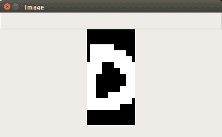
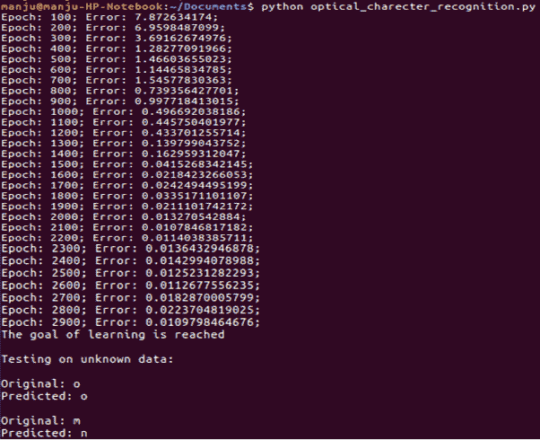

# 第十一章：为光学字符识别构建神经网络模块

本章介绍了以下食谱：

+   使用**光学字符识别**（**OCR**）系统

+   使用软件进行光学字符可视化

+   使用神经网络构建光学字符识别器

+   OCR 系统应用

# 简介

OCR 系统用于将文本图像转换为字母、单词和句子。它在各个领域被广泛使用，用于从图像中转换/提取信息。它还用于签名识别、自动数据评估和安全系统。在商业上，OCR 用于验证数据记录、护照文件、发票、银行对账单、电子收据、名片、静态数据的打印输出等。OCR 是模式识别、人工智能和计算机视觉研究的一个领域。

# 可视化光学字符

光学字符可视化是将印刷文本数字化的一种常见方法，以便此类文本可以电子编辑、搜索、紧凑存储并在网上显示。目前，它们在认知计算、机器翻译、文本转语音转换、文本挖掘等领域得到广泛应用。

# 如何操作...

1.  导入以下包：

```py
import os 
import sys 
import cv2 
import numpy as np 
```

1.  加载输入数据：

```py
in_file = 'words.data'  
```

1.  定义可视化参数：

```py
scale_factor = 10 
s_index = 6 
e_index = -1 
h, w = 16, 8 
```

1.  循环直到遇到*Esc*键：

```py
with open(in_file, 'r') as f: 
  for line in f.readlines(): 
    information = np.array([255*float(x) for x in line.split('t')[s_index:e_index]]) 
    image = np.reshape(information, (h,w)) 
    image_scaled = cv2.resize(image, None, fx=scale_factor, fy=scale_factor) 
    cv2.imshow('Image', image_scaled) 
    a = cv2.waitKey() 
    if a == 10: 
      break 
```

1.  输入 `python visualize_character.py` 以执行代码：


1.  执行`visualize_character.py`时得到的结果如下所示：



# 使用神经网络构建光学字符识别器

本节描述了基于神经网络的字符识别方案。

# 如何做这件事...

1.  导入以下包：

```py
import numpy as np 
import neurolab as nl 
```

1.  读取输入文件：

```py
in_file = 'words.data'
```

1.  考虑使用 20 个数据点构建基于神经网络的系统：

```py
# Number of datapoints to load from the input file 
num_of_datapoints = 20
```

1.  表示不同的字符：

```py
original_labels = 'omandig' 
# Number of distinct characters 
num_of_charect = len(original_labels) 
```

1.  使用 90%的数据来训练神经网络，剩余的 10%用于测试：

```py
train_param = int(0.9 * num_of_datapoints) 
test_param = num_of_datapoints - train_param 
```

1.  定义数据集提取参数：

```py
s_index = 6 
e_index = -1 
```

1.  构建数据集：

```py
information = [] 
labels = [] 
with open(in_file, 'r') as f: 
  for line in f.readlines(): 
    # Split the line tabwise 
    list_of_values = line.split('t') 
```

1.  实现一个错误检查来确认字符：

```py
    if list_of_values[1] not in original_labels: 
      continue 
```

1.  提取标签并将其附加到主列表：

```py
    label = np.zeros((num_of_charect , 1)) 
    label[original_labels.index(list_of_values[1])] = 1 
    labels.append(label)
```

1.  提取字符并将其添加到主列表中：

```py
    extract_char = np.array([float(x) for x in     list_of_values[s_index:e_index]]) 
    information.append(extract_char)
```

1.  一旦加载所需数据集，就退出循环：

```py
    if len(information) >= num_of_datapoints: 
      break 
```

1.  将信息和标签转换为 NumPy 数组：

```py
information = np.array(information) 
labels = np.array(labels).reshape(num_of_datapoints, num_of_charect) 
```

1.  提取维度数量：

```py
num_dimension = len(information[0]) 
```

1.  创建并训练神经网络：

```py
neural_net = nl.net.newff([[0, 1] for _ in range(len(information[0]))], [128, 16, num_of_charect]) 
neural_net.trainf = nl.train.train_gd 
error = neural_net.train(information[:train_param,:], labels[:train_param,:], epochs=10000, show=100, goal=0.01) 
```

1.  预测测试输入的输出：

```py
p_output = neural_net.sim(information[train_param:, :]) 
print "nTesting on unknown data:" 
  for i in range(test_param): 
    print "nOriginal:", original_labels[np.argmax(labels[i])] 
    print "Predicted:", original_labels[np.argmax(p_output[i])]
```

1.  执行`optical_character_recognition.py`时得到的结果如下截图所示：



# 它是如何工作的...

基于神经网络的光学字符识别系统被构建出来，用于从图像中提取文本。这个过程包括使用字符数据集对神经网络系统进行训练、测试和验证。

读者可以参考文章《基于神经网络的字符识别系统》来了解 OCR 背后的基本原理：[`ieeexplore.ieee.org/document/6419976/`](http://ieeexplore.ieee.org/document/6419976/).

# 参见

请参考以下内容：

+   [`thecodpast.org/2015/09/top-5-ocr-apps/`](https://thecodpast.org/2015/09/top-5-ocr-apps/)

+   [`convertio.co/ocr/`](https://convertio.co/ocr/)

# OCR 系统应用

光学字符识别系统（OCR）被广泛用于从图像中转换/提取文本（字母和数字）。OCR 系统在验证商业文件、自动车牌识别以及从文档中提取关键字符方面得到广泛应用。它还被用于使印刷文档的电子图像可搜索，并为盲人和视力受损用户提供辅助技术。
