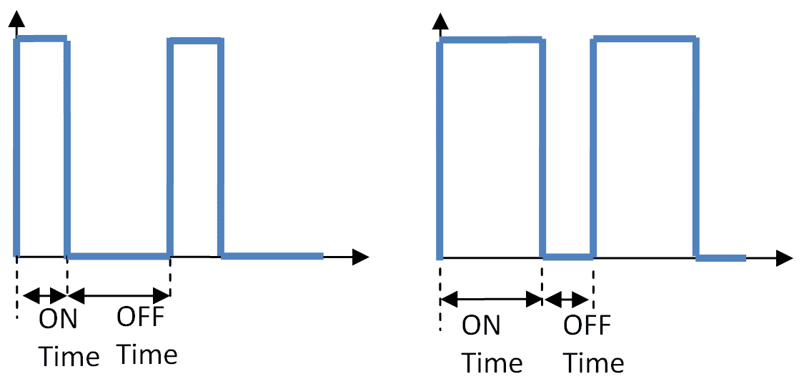

# 构建机器人

在本章中，我们将涵盖以下主题：

+   使用前向驱动电机构建 Rover-Pi 机器人

+   使用高级电机控制

+   构建一个六足 Pi-Bug 机器人

+   直接使用 ServoBlaster 控制伺服电机

+   避免物体和障碍物

+   获得方向感

# 简介

一台拥有“像行星一样大的大脑”的小型电脑（引用自道格拉斯·亚当斯所著的《银河系漫游指南》），作为您自己机器人创造的头脑将非常完美。现实中，树莓派可能提供的处理能力远超过一个小型机器人或探测车所需的；然而，其小巧的尺寸、优秀的连接性和相对较低的能量需求意味着它非常适合。

本章将重点探讨我们可以结合电机或伺服机构以产生机器人运动的各种方法，使用传感器来收集信息，并允许我们的创造物对其做出反应。

一定要查看*附录*，*硬件和软件列表*；它列出了本章中使用的所有物品以及你可以从哪里获取它们。

# 使用前向驱动电机构建 Rover-Pi 机器人

制作机器人不必是一项昂贵的爱好。可以使用家用物品来构建一个小型、漫游车型的机器人底盘（即所有部件都连接到的基座），并且可以使用几个小型驱动电机来移动它。

Rover-Pi 机器人是一种小型、四足型机器人，它有两个轮子和一个在前端的滑轮或万向轮，以便它能够转向。以下图片展示了一个这样的机器人：


一个自制的 Rover-Pi 机器人

虽然它可能无法与火星探测车相提并论，正如您将看到的，您有很多可以实验的内容。

您还可以购买众多价格低廉的机器人套件之一，这些套件包含您所需的大部分组件，只需一个包装（参见本例末尾的*更多内容...*部分）。

# 准备就绪

我们将要建造的探测器需要包含以下图中所示的各种元素：


Rover-Pi 机器人的各个部分

元素将按以下方式详细讨论：

+   **底盘**: 本例使用了一个经过修改的、电池供电的推式夜灯（尽管可以使用任何合适的平台）。请记住，你的机器人越大、越重，驱动电机就需要越强大才能移动它。或者，你也可以使用在“更多内容...”部分列出的底盘套件之一。以下照片展示了一个合适的推式夜灯：


这个推动式夜灯构成了 Rover-Pi 机器人的基本底盘

+   **前滑或转向轮**: 这可以简单到将一个大的回形针（76 mm/3 英寸）弯曲成形状，或者使用一个小转向轮。滑块在光滑表面上工作时效果最佳，但可能会在地毯上卡住。转向轮在所有表面上都能很好地工作，但有时可能会在转向时出现问题。

+   **轮子、电机、齿轮**：Rover-Pi 机器人的轮子运动是电机、齿轮和轮子的组合。齿轮很有帮助，因为它们允许高速旋转的电机以较慢的速度和更大的力量（扭矩）转动轮子；这将使我们能够更好地控制我们的机器人。以下照片展示了将轮子、电机和齿轮组合成单个单元的单元：


这些带有内置齿轮电机的轮子非常适合小型漫游车

+   **电池/电源**: Rover-Pi 机器人将使用四个 AA 电池供电，这些电池被安装到底盘的凹槽中。另外，可以使用标准的电池夹，或者甚至是一根连接到合适电源的长电线。建议您使用与 Raspberry Pi 独立的电源为电机供电。这有助于避免在驱动电机时，由于电机需要大电流跳跃来移动，导致 Raspberry Pi 突然断电的情况。另外，您也可以使用 5V 稳压器用电池为 Raspberry Pi 供电。以下图片展示了一个带有四个 AA 电池的底盘：


四节 AA 电池为驱动轮提供电源

+   **电机驱动/控制器**：电机需要比 GPIO 能够处理的电压和电流更大的电压和电流。因此，我们将使用**达林顿阵列模块**（该模块使用**ULN2003**芯片）。请参阅本例末尾的*更多内容...*部分，以获取有关该特定模块如何工作的更多详细信息。以下照片显示了一个达林顿阵列模块：


这款达尔顿阵列模块可在 http://www.dx.com 购买，可用于驱动小型电机

+   **小型电缆扎带或线扎带**：这将使我们能够将诸如电机或控制器之类的物品固定在底盘上。以下照片展示了电缆扎带的使用：


我们使用电缆扎带将电机和轮子固定在底盘上

+   **树莓派连接**：最简单的设置是将控制线通过长线连接到树莓派上，这样您就可以通过连接的屏幕和键盘轻松直接控制您的机器人。稍后，您可以考虑将树莓派安装在机器人上，并远程（或者甚至自主地，如果您包括传感器和智能来理解它们）控制它。

在本章中，我们将使用`wiringpi2` Python 库来控制 GPIO；有关如何使用 Python 包管理器（`pip`）安装它的详细信息，请参阅第十章，*感知和显示现实世界数据*。

# 如何做到这一点...

按照以下步骤创建一个小型 Rover-Pi 机器人：

1.  在底盘前方，您需要通过弯曲来安装滑块

    将回形针/电线弯成 V 形。通过在底盘两侧钻小孔，将回形针/电线固定在底盘前方，通过孔将电缆扎带穿过电线周围，并拉紧以固定。安装好的电线滑块应与以下照片中所示类似：


安装在 Rover-Pi 机器人前端的电缆滑轨

1.  在安装车轮之前，你需要计算出底盘的大致重心位置（在底盘内安装电池时进行此操作，因为它们会影响平衡）。通过尝试用两只手指分别平衡底盘，并找出底盘向前或向后倾斜的距离来感受重心的位置。对于我的设备，这个位置大约在中心后 1 厘米（大约三分之一英寸）。你应该将车轮轴稍微放在这个位置之后，这样漫游车就会稍微向前倾斜在滑板上。在底盘上标记车轮的位置。

1.  在每侧钻三个孔，使用电缆扎带安装车轮。如果电缆扎带不够长，你可以通过将一个扎带的末端穿过另一个扎带的末端来连接它们（只拉到扎带能够抓住的程度，以便延长扎带）。以下图示展示了如何使用电缆扎带：


将电机牢固地固定在底盘上

1.  接下来，通过将电池插入单元来测试电机；然后，断开原本连接到灯泡的电线，并将它们接触到电机触点上。确定电机上哪个连接应该是正极，哪个应该是负极，以便电机使机器人向前移动（当机器人面向前方时，轮子的顶部应该向前移动）。将红色和黑色电线连接到电机上（在我的电机上，黑色在电机顶部代表负极，红色在底部代表正极），确保电线足够长，可以到达底盘上的任何位置（大约 14 厘米，即约 5.5 英寸，对于夜灯来说已经足够了）。

罗伏-派机器人组件应按照以下图示进行接线：


Rover-Pi 机器人的布线布局

为了建立联系，请执行以下步骤：

1.  将电机的黑色线连接到达林顿模块的**OUT 1**（左侧）和**OUT 2**（右侧）输出，并将红色线连接到最后一个引脚（COM 连接）。

1.  接下来，将电池线连接到模块底部的**GND**/**V-**和**V+**连接处。

1.  最后，将 GPIO 连接器（**引脚 6**）的**GND**连接到相同的**GND**连接。

1.  通过将 3.3V（GPIO **Pin 1**）连接到**IN1**或**IN2**来测试电机控制，以模拟 GPIO 输出。当你满意时，将 GPIO **Pin 16**连接到**IN1**（用于左侧）和 GPIO **Pin 18**连接到**IN2**（用于右侧）。

线路现在应与以下表格中给出的细节相匹配：

| **树莓派 GPIO** | **达林顿模块** |
| --- | --- |
| 引脚 16：左侧 | IN1 |
| 引脚 18：右 | IN2 |
| 引脚 6: GND | GND/V-（标记为 -） |
| **4 x AA 电池达林顿模块** |  |
| 电池的正面 | V+（标记为+） |
| 电池的负面 | GND/V-（标记为-） |
| **电机** |  |
| 左电机：黑色电线 | OUT 1（白色插座中的顶部插针） |
| 右侧电机：黑色电线 | OUT 2（白色插座中的第二个插孔） |
| 两个电机：红色电线 | COM（白色插座中的最后一个引脚） |

使用以下 `rover_drivefwd.py` 脚本进行控制测试：

```py
#!/usr/bin/env python3 
#rover_drivefwd.py 
#HARDWARE SETUP 
# GPIO 
# 2[==X====LR====]26[=======]40 
# 1[=============]25[=======]39 
import time 
import wiringpi2 
ON=1;OFF=0 
IN=0;OUT=1 
STEP=0.5 
PINS=[16,18] # PINS=[L-motor,R-motor] 
FWD=[ON,ON] 
RIGHT=[ON,OFF] 
LEFT=[OFF,ON] 
DEBUG=True 

class motor: 
  # Constructor 
  def __init__(self,pins=PINS,steptime=STEP): 
    self.pins = pins 
    self.steptime=steptime 
    self.GPIOsetup() 

  def GPIOsetup(self): 
    wiringpi2.wiringPiSetupPhys() 
    for gpio in self.pins: 
      wiringpi2.pinMode(gpio,OUT) 

  def off(self): 
    for gpio in self.pins: 
      wiringpi2.digitalWrite(gpio,OFF) 

  def drive(self,drive,step=STEP): 
    for idx,gpio in enumerate(self.pins): 
      wiringpi2.digitalWrite(gpio,drive[idx]) 
      if(DEBUG):print("%s:%s"%(gpio,drive[idx])) 
    time.sleep(step) 
    self.off() 

  def cmd(self,char,step=STEP): 
    if char == 'f': 
      self.drive(FWD,step) 
    elif char == 'r': 
      self.drive(RIGHT,step) 
    elif char == 'l': 
      self.drive(LEFT,step) 
    elif char == '#': 
      time.sleep(step) 

def main(): 
  import os 
  if "CMD" in os.environ: 
    CMD=os.environ["CMD"] 
    INPUT=False 
    print("CMD="+CMD) 
  else: 
    INPUT=True 
  roverPi=motor() 
  if INPUT: 
    print("Enter CMDs [f,r,l,#]:") 
    CMD=input() 
  for idx,char in enumerate(CMD.lower()): 
    if(DEBUG):print("Step %s of %s: %s"%(idx+1,len(CMD),char)) 
    roverPi.cmd(char) 

if __name__=='__main__': 
  try: 
    main() 
  finally: 
    print ("Finish") 
#End 
```

记住在使用本章中的脚本之前应该安装`wiringpi2`（参见第十章*，感知和显示现实世界数据*）。

使用以下命令运行前面的代码：

```py
sudo python3 rover_drivefwd.py 
```

脚本将提示您以下信息：

```py
Enter CMDs [f,r,l,#]:  
```

您可以输入一系列命令来执行；例如：

```py
ffrr#ff#llff  
```

前述命令将指导 Rover-Pi 机器人执行一系列动作：前进（`f`）、向右（`r`）、暂停（`#`）和向左（`l`）。

# 它是如何工作的...

一旦你搭建好机器人并将轮子连接到电机控制器，你就可以研究如何控制它。

首先导入`time`模块（这将允许你在电机控制中添加暂停）和`wiringpi2`模块（以允许控制 GPIO 引脚）。在这里使用`wiringpi2`，因为它使得使用 I/O 扩展器和其他 I²C 设备变得更加容易，如果你以后需要的话。

定义用于设置引脚`ON`/`OFF`、方向`IN`/`OUT`以及每个电机`STEP`持续时间的值。同时，定义哪些`PINS`连接到电机控制，以及我们的移动，`FWD`、`RIGHT`和`LEFT`。移动的定义方式是，通过同时开启两个电机，你会向前移动，而只开启一个电机，你会转向。通过在文件开头使用变量设置这些值，我们的代码更容易维护和理解。

我们定义了一个`motor`类，这将允许我们在其他代码中重用它，或者轻松地将其与替代的`motor`类进行交换，以便如果我们想使用其他硬件时可以使用。我们设置了我们正在使用的默认引脚和我们的`steptime`值（`steptime`对象定义了在每一步中我们驱动电机（s）的时间）。然而，如果需要，这两个值在初始化对象时仍然可以指定。

接下来，我们调用 `GPIOsetup()`；它选择物理引脚编号模式（因此我们可以按照它们在板上的位置来引用引脚）。我们还设置我们使用的所有引脚为输出模式。

最后，对于`电机`类，我们定义了以下三个函数：

+   我们定义的第一个函数（称为`off()`）将允许我们关闭电机，因此我们将遍历引脚列表并将每个 GPIO 引脚设置为低电平（从而关闭电机）。

+   `drive()` 函数允许我们提供一组驱动动作列表（每个 GPIO 引脚的 `ON` 和 `OFF` 组合）。同样，我们遍历每个引脚，并将它们设置为相应的驱动动作，等待步进时间，然后使用 `off()` 函数关闭电机。

+   我们定义的最后一个函数（称为`cmd()`）仅仅允许我们发送`char`（单个字符）并使用它来选择我们想要使用的驱动动作集合（`FWD`、`RIGHT`或`LEFT`，或者等待（`#`））。

对于测试，`main()` 允许我们使用以下命令从命令行指定需要执行的一系列操作：

```py
sudo CMD=f#lrr##fff python3 rover_drivefwd.py

```

使用 `os.environ`（通过导入 `os` 模块以便使用它），我们可以在命令中检查 `CMD`，并将其用作我们的驱动动作列表。如果没有提供 `CMD` 命令，我们可以使用 `input()` 函数直接提示输入驱动动作列表。要使用 `motor` 类，我们设置 `roverPi=motor()`；这允许我们使用驱动动作列表中的每个字符调用（电机类的）`cmd()` 函数。

# 还有更多...

你的机器人应该只受限于你自己的创造力。有许多合适的底盘选项、其他电机、轮子和控制及驱动轮子的方式。你应该进行实验和测试，以确定哪些组合效果最佳。这些都是乐趣的一部分！

# 达尔林顿阵列电路

达尔林顿晶体管是一种驱动高功率设备（如电机或甚至继电器）的低成本方法。它们由两个串联排列的晶体管组成，其中一个晶体管向另一个晶体管供电（允许电流增益相乘）。也就是说，如果第一个晶体管的增益为 20，第二个晶体管的增益也为 20，那么它们共同将提供 400 的总增益。

这意味着在以下图中，基极引脚（1）上的 1 mA 电流可以使你通过达林顿晶体管驱动高达 400 mA 的电流。达林顿晶体管的电气符号在以下图中显示：


达林顿晶体管的电气符号展示了两个晶体管是如何封装在一起的

ULN2003 芯片在之前的模块中使用，并提供七个 NPN 达林顿晶体管（如果需要更多输出或与两个步进电机一起使用，还可以使用八通道版本，即 ULN2803）。以下图示展示了如何使用达林顿阵列来驱动电机：


使用达林顿阵列驱动两个小型电机

芯片每个输出端可提供最大 500 mA 的电流，电压高达 50V（足以驱动大多数小型电机）。然而，随着使用时间的延长，芯片可能会过热，因此在驱动大型电机时建议使用散热片。芯片内部集成了用于保护的二极管，每个达林顿晶体管之间都连接了一个。这是必要的，因为当电机在没有驱动的情况下移动时（这可能是由于电机的自然惯性引起的），它会像一个发电机一样工作。会产生一个称为**反电动势**的逆电压，如果不通过二极管耗散，将会损坏晶体管。

芯片的一个缺点是正电源电压必须始终连接到公共引脚（COM），因此每个输出只能吸收电流。也就是说，它只能驱动电机单向运行，COM 引脚上为正电压，OUT 引脚上为负电压。因此，如果我们希望以不同的方向驱动我们的 Rover-Pi 机器人，我们需要一个不同的解决方案（参见*使用高级电机控制*菜谱中的下一个示例）。

这些芯片也可以用来驱动某些类型的步进电机。来自[`www.dx.com`](http://www.dx.com)的一个模块将步进电机作为套件的一部分。尽管齿轮是为了非常缓慢的运动设计的，大约每转 12 秒（对于漫游车来说太慢了），但对于时钟来说仍然很有趣（或许）。

# 晶体管和继电器电路

继电器能够处理功率更高的电机，因为它们是由电磁线圈控制的机械开关，该线圈会物理地移动触点。然而，它们需要相当大的电流才能开启——通常超过 3.3V。为了切换即使是小型的继电器，我们需要大约 60 mA 的 5V 电流（这超过了 GPIO 提供的电流），因此我们仍然需要使用一些额外的组件来切换它。

我们可以使用达林顿阵列（如之前所述）或一个小型晶体管（任何小型晶体管，例如 2N2222，都将是合适的）来提供切换所需的电流和电压。以下电路将使我们能够做到这一点：


用于驱动外部电路的晶体管和继电器电路

就像电机一样，继电器也可以产生电磁感应峰值，因此需要一个保护二极管来避免晶体管上出现任何反向电压。

这是一个非常有用的电路，不仅适用于驱动电机，而且适用于任何外部电路；物理开关允许它与控制它的 Raspberry Pi 独立且电隔离。

只要正确选择继电器，您就可以通过它驱动直流或交流设备。

您可以使用一些继电器来控制由主电源供电的设备。然而，这只能非常谨慎地进行，并且需要适当的电气培训。主电源的电力可能致命或造成严重伤害。

PiBorg 拥有一个名为 **PicoBorg** 的现成模块，该模块允许切换多达四个继电器。它使用被称为 **金属氧化物半导体场效应晶体管** (**MOSFETs**) 的设备，这些设备本质上是在之前讨论过的相同原理下工作的晶体管的高功率版本。

# 绑定或非绑定机器人

在设计自己的 Rover-Pi 机器人时，一个重要的选择是决定你是否希望使其完全独立，或者你是否愿意有一个连接（一根连接到 Rover-Pi 的长控制/电源电缆）。使用连接线，你可以降低 Rover-Pi 机器人的重量，这意味着小型电机可以轻松地移动单元。这将允许你将 Raspberry Pi 与主单元分开，以便它可以连接到屏幕和键盘，便于编程和调试。主要的缺点是，你将需要一个长长的脐带状连接到你的 Rover-Pi 机器人（每个控制信号都有一根线），这可能会阻碍其移动。然而，正如我们稍后将会看到的，你可能只需要三根或四根线就能提供你所需要的所有控制（参见下一道菜谱中的*使用 I/O 扩展器*部分）。

如果你打算直接将 Raspberry Pi 安装在 Rover-Pi 机器人上，你需要一个合适的电源，例如手机充电电池组。如果电池组有两个 USB 端口，那么你可能能够将其用作电源来驱动 Raspberry Pi 和电机。该单元必须能够独立维持供应，因为驱动电机可能引起的任何电源尖峰都可能导致 Raspberry Pi 重置。

记住，如果树莓派现在连接到了机器人，你需要一种控制它的方法。这可能是一个允许通过 SSH 远程连接的 USB Wi-Fi 外置设备（等等），或者是一个使用 RF/蓝牙的无线键盘，甚至可以是来自第九章*,* *使用 Python 驱动硬件*中的 GPIO D-Pad，它可以用来进行直接控制。

然而，你安装在底盘上的东西越多，电机就需要更努力地工作才能移动。你可能发现需要更强的电机，而不是这里使用的那些小电机。以下照片展示了一个由 USB 电池组供电的 Rover-Pi 机器人：


一款由电池供电的 Raspberry Rover-Pi 机器人，可通过 Wi-Fi（可选电缆管理）进行控制

# 探索者套件

如果你不想自己制作底盘，也有许多现成的漫游车底盘可供选择。具体如下：

+   来自 [`www.sparkfun.com/`](https://www.sparkfun.com/) 的 2WD 魔术师机器人底盘

+   4-Motor Smart Car Chassis from [`www.dx.com/`](http://www.dx.com/)

+   来自 [`www.dx.com/`](http://www.dx.com/) 的 2-Wheel 智能汽车模型


TiddlyBot 展示了如何在单个平台上集成多个组件，正如我在修改版本中所展示的那样

一个特别出色的机器人设置是 TiddlyBot（来自[`www.PiBot.org`](http://www.PiBot.org)），它集成了多个传感器、连续伺服系统、内置电池组和 Raspberry Pi 摄像头。SD 卡已设置，使 TiddlyBot 充当 Wi-Fi 热点，提供带有远程控制界面的简单拖放编程平台。

这展示了如何将本章描述的简单组件组合成一个完整的系统：


TiddlyBot 图形用户界面提供了一个跨平台的拖放界面，以及 Python 支持

一定要查看*附录*，*硬件和软件列表*；它列出了本章中使用的所有物品以及你可以从哪里获取它们。

# 使用高级电机控制

之前的驱动电路不适用于驱动多方向运行的电机（因为它们只能控制电机的开启或关闭）。然而，使用名为 H 桥的电路，你还可以切换和控制电机的方向。

开关组合在以下图中展示：


电机方向可以通过不同的开关组合来控制

通过使用不同的切换组合，我们可以通过切换电机的正负电源来改变电机的方向（**SW1** 和 **SW4** 激活电机，而 **SW2** 和 **SW3** 使电机反转）。然而，我们不仅需要为每个电机配备四个切换装置，而且由于 ULN2X03 设备和 PiBorg 的 PicoBorg 模块只能吸收电流，因此还需要等效的设备来提供电流（以构成开关的上部部分）。

幸运的是，存在专门设计的 H 桥芯片，例如 L298N，它们内部包含之前的电路，从而提供了一种强大且便捷的方式来控制电机。

# 准备就绪

我们将用以下图片中显示的 H 桥电机控制器替换之前的达林顿阵列模块：


H 桥电机控制器允许对电机进行方向控制

L298N 的数据表可在[`www.st.com/resource/en/datasheet/l298.pdf`](http://www.st.com/resource/en/datasheet/l298.pdf)获取。

# 如何做到这一点...

该单元需要按照以下方式接线（这与其他类型的 H-bridge 控制器类似，但如有疑问，请查阅相关数据表）。

以下表格展示了电机和电机电源如何连接到 H 桥控制器模块：

| **模块的电机侧 – 连接到电池和电机** |
| --- |
| **电机 A** | **VMS** | **地** | **5V 输出** | **电机 B** |
| 左电机红色线 | 左电机黑色线 | 电池正极 | 电池地线 | 无 | 右电机红色线 | 右电机黑色线 |

以下表格展示了 H 桥控制器模块如何连接到树莓派：

| **模块控制端 – 连接到树莓派 GPIO 引脚头** |
| --- |
| **ENA** | **IN1** | **IN2** | **IN3** | **IN4** | **ENB** | **GND** | **5V** |
| 无 | 引脚 15 | 引脚 16 | 引脚 18 | 引脚 22 | 无 | 引脚 6 | 无 |

建议您保持上拉电阻跳线（UR1-UR4）开启状态，并允许电机电源为板载电压调节器供电，该调节器反过来将为 L298N 控制器（跳线 5V_EN）供电。板载调节器（78M05 器件）可提供高达 500 mA 的电流，足以满足 L298N 控制器以及任何额外的电路，例如 I/O 扩展器（更多信息请参阅*更多内容...*部分）。ENA 和 ENB 引脚应断开连接（默认情况下，电机输出将保持启用状态）。

您需要对之前的 `rover_drivefwd.py` 脚本进行以下修改（您可以将其保存为 `rover_drive.py`）。

在文件顶部，重新定义`PINS`，如下所示：

```py
PINS=[15,16,18,22]   # PINS=[L_FWD,L_BWD,R_FWD,R_BWD] 
```

并更新控制模式，如下所示：

```py
FWD=[ON,OFF,ON,OFF] 
BWD=[OFF,ON,OFF,ON] 
RIGHT=[OFF,ON,ON,OFF] 
LEFT=[ON,OFF,OFF,ON] 
```

接下来，我们需要将反向命令添加到`cmd()`函数中，如下所示：

```py
  def cmd(self,char,step=STEP): 
    if char == 'f': 
      self.drive(FWD,step) 
    elif char == 'b': 
      self.drive(BWD,step) 
    elif char == 'r': 
      self.drive(RIGHT,step) 
    elif char == 'l': 
      self.drive(LEFT,step) 
    elif char == '#': 
      time.sleep(step) 
```

最后，我们可以在`main()`函数内部的提示中添加`b`（反向）作为一个选项，如下所示：

```py
print("Enter CMDs [f,b,r,l,#]:") 
```

# 它是如何工作的...

H 桥电机控制器通过增加额外的电路来重现先前的开关电路，以确保电子开关不会造成短路（通过不允许**SW1**和**SW3**或**SW2**和**SW4**同时启用）。

H-桥电机控制器的开关电路如下所示：


H-桥开关电路的近似（在电机关闭状态下）

输入（**IN1** 和 **IN2**）将在电机上产生以下动作：

| **IN1****IN2** | **0** | **1** |
| --- | --- | --- |
| 0 | 电机关闭 | 电机倒退 |
| 1 | 电机前进 | 电机关闭 |

正如我们在上一道菜谱中所做的那样，我们可以通过同时驱动两个电机向前移动；然而，现在我们还可以将它们都向后驱动（以向后移动），以及以相反的方向驱动（使我们能够原地转动 Rover-Pi 机器人）。

# 还有更多...

我们可以使用**脉冲宽度调制**（**PWM**）信号来对电机实现更精细的控制，并使用 I/O 扩展器来扩展可用的输入/输出。

# 使用 PWM 控制进行电机速度控制

目前，Rover-Pi 机器人的电机是通过开关控制来控制的；然而，如果机器人移动速度过快（例如，如果你安装了更大的电机或使用了更高的齿轮比），我们可以利用控制器上的**ENA**和**ENB**输入。如果这些设置较低，则禁用电机输出，如果设置为高，则再次启用。因此，通过用 PWM 信号驱动它们，我们可以控制电机的速度。我们甚至可以设置略微不同的 PWM 速率（如果需要），以补偿电机/车轮或表面的任何差异，从而以略微不同的速度驱动它们，如下面的图示所示：



PWM 信号控制着开启和关闭时间的比例

PWM 信号是一种数字式的开/关信号，其**开**时间与**关**时间不同。使用 50:50 的`开:关`信号的电机驱动将使电机以 100%开信号功率的一半运行，因此运行速度会较慢。通过使用不同的比率，我们可以使电机以不同的速度运行。

我们可以使用树莓派的硬件 PWM（GPIO 引脚 12 可以使用 PWM 驱动器）。

PWM 驱动器通常提供模拟音频输出的一个音频通道。有时，这会产生干扰；因此，建议您断开连接到模拟音频插座的任何设备。

在`wiringpi2`中通过将引脚模式设置为`2`（即`PWM`的值）并指定开启时间（表示为`ON_TIME`）如下启用硬件 PWM 功能：

```py
PWM_PIN=12; PWM=2; ON_TIME=512  #0-1024 Off-On 

  def GPIOsetup(self): 
    wiringpi2.wiringPiSetupPhys() 
    wiringpi2.pinMode(PWM_PIN,PWM) 
    wiringpi2.pwmWrite(PWM_PIN,ON_TIME) 
    for gpio in self.pins: 
      wiringpi2.pinMode(gpio,OUT) 
```

然而，这仅适用于联合 PWM 电机控制（因为它连接到 ENA 和 ENB），因为只有一个可用的硬件 PWM 输出。

另一个选择是使用`wiringpi2`的软件 PWM 功能。这通过软件生成一个粗略的 PWM 信号；根据您的需求，这可能是可以接受的。在 GPIO 引脚 7 和 GPIO 引脚 11 上生成软件 PWM 信号的代码如下：

```py
PWM_PIN_ENA=7;PWM_PIN_ENA=11;RANGE=100 #0-100 (100Hz Max) 
ON_TIME1=20; ON_TIME2=75 #0-100 
ON_TIME1=20  #0-100 
  def GPIOsetup(self): 
    wiringpi2.wiringPiSetupPhys() 
    wiringpi2.softPwmCreate(PWM_PIN_ENA,ON_TIME1,RANGE) 
    wiringpi2.softPwmCreate(PWM_PIN_ENB,ON_TIME2,RANGE) 
    for gpio in self.pins: 
      wiringpi2.pinMode(gpio,OUT) 
```

之前的代码将两个引脚都设置为 100 Hz，其中 GPIO 引脚 7 设置为开启时间为 2 ms（关闭时间为 8 ms），GPIO 引脚 11 设置为 7.5 ms/2.5 ms。

要调整 PWM 定时，请使用`wiringpi2.softPwmWrite(PWM_PIN_ENA,ON_TIME2)`。

PWM 信号的精度可能会被其他系统进程中断，但它可以控制一个小型微服，即使它略有抖动。

# 使用 I/O 扩展器

如我们之前所见（在第十章*，感知与显示现实世界数据*），`wiringpi2` 允许我们轻松调整代码以利用 I²C 使用 I/O 扩展器。在这种情况下，添加额外的电路可能很有用，例如传感器和 LED 状态指示器，甚至可能还有显示屏和控制按钮，以帮助你在开发过程中调试和控制 Rover-Pi 机器人。

如果您打算将其用作固定连接的设备，这将特别有用，因为您只需要三根线就可以连接回树莓派（I²C 数据 GPIO 引脚 3、I²C 时钟 GPIO 引脚 5 和地 GPIO 引脚 6），I²C VCC 由电机控制器的 5V 输出提供。

如前例所示，添加 I²C 地址和引脚基的宏定义，如下所示：

```py
IO_ADDR=0x20 
AF_BASE=100 
```

然后，在 `gpiosetup()` 函数中，使用以下代码设置 MCP23017 设备：

```py
wiringpi2.mcp23017Setup(AF_BASE,IO_ADDR) 
```

确保您所引用的任何引脚编号为 100-115（以引用 I/O 扩展器的引脚 A0-7 和 B0-7），并添加`AF_BASE`（这是 I/O 扩展器的引脚偏移量）。

# 构建一个六足 Pi-Bug 机器人

控制电机对于创建类似车辆的机器人非常有用，但创建更自然行为的机器人组件（例如伺服电机）可以提供出色的结果。有许多类似昆虫的机器人创意设计，甚至还有双足设计（具有类似人腿的设计），它们使用伺服电机提供自然的关节运动。本例中的设计使用了三个伺服电机，但这些原则和概念可以轻松应用于更复杂的设计，以控制使用多个伺服电机的腿/手臂。以下照片展示了 Pi-Bug 机器人：


六足 Pi-Bug 机器人使用伺服驱动器来控制三个伺服电机，在周围爬行

# 准备工作

您需要以下硬件：

+   **PWM 驱动模块**：需要一个驱动模块，例如 Adafruit 16-Channel 12-bit PWM/Servo 驱动器。这个模块使用 PCA9685 设备；有关详细信息，请参阅[`www.adafruit.com/datasheets/PCA9685.pdf`](http://www.adafruit.com/datasheets/PCA9685.pdf)数据表。

+   **三个微型伺服电机**：MG90S 9g 金属齿轮伺服电机以低廉的成本提供合理的扭矩。

+   **粗重的导线**：这将形成腿的部分；三个巨大的回形针（76 毫米/3 英寸）非常适合这个用途。

+   **轻质线缆夹具**：这些将用于将腿部连接到伺服电机，并将伺服电机安装到主板上。

+   **一小块胶合板或纤维板**：可以在其上钻孔，并将伺服电机安装在其上。

您需要安装`wiringpi2`来控制 PWM 模块，并且安装 I²C 工具进行调试将非常有用。有关如何安装`wiringpi2`和 I²C 工具的详细信息，请参阅第十章*，*“感知和显示现实世界数据”*。以下图表显示了 I²C 连接：


Raspberry Pi GPIO 头上的 I²C 连接

# 如何做到这一点...

Pi-Bug 机器人使用三个伺服电机，两侧各一个，中间一个。通过在伺服电机身体两侧各钻一个孔，将电线或电缆绑带穿过孔中，然后拉紧以固定伺服电机。

将纸夹的金属丝弯曲成合适的形状以形成 Pi-Bug 机器人的腿部，并添加一个小弯折，这样你可以将腿部安全地连接到伺服臂上。建议你在将伺服臂固定到位之前，首先运行程序，并将 Pi-Bug 机器人设置为初始位置 `h`。这将确保腿部位于中间位置。

以下图表展示了 Pi-Bug 机器人的组件：


Pi-Bug 机器人的组件布局

创建以下用于控制伺服电机的 `servoAdafruit.py` 脚本：

```py
#!/usr/bin/env python3 
#servoAdafruit.py 
import wiringpi2 
import time 

#PWM Registers 
MODE1=0x00 
PRESCALE=0xFE 
LED0_ON_L=0x06 
LED0_ON_H=0x07 
LED0_OFF_L=0x08 
LED0_OFF_H=0x09 

PWMHZ=50 
PWMADR=0x40 

class servo: 
  # Constructor 
  def __init__(self,pwmFreq=PWMHZ,addr=PWMADR): 
    self.i2c = wiringpi2.I2C() 
    self.devPWM=self.i2c.setup(addr) 
    self.GPIOsetup(pwmFreq,addr) 

  def GPIOsetup(self,pwmFreq,addr): 
    self.i2c.read(self.devPWM) 
    self.pwmInit(pwmFreq) 

  def pwmInit(self,pwmFreq): 
    prescale = 25000000.0 / 4096.0   # 25MHz / 12-bit 
    prescale /= float(pwmFreq) 
    prescale = prescale - 0.5 #-1 then +0.5 to round to 
                              # nearest value 
    prescale = int(prescale) 
    self.i2c.writeReg8(self.devPWM,MODE1,0x00) #RESET 
    mode=self.i2c.read(self.devPWM) 
    self.i2c.writeReg8(self.devPWM,MODE1, 
                       (mode & 0x7F)|0x10) #SLEEP 
    self.i2c.writeReg8(self.devPWM,PRESCALE,prescale) 
    self.i2c.writeReg8(self.devPWM,MODE1,mode) #restore mode 
    time.sleep(0.005) 
    self.i2c.writeReg8(self.devPWM,MODE1,mode|0x80) #restart 

  def setPWM(self,channel, on, off): 
    on=int(on) 
    off=int(off) 
    self.i2c.writeReg8(self.devPWM, 
                       LED0_ON_L+4*channel,on & 0xFF) 
    self.i2c.writeReg8(self.devPWM,LED0_ON_H+4*channel,on>>8) 
    self.i2c.writeReg8(self.devPWM, 
                       LED0_OFF_L+4*channel,off & 0xFF) 
    self.i2c.writeReg8(self.devPWM,LED0_OFF_H+4*channel,off>>8) 

def main(): 
  servoMin = 205  # Min pulse 1ms 204.8 (50Hz) 
  servoMax = 410  # Max pulse 2ms 409.6 (50Hz) 
  myServo=servo() 
  myServo.setPWM(0,0,servoMin) 
  time.sleep(2) 
  myServo.setPWM(0,0,servoMax) 

if __name__=='__main__': 
  try: 
    main() 
  finally: 
    print ("Finish") 
#End 
```

创建以下`bug_drive.py`脚本以控制 Pi-Bug 机器人：

```py
#!/usr/bin/env python3 
#bug_drive.py 
import time 
import servoAdafruit as servoCon 

servoMin = 205  # Min pulse 1000us 204.8 (50Hz) 
servoMax = 410  # Max pulse 2000us 409.6 (50Hz) 

servoL=0; servoM=1; servoR=2 
TILT=10 
MOVE=30 
MID=((servoMax-servoMin)/2)+servoMin 
CW=MID+MOVE; ACW=MID-MOVE 
TR=MID+TILT; TL=MID-TILT 
FWD=[TL,ACW,ACW,TR,CW,CW]#[midL,fwd,fwd,midR,bwd,bwd] 
BWD=[TR,ACW,ACW,TL,CW,CW]#[midR,fwd,fwd,midL,bwd,bwd] 
LEFT=[TR,ACW,CW,TL,CW,ACW]#[midR,fwd,bwd,midL,bwd,fwd] 
RIGHT=[TL,ACW,CW,TR,CW,ACW]#[midL,fwd,bwd,midR,bwd,fwd] 
HOME=[MID,MID,MID,MID,MID,MID] 
PINS=[servoM,servoL,servoR,servoM,servoL,servoR]     
STEP=0.2 
global DEBUG 
DEBUG=False 

class motor: 
  # Constructor 
  def __init__(self,pins=PINS,steptime=STEP): 
    self.pins = pins 
    self.steptime=steptime 
    self.theServo=servoCon.servo() 

  def off(self): 
    #Home position 
    self.drive(HOME,step) 

  def drive(self,drive,step=STEP): 
    for idx,servo in enumerate(self.pins): 
      if(drive[idx]==servoM): 
        time.sleep(step) 
      self.theServo.setPWM(servo,0,drive[idx]) 
      if(drive[idx]==servoM): 
        time.sleep(step) 
      if(DEBUG):print("%s:%s"%(gpio,drive[idx])) 

  def cmd(self,char,step=STEP): 
    if char == 'f': 
      self.drive(FWD,step) 
    elif char == 'b': 
      self.drive(BWD,step) 
    elif char == 'r': 
      self.drive(RIGHT,step) 
    elif char == 'l': 
      self.drive(LEFT,step) 
    elif char == 'h': 
      self.drive(HOME,step) 
    elif char == '#': 
      time.sleep(step) 

def main(): 
  import os 
  DEBUG=True 
  if "CMD" in os.environ: 
    CMD=os.environ["CMD"] 
    INPUT=False 
    print("CMD="+CMD) 
  else: 
    INPUT=True 
  bugPi=motor() 
  if INPUT: 
    print("Enter CMDs [f,b,r,l,h,#]:") 
    CMD=input() 
  for idx,char in enumerate(CMD.lower()): 
    if(DEBUG):print("Step %s of %s: %s"%(idx+1,len(CMD),char)) 
    bugPi.cmd(char) 

if __name__ == '__main__': 
  try: 
    main() 
  except KeyboardInterrupt: 
    print ("Finish") 
#End 
```

# 它是如何工作的...

我们通过探索如何使用 PWM 来控制伺服电机来解释之前的脚本函数。接下来，我们将看到伺服类提供了哪些方法来控制 PCA9685 设备。最后，我们将研究三个伺服电机的运动如何组合，为 Pi-Bug 机器人本身产生前进和转向动作。

# 控制伺服电机

为了控制用于 Pi-Bug 机器人的伺服电机，我们需要一个特殊的控制信号，该信号将决定伺服电机需要移动到的角度。我们将向伺服电机发送一个 PWM 信号，其中开启时间的持续时间将允许我们控制伺服臂的角度（从而，允许我们控制 Pi-Bug 机器人的腿部）。以下图示展示了如何使用 PWM 信号来控制伺服电机的角度：


伺服电机的角度由 PWM 信号的上升时间持续时间控制

大多数伺服电机的角度范围大约为 180 度，中间位置为 90 度。50 Hz 的 PWM 频率将有一个周期为 20 ms，90 度的中间位置通常对应于**上升时间**为 1.5 ms，对于接近 0 度和接近 180 度的范围，其变化范围为±0.5 ms 至 0.4 ms。每种类型的伺服电机可能会有所不同，但如果需要，你应该能够调整代码以适应。以下图表显示了您如何使用不同的 PWM 上升时间来控制伺服电机的角度：


伺服角度通过发送 1 毫秒到 2 毫秒之间的 PWM 上升时间来控制

另一种伺服类型被称为**连续伺服**（此处未使用）。它允许您控制旋转速度而不是角度，并且会根据已应用的 PWM 信号以恒定速度旋转。这两种伺服类型都具有内部反馈回路，会持续驱动伺服直到达到所需的角或速度。

虽然从理论上讲可以使用软件生成这些信号，但你将发现系统上其他进程的任何微小中断都会干扰信号时序；反过来，这会导致伺服机构产生不规律的反应。这就是我们使用硬件 PWM 控制器的原因，它只需要设置特定的上升和下降时间，然后就能自动为我们生成所需的信号。

# 伺服类

伺服代码基于 Adafruit 为他们模块使用的 PWM 驱动器；然而，它并不兼容 Python 3，因此我们需要创建自己的版本。我们将使用`wiringpi2` I²C 驱动器来初始化和控制 I²C PWM 控制器。我们定义了我们将需要使用的寄存器（请参阅 PCA9685 设备的数据表），以及其默认总线地址，`0x40`（PWMADR），以及 50 Hz（PWMHZ）的 PWM 频率。

在我们的伺服类中，我们在 `wiringpi2` 中初始化 I²C 驱动器，并在总线上设置我们的 `devPWM` 设备。接下来，我们初始化 PWM 设备本身（使用 `pwmInit()`）。我们必须计算设备所需的**预分频器**，以便将板载 25 MHz 时钟转换为 50 Hz 信号，以生成我们需要的 PWM 频率；我们将使用以下公式：


预缩放寄存器值使用 12 位值缩放 25 MHz 时钟来设置 PWM 频率

预缩放值被加载到设备中，并触发设备重置以启用它。

接下来，我们创建一个函数来允许控制 PWM 的`ON`和`OFF`时间。`ON`和`OFF`时间是 12 位值（0-4096），因此每个值被分成高字节和低字节（每个 8 位），这些字节需要加载到两个寄存器中。对于`L`（低）寄存器，我们使用`&0xFF`屏蔽掉高 8 位，而对于`H`（高）寄存器，我们向下移位 8 位以提供高 8 位。每个 PWM 通道将有两个寄存器用于`ON`时间和两个用于`OFF`时间，因此我们可以将第一个 PWM 通道寄存器的地址乘以 4 和通道号，以获取其他任何通道的地址。

为了测试我们的`伺服`类，我们定义了伺服器的最小和最大范围，计算方法如下：

+   50 Hz 的 PWM 频率的周期为 20 ms (*T=1/f*)

+   开关时间范围从 0-4,096（即 0 毫秒到 20 毫秒）

现在，我们可以计算 0 度（1 毫秒）和 180 度（2 毫秒）的控制值

如下所示：

+   1 毫秒（伺服最小值）等于 4,096/20 毫秒，即 204.8

+   2 毫秒（伺服最大值）等于 4,096/10 毫秒，即 409.6

我们将数值四舍五入到最接近的整数。

# 学习走路

Pi-Bug 机器人采用了一种常见的设计，允许使用三个伺服电机来创建一个小型、六足的机器人。两端伺服电机提供前进和后退运动，而中间的伺服电机提供控制。以下照片展示了安装好的伺服电机：


伺服电机被安装在电路板的底部，方向是颠倒的

以下表格假设左右伺服电机安装在电路板的底部，且方向颠倒，中间伺服电机垂直安装。如果安装方式不同，您将需要调整代码。

以下表格展示了用于前进的伺服运动：

| **方向** | **中间（伺服 M）** | **左侧（伺服 L）** | **右侧（伺服 R）** |
| --- | --- | --- | --- |
| **主页** | `MID`/中间 | `MID`/中间 | `MID`/中间 |
| **fwdStep1** | `TR`/向上 | `ACW`/腿向前 | `ACW`/腿向后 |
| **fwdStep2** | `TL`/左侧向上 | `CW`/腿向后 | `CW`/腿向前 |

以下图表展示了运动如何使 Pi-Bug 机器人向前迈步：


Pi-Bug 机器人向前移动

虽然一开始可能有些令人困惑，但当你看到机器人移动时，应该会更容易理解。

对于第一次前进步，我们将中间伺服器（`servoM`）顺时针移动，这样 Pi-Bug 机器人的左侧就能通过剩余中间腿的运动离开地面。然后，我们可以移动左侧伺服器（`servoL`）来将左侧的腿向前移动（为后续移动做准备；此时它们并未接触地面）。现在，通过移动右侧伺服器（`servoR`），我们可以将右侧的腿向后移动（允许 Pi-Bug 机器人在那一侧被推向前方）。

第二个前进步骤与之前相同，只是我们使用中间伺服器（`servoM`）将右侧抬起离地。同样，我们将离地的腿向前移动（为下一次做准备），然后将另一侧的腿向后移动（允许 Pi-Bug 机器人的那一侧向前移动）。通过重复前进步骤，Pi-Bug 机器人将向前移动；或者，通过交换由中间伺服器（`servoM`）抬起的两侧，它将向后移动。结果是相当像虫子一样快速地爬行！

要使 Pi-Bug 机器人转向，我们执行类似动作，只不过就像 Rover-Pi 机器人的高级电机控制一样，我们让机器人的一侧前进，另一侧后退。下表显示了用于向右转动的伺服器运动：

| **方向** | **中间（伺服 M）** | **左侧（伺服 L）** | **右侧（伺服 R）** |
| --- | --- | --- | --- |
| **主页** | `MID`/中间 | `MID`/中间 | `MID`/中间 |
| **rightStep1** | `TL`/左侧向上 | `CW`/向后腿 | `ACW`/向后腿 |
| **rightStep2** | `TR`/向上 | `ACW`/腿向前 | `CW`/腿向前 |

将 Pi-Bug 机器人转向右侧的步骤如下所示：


Pi-Bug 机器人向右转

要向右转，我们需要将 Pi-Bug 机器人的左侧抬起离地，但这次，我们将两边的腿向后移动。这允许 Pi-Bug 机器人的右侧向前移动。步子的后半部分抬起右侧离地，然后我们向前移动腿（这将推动 Pi-Bug 机器人的左侧向后）。这样，虫子就会在行走时转向；再次强调，只需交换被抬起的两侧，我们就可以改变 Pi-Bug 机器人将转向的方向。

# Pi-Bug 行走代码

Pi-Bug 机器人的代码被设计成提供与 Rover-Pi 机器人相同的接口，以便它们可以轻松互换。你应该注意到每个类都包含相同的四个函数（`__init__()`, `off()`, `drive()`, 和 `cmd()`）。`__init__()`函数定义了我们将要控制的引脚集合，行走动作的`steptime`值（这次，动作之间的间隔），以及之前定义的服务器模块。

再次强调，我们有一个 `off()` 函数，它提供了一个可以被调用的函数来设置伺服电机到中间位置（这在需要将腿部调整到位时非常有用，正如之前在初始位置中所述）。`off()` 函数使用 `drive()` 函数将每个伺服电机设置到 `MID` 位置。`MID` 值位于 `servoMin` 和 `servoMax` 之间的一半（1.5 ms 以给出 90 度的位置）。

`drive()` 函数与之前的电机控制版本类似；它按照我们在之前讨论的各种运动模式（`FWD`、`BWD`、`LEFT` 和 `RIGHT`）中定义的，循环执行每个伺服所需的动作。然而，为了重现所需的运动模式，我们在移动中间伺服（`servoM`）时，会将其循环两次，并在每次移动中间伺服时插入一个小的延迟。这为伺服移动并给出必要的倾斜，以便在允许它们移动之前将其他腿从地面上抬起提供了时间。

我们将每个伺服命令定义为伺服臂的**顺时针**（**CW**）或**逆时针/逆时**（**ACW**）运动。由于伺服器是倒置安装的，左伺服器（`servoL`）的 ACW（如果从上方看是 CW）运动会使腿部向前移动，而在右伺服器（`servoR`）上相同方向的运动会使腿部向后移动（这在之前的图中是 fwdStep1）。这样，每种模式都可以被定义。

一次又一次，我们使用以下命令提供了一个测试函数，该命令允许从命令行或直接在提示符中定义一系列指令：

```py
sudo CMD=fffll##rr##bb##h python3 bug_drive.py  
```

这包括如果需要，添加 `h` 以返回 `home` 位置。

# 直接使用 ServoBlaster 控制伺服电机

之前的配方展示了使用专门的伺服控制器来处理 Pi-Bug 所使用的伺服电机的控制。这具有优势，即 Raspberry Pi 上正在进行的处理中的任何干扰都不会干扰微妙的伺服控制（因为控制器将继续发送正确的信号）。

然而，树莓派也具备直接伺服控制的能力。为了实现这一点，我们将利用理查德·赫斯特的 ServoBlaster，这是一个多伺服驱动器。

在这个菜谱中，我们将控制连接到 MeArm 的四个伺服电机，这是一个简单的激光切割机器人臂；然而，你可以选择将伺服电机安装到你喜欢的任何设备上：


MeArm 是一个由四个微型伺服电机驱动的简单机械臂

# 准备就绪

大多数伺服电机将有三根线和三个引脚的连接器，如下所示：

| **黑色/棕色** | **红色** | **橙色/白色/黄色/蓝色** |
| --- | --- | --- |
| 地线 | 正电源（通常为小型伺服电机的 5V） | 信号 |

虽然通常可以直接从 Raspberry Pi 的 GPIO 引脚上的 5V 引脚为伺服器供电，但在移动时它们会消耗相当大的电流。除非你有一个非常好的电源，否则这可能会导致 Raspberry Pi 意外重启，从而风险损坏 SD 卡。因此，建议你为它们单独供电；例如，使用一个额外的 USB 电源和连接到地线和正电源的电缆。

默认情况下，伺服电机可以按照以下方式接线：

| **伺服** | 0 | 1 | 2 | 3 | 4 | 5 | 6 | 7 | 所有 GND | 所有 电源 |
| --- | --- | --- | --- | --- | --- | --- | --- | --- | --- | --- |
| **树莓派** **GPIO 引脚** |  |  |
| 7 | 11 | 12 | 13 | 15 | 16 | 19 | 22 | 6 | 无连接 |
| **5V 电源** |  | GND | +5V |

我们将假设我们正在控制四个伺服电机（0、1、2 和 3），这些伺服电机将在稍后安装到 MeArm 或类似设备上：


要安装 ServoBlaster，首先从 Git 仓库下载源文件：

```py
cd ~
wget https://github.com/richardghirst/PiBits/archive/master.zip  
```

解压并打开`matplotlib-master`文件夹，操作如下：

```py
unzip master.zip
rm master.zip
cd PiBits-master/ServoBlaster/user  
```

我们将使用位于用户目录中的用户空间守护进程（称为`servod`）。在我们能够使用它之前，我们应该使用以下命令来编译它：

```py
make servod  
```

应该没有错误，显示以下文本：

```py
gcc -Wall -g -O2 -o servod servod.c mailbox.c -lm  
```

使用信息，请使用以下命令：

```py
./servod --help  
```

现在我们可以测试一个伺服电机；首先，启动`servod`守护进程（设置超时时间为 2,000 毫秒，以便伺服电机移动后关闭）：

```py
sudo servod --idle-timeout=2000  
```

您可以将伺服电机的位置移动到伺服电机范围的 0%。

```py
echo 0=0% > /dev/servoblaster  
```

现在，将伺服电机更新到 50%，使伺服电机旋转到 90 度（伺服中点）：

```py
echo 0=50% > /dev/servoblaster  
```

如 MeArm 构建说明中所建议，在构建机械臂之前，应该连接并校准伺服电机，以确保每个伺服电机能够在其正确范围内移动机械臂。这是通过确保每个伺服电机都接通电源并被指令移动到中点位置（50%/90 度），并且伺服电机臂被安装到预期的方向上完成的：


在将伺服电机安装到 MeArm 之前，每个伺服电机都应该在正确的位置进行校准。

您现在可以在构建和将它们安装到完成的手臂之前，将每个 MeArm 伺服电机（0、1、2 和 3）设置为它们的中间位置（通过依次命令每个电机到 50%）。

伺服电机可以用来控制除 MeArm 之外的各种替代设备，但你的伺服电机可能需要以类似的方式进行校准：


伺服电机的精度控制意味着它们可以用于各种应用，例如，控制模拟手

# 如何做到这一点...

1.  创建以下 `servo_control.py` 脚本：

```py
#!/usr/bin/env python3 
#servo_control.py 
import curses 
import os 
#HARDWARE SETUP 
# GPIO    
# 2[=VX==2=======]26[=======]40 
# 1[===013=======]25[=======]39 
# V=5V X=Gnd 
# Servo 0=Turn 1=Shoulder 2=Elbow 3=Claw 
name=["Turn","Shoulder","Elbow","Claw"] 
CAL=[90,90,90,90] 
MIN=[0,60,40,60]; MAX=[180,165,180,180] 
POS=list(CAL) 
KEY_CMD=[ord('c'),ord('x')] 
#Keys to rotate counter-clockwise 
KEY_LESS={ord('d'):0,ord('s'):1,ord('j'):2,ord('k'):3} 
#Keys to rotate clockwise 
KEY_MORE={ord('a'):0,ord('w'):1,ord('l'):2,ord('i'):3} 

STEP=5; LESS=-STEP; MORE=STEP #Define control steps 
DEG2MS=1.5/180.0; OFFSET=1 #mseconds 
IDLE=2000 #Timeout servo after command 
SERVOD="/home/pi/PiBits-mater/ServoBlaster/user/servod" #Location of servod 
DEBUG=True 
text="Use a-d, w-s, j-l and i-k to control the MeArm. c=Cal x=eXit" 

def initialize(): 
  cmd=("sudo %s --idle-timeout=%s"%(SERVOD, IDLE)) 
  os.system(cmd) 

def limitServo(servo,value): 
  global text 
  if value > MAX[servo]: 
    text=("Max %s position %s:%s"%(name[servo],servo,POS[servo])) 
    return MAX[servo] 
  elif value < MIN[servo]: 
    text=("Min %s position %s:%s"%(name[servo],servo,POS[servo])) 
    return MIN[servo] 
  else: 
    return value 

def updateServo(servo,change): 
  global text 
  POS[servo]=limitServo(servo,POS[servo]+change) 
  setServo(servo,POS[servo]) 
  text=str(POS) 

def setServo(servo,position): 
  ms=OFFSET+(position*DEG2MS) 
  os.system("echo %d=%dus > /dev/servoblaster" %(servo, ms/1000)) 

def calibrate(): 
  global text 
  text="Calibrate 90deg" 
  for i,value in enumerate(CAL): 
    POS[i]=value 
    setServo(i,value) 

def main(term): 
  term.nodelay(1) 
  term.addstr(text) 
  term.refresh() 
  while True: 
    term.move(1,0) 
    c = term.getch() 
    if c != -1: 
      if c in KEY_MORE: 
        updateServo(KEY_MORE[c],MORE) 
      elif c in KEY_LESS: 
        updateServo(KEY_LESS[c],LESS) 
      elif c in KEY_CMD: 
        if c == ord('c'): 
          calibrate() 
        elif c == ord('x'): 
          exit() 
      if DEBUG:term.addstr(text+"   ") 

if __name__=='__main__': 
  initialize() 
  curses.wrapper(main) 
#End 
```

1.  运行脚本：

```py
python3 servo_control.py

```

1.  您可以按照提示控制安装在 MeArm（或您所使用的任何设备）上的伺服电机：

```py
Use a-d, w-s, j-l and i-k to control the MeArm. c=Cal x=eXit 
```

# 它是如何工作的...

脚本首先导入`curses`和`os`模块。标准的 Python `input()`命令需要在每次按键后按下*Enter*键，我们才能对其做出反应。然而，正如我们很快就会看到的，`curses`模块仅仅允许我们扫描键盘按键并立即对其做出响应。我们使用`os`模块来调用 ServoBlaster 命令，就像我们在终端中做的那样。

首先，我们定义我们的设置，例如伺服映射、校准位置、最小/最大范围、我们的控制键，以及每个控制命令的`STEP`大小（以度为单位）。我们还定义了我们的参数，用于计算所需角度（以度为单位）到目标 PWM 信号持续时间（以毫秒为单位）的计算。

对于这些特定的伺服电机，1 毫秒的运行时间等于 0 度，而 2.5 毫秒等于 180 度，因此我们有一个 1 毫秒的偏移量（`OFFSET`）和 180 度/1.5 毫秒的缩放比例（`DEG2MS`）。

因此，我们所需的正常运行时间（以毫秒为单位）可以计算为 *OFFSET + (degrees*DEG2MS)*。最后，我们定义 `SERVOD` 命令行和伺服 `IDLE` 超时以初始化 ServoBlaster 用户守护进程。在 `initialize ()` 函数中，我们使用 `os.system()` 启动 `servod` 守护进程，就像我们之前做的那样。

为了检测按键，我们调用脚本中的`main()`函数，通过`curses.wrapper()`，使`term`能够控制终端的输入和输出。我们使用`term.nodelay(1)`，这样当我们检查是否有按键按下（使用`term.getch()`）时，执行将继续正常进行。我们使用`term.addstr(text)`向用户显示控制键，然后通过`term.refresh()`更新显示。剩余的脚本会检查终端是否有按键按下，并将结果赋值给`c`。如果没有按键按下，则`term.getch()`返回`-1`；否则，返回 ASCII 等效值，我们可以在我们为控制键定义的每个字典中检查它。我们将使用`KEY_MORE`和`KEY_LESS`来改变伺服位置，使用`KEY_CMD`（`c`或`x`）来允许我们将所有伺服设置到校准位置或干净地退出。最后，如果`DEBUG`设置为`True`，我们使用`term.addstr()`显示任何有用的调试信息，并确保它在终端的（1,0）位置显示（从顶部向下数一行）。

对于常规控制，伺服电机的位置将通过`updateServo()`函数进行控制，该函数通过所需的改变（无论是`+STEP`还是`-STEP`）调整当前位置（存储在 POS 数组中）。我们确保新位置在定义的 MAX/MIN 限制内，并报告是否已达到这些限制。然后，伺服电机被指令通过`setServo()`移动到所需位置，指定所需的 PWM 上升时间（以微秒为单位）。

最后一个函数，当按下 *C* 键时调用 `calibrate()`，它简单地设置每个伺服电机到 `CAL` 数组中定义的角度（使用 `setServo()`），并确保当前位置保持最新。

# 使用红外遥控器与你的树莓派配合使用

远程控制机器人通常很有用。添加额外输入的一个简单方法是通过制作

使用一个**红外**（**IR**）接收器和标准遥控器。幸运的是，接收器是

得到充分支持。

我们将使用一个名为 `lirc` 的模块来捕获和解码来自标准

遥控器。

# 准备中

LIRC 支持许多类型的红外探测器，例如 Energenie 的 PiMote 红外板；然而，由于我们只需要接收红外信号，我们可以使用一个简单的（TSOP38238）红外探测器：


TSOP38238 红外接收器的三个引脚可以直接安装在 Raspberry Pi 的引脚头上

使用`apt-get`命令安装以下软件包：

```py
sudo apt-get install lirc lirc-x  
```

将以下内容添加到 `/boot/config.txt` 文件中。这将启用驱动程序并定义接收器所安装的引脚（BCM GPIO24）：

```py
dtoverlay=lirc-rpi,gpio_in_pin=23  
```

重启 Raspberry Pi 以使配置生效：

```py
sudo reboot  
```

我们现在应该会发现红外设备位于 `/dev/lirc0`。如果我们用遥控器指向它并在使用以下命令后按一些按钮，我们可以观察到接收器的输出（使用 *Ctrl* + *Z* 退出）：

```py
mode2 -d /dev/lirco0    
```

`lirc0` 资源可能报告为忙碌：

`mode2: 无法打开 /dev/lirc0`

`mode2: default_init(): 设备或资源忙碌`

然后我们需要停止`lirc`服务：

`sudo /etc/init.d/lirc stop`

它将给出以下响应：

`[ ok ] 停止 lirc（通过 systemctl）：lirc.service`

当你准备好后，你可以再次启动服务：

`sudo /etc/init.d/lirc start`

这将给出以下响应：

`[ ok ] 启动 lirc (通过 systemctl): lirc.service`

你将看到类似以下输出（如果不是，请确保你已经将接收器连接到 Raspberry Pi GPIO 的正确引脚上）：

```py
space 16300
pulse 95
space 28794
pulse 80
space 19395
pulse 83
...etc... 
```

现在我们知道我们的设备正在工作，我们可以对其进行配置。

# 如何做到这一点...

全球 LIRC 配置存储在 `/etc/lirc` 目录中。我们关注以下文件：

+   `hardware.conf`: 定义了我们的红外传感器安装位置以及传感器的整体设置。

+   `lircd.conf`: 遥控器配置文件；此文件包含您遥控器按键的记录输出，并将它们映射到特定的按键符号。您通常可以从 [lirc.sourceforge.net/remotes](http://lirc.sourceforge.net/remotes/) 获取预录制的文件，或者您可以记录一个自定义的，如下所示。

+   `lircrc`: 此文件提供了每个按键符号到特定命令或键盘映射的映射。

存储在 `/etc/lirc` 中的所有 LIRC 配置对所有用户都可用；然而，如果需要，可以通过将它们放置在特定的家目录中（例如，`/home/pi/.config/`）为每个用户定义不同的配置，从而覆盖默认设置。

设置传感器有三个步骤，每个步骤对应一个 LIRC 配置文件：

1.  首先，确保`hardware.conf`文件已设置。对于我们的传感器，我们必须确保以下设置正确：

```py
LIRCD_ARGS="--uinput" 
DRIVER="default" 
DEVICE="/dev/lirc0" 
MODULES="lirc_rpi" 
```

1.  接下来，获取一个 `lircd.conf` 文件；或者，如果您没有为您的遥控器准备一个，我们可以为您生成。接下来的过程将引导您检测遥控器上的每个单独的按键。为了本菜谱的目的，我们只需要映射八个按键（以控制前一个菜谱中的四个伺服器）。

1.  如果你想映射额外的键，请使用以下命令来查找所有有效键符号的完整列表：

```py
irrecord --list-namespace  
```

| `KEY_UP` | `KEY_RIGHT` | `KEY_VOLUMEUP` | `KEY_CHANNELUP` |
| --- | --- | --- | --- |
| `KEY_DOWN` | `KEY_LEFT` | `KEY_VOLUMEDOWN` | `KEY_CHANNELDOWN` |


我们可以使用这个 Goodman 遥控器上的音量、通道和方向按钮作为我们的 MeArm 控制器

首先，我们需要停止`lirc`服务，如果它正在运行，则会使用`/dev/lirc0`设备：

```py
sudo /etc/init.d/lirc stop  
```

接下来，使用以下命令开始捕获过程：

```py
irrecord -d /dev/lirc0 ~/lircd.conf  
```


使用 irrecord 工具记录遥控器上的每个按钮

现在我们已经捕获了所需的密钥，我们确保远程设备的名称已设置（默认情况下，当捕获按钮时，它将设置为`lirc.conf`文件的名称）：

```py
nano ~/lircd.conf  
```

在文件中设置远程名称；例如，`Goodmans`：

```py
...
begin remote
  name  Goodmans
  bits           16 
...  
```

最后，我们可以替换 `/etc/lirc` 文件夹中的配置：

```py
sudo cp ~/lircd.conf /etc/lirc/lirc.conf  
```

我们可以使用`irw`程序来确认映射到遥控器的关键符号，如下所示：

`irw`

这将报告按键细节和远程控制，其定义如下：

```py
0000000000fe7a85 00 KEY_UP Goodmans 
0000000000fe7a85 01 KEY_UP Goodmans 
0000000000fe6a95 00 KEY_DOWN Goodmans 
0000000000fe6a95 01 KEY_DOWN Goodmans 
... 
```

现在，我们可以将键映射到特定的命令；在这种情况下，我们将它们映射到我们用于控制 MeArm 伺服电机的键上。创建一个新的`/etc/lirc/lircrc`文件：

```py
sudo nano /etc/lirc/lircrc  
```

用以下内容替换它：

```py
begin 
  prog=irxevent 
  button=KEY_UP 
  config=Key w CurrentWindow 
end 
begin 
  prog=irxevent 
  button=KEY_DOWN 
  config=Key s CurrentWindow 
end 
begin 
  prog=irxevent 
  button=KEY_LEFT 
  config=Key a CurrentWindow 
end 
begin 
  prog=irxevent 
  button=KEY_RIGHT 
  config=Key d CurrentWindow 
end 
begin 
  prog=irxevent 
  button=KEY_VOLUMEUP 
  config=Key i CurrentWindow 
end 
begin 
  prog=irxevent 
  button=KEY_VOLUMEDOWN 
  config=Key k CurrentWindow 
end 
begin 
  prog=irxevent 
  button=KEY_CHANNELUP 
  config=Key l CurrentWindow 
end 
begin 
  prog=irxevent 
  button=KEY_CHANNELDOWN 
  config=Key j CurrentWindow 
end 
```

要应用配置，您可能需要重新启动服务（或者，如果这不起作用，尝试重新启动树莓派）：

```py
sudo /etc/init.d/lirc restart  
```

当我们在上一道菜谱中运行`servo_control.py`脚本时，遥控器应能直接控制机械臂。

# 还有更多...

LIRC 支持多个辅助程序，其中`irxevent`只是其中之一：

| `remote` | 默认情况下，LIRC 支持一些简单的控制；例如：`  prog=remote``  button=KEY_UP``  config=UP`这将提供从遥控器（向上、向下、向左、向右，以及也包含 ENTER）的简单光标控制，非常适合简单的菜单控制。 |
| --- | --- |
| [`www.lirc.org/html/configure.html#lircrc_format`](http://www.lirc.org/html/configure.html#lircrc_format) |
| `irxevent` | 模拟在 X 应用程序中的按钮点击和按键操作。您可以指定按键事件发生在 `CurrentWindow` 或特定名称的窗口中，即 `leafpad`。这仅在您从图形桌面环境运行（或使用 X 转发）时才有效。 |
| [`www.lirc.org/html/irxevent.html`](http://www.lirc.org/html/irxevent.html) |
| `irpty` | 将红外遥控命令转换为控制特定程序的按键：`rog=irpty` `button=KEY_EXIT` `config=x` 通过指定`lircrc`配置和要控制程序启动它：`irpty /etc/lirc/lircrc -- leafpad` |
| [`www.lirc.org/html/irpty.html`](http://www.lirc.org/html/irpty.html) |
| `irexec` | 允许直接从遥控器运行命令：`prog=irexec` `button=KEY_POWER` `config=sudo halt #关机` |
| [`www.lirc.org/html/irexec.html`](http://www.lirc.org/html/irexec.html) |

您可以使用带有所需`prog`的`ircat`来测试`lircrc`文件的任何部分：

```py
ircat irxevent  
```

上述命令将报告以下内容：

```py
Key k CurrentWindow
Key i CurrentWindow  
```

最后，如果您已连接合适的红外发射器 LED（包括保护电阻/开关晶体管），您也可以使用 LIRC 从 Raspberry Pi 发送红外信号。为此，您可以使用`irsend`命令，例如：

```py
irsend SEND_ONCE Goodmans KEY_PROGRAMUP 
```

红外输出通道在`/boot/config.txt`文件中已启用（假设连接到 GPIO 引脚 19）：

```py
dtoverlay=lirc-rpi,gpio_in_pin=24,gpio_out_pin=19  
```

# 避免物体和障碍物

为了避免障碍，你可以在机器人的周围放置传感器，以便在遇到物体时自动激活。根据你希望机器人如何行动，一种避免策略是简单地反转最后采取的任何动作（对于前进/后退动作，还需要额外转向），以使其中一个传感器被激活。

# 准备就绪

当与物体发生碰撞时，你需要一些微动开关来触发。根据你拥有的类型，你需要放置足够的开关来检测周围任何物体（如果需要，你可以使用额外的电线长度来扩展开关的感应范围）。以下照片展示了两种可能的传感器，当弹簧或金属臂撞击物体时，这些传感器将导致开关激活。你需要确定哪个开关的触点会打开或关闭电路（这取决于设备）：


小型微动开关可以用作碰撞传感器

# 如何做到这一点...

使用与我们在第九章*使用 Python 驱动硬件*中使用的方法类似的方法，将开关连接到 GPIO，用于 D-Pad 控制器。以下是开关的电路图：


开关应包括限流电阻（1K 欧姆是理想的）

你如何连接到树莓派的 GPIO 将取决于你的电机/伺服驱动器的接线方式。例如，一个配备 H 桥电机控制器的 Rover-Pi 机器人可以这样接线：

| **模块控制端 – 连接到树莓派 GPIO 引脚头** |
| --- |
| **ENA** | **IN1** | **IN2** | **IN3** | **IN4** | **ENB** | **GND** | **5V** |
| 无 | 引脚 15 | 引脚 16 | 引脚 18 | 引脚 22 | 无 | 引脚 6 | 无 |

四个额外的接近/碰撞传感器可以连接到树莓派的 GPIO

如下所示：

| **接近/碰撞传感器 – 连接到 Raspberry Pi 的 GPIO 引脚头** |
| --- |
| **R_FWD** | **L_FWD** | **R_BWD** | **L_BWD** | **GND** |
| 引脚 7 | 引脚 11 | 引脚 12 | 引脚 13 | 引脚 6 |

如果你以不同的方式连接，你可以在代码中调整引脚编号，以满足需求。如果你需要额外的引脚，那么任何多功能引脚，例如 RS232 RX/TX（引脚 8 和 10）或 SPI/I²C，也可以用作正常的 GPIO 引脚；只需将它们设置为输入或输出，就像平常一样。通常，我们只是避免使用它们，因为它们通常对扩展和其他用途更有用，所以有时保持它们可用是有用的。

如果你只是使用以下示例代码，甚至可以用单个 GPIO 引脚来连接所有传感器，因为无论哪个传感器被触发，动作都是相同的。然而，通过为每个传感器单独布线，你可以根据障碍物在机器人周围的位置调整你的策略，或者提供有关哪个传感器被触发的额外调试信息。

创建以下 `avoidance.py` 脚本：

```py
#!/usr/bin/env python3 
#avoidance.py 
import rover_drive as drive 
import wiringpi2 
import time 

opCmds={'f':'bl','b':'fr','r':'ll','l':'rr','#':'#'} 
PINS=[7,11,12,13]   # PINS=[L_FWD,L_BWD,R_FWD,R_BWD] 
ON=1;OFF=0 
IN=0;OUT=1 
PULL_UP=2;PULL_DOWN=1 

class sensor: 
  # Constructor 
  def __init__(self,pins=PINS): 
    self.pins = pins 
    self.GPIOsetup() 

  def GPIOsetup(self): 
    wiringpi2.wiringPiSetupPhys() 
    for gpio in self.pins: 
      wiringpi2.pinMode(gpio,IN) 
      wiringpi2.pullUpDnControl(gpio,PULL_UP)     

  def checkSensor(self): 
    hit = False 
    for gpio in self.pins: 
      if wiringpi2.digitalRead(gpio)==False: 
        hit = True 
    return hit 

def main(): 
  myBot=drive.motor() 
  mySensors=sensor() 
  while(True): 
    print("Enter CMDs [f,b,r,l,#]:") 
    CMD=input() 
    for idx,char in enumerate(CMD.lower()): 
      print("Step %s of %s: %s"%(idx+1,len(CMD),char)) 
      myBot.cmd(char,step=0.01)#small steps 
      hit = mySensors.checkSensor() 
      if hit: 
        print("We hit something on move: %s Go: %s"%(char, 
                                              opCmds[char])) 
        for charcmd in opCmds[char]: 
          myBot.cmd(charcmd,step=0.02)#larger step 

if __name__ == '__main__': 
  try: 
    main() 
  except KeyboardInterrupt: 
    print ("Finish") 
#End 
```

# 它是如何工作的...

我们导入`rover_drive`来控制机器人（如果我们使用 Pi-Bug 机器人，可以使用`bug_drive`）以及`wiringpi2`，以便我们可以使用 GPIO 来读取传感器（定义为`PINS`）。我们定义了`opCmds`，它使用 Python 字典来根据原始命令分配新的命令（使用`opCmds[char]`，其中`char`是原始命令）。

我们创建了一个名为 `sensor` 的新类，并将每个开关设置为 GPIO 输入（每个都设置了内部上拉电阻）。现在，每当进行移动（如之前所述，从 `main()` 函数中请求的命令列表），我们都会检查是否有任何开关被触发（通过调用 `mySensor.checkSensor()`）。

如果开关被跳闸，我们停止当前的运动，然后向相反方向移动。然而，如果我们向前移动时其中一个传感器被触发，我们就向后移动，然后转向。这允许机器人逐渐避开阻挡其路径的物体，并继续向另一个方向移动。同样，如果我们向后移动并且传感器被触发，我们就向前移动，然后转向。通过结合简单的物体避障和方向信息，可以指挥机器人按照所需的方向导航。

# 还有更多...

也有方法可以检测到机器人附近的对象，而无需与它们进行实际的身体接触。其中一种方法就是使用超声波传感器，这种传感器通常用于车辆倒车/停车传感器。

# 超声波倒车传感器

超声波传感器提供了一种测量机器人与障碍物距离的绝佳方法（提供 2 厘米到 20 厘米的测量范围），并且大多数电子爱好者商店都有销售（见*附录*，*硬件和软件列表*）。超声波模块通过发送一短串超声波脉冲，然后测量接收器检测回波所需的时间来工作。模块随后在回波输出端产生一个脉冲，其时间等于测量的时间。这个时间等于行进距离除以声速（340.29 米/秒或 34,029 厘米/秒），即从传感器到物体再返回的距离。以下照片展示了超声波模块：


HC-SR04 超声波传感器模块

该传感器需要 5V 电压供电；它有一个输入端用于接收触发脉冲，以及一个输出端用于发送回波脉冲。虽然该模块可以使用 3.3V 触发脉冲工作，但在回波线上它会以 5V 信号响应；因此，需要一些额外的电阻来保护树莓派的 GPIO。

以下电路图显示了传感器输出的连接：


传感器回波输出必须通过分压器连接到树莓派

电阻器 **R[t]** 和 **R[b]** 构成一个分压器；目的是将回声电压从 5V 降低到大约 3V（但不少于 2.5V）。使用来自 第十章*,* *感知与显示现实世界数据* 的以下公式来获取输出电压：


使用此公式计算分压器的输出电压（Vout）

这意味着我们应该将**R[t]**到**R[b]**的比率设定为 2:3 以获得 3V（且不低于 1:1，这将给出 2.5V）；也就是说，**R[t]**等于 2K 欧姆，**R[b]**等于 3K 欧姆，或者 330 欧姆和 470 欧姆都是可以的。

如果你有一个电压表，你可以检查它（其他所有设备都断开连接）。将分压器的顶部连接到 GPIO 引脚 2（5V），底部连接到 GPIO 引脚 6（GND），然后测量中间的电压（应该大约是 3V）。

创建以下 `sonic.py` 脚本：

```py
#!/usr/bin/python3 
#sonic.py 
import wiringpi2 
import time 
import datetime 

ON=1;OFF=0; IN=0;OUT=1 
TRIGGER=15; ECHO=7 
PULSE=0.00001 #10us pulse 

SPEEDOFSOUND=34029 #34029 cm/s 

def gpiosetup(): 
  wiringpi2.wiringPiSetupPhys() 
  wiringpi2.pinMode(TRIGGER,OUT) 
  wiringpi2.pinMode(ECHO,IN) 
  wiringpi2.digitalWrite(TRIGGER,OFF) 
  time.sleep(0.5) 

def pulse(): 
  wiringpi2.digitalWrite(TRIGGER,ON) 
  time.sleep(PULSE) 
  wiringpi2.digitalWrite(TRIGGER,OFF) 
  starttime=time.time() 
  stop=starttime 
  start=starttime 
  while wiringpi2.digitalRead(ECHO)==0 and start<starttime+2: 
    start=time.time() 
  while wiringpi2.digitalRead(ECHO)==1 and stop<starttime+2: 
    stop=time.time() 
  delta=stop-start 
  print("Start:%f Stop:%f Delta:%f"%(start,stop,delta)) 
  distance=delta*SPEEDOFSOUND 
  return distance/2.0 

def main(): 
  global run 
  gpiosetup() 
  while(True): 
    print("Sample") 
    print("Distance:%.1f"%pulse()) 
    time.sleep(2) 

if __name__ == '__main__': 
  try: 
    main() 
  except KeyboardInterrupt: 
    print ("Finish") 
#End 
```

首先，我们定义了`TRIGGER`和`ECHO`引脚，触发脉冲的长度，以及声速（340.29 m/s）。`TRIGGER`引脚被设置为输出，而`ECHO`引脚作为输入（由于模块已经内置了上拉或下拉电阻，我们不需要额外的上拉或下拉电阻）。

`pulse()` 函数将发送一个短暂的触发脉冲（10 微秒）；然后它将测量回声脉冲的持续时间。我们随后通过将持续时间除以声速（到物体的距离只是这个值的一半）来计算总行程距离。

不幸的是，传感器可能会对某些类型的物体产生混淆；它要么会检测到反射回来的物体附近的回声，要么无法拾取狭窄的物品，例如椅子腿。然而，结合局部碰撞传感器，超声波传感器可以帮助进行一般导航和避开大型物体。

对这个设置的一个改进是将超声波传感器安装在伺服电机上，这样你就可以对机器人的周围环境进行传感器扫描。通过进行多次扫描，测量距离，并跟踪伺服电机的角度，你可以构建机器人周围环境的内部地图。

# 获得方向感

为了在环境中导航你的机器人，你需要跟踪机器人面向的方向。你可以通过测量在固定时间段内机器人转过的角度来估计机器人转动的角度。对于轮式机器人，你也可以使用旋转编码器（一种提供轮子旋转计数的设备）来测量每个轮子的旋转。然而，随着机器人进行多次转弯，机器人面向的方向变得越来越不确定，因为表面和轮子或腿的抓地力差异导致机器人转动的角度不同。

幸运的是，我们可以使用指南针的电子版本；它通过提供一个从磁北方向的角度，使我们能够确定机器人面向的方向。如果我们知道机器人面向哪个方向，我们就可以接收请求特定角度的命令，并确保机器人朝那个方向移动。这使机器人能够进行受控运动并按要求进行导航。

当给定一个目标角度时，我们可以确定需要转向哪个方向，直到达到它。

# 准备就绪

您需要一个磁力计设备，例如 PiBorg 的 **XLoBorg** 模块（它是一个

结合了 I²C 磁力计和加速度计）。在这个例子中，我们将只关注磁力计（左侧较小的芯片）的输出。XLoBorg 模块在以下照片中展示：


PiBorg XLoBorg 模块包含一个三轴磁力计和加速度计

此设备可用于两种类型的机器人，并且从模块接收到的角度信息可以用来确定机器人需要移动的方向。

该模块设计为直接连接到 GPIO 引脚头，这将阻塞所有剩余的引脚。因此，为了使用其他 GPIO 设备，可以使用 GPIO 分线器（例如 PiBorg **TriBorg**）。或者，您可以使用杜邦公对母排线仅连接 I²C 引脚。以下表格显示了需要建立的连接：


将 XLoBorg 模块手动连接到 Raspberry Pi（使用标准 I²C 连接）的连接

从底部看，PiBorg XLoBorg 引脚与 Raspberry Pi GPIO 引脚相比是镜像的。

# 如何做到这一点...

使用 `wiringpi2` 创建一个兼容 Python 3 的 XLoBorg 库版本 (`XLoBorg3.py`)，具体如下：

```py
#!/usr/bin/env python3 
#XLoBorg3.py 
import wiringpi2 
import struct 
import time 

def readBlockData(bus,device,register,words): 
  magData=[] 
  for i in range(words): 
    magData.append(bus.readReg16(device,register+i)) 
  return magData 

class compass: 
  def __init__(self): 
    addr = 0x0E #compass 
    self.i2c = wiringpi2.I2C() 
    self.devMAG=self.i2c.setup(addr) 
    self.initCompass() 

  def initCompass(self): 
    # Acquisition mode 
    register = 0x11   # CTRL_REG2 
    data  = (1 << 7)  # Reset before each acquisition 
    data |= (1 << 5)  # Raw mode, do not apply user offsets 
    data |= (0 << 5)  # Disable reset cycle 
    self.i2c.writeReg8(self.devMAG,register,data) 
    # System operation 
    register = 0x10   # CTRL_REG1 
    data  = (0 << 5)  # Output data rate 
                      # (10 Hz when paired with 128 oversample) 
    data |= (3 << 3)  # Oversample of 128 
    data |= (0 << 2)  # Disable fast read 
    data |= (0 << 1)  # Continuous measurement 
    data |= (1 << 0)  # Active mode 
    self.i2c.writeReg8(self.devMAG,register,data) 

  def readCompassRaw(self): 
    #x, y, z = readCompassRaw() 
    self.i2c.write(self.devMAG,0x00) 
    [status, xh, xl, yh, yl, 
      zh, zl, who, sm, oxh, oxl, 
      oyh, oyl, ozh, ozl, 
      temp, c1, c2] = readBlockData(self.i2c,self.devMAG, 0, 18) 
    # Convert from unsigned to correctly signed values 
    bytes = struct.pack('BBBBBB', xl, xh, yl, yh, zl, zh) 
    x, y, z = struct.unpack('hhh', bytes) 
    return x, y, z 

if __name__ == '__main__': 
  myCompass=compass() 
  try: 
    while True: 
      # Read the MAG Data 
      mx, my, mz = myCompass.readCompassRaw() 
      print ("mX = %+06d, mY = %+06d, mZ = %+06d" % (mx, my, mz)) 
      time.sleep(0.1) 
  except KeyboardInterrupt: 
    print("Finished") 
#End 
```

# 它是如何工作的...

该脚本基于适用于 XLoBorg 模块的 XLoBorg 库，除了我们使用 Python 3 兼容的 WiringPi2 来执行 I²C 操作之外。就像我们的电机/伺服驱动器一样，我们也将其定义为类，这样我们就可以将其放入我们的代码中，并在需要时轻松地用其他设备替换它。

我们导入`wiringpi2`、`time`以及一个名为`struct`的库（该库允许我们将从设备读取的数据块快速解包成单独的项目）。

我们创建了`compass`类，该类将包括`__init__()`、`initCompass()`和`readCompassRaw()`函数。`readCompassRaw()`函数等同于他们库中提供的标准 XLoBorg `ReadCompassRaw()`函数。

`__init__()` 函数使用 `wiringpi2` 设置 I²C 总线，并在总线地址 `0x0E` 上注册 `degMAG` 设备。`initCompass()` 函数设置设备的 `CTRL_REG1` 和 `CTRL_REG2` 寄存器，以所需的设置从设备快速获取原始读数。

更多关于 MAG3110 寄存器的详细信息可在[`www.freescale.com/files/sensors/doc/data_sheet/MAG3110.pdf`](http://www.freescale.com/files/sensors/doc/data_sheet/MAG3110.pdf)找到。

`readCompassRaw()` 函数以单个块的形式（使用自定义函数 `readBlockData()`）读取设备的数据寄存器。它读取设备中的所有 18 个寄存器（从 `0x00` 到 `0x11`）。我们需要的传感器读数包含在寄存器 `0x01` 到 `0x06` 中，这些寄存器包含 *x*、*y* 和 *z* 读数，分为高字节和低字节（8 位值）。`struct.pack()` 和 `struct.unpack()` 函数提供了一种简单的方法将它们打包在一起，并重新拆分为单独的字（16 位值）。

我们可以通过从`compass`类创建一个`myCompass`对象，并使用`myCompass.readCompassRaw()`来读取传感器值来测试我们的脚本。您将看到来自设备的原始*x*、*y*和*z*值，就像您从标准的 XLoBorg 库中看到的那样。

正如您会发现的那样，这些值本身并没有太大的用处，因为它们未经校准

只为你提供磁力计的原始读数。我们需要的是一个相对于磁北的更实用的角度（有关如何操作的详细信息，请参阅以下 *还有更多...* 部分）。

# 还有更多...

到目前为止，基本库使我们能够看到传感器周围三个轴（上下、左右和前后）上磁场的强度。虽然我们可以看到这些值会随着我们移动传感器而变化，但这还不足以引导我们的机器人。首先，我们需要校准传感器，然后根据*x*轴和*y*轴的读数确定机器人的方向。

# 校准指南针

罗盘需要校准以便报告中心化和均衡的值。这是必要的，因为周围存在磁场；通过校准传感器，我们可以消除任何局部磁场的影响。

通过测量所有轴向上的指南针读数，我们可以确定最小

并且为每个轴设置最大值。这将使我们能够计算读数的中间值，以及缩放比例，以便每个轴在朝向相同方向时都能读取相同的值。

在文件顶部添加以下代码（在`import`语句之后）：

```py
CAL=100 #take CAL samples 
```

将以下代码添加到`compass`类的`__init__(self)`方法中：

```py
    self.offset,self.scaling=self.calibrateCompass() 
    if DEBUG:print("offset:%s scaling:%s"%(str(self.offset), 
                                           str(self.scaling))) 
```

在`compass`类中添加一个名为`calibrateCompass()`的新函数，如下所示：

```py
  def calibrateCompass(self,samples=CAL): 
    MAXS16=32768 
    SCALE=1000.0 
    avg=[0,0,0] 
    min=[MAXS16,MAXS16,MAXS16];max=[-MAXS16,-MAXS16,-MAXS16] 
    print("Rotate sensor around axis (start in 5 sec)") 
    time.sleep(5) 
    for calibrate in range(samples): 
      for idx,value in enumerate(self.readCompassRaw()): 
        avg[idx]+=value 
        avg[idx]/=2 
        if(value>max[idx]): 
          max[idx]=value 
        if(value<min[idx]): 
          min[idx]=value 
      time.sleep(0.1) 
      if DEBUG:print("#%d min=[%+06d,%+06d,%+06d]" 
                     %(calibrate,min[0],min[1],min[2]) 
                     +" avg[%+06d,%+06d,%+06d]" 
                     %(avg[0],avg[1],avg[2]) 
                     +" max=[%+06d,%+06d,%+06d]" 
                     %(max[0],max[1],max[2])) 
    offset=[] 
    scaling=[] 
    for idx, value in enumerate(min): 
      magRange=max[idx]-min[idx] 
      offset.append((magRange/2)+min[idx]) 
      scaling.append(SCALE/magRange) 
    return offset,scaling 
```

在`compass`类中添加另一个名为`readCompass()`的新函数，如下所示：

```py
  def readCompass(self): 
    raw = self.readCompassRaw() 
    if DEBUG:print("mX = %+06d, mY = %+06d, mZ = %+06d" 
                   % (raw[0],raw[1],raw[2])) 
    read=[] 
    for idx,value in enumerate(raw): 
      adj=value-self.offset[idx] 
      read.append(adj*self.scaling[idx]) 
    return read 
```

如果你仔细观察读数（如果你使用`readCompass()`），你现在会发现所有的读数都具有相同的范围，并且都集中在相同的数值周围。

# 计算罗盘方位

XLoBorg 库仅提供对 MAG3110 设备的原始值访问，该设备可以测量每个轴上磁场的强度。为了确定传感器的方向，我们可以使用*x*轴和*y*轴的读数（假设我们已经水平安装并校准了传感器）。*x*轴和*y*轴的读数与传感器周围每个方向的磁场成正比，如下所示图示：


磁强计测量每个轴向上的磁场强度

我们偏离北方的角度可以通过以下图中所示的公式进行计算：


我们所指的方向角（相对于磁北）可以通过测量 *Rx* 和 *Ry* 来计算

我们现在可以通过将`readCompassAngle()`函数添加到我们的`compass`类中，来获取`指南针`角度，如下所示：

```py
  def readCompassAngle(self,cal=True): 
    if cal==True: 
      read = self.readCompass() 
    else: 
      read = self.readCompassRaw() 
    angle = math.atan2 (read[1],read[0]) # cal angle in radians 
    if (angle < 0): 
      angle += (2 * math.pi) # ensure positive 
    angle = (angle * 360)/(2*math.pi); #report in degrees 
    return angle 
```

我们还需要添加以下`import`语句，与其它`import`语句一起：

```py
import math 
```

我们使用数学函数 `math.atan2()` 来计算我们的角度（`atan2` 将返回相对于坐标 `read[1]` 和 `read[2]` 的 *x* 轴的角度——即我们想要的角度）。角度以弧度为单位，这意味着一个完整的旋转被定义为 2Pi，而不是 360 度。我们通过将其乘以 360 并除以 2Pi 来将其转换回度。由于我们希望角度在 0 到 360 度的范围内（而不是 -180 到 180 度），我们必须通过向任何负值添加相当于一个完整圆（2Pi）的值来确保它是正的。

传感器校准完成且角度计算后，我们现在应该已经拥有了在机器人上使用的正确罗盘方位。为了比较，您可以通过调用函数`readCompassAngle (cal=False)`来查看使用未校准值计算的结果。

# 保存校准

在当前位置对传感器进行一次校准后，每次运行机器人时都需要重新校准将会很不方便。因此，你可以将以下代码添加到你的库中，以自动保存你的校准并在下次运行你的机器人时从文件中读取它。要创建一个新的校准，你可以删除或重命名`mag.cal`（它位于你的脚本相同的文件夹中），或者创建你的`compass`对象`compass(newCal=True)`。

在文件顶部附近添加以下代码（在`导入`语句之后）：

```py
FILENAME="mag.cal" 
```

将 `__init__(self)` 改为 `__init__(self,newCal=False)`.

还要考虑以下行：

```py
self.offset,self.scaling=self.calibrateCompass() 
```

将上一行改为以下行：

```py
self.offset,self.scaling=self.readCal(newCal) 
```

将 `readCal()` 添加到 `compass` 类中，如下所示：

```py
  def readCal(self,newCal=False,filename=FILENAME): 
    if newCal==False: 
      try: 
        with open(FILENAME,'r') as magCalFile: 
          line=magCalFile.readline() 
          offset=line.split() 
          line=magCalFile.readline() 
          scaling=line.split() 
          if len(offset)==0 or len(scaling)==0: 
            raise ValueError() 
          else: 
            offset=list(map(float, offset)) 
            scaling=list(map(float, scaling)) 
      except (OSError,IOError,TypeError,ValueError) as e: 
        print("No Cal Data") 
        newCal=True 
        pass 
    if newCal==True: 
      print("Perform New Calibration") 
      offset,scaling=self.calibrateCompass() 
      self.writeCal(offset,scaling) 
    return offset,scaling 
```

将 `writeCal()` 方法添加到 `compass` 类中，如下所示：

```py
  def writeCal(self,offset,scaling): 
      if DEBUG:print("Write Calibration") 
      if DEBUG:print("offset:"+str(offset)) 
      if DEBUG:print("scaling:"+str(scaling)) 
      with open(FILENAME,'w') as magCalFile: 
        for value in offset: 
          magCalFile.write(str(value)+" ") 
        magCalFile.write("n") 
        for value in scaling: 
          magCalFile.write(str(value)+" ") 
        magCalFile.write("n") 
```

# 使用指南针驾驶机器人

现在，我们剩下的任务就是利用指南针的方位来引导我们的机器人到达期望的角度。

创建以下 `compassDrive.py` 脚本：

```py
#!/usr/bin/env python3 
#compassDrive.py 
import XLoBorg3 as XLoBorg 
import rover_drive as drive 
import time 

MARGIN=10 #turn until within 10degs 
LEFT="l"; RIGHT="r"; DONE="#" 

def calDir(target, current, margin=MARGIN): 
  target=target%360 
  current=current%360 
  delta=(target-current)%360 
  print("Target=%f Current=%f Delta=%f"%(target,current,delta)) 

  if delta <= margin: 
    CMD=DONE 
  else: 
    if delta>180: 
      CMD=LEFT 
    else: 
      CMD=RIGHT 
  return CMD 

def main(): 
  myCompass=XLoBorg.compass() 
  myBot=drive.motor() 
  while(True): 
    print("Enter target angle:") 
    ANGLE=input() 
    try: 
      angleTarget=float(ANGLE) 
      CMD=LEFT 
      while (CMD!=DONE): 
        angleCompass=myCompass.readCompassAngle() 
        CMD=calDir(angleTarget,angleCompass) 
        print("CMD: %s"%CMD) 
        time.sleep(1) 
        myBot.cmd(CMD) 
      print("Angle Reached!") 
    except ValueError: 
      print("Enter valid angle!") 
      pass 

if __name__ == '__main__': 
  try: 
    main() 
  except KeyboardInterrupt: 
    print ("Finish") 
#End 
```

我们导入之前创建的模块：`XLoBorg3`、`rover_drive`（用于 Rover-Pi 机器人，或者根据需要使用替代的`bug_drive`），以及`time`。接下来，我们创建一个函数，该函数将根据给定的目标角度（由用户请求）和当前角度（从`compass`类读取）返回`LEFT`、`RIGHT`或`DONE`。如果指南针角度在目标角度 180 度以内，则我们转向`LEFT`。同样，如果它在 180 度以内，我们转向`RIGHT`。最后，如果指南针角度在误差范围内（+10 度/-10 度），则我们完成`DONE`。通过使用`angle%360`（它给出了角度除以 360 的余数），我们确保所有角度都在 0-360 度（即-90 度变为 270 度）。

对于`main()`函数，我们创建了`myCompass`（一个`XLoBorg.compass`对象）和`myBot`（一个`drive.motor()`对象）；这些使我们能够确定我们面对的方向，并为我们提供了一种按照期望方向行驶的方法。在`main`循环中，我们要求输入目标角度，找到我们的机器人当前面对的角度，然后继续转向所需的角度，直到达到该角度（或者达到接近该角度的地方）。
