# 第十三章：与技术接口

在本章中，我们将涵盖以下主题：

+   使用远程控制插座自动化您的家庭

+   使用 SPI 控制 LED 矩阵

+   使用串行接口进行通信

+   使用蓝牙控制树莓派

+   控制 USB 设备

# 简介

树莓派区别于普通计算机的关键特性之一是它能够与硬件进行交互和控制。在本章中，我们使用树莓派远程控制带电插座，从另一台计算机通过串行连接发送命令，并远程控制 GPIO。我们利用 SPI（另一个有用的协议）来驱动 8 x 8 LED 矩阵显示屏。

我们还使用蓝牙模块与智能手机连接，允许设备之间无线传输信息。最后，我们通过访问通过 USB 发送的命令来控制 USB 设备。

一定要查看附录中的“*硬件清单*”部分，即“*硬件和软件清单*”；它列出了本章中使用的所有物品及其获取地点。

# 使用远程控制插座自动化您的家庭

树莓派可以通过提供精确的时间控制、响应命令、按钮输入、环境传感器或来自互联网的消息的能力，成为家庭自动化的优秀工具。

# 准备就绪

在控制使用市电的设备时必须格外小心，因为通常涉及高压和电流。

永远不要在没有适当培训的情况下尝试修改或改变连接到主电源的设备。你绝对不能直接将任何自制设备连接到主电源。所有电子产品都必须经过严格的安全测试，以确保在发生故障的情况下不会对人员或财产造成风险或伤害。

在本例中，我们将使用遥控**射频**（**RF**）插头插座；这些插座使用一个独立的遥控单元发送特定的射频信号来控制任何连接到它的电器设备的开关。这使我们能够修改遥控器并使用树莓派安全地激活开关，而不会干扰危险的电压：


遥控和远程主电源插座

本例中使用的特定遥控器上有六个按钮，可以直接切换三个不同的插座的开或关，并由 12V 电池供电。它可以切换到四个不同的频道，这使得您能够控制总共 12 个插座（每个插座都有一个类似的选择器，将用于设置它将响应的信号）：

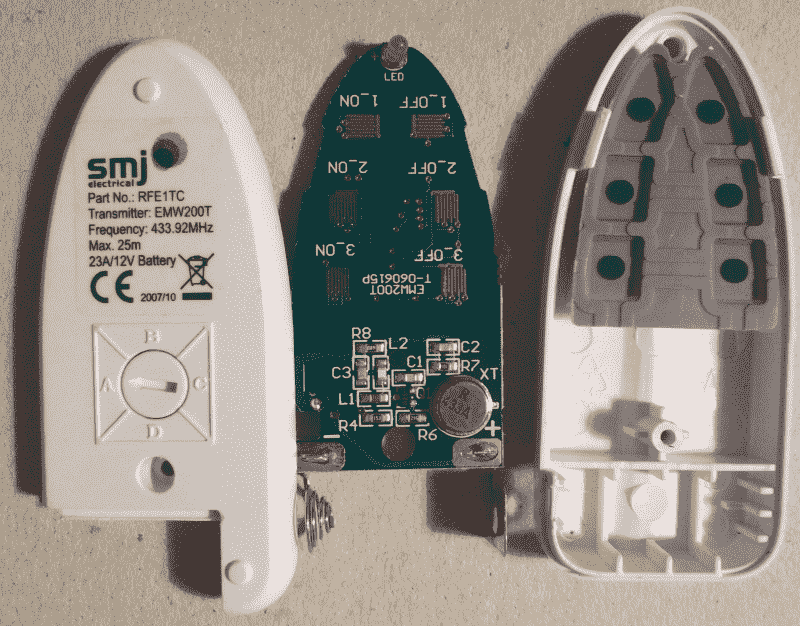

在遥控器内部

当按下遥控按钮时，将广播一个特定的射频信号（本设备使用传输频率为 433.92 MHz）。这将触发设置为相应通道（A、B、C 或 D）和编号（1、2 或 3）的任何插座。

内部，每个按钮将两个独立的信号连接到地，编号（1，2，

或者 3)，并说明（开启或关闭）。这会触发遥控器要发出的正确广播：

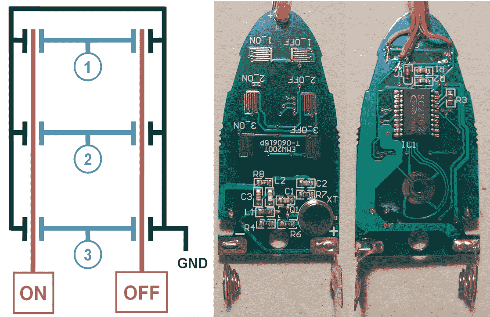

将电线连接到遥控器 PCB 板上的 ON 和 OFF，1，2 和 3，以及 GND 合适的位置（图中只连接了 ON，OFF，1 和 GND）

建议您不要将任何可能因开关而造成危险的物品连接到您的插座上。遥控器发送的信号不是唯一的（只有四个不同的频道可用）。因此，这使附近有类似插座组合的人在不经意间激活/关闭您的其中一个插座成为可能。建议您选择除默认频道 A 以外的频道，这将略微降低他人意外使用相同频道的机会。

为了让树莓派模拟遥控器的按钮按下，我们需要五个

中继器使我们能够选择数字（1、2 或 3）和状态（开启或关闭）：

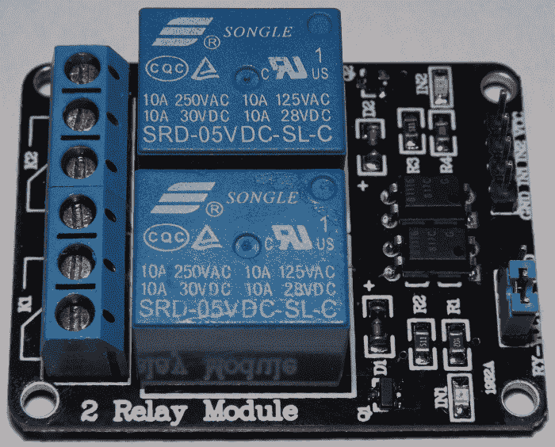

预制继电器模块可用于切换信号

或者，可以使用第十二章“构建机器人”中的晶体管和继电器电路来模拟按钮的按下。

将继电器控制引脚连接到树莓派的 GPIO，并将插座遥控器连接到每个继电器输出端，具体连接方式如下：

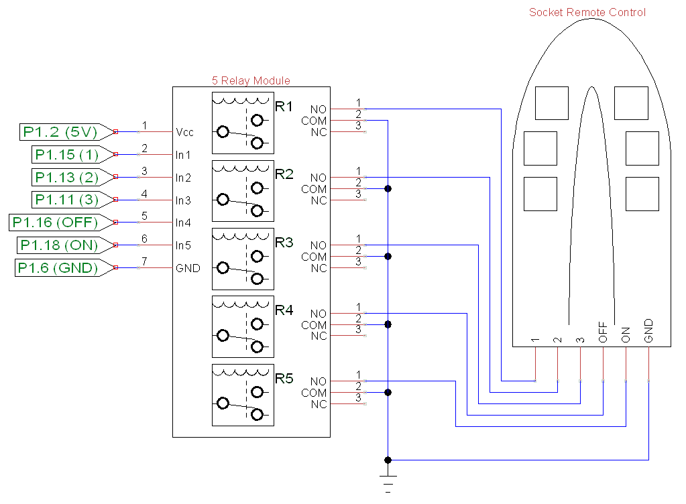

插座遥控电路

尽管远程套接字需要同时指定数字（1、2 或 3）和状态（开启或关闭）来激活套接字，但真正激活射频传输的是状态信号。为了避免耗尽远程设备的电池，我们必须确保我们已经关闭了状态信号。

# 如何做到这一点...

1.  创建以下 `socketControl.py` 脚本：

```py
#!/usr/bin/python3 
# socketControl.py 
import time 
import RPi.GPIO as GPIO 
#HARDWARE SETUP 
# P1 
# 2[V=G====XI====]26[=======]40 
# 1[=====321=====]25[=======]39 
#V=5V  G=Gnd 
sw_num=[15,13,11]#Pins for Switch 1,2,3 
sw_state=[16,18]#Pins for State X=Off,I=On 
MSGOFF=0; MSGON=1 
SW_ACTIVE=0; SW_INACTIVE=1 

class Switch(): 
  def __init__(self): 
    self.setup() 
  def __enter__(self): 
    return self 
  def setup(self): 
    print("Do init") 
    #Setup the wiring 
    GPIO.setmode(GPIO.BOARD) 
    for pin in sw_num: 
      GPIO.setup(pin,GPIO.OUT) 
    for pin in sw_state: 
      GPIO.setup(pin,GPIO.OUT) 
    self.clear() 
  def message(self,number,state): 
    print ("SEND SW_CMD: %s %d" % (number,state)) 
    if state==MSGON: 
      self.on(number) 
    else: 
      self.off(number) 
  def on(self,number): 
    print ("ON: %d"% number) 
    GPIO.output(sw_num[number-1],SW_ACTIVE) 
    GPIO.output(sw_state[MSGON],SW_ACTIVE) 
    GPIO.output(sw_state[MSGOFF],SW_INACTIVE) 
    time.sleep(0.5) 
    self.clear() 
  def off(self,number): 
    print ("OFF: %d"% number) 
    GPIO.output(sw_num[number-1],SW_ACTIVE) 
    GPIO.output(sw_state[MSGON],SW_INACTIVE) 
    GPIO.output(sw_state[MSGOFF],SW_ACTIVE) 
    time.sleep(0.5) 
    self.clear() 
  def clear(self): 
    for pin in sw_num: 
      GPIO.output(pin,SW_INACTIVE) 
    for pin in sw_state: 
      GPIO.output(pin,SW_INACTIVE) 
  def __exit__(self, type, value, traceback): 
    self.clear() 
    GPIO.cleanup() 
def main(): 
  with Switch() as mySwitches: 
    mySwitches.on(1) 
    time.sleep(5) 
    mySwitches.off(1)   

if __name__ == "__main__": 
    main() 
#End 
```

端口控制脚本通过将第一个端口开启 5 秒钟然后再次关闭来进行快速测试。

1.  要控制其余的插槽，创建如下 GUI 菜单：

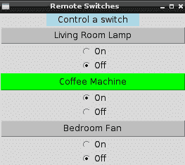

远程开关 GUI

1.  创建以下 `socketMenu.py` 脚本：

```py
#!/usr/bin/python3 
#socketMenu.py 
import tkinter as TK 
import socketControl as SC 

#Define Switches ["Switch name","Switch number"] 
switch1 = ["Living Room Lamp",1] 
switch2 = ["Coffee Machine",2] 
switch3 = ["Bedroom Fan",3] 
sw_list = [switch1,switch2,switch3] 
SW_NAME = 0; SW_CMD  = 1 
SW_COLOR=["gray","green"] 

class swButtons: 
  def __init__(self,gui,sw_index,switchCtrl): 
    #Add the buttons to window 
    self.msgType=TK.IntVar() 
    self.msgType.set(SC.MSGOFF) 
    self.btn = TK.Button(gui, 
                  text=sw_list[sw_index][SW_NAME], 
                  width=30, command=self.sendMsg, 
                  bg=SW_COLOR[self.msgType.get()]) 
    self.btn.pack() 
    msgOn = TK.Radiobutton(gui,text="On", 
              variable=self.msgType, value=SC.MSGON) 
    msgOn.pack() 
    msgOff = TK.Radiobutton(gui,text="Off", 
              variable=self.msgType,value=SC.MSGOFF) 
    msgOff.pack() 
    self.sw_num=sw_list[sw_index][SW_CMD] 
    self.sw_ctrl=switchCtrl 
  def sendMsg(self): 
    print ("SW_CMD: %s %d" % (self.sw_num, 
                              self.msgType.get())) 
    self.btn.configure(bg=SW_COLOR[self.msgType.get()]) 
    self.sw_ctrl.message(self.sw_num, 
                         self.msgType.get()) 

root = TK.Tk() 
root.title("Remote Switches") 
prompt = "Control a switch" 
label1 = TK.Label(root, text=prompt, width=len(prompt), 
                  justify=TK.CENTER, bg='lightblue') 
label1.pack() 
#Create the switch 
with SC.Switch() as mySwitches: 
  #Create menu buttons from sw_list 
  for index, app in enumerate(sw_list): 
    swButtons(root,index,mySwitches) 
  root.mainloop() 
#End 
```

# 它是如何工作的...

第一个脚本定义了一个名为 `Switch` 的类；它设置了控制五个继电器所需的 GPIO 引脚（在 `setup` 函数中）。它还定义了 `__enter__` 和 `__exit__` 函数，这些是 `with..as` 语句使用的特殊函数。当使用 `with..as` 创建一个类时，它使用 `__enter__` 来执行任何额外的初始化或设置（如果需要），然后通过调用 `__exit__` 来执行任何清理工作。当 `Switch` 类执行完毕后，所有继电器都会关闭以保护遥控器的电池，并调用 `GPIO.cleanup()` 来释放 GPIO 引脚。`__exit__` 函数的参数（`type`、`value` 和 `traceback`）允许处理在 `with..as` 语句中执行类时可能发生的任何特定异常（如果需要）。

要控制插座，创建两个函数，这些函数将切换相关的继电器以开或关，从而激活远程控制发送所需的信号到插座。然后，稍后使用 `clear()` 再次关闭继电器。为了使控制开关更加简便，创建一个 `message` 函数，该函数将允许指定开关编号和状态。

我们通过创建一个 Tkinter GUI 菜单来使用`socketControl.py`脚本。该菜单由三组控制（每个开关一组）组成，这些控制由`swButtons`类定义。

`swButtons` 类创建了一个 `Tkinter` 按钮 和两个 `Radiobutton` 控件。每个 `swButtons` 对象都会分配一个索引和一个对 `mySwitches` 对象的引用。这使得我们可以为按钮设置一个名称，并在按下时控制特定的开关。通过调用 `message()` 函数来激活/停用套接字，所需的开关号和状态由 `Radiobutton` 控件设置。

# 还有更多...

之前的例子允许您重新布线大多数遥控插座的遥控器，但另一个选择是模拟信号以直接控制它。

# 直接发送射频控制信号

你无需重新布线遥控器，可以使用与你的插座相同频率的发射器来复制遥控器的射频信号（这些特定的设备使用 433.94 MHz）。这取决于特定的插座，有时也取决于你的位置——一些国家禁止使用某些频率——在你自行发射之前，你可能需要获得认证：

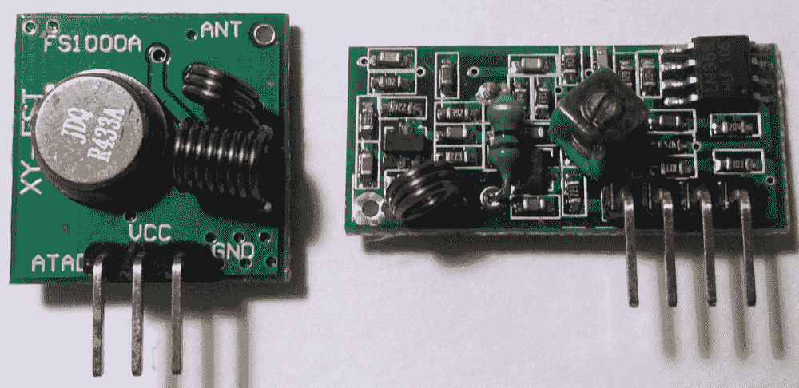

433.94 MHz 射频发射器（左侧）和接收器（右侧）

由 433Utils 创建的射频遥控器发送的信号可以被重新创建，其中 433Utils 是由

[`ninjablocks.com`](http://ninjablocks.com). 433Utils 使用 WiringPi，并以 C++ 编写，允许高速捕获和复制射频信号。

使用以下命令获取代码：

```py
cd ~
wget https://github.com/ninjablocks/433Utils/archive/master.zip
unzip master.zip  
```

接下来，我们需要将我们的射频发射器（以便我们可以控制开关）和射频接收器（以便我们可以确定控制代码）连接到树莓派上。

发射器（较小的方形模块）有三个引脚，分别是电源（VCC）、地（GND）和数据输出（DATA）。电源引脚上提供的电压将决定传输范围（我们将使用来自树莓派的 5V 电源，但你也可以将其替换为 12V，只要确保将地引脚连接到你的 12V 电源和树莓派）。

尽管接收器有四个引脚，但其中有一个电源引脚（VCC）、一个地线引脚（GND）和两个数据输出引脚（DATA），这些引脚是连接在一起的，因此我们只需要连接三根线到树莓派：

| **射频发送** | **RPi GPIO 引脚** | **射频接收** | **RPi GPIO 引脚** |
| --- | --- | --- | --- |
| VCC (5V) | 2 | VCC (3V3) | 1 |
| 数据输出 | 11 | 数据输入 | 13 |
| GND | 6 | GND | 9 |

在我们使用`RPi_Utils`中的程序之前，我们将进行一些调整以确保我们的 RX 和 TX 引脚设置正确。

在 `433Utils-master/RPi_utils/` 目录下定位 `codesend.cpp` 文件以进行必要的修改：

```py
cd ~/433Utils-master/RPi_utils
nano codesend.cpp -c  
```

将`int PIN = 0;`（位于大约第 24 行）更改为`int PIN = 11;`（RPi 物理

验证码（pin number）。

将 `wiringPi` 改为使用物理引脚编号（位于第 27 行）通过将 `wiringPiSetup()` 替换为 `wiringPiSetupPhy()`。否则，默认为 `wiringPi` GPIO 编号；更多详情，请参阅[`wiringpi.com/reference/setup/`](http://wiringpi.com/reference/setup/)。找到以下行：

```py
if (wiringPiSetup () == -1) return 1; 
```

改成这个：

```py
if (wiringPiSetupPhys () == -1) return 1; 
```

使用 *Ctrl* + *X*, *Y* 保存并退出 `nano`。

对 `RFSniffer.cpp` 进行类似的调整：

```py
nano RFSniffer.cpp -c  
```

找到以下行（位于大约第 25 行）：

```py
int PIN = 2; 
```

改成这个：

```py
int PIN = 13; //RPi physical pin number 
```

找到以下行（位于大约第 27 行）：

```py
if(wiringPiSetup() == -1) { 
```

改成这个：

```py
if(wiringPiSetupPhys() == -1) { 
```

使用 *Ctrl* + *X*, *Y* 保存并退出 `nano`。

使用以下命令构建代码：

```py
make all  
```

这应该可以无错误地构建，如下所示：

```py
g++    -c -o codesend.o codesend.cpp
g++   RCSwitch.o codesend.o -o codesend -lwiringPi
g++    -c -o RFSniffer.o RFSniffer.cpp
g++   RCSwitch.o RFSniffer.o -o RFSniffer -lwiringPi  
```

现在我们已经将 RF 模块连接到树莓派，并且代码已经准备就绪，我们可以从我们的遥控器捕获控制信号。运行以下命令并注意报告的输出：

```py
sudo ./RFSniffer  
```

通过将按钮 1 关闭，并将遥控器设置为频道 A 来获取输出（注意我们可能会接收到一些随机噪音）：

```py
Received 1381716
Received 1381716
Received 1381716
Received 1381717
Received 1398103  
```

我们现在可以使用`sendcode`命令发送信号来切换套接字关闭（`1381716`）和开启（`1381719`）：

```py
sendcode 1381716
sendcode 1381719  
```

你甚至可以设置树莓派，使用接收模块来检测来自遥控器（在未使用的频道上）的信号，并根据这些信号启动进程、控制其他硬件，或者可能触发软件的关机/重启。

# 扩展射频发射机的范围

当发射器由 5V 供电且没有附加天线时，其传输范围非常有限。然而，在做出任何修改之前，测试一切是值得的。

简单的线状天线可以用 25 厘米的单芯线制成，17 毫米的一端连接到天线焊接点，然后绕 16 圈（使用细螺丝刀柄或类似物品制作），剩余的线在上面（大约 53 毫米）：

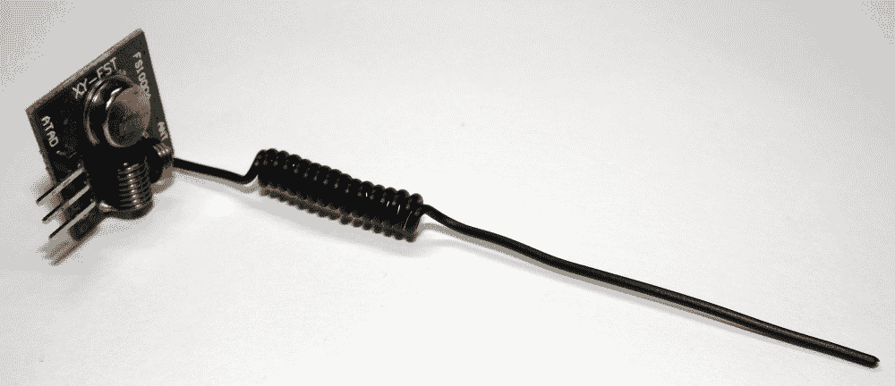

使用简单的天线，发射器的范围得到了极大的提升

# 确定遥控码的结构

记录每个按钮的代码，我们可以确定每个按钮的代码（并分解其结构）：

|  | **开启** | **关闭** | **开启** | **关闭** | **开启** | **关闭** |
| --- | --- | --- | --- | --- | --- | --- |
| **A** | `0x15 15 57`(1381719) | `0x15 15 54`(1381716) | `0x15 45 57`(1394007) | `0x15 45 54`(1394004) | `0x15 51 57`(1397079) | `0x15 51 54`(1397076) |
| **B** | `0x45 15 57`(4527447) | `0x45 15 54`(4527444) | `0x45 45 57`(4539735) | `0x45 45 54`(4539732) | `0x45 51 57`(4542807) | `0x45 51 54`(4542804) |
| **C** | `0x51 15 57`(5313879) | `0x51 15 54`(5313876) | `0x51 45 57`(5326167) | `0x51 45 54`(5326164) | `0x51 51 57`(5329239) | `0x51 51 54`(5329236) |
| **D** | `0x54 15 57`(5510487) | `0x54 15 57`(5510487) | `0x54 45 57`(5522775) | `0x54 45 54`(5522772) | `0x54 51 57`(5525847) | `0x54 51 54`(5526612) |
| 01 | 01 | 01 | 01 | 01 | 01 | 01 | 01 | 01 | 01 | 01 | 11/00 |  |

不同的代码以十六进制格式显示，以便您查看其结构；`sendcode`命令使用十进制格式（括号内显示）

要选择通道 A、B、C 或 D，将两个位设置为 00。同样，对于按钮 1、2 或 3，将两个位设置为 00 以选择该按钮。最后，将最后两个位设置为 11 以表示开启或 00 以表示关闭。

请参阅[`arduinodiy.wordpress.com/2014/08/12/433-mhz-system-for-your-arduino/`](https://arduinodiy.wordpress.com/2014/08/12/433-mhz-system-for-your-arduino/)，该页面分析了这些以及其他类似的射频遥控器。

# 使用 SPI 控制 LED 矩阵

在第十章《感知与显示现实世界数据》中，我们使用了一种名为 I²C 的总线协议连接到设备。树莓派还支持另一种称为**串行外设接口**（**SPI**）的芯片间协议。SPI 总线与 I²C 的不同之处在于它使用两条单向数据线（而 I²C 使用一条双向数据线）。

尽管 SPI 需要更多的线（I²C 使用两条总线信号，SDA 和 SCL），但它支持数据的同步发送和接收，并且比 I²C 具有更高的时钟速度：

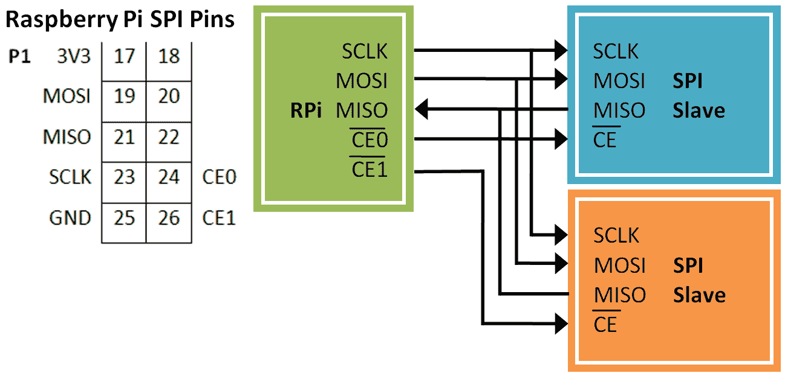

SPI 设备与树莓派的通用连接

SPI 总线由以下四个信号组成：

+   **SCLK**: 这允许时钟边缘在输入/输出线上读写数据；它由主设备驱动。当时钟信号从一个状态变化到另一个状态时，SPI 设备将检查 MOSI 信号的状态以读取一个比特。同样地，如果 SPI 设备正在发送数据，它将使用时钟信号边缘来同步设置 MISO 信号状态的时刻。

+   **CE**：这指的是芯片使能（通常，在总线上为每个从设备使用一个单独的芯片使能）。主设备会将芯片使能信号设置为低电平，以便与它想要通信的设备通信。当芯片使能信号设置为高电平时，它会忽略总线上的任何其他信号。这个信号有时被称为**芯片选择**（**CS**）或**从设备选择**（**SS**）。

+   **主输出，从输入（MOSI）**：它连接到主设备的数据输出和从设备的数据输入。

+   **主输入从输出（MISO）**：它提供从从设备（slave）的响应。

以下图表显示了每个信号：

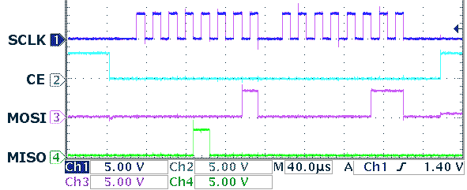

SPI 信号：SCLK（1）、CE（2）、MOSI（3）和 MISO（4）

之前的范围跟踪显示了通过 SPI 发送的两个字节。每个字节都通过**SCLK (1)**信号被时钟到 SPI 设备中。一个字节由八个时钟周期的一阵（**SCLK (1)**信号上的低电平和随后的高电平）表示，当时钟状态改变时读取特定位的值。确切的采样点由时钟模式决定；在下面的图中，它是在时钟从低电平变为高电平时：

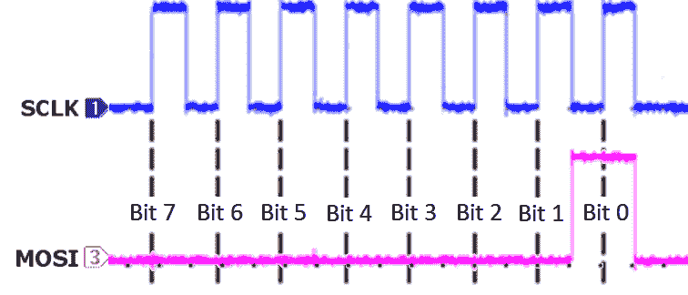

Raspberry Pi 通过 MOSI(3) 信号发送的第一个数据字节

发送的第一个字节是 0x01（所有位都是低电平，除了**位 0**）和第二个发送的是 0x03（只有**位 1**和**位 0**是高电平）。同时，**MOSI (4**) 信号从 SPI 设备返回数据——在这种情况下，0x08（**位 3**是高电平）和 0x00（所有位都是低电平）。**SCLK (1**) 信号用于同步一切，甚至包括从 SPI 设备发送的数据。

当数据正在发送到特定 SPI 设备以指示其监听**MOSI (4)**信号时，**CE (2)**信号被保持低电平。当**CE (2)**信号再次设置为高电平时，它向 SPI 设备指示传输已完成。

以下是一个由**SPI 总线**控制的 8 x 8 LED 矩阵的图像：

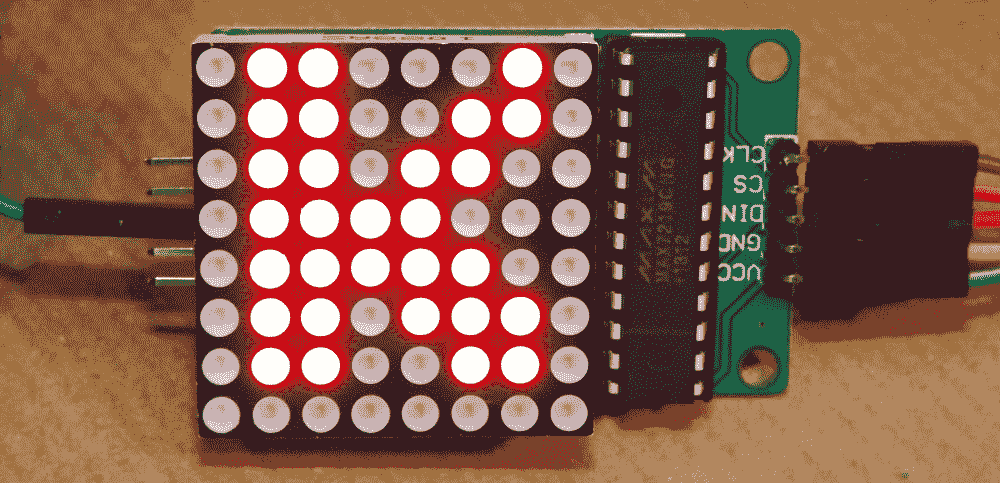

一个显示字母 K 的 8 x 8 LED 模块

# 准备就绪

我们之前用于 I²C 的 `wiringPi` 库也支持 SPI。请确保已安装 `wiringPi`（详情请见第十章，*感知和显示现实世界数据*），以便我们在此处使用。

接下来，如果我们之前在启用 I²C 时没有这样做，我们需要启用 SPI：

```py
sudo nano /boot/config.txt  
```

移除`#`前的`#dtparam=spi=on`以启用它，使其读取，并保存（*Ctrl* + *X*，*Y*，*Enter*）：

```py
dtparam=spi=on  
```

您可以通过以下命令列出所有正在运行的模块，并定位到 `spi_bcm2835` 来确认 SPI 是否处于活动状态：

```py
lsmod  
```

您可以使用以下 `spiTest.py` 脚本测试 SPI：

```py
#!/usr/bin/python3 
# spiTest.py 
import wiringpi 

print("Add SPI Loopback - connect GPIO Pin19 and Pin21") 
print("[Press Enter to continue]") 
input() 
wiringpi.wiringPiSPISetup(1,500000) 
buffer=str.encode("HELLO") 
print("Buffer sent %s" % buffer) 
wiringpi.wiringPiSPIDataRW(1,buffer) 
print("Buffer received %s" % buffer) 
print("Remove the SPI Loopback") 
print("[Press Enter to continue]") 
input() 
buffer=str.encode("HELLO") 
print("Buffer sent %s" % buffer) 
wiringpi.wiringPiSPIDataRW(1,buffer) 
print("Buffer received %s" % buffer) 
#End 
```

将输入**19**和**21**连接起来以创建用于测试的 SPI 环回：

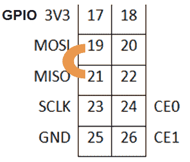

SPI 环回测试

你应该得到以下结果：

```py
Buffer sent b'HELLO'
Buffer received b'HELLO'
Remove the SPI Loopback
[Press Enter to continue]
Buffer sent b'HELLO'
Buffer received b'x00x00x00x00x00'  
```

下面的例子使用了一个由 LED 8 x 8 矩阵显示器，该显示器正在被驱动

SPI 控制的**MAX7219 LED 驱动器**：

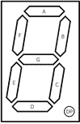

MAX7219 LED 控制器引脚图、LED 矩阵引脚图以及 LED 矩阵内部连接（从左到右）

尽管该设备被设计用来控制八个独立的七段 LED 数码管，但我们仍可以用它来制作我们的 LED 矩阵显示屏。当用于数码管时，每个七段（加上小数点）都连接到一个 SEG 引脚上，每个数码管的 COM 连接则连接到 DIG 引脚上。控制器随后根据需要打开每个段，同时将相关数码管的 COM 设置为低电平以启用它。控制器可以通过快速切换 DIG 引脚来快速循环每个数码管，以至于所有八个数码管看起来同时点亮：


一个七段 LED 数码管使用段 A 到 G，加上小数点 DP（decimal place）

我们以类似的方式使用控制器，除了每个 SEG 引脚将连接到矩阵中的一列，而 DIG 引脚将启用/禁用一行。

我们使用一个 8 x 8 模块，如下连接到 MAX7219 芯片：

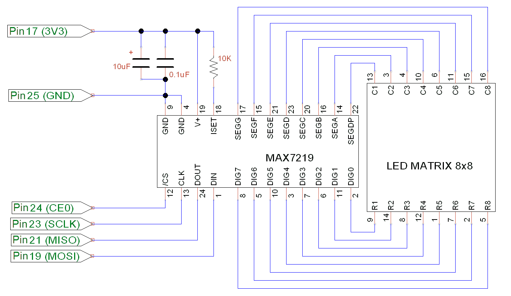

驱动 8 x 8 LED 矩阵显示屏的 MAX7219 LED 控制器

# 如何做到这一点...

1.  要控制连接到 SPI MAX7219 芯片的 LED 矩阵，创建以下`matrixControl.py`脚本：

```py
#!/usr/bin/python3 
# matrixControl.py 
import wiringpi 
import time 

MAX7219_NOOP        = 0x00 
DIG0=0x01; DIG1=0x02; DIG2=0x03; DIG3=0x04 
DIG4=0x05; DIG5=0x06; DIG6=0x07; DIG7=0x08 
MAX7219_DIGIT=[DIG0,DIG1,DIG2,DIG3,DIG4,DIG5,DIG6,DIG7] 
MAX7219_DECODEMODE  = 0x09 
MAX7219_INTENSITY   = 0x0A 
MAX7219_SCANLIMIT   = 0x0B 
MAX7219_SHUTDOWN    = 0x0C 
MAX7219_DISPLAYTEST = 0x0F 
SPI_CS=1 
SPI_SPEED=100000 

class matrix(): 
  def __init__(self,DEBUG=False): 
    self.DEBUG=DEBUG 
    wiringpi.wiringPiSPISetup(SPI_CS,SPI_SPEED) 
    self.sendCmd(MAX7219_SCANLIMIT, 8)   # enable outputs 
    self.sendCmd(MAX7219_DECODEMODE, 0)  # no digit decode 
    self.sendCmd(MAX7219_DISPLAYTEST, 0) # display test off 
    self.clear() 
    self.brightness(7)                   # brightness 0-15 
    self.sendCmd(MAX7219_SHUTDOWN, 1)    # start display 
  def sendCmd(self, register, data): 
    buffer=(register<<8)+data 
    buffer=buffer.to_bytes(2, byteorder='big') 
    if self.DEBUG:print("Send byte: 0x%04x"% 
                        int.from_bytes(buffer,'big')) 
    wiringpi.wiringPiSPIDataRW(SPI_CS,buffer) 
    if self.DEBUG:print("Response:  0x%04x"% 
                        int.from_bytes(buffer,'big')) 
    return buffer 
  def clear(self): 
    if self.DEBUG:print("Clear") 
    for row in MAX7219_DIGIT: 
      self.sendCmd(row + 1, 0) 
  def brightness(self,intensity): 
    self.sendCmd(MAX7219_INTENSITY, intensity % 16) 

def letterK(matrix): 
    print("K") 
    K=(0x0066763e1e366646).to_bytes(8, byteorder='big') 
    for idx,value in enumerate(K): 
        matrix.sendCmd(idx+1,value) 

def main(): 
    myMatrix=matrix(DEBUG=True) 
    letterK(myMatrix) 
    while(1): 
      time.sleep(5) 
      myMatrix.clear()
```

```py
      time.sleep(5) 
      letterK(myMatrix) 

if __name__ == '__main__': 
    main() 
#End 
```

运行脚本(`python3 matrixControl.py`)会显示字母`K`。

1.  我们可以使用图形用户界面（GUI）通过`matrixMenu.py`来控制 LED 矩阵的输出：

```py
#!/usr/bin/python3 
#matrixMenu.py 
import tkinter as TK 
import time 
import matrixControl as MC 

#Enable/Disable DEBUG 
DEBUG = True 
#Set display sizes 
BUTTON_SIZE = 10 
NUM_BUTTON = 8 
NUM_LIGHTS=NUM_BUTTON*NUM_BUTTON 
MAX_VALUE=0xFFFFFFFFFFFFFFFF 
MARGIN = 2 
WINDOW_H = MARGIN+((BUTTON_SIZE+MARGIN)*NUM_BUTTON) 
WINDOW_W = WINDOW_H 
TEXT_WIDTH=int(2+((NUM_BUTTON*NUM_BUTTON)/4)) 
LIGHTOFFON=["red4","red"] 
OFF = 0; ON = 1 
colBg = "black" 

def isBitSet(value,bit): 
  return (value>>bit & 1) 

def setBit(value,bit,state=1): 
  mask=1<<bit 
  if state==1: 
    value|=mask 
  else: 
    value&=~mask 
  return value 

def toggleBit(value,bit): 
  state=isBitSet(value,bit) 
  value=setBit(value,bit,not state) 
  return value 

class matrixGUI(TK.Frame): 
  def __init__(self,parent,matrix): 
    self.parent = parent 
    self.matrix=matrix 
    #Light Status 
    self.lightStatus=0 
    #Add a canvas area ready for drawing on 
    self.canvas = TK.Canvas(parent, width=WINDOW_W, 
                        height=WINDOW_H, background=colBg) 
    self.canvas.pack() 
    #Add some "lights" to the canvas 
    self.light = [] 
    for iy in range(NUM_BUTTON): 
      for ix in range(NUM_BUTTON): 
        x = MARGIN+MARGIN+((MARGIN+BUTTON_SIZE)*ix) 
        y = MARGIN+MARGIN+((MARGIN+BUTTON_SIZE)*iy) 
        self.light.append(self.canvas.create_rectangle(x,y, 
                              x+BUTTON_SIZE,y+BUTTON_SIZE, 
                              fill=LIGHTOFFON[OFF])) 
    #Add other items 
    self.codeText=TK.StringVar() 
    self.codeText.trace("w", self.changedCode) 
    self.generateCode() 
    code=TK.Entry(parent,textvariable=self.codeText, 
                  justify=TK.CENTER,width=TEXT_WIDTH) 
    code.pack() 
    #Bind to canvas not tk (only respond to lights) 
    self.canvas.bind('<Button-1>', self.mouseClick) 

  def mouseClick(self,event): 
    itemsClicked=self.canvas.find_overlapping(event.x, 
                             event.y,event.x+1,event.y+1) 
    for item in itemsClicked: 
      self.toggleLight(item) 

  def setLight(self,num): 
    state=isBitSet(self.lightStatus,num) 
    self.canvas.itemconfig(self.light[num], 
                           fill=LIGHTOFFON[state]) 

  def toggleLight(self,num): 
    if num != 0: 
      self.lightStatus=toggleBit(self.lightStatus,num-1) 
      self.setLight(num-1) 
      self.generateCode() 

  def generateCode(self): 
    self.codeText.set("0x%016x"%self.lightStatus) 

  def changedCode(self,*args): 
    updated=False 
    try: 
      codeValue=int(self.codeText.get(),16) 
      if(codeValue>MAX_VALUE): 
        codeValue=codeValue>>4 
      self.updateLight(codeValue) 
      updated=True 
    except: 
      self.generateCode() 
      updated=False 
    return updated 

  def updateLight(self,lightsetting): 
    self.lightStatus=lightsetting 
    for num in range(NUM_LIGHTS): 
      self.setLight(num) 
    self.generateCode() 
    self.updateHardware() 

  def updateHardware(self): 
    sendBytes=self.lightStatus.to_bytes(NUM_BUTTON, 
                                        byteorder='big') 
    print(sendBytes) 
    for idx,row in enumerate(MC.MAX7219_DIGIT): 
      response = self.matrix.sendCmd(row,sendBytes[idx]) 
      print(response) 

def main(): 
  global root 
  root=TK.Tk() 
  root.title("Matrix GUI") 
  myMatrixHW=MC.matrix(DEBUG) 
  myMatrixGUI=matrixGUI(root,myMatrixHW) 
  TK.mainloop() 

if __name__ == '__main__': 
    main() 
#End
```

1.  矩阵 GUI 允许我们通过点击每个方块（或直接输入十六进制值）来切换每个 LED 的开关状态，以创建所需的图案：

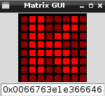

使用 Matrix GUI 控制 8 x 8 LED 矩阵

# 它是如何工作的...

最初，我们为 MAX7219 设备使用的每个控制寄存器定义了地址。查看数据表以获取更多信息：

[`datasheets.maximintegrated.com/en/ds/MAX7219-MAX7221.pdf`](https://datasheets.maximintegrated.com/en/ds/MAX7219-MAX7221.pdf).

我们创建了一个名为 `matrix` 的类，这将使我们能够控制该模块。`__init__()` 函数设置了树莓派的 SPI（使用 `SPI_CS` 作为引脚 26 的 CS1，并将 `SPI_SPEED` 设置为 100 kHz）。

我们`matrix`类中的关键功能是`sendCmd()`函数；它使用`wiringpi.wiringPiSPIDataRW(SPI_CS,buff)`来通过 SPI 总线发送`buffer`（这是我们想要发送的原始字节数据），在传输发生时也将`SPI_CS`引脚设置为低电平。每个命令由两个字节组成：第一个字节指定寄存器的地址，第二个字节设置需要放入的数据。为了显示一排灯光，我们发送一个`ROW`寄存器（`MC.MAX7219_DIGIT`）的地址以及我们想要显示的位模式（作为一个字节）。

在调用`wiringpi.wiringPiSPIDataRW()`函数之后，`buffer`变量包含了从 MISO 引脚（在数据通过 MOSI 引脚发送的同时读取）接收到的任何结果。如果连接了，这将是对 LED 模块的输出（发送数据的延迟副本）。有关如何使用芯片输出的信息，请参阅以下*更多内容...*部分，了解有关串行外设接口（SPI）配置的菊花链设置。

要初始化 MAX7219，我们需要确保它配置在正确的模式。首先，我们将扫描限制字段设置为 `7`（这将启用所有 DIG0 - DIG7 输出）。接下来，我们禁用内置的数字解码，因为我们正在使用原始输出进行显示（并且不希望它尝试显示数字）。我们还想确保 `MAX7219_DISPLAYTEST` 寄存器被禁用（如果启用，它将点亮所有 LED）。

我们通过调用自己的`clear()`函数来确保显示被清除，该函数发送`0`

向每个`MAX7219_DIGIT`寄存器发送指令以清除每一行。最后，我们使用`MAX7219_INTENSITY`寄存器来设置 LED 的亮度。亮度通过 PWM 输出进行控制，以使 LED 根据所需的亮度显得更亮或更暗。

在`main()`函数中，我们通过发送一组 8 个字节（`0x0066763e1e366646`）来执行快速测试，以在网格上显示字母 K：

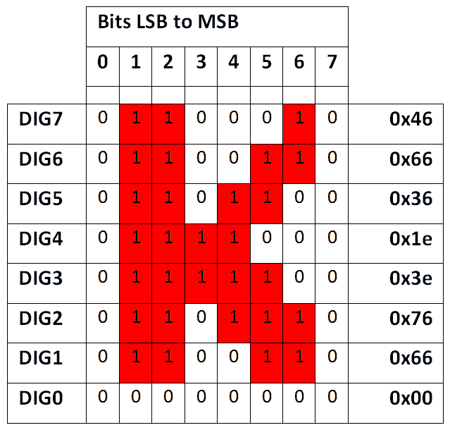

每个 8 x 8 图案由 8 个字节的 8 位组成（每个列对应一个位，使得每个字节成为显示屏中的一行）

`matrixGUI` 类创建了一个画布对象，该对象填充了一个矩形对象的网格，以表示我们想要控制的 8 x 8 LED 网格（这些保存在 `self.light` 中）。我们还添加了一个文本输入框来显示我们将发送到 LED 矩阵模块的结果字节。然后我们将 `<Button-1>` 鼠标事件绑定到画布上，以便在画布区域内发生鼠标点击时调用 `mouseClick`。

我们使用特殊的 Python 函数 `trace` 将一个名为 `changedCode()` 的函数附加到 `codeText` 变量上，这允许我们监控特定的变量或函数。如果我们使用 `trace` 函数的 `'w'` 值，Python 系统将在值被写入时调用 `callback` 函数。

当调用 `mouseClick()` 函数时，我们使用 `event.x` 和 `event.y` 坐标来识别位于那里的对象。如果检测到项目，则使用项目的 ID（通过 `toggleLight()`）来切换 `self.lightStatus` 值中的相应位，并且显示中的灯光颜色相应地改变（通过 `setLight()`）。同时，`codeText` 变量也会更新为 `lightStatus` 值的新十六进制表示。

`changeCode()` 函数允许我们使用 `codeText` 变量并将其转换为整数。这使我们能够检查它是否是一个有效的值。由于在这里可以自由输入文本，我们必须对其进行验证。如果我们无法将其转换为整数，则使用 `lightStatus` 值刷新 `codeValue` 文本。否则，我们检查它是否过大，在这种情况下，我们通过 4 位位移操作将其除以 16，直到它在有效范围内。我们更新 `lightStatus` 值、GUI 灯光、`codeText` 变量，以及硬件（通过调用 `updateHardware()`）。

`updateHardware()` 函数利用了使用 `MC.matrix` 类创建的 `myMatrixHW` 对象。我们逐字节将想要显示的字节发送到矩阵硬件（同时附带相应的 `MAX7219_DIGIT` 值以指定行）。

# 还有更多...

SPI 总线允许我们通过使用芯片来控制同一总线上的多个设备。

启用信号。一些设备，例如 MAX7219，还允许使用所谓的

菊链 SPI 配置。

# Daisy-chain SPI 配置

你可能已经注意到，当我们通过 MOSI 线发送数据时，`matrix`类也会返回一个字节。这是从 DOUT 连接上的 MAX7219 控制器输出的数据。实际上，MAX7219 控制器会将所有的 DIN 数据传递到 DOUT，这比 DIN 数据晚一组指令。通过这种方式，MAX7219 可以通过 DOUT 连接到下一个 DIN，从而实现菊花链（每个 DOUT 连接到下一个 DIN）。通过保持 CE 信号低，可以通过相互传递数据来加载多个控制器。

当 CE 设置为低时，数据将被忽略；只有当我们再次将其设置为高时，输出才会改变。这样，你可以为链中的每个模块记录所有数据，然后设置 CE 为高以更新它们：

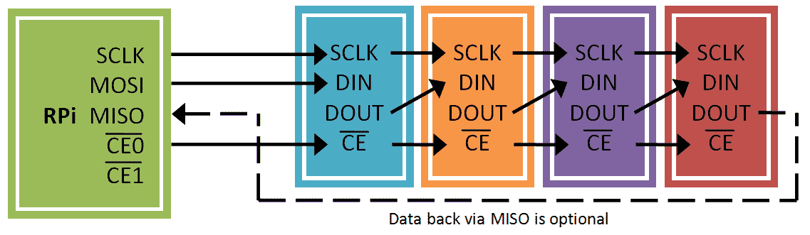

菊链 SPI 配置

我们需要为每一行我们希望更新的行（或者如果我们想保持当前行不变，可以使用`MAX7219_NOOP`）执行此操作。这被称为菊花链 SPI 配置，一些 SPI 设备支持该配置，其中数据通过 SPI 总线上的每个设备传递到下一个设备，这允许使用三个总线控制信号来控制多个设备。

# 使用串行接口进行通信

传统上，串行协议如 RS232 是连接打印机、扫描仪以及游戏手柄和鼠标等设备到计算机的常见方式。现在，尽管被 USB 所取代，许多外围设备仍然使用此协议进行组件间的内部通信、数据传输和固件更新。对于电子爱好者来说，RS232 是一种非常实用的协议，用于调试和控制其他设备，同时避免了 USB 的复杂性。

本例中的两个脚本允许控制 GPIO 引脚，以展示我们如何通过串行端口远程控制 Raspberry Pi。串行端口可以连接到 PC、另一个 Raspberry Pi 设备，甚至嵌入式微控制器（例如 Arduino、PIC 或类似设备）。

# 准备就绪

通过串行协议连接到树莓派的 easiest way 将取决于您的计算机是否内置了串行端口。串行连接、软件以及测试设置将在以下三个步骤中描述：

1.  在您的计算机和树莓派之间创建一个 RS232 串行连接。为此，您需要以下配置之一：

+   +   如果您的计算机有可用的内置串行端口，您可以使用

        一条带有 RS232 到 USB 适配器的 Null-Modem 线，用于连接到树莓派：


RS232-to-USB 适配器

Null-Modem 是一种串行电缆/适配器，其 TX 和 RX 线已交叉连接，使得一边连接到串行端口的 TX 引脚，另一边连接到 RX 引脚：

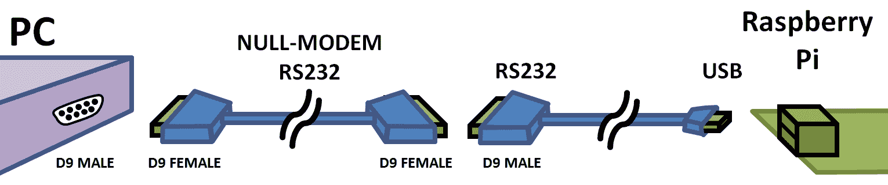

通过 Null-Modem 电缆和 RS232-to-USB 适配器连接到 Raspberry Pi 的 PC 串行端口，用于 RS232 适配器

支持的 USB-to-RS232 设备列表可在以下链接中找到：

[`elinux.org/RPi_VerifiedPeripherals#USB_UART_and_USB_to_Serial_.28RS-232.29_adapters`](http://elinux.org/RPi_VerifiedPeripherals#USB_UART_and_USB_to_Serial_.28RS-232.29_adapters).

请参阅 *更多内容...* 部分以获取如何设置它们的详细信息。

如果您的电脑没有内置串行端口，您可以使用另一个 USB-to-RS232 适配器连接到 PC/笔记本电脑，将 RS232 转换为更常见的 USB 连接。

如果你在树莓派上没有可用的 USB 端口，你可以直接使用 GPIO 串行引脚，通过串行控制线或蓝牙串行模块（有关详细信息，请参阅*更多内容...*部分）。这两种方法都需要进行一些额外的设置。

在所有情况下，您可以使用 RS232 环回测试来确认一切工作正常并且设置正确（再次，参考*更多内容...*部分）。

1.  接下来，准备您为此示例所需的软件。

您需要安装 `pyserial`，这样我们才能使用 Python 的串行端口。

1.  使用以下命令安装 `pyserial`（你还需要安装 `pip`；有关详细信息，请参阅第三章，*使用 Python 进行自动化和生产效率*)：

```py
sudo pip-3.2 install pyserial 
```

请参考`pySerial`网站以获取更多文档信息：

[`pyserial.readthedocs.io/en/latest/`](https://pyserial.readthedocs.io/en/latest/).

为了演示 RS232 串行控制，你需要一些连接到树莓派 GPIO 引脚的示例硬件。

`serialMenu.py` 脚本允许通过串行端口发送的命令来控制 GPIO 引脚。为了全面测试这一点，你可以将合适的输出设备（例如 LED）连接到每个 GPIO 引脚。你可以通过为每个 LED 使用 470 欧姆的电阻来确保总电流保持较低，这样就不会超过 Raspberry Pi 可以提供的最大 GPIO 电流：

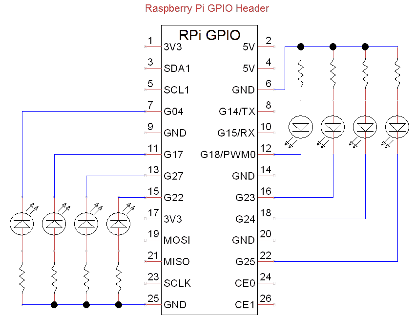

用于通过串行控制测试 GPIO 输出的测试电路

# 如何做到这一点...

1.  创建以下 `serialControl.py` 脚本：

```py
#!/usr/bin/python3 
#serialControl.py 
import serial 
import time 

#Serial Port settings 
SERNAME="/dev/ttyUSB0" 
#default setting is 9600,8,N,1 
IDLE=0; SEND=1; RECEIVE=1 

def b2s(message): 
  '''Byte to String''' 
  return bytes.decode(message) 
def s2b(message): 
  '''String to Byte''' 
  return bytearray(message,"ascii") 

class serPort(): 
  def __init__(self,serName="/dev/ttyAMA0"): 
    self.ser = serial.Serial(serName) 
    print (self.ser.name) 
    print (self.ser) 
    self.state=IDLE 
  def __enter__(self): 
    return self 
  def send(self,message): 
    if self.state==IDLE and self.ser.isOpen(): 
      self.state=SEND 
      self.ser.write(s2b(message)) 
      self.state=IDLE 

  def receive(self, chars=1, timeout=5, echo=True, 
              terminate="r"): 
    message="" 
    if self.state==IDLE and self.ser.isOpen(): 
      self.state=RECEIVE 
      self.ser.timeout=timeout 
      while self.state==RECEIVE: 
        echovalue="" 
        while self.ser.inWaiting() > 0: 
          echovalue += b2s(self.ser.read(chars)) 
        if echo==True: 
          self.ser.write(s2b(echovalue)) 
        message+=echovalue 
        if terminate in message: 
          self.state=IDLE 
    return message 
  def __exit__(self,type,value,traceback): 
    self.ser.close()       

def main(): 
  try: 
    with serPort(serName=SERNAME) as mySerialPort: 
      mySerialPort.send("Send some data to me!rn") 
      while True: 
        print ("Waiting for input:") 
        print (mySerialPort.receive()) 
  except OSError: 
    print ("Check selected port is valid: %s" %serName) 
  except KeyboardInterrupt: 
    print ("Finished") 

if __name__=="__main__": 
  main() 
#End     
```

确保您要使用的串行端口中的`serName`元素是正确的（例如，对于 GPIO 引脚使用`/dev/ttyAMA0`，对于 USB RS232 适配器使用`/dev/ttyUSB0`）。

将另一端连接到您的笔记本电脑或计算机的串行端口（串行端口可以是另一个 USB-to-RS232 适配器）。

使用串行程序如 Windows 的 HyperTerminal 或 RealTerm 或 OS X 的 Serial Tools 来监控您计算机上的串行端口。您需要确保已正确设置 COM 端口，并设置波特率为 9,600 bps（`奇偶校验=None`，`数据位=8`，`停止位=1`，以及`硬件流控制=None`）。

脚本将向用户发送数据请求并等待响应。

要将数据发送到树莓派，在另一台计算机上输入一些文本，然后按*Enter*键将其发送到树莓派。

1.  你将在树莓派终端中看到类似以下输出的内容：

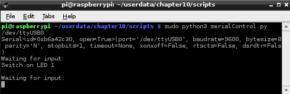

通过 USB-to-RS232 线缆从连接的电脑发送了“开启 LED 1”的文本

1.  你也将在串行监控程序中看到类似以下输出：

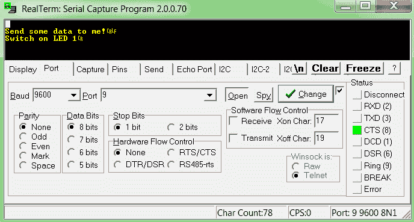

RealTerm 显示连接的串行端口典型的输出

1.  在树莓派上按 *Ctrl* + *C* 停止脚本。

1.  现在，创建一个 GPIO 控制菜单。创建`serialMenu.py`：

```py
#!/usr/bin/python3 
#serialMenu.py 
import time 
import RPi.GPIO as GPIO 
import serialControl as SC 
SERNAME = "/dev/ttyUSB0" 
running=True 

CMD=0;PIN=1;STATE=2;OFF=0;ON=1 
GPIO_PINS=[7,11,12,13,15,16,18,22] 
GPIO_STATE=["OFF","ON"] 
EXIT="EXIT" 

def gpioSetup(): 
  GPIO.setmode(GPIO.BOARD) 
  for pin in GPIO_PINS: 
    GPIO.setup(pin,GPIO.OUT) 

def handleCmd(cmd): 
  global running 
  commands=cmd.upper() 
  commands=commands.split() 
  valid=False 
  print ("Received: "+ str(commands)) 
  if len(commands)==3: 
    if commands[CMD]=="GPIO": 
      for pin in GPIO_PINS: 
        if str(pin)==commands[PIN]: 
          print ("GPIO pin is valid") 
          if GPIO_STATE[OFF]==commands[STATE]: 
            print ("Switch GPIO %s %s"% (commands[PIN], 
                                         commands[STATE])) 
            GPIO.output(pin,OFF) 
            valid=True 
          elif GPIO_STATE[ON]==commands[STATE]: 
            print ("Switch GPIO %s %s"% (commands[PIN], 
                                         commands[STATE])) 
            GPIO.output(pin,ON) 
            valid=True 
  elif commands[CMD]==EXIT: 
    print("Exit") 
    valid=True 
    running=False 
  if valid==False: 
    print ("Received command is invalid") 
    response="  Invalid:GPIO Pin#(%s) %srn"% ( 
                      str(GPIO_PINS), str(GPIO_STATE)) 
  else: 
    response="  OKrn" 
  return (response) 

def main(): 
  try: 
    gpioSetup() 
    with SC.serPort(serName=SERNAME) as mySerialPort: 
      mySerialPort.send("rn") 
      mySerialPort.send("  GPIO Serial Controlrn") 
      mySerialPort.send("  -------------------rn") 
      mySerialPort.send("  CMD PIN STATE "+ 
                        "[GPIO Pin# ON]rn") 
      while running==True: 
        print ("Waiting for command...") 
        mySerialPort.send(">>") 
        cmd = mySerialPort.receive(terminate="rn") 
        response=handleCmd(cmd) 
        mySerialPort.send(response) 
      mySerialPort.send("  Finished!rn") 
  except OSError: 
    print ("Check selected port is valid: %s" %serName) 
  except KeyboardInterrupt: 
    print ("Finished") 
  finally: 
    GPIO.cleanup() 

main() 
#End 
```

1.  当你运行脚本（`sudo python3 serialMenu.py`），在串行监控程序中输入控制信息：

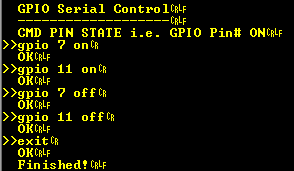

GPIO 串行控制菜单

1.  树莓派上的终端输出将类似于以下截图，LED 灯应该相应地做出反应：

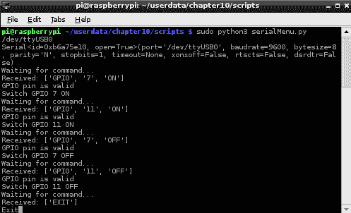

GPIO 串行控制菜单

树莓派验证从串行连接接收到的命令，并切换连接到 GPIO 引脚 7 和 11 的 LED 灯，然后打开再关闭。

# 它是如何工作的...

第一段脚本，`serialControl.py`，为我们提供了一个`serPort`类。我们使用以下函数定义该类：

+   `__init__(self,serName="/dev/ttyAMA0")`: 此函数将使用 `serName` 创建一个新的串行设备 – 默认的 `/dev/ttyAMA0` 是 GPIO 串行引脚的 ID（参见 *更多内容...* 部分）。初始化后，将显示设备信息。

+   `__enter__(self)`: 这是一个虚拟函数，允许我们使用 `with...as` 方法。

+   `send(self,message)`: 这用于检查串行端口是否已打开且未被占用；如果是这种情况，它将发送一条消息（在将其转换为原始字节后使用 `s2b()` 函数）。

+   `receive(self, chars=1, echo=True, terminate="r")`: 在检查串口是否打开且未被占用后，此函数随后通过串口等待数据。函数将收集数据，直到检测到终止字符，然后返回完整消息。

+   `__exit__(self,type,value,traceback)`: 这个函数在`serPort`对象不再需要通过`with...as`方法时被调用，因此我们可以在这一点关闭端口。

脚本中的`main()`函数通过串行端口向连接的计算机发送数据提示，然后等待输入，输入之后将跟随终止字符（们）。

下一个脚本 `serialMenu.py` 允许我们使用 `serPort` 类。

`main()` 函数设置 GPIO 引脚为输出（通过 `gpioSetup()`），创建一个新的 `serPort` 对象，并最终等待来自串行端口的命令。每当接收到新的命令时，使用 `handleCmd()` 函数来解析消息，以确保在执行之前它是正确的。

该脚本将根据通过串行端口使用`GPIO`命令关键字发出的指令来切换特定的 GPIO 引脚的开关状态。我们可以添加任意数量的命令关键字，并控制（或读取）我们连接到树莓派上的任何设备（或多个设备）。现在，我们有了使用通过串行链路连接的任何设备来控制树莓派的一种非常有效的方法。

# 还有更多...

除了串行发送和接收之外，RS232 串行标准还包括几个其他控制信号。为了测试它，你可以使用串行环回来确认串行端口

已正确设置。

# 为树莓派配置 USB-to-RS232 设备

一旦将 USB-to-RS232 设备连接到树莓派，请检查是否

通过输入以下命令列出新的串行设备：

```py
dmesg | grep tty  
```

`dmesg` 命令列出了系统上发生的事件；使用 `grep`，我们可以过滤出提及 `tty` 的任何消息，如下面的代码所示：

```py
[ 2409.195407] usb 1-1.2: pl2303 converter now attached to ttyUSB0  
```

这表明基于 PL2303 的 USB-RS232 设备已连接（启动后 2,409 秒）并分配了`ttyUSB0`标识。您将看到在`/dev/`目录下（通常是`/dev/ttyUSB0`或类似名称）已添加了一个新的串行设备。

如果设备未被检测到，您可以尝试与第一章中使用的步骤类似的步骤，即*使用 Raspberry Pi 3 计算机入门*，以定位和安装合适的驱动程序（如果可用）。

# RS232 信号和连接

RS232 串行标准有很多变体，并包括六个额外的控制信号。

树莓派 GPIO 串行驱动程序（以及以下示例中使用的蓝牙 TTL 模块）仅支持 RX 和 TX 信号。如果您需要支持其他信号，例如常用于在编程 AVR/Arduino 设备之前重置的 DTR 信号，那么可能需要其他 GPIO 串行驱动程序来通过其他 GPIO 引脚设置这些信号。大多数 RS232 到 USB 转换器支持标准信号；然而，请确保您连接的任何设备都能处理标准 RS232 电压：

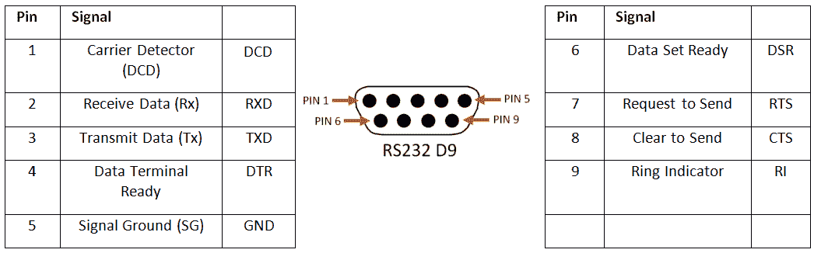

RS232 9 针 D 型连接器引脚排列和信号

想要了解更多关于 RS232 串行协议的细节以及了解这些信号的使用方法，请访问以下链接：

[串行端口](http://en.wikipedia.org/wiki/Serial_port).

# 使用 GPIO 内置的串行引脚

标准的 RS232 信号可以从-15V 到+15V，因此你绝对不能直接将任何 RS232 设备连接到 GPIO 串行引脚。你必须使用 RS232 到 TTL 电压级别转换器（例如 MAX232 芯片）或使用 TTL 级别信号的设备（例如另一个微控制器或 TTL 串行控制台电缆）：

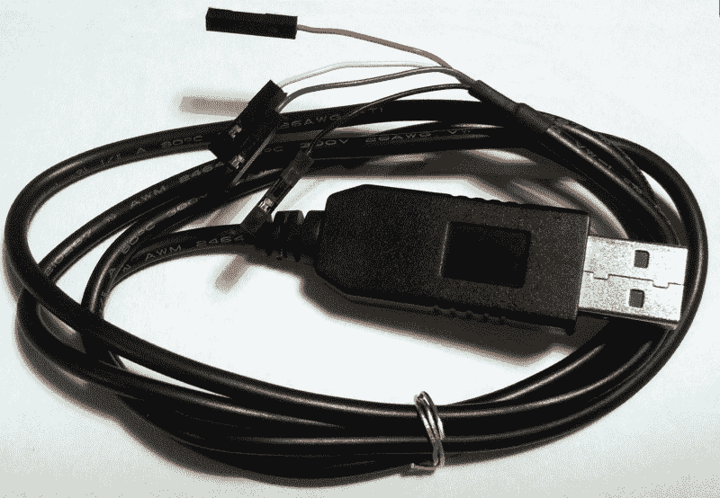

USB-to-TTL 串行控制台电缆（电压等级为 3V）

树莓派在 GPIO 引脚上具有 TTL 级别的串行引脚，这允许连接 TTL 串行 USB 线缆。线缆将连接到树莓派的 GPIO 引脚，而 USB 将插入到您的计算机上，并像标准 RS232-to-USB 线缆一样被检测到：

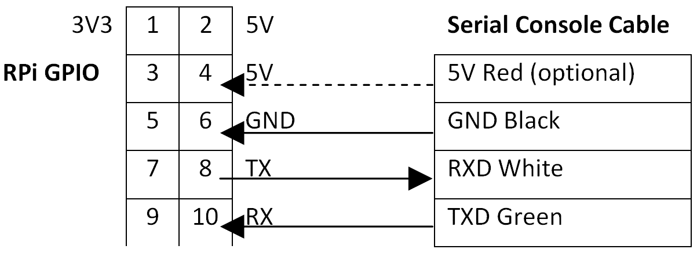

将 USB-to-TTL 串行控制台线缆连接到树莓派 GPIO

可以从 USB 端口为 5V 引脚供电；然而，这将绕过内置的熔断器，因此不建议一般使用（只需将 5V 线断开，并像正常使用一样通过 micro USB 供电）。

默认情况下，这些引脚被设置为允许远程终端访问，使您能够连接

通过 PuTTY 连接到 COM 端口并创建一个串行 SSH 会话。

如果您想在未连接显示器的 Raspberry Pi 上使用它，串行 SSH 会话可能会有所帮助。

然而，串行 SSH 会话仅限于纯文本终端访问，因为它不支持 X10 转发，正如第一章中“使用 SSH（以及 X11 转发）远程连接到 Raspberry Pi”部分所述，在《Raspberry Pi 3 计算机入门》一书中。

为了将其用作标准串行连接，我们必须禁用串行控制台，以便我们可以使用它。

首先，我们需要编辑 `/boot/cmdline.txt` 文件以移除第一个 `console` 和 `kgboc` 选项（不要移除其他的 `console=tty1` 选项，这是您开启时默认的终端）：

```py
sudo nano /boot/cmdline.txt
dwc_otg.lpm_enable=0 console=ttyAMA0,115200 kgdboc=ttyAMA0,115200 console=tty1 root=/dev/mmcblk0p2 rootfstype=ext4 elevator=deadline rootwait  
```

之前的命令行变为以下内容（确保这仍然是一个单独的

命令行（）：

```py
dwc_otg.lpm_enable=0 console=tty1 root=/dev/mmcblk0p2 rootfstype=ext4 elevator=deadline rootwait  
```

我们还必须通过使用`#`注释掉运行`getty`命令的任务（处理串行连接文本终端的程序），将其移除。这已在`/etc/inittab`中设置如下：

```py
sudo nano /etc/inittab
T0:23:respawn:/sbin/getty -L ttyAMA0 115200 vt100  
```

之前的命令行变为以下：

```py
#T0:23:respawn:/sbin/getty -L ttyAMA0 115200 vt100  
```

在我们的脚本中引用 GPIO 串行端口，我们使用其名称，`/dev/ttyAMA0`。

# RS232 环回测试

您可以使用以下方法检查串行端口连接是否正常工作：

串行环回。

简单的环回连接由将 RXD 和 TXD 连接在一起组成。这些是 Raspberry Pi GPIO 接头上的第 8 和第 10 脚，或者在 USB-RS232 适配器上标准 RS232 D9 连接器上的第 2 和第 3 脚：

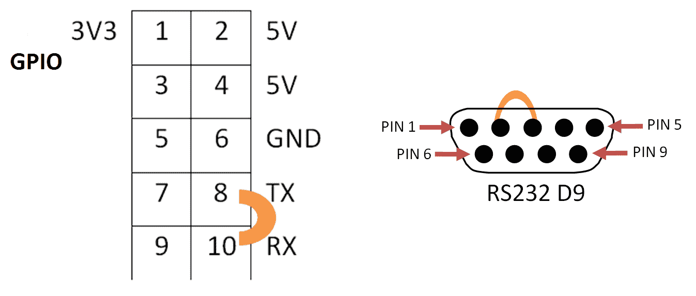

连接到测试树莓派 GPIO（左侧）和 RS232 9 针 D 型连接器（右侧）的串行环回连接

一条 RS232 全环回电缆也连接了 RS232 适配器上的 4 号引脚（DTR）和 6 号引脚（DSR），以及 7 号引脚（RTS）和 8 号引脚（CTS）。然而，在大多数情况下，这并不是必需的，除非使用这些信号。默认情况下，树莓派上没有专门为这些额外信号分配引脚：


RS232 全环回

创建以下 `serialTest.py` 脚本：

```py
#!/usr/bin/python3 
#serialTest.py 
import serial 
import time 

WAITTIME=1 
serName="/dev/ttyAMA0" 
ser = serial.Serial(serName) 
print (ser.name) 
print (ser) 
if ser.isOpen(): 
  try: 
    print("For Serial Loopback - connect GPIO Pin8 and Pin10") 
    print("[Type Message and Press Enter to continue]") 
    print("#:") 
    command=input() 
    ser.write(bytearray(command+"rn","ascii")) 
    time.sleep(WAITTIME) 
    out="" 
    while ser.inWaiting() > 0: 
      out += bytes.decode(ser.read(1)) 
    if out != "": 
      print (">>" + out) 
    else: 
      print ("No data Received") 
  except KeyboardInterrupt: 
    ser.close() 
#End 
```

当环回连接时，你会观察到信息被回显到屏幕上（当移除时，将显示`无数据接收`）：

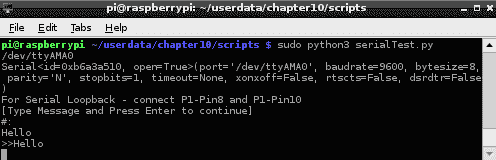

在 GPIO 串行引脚上进行的 RS232 环回测试

如果我们需要非默认设置，它们可以在初始化串行端口时定义（[pySerial 文档](https://pyserial.readthedocs.io/en/latest/)提供了所有选项的完整详情），如下面的代码所示：

```py
ser = serial.Serial(port=serName, baudrate= 115200,  
    timeout=1, parity=serial.PARITY_ODD, 
    stopbits=serial.STOPBITS_TWO, 
    bytesize=serial.SEVENBITS) 
```

# 使用蓝牙控制树莓派

通过连接支持**串行端口配置文件**（**SPP**）的 HC-05 蓝牙模块到 GPIO 串行 RX/TX 引脚，串行数据也可以通过蓝牙发送。这使得串行连接变为无线，从而可以使用 Android 平板电脑或智能手机来控制事物并从树莓派读取数据：

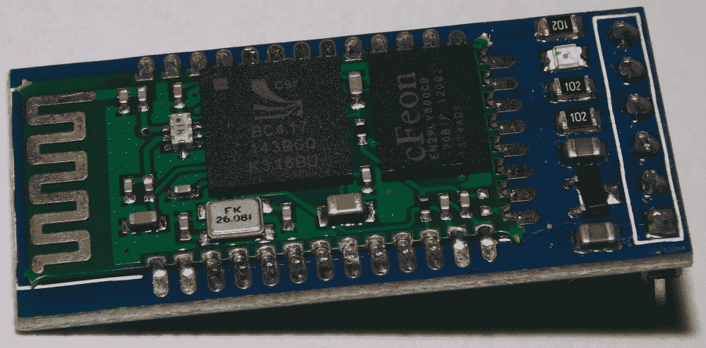

TLL 串行用的 HC-05 蓝牙模块

虽然使用 USB 蓝牙适配器也能实现类似的效果，但根据所使用的适配器类型，可能需要进行额外的配置。TTL 蓝牙模块可以作为一个物理电缆的直接替代品，只需要非常少的额外配置。

# 准备就绪

确保串行控制台已被禁用（参见前面的 *还有更多...* 部分）。

该模块应使用以下引脚进行连接：

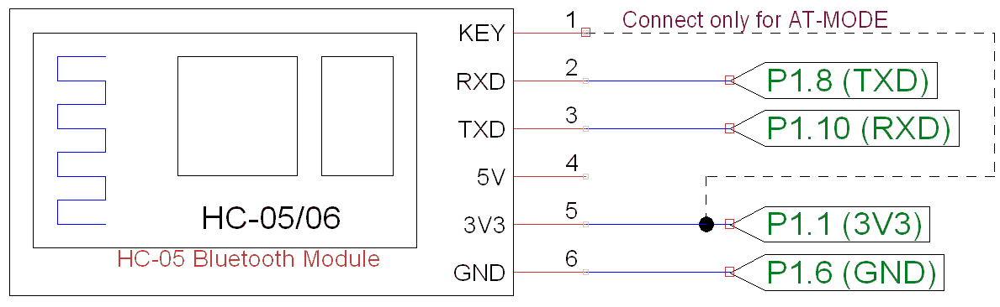

连接到 TLL 串行接口的蓝牙模块

# 如何做到这一点...

配置并连接蓝牙模块后，我们可以将模块与笔记本电脑或智能手机配对，以无线方式发送和接收命令。蓝牙 spp pro 提供了一种简单的方法，通过蓝牙使用串行连接来控制或监控 Android 设备的 Raspberry Pi。

或者，您可能能够在您的 PC/笔记本电脑上设置一个蓝牙 COM 端口，并像之前的有线示例一样使用它：

1.  当设备首次连接时，LED 灯快速闪烁以表示它正在等待配对。请启用您设备上的蓝牙并选择 HC-05 设备：

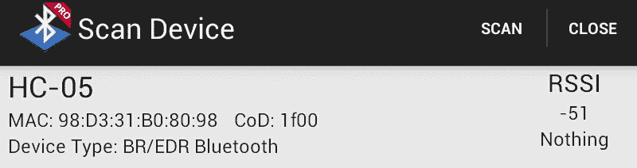

可在蓝牙 spp pro 中查看的 HC-05 蓝牙模块

1.  点击配对按钮开始配对过程并输入设备的 PIN 码（默认为`1234`）：

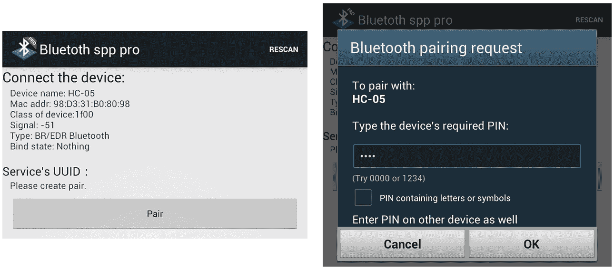

将蓝牙设备与 PIN 码（1234）配对

1.  如果配对成功，您将能够连接到设备，并向 Raspberry Pi 发送和接收消息：

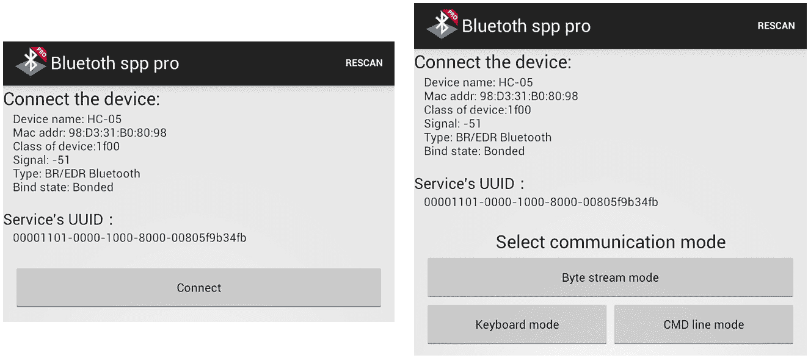

连接到设备并选择控制方法

1.  在键盘模式下，您可以定义每个按钮的动作，以便在按下时发送合适的命令。

例如，可以将 Pin12 ON 设置为发送`gpio 12 on`，而将 Pin12 OFF 设置为发送`gpio 12 off`。

1.  确保您通过菜单选项将结束标志设置为`rn`。

1.  确保将 `menuSerial.py` 设置为使用 GPIO 串行连接：

```py
serName="/dev/ttyAMA0"  
```

1.  运行`menuSerial.py`脚本（连接上 LED 灯）：

```py
sudo python3 menuSerial.py
```

1.  检查蓝牙串行应用是否显示与以下截图所示的`GPIO 串行控制`菜单：

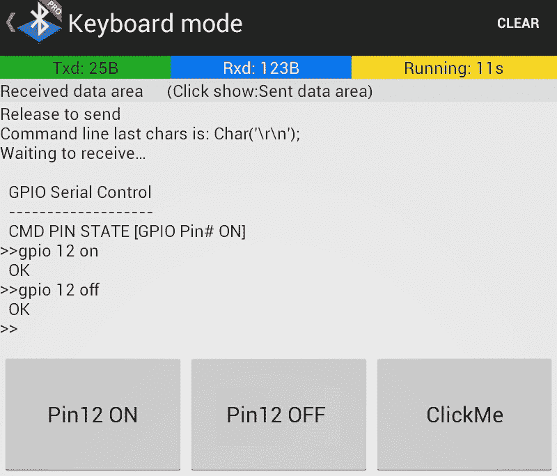

通过蓝牙进行 GPIO 控制

我们可以从下面的截图输出中看到，命令已被接收，连接到引脚 12 的 LED 灯已按需开启和关闭：

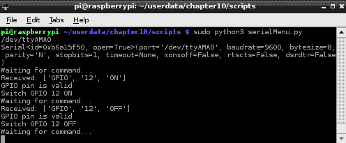

树莓派通过蓝牙接收 GPIO 控制

# 它是如何工作的...

默认情况下，蓝牙模块被设置为类似于 TTL 串行从设备，因此我们可以直接将其插入 GPIO RX 和 TX 引脚。一旦模块与设备配对，它将通过蓝牙连接传输串行通信。这使得我们可以通过蓝牙发送命令和接收数据，并使用智能手机或 PC 来控制 Raspberry Pi。

这意味着你可以将第二个模块连接到另一个设备（例如 Arduino）上

拥有 TTL 串行引脚，并使用树莓派（通过与其配对或通过其他方式）来控制它

TTL 蓝牙模块或适当配置一个 USB 蓝牙适配器）。如果该模块是

将其设置为从设备后，您需要重新配置它以作为主设备（请参阅*更多内容...*部分）。

# 还有更多...

现在，让我们了解如何配置蓝牙设置。

# 配置蓝牙模块设置

通过 KEY 引脚，可以将蓝牙模块设置为两种不同的模式之一。

在正常操作中，串行消息通过蓝牙发送；然而，如果我们需要更改蓝牙模块本身的设置，我们可以通过将 KEY 引脚连接到 3V3 并将它置于 AT 模式来实现。

AT 模式允许我们直接配置模块，使我们能够更改波特率、配对码、设备名称，甚至将其设置为主/从设备。

您可以使用 pySerial 的一部分`miniterm`来发送所需的消息，如下面的代码所示：

```py
python3 -m serial.tools.miniterm  
```

当启动 `miniterm` 程序时，它会提示您输入要使用的端口号：

```py
Enter port name: /dev/ttyAMA0  
```

您可以发送以下命令（您需要快速完成此操作，或者粘贴它们，因为如果出现间隔，模块将超时并返回错误信息）：

+   `AT`: 此命令应响应“OK”。

+   `AT+UART?`: 此命令将报告当前设置，格式为 `UART=<Param1>,<Param2>,<Param3>`。此命令的输出将是 OK。

+   要更改当前设置，请使用 `AT+UART=<Param1>,<Param2>,<Param3>`，即 `AT+UART=19200,0,0`。

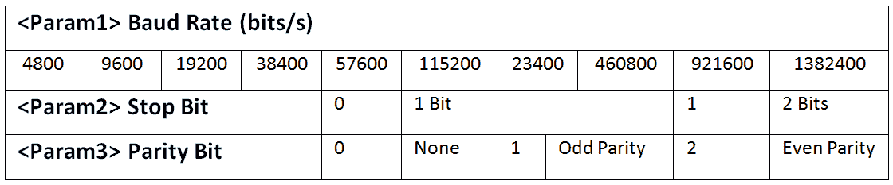

HC-05 AT 模式 AT+UART 命令参数

Zak Kemble 撰写了一篇优秀的指南，介绍了如何配置模块作为成对的从主设备（例如，在两个 Raspberry Pi 设备之间）。该指南可在以下链接找到：

[如何让蓝牙模块相互通信](http://blog.zakkemble.co.uk/getting-bluetooth-modules-talking-to-each-other/)

关于 HC-05 模块的附加文档，请访问以下链接：

[`www.robotshop.com/media/files/pdf/rb-ite-12-bluetooth_hc05.pdf`](http://www.robotshop.com/media/files/pdf/rb-ite-12-bluetooth_hc05.pdf).

# 控制 USB 设备

**通用串行总线**（**USB**）被计算机广泛用于通过一个通用的标准连接提供额外的外围设备和扩展。我们将使用

`pyusb` Python 库用于通过 USB 向连接的设备发送自定义命令。

以下示例控制一个 USB 玩具导弹发射器，反过来它可以通过我们的 Python 控制面板进行控制。我们可以看到，同样的原理可以应用于其他 USB 设备，例如使用类似技术的机械臂，并且可以通过连接到树莓派 GPIO 的传感器来激活控制：

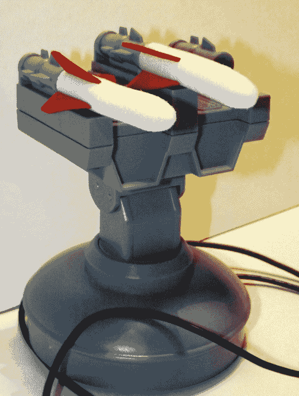

USB Tenx 技术 SAM 导弹发射器

# 准备就绪

我们需要使用`pip-3.2`来为 Python 3 安装`pyusb`，具体操作如下：

```py
sudo pip-3.2 install pyusb  
```

您可以通过运行以下命令来测试`pyusb`是否已正确安装：

```py
python3
> import usb
> help (usb)
> exit()  
```

这应该允许您查看包信息，如果它被正确安装的话。

# 如何做到这一点...

我们将创建以下`missileControl.py`脚本，其中将包含两个类和一个默认的`main()`函数以进行测试：

1.  按照以下方式导入所需的模块：

```py
#!/usr/bin/python3 
# missileControl.py 
import time 
import usb.core 
```

1.  定义`SamMissile()`类，该类提供了 USB 设备的特定命令，如下所示：

```py
class SamMissile(): 
  idVendor=0x1130 
  idProduct=0x0202 
  idName="Tenx Technology SAM Missile" 
  # Protocol control bytes 
  bmRequestType=0x21 
  bmRequest=0x09 
  wValue=0x02 
  wIndex=0x01 
  # Protocol command bytes 
  INITA     = [ord('U'), ord('S'), ord('B'), ord('C'), 
               0,  0,  4,  0] 
  INITB     = [ord('U'), ord('S'), ord('B'), ord('C'), 
               0, 64,  2,  0] 
  CMDFILL   = [ 8,  8, 
                0,  0,  0,  0,  0,  0,  0,  0, 
                0,  0,  0,  0,  0,  0,  0,  0, 
                0,  0,  0,  0,  0,  0,  0,  0, 
                0,  0,  0,  0,  0,  0,  0,  0, 
                0,  0,  0,  0,  0,  0,  0,  0, 
                0,  0,  0,  0,  0,  0,  0,  0, 
                0,  0,  0,  0,  0,  0,  0,  0]#48 zeros 
  STOP      = [ 0,  0,  0,  0,  0,  0] 
  LEFT      = [ 0,  1,  0,  0,  0,  0] 
  RIGHT     = [ 0,  0,  1,  0,  0,  0] 
  UP        = [ 0,  0,  0,  1,  0,  0] 
  DOWN      = [ 0,  0,  0,  0,  1,  0] 
  LEFTUP    = [ 0,  1,  0,  1,  0,  0] 
  RIGHTUP   = [ 0,  0,  1,  1,  0,  0] 
  LEFTDOWN  = [ 0,  1,  0,  0,  1,  0] 
  RIGHTDOWN = [ 0,  0,  1,  0,  1,  0] 
  FIRE      = [ 0,  0,  0,  0,  0,  1] 
  def __init__(self): 
    self.dev = usb.core.find(idVendor=self.idVendor, 
                                idProduct=self.idProduct) 
  def move(self,cmd,duration): 
    print("Move:%s %d sec"% (cmd,duration)) 
    self.dev.ctrl_transfer(self.bmRequestType, 
                           self.bmRequest,self.wValue, 
                           self.wIndex, self.INITA) 
    self.dev.ctrl_transfer(self.bmRequestType, 
                           self.bmRequest,self.wValue, 
                           self.wIndex, self.INITB) 
    self.dev.ctrl_transfer(self.bmRequestType, 
                           self.bmRequest, self.wValue, 
                           self.wIndex, cmd+self.CMDFILL) 
    time.sleep(duration) 
    self.dev.ctrl_transfer(self.bmRequestType, 
                           self.bmRequest, self.wValue, 
                           self.wIndex, self.INITA) 
    self.dev.ctrl_transfer(self.bmRequestType, 
                           self.bmRequest, self.wValue, 
                           self.wIndex, self.INITB) 
    self.dev.ctrl_transfer(self.bmRequestType, 
                      self.bmRequest, self.wValue, 
                      self.wIndex, self.STOP+self.CMDFILL) 
```

1.  定义`Missile()`类，该类允许你检测 USB 设备并提供命令功能，具体如下：

```py
class Missile(): 
  def __init__(self): 
    print("Initialize Missiles") 
    self.usbDevice=SamMissile() 

    if self.usbDevice.dev is not None: 
      print("Device Initialized:" + 
            " %s" % self.usbDevice.idName) 
      #Detach the kernel driver if active 
      if self.usbDevice.dev.is_kernel_driver_active(0): 
        print("Detaching kernel driver 0") 
        self.usbDevice.dev.detach_kernel_driver(0) 
      if self.usbDevice.dev.is_kernel_driver_active(1): 
        print("Detaching kernel driver 1") 
        self.usbDevice.dev.detach_kernel_driver(1) 
      self.usbDevice.dev.set_configuration() 
    else: 
      raise Exception("Missile device not found") 
  def __enter__(self): 
    return self 
  def left(self,duration=1): 
    self.usbDevice.move(self.usbDevice.LEFT,duration) 
  def right(self,duration=1): 
    self.usbDevice.move(self.usbDevice.RIGHT,duration) 
  def up(self,duration=1): 
    self.usbDevice.move(self.usbDevice.UP,duration) 
  def down(self,duration=1): 
    self.usbDevice.move(self.usbDevice.DOWN,duration) 
  def fire(self,duration=1): 
    self.usbDevice.move(self.usbDevice.FIRE,duration) 
  def stop(self,duration=1): 
    self.usbDevice.move(self.usbDevice.STOP,duration) 
  def __exit__(self, type, value, traceback): 
    print("Exit") 
```

1.  最后，创建一个 `main()` 函数，如果文件直接运行，它将为我们提供对 `missileControl.py` 模块的快速测试，如下所示：

```py
def main(): 
  try: 
    with Missile() as myMissile: 
      myMissile.down() 
      myMissile.up() 
  except Exception as detail: 

      time.sleep(2) 
    print("Error: %s" % detail) 

if __name__ == '__main__': 
    main() 
#End 
```

1.  当使用以下命令运行脚本时，你应该看到导弹发射器向下移动然后再向上移动：

```py
sudo python3 missileControl.py  
```

1.  为了轻松控制设备，创建以下图形用户界面：

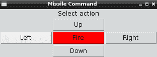

导弹指挥 GUI

虽然这里使用了简单的命令，但如果需要，你也可以使用一系列预设的命令。

1.  为`missileMenu.py`导弹命令创建 GUI：

```py
#!/usr/bin/python3 
#missileMenu.py 
import tkinter as TK 
import missileControl as MC 

BTN_SIZE=10 

def menuInit(): 
  btnLeft = TK.Button(root, text="Left", 
                      command=sendLeft, width=BTN_SIZE)    
  btnRight = TK.Button(root, text="Right", 
                       command=sendRight, width=BTN_SIZE)    
  btnUp = TK.Button(root, text="Up", 
                    command=sendUp, width=BTN_SIZE)    
  btnDown = TK.Button(root, text="Down", 
                      command=sendDown, width=BTN_SIZE) 
  btnFire = TK.Button(root, text="Fire",command=sendFire, 
                      width=BTN_SIZE, bg="red") 
  btnLeft.grid(row=2,column=0) 
  btnRight.grid(row=2,column=2) 
  btnUp.grid(row=1,column=1) 
  btnDown.grid(row=3,column=1) 
  btnFire.grid(row=2,column=1) 

def sendLeft(): 
  print("Left") 
  myMissile.left() 

def sendRight(): 
  print("Right")     
  myMissile.right() 

def sendUp(): 
  print("Up") 
  myMissile.up() 

def sendDown(): 
  print("Down") 
  myMissile.down() 

def sendFire(): 
  print("Fire") 
  myMissile.fire() 

root = TK.Tk() 
root.title("Missile Command") 
prompt = "Select action" 
label1 = TK.Label(root, text=prompt, width=len(prompt), 
                  justify=TK.CENTER, bg='lightblue') 
label1.grid(row=0,column=0,columnspan=3) 
menuInit() 
with MC.Missile() as myMissile: 
  root.mainloop() 
#End 
```

# 它是如何工作的...

控制脚本由两个类组成：一个名为`Missile`的类，它为控制提供了一个通用接口，另一个名为`SamMissile`的类，它提供了正在使用的特定 USB 设备的所有详细信息。

为了驱动 USB 设备，我们需要大量关于该设备的信息，例如其 USB 标识、其协议以及它需要用于控制的控制消息。

Tenx Technology SAM 导弹设备的 USB ID 由厂商确定

ID (`0x1130`) 和产品 ID (`0x0202`)。这是相同的识别信息

你会在 Windows 的设备管理器中看到这些 ID。这些 ID 通常在 [www.usb.org](http://www.usb.org) 进行注册；因此，每个设备应该是唯一的。再次提醒，你可以使用 `dmesg | grep usb` 命令来发现这些 ID。

我们使用设备 ID 通过`usb.core.find`找到 USB 设备；然后，我们可以使用`ctrl_transfer()`发送消息。

USB 信息包含五个部分：

+   **请求类型（0x21）**：这定义了消息请求的类型，例如消息方向（主机到设备）、其类型（供应商）以及接收者（接口）。

+   **请求** **(0x09)**: 这是设置配置。

+   **值** **(0x02)**: 这是配置值。

+   **索引** **(0x01)**: 这是我们要发送的命令。

+   **数据**：这是我们想要发送的命令（如后续所述）。

`SamMissile` 设备需要以下命令来移动：

+   它需要两个初始化消息（`INITA` 和 `INITB`）。

+   它还要求控制信息。这包括`CMD`，其中包含一个被设置为`1`的控制字节，用于所需的组件。然后，`CMD`被添加到`CMDFILL`中以完成信息。

你会发现其他导弹装置和机械臂（见下文 *还有更多...* 部分）具有类似的消息结构。

对于每个设备，我们创建了`__init__()`和`move()`函数，并为每个有效的命令定义了值，当调用`missile`类的`left()`、`right()`、`up()`、`down()`、`fire()`和`stop()`函数时，`missile`类将使用这些值。

对于我们导弹发射器的控制 GUI，我们创建了一个带有五个按钮的小 Tkinter 窗口，每个按钮都会向导弹设备发送一个命令。

我们导入`missileControl`并创建一个名为`myMissile`的`missile`对象，该对象将由每个按钮控制。

# 还有更多...

该示例仅展示了如何控制一个特定的 USB 设备；然而，有可能将其扩展以支持多种类型的导弹设备，甚至是一般意义上的其他 USB 设备。

# 控制类似的导弹型装置

USB 导弹型设备的变体有好几种，每种都有自己的 USB ID 和 USB 命令。我们可以通过定义它们自己的类别来处理这些其他设备，从而为这些设备添加支持。

使用 `lsusb -vv` 命令来确定与您的设备匹配的供应商和产品 ID。

对于`Chesen Electronics/Dream Link`，我们必须添加以下代码：

```py
class ChesenMissile(): 
  idVendor=0x0a81 
  idProduct=0x0701 
  idName="Chesen Electronics/Dream Link" 
  # Protocol control bytes 
  bmRequestType=0x21 
  bmRequest=0x09 
  wValue=0x0200 
  wIndex=0x00 
  # Protocol command bytes 
  DOWN    = [0x01] 
  UP      = [0x02] 
  LEFT    = [0x04] 
  RIGHT   = [0x08] 
  FIRE    = [0x10] 
  STOP    = [0x20] 
  def __init__(self): 
    self.dev = usb.core.find(idVendor=self.idVendor, 
                             idProduct=self.idProduct) 
  def move(self,cmd,duration): 
    print("Move:%s"%cmd) 
    self.dev.ctrl_transfer(self.bmRequestType, 
                           self.bmRequest, 
                           self.wValue, self.wIndex, cmd) 
    time.sleep(duration) 
    self.dev.ctrl_transfer(self.bmRequestType, 
                           self.bmRequest, self.wValue, 
                           self.wIndex, self.STOP) 
```

对于 `Dream Cheeky Thunder`，我们需要以下代码：

```py
class ThunderMissile(): 
  idVendor=0x2123 
  idProduct=0x1010 
  idName="Dream Cheeky Thunder" 
  # Protocol control bytes 
  bmRequestType=0x21 
  bmRequest=0x09 
  wValue=0x00 
  wIndex=0x00 
  # Protocol command bytes 
  CMDFILL = [0,0,0,0,0,0] 
  DOWN    = [0x02,0x01] 
  UP      = [0x02,0x02] 
  LEFT    = [0x02,0x04] 
  RIGHT   = [0x02,0x08] 
  FIRE    = [0x02,0x10] 
  STOP    = [0x02,0x20] 
  def __init__(self): 
    self.dev = usb.core.find(idVendor=self.idVendor, 
                             idProduct=self.idProduct) 
  def move(self,cmd,duration): 
    print("Move:%s"%cmd) 
    self.dev.ctrl_transfer(self.bmRequestType, 
                           self.bmRequest, self.wValue, 
                           self.wIndex, cmd+self.CMDFILL) 
    time.sleep(duration) 
    self.dev.ctrl_transfer(self.bmRequestType, 
                      self.bmRequest, self.wValue, 
                      self.wIndex, self.STOP+self.CMDFILL) 
```

最后，将脚本调整为使用所需的类，如下所示：

```py
class Missile(): 
  def __init__(self): 
    print("Initialize Missiles") 
    self.usbDevice = ThunderMissile() 
```

# 机器人手臂

另一种可以用类似方式控制的设备是带有 USB 接口的 OWI 机器人手臂：

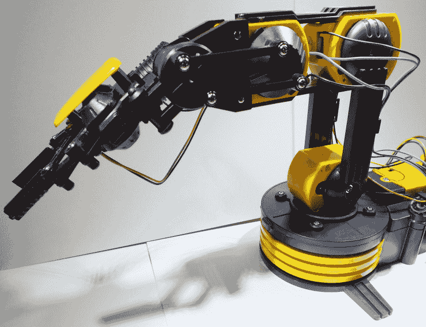

带有 USB 接口的 OWI 机器人手臂（图片由 Chris Stagg 提供）

这在 *《The MagPi》杂志* 中多次被提及，多亏了 *Stephen Richards* 的贡献。

关于 Skutter 的文章；USB 控制已在第 3 期（第 14 页）中详细解释

在[`issuu.com/themagpi/docs/the_magpi_issue_3_final/14`](https://issuu.com/themagpi/docs/the_magpi_issue_3_final/14)。也可以在[`www.raspberrypi.org/magpi/issues/3/`](https://www.raspberrypi.org/magpi/issues/3/)找到。

机器人臂可以通过以下类进行控制。记住，在调用`move()`函数时，你还需要调整命令，例如`UP`、`DOWN`等，如下面的代码所示：

```py
class OwiArm(): 
  idVendor=0x1267 
  idProduct=0x0000 
  idName="Owi Robot Arm" 
  # Protocol control bytes 
  bmRequestType=0x40 
  bmRequest=0x06 
  wValue=0x0100 
  wIndex=0x00 
  # Protocol command bytes 
  BASE_CCW    = [0x00,0x01,0x00] 
  BASE_CW     = [0x00,0x02,0x00] 
  SHOLDER_UP  = [0x40,0x00,0x00] 
  SHOLDER_DWN = [0x80,0x00,0x00] 
  ELBOW_UP    = [0x10,0x00,0x00] 
  ELBOW_DWN   = [0x20,0x00,0x00] 
  WRIST_UP    = [0x04,0x00,0x00] 
  WRIST_DOWN  = [0x08,0x00,0x00] 
  GRIP_OPEN   = [0x02,0x00,0x00] 
  GRIP_CLOSE  = [0x01,0x00,0x00] 
  LIGHT_ON    = [0x00,0x00,0x01] 
  LIGHT_OFF   = [0x00,0x00,0x00] 
  STOP        = [0x00,0x00,0x00] 
```

# 将 USB 控制进一步深化

用于 USB 导弹装置的控制理论和方法的适用范围很广，甚至可以应用于像 Xbox 360 的 Kinect（Xbox 游戏控制台的一个特殊 3D 摄像头附加装置）这样的非常复杂的设备。

Adafruit 的网站上有一篇由*Limor Fried*（也称为*Ladyada*）撰写的非常有趣的教程，介绍了如何分析和调查 USB 命令；您可以通过[`learn.adafruit.com/hacking-the-kinect`](http://learn.adafruit.com/hacking-the-kinect)访问它。

如果你打算逆向工程其他 USB 设备，这绝对值得一看。在本章中，我们使用了树莓派来远程控制主电源插座，从另一台计算机通过串行连接发送命令，以及远程控制 GPIO。我们还使用了 SPI 来驱动一个 8 x 8 的 LED 矩阵显示屏。
