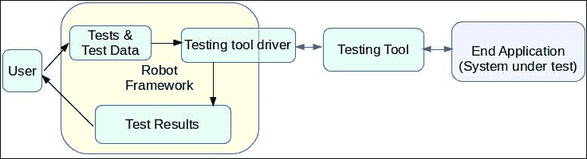
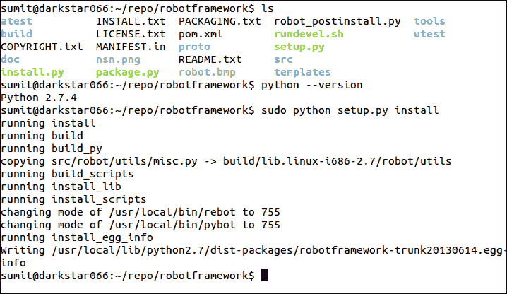
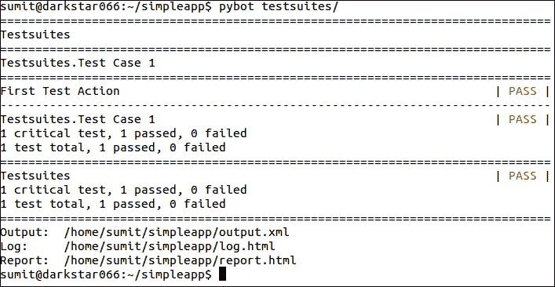
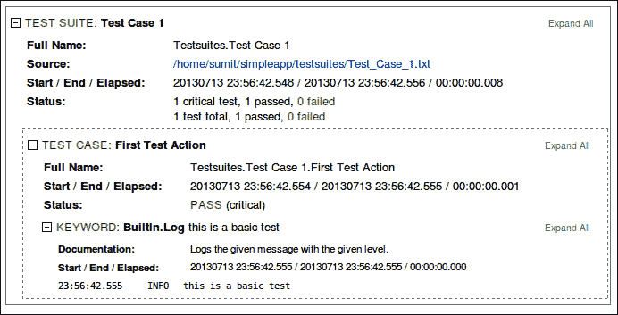
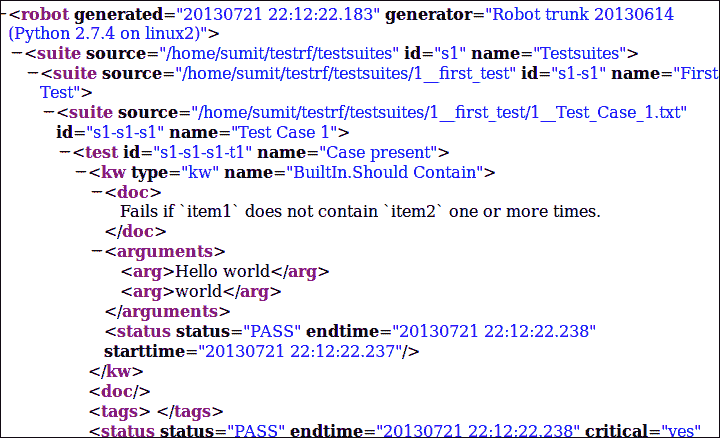

# 第一章：Robot Framework 入门

在本章中，我们将涵盖以下主题：

+   接受测试的定义和需求

+   Robot Framework 的介绍和简要历史

+   Robot Framework 的组件

+   不同的安装方法

+   不同的安装环境

+   示例项目的创建和执行

+   生成文件的简要描述

这本书向您介绍了 Robot Framework，这是一个基于 Python、以关键字驱动的、接受测试自动化框架。它非常灵活，易于使用和扩展，以满足您的需求。它旨在提供无论平台大小和待测试软件范围（也称为系统测试对象，SUT）如何的接受测试，是一个理想的软件工具，用于构建和管理不同测试，作为综合测试套件的一部分。由于此工具利用和管理测试，同时处理待测试的软件，因此对测试人员和开发人员都有益。如今，随着多功能软件工具的兴起和对测试驱动开发的重视，测试人员和开发者之间的界限已经变得模糊。为了有效地学习和使用此工具，您必须站在测试人员和开发人员的角度。还需要 Python 以及将其导入 Java 和.NET 框架（如 Jython 和 Ironpython）。

就像任何其他物理创造一样，软件的构建旨在直接或间接地改变我们的生活，以解决某人的任务或需求。然而，编程是一种抽象的科学，它不依赖于其最终用户的愿望，通常被称为垃圾输入-垃圾输出。创建的软件与其用户期望的行为之间的差异决定了用户对其的实现。因此，最终用户必须接受打算卖给他/她的软件。然而，用户通常不希望参与细节，只需要按照软件的每次迭代所设想的方式完成任务。为了执行此操作，需要验证最终用户与软件的交互，这导致了专门用于执行此测试和验证过程的测试的创建。这个过程被称为接受测试。然而，随着软件的增长，越来越多的接受测试出现，导致在测试失败时，无法轻易识别出正确的上下文。

随着软件规模和复杂性的增长，对其质量保证的需求也在增加。手动测试通常很容易设置，但它们在规模上的回报却在减少，并且只有在一定程度上可行，即测试人员可以手动处理不同的场景，及时识别出错误和缺陷，而不会影响最终产品的交付时间表。

# 接受测试的需求

对于大型或复杂的测试，采用结构化方法可以帮助您在系统测试接受阶段精确地定位错误。同时，提高开发速度和效率以及为软件的各种特性创造问责制也被考虑在内。这些好处可以总结如下：

+   精确定位应用程序故障

+   降低错误率

+   提供自动化和可重用性

+   创建测试审计跟踪

## 精确定位应用程序故障

通过测试，您可以识别出完全或部分故障，以及识别出在开发过程中或其他测试形式中可能出现的性能瓶颈。

## 降低错误率

通过自动化，可以精确地执行运行程序所需的预定步骤，没有任何干扰以及没有额外的或错误的用户交互。这与接受测试中的猴子测试不同；只需处理快乐路径场景。

## 提供自动化和重用

测试人员或其他人力资源比计算周期更昂贵。因此，最好自动化重复性任务，这将减少测试用户在输入、点击和消化用户界面时通常花费的时间。此外，测试可以重用或迭代，这减少了测试数量，同时确保完整的接受测试仍然存在，您可以专注于其他问题。

## 创建测试审计跟踪

通过记录各种测试结果，您可以收集有关接受测试的有趣事实，例如测试覆盖了多少系统，以及报告了多少次故障。这可以在管理变更以及现有软件的重构/现代化中非常有用。

# 什么是 Robot Framework？

Robot Framework 是一个开源的通用测试自动化框架，用于接受测试，并将其简化为主流开发，从而产生了**接受测试驱动开发**（**ATDD**）的概念。虽然商业和内部自动化测试工具传统上被用来提供这种类型的测试自动化，但它存在重新发明轮子和供应商锁定以及缺乏在不同软件和不同情况下使用测试的灵活性的问题。它通过易于使用的表格测试文件脱颖而出，这些文件提供了不同的测试创建方法。由于不同的项目以不同的方式需要接受测试，因此需要使测试灵活，因为 Robot Framework 足够灵活和可扩展，可以处理这些场景。

正是工具的可扩展性使其如此多功能，可以调整到不同的场景，并与不同的软件后端一起使用。虽然它最常与 selenium 作为网站自动化工具一起使用，但它也可以与基于图像的测试软件如**sikuli**一起使用，还可以与需要通过多台机器远程访问的软件一起使用，而只需在给定的机器上运行测试。所有这些都可以通过创建自定义库轻松实现，这些库将机器人框架配置代码关键字与机器人框架使用的相关任务链接起来。另一方面，框架产生的输出也可以以多种方式使用，首先是 HTML 报告和日志文件，它不仅产生 XUnit 样式的输出，而且还包含详细的测试操作，同时表示整个测试的执行顺序和测试层次结构。这与可选的`.xml`生成形成对比，后者在进一步处理过程中可能很有用。一个这样的例子是创建自定义程序，这些程序使用运行测试获得的信息来创建各种结果。另一个例子是日志文件在持续交付环境中的后续使用，这可以使构建根据所有正在使用的单个验收测试继续或失败。

它是由*佩卡·克拉克*在他的硕士论文中创建的，作为其论文的一部分（[`eliga.fi/Thesis-Pekka-Laukkanen.pdf`](http://eliga.fi/Thesis-Pekka-Laukkanen.pdf)），并于 2005 年在诺基亚西门子网络公司内部开发。自 2008 年以来，其第二个版本已在 Apache 许可证 2.0 下开源，并拥有一个活跃的志愿者社区。它可在[`code.google.com/p/robotframework`](http://code.google.com/p/robotframework)找到。

# 机器人框架生态系统

下图展示了框架的概念性、高级概述，并提供了对涉及的各种组件的深入了解：



这可以广泛解释如下：

+   **测试与测试数据**：这是测试的配置，对于框架的大多数测试人员来说是最接近的。它包括测试和数据文件以及文件夹，以及那些指导测试执行的内容。

+   **测试结果**：这是测试的最终产品，用于确定测试结果以及可以用来评估测试各个部分的日志。

+   **机器人框架**：这是执行实际繁重工作的核心框架。

+   **测试工具驱动程序**：它提供了框架与实际工具之间的通信。它可以根据现有测试工具的具体要求进行定制，以满足特定需求。

+   **测试工具**：这是用于执行验收测试的实际软件。

+   **结束应用程序（待测试的系统）**：这是实际要测试其可用性以便客户或最终用户接受的实际软件。

# 安装和设置 Robot Framework

Robot Framework 的当前版本需要 Python 2.7 来进行设置。

目前，只有从 Python 环境创建 pybot 脚本。在其他环境中，仅创建相应的执行脚本。如果您有多个环境，则也可以安装不同的脚本。这与之前的版本不同，在安装时，pybot 和 jybot 脚本都会被安装。

对于自定义安装，您需要预先安装 Python、Jython 或 Ironpython；并且正确设置环境 `PATH` 变量，因为 Robot Framework 将使用 `PATH` 上可用的第一个 Python 二进制文件或如果通过 python 命令提供，则使用确切的库。您可以从命令行验证此信息：

```py
sumit@darkstar066:~$ python --version 
Python 2.7.4 
sumit@darkstar066:~$ jython --version 
Jython 2.5.2 
sumit@darkstar066:~$ 

```

在项目下载页面，有各种选项，以下列出了以下自解释的标题。

## 源安装

要使用源代码，您可以下载包含源代码的 zip 文件，或使用 mercurial hg clone：[`code.google.com/p/robotframework`](https://code.google.com/p/robotframework) 进行项目克隆。

这将在当前目录中克隆项目，然后您可以直接安装项目，或者进行一些修改以自定义框架。

现在转到已检出/解压源代码的文件夹，根据现有环境执行以下命令：

```py
python setup.py install

```

上述命令安装了基于 Python 的版本，包括 pybot 和 rebot 运行脚本。

```py
jython setup.py install

```

上述命令安装了基于 Jython 的版本，包括 jybot 和 jyrebot 脚本。

```py
ipy setup.py install

```

上述命令安装了基于 Ironpython 的运行时，包括 ipybot 和 ipyrebot 脚本。

如果您看到此文件夹，以及标准的 `setup.py`，还有一个名为 `install.py` 的文件，可以用来安装（它与从 `setup.py` 安装类似），重新安装或卸载框架，可以使用以下方式：

```py
python install.py in    [Installation]
python install.py un    [Uninstallation]
python install.py re    [Re-Installation]

```

要使用 Jython 或 IronPython 安装，请在命令中将 `python` 替换为 `jython` 或 `ipy`。如果您遇到任何认证错误，可能需要使用 `sudo/run` 控制台作为管理员运行，具体取决于用户权限。



使用 Python 从源安装

## 一键图形安装程序

如果您正在运行 Windows XP（32 位），则可能希望使用一键安装程序，该安装程序将安装 Robot Framework 以及 Python 和可选的 Jython，并设置路径而无需任何干预。Windows 的其他图形安装程序也存在 32 位和 64 位版本。

## Java 环境安装

您可以使用包含捆绑 Jython 以及框架的独立 jar 文件。您只需在系统上安装 Java，即可执行可运行的 jar 文件以进行安装。

在此方法中，不是命令，而是执行 jar 文件：

```py
java -jar robotframework.jar run [options] data_sources

```

## Python 包安装

pip 安装机制仅要求你在计算机上安装 Python 和包管理器，如`easy_install`或`pip`。要安装此软件，你只需在命令提示符下输入`pip install robotframework`或`easy_install robotframework`，然后基于 Python 的 Robot Framework 就会安装。

注意，为了 Python 能够正确运行，你需要`elementtree`模块，因为默认的模块已经损坏。

用户可以在计算机上同时安装多个环境，并分别使用指定的命令，而不会影响任何安装。

# 支持不同的运行时

Robot Framework 不仅可以在原生 Python（CPython/pypy）安装上运行，还可以通过 Jython 和 ironpython 分别支持基于 Java 和.NET 的运行时。虽然有一些功能仅限于原生 Python 或基于 Jython 的 Robot Framework 安装，但大多数功能在所有运行时上都是等效的。由于人们可能拥有不同的操作系统和应用软件，因此可以根据他们的需求或愿望设置一个堆栈，这样他们就可以在不需要单独运行时的情况下将此工具集成到现有的运行时中。

根据使用的安装程序环境，Robot Framework 将创建适当的启动和后处理脚本：

| 环境 | 启动命令 | 后处理命令 |
| --- | --- | --- |
| Python | `pybot` | `rebot` |
| Jython | `jybot` | `jyrebot` |
| Iron Python | `ipybot` | `ipyrebot` |

除了这些用于启动执行的命令外，如果安装了标准 Robot Framework，可以直接通过`robot.run`模块本身启动 Robot Framework。这也可以用作标准命令的替代，因为命令也内部调用模块。如果使用的 Python 命令是安装了 Robot Framework 的命令，则可以调用该模块：

```py
python -m robot.run
jython .../run.py
ipy -m robot.run

```

如果 Robot Framework 被某个 Python 脚本调用，这很有用。你不需要分别执行脚本，可以轻松地从同一程序内部调用框架。

后处理命令对于长期重新创建测试执行很有用。测试执行后，你可以保存生成的 XML 文件作为输出，而不需要保存任何其他文件。为了将来再次重新创建报告和日志文件，可以使用`rebot`命令，该命令将 XML 文件作为参数，并生成日志和报告文件，而无需重新调用或运行实际的测试。

## 命令详情

`Pybot`命令提供了以下主要选项：

| 选项 | 描述 |
| --- | --- |
| `-N --name <name>` | 设置测试层次结构中最顶层测试套件的名称——从而有效地自定义这些区域。 |
| `-D --doc <documentation>` | 设置顶级测试套件的文档。 |
| `-M --metadata [name:value]` | 设置顶级测试套件的元数据。 |
| `-G --settag <tagname>` | 将给定的标签设置到所有执行的测试用例。 |
| `-t --test name` | 通过对它们执行模式匹配来选择可用的测试用例。 |
| `-s --suite name` | 通过其名称选择指定的测试套件，并允许测试报告具有所需的名称，而不是由文件/文件夹名称选择的名称。 |
| `-i --include tag` | 根据其标签名称选择要执行的测试。 |
| `-e --exclude tag` | 与包含标签相反。 |
| `-R --runfailed output` | 选择之前测试运行中失败的测试有另一个目标。 |
| `-c --critical tag` | 具有此标签的测试被认为是关键的（所有测试的默认值）。 |
| `-n --noncritical tag` | 具有此标签的测试被覆盖为非关键类型。 |
| `-v --variable name:value` | 在测试中设置变量，仅支持标量变量（${}）。 |
| `-V --variablefile path` | 明确指定包含变量的文件。 |
| `-d --output dir` | 指定结果文件放置的期望目录。 |
| `-o --output file` | 生成的 XML 输出文件。 |
| `-l --log file` | 生成的 HTML 日志文件。 |
| `-r --report file` | 生成的 HTML 日志文件。 |
| `-x --xunit file` | 与 xUnit 兼容的结果文件（默认不创建）。 |
| `-b --debugginge rake` | 执行过程中写入的调试文件（默认不创建）。 |
| `-T --timestampoutputs` | 为所有输出文件添加时间戳并提供自定义标题。 |
| `-L --Loglevel` | 日志和日志测试顺序自定义的阈值级别。 |
| `-W --monitorwidth` | 指定监视输出宽度。 |
| `-C --monitotcolors` | 指定是否在控制台使用颜色。 |
| `-K --monitormarkers` | 为每个通过测试指定在控制台上的测试成功。 |
| `-P --pythonpath path` | 搜索测试库的附加位置。 |
| `-E -escape what` | 使用常见表示指定控制台中的转义字符。 |
| `-A --argumentfile path` | 指定一个文本文件以在测试中读取更多参数。 |
| `-h -? --help` | 打印命令的详细帮助。 |
| `--version` | 打印已安装的 Robot Framework 的版本。 |

# 一个小练习

为了演示 Robot Framework，我们将创建一个简单的虚拟应用程序，如下所示：

1.  创建一个名为 `simpleapp` 的文件夹，这将成为应用程序的根文件夹。

1.  在其中创建一个名为 `testsuites` 的文件夹，这将包含所有测试配置文件。

1.  在 `testsuites` 文件夹中创建一个名为 `Test_Case_1.txt` 的文件，内容如下：

    ```py
    ***Test Cases***

    First Test Action  log  this is a basic test
    ```

    ### 注意

    注意日志关键字前后有两个空格。

1.  现在通过调用 Pybot 脚本并传递 `testsuites` 文件夹作为参数来运行项目。你应该得到以下截图类似的结果：

这确认了项目已成功运行。你可以通过生成的 HTML 页面查看结果和日志，并使用 XML 文件对数据进行未来的计算。

由于我们使用了简单的日志语句，你会在输出日志中看到日志消息，如下截图所示：



生成的 XML 也易于阅读（如下截图所示），然后可以被任何其他外部工具作为输入参数使用——如果这个过程也被自动化，那么可以减少测试不同阶段之间的人工干预。



# 摘要

在本章中，我们研究了接受测试驱动开发的需求以及我们如何使用 Robot Framework 来实现它。讨论了在支持的平台上（即 Python 及其以 Jython 和 Ironpython 形式移植的等效版本）的安装方法。然后我们继续探索可用于执行各种任务的各种命令及其可能性。后来我们创建并运行了一个基本的测试，以验证我们设置的准确性。最后，我们检查了生成的输出文件，以了解框架的外观和感觉。

现在基础知识已经覆盖，是我们学习 Robot Framework 项目的语法、不同可用的操作以及涉及的不同文件的时候了；这将使我们能够以各种格式编写测试，并了解测试中允许的各种选项。
