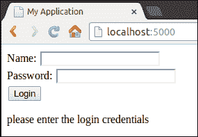
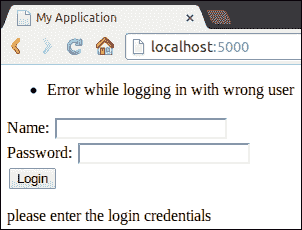
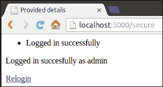
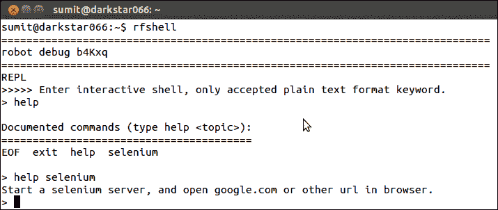
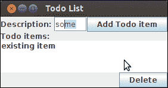
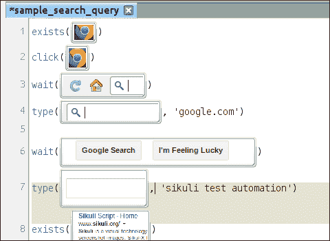
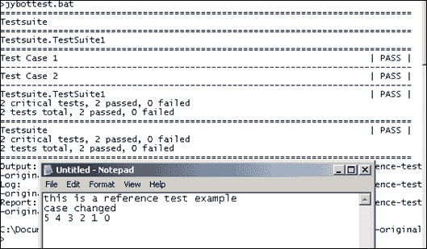

# 第四章：扩展框架

本章与所有前面的章节都略有不同，因为它侧重于提供 Robot Framework 与 Robot Framework 运行的其他软件之间交互的外部库。这对于与其他领先软件的集成是这个框架的基石。因此，我们需要了解现有的各种库，以及如果不存在任何库，如何为框架创建自定义库。

到目前为止，所有示例都只使用了内置库中的 `log` 函数，因为这是最容易演示框架运行时输出的方式。虽然这很容易理解，但它并没有解释在现实世界场景中验收测试应该如何工作。

在本章中，将介绍各种第三方库，这些库以多种方式扩展了 Robot Framework。简而言之，本章将涵盖以下内容：

+   通过 Selenium 进行 Web 应用程序测试

+   通过 REPL shell 调试基于 Selenium 的 Robot Framework 代码

+   通过 Swing 库测试基于 Java 的桌面应用程序

+   通过 Sikuli 介绍基于图像的自动化

+   为 Sikuli 创建自定义 Robot Framework 库

+   其他辅助编写验收测试的库概述

为了演示与第三方库的集成，我们最终将使用 Sikuli 工具来捕获和回放鼠标和键盘操作，并使用基于图像的计算机视觉来创建一个完整的验收测试解决方案。

# 测试 Web 应用程序

现在，大多数常用的软件都以网络形式存在，因为网络已成为与全球大量用户互动的通用媒介。创建基于网络的解决方案不仅越来越容易（随着新技术的发展，旧技术逐渐成熟、优化和过时），而且网络应用程序客户端的连通性、易用性和复杂性也在增加。因此，今天与世界互动的网络应用程序在开发和最终用户互动之间几乎没有可忽略的领先时间。因此，验收测试变得至关重要，因为软件的变化必须迅速得到验证，以确保在它们投入生产之前基本正确性和基本功能的存在。

## Selenium

Selenium 是一个网页浏览器自动化工具，它提供了录制和回放功能。它可以用来创建简单的脚本，通过使用浏览器中的各种对象来自动化浏览器和网页上的操作。作为领先的网页浏览自动化工具，它有许多资源可用。作为浏览器运行器，各种浏览器都有 Selenium 作为插件/扩展，并且可以在浏览器内部安装。然而，在运行自定义示例时，需要一个基于 Selenium 的服务器，它存在于一个嵌入的 JAR 文件中，可以直接调用。最初，它附带了一个远程控制器，需要一个 Selenium 远程控制服务器来管理来自浏览器的浏览器请求。然而，由于简化开发需求的普遍请求，Selenium2 被创建出来，它使用 WebDriver 直接管理浏览器并执行操作，如文件上传和弹出窗口管理，直接从浏览器执行。通过使用 WebDriver，Selenium 测试可以变得更加灵活，并且可以在 Selenium 之前无法使用的浏览器中运行。

## Robot Framework Selenium 库

此库在 Robot Framework 和 Selenium WebDriver 引擎之间提供了一个桥梁。通过它，可以直接从 Robot Framework 测试文件中发出各种 Selenium 命令。也存在针对 Selenium1 和 Selenium2 的单独库，根据 Selenium 的版本，可以选择合适的库。不过，无需绝望，因为 Selenium2 库在很大程度上是基于 Selenium 库的内容构建的。需要注意的是，如果 Selenium 与一个单独的服务器（一个嵌入的 Jetty 服务器）一起运行，则需要远程控制驱动器，否则 WebDriver 可以轻松选择。

要安装此库，可以使用`pip`，并且根据设置，可能需要 sudo/admin 权限：

```py
pip install robotframework-selenium2library
```

详细文档位于[`rtomac.github.io/robotframework-selenium2library/doc/Selenium2Library.html`](http://rtomac.github.io/robotframework-selenium2library/doc/Selenium2Library.html)，在开发这些应用程序时非常有用。

# 运行基于 Web 的测试

在示例中，使用基于 Python 的微框架 Flask 创建了一个小型网站，这是一个用于创建动态网站的框架。要运行示例，需要在本地 Python 设置中安装 Flask，可以按照以下方式安装：

```py
pip install flask
```

安装 Flask 后，通过命令行切换到`flaskApp`目录，并通过运行其主控制器文件来运行演示网站：

```py
python hello.py
```

这将在`localhost:5000`上启动 Flask，并显示以下窗口：



当输入错误的用户名/密码时，同一页面上会显示错误信息。在这里，表单的内容不会被保留，只有错误信息的出现才表明之前尝试过错误的用户名/密码组合。

以下截图显示了尝试错误用户名/密码组合时的错误：



如果登录成功，应用程序将重定向到相应的页面，该页面还提供了一条确认文本，说明登录成功，并提供了一个 URL，以便在需要再次登录时使用，如下面的截图所示：



## 使用 Selenium2Library

要通过 Robot Framework 执行相同任务，可以使用之前讨论过的 `robotframework-selenium2 library` 编写以下测试：

```py
| Perform correct credentials | go to | ${LOGIN URL}
|  | Title Should Be | My Application
|  | Page Should Contain TextField | username
|  | Input Text | username | ${VALID USER} 
|  | Input Password | password | ${VALID PASSWD}
|  | Click Button | Login 
|  | Location Should be | ${SUCCESS URL}
```

此测试假设 Selenium 浏览器已经设置好。使用了一些变量，其名称非常明显。以下是测试代码的解释：

1.  在测试用例开始时，转到指定的 URL。

1.  断言页面标题为 `My Application.`。

1.  断言页面包含所需的元素。

1.  在**名称**文本框中输入有效的用户名。

1.  在**密码**文本框中输入有效的密码。

1.  指示 Selenium 点击 **提交** 按钮，浏览器随后发出表单操作。

1.  因此，浏览器被重定向到另一个页面，检查该页面的 URL。

要查看和运行此完整测试，建议查看测试代码以及查看 Selenium 库。同样，您也可以使用 `page should contain` 关键字来测试各个页面中的特定文本内容。

## 通过 REPL shell 进行调试

如果你刚开始使用 Selenium 库，你会在设置整个 Selenium 环境时遇到问题。幸运的是，有一个工具可以帮助你一次运行一个测试操作。这个工具被称为 debug-library，它是一个 REPL shell。**REPL**（**读取-评估-打印循环**）就像任何其他控制台一样，只接受一行输入，并在要求输入下一行之前显示其输出。这与其他语言的 shell 非常相似。它的源代码位于：

[`github.com/xyb/robotframework-debuglibrary`](https://github.com/xyb/robotframework-debuglibrary)

要在运行 Python 且具有其包管理器的机器上安装此工具，请使用以下命令：

```py
pip install robotframework-debuglibrary
```

或者：

```py
easy_install robotframework-debuglibrary
```

安装此工具后，将可用一个命令 `rfshell`。您可以使用它执行基本操作和 Selenium 特定任务。以下截图显示了示例：



一旦在 shell 中输入 `exit`，它就会退出，并在用户的 `home` 文件夹中生成一个报告 HTML 文件。

### 注意

注意，此操作不会在任何地方生成日志或 XML 文件。

# 测试桌面应用程序

接受测试也可以在基于桌面的应用程序中实现，这使得 Robot Framework 测试不仅适用于解决某些特定问题，而且更加适用。

## 通过对象进行测试 – Java Swing

Swing 库是一个功能齐全的库，可用于测试基于 Java Swing 的应用程序。由于它运行在 Java 平台上，因此需要 Jython 运行时。要对 Swing 应用程序进行验收测试，`classpath`中需要两个东西：

+   Swing 库 JAR

+   实际捆绑为 JAR 的 Swing 应用程序

在拥有必要的文件后，可以使用测试。可以在 Jython 命令之前设置 classpath，或者像以下示例那样将其作为命令的前缀：

```py
CLASSPATH=swinglibrary-1.6.0.jar:myApp.jar jybot testsuites
```

在这里，`swinglibrary`的版本是 1.6.0，而系统测试捆绑为`myApp.jar`，Robot Framework 文件位于`testsuites`文件夹中。然后，应用程序对 Robot Framework 测试文件可见，可以通过其完全打包的 Java Swing 名称访问。测试脚本的设置表需要加载`swinglibrary`，以便提供所有 Swing 库特定的关键字。

## 一个 Swing 测试

给定以下应用程序，测试将涵盖向给定的**待办事项列表**添加和删除项目：



仅通过查看此 Swing 应用程序，无法区分所讨论的是哪个文本字段、表格或任何其他 UI 元素，因此在这种情况下黑盒测试不会成功，我们需要一些内部信息，例如各种组件名称来与之交互。这可能会让人联想到 Selenium，因为这两个库都提供基于对象的测试，测试本身需要了解被测系统的内部结构。

下面的测试是覆盖此 UI 提供的各种用例所需的：

```py
| Start test | Start Application | fully qualified name of theapplication
|  | Select Window | Todo List
|  | Button Should Be Enabled | Add Todo item
|  | Type Into Text Field | description | Get this swingapplication tested.
|  | Push Button | Add Todo item
|  | ${itemCount}= | Get List Item Count | todolist
|  | Should Be Equal As Integers | 1 | ${itemCount}
```

这可以简要解释如下：

+   使用 Java 应用程序的完全限定名称（即包和类名）通过`Start Application`关键字运行 Java 应用程序，这是从 JAR 文件运行应用程序所需的

+   选择正确的窗口，这也确保了应用程序具有所需的窗口

+   检查其他基本假设，例如各种元素的状态

+   通过直观命名的关键字执行各种 UI 操作

+   在输入文本并点击**添加待办事项**按钮后，`todolist`的大小应该增加

类似地，可以执行其他 UI 操作。像其他外部库一样，在编写测试时旁边有它的库文档是有帮助的。

# 通过图像进行测试

本节涵盖基于图像的测试，这与迄今为止所涵盖的内容不同。在基于图像的测试中，用户界面被视为黑盒，不暴露应用程序的对象内部结构。

## Sikuli

Sikuli 是一个领先的通过计算机视觉进行自动化的工具，即识别屏幕上的图像。作为人类，我们可以通过观察来区分一个对象的属性，但在计算机的情况下并不简单，因为计算机只能匹配二进制或文本信息。因此，需要计算机视觉或知道给定的图像是否出现在更大的屏幕上。简单来说，Sikuli 使用用户提供的截图图像来执行对各种项目的操作，并在 Sikuli IDE 中以可视化的方式显示生成的脚本。以下是一个进行搜索的脚本示例：



如图像所示，脚本执行以下操作：

+   检查屏幕上是否存在 Chrome 浏览器图标

+   点击 Chrome 浏览器以打开它

+   等待浏览器窗口打开并显示 URL

+   在 URL 栏中转到[google.com](http://google.com)，这将打开 Google 首页

+   等待 Google 搜索按钮出现

+   在适当的文本字段中执行所需的查询

+   验证获得的结果

+   Sikuli 页面应出现在结果的第一页

然而，在幕后，以下 Python 脚本在保存此 Sikuli 脚本的文件夹中生成：

```py
exists("1377428833316.png")
click("1377428844996.png")
wait("1377428859228.png")
type("1377428922965.png", 'google.com')
wait("1377428949234.png")
type("1377429289183.png", 'sikuli test automation')
exists("1377429031446.png")
```

除了这个 Python 脚本（或其 HTML 等价物）之外，测试中还引用了各种图像。重要的是，在运行时，Sikuli 在其核心运行计算机视觉软件，以确定屏幕上是否存在与图像匹配的内容，并据此采取行动。完全没有必要了解正在测试的软件的内部结构。虽然一开始这可能看起来有些反直觉，但通过基于图像的测试来弥补对组件和对象的控制不足，从而将测试从测试系统中解放出来，因此测试可以在各种软件平台上运行，从不同的桌面应用程序、移动模拟器、主机终端、基于 Web 的应用程序和远程应用程序，只需将屏幕上显示的内容作为其输入和决策能力的依据，就像进行手动自动化验收测试的人类一样。

## 创建自定义 Sikuli 库

一开始，Robot Framework 看起来像是一个复杂的框架，而创建外部用户库似乎是一项繁琐的任务。然而，有时需求会要求为这种需求提供验收测试解决方案。幸运的是，像 Sikuli 这样的开源解决方案有一个可扩展的应用平台，并且文档也非常完善。Sikuli 与 Robot Framework 的定制集成是由*Mykhailo Moroz*创建并展示的([`blog.mykhailo.com/2011/02/how-to-sikuli-and-robot-framework.html`](http://blog.mykhailo.com/2011/02/how-to-sikuli-and-robot-framework.html))。该方法中使用的策略将在下一节中讨论。

为了将 Sikuli 作为测试验证引擎使用，必须首先公开其 API ([`doc.sikuli.org/javadoc`](http://doc.sikuli.org/javadoc))，这可以通过使用 Sikuli 内部使用的 Python 类的巧妙技巧来完成。由于这将工作在 Jython 环境中，因此需要在类路径中包含 `sikuli-script.jar` 并创建一个围绕 Sikuli API 的包装器，以便使用各种方法。Sikuli API 包含一个具有各种方法的 `Screen` 类。

要使这些方法在 `Screen` 类中全局可用，这些方法被手动推入内部全局目录，并由自定义的单独方法覆盖：

```py
def sikuli_method(name, *args, **kwargs):

    return sys.modules['sikuli.Sikuli'].__dict__name
```

此查找随后用于将自定义方法中的值传递到 Sikuli 引擎内部存在的本地代码。例如，`click` 方法可以如下实现：

```py
def click(target, modifiers=0):

    try:

        return sikuli_method('click', target, modifiers)

    except FindFailed, e:

        raise e
```

此包装器允许创建简单的 Python 脚本，这些脚本可以在 Jython 环境中运行，而无需 Sikuli X 测试运行器。由于类路径中已经存在 `sikuli-script.jar`，因此创建的测试可以在没有 Sikuli IDE 或在无头模式下运行。

由于这些脚本可以在 Jython 环境中独立运行，因此可以通过 Jybot 运行它们，Jybot 可以使用各种 Robot Framework 脚本调用这些脚本函数。这创建了一个解决方案，通过收集不同的小型脚本执行大量任务，以这种方式驱动多个 Sikuli 脚本作为测试用例：

要运行此示例，我们需要以下先决条件：

+   Robot Framework 正确安装，并带有 Jython 运行时

+   Sikuli 已正确安装，并且 `sikuli-home` 环境变量指向其根文件夹

批处理文件中的以下命令通过设置所有涉及软件所需的环境来运行应用程序：

```py
set sikuli_jar=%sikuli_home%sikuli-script.jar
set CLASSPATH=%sikuli_jar%
set JYTHONPATH=%sikuli_jar%/Lib
call jybot --pythonpath=TestLib ^
      --outputdir=results ^
      --loglevel=TRACE ^
      --output "%~d0%~p0results\output.xml" ^
      --log "%~d0%~p0results\log.html" ^
      --report "%~d0%~p0results\report.html" ^
      testsuite
```

由于我们使用不同的 Sikuli 脚本作为不同的测试用例，因此我们将这些脚本作为自定义测试导入我们的 Robot Framework 测试文件中，这些文件保存在 `testlib` 文件夹中，以使示例中的事情保持简单：

```py
***Settings***
Library  TestAction1.XTest  WITH NAME  TestAction1
Library  2ndcase1staction.XTest  WITH NAME  2ndcase1staction
Library  anotheraction.XTest  WITH NAME  anotheraction
***Test Cases***
Test Case 1
  TestAction1.Execute
Test Case 2
  2ndcase1staction.Execute
  anotheraction.Execute
```

实际上，`library` 文件是一个用 Python 编写的自定义 Sikuli 脚本，它调用 Sikuli API 以作为无头 Sikuli 实例运行：

```py
from __future__ import with_statement
from sikuliwrapper import *
addImagePath(common.cfgImageLibrary) #uses the values supplied by the robot framework.
Settings.MinSimilarity = 0.9  # Image present on the screen should match 90% or more than the provided image.

class XTest(BaseLogger):
    ROBOT_LIBRARY_SCOPE = 'TEST SUITE'

    def __init__(self):
        None
    def Execute(self, *args):
        type("this is a reference test example")
        wait(0.485)
        ...
```

要使这些测试基于图像，你可以调用 `click`、`validate`、`type` 等函数，并将用于输入参数的样本图像文件的路径作为其输入参数：

除了 `test` 和 `library` 文件外，还有一个 `sikuliwrapper.py` 文件，它将这些 Sikuli 方法提供到库文件调用中：

```py
from logger import *
from sikuli.Sikuli import Region as SikuliRegion
from sikuli.Sikuli import Screen as SikuliScreen
log = RobotLogger()
class VerifyException(RuntimeError):
    ROBOT_CONTINUE_ON_FAILURE = True
# function for calling native sikuli methods
def sikuli_method(name, *args, **kwargs):
    return sys.modules['sikuli.Sikuli'].__dict__name

# overwritten Screen.exists method
def exists(target, timeout=0):
    addFoundImage(getFilename(target))
    return sikuli_method('exists', target, float(timeout))
…
```

类似地，其他 Sikuli API 调用也可以被包装起来，为库文件提供一个易于使用的接口，反过来，库文件又被 Robot Framework 测试调用：

然而，在基于图像的测试中，失败应该是有描述性的。为此，可以在失败或成功发生的实例时截取屏幕截图，这需要你创建一个自定义记录器：

```py
import logging
import datetime
import shutil
from sikuli.Sikuli import *

# Properly set the logging mechanism
logging.addLevelName(logging.WARNING, 'WARN')
HTML = logging.INFO + 5
logging.addLevelName(HTML, 'HTML')

class RobotLogger(logging.Logger):
    def __init__(self, name='robot', level=logging.INFO):
        level = logging.DEBUG
        logging.Logger.__init__(self, name, level)
        self.addHandler(RobotHandler())

    def _get_unique_name(self, prefix="", suffix=""):
        now = datetime.datetime.now()
        return prefix + now.strftime('%Y-%m-%d_%H-%M-%S') + suffix

    def screenshot(self, msg='', folder='results/screenshots/', region=(0,0,1440,900)):
        name = self._get_unique_name(suffix=".png")
        img_src = capture(*region)    # Actual call to capture the entire screen
        shutil.copy(img_src, folder + name)
        self.html_img(msg, folder + name)

    def passed(self, msg, *args, **kwargs):
        self.info('PASS: ' + msg, *args, **kwargs)

    def failed(self, msg, *args, **kwargs):
        if self.isEnabledFor(logging.DEBUG):
            if len(getLastFoundImages()) != 0:
                self.html_img("Source Image",  'images/' + getLastFoundImage())
            self.screenshot()
        raise common.VerificationFailed(msg)

    def html(self, msg, *args, **kwargs):
        self.log(HTML, msg, *args, **kwargs)

    def html_img(self, msg, image):
        self.html('%s ' % (msg, image))
…
```

这些是运行和记录基于 Sikuli 的应用程序所需的必要文件，可以轻松地使用 Robot Framework。输出可以在以下示例中查看，通过打开记事本并运行应用程序：



# 其他值得注意的库

存在着许多其他库，它们扩展了 Robot Framework 在通常不被视为验收测试候选区域的功能。如果以正确的方式进行，这些库将受益于测试自动化。以下是一些这些库的例子。

## 测试网络协议

Rambock 是一个测试库，它提供了一种简单的方式来测试各种网络数据包、协议和消息模板：

[Robotframework Rammbock 库](https://github.com/robotframework/Rammbock)

它允许你指定自定义协议、其客户端和服务器；消息，以及传统和自定义协议都可以进行测试。

## 测试网络服务

Suds 是一个轻量级但动态的 SOAP Python 客户端，用于消费网络服务：

[Robotframework Suds 库](https://github.com/ombre42/robotframework-sudslibrary)

## 测试数据库

可以通过 `robotframework-databaselibrary` 测试数据库的持久性和内容。在这里，数据库被查询以找出其状态并执行一些操作，例如运行 SQL 脚本：

[Robotframework 数据库库](http://franz-see.github.io/Robotframework-Database-Library)

存在着一个类似的库，用于通过 JDBC 进行交互，这对于不支持测试的数据库来说特别有用：

[Robotframework 数据库库](https://github.com/ThomasJaspers/robotframework-dblibrary)

# 摘要

在本章中，讨论了许多外部工具和库，它们扩展了 Robot Framework 的功能。首先，通过 Selenium 和其方便的 REPL shell 展示了网络应用程序测试，该 shell 用于调试应用程序。接下来，通过使用基于对象的测试展示了基于 Java 的桌面应用程序测试。解释了 Sikuli 应用程序和基于图像的测试，以及一个深入案例研究，该研究进一步探讨了其 API 的可扩展性，以创建一个对 Robot Framework 友好的解决方案。最后，列出了一些其他流行的库。

在下一章中，我们将探讨测试报告操作，以了解生成的不同输出以及如何使用生成的报告执行各种所需的操作，并自定义测试输出。
