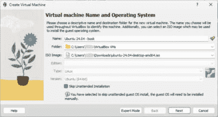
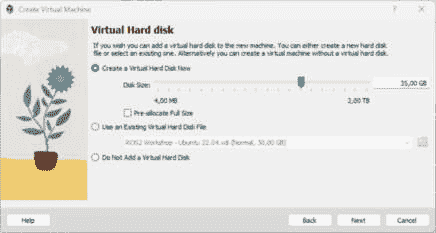
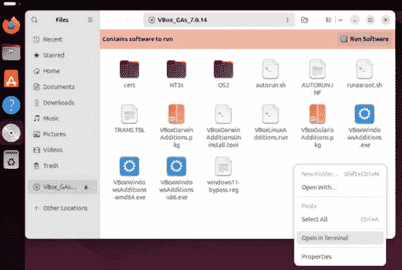
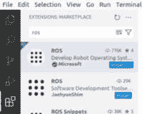
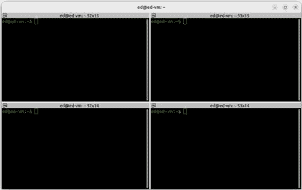

# 第二章：安装和设置 ROS 2

在使用 ROS 2 之前，我们需要安装它并设置它。做这件事并不像只是下载和安装一个基本程序那样简单。有几个 ROS 2 版本（称为**发行版**），我们需要选择哪一个是最合适的。我们还需要选择一个 Ubuntu 版本，因为 ROS 和 Ubuntu 发行版是紧密相连的。

一旦你知道你需要哪个 ROS/Ubuntu 组合，你必须安装相应的 Ubuntu **操作系统**（**OS**）。尽管熟悉 Linux 是这本书的先决条件，但我仍会回顾如何在**虚拟机**（**VM**）上安装 Ubuntu，以防万一，这样你就不会迷失方向，可以继续阅读这本书。

然后，我们将在 Ubuntu 上安装 ROS 2，在我们的环境中设置它，并安装额外的工具，这将使你拥有更好的开发体验。

到本章结束时，你将准备好电脑上的所有东西，以便你可以使用 ROS 2 并编写自定义程序。

即使所有安装步骤听起来有点令人畏惧，不要担心——这并不那么困难，而且每次新的安装都会变得更容易。为了给你一个概念，在有稳定的互联网连接的情况下，安装一个全新的 Ubuntu 版本大约需要 1 个小时，安装 ROS 则需要 20 分钟（其中大部分时间都花在等待安装完成上）。

在本章中，我们将涵盖以下主题：

+   选择哪个 ROS 2 发行版

+   安装操作系统（Ubuntu）

+   安装 ROS 2

+   设置 ROS 2 的开发环境

+   ROS 2 开发额外的工具

# 选择哪个 ROS 2 发行版

在安装 ROS 2 之前，了解你需要使用哪个发行版是很重要的。为了做出这个决定，你首先需要更多地了解 ROS 2 发行版是什么，以及每个发行版的具体特点。

## 什么是 ROS 2 发行版？

ROS 2 是一个持续发展的项目，不断接收新的功能或对现有功能的改进。

发行版简单地说是在某个给定点对开发进行**冻结**以创建一个稳定的发布版本。有了这个，你可以确信一个给定发行版的核心包不会有任何破坏性的变化。没有发行版，就不可能有一个稳定的系统，你将需要不断更新你的代码。

每年，一个新的 ROS 2 发行版都会在 5 月 23 日发布。这一天对应于*世界乌龟日*。正如你将能观察到的，所有 ROS 发行版都有一个乌龟作为标志；有一个名为**TurtleBot**的移动机器人平台，甚至还有一个名为**Turtlesim**的 2D 教育工具。这是基于 1967 年一个名为 *Logo* 的教育编程语言的参考，它包括在屏幕上移动某种*乌龟机器人*的功能。所以，如果你对为什么到处都是乌龟感到困惑，现在你知道了——这就是这个乌龟括号的结尾。

你可以在 ROS 2 文档发布页面上看到所有 ROS 2 发行版：[`docs.ros.org/en/rolling/Releases.html`](https://docs.ros.org/en/rolling/Releases.html)。

你将在每年的 5 月看到一个新的发行版。至于顺序，没有数字；相反，名称是按字母顺序排列的。第一个官方发布版被命名为 *Ardent Apalone*，然后是 *Bouncy Bolson*，以此类推。2024 年 5 月，发布了 **ROS Jazzy Jalisco**。在此之后，你可以期待在 2025 年有 *ROS K*，在 2026 年有 *ROS L*，依此类推。新发布版的名称通常提前一年宣布。

注意

ROS 发行版包含两个名称，但通常只提到第一个。因此，我们不会谈论 ROS Jazzy Jalisco，而是会谈论 **ROS Jazzy**。我们也可以写成 *ROS 2 Jazzy* 来指明这个发行版是为 ROS 2 而不是 ROS 1，但这是不必要的，因为 Jazzy 只是一个仅用于 ROS 2 的名称，因此 ROS Jazzy。

在所有显示的发行版之上，还有一个与之并行存在的发行版：**ROS Rolling**。这个发行版有些特别，是所有新开发都进行的发行版。用 Git 和版本控制系统来类比，它就像有一个 *开发* 分支，并使用这个分支每年发布一次稳定版本。因此，ROS Rolling 不是一个稳定发行版，我不建议用它来学习或发布产品。这是一个你可以在新功能正式发布到下一个稳定发行版之前测试这些新功能的发行版——或者如果你想为 ROS 代码做出贡献。然而，如果你正在阅读这本书，你还没有达到那个阶段。

现在你已经知道了 ROS 2 的发行版有哪些，以及如何找到它们，让我们开始看看它们之间的区别。这将使我们能够选择正确的版本。

## LTS 和非 LTS 发行版

如果你仔细观察，你会发现有些发行版支持 5 年，而有些发行版支持 1.5 年（这仅适用于 2022 年之后）。你可以通过比较发布日期和 **生命终结**（**EOL**）日期来看到这一点。目前支持的发行版在屏幕上也有绿色背景，所以你可以很容易地找到它们。

当一个发行版达到其 EOL 日期时，这仅仅意味着它将不再接收官方支持和软件包更新。这并不意味着你不能使用它（实际上，许多公司仍在使用 5 年或更早的遗留版本），但你不会得到任何更新。

第一个官方 ROS 2 发行版是 *ROS Ardent*，于 2017 年 12 月发布。在那之后，前几个发行版还不完全，开发团队更愿意发布较短的发行版，以便更快地推进开发。

*ROS Humble* 是第一个支持 5 年的 **长期支持**（**LTS**）发行版（2022-2027）。

*ROS Jazzy*也是一个 LTS 版本，从 2024 年到 2029 年有官方支持。从这一点可以预期，每两年（偶数年：2024 年、2026 年、2028 年等等），5 月份将发布一个新的 LTS 发行版，并支持 5 年。

一些 LTS 发行版可以共存。例如，在 2026 年，随着*ROS L*发行版的发布，你将能够使用 ROS Humble 和 ROS Jazzy。

然后，你有非 LTS 发行版。这些发行版在奇数年发布（2023 年、2025 年、2027 年等等），并且只支持 1.5 年。这些发行版发布是为了让你能够访问某种程度的稳定版本中的新开发，而无需等待两年。然而，由于非 LTS 发行版的寿命较短，并且它们可能不太稳定（以及支持度较低），如果你的目标是学习、教学或使用 ROS 进行商业应用，最好不要使用它们。

通过这一点，你可以看到我们可以排除一半的发行版，现在只需专注于当前受支持的 LTS 发行版。让我们完成这一部分，并选择我们将为这本书使用的发行版。

## 如何选择 ROS 发行版

我推荐使用最新的可用 LTS 发行版。然而，我并不一定会在它发布后立即使用 LTS 发行版，因为它可能仍然包含一些错误和问题。此外，你可能需要的某些插件和其他社区包可能还没有被移植。一般来说，如果你想与一个稳定的系统一起工作，有时最好不要过于接近新技术，而应该等待一段时间。

例如，ROS Humble 于 2022 年 5 月发布。就在它可用之后，我对其进行了测试，但为了在生产环境中使用它，我必须等到 9 月甚至 11 月，以确保一切正常工作。

因此，对于这本书，我们将使用 ROS Jazzy，该版本于 2024 年 5 月发布。

注意

你可以用一个发行版学习，然后用另一个发行版开始项目。如果你有一个需要使用不同 ROS 2 发行版的项目或工作，你仍然可以用 ROS Jazzy 开始学习。发行版之间的差距非常小，尤其是对于核心功能。这本书的 99%可以应用于 2022 年之后发布的任何 ROS 2 LTS 发行版。

# 安装操作系统（Ubuntu）

ROS 2 在三个操作系统上运行：Ubuntu、Windows 和 macOS。尽管 Ubuntu 和 Windows 获得一级支持，但 macOS 只有三级支持，意味着“尽力而为”，而不是“完全测试”。你可以在描述 ROS 2 发布时间表和目标平台的 REP 2000 上了解更多关于一级、二级和三级支持的含义：[`www.ros.org/reps/rep-2000.html`](https://www.ros.org/reps/rep-2000.html)。

这意味着使用 macOS 进行 ROS 2 不一定是最适合学习的选择（如果你是苹果用户）。我们只剩下 Windows 或 Ubuntu。

从教学经验来看，我发现即使 ROS 在 Windows 上可以很好地工作，但正确安装和使用它并不容易。可能会出现很多错误，尤其是在 2D 和 3D 工具方面。当您学习 ROS 时，您希望有一个顺畅的体验，并且希望花时间学习功能，而不是修复配置。

因此，最佳的整体选择是使用 Ubuntu。如果您没有 Ubuntu 并且正在使用 Windows/macOS，您可以在计算机上安装 Ubuntu 作为双启动，或者使用虚拟机（还有其他一些选项，但这里不会涉及那些选项）。

既然我们已经选择了 ROS Jazzy，并且我们想在 Ubuntu 上运行它，那么问题就是：我们应该在哪个 Ubuntu 发行版上安装它？

## ROS 2 与 Ubuntu 之间的关系

如果您访问 Jazzy 发布页面（[`docs.ros.org/en/rolling/Releases/Release-Jazzy-Jalisco.html`](https://docs.ros.org/en/rolling/Releases/Release-Jazzy-Jalisco.html)），您会看到 ROS Jazzy 支持 **Ubuntu 24.04**（而不是任何其他之前的或未来的 Ubuntu 发行版）。

ROS 与 Ubuntu 发行版之间存在密切关系。这种关系相当简单：对于每个新的 Ubuntu LTS 发行版（每两年在偶数年份），都有一个新的 ROS 2 LTS 发行版：

+   **Ubuntu 22.04**: ROS Humble

+   **Ubuntu 24.04**: ROS Jazzy

+   **Ubuntu 26.04**: ROS L

使用正确的组合非常重要。因此，在安装 ROS Jazzy 之前，您必须做的第一件事是确保您已经在计算机上安装了 Ubuntu 24.04。如果您恰好有旧版本，我强烈建议您升级或简单地从头开始安装 Ubuntu 24.04。

注意事项

如果您必须使用另一个 Ubuntu 发行版，例如，您正在使用学校/工作场所的计算机，并且无法更改操作系统，那么请使用相应的 ROS 发行版。然而，我建议**不要**使用比 ROS Humble 更旧的版本，并避免使用非 LTS 发行版。您还可以在虚拟机（稍后将有描述）上安装 Ubuntu 24.04。

您可能已经在生活中某个时刻安装过 Linux 操作系统，但根据经验，我知道一些阅读此内容的人可能会在安装过程中感到困惑。因此，我将提供额外的安装说明——双启动的概述以及虚拟机的详细说明。如果您已经安装了 Ubuntu，可以自由跳过这部分内容，直接进入 ROS 2 安装部分。

## 使用双启动原生安装 Ubuntu 24.04

最佳选择是在您的计算机上原生安装 Ubuntu。这将使您能够跟随本书学习，并在没有任何问题的前提下继续前进。在此，我不会提供如何做到这一点的完整教程；您可以在互联网上轻松找到大量免费教程。

这里是您必须遵循的几个高级重要步骤：

1.  在您的磁盘上腾出一些空间，以便您能够创建一个新的分区。我建议至少 70 GB，如果可能的话，更多。

1.  从官方 Ubuntu 网站下载 Ubuntu `.iso` 文件（Ubuntu 24.04 LTS）。

1.  使用 Balena Etcher 等工具将此镜像烧录到 SD 卡或 USB 闪存驱动器上。

1.  重新启动您的计算机，并选择从外部设备启动。

1.  按照安装说明进行操作。**重要**：当被问及您想要如何安装时，选择**与 Windows 一起安装**，例如——不要删除您的所有磁盘。

1.  完成安装。现在，当您启动计算机时，您应该会看到一个菜单，您可以选择是否要启动 Ubuntu 或 Windows。

这些是您需要遵循的主要步骤；您可以在互联网上找到您需要的所有信息。

## 在虚拟机上安装 Ubuntu 24.04

如果您不能作为双启动安装 Ubuntu（由于技术限制、计算机上的管理员权限不足或其他原因），或者如果您想快速开始而不需要太多努力，只是为了学习 ROS，那么您可能希望使用虚拟机。

虚拟机（VM）的设置非常简单，对于教学和学习非常有用。例如，当我在一个初学者的研讨会中教授 ROS 离线时，我经常提供一个已经安装好所有内容的虚拟机。这样，参与者就可以更快地开始使用 ROS。后来，当他们有更多知识时，他们可以自己花时间设置一个合适的操作系统。

注意

本书第*3*部分（关于 3D 模拟和 Gazebo）可能不适合在虚拟机上运行。您仍然可以使用虚拟机完成本书的大部分内容，并在最后设置双启动。

现在，我将向您展示如何在虚拟机上安装 Ubuntu 24.04，这样即使您没有创建和运行虚拟机的先验知识，也可以完成它。

### 第 1 步 – 下载 Ubuntu .iso 文件

下载 Ubuntu 24.04 **.iso**文件 [`releases.ubuntu.com/noble/`](https://releases.ubuntu.com/noble/)。请注意，就像 ROS 一样，Ubuntu 发行版也有一个名称。对于 Ubuntu 24.04，名称是*Ubuntu Noble Numbat*。我们通常只使用第一个名称，所以在这种情况下**Ubuntu Noble**。

点击**64 位 PC (AMD64) 桌面镜像**。文件大小应为 5 到 6GB，因此在下载之前请确保您有一个良好的互联网连接。

### 第 2 步 – 安装 VirtualBox

您可以在下载 Ubuntu **.iso**文件的同时开始*第 2 步*。

两个流行的虚拟机管理器有一个免费版本：VMware Workstation 和 VirtualBox。两者都可以使用，但在这里，我将专注于 VirtualBox，因为它使用起来稍微简单一些。

访问官方 VirtualBox 网站的下载页面：[`www.virtualbox.org/wiki/Downloads`](https://www.virtualbox.org/wiki/Downloads)。在**VirtualBox 平台包**下，选择您正在运行的当前操作系统。例如，如果您想在 Windows 上安装 VirtualBox，请选择**Windows 主机**。

下载安装程序，然后像安装其他软件一样安装 VirtualBox。

### 第 3 步 – 创建新的虚拟机

安装好 VirtualBox 并下载了 Ubuntu **.iso**文件后，打开 VirtualBox 软件（VirtualBox 管理器），然后点击**新建**。这将打开一个弹出窗口，您可以在其中开始配置新的虚拟机：



图 2.1 – 开始虚拟机设置过程

这里，我们有以下值：

+   `Ubuntu 24.04 -` `book`。

+   在你的用户目录中的`VirtualBox VMs`文件夹，那里将安装所有虚拟机。你可以保留这个文件夹或者如果你想的话可以更改它。

+   你刚刚下载的`.iso`文件。

+   `Linux`。

+   `Ubuntu (64-bit)`。

+   **跳过无人值守安装**：确保勾选此框。如果不勾选，可能会在以后造成问题。

点击**下一步**。在这里，你需要选择为机器分配多少 CPU 和 RAM：


图 2.2 – 为虚拟机分配硬件资源

这将取决于你的电脑配置。

这里是我对 RAM 分配（VirtualBox 上的**基本内存**）的建议：

+   如果你电脑上有 16 GB 或更多，分配 6 GB（就像我在**图 2.2**中做的那样）或者更多一些；这应该足够了。

+   如果你拥有 8 GB 的 RAM，分配 4 GB。

+   对于少于 8 GB 的情况，调整 RAM 值（你现在可以设置一个值，稍后在设置中修改它），以便你可以启动虚拟机，打开**VS Code**和带有几个标签的 Firefox，并且你的机器不会慢太多。如果事情变得太慢，考虑使用更强大的机器来学习 ROS。

对于 CPU 分配，分配你 CPU 的一半。所以，如果你的电脑有 8 个 CPU，将值设置为 4。在我的设置中，我有 4 个 CPU 和 8 个逻辑处理器，所以我选择了 4 个 CPU。尽量不要低于 2，因为只有一个 CPU 将会非常慢。如果有疑问，现在尝试一个设置；你可以稍后更改它。

总体来说，保持在绿色区域更好。如果你必须推到橙色区域，那么确保当你运行虚拟机时，你的电脑上不要运行其他任何东西（或者可能只是打开一个标签的网页浏览器或用于这本书的 PDF 阅读器）。

点击**下一步**。现在要做的最后一件事是为虚拟机配置将要创建的虚拟硬盘：



图 2.3 – 为虚拟机创建虚拟磁盘

这里是你必须在此屏幕上选择的设置：

1.  你可以保留默认选项（**现在创建虚拟硬盘**）。默认大小是 25 GB。为了学习 ROS 2，我建议至少使用 30 到 40 GB。无论如何，虚拟机的大小将开始较低，随着你安装更多东西而扩展，所以你可以设置一个更高的最大值而不阻塞资源。

1.  保持**预分配完整大小**框未勾选。

点击**下一步**。现在，你将看到之前步骤中选择的全部选项的摘要。然后，点击**完成**。你将在 VirtualBox 管理器左侧看到新创建的虚拟机。

在你开始虚拟机之前，我们还需要配置一些其他事情。打开虚拟机的设置（无论是选择它并点击**设置**按钮，或者右键点击虚拟机并选择**设置**）。

修改以下三个设置：

+   **系统** | **加速**：取消选择**启用嵌套分页**复选框

+   **显示**：取消选择**启用 3D 加速**复选框（这个可能已经取消选中）

+   **显示**：如果可能，将**视频内存**增加到 128 MB

使用这些设置，你可能会避免虚拟机中图形界面的意外行为和问题。

注意

每台计算机都不同，具有不同的硬件配置。对我以及很多人有效的东西可能对你不起作用。如果你在运行虚拟机时遇到奇怪的行为，也许可以尝试通过修改前面三个设置来再次尝试。一次只测试一个更改。

### 步骤 4 – 启动虚拟机和完成安装

现在虚拟机已正确配置，我们需要启动它来安装 Ubuntu，使用我们已下载并添加到设置的 Ubuntu **.iso** 文件。

要启动虚拟机，在**VirtualBox 管理器**中双击它，或者选择它并点击**启动**按钮。

你将得到一个引导菜单。第一个选择是**尝试或安装 Ubuntu**，它应该已经选中。按*Enter*。

等待几秒钟；Ubuntu 将启动安装屏幕。通过不同的窗口进行配置：

1.  选择你的语言。我建议你保持**英语**，这样你就有和我相同的配置。

1.  跳过**辅助功能**菜单，除非你需要设置更大的字体大小，例如。

1.  选择你的键盘布局。

1.  连接到互联网。为此，请选择**使用有线连接**。

1.  在这一点上，你可能会看到一个屏幕要求你更新安装程序。在这种情况下，点击**现在更新**。完成后，点击**关闭安装程序**。在虚拟机桌面上查找**安装 Ubuntu 24.04 LTS**并双击它。这将从*步骤 1*重新开始安装；重复*步骤 1*到*步骤 4*。

1.  当被问及你希望如何安装 Ubuntu 时，请选择**交互式安装**。

1.  对于要安装的 Ubuntu 应用程序，请选择**默认选择**。这将减少虚拟机使用的空间，你仍然会得到一个网络浏览器，以及所有核心基础——安装 ROS 2 我们不需要更多。

1.  当被问及是否要安装推荐的第三方软件时，请选择**安装图形和 Wi-Fi 硬件第三方软件**。

1.  对于磁盘设置，选择**擦除磁盘并安装 Ubuntu**。这里没有风险，因为我们正在*擦除*我们刚刚创建的空虚拟磁盘（如果你将 Ubuntu 作为双启动安装，你必须选择另一个选项）。

1.  选择用户名、计算机名和密码。这里保持简单。例如，我使用 `ed` 作为用户名，`ed-vm` 作为计算机的名称。同时，确保密码输入正确，尤其是如果你之前更改了键盘布局。

1.  选择你的时区。

1.  在摘要菜单中，点击**安装**并等待几分钟。

1.  安装完成后，一个弹出窗口将要求你重启。点击**现在重启**。

1.  你将看到一个消息提示**请移除安装介质，然后按回车键**。这里不需要做任何事情——只需按*Enter*键即可。

1.  启动后，你将看到一个欢迎屏幕弹出。你可以跳过所有步骤，点击**完成**来退出弹出窗口。

这样，Ubuntu 就已经安装完成了。

为了彻底完成，打开一个终端窗口并升级现有包（并不是因为你刚刚安装了 Ubuntu，所以所有包都是最新的）：

```py
$ sudo apt update
$ sudo apt upgrade
```

安装到此结束。然而，还有一件特定于 VirtualBox 的事情我们必须做，以确保虚拟机窗口能够正确工作。

### 第 5 步 – 客户端添加 CD 镜像

到目前为止，如果你尝试调整运行虚拟机的窗口大小，你会看到桌面分辨率没有改变。此外，如果你尝试在主机和虚拟机之间复制/粘贴一些文本或代码，可能不会工作。

为了解决这个问题，我们需要安装所谓的**客户端添加 CD 镜像**。

首先，打开一个终端并运行以下命令（注意，复制/粘贴目前还不工作，所以你必须手动输入）。这将安装一些依赖项，所有这些依赖项都是下一步所需的：

```py
$ sudo apt install build-essential gcc make perl dkms
```

然后，在虚拟机窗口的顶部菜单中，点击**设备** | **插入客户端添加** **CD 镜像**。

你将在 Ubuntu 菜单（在左侧）中看到一个新 CD 镜像。点击它——这将打开一个文件管理器。在文件管理器中，右键点击空白区域并选择**在终端中打开**。以下图示将提供更多说明：



图 2.4 – 在终端中打开客户端添加 CD 镜像文件夹

然后，你将进入一个终端，在那里你可以找到一个名为**VBoxLinuxAdditions.run**的文件。你需要以管理员权限运行此文件：

```py
$ sudo ./VBoxLinuxAdditions.run
```

之后，你可能会看到一个弹出窗口要求你重启虚拟机。点击**立即重启**。如果你没有看到这个弹出窗口，只需在终端中运行**sudo reboot**即可。

当虚拟机再次启动时，当你改变窗口大小时，屏幕应该会自动调整大小。如果第一次没有成功，我发现再次运行命令（**sudo ./VBoxLinuxAdditions.run**）并重启可能会解决问题。

然后，你可以右键点击磁盘并选择**弹出**，这样就设置完成了。要启用主机和虚拟机之间的复制/粘贴功能，请转到顶部菜单并点击**设备** | **共享剪贴板** | **双向**。

现在，你的虚拟机已经完全安装和配置。如果你选择了这条路径，这将允许你至少完成这本书的**第一部分**和**第二部分**。对于**第三部分**，如前所述，你可能会遇到一些问题，尤其是在使用 Gazebo 时。当你到达这个阶段时，我建议你使用双启动方式本地安装 Ubuntu。

# 在 Ubuntu 上安装 ROS 2

现在你已经在你的计算机上安装了 Ubuntu 24.04（无论是作为双启动还是在一个虚拟机中），让我们安装 ROS 2。如前所述，我们将在这里安装 ROS Jazzy。如果你使用的是不同的 Ubuntu 发行版，请确保使用适当的 ROS 2 发行版。

安装 ROS 2 的最佳方式是遵循官方文档网站上的说明，对于二进制包安装：[`docs.ros.org/en/jazzy/Installation/Ubuntu-Install-Debians.html`](https://docs.ros.org/en/jazzy/Installation/Ubuntu-Install-Debians.html)。需要运行很多命令，但别担心——你只需要逐个复制粘贴即可。

注意

由于安装说明经常更新，本书中看到的以下命令可能略与官方文档中的不同。如果这样，请从官方说明中复制/粘贴。

现在，让我们开始安装 ROS 2。

## 设置区域设置

确保你有支持 UTF-8 的区域设置：

```py
$ locale
```

通过这种方式，你可以检查你是否有了 UTF-8。如果有疑问，只需逐个运行这些命令（我每次都这样做）：

```py
$ sudo apt update && sudo apt install locales
$ sudo locale-gen en_US en_US.UTF-8
$ sudo update-locale LC_ALL=en_US.UTF-8 LANG=en_US.UTF-8
$ export LANG=en_US.UTF-8
```

现在，再次检查；这次你会看到 UTF-8：

```py
$ locale
```

## 设置源

逐个运行这五个命令（注意最好直接从官方文档中复制/粘贴）：

```py
$ sudo apt install software-properties-common
$ sudo add-apt-repository universe
$ sudo apt update && sudo apt install curl -y
$ sudo curl -sSL https://raw.githubusercontent.com/ros/rosdistro\/master/ros.key -o /usr/share/keyrings/ros-archive-keyring.gpg
$ echo "deb [arch=$(dpkg --print-architecture) signed-by=/usr\/share/keyrings/ros-archive-keyring.gpg] http://packages.ros.org/ros2\/ubuntu $(. /etc/os-release && echo $UBUNTU_CODENAME) main" | sudo\tee /etc/apt/sources.list.d/ros2.list > /dev/null
```

这些命令的主要目的是将 ROS 包服务器添加到你的 **apt** 源中。运行以下命令：

```py
$ sudo apt update
```

你现在应该看到额外的行，类似于以下内容：

```py
Get:5 http://packages.ros.org/ros2/ubuntu noble InRelease [4,667 B]
Get:6 http://packages.ros.org/ros2/ubuntu noble/main amd64 Packages [922 kB]
```

这些新的源（**packages.ros.org**）将允许你在使用 **apt** 安装时获取 ROS 2 包。在这里，你还可以看到 **noble**，这意味着 ROS 2 包是为 Ubuntu Noble（24.04）准备的。由于你知道 Ubuntu 和 ROS 发行版是如何关联的，这也意味着 ROS Jazzy。

现在我们有了正确的源，我们最终可以安装 ROS 2。

## 安装 ROS 2 包

作为最佳实践，在安装任何 ROS 2 包之前，请升级所有现有包：

```py
$ sudo apt update
$ sudo apt upgrade
```

现在，你可以安装 ROS 2 包。如文档所示，你可以选择**桌面安装**或**ROS-Base 安装**。

ROS 2 不仅仅是一块软件或包。它是一系列包的集合：

+   **ROS-Base**：这个包包含使 ROS 2 正确工作的最基本包。

+   **ROS Desktop**：这个包包含 ROS-Base 中的所有包，以及许多额外的包，因此你可以访问更多工具、模拟、演示等。

由于你正在一台带有桌面的计算机上安装 ROS 2，并且你想要尽可能多地访问功能，请选择 ROS Desktop 安装。如果你要在受限环境中安装 ROS，例如在树莓派板上安装没有桌面的 Ubuntu Server，那么 ROS-Base 就是有意义的。

通过运行以下命令安装 ROS Desktop：

```py
$ sudo apt install ros-<distro>-desktop
```

将**<distro>**替换为发行版名称（使用小写）。所以，如果你想安装 ROS Jazzy，你将使用以下命令：

```py
$ sudo apt install ros-jazzy-desktop
```

如你所见，当你运行这个命令时，将安装几百个新的软件包。这可能会花费一些时间，这取决于你的互联网连接速度以及你的计算机（或虚拟机）的性能。

如果你看到错误信息指出*无法定位软件包 ros-jazzy-desktop*，例如，这可能意味着你正在尝试在错误的 Ubuntu 版本上安装 ROS 2 发行版。这是一个常见错误，所以请确保使用正确的 Ubuntu/ROS 2 配对（如本章之前所述）。

注意

从这里，很容易看出如何安装任何其他 ROS 2 软件包。你只需写下`ros`，然后是发行版名称，然后是软件包名称（使用破折号，而不是下划线）：`ros-<distro>-package-name`。例如，如果你想安装 ROS Jazzy 上的`abc_def`软件包，那么你需要运行`sudo apt install ros-jazzy-abc-def`。

安装完成后，你还可以安装 ROS 开发工具。在本书的剩余部分，我们需要这些工具来编译我们的代码和创建 ROS 程序。对于此命令，不需要指定 ROS 发行版；对所有它们都一样：

```py
$ sudo apt install ros-dev-tools
```

一旦完成这些，ROS 2 将被安装，你将拥有所有需要的 ROS 2 工具。

我还建议你经常更新你已安装的 ROS 2 软件包。为此，只需运行**sudo apt update**和**sudo apt upgrade**，就像更新任何其他软件包一样。

# 设置 ROS 2 的环境

在这一点上，打开一个终端并运行以下命令：

```py
$ ros2
ros2: command not found
```

你将得到一条错误消息，指出**ros2**命令找不到。正如我们稍后将要看到的，**ros2**是一个我们可以从终端运行和测试程序的命令行工具。如果这个命令不起作用，这意味着 ROS 2 没有正确设置。

即使 ROS 2 已安装，在每次新会话（或终端）中，你想要使用 ROS 2 时，你还需要做一件事：你需要在环境中**源码**它。

## 在环境中源码 ROS 2

要做到这一点，从 ROS 2 安装的位置源码此 bash 脚本：

```py
$ source /opt/ros/<distro>/setup.bash
```

将**<distro>**替换为你当前使用的发行版名称。对于 ROS Jazzy，运行以下命令：

```py
$ source /opt/ros/jazzy/setup.bash
```

在运行此命令后，尝试再次执行**ros2**命令。这次，你应该得到一条不同的消息（用法消息）。这意味着 ROS 2 已正确安装在您的环境中。

注意

我们将在本书的后面部分看到如何使用`ros2`命令行。现在，你可以用它来检查 ROS 2 是否已正确设置。

## 将源码行添加到.bashrc 文件

每次打开新会话或终端时，都必须源码此 bash 脚本。为了使事情变得简单，并且你不忘记它，我们只需将此命令行添加到**.bashrc**文件中。

如果你不知道**.bashrc**是什么，简单来说，它是一个 bash 脚本，每次你打开一个新的会话（可以是 SSH 会话、新的终端窗口等）时都会运行。这个**.bashrc**文件对每个用户都是特定的，所以你会在你的家目录中找到它（因为它以点开头，所以是一个隐藏文件）。

你可以使用以下命令将源行添加到**.bashrc**文件中：

```py
$ echo 'source /opt/ros/<distro>/setup.bash' >> ~/.bashrc
```

将**<distro>**替换为你的 ROS 发行版名称。你也可以直接使用任何文本编辑器（gedit、nano 或 Vim）打开**.bashrc**文件，并在末尾添加源行。确保只添加一次。

一旦你完成了这个步骤，每次你打开一个新的终端时，你可以确信这个终端已经被正确配置，因此你可以在其中使用 ROS 2。

现在，为了进行最后的检查，打开一个终端并运行以下命令（现在你不需要理解任何内容；这只是为了验证安装）：

```py
$ ros2 run turtlesim turtlesim_node
```

这将打印一些日志，你应该会看到一个中间有海龟的新窗口。要停止程序，请在运行命令的终端中按*Ctrl* + *C*。

这就是安装和配置 ROS 2 的全部内容。我将给你一些建议，关于在开发 ROS 时哪些开发工具可能是有用的。

# ROS 开发的额外工具

除了安装和设置 ROS 2 的必经步骤之外，任何其他开发工具都由你决定。如果你有自己喜欢使用终端、文本编辑器或集成开发环境（**IDE**）的方式，这完全没问题。

在本节中，我将向你展示一些许多 ROS 开发者（包括我）使用的一些工具，我认为这些工具可以帮助你在开发 ROS 时获得更好的体验。

## Visual Studio Code

**Visual Studio Code**（**VS Code**）是一个非常受欢迎的 IDE，被许多开发者使用。对我们来说，它对 ROS 开发的良好支持使其变得很棒。

VS Code 是免费且开源的；你甚至可以在 GitHub 上找到它的代码。要安装 VS Code，打开终端并运行以下命令：

```py
$ sudo snap install code --classic
```

安装只需要一行，并使用 Ubuntu 的 Snap 功能。安装后，你可以在 Ubuntu 应用程序中搜索它，或者在终端中简单地运行**code**。

现在，启动 VS Code 并转到**扩展**面板——你可以在左侧菜单中找到它。

在那里，你可以通过输入**ros**来搜索 ROS 扩展。有很多选择；请选择由微软开发的那个。这个扩展与 ROS 1 和 ROS 2 都兼容，所以这里没有问题：



图 2.5 – 在 VS Code 中安装的 ROS 扩展

安装此扩展。这将还会安装一些其他扩展，特别是 Python 和 C++扩展，这在编写代码时非常有用。

此外，我还通常会安装由 **twxs** 提供的 **CMake** 扩展（只需键入 **cmake**，你就能找到它）。有了这个，我们在编写 **CMakeLists.txt** 文件时可以获得漂亮的语法高亮，这是我们使用 ROS 2 时经常会做的事情。

## 终端和其他工具

当你使用 ROS 2 进行开发时，你通常会需要打开几个终端：一个用于编译和安装，几个用于运行你的应用程序的不同程序，还有几个用于检查和调试。

跟踪你使用的所有终端可能会变得相当困难，因此，最佳实践是拥有一个可以轻松在一个窗口中处理多个终端的工具。

做这件事的工具有很多。这里我要介绍的是名为**终结者**的工具。它不仅名字有趣，而且使用起来也非常实用。

要安装 **终结者**，请运行以下命令：

```py
$ sudo apt install terminator
```

然后，你可以在应用程序菜单中找到它，运行它，右键单击左侧栏菜单，并选择**固定到仪表盘**，这样它就会在那里，并且启动变得容易。

你可以在网上找到 **终结者** 的所有命令，但以下是一些开始时最重要的命令：

+   *Ctrl* + *Shift* + *O*: 水平拆分选定的终端。

+   *Ctrl* + *Shift* + *E*: 垂直拆分选定的终端。

+   *Ctrl* + *Shift* + *X*: 使当前终端填充整个窗口。再次使用以恢复。

+   *Ctrl* + *Shift* + *W*: 关闭一个终端。



图 2.6 – 四个终端的终结者

每当你拆分一个终端时，这个终端就会变成两个不同的终端，每个都是一个会话。因此，你可以轻松地将你的终端拆分为四个或六个；这足以运行你大多数的 ROS 2 应用程序。由于我们之前已经在 **.bashrc** 文件中添加了源 ROS 2 的行，所以你可以在每个新的终端中直接使用 ROS 2。

# 摘要

在选择 ROS 2 发行版时，我建议你选择最新的 LTS 发行版，因为它已经有一段时间了，并且包含了你需要的所有功能。

要安装和设置 ROS 2，你首先需要安装 Ubuntu。每个 ROS 2 发行版都与特定的 Ubuntu 发行版相关联。

对于 ROS 2 Jazzy，你必须安装 Ubuntu 24.04。最佳选择是原生双启动，但为了快速开始，你也可以选择在虚拟机中安装它。然后，你可以安装 ROS 2 软件包。

之后，通过从 ROS 安装文件夹中源一个 bash 脚本来源 ROS 2 的环境非常重要。你可以将源此脚本的行添加到你的 **.bashrc** 文件中，这样你就不需要在每次打开新的终端时都这样做。

最后，为了获得更好的 ROS 开发体验，我建议使用带有 ROS 扩展的 VS Code，以及一个允许你将终端拆分为多个终端的工具，例如 **终结者**。

使用这个设置，你就可以完全准备好开始使用 ROS 2 了。在下一章中，你将运行你的第一个 ROS 2 程序并发现核心概念。
