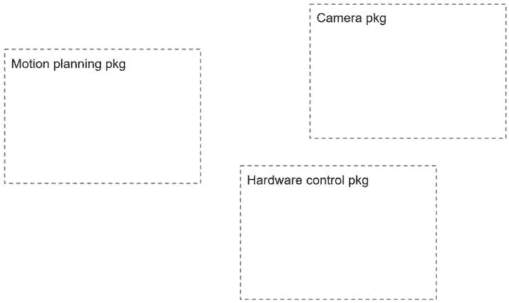
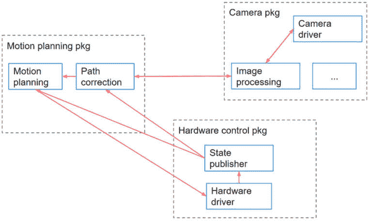

# 4

# 编写和构建 ROS 2 节点

要使用 ROS 2 编写自己的自定义代码，你必须创建 ROS 2 程序，换句话说，就是节点。你已经在 *第三章* 中发现了节点的概念。在本章中，我们将更深入地探讨，你将使用 Python 和 C++ 编写你的第一个节点。

在你创建节点之前，有一些设置要做：你需要创建一个 ROS 2 工作空间，你将在其中构建你的应用程序。在这个工作空间中，你将添加软件包以更好地组织你的节点。然后，在这些软件包中，你可以开始编写你的节点。在你编写一个节点之后，你将构建它并运行它。

我们将一起完成这个完整的过程，一路上都有动手代码和命令行。这是你在开发 ROS 2 应用程序时创建任何新节点时需要重复的过程。

到本章结束时，你将能够使用 Python 和 C++ 创建自己的软件包和 ROS 2 节点。你还将能够从终端运行和检查你的节点。这是学习任何其他 ROS 2 功能性所需的基础。没有节点，就没有主题、服务、动作、参数或启动文件。

所有解释都将从 Python 开始，然后是 C++，我们将快速介绍。如果你只想用 Python 学习，你可以跳过 C++ 部分。然而，如果你想用 C++ 学习，阅读之前的 Python 解释对于理解是强制性的。

本章的所有代码示例都可以在本书 GitHub 仓库的 **ch4** 文件夹中找到（[`github.com/PacktPublishing/ROS-2-from-Scratch`](https://github.com/PacktPublishing/ROS-2-from-Scratch)）。

在本章中，我们将涵盖以下主题：

+   创建和设置 ROS 2 工作空间

+   创建一个软件包

+   创建一个 Python 节点

+   创建一个 C++ 节点

+   Python 和 C++ 节点的节点模板

+   检查你的节点

# 技术要求

要跟随本章，你需要以下内容：

+   安装了 Ubuntu 24.04（双启动或虚拟机）

+   ROS Jazzy

+   文本编辑器或 IDE（例如，带有 ROS 扩展的 VS Code）

这些要求将适用于 *第二部分* 中的所有章节。

# 创建和设置 ROS 2 工作空间

在我们编写任何代码之前，我们需要做一些组织工作。节点将存在于软件包中，而你所有的软件包都将存在于一个 **ROS 2 工作空间** 中。

什么是 ROS 2 工作空间？**工作空间** 仅仅是一个文件夹组织，你将在其中创建和构建你的软件包。你的整个 ROS 2 应用程序都将生活在这个工作空间中。

要创建一个工作空间，你必须遵循某些规则。让我们一步一步地创建你的第一个工作空间，并正确地设置它。

## 创建工作空间

要创建一个工作空间，你只需在你的家目录中创建一个新的目录。

关于工作空间的名称，让我们现在保持简单，使用一个易于识别的名称：**ros2_ws**。

注意

工作空间的名称并不重要，它不会影响你的应用程序中的任何内容。因为我们刚开始，我们只有一个工作空间。当你取得进展并开始处理多个应用程序时，最佳实践是为每个工作空间命名应用程序或机器人的名称。例如，如果你为名为`ABC V3`的机器人创建一个工作空间，那么你可以将其命名为`abc_v3_ws`。

打开一个终端，导航到你的家目录，并创建工作空间：

```py
$ cd
$ mkdir ros2_ws
```

然后，进入工作空间并创建一个名为**src**的新目录。这就是你将编写所有 ROS 2 应用程序代码的地方：

```py
$ cd ros2_ws/
$ mkdir src
```

这就是全部内容。要设置新的工作空间，你只需创建一个新的目录（在你的家目录中的任何位置），并在其中创建一个**src**目录。

## 构建工作空间

即使工作空间为空（我们还没有创建任何包），我们仍然可以构建它。为此，请按照以下步骤操作：

1.  导航到工作空间根目录。确保你处于正确的位置。

1.  运行`colcon build`命令。`colcon`是 ROS 2 的构建系统，在你安装`ros-dev-tools`包时已安装（见*第二章*）。

让我们构建工作空间：

```py
$ cd ~/ros2_ws/
$ colcon build
Summary: 0 packages finished [0.73s]
```

如你所见，没有构建任何包，但让我们列出**~/ros2_ws**下的所有目录：

```py
$ ls
build  install  log  src
```

如你所见，我们有了三个新的目录：**build**、**install**和**log**。**build**目录将包含整体构建所需的中间文件。在**log**中，你会找到每个构建的日志。对你来说最重要的目录是**install**，这是你在构建工作空间后所有节点将被安装的地方。

注意

你应该始终从工作空间目录的根目录运行`colcon build`，而不是从其他任何地方。如果你犯了一个错误，并从另一个目录（比如说，从工作空间的`src`目录，或者在一个包内部）运行此命令，只需简单地删除在错误位置创建的新`install`、`build`和`log`目录。然后回到工作空间根目录并重新构建。

## 源代码工作空间

如果你导航到新创建的**install**目录内部，你可以看到一个**setup.bash**文件：

```py
$ cd install/
$ ls
COLCON_IGNORE       _local_setup_util_ps1.py   setup.ps1 
local_setup.bash    _local_setup_util_sh.py    setup.sh
local_setup.ps1     local_setup.zsh            setup.zsh
local_setup.sh      setup.bash
```

这可能看起来很熟悉。如果你记得，在我们安装 ROS 2 之后，我们从 ROS 2 安装目录（**/opt/ros/jazzy/setup.bash**）源代码了一个类似的 bash 脚本，以便我们可以在环境中使用 ROS 2。我们还需要为我们的工作空间做同样的事情。

每次你构建工作空间时，都必须源代码它，以便环境（你所在的会话）了解工作空间中的新更改。

要源代码工作空间，源代码这个**setup.bash**脚本：

```py
$ source ~/ros2_ws/install/setup.bash
```

然后，就像我们之前做的那样，我们将把这一行添加到我们的**.bashrc**中。这样，你就不需要在每次打开新终端时都源代码工作空间。

使用你想要的任何文本编辑器打开你的**.bashrc**（位于你的家目录中，路径为**~/.bashrc**）：

```py
$ gedit ~/.bashrc
```

在全局 ROS 2 安装的源代码行之后添加一行，用于源代码工作空间的**setup.bash**脚本。这里的顺序非常重要。您必须首先源代码全局 ROS 2 安装，然后是您的 workspace，而不是反过来：

```py
source /opt/ros/jazzy/setup.bash
source ~/ros2_ws/install/setup.bash
```

确保保存**.bashrc**。现在，无论是 ROS 2 还是您的工作空间，在您打开任何新的终端时都会被源代码。

注意

如果您在一个已经源代码的环境中构建工作空间，您仍然需要再次源代码工作空间，因为有一些变化，环境并不知情。在这种情况下，您可以直接源代码工作空间的 `setup.bash` 脚本，源代码 `.bashrc`，或者打开一个新的终端。

您的工作空间现在已正确设置，您可以构建您的应用程序。下一步：创建一个包。

# 创建一个包

您创建的任何节点都将存在于一个包中。因此，要创建一个节点，您首先必须创建一个包（在您的 workspace 中）。您现在将学习如何创建自己的包，我们将看到 Python 包和 C++包之间的区别。

但首先，包究竟是什么？

## ROS 2 包是什么？

ROS 2 包是您应用程序的一个子部分。

让我们考虑一个我们想要用来拾取和放置物体的机械臂。在我们创建任何节点之前，我们可以尝试将这个应用程序分成几个子部分，或者包。

我们可以有一个包来处理相机，另一个包用于硬件控制（电机），还有一个包用于计算机器人的运动规划。



图 4.1 – 机器人包组织示例

每个包都是一个独立的单元，负责您应用程序的一个子部分。

包对于组织您的节点非常有用，并且可以正确处理依赖项，正如我们将在本书后面看到的那样。

现在，让我们创建一个包，在这里您必须做出选择。如果您想用 Python 创建节点，您将创建一个 Python 包，如果您想用 C++创建节点，您将创建一个 C++包。每种包类型的架构都相当不同。

## 创建一个 Python 包

您将创建所有包在您的 ROS 2 工作空间的 **src** 目录中。因此，在您做其他任何事情之前，请确保导航到这个目录：

```py
$ cd ~/ros2_ws/src/
```

这是构建包的命令构造方法：

1.  `ros2 pkg create <pkg_name>`: 这是您需要编写的最小内容。

1.  您可以使用`--build_type <build_type>`指定构建类型。对于 Python 包，我们需要使用`ament_python`。

1.  您还可以使用`--dependencies <list_of_dependencies_separated_with_spaces>`指定一些可选依赖项。在包中添加依赖项总是可能的。

让我们创建我们的第一个包，命名为**my_py_pkg**。我们将使用此名称作为示例来处理主要的 ROS 2 概念。然后，随着我们的进展，我们将使用更有意义的名称。在您工作区的**src**目录中运行以下命令：

```py
$ ros2 pkg create my_py_pkg --build-type ament_python --dependencies rclpy
```

使用此命令，我们表示我们想要创建一个名为**my_py_pkg**的包，使用**ament_python**构建类型，并指定一个依赖项：**rclpy**——这是您将在每个 Python 节点中使用的 ROS 2 的 Python 库。

这将打印出很多日志，显示已经创建了哪些文件。您也可能收到一条关于缺少许可证的**[警告]**日志，但由于我们没有任何意图将此包发布到任何地方，我们现在不需要许可证文件。您可以忽略此警告。

您可以看到，有一个名为**my_py_pkg**的新目录。这是您新创建的 Python 包的架构：

```py
/home/<user>/ros2_ws/src/my_py_pkg
├── my_py_pkg
│   └── __init__.py
├── package.xml
├── resource
│   └── my_py_pkg
├── setup.cfg
├── setup.py
└── test
    ├── test_copyright.py
    ├── test_flake8.py
    └── test_pep257.py
```

目前并非所有文件都很重要。我们将在稍后看到如何使用这些文件来配置和安装我们的节点。

这里是关于最重要的文件和目录的快速概述：

+   `my_py_pkg`：如您所见，在包内部，还有一个同名的目录。这个目录已经包含了一个`__init__.py`文件。这就是我们将创建我们的 Python 节点的地方。

+   `package.xml`：每个 ROS 2 包（Python 或 C++）都必须包含此文件。我们将使用它来提供有关包以及依赖项的更多信息。

+   `setup.py`：这是您将编写构建和安装您的 Python 节点的说明的地方。

## 创建 C++包

在这本书中，我们将大量使用 Python，但为了完整性，我还会包括所有示例的 C++代码。这些代码要么在书中解释，要么在 GitHub 仓库中提供。

创建 C++包与创建 Python 包非常相似；然而，包的架构将会有很大的不同。

确保您导航到您工作区的**src**目录，然后创建一个新的包。让我们使用与 Python 相同的模式，将包命名为**my_cpp_pkg**：

```py
$ cd ~/ros2_ws/src/
$ ros2 pkg create my_cpp_pkg --build-type ament_cmake --dependencies rclcpp
```

我们选择**ament_cmake**作为构建类型（这意味着这将是一个 C++包），并指定一个依赖项：**rclcpp**——这是 ROS 2 的 C++库，我们将用于每个 C++节点。

再次提醒，您应该会看到很多日志，包括新创建的文件，以及可能关于许可证的警告，但您可以忽略。

您的新 C++包的架构将如下所示：

```py
/home/ed/ros2_ws/src/my_cpp_pkg/
├── CMakeLists.txt
├── include
│   └── my_cpp_pkg
├── package.xml
└── src
```

这里是关于每个文件或目录角色的快速解释：

+   `CMakeLists.txt`：这将用于提供如何编译您的 C++节点、创建库等的说明。

+   `include`目录：在 C++项目中，您可以将代码分成实现文件（`.cpp`扩展名）和头文件（`.hpp`扩展名）。如果您将 C++节点分成`.cpp`和`.hpp`文件，您将把头文件放在`include`目录中。

+   `package.xml`：此文件是任何类型的 ROS 2 包所必需的。它包含有关包的更多信息，以及其他包的依赖关系。

+   `src` 目录：这是你将编写你的 C++ 节点（`.cpp` 文件）的地方。

## 构建包

现在你已经创建了一个或多个包，你可以构建它们，即使包中还没有任何节点。

要构建包，回到你的 ROS 2 工作空间根目录并运行 **colcon build**。再次强调，就像在本章前面所看到的，运行此命令的位置非常重要。

```py
$ cd ~/ros2_ws/
$ colcon build
Starting >>> my_cpp_pkg
Starting >>> my_py_pkg
Finished <<< my_py_pkg [1.60s]
Finished <<< my_cpp_pkg [3.46s]
Summary: 2 packages finished [3.72s]
```

两个包都已经构建完成。每次你在包内添加或修改节点时，你都必须这样做。

重要的是要注意这一行：**Finished <<< <package_name> [time]**。这意味着包已正确构建。即使你看到额外的警告日志，如果你也看到了 **Finished** 行，你就知道包已经构建。

注意

在构建任何包之后，你还需要源你的工作空间，以便环境能够意识到新的更改。你可以执行以下任何一项操作：

- 打开一个新的终端，因为所有配置都在 `.bashrc` 文件中

- 直接源 `setup.bash` 脚本（`source ~/ros2_ws/install/setup.bash`）

- 手动源 `.bashrc` 文件 (`source ~/.bashrc`)

要仅构建特定的包，可以使用 **--packages-select** 选项，后跟包的名称。以下是一个示例：

```py
$ colcon build --packages-select my_py_pkg
Starting >>> my_py_pkg
Finished <<< my_py_pkg [1.01s]
Summary: 1 package finished [1.26s]
```

这样，你不需要每次都构建整个应用程序，只需专注于一个包即可。

现在我们已经创建了一些包，并且我们知道如何构建它们，我们可以在包中创建节点。但我们如何组织它们呢？

## 包中的节点是如何组织的？

要开发 ROS 2 应用程序，你将在节点内部编写代码。如第三章中所示，*节点*只是 ROS 2 程序的名称。

节点是应用程序的子程序，负责一件事情。如果你有两个不同的功能需要实现，那么你将有两个节点。节点通过 ROS 2 通信（主题、服务和动作）相互通信。

你将在包内部组织你的节点。对于某个包（应用程序的子部分），你可以有多个节点（功能）。要完全理解如何组织包和节点，你需要实践和经验。现在，让我们用一个例子来获得一个概念。

让我们回到我们在 *图 4**.1* 中看到的包架构，并在包内添加节点：



图 4.2 – 包组织节点的示例

如你所见，在相机包中，我们可以有一个节点负责处理相机硬件。这个节点会将图像发送到图像处理节点，而这个后者会提取机器人拾取物体的坐标。

同时，一个运动规划节点（在运动规划包中）将根据特定的命令计算机器人应执行的运动。路径校正节点可以使用从图像处理节点接收到的数据来支持这种运动规划。

最后，为了使机器人移动，一个硬件驱动节点将负责硬件通信（电机、编码器）并从运动规划节点接收命令。还可以有一个额外的状态发布节点，用于向其他节点发布有关机器人的额外数据。

这种节点组织纯粹是虚构的，这里只是为了给你一个 ROS 2 应用程序如何设计的总体概念，以及节点在这个应用程序中可以扮演哪些角色。

现在，你终于要编写你的第一个 ROS 2 节点了。ROS 2 在你可以实际编写代码之前需要相当多的安装和配置，但好消息是，我们已经完成了所有这些，现在我们可以专注于代码了。

目前我们不会做任何太复杂的事情；我们不会深入复杂的特性或通信。我们将编写一个基本的节点，你可以将其作为模板来开始任何未来的节点。我们还将构建这个节点，看看如何运行它。

# 创建一个 Python 节点

让我们创建我们的第一个 Python 节点，或者换句话说，我们的第一个 ROS 2 Python 程序。

创建 Python 和 C++节点的过程非常不同。这就是为什么我为每个都写了单独的部分。我们将从 Python 开始，提供完整的逐步说明。然后我们将看到如何用 C++做同样的事情。如果你想跟随 C++节点部分，请确保先阅读这一部分。

要创建一个节点，你必须做以下事情：

1.  为节点创建一个文件。

1.  编写节点。我们将使用**面向对象编程**（**OOP**），这是 ROS 2 官方推荐的（并且你几乎可以找到的每个现有的 ROS 2 代码都使用 OOP）。

1.  构建节点存在的包。

1.  运行节点以测试它。

让我们开始我们的第一个 Python 节点。

## 为节点创建一个文件

要编写节点，我们首先需要创建一个文件。我们应该在哪里创建这个文件？

如果你记得，当我们创建**my_py_pkg**包时，在包内部创建了一个名为**my_py_pkg**的目录。这就是我们将编写节点的地方。对于每个 Python 包，你必须进入与包同名目录。如果你的包名是**abc**，那么你将进入**~/ros2_ws/src/abc/abc/**。

在这个目录中创建一个新文件并使其可执行：

```py
$ cd ~/ros2_ws/src/my_py_pkg/my_py_pkg/
$ touch my_first_node.py
$ chmod +x my_first_node.py
```

然后，打开这个文件进行编写。你可以使用任何你想要的文本编辑器或 IDE，只要你不迷失在所有文件中。

如果你不知道该使用什么，我建议使用带有 ROS 扩展的 VS Code（如*第二章*中所述）。这是我用于所有 ROS 开发的工具。

注意

如果你使用 VS Code，最佳方式是首先在终端中导航到你的工作区`src`目录，然后打开它。这样，你可以访问工作区中的所有包，并且这将使处理已识别的依赖项和自动完成变得更容易：

`$` `cd ~/ros2_ws/src/`

`$` `code .`

## 编写一个最小的 ROS 2 Python 节点

这是任何你将创建的 Python 节点的起始代码。你可以将此代码写入**my_first_node.py**文件：

```py
#!/usr/bin/env python3
import rclpy
from rclpy.node import Node
class MyCustomNode(Node):
    def __init__(self):
        super().__init__('my_node_name')
def main(args=None):
    rclpy.init(args=args)
    node = MyCustomNode()
    rclpy.spin(node)
    rclpy.shutdown()
if __name__ == '__main__':
    main()
```

如你所见，我们在这里使用了面向对象编程（OOP）。在 ROS 2 中，OOP 无处不在，这是默认（也是推荐）的编写节点的方式。

让我们一步一步地回到这段代码，来理解它在做什么：

```py
#!/usr/bin/env python3
import rclpy
from rclpy.node import Node
```

我们首先导入**rclpy**，这是 ROS 2 的 Python 库。在这个库中，我们可以获取**Node**类。

我们接着创建一个新的类，它继承自**rclpy**的**Node**类：

```py
class MyCustomNode(Node):
    def __init__(self):
        super().__init__('my_node_name')
```

在这个类中，确保你使用**super()**调用父构造函数。这也是你指定节点名称的地方。

这个节点目前什么都没做；我们将在一分钟内添加一些功能。让我们完成代码：

```py
def main(args=None):
    rclpy.init(args=args)
    node = MyCustomNode()
    rclpy.spin(node)
    rclpy.shutdown()
```

在类之后，我们在其中创建一个**main()**函数，执行以下操作：

1.  使用`rclpy.init()`初始化 ROS 2 通信。这应该是你`main()`函数中的第一行。

1.  从我们之前写的`MyCustomNode`类创建一个对象。这将初始化节点。不需要在之后销毁节点，因为当程序退出时，这会自动发生。

1.  让节点旋转。如果你省略这一行，节点将被创建，然后程序将退出，节点将被销毁。让节点旋转意味着我们在这里阻塞执行，程序保持活跃，因此节点也保持活跃。在此期间，正如我们很快将看到的，所有注册的节点回调都可以被处理。当你按下*Ctrl* + *C*时，节点将停止旋转，这个函数将返回。

1.  在节点被杀死后，使用`rclpy.shutdown()`关闭 ROS 2 通信。这将是你`main()`函数中的最后一行。

这就是所有你的 ROS 2 程序的工作方式。如你所见，节点实际上是我们程序中创建的一个对象（节点本身不是程序，但当我们谈论程序时，仍然非常常见地提到“节点”这个词）。创建后，节点可以在旋转时保持活跃并发挥其作用。我们很快会回到这个*旋转*的概念。

最后，我们还添加了这两行：

```py
if __name__ == '__main__':
    main()
```

这是一个纯 Python 的东西，与 ROS 2 无关。它只是意味着如果你直接运行 Python 脚本，**main()**函数将被调用，因此你可以尝试你的程序而无需使用**colcon**安装它。

太好了，你已经编写了你的第一个最小 Python 节点。在你构建和运行它之前，在节点的构造函数中添加一行，这样它就可以做些事情：

```py
class MyCustomNode(Node):
    def __init__(self):
        super().__init__('my_node_name')
        self.get_logger().info("Hello World")
```

这行代码将在节点启动时打印**Hello World**。

由于 **MyCustomNode** 类继承自 **Node** 类，我们可以访问所有 ROS 2 的节点功能。这将使我们的事情变得相当方便。这里有一个使用日志功能的例子：我们从 **Node** 中获取 **get_logger()** 方法。然后，使用 **info()** 方法，我们可以打印一个信息级别的日志。

## 构建节点

你现在将要构建节点以便运行它。

你可能会想：为什么我们需要构建一个 Python 节点？Python 是一种解释型语言；我们难道不能直接运行文件本身吗？

是的，这是真的：你只需在终端中运行代码即可测试它 **($ python3 my_first_node.py**)。然而，我们真正想要做的是在我们的工作区中安装文件，这样我们就可以使用 **ros2 run** 启动节点，稍后还可以从启动文件中启动。

我们通常使用“构建”这个词，因为要安装 Python 节点，我们必须运行 **colcon build**。

要构建（安装）节点，我们需要在软件包中做一件事。打开 **my_py_pkg** 软件包中的 **setup.py** 文件。在文件末尾找到 **entry_points** 和 **'console_scripts'**。对于我们要构建的每个节点，我们必须在 **'console_scripts'** 数组中添加一行：

```py
entry_points={
    'console_scripts': [
        "test_node = my_py_pkg.my_first_node:main"
    ],
},
```

这里是语法：

```py
<executable_name> = <package_name>.<file_name>:<function_name>.
```

在正确编写这一行时有一些重要的事情需要注意：

+   首先，选择一个可执行文件名。这将是你使用 `ros2 run <pkg_name> <executable_name>` 时的名称。

+   对于文件名，跳过 `.py` 扩展名。

+   函数名是 `main`，因为我们已经在代码中创建了一个 `main()` 函数。

+   如果你想要为另一个节点添加另一个可执行文件，别忘了在每个可执行文件之间添加逗号，并且每个可执行文件占一行。

注意

在学习 ROS 2 时，节点名、文件名和可执行文件名之间有一个常见的混淆：

- 节点名：在代码中的构造函数内定义。这就是你在 `ros2 node list` 或 `rqt_graph` 中看到的内容。

- 文件名：你编写代码的文件。

- 可执行文件名：在 `setup.py` 中定义并用于 `ros2 run`。

在这个第一个例子中，我确保为每个使用了不同的名称，这样你可以意识到这些都是三件不同的事情。但有时这三个名称可以是相同的。例如，你可以创建一个 `temperature_sensor.py` 文件，然后给你的节点和可执行文件命名为 `temperature_sensor`。

现在你已经给出了创建新可执行文件的指令，请前往你的工作区根目录并构建该软件包：

```py
$ cd ~/ros2_ws/
$ colcon build
```

你也可以添加 **--packages-select my_py_pkg** 以仅构建此软件包。

可执行文件现在应该已创建并安装在工作区中（它将被放置在 **install** 目录中）。我们可以这样说，你的 Python 节点已经构建或安装了。

## 运行节点

现在你可以运行你的第一个节点了，但在运行之前，请确保工作区已在你的环境中源码：

```py
$ source ~/.bashrc
```

这个文件已经包含了源码工作空间的行；你也可以打开一个新的终端，或者从工作空间中源码**setup.bash**脚本。

你现在可以使用**ros2 run**来运行你的节点（如果你有任何疑问，请回到我们在*第三章*中做的实验）：

```py
$ ros2 run my_py_pkg test_node
[INFO] [1710922181.325254037] [my_node_name]: Hello World
```

太好了，我们看到日志**Hello World**。你的第一个节点已经成功运行。请注意，我们在**ros2 run**命令中写了**test_node**，因为这是我们选择在**setup.py**文件中的可执行文件名。

现在，你可能会注意到程序在那里挂起了。节点仍然活着，因为它正在自旋。要停止节点，请按*Ctrl* + *C*。

## 改进节点——计时器和回调

到目前为止，你可能觉得编写、构建和运行一个节点是一个漫长且复杂的过程。实际上，它并不那么复杂，而且随着你创建的新节点的增加而变得更容易。此外，修改现有的节点甚至更容易。我们现在就看看。

我们运行的这个节点非常基础。让我们再添加一个功能，做一些更有趣的事情。

我们的这个节点在启动时会打印一段文本。现在我们希望节点每秒打印一个字符串，只要它还活着。

“每 Y 秒执行 X 动作”这种行为在机器人技术中非常常见。例如，你可以有一个节点“每 2 秒读取一次温度”，或者“每 0.1 秒发送一个新的电机命令”。

如何做到这一点？我们将在我们的节点中添加一个**计时器**。计时器将以指定的速率触发一个**回调**函数。

让我们回到代码中，并修改**MyCustomNode**类。其余的代码保持不变：

```py
class MyCustomNode(Node):
    def __init__(self):
        super().__init__('my_node_name')
        self.counter_ = 0
        self.timer_ = self.create_timer(1.0, self.print_hello)
    def print_hello(self):
        self.get_logger().info("Hello " + str(self.counter_))
        self.counter_ += 1
```

我们仍然有带有**super()**的构造函数，但现在日志在单独的方法中。此外，我们不再只是打印**Hello World**，在这里我们创建了一个**counter_**属性，每次我们使用日志时都会增加它。

注意

如果你想知道为什么每个类属性末尾都有一个尾随下划线`_`，这是一个常见的面向对象编程约定，我遵循这个约定来指定一个变量是类属性。它仅仅是一个视觉上的帮助，没有其他功能。你可以遵循相同的约定或使用另一个约定——只要确保在一个项目中保持一致性。

最重要的一行是创建计时器的代码。为了创建计时器，我们使用**Node**类的**create_timer()**方法。我们需要提供两个参数：我们想要调用函数的速率（浮点数）和回调函数。请注意，回调函数应指定不带任何括号。

这条指令意味着我们想要每**1.0**秒调用一次**print_hello**方法。

现在我们来尝试一下代码。因为我们已经在**setup.py**文件中指定了如何从这个文件创建可执行文件，所以我们不需要再次做这件事。

我们需要做的只是构建、源码和运行。记住：“构建、源码、运行。”每次你创建一个新的节点或修改现有的节点时，你都必须“构建、源码、运行。”

在终端中，转到你的 ROS 2 工作空间的根目录并构建包：

```py
$ cd ~/ros2_ws/
$ colcon build --packages-select my_py_pkg
```

注意

在 `--packages-select <pkg_name>` 的基础上，你可以添加 `--symlink-install` 选项，这样你就不必每次修改 Python 节点时都构建包；例如，`$ colcon build --packages-select my_py_pkg --symlink-install`。

你可能会看到一些警告日志，但只要看到以 `Finished <<< my_py_pkg` 开头的行，就说明它已经正确工作了。这将安装可执行文件，但如果修改了代码，你应该能够运行它而无需再次构建。

两个重要的事情：这仅适用于 Python 包，并且你仍然需要为任何新创建的可执行文件构建包。

然后，从这个终端或另一个终端，执行以下操作：

```py
$ source ~/.bashrc
$ ros2 run my_py_pkg test_node
[INFO] [1710999909.533443384] [my_node_name]: Hello 0
[INFO] [1710999910.533169531] [my_node_name]: Hello 1
[INFO] [1710999911.532731467] [my_node_name]: Hello 2
[INFO] [1710999912.534052411] [my_node_name]: Hello 3
```

如您所见，构建、源代码和运行的过程相当快，并不复杂。在这里，我们可以看到节点每秒打印一条日志，并且计数器在每条新日志中递增。

现在这是怎么做到的？**print_hello()** 方法是如何被调用的？我们确实创建了一个计时器，但是代码中并没有直接调用 **print_hello()**。

它之所以能工作，是因为节点正在旋转，这要归功于 **rclpy.spin(node)**。这意味着节点被保持活跃状态，并且在此期间可以调用所有已注册的回调。我们使用 **create_timer()** 做的事情仅仅是注册一个回调，这样当节点在旋转时就可以被调用。

这是你第一个回调示例，正如你将在本书的后续章节中看到的，在 ROS 2 中，一切操作都是通过回调来运行的。到目前为止，如果你在语法、回调和旋转方面还有一些困难，不要过于担心。随着你对本书的进步，你会多次重复这个过程。在学习 ROS 2 时，理解伴随着动手实践。

我们现在已经完成了这个 Python 节点。根据你所看到的，你应该能够创建你自己的新 Python 节点（在同一个包或另一个包中）。现在让我们切换到 C++。如果你目前只对使用 Python 学习 ROS 2 感兴趣，你可以跳过 C++ 部分。

# 创建一个 C++ 节点

我们将要做的与为 Python 节点所做的是完全相同的：创建一个文件，编写节点，构建，源代码，然后运行。

确保你已经阅读了之前的 Python 部分，因为我不会在这里重复所有内容。我们基本上只是看看如何为一个 C++ 节点应用这个过程。

要创建一个 C++ 节点，我们首先需要一个 C++ 包。我们将使用之前创建的 **my_cpp_pkg** 包。

## 编写 C++ 节点

让我们为节点创建一个文件。转到 **my_cpp_pkg** 包内的 **src** 目录并创建一个 **.cpp** 文件：

```py
$ cd ~/ros2_ws/src/my_cpp_pkg/src/
$ touch my_first_node.cpp
```

你也可以直接从你的 IDE 创建文件，而不使用终端。

现在，如果你之前没有这样做，请使用 VS Code 或任何其他 IDE 打开你的工作空间：

```py
$ cd ~/ros2_ws/src/
$ code .
```

打开 **my_first_node.cpp**。以下是编写 C++ 节点的最小代码：

```py
#include "rclcpp/rclcpp.hpp"
class MyCustomNode : public rclcpp::Node
{
public:
    MyCustomNode() : Node("my_node_name")
    {
    }
private:
};
int main(int argc, char **argv)
{
    rclcpp::init(argc, argv);
    auto node = std::make_shared<MyCustomNode>();
    rclcpp::spin(node);
    rclcpp::shutdown();
    return 0;
}
```

注意

如果你使用 VS Code 并输入此代码，你可能会看到 `rclcpp` 库的包含错误。请确保保存文件并等待几秒钟。如果包含仍然没有被识别，请转到 **扩展** 选项卡，禁用并重新启用 ROS 扩展。

正如你所见（这与 Python 类似），在 ROS 2 中，我们大量使用 C++ 节点的面向对象编程。

让我们一步一步分析这段代码：

```py
#include "rclcpp/rclcpp.hpp"
```

我们首先包含 **rclcpp**，这是 ROS 2 的 C++ 库。这个库包含 **rclcpp::Node** 类：

```py
class MyCustomNode : public rclcpp::Node
{
public:
    MyCustomNode() : Node("my_node_name")
    {
    }
private:
};
```

就像我们对 Python 所做的那样，我们创建了一个继承自 **Node** 类的类。语法不同，但原理相同。从这个 **Node** 类，我们将能够访问所有 ROS 2 功能：记录器、计时器等。正如你所见，我们在构造函数中也指定了节点名称。目前，节点什么也不做；我们将在一分钟内添加更多功能：

```py
int main(int argc, char **argv)
{
    rclcpp::init(argc, argv);
    auto node = std::make_shared<MyCustomNode>();
    rclcpp::spin(node);
    rclcpp::shutdown();
    return 0;
}
```

如果你想要能够运行你的 C++ 程序，你需要一个 **main()** 函数。在这个函数中，我们与 Python 完全相同，只是在语法上有些差异：

1.  使用 `rclcpp::init()` 初始化 ROS 2 通信。

1.  从你新编写的类中创建一个节点对象。正如你所见，我们不是直接创建一个对象，而是创建对该对象的智能指针。在 ROS 2 和 C++ 中，你创建的几乎所有内容都将是一个智能指针（共享、唯一等）。

1.  然后我们使用 `rclcpp::spin()` 让节点运行。

1.  最后，当节点停止时（*Ctrl* + *C*），我们使用 `rclcpp::shutdown()` 关闭所有 ROS 2 通信。

这个 **main()** 函数的结构将非常类似于你所有的 ROS 2 程序。正如你所见，再次强调，节点本身不是程序。节点是在程序内部创建的。

在我们进一步构建、源代码和运行我们的节点之前，让我们现在通过计时器、回调和日志来改进它。

修改 **MyCustomNode** 类，其余保持不变：

```py
class MyCustomNode : public rclcpp::Node
{
public:
    MyCustomNode() : Node("my_node_name"), counter_(0)
    {
        timer_ = this->create_wall_timer(std::chrono::seconds(1), std::bind(&MyCustomNode::print_hello, this));
    }
    void print_hello()
    {
        RCLCPP_INFO(this->get_logger(), "Hello %d", counter_);
        counter_++;
    }
private:
    int counter_;
    rclcpp::TimerBase::SharedPtr timer_;
};
```

这个代码示例将执行与 Python 节点相同的功能。我们创建一个计时器，以便每 **1.0** 秒调用一次回调函数。在这个回调函数中，我们打印 **Hello** 后跟一个计数器，每次调用时都会增加。

与 C++ 相关有一些特定性：

+   对于计时器，我们必须创建一个类属性。正如你所见，我们在这里也创建了一个共享指针：`rclcpp::TimerBase::SharedPtr`。

+   我们使用 `this->create_wall_timer()` 创建计时器。`this->` 在这里不是必需的，但我添加它来强调我们正在使用 `Node` 类的 `create_wall_timer()` 方法。

+   要在计时器中指定回调，由于我们处于 C++ 类中，我们必须使用 `std::bind(&ClassName::method_name, this)`。确保你不对方法名称使用任何括号。

节点现在已经完成，因此我们可以构建它。

## 构建和运行节点

我们不能直接运行 C++ 文件；我们首先必须编译它并创建一个可执行文件。为此，我们将编辑 **CMakeLists.txt** 文件。打开此文件，在几行之后，你会找到类似以下的内容：

```py
# find dependencies
find_package(ament_cmake REQUIRED)
find_package(rclcpp REQUIRED)
```

查找 **rclcpp** 的行在这里，因为我们创建包时使用了 **ros2 pkg create** 并提供了 **--dependencies rclcpp**。之后，如果这个包中的节点需要更多的依赖，你可以在这里添加依赖，每行一个。

在此行之后，添加一个额外的空行，然后添加以下指令：

```py
add_executable(test_node src/my_first_node.cpp)
ament_target_dependencies(test_node rclcpp)
install(TARGETS
  test_node
  DESTINATION lib/${PROJECT_NAME}/
)
```

要构建一个 C++ 节点，我们需要做三件事：

1.  使用 `add_executable()` 函数添加一个新的可执行文件。在这里，你必须为可执行文件选择一个名称（将用于 `ros2 run <pkg_name> <executable_name>`），我们还需要指定 C++ 文件的相对路径。

1.  使用 `ament_target_dependencies()` 函数链接此可执行文件的所有依赖。

1.  使用 `install()` 指令安装可执行文件，这样我们就可以在运行 `ros2 run` 时找到它。在这里，我们将可执行文件放在 `lib/<package_name>` 目录中。

然后，对于你创建的每个新的可执行文件，你需要重复 *步骤 1* 和 *步骤 2*，并在 **install()** 指令内添加可执行文件，每行一个，不要加逗号。不需要为每个可执行文件创建一个新的 **install()** 指令。

注意

你的 `CMakeLists.txt` 文件的末尾将包含一个以 `if(BUILD_TESTING)` 开头的块，然后是 `ament_package()`。由于我们这里没有进行任何构建测试，你可以删除整个 `if` 块。只需确保保留 `ament_package()` 行，这应该是文件的最后一行。

现在，你可以使用 **colcon build** 构建包，这将创建并安装可执行文件：

```py
$ cd ~/ros2_ws/
$ colcon build --packages-select my_cpp_pkg
```

如果在构建过程中遇到任何错误，请首先修复你的代码，然后再次构建。然后，你可以源环境，并运行你的可执行文件：

```py
$ source ~/.bashrc
$ ros2 run my_cpp_pkg test_node
[INFO] [1711006463.017149024] [my_node_name]: Hello 0
[INFO] [1711006464.018055674] [my_node_name]: Hello 1
[INFO] [1711006465.015927319] [my_node_name]: Hello 2
[INFO] [1711006466.015355747] [my_node_name]: Hello 3
```

如你所见，我们运行了 **test_node** 可执行文件（由 **my_first_node.cpp** 文件构建），这将启动 **my_node_name** 节点。

你现在已经成功编写了一个 C++ 节点。对于你创建的每个新节点，你将必须创建一个新的 C++ 文件，编写节点类，在 **CMakeLists.txt** 中为新可执行文件设置构建指令，并构建包。然后，要启动节点，源环境并使用 **ros2 run** 运行可执行文件。

# Python 和 C++ 节点的模板

本书开始的所有节点都将遵循相同的结构。为了快速入门提供额外的帮助，我创建了一个节点模板，你可以用它来编写任何 Python 或 C++ 节点的基类。我在创建新节点时也使用这些模板，因为代码可能相当重复。

你可以直接从这本书复制粘贴模板，或者从 GitHub 仓库下载它们：[`github.com/PacktPublishing/ROS-2-from-Scratch`](https://github.com/PacktPublishing/ROS-2-from-Scratch)。

## Python 节点的模板

使用此代码来启动任何新的 Python 节点：

```py
#!/usr/bin/env python3
import rclpy
from rclpy.node import Node
class MyCustomNode(Node): # MODIFY NAME
    def __init__(self):
        super().__init__("node_name") # MODIFY NAME
def main(args=None):
    rclpy.init(args=args)
    node = MyCustomNode() # MODIFY NAME
    rclpy.spin(node)
    rclpy.shutdown()
if __name__ == "__main__":
    main()
```

您需要做的就是移除 **MODIFY NAME** 注释，并更改类名（**MyCustomNode**）和节点名（**"node_name"**）。使用有意义的名称会更好。例如，如果您正在编写一个从温度传感器读取数据的节点，您可以将类命名为 **TemperatureSensorNode**，节点可以是 **temperature_sensor**。

## C++ 节点的模板

使用此代码来启动任何新的 C++ 节点：

```py
#include "rclcpp/rclcpp.hpp"
class MyCustomNode : public rclcpp::Node // MODIFY NAME
{
public:
    MyCustomNode() : Node("node_name") // MODIFY NAME
    {
    }
private:
};
int main(int argc, char **argv)
{
    rclcpp::init(argc, argv);
    auto node = std::make_shared<MyCustomNode>(); // MODIFY NAME
    rclcpp::spin(node);
    rclcpp::shutdown();
    return 0;
}
```

移除 **MODIFY NAME** 注释并重命名类和节点。

这两个模板将允许您更快地启动节点。我建议您尽可能多地使用它们。

# 检查您的节点

为了完成本章，我们将使用 **ros2 node** 命令行进行一些练习。

到目前为止，您已经看到了如何编写节点、构建它并运行它。一个缺失的部分是了解如何检查您的节点。即使节点可以运行，这也并不意味着它将完全按照您希望的方式执行。

能够检查您的节点将帮助您修复您可能在代码中犯的错误。它还将允许您轻松地找到有关您启动但未编写的其他节点的更多信息（如我们在 *第三章* 中的发现阶段所做的那样）。

对于 *第二部分* 中的每个核心概念，我们将花一些时间来实验与该概念相关的命令行工具。节点的命令行工具是 **ros2 node**。

首先，在我们使用 **ros2 node** 之前，我们必须启动一个节点。作为回顾，要启动节点，我们使用 **ros2 run <package_name> <executable_name>**。如果我们启动本章中创建的 Python 节点，我们使用这个：

```py
$ ros2 run my_py_pkg test_node
```

只有在我们启动了一个节点之后，我们才能使用 **ros2 node** 进行一些检查。

## ros2 node 命令行

要列出所有正在运行的节点，使用 **ros2 node list**：

```py
$ ros2 node list
/my_node_name
```

我们找到了在代码中定义的节点名称。

一旦我们有了节点名称，我们可以使用 **ros2 node info <node_name>** 获取更多关于它的信息：

```py
$ ros2 node info /my_node_name
/my_node_name
  Subscribers:
  Publishers:
    /parameter_events: rcl_interfaces/msg/ParameterEvent
    /rosout: rcl_interfaces/msg/Log
  Service Servers:
    /my_node_name/describe_parameters: rcl_interfaces/srv/DescribeParameters
    /my_node_name/get_parameter_types: rcl_interfaces/srv/GetParameterTypes
    /my_node_name/get_parameters: rcl_interfaces/srv/GetParameters
    /my_node_name/get_type_description: type_description_interfaces/srv/GetTypeDescription
    /my_node_name/list_parameters: rcl_interfaces/srv/ListParameters
    /my_node_name/set_parameters: rcl_interfaces/srv/SetParameters
    /my_node_name/set_parameters_atomically: rcl_interfaces/srv/SetParametersAtomically
  Service Clients:
  Action Servers:
  Action Clients:
```

如您所见，终端上有很多东西。我们将在接下来的章节中了解它们。使用 **ros2 node info <node_name>** 可以查看此节点运行的所有主题（发布者/订阅者）、服务和动作。

## 在运行时更改节点名称

随着我们在本书中的进展，我将为您提供一些关于使用 ROS 2 和命令行的额外技巧。这里有一个：在启动可执行文件时，您可以选择使用默认的节点名称（代码中定义的名称）或用新名称替换它。

要向 **ros2 run** 添加任何额外的参数，首先需要添加 **--ros-args**（只添加一次）。

然后，要重命名节点，添加 **-r __node:=<new_name>**。**-r** 表示重映射；您也可以使用 **--remap**。例如，如果我们想将节点命名为 **abc**，我们可以使用这个：

```py
$ ros2 run my_py_pkg test_node --ros-args -r __node:=abc
[INFO] [1711010078.801996629] [abc]: Hello 0
[INFO] [1711010079.805748394] [abc]: Hello 1
```

如从日志中所示，我们看到的不是 **my_node_name**，而是 **abc**。

列出所有正在运行的节点：

```py
$ ros2 node list
/abc
```

这个功能非常有用，它让你能够更好地控制如何启动节点，而无需直接修改代码。

注意

当运行多个节点时，你应该确保每个节点都有一个独特的名称。如果有两个节点具有相同的名称，可能会导致一些意想不到的问题，这些问题可能需要很长时间才能调试。在未来，你可能需要运行同一个节点多次，例如，三个`temperature_sensor`节点，每个节点对应不同的传感器。你可以将它们重命名为`temperature_sensor_1`、`temperature_sensor_2`和`temperature_sensor_3`。

# 摘要

在本章中，你已经创建了你的第一个节点。让我们快速回顾一下所有步骤。

在创建任何节点之前，你需要遵循以下步骤：

1.  你首先需要创建并设置一个 ROS 2 工作区。

1.  在这个工作区中，你可以创建几个包（Python 或 C++），它们代表应用程序的不同子部分。

然后，在一个包中你可以创建一个或多个节点。对于每个节点，你都需要执行以下操作：

1.  在包内创建一个文件。

1.  编写节点（以 OOP 模板为基础）。

1.  设置构建说明（Python 的`setup.py`，C++的`CMakeLists.txt`）。

1.  构建包。

要运行节点，别忘了首先源代码工作区，然后使用**ros2 run <pkg_name> <executable_name>**启动节点。

最后，当你启动节点时，可以使用**ros2 node**命令行来检查你的节点，甚至更改它们的名称。

随时可以回到本章，查看创建 Python 和 C++节点的完整过程。所有代码都可在 GitHub 上找到，网址为[`github.com/PacktPublishing/ROS-2-from-Scratch`](https://github.com/PacktPublishing/ROS-2-from-Scratch)。在那里你可以找到 Python 和 C++的 OOP 模板代码，**my_py_pkg**包和**my_cpp_pkg**包。

在本章中，你还看到了如何创建计时器和回调函数。你对自旋机制的工作原理有了更好的理解，以及它是如何使节点保持活跃并运行回调的。这将在后续章节中非常有用。

在下一章中，我们将看到节点如何通过主题进行通信。你将在节点内部编写自己的主题（发布者/订阅者）并对其进行实验。
