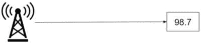
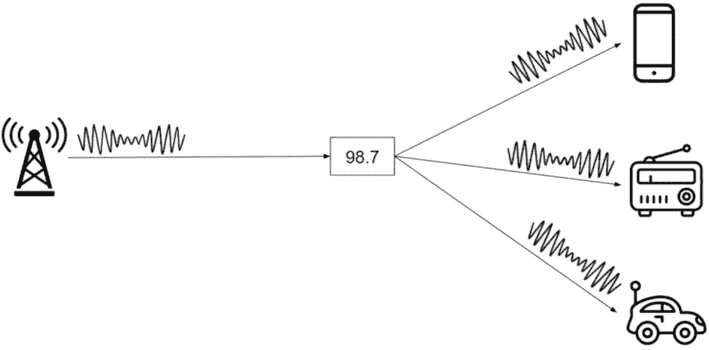
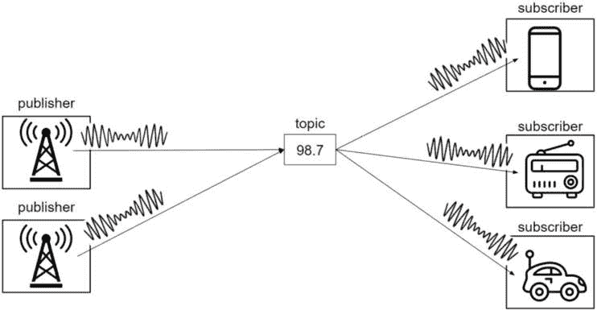
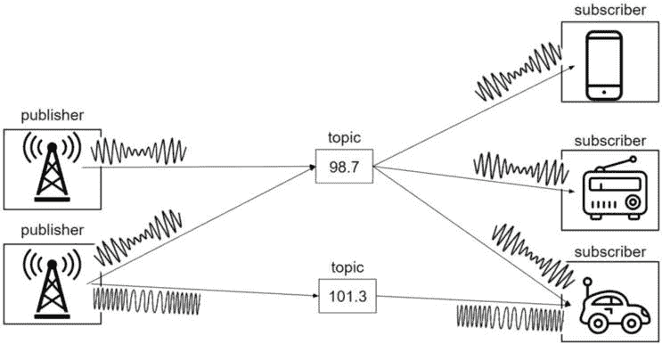
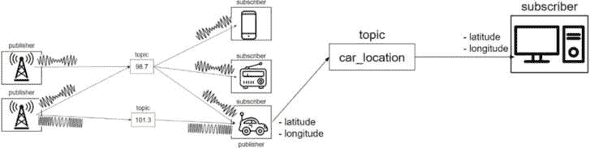
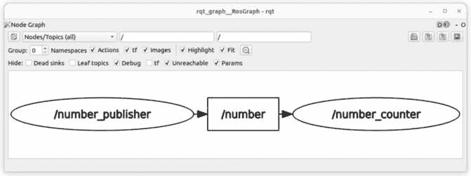
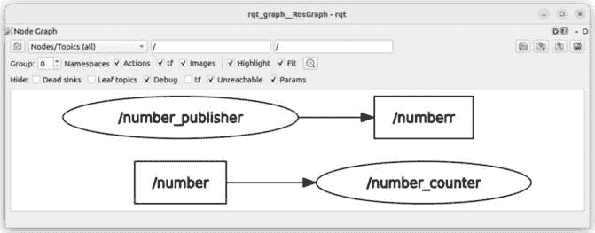
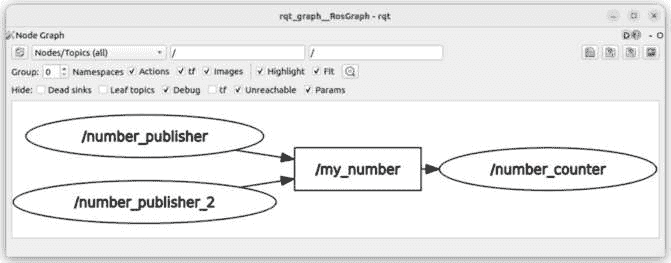
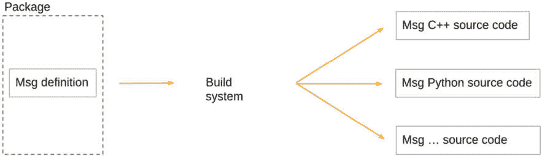

# 第五章：主题 – 在节点之间发送和接收消息

现在你能够编写节点了，你如何让多个节点相互通信，以及如何与应用程序中的现有节点交互？

ROS 2 中有三种通信方式：主题、服务和动作。在本章中，我们将深入研究 ROS 2 主题。

为了理解主题是如何工作的，我们将从现实生活中的类比开始。这将帮助你利用现有的和常见的知识来掌握这个概念。然后，你将深入代码，在节点内部编写一个发布者和一个订阅者——首先使用现有的接口，然后通过构建自定义接口。你还将使用 ROS 2 工具，如 **ros2** 命令行和 **rqt_graph** 来检查主题并解锁更多功能。

到本章结束时，你将能够使用 ROS 2 主题让你的节点相互通信。你将通过编写代码来学习，并在本章末尾提供额外的挑战。

主题在 ROS 2 中无处不在。无论你希望从头开始创建一个应用程序还是使用现有的 ROS 插件，你都将不得不使用主题。

我们将使用本书 GitHub 仓库中 **ch4** 文件夹内的代码([`github.com/PacktPublishing/ROS-2-from-Scratch`](https://github.com/PacktPublishing/ROS-2-from-Scratch))作为起点。你可以在 **ch5** 文件夹中找到最终代码。

本章将涵盖以下主题：

+   ROS 2 主题是什么？

+   编写主题发布者

+   编写主题订阅者

+   处理主题的附加工具

+   为主题创建自定义接口

+   主题挑战 – 闭环控制

# ROS 2 主题是什么？

你通过在 *第三章* 中的动手实验发现了主题的概念。通过这个，你应该对事物是如何工作的有一个基本的直觉。

我现在将从零开始再次解释主题——不是通过运行代码，而是通过使用使理解更简单的现实生活类比。我们将逐步构建一个示例，然后总结最重要的要点。

## 发布者和订阅者

对于这个类比，我将使用无线电发射机和接收机。由于这是一个简化的例子，我说的关于无线电的每一件事可能都不完全正确，但这里的重点是理解 ROS 2 主题。

让我们从一台无线电发射机开始。这台无线电发射机将在指定的频率上发送一些数据。为了便于人们记忆，这个频率通常用一个数字表示，例如 *98.7*。我们甚至可以把 *98.7* 看作一个名字。如果你想收听广播，你知道你需要将你的设备连接到 *98.7*。

在这种情况下，我们可以这样说，*98.7* 是一个主题。这个主题上的无线电发射机是一个 **发布者**：



图 5.1 – 无线电发射机向 98.7 主题发布

现在，假设你想用你的手机收听那台收音机。你将要求你的手机连接到 *98.7* 来接收数据。

通过这个类比，手机就是 *98.7* 主题的 **订阅者**。

这里需要注意的一个重要事项是，无线电发射台和手机必须使用相同类型的频率。例如，如果无线电发射台使用调幅信号，而手机试图解码调频信号，那么它将不起作用。

类似地，在 ROS 2 主题中，发布者和订阅者必须使用相同的数据类型。这种数据类型被称为 **接口**。

这就是定义主题的内容：一个 **名称** 和一个接口：


图 5.2 – 使用相同接口的发布者和订阅者

这样，通信就完成了。无线电发射台在 *98.7* 主题上发布调幅信号。电话订阅 *98.7* 主题，解码调幅信号。

## 多个发布者和订阅者

在现实生活中，不会只有一个设备试图收听广播。让我们添加一些更多的设备，每个设备都订阅 *98.7* 主题并解码调幅信号：



图 5.3 – 具有多个订阅者的主题

如您所见，一个主题可以有多个订阅者。每个订阅者都会得到相同的数据。另一方面，我们也可以为同一个主题有多个发布者。

想象一下，还有一个无线电发射台，也在向 *98.7* 发送调幅信号。在这种情况下，来自第一个发射台和第二个发射台的数据都被所有收听设备接收：



图 5.4 – 多个发布者和订阅者

前面的图中显示了方框。每个方框代表一个节点。因此，我们有两个无线电发射台节点，都包含一个向 *98.7* 主题发布的发布者。我们还有三个节点（电话、收音机和汽车），每个节点都包含一个 *98.7* 的订阅者。

注意，一个订阅者并不知道其他订阅者。当你用手机收听广播时，你不知道还有谁在收听广播，以及他们在什么设备上。

此外，电话、收音机和汽车并不知道谁在广播。它们只知道它们需要订阅 *98.7*；它们不知道背后是什么。

在另一边，两个无线电发射台并不知道彼此以及谁在接收数据。它们只是在主题上发布，不管谁在收听。因此，我们说主题是 **匿名的**。发布者和订阅者并不知道其他发布者和订阅者。他们只通过名称和接口发布或订阅主题。

发布者和订阅者的任何组合都是可能的。例如，你可以在一个主题上有两个发布者而没有订阅者。在这种情况下，数据仍然被正确发布，但没有人为其接收。或者，你也可以有零个发布者和一个或多个订阅者。订阅者将监听主题，但不会收到任何内容。

## 一个节点内部有多个发布者和订阅者

节点不仅限于只有一个发布者或一个订阅者。

让我们在我们的例子中添加另一个无线电。我们将命名为*101.3*，其数据类型为 FM 信号。

第二个无线电发射器现在同时在*98.7*主题和*101.3*主题上发布，为每个主题发送适当类型的数据。让我们也让汽车监听*101.3*主题：



图 5.5 – 具有两个发布者的节点

如你所见，第二个无线电发射器可以在多个主题上发布，只要它为每个主题使用正确的名称和接口。

现在，想象一下，当汽车在收听广播的同时，也将它的 GPS 坐标发送到一个远程服务器。我们可以创建一个名为**car_location**的主题，其接口将包含纬度和经度。汽车节点现在包含一个订阅*98.7*主题的订阅者，和一个发布**car_location**主题的发布者：



图 5.6 – 具有发布者和订阅者的节点

在前面的图中，我还为服务器添加了另一个节点，用一台计算机表示。服务器节点将订阅**car_location**主题，以便接收 GPS 坐标。当然，发布者和订阅者都在使用相同的接口（纬度和经度）。

因此，在一个节点内部，你可以有任意数量的发布者和订阅者，针对不同主题和不同数据类型。一个节点可以同时与多个节点通信。

## 总结

ROS 2 节点可以使用主题向其他节点发送消息。

主题主要用于发送数据流。例如，你可以为相机传感器创建一个硬件驱动程序，并发布从相机拍摄的照片。其他节点可以订阅该主题并接收照片。你也可以发布一个用于机器人移动的命令流，等等。

使用主题的可能性有很多，随着你在本书中的进展，你会了解更多关于它们的信息。

以下是关于主题如何工作的一些重要点：

+   主题由一个名称和一个接口定义。

+   主题名称必须以字母开头，可以跟其他字母、数字、下划线、波浪符和斜杠。对于与无线电的真实类比，我使用了带点的数字作为主题名称。虽然这使例子更容易理解，但这对于 ROS 2 主题是不适用的。为了使其有效，我们不应该使用*98.7*，而应该创建一个名为`radio_98_7`的主题。

+   任何主题的发布者或订阅者都必须使用相同的接口。

+   发布者和订阅者是匿名的。它们不知道彼此；它们只知道它们正在发布或订阅一个主题。

+   一个节点可以包含多个不同主题的发布者和订阅者。

现在如何创建发布者或订阅者？

你将通过向你的节点添加一些代码来完成这项工作。正如你之前看到的，你可以使用**rclpy**编写 Python 节点，使用**rclcpp**编写 C++节点。使用这两个库，你可以在你的节点中直接创建发布者和订阅者。

# 编写主题发布者

在本节中，你将编写你的第一个 ROS 2 发布者。为了处理核心概念，我们将创建一个新的 ROS 2 应用程序，并在接下来的章节中在此基础上构建。这个应用程序将非常简约，这样我们就可以专注于我们想要学习的概念，其他什么都不考虑。

我们现在想要做的是就一个主题发布一个数字。这个主题是新的，我们将*创建*它。你实际上并不是创建一个主题——你创建的是对该主题的发布者或订阅者。这将自动创建主题名称，该名称将在图中注册。

要编写发布者，我们需要一个节点。我们可以使用上一章中创建的第一个节点，但节点的目的并不相同。因此，我们将创建一个新的节点，命名为**number_publisher**。在这个节点中，我们将创建一个发布者。至于我们想要发布的主题，我们必须选择一个名称和接口。

现在，让我们开始使用 Python。

## 编写 Python 发布者

要编写发布者，我们需要创建一个节点；要创建节点，我们需要一个包。为了简化事情，让我们继续使用**my_py_pkg**包。

### 创建一个节点

在**my_py_pkg**包内部导航，创建一个 Python 文件，并使其可执行：

```py
$ cd ~/ros2_ws/src/my_py_pkg/my_py_pkg/
$ touch number_publisher.py
$ chmod +x number_publisher.py
```

现在，打开这个文件，使用节点 OOP 模板（在*第四章*中给出），并修改所需的字段，以给出有意义的名称：

```py
#!/usr/bin/env python3
import rclpy
from rclpy.node import Node
class NumberPublisherNode(Node):
    def __init__(self):
        super().__init__("number_publisher")
def main(args=None):
    rclpy.init(args=args)
    node = NumberPublisherNode()
    rclpy.spin(node)
    rclpy.shutdown()
if __name__ == "__main__":
    main()
```

现在你已经有了你的节点的主函数和**NumberPublisherNode**类，我们可以创建一个发布者。

### 在节点中添加发布者

我们在哪里可以创建一个发布者？我们将在构造函数中完成这项工作。

在我们编写代码之前，我们需要问自己一个问题：这个主题的名称和接口是什么？

+   **情况 1**：你正在向一个已存在的主题发布（该主题的其他发布者或订阅者），然后你使用相同的名称和接口

+   **情况 2**：你为一个新的主题创建发布者（我们现在正在做），然后你必须选择一个名称和接口

对于名称，让我们保持简单，使用**number**。如果我们发布一个数字，我们可以在**number**主题上期望接收到这个数字。如果你要发布温度，你可以将主题命名为**temperature**。

对于接口，你有两个选择：使用现有的接口或创建一个自定义接口。为了开始，我们将使用现有的接口。为了使这个过程更简单，我将直接告诉你使用什么；你将在以后自己学习如何找到其他接口。

让我们使用**example_interfaces/msg/Int64**。要获取接口中包含的更多详细信息，我们可以在终端中运行**ros2 interface show <interface_name>**：

```py
$ ros2 interface show example_interfaces/msg/Int64
# Some comments
int64 data
```

太好了——这正是我们需要的：一个**int64**数字。

现在我们有了这些信息，让我们创建发布者。首先，导入接口，然后在构造函数中创建发布者：

```py
import rclpy
from rclpy.node import Node
from example_interfaces.msg import Int64
class NumberPublisherNode(Node):
    def __init__(self):
        super().__init__("number_publisher")
        self.number_publisher_ = self.create_publisher(Int64, "number", 10)
```

要导入接口，我们必须指定包的名称（**example_interfaces**），然后是主题消息的文件夹名称（**msg**），最后是接口的类（**Int64**）。

要创建发布者，我们必须使用**Node**类的**create_publisher()**方法。从该类继承使我们能够访问所有 ROS 2 功能。在这个方法中，你必须提供三个参数：

+   来自`example_interfaces`包的`Int64`。

+   `number`。

+   每次使用`10`。

这样，我们现在在**number**主题上有一个发布者。然而，如果你只是这样运行你的代码，什么也不会发生。发布者不会自动在主题上发布。你必须编写代码来实现这一点。

### 使用计时器发布

在机器人技术中，一个常见的做法是每**Y**秒执行**X**个动作——例如，每**0.5**秒从摄像头发布一张图像，或者在这种情况下，每**1.0**秒在主题上发布一个数字。如第四章中所示，为了做到这一点，你必须实现一个计时器和回调函数。

修改节点内的代码，以便在计时器回调中发布到主题：

```py
def __init__(self):
    super().__init__("number_publisher")
    self.number_ = 2
    self.number_publisher_ = self.create_publisher(Int64, "number", 10)
    self.number_timer_ = self.create_timer(1.0, self.publish_number)
    self.get_logger().info("Number publisher has been started.")
def publish_number(self):
    msg = Int64()
    msg.data = self.number_
    self.number_publisher_.publish(msg)
```

在使用**self.create_publisher()**创建发布者后，我们使用**self.create_timer()**创建一个计时器。在这里，我们说我们希望每**1.0**秒调用一次**publish_number()**方法。这将在节点旋转时发生。

此外，我在构造函数的末尾添加了一个日志，说明节点已启动。我通常这样做作为最佳实践，这样我就可以在终端上看到节点何时完全初始化。

在**publish_number()**方法中，我们在主题上发布：

1.  我们从`Int64`类创建一个对象。这就是接口——换句话说，是要发送的消息。

1.  此对象包含一个`data`字段。我们是如何知道这个的？我们之前在运行`ros2 interface show example_interfaces/msg/Int64`时找到了这个。因此，我们在消息的`data`字段中提供一个数字。为了简单起见，我们每次运行回调函数时都指定相同的数字。

1.  我们使用发布者的`publish()`方法发布消息。

这种代码结构在 ROS 2 中非常常见。每次你想从传感器发布数据时，你都会编写类似的内容。

### 构建发布者

要尝试你的代码，你需要安装节点。

在我们这样做之前，由于我们使用了一个新的依赖项（**example_interfaces** 包），我们还需要向 **my_py_pkg** 包的 **package.xml** 文件中添加一行：

```py
<depend>rclpy</depend>
<depend>example_interfaces</depend>
```

随着您在包内添加更多功能，您将在这里添加任何其他 ROS 2 依赖项。

要安装节点，打开 **my_py_pkg** 包中的 **setup.py** 文件并添加一行以创建另一个可执行文件：

```py
entry_points={
    'console_scripts': [
        "test_node = my_py_pkg.my_first_node:main",
        "number_publisher = my_py_pkg.number_publisher:main"
    ],
},
```

确保在每一行之间添加一个逗号；否则，在构建包时可能会遇到一些奇怪的错误。

在这里，我们创建了一个名为 **number_publisher** 的新可执行文件。

注意

这次，如您从这个示例中看到的那样，节点名称、文件名和可执行文件名是相同的：`number_publisher`。这是一件常见的事情。只需记住，这些名称代表三件不同的事情。

现在，前往您的工作空间根目录并构建 **my_py_pkg** 包：

```py
$ cd ~/ros2_ws/
$ colcon build --packages-select my_py_pkg
```

如果您想，可以添加 **--symlink-install**，这样您就不需要每次修改 **number_publisher** 节点时都运行 **colcon build**。

### 运行发布者

在包成功构建后，源工作空间并启动节点：

```py
$ source install/setup.bash # or source ~/.bashrc
$ ros2 run my_py_pkg number_publisher
[INFO] [1711526444.403883187] [number_publisher]: Number publisher has been started.
```

节点正在运行，但除了初始日志外，没有显示任何内容。这是正常的——我们没有要求节点打印其他任何内容。

我们如何知道发布者正在工作？我们可以立即编写一个订阅者节点并查看我们是否收到消息。但在我们这样做之前，我们可以直接从终端测试发布者。

打开一个新的终端窗口并列出所有主题：

```py
$ ros2 topic list
/number
/parameter_events
/rosout
```

在这里，您可以找到 **/****number** 主题。

注意

如您所见，主题名称前增加了一个前置斜杠。我们在代码中只写了 `number`，而不是 `/number`。这是因为 ROS 2 名称（节点、主题等）是在命名空间内组织的。稍后，我们将看到您可以为所有主题或节点添加一个命名空间，例如放入 `/abc` 命名空间中。在这种情况下，主题名称将是 `/abc/number`。在这里，因为没有提供命名空间，所以名称前添加了一个前置斜杠，即使我们在代码中没有提供它。我们可以称这为 *全局* 命名空间。

使用 **ros2 topic echo <topic_name>** 命令，您可以直接从订阅者订阅主题并查看正在发布的内容。我们将在本章后面了解更多关于这个命令的信息：

```py
$ ros2 topic echo /number
data: 2
---
data: 2
---
```

如您所见，我们每秒得到一条新消息，其中包含一个值为 **2** 的 **data** 字段。这正是我们在代码中想要做的。

这样，我们就完成了我们的第一个 Python 发布者。让我们切换到 C++。

## 编写 C++ 发布者

在这里，过程与 Python 相同。我们将创建一个新的节点，并在该节点中添加一个发布者和计时器。在计时器回调函数中，我们将创建一个消息并发布它。

我会在这一节中稍微快一点，因为解释是相同的。我们只需关注 ROS 2 中 C++ 语法的具体性。

注意

对于本书中与 C++相关的所有内容，请确保你遵循使用 GitHub 代码旁边的解释。我可能不会提供完整的代码，只提供对理解至关重要的重要片段。

### 创建一个带有发布者和计时器的节点

首先，让我们在**my_cpp_pkg**包中为我们的**number_publisher**节点创建一个新的文件：

```py
$ cd ~/ros2_ws/src/my_cpp_pkg/src/
$ touch number_publisher.cpp
```

打开这个文件并编写节点的代码。你可以从 OOP 模板开始，添加发布者、计时器和回调函数。本章的完整代码可以在本书的 GitHub 仓库中找到：[`github.com/PacktPublishing/ROS-2-from-Scratch`](https://github.com/PacktPublishing/ROS-2-from-Scratch)。

我现在将对几行重要的代码进行注释：

```py
#include "rclcpp/rclcpp.hpp"
#include "example_interfaces/msg/int64.hpp"
```

要包含一个主题的接口，使用**"<package_name>/msg/<message_name>.hpp"**。

然后，在构造函数中添加以下内容：

```py
number_publisher_ = this->create_publisher<example_interfaces::msg::Int64>("number", 10);
```

在 C++中，我们也使用**Node**类的**create_publisher()**方法。由于使用了模板，语法略有不同，但你仍然可以找到主题接口、主题名称和队列大小（作为提醒，你可以每次都设置为**10**）。

发布者也在类中声明为私有属性：

```py
rclcpp::Publisher<example_interfaces::msg::Int64>::SharedPtr number_publisher_;
```

如你所见，我们使用了**rclcpp::Publisher**类，对于 ROS 2 中的许多事物，我们使用共享指针。对于几个常见的类，ROS 2 提供了**::SharedPtr**，这和写**std::shared_ptr<the publisher>**是同一回事。

让我们回到构造函数：

```py
number_timer_ = this->create_wall_timer(std::chrono::seconds(1), std::bind(&NumberPublisherNode::publishNumber, this));
RCLCPP_INFO(this->get_logger(), "Number publisher has been started.");
```

在创建发布者之后，我们创建一个计时器，每**1.0**秒调用一次**publishNumber**方法。最后，我们打印一条日志，以便我们知道构造函数代码已被执行：

```py
void publishNumber()
{
    auto msg = example_interfaces::msg::Int64();
    msg.data = number_;
    number_publisher_->publish(msg);
}
```

这是回调方法。至于 Python，我们从接口类创建一个对象，然后填充这个接口的任何字段并发布消息。

### 构建和运行发布者

一旦你写好了带有发布者、计时器和回调函数的节点，就是时候构建它了。

就像我们对 Python 所做的那样，打开**my_cpp_pkg**包的**package.xml**文件，并为**example_interfaces**依赖项添加一行：

```py
<depend>rclcpp</depend>
<depend>example_interfaces</depend>
```

然后，从**my_cpp_pkg**包中打开**CMakeLists.txt**文件并添加以下行：

```py
find_package(rclcpp REQUIRED)
find_package(example_interfaces REQUIRED)
add_executable(test_node src/my_first_node.cpp)
ament_target_dependencies(test_node rclcpp)
add_executable(number_publisher src/number_publisher.cpp)
ament_target_dependencies(number_publisher rclcpp example_interfaces)
install(TARGETS
  test_node
  number_publisher
  DESTINATION lib/${PROJECT_NAME}/
)
```

对于任何新的依赖项，我们需要添加一个新的**find_package()**行。

然后，我们创建一个新的可执行文件。请注意，我们还在**ament_target_dependencies()**的参数中提供了**example_interfaces**。如果你省略了这个，你将在编译时遇到错误。

最后，没有必要重新创建**install()**块。只需在新的一行中添加可执行文件，行与行之间不要有任何逗号。

现在，你可以构建、源和运行：

```py
$ cd ~/ros2_ws/
$ colcon build --packages-select my_cpp_pkg
$ source install/setup.bash
$ ros2 run my_cpp_pkg number_publisher
[INFO] [1711528108.225880935] [number_publisher]: Number publisher has been started.
```

包含发布者的节点正在运行。通过使用**ros2 topic list**和**ros2 topic echo <topic_name>**，你可以找到主题并查看正在发布的内容。

现在你已经创建了一个发布者并且知道它在工作，是时候学习如何为该主题创建一个订阅者了。

# 编写主题订阅者

为了继续改进我们的应用程序，让我们创建一个新的节点，该节点将订阅**/number**主题。接收到的每个数字都将添加到计数器中。我们希望在计数器更新时打印计数器。

正如我们之前所做的那样，让我们先用 Python 进行完整解释，然后看看 C++的语法特性。

## 编写 Python 订阅者

你可以在 GitHub 上找到这个 Python 节点的完整代码。这里我们需要做的许多事情与之前所做的相同，所以我不将每一步都详细说明。相反，我们将关注最重要的事情，以便我们可以编写订阅者。

### 创建具有订阅者的 Python 节点

在**my_py_pkg**包内创建一个名为**number_counter**的新节点：

```py
$ cd ~/ros2_ws/src/my_py_pkg/my_py_pkg/
$ touch number_counter.py
$ chmod +x number_counter.py
```

在这个文件中，你可以编写节点的代码并添加一个订阅者。以下是逐步解释：

```py
#!/usr/bin/env python3
import rclpy
from rclpy.node import Node
from example_interfaces.msg import Int64
```

由于我们想要创建一个订阅者来接收我们通过发布者发送的内容，因此我们需要使用相同的接口。因此，我们也导入**Int64**。然后，我们可以创建订阅者：

```py
class NumberCounterNode(Node):
    def __init__(self):
        super().__init__("number_counter")
        self.counter_ = 0
        self.number_subscriber_ = self.create_subscription(Int64, "number", self.callback_number, 10)
       self.get_logger().info("Number Counter has been started.")
```

对于发布者，我们将在节点的构造函数中创建订阅者。在这里，我们使用**Node**类的**create_subscription()**方法。使用此方法时，你需要提供四个参数：

+   `Int64`。这需要发布者和订阅者都相同。

+   `number`。这与发布者的名称相同。注意，我这里没有提供任何额外的斜杠。这将被自动添加，因此主题名称将是`/number`。

+   当接收到**/number**主题时，它将在这里被接收，我们将在回调方法（我们需要实现的方法）内部使用它和处理它。

+   `10`并暂时忘记它。

现在，让我们看看回调方法的实现，我将它命名为**callback_number**：

注意

作为最佳实践，我建议为主题命名回调方法为`callback_<topic>`。通过添加`callback_`前缀，你可以清楚地表明这是一个回调方法，不应该在代码中直接调用。这可以防止未来出现许多错误。

```py
def callback_number(self, msg: Int64):
    self.counter_ += msg.data
    self.get_logger().info("Counter:  " + str(self.counter_))
```

在订阅者回调中，你直接在函数的参数中接收消息。由于我们知道**Int64**包含一个**data**字段，我们可以使用**msg.data**来访问它。

现在，我们将接收到的数字添加到**counter_**属性中，并使用 ROS 2 日志在每次更新时打印计数器。

注意

作为最佳实践，我已经指定了方法的`msg`参数的`Int64`类型。这对于 Python 代码工作不是强制性的，但它增加了额外的安全级别（我们确信我们应该接收`Int64`而不是其他任何东西），有时它可以使你的 IDE 在自动完成时工作得更好。

要完成节点，别忘了在**NumberCounterNode**类之后添加**main()**函数。

### 运行 Python 订阅者

现在，为了尝试代码，向你的 Python 包的**setup.py**文件中添加一个新的可执行文件：

```py
entry_points={
    'console_scripts': [
        "test_node = my_py_pkg.my_first_node:main",
        "number_publisher = my_py_pkg.number_publisher:main",
        "number_counter = my_py_pkg.number_counter:main"
    ],
},
```

然后，构建包并源码化工作空间（从现在起，我将不会每次都写这些命令，因为它们总是相同的）。

现在，在不同的终端中运行每个节点（**number_publisher** 和 **number_counter**）。

```py
$ ros2 run my_py_pkg number_publisher
[INFO] [1711529824.816514561] [number_publisher]: Number publisher has been started.
$ ros2 run my_py_pkg number_counter
[INFO] [1711528797.363370081] [number_counter]: Number Counter has been started.
[INFO] [1711528815.739270510] [number_counter]: Counter:  2
[INFO] [1711528816.739186942] [number_counter]: Counter:  4
[INFO] [1711528817.739050485] [number_counter]: Counter:  6
[INFO] [1711528818.738992607] [number_counter]: Counter:  8
```

如你所见，**number_counter** 节点每 **1.0** 秒将 **2** 添加到计数器中。如果你看到这个，那么你两个节点之间的发布/订阅通信是正常工作的。

你可以启动和停止 **number_publisher** 节点，并看到每次启动它时，**number_counter** 都会从当前计数继续添加数字。

## 编写 C++ 订阅者

让我们在 C++ 中创建一个 **number_counter** 节点。原理是相同的，所以我们只需关注这里的语法。

### 创建一个具有订阅者的 C++ 节点

为你的节点创建一个新文件：

```py
$ cd ~/ros2_ws/src/my_cpp_pkg/src/
$ touch number_counter.cpp
```

打开此文件并编写节点的代码（再次提醒，完整的代码在 GitHub 上）。

要在你的节点中创建一个订阅者，请运行以下代码：

```py
number_subscriber_ = this->create_subscription<example_interfaces::msg::Int64>(
           "number",
           10,
           std::bind(&NumberCounterNode::callbackNumber, this, _1));
```

我们找到了与 Python 相同的组件（但顺序不同）：主题接口、主题名称、队列大小和接收消息的回调。为了 **_1** 能正常工作，别忘了在它之前添加 **using namespace std::placeholders;**。

注意

即使 `rclpy` 和 `rclcpp` 库应该基于相同的底层代码，API 之间仍然可能存在一些差异。如果代码有时在 Python 和 C++ 之间看起来不同，请不要担心。

订阅者对象被声明为一个私有属性：

```py
rclcpp::Subscription<example_interfaces::msg::Int64>::SharedPtr number_subscriber_;
```

我们在这里使用的是 **rclcpp::Subscription** 类，并且再次创建了一个指向该对象的智能指针。

然后，我们有回调方法，**callbackNumber**：

```py
void callbackNumber(const example_interfaces::msg::Int64::SharedPtr msg)
{
    counter_ += msg->data;
    RCLCPP_INFO(this->get_logger(), "Counter: %d", counter_);
}
```

在回调中接收到的消息也是一个（**const**）智能指针。因此，在访问 **data** 字段时，别忘了使用 **->**。

在这个回调中，我们将接收到的数字添加到计数器中并打印出来。

### 运行 C++ 订阅者

为该节点创建一个新的可执行文件。打开 **CMakeLists.txt** 并添加以下代码：

```py
add_executable(number_counter src/number_counter.cpp)
ament_target_dependencies(number_counter rclcpp example_interfaces)
install(TARGETS
  test_node
  number_publisher
  number_counter
  DESTINATION lib/${PROJECT_NAME}/
)
```

然后，构建 **my_cpp_pkg**，源码化工作空间，并在不同的终端中运行发布者和订阅者节点。你应该会看到与使用 Python 时类似的输出。

## 同时运行 Python 和 C++ 节点

我们刚刚为 Python 和 C++ 都创建了一个发布者和订阅者。我们使用的主题具有相同的名称（**number**）和接口（**example_interfaces/msg/Int64**）。

如果主题相同，这意味着你可以用 C++ 的 **number_counter** 节点启动 Python 的 **number_publisher** 节点，例如。

让我们验证一下：

```py
$ ros2 run my_py_pkg number_publisher
[INFO] [1711597703.615546913] [number_publisher]: Number publisher has been started.
$ ros2 run my_cpp_pkg number_counter
[INFO] [1711597740.879160448] [number_counter]: Number Counter has been started.
[INFO] [1711597741.607444197] [number_counter]: Counter: 2
[INFO] [1711597742.607408224] [number_counter]: Counter: 4
```

你也可以尝试相反的操作，通过运行 C++ 的 **number_publisher** 节点与 Python 的 **number_counter** 节点。

为什么它会工作？简单来说，因为 ROS 2 是语言无关的。你可以用任何（支持的）编程语言编写任何节点，并且这个节点可以与网络中的所有其他节点通信，使用主题和其他 ROS 2 通信。

ROS 2 通信在较低级别发生，使用**数据分发服务**（**DDS**）。这是中间件部分，负责在节点之间发送和接收消息。当你编写 Python 或 C++节点时，你正在使用相同的 DDS 功能，API 在**rclpy**或**rclcpp**中实现。

我不会对这个解释过于深入，因为它相当高级，并且并不真正属于这本书的范围。如果你从这个中只记住一件事，那就是 Python 和 C++节点可以使用 ROS 2 通信功能相互通信。你可以在 Python 中创建一些节点，在 C++中创建其他节点；只需确保在两边使用相同的通信名称和接口。

# 处理主题的附加工具

你已经编写了一组包含发布者和订阅者的节点。现在我们将探索 ROS 2 工具如何帮助你使用主题做更多的事情。

我们将探索以下主题：

+   使用`rqt_graph`进行自省

+   使用`ros2 topic`命令行进行自省和调试

+   在启动节点时更改主题名称

+   使用 bags 重放主题数据

## 使用 rqt_graph 自省主题

我们使用**rqt_graph**在*第三章*中可视化节点。让我们再次运行它，看看如何自省我们刚刚创建的发布者和订阅者。

首先，启动**number_publisher**和**number_counter**节点（从任何包：**my_py_pkg**或**my_cpp_pkg**）。

然后，在另一个终端中启动**rqt_graph**：

```py
$ rqt_graph
```

如果需要，刷新视图几次，并选择**节点/主题（全部）**。你也可以取消选择**死端**框和**叶主题**框。这将允许你看到主题，即使只有一个订阅者没有发布者，或者只有一个发布者没有订阅者：



图 5.7 – rqt_graph 上的数字主题

在那里，我们可以看到**number_publisher**节点和**number_counter**节点。中间是**/number**主题，我们可以看到哪个节点是发布者或订阅者。

**rqt_graph**包在调试主题时可以非常有用。想象一下，你运行了一些节点，你想知道为什么主题消息没有被订阅者接收。可能这些节点没有使用相同的主题名称。你可以很容易地用**rqt_graph**看到这一点：



图 5.8 – 发布者和订阅者之间的主题名称不匹配

在这个例子中，我在发布者内部的主题名称中故意犯了一个错误。我应该写**number**，但我写了**numberr**。使用**rqt_graph**，我可以看到问题所在。这两个节点没有相互通信。

## ros2 topic 命令行

使用**ros2 node**，我们为节点获得了额外的命令行工具。对于主题，我们将使用**ros2 topic**。

如果你运行**ros2 topic -h**，你会看到有很多命令。你已经知道其中的一些。在这里，我将快速回顾一下，并探索一些在调试主题时可能有用的更多命令。

首先，要列出所有主题，使用**ros2 topic list**：

```py
$ ros2 topic list
/number
/parameter_events
/rosout
```

如你所见，我们得到了**/number**主题。你还会始终得到**/parameter_events**和**/rosout**（所有 ROS 2 日志都发布在这个主题上）。

使用**ros2 topic info <topic_name>**，你可以获取该主题的接口，以及该主题的发布者和订阅者数量：

```py
$ ros2 topic info /number
Type: example_interfaces/msg/Int64
Publisher count: 1
Subscription count: 1
```

然后，为了进一步查看接口的详细信息，你可以运行以下命令：

```py
$ ros2 interface show example_interfaces/msg/Int64
# some comments
int64 data
```

使用这个命令，我们就有了创建附加发布者或订阅者所需的所有信息。

此外，我们还可以直接使用**ros2 topic echo <topic_name>**从终端订阅主题。这就是我们在编写发布者之后所做的那样，以确保在编写任何订阅者之前它能够正常工作：

```py
$ ros2 topic echo /number
data: 2
---
data: 2
---
```

另一方面，你可以直接从终端向主题发布消息，使用**ros2 topic pub -r <frequency> <topic_name> <interface> <message_in_json>**。为了测试这个，停止所有节点，并在一个终端中只启动**number_counter**节点。除了第一条日志外，不会打印任何内容。然后，在另一个终端中运行以下命令：

```py
$ ros2 topic pub -r 2.0 /number example_interfaces/msg/Int64 \"{data: 7}"
publisher: beginning loop
publishing #1: example_interfaces.msg.Int64(data=7)
publishing #2: example_interfaces.msg.Int64(data=7)
```

这将在**/number**主题上以**2.0**赫兹（每**0.5**秒）发布。当你运行这个命令时，你会在**number_counter**节点上看到一些日志，这意味着消息已经被接收：

```py
[INFO] [1711600360.459298369] [number_counter]: Counter: 7
[INFO] [1711600360.960216275] [number_counter]: Counter: 14
[INFO] [1711600361.459896877] [number_counter]: Counter: 21
```

这样，你可以在不先写一个发布者的情况下测试一个订阅者。请注意，这仅适用于具有简单接口的主题。当接口包含太多字段时，在终端上写所有内容会变得过于复杂。

注意

`ros2 topic echo`和`ros2 topic pub`都可以节省你很多时间，这对于与其他人合作进行项目也非常有用。你可以负责编写发布者，而其他人则编写订阅者。使用这些命令行工具，你们两个人都可以确保主题通信正常工作。然后，当你一起运行这两个节点时，你知道你发送或接收的数据是正确的。

## 在运行时更改主题名称

在*第四章*中，你学习了如何在运行时更改节点名称——即通过在**ros2 run**命令后添加**--ros-args -r __node:=<new_name>**。

因此，在`ros2 run`之后传递的任何附加参数，都添加`**--ros-args**`，但只需添加一次。

然后，你还可以在运行时更改主题名称。为此，添加另一个**-r**，后跟**<topic_name>:=<new_topic_name>**。

例如，让我们将我们的主题从**number**重命名为**my_number**：

```py
$ ros2 run my_py_pkg number_publisher --ros-args -r number:=my_number
```

现在，如果我们启动**number_counter**节点，为了能够接收消息，我们还需要修改主题名称：

```py
$ ros2 run my_py_pkg number_counter --ros-args -r number:=my_number
```

使用这个命令，通信将正常工作，但这次使用的是**my_number**主题。

为了让事情更有趣，让我们让这两个节点继续运行，并运行另一个发布者到这个主题，使用相同的**number_publisher**节点。正如你所知，我们不能有两个节点使用相同的名称。因此，我们必须重命名节点和主题。在第三个终端中，运行以下代码：

```py
$ ros2 run my_py_pkg number_publisher --ros-args -r \ __node:=number_publisher_2 -r number:=my_number
```

运行此命令后，你会发现**number_counter**接收消息的速度是原来的两倍，因为有两个节点每**1.0**秒发布一条消息。

此外，让我们启动**rqt_graph**：



图 5.9 – 两个发布者和一个订阅者，主题已重命名

我们会看到有两个节点在**my_number**主题上有一个发布者，还有一个节点有一个订阅者。

在运行时更改主题名称将对你非常有用，特别是当你想运行几个无法修改的现有节点时。即使你不能重写代码，你也可以在运行时修改名称。现在，让我们继续使用工具并探索 ROS 2 bags。

## 使用 bags 回放主题数据

想象这样一个场景：你正在为一个移动机器人工作，该机器人在户外导航时以及下雨时应该以某种方式表现。

现在，这意味着你需要在这些条件下运行机器人，以便你可以开发你的应用程序。有几个问题：你可能不会每次都能接触到机器人，或者你不能将它带出去，或者它并不是每天都下雨。

解决这个问题的方法是使用 ROS 2 bags。Bags 允许你记录一个主题并在以后回放它。因此，你可以一次在所需条件下运行实验，然后回放数据，就像它被记录下来一样。有了这些数据，你可以开发你的应用程序。

让我们考虑另一个场景：你与一个还不稳定的硬件一起工作。大多数时候，它不能正常工作。你可以在硬件正常工作时记录一个 bags，然后回放这个 bags 来开发你的应用程序，而不是反复运行硬件并浪费时间。

要使用 ROS 2 bags，你必须使用**ros2 bag**命令行工具。让我们学习如何使用 bags 保存和回放一个主题。

首先，停止所有节点，只运行**number_publisher**节点。

我们已经知道主题名称是**/number**。如果需要，你可以使用**ros2 topic list**检索它。然后，在另一个终端中，使用**ros2 bag record <list of topics> -o <bag_name>**记录 bags。为了使事情更有条理，我建议你创建一个**bags**文件夹，并在该文件夹内进行记录：

```py
$ mkdir ~/bags
$ cd ~/bags/
$ ros2 bag record /number -o bag1
...
[INFO] [1711602240.190476880] [rosbag2_recorder]: Subscribed to topic '/number'
[INFO] [1711602240.190542569] [rosbag2_recorder]: Recording...
[INFO] [1711602240.190729185] [rosbag2_recorder]: All requested topics are subscribed. Stopping discovery...
```

到目前为止，bags 正在记录并保存数据库中所有传入的消息。让它运行几秒钟，然后使用*Ctrl* + *C*停止它：

```py
[INFO] [1711602269.786924027] [rosbag2_cpp]: Writing remaining messages from cache to the bag. It may take a while
[INFO] [1711602269.787416646] [rosbag2_recorder]: Event publisher thread: Exiting
[INFO] [1711602269.787547010] [rosbag2_recorder]: Recording stopped
```

**ros2 bag** 命令将退出，你将得到一个名为 **bag1** 的新目录。在这个目录中，你会找到一个包含记录消息的 **.mcap** 文件和一个包含更多信息的 YAML 文件。如果你打开这个 YAML 文件，你会看到记录的持续时间、记录的消息数量和记录的主题。

现在，你可以回放数据包，这意味着你将按照记录时的方式在主题上发布。

停止 **number_publisher** 节点，并使用 **ros2 bag play <path_to_bag>** 回放数据包：

```py
$ ros2 bag play ~/bags/bag1/
```

这将发布所有记录的消息，持续时间与记录相同。所以，如果你记录了 3 分 14 秒，数据包将回放主题 3 分 14 秒。然后，数据包将退出，如果你想再次播放，可以继续播放。

当数据包播放时，你可以运行你的订阅者。你可以使用 **ros2 topic echo /number** 来进行快速测试并查看数据。你还可以运行你的 **number_counter** 节点，你会看到消息被接收。

你现在可以使用 ROS 2 数据包来保存和回放一个主题。你可以使用 **ros2 bag -h** 来探索更多高级选项。

正如你所看到的，有很多可用的工具用于主题。尽可能多地使用这些工具来检查、调试和测试你的主题。它们将在你开发 ROS 2 应用程序时为你节省大量时间。

我们几乎完成了主题的学习。到目前为止，我们所做的一切都是使用现有接口。现在，让我们学习如何创建一个自定义接口。

# 为主题创建自定义接口

当为主题创建发布者或订阅者时，你知道你必须使用一个名称和一个接口。

发布或订阅现有主题非常简单：你将使用 **ros2** 命令行找到名称和接口，并在你的代码中使用它。

现在，如果你想为一个新的主题启动发布者或订阅者，你需要自己选择名称和接口：

+   **名称**：没问题——它只是一系列字符

+   **接口**：你有两个选择——使用与你的主题一起工作的现有接口或创建一个新的接口

让我们尝试应用 ROS 2 的哲学，即不重新发明轮子。当你创建一个新的主题时，检查是否有任何现有的接口可以满足你的需求。如果有，那么就使用它；不要重新创建。

首先，你会学习在哪里可以找到现有接口。然后，你会学习如何创建一个新的接口。

注意

在谈论主题接口时使用“消息”这个词是很常见的。我本可以把这个部分命名为“创建自定义消息”。在接下来的部分中，当我提到消息时，我指的是主题接口。

## 使用现有接口

在你为主题启动新的发布者或订阅者之前，花点时间思考你想要发送或接收哪种类型的数据。然后，检查是否已经存在的接口包含你所需要的内容。

### 接口的位置

就像节点一样，接口也是按包组织的。您可以在以下位置找到 ROS 2 接口最常见的包：[`github.com/ros2/common_interfaces`](https://github.com/ros2/common_interfaces)。这里并没有列出所有现有的接口，但已经相当多了。对于其他接口，简单的网络搜索应该会带您到相应的 GitHub 仓库。

在这个常见的接口仓库中，您可以在 **geometry_msgs** 包中找到我们与 Turtlesim 一起使用的 **Twist** 消息。如您所见，对于主题接口，我们随后有一个额外的 **msg** 文件夹，其中包含该包的所有消息定义。

现在，假设您想为相机创建一个驱动节点并将图像发布到主题。如果您查看 **sensor_msgs** 包，然后查看 **msg** 文件夹，您会找到一个名为 **Image.msg** 的文件。这个 *Image* 消息可能适合您的需求。它也被很多人使用，这将使您的生活更加容易。

### 在您的代码中使用现有接口

要使用此消息，请确保您已安装包含消息的包——在这种情况下，**sensor_msgs**。作为一个快速提醒，要安装 ROS 2 包，您可以在终端中运行 **sudo apt install ros-<distro>-<package-name>**：

```py
$ sudo apt install ros-jazzy-sensor-msgs
```

可能该包已经安装了。如果没有，安装后再次 source 您的环境。然后，您可以使用 **ros2 interface show <interface>** 命令找到有关接口的详细信息：

```py
$ ros2 interface show sensor_msgs/msg/Image
```

要在您的代码中使用此消息，只需遵循本章中我们所做的那样（使用 **example_interfaces/msg/Int64** 消息）：

1.  在您编写节点的包的 `package.xml` 文件中，添加对接口包的依赖。

1.  在您的代码中导入消息并在发布者或订阅者中使用它。

1.  仅限 C++：在 `CMakeLists.txt` 文件中将依赖项添加到接口包中。

在我们创建接口之后，很快我们就会看到这个过程的另一个例子。

到目前为止，您已经知道如何在代码中查找和使用现有的消息。但您是否应该总是这样做？

### 当不使用现有消息时

对于常见的用例、传感器和执行器，您可能会找到您需要的东西。然而，如果接口与您想要的完全不符，您将不得不创建一个新的接口。

有几个包包含基本接口，例如 **example_interfaces**，甚至 **std_msgs**。您可能会被诱惑在代码中使用它们。作为一个最佳实践，最好是避免这样做。只需阅读消息定义中的注释以确保这一点：

```py
$ ros2 interface show example_interfaces/msg/Int64
# This is an example message of using a primitive datatype, int64.
# If you want to test with this that's fine, but if you are deploying it into a system you should create a semantically meaningful message type.
# If you want to embed it in another message, use the primitive data type instead.
int64 data
$ ros2 interface show std_msgs/msg/Int64
# This was originally provided as an example message.
# It is deprecated as of Foxy
# It is recommended to create your own semantically meaningful message.
# However if you would like to continue using this please use the equivalent in example_msgs.
int64 data
```

如您所见，**std_msgs** 包已被弃用，而**example_interfaces** 仅推荐用于测试——这正是我们在本章到目前为止所做的一切，以帮助我们学习各种主题。

作为一般规则，如果您在现有的接口包中没有找到您需要的东西，那么就创建自己的接口。这并不难做，而且总是同一个过程。

## 创建一个新的主题接口

现在，你将创建你的第一个针对主题的自定义接口。我们将看到如何为该包设置，如何创建和构建接口，以及如何在我们的代码中使用它。

### 创建和设置接口包

在我们创建任何主题接口（消息）之前，我们需要创建一个新的包，并为其构建接口设置。作为一个最佳实践，在你的应用程序中，你将有一个专门用于自定义接口的包。这意味着你只在这个包中创建接口，并且你只保留这个包用于接口——没有节点或其他东西，只有接口。这将使你在扩展应用程序时更加容易，并帮助你避免创建依赖混乱。

在命名这个接口包时，一个常见的做法是以你的应用程序或机器人的名称开头，并添加 **_interfaces** 后缀。所以如果你的机器人命名为 **abc**，你应该使用 **abc_interfaces**。

在这个例子中我们没有机器人，所以我们只需将包命名为 **my_robot_interfaces**。

使用 **ament_cmake** 构建类型创建一个新的包，并且没有依赖项。你甚至不需要提供构建类型，因为 **ament_cmake** 是默认使用的。导航到你的工作空间的 **src** 目录并创建这个包：

```py
$ cd ~/ros2_ws/src/
$ ros2 pkg create my_robot_interfaces
```

到目前为止，你的工作空间应该包含三个包：**my_py_pkg**、**my_cpp_pkg** 和 **my_robot_interfaces**。

我们需要设置这个新包并修改一些设置，以便它可以构建消息。进入包中，删除 **src** 和 **include** 目录，并创建一个新的 **msg** 文件夹：

```py
$ cd my_robot_interfaces/
$ rm -r src/ include/
$ mkdir msg
```

现在，打开这个包的 **package.xml** 文件。在 **<buildtool_depend>ament_cmake</buildtool_depend>** 之后，添加以下三行。我建议你直接复制粘贴，以免出错：

```py
<build_depend>rosidl_default_generators</build_depend>
<exec_depend>rosidl_default_runtime</exec_depend>
<member_of_group>rosidl_interface_packages</member_of_group>
```

这样，**package.xml** 文件就完成了，你现在不需要对它做任何事情。打开 **CMakeLists.txt** 文件。在 **find_package(ament_cmake REQUIRED)** 之后，在 **ament_package()** 之前，添加以下几行（你也可以删除 **if(BUILD_TESTING)** 块）：

```py
find_package(rosidl_default_generators REQUIRED)
rosidl_generate_interfaces(${PROJECT_NAME}
  # we will add the name of our custom interfaces here
)
ament_export_dependencies(rosidl_default_runtime)
```

这些你添加的行并没有太多需要理解的。它们将找到一些依赖项（**rosidl** 包），并为你的包准备，以便它可以构建接口。

到目前为止，你的包已经准备好了，你可以添加新的接口。你只需要进行一次这个设置阶段。在这个阶段，添加一个新的接口非常快。

### 创建和构建一个新的主题接口

假设我们想要创建一个发布者来发送机器人的一些硬件状态，包括机器人版本、内部温度、一个标志来知道电机是否就绪，以及一个调试信息。

我们已经查看过现有的接口，但没有一个匹配。你该如何命名这个新的接口？以下是你必须遵循的规则：

+   使用大驼峰命名法——例如，HardwareStatus

+   不要在名称中使用`Msg`或`Interface`，因为这会增加不必要的冗余

+   使用 `.msg` 作为文件扩展名

按照这些规则，在**msg**文件夹中创建一个名为**HardwareStatus.msg**的新文件：

```py
$ cd ~/ros2_ws/src/my_robot_interfaces/msg/
$ touch HardwareStatus.msg
```

在这个文件中，我们可以添加消息的定义。以下是你可以使用的内容：

+   内置类型，如`bool`、`byte`、`int64`、`float64`和`string`，以及这些类型的数组。你可以在这里找到完整的列表：[`docs.ros.org/en/rolling/Concepts/Basic/About-Interfaces.html#field-types`](https://docs.ros.org/en/rolling/Concepts/Basic/About-Interfaces.html#field-types)。

+   其他现有消息，使用包名后跟消息名——例如，`geometry_msgs/Twist`（在此处不要添加`msg`文件夹）。

为了简化，我们在这里只使用内置类型。在消息文件中写入以下内容：

```py
int64 version
float64 temperature
bool are_motors_ready
string debug_message
```

对于每个字段，我们提供数据类型，然后是字段名。

现在，我们如何构建这个消息？我们如何获取一个 Python 或 C++类，我们可以将其包含并用于我们的代码中？

要构建消息，你只需在**CMakelists.txt**中添加一行，指定消息文件的相对路径：

```py
rosidl_generate_interfaces(${PROJECT_NAME}
  "msg/HardwareStatus.msg"
)
```

对于在这个包中构建的每个新接口，你将在**rosidl_generate_interfaces()**函数内部添加一行。*不要在行之间添加任何逗号*。

现在，保存所有文件并构建你的新包：

```py
$ cd ~/ros2_ws/
$ colcon build --packages-select my_robot_interfaces
Starting >>> my_robot_interfaces
Finished <<< my_robot_interfaces [4.00s]
Summary: 1 package finished [4.28s]
```

构建系统将使用你编写的接口定义来生成 Python 和 C++的源代码：



图 5.10 – 接口构建系统

一旦构建了包，请确保源环境。你应该能在终端中看到你的接口（别忘了使用自动完成来快速构建命令并确保你有正确的名称）：

```py
$ source ~/.bashrc
$ ros2 interface show my_robot_interfaces/msg/HardwareStatus
int64 version
float64 temperature
bool are_motors_ready
string debug_message
```

如果你看到这个，这意味着构建过程成功。如果你在终端中看不到接口，那么你需要回去检查你是否正确完成了所有步骤。

### 在你的代码中使用自定义消息

假设你想要在这个章节中创建的**number_publisher**节点中使用你的新接口，在**my_py_pkg**包内。

首先，打开**my_py_pkg**包中的**package.xml**文件，并添加对**my_robot_interfaces**的依赖项：

```py
<depend>rclpy</depend>
<depend>example_interfaces</depend>
<depend>my_robot_interfaces</depend>
```

然后，对于 Python，执行以下操作：

1.  通过在代码中添加以下导入行来导入消息：

    ```py
    from my_robot_interfaces.msg import HardwareStatus
    ```

1.  创建一个发布者并指定`HardwareStatus`接口。

1.  在你的代码中创建一个消息，如下所示：

    ```py
    msg = HardwareStatus()
    msg.temperature = 34.5
    ```

注意

如果你使用 VS Code，导入消息后可能无法识别。关闭 VS Code，然后在源环境中重新打开它。所以，请确保接口已正确构建，然后源环境，并打开 VS code。

如果你想在**my_cpp_pkg**包的 C++节点中使用此消息，请将**my_robot_interfaces**的依赖项添加到**my_cpp_package**的**package.xml**文件中。然后执行以下操作：

1.  通过在代码中添加以下`include`行来导入消息：

    ```py
    #include "my_robot_interfaces/msg/hardware_status.hpp"
    ```

1.  创建一个发布者并指定接口为`<my_robot_interfaces::msg::HardwareStatus>`。

1.  在你的代码中创建一个消息，如下所示：

    ```py
    auto msg = my_robot_interfaces::msg::HardwareStatus();
    msg.temperature = 34.5;
    ```

当使用 VS code 时，C++的包含文件将不会被识别。你需要向自动生成的**c_cpp_properties.json**文件（位于**.vscode**文件夹内）添加一行新内容。你可以使用 VS Code 的左侧资源管理器找到此文件。然后在**includePath**数组中添加以下行：

```py
"includePath": [
        "/opt/ros/jazzy/include/**",
        "/home/<user>/ros2_ws/install/my_robot_interfaces/include/**",
        "/usr/include/**"
    ],
```

你现在可以创建并使用你自己的主题界面。正如你所看到的，首先检查是否有任何现有的界面符合你的需求。如果有，就别重新发明轮子。然而，如果没有任何东西完全匹配，请不要犹豫，创建你自己的界面。为此，你必须创建一个专门用于界面的新包。一旦你完成了这个包的设置过程，你就可以添加你想要的任意数量的界面。

在我们结束之前，我将给你一个额外的挑战，这样你就可以练习本章中涵盖的概念。

# 主题挑战 – 闭环控制

这里有一个挑战给你，这样你就可以继续练习创建节点、发布者和订阅者。我们将开始一个新的 ROS 2 项目，并在接下来的章节中随着我们发现更多概念来改进它。

我鼓励你阅读说明，并在检查解决方案之前花时间完成这个挑战。练习是有效学习的关键。

我不会提供所有步骤的完整解释，只是对重要点进行一些说明。你可以在 GitHub 上找到完整的解决方案代码，包括 Python 和 C++。

你的挑战是编写**turtlesim**节点的控制器。到目前为止，我们只是使用简单的数字来发布和订阅主题。有了这个，你可以像在实际机器人上工作一样进行练习。

## 挑战

目标很简单：我们希望让海龟在圆形路径上移动。除此之外，我们还希望修改海龟的速度，无论它在屏幕的左侧还是右侧。

要获取屏幕上海龟的*X*坐标，你可以订阅该海龟的**pose**主题。然后，找到屏幕中间很容易：左侧的最小*X*值是**0**，右侧的最大*X*值大约是**11**。我们将假设屏幕中间的*X*坐标是**5.5**。

你可以通过向海龟的**cmd_vel**主题发布命令速度来发送速度命令。为了使海龟在圆形路径上移动，你只需要发布恒定的线性*X*和角速度*Z*值。如果海龟在左侧（*X* < 5.5），则两个速度都使用**1.0**；如果海龟在右侧，则两个速度都使用**2.0**。

按照以下步骤开始：

1.  创建一个新的包（让我们称它为`turtle_controller`）。你可以决定创建 Python 或 C++包。如果你两者都创建，请确保给每个包一个不同的名称。

1.  在这个包中，创建一个名为 `turtle_controller` 的新节点。

1.  在节点的构造函数中添加一个发布者（命令速度）和一个订阅者（姿态）。

1.  这与之前有点不同：不是创建一个定时器并从定时器回调中发布，而是可以直接从订阅者回调中发布。`turtlesim` 节点持续在 `pose` 主题上发布。从订阅者回调中发布命令允许你创建某种闭环控制。你可以获取当前的 *X* 坐标，并根据海龟的位置发送不同的速度命令。

要测试你的代码，从你的代码中创建一个可执行文件。然后，在一个终端中运行 **turtlesim**，在另一个终端中运行你的节点。你应该看到海龟在画圈，速度根据海龟的位置不同而不同。

## 解决方案

你可以在 GitHub 上找到完整的代码（Python 和 C++）以及包的组织结构。

这里是 Python 节点最重要的步骤。代码从所有必需的导入行开始：

```py
#!/usr/bin/env python3
import rclpy
from rclpy.node import Node
from geometry_msgs.msg import Twist
from turtlesim.msg import Pose
```

在这里，我们导入 **Twist** 来自 **geometry_msgs** 和 **Pose** 来自 **turtlesim**。你可以通过运行 **turtlesim_node** 并使用 **ros2 topic** 和 **ros2 interface** 命令行工具探索主题来找到这些接口。

然后，我们为我们的节点创建一个类，并包含一个构造函数：

```py
class TurtleControllerNode(Node):
    def __init__(self):
        super().__init__("turtle_controller")
        self.cmd_vel_pub_ = self.create_publisher(Twist, "/turtle1/cmd_vel", 10)
        self.pose_sub_ = self.create_subscription(Pose, "/turtle1/pose", self.callback_pose, 10)
```

如你所见，我们只创建了一个发布者和一个订阅者。我们没有使用定时器，因为我们计划直接从订阅者回调中使用发布者：

```py
def callback_pose(self, pose: Pose):
    cmd = Twist()
    if pose.x < 5.5:
        cmd.linear.x = 1.0
        cmd.angular.z = 1.0
    else:
        cmd.linear.x = 2.0
        cmd.angular.z = 2.0
    self.cmd_vel_pub_.publish(cmd)
```

这是我们订阅者回调。每当收到一个新的 **Pose** 消息时，我们创建一个新的命令（一个 **Twist** 消息）。然后，根据海龟当前的 *X* 坐标，我们给出不同的速度值。最后，我们发布新的速度命令。

这就是这个挑战的全部内容。理解如何开始可能有点挑战性，但最终你会发现要编写的代码并不多。我鼓励你在几天后再次回到这个挑战，尝试不查看解决方案。这样，你可以检查你是否正确理解了主题的概念。

# 摘要

在这一章中，你学习了 ROS 2 主题。

主题允许节点通过发布/订阅机制相互通信。主题是为单向数据流设计的，并且是匿名的。

你可以直接在你的节点中使用 **rclpy**（Python）和 **rclcpp**（C++）来编写主题发布者和订阅者。

要编写一个发布者，你必须执行以下操作：

1.  首先，检查你必须发送的主题名称和接口。将接口导入到代码中，并在节点构造函数中创建一个发布者。

1.  要发布消息，你必须创建一个消息，填写不同的字段，并使用你的发布者发布该消息。

你可以在代码的任何位置发布消息。一个常见的结构是在定时器中添加并从定时器回调中发布。如果合理，你也可以直接从订阅者回调中发布。

要向订阅者发送消息，你必须执行以下操作：

1.  对于发布者而言，您需要知道要接收的名称和接口。导入接口并在节点构造函数中创建一个订阅者。

1.  当创建订阅者时，您需要指定一个回调函数。正是在这个回调函数中，您可以接收和处理传入的消息。

如果您为新的主题创建发布者或订阅者，且没有接口符合您的需求，您可能需要创建一个自定义接口。在这种情况下，您必须执行以下操作：

1.  为您的机器人或应用程序创建并配置一个专门用于接口的新包。

1.  在包内添加您的主题接口并构建包。

1.  现在，您可以在发布者/订阅者中使用这个自定义接口，就像使用任何其他接口一样。

要尝试一个发布者或订阅者，只需在节点所在的位置构建包，源环境，并运行节点。然后，您可以使用**ros2**命令行工具，以及**rqt_graph**，来内省您的应用程序并解决潜在问题。

在主题之后，下一个逻辑步骤是了解 ROS 2 服务。这正是我们将在下一章中介绍的内容。
