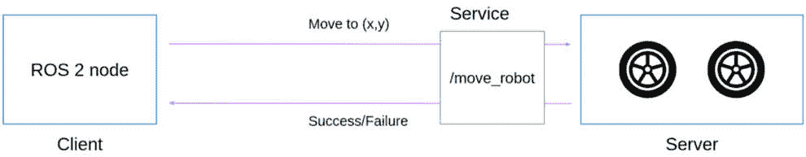
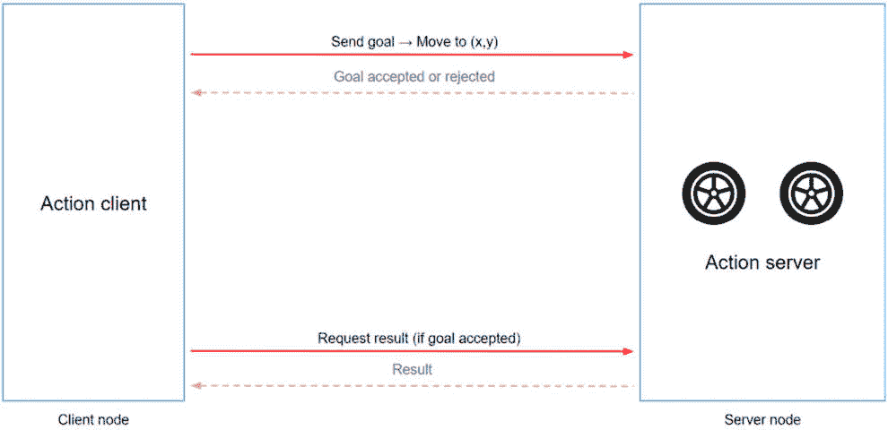
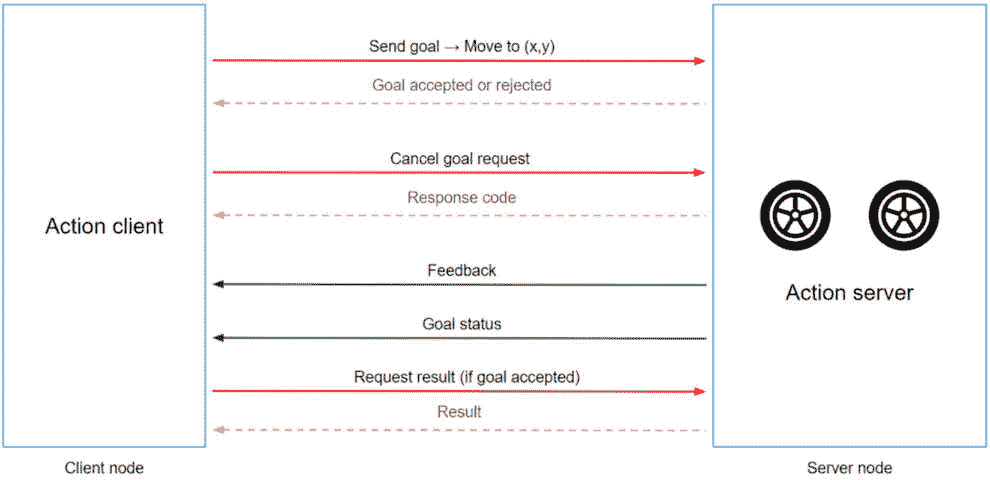

# 第七章：动作 – 当服务不足时

在本章中，我们将探讨 ROS 2 的第三种通信类型：动作。为了理解动作，你需要阅读关于节点、主题和服务的先前章节。

在我们开始之前，我想提醒你，本章涵盖的内容比我们之前遇到的以及将要遇到的内容更为高级。

如果你已经具备一定程度的经验，本章将满足你的需求，因为它将为你提供所有三种 ROS 2 通信类型的全面概述。然而，如果你是 ROS 的初学者，没有任何经验，现在可能有点过于复杂。这是可以的，主题和服务已经足够你开始使用 ROS 2。你现在可以跳过这一章（它独立于未来的章节），继续学习参数和启动文件。在你通过在 ROS 2 项目中工作建立更多信心之后，回头再看它可能是个好主意。

在本章中，你将通过逐步构建的示例来了解为什么需要动作以及它们是如何工作的。然后，你将编写代码使两个节点相互通信。我们将使用**ch6**文件夹中的代码（在此书的 GitHub 仓库：[`github.com/PacktPublishing/ROS-2-from-Scratch`](https://github.com/PacktPublishing/ROS-2-from-Scratch)）作为起点。你可以在**ch7**文件夹中找到最终代码。

到本章结束时，你将能够编写动作服务器和客户端，并利用所有动作功能，如反馈和取消机制。

尽管主题和服务已经足够开始，但 ROS 2 动作同样重要，因为它们帮助你将代码提升到下一个层次，并在你的机器人应用中实现更复杂的行为。

本章将涵盖以下主题：

+   什么是 ROS 2 动作？

+   创建自定义动作接口

+   编写动作服务器

+   编写动作客户端

+   充分利用所有动作机制

+   处理动作的附加工具

# 什么是 ROS 2 动作？

为了理解 ROS 2 动作，我们需要了解为什么需要它们。这是我们首先关注的内容。之后，我将通过一个真实生活中的例子解释动作是如何工作的。

你通过运行一些现有的节点和命令行工具，很快就在*第三章*中发现了动作。在那里建立的感觉将帮助你更好地理解本章的概念。

让我们深入探讨，看看为什么以及何时在 ROS 2 应用中需要动作。

## 为什么需要动作？

到目前为止，我们已经探讨了 ROS 2 的两种通信形式：主题和服务。

*主题*被节点用来发送和接收消息。发布者将在主题上发布数据，而订阅者将订阅主题以接收数据。因此，主题非常适合在应用中发送数据流。

*服务*用于节点之间的客户端/服务器交互。客户端向服务器发送请求，然后服务器执行或计算某些内容，并将响应返回给客户端。

所以，这就应该是全部了，对吧？我们还需要什么？

在其早期阶段，ROS 只从主题和服务开始。然而，ROS 开发者很快意识到，对于某些机器人应用来说，某些东西是缺失的。让我们用一个例子来看看。

假设你有一个有两个轮子的移动机器人。首先，你会创建一个负责控制轮子的节点。这个节点还能够接收命令，例如**移动到(x, y)坐标**。这些命令将被转换成应用于轮子的速度。然而，你也会希望能够在机器人完成移动时得到通知。

根据我们目前所知，ROS 2 服务似乎是一个不错的选择。在这个服务器节点中，你可以实现一个**/move_robot**服务，该服务将接收来自客户端的坐标。一旦收到命令，控制器开始移动轮子。然后，当机器人到达目的地时，服务器向客户端返回一个响应。

为了完成通信，我们必须在另一个节点上添加一个服务客户端。客户端将发送一个包含要到达的(x,y)坐标的请求到服务器。当服务器返回响应时，我们知道机器人已经完成移动——要么成功到达目的地，要么被某些因素阻止，我们得到一个错误：



图 7.1 – 使用服务控制两轮机器人

这有什么问题吗？

好吧，移动机器人空间中的物理部分可能需要一些时间。在某些情况下，这可能只是几秒钟，也可能是几秒钟，甚至几分钟。关键是服务执行可能需要相当长的时间。

话虽如此，当机器人移动时，你可能还想做几件事情，而这些事情在使用服务时是缺失的：

+   由于执行需要一些时间，从服务器获取一些反馈将会很棒。使用服务时，客户端对服务器端发生的事情一无所知。因此，客户端完全处于盲状态，需要等待响应以获取一些信息。

+   如何取消当前执行？这似乎是一个合理的功能。一旦你在服务器端开始执行，客户端可能想要取消它。例如，假设客户端节点还使用摄像头监控环境。如果检测到障碍物，客户端可以要求服务器停止执行。根据我们现在所拥有的，客户端除了等待服务器完成执行外，什么也不能做。

+   现在先说最后一个要点，尽管我们可以找到更多：服务器如何正确处理多个请求？假设你有两个或更多的客户端，每个客户端发送不同的请求。你如何在服务器上选择这些请求？服务器如何拒绝执行请求，或者选择用新的请求替换旧的请求，而不完成第一个请求？或者，在另一个场景中，服务器如何同时处理多个请求？作为一个类比，当你电脑上下载文件时，电脑不会只卡在一个文件上。它可以同时下载多个文件。你甚至可以在其他下载仍在运行时取消一个下载。

回到我们的例子，你可以看到简单的服务是不够的。对于这个用例，我们需要更多的功能。我们可以做的是实现额外的服务，比如一个用于取消请求的服务。我们还可以添加一个新的主题来发布关于机器人在执行过程中的位置的一些反馈。

有好消息——你不必这样做。所有这些问题都是由 ROS 2 动作解决的。反馈机制、取消机制以及其他功能也在动作中直接实现。

总结来说，服务对于客户端/服务器通信来说非常完美，但只有当动作/计算快速执行时。如果执行可能需要一些时间，并且你想要额外的功能，如反馈或取消，那么动作就是你需要的。

现在你已经知道了为什么我们需要动作，现在是时候了解它们是如何工作的了。

## 动作是如何工作的？

让我们用之前的例子，这次使用 ROS 2 动作而不是服务。我会向你展示动作在高级别是如何工作的，以及客户端和服务器之间的不同交互。在本章的后面部分，我们将深入代码，查看实现细节。

我们将使用两个节点：一个包含**动作客户端**，另一个包含**动作服务器**（这是负责控制轮子的那个）。

为了理解动作是如何工作的，让我们跟随一个动作的执行流程：



图 7.2 – ROS 2 动作的执行流程

下面是这个流程的步骤：

1.  **动作客户端**将通过向**动作服务器**发送请求来开始通信。对于动作，*请求*被命名为*目标*。因此，我们不会在这里讨论请求，而是关于**目标**。在这里，目标可以是到达的 (x, y) 坐标。

1.  **动作服务器**接收目标并决定接受或拒绝它。客户端立即从服务器收到这个响应。如果目标被拒绝，那么通信结束。

1.  如果目标被接受，服务器就可以开始处理它并执行相应的动作。在这个例子中，**服务器节点**会让机器人移动。

1.  一旦客户端知道目标已被接受，它将发送一个请求以获取**结果**并等待它（通过注册回调异步地）。对于服务，我们谈论的是*响应*。对于动作，这将是一个*结果*。

1.  当服务器完成目标的执行（无论是成功还是不成功）后，它将向客户端发送**结果**。以本例为例，结果可能是最终到达的（x，y）坐标。

1.  客户端在收到**结果**后，通信结束。

这就是动作的工作方式，具有最小化的功能集。从服务器端来看，接收一个目标，接受或拒绝它，然后执行，并返回结果。从客户端来看，发送一个目标，如果被接受，则发送一个请求，并从服务器接收结果。

此外，您还可以添加额外的功能，所有这些都是可选的。以下是动作的附加机制：



图 7.3 – 包含所有通信机制的动作

让我们更仔细地看看：

+   **反馈**：在执行目标的过程中，服务器可以向客户端发送一些反馈。以本例为例，反馈可以是机器人的当前坐标，甚至是完成率。因此，客户端可以了解目标执行过程中的情况。

+   **取消**：在服务器接受目标并正在服务器端执行目标之后，客户端可以决定取消该目标。为此，它将发送一个取消请求，该请求必须得到服务器的批准。如果取消请求被接受，那么服务器将尝试完成执行。因此，在本例中，它可以使机器人停止。最后，无论目标是否成功、失败或取消，服务器都将向客户端返回一个结果。

+   **目标状态**：这对您来说并不那么重要，因为它是动作的内部机制，您不会直接在代码中使用它（我只是为了完整性而添加了它）。每个目标都将获得一个状态机，具有如*接受*、*执行*等状态。对于每个目标状态的变化，服务器将通知客户端。

通过这种方式，你已经看到了可以在动作中实现的所有可能的通信机制。

注意，在前面的图中，一些通信用红线表示，而其他通信用绿线表示。幕后，动作仅使用主题和服务。即使动作本身是 ROS 2 通信，底层的代码也在使用另外两种通信类型。在这里，红线代表服务，绿线代表主题。

因此，在一个动作中，你有三个服务（发送目标、取消目标和接收结果）和两个主题（反馈和目标状态）。好消息是，你不必自己创建这些主题和服务——它们已经在动作机制中实现了。你只需要使用 ROS 2 库中的动作客户端和服务器功能。

要创建一个动作，你需要给它一个**名称**（例如，**move_robot**），这样客户端就知道将目标发送到哪里。你还需要使用一个**接口（目标、结果、反馈）**。

另一个需要注意的事项是，只能有一个动作服务器。就像服务一样，你不能有两个使用相同名称的服务器。另一方面，你可以有多个动作客户端。每个客户端也可以发送多个目标；这不是问题。

## 总结

在主题和服务之上，你可以使用动作使你的节点相互通信。现在，你何时应该使用主题、服务或动作？

当你想在节点之间发送数据流时，你应该使用*主题*。使用主题时，没有响应。例如，这可以用于发布传感器数据或向另一个节点发送命令流，如果你不需要任何确认的话。

当你想进行客户端/服务器通信，或者要执行的动作非常快，例如计算或简单的动作，如打开 LED 时，*服务*是完美的。

最后，你将使用*动作*来进行任何需要客户端/服务器通信且可能需要一些时间来执行的事情，以及当你还想要有反馈和取消等机制时。

以下是关于动作如何工作的一些重要点：

+   动作由一个名称和一个接口定义。

+   动作名称遵循与主题和服务相同的规则。它必须以字母开头，后跟其他字母、数字、下划线、波浪号和斜杠。此外，由于动作是在*执行*某事，最佳实践是以动词开头命名。

+   界面包含三个元素：一个目标、一个结果和反馈。客户端和服务器必须使用相同的界面。

+   一个动作服务器只能存在一次，但你可以从一个或多个动作客户端发送多个目标。

+   动作客户端不知道包含服务器的节点。它们只知道必须使用动作名称和接口来连接服务器。

要实现动作通信，你至少需要做以下事情：

+   从客户端向服务器发送一个目标。

+   接受（或不接受）目标并在服务器上执行它。

+   一旦目标完成，服务器需要向客户端返回一个结果。

以下是一些你可以添加的可选功能：

+   在目标执行期间，从服务器向客户端发送一些执行反馈。

+   允许客户端向服务器发送取消请求。如果被接受，则在服务器端完成目标执行。

要在代码中编写动作服务器和客户端，你必须使用来自 **rclpy.action** 和 **rclcpp_action** 库的动作功能。

到目前为止，我们可以开始编写一些代码。如果你仍然有点困惑，不要担心——动作最初相当复杂。它们包含很多不同的机制。随着我们创建动作并编写客户端和服务器代码，一切都会更加清晰。

由于没有服务器我们无法测试客户端，因此我们将像为服务所做的那样，从服务器端开始。要创建一个服务器，我们需要一个动作接口，因此这将是我们的起点。

# 创建自定义动作接口

要创建一个动作接口，我们首先需要清楚地定义我们希望通过动作实现什么。然后，我们可以将接口添加到 **my_robot_interfaces** 包（在本节中，我们将继续使用我们在前几章中创建的包）。

## 定义所需的应用程序和接口

在本章我们将编写的应用程序中，动作服务器将负责计数直到一个给定的数字，每次计数之间有延迟，以便我们可以模拟动作需要一些时间并且不会立即返回。客户端需要向服务器发送一个数字，以便服务器可以开始计数。当服务器完成时，它将结果（最后达到的数字）发送回客户端。

例如，假设客户端向服务器发送数字 5，并且延迟为 0.5 秒。服务器将从 0 开始计数，直到 5，并在每次迭代之间等待 0.5 秒。当完成时，如果服务器能够数到终点，则返回 5，或者如果执行提前结束（目标被取消，或任何其他可能导致服务器停止目标的原因），则返回最后达到的数字。此外，我们将在服务器执行目标时添加一些关于当前计数的反馈。

在我们编写任何代码之前，我们需要知道要使用哪个接口进行动作。从前一段中，我们可以看到我们需要以下内容：

+   **目标**：一个表示目标数字的整数和一个表示延迟的浮点数

+   **结果**：一个表示最后达到的数字的整数

+   **反馈**：一个表示当前计数的整数

对于主题和服务，你必须首先检查是否可以找到一个现有的接口来满足你的需求，因为已经有很多你可以使用而不需要创建一个新的接口。

对于动作，你可以尝试做同样的事情，但现有的动作接口并不多。动作比其他通信类型更复杂，因此你需要找到一个与你的应用程序的目标、结果和反馈完全匹配的接口。这种情况的可能性非常低，因为每个动作都将非常不同。因此，对于动作，我们不会尝试寻找现有的接口，而是直接创建一个自定义接口。

## 创建一个新的动作接口

创建动作接口的过程将与主题和接口接口相同。我们将遵循类似的方法。

首先，你需要创建和配置一个专门用于接口的包。我们在 *第五章* 的 *为话题创建自定义接口* 部分中做到了这一点，使用的是 **my_robot_interfaces** 包。你可以重用这个包来添加你的动作接口。如果你没有它，请先返回并配置它，然后继续以下步骤。

在这个包中，我们已经有 **msg** 和 **srv** 文件夹，分别用于主题和接口接口。我们将添加一个名为 **action** 的第三个文件夹，用于——正如你可能猜到的——动作接口：

```py
$ cd ros2_ws/src/my_robot_interfaces/
$ mkdir action
```

在这个新文件夹中，你将放置所有特定于你的机器人或应用程序的动作接口。

现在，为你的动作创建一个新文件。以下是关于文件名的规则：

+   使用大驼峰命名法——例如，`CountUntil`。

+   不要在名称中使用 `Action` 或 `Interface`，因为这会增加不必要的冗余。

+   使用 `.action` 作为文件扩展名。

+   作为最佳实践，在接口的名称中使用一个动词——例如，`NavigateToPosition`、`OpenDoor`、`PickObjectFromTable` 或 `FetchDrinkFromFridge`。动作，就像服务一样，是关于执行一个动作或计算（这可能需要一些时间），所以通过使用一个动词，你可以非常清楚地知道动作在做什么。

由于我们想要计数到指定的数字，因此我们可以将接口命名为 **CountUntil**：

```py
$ cd ~/ros2_ws/src/my_robot_interfaces/action/
$ touch CountUntil.action
```

你可以在该文件中编写动作的定义。由于我们有三个不同的部分（目标、结果和反馈），我们需要将它们分开。你必须在目标和结果之间添加三个短横线（**---**），并在结果和反馈之间再添加三个短横线。

即使你不想发送任何反馈，或者结果为空，你仍然必须添加两个带有三个短横线的分隔符（**---**）。一个非常简单的动作定义，结果和反馈中没有任何内容，看起来像这样：

```py
int64 goal_number
---
---
```

对于目标、结果和反馈，你可以使用以下内容：

+   内置类型（`bool`、`byte`、`int64` 等）。

+   现有的消息接口。例如，动作的目标可以包含 `geometry_msgs/Twist`。

注意

你不能在动作定义中包含动作或服务定义。你只能在目标、结果或反馈中包含消息（主题定义）。这三个部分可以被视为三个独立的消息。

由于我们正在创建一个相对简单的应用程序，我们在这里将只使用内置类型：

```py
# Goal
int64 target_number
float64 delay
---
# Result 
int64 reached_number 
---
# Feedback 
int64 current_number
```

对于主题和接口接口，定义内部的所有字段都必须遵循 **snake_case** 规范（单词之间使用下划线，所有字母必须小写，且没有空格）。

我还添加了注释来指定哪个部分是目标、结果和反馈。你不需要这样做——我只是为了你的第一个动作定义这样做，以免你感到困惑。人们经常在顺序上犯错误，把反馈放在结果之前，这可能导致难以调试的错误。顺序是目标、结果，然后是反馈。

现在我们已经编写了接口，我们需要构建它，以便我们可以在代码中使用它。回到**my_robot_interfaces**包的**CMakeLists.txt**文件。由于包已经配置好了，我们只需要做一件事：在**rosidl_generate_interfaces()**函数内部的新行上添加接口的相对路径。行与行之间不要使用任何逗号：

```py
rosidl_generate_interfaces(${PROJECT_NAME}
  "msg/HardwareStatus.msg"
  "srv/ResetCounter.srv"
  "srv/ActivateTurtle.srv"
  "action/CountUntil.action"
)
```

然后，保存所有文件并构建**my_robot_interfaces**包：

```py
$ colcon build --packages-select my_robot_interfaces
```

构建完成后，源环境。你应该能够找到你的新接口：

```py
$ ros2 interface show my_robot_interfaces/action/CountUntil
# Action interface definition here
```

如果你看到了动作定义，你就知道你的动作接口已经成功构建，你现在可以在你的代码中使用它了。这就是我们将要做的，从我们的应用程序的动作服务器开始。

# 编写动作服务器

在本节中，你将编写你的第一个动作服务器。在这个服务器中，我们将能够接收目标。当接收到目标时，我们将决定是否接受或拒绝它。如果接受，我们将执行目标。对于这个应用，执行目标意味着我们将从零开始计数到目标数字，并在每次迭代之间等待提供的延迟。一旦执行了目标，我们将向客户端返回一个结果。

我们将在代码中实现这一点，从 Python 开始，然后是 C++。在本节中，我们只开始实现动作通信所需的最小功能。我们将在稍后添加反馈和取消机制。由于动作比主题和服务稍微复杂一些，让我们从简单开始，一步一步来。

为了获得更好的学习体验，确保你在跟随时使用 GitHub 代码，因为我不会显示本章的所有行，只显示重要的行。本节的代码位于**count_until_server_minimal**文件中（文件末尾带有**.py**或**.cpp**扩展名）。我们在这里不会使用**number_publisher**和**number_counter**节点。

在为服务器编写任何代码之前，我们需要为我们的动作选择一个名称和接口。由于我们想要计数到一个给定的数字，我们将动作命名为**count_until**，并使用我们刚刚创建的**CountUntil**接口。

我们现在已经有了一切，可以开始编写 Python 代码。

## 编写 Python 动作服务器

你需要在节点内部编写你的动作服务器。在**my_py_pkg**包（与其他 Python 文件一起）内创建一个名为**count_until_server_minimal.py**的新文件。使此文件可执行。

### 导入接口并创建服务器

让我们先设置动作服务器。

首先，我们必须导入我们将在代码中需要的许多库和类：

```py
import rclpy
import time
from rclpy.node import Node
from rclpy.action import ActionServer, GoalResponse
from rclpy.action.server import ServerGoalHandle
```

与主题和服务不同，动作服务器不是直接包含在**Node**类中的。因此，我们需要从**rclpy.action**导入**ActionServer**类。

在此之后，您还必须导入动作的接口：

```py
from my_robot_interfaces.action import CountUntil
```

当您从另一个包导入接口时，请确保将依赖项添加到**my_py_pkg**的**package.xml**文件中的**my_robot_interfaces**（如果您一直跟随，您应该已经这样做过了）：

```py
<depend>my_robot_interfaces</depend>
```

回到**count_until_server_minimal.py**文件，让我们在节点的构造函数中创建动作服务器（如本节介绍中所述，我将只显示重要和相关的片段；完整的构造函数代码可在 GitHub 上找到）：

```py
self.count_until_server_ = ActionServer(
           self,
           CountUntil,
           "count_until",
           goal_callback=self.goal_callback,
           execute_callback=self.execute_callback)
```

要使用 Python 创建动作服务器，您必须使用我们之前导入的**ActionServer**类。提供以下参数：

+   `self.create…()`。在这里，它有点不同：对象（`self`）作为第一个参数提供。

+   我们导入的`CountUntil`接口。

+   `count_until`。

+   **目标回调**：当接收到目标时，它将在该回调内部处理。

+   **执行回调**：如果在目标回调中接受了目标，它将在执行回调中处理。这是您执行动作的地方。

在创建动作服务器时，我们指定了两个回调方法。当节点旋转时，动作服务器将处于*等待模式*。一旦接收到目标，节点将触发目标回调，如果需要，然后触发执行回调。让我们实现这些回调。

### 接受或拒绝目标

动作服务器现在可以接收目标。我们需要决定是否接受或拒绝它们。

让我们开始编写目标回调，这是服务器接收到目标时首先调用的方法：

```py
def goal_callback(self, goal_request: CountUntil.Goal):
    self.get_logger().info("Received a goal")
    if goal_request.target_number <= 0:
        self.get_logger().warn("Rejecting the goal, target number must be positive")
        return GoalResponse.REJECT
    self.get_logger().info("Accepting the goal")
    return GoalResponse.ACCEPT
```

在此回调中，我们接收客户端发送的目标（它是**CountUntil.Goal**类型）。

注意

动作接口包含一个目标、一个结果和反馈。您为每个消息获得一个类：`CountUntil.Goal`、`CountUntil.Result`和`CountUntil.Feedback`。我们将在本章中使用这三个类。

最好的做法是在为服务器编写代码时，每次都验证您接收到的数据。对于这个应用程序，让我们假设我们只想接受正数目标。如果数字是负数，我们将拒绝目标。

在验证数据后，您需要返回**GoalResponse.ACCEPT**或**GoalResponse.REJECT**以分别接受或拒绝目标。客户端将立即被告知该决定。然后，如果目标被拒绝，服务器端将不再发生任何事情。如果目标被接受，将触发执行回调。

### 执行目标

让我们实现执行回调。以下是代码的开始部分：

```py
def execute_callback(self, goal_handle: ServerGoalHandle):
    target_number = goal_handle.request.target_number
    delay = goal_handle.request.delay
    result = CountUntil.Result()
    counter = 0
```

在这个回调中，您会得到一个所谓的目标句柄，它属于**ServerGoalHandle**类型。我已经将参数类型明确化，这样我们就可以在 VS Code 中获得自动完成功能。这个目标句柄包含目标信息，但您也可以用它来设置目标的最终状态，我们将在下一分钟看到这一点。

您通常必须做的第一件事是从目标中提取数据。在这里，我们获取目标数字和延迟，这些是我们执行动作时将使用的。然后，我们初始化一些事情：**CountUntil.Result**类的结果，以及从**0**开始的计数器。

这样，我们就可以开始执行目标：

```py
    self.get_logger().info("Executing the goal")
    for i in range (target_number):
        counter += 1
        self.get_logger().info(str(counter))
        time.sleep(delay)
```

这部分代码每次都会不同，因为它完全取决于您的应用程序。在这里，我们正在增加计数器，直到达到目标数字，每次迭代之间都有延迟。

在这里使用延迟的目的只是为了让这个方法花费更多时间，以便我们可以模拟动作的行为。如果我们想尽可能快地计数，没有任何延迟，我们可以使用服务，因为动作几乎会立即完成。

一旦执行完成，我们需要做两件事——为目标设置最终状态，并返回一个结果给客户端：

```py
    goal_handle.succeed()
    result.reached_number = counter
    return result
```

在动作执行期间，目标是处于*执行中*状态。当完成执行时，您需要让它过渡到最终状态。

在这种情况下，由于一切都很顺利，我们预计在执行过程中不会出现任何问题，所以我们通过在目标句柄上使用**succeed()**方法将目标设置为*成功*。例如，如果您的动作负责移动机器人的轮子，并且在执行过程中与轮子的通信丢失，您将停止动作，并使用**abort()**方法将目标设置为*已取消*。最后可能的状态是*已取消*，我们将在本章稍后看到。

我们现在已经编写了动作服务器正常工作的最小代码。在我们编写动作客户端之前，让我们切换到 C++。如果您只想跟随 Python 的解释，那么请继续跳过下一节。

## 编写 C++ 动作服务器

C++ 动作的代码逻辑与 Python 非常相似，但语法有一些特定的差异。我们将主要关注这些差异。此外，由于代码开始变得相当庞大，我可能不会显示完整的代码，只显示理解所需的重要部分。请确保查看这本书的 GitHub 仓库以查看完整的代码。

### 导入接口并创建服务器

让我们先设置动作服务器。首先，在您的**my_cpp_pkg**包的**src**目录中创建一个名为**count_until_server_minimal.cpp**的新文件。

打开文件，首先添加必要的包含：

```py
#include "rclcpp/rclcpp.hpp"
#include "rclcpp_action/rclcpp_action.hpp"
#include "my_robot_interfaces/action/count_until.hpp"
```

如您所见，动作库不是**rclcpp**的子库——它是一个完全独立的库，来自不同的包：**rclcpp_action**。

对于我们使用的每个新包，我们需要将依赖项添加到**my_cpp_pkg**包的**package.xml**文件中：

```py
<depend>my_robot_interfaces</depend>
<depend>rclcpp_action</depend>
```

你还需要在**CMakeLists.txt**文件中指定这些依赖项：

```py
find_package(my_robot_interfaces REQUIRED)
find_package(rclcpp_action REQUIRED)
```

最后，当你创建你的可执行文件时，别忘了将这两个依赖项添加到**ament_target_dependencies()**函数中：

```py
add_executable(count_until_server src/count_until_server_minimal.cpp)
ament_target_dependencies(count_until_server rclcpp rclcpp_action my_robot_interfaces)
```

回到**count_until_server_minimal.cpp**文件，我们添加一些**using**行来简化代码（你可以在文件的顶部找到这些行，在**#include**行下面）。之后，你可以在你的类中添加一个动作服务器作为私有属性：

```py
rclcpp_action::Server<CountUntil>::SharedPtr count_until_server_;
```

再次，我们将使用共享指针来保持对象。

然后，在构造函数中，你可以创建动作服务器：

```py
count_until_server_ = rclcpp_action::create_server<CountUntil>(
    this,
    "count_until",
    std::bind(&CountUntilServerNode::goalCallback, this, _1, _2),
    std::bind(&CountUntilServerNode::cancelCallback, this, _1),
    std::bind(&CountUntilServerNode::executeCallback, this, _1)
);
```

对于动作，C++的语法比 Python 更严格。除了动作接口、要链接的对象和动作名称之外，你必须提供三个回调（即使你不想使用它们）：

+   **目标回调**：用于接受或拒绝传入的目标。

+   **取消回调**：接收取消请求。

+   **执行回调**：在 C++中，这被称为*处理已接受回调*，但我将其命名为*执行回调*，以便使代码与 Python 相似。在这个回调中，我们执行已接受的目标。

注意

我设计这一章是为了我们先编写最少的代码，然后添加额外的可选功能。然而，如果你不提供取消回调，C++的`create_server()`方法将无法工作。因此，我们现在要添加这个回调，但不会完全实现取消机制；我们将在稍后完成。

到目前为止，我们需要实现三个回调方法。

### 实现回调

回调函数内部的参数可能相当长，难以书写。这就是为什么我建议在代码开头使用**using**行来简化代码，以及仔细检查一切，因为很容易出错。

这是目标回调方法的开头：

```py
rclcpp_action::GoalResponse goalCallback(const rclcpp_action::GoalUUID &uuid, std::shared_ptr<const CountUntil::Goal> goal)
```

在这里，你得到一个目标唯一标识符以及目标本身（更准确地说，这是一个指向目标的**const**共享指针）。在回调中，我们验证目标，然后接受或拒绝它。例如，要接受目标，你会返回以下内容：

```py
return rclcpp_action::GoalResponse::ACCEPT_AND_EXECUTE;
```

下一个回调方法是取消回调，你可以决定是否接受或拒绝传入的取消请求。由于我将在本章后面解释取消机制，我现在将跳过这部分内容——你只需要编写回调，以便代码可以编译。

这里最重要的回调是执行回调。在这个方法中，我们接收一个目标句柄（**const std::shared_ptr<CountUntilGoalHandle> goal_handle**）。我们必须做的第一件事是从目标中提取数据并初始化一些事情：

```py
int target_number = goal_handle->get_goal()->target_number;
double delay = goal_handle->get_goal()->delay;
auto result = std::make_shared<CountUntil::Result>();
int counter = 0;
rclcpp::Rate loop_rate(1.0/delay);
```

你可能已经习惯了到处看到共享指针，这里也不例外。我们不是创建一个结果对象，而是一个指向结果对象的共享指针。

然后，为了处理每次计数迭代之间的等待时间，我们使用一个 **rclcpp::Rate** 对象。这与我们用 Python 做的事情有点不同。在这个速率对象中，我们必须传递速率——即我们想要的循环频率。例如，如果延迟是 0.5 秒，频率将是 2.0 Hz。我们现在可以执行动作：

```py
RCLCPP_INFO(this->get_logger(), "Executing the goal");
for (int i = 0; i < target_number; i++) {
    counter++;
    RCLCPP_INFO(this->get_logger(), "%d", counter);
    loop_rate.sleep();
}
```

在这里，我们使用速率对象的 **sleep()** 函数来暂停执行。

最后，一旦 **for** 循环结束，我们可以完成执行：

```py
result->reached_number = counter;
goal_handle->succeed(result);
```

在 Python 中，我们首先设置目标的最终状态，然后返回结果。在 C++ 中，我们不返回任何内容（注意 **void** 返回类型）。我们在设置目标状态的同时发送结果。

注意

使用动作编写 C++ 代码开始变得相当复杂，尤其是如果你没有太多 C++ 经验。如果你感到完全迷茫，也许可以只继续使用 Python，或者，如前所述，现在暂时跳过这一章，稍后再回来。

C++ 动作服务器的内容到此结束。我们现在可以编写客户端节点并尝试通信。

# 编写动作客户端

现在我们已经有了服务器接收目标、接受它、执行它并返回结果的必要最小代码。在这个时候，我们可以编写通信的客户端部分。

动作客户端将向服务器发送一个目标。然后，它将注册一个回调以确定目标是否被接受或拒绝。如果目标被接受，客户端将注册另一个回调以获取最终结果。这正是我们现在要实现的——首先用 Python，然后用 C++。

你应该在何处编写动作客户端？在你的 ROS 2 应用程序中，你可以在任何节点中添加动作客户端。例如，假设你有一个监控移动机器人电池电平的节点。这个节点可能已经有一些发布者、订阅者、服务等等。在所有这些之上，你可以添加一个动作客户端，当电池电量低时，它会向另一个节点（例如控制机器人轮子的服务器节点）发送目标。

对于本章，为了保持简单，我们将创建一个新的节点，专门用于动作客户端。然后你可以将此代码用作模板，添加到任何你想添加动作客户端的地方。你可以在此部分的 **count_until_client_minimal** 中找到代码（**.py** 或 **.cpp**）。

让我们从 Python 动作客户端开始。

## 编写 Python 动作客户端

在 **my_py_pkg** 包中创建一个名为 **count_until_client_minimal.py** 的新 Python 文件。使此文件可执行。

## 创建动作客户端

让我们先设置动作客户端。首先，添加我们将需要的依赖项：

```py
import rclpy
from rclpy.node import Node
from rclpy.action import ActionClient
from rclpy.action.client import ClientGoalHandle, GoalStatus
from my_robot_interfaces.action import CountUntil
```

至于动作服务器，我们不是直接从 **Node** 类获取动作客户端。相反，我们必须从 **rclpy.action** 导入 **ActionClient**。

我们还必须导入动作接口，它应该与服务器相同。如果我们导入这个接口，我们还需要在**package.xml**文件中添加一个依赖项。然而，我们已经做了，所以不需要添加任何其他内容。

然后，在节点的构造函数中，我们创建一个动作客户端：

```py
self.count_until_client_ = ActionClient(
self, CountUntil, "count_until")
```

我们直接使用**ActionClient**类，并传递三个参数：要绑定的对象（**self**）、动作接口和动作名称。请确保名称与服务器端相同。

然后，为了向服务器发送目标，我们添加一个新的方法：

```py
def send_goal(self, target_number, delay):
    self.count_until_client_.wait_for_server()
    goal = CountUntil.Goal()
    goal.target_number = target_number
    goal.delay = delay
    self.count_until_client_.send_goal_async(
        goal).add_done_callback(self.goal_response_callback)
```

从客户端向服务器发送目标的过程如下：

1.  您可以使用`wait_for_server()`等待服务器。如果您在服务器未启动和运行时发送目标，您将得到一个错误，所以确保它在您做任何事情之前已经准备好了。我没有提供超时，所以它将无限期地等待。您可以为它添加一个超时，并做类似我们在*第六章*中在*编写服务* *客户端*部分所做的事情。

1.  从接口创建一个目标对象：`Interface.Goal()`。

1.  填写目标字段。您省略的任何字段都将获得默认值（数字为`0`，字符串为`""`）。

1.  使用`send_goal_async()`发送目标。这将返回一个 Python `Future`对象。

1.  注册一个目标响应的回调，以便您知道它已被接受或拒绝。

注意，就像对于服务一样，我们使用**send_goal_async()**进行异步调用。这样，方法将返回，我们不会阻塞执行。如果我们阻塞执行，我们也会阻塞旋转，因此我们永远不会得到任何响应。

### 实现回调

到目前为止，我们已经使用动作客户端发送了一个目标并注册了一个回调，**goal_response_callback()**。让我们实现这个方法：

```py
def goal_response_callback(self, future):
    self.goal_handle_: ClientGoalHandle = future.result()
    if self.goal_handle_.accepted:
        self.get_logger().info("Goal got accepted")
        self.goal_handle_.get_result_async().add_done_callback(
            self.goal_result_callback)
    else:
        self.get_logger().info("Goal got rejected")
```

在这个回调中，我们从 Python **Future**对象的输出结果中获取一个**ClientGoalHandle**对象。从这个目标处理程序中，我们可以找出目标是否被接受。

请注意，您不会在这个目标响应回调中获得最终结果。在这里，我们只知道服务器是否接受了目标。如果目标被接受，我们知道服务器将开始执行它，并在某个时候返回一个结果。

然后，在客户端，我们可以为目标结果注册另一个回调：

```py
def goal_result_callback(self, future):
    status = future.result().status
    result = future.result().result
    if status == GoalStatus.STATUS_SUCCEEDED:
        self.get_logger().info("Success")
    elif status == GoalStatus.STATUS_ABORTED:
        self.get_logger().error("Aborted")
    elif status == GoalStatus.STATUS_CANCELED:
        self.get_logger().warn("Canceled")
    self.get_logger().info("Result: " + str(result.reached_number))
```

在这个回调中，我们在服务器完成目标执行后，获取目标的最终状态和结果。

您可以用这个结果做任何您想做的事情——在这里，我们只是简单地打印它。如您所见，我们将收到目标的三种最终状态之一：**STATUS_SUCCEEDED**、**STATUS_ABORTED**和**STATUS_CANCELED**。

最后，别忘了调用**send_goal()**方法。我们将在**main()**函数中这样做，就在初始化节点之后，在我们使节点旋转之前：

```py
node = CountUntilClientNode()
node.send_goal(5, 0.5)
rclpy.spin(node)
```

这将要求服务器计数到**5**，并在每次计数之间等待**0.5**秒。

### 尝试通信

现在，我们可以尝试客户端和服务器之间的通信。

为客户端和服务器节点创建一个可执行文件（在**setup.py**中）。构建包并源环境。

然后，在两个不同的终端中启动服务器节点和客户端节点。随着通信的进行，您应该在两个终端中看到一些日志。最后，对于服务器，您将得到如下内容：

```py
$ ros2 run my_py_pkg count_until_server
[count_until_server]: Action server has been started.
[count_until_server]: Received a goal
[count_until_server]: Accepting the goal
[count_until_server]: Executing the goal
[count_until_server]: 1
...
[count_until_server]: 5
```

对于客户端：

```py
$ ros2 run my_py_pkg count_until_client
[count_until_client]: Goal got accepted
[count_until_client]: Success
[count_until_client]: Result: 5
```

您可以通过每个日志中的时间戳看到执行流程。在这里，我们测试了目标数字为正的情况——因此，目标被接受。如果您愿意，您也可以测试目标数字为负的情况；您应该看到目标被拒绝而没有被执行。

现在，让我们学习如何用 C++编写动作客户端。

## 编写 C++动作客户端

对于 C++代码，我将关注**count_until_client_minimal.cpp**文件中需要注意的几个重要点。

首先，我们有所有的包含和**using**行。这些几乎与 C++动作服务器相同。然而，对于目标处理，我们得到**ClientGoalHandle**（在服务器代码中是**ServerGoalHandle**）：

```py
using CountUntilGoalHandle = rclcpp_action::ClientGoalHandle<CountUntil>;
```

要创建一个动作客户端，我们声明客户端为类的私有属性：

```py
rclcpp_action::Client<CountUntil>::SharedPtr count_until_client_;
```

然后，我们在构造函数中初始化客户端：

```py
count_until_client_ = rclcpp_action::create_client<CountUntil>(this, "count_until");
```

如您所见（但这不应该再是惊喜了），我们存储了一个指向动作客户端的共享指针。初始化时，我们提供了动作接口、要绑定的对象（**this**）和动作名称，这个名称应该与服务器代码中定义的相同。

到这一点，我们可以创建一个**sendGoal()**方法来向服务器发送目标。此方法遵循与 Python 客户端相同的步骤。我们等待服务器，然后创建一个目标，填写目标字段，发送目标，并注册回调。然而，我们在处理回调的方式上有一个很大的不同：

```py
auto options = rclcpp_action::Client<CountUntil>::SendGoalOptions();
options.goal_response_callback = std::bind(
    &CountUntilClientNode::goalResponseCallback, this, _1);
options.result_callback = std::bind(
    &CountUntilClientNode::goalResultCallback, this, _1);
count_until_client_->async_send_goal(goal, options);
```

在 Python 中，我们在发送目标后链式调用回调。在 C++中，您首先需要创建一个**SendGoalOptions**对象。在这个对象中，您可以注册客户端的不同回调方法。在这里，我们注册了响应和结果回调。然后，您必须将此对象传递给**async_send_goal()**方法。这将注册节点旋转时的所有回调。

现在我们已经注册了两个回调，我们需要实现它们。

在目标响应回调中，为了检查目标是否被接受或拒绝，我们可以简单地写下以下内容：

```py
if (!goal_handle) {
```

如果这个返回**false**，我们知道目标被拒绝了。如果它返回**true**，在这个回调中就没有必要做任何事情了，因为结果回调已经通过**SendGoalOptions**对象注册了。

在结果回调中，我们通过**result.code**获取目标的最终状态。然后我们可以将其与**rclcpp_action::ResultCode**中的不同代码进行比较，这些代码是**SUCCEEDED**、**ABORTED**和**CANCELED**。要获取实际结果，我们写入**result.result**。这将是一个指向结果对象的共享指针。

最后，别忘了在 **main()** 函数中调用 **sendGoal()** 方法：

```py
auto node = std::make_shared<CountUntilClientNode>();
node->sendGoal(5, 0.5);
rclcpp::spin(node);
```

对于 C++ 动作客户端来说，这就结束了。在编写了客户端和服务器之后，为两者创建可执行文件（在 **CMakeLists.txt** 中）；然后，构建、源和运行这两个节点。你甚至可以尝试用 C++ 服务器运行 Python 客户端，或者任何其他组合。

现在客户端和服务器都运行正确后，我们可以添加通过动作获得的额外功能：反馈和取消。

# 利用所有的动作机制

我现在谈论反馈和取消机制，而不是之前，是为了尽量不让你一次处理太多代码。我知道动作比之前在 ROS 2 中看到的任何东西都要复杂。仅最小代码就已经相当长，并且包含许多你必须注意的小细节。

此外，正如本章第一部分所解释的，反馈和取消机制是可选的。你可以创建一个无需它们的完整工作的客户端/服务器通信。

我们现在将改进最小代码并添加更多功能，以便充分利用 ROS 2 动作。以下是你可以为此部分准备文件的步骤：

1.  复制包含 `_minimal` 的文件。

1.  通过删除 `_minimal` 重命名这些新文件。

例如，你可以复制 **count_until_client_minimal.py**（我们不会再修改此文件）并将其重命名为 **count_until_client.py**（我们将在此处添加更多代码）。你可以在本书的 GitHub 仓库中找到相同的组织结构。

因此，让我们探索反馈和取消机制，从最简单的反馈开始。

## 添加反馈机制

当我们编写动作接口时，我们必须定义三件事：目标、结果和反馈。到目前为止，我们只使用了目标和结果。反馈是可选的，你可以在动作定义中将其留空。在这种情况下，就没有其他事情要做了。

由于我们在 **CountUntil.action** 中定义了反馈（**int64 current_number**），让我们在我们的代码中使用它，以便服务器每次增加计数器时都发送反馈。动作客户端将能够在回调中接收此反馈。

### 使用 Python 的反馈

让我们从动作服务器开始。只需添加几行代码，我们就可以发布反馈。

打开 **count_until_server.py**。在 **execute_callback()** 方法中，在创建结果对象的同时，创建一个反馈对象：

```py
feedback = CountUntil.Feedback()
```

现在，当你执行目标时，你必须做以下事情：

```py
feedback.current_number = counter
goal_handle.publish_feedback(feedback)
```

我们必须填写反馈对象的各个字段，然后使用目标句柄的 **publish_feedback()** 方法将反馈发送给客户端。

对于服务器端来说，这就全部完成了。现在，让我们编写接收反馈的代码。

打开 **count_until_client.py** 文件，并修改使用 **send_goal_async()** 发送目标的行：

```py
self.count_until_client_.send_goal_async(
    goal, feedback_callback=self.goal_feedback_callback). \
    add_done_callback(self.goal_response_callback)
```

要使用 Python 动作客户端获取反馈，你必须在你发送目标时注册一个回调函数。以下是这个回调的实现：

```py
def goal_feedback_callback(self, feedback_msg):
   number = feedback_msg.feedback.current_number
   self.get_logger().info("Got feedback: " + str(number))
```

通过这种方式，我们得到一个反馈消息，可以访问该消息的每个字段。你可以用这个反馈做任何你想做的事情。例如，如果你的动作客户端要求机器人移动到特定的（x，y）坐标，你可能会收到关于机器人当前进度的反馈。从这个反馈中，你可以采取任何适当的措施：取消目标（参见下一节）、发送新的目标等等。

关于反馈就到这里。你可以再次构建你的包，源码化它，并运行两个节点。以下是客户端将看到的内容：

```py
$ ros2 run my_py_pkg count_until_client
[count_until_client]: Goal got accepted
[count_until_client]: Got feedback: 1
```

它将继续如下：

```py
[count_until_client]: Got feedback: 5
[count_until_client]: Success
[count_until_client]: Result: 5
```

通过这个反馈，客户端不再处于黑暗中。它可以了解在发送目标与接收结果之间的发生的事情。

### C++中的反馈

在`count_until_server.cpp`中添加动作服务器反馈的行为与 Python 相同。

首先，你必须在执行回调中创建一个反馈对象：

```py
auto result = std::make_shared<CountUntil::Result>();
```

唯一的不同之处在于我们在这里使用共享指针。

然后，你必须发布反馈：

```py
feedback->current_number = counter;
goal_handle->publish_feedback(feedback);
```

在客户端，注册回调的方式略有不同。打开`count_until_client.cpp`，并将以下行添加到`sendGoal()`方法中：

```py
options.feedback_callback = std::bind(
    &CountUntilClientNode::goalFeedbackCallback, this, _1, _2);
```

对于 C++动作，我们在传递给`async_send_goal()`方法的`SendGoalOptions`对象中注册所有回调。

然后，你可以实现回调：

```py
void goalFeedbackCallback(const CountUntilGoalHandle::SharedPtr &goal_handle, const std::shared_ptr<const CountUntil::Feedback> feedback)
{
   (void)goal_handle;
   int number = feedback->current_number;
   RCLCPP_INFO(this->get_logger(), "Got feedback: %d", number);
}
```

在这里，我们接收目标句柄和反馈（作为**const**共享指针）。

注意

正如你所见，每当在函数中不使用一个参数时，我都会写`(void)`，然后是参数。这是在用`colcon build`编译时防止得到*未使用参数*警告的一种方法。作为一个最佳实践，在开发 ROS 2 应用程序时，你应该解决代码中的所有错误和警告。如果你不这样做，你最终会有很多被忽略的警告，你可能会错过重要的警告，导致未来难以调试的问题。

现在代码已经完成，你可以编译包，并在两个不同的终端中运行客户端和服务器节点。你应该看到与 Python 类似的输出。

实现反馈机制相对简单。现在，让我们学习如何取消一个目标。这将更加复杂，需要使用更多高级的 ROS 2 概念。

## 添加取消机制

在发送一个目标后，客户端可以决定要求服务器取消它。服务器将接收这个请求并接受（或拒绝）取消目标。如果取消请求被接受，服务器将采取任何适当的行动来取消目标的执行。最后，服务器仍然会向客户端发送一个结果。

我们需要在代码中做什么？在服务器节点中，我们将添加另一个回调，以便我们可以接收取消请求并决定接受或拒绝它们。然后，在执行回调中，我们将能够检查目标是否应该被取消；如果是这样，我们将提前终止执行。

然而，如果我们只是这样做，这是不会起作用的，取消请求也永远不会被接收。为什么是这样？让我们现在来探讨这个问题。

注意

本节介绍了一些超出本书（入门级）范围的概念。我将简要地谈论它们，而不会深入细节。如果你想更深入地了解这些概念，请自由探索高级概念（你将在第十四章中找到额外的资源）*。你可以将这一节视为关于动作的进一步探讨部分*。

### 理解取消和旋转的问题

我们将只关注服务器端，因为问题将在这里发生。我将解释问题所在，以便我们可以在稍后实施解决方案。

因此，当你启动动作服务器时，将注册三个回调：一个目标回调、一个取消回调和一个执行回调。

使用我们当前的代码，当服务器接收到一个目标时，以下是会发生的事情：

1.  目标由目标回调接收并被接受或拒绝。

1.  如果被接受，我们在执行回调中执行目标。需要注意的是，当我们使用`for`循环执行目标时，线程被阻塞。

1.  一旦目标执行完成，我们就返回结果并从执行回调中退出。

问题出在*第二步*。由于我们阻塞了执行，我们阻塞了旋转机制。

当你使一个节点旋转时，会发生什么？如前所述，节点将被保持活跃，所有回调都可以被处理。然而，旋转是在单个线程中工作的。这意味着如果你有一个回调需要 5 秒钟来执行，它将阻塞接下来的回调 5 秒钟。

我们之前从未遇到过任何问题，因为我们编写的所有回调都非常快速地执行。然而，对于动作的执行回调，我们处于执行可能需要相当长时间的情况，因此会阻塞所有其他回调。

这确实是个问题。如果取消请求仅在目标执行完成后才被接收，你如何请求取消目标？

为了解决这个问题，我们有两个可能的解决方案：

+   **经典编程方式**：我们可以在执行回调中创建一个新的线程。然后，回调可以退出，而目标在后台处理。这样，旋转继续，因此可以调用其他回调。

+   **ROS 2 的方式**：我们可以使用多线程执行器，这意味着我们的旋转机制将不在单个线程中工作，而是在多个线程中工作。因此，如果一个回调被阻塞，你仍然可以执行其他回调——包括取消回调。

由于我们想要遵循 ROS 2 原则以与其他开发者保持一致，我们将遵循 ROS 2 的方式，并使用多线程执行器来解决该问题。

注意

我不会在这里详细介绍单线程和多线程执行器，我现在使用它们是为了正确实现取消机制。阅读完这本书后，执行器可以成为一个很好的探索主题。

服务器代码中取消机制的过程对于 Python 和 C++将是相同的：

1.  注册一个回调来处理取消请求。

1.  在执行回调中取消目标。

1.  使用多线程执行器使节点旋转。

### 使用 Python 取消

我们将从服务器代码开始，该代码可以在**count_until_server.py**中找到。

首先，让我们注册一个回调来接收取消请求：

```py
ActionServer(
    …
    cancel_callback=self.cancel_callback,
    …)
```

这是回调的实现：

```py
def cancel_callback(self, goal_handle: ServerGoalHandle):
    self.get_logger().info("Received a cancel request")
    return CancelResponse.ACCEPT
```

在这个回调中，你将接收到一个与客户端想要取消的目标相对应的目标处理程序。然后你可以创建任何类型的条件来决定目标是否应该被取消。为了接受，你必须返回**CancelResponse.ACCEPT**；为了拒绝，你必须返回**CancelResponse.REJECT**。在这个例子中，我保持了简单，我们只是接受了取消请求而没有实现任何其他检查。

现在，如果取消请求已被接受，我们需要对此做出回应。在执行回调中，当我们正在执行目标（在**for**循环内部）时，添加以下代码：

```py
if goal_handle.is_cancel_requested:
    self.get_logger().info("Canceling goal")
    goal_handle.canceled()
    result.reached_number = counter
    return result
```

当我们接受取消请求时，目标处理程序中的**is_cancel_requested**标志将被设置为**True**。现在，在执行回调中，我们只需要检查这个标志。

我们在代码中执行的操作是停止当前执行。例如，如果你的动作服务器控制机器人的轮子，你可以将**取消**解释为“减速并停止移动”，“走到一边以免阻塞主道”，或者甚至“返回基地”。你处理取消行为的方式取决于每个应用程序。在这里，我们只是停止计数。

在执行回调中，你需要设置目标的最终状态并返回一个结果，即使你取消了目标。因此，我们使用**canceled()**方法来设置状态，并返回包含最后达到的数字的结果。如果客户端要求服务器数到 10 然后当计数器在 7 时取消目标，结果将包含 7。

取消机制就到这里。然而，为了使事情正常工作，正如我们之前看到的，我们需要使用多线程执行器。

首先，你需要导入以下内容：

```py
from rclpy.executors import MultiThreadedExecutor
from rclpy.callback_groups import ReentrantCallbackGroup
```

当使用多线程执行器时，我们还需要使用**回调组**。在这里，**ReentrantCallbackGroup**将允许所有回调并行执行。这意味着你可以为同一个动作服务器同时运行多个目标、取消和执行回调。

当你创建动作服务器时，添加一个**callback_group**参数：

```py
ActionServer(
    …
    callback_group=ReentrantCallbackGroup())
```

最后，修改**main()**函数中使节点旋转的行：

```py
rclpy.spin(node, MultiThreadedExecutor())
```

就这些了。这只是几行代码，但添加这些需要很好地理解 ROS 2 及其底层机制。

让我们编写客户端的代码，以便我们可以发送取消正在执行的目标的请求。在 **count_until_client.py** 中添加一个取消目标的方法：

```py
def cancel_goal(self):
   self.get_logger().info("Send a cancel goal request")
   self.goal_handle_.cancel_goal_async()
```

这里，我们使用在目标响应回调中保存的目标处理程序（**self.goal_handle_: ClientGoalHandle = future.result()**）。从这个目标处理程序对象，我们可以访问一个 **cancel_goal_async()** 方法。

那么，我们在哪里取消目标？这可以在任何地方完成：从反馈回调、独立的订阅者回调等等。这取决于你的应用。

为了进行快速测试，我们随意决定如果反馈中的 **current_number** 字段大于或等于 2，则取消目标。这没有任何意义（为什么我们要数到 5，然后当数字达到 2 时取消？），但这是一种快速测试取消机制的方法。

在目标反馈回调中添加以下代码：

```py
if number >= 2:
    self.cancel_goal()
```

然后，构建包，源代码，并运行服务器和客户端。以下是客户端的日志：

```py
[count_until_client]: Goal got accepted
[count_until_client]: Got feedback: 1
[count_until_client]: Got feedback: 2
[count_until_client]: Send a cancel goal request
[count_until_client]: Canceled
[count_until_client]: Result: 2
```

对于服务器，你会看到以下内容：

```py
[count_until_server]: Executing the goal
[count_until_server]: 1
[count_until_server]: 2
[count_until_server]: Received a cancel request
[count_until_server]: Canceling goal
```

使用这些机制，我们现在可以取消从反馈回调中取消目标的行——这只是为了测试目的。

### 使用 C++ 取消

在服务器代码（**count_until_server.cpp**）中，我们在创建动作服务器时添加了一个取消回调。这是强制性的，以便代码可以编译。

在这个回调中，我们只是接受取消请求：

```py
return rclcpp_action::CancelResponse::ACCEPT;
```

然后，为了在执行回调中处理目标的取消，将以下代码添加到 **for** 循环中：

```py
if (goal_handle->is_canceling()) {
    RCLCPP_INFO(this->get_logger(), "Canceling goal");
    result->reached_number = counter;
    goal_handle->canceled(result);
    return;
}
```

在 C++ 中，我们在目标处理程序内部检查 **is_canceling()** 方法。如果它返回 **true**，这意味着已经接受了对该目标的取消请求，我们需要对此采取行动。

我们使用 **canceled()** 设置目标的最终状态和结果，并从执行回调中退出。

取消机制就到这里了，但现在我们需要使用多线程执行器使节点旋转。

在 **main()** 函数中，我们必须将 **rclcpp::spin(node);** 行替换为以下代码：

```py
rclcpp::executors::MultiThreadedExecutor executor;
executor.add_node(node);
executor.spin();
```

这里，我们创建一个执行器，添加节点，并使执行器旋转。然后，就像我们对 Python 所做的那样，在节点内部，我们需要添加一个回调组。我们可以将其声明为一个私有属性：

```py
rclcpp::CallbackGroup::SharedPtr cb_group_;
```

最后，我们修改节点构造函数中的代码，给动作服务器提供一个可重入的回调组，这样所有回调都可以并行执行：

```py
cb_group_ = this->create_callback_group(
    rclcpp::CallbackGroupType::Reentrant);
count_until_server_ = rclcpp_action::create_server<CountUntil>(
    …
    rcl_action_server_get_default_options(),
    cb_group_
);
```

我们还需要在回调之后和回调组之前添加 **rcl_action_server_get_default_options()**；否则，编译器会抱怨找不到 **create_server()** 函数的重载。

现在我们已经完成了服务器代码的编写，让我们从客户端发送取消请求。在 **count_until_client.cpp** 中添加一个 **cancelGoal()** 方法：

```py
void cancelGoal()
{
    RCLCPP_INFO(this->get_logger(), "Send a cancel goal request");
    count_until_client_->async_cancel_all_goals();
}
```

在 C++ 中，我们从动作客户端而不是从目标处理程序取消目标。为了使事情更简单，我们在这里取消所有可能由该客户端发送的目标。

要测试取消机制，我们将这些行添加到反馈回调中：

```py
if (number >= 2) {
    cancelGoal();
}
```

代码编写完成后，运行您的 C++ 行动客户端和服务器节点。您也可以尝试任何 Python 和 C++ 节点的组合；它们应该表现相同。测试完代码后，注释掉这些行以取消反馈回调中的目标。

让我们以一些将帮助您在开发使用动作的应用程序时使用的更多命令行工具来结束这一章。

# 处理动作的附加工具

由于动作是 ROS 2 核心功能的一部分，它们也有自己的命令行工具：**ros2 action**。

在本节中，我们将学习如何检查动作、从终端发送目标以及在实际运行时更改动作名称。

要查看所有可能的命令，键入 **ros2** **action -h**。

## 列出和检查动作

动作基于主题和服务。由于 **rqt_graph** 目前不支持服务，我们可以看到动作服务器和客户端的主题，但仅此而已。因此，**rqt_graph** 在检查动作时不会非常有用。因此，我们将在这里使用 **ros2** 命令行工具。

让我们学习如何查找现有动作以及如何获取一个动作的接口。

停止所有节点并启动 **count_until_server** 节点（Python 或 C++）。然后，运行以下命令列出所有可用的动作：

```py
$ ros2 action list
/count_until
```

在这里，我们找到了 **/count_until** 动作。正如我们通过主题和服务所看到的，如果您没有为名称提供任何命名空间（我们在服务器代码中写了 **count_until**），将自动添加一个前导斜杠。

从这个动作名称，我们可以获取更多信息，包括动作接口。

运行 **ros2 action info <****action_name> -t**：

```py
$ ros2 action info /count_until -t
Action: /count_until
Action clients: 0
Action servers: 1
/count_until_server [my_robot_interfaces/action/CountUntil]
```

从这个结果中，我们可以看到动作服务器托管在 **count_until_server** 节点中，我们还找到了动作接口。为了使 **ros2 action info** 显示接口，别忘了添加 **-t**；否则，您只会看到节点的名称。

最后，我们可以获取接口：

```py
$ ros2 interface show my_robot_interfaces/action/CountUntil
# Here you should see the action definition
```

这个过程与我们对服务的处理过程相同。现在我们知道动作名称和接口，我们可以直接从终端尝试服务。

## 从终端发送目标

如果您编写了一个服务服务器并想在编写动作客户端之前尝试它，您可以使用 **ros2 action send_goal** 命令行。

完整的命令是 **ros2 action send_goal <action_name> <action_interface> "<goal_in_json>"**。您也可以在命令后添加 **--feedback** 以接收来自服务器的（可选）反馈。让我们试试看：

```py
$ ros2 action send_goal /count_until my_robot_interfaces/action/CountUntil "{target_number: 3, delay: 0.4}" --feedback
```

您将得到以下结果：

```py
Waiting for an action server to become available...
Sending goal:
 target_number: 3
delay: 0.4
Goal accepted with ID: cad1aa41829d42c5bb1bf73dd4d66600
Feedback:
current_number: 1
Feedback:
current_number: 2
Feedback:
current_number: 3
Result:
reached_number: 3
Goal finished with status: SUCCEEDED
```

这个命令对于开发动作服务器非常有用。然而，它只适用于目标简单的动作。在这里，我们只有一个整数和一个双精度数。如果目标包含一个由 20 个 3D 点组成的数组，你将花费更多的时间来正确编写命令，而不是实现动作客户端。在这种情况下，为了更快地完成，可以使用本章中编写的动作客户端作为模板。

## 动作内部的话题和服务

默认情况下，使用 **ros2 topic list** 和 **ros2 service list**，你不会看到动作内部的两个话题和三个服务。然而，它们确实存在——你只需要分别添加 **--include-hidden-topics** 和 **--include-hidden-services**：

```py
$ ros2 topic list --include-hidden-topics
/count_until/_action/feedback
/count_until/_action/status
...
$ ros2 service list --include-hidden-services
/count_until/_action/cancel_goal
/count_until/_action/get_result
/count_until/_action/send_goal
...
```

通过这样，我们已经找到了正在使用的话题和服务。你可以通过使用其他 **ros2 topic** 和 **ros2 service** 命令行来更深入地探索这些内容。

现在，我们已经为节点、话题和服务做了一件事：我们在运行时更改了名称。由于某种原因，这个特性目前还不能用于动作。作为替代方案，你仍然可以在启动动作服务器时重命名两个话题和三个服务：

```py
$ ros2 run my_cpp_pkg count_until_server --ros-args \
    -r /count_until/_action/feedback:=/count_until1/_action/feedback \
    -r /count_until/_action/status:=/count_until1/_action/status \
    -r /count_until/_action/cancel_goal:=/count_until1/_action/cancel_goal \
    -r /count_until/_action/get_result:=/count_until1/_action/get_result \
    -r /count_until/_action/send_goal:=/count_until1/_action/send_goal
```

这样，动作将被重命名为 **/count_until1**。命令有点丑陋且容易出错，但当我们使用第九章 *配置启动文件内的节点* 中的启动文件启动节点时，这不会成为问题。

通过这样，我们来到了本章的结尾。我没有在这里添加任何挑战，因为我认为本章本身就是一个很大的挑战。我更愿意你花时间继续学习这本书中的其他概念，而不是长时间地停留在动作上，尤其是如果你是刚开始使用 ROS。

# 概述

在本章中，你学习了 ROS 2 动作。你创建了各种动作来解决服务处理不好的问题：当服务器可能需要一些时间来执行请求时。

使用动作，你可以正确地处理这种情况。在目标执行过程中，你可以从服务器获取一些反馈，甚至可以决定取消目标。此外，你还可以同时处理多个目标，排队，用一个替换另一个，等等（我们在这章中没有看到这一点，但如果你想要进一步提高你的技能，你可以深入研究）。

你可以使用 Python 的 **rclpy.action** 库和 C++ 的 **rclcpp_action** 库在你的代码中实现动作服务器和客户端。

这里是编写动作服务器的主要步骤：

1.  由于我们在服务器端，我们必须选择动作名称和接口。通常，对于动作，你将不得不创建一个自定义接口（在一个专门的包中）。

1.  然后，你必须将接口导入到你的代码中，并在构造函数中创建一个动作服务器。在这里，你将注册三个回调方法：

    +   **目标回调**：当服务器收到一个目标时，选择是否接受或拒绝它。

    +   **执行回调**：在目标被接受后，您可以执行它。在执行目标的过程中，您还可以发布可选的反馈。

    +   **取消回调（可选机制）**：如果您收到取消请求，您可以接受或拒绝它。如果接受，您将不得不取消当前目标执行。

要编写动作客户端，您必须遵循以下步骤：

1.  找出您需要使用的名称和接口，以便您可以与服务器通信。

1.  将接口导入到您的代码中，并在构造函数中创建一个动作客户端。

1.  添加一个发送目标的方法。在您发送目标后，您将不得不编写几个回调：

    +   **目标响应回调**：您将知道服务器是否接受或拒绝了目标。

    +   **目标结果回调**：在服务器执行目标后，您将在这里获得结果和目标最终状态。

    +   **反馈回调（可选）**：如果服务器发布任何反馈，您可以在这里接收它。

1.  最后，您可以从代码的任何位置决定取消当前活动目标的执行。

在所有这些之上，使用 **ros2 action** 命令行，您可以检查您的动作并直接从终端发送目标。此外，由于动作基于主题和服务，您可以使用 **ros2 topic** 和 **ros2 service** 分别检查每个底层通信。

现在，如果您在第一次阅读这本书时就已经成功到达这里，恭喜您——这一章可能是最难理解的章节之一。如果您还在想我一直在说什么，请不要担心——您可以在完成这本书并更熟悉 ROS 后，稍后再回来学习动作。

现在我们已经完成了 ROS 2 中的三种通信类型。在下一章中，我们将回到更基础的级别，并继续处理节点。这次，我们将学习如何在启动节点时自定义它们，以便使我们的应用程序更加动态。
