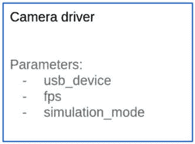
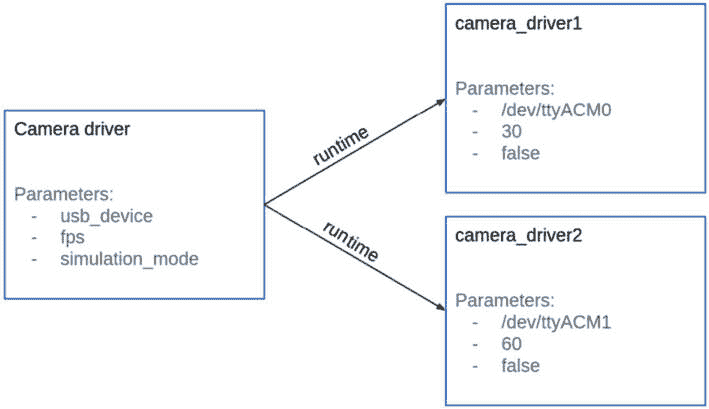

# 第八章：参数 – 使节点更加动态

我们现在已经完成了 ROS 2 通信的基础。在本章中，我们将继续在节点上工作，但这次是通过使用**参数**使它们更加动态。

为了理解参数，我将从为什么一开始就需要它们开始。然后，你将学习如何将参数添加到你的节点中，以便你可以在运行时自定义它们。你还将看到如何使用**YAML**文件一次性加载多个参数，以及如何使用**参数回调**允许在代码中修改参数。

作为起点，我们将使用书中 GitHub 仓库的**ch7**文件夹中的代码([`github.com/PacktPublishing/ROS-2-from-Scratch`](https://github.com/PacktPublishing/ROS-2-from-Scratch))。如果你跳过了*动作*(*第七章*)，你也可以从**ch6**文件夹开始，它将起到相同的作用。本章的最终代码将在**ch8**文件夹中。

到本章结束时，你将能够将参数添加到你的任何节点中，并处理你启动的其他节点的参数。

参数的概念并不太难，代码中也不会有太多要做。然而，这是一个重要的概念，是使你的应用程序更加动态和可扩展的第一步。

本章我们将涵盖以下主题：

+   什么是 ROS 2 参数？

+   在你的节点中使用参数

+   将参数存储在 YAML 文件中

+   处理参数的附加工具

+   使用参数回调更新参数

+   参数挑战

# 什么是 ROS 2 参数？

你已经在*第三章*中尝试过一些参数实验，其中你运行了一个具有不同设置的节点。

我现在将从头开始再次解释参数，并使用一个现实生活中的例子。

## 为什么需要参数？

让我们从一个问题开始，以理解参数的需求。我将使用一个相机驱动程序作为例子——我们不会编写节点；这只是用于解释。

这个相机驱动程序连接到 USB 相机，读取图像，并在 ROS 2 主题上发布。这是任何 ROS 2 硬件驱动程序的典型行为。

在这个节点内部，你将有一些用于不同设置的变量。以下是一些示例：

+   USB 设备名称

+   每秒帧数（FPS）

+   模拟模式

假设你正在工作的相机连接到**/dev/ttyUSB0**端口（Linux 上典型的 USB 端口名称）。你想要设置**60** FPS 并且不使用模拟模式（**false**）。这些就是你要在节点内部写入的变量值。

之后，如果 USB 设备名称不同（例如，**/dev/ttyUSB1**），你将不得不在代码中更改该设置，也许需要重新构建——如果你想要以**30** FPS 而不是**60** FPS 启动相机，或者想要在模拟模式下运行它，你将做同样的事情。

那么，如果你有两个摄像头，并且你想同时使用它们呢？你会为每个摄像头复制代码吗？你如何处理两个摄像头的不同设置？

如您所见，在代码中硬编码这些设置并不是一个很好的重用选项。这就是为什么我们有 ROS 2 参数。

## 带有参数的节点示例

ROS 2 参数基本上是一个节点设置，你可以在启动节点时修改它。

因此，如果我们保持摄像头驱动程序的示例，我们可以添加三个参数——USB 设备名称（字符串）、帧率值（整数）和模拟模式（布尔值）：



图 8.1 – 具有三个参数的节点类

当你使用**ros2 run**（我们将在本章后面看到如何操作）启动这个摄像头驱动程序时，你将能够为这三个参数提供你想要的值。

假设你想为两个不同的摄像头启动两个节点，以下是一些设置：

1.  端口：`/dev/ttyUSB0`；帧率：`30`；模拟模式：关闭

1.  端口：`/dev/ttyUSB1`；帧率：`60`；模拟模式：关闭

在代码中添加的参数使我们能够以不同的值多次启动相同的节点：



图 8.2 – 使用不同设置启动两个节点

从相同的代码中，我们启动了两个不同的节点。在运行时，我们重命名了节点（因为我们不能有两个同名节点），并提供了参数的值。

我们的两个摄像头节点现在正在运行，每个节点都有不同的配置。你可以停止一个摄像头节点，然后使用不同的值重新启动它。

## ROS 2 参数 – 总结

使用参数，你可以重用相同的代码并使用不同的设置启动多个节点。无需再次编译或构建任何东西；你只需在运行时提供参数的值即可。

使你的节点可定制可以提供更大的灵活性和重用性。你的应用程序将变得更加动态。

参数也非常方便与其他 ROS 开发者协作。如果你开发了一个可以被其他人重用的节点，那么通过参数，你可以允许其他开发者完全定制节点，甚至无需查看代码。这也适用于使用现有节点。许多节点可以在运行时进行配置。

关于参数的几个重要点：

+   就像变量一样，参数有一个名称和数据类型。在最常见的类型中，你可以使用布尔值、整数、浮点数、字符串以及这些类型的列表。

+   参数的值是针对特定节点的。如果你杀死节点，该值也会随之消失。

+   当你使用`ros2 run`（我们将在下一章中看到如何操作）启动一个节点时，你可以设置每个参数的值。

现在，如何将参数添加到您的代码中？对于节点、主题和服务，您将从**rclpy**和**rclcpp**库中获得您所需的一切。您将能够在您的代码中声明参数并获取每个参数的值。

# 在您的节点中使用参数

我们将继续使用前几章中编写的代码。在这里，我们将改进**number_publisher**节点。作为一个快速回顾，这个节点会在一个主题上以给定的速率发布一个数字。数字和发布速率直接在代码中写出。

现在，我们不再将数字和发布速率值硬编码，而是将使用参数。这样，我们就可以在启动节点时指定要发布的数字和发布频率或周期。

您需要遵循两个步骤才能在您的代码中使用参数：

1.  在节点中声明参数。这将使参数存在于节点中，这样您就可以在启动节点时使用`ros2 run`来设置其值。

1.  获取参数的值，以便您可以在代码中使用它。

让我们从 Python 开始，稍后我们还将看到 C++代码。

## 使用 Python 声明、获取和使用参数

在使用参数之前，我们需要声明它。我们应该在哪里声明参数？我们将在节点的构造函数中这样做，在所有其他操作之前。要声明参数，请使用**Node**类的**declare_parameter()**方法。

您将提供两个参数：

+   **参数名称**：这是您将在运行时设置参数值的名称

+   **默认值**：如果运行时没有提供参数值，将使用此值

实际上，声明参数有不同的方式。如果您提供了参数类型，您不一定需要提供默认值。然而，我们将保持这种方式，因为它可能会使您的生活更加轻松。为每个参数添加默认值是一个最佳实践。

打开**number_publisher.py**文件，让我们在构造函数中声明两个参数：

```py
self.declare_parameter("number", 2)
self.declare_parameter("publish_period", 1.0)
```

参数由一个名称和一个数据类型定义。在这里，您选择名称，数据类型将根据您提供的默认值自动设置。在这个例子中，**number**的默认值是**2**，这意味着参数的数据类型是整数。对于**publish_period**参数，默认值是**1.0**，这是一个浮点数。

这里有一些不同数据类型的示例：

+   `self.declare_parameter("simulation_mode", False)`

+   `self.declare_parameter("device_name", "/dev/ttyUSB0")`

+   `self.declare_parameter("numbers", [4, 5, 6])`

现在，声明一个参数意味着它在节点内部存在，并且您可以从外部设置一个值。然而，在您的代码中，为了能够使用该参数，仅仅声明它是远远不够的。在这样做之后，您还需要获取该值。

对于这一点，你需要使用 **get_parameter()** 方法，并将参数的名称作为参数提供。然后，你可以使用 **value** 属性来访问其值：

```py
self.number_ = self.get_parameter("number").value
self.timer_period_ = self.get_parameter(
    "publish_period"
).value
```

在代码的这个位置，**number_** 变量（它是一个类属性）包含在运行时使用 **ros2 run** 设置的 **number** 参数的值。

注意

在获取参数值之前，你总是需要声明一个参数。如果你没有这样做，当启动节点时，一旦尝试获取值，你将立即收到一个异常（`ParameterNotDeclaredException`）。

在获取所有参数的值并将它们存储在变量或类属性中之后，你可以在你的代码中使用它们。在这里，我们修改了计时器回调：

```py
self.number_timer_ = self.create_timer(
    self.timer_period_, self.publish_number
)
```

通过这种方式，我们根据参数的值设置了发布周期。

代码部分就到这里。如你所见，并没有什么太复杂的。对于一个参数，你只需要添加两条指令：一条用于声明参数（给它一个名字和一个默认值），另一条用于获取其值。

现在，我一直在谈论如何使用 **ros2 run** 在运行时设置参数的值。我们该如何做呢？

## 在运行时提供参数

在继续之前，请确保保存 **number_publisher.py** 文件并构建 **my_py_pkg** 包（如果你之前没有使用过 **--****symlink-install**）。

要使用 **ros2 run** 命令提供参数的值，请按照以下步骤操作：

1.  你首先使用 `ros2 run <``package_name> <exec_name>` 启动你的节点。

1.  然后，要在该命令之后添加任何参数，你必须写 `--ros-args`（只写一次）。

1.  要指定参数的值，请写 `-p <param_name>:=<param_value>`。你可以添加任意多的参数。

假设我们想要每 **0.5** 秒发布数字 **3**，在这种情况下，我们将运行以下命令：

```py
$ ros2 run my_py_pkg number_publisher --ros-args -p number:=3 -p publish_period:=0.5
```

为了验证它是否工作，我们可以订阅 **/****number** 主题：

```py
$ ros2 topic echo /number
data: 3
---
data: 3
---
```

我们还可以验证发布速率：

```py
$ ros2 topic hz /number
average rate: 2.000
    min: 0.500s max: 0.500s std dev: 0.00004s window: 3
```

那么，发生了什么？你在运行时为不同的参数提供了一些值。节点将启动并识别这些参数，因为它们的名称与代码中声明的名称相匹配。然后，节点可以获取每个参数的值。

如果你为参数提供了错误的数据类型，你将收到一个错误。如前所述，数据类型是在代码中从默认值设置的。在这个例子中，**number** 参数应该是一个整数。看看如果我们尝试设置一个双精度值会发生什么：

```py
$ ros2 run my_py_pkg number_publisher --ros-args -p number:=3.14
…
    raise InvalidParameterTypeException(
rclpy.exceptions.InvalidParameterTypeException: Trying to set parameter 'number' to '3.14' of type 'DOUBLE', expecting type 'INTEGER': number
[ros2run]: Process exited with failure 1
```

如你所见，一旦在代码中设置了参数类型，你必须在提供运行时值时始终使用完全相同的类型。

由于每个参数都有一个默认值，你也可以省略一个或多个参数：

```py
$ ros2 run my_py_pkg number_publisher --ros-args -p number:=3
```

在这种情况下，**publish_period** 参数将被设置为代码中定义的默认值（**1.0**）。

为了结束这里，让我们看看一个例子，其中重命名节点和设置参数值可以让你从相同的代码中运行多个不同的节点，而无需修改代码中的任何内容。

在终端 1 中运行以下命令：

```py
$ ros2 run my_py_pkg number_publisher --ros-args -r __node:=num_pub1 -p number:=3 -p publish_period:=0.5
```

在终端 2 中运行以下命令：

```py
$ ros2 run my_py_pkg number_publisher --ros-args -r __node:=num_pub2 -p number:=4 -p publish_period:=1.0
```

这样，你就有两个节点（**num_pub1** 和 **num_pub2**），它们都发布到 **/number** 主题，但数据不同且发布速率不同。通过这个示例，你可以看到参数是使你的节点更加动态的绝佳方式。

让我们现在用参数的 C++代码来完成这个部分。

## C++中的参数

参数对于 Python 和 C++的工作方式相同；只是语法不同。在这里，我们将修改 **number_publisher.cpp** 文件。

在构造函数中，你可以声明一些参数：

```py
this->declare_parameter("number", 2);
this->declare_parameter("publish_period", 1.0);
```

我们使用 **rclcpp::Node** 类的 **declare_parameter()** 方法。参数与 Python 中的相同：名称和默认值。从这个值中，参数类型将被设置。

然后，要在代码中获取一个参数的值，请编写以下内容：

```py
number_ = this->get_parameter("number").as_int();
double timer_period = this->get_parameter("publish_period")
                            .as_double();
```

我们使用 **get_parameter()** 方法并提供参数的名称。然后，我们使用对应于数据类型的方法获取值：**as_int()**、**as_double()**、**as_string()**、**as_string_array()** 等。如果你有一个具有自动完成的 IDE，你应该能够看到所有可能的数据类型。

其余部分与 Python 相同。请参考 GitHub 文件以了解任何其他细微的更改和添加。

要带参数启动节点，请运行以下命令：

```py
$ ros2 run my_cpp_pkg number_publisher --ros-args -p number:=4 -p publish_period:=1.2
```

与参数一起工作并不那么困难。对于你想要创建的每个参数，你必须在代码中声明它并获取其值。当从终端启动节点时，你可以为每个参数指定一个值。

现在，这只有在参数数量较少的情况下才有效。在实际应用程序中，一个节点有几十个甚至几百个参数并不罕见。你如何管理这么多参数？

# 将参数存储在 YAML 文件中

随着你的 ROS 2 应用程序的增长，参数的数量也会增加。从命令行添加 10 个或更多的参数已经不再是可行的选项。

幸运的是，你可以使用 YAML 文件来存储你的参数，并且你可以在运行时加载这些文件。如果你不了解 YAML，它基本上是一种标记语言，类似于 XML 和 JSON，但据说比人类更容易阅读。

在本节中，你将学习如何将你的参数添加到 YAML 文件中，以及如何在运行时加载此文件。

## 从 YAML 文件加载参数

让我们先保存参数到一个文件中，这样我们就可以在启动节点时使用它们。

首先，创建一个具有 **.yaml** 扩展名的 YAML 文件。文件名并不那么重要，但最好给它一个有意义的名字。由于我们的应用程序处理数字，我们可以将其命名为 **number_params.yaml**。

现在，让我们在我们的主目录中创建一个新文件（在下一章中，我们将看到如何在 ROS 2 应用程序中正确安装 YAML 文件）：

```py
$ cd ~
$ touch number_params.yaml
```

编辑此文件并添加 **/****number_publisher** 节点的参数：

```py
/number_publisher:
  ros__parameters:
    number: 7
    publish_period: 0.8
```

首先，你写下节点的名称。在下一行，并使用缩进（通常建议使用两个空格），我们添加 **ros__parameters**（确保你使用两个下划线）。这将是 YAML 文件中每个节点的相同设置。在接下来的几行中，并使用更多的缩进，你可以添加节点的所有参数值。

注意

确保节点名称匹配；否则，参数不会被加载到节点中。如果你省略了前面的斜杠，使用 `ros2 run` 加载参数仍然可以工作，但可能会与其他命令出现问题。

一旦你编写了这个文件，你可以使用 **--params-file** 参数来加载参数：

```py
$ ros2 run my_py_pkg number_publisher --ros-args --params-file ~/number_params.yaml
```

这将启动节点并指定 **number** 和 **publish_period** 参数的值。

如果你有两个或五十个参数，**ros2 run** 命令保持不变。你所要做的就是向 YAML 文件中添加更多参数。如果你想修改一个参数，你可以修改文件中的对应行，甚至为不同的配置集创建几个文件。

## 多个节点的参数

如果你想为多个节点保存参数，你应该怎么做？

好消息：在一个 param YAML 文件中，你可以为任意多个节点添加配置。以下是一个示例：

```py
/num_pub1:
  ros__parameters:
    number: 3
    publish_period: 0.5
/num_pub2:
  ros__parameters:
    number: 4
    publish_period: 1.0
```

这对应于我们之前运行过的示例，有两个节点和不同的参数。

现在，为了启动相同的节点和参数，我们只需要运行下面的命令。

在终端 1 中，运行以下命令：

```py
$ ros2 run my_py_pkg number_publisher --ros-args -r __node:=num_pub1 --params-file ~/number_params.yaml
```

在终端 2 中，运行以下命令：

```py
$ ros2 run my_py_pkg number_publisher --ros-args -r __node:=num_pub2 --params-file ~/number_params.yaml
```

我们将相同的 YAML 文件给两个节点。每个节点将只加载在节点名称下定义的参数值。

## 回顾所有参数的数据类型

假设你已经在你的代码中声明了所有这些参数（仅以 Python 为例，但你可以轻松地将其转换为 C++）：

```py
self.declare_parameter("bool_value", False)
self.declare_parameter("int_number", 1)
self.declare_parameter("float_number", 0.0)
self.declare_parameter("str_text", "Hola")
self.declare_parameter("int_array", [1, 2, 3])
self.declare_parameter("float_array", [3.14, 1.2])
self.declare_parameter("str_array", ["default", "values"])
self.declare_parameter("bytes_array", [0x03, 0xA1])
```

这些基本上是参数的所有可用数据类型。

要指定每个参数的值，你可以创建一个 YAML 文件或在现有的 YAML 文件中添加一些配置。以下是为你这个节点（命名为 **your_node**）编写的代码：

```py
/your_node:
  ros__parameters:
     bool_value: True
     int_number: 5
     float_number: 3.14
     str_text: "Hello"
     bool_array: [True, False, True]
     int_array: [10, 11, 12, 13]
     float_array: [7.5, 400.4]
     str_array: ['Nice', 'more', 'params']
     bytes_array: [0x01, 0xF1, 0xA2]
```

使用 YAML 文件，你可以快速高效地自定义节点。我建议在参数超过几个时立即使用它们。

此外，随着你继续使用 ROS 2，你将开始使用其他开发者开发的节点和完整的堆栈。这些节点通常附带一些 YAML 文件，允许你配置堆栈而无需直接更改节点中的任何内容。

现在我们继续介绍命令行工具。你已经使用 **ros2 run** 设置了参数的值，但实际上还有更多工具可以处理参数。

# 处理参数的附加工具

你开始习惯了：对于每个 ROS 2 核心概念，我们都有一个专门的 **ros2** 命令行工具。对于参数，我们有 **ros2 param**。

您可以使用 **ros2 param -h** 查看所有命令。让我们关注最重要的命令，以便我们可以从终端获取参数值，并在节点启动后设置一些值。在本节的最后，我们还将探索所有节点可用的不同参数服务。

## 从终端获取参数值

在您启动了一个或多个节点后，您可以使用 **ros2 param list** 列出所有可用的参数。

停止所有节点并启动两个节点，**num_pub1** 和 **num_pub2**，可以通过使用 YAML 文件或手动提供参数值来实现。

在终端 1 中运行以下命令：

```py
$ ros2 run my_py_pkg number_publisher --ros-args -r __node:=num_pub1 -p number:=3 -p publish_period:=0.5
```

在终端 2 中运行以下命令：

```py
$ ros2 run my_py_pkg number_publisher --ros-args -r __node:=num_pub2 -p number:=4 -p publish_period:=1.0
```

现在，列出所有可用的参数：

```py
$ ros2 param list
/num_pub1:
  number
  publish_period
  start_type_description_service
  use_sim_time
/num_pub2:
  number
  publish_period
  start_type_description_service
  use_sim_time
```

在这里，我启动了两个节点以向您展示每个节点都有自己的参数集。**/num_pub1** 中的 **number** 参数与 **/num_pub2** 中的 **number** 参数不同。

注意

对于每个参数，我们也会始终获取一个 `use_sim_time` 参数，默认值为 `false`。这意味着我们使用系统时钟。如果我们正在模拟机器人，我们会将其设置为 `true`，以便我们可以使用模拟引擎时钟。这对现在来说并不重要，您可以忽略此参数。您也可以忽略 `start_type_description_service` 参数。

从此，您可以使用 **ros2 param get <节点名> <参数名>** 获取一个特定参数的值：

```py
$ ros2 param get /num_pub1 number
Integer value is: 3
$ ros2 param get /num_pub2 number
Integer value is: 4
```

这对应于我们在启动节点时设置的值。使用 **ros2 param get** 允许您检查任何运行节点内部的参数。

## 将参数导出到 YAML

如果您想获取一个节点的完整参数集，可以使用 **ros2 param dump <节点名>** 来实现。

让我们列出我们正在运行的节点上的所有参数。

对于第一个节点，运行以下命令：

```py
$ ros2 param dump /num_pub1
/num_pub1:
  ros__parameters:
    number: 3
    publish_period: 0.5
    start_type_description_service: true
    use_sim_time: false
```

对于第二个节点，运行以下命令：

```py
$ ros2 param dump /num_pub2
/num_pub2:
  ros__parameters:
    number: 4
    publish_period: 1.0
    start_type_description_service: true
    use_sim_time: false
```

如您所见，输出结果正是您需要写入 YAML 文件中的内容。您可以将终端中获取的内容复制粘贴，创建自己的 YAML 文件以供稍后加载（无需设置 **use_sim_time** 和 **start_type_description_service**）。

这个 **ros2 param dump** 命令可以用于一次性获取所有参数值，并快速构建一个参数 YAML 文件。

## 从终端设置参数值

参数实际上并不是在节点的整个生命周期中固定不变的。在您使用 **ros2 run** 初始化参数值后，您可以从终端修改它。

以我们的相机驱动程序为例，假设您断开并重新连接相机。在 Linux 上，设备名称可能会改变。如果它是 **/dev/ttyUSB0**，现在它可能是 **/dev/ttyUSB1**。您可以通过为设备名称参数设置不同的值来停止并重新启动节点，但使用 **ros2 param set** 命令，您也可以在节点仍在运行时直接更改值。

为了向您展示它是如何工作的，让我们回到我们的数字应用。

停止所有节点并启动一个**number_publisher**节点（在这里，我不提供任何参数；我们将使用默认值）：

```py
$ ros2 run my_py_pkg number_publisher
```

让我们验证**number**参数的值：

```py
$ ros2 param get /number_publisher number
Integer value is: 2
```

要从终端修改参数，您必须运行**ros2 param set <node_name> <param_name> <new_value>**，如下面的示例所示：

```py
$ ros2 param set /number_publisher number 3
Set parameter successful
```

当然，请确保为参数提供正确的数据类型；否则，您将得到一个错误。您还可以使用**ros2 param load <node_name> <yaml_file>**直接加载 YAML 文件，这样您可以同时设置多个参数：

```py
$ ros2 param load /number_publisher ~/number_params.yaml
Set parameter number successful
Set parameter publish_period successful
```

修改参数后，我们再次检查参数的值：

```py
$ ros2 param get /number_publisher number
Integer value is: 7
```

如您所见，值已成功更改。然而，这真的有效吗？代码中使用了新参数的值吗？

让我们验证我们是否正在发布正确的数字：

```py
$ ros2 topic echo /number
data: 2
---
```

即使我们已经更改了参数的值，新的值也没有在代码内部更新。为了做到这一点，我们需要添加一个参数回调。这就是我们将在下一分钟看到的内容，但现在，让我们通过额外存在的允许您管理参数的服务来完成这个部分。

## 参数服务

如果您还记得，当我们处理服务时，您看到对于每个节点，我们得到了一组额外的七个服务，其中大多数与参数相关。

列出**number_publisher**节点的所有服务：

```py
$ ros2 service list
/number_publisher/describe_parameters
/number_publisher/get_parameter_types
/number_publisher/get_parameters
/number_publisher/get_type_description
/number_publisher/list_parameters
/number_publisher/set_parameters
/number_publisher/set_parameters_atomically
```

使用这些服务，您可以列出参数，获取它们的值，甚至设置新值。这些服务基本上提供了与**ros2 param**命令行工具相同的函数。

这是一个好消息，因为从终端获取和设置参数在真实应用中并不实用且可扩展。通过使用这些服务，您可以在节点 A 中创建一个服务客户端，该客户端将获取或修改节点 B 中的参数。

我不会深入探讨这个问题；您可以自己尝试使用您在*第六章*中看到的内容。这里我们通过修改**number**参数来做一个小例子。首先，让我们检查您需要使用哪个接口：

```py
$ ros2 service type /number_publisher/set_parameters
rcl_interfaces/srv/SetParameters
```

然后，您可以使用**ros2 interface show**获取更多详细信息。最后，您可以在节点内部创建一个服务客户端来修改一个参数。让我们从终端这样做：

```py
$ ros2 service call /number_publisher/set_parameters rcl_interfaces/srv/SetParameters "{parameters: [{name: 'number', value: {type: 2, integer_value: 3}}]}"
```

这与运行**ros2 param set /number_publisher number 3**相同。服务的好处是您可以在任何其他节点中使用它，使用来自**rclpy**或**rclcpp**的服务客户端。

如果您想知道服务请求中的**type: 2**是什么意思，这里列出了您可以使用参数服务获取或设置的 所有类型：

```py
$ ros2 interface show rcl_interfaces/msg/ParameterType
uint8 PARAMETER_NOT_SET=0
uint8 PARAMETER_BOOL=1
uint8 PARAMETER_INTEGER=2
uint8 PARAMETER_DOUBLE=3
uint8 PARAMETER_STRING=4
uint8 PARAMETER_BYTE_ARRAY=5
uint8 PARAMETER_BOOL_ARRAY=6
uint8 PARAMETER_INTEGER_ARRAY=7
uint8 PARAMETER_DOUBLE_ARRAY=8
uint8 PARAMETER_STRING_ARRAY=9
```

因此，数字**2**对应于**PARAMETER_INTEGER**类型。

现在您已经看到了如何在节点运行时设置参数的值，让我们继续讨论参数回调。到目前为止的问题是我们修改参数时，值没有*到达*代码。

# 使用参数回调更新参数

当节点启动时参数的值被设置后，你可以从终端或使用服务客户端进行修改。然而，为了在代码中接收新的值，你需要添加一个称为参数回调的东西。

在本节中，你将学习如何为 Python 和 C++ 实现参数回调。这个回调将在参数的值被更改时触发，我们将在代码中获取新的值。

注意

你不一定需要在你的节点中添加参数回调。对于某些参数，你希望在启动节点时有一个固定值，并且不再修改这个值。只有当在节点执行期间修改某些参数有意义时，才使用参数回调。

参数回调是改变节点设置的好方法，而不必再创建另一个服务。让我用一个相机驱动程序的例子来解释这一点。如果你想能够在节点运行时更改设备名称，默认的方法将是服务。你将在你的节点中创建一个服务服务器，接受更改设备名称的请求。然而，为节点中的每个小设置这样做可能会很麻烦。使用参数，你不仅可以在运行时提供不同的设备名称，还可以通过使用每个 ROS 2 节点已经具有的参数服务来稍后修改它。没有必要让它比这更复杂。

现在，让我们看看如何解决我们设置**number**参数新值时遇到的问题，让我们从 Python 开始。

实际上可以实施几种参数回调，但为了保持简单，我将只使用其中之一。参数回调是一个很好且有用的功能，但当你刚开始使用 ROS 2 时，它可能不是最重要的。因此，在这里你将获得功能概述，并在完成本书后自行进行更多研究（你将在*第十四章*中找到额外资源）。

## Python 参数回调

让我们编写我们的第一个 Python 参数回调。

打开**number_publisher.py**文件，并在节点构造函数中注册一个参数回调：

```py
self.add_post_set_parameters_callback(self.parameters_callback)
```

我们还添加了一条新的导入语句：

```py
from rclpy.parameter import Parameter
```

然后，我们实现回调方法：

```py
def parameters_callback(self, params: list[Parameter]):
    for param in params:
        if param.name == "number":
            self.number_ = param.value
```

在这个回调中，你将收到一个**Parameter**对象的列表。对于每个参数，你可以访问其名称、值和类型。使用**for**循环，我们遍历我们得到的每个参数，并在代码中设置相应的值。你也可以决定验证值（例如，只接受正数），但在这里我将不会这样做，以保持代码最小化。

为了进行快速测试，再次运行**number_publisher**节点（未指定参数；将使用默认值）。在另一个终端中，订阅**/****number**主题：

```py
$ ros2 topic echo /number
data: 2
---
```

现在，更改参数的值：

```py
$ ros2 param set /number_publisher number 3
Set parameter successful
```

让我们现在回到另一个终端去观察变化：

```py
$ ros2 topic echo /number
data: 3
---
```

参数的值已经更改，我们通过参数回调在代码中收到了这个值。

## C++参数回调

C++中参数回调的行为与 Python 中完全相同。让我们看看语法。打开**number_publisher.cpp**文件，并在构造函数中注册参数回调：

```py
param_callback_handle_ = this->add_post_set_parameters_callback(
    std::bind(&NumberPublisherNode::parametersCallback, this, _1));
```

这里是回调的实现：

```py
void parametersCallback(
    const std::vector<rclcpp::Parameter> & parameters)
{
    for (const auto &param: parameters) {
        if (param.get_name() == "number") {
            number_ = param.as_int();
        }
    }
}
```

我们得到了一个**rclcpp::Parameter**对象的列表。从这个列表中，我们可以使用**get_name()**方法检查每个参数的名称。如果参数的名称匹配，我们就获取值。由于我们在这里接收的是整数，我们使用**as_int()**方法。对于字符串，你会使用**as_string()**方法，等等。请参考 GitHub 文件以获取完整的代码。

你现在已经看到了参数回调的基础。你并不一定需要在所有节点中添加它们。如果你需要在节点启动后修改参数的值，它们是非常有用的。

让我们以一个额外的挑战结束这一章，以便让你更多地练习使用参数。

# 参数挑战

通过这个挑战，你将练习这一章中看到的所有内容：在代码中声明和获取参数，在运行时提供参数的值，并将值保存在 YAML 文件中。我们将跳过参数回调，但如果你也想练习这些，请随意添加。

对于挑战，我首先会解释挑战的内容，然后提供 Python 解决方案。你可以在书的 GitHub 仓库中找到 Python 和 C++的完整代码。

## 挑战

我们将继续改进**turtle_controller**节点。对于这个挑战，我们希望在运行时能够选择不同的设置：

+   右侧的笔颜色

+   左侧的笔颜色

+   要在`cmd_vel`主题上发布的速度

为了做到这一点，你需要添加以下参数：

+   `color_1`：当海龟位于右侧时，我们不再随意选择颜色，而是将颜色重命名为`color_1`，并从参数中获取值。这个参数将是一个包含三个值（`红色`、`绿色`、`蓝色`）的整数列表。

+   `color_2`：与`color_1`相同，这是海龟位于屏幕左侧时使用的颜色。

+   `turtle_velocity`：默认情况下，我们为发送到`cmd_vel`主题的速度使用了`1.0`和`2.0`。我们将其作为一个参数，以便在运行时提供速度。我们将使用`turtle_velocity`和`turtle_velocity * 2.0`代替`1.0`和`2.0`。

为了测试这个节点，你需要使用**ros2 run**启动**turtle_controller**节点，并为参数提供不同的值。你应该通过观察海龟移动的速度和笔的颜色来检查它是否工作。如果需要，可以在代码中添加一些日志来查看发生了什么。

作为这个挑战的最后一步，你可以将所有参数放入一个 YAML 文件中，并在运行时加载这个 YAML 文件。

## 解决方案

让我们先声明我们将需要用于这个挑战的参数。

打开 **turtle_controller.py** 文件。让我们在节点构造函数的开始处声明一些参数：

```py
self.declare_parameter("color_1", [255, 0, 0])
self.declare_parameter("color_2", [0, 255, 0])
self.declare_parameter("turtle_velocity", 1.0)
```

我们提供了与之前硬编码的相同值的默认值。因此，如果我们不提供任何参数就启动节点，行为将与之前相同。

声明参数后，我们可以获取它们的值：

```py
self.color_1_ = self.get_parameter("color_1").value
self.color_2_ = self.get_parameter("color_2").value
self.turtle_velocity_ = self.get_parameter("turtle_velocity").value
```

我们将值存储在类属性中，以便我们可以在代码的后续部分重用它们。

注意

作为提醒，在 Python 中，别忘了在 `get_parameter()` 后面添加 `.value`（不带任何括号）。这是一个常见的错误，当启动节点时会导致异常。

然后，我们在 **callback_pose()** 方法中修改了几行：

```py
if pose.x < 5.5:
    cmd.linear.x = self.turtle_velocity_
    cmd.angular.z = self.turtle_velocity_
else:
    cmd.linear.x = self.turtle_velocity_ * 2.0
    cmd.angular.z = self.turtle_velocity_ * 2.0
self.cmd_vel_pub_.publish(cmd)
```

我们不是使用硬编码的速率值，而是使用我们从参数中获取的值。

然后，我们设置笔的颜色：

```py
if pose.x > 5.5 and self.previous_x_ <= 5.5:
    self.previous_x_ = pose.x
    self.get_logger().info("Set color 1.")
    self.call_set_pen(
        self.color_1_[0],
        self.color_1_[1],
        self.color_1_[2]
    )
elif pose.x <= 5.5 and self.previous_x_ > 5.5:
    self.previous_x_ = pose.x
    self.get_logger().info("Set color 2.")
    self.call_set_pen(
        self.color_2_[0],
        self.color_2_[1],
        self.color_2_[2]
    )
```

在这里，我们修改了日志，使其更有意义，因为颜色可以是任何东西。

最后，有几种不同的方法可以将整数数组传递给 **call_set_pen()** 方法。你可以修改 **call_set_pen()**，使其接收一个包含三个整数的数组并从中提取每个数字。或者，像我这里做的那样，你不需要修改该方法，只需确保传递正确的参数即可。

代码现在已完成。要测试它，在一个终端中启动 **turtlesim** 节点，在另一个终端中启动 **turtle_controller** 节点。你可以为参数提供不同的值。例如，如果我们想速度为 **1.5**，颜色为黑白，我们运行以下命令：

```py
$ ros2 run turtle_controller turtle_controller --ros-args -p color_1:=[0,0,0] -p color_2:=[255,255,255] -p turtle_velocity:=1.5
```

你也可以将这些参数保存在一个 YAML 文件中。创建一个新的 YAML 文件（例如，在你的家目录中），命名为 **turtle_params.yaml**。在这个文件中，写入以下内容：

```py
/turtle_controller:
  ros__parameters:
    color_1: [0, 0, 0]
    color_2: [255, 255, 255]
    turtle_velocity: 1.5
```

然后，你可以直接使用 YAML 文件启动 turtle 控制器节点：

```py
$ ros2 run turtle_controller turtle_controller --ros-args --params-file ~/turtle_params.yaml
```

这个挑战就到这里。最后，对于每个参数，我们做了三件事：我们声明了它，获取了它的值，并在代码中使用了它。这并不复杂，如果你只是知道如何做，你将能够成功地处理你未来 ROS 2 应用程序中的参数。

# 摘要

在这一章中，你处理了参数。参数允许你在运行时为你的节点提供设置。因此，使用相同的代码，你可以启动具有不同配置的几个不同的节点。这大大增加了代码的可重用性。

要处理节点中的参数，请遵循以下指南：

1.  声明参数，使其在节点内存在。最佳实践是设置一个默认值。这个值也将设置参数的类型。

1.  获取参数的值并将其存储在你的节点中——例如，在一个私有属性中。

1.  在你的代码中使用这个值。

然后，当你使用 **ros2 run** 启动一个节点时，你可以指定任何你想要的参数值。

您还可以将参数组织在一个 YAML 文件中，当您开始拥有超过几个参数时，这将变得非常方便。您将在启动节点时加载该 YAML 文件。

最后，您还可以决定在启动节点后允许修改参数。为此，您需要实现参数回调。

参数使您的节点变得更加动态。在您运行的几乎每一个节点中，您都会拥有参数。使用它们可以更容易地通过加载不同的配置集来扩展您的应用程序。

说到扩展，在下一章中，我们将深入探讨启动文件。使用启动文件，您可以同时启动多个节点和参数。当您的应用程序开始增长时，这将非常有帮助。
