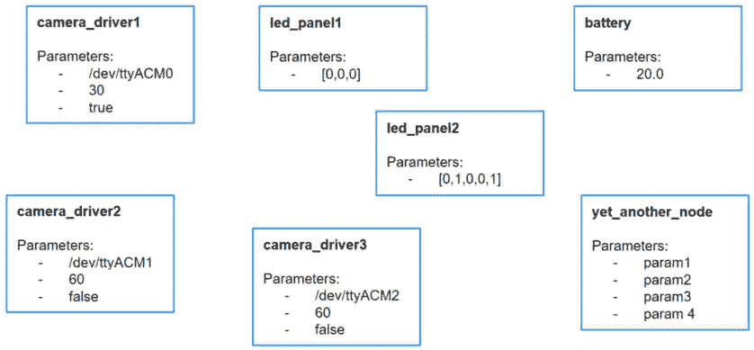
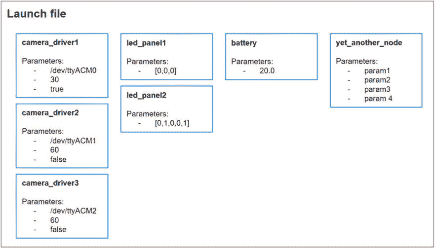
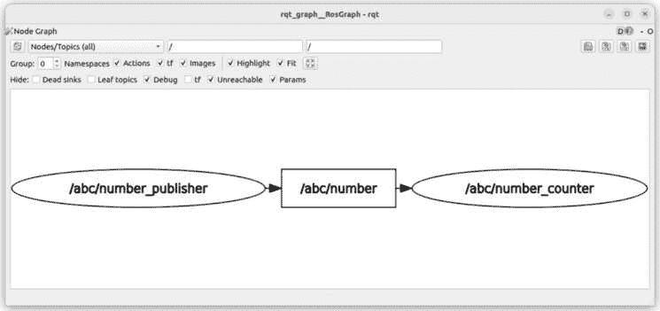
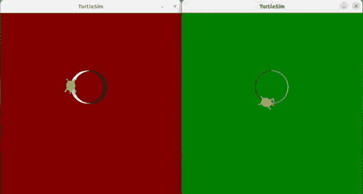

# 9

# 启动文件 – 同时启动所有节点

到目前为止，你知道如何编写节点，如何使它们通过主题、服务和动作进行通信，以及如何通过参数使它们更加动态。

在本节 *第二部分* 的最后一章中，我们将把所有内容整合起来，并进一步使你的应用程序更具可扩展性。在这里，我们将讨论启动文件，它允许你一次性启动所有节点和参数。

要开始使用启动文件，重要的是你对前几章中看到的概念感到舒适。作为一个起点，我们将使用书中 GitHub 仓库（[`github.com/PacktPublishing/ROS-2-from-Scratch`](https://github.com/PacktPublishing/ROS-2-from-Scratch)）中的 **ch8** 文件夹内的代码。你可以在 **ch9** 文件夹中找到启动文件的最终代码。

首先，像往常一样，我将使用一个真实世界的例子来解释为什么你需要启动文件以及它们究竟是什么。然后，你将深入代码，使用 XML 和 Python 创建你自己的启动文件（我们将讨论哪种语言更合适）。你还将通过额外的配置来完全自定义启动文件内的节点，并通过最后的挑战进行更多的练习。

到本章结束时，你将能够正确地扩展你的 ROS 2 应用程序，并知道如何使用或修改现有的启动文件。几乎每个 ROS 2 应用程序或堆栈都包含一个或多个启动文件。对这些文件感到舒适是成为一名优秀的 ROS 开发者的关键。

在本章中，我们将涵盖以下主题：

+   ROS 2 启动文件是什么？

+   创建和安装 XML 启动文件

+   创建一个 Python 启动文件 – 启动文件使用 XML 还是 Python？

+   在启动文件中配置节点

+   启动文件挑战

# ROS 2 启动文件是什么？

在你已经学到的所有内容的基础上，理解启动文件的概念不会非常困难。

你已经在 *第三章* 中对启动文件进行了一些实验。现在，我们将像往常一样从头开始，通过一个示例来了解启动文件是什么。首先，我们将探讨为什么我们需要启动文件。

## 为什么需要启动文件？

随着你的 ROS 2 应用程序开始增长，节点和参数的数量也在增加。例如，我为一个机械臂开发的 ROS 栈有超过 15 个节点和 200 个参数。想象一下打开 15 个终端，并逐个启动所有节点，同时为每个参数设置正确的值。这很快就会变成一场噩梦。

为了解释这一点，让我们假设在我们的应用程序中有以下节点：

+   具有不同设置的三个相机节点

+   具有不同数量 LED 的两个 LED 面板节点

+   一个电池节点

+   另一个具有更多参数的节点

这就是你的应用程序看起来会是什么样子：



图 9.1 – 具有七个节点和十六个参数的 ROS 2 应用

要启动所有这些节点，您需要打开七个终端并逐个启动节点。对于每个节点，您还需要提供所有必需参数的值（根据您在上一章中看到的，您可以使用 YAML 参数文件来简化这个过程）。这不仅不可扩展，而且会使您的开发过程变得缓慢且令人沮丧。有这么多终端，很容易出错或忘记哪个终端在做什么。

您可以考虑的一个解决方案是创建一个脚本（例如 bash 脚本）来从一个文件中启动所有**ros2 run**命令。这样，您就可以从一个终端运行您的应用程序。这将减少开发时间，并允许您的应用程序扩展。

嗯，这正是启动文件的作用所在。您不需要编写自己的脚本；您需要做的只是创建一个启动文件并遵循一些语法规则。启动文件可以安装到您的 ROS 2 应用程序中。让我们在下一节中看看一个例子。

## 七节点启动文件的示例

如果我们继续我们的例子，以下是您的节点组织方式：



图 9.2 – 包含所有节点和参数的启动文件

在一个文件中，您启动所有节点并为每个参数提供您想要的值。这个文件可以用 XML、YAML 或 Python 编写——我们稍后会看到如何做到这一点。然后，一旦编写了启动文件，您将使用**colcon build**安装它，并使用**ros2 launch**命令行工具运行它。

在一个应用程序中拥有几十个节点和几百个参数并不罕见。没有启动文件，您将无法快速启动应用程序，您将花费大部分时间调试琐碎的事情。

启动文件允许您轻松地自定义和扩展您的应用程序。没有太多可说的；这个概念相当直接。大部分工作都是关于学习如何实现一个，以及了解如何自定义节点以使它们更加动态的功能。这正是我们现在要深入探讨的。

# 创建和安装 XML 启动文件

现在，您将创建您的第一个启动文件。我们将从 XML 开始。在本章的后面部分，我们还将编写 Python 启动文件，并比较这两种语言，但为了便于入门，让我们保持简单。

要正确创建、安装和启动一个启动文件，您需要进行一些设置。在本节中，我们将使用一个最小启动文件遵循所有必要的设置步骤。

我们在这里想做的事情是从一个终端启动数字应用程序（**number_publisher**和**number_counter**节点），只使用一条命令行。让我们开始吧。

## 为启动文件设置包

您应该把启动文件放在哪里？从理论上讲，您可以在任何现有包中创建启动文件。

然而，这种方法可能会迅速导致包之间的依赖混乱。如果包 A 需要包 B，而你又在包 B 中创建了一个启动文件来启动这两个包的节点，那么你就创建了一个所谓的*依赖循环*。包 A 依赖于包 B，而包 B 又依赖于包 A。这是启动 ROS 应用程序的一个非常糟糕的方式。

作为最佳实践，我们将创建一个专门用于启动文件的包。我们不会修改任何现有的包；相反，我们将创建一个完全独立的包。

首先，让我们为这个包选择一个名字。我们将遵循一个常见的命名约定。我们以机器人或应用程序的名字开头，后面跟着**_bringup**后缀。由于我们这里没有机器人，我们将把这个包命名为**my_robot_bringup**。如果你的机器人名字是*abc*，你会创建一个**abc_bringup**包。

导航到你的 ROS 2 工作空间中的**src**目录并创建这个包。它将不包含任何 Python 或 C++节点。对于构建类型，你可以选择**ament_cmake**（你也可以省略构建类型，因为**ament_cmake**已经是默认的）：

```py
$ cd ~/ros2_ws/src/
$ ros2 pkg create my_robot_bringup --build-type ament_cmake
```

或者，你也可以直接运行**$ ros2 pkg** **create my_robot_bringup**。

一旦创建了包，我们可以删除我们不需要的目录：

```py
$ cd my_robot_bringup/
$ rm -r include/ src/
```

然后，我们创建一个**launch**目录。这是我们将会放置所有这个应用程序的启动文件的地方：

```py
$ mkdir launch
```

在我们创建启动文件之前，让我们完成包配置。打开**CMakeLists.txt**文件并添加以下行：

```py
find_package(ament_cmake REQUIRED)
install(DIRECTORY
  launch
  DESTINATION share/${PROJECT_NAME}/
)
ament_package()
```

当你使用**colcon build**构建你的包时，这将会安装**launch**目录。

现在，包已经正确配置。你只需要为每个 ROS 2 应用程序执行这些步骤一次。然后，要添加启动文件，你只需在**launch**文件夹内创建一个新文件。让我们这么做。

## 编写 XML 启动文件

导航到你在**my_robot_bringup**包内创建的**launch**文件夹。要创建一个启动文件，你首先选择一个名字，然后使用**.launch.xml**扩展名。由于我们给我们的应用程序命名为*number app*，让我们创建一个名为**number_app.launch.xml**的新文件：

```py
$ cd ~/ros2_ws/src/my_robot_bringup/launch/
$ touch number_app.launch.xml
```

打开文件，让我们开始为启动文件编写内容。

首先，你需要打开和关闭一个**<launch>**标签。你写的所有内容都将在这两条线之间。这是 XML 启动文件的最小代码：

```py
<launch>
</launch>
```

然后，我们想要启动**number_publisher**和**number_counter**节点。

作为快速提醒，在终端中，你会运行这个：

```py
$ ros2 run my_py_pkg number_publisher
$ ros2 run my_cpp_pkg number_counter
```

在这里，我从 Python 包和一个 C++包中分别启动了一个节点。我们需要为**ros2 run**提供的两个参数是包名和可执行文件名。在启动文件中也是同样的。要添加一个节点，使用带有**pkg**和**exec**参数的**<node>**标签：

```py
<launch>
    <node pkg="my_py_pkg" exec="number_publisher"/>
    <node pkg="my_cpp_pkg" exec="number_counter"/>
</launch>
```

通过这种方式，我们从启动文件中启动了相同的两个节点。正如你所看到的，这并没有什么特别复杂的。在本章的后面部分，我们将看到如何通过重映射、参数、命名空间等来配置应用程序。现在，让我们专注于运行这个最小化的启动文件。

## 安装和启动启动文件

在开始使用之前，你必须安装你的新启动文件。

由于我们是从**my_py_pkg**和**my_cpp_pkg**包中启动节点，我们需要在**my_robot_bringup**包的**package.xml**文件中添加依赖项：

```py
<exec_depend>my_py_pkg</exec_depend>
<exec_depend>my_cpp_pkg</exec_depend>
```

注意

之前，我们只在指定依赖项时使用过`<depend>`标签。在这种情况下，没有需要构建的内容；我们只需要在执行启动文件时需要依赖项。因此，我们使用一个较弱的标签，`<exec_depend>`。

对于你在启动文件中使用的每个新包，你需要在**package.xml**文件中添加一个新的**<exec_depend>**标签。

现在，我们可以安装启动文件。要这样做，你只需要构建你的包：

```py
$ cd ~/ros2_ws/
$ colcon build --packages-select my_robot_bringup
```

然后，源你的环境，并使用**ros2 launch**命令行工具来启动启动文件。完整的命令是**ros2 launch <package_name> <launch_file_name>**：

```py
$ ros2 launch my_robot_bringup number_app.launch.xml
```

你将看到以下日志：

```py
[INFO] [launch]: All log files can be found below /home/user/.ros/log/...
[INFO] [launch]: Default logging verbosity is set to INFO
[INFO] [number_publisher-1]: process started with pid [21108]
[INFO] [number_counter-2]: process started with pid [21110]
[number_counter-2] [INFO] [1716293867.204728817] [number_counter]: Number Counter has been started.
[number_publisher-1] [INFO] [1716293867.424510088] [number_publisher]: Number publisher has been started.
[number_counter-2] [INFO] [1716293868.413350769] [number_counter]: Counter: 2
[number_counter-2] [INFO] [1716293869.413321220] [number_counter]: Counter: 4
[number_counter-2] [INFO] [1716293870.413321491] [number_counter]: Counter: 6
```

这里发生了什么？让我们仔细看看：

1.  创建了一个日志文件，并设置了日志详细程度。

1.  启动文件中提供的每个可执行文件都将作为一个新的进程启动。你可以看到进程名称（例如，`number_publisher-1`）和进程 ID（表示为`pid`）。

1.  然后，由于所有节点都在同一个终端中启动，你会看到所有节点的所有日志。

这个例子相当简单，因为我们只是启动了两个没有额外配置的可执行文件。当节点数量和设置增多时，启动文件将变得非常有用。此外，**ros2 launch**命令行工具非常容易使用。实际上，这里没有比我们看到的更多的内容。

现在你已经完成了创建、安装和启动启动文件的过程，让我们来谈谈 Python 启动文件。

# 创建 Python 启动文件 – XML 还是 Python 用于启动文件？

实际上，你可以使用三种语言在 ROS 2 中创建启动文件：Python、XML 和 YAML。我不会介绍 YAML 启动文件，因为它们很少使用，而且 YAML 在启动文件方面没有比 XML 更强的优势。在这里，我们将重点关注 Python 和 XML。

我们将从这个部分开始，创建一个 Python 启动文件（与之前相同的应用程序）。然后，我会比较 XML 和 Python 启动文件，并给你一些关于如何充分利用两者的指导。

## 编写 Python 启动文件

由于我们已经有了一个完全配置好的**my_robot_bringup**包用于我们的应用程序，因此不需要做任何事情。我们只需要在**launch**目录内创建一个新文件。

对于 Python 启动文件，你将使用 **.launch.py** 扩展名。创建一个名为 **number_app.launch.py** 的新文件。以下是启动 **number_publisher** 和 **number_counter** 节点的代码：

```py
from launch import LaunchDescription
from launch_ros.actions import Node
def generate_launch_description():
    ld = LaunchDescription()
    number_publisher = Node(
        package="my_py_pkg",
        executable="number_publisher"
    )
    number_counter = Node(
        package="my_cpp_pkg",
        executable="number_counter"
    )
    ld.add_action(number_publisher)
    ld.add_action(number_counter)
    return ld
```

你首先会注意到，代码比 XML 长得多。当我比较 Python 和 XML 时，我会在一会儿回来讨论这个问题。现在，让我们专注于编写 Python 启动文件所需的步骤：

1.  启动文件必须包含一个 `generate_launch_description()` 函数。确保你没有打错字。

1.  在这个函数中，你需要创建并返回一个 `LaunchDescription` 对象。你可以从 `launch` 模块中获取它。

1.  要在启动文件中添加一个节点，你创建一个 `Node` 对象（来自 `launch_ros.actions`），并指定包和可执行文件名。然后，你可以将此对象添加到 `LaunchDescription` 对象中。

到此为止，但还有更多选项，我们将在本章稍后探讨。

一旦你编写了启动文件，请确保在 **my_robot_bringup** 包的 **package.xml** 文件中添加所有必需的依赖项。因为我们已经用 XML 启动文件做了这件事（并且我们有相同的依赖项），所以我们可以跳过这一步。

最后，为了安装这个启动文件，重新构建 **my_robot_bringup** 包。由于我们已经在 **CMakeLists.txt** 文件中编写了必要的指令，启动文件将被安装。之后你需要做的就是设置你的环境，并使用 **ros2 launch** 命令启动启动文件：

```py
$ ros2 launch my_robot_bringup number_app.launch.py
```

要创建、安装并启动一个 Python 启动文件，其过程与 XML 启动文件相同。只是代码不同。现在让我们比较这两种语言在启动文件中的应用。

## 启动文件中的 XML 与 Python

我非常倾向于简洁，所以，从看到之前的代码示例，你就可以猜到我的立场了。

要回答 XML 与 Python 的选择问题，我们首先回顾一下过去。

### Python 启动文件的问题

在 ROS 1 的第一个版本中，XML 是启动文件使用的唯一语言。Python 实际上也是可用的，但由于没有文档，没有人知道它。

在 ROS 2 的早期，开发团队对 Python 启动文件给予了更多的重视，并开始只为 Python 编写文档，因此使其成为启动文件的默认语言。XML（和 YAML）启动文件也得到支持，但由于没有文档，没有人使用它们。

我最初对编写 Python 启动文件的想法很热情，因为这意味着你可以利用 Python 的逻辑和语法使启动文件更加动态和易于编写。这是理论，但在实践中，我发现我在大多数找到的启动文件中都没有看到任何编程逻辑，它只是另一种——更复杂和困难——编写描述的方法，而这正是 XML 存在的根本原因。

你已经可以看到在前两个例子中增加的复杂性。要启动两个节点，XML 需要 4 行，Python 需要 20 行（我可以优化代码并使其少于 15 行，但这仍然很多）。对于相同数量的节点，你可以预期 Python 启动文件比 XML 版本长两到五倍。

此外，随着更多功能（参数、终端参数、条件、路径等）的增加，你将不得不使用越来越多的 Python 导入，这些导入难以找到和使用。当你看到这本书中更多的 XML 和 Python 启动文件示例时，你会意识到这一点。

幸运的是，XML 正在回归，因为官方文档开始包括它以及 Python。越来越多的开发者又开始使用 XML 启动文件，这是一个好事，因为更多的在线教程和开源代码将包括它们。

### 如何在你的应用程序中结合 XML 和 Python 启动文件

XML 启动文件比 Python 启动文件简单得多，也小得多。然而，对于某些高级用例，Python 将是唯一的选择，因为它包含一些 XML 中不可用的功能。这可能会成为一个问题，因为如果你只需要一个 Python 功能，这意味着你需要用 Python 编写整个启动文件。

幸运的是，有一个非常简单的方法可以解决这个问题。正如我们将在下一分钟看到的，你可以将任何类型的启动文件包含到任何其他启动文件中，无论是 Python、XML 还是 YAML。

因此，如果你绝对需要为特定的启动功能使用 Python，那么就创建一个 Python 启动文件。然后，你可以将此启动文件包含在你的 *主* XML 启动文件中。你也可以包含任何其他现有的 Python 启动文件（来自已安装的包），它包含你需要的功能。通过这样做，你可以保持你的代码最小化和简单。

现在，当你需要为特定用例创建一个 Python 启动文件时，该怎么办？语法非常复杂，任何功能都有太多的导入。这很快就会成为一个挑战。

当我需要创建一个 Python 启动文件时，我会尝试在 GitHub 上找到一个现有的启动文件，它做我想做的事情，并调整代码使其与我的应用程序兼容。我已经放弃尝试学习或甚至记住 Python 启动文件的语法。我通常不是“从互联网复制粘贴”方法的粉丝，但我会为 Python 启动文件破例。

最后，这完全取决于你的选择。一个正确编写的 XML、YAML 或 Python 启动文件将完成完全相同的事情。至于 YAML，它只是另一种标记语言，我发现 XML 对于启动文件来说更容易使用。我的建议是在可能的情况下使用 XML。只有在必须使用 Python 并且仅用于需要 Python 的功能时才使用 Python。然后，将 Python 启动文件包含在你的 XML 启动文件中。

按照此过程操作将使您在开发 ROS 2 应用程序时更加轻松。

### 在另一个启动文件中包含启动文件

由于我提到了在 XML 启动文件中包含 Python 启动文件，让我们看看如何做到这一点。语法不会太复杂。

确保将**<launch></launch>**标签内的所有内容都添加进去。要包含另一个启动文件，请使用**<include>**标签。以下是一个示例：

```py
<launch>
    <include file="$(find-pkg-share         my_robot_bringup)/launch/number_app.launch.py" />
</launch>
```

这一行，使用**find-pkg-share**，将找到位于**my_robot_bringup**包内的**number_app.launch.py**启动文件的路径。然后，将包含启动文件的内容。即使您在 XML 文件中包含 Python 启动文件，这也会起作用。

您可以将此行用于任何其他 XML 启动文件；只需替换包名和启动文件名即可。

现在，如果您想执行相反的操作（这意味着在 Python 启动文件中包含 XML 启动文件），以下是您需要编写的代码：

```py
from launch import LaunchDescription
from launch.actions import IncludeLaunchDescription
from launch_xml.launch_description_sources import XMLLaunchDescriptionSource
import os
from ament_index_python import get_package_share_directory
def generate_launch_description():
    ld = LaunchDescription()
    other_launch_file = IncludeLaunchDescription(
     XMLLaunchDescriptionSource(os.path.join(
      get_package_share_directory('my_robot_bringup'),
                        'launch/number_app.launch.xml')))
    ld.add_action(other_launch_file)
    return ld
```

此代码示例说明了关于 Python 启动文件带来的额外复杂性的说法。这种复杂性在这里是不必要的，因为它与 XML 文件相比没有增加任何东西。

通过这两个代码示例，你现在可以结合任何 XML 和 Python 启动文件。

现在您已经看到了在 XML 和 Python 中创建启动文件的过程，让我们更进一步，为节点添加一些额外的配置。

# 在启动文件中配置节点

到目前为止，我们只启动了两个节点，没有额外的配置。当您使用**ros2 run**启动节点时，如我们在*第二部分*的上一章中看到的，您可以重命名它，重命名主题/服务/动作，添加参数等。

在本节中，您将学习如何在启动文件中执行此操作。我们还将介绍命名空间的概念。所有代码示例都将使用 XML 和 Python。

## 重命名节点和通信

在 XML 启动文件中，要重命名一个节点，只需在**<node>**标签中添加一个**name**参数：

```py
<node pkg="your_package" exec="your_exec" name="new_name" />
```

更改主题/服务/动作的名称实际上被称为*重映射*。要重映射通信，您必须在**<node>**标签内使用**<remap>**标签：

```py
<node pkg="your_package" exec="your_exec">
    <remap from="/topic1" to="/topic2" />
</node>
```

您可以添加任意多的**<remap>**标签，每个标签占一行。

注意

这是一个快速的 XML 提醒，但如果你不熟悉 XML，它可能很有用，可以防止未来出现很多错误。对于单行标签，您打开标签并以`/>`结束（例如，`<node />`）。如果您需要在标签内添加标签，那么您必须打开标签并在稍后关闭它，就像我们为`<launch>...</launch>`或`<node>...</node>`所做的那样。

从这个例子中，假设我们想要启动两个**number_publisher**节点和一个**number_counter**节点。在此基础上，我们还想将主题从**number**重命名为**my_number**。以下是完整的 XML 启动文件：

```py
<launch>
    <node pkg="my_py_pkg" exec="number_publisher" name="num_pub1">
        <remap from="/number" to="/my_number" />
    </node>
    <node pkg="my_py_pkg" exec="number_publisher" name="num_pub2">
        <remap from="/number" to="/my_number" />
    </node>
    <node pkg="my_cpp_pkg" exec="number_counter">
        <remap from="/number" to="/my_number" />
    </node>
</launch>
```

我们将两个**number_publisher**节点重命名以避免名称冲突。然后，我们确保为所有使用**number**主题的发布者或订阅者的节点添加相同的**<remap>**标签。

额外提示

当你重命名节点和重新映射通信时，使用`rqt_graph`来验证一切是否正常工作。通过图形视图，你可以轻松地发现通信两边的主题名称是否不同。

这里是使用 Python 启动文件做同样事情的代码：

```py
from launch import LaunchDescription
from launch_ros.actions import Node
def generate_launch_description():
    ld = LaunchDescription()
    number_publisher1 = Node(
        package="my_py_pkg",
        executable="number_publisher",
        name="num_pub1",
        remappings=[("/number", "/my_number")]
    )
    number_publisher2 = Node(
        package="my_py_pkg",
        executable="number_publisher",
        name="num_pub2",
        remappings=[("/number", "/my_number")]
    )
    number_counter = Node(
        package="my_cpp_pkg",
        executable="number_counter",
        remappings=[("/number", "/my_number")]
    )
    ld.add_action(number_publisher1)
    ld.add_action(number_publisher2)
    ld.add_action(number_counter)
    return ld
```

在重命名和重新映射之后，让我们看看如何在启动文件中为你的节点添加参数。

## 启动文件中的参数

在启动文件中为节点设置参数的值相当直接。我们将首先看看如何直接提供这些值，然后是如何加载一个 YAML 文件。

### 直接设置参数的值

要在 XML 启动文件中为节点添加参数的值，你首先需要打开和关闭**<node></node>**标签。在这个标签内，你将为每个参数添加一个**<param>**标签，带有两个参数：**name**和**value**。

这里有一个示例，我们为**number_publisher**节点设置了**number**和**publish_period**参数：

```py
<node pkg="my_py_pkg" exec="number_publisher">
    <param name="number" value="3" />
    <param name="publish_period" value="1.5" />
</node>
```

它将和在**ros2 run**命令后添加**-p <parameter>:=<value>**一样工作。

现在，你可以结合重命名、重新映射和设置参数。让我们向之前的示例添加参数：

```py
<node pkg="my_py_pkg" exec="number_publisher" name="num_pub1">
    <remap from="/number" to="/my_number" />
    <param name="number" value="3" />
    <param name="publish_period" value="1.5" />
</node>
```

在 Python 启动文件中，你需要在**Node**对象中添加一个字典列表：

```py
number_publisher1 = Node(
    package="my_py_pkg",
    executable="number_publisher",
    name="num_pub1",
    remappings=[("/number", "/my_number")],
    parameters=[
        {"number": 3},
        {"publish_period": 1.5}
    ]
)
```

如果你只有少量参数，像这样设置每个参数的值将工作得很好。对于更多的参数，使用 YAML 文件更合适。

注意

不要将 YAML 参数文件与 YAML 启动文件混淆。启动文件可以用 Python、XML 和 YAML 编写（尽管在这本书中我们没有使用 YAML）。任何这些启动文件都可以包含 YAML 参数文件，以添加启动文件中节点的参数值。

### 在启动文件中安装和加载 YAML 参数文件

要使用 YAML 文件提供参数值，你需要遵循以下过程：

1.  创建一个包含值的 YAML 文件。

1.  将此文件安装到`_bringup`包中。

1.  在你的启动文件中加载 YAML 文件（我们将使用 XML 和 Python 来做这件事）。

对于这个示例，我们将重用我们在*第八章*中创建的**number_params.yaml**文件。在这个文件中，你可以找到以下代码：

```py
/num_pub1:
  ros__parameters:
    number: 3
    publish_period: 0.5
/num_pub2:
  ros__parameters:
    number: 4
    publish_period: 1.0
```

这将完美匹配我们在上一个示例中启动的节点，因为名称完全相同。

现在，我们到目前为止所做的一切只是提供了在启动节点时使用**ros2 run**启动文件的路径。要使用启动文件内的 YAML 参数文件，我们需要在包中安装它。

要做到这一点，在**my_robot_bringup**包内创建一个新的目录。你可以为这个目录选择任何名字，但我们将遵循一个常见的约定，将其命名为**config**：

```py
$ cd ~/ros2_ws/src/my_robot_bringup/
$ mkdir config
```

将**number_params.yaml**文件放入这个**config**目录中。这也是你将放置此应用程序的所有其他 YAML 参数文件的地方。

现在，为了编写安装此目录（以及其中所有的 YAML 文件）的指令，打开**my_robot_bringup**包的**CMakeLists.txt**文件并添加一行：

```py
install(DIRECTORY
  launch
  config
  DESTINATION share/${PROJECT_NAME}/
)
```

你只需要做一次。在**config**目录中的任何其他文件在为该包运行**colcon build**时都会被安装。

在我们构建包之前，让我们修改启动文件，以便我们可以使用这个 YAML 参数文件。在 XML 中这样做很简单。你将添加一个**<param>**标签，但与**name**和**value**不同，你需要指定一个**from**参数：

```py
<node pkg="my_py_pkg" exec="number_publisher" name="num_pub2">
    <remap from="/number" to="/my_number" />
    <param from="$(find-pkg-share             my_robot_bringup)/config/number_params.yaml" />
</node>
```

正如我们在本章前面看到的，**$(find-pkg-share <package_name>)**将定位该包的安装文件夹。然后，你只需要完成你想要检索的文件的相对路径。

为了测试这一点，首先构建你的包。这将安装 YAML 参数文件和启动文件。然后，设置你的环境并启动 XML 启动文件。

参数部分到此结束。现在，让我们看看 Python 版本。在你的启动文件中添加以下导入：

```py
from ament_index_python.packages import get_package_share_directory
import os
```

然后，检索 YAML 文件：

```py
param_config = os.path.join(
    get_package_share_directory("my_robot_bringup"),
    "config", "number_params.yaml")
```

最后，将配置加载到节点中：

```py
number_publisher2 = Node(
    ...
    parameters=[param_config]
)
```

这样，你应该能够以任何数量的参数启动任何节点，而不会遇到任何缩放问题。

现在，让我们用命名空间结束这一节。我在这本书中简要提到了它们几次。由于你现在对 ROS 2 中名称的工作方式有了更好的理解，并且由于命名空间在启动文件中特别有用，现在是开始使用它们的好时机。

## 命名空间

命名空间在编程中相当常见，你可能已经对它们很熟悉了。使用命名空间，你可以将一些功能（变量、函数等）分组在一个具有名称的*容器*中。这可以帮助你更好地组织代码并避免名称冲突。

在 ROS 中，命名空间也非常实用。假设你想要启动一个包含两个相同机器人的应用程序，但你想要能够独立控制每个机器人。你不需要为每个机器人重命名节点、主题、服务和动作，你只需添加一个命名空间。

如果你有一个名为**robot_controller**的节点和一个名为**cmd_vel**的主题，那么对于第一个机器人，这些可以成为**/robot1/robot_controller**和**/robot1/cmd_vel**。对于第二个机器人，这将变为**/robot2/robot_controller**和**/robot2/cmd_vel**。这样，两个机器人仍然在同一个应用程序上运行，但你确保每个机器人的速度命令是独立的。

随着你对 ROS 2 的进步和学习新的堆栈和插件，你将在各个地方遇到命名空间。现在，让我们看看如何与命名空间一起工作。因为我们之前没有这样做，所以我们将首先使用**ros2 run**命令行使用命名空间，然后将其添加到我们的启动文件中。

### 在命名空间内启动节点

将命名空间添加到节点中相当简单。

首先，在**ros2 run <package> <executable>**命令之后，你只需添加一次**--ros-args**。然后，要指定一个命名空间，你将写**-r __ns:=<namespace>**。**-r**选项（或**--remap**）与重命名节点的选项相同，只是在这里你使用**__ns**而不是**__node**。

让我们在**/****abc**命名空间内启动我们的**number_publisher**节点：

```py
$ ros2 run my_py_pkg number_publisher --ros-args -r __ns:=/abc [INFO] [1716981935.646395625] [abc.number_publisher]: Number publisher has been started.
```

在此之后，你可以检查节点和主题名称：

```py
$ ros2 node list
/abc/number_publisher
$ ros2 topic list
/abc/number
/parameter_events
/rosout
```

如你所见，**/abc**被添加到了节点名称中，同时也被添加到了主题名称中——如果你有服务和动作，命名空间将被同样应用。

重要提示

命名空间成功应用是因为代码中定义的主题名称是`number`，没有任何前导斜杠。如果你在代码中写了`/number`，那么这个主题将被认为是处于**全局**作用域或命名空间中。给节点添加命名空间将改变节点名称，但不会改变主题名称。因此，在定义代码中的通信（主题、服务、动作）名称时，请注意这一点。

现在，由于主题名称是**/abc/number**，如果我们想启动**number_counter**节点并接收一些数据，我们需要要么重命名主题，要么也给节点添加命名空间：

```py
$ ros2 run my_cpp_pkg number_counter --ros-args -r __ns:=/abc
[abc.number_counter]: Number Counter has been started.
[abc.number_counter]: Counter: 2
[abc.number_counter]: Counter: 4
```

在添加命名空间时，名称不匹配可能成为频繁出现的问题。验证事物是否正常工作的最佳方法之一是运行**rqt_graph**：



图 9.3 – 使用 rqt_graph 检查命名空间

通过这个，你可以看到这两个节点都在发布或订阅**/****abc/number**主题。

注意

你可以组合任何类型的重命名。例如，你可以同时添加命名空间并重命名节点：`$ ros2 run my_py_pkg number_publisher --ros-args -r __ns:=/abc -r __node:=num_pub`。

现在你已经知道了如何在运行时为节点提供命名空间，让我们看看如何在启动文件中做到这一点。

### 在启动文件中指定命名空间

要在 XML 启动文件中给节点添加命名空间，你只需要在**<node>**标签内部添加一个**namespace**参数。让我们继续使用之前的例子：

```py
<node pkg="my_py_pkg" exec="number_publisher" name="num_pub1" namespace="/abc">
```

对于 Python，语法也很简单；在这里，你只需要在**Node**对象内部添加一个**namespace**参数：

```py
number_publisher1 = Node(
    package="my_py_pkg",
    executable="number_publisher",
    namespace="/abc",
    name="num_pub1",
    ...
```

如果你给这个节点添加了命名空间，你也将给与之直接通信的节点添加相同的命名空间：

```py
<node pkg="my_py_pkg" exec="number_publisher" name="num_pub1" namespace="/abc">
...
<node pkg="my_cpp_pkg" exec="number_counter" namespace="/abc">
```

在启动文件中给节点添加命名空间相当直接。然而，有一件重要的事情你需要注意。如果你使用 YAML 参数文件，你还需要在 YAML 文件中指定命名空间。打开**number_params.yaml**文件，并将命名空间添加到节点名称中：

```py
/abc/num_pub2:
 ros__parameters:
   number: 4
   publish_period: 1.0
```

如果你没有这样做，参数将被应用到**/num_pub2**节点上，但这个节点不存在，因为它被命名为**/abc/num_pub2**。这可能是错误的一个常见来源，所以在添加命名空间时务必仔细检查参数文件。

在所有这些修改之后，确保在启动任何启动文件之前再次构建 **my_robot_bringup** 包并源代码环境。

你现在已经看到了在启动文件中配置节点的一些方法。有了这些基础知识，你现在已经可以扩展你的应用程序很多了。让我们通过一个新的挑战来结束这一章，这样你可以自己练习更多。

# 启动文件挑战

在这个挑战中，你将更多地练习使用启动文件、YAML 参数文件、重映射和命名空间。这将是我们第二部分的结论。为了完成这个挑战，你可以决定用 XML、Python 或两者都来编写启动文件。

## 挑战

我们在这里想要做的是启动两个 **turtlesim** 窗口，每个窗口中有一个海龟。然后，对于每个海龟，我们运行一个 **turtle_controller** 节点（这是我们之前章节中一直在开发的节点）。

目标是让每个 **turtle_controller** 节点只控制一个海龟。结果应该看起来像这样：



图 9.4 – 两个不同的海龟和两个独立的控制器

对于每个海龟，我们将应用不同的设置（参数）：

+   第一个 `turtlesim` 窗口：

    +   `128` 用于 RGB 值）

+   第一个控制器：

    +   `1.5`

+   第二个 `turtlesim` 窗口：

    +   `128` 用于 RGB 值）

+   第二个控制器：

    +   `0.5`

这里有一些你可以采取的步骤：

1.  创建一个包含每个节点参数的 `turtle_params.yaml` 文件。将其安装到 `my_robot_bringup` 包中。

1.  创建一个新的启动文件并启动四个节点。从 YAML 参数文件中加载参数。将不同的节点放入适当的命名空间中（为了简单起见，分别使用 `t1` 和 `t2` 作为 `turtle1` 和 `turtle2` 的命名空间）。

1.  构建、源代码并启动启动文件。你会看到一些主题和服务不匹配，因此你会知道你需要添加哪些重映射。

为了简化，先从一对节点（**turtlesim** 和 **turtle_controller**）开始，然后当它工作后再添加另一对。

这里是挑战中的一个重要点：我们不会修改任何现有的代码——即使这样做会使事情变得更容易。目标是使用节点原样（使用存储库中 **ch8** 文件夹中的代码）并使用启动文件和 YAML 参数文件中的适当命名空间和重映射来使事情工作。

## 解决方案

在 **my_robot_bringup** 包的 **config** 目录下创建一个名为 **turtle_params.yaml** 的新文件。作为一个基础，你可以参考我们在*第八章*参数挑战中使用的那个。

在这个文件中，我们将为所有四个节点添加参数。在我们这样做之前，我们需要确切地知道每个节点的名称，包括命名空间。

使用 **t1** 和 **t2** 命名空间，如果我们只是添加一个命名空间而不重命名节点，那么我们将有这些名称：

+   `/``t1/turtlesim`

+   `/``t2/turtlesim`

+   `/``t1/turtle_controller`

+   `/``t2/turtle_controller`

在做出这个选择后，我们可以编写 YAML 参数文件：

```py
/t1/turtlesim:
  ros__parameters:
    background_r: 128
    background_g: 0
    background_b: 0
/t2/turtlesim:
  ros__parameters:
    background_r: 0
    background_g: 128
    background_b: 0
/t1/turtle_controller:
  ros__parameters:
    color_1: [0, 0, 0]
    color_2: [255, 255, 255]
    turtle_velocity: 1.5
/t2/turtle_controller:
  ros__parameters:
    color_1: [255, 255, 255]
    color_2: [0, 0, 0]
    turtle_velocity: 0.5
```

这包含了挑战中给出的所有配置。现在，在 **launch** 目录中创建一个新的启动文件（例如，**turtlesim_control.launch.xml**）。

在这个启动文件中，让我们从简单的东西开始。我们想要尝试运行一个 **turtlesim** 节点和一个 **turtle_controller** 节点，使用 **t1** 命名空间：

```py
<launch>
    <node pkg="turtlesim" exec="turtlesim_node" namespace="t1">
        <param from="$(find-pkg-share             my_robot_bringup)/config/turtle_params.yaml" />
    </node>
    <node pkg="turtle_controller" exec="turtle_controller" namespace="t1">
        <param from="$(find-pkg-share             my_robot_bringup)/config/turtle_params.yaml" />
    </node>
</launch>
```

由于我们是从 **turtlesim** 和 **turtle_controller** 包中启动节点，我们在 **package.xml** 文件中也添加了两个新的 **<exec_depend>** 标签：

```py
<exec_depend>turtlesim</exec_depend>
<exec_depend>turtle_controller</exec_depend>
```

现在，如果你启动这个（确保先构建和源代码），你会看到 **turtlesim** 节点，但海龟不会移动。这是为什么？

如果你查看主题列表，你会找到这两个主题：

```py
$ ros2 topic list
/t1/turtle1/cmd_vel
/turtle1/cmd_vel
```

使用 **rqt_graph**，你还可以看到 **turtlesim** 节点正在订阅 **/t1/turtle1/cmd_vel**，但 **turtle_controller** 节点正在发布到 **/turtle1/cmd_vel**。为什么命名空间对节点名称有效，但对主题名称无效？

这是因为我们在代码中写的是 **/turtle1/cmd_vel**，而不是 **turtle1/cmd_vel**。我们在前面添加了一个斜杠，这使得命名空间成为 *全局* 命名空间。因此，如果你尝试给那个命名空间添加内容，它将不会被考虑。

在这里，我们有两种选择：要么修改代码（我们只需要删除这个前导斜杠），要么调整启动文件以使其工作。正如挑战说明中指定的，我们不会修改代码。我添加这个约束的原因是，在现实生活中，你并不一定能修改你运行的节点的代码。因此，知道如何在不接触代码的情况下解决名称不匹配是一个非常有用的技能。

因此，如果你查看主题和服务名称（我们这里不使用动作），你会看到我们有两个主题和一个服务需要修改。让我们在节点内部添加一些 **<remap>** 标签：

```py
<node pkg="turtle_controller" exec="turtle_controller" namespace="t1">
    <param from="$(find-pkg-share             my_robot_bringup)/config/turtle_params.yaml" />
    <remap from="/turtle1/pose" to="/t1/turtle1/pose" />
    <remap from="/turtle1/cmd_vel" to="/t1/turtle1/cmd_vel" />
    <remap from="/turtle1/set_pen" to="/t1/turtle1/set_pen" />
</node>
```

现在，你可以启动启动文件，你会看到海龟在移动。现在我们有了这个功能，添加第二对节点很容易。我们基本上需要复制/粘贴这两个节点，并将 **t1** 替换为 **t2**：

```py
<node pkg="turtlesim" exec="turtlesim_node" namespace="t2">
    <param from="$(find-pkg-share             my_robot_bringup)/config/turtle_params.yaml" />
</node>
<node pkg="turtle_controller" exec="turtle_controller" namespace="t2">
    <param from="$(find-pkg-share             my_robot_bringup)/config/turtle_params.yaml" />
    <remap from="/turtle1/pose" to="/t2/turtle1/pose" />
    <remap from="/turtle1/cmd_vel" to="/t2/turtle1/cmd_vel" />
    <remap from="/turtle1/set_pen" to="/t2/turtle1/set_pen" />
</node>
```

挑战现在完成了。如果你启动这个启动文件，你会看到两个 **turtlesim** 窗口，每个窗口中都有一个海龟以不同的速度移动，并使用不同的笔色。

你可以在书的 GitHub 仓库中找到完整的代码和包组织结构（包括 Python 启动文件）。

# 摘要

在这一章中，你学习了 ROS 2 启动文件。启动文件允许你通过多个节点、参数和配置集合来正确地扩展你的应用程序。

你可以用 Python、XML 或 YAML 编写启动文件。在这里，你发现了 Python 和 XML 语法，并看到 XML 可能是默认的最佳选择。语法更简单，代码更短。如果你需要将 XML 和 Python 启动文件结合起来，你可以通过在一个启动文件中包含另一个启动文件来实现。

最佳实践是为启动文件和 YAML 文件设置一个专门的软件包。您可以使用**_bringup**后缀来命名软件包。启动文件将安装在**launch**文件夹中，YAML 参数文件将安装在**config**文件夹中。

如果您正确理解了如何使用**ros2 run 命令**启动节点，那么在启动文件中这样做就相当简单：您只需为每个节点提供软件包和可执行文件名称。您需要学习的是 XML 或 Python 语法。

在启动文件中，您也可以以多种方式配置您的节点：

+   重命名节点和/或添加命名空间

+   映射主题、服务和动作

+   添加参数，单独或从 YAML 参数文件中添加

这就是我们迄今为止所看到的，但在您的 ROS 2 学习之旅中，您会发现还有许多其他配置节点的方法。

这本书的**第二部分**现在已经完成。您已经发现了所有核心概念，这将使您能够编写完整的 ROS 2 应用程序并加入现有的 ROS 2 项目。现在您应该能够与任何 ROS 2 节点进行交互，编写与它通信的代码，并通过参数和启动文件扩展您的应用程序。

现在，这一部分主要关注编程（Python 和 C++），这非常重要，但 ROS 2 不仅仅是这些。在**第三部分**中，我们将深入研究一些额外的概念和工具（**TransForms**（**TFs**），**统一机器人描述格式**（**URDF**），**Gazebo**），这样您就可以为机器人设计一个自定义应用程序，包括 3D 模拟。这与我们在**第二部分**中进行的编程相结合，将成为您所工作的任何 ROS 2 应用程序的骨干。
