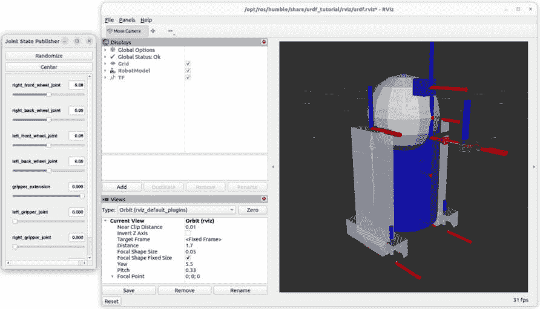
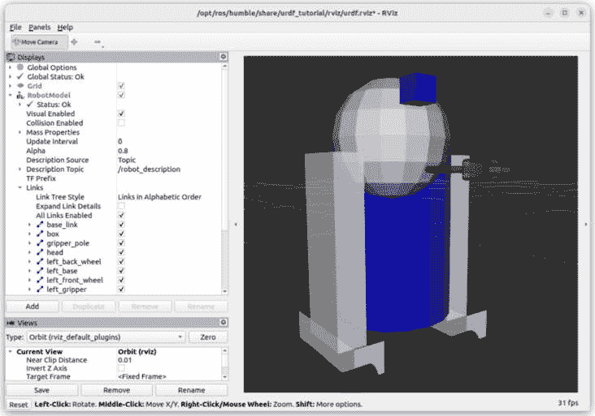
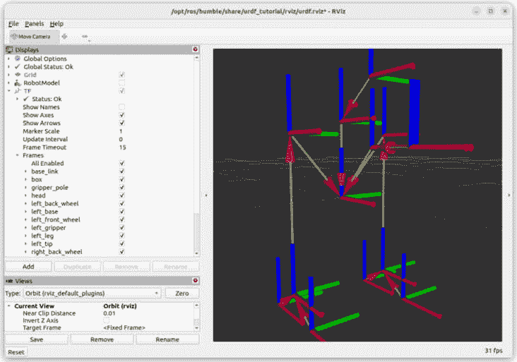
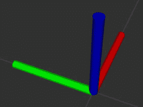
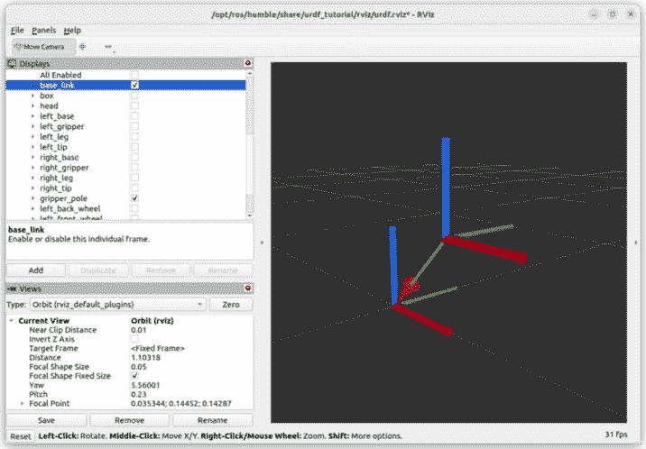
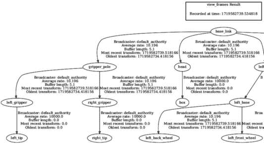
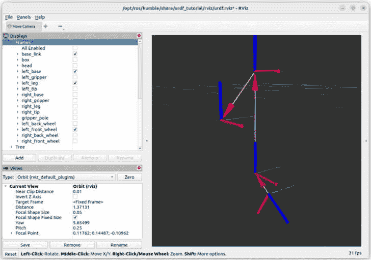

# 第十章：使用 RViz 发现 TFs

在本书的*第三部分*中，你将使用 ROS 2 创建一个机器人仿真。然而，在你开始之前，你首先需要了解**变换**（**TFs**）是什么。

在 ROS 中，TF 是 3D 空间中两个坐标系之间的变换。TFs 将用于跟踪 ROS 机器人（或具有多个机器人的系统）随时间变化的不同坐标系。它们无处不在，并将成为任何你创建的机器人的骨架。

为了理解 TFs，我们首先将查看一个现有的机器人模型。正如我们在*第三章*中所做的那样，在这里，我们将通过实验来发现这些概念，并且你将建立起对事物如何工作的直觉。在这个阶段，你将发现一些新的 ROS 工具，包括**RViz**，一个 3D 可视化包。

你将亲自看到 TFs 是如何工作的，它们是如何相互关联的，以及如何为任何机器人可视化 TF 树。到本章结束时，你将理解 TFs 是什么，它们解决了什么问题，以及它们如何在 ROS 2 应用程序中使用。

好消息：一旦你理解了 TFs，嗯，对于任何 ROS 机器人来说，原理都是相同的，所以你可以直接将在这里学到的知识应用到你的未来项目中。

本章将非常简短，并且很快就能完成。我们在这里不会编写任何代码，也没有 GitHub 仓库。你所要做的就是跟随实验。现在不是所有东西都必须有意义；目标是获得足够的背景知识，以便理解我们稍后将要做什么。完成*第三部分*后，不要犹豫，随时回来查看本章。

在本章中，我们将涵盖以下主题：

+   在 RViz 中可视化机器人模型

+   TFs 是什么？

+   TFs 之间的关系

+   我们试图用 TFs 解决什么问题？

# 技术要求

在本书的开头，我给了你两个选项：要么安装带有双启动的 Ubuntu，要么在虚拟机中安装。

如果你选择了虚拟机路径，那么对于*第一部分*和*第二部分*的所有章节你应该都没有问题。对于本章和接下来的两章，我们将使用一个 3D 可视化工具（RViz），如果你的电脑不够强大，它可能无法正常工作。

我建议首先尝试运行本章中的命令。如果它运行得不好（例如，太慢），那么我强烈建议你设置一个双启动系统，使用 Ubuntu 和 ROS 2（参见*第二章*中的说明）。如果 RViz 运行良好，那么现在可以继续这样做。双启动系统将在*第十三章*中需要。

# 在 RViz 中可视化机器人模型

在本节中，你将发现 RViz。RViz 允许你在 3D 中可视化机器人模型，并包含许多插件和功能，这些将帮助你开发你的机器人应用程序。使用 RViz，你将能够可视化机器人的 TFs，因此我们可以开始理解它们是什么。

由于我们还没有创建一个机器人模型，我们将使用一个名为 **urdf_tutorial** 的现有 ROS 2 包中的一个。我们将在 RViz 中加载一个机器人模型，并学习如何导航该软件。

让我们先为这一章设置我们需要的所有东西。

## 安装和设置

首先，没有必要安装 RViz。在本书开头安装 ROS 2 时（使用 `sudo apt install` 命令的 `ros-<distro>-desktop`），它已经被包含在内了。

要在 RViz 中可视化机器人模型的 TF，我们将安装一个新的 ROS 包，名为 **urdf_tutorial**。此包包含一些现有的启动文件和机器人模型文件（下一章将重点介绍如何创建机器人模型）。

如果您还记得，使用 **apt** 安装 ROS 2 包时，您必须从 **ros** 开始，然后写下您正在使用的发行版名称，最后添加包名称。所有单词都由连字符（不是下划线）分隔。

打开一个终端并安装此包：

```py
$ sudo apt install ros-<distro>-urdf-tutorial
```

然后，为了使用该包，请确保您已源代码或简单地打开一个新的终端。

现在我们来可视化一个机器人模型。

## 使用机器人模型启动 RViz

**urdf_tutorial** 包包含一个名为 **display.launch.py** 的启动文件，它将启动 RViz 并将一个机器人模型加载到其中。现在，我们将使用它，在接下来的章节中，我们将了解这个过程是如何工作的，这样我们就可以复制它。

因此，我们需要启动这个启动文件，并加载一个机器人模型。我们将在哪里找到它？在 **urdf_tutorial** 包中有些现有的模型。要找到它们，导航到包安装的 **share** 目录，你将在包名称下找到一个 **urdf** 文件夹：

```py
$ cd /opt/ros/<distro>/share/urdf_tutorial/urdf/
```

一个 **统一机器人描述格式**（**URDF**）文件基本上是机器人模型的描述。我们将在下一章中回到这一点。现在，我们只想可视化一个。在 **urdf** 文件夹中，你可以找到几个机器人模型文件：

```py
$ ls
01-myfirst.urdf            04-materials.urdf    07-physics.urdf
02-multipleshapes.urdf     05-visual.urdf        08-macroed.urdf.xacro
03-origins.urdf            06-flexible.urdf
```

现在，你可以通过启动 **display.launch.py** 文件并在启动文件后添加一个额外的 **model** 参数来启动一个机器人模型：

```py
$ ros2 launch urdf_tutorial display.launch.py model:=/opt/ros/<distro>/share/urdf_tutorial/urdf/07-physics.urdf
```

注意

为了避免错误，最好提供 `.urdf` 文件的绝对路径，即使你从同一文件夹运行命令也是如此。

运行命令后，你应该会看到类似这样的内容：



图 10.1 – RViz 上的机器人模型

你将得到两个窗口：一个主窗口（**RViz**）带有机器人模型，以及一个带有一些光标的 **Joint State Publisher** 窗口。我们这里的机器人模型是一个著名科幻电影机器人的复制品。它有一些轮子、一个躯干、一个头部和一个夹爪。

让我们首先关注主窗口（**RViz**）。花些时间学习如何在 3D 空间中导航并在机器人周围移动。你可以使用左键点击、右键点击和鼠标滚轮。为此，最好有一个鼠标，但即使使用笔记本电脑的触摸板，你也能管理导航，尽管这不太方便。

你也可以调整 RViz 窗口的大小以及内部各个部分的大小。基本上，你看到的一切都可以自定义。现在你可以在 RViz 中加载机器人模型，我们将开始实验 TF。

# TF 是什么？

机器人模型中有两个主要部分：链接和 TF。在本节中，我们将可视化它们，并了解它们是如何协同工作的。

让我们从链接开始。

## 链接

看看**RViz**窗口左侧的菜单。在那里，你会看到，用蓝色粗体字母，**RobotModel**和**TF**。这是我们本章将关注的内容。如你所见，你可以启用或禁用这两个菜单。

禁用**TF**，保持**RobotModel**，并展开菜单。在那里，你可以找到一个名为**Links**的子菜单。



图 10.2 – RViz 上的 RobotModel 和 Links 菜单

选择或取消选择一些复选框。如你所见，从这个菜单中，一个*链接*是机器人一个刚性部件（意味着一个没有关节的固体部件）。基本上，在 ROS 中，一个机器人模型将是由一系列刚性部件组成的集合。

在这个例子中，链接由基本形状表示：盒子、圆柱体和球体。这些刚性部件本身没有任何作用，那么它们是如何连接的，又是如何相互移动的呢？

这就是引入 TF 的地方。

## TF

现在我们检查一下**TF**复选框。你可以保持**RobotModel**复选框选中或未选中。在**TF**菜单中，有一个名为**Frames**的子菜单，你也可以为机器人启用或禁用每个框架。



图 10.3 – RViz 上的框架和 TF

你在这里看到的轴（红色、绿色和蓝色坐标系）代表框架，或者说机器人每个链接的起点。

在 ROS 中，坐标系遵循右手定则。根据*图 10.4*，你有以下内容：

+   X 轴（红色）向前指向

+   Y 轴（绿色）向左 90 度指向

+   Z 轴（蓝色）向上指向



图 10.4 – ROS 中坐标系的习惯用法

你在*图 10.3*中看到的每个框架之间的箭头是机器人每个刚性部件（链接）之间的关系。TF 由一个箭头表示。

注意

在**links**、**frames**和**TFs**的名称之间可能会有一些混淆。让我们澄清一下：

- 链接：机器人一个刚性部件

- 框架：链接的起点（RViz 中的轴）

- TF：两个框架之间的关系（RViz 中的箭头）

因此，每个刚体部分都会通过一个 TF 与另一个刚体部分相连。这种变换定义了这两个部分相对于彼此的位置。此外，TF 还定义了这两个部分是否在移动，如果是的话，如何移动——平移、旋转等。

要使机器人的某些部分移动，你可以在**关节状态发布者**窗口中移动一些光标。你将看到在 RViz 中帧和 TFs 在移动。如果你再次检查**机器人模型**框，你也会看到刚体部分在移动。

为了更好地理解，这里有一个与人类手臂的类比：我们可以将手臂的部分定义为*手臂*（从肩膀到肘部）和*前臂*（肘部之后）。这两个是刚体部分（在这里，是链接），并且它们不会自行移动。每个链接都有一个原点坐标系，有一个 TF 定义了手臂和前臂的连接位置（想象一下肘部的轴线），以及它们的运动方式（在这种情况下，是一个具有最小和最大角度的旋转）。

正如我们将在本章后面看到的那样，TFs 非常重要。如果机器人的 TFs 没有正确定义，那么什么都不会工作。

现在你已经知道了 TFs 是什么，但它们之间是如何相互关联的呢？正如你在 RViz 中看到的那样，TFs 似乎是有组织地排列的。让我们再进一步，了解 TFs 之间的关系。

# TFs 之间的关系

在 RViz 中，我们看到了链接（刚体部分）和 TFs（链接之间的连接）。链接主要用于模拟中的视觉方面，并将有助于定义惯性和碰撞属性（当我们使用 Gazebo 时）。TFs 定义了链接是如何连接的，以及它们是如何相互移动的。

除了这些，一个机器人的所有 TFs 都按照特定的方式组织，在一个树结构中。让我们来探索 TFs 之间的关系，并在 RViz 中可视化我们开始时的机器人 TF 树。

## 父亲和子代

每个 TF 都会连接到另一个 TF，形成一个父/子关系。例如，要查看一个，你可以禁用 RViz 上的所有 TFs，只检查**base_link**和**gripper_pole**坐标系。



图 10.5 – 两个坐标系之间的关系

正如你在这个例子中看到的那样，一个箭头从**gripper_pole**坐标系指向**base_link**坐标系。这意味着**gripper_pole**是**base_link**的子代（或者，**base_link**是**gripper_pole**的父代）。

如果你回顾一下*图 10*.3，你可以看到机器人的所有坐标系，以及它们之间的关系（TFs）。

这些关系的顺序非常重要。如果你将**gripper_pole**相对于**base_link**移动（在**关节状态发布者**窗口中的**gripper_extension**光标），那么连接到**gripper_pole**的任何东西（即**gripper_pole**的子代）也会随之移动。

这是有意义的：当你旋转你的肘部时，你的前臂在移动，但你的手腕、手和手指也在移动。它们相对于前臂不移动，但作为它们附着在前臂上，它们相对于手臂移动。

现在，你可以在 RViz 上可视化所有的链接和 TFs，看到 TFs 之间的关系，以及它们是如何相互关联的。让我们进一步探讨**/****tf**主题。

## **/tf**主题

在这一点上，你可能会认为我们在本书的**第二部分**中所做的一切与我们现在所做的一切没有任何关系。好吧，我们在这里看到的一切仍然基于节点、主题等等。

让我们列出所有节点：

```py
$ ros2 node list
/joint_state_publisher
/robot_state_publisher
/rviz
/transform_listener_impl_5a530d0a8740
```

你可以看到，RViz 实际上是以一个节点（**rviz**）启动的。我们还有**joint_state_publisher**和**robot_state_publisher**节点，我们将在本书的后续章节中回到这些节点。现在，让我们列出所有主题：

```py
$ ros2 topic list
/joint_states
/parameter_events
/robot_description
/rosout
/tf
/tf_static
```

你可以看到，那些启动的节点正在使用主题相互通信。在这个主题列表中，我们找到了**/tf**主题。这个主题将适用于你创建的任何机器人。你在 RViz 上看到的 TF 实际上是这个主题的 3D 可视化——这意味着**rviz**节点是**/****tf**主题的订阅者。

你可以使用以下命令从终端订阅主题：

```py
$ ros2 topic echo /tf
```

如果你这样做，你会收到很多消息。这里是一个摘录：

```py
transforms:
- header:
	stamp:
  	sec: 1719581158
  	nanosec: 318170246
	frame_id: base_link
  child_frame_id: gripper_pole
  transform:
	translation:
  	x: 0.19
  	y: 0.0
  	z: 0.2
	rotation:
  	x: 0.0
  	y: 0.0
  	z: 0.0
  	w: 1.0
```

这个摘录与我们之前在 RViz 上看到的内容相匹配。它代表了**base_link**和**gripper_pole**之间的转换。以下是我们可以从这个消息中获得的重要信息：

+   TF 的时间戳

+   父亲和子帧 ID

+   实际的转换，包括平移和旋转

注意

旋转不是用欧拉角（`x`，`y`，`z`）表示，而是用四元数（`x`，`y`，`z`，`w`）表示。四元数通常更适合计算机，但对于人类来说，可视化它们是困难的。不要担心这个问题——我们实际上并不需要处理四元数。如果你将来必须这样做，你将能够访问可以将角度转换为可理解内容的库。

我们可以在这里获得的一个重要信息是，转换是针对特定时间的。这意味着，通过主题数据，你可以跟随所有 TFs 随时间的变化。你可以知道**gripper_pole**相对于**base_link**现在或过去的位置。

这个**/tf**主题包含了我们所需要的一切信息，但它并不是真正的人类可读的。这就是为什么我们开始使用 RViz，这样我们就可以看到包含所有 TFs 的 3D 视图。

让我们现在通过打印 TF 树来完成这个部分，这样我们就可以在一张单独的图像中看到所有关系。

## 可视化 TF 树

对于每个机器人，你可以以简化的方式可视化完整的 TF 树，这样你就可以看到所有 TFs 之间的关系。

要做到这一点，你需要使用**tf2_tools**包。确保它已安装：

```py
$ sudo apt install ros-<distro>-tf2-tools
```

不要忘记在安装包后 source 环境。现在，保持机器人在 RViz 上运行，并在第二个终端中执行此命令：

```py
$ ros2 run tf2_tools view_frames
```

如你将通过日志看到的那样，它将监听**/tf**主题五秒钟。在这之后，命令将退出并显示一个大的日志，你可以忽略它。

你将在这个命令运行的同一目录下获得两个新文件。

打开 PDF 文件。你会看到类似这样的内容（我只是添加了图像的左侧，否则书中的文字太小，难以阅读）：



图 10.6 – 机器人的 TF 树

在这个文件中，你可以一次性获得所有的链接和 TFs，并且可以清楚地看到哪个链接是哪个其他链接的子链接。PDF 上的每个箭头都代表链接之间的一个 TF（变换）。

如你所见，那个机器人的根链接被命名为**base_link**（对于大多数机器人，**base_link**被用作第一个链接的名称）。这个链接有四个子链接：**gripper_pole**、**head**、**left_leg**和**right_leg**。然后，这些链接也会有更多的子链接。在这里，我们可以清楚地看到**gripper_pole**链接的所有子链接。

我们现在可以理解，当我们之前将**gripper_pole**相对于**base_link**移动时，**gripper_pole**的所有子链接也相对于**base_link**移动了。

注意

在 ROS 中，一个链接可以有多个子链接，但只有一个父链接。我们将在下一章中定义链接和 TFs 时回到这个问题。

在这个例子中，我们只有一个机器人。如果你在你的应用中有几个机器人，那么你会有一个**world**框架作为根链接。然后，这个框架会有几个子链接：**base_link1**、**base_link2**等等。每个机器人基链接都会连接到**world**框架。因此，你可以得到一个完整的 TF 树，不仅是一个机器人，而且是一个包含多个机器人的完整机器人应用。

现在，你已经看到了关于 TFs（变换）的几乎所有内容：它们是什么，它们是如何相互关联的，以及它们是如何组织的。让我们通过理解我们试图用 TFs 解决的问题来结束这一章。

# 我们试图用 TFs 解决什么问题？

你现在已经看到了 TFs 是什么以及你如何为任何 ROS 机器人可视化它们。这是很好的，但现在我们来到了这一章的最终问题：为什么我们需要关心这个？我们试图解决什么问题？

## 我们想要实现的目标

为了使机器人应用工作，我们希望随着时间的推移跟踪每个 3D 坐标框架。我们需要一个结构化的树来表示机器人的所有框架（或机器人）。

这里有两个组成部分：我们需要知道事物在哪里以及变换发生的时间。如果你还记得，当我们检查**/tf**主题时，你可以看到对于每个父框架和子框架，我们都有一个变换（在三维空间中的平移和旋转），我们还有一个时间戳。

这里有一些具体的例子，说明在机器人应用中你可能需要回答的问题：

+   对于一个移动机器人，右轮相对于左轮和机器人底部的位置在哪里？车轮的运动是如何随时间演变的？

+   如果你有一个带有机械臂和摄像头的应用，那么摄像头相对于机器人底部和机械臂手的位置在哪里？这样，机械臂就可以正确地捡起和放置由摄像头检测到的物体？

+   在另一个有多个移动机器人的应用中，每个机器人相对于其他机器人的位置在哪里？

+   如果你结合前两个例子，机械臂的手相对于移动机器人之一的底部在哪里？

因此，通过 TFs，我们想要知道以下内容：

+   框架相对于彼此是如何放置的

+   它们相对于彼此以及随时间如何移动

这对于机器人正确使用 ROS 是必需的。

现在，让我们看看你将如何自己计算 TFs，以及 ROS 是如何自动为你完成这些工作，这样你就不必担心它。

## 如何计算 TFs

变换究竟是什么？变换是空间中平移和旋转的组合。

由于我们在 3D 空间中工作，我们有三个平移组件（**x**、**y**、**z**），以及三个旋转组件（**x**、**y**、**z**）。要找到两个框架之间的变换，你需要计算这六个元素，使用 3x3 矩阵。

我不会在这里深入数学细节，但你可以猜测这不会是一个容易的任务。此外，你需要为每个框架相对于其他框架计算这个变换。这增加了复杂性。

例如，假设你需要知道**left_front_wheel**相对于**base_link**的位置。按照之前的 TF 树（再次打开 PDF），你可以看到你需要遵循以下顺序：**base_link**、**left_leg**、**left_base**和**left_front_wheel**。

让我们在 RViz 上可视化这一点：



图 10.7 – 四个框架之间的三个变换

你需要连续计算三个变换，以便得到从**base_link**到**left_front_wheel**的变换。你将不得不对每个相对于所有其他框架的框架重复此操作（随着你添加更多框架，复杂性会大大增加），并且跟踪这些变换随时间的变化。

这听起来像是一项大量的工作。幸运的是，我们不需要做任何这些，多亏了 ROS TF 功能。有一个名为**tf2**的库，它已经为我们做了这些。

最后，TFs（变换函数）最大的挑战在于理解它们是如何工作的。你通常不会直接在你的应用程序中使用 TFs。有几个包会为你处理这个问题。我们唯一需要做的是提供一个机器人描述，该描述指定了机器人的所有链接和 TFs。然后，使用名为**robot_state_publisher**的包，ROS 将自动为我们发布 TFs。这就是我们在下一章将要关注的内容。

# 概述

在本章中，我们开始了一些不同的事情。ROS 不仅仅是编程；还有很多其他东西让它成为机器人领域的优秀工具。

你首先发现了一个用于 ROS 的 3D 可视化工具，名为 RViz。你将在大多数 ROS 应用程序中使用这个工具。使用 RViz，你可以可视化一个机器人模型，这在你自己开发模型时将非常有帮助。

然后，你发现了 TFs 是什么，以及为什么它们在 ROS 应用程序中如此重要。这里是一个简要的回顾：

+   我们需要跟踪整个机器人应用（一个或多个机器人）中的每个 3D 坐标系随时间的变化。

+   我们不自己计算变换，而是使用 ROS TF 功能，通过`tf2`库。TFs 在`/tf`主题上发布。

+   TFs 被组织成一个你可以可视化的结构化树。

+   TF 定义了两个坐标系如何连接，以及它们随时间如何相对移动。

为了指定机器人的 TFs，我们必须创建一个名为*URDF*的机器人模型。然后，这个机器人模型将由**robot_state_publisher**节点（我们稍后会看到）用来发布 TFs。发布的 TFs 将被你的应用程序中的其他包使用。

最后，我们实际上不会直接与 TFs 交互。本章最重要的内容是理解 TFs 是什么，以及为什么我们需要它们。这将帮助你理解你在下一章创建机器人模型时所做的事情。

如果现在事情仍然有点令人困惑，不要过于担心。继续阅读接下来的几章，然后再次回到这个 TF 章节，一切都会更加清晰。

现在，让我们跳到下一章，创建我们的第一个机器人模型。
