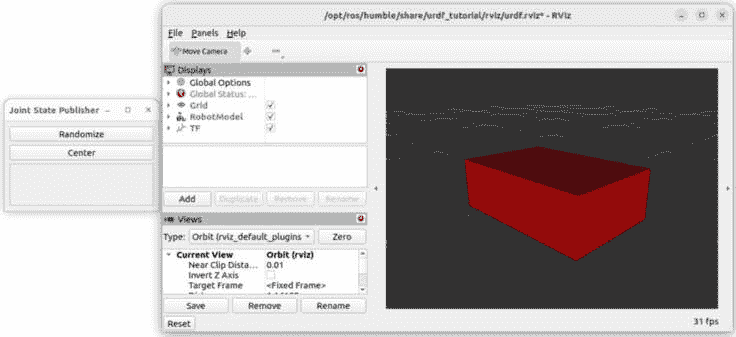
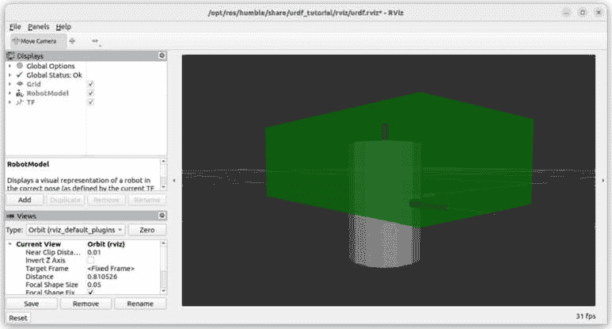
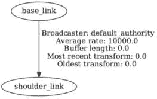
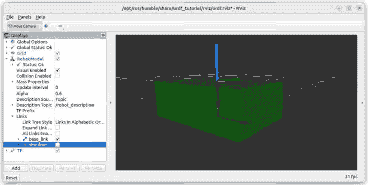
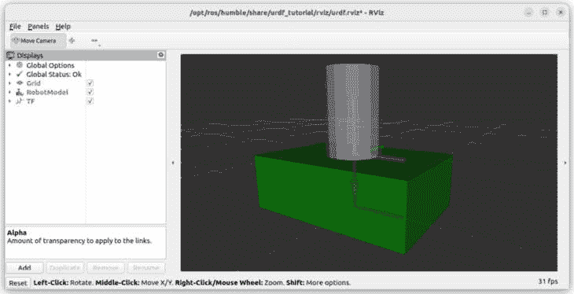
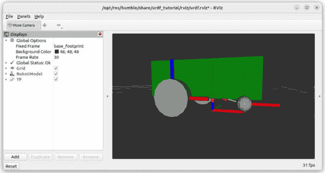
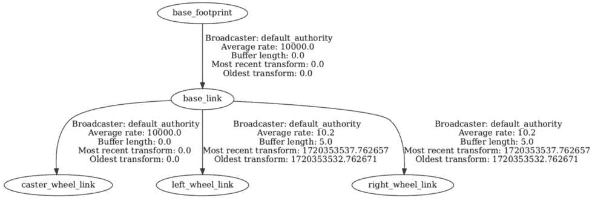

# 第十一章：为机器人创建 URDF

在上一章中，我们从一个直观的介绍开始，介绍了 TFs，或称为变换。您已经看到 TFs 非常重要；它们将是几乎所有 ROS 应用程序的骨干。我们总结说，为了为机器人生成 TFs，您需要创建一个**统一机器人描述格式**（**URDF**）文件。

基本上，一个 URDF 文件将包含机器人所有元素的描述。您将定义机器人的每个**链接**（刚性部分）。然后，为了在链接之间建立关系，您将添加一些**关节**，这些关节将用于生成 TFs。

要编写 URDF 的内容，我们将使用 XML。随着您开发 URDF，您将能够使用 RViz 可视化它。这将非常有帮助，以查看链接和关节/TFs 是否正确。我们还将使用一个名为**Xacro**的额外工具改进 URDF 文件，使其更加动态。

因此，在本章中，我们将从*第三部分*的项目开始，创建机器人的 URDF。我们将创建一个带有两个轮子的移动底盘。这将是下一章的基础。您可以在本书 GitHub 仓库的**ch11**文件夹中找到最终的 URDF 文件（[`github.com/PacktPublishing/ROS-2-from-Scratch`](https://github.com/PacktPublishing/ROS-2-from-Scratch))。

URDF 最难的部分是理解如何使用关节组装机器人的两个链接。在没有指导的情况下完成这项工作相当困难，因为您可以修改许多参数和原点。我将逐步解释整个过程，以确保您构建的东西能够正常工作。

到本章结束时，您将能够为几乎任何由 ROS 驱动的机器人创建自己的 URDF。

在本章中，我们将涵盖以下主题：

+   使用链接创建 URDF

+   链接和关节的组装过程

+   为移动机器人创建 URDF

+   使用 Xacro 改进 URDF

# 使用链接创建 URDF

在本节中，您将直接创建您的第一个 URDF。我们首先创建一个用于 URDF 的 XML 文件。在这个文件中，我们将添加一个链接，它将代表机器人的一个刚性部分，并在 RViz 中可视化它。我们还将探索您可以使用的不同类型的形状——盒子、圆柱体等。

这将是一个很好的第一步，这样您可以熟悉 URDF 并准备好深入到添加多个链接和关节的过程（在下一节中）。

让我们从设置我们的 URDF 文件开始。

## 设置 URDF 文件

URDF 文件只是一个具有**.urdf**扩展名的 XML 文件。

现在，为了使本章的内容简单，我们将在我们的主目录中创建一个 URDF 文件。在下一章中，您将学习如何正确地将 URDF 打包到 ROS 2 应用程序中。

应该如何命名 URDF 文件？您可以选择任何名称；实际上并不重要。通常，您会将其命名为您的机器人名称。如果您的机器人名称是**abc**，那么您将创建一个**abc.urdf**文件。让我们使用之前在这本书中使用的名称**my_robot**。

打开终端并在您的家目录中创建一个新文件：

```py
$ cd
$ touch my_robot.urdf
```

您可以使用任何文本编辑器或 IDE 打开此文件，例如，使用 VS Code：

```py
$ code my_robot.urdf
```

这里是您必须在 URDF 文件中编写的最小代码：

```py
<?xml version="1.0"?>
<robot name="my_robot">
</robot>
```

我们首先使用**<?xml version="1.0"?>**行打开文件，以指定此文件是一个 XML 文件——我们也给出了 XML 版本。

然后，您需要打开和关闭`**<robot>**`标签。您在 URDF 中编写的所有内容都必须在这个标签内。您还必须通过**name**参数提供机器人的名称。

现在，这是 URDF 的最小代码，但如果您不至少定义一个元素，它将毫无用处。让我们在这个 URDF 中添加一个链接。

## 创建链接

现在，您将编写您的第一个链接，这对应于机器人的一个刚性部分，并在 RViz 中可视化它。通过这样做，您将能够看到链接是否正确定义，并在必要时进行修改。

让我们从添加链接的 XML 代码开始。

### 链接的基本代码

要为链接创建一个视觉元素，您可以使用现有的形状：盒子、圆柱体和球体（我们稍后还将看到如何包含由**计算机辅助设计**（**CAD**）软件创建的自定义形状）。

要开始，让我们想象机器人的主要基座，表示为一个盒子。这个盒子是 60 厘米 x 40 厘米 x 20 厘米，或**0.6**米 x **0.4**米 x **0.2**米。

注意

在 ROS 中，只使用公制系统。以下是本章中我们将使用的一些单位：

- 距离将使用米。如果您需要指定 70 毫米，例如，您将写`0.07`。

- 弧度将用于角度。180 度对应于π（约`3.14`）弧度。

- 每秒米数将用于速度实例。

这是第一个链接的代码：

```py
<robot name="my_robot">
    <link name="base_link">
        <visual>
            <geometry>
                <box size="0.6 0.4 0.2" />
            </geometry>
            <origin xyz="0 0 0" rpy="0 0 0" />
        </visual>
    </link>
</robot>
```

确保在`**<robot>**`标签内定义`**<link>**`。尽管在 XML 中缩进不是必需的，但最佳实践是添加一些缩进以获得更易读的文件。在这里，我使用了每个缩进四个空格。

让我们分析这个链接的元素。`**<link>**`标签定义了链接。此链接的所有属性都必须在标签内。您还必须为链接提供一个**name**属性。按照惯例，对于第一个链接，我们使用**base_link**。

然后，在这个标签内部，我们有`**<visual>**`标签。如果您想为链接（刚性部分）定义视觉外观，可以使用此标签。在内部，您将有以下内容：

+   `<geometry>`: 这将定义链接的形状。在这里，我们使用`<box>`标签，并通过`size`属性提供尺寸。

+   `<origin>`：这个标签非常重要，因为它定义了可视化相对于链接原点的原点。我们将在本章稍后回到这一点，并了解如何避免混淆。原点包含六个元素用于平移和旋转。

注意

旋转的原点以 `rpy` 表示。这意味着 *翻滚*，*俯仰*，*偏航*。它与 `x`，`y` 和 `z` 相同，但使用了不同的名称。翻滚，俯仰和偏航在航空中非常常用。你只需要习惯 URDF 中的这种用法。

如你所见，我们首先将所有原点设置为 **0**。现在，我们唯一指定的是盒子的尺寸。

### 在 RViz 中可视化 URDF

我们有足够的代码在 RViz 中可视化 URDF。这里的目的是在 3D 中看到盒子，并验证一切是否正确。

在开发 URDF 时这样做非常重要。我建议始终执行以下操作：

1.  进行最小的修改（添加或修改某些内容）

1.  在 RViz 中可视化 URDF

1.  如果正确，继续下一个功能；如果不正确，返回，修复它，并再次检查

现在，我们如何在 RViz 中可视化 URDF？

好消息：我们可以重用 **urdf_tutorial** 包（在 *第十章* 中安装）并提供我们自己的 URDF 而不是示例 URDF。这很好，因为我们可以在 ROS 2 工作空间之外轻松测试 URDF 文件，而且我们目前不需要创建任何包。

打开一个终端并启动 **display.launch.py** 启动文件，为 **model** 参数提供 URDF 文件的绝对路径：

```py
$ ros2 launch urdf_tutorial display.launch.py \ model:=/home/<user>/my_robot.urdf
```

你将看到 **RViz** 内部的一个盒子（默认为红色）。你还将有一个空的 **Joint State Publisher** 窗口，没有光标。



图 11.1 – 在 RViz 中的 URDF 可视化

如果你访问 **RobotModel** | **链接**，你会看到 **基础链接**。这是你创建的链接；你可以为该链接启用或禁用可视化。

在 **RViz** 中绕着盒子导航。你会看到可视化（盒子）围绕链接原点居中。你可以保持这样，或者决定相对于框架偏移可视化。让我们这样做。

### 修改可视化的原点

我们创建的链接是完美的。然而，我们将稍微偏移可视化，以便原点不在盒子的中间，而是在盒子的底部。

你不一定需要这样做。有时，将可视化中心对准链接原点就是你所需要的。当我们稍后在本章中创建移动基座的 URDF 时，我们将看到一些示例来说明这一点。现在，让我们假设我们想要偏移可视化。

为了调整视觉效果，我们需要修改`<visual>`标签内的`<origin>`标签。在这个`<origin>`标签中，我们有六个元素用于平移和旋转。我们只想将视觉效果向上移动，因此我们只需要修改*Z*轴上的平移（如果您还记得，使用右手定则，Z 轴向上）。

我们应该应用多大的偏移量？由于盒子目前位于链接原点中心，我们需要将其向上抬起一半的高度。

我们已将高度定义为**0.2**米，因此我们需要将视觉效果偏移**0.1**米。

修改此行，使 z 偏移为**0.1**：

```py
<origin xyz="0 0 0.1" rpy="0 0 0" />
```

保存文件，为了可视化更改，停止 RViz（在启动**urdf_tutorial**的终端上按*Ctrl* + *C*），然后再次启动。每次修改 URDF 时，您都可以这样做。

现在，您应该看到盒子坐在地面上，这意味着视觉效果的正确偏移已经应用。

备注

链接的原点仍然是相同的；您只是改变了相对于链接的视觉效果。这是一个重要的区别。如果您感到困惑，请继续阅读，在您看到完整的链接和关节过程后，一切都会变得清晰。

您已经创建了您的第一个链接。现在让我们看看您可以使用哪些形状，以及您可以在 URDF 中的链接上添加哪些自定义设置。

## 自定义链接视觉效果

链接是您机器人的一个刚性部分。您可以使其看起来像任何您想要的样子。

让我们探索您可以赋予链接的不同形状，以及如何更改它们的颜色。

### 链接的不同形状

正如您在创建的第一个链接中看到的那样，您将在`<visual>`标签内的`<geometry>`标签中定义链接的形状。

您可以使用三种基本形状。对于每一种形状，您都需要提供不同的属性来指定尺寸：

+   `<box>`: 您需要添加一个包含三个组件的`size`参数：`x`、`y`和`z`

+   `<cylinder>`: 您需要添加两个参数，`radius`（半径）和`length`（长度）

+   `<sphere>`: 您只需要一个参数，`radius`（半径）

我们刚刚在之前的代码示例中看到了如何创建一个盒子。以下是一个半径为**0.2**米、长度为**0.5**米的圆柱体示例：

```py
<geometry>
    <cylinder radius="0.2" length="0.5"/>
</geometry>
```

以下是一个半径为**0.35**米的球体示例：

```py
<geometry>
    <sphere radius="0.35"/>
</geometry>
```

在那些基本形状之上，您还可以使用从 CAD 软件（如 SolidWorks、Blender 等）导出的自定义网格。您可以使用 STL 和 Collada 文件，分别具有**.stl**和**.dae**扩展名。设置这些文件并不复杂，但需要您正确地将应用程序打包在 URDF 周围，这是我们将在*第十二章*中看到的。

备注

甚至还有一些工具允许您直接从 CAD 软件中为机器人生成完整的 URDF（链接、关节、网格等）。太棒了，不是吗？然而，这些工具并不总是最新或稳定的，如果您遇到错误，您可能需要花费大量时间查找和修复它。我建议您自己编写 URDF 并逐个添加网格。这样，您将对自己的操作有更多的控制，修复错误也将花费更少的时间。

使用三个基本形状（盒子、圆柱体、球体），您已经可以完成很多事情并设计一个完整的机器人。我们不需要更多东西来开始，我们将使用它们来创建本章中我们将创建的移动机器人。链接的可视化对 TF 生成没有影响，所以这不会成为问题。即使您开始设计自己的定制机器人，您也可以从基本形状开始，一切都会顺利。

下面是包含您可以在链接中添加的每个标签和属性的完整参考：

[`wiki.ros.org/urdf/XML/link`](https://wiki.ros.org/urdf/XML/link)

现在我们来完成这个部分，看看如何更改链接可视化的颜色。

### 链接颜色

如果您查看 RViz 上的第一个链接，您可以看到其可视化颜色为红色。这将是您创建的任何基本形状的默认颜色。

随着我们添加更多形状并将它们组合起来，修改它们的颜色可能是个不错的选择，这样我们可以在不同的链接之间获得一些对比度。否则，在屏幕上区分它们将很困难。

要为链接添加颜色，您首先需要创建一个名为 `<material>` 的标签。然后，您可以在链接的可视化中使用该颜色。

下面是使链接变绿的完整代码：

```py
<?xml version="1.0"?>
<robot name="my_robot">
    <material name="green">
        <color rgba="0 0.6 0 1" />
    </material>
    <link name="base_link">
        <visual>
            <geometry>
                <box size="0.6 0.4 0.2" />
            </geometry>
            <origin xyz="0 0 0.1" rpy="0 0 0" />
            <material name="green" />
        </visual>
    </link>
</robot>
```

确保定义 `<material>` 标签的内容位于 `<robot>` 标签内，但不在任何 `<link>` 标签内。在这个新标签中，您需要执行以下操作：

+   使用 `name` 属性定义一个名称。

+   使用 `<color>` 标签和 `rgba` 属性（红色、绿色、蓝色、透明度）定义颜色。这四个值应在 `0` 和 `1` 之间。要创建一个基本、不太明亮的绿色，我们将红色和蓝色设置为 `0`，绿色设置为 `0.6`。您可以保持透明度（不透明度）设置为 `1`。

您只需要定义此标签一次，然后您可以在任何 `<visual>` 标签中使用它，无论在哪个链接中。颜色将应用于基本形状。如果已导入自定义网格（Collada 文件已包含颜色，因此不需要 `<material>` 标签），它也应应用于 STL 文件。

注意

当在链接中使用 `<material>` 标签时，请确保将其放置在 `<visual>` 标签内，但不要放在 `<geometry>` 标签内。《geometry`、`origin` 和 `material` 标签应该是 `<visual>` 标签的直接子标签。

太好了，您现在可以创建具有不同形状和颜色的链接。这是一个很好的开始，这样您就可以在 3D 中表示机器人中的任何刚性部件。

现在我们来看看如何组装不同的链接，从而创建一个完整的机器人模型。

# 组装连杆和关节的过程

现在你已经有一个包含一个连杆的 URDF 文件，让我们添加另一个连杆，并通过关节将它们连接起来。这个关节将用于生成一个 TF。

正确组装两个连杆并使用关节是任何人在学习 URDF 时面临的主要问题。你可以修改几个原点和轴，使两个部分正确地放置在彼此之间，并具有正确的运动，这可能具有挑战性。

在本节中，我们将专注于这个过程，以便它对你来说更容易。我已经将其简化为五个步骤，每次添加新连杆时你都可以按照这个顺序进行。

在你对这个过程有信心之后，你将能够为任何类型的机器人创建 URDF。一个完整的机器人模型只是连接到彼此的一系列连杆。如果你正确理解了如何为两个连杆操作，添加二十个更多的连杆就不会那么困难了。

我们还将探索在 URDF 中可以使用的不同类型的关节。为了验证一切正常，我们将使用 RViz 以及由**tf2_tools**包生成的 TF 树。

这个部分非常重要，我建议你不要跳过它。同时，如果你对如何连接两个连杆有疑问，随时可以回来查看。

让我们开始这个过程的第 1 步：向 URDF 中添加第二个连杆。

## 第 1 步 – 添加第二个连杆

对于这个例子，我们想在盒子上方添加一个圆柱体（半径：**0.1** 米，长度：**0.3** 米）。我们将把这个圆柱体设置为灰色（以与绿色盒子形成对比），因此，让我们首先创建另一个带有灰色颜色的**<material>**标签。

你可以在之前的**<material>**标签之后添加这个新标签：

```py
<material name="gray">
    <color rgba="0.7 0.7 0.7 1" />
</material>
```

然后，让我们添加连杆。在**<robot>**标签内创建另一个**<link>**标签，并指定第二个连杆的规格。你可以把这个连杆放在**base_link**之后：

```py
<link name="shoulder_link">
    <visual>
        <geometry>
            <cylinder radius="0.1" length="0.3" />
        </geometry>
        <origin xyz="0 0 0" rpy="0 0 0" />
        <material name="gray" />
    </visual>
</link>
```

你可以为连杆命名任何名称。在这里，我指定为**shoulder_link**，因为我们将在本例中创建机器人手臂的起始部分。你还可以有多个部分：基础、肩部、手臂、前臂、手等等。最佳实践是为你的机器人连杆命名具有意义的名称。

如你所见，我们将所有原点元素设置为**0**。这非常重要，将是这个过程的第一步：你添加一个连杆，但不要修改原点。

现在，如果你尝试在 RViz 中可视化 URDF（从终端停止并重新启动），你会得到一个错误。在日志中，你会看到这个：

```py
Error: Failed to find root link: Two root links found: [base_link] and [shoulder_link]
```

你会得到这个结果，因为 URDF 中的所有连杆都需要通过父/子关系相互关联，正如我们在上一章中看到的。在这里，没有明确的关系，所以 ROS 无法知道哪个是父节点，哪个是子节点。

我们将通过关节来定义这种关系。这也会使我们能够为机器人生成第一个 TF。

## 第 2 步 – 添加关节

为了定义两个链接如何连接，你需要添加一个关节。以下是你在两个`<link>`标签之后（并且仍然在`<robot>`标签内）可以写入的代码：

```py
<joint name="base_shoulder_joint" type="fixed">
    <parent link="base_link" />
    <child link="shoulder_link" />
    <origin xyz="0 0 0" rpy="0 0 0" />
</joint>
```

要创建一个关节，你添加一个`<joint>`标签，它包含两个属性：

+   `name`：你可以选择任何你想要的，只要它有意义。我通常将我想连接的两个链接的名称组合起来：`base_link`和`shoulder_link`变成`base_shoulder_joint`。

+   `type`：我们将在第 4 步中回到你可以使用的不同关节类型。目前，我们将它设置为`fixed`，这意味着两个链接之间不会移动。

在`<joint>`标签内，你还有三个更多的标签：

+   `<parent>`：这是父链接。你必须使用`link`属性写出链接的确切名称。

+   `<child>`：你将使用`link`属性写出子链接的确切名称。

+   `<origin>`：这将定义子链接相对于父链接原点的原点。再次强调，我们使用`xyz`进行平移，使用`rpy`进行旋转。

这是过程的第二步：你在两个链接之间添加一个关节，并定义哪个是父链接，哪个是子链接。目前，你将所有原点元素都设置为**0**。

使用这段代码，你可以再次启动 RViz，这次，由于链接之间存在关系，URDF 将会显示。以下是你会得到的结果：



图 11.2 – 两个链接和一个关节，所有原点都设置为 0

如你所见，我们现在有一个盒子（**base_link**）和一个圆柱体（**shoulder_link**）。由于所有原点元素都设置为**0**，两个链接的原点都在同一个位置。

此外，你还可以验证你用关节创建的 TF 是否正确地放置在 TF 树中。使用`ros2 run tf2_tools view_frames`命令，你可以生成 TF 树。在新创建的 PDF 文件中，你会看到这个：



图 11.3 – 验证两个链接之间关系的 TF 树

我们可以验证我们定义的关系是否正确。现在我们需要正确地将**shoulder_link**相对于**base_link**放置。

## 第 3 步 – 调整关节原点

这是大多数人感到困惑的步骤。如果你查看当前的代码，我们有三个`<origin>`标签：每个链接中一个，一个在关节中。那么，我们需要修改哪个原点？

经典的错误是同时修改几个随机的起点，并通过调整值来尝试找到可以工作的情况。即使最终看起来似乎可行，但在添加其他关节时可能会产生更多问题。

因此，对于这一步，我强调你必须每次都遵循我将要描述的*精确*过程。

首件事是修改关节的**<origin>**标签，以便正确放置子连接的框架。这是最重要的。你将首先固定关节原点，然后，并且*仅*然后，固定视觉原点。

为了做到这一点，展开**RobotModel**和**Links**，并取消选择**shoulder_link**的视觉（在这个阶段，看到视觉可能会造成混淆，所以我们禁用它）。然后，问问自己这个问题：**shoulder_link**的框架相对于**base_link**的框架应该在哪个位置？

我们希望**shoulder_link**位于盒子的顶部，因此我们需要将框架移动到盒子的高度；这里，那是**0.2**米。这个关节不需要旋转，只需要平移。

因此，你现在可以修改**<joint>**标签内的**<origin>**标签：

```py
<origin xyz="0 0 0.2" rpy="0 0 0" />
```

再次启动 RViz，禁用**shoulder_link**的视觉，并检查框架是否放置正确。



图 11.4 – 不使用视觉设置关节原点

太好了，看起来**shoulder_link**的框架在正确的位置：在盒子的顶部。

这个原点是至关重要的；这将定义 TF。最终，TFs 将使用你的 URDF 中的所有关节原点生成。视觉将不被考虑（在 Gazebo 模拟器中，视觉将用于惯性和碰撞属性）。

我们已经正确设置了关节原点。现在，让我们看看如何指定关节类型，这样我们就可以定义两个连接之间的运动。

## 第 4 步 – 设置关节类型

为了使前面的解释简单，我们将关节类型设置为*固定*，这意味着两个连接相对于彼此不移动。

你将创建的许多关节将类似于这种情况。例如，如果你在你的机器人上放置一个传感器（摄像头、激光雷达），该传感器不会移动。你可以为传感器创建一个连接，然后创建一个固定关节将这个传感器连接到你的机器人上。

然而，对于一些刚性部件（机器人臂中的手臂、轮子、躯干等），你需要指定子连接相对于父连接是移动的。我不会描述所有可能的关节类型，但在任何机器人中你都会找到以下最常见的运动：

+   **固定**：如前所述，这是如果你有两个不移动的部分

+   **旋转**：具有最小和最大角度的旋转，例如在机器人臂中

+   **连续**：无限旋转，通常用于轮子

+   **滑动**：如果你需要使机器人的某个部分滑动（只有平移，没有旋转）

你可以在[`wiki.ros.org/urdf/XML/joint`](http://wiki.ros.org/urdf/XML/joint)找到所有关节类型的完整参考。在那里，你可以获取所有可以在**<joint>**标签中添加的元素。其中大部分是可选的。

回到我们的例子，假设肩部链接在盒子上方的*Z*-轴上旋转（有一个最小值和最大值）。你可以使用**revolute**关节类型来指定这一点。通过这样做，你还需要添加一个**<axis>**标签来指定旋转轴，以及一个**<limit>**标签来指定最小和最大角度。让我们修改**<****base_shoulder_joint>**标签：

```py
<joint name="base_shoulder_joint" type="revolute">
    <parent link="base_link" />
    <child link="shoulder_link" />
    <origin xyz="0 0 0.2" rpy="0 0 0" />
    <axis xyz="0 0 1" />
    <limit lower="-3.14" upper="3.14" velocity="100" effort="100"/>
</joint>
```

当选择**revolute**时，我们首先需要定义哪个轴将旋转。因为我们选择了**z**（如果你看*图 11**.4*，我们想要围绕蓝色轴旋转），我们写**"0 0 1"**，这意味着：**x**和**y**没有旋转，**z**上有旋转。

我们将旋转角度设置为-180 到+180 度（大约**-3.14**和**3.14**弧度）。我们还需要指定速度和努力限制的值。这两个值通常会被其他 ROS 节点覆盖。默认设置为**100**；在这里它不会很重要。

通过这个关节，你创建了一个 TF，它定义了**shoulder_link**相对于**base_link**的位置，以及这两个链接之间的运动。

现在，你可以再次启动 RViz（禁用视觉），你将在**Joint State Publisher**窗口中找到一个光标。将光标移动到使**shoulder_link**在**base_link**上方旋转。再一次，这完全是关于正确移动框架。如果视觉仍然看起来不正确，不要担心；这是我们将在本过程的最后一步修复的。

## 第 5 步 – 修复视觉原点

我们现在可以固定**shoulder_link**视觉的原点。不要修改**base_link**的原点，因为它已经正确了。在这里，我们只修改子链接的视觉。

要做到这一点，你可以在 RViz 中再次启用**shoulder_link**视觉，并看到框架位于圆柱体的中心。因此，我们需要将视觉偏移到圆柱体长度的一半，这意味着**0.15**米（**0.3**米的一半）。

修改**<origin>**标签，位于**<link>**标签内的**shoulder_link**：

```py
<origin xyz="0 0 0.15" rpy="0 0 0" />
```

如果你再次启动 RViz，你会看到一切都被正确放置：



图 11.5 – 修复原点的过程结束

注意

在这个例子中，我们想要将圆柱体放置在框架上方。如果你想要框架位于圆柱体的中心，你会在*Z*-轴上更高处放置关节原点，然后保持视觉原点不变（我将在本章后面，当我们处理移动机器人的轮子时，更多地讨论这一点）。

现在过程已经完成。由于它非常重要，让我们现在快速回顾一下。

## 回顾 – 每次都要遵循的过程

当你创建一个 URDF 时，你首先会从一个链接开始，通常命名为**base_link**。然后，对于你添加的每个链接，你也会添加一个关节，以将这个新链接连接到现有的一个链接上。

这是将新链接添加到你的 URDF 中的过程：

1.  添加一个新的**<link>**标签，并将所有原点元素设置为`0`。

1.  添加一个新的 `<joint>` 标签。你必须指定一个父链接和一个子链接。父链接将是你已经创建的现有链接，而子链接是你刚刚添加的新链接。将所有原点元素设置为 `0`。

1.  确定关节的原点。在 RViz 中可视化 URDF，禁用新链接的视觉，并确定新链接的框架相对于其父链接的位置。

1.  如果关节与运动相关联，设置关节类型。根据类型，你可能需要设置旋转/平移轴、一些限制等。

1.  一旦框架原点正确，在 RViz 中启用视觉并固定链接的视觉原点（仅针对子链接，不是父链接）。

在完成这个步骤后，恭喜你，你已经成功连接了两个链接，关节将用于生成 TF。你可以为 URDF 中添加的每个新链接重复此过程。

需要记住的一些重要事项如下：

+   每次只添加一个链接和一个关节。完成这个过程后，再添加另一个链接。

+   不要修改父链接或你之前创建的任何链接的原点。这是开始弄乱 URDF 并花费数小时进行调试的可靠方法。如果你需要回到之前的链接，那么禁用所有子链接，修复链接，然后继续。

+   一个链接可以有多个子链接，但只有一个父链接。

+   在每次修改后，无论修改得多小，都要在 RViz 中进行验证。不要尝试同时修改多个原点元素。改变一个，验证它，然后进行下一个。

+   你可以通过打印 TF 树来验证所有链接之间的关系。

最后，这个过程并不复杂。严格按照这些步骤操作将确保你第一次就能正确构建 URDF。这不仅会让你对自己的操作有信心，而且从长远来看，这将节省你大量时间，并且你的 URDF 将更加整洁。

我们现在拥有了创建一个完整的 URDF 所需的所有信息。

# 为移动机器人编写 URDF

你已经看到了在 URDF 文件中添加链接和关节的完整过程。通过重复这个过程几次，你可以为任何机器人创建一个完整的模型。

我们现在将使用这个过程来创建一个移动机器人。然后我们将把这个 URDF 作为下一章的基础。

我首先会向你展示最终的机器人模型，这样你就能有一个概念，然后我们将逐步构建 URDF。随着我们的构建，你将获得机器人的规格。我鼓励你在阅读本节的同时跟随操作，甚至可以边读边写代码。这对于你熟悉 URDF 来说是一个很好的实践。作为提醒，你可以在 GitHub 上找到完整的代码。

## 我们想要实现的目标

在编写任何代码之前，定义我们想要实现的目标是非常重要的。最终的结果在 RViz 中将看起来像这样：



图 11.6 – 移动机人的最终结果

我们将从代表机器人主要结构（底盘）的盒子开始，这个盒子与**base_link**我们创建的相同。

然后，我们将在底盘的两侧各添加两个轮子。这两个轮子将具有连续旋转。最后，为了稳定性，我们添加一个转向轮（球体），这将帮助机器人在 Gazebo 中模拟时不会向前倾倒。这个转向轮将是一个固定关节，我们不会给它添加任何运动。

在此基础上，最后，我们还将添加另一个名为**base_footprint**的链接（没有视觉，我们可以将其视为虚拟链接），它是**base_link**在地面上的投影。我将在我们做的时候进一步解释。

要开始，回到我们之前编写的**my_robot.urdf**文件，并保留**base_link**。同时移除**shoulder_link**以及**base_shoulder_joint**。

现在，让我们将两个轮子添加到机器人的侧面。

## 添加轮子

我们将逐个添加轮子，从右轮开始。除非你已经是一位专家，否则每次只添加一个链接和一个关节是很重要的。

### 右轮

要添加右轮，我们将遵循我们刚刚描述的五步流程。让我们把这个链接命名为**right_wheel_link**。对于视觉，我们将使用一个半径为**0.1**米，长度为**0.05**米的圆柱体。以下是链接的代码（*步骤 1*）：

```py
<link name="right_wheel_link">
    <visual>
        <geometry>
            <cylinder radius="0.1" length="0.05" />
        </geometry>
        <origin xyz="0 0 0" rpy="0 0 0" />
        <material name="gray" />
    </visual>
</link>
```

由于轮子将连接到**base_link**（绿色），我们选择灰色以产生对比。正如你所见，我们将所有原点元素设置为**0**。我们将在过程结束时再回到这些元素。

现在，让我们在底盘和右轮之间添加一个关节（*步骤 2*）。

```py
<joint name="base_right_wheel_joint" type="fixed">
    <parent link="base_link" />
    <child link="right_wheel_link" />
    <origin xyz="0 0 0" rpy="0 0 0" />
</joint>
```

当你更有经验时，你可以在创建关节时设置运动类型，但让我们一步一步来。现在，我们将类型设置为**fixed**，这样我们就可以首先设置关节原点，然后指定运动类型。这将使事情更简单，更不容易出错。

使用这段代码，你现在已经可以在 RViz 中可视化 URDF 了。禁用**right_wheel_link**的视觉（**RobotModel** | **Links**），因为我们现在不需要它，这可能会在设置关节原点时让我们感到困惑。

那么，问题是：我们将**right_wheel_link**框架相对于**base_link**框架放置在哪里（*步骤 3*）？让我们看看每个轴：

+   `-0.15`米偏移量。

+   `-0.2`米（箱子宽度的一半）。然后，稍后，你需要在轮子的视觉中添加一个偏移量，就像我们在之前的例子中对**shoulder_link**所做的那样。

+   或者，你也可以在关节上添加一个小的额外偏移量，这样轮子就会在箱子外面，视觉将围绕框架中心。对于轮子和一些传感器来说，这是一个好主意——例如，当使用激光雷达时，这是使扫描正常工作的必要条件。然后我们需要添加`-0.2`米，以及额外的`-0.025`米（轮子长度的一半）。总偏移量是`-0.225`米。

+   **Z 轴平移（蓝色轴）**：这里不需要任何偏移，因为我们希望轮子的中心位于盒子的底部。

我们已经有了三个平移值。这就足够了。你可能认为我们必须旋转关节轴，因为视觉方向不正确。然而，这是最常见的错误之一，而且你可能会开始修改错误的值来修复错误的问题。正如我们在过程中看到的那样，我们首先禁用视觉来固定关节，然后，而且只有然后，我们才固定视觉。

让我们再次修改 **<joint>** 标签内的 **<origin>** 标签（再次强调：不是在链接中，而是在关节中）：

```py
<origin xyz="-0.15 -0.225 0" rpy="0 0 0" />
```

然后，再次启动 RViz，禁用轮子的视觉（这个视觉仍然不正确，但不是问题），你会发现关节放置在盒子外面一点。

我们现在可以轻松地添加运动（*步骤 4*）。由于轮子将不断旋转（没有最小或最大位置），我们选择**连续**类型。我们还需要指定旋转轴。通过在 RViz 中查看机器人模型，我们可以看到我们必须选择 *Y* 轴（轮子应该围绕绿色轴旋转）。

因此，我们相应地修改了 **<joint>** 标签：

```py
<joint name="base_right_wheel_joint" type="continuous">
    <parent link="base_link" />
    <child link="right_wheel_link" />
    <origin xyz="-0.15 -0.225 0" rpy="0 0 0" />
    <axis xyz="0 1 0" />
</joint>
```

对于 **连续** 类型，不需要指定 **<limit>** 标签，就像我们之前对 **revolute** 类型所做的那样。

现在，你可以再次启动 RViz，禁用轮子视觉，并将名为 **base_right_wheel_link** 的新光标移动到 **Joint State Publisher** 窗口中。你应该看到关节正确地围绕基础旋转。

注意

使用光标，你会看到一个最小值约为 `-3.14` 和一个最大值约为 `3.14`（总共 360 度）。不用担心这个，这只是一个图形元素。由于关节类型是连续的，当我们后来控制它时，将没有最小或最大位置。

对于关节来说，这就结束了。有了这个，TF 将会正确生成。我们现在可以完成这个过程，并修复链接的视觉（*步骤 5*）。如果你重新启用轮子视觉，你会看到它没有正确定位。你需要添加一个在 *X* 轴上的 90 度旋转（围绕红色轴）。这对应于 π/2，或者大约 **1.57** 弧度（我们将在本章后面看到如何使用 π 的精确值）。

让我们修改 **right_wheel_link** 的 **<origin>** 标签：

```py
<origin xyz="0 0 0" rpy="1.57 0 0" />
```

再次启动 RViz，现在一切应该都正常：轮子视觉将正确放置（正好在盒子外面）并且方向正确。当你移动关节的光标时，轮子将正确转动。

右轮可能是这个机器人最复杂的一部分，但正如你所看到的，如果你按照顺序遵循这个过程，应该不会有问题。你可以确信所有值都是正确的，而且没有错误会传播到你添加的下一个链接。

现在让我们为左轮编写代码。

### 左轮

由于左轮与右轮相同，但位于箱子的对面，编写代码将相当直接。这里我不会重复整个过程，只会展示最终的**<link>**和**<joint>**标签。

让我们从链接开始：

```py
<link name="left_wheel_link">
    <visual>
        <geometry>
            <cylinder radius="0.1" length="0.05" />
        </geometry>
        <origin xyz="0 0 0" rpy="1.57 0 0" />
        <material name="gray" />
    </visual>
</link>
```

这与**right_wheel_link**的代码相同。

然后，左轮将连接到底盘，因此**left_wheel_link**的父级将是**base_link**。以下是关节的代码：

```py
<joint name="base_left_wheel_joint" type="continuous">
    <parent link="base_link" />
    <child link="left_wheel_link" />
    <origin xyz="-0.15 0.225 0" rpy="0 0 0" />
    <axis xyz="0 1 0" />
</joint>
```

所有的东西都一样，只是在*Y*-轴上的偏移不同。对于右轮，我们必须在负方向上移动，但对于左轮，我们在正方向上移动。

需要检查的重要事项是，当你将两个光标在**Joint State Publisher**窗口的正方向移动时，两个轮子都朝同一方向旋转。如果你有这种情况，那么你的差速驱动系统设计是正确的。

我们现在可以添加万向轮以提高机器人的稳定性。

## 添加万向轮

当我们在 Gazebo 模拟器中稍后添加物理和重力时，你可以猜到机器人会落在前面，因为它不平衡。为了解决这个问题，我们将添加一个称为万向轮的东西。这与桌子椅子下的轮子原理相同。

为了简化问题，万向轮将用一个球体（半径为**0.05** m）来表示。对于运动，即使轮子在旋转，这也不是我们用 ROS 控制的旋转。这是一个被动旋转；因此，我们将考虑关节为**固定**。

让我们首先创建链接（*步骤 1*）：

```py
<link name="caster_wheel_link">
    <visual>
        <geometry>
            <sphere radius="0.05" />
        </geometry>
        <origin xyz="0 0 0" rpy="0 0 0" />
        <material name="gray" />
    </visual>
</link>
```

这里没有太多复杂的事情。现在，万向轮将连接到机器人的底盘。让我们添加关节（*步骤 2*）。为了遵循这个过程，我们首先将所有原点元素设置为**0**：

```py
<joint name="base_caster_wheel_joint" type="fixed">
    <parent link="base_link" />
    <child link="caster_wheel_link" />
    <origin xyz="0 0 0" rpy="0 0 0" />
</joint>
```

启动 RViz 并禁用视觉。从这一点来看，让我们看看万向轮相对于底盘原点的位置在哪里（*步骤 3*）：

+   `0.2` m。

+   `0`。

+   半径设置为`0.05`，这样滚轮的直径（0.1 m）就对应于轮子的半径。因此，为了使轮子和万向轮在地面上对齐，我们需要将*Z*-轴偏移`-0.05` m。如果你对此不太确定，很简单：尝试一些值，并在 RViz 中查看结果。

对于关节，我们不需要设置任何旋转，因为我们不会移动万向轮，它是一个球体。让我们在**<origin>**标签的**<joint>**标签中应用偏移：

```py
<origin xyz="0.2 0 -0.05" rpy="0 0 0" />
```

现在，万向轮将被正确地放置在底盘下方，你可以验证两个轮子和万向轮的底部似乎是对齐的。在这里，没有必要设置移动类型（*步骤 4*）或固定视觉（*步骤 5*）。

机器人模型现在完成了。我们还将做一件事，以更好地为后续步骤准备机器人。

## 额外链接 - 底部足迹

机器人设计正确，当我们添加控制时，它将正常工作。然而，我们可以进行一项改进。

如果你查看 RViz 中的机器人，**base_link** 框架的 **z** 偏移量与三个车轮底部不在同一高度。这是可以的，但最好将机器人的原点与机器人将放置的地面对齐。

这不仅会使机器人在 RViz 中的外观更好（尽管这不是很重要），而且还会使未来的事情更容易处理。一个例子是当你想从一个对接站创建一个到移动机器人的变换，或者从一个机器人到另一个机器人。另一个例子是如果你想使用 **Navigation 2** 堆栈。如果所有机器人的原点都在地面上，那么你就可以在 2D 中工作，这更容易处理。

因此，添加一个名为 **base_footprint** 的虚拟链接是很常见的，它将是 **base_link** 在地面上的投影。我们说这个链接是 *虚拟的*，因为它不包含任何视觉元素；它只是在空间中定义的一个额外的框架。以下是链接的代码：

```py
<link name="base_footprint" />
```

如你所见，这个链接非常简单，因为我们没有包含任何 **<visual>** 标签。对于链接名称，我们通常从刚体部分名称开始，并添加 **_link** 后缀。在这里，我们做一个例外。你将在许多现有移动机器人的 URDF 文件中找到这个 **base_footprint** 名称。

现在，我们可以添加一个新的 **固定** 关节，以 **base_footprint** 作为父节点，以 **base_link** 作为子节点：

```py
<joint name="base_joint" type="fixed">
    <parent link="base_footprint" />
    <child link="base_link" />
    <origin xyz="0 0 0.1" rpy="0 0 0" />
</joint>
```

我们在 *Z* 轴上应用了一个 **0.1** 米的偏移量，这对应于左右轮的半径。

注意

为了在 URDF 中组织所有链接和关节，我通常先写所有链接，然后写所有关节。你也可以决定交替使用链接和关节。没有正确或错误的方法；这是一个关于偏好的问题。

你现在可以在 RViz 中可视化最终结果。要获得正确的视图，点击 **全局选项**，然后在 **固定框架** 菜单中选择 **base_footprint**。你会看到车轮底部和 **base_footprint** 都与地面齐平。

当 RViz 仍在运行时，你可以打印和可视化 TF 树：



图 11.7 – 移动机器人的最终 TF 树

我们现在已经完成了 URDF。在我们完成这一章之前，让我们探索 Xacro，这将允许你改进你的 URDF 文件并使其更具可扩展性。

# 使用 Xacro 改进 URDF

你的机器人越复杂，URDF 就越大。随着你添加更多的链接和关节，你最终会遇到在机器人模型上缩放的问题。此外，我们迄今为止所写的内容并不那么动态：所有值都是硬编码的。

Xacro 是一个额外的 ROS 功能，你可以用它来解决所有这些问题。现在我们将看到如何使 URDF 文件与 Xacro 兼容，如何创建变量和函数，以及如何将你的 URDF 分割成几个文件。

使用 Xacro，你的 URDF 文件将变得更加动态和可扩展。所有严肃的 ROS 2 项目都使用 Xacro，因此学习如何与之协同工作是很重要的。

让我们从设置开始。

## 使 URDF 文件与 Xacro 兼容

我们首先确保我们的 URDF 文件可以使用 Xacro 功能。在开始任何操作之前，让我们确认 Xacro 是否已安装（它应该已经随着我们之前安装的所有包一起安装了）：

```py
$ sudo apt install ros-<distro>-xacro
```

现在，为了在你的 URDF 文件中使用 Xacro，你需要进行两个更改。

首先，更改文件扩展名。文件当前命名为**my_robot.urdf**。对于 Xacro，你将使用**.xacro**扩展名。一个常见的做法是为你的机器人主 URDF 文件使用**.urdf.xacro**扩展名，因此文件将被命名为**my_robot.urdf.xacro**（重要的是要在末尾有**.xacro**）。

一旦你更改了扩展名，打开文件并修改**<robot>**标签：

```py
<robot name="my_robot" >
```

**每次你想在 URDF 文件中使用 Xacro，你都必须添加这个** xmlns:xacro **参数**。

设置到此结束。现在，为了在 RViz 中可视化 URDF，你将运行与之前相同的命令，但使用新的文件名：

```py
$ ros2 launch urdf_tutorial display.launch.py model:=/home/<user>/my_robot.urdf.xacro
```

现在，让我们了解如何使用 Xacro 中的变量。

## Xacro 属性

在编程中，你最先和最重要的学习之一是如何使用变量。URDF 中没有变量，但你可以使用 Xacro 来使用它们。在这里，变量被称为**属性**。

使用 Xacro 属性，我们将在文件开始处指定诸如尺寸之类的值，并在**<link>**和**<joint>**标签中使用这些属性。这样，值和计算就不会是硬编码的。这将使事情更少混淆，更易读。此外，如果我们需要修改机器人的尺寸，我们只需修改文件开始处的值。

此外，值得注意的是，Xacro 属性被视为常量变量。在你设置它们的值之后，你将不再修改它们。

要声明和定义一个 Xacro 属性，你将使用**<xacro:property>**标签并提供两个参数：**name**和**value**。

让我们在文件的开始处（在**<robot>**标签内）声明一些属性：

```py
<xacro:property name="base_length" value="0.6" />
<xacro:property name="base_width" value="0.4" />
<xacro:property name="base_height" value="0.2" />
<xacro:property name="wheel_radius" value="0.1" />
<xacro:property name="wheel_length" value="0.05" />
```

这些是我们计算 URDF 中其他所有值所需的所有值。

然后，要使用 Xacro 属性，你只需写出**${property_name}**。你也可以进行计算。例如，要乘以 2.5，你将写出**${property_name * 2.5}**。有了这些信息，让我们修改**base_link**内的内容，以删除任何硬编码的值：

```py
<geometry>
    <box size="${base_length} ${base_width} ${base_height}" />
</geometry>
<origin xyz="0 0 ${base_height / 2.0}" rpy="0 0 0" />
```

如你所见，我们仅使用属性来指定盒子大小。最有趣的部分是我们如何计算 *Z* 轴上的视觉偏移。写作**${base_height / 2.0}**比仅仅写作**0.1**要明确得多。这不仅更动态，而且我们还能更好地了解这个计算的目的。想象一下六个月后回到这个 URDF，试图弄清楚偏移值为什么是**0.1**，而没有任何上下文。有了这个属性，就不会有任何可能的疑问。

现在，让我们修改右轮和左轮的视觉：

```py
<geometry>
    <cylinder
        radius="${wheel_radius}" length="${wheel_length}"
    />
</geometry>
<origin xyz="0 0 0" rpy="${pi / 2.0} 0 0" />
```

注意

Xacro 属性或常数 pi 已经定义。你不必硬编码 pi 的近似值，可以直接使用 `${pi}`。

最后，这是 caster 轮的代码：

```py
<geometry>
    <sphere radius="${wheel_radius / 2.0}" />
</geometry>
<origin xyz="0 0 0" rpy="0 0 0" />
```

如你所见，我们没有定义 **caster_wheel_radius** 属性。这是因为 caster 轮的半径需要与左右轮的半径成比例。它需要是值的一半，这样两个轮子和 caster 轮都可以接触地面，同时使机器人保持稳定。通过在这里使用 Xacro 属性，如果我们修改轮子半径，那么 caster 轮将自动调整大小以使机器人保持稳定。

我们现在已经修改了所有链接；让我们更改关节原点中的值。对于 **base_joint**，我们有以下内容：

```py
<origin xyz="0 0 ${wheel_radius}" rpy="0 0 0" />
```

**base_right_wheel_joint** 要复杂一些。然而，再次强调，通过编写这段代码，我们将使计算更加可读，并减少未来出错的可能性：

```py
<origin xyz="${-base_length / 4.0} ${-(base_width + wheel_length) / 2.0} 0" rpy="0 0 0" />
```

**base_left_wheel_joint** 将与之前相同，只是在 *Y* 轴上的符号是正的。我们以 **base_caster_wheel_joint** 结束：

```py
<origin xyz="${base_length / 3.0} 0 ${-wheel_radius / 2.0}" rpy="0 0 0" />
```

所有这些代码更改都没有修改机器人模型。在 Rviz 中可视化时，它应该看起来相同。

为了测试一切是否正常工作，尝试修改文件开头的一些 Xacro 属性值。在 RViz 中的机器人模型将具有不同的尺寸，但它仍然应该是有意义的。

Xacro 属性就到这里。这个概念并不难理解和应用，尤其是如果你已经熟悉变量和常量。现在让我们转向函数或宏。

## Xacro 宏

Xacro 宏在编程中相当于函数。使用 Xacro，宏就像一个模板：它是一段可以重复使用不同值（参数）的 XML 代码。宏不返回任何内容。

当你需要多次复制一个链接或关节时，宏非常有用。想象一个有四个摄像头的机器人。你可以为摄像头链接创建一个宏，然后调用宏而不是重写相同的代码四次。

使用我们的机器人模型，**right_wheel_link** 和 **left_wheel_link** 几乎有相同的代码。唯一的区别是链接的名称。让我们为这些链接创建一个宏。

要创建一个宏，你将使用 **<xacro:macro>** 标签，并给出一个名称以及一个参数列表。你可以指定零个或任意多个参数——只需用空格分隔即可。以下是一个示例：

```py
<xacro:macro name="wheel_link" params="prefix">
    <link name="${prefix}_wheel_link">
        <visual>
            <geometry>
                <cylinder radius="${wheel_radius}"
                          length="${wheel_length}" />
            </geometry>
            <origin xyz="0 0 0" rpy="${pi / 2.0} 0 0" />
            <material name="gray" />
        </visual>
    </link>
</xacro:macro>
```

这段代码本身不会做任何事情。我们需要调用它，就像调用一个函数一样。要调用一个宏，你将编写以下内容：

```py
<xacro:name param1="value" param2="value" />.
```

移除 **right_wheel_link** 和 **left_wheel_link**，改为以下内容：

```py
<xacro:wheel_link prefix="right" />
<xacro:wheel_link prefix="left" />
```

前缀参数中的 **"right"** 值将被应用于宏内部的链接名称，使其成为 **right_wheel_link**。对于左轮也是如此。

如你所见，宏可以帮助你减少代码重复。在这个例子中，好处并不大，但如果你需要重复某些链接或关节超过三次，那么宏可以非常有用。此外，如果你正在创建将被其他人使用的 URDF 的一部分，编写一个宏可以帮助他们轻松地将你的代码集成到他们的代码中，并使用他们可以提供的不同参数对其进行自定义。

Xacro 属性和宏将允许你使一个 URDF 文件更加动态。让我们通过看看如何使一个 URDF 更加可扩展来结束本节。

## 在另一个文件中包含 Xacro 文件

多亏了 Xacro，你可以将你的 URDF 分成几个文件。

这有助于分离你机器人的不同部分，例如，主核心基座和添加在顶部的额外传感器。如果你组合两个机器人，例如，一个在移动机器人顶部的机械臂，你可以为每个机器人创建一个 URDF，并将它们组合成第三个。另一个好处是协作。在文件中创建一个宏，其他开发者可以包含它，将使他们更容易与你合作。

回到我们的 URDF，让我们将文件分成三个部分：

+   `common_properties.xacro`：这个文件将包含适用于我们机器人应用任何部分的材料标签和其他属性

+   `mobile_base.xacro`：这个文件将包含特定于移动基座的属性、宏、链接和关节

+   `my_robot.urdf.xacro`：在这个主文件中，我们包含前两个文件

通过这样做，我们将使 URDF 更加动态，并且在未来更容易修改。如果你想组合几个移动基座或添加其他机器人或传感器，你可以创建更多的 Xacro 文件，并将它们包含到主文件中（**my_robot.urdf.xacro**）。

现在，创建两个额外的文件，让我们看看如何组织代码。确保将所有三个文件放在同一个目录中。在下一章中，我们将将它们正确地安装在一个 ROS 2 包中，但现在，将它们都放在同一个地方（这将使将前两个文件包含到第三个文件中更容易，使用相对路径）。

让我们从 **common_properties.xacro** 开始。以下是这个文件中要写的第一件事：

```py
<?xml version="1.0"?>
<robot >
</robot>
```

所有 Xacro 文件都必须包含此代码，其中包含一个带有 **xmlns:xacro** 属性的 **<robot>** 标签。

注意

不要在 `<robot>` 标签中添加 `name` 属性。这个属性只会在主 Xacro 文件中添加一次。

然后，在 **<robot>** 标签内部，你可以复制并粘贴我们之前写过的两个 **<material>** 标签。然后你可以从 **my_robot.urdf.xacro** 中移除这些标签。

在 **mobile_base.xacro** 文件中，你也会像在 **common_properties.xacro** 中做的那样，以 **<?xml>** 和 **<robot>** 标签开始。

然后，你可以复制并粘贴所有与移动基座相关的 **<xacro:property>**、**<xacro:macro>**、**<link>** 和 **<joint>** 标签，这基本上是剩下的所有标签。

在 **my_robot.urdf.xacro** 中，我们剩下的是 **<?xml>** 标签和包含 **name** 和 **xmlns:xacro** 属性的 **<robot>** 标签。

要在另一个文件中包含一个 Xacro 文件，你需要编写一个 **<xacro:include>** 标签，并通过 **filename** 属性提供文件的路径。以下是 **my_robot.urdf.xacro** 的最终内容：

```py
<?xml version="1.0"?>
<robot name="my_robot" >
    <xacro:include filename="common_properties.xacro" />
    <xacro:include filename="mobile_base.xacro" />
</robot>
```

我们的 URDF 现在已经分成几个文件，并使用了 Xacro 属性和宏。通过这些修改，我们没有改变机器人模型本身，但使 URDF 更具动态性和可扩展性，同时也更容易阅读。

作为提醒，你可以在书籍的 GitHub 仓库的 **ch11** 文件夹中找到本章的完整代码——所有 URDF 和 Xacro 文件。

# 摘要

在本章中，你发现了为机器人编写 URDF 的完整过程。

URDF 定义了一个机器人模型，并包含两个主要部分：链接和关节。链接是机器人中的一个刚性部分，它本身不执行任何操作。链接可以有一个视觉（如盒子、圆柱体、球体或从 CAD 软件导出的网格等简单形状）。你可以将机器人看作是一系列链接的组合。关节定义了两个链接之间的连接。它指定了哪个链接是父链接，哪个是子链接，以及两个链接连接的位置以及它们相对于彼此的运动方式。

你了解到，你在一个关节中写入的内容将定义机器人的 TF。最终，在 URDF 中的所有关节都创建了一个 TF 树。

你也看到了在之前的基础上添加新链接和关节的完整过程。确保每次都遵循这个流程。为了帮助你开发和验证流程的每一步，你了解到使用 RViz 这样的工具来可视化机器人模型，以及 **tf2_tools** 来查看 TF 树是一个好主意。

然后，你了解到你也可以通过 Xacro 来改进你的 URDF。你可以定义一些属性和宏，甚至将 URDF 分成几个文件。当你的应用程序扩展时，这将非常有用，并使协作更容易。

如本章所述，创建一个机器人的 URDF 是第一步。这将允许你生成 TFs，它们是任何使用 ROS 的机器人的骨架。

现在你已经可以创建 URDF 了，让我们看看如何开始打包我们的应用程序，并了解我们应该从哪里开始，以便正确生成 TFs（不使用 **urdf_tutorial** 包）。这将是下一章的重点。**
