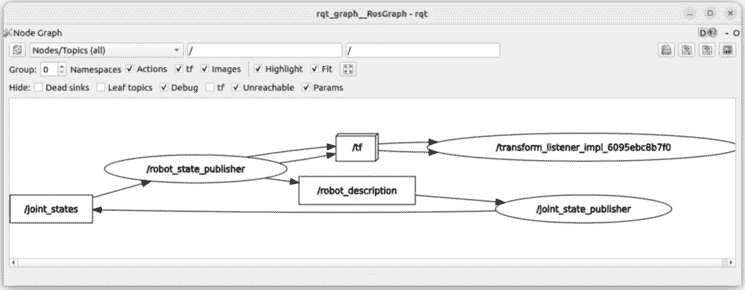
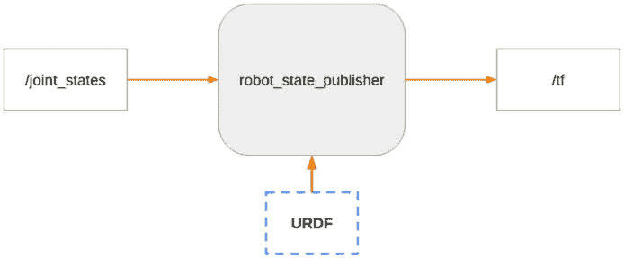
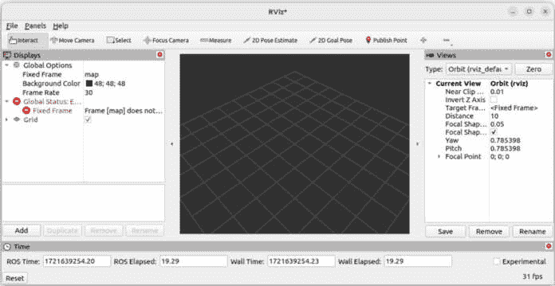
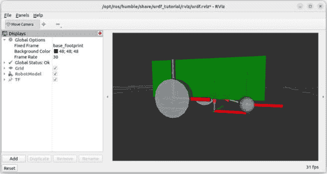

# 第十二章：发布 TFs 和打包 URDF

到目前为止，在本书的**第三部分**中，你已经对 TFs 进行了介绍，并学习了如何编写 URDF，这将用于生成你的机器人应用程序的 TFs。现在我们需要做两件事来进一步学习。

首先，为了更快，我们使用了**urdf_tutorial**包来发布 TFs。这对于开始和可视化机器人模型来说很棒，但我们在实际应用中不会使用这个包。问题是：使用我们创建的 URDF，我们如何为我们的应用程序生成 TFs？我们需要启动哪些节点？我们将首先通过实验了解我们需要启动哪些节点和参数，以便正确地为我们的应用程序生成 TFs。从这一点出发，我们将能够创建我们自己的启动文件。

其次，URDF 现在是一系列三个 Xacro 文件，放置在主目录中。为了启动一个合适的 ROS 2 应用程序，我们将创建一个包来组织和安装 URDF、启动文件等。

到本章结束时，你将能够正确地打包你的 URDF 并发布 ROS 2 应用程序的 TFs。这个过程适用于任何机器人，你在这里创建的包将成为任何进一步开发的基础，包括本书后面将要介绍的 Gazebo 仿真。

作为本章的起点，我们将使用书籍 GitHub 仓库中**ch11**文件夹内的代码([`github.com/PacktPublishing/ROS-2-from-Scratch`](https://github.com/PacktPublishing/ROS-2-from-Scratch))。你可以在**ch12**文件夹中找到最终代码。

在本章中，我们将涵盖以下主题：

+   理解如何使用我们的 URDF 发布 TFs

+   从终端启动所有节点

+   创建一个包来安装 URDF

+   编写一个启动文件来发布 TFs 并可视化机器人

# 理解如何使用我们的 URDF 发布 TFs

我们将首先了解我们需要启动哪些节点和参数，以便为我们的应用程序发布 TFs。然后，有了这些知识，我们将能够启动所需的节点，打包应用程序，并编写一个启动文件。

正如我们在这本书中经常做的那样，我们将从一个发现阶段开始，通过实验。我建议你在阅读本节时运行所有命令。

## robot_state_publisher 节点

基本上，在本章中，我们想要复制**urdf_tutorial**包中所做的工作，以便我们可以自己发布 TFs。那么，让我们再次启动**display.launch.py**启动文件，使用上一章中的 URDF，并进行一些自我检查：

```py
$ ros2 launch urdf_tutorial display.launch.py model:=/home/<user>/my_robot.urdf.xacro
```

在第二个终端中，启动**rqt_graph**来可视化当前正在运行的节点。如果屏幕为空，请刷新视图。你会看到类似这样的内容：



图 12.1 – 使用 urdf_tutorial 运行的节点

我们看到 **/tf** 主题，这是这里最重要的东西。这是任何 ROS 应用程序正常工作所必需的。

现在，**/tf** 主题上发布了什么内容？正如你所见，有一个名为 **/robot_state_publisher**（在文本中，我们将写作 **robot_state_publisher**，不带前面的斜杠）。这个节点从哪里来？**robot_state_publisher** 是一个已经为你准备好的核心节点，你可以使用它。它是你用 ROS 2 安装的软件包集合的一部分。这个节点将发布你机器人的 TFs。你将在任何需要 TFs 的 ROS 2 应用程序中启动它。大多数时候，你不需要自己发布任何 TF，因为这将由 **robot_state_publisher** 节点处理。

现在我们知道了我们必须启动这个节点，需要哪些输入？

## robot_state_publisher 的输入

为了使 **robot_state_publisher** 节点正确工作，你需要提供两样东西：URDF 和关节状态。让我们从第一样开始。

### URDF 作为参数

到目前为止，你可能想知道：URDF 去哪里了？我们在 **rqt_graph** 中看到了一些节点和主题，但我们没有看到我们创建的 URDF 的使用。

保持 **urdf_tutorial** 中的 **display.launch.py** 运行，并在另一个终端中列出 **robot_state_publisher** 节点的所有参数：

```py
$ ros2 param list /robot_state_publisher
```

你会看到很多主题，但我们这里关心的是名为 **robot_description** 的主题。然后，你可以从这个参数中读取值：

```py
$ ros2 param get /robot_state_publisher robot_description
```

这样，你将在终端中看到整个 URDF（或者更准确地说，从你提供的 Xacro 文件生成的 URDF）。

因此，当你启动 **robot_state_publisher** 节点时，你需要提供一个名为 **robot_description** 的参数内的 URDF。

注意

在 `rqt_graph` 中，你可以看到 `robot_state_publisher` 正在发布到 `/robot_description` 主题。从这个主题获得的消息也包含了 URDF 内容。这可以用来从任何其他节点检索 URDF，使用订阅者。

这就是第一个输入的全部内容；让我们看看第二个。

### 关节状态主题

为了发布 TFs，**robot_state_publisher** 节点需要 URDF，但也需要每个关节的当前状态。

你可以在 **rqt_graph** 中看到 **/joint_states** 主题，如图 **12**.1 所示。这个主题包含了你在真实机器人中从编码器或控制反馈中读取的内容。例如，如果你有一些轮子，你会知道这些轮子的速度和/或位置。你将把这些信息喂入 **/joint_states** 主题。如果你有一个机械臂，你通常在每个轴上都有编码器来读取轴的当前位置。

当我们使用 Gazebo 模拟机器人时，我们将使用一个插件来自动发布关节状态。实际上，无论是在模拟模式还是对于真实机器人，你通常都会有节点为你做这件事（要进一步了解这一点，阅读完这本书后请查看 ros2_control——你可以在本书的最后一章找到关于它的额外资源）。所以，你需要知道的是，这个 **/joint_states** 主题非常重要，因为它被 **robot_state_publisher** 所需要。在这个主题上的发布是由现有的 ROS 2 插件完成的。

目前，因为我们没有真实的机器人或 Gazebo 模拟，我们将使用 **joint_state_publisher** 节点（带有 **Joint State Publisher** 窗口），它将发布我们在光标上选择的任何值。例如，如果你为 **base_right_wheel_joint** 选择 **1.0** 弧度，那么 **1.0** 将被发布在该关节的 **/joint_states** 主题上，并被 **robot_state_publisher** 接收和使用。

在这里，重要的是要明确关节状态和 TF 之间的区别。关节状态仅仅是关节的 *当前状态*。例如，对于一个轮子：当前的速率是多少？对于一个机械臂的轴：电机的当前角位置是多少？状态是一个数据点，在特定时间，对于你机器人中的一个关节。它不指定关节之间的关系，也不指定它们相对于彼此的位置——这就是 TF 的作用。

## 回顾 – 如何发布 TF

让我们快速回顾一下发布 TF 所需的内容。这是 **urdf_tutorial** 为我们做的事情，也是从现在起我们将自己做的事情。



图 12.2 – 发布 TF 所需的节点和输入

这里是我们需要做的事情：

1.  启动 `robot_state_publisher` 节点。这个节点已经安装好了。我们提供 URDF 作为 `robot_description` 参数。

1.  在 `/joint_states` 主题上发布所有关节的当前状态。这通常由编码器、模拟器（如 Gazebo）或来自 `joint_state_publisher` 节点的 *虚假* 数据自动为你完成。

这就是你正确发布应用程序 TF 所需要做的所有事情。这些 TF 将随后被其他节点、插件和堆栈使用，例如，Navigation 2 或 MoveIt 2 堆栈（我们不会在本书中涵盖这些，但它们是之后一个好的学习主题——本书最后一章将提供更多资源）。

# 从终端启动所有节点

在我们打包应用程序并编写启动文件之前，让我们在终端中启动所有需要的节点。这样做是一个最佳实践，这样你可以确保你的应用程序运行正常。然后，创建包和启动文件会更容易，因为你已经知道你需要包含的所有元素。

我们将使用上一节的结果并启动 **robot_state_publisher** 节点以及 **joint_state_publisher** 节点。除此之外，我们还将启动 RViz（这是可选的，仅用于可视化机器人模型）。

## 从终端发布 TFs

让我们发布 TFs。为此，我们将打开两个终端。

在第一个步骤中，启动 **robot_state_publisher** 节点。此节点的包和可执行文件名相同。要提供 **robot_description** 参数，你必须使用以下语法：**"$(****xacro <path_to_urdf>)"**。

在终端 1 中，运行以下命令：

```py
$ ros2 run robot_state_publisher robot_state_publisher --ros-args -p robot_description:="$(xacro /home/<user>/my_robot.urdf.xacro)"
[robot_state_publisher]: got segment base_footprint
[robot_state_publisher]: got segment base_link
[robot_state_publisher]: got segment caster_wheel_link
[robot_state_publisher]: got segment left_wheel_link
[robot_state_publisher]: got segment right_wheel_link
```

如果你看到这个，那么一切正常。**robot_state_publisher** 已经启动了 URDF，并且它已准备好在 **/tf** 主题上发布。现在，我们需要在 **/joint_states** 主题上添加一个发布者。我们将使用来自同一包的 **joint_state_publisher_gui** 可执行文件（注意额外的 **_gui** 后缀，表示 **图形** **用户界面**）。

注意

提示：可执行文件名和节点名是两回事。可执行文件名是在 `setup.py`（对于 Python）或 `CMakeLists.txt`（对于 C++）中定义的。节点名在代码中定义，可能不同。在这里，我们启动了 `joint_state_publisher_gui` 可执行文件，但节点名是 `joint_state_publisher`。

在终端 2 中，运行以下命令：

```py
$ ros2 run joint_state_publisher_gui joint_state_publisher_gui
```

这将打开我们之前在实验 TFs 和 URDF 时使用的 **Joint State Publisher** 窗口。你将在光标上看到的值将被发布到 **/joint_states** 主题，并由 **robot_state_publisher** 接收。

这基本上就是我们需要做的。这将成为你的 ROS 2 应用程序的核心——当然，我们还需要将其打包并从启动文件中启动。

如果你运行 **rqt_graph**，你将看到与 *图 12.1* 中相同的节点和主题。你还可以打印 TF 树（**ros2 run tf2_tools view_frames**）并监听终端中的 **/tf** 主题（**ros2 topic echo /tf**）。

## 在 RViz 中可视化机器人模型

在我们之前所做的基础上，我们可以在 RViz 中可视化机器人。这是可选的，你将在开发应用程序时主要做这件事。当一切正常并且你切换到生产模式后，你将不需要启动 RViz。

### 启动和配置 RViz

让我们启动 RViz 并看看如何可视化机器人模型以及 TFs。

保持 **robot_state_publisher** 和 **joint_state_publisher** 节点运行。然后，在终端 3 中，运行以下命令：

```py
$ ros2 run rviz2 rviz2
```

这将打开 RViz，但正如你所看到的，没有机器人模型，左侧菜单中也有一些错误：



图 12.3 – RViz 没有机器人模型和一些错误

我们需要做一些配置才能正确地可视化机器人模型和 TFs。然后，我们将能够保存此配置并在下次启动 RViz 时重用它。

按照以下步骤配置 RViz：

1.  在左侧菜单中，将 `map` 滚动到 `base_footprint`。之后，`全局状态：错误` 应该更改为 `全局` `状态：OK`。

1.  在左侧单击 **添加** 按钮，向下滚动，然后双击 **RobotModel**。你将在 RViz 的左侧出现一个新菜单。

1.  打开这个新的 `/robot_description`。之后，机器人模型应该出现在屏幕上。

1.  再次单击 **添加** 按钮，向下滚动，然后双击 **TF**。这将打开一个新菜单，你将在屏幕上看到 TFs。

1.  如果你想要像之前一样透过模型查看，可以将 `1` 更改为 `0.8`，例如。

1.  你可以移除右侧的额外菜单（**视图**）和底部的菜单（**时间**），以便为机器人腾出更多空间。

在所有这些设置下，你应该会看到机器人模型和 TFs，就像我们之前使用 **urdf_tutorial** 包可视化 URDF 时的样子：



图 12.4 – 带有机器人模型和 TFs 的 RViz

### 保存 RViz 配置

每次你启动 RViz 时，你都需要重复这些步骤。为了避免这样做，我们将保存配置。

单击 **文件** | **另存为配置**。让我们将文件命名为 **urdf_config.rviz**（对于这些文件，使用 **.rviz** 扩展名），并将其暂时放置在你的家目录中。

确保你可以看到文件，使用文件管理器或终端。如果你没有正确保存文件，你需要手动重新进行完整配置。一旦文件保存，你就可以停止 RViz（在终端中按 *Ctrl + C*）。

然后，当你再次启动 RViz 时，你可以添加一个额外的 **-d** 参数，并指定配置文件的路径：

```py
$ ros2 run rviz2 rviz2 -d /home/<user>/urdf_config.rviz
```

这将启动 RViz，就像你保存的那样：相同的菜单，相同的视图，相同的缩放，等等。我们将在本章中重复使用此配置文件。

注意

如果你希望更改配置，你只需要在 RViz 中修改你想要的任何设置，保存一个新的配置文件，并使用这个文件。

我们现在拥有所需的一切：URDF 文件和 RViz 配置文件，我们知道必须启动哪些节点以及如何启动它们。

让我们现在将所有内容正确地组织到一个 ROS 2 包中。我们首先创建包，然后添加一个启动文件以一次性启动所有节点。

# 创建一个包来安装 URDF

我们创建的所有文件现在都在我们的家目录中。是时候创建一个 ROS 2 包并将所有文件移动到正确的位置，以便它们可以在我们的 ROS 2 工作空间中安装和使用。

我们将首先创建一个专门用于机器人模型的包。然后，我们将安装此应用程序所需的所有文件。这将允许我们在编写启动文件时使用 URDF 和 RViz 文件，以启动我们之前看到的所有节点。

让我们创建一个新的包，但在我们这样做之前，创建一个新的 ROS 2 工作空间可能是个好主意。

## 添加一个新的工作空间

到目前为止，我们的 **ros2_ws** 工作区包含了本书 *第二部分* 中使用的所有代码，包括各种示例来阐述核心概念，Turtlesim 的机器人控制器，一些自定义接口和启动文件。对于 *第三部分* 项目，我们不需要这些；因此，我们不会继续向这个工作区添加更多内容，而是创建一个新的工作区。作为一个一般规则，如果你有两个不同的应用程序，你将有两个不同的工作区。

然后，创建一个名为 **my_robot_ws** 的新工作区。一个好的做法是将工作区命名为你的应用程序或机器人名称。这将在长期内帮助你避免混淆。

在你的家目录中创建一个新的工作区：

```py
$ mkdir ~/my_robot_ws
```

然后，在这个工作区内部创建一个 **src** 目录：

```py
$ mkdir ~/my_robot_ws/src
```

现在，并且这非常重要，你可以拥有任意多的 ROS 2 工作区，但你不应该同时使用两个不同应用程序的工作区。

你目前每次打开终端时都在源化 **ros2_ws** 工作区。如果你记得，你在 **.bashrc** 中添加了一行额外的代码来做这件事：

```py
source ~/ros2_ws/install/setup.bash
```

再次打开 **.bashrc** 文件并注释掉那一行（在行前添加 **#**）。现在，关闭所有终端，打开一个新的终端，然后构建并源化我们的新工作区：

```py
$ cd ~/my_robot_ws/
$ colcon build
```

再次打开 **.bashrc** 并添加一行来源化这个新的工作区。**.bashrc** 的末尾将看起来像这样：

```py
source /opt/ros/jazzy/setup.bash
#source ~/ros2_ws/install/setup.bash
source ~/my_robot_ws/install/setup.bash
```

作为提醒，我们首先源化全局 ROS 2 安装。然后，我们源化我们的工作区。注释掉不使用的工作区是非常实用的。这样，如果你想在这两个工作区之间切换，你只需要取消注释/注释这两行，关闭所有终端，然后打开一个新的终端来源化你想要使用的工作区。

## 创建一个 _description 包

现在我们已经正确配置并源化了这个新的空工作区，让我们在里面添加一个新的包。

为了命名包，我们使用机器人的名称，后面跟着 **_description**。这是许多 ROS 开发者使用的一个常见约定。通过使用这种命名格式，你可以清楚地知道这个包将包含你的机器人的 URDF 文件。这将使协作变得更加容易。

要创建这个新包，我们使用 **ament_cmake** 构建类型，就像我们创建一个 C++ 包一样，并且我们不指定任何依赖项。让我们创建这个包：

```py
$ cd ~/my_robot_ws/src/
$ ros2 pkg create my_robot_description --build-type ament_cmake
```

目前，这个包是一个标准的 C++ ROS 2 包。然而，我们不会在其中编写任何节点。我们只需要这个包来安装我们的机器人模型。因此，你可以删除 **src** 和 **include** 目录：

```py
$ cd my_robot_description/
$ rm -r include/ src/
```

到目前为止，你的包将只包含两个文件：**package.xml** 和 **CMakeLists.txt**。

使用 IDE 打开工作区。如果你使用 VS code，运行以下命令：

```py
$ cd ~/my_robot_ws/src/
$ code .
```

为了使事情更加简洁，我们将简化 **CMakeLists.txt** 文件。删除 **find_package(ament_cmake REQUIRED)** 行后面的注释，并且，因为我们现在不需要它，所以删除 **if(BUILD_TESTING)** 块。确保你保留 **ament_package()** 指令，它应该是文件的最后一行。

## 安装 URDF 和其他文件

现在我们有了 **robot_description** 包，让我们安装我们需要的所有文件。要安装一个文件，我们将遵循以下过程：

1.  创建一个文件夹来存放文件。

1.  在 `CMakeLists.txt` 中添加一个指令来安装文件夹。

在这里，我们将看到如何安装 URDF 文件、自定义网格和 RViz 配置。

### 安装 Xacro 和 URDF 文件

要安装我们的 Xacro 和 URDF 文件，请进入 **my_robot_description** 包并创建一个名为 **urdf** 的新文件夹：

```py
$ cd ~/my_robot_ws/src/my_robot_description/
$ mkdir urdf
```

你现在可以将所有三个 Xacro 文件放入这个 **urdf** 文件夹中：**common_properties.xacro, mobile_base.xacro**, 和 **my_robot.urdf.xacro**。

一切都应该正常工作，但为了使 **include** 路径更加健壮，让我们修改 **my_robot.urdf.xacro** 内的 **<xacro:include>** 标签：

```py
<xacro:include filename="$(find my_robot_description)/urdf/common_properties.xacro" />
<xacro:include filename="$(find my_robot_description)/urdf/mobile_base.xacro" />
```

而不是只提供相对路径（在这种情况下仍然应该可以工作），我们使用包名前的 **find** 关键字提供文件的绝对路径，以安装文件。

现在，打开 **CMakeLists.txt**，并添加安装 **urdf** 文件的指令：

```py
find_package(ament_cmake REQUIRED)
install(
  DIRECTORY urdf
  DESTINATION share/${PROJECT_NAME}/
)
ament_package()
```

这将在构建包时在 **share** 目录内安装 **urdf** 文件夹。它将允许工作空间中的任何包找到你的机器人的 URDF。这实际上与我们之前在 *第九章* 安装启动文件和参数文件时所做的非常相似。

让我们继续讨论自定义网格。

### 安装自定义网格

如果你现在没有使用任何自定义网格（如果你是使用这本书从头开始学习 ROS 2，这可能是情况），你可以跳过这个小节，直接转到 RViz 配置。

当我们创建 URDF 的链接时，我在 *第十一章* 简要提到了自定义网格，那时我们正在创建链接。如果你意外地使用 **<mesh>** 标签在链接的 **<visual>** 标签内包含自定义网格，你将不得不安装相应的网格文件（具有 **.stl** 或 **.dae** 扩展名）。

在此情况下，在 **my_robot_description** 中，你会创建一个名为 **meshes** 的新文件夹：

```py
$ cd ~/my_robot_ws/src/my_robot_description/
$ mkdir meshes
```

在这个文件夹中，你会添加所有你想要在 URDF 中使用的 **.stl** 和 **.dae** 文件。然后，比如说，你添加了一个名为 **base.stl** 的文件。在 URDF 中，你将使用以下语法来包含它：

```py
<mesh filename="file://$(find my_robot_description)/meshes/base.stl" />)
```

要安装 **meshes** 文件夹，你也需要在 **CMakeLists.txt** 中添加一个指令。因为我们之前已经添加了 **install()** 块，你只需要添加你想要安装的新文件夹的名称：

```py
install(
  DIRECTORY urdf meshes
  DESTINATION share/${PROJECT_NAME}/
)
```

注意

当在 `DIRECTORY` 后添加新的文件夹名称时，你可以用空格分隔它们，或者将它们放在新的一行上；这不会产生影响。

对于自定义网格，这就是全部内容。即使我们现在不使用它们，我也想包括这个，这样你就有所有创建具有自定义形状的完整 URDF 所需的知识。

### 安装 RViz 配置

让我们通过安装我们之前保存的 RViz 配置来结束本节。这样，当我们稍后从启动文件启动 RViz 时，我们可以直接从包中使用这个配置。

在包内创建一个 **rviz** 文件夹：

```py
$ cd ~/my_robot_ws/src/my_robot_description/
$ mkdir rviz
```

将 **urdf_config.rviz** 文件移动到这个新的 **rviz** 文件夹中。

现在，为了安装文件夹，将文件夹名称添加到 **install()** 指令中，在 **CMakeLists.txt** 内部：

```py
install(
  DIRECTORY urdf meshes rviz
  DESTINATION share/${PROJECT_NAME}/
)
```

我们现在有了这个包所需的所有文件。在我们使用 **colcon build** 安装它们之前，让我们添加一个启动文件，这样我们就可以启动所有必要的节点来发布 TFs 以及在 RViz 中可视化机器人模型。

# 编写用于发布 TFs 和可视化机器人的启动文件

**my_robot_description** 包已经完成，但我们将添加一个启动文件，这样我们就可以启动我们在本章开头发现的节点和参数。这样，我们就可以在 RViz 中发布 TFs 并可视化机器人。这也会是一个关于启动文件的很好的实践练习，我们将在下一章构建机器人的 Gazebo 模拟时重用部分代码。

注意

通常，我们将所有启动文件添加到 `_bringup` 包中（用于启动和配置文件的专用包）。这里，我们做一个例外，因为这个启动文件将仅用于可视化和开发。我们将为这个应用程序编写的任何其他启动文件都将放置在 `my_robot_bringup` 包中（我们将在下一章创建）。

我们首先将使用 XML 编写启动文件，然后使用 Python。这将是 XML 启动文件比 Python 启动文件更容易编写的一个例子。

## XML 启动文件

在编写任何启动文件之前，我们首先需要创建一个 **launch** 文件夹，我们将把所有我们的启动文件放在这个文件夹中，用于 **my_robot_description** 包。

### 创建和安装启动文件夹

要创建和安装一个 **launch** 文件夹，我们将遵循之前的过程。首先，创建文件夹：

```py
$ cd ~/my_robot_ws/src/my_robot_description/
$ mkdir launch
```

然后，为了指定安装此文件夹的指令，只需在 **CMakeLists.txt** 中添加文件夹名称即可：

```py
install(
  DIRECTORY urdf meshes rviz launch
  DESTINATION share/${PROJECT_NAME}/
)
```

由于 **install()** 指令已经配置好了，如果我们想安装一个新的文件夹，我们只需在其后添加其名称。目前，我们在这个包中安装了四个文件夹。

完成此操作后，在文件夹内创建一个新的启动文件。我们将将其命名为 **display.launch.xml**：

```py
$ cd launch/
$ touch display.launch.xml
```

现在，让我们为这个启动文件编写内容。

### 编写启动文件

在这个启动文件中，我们将简单地启动我们在本章开头发现和列出的节点和参数：

+   `robot_state_publisher` 使用 URDF 作为 `robot_description` 参数。此节点将在 `/``tf` 主题上发布。

+   `joint_state_publisher` 用于在 `/``joint_states` 主题上发布。

+   `rviz2`，因为我们还想可视化机器人模型。

我们已经知道如何从终端启动这些节点；现在，我们只需要将它们添加到一个启动文件中。

在启动文件中，首先打开并关闭一个 **<****launch>** 标签：

```py
<launch>
</launch>
```

现在，请确保将以下所有行都写入此 **<launch>** 标签内。你也可以为这些行添加缩进（四个空格）。

由于我们需要找到 URDF 文件和 RViz 配置文件的路径，我们在启动文件的开头添加了两个变量，使文件更干净、更易读。此外，如果你以后需要修改这些值，你知道你只需要修改文件顶部的变量。

我们还没有看到如何在启动文件中添加（常量）变量，但这并不复杂。你将使用 **<let>** 标签，并带有两个参数：**name** 和 **value**。让我们添加我们需要的两个变量：

```py
<let name="urdf_path" value="$(find-pkg-share my_robot_description)/urdf/my_robot.urdf.xacro" />
<let name="rviz_config_path" value="$(find-pkg-share my_robot_description)/rviz/urdf_config.rviz" />
```

然后，要使用变量，你可以写 **$(****var name)**。

注意

虽然启动文件和 Xacro 文件之间的 XML 语法看起来很相似，但请确保不要混淆：*要查找一个包*，你在启动文件中使用 `find-pkg-share`，而在 Xacro 中使用 `find`。*要使用变量*，你在启动文件中使用 `$(var name)`，而在 Xacro 中使用 `${name}`。

现在，让我们逐个启动我们需要的所有节点。以下是 **robot_state_publisher** 节点的代码：

```py
<node pkg="robot_state_publisher" exec="robot_state_publisher">
    <param name="robot_description"
           value="$(command 'xacro $(var urdf_path)')" />
</node>
```

这里没有什么特别的；我们使用与我们在终端中之前运行的命令相同的值。要在 XML 启动文件中指定要运行的命令，你可以使用 **$(****command '...')**。

接下来，我们可以启动 **joint_state_publisher** 节点。在这里，我们使用带有 **_gui** 后缀的可执行文件来获取一个带有光标的图形窗口，可以移动关节：

```py
<node pkg="joint_state_publisher_gui"
      exec="joint_state_publisher_gui" />
```

这个节点很容易编写，因为我们不需要提供任何其他东西，除了包和可执行文件。让我们以 RViz 节点结束：

```py
<node pkg="rviz2" exec="rviz2" args="-d $(var rviz_config_path)" />
```

在此节点中，我们使用 **-****d** 选项提供保存的 RViz 配置文件。

### 启动启动文件

启动文件现在已经完成。我们可以构建工作空间来安装我们添加的所有文件和文件夹：

```py
$ cd ~/my_robot_ws/
$ colcon build --packages-select my_robot_description
```

然后，别忘了源工作空间（**source install/setup.bash**），然后你可以启动你的新启动文件：

```py
$ ros2 launch my_robot_description display.launch.xml
```

运行此命令后，你应该能在 RViz 中看到你的机器人模型以及 TF。如果你在终端上列出节点和主题，你应该能找到我们启动的所有内容。使用 **rqt_graph**，你也应该得到与我们在终端中启动所有三个节点相同的结果。

**my_robot_description** 包现在已经完成。我们已经安装了我们需要的所有文件：URDF、自定义网格、RViz 配置和一个用于发布 TF 和可视化机器人模型的启动文件。在我们结束之前，让我们简要谈谈启动文件的 Python 版本。

## Python 启动文件

我们将以 Python 启动文件结束本章，以执行相同的事情：启动**robot_state_publisher**、**joint_state_publisher**和 RViz。我在这里这样做的主要原因是为了提供一个额外的例子，强调 Python 和 XML 启动文件之间的差异。您可以将这看作是*第九章*中我们讨论的内容的扩展，即*XML 与 Python 的* *启动文件*。

这也是我最后一次使用 Python 来编写启动文件，因为在下一章关于 Gazebo 的内容中，我们将只关注 XML（提醒一下：如果您需要使用现有的 Python 启动文件，您可以在 XML 启动文件中包含它，所以这里没有问题）。

现在，让我们创建一个 Python 启动文件。为此，在**my_robot_description**包的**launch**文件夹中创建一个新文件。您可以将其命名为**display.launch.py**——与 XML 启动文件同名，但带有 Python 扩展名。

在包中不需要添加任何额外的配置，因为**CMakeLists.txt**已经包含了安装**launch**文件夹的指令。

让我们开始分析这个 Python 文件（您可以在本书的 GitHub 仓库中找到这个文件的完整代码）从导入行开始：

```py
from launch import LaunchDescription
from launch_ros.parameter_descriptions import ParameterValue
from launch_ros.actions import Node
from launch.substitutions import Command
import os
from ament_index_python.packages import get_package_share_path
```

如您所见，这里有很多东西需要导入，很容易在这里出错。导入之后，我们开始执行**generate_launch_description**函数：

```py
def generate_launch_description():
```

从现在开始，我们所有的代码都将在这个函数内部（带有缩进）。我们创建了两个变量用于 URDF 和 RViz 路径：

```py
urdf_path = os.path.join(
    get_package_share_path('my_robot_description'),
    'urdf',
    'my_robot.urdf.xacro'
)
rviz_config_path = os.path.join(
    get_package_share_path('my_robot_description'),
    'rviz',
    'urdf_config.rviz'
)
```

为了使内容更易读，我们还创建了一个用于**robot_description**参数的变量：

```py
robot_description = ParameterValue(Command(['xacro ', urdf_path]), value_type=str)
```

现在，我们开始启动三个节点：

```py
robot_state_publisher_node = Node(
    package="robot_state_publisher",
    executable="robot_state_publisher",
    parameters=[{'robot_description': robot_description}]
)
joint_state_publisher_gui_node = Node(
    package="joint_state_publisher_gui",
    executable="joint_state_publisher_gui"
)
rviz2_node = Node(
    package="rviz2",
    executable="rviz2",
    arguments=['-d', rviz_config_path]
)
```

最后，我们需要返回一个包含我们想要启动的所有节点的**LaunchDescription**对象：

```py
return LaunchDescription([
    robot_state_publisher_node,
    joint_state_publisher_gui_node,
    rviz2_node
])
```

如您所见，代码更长：Python 有 38 行，而 XML 有 15 行。我们可以优化空格，但即使如此，仍然会有两倍之多。此外，我个人认为 Python 语法更复杂，并不太直观。说实话，我写 Python 启动文件的唯一方法就是从 GitHub 上找到的现有项目中摘取代码片段，看看它是否可行。

我不会提供比这更多的细节，因为这段代码主要在这里是为了让我们有另一个例子，说明我们之前在*第九章*中讨论的内容。我们将继续使用 XML 启动文件。

# 摘要

在本章中，您已经发布了机器人的 TFs，并且正确地打包了您的应用程序。

您首先发现，最重要的节点是**robot_state_publisher**，它有两个输入：**robot_description**参数中的 URDF 和**/****joint_states**主题上每个关节的当前状态。

从这里，您从终端启动了所有节点和参数，以便能够重现我们之前使用**urdf_tutorial**包所得到的输出。

然后，你创建了自己的包来正确组织你的应用程序。以下是这个包的最终架构，包括所有文件和文件夹：

```py
~/my_robot_ws/src/my_robot_description
├── CMakeLists.txt
├── package.xml
├── launch
│   ├── display.launch.py
│   └── display.launch.xml
├── meshes
├── rviz
│   └── urdf_config.rviz
└── urdf
    ├── common_properties.xacro
    ├── mobile_base.xacro
    └── my_robot.urdf.xacro
```

这种组织方式非常标准。如果你查看几乎任何由 ROS 驱动的机器人的代码，你都会发现这个**_ 描述**包使用的是或多或少相同的架构。因此，创建这个包不仅对我们在这本书中遵循的过程有帮助，而且对你轻松开始任何由 ROS 开发者制作的其他项目的工作也有帮助。

现在，我们将使用这个包作为下一章的基础，我们将学习如何使用 Gazebo 为机器人创建模拟。
