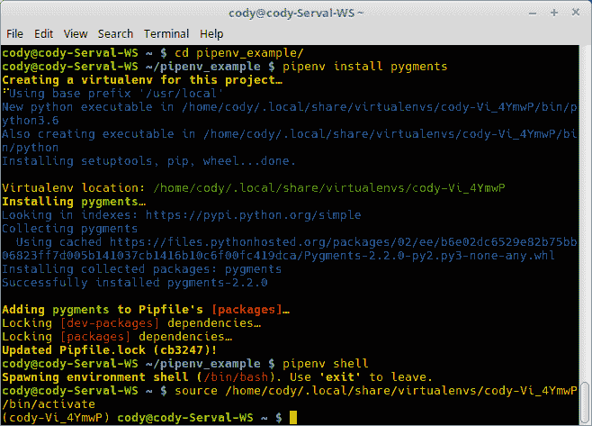
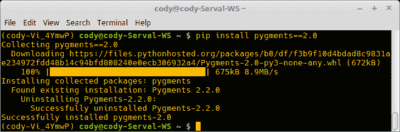
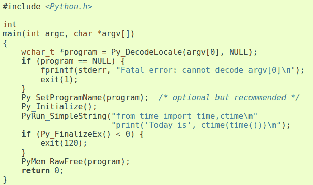
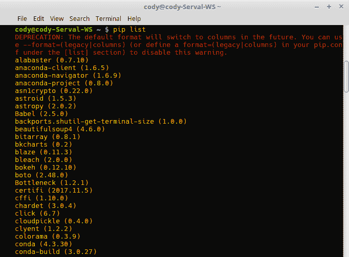
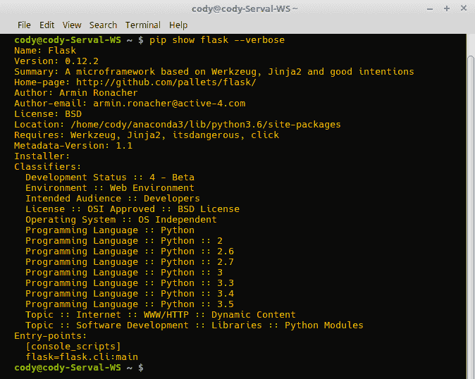

# 第一章：使用 Python 模块

在本章中，我们将讨论 Python 模块，具体涵盖以下主题：

+   使用和导入模块及命名空间

+   实现虚拟 Python 环境

+   Python 包安装选项

+   利用需求文件和解决冲突

+   使用本地补丁和约束文件

+   使用包

+   创建和打包

+   比较源代码与字节码

+   如何创建和引用模块包

+   操作系统特定的二进制文件

+   如何上传程序到 PyPI

+   项目打包

+   上传到 PyPI

# 简介

Python 模块是 Python 程序的最高级组件。正如其名称所暗示的，模块是模块化的，可以作为整体程序的一部分与其他模块连接，以提供更好的代码分离，同时结合在一起创建一个统一的程序。

模块允许轻松重用代码，并提供独立的命名空间以防止代码块之间的变量阴影。变量阴影涉及在不同命名空间中具有重复的变量，可能会导致解释器使用错误的变量。开发人员创建的每个 Python 文件都被视为一个单独的模块，允许不同的文件被导入到一个单一的、整体的文件中，该文件构成了最终的应用程序。

实际上，任何 Python 文件都可以通过简单地删除 `.py` 扩展名来成为一个模块；这通常在导入库时看到。Python 包是模块的集合；使包特殊的是包含一个 `__init__.py` 文件。我们将在稍后详细讨论这些差异，所以现在只需认识到同一项物品有多个名称。

# 使用和导入模块及命名空间

模块的一个关键点是它们产生独立的命名空间。命名空间（也称为**作用域**）只是一个模块或模块组件的控制域。通常，模块内的对象在模块外部不可见，也就是说，尝试调用位于不同模块中的变量将产生错误。

命名空间也用于隔离同一程序内的对象。例如，在函数内定义的变量仅在操作该函数时可见。尝试从另一个函数调用该变量将导致错误。这就是为什么全局变量是可用的；它们可以被任何函数调用并与之交互。这也是为什么全局变量不被推荐为最佳实践，因为可能会在不经意间修改全局变量，导致程序后续部分出现故障。

作用域基本上是自内而外工作的。如果一个变量在函数中使用，Python 解释器会首先在该函数内查找该变量的声明。如果找不到，Python 会向上查找栈，寻找全局定义的变量。如果在那里也找不到，Python 会在始终可用的内置库中查找。如果仍然找不到，Python 会抛出一个错误。从流程的角度来看，它看起来像这样：*局部作用域* -> *全局作用域* -> *内置模块* -> *错误*。

当导入模块时，作用域发现过程的一个小变化是，导入的模块也会被检查是否有对象调用，但有一个前提是，除非通过点命名法明确指定所需的对象，否则仍然会生成错误。

例如，如果你想生成一个介于 0 到 1,000 之间的随机数，你不能不导入`random`库就调用`randint()`函数。一旦导入了一个模块，就可以通过明确调用它们来使用任何公开可用的类、方法、函数和变量，格式为`<module_name>.<object_name>`。以下是一个例子：

```py
>>> randint(0, 1000)
Traceback (most recent call last):
File "<stdin>", line 1, in <module>
NameError: name 'randint' is not defined
>>> import random
>>> random.randint(0, 1000)
607
```

在前面的例子中，首先单独调用了`randint()`。由于它不是 Python 内置函数的一部分，解释器对此一无所知，因此抛出了错误。

然而，在导入包含各种随机数生成函数的`random`库之后，可以通过点命名法显式调用`randint()`，即`random.randint()`。这告诉 Python 解释器在`random`库中查找`randint()`，从而得到期望的结果。

为了澄清，当将模块导入程序时，Python 对命名空间有一些假设。如果执行了正常导入，即`import foo`，那么主程序和`foo`保持它们各自的命名空间。要使用`foo`模块中的函数，必须使用点命名法明确指定它：`foo.bar()`。

另一方面，如果只导入模块的一部分，例如，`from foo import bar`，那么导入的组件就成为了主程序作用域的一部分。如果使用通配符导入所有组件，也会发生这种情况：`from foo import *`。

以下例子展示了这些属性的实际应用：

```py
>>> from random import randint
>>> randint(0, 10)
2
>>> randrange(0, 25)
Traceback (most recent call last):
  File "<stdin>", line 1, in <module>
NameError: name 'randrange' is not defined
```

在前面的例子中，`random`模块中的`randint()`函数是明确单独导入的；这种导入方式使得`randint()`位于主程序的作用域内。这允许直接调用`randint()`而不需要明确指出它是`random.randint()`。然而，当尝试用`randrange()`函数做同样的事情时，会出现错误，因为它没有被导入。

# 如何做到这一点...

为了说明作用域，我们将创建嵌套函数，其中在一个封装函数内定义并调用函数：

1.  `nested_functions.py`包含一个嵌套函数，并以调用嵌套函数结束：

```py
 >>> def first_funct():
 ...    x = 1
 ...    print(x)
 ...    def second_funct():
 ...        x = 2
 ...        print(x)
 ...    second_funct()
 ...
```

1.  首先，调用父函数并检查结果：

```py
 >>> first_funct()
 1
 2
```

1.  接下来，直接调用嵌套函数，并注意会收到一个错误：

```py
 >>> second_funct()
 Traceback (most recent call last):
 File "<stdin>", line 1, in <module>
 NameError: name 'second_funct' is not defined
```

1.  要使用另一个模块，导入所需的模块：

```py
 >>> import math
```

1.  下面，我们以 `<module>.<function>` 的形式在模块内部调用 `sin()` 函数：

```py
 >>> math.sin(45)
 0.8509035245341184
```

1.  尝试像下面这样调用一个函数，不使用点命名法来指定其库包，会导致错误：

```py
 >>> sin(45)
      Traceback (most recent call last):
        File "<stdin>", line 1, in <module>
       NameError: name 'sin' is not defined
```

1.  或者，下面的例子展示了如何使用 `*` 通配符将模块中的所有项导入到当前程序的命名空间中：

```py
 >>> from math import *
      >>> sin(45)
      0.8509035245341184
```

1.  将模块作为脚本运行的一种常见方式是简单地从命令行显式调用模块，提供必要的任何参数。这可以通过配置模块以接受命令行参数来实现，如 `print_funct.py` 所示：

```py
        def print_funct(arg):
            print(arg)
            if __name__ == "__main__":
                import sys
                print_funct(sys.argv[1])
```

1.  `print_mult_args.py` 展示了，如果预期多个参数，且数量已知，每个参数都可以使用其在参数列表中的相应索引值来指定：

```py
        def print_funct(arg1, arg2, arg3):
            print(arg1, arg2, arg3)
        if __name__ == "__main__":
            import sys
            print_funct(sys.argv[1], sys.argv[2], sys.argv[3])
```

1.  或者，当函数可以捕获多个参数但数量未知时，可以使用下面的 `*args` 参数，如下所示：

```py
 >>> def print_input(*args):
      ...   for val, input in enumerate(args):
      ...       print("{}. {}".format(val, input))
      ...
      >>> print_input("spam", "spam", "eggs", "spam")
      0\. spam
      1\. spam
      2\. eggs
      3\. spam
```

# 它是如何工作的...

代码中命名赋值的定位决定了其命名空间的可见性。在先前的例子中，步骤 1-3，如果在调用 `first_funct()` 后立即直接调用 `second_funct()`，你会得到一个错误，表明 `second_funct()` 未定义。这是真的，因为全局上，第二个函数不存在；它是嵌套在第一个函数中的，并且不能在第一个函数的作用域之外被看到。第一个函数内部的所有内容都是其命名空间的一部分，就像第二个函数中的 `x` 的值不能直接调用，而必须使用 `second_funct()` 调用来获取其值。

在前面的例子中，步骤 4-7，整个 `math` 模块被导入，但它保持了自己的命名空间。因此，调用 `math.sin()` 会得到一个结果，但单独调用 `sin()` 会引发错误。

然后，使用通配符导入 `math` 模块。这告诉 Python 解释器将所有函数导入到主命名空间，而不是将它们保留在单独的 `math` 命名空间中。这次，当单独调用 `sin()` 时，它会提供正确的答案。

这证明了命名空间对于在允许使用相同的变量和函数名称的同时保持代码分离的重要性。通过使用点命名法，可以无惧名称遮蔽导致提供错误结果的风险。

在先前的例子中，步骤 7-10，使用 `sys.argv()` 允许 Python 解析命令行参数并将它们放置在列表中以供使用。`sys.argv([0])` 总是接受参数的程序名称，因此可以安全地忽略。所有其他参数都存储在列表中，因此可以通过它们的索引值访问。

使用 `*args` 告诉 Python 接受任意数量的参数，允许程序接受不同数量的输入值。一个替代版本，`**kwargs`，做同样的事情，但使用关键字：值对。

# 还有更多...

除了了解命名空间之外，在安装和使用模块时，还有一些其他重要的术语需要了解：

+   [`pypi.python.org/pypi`](https://pypi.python.org/pypi) 是第三方 Python 包的主要数据库。

+   `pip` 是第三方模块的主要安装程序，自 Python 3.4 以来，它已默认包含在 Python 二进制安装中。

+   虚拟 Python 环境允许为特定应用程序的开发安装包，而不是系统范围内安装。

+   `venv` 自 Python 3.3 以来一直是创建虚拟 Python 环境的主要工具。从 Python 3.4 开始，它会在所有虚拟环境中自动安装 `pip` 和 `setuptools`。

+   以下是一些常见的 Python 文件术语：模块、包、库和发行版。虽然它们有明确的定义（[`packaging.python.org/glossary/`](https://packaging.python.org/glossary/)），但本书有时会交替使用它们。

以下是从 `dice_roller.py` 中提取的部分，这是作者在最初学习 Python 时编写的第一个 Python 程序中嵌入测试的一个示例：

```py
import random
def randomNumGen(choice):
    if choice == 1: #d6 roll
        die = random.randint(1, 6)
    elif choice == 2: #d10 roll
        die = random.randint(1, 10)
    elif choice == 3: #d100 roll
        die = random.randint(1, 100)
    elif choice == 4: #d4 roll
      die = random.randint(1, 4)
    elif choice == 5: #d8 roll
      die = random.randint(1, 8)
    elif choice == 6: #d12 roll
      die = random.randint(1, 12)
    elif choice == 7: #d20 roll
      die = random.randint(1, 20)
    else: #simple error message
        return "Shouldn't be here. Invalid choice"
    return die
if __name__ == "__main__":
    import sys
    print(randomNumGen(int(sys.argv[1])))
```

在这个例子中，我们只是创建了一个随机数生成器，该生成器模拟掷不同多面体骰子（常用于角色扮演游戏）。导入 `random` 库，然后创建定义骰子如何掷出的函数。对于每次掷骰子，提供的整数表示骰子有多少面。使用这种方法，可以通过单个整数输入模拟任何数量的可能值。

这个程序的关键部分在末尾。部分 `if __name__ == "__main__"` 告诉 Python，如果模块的命名空间是 `main`，即它是主程序而不是被导入到另一个程序中，那么解释器应该运行此行以下的代码。否则，当导入时，只有此行以上的代码对主程序可用。（也值得注意，这一行对于与 Windows 的跨平台兼容性是必要的。）

当从命令行调用此程序时，会导入 `sys` 库。然后，从命令行读取提供给程序的第一个参数，并将其作为参数传递给 `randomNumGen()` 函数。结果会被打印到屏幕上。以下是此程序的一些结果示例：

```py
$ python3 dice_roller.py 1
2
$ python3 dice_roller.py 2
10
$ python3 dice_roller.py 3
63
$ python3 dice_roller.py 4
2
$ python3 dice_roller.py 5
5
$ python3 dice_roller.py 6
6
$ python3 dice_roller.py 7
17
$ python3 dice_roller.py 8
Shouldn't be here. Invalid choice
```

以这种方式配置模块是允许用户直接以独立方式与模块交互的简单方法。这也是运行脚本测试的好方法；只有当文件作为独立文件调用时才会运行测试，否则测试会被忽略。`dice_roller_tests.py` 是作者编写的完整的掷骰子模拟器：

```py
import random #randint
def randomNumGen(choice):
    """Get a random number to simulate a d6, d10, or d100 roll."""

    if choice == 1: #d6 roll
      die = random.randint(1, 6)
    elif choice == 2: #d10 roll
        die = random.randint(1, 10)
    elif choice == 3: #d100 roll
        die = random.randint(1, 100)
    elif choice == 4: #d4 roll
      die = random.randint(1, 4)
    elif choice == 5: #d8 roll
      die = random.randint(1, 8)
    elif choice == 6: #d12 roll
      die = random.randint(1, 12)
    elif choice == 7: #d20 roll
      die = random.randint(1, 20)
    else: #simple error message
        return "Shouldn't be here. Invalid choice"
    return die
def multiDie(dice_number, die_type):
    """Add die rolls together, e.g. 2d6, 4d10, etc."""

#---Initialize variables 
    final_roll = 0
    val = 0

    while val < dice_number:
        final_roll += randomNumGen(die_type)
        val += 1
    return final_roll
def test():
    """Test criteria to show script works."""

    _1d6 = multiDie(1,1) #1d6
    print("1d6 = ", _1d6, end=' ') 
    _2d6 = multiDie(2,1) #2d6
    print("\n2d6 = ", _2d6, end=' ')
    _3d6 = multiDie(3,1) #3d6
    print("\n3d6 = ", _3d6, end=' ')
    _4d6 = multiDie(4,1) #4d6
    print("\n4d6 = ", _4d6, end=' ')
    _1d10 = multiDie(1,2) #1d10
    print("\n1d10 = ", _1d10, end=' ')
    _2d10 = multiDie(2,2) #2d10
    print("\n2d10 = ", _2d10, end=' ')
    _3d10 = multiDie(2,2) #3d10
    print("\n3d10 = ", _3d10, end=' ')
    _d100 = multiDie(1,3) #d100
    print("\n1d100 = ", _d100, end=' ') 

if __name__ == "__main__": #run test() if calling as a separate program
    test()
```

这个程序基于之前的随机骰子程序，允许将多个骰子相加。此外，`test()` 函数仅在程序自己调用时运行，以提供代码的合理性检查。如果 `test` 函数不在包含其余代码的函数中，它可能会更好，因为它仍然在模块导入时可以访问，如下所示：

```py
>>> import dice_roller_tests.py
>>> dice_roller_tests.test()
1d6 = 1 
2d6 = 8 
3d6 = 10 
4d6 = 12 
1d10 = 5 
2d10 = 8 
3d10 = 6 
1d100 = 26
```

因此，如果你有任何不希望在模块导入时被访问的代码，请确保将其放在 *下面一行*，就像这样。

# 实现虚拟 Python 环境

如前所述，Python 虚拟环境创建了独立的 Python 环境，就像虚拟机允许多个但独立的操作系统一样。Python 虚拟环境在安装多个模块时特别有用。

相同模块的实例。

例如，假设你正在处理一个需要特定库模块 1.2 版本以支持旧版的项目。现在假设你下载了一个使用相同库 2.2 版本的 Python 程序。如果你在硬盘的默认全局位置，例如 `/usr/lib/python3.6/site-packages`，安装所有内容，新程序将把更新的库安装到同一位置，覆盖旧软件。由于你正在使用旧库以支持旧版，更新后的库很可能破坏你的应用程序。

此外，在共享系统（尤其是如果你没有管理员权限）上，你很可能无法在系统上安装模块，至少不能在默认的全局 `site-packages` 目录中安装。你可能运气好，能够为你的账户安装软件，但如果你不能，你必须请求安装权限或者不安装。

这就是虚拟 Python 环境发挥作用的地方。每个环境都有自己的安装目录，并且环境之间不共享库。这意味着环境内模块的每个版本都保持不变，即使你更新了全局库。这也意味着你可以在电脑上同时安装多个模块版本，而不会发生冲突。

虚拟环境也有它们自己的外壳，允许访问一个独立于任何其他环境或底层操作系统的操作系统外壳。这个配方还展示了如何从 `pipenv` 中启动一个新的 Python 外壳。这样做确保所有命令都将能够访问虚拟环境内安装的包。

# 准备工作

以前管理虚拟环境的方式是使用 `venv` 工具。要安装它，使用命令 `sudo apt install python3-venv`。

为了以现代方式管理虚拟环境，开发了 `pipenv` 模块（[`docs.pipenv.org/`](https://docs.pipenv.org/)）；它自动为项目创建和管理虚拟环境，以及当您安装/卸载包时从 `Pipfile` 中添加和删除包。它可以通过 `pip install pipenv` 安装。

`Pipfile` 是 `requirements.txt` 的替代品，用于指定程序中要包含的模块的确切版本。实际上，`Pipfile` 由两个独立的文件组成：`Pipfile` 和（可选的）`Pipfile.lock`。下面的 `pipfile.py` 是来自 Pipenv 网站的 `Pipfile` 示例（[`docs.pipenv.org/basics/#example-pipfile-pipfile-lock`](https://docs.pipenv.org/basics/#example-pipfile-pipfile-lock)）：

```py
[[source]]
url = "https://pypi.python.org/simple"
verify_ssl = true
name = "pypi"

[packages]
requests = "*"

[dev-packages]
pytest = "*"
```

`Pipfile.lock` 从 `Pipfile` 中获取并设置所有包的实际版本号，以及为这些文件识别特定的哈希值。哈希值有助于最小化安全风险；也就是说，如果某个模块版本存在漏洞，其哈希值允许它被轻松识别，而不是通过版本名称或其他方法搜索。下面的 `pipfile_lock.py` 是来自 Pipenv 网站的 `Pipfile.lock` 文件示例（[`docs.pipenv.org/basics/#example-pipfile-pipfile-lock`](https://docs.pipenv.org/basics/#example-pipfile-pipfile-lock)）：

```py
{
  "_meta": {
    "hash": {
      "sha256": "8d14434df45e0ef884d6c3f6e8048ba72335637a8631cc44792f52fd20b6f97a"
    },
    "host-environment-markers": {
      "implementation_name": "cpython",
      "implementation_version": "3.6.1",
      "os_name": "posix",
      "platform_machine": "x86_64",
      "platform_python_implementation": "CPython",
      "platform_release": "16.7.0",
      "platform_system": "Darwin",
      "platform_version": "Darwin Kernel Version 16.7.0: Thu Jun 15 17:36:27 PDT 2017; root:xnu-3789.70.16~2/RELEASE_X86_64",
      "python_full_version": "3.6.1",
      "python_version": "3.6",
      "sys_platform": "darwin"
    },
    "pipfile-spec": 5,
    "requires": {},
    "sources": [
      {
        "name": "pypi",
        "url": "https://pypi.python.org/simple",
        "verify_ssl": true
      }
    ]
  },
  "default": {
    "certifi": {
      "hashes": [
        "sha256:54a07c09c586b0e4c619f02a5e94e36619da8e2b053e20f594348c0611803704",
        "sha256:40523d2efb60523e113b44602298f0960e900388cf3bb6043f645cf57ea9e3f5"
      ],
      "version": "==2017.7.27.1"
    },
    "chardet": {
      "hashes": [
         "sha256:fc323ffcaeaed0e0a02bf4d117757b98aed530d9ed4531e3e15460124c106691",
         "sha256:84ab92ed1c4d4f16916e05906b6b75a6c0fb5db821cc65e70cbd64a3e2a5eaae"
      ],
      "version": "==3.0.4"
    },
***further entries truncated***
```

# 如何做到这一点...

1.  创建虚拟环境的原始、常规方法包括三个独立的步骤。首先，创建虚拟环境：

```py
 >>> python3 -m venv <dir_name>
```

1.  接下来，激活虚拟环境以便使用：

```py
 >>> source <dir_name>/bin/activate
```

1.  最后，使用 `pip` 安装必要的模块：

```py
 >>> pip install <module>
```

1.  为了使这个过程更简单，`pipenv` 将 `pip` 和 `venv` 调用结合起来，因此我们首先需要移动到虚拟环境将要放置的目标目录：

```py
 >>> cd <project_name>
```

1.  接下来，我们只需调用 `pipenv` 来创建环境并安装所需的模块：

```py
 >>> pipenv install <module>
```

1.  使用 `pipenv` 调用 `shell` 命令并等待创建 shell。观察到一个虚拟环境已经创建，并且命令提示符现在在环境中被激活。以下截图包含了之前步骤的命令，以便于理解：



# 它是如何工作的...

之前的 `pipenv` 示例显示了开发者切换到项目所需的目标目录，然后调用 `pipenv` 以同时创建虚拟环境、激活它并安装所需的模块。

除了创建虚拟环境之外，一旦您创建了您的 Python 程序，您也可以使用 `pipenv` 运行程序：

```py
>>> pipenv run python3 <program_name>.py
```

这样做确保虚拟环境中安装的所有包都可用于您的程序，从而降低意外错误的可能性。

当启动 `pipenv shell` 时，会创建一个新的虚拟环境，并在文件系统中显示环境创建的位置。在这种情况下，创建了两个环境可执行文件，分别引用了 Python 3.6 命令和默认的 Python 命令。（根据系统不同，这些可能实际上引用了不同的 Python 版本。例如，默认的 Python 命令可能调用 Python 2.7 环境而不是 Python 3.6。）

# 还有更多...

顺便提一下，`-m` 选项表示 Python 将模块作为独立脚本运行，也就是说，其内容将在 `__main__` 命名空间内执行。这样做意味着你不需要知道模块的完整路径，因为 Python 会查找 `sys.path` 中的脚本。换句话说，对于你通常导入到其他 Python 文件中的模块，可以直接从命令行运行。

在运行 `pipenv` 的示例中，命令利用了 Python 允许使用 `-m` 选项直接运行模块或允许它被导入的事实；在这种情况下，`pipenv` 在创建过程中导入 `venv` 以创建虚拟环境。

# Python 包安装选项

通常通过查看 [`pypi.python.org/pypi`](http://pypi.python.org/pypi) 中的所需模块来安装包，但 `pip` 支持从版本控制、本地项目和分发文件安装。

Python 的 *wheels* 是预构建的存档，与从源文件安装相比，可以加快包安装过程。它们可以与为操作系统安装预制的二进制应用程序相比，而不是构建和安装源文件。

Wheels 是为了取代 Python 的 *eggs* 而开发的，在新的打包标准开发之前，它们执行了 wheels 的功能。Wheels 通过指定 `.dist-info` 目录（一个与磁盘格式非常接近的已安装 Python 包数据库）以及实现包元数据（这有助于识别软件依赖项）来改进 eggs。

`pip` 尽可能从 wheels 安装，尽管可以使用 `pip install --no-binary` 禁用此功能。如果 wheel 文件不可用，`pip` 将查找源文件。可以从 PyPI 手动下载 wheels 或从本地仓库拉取；只需告诉 `pip` 本地文件的位置即可。

# 如何操作...

1.  使用 `pip` 直接从 PyPI 拉取包的最新版本：

```py
 $ pip install <package_name>
```

1.  或者，可以下载特定版本的包：

```py
 $ pip install <package_name>==1.2.2
```

这里是一个在 `pipenv` 中降级 `pygments` 的示例：



1.  作为最后一个选项，可以下载包的最小版本；这在包在不同版本之间有重大变化时很常见：

```py
 $ pip install "<package_name> >= 1.1" 
```

1.  如果 PyPI 包有 wheel 文件可用，`pip` 将自动下载 wheel；否则，它将拉取源代码并编译它。

```py
 $ pip install <some_package>
```

1.  要安装本地轮文件，提供文件的完整路径：

```py
 $ pip install /local_files/SomePackage-1.2-py2.py3-none-any.whl
```

# 它是如何工作的...

轮文件名格式分解为 `<package_name>-<version>-<language_version>-<abi_tag>-<platform_tag>.whl`。包名是要安装的模块的名称，后面跟着这个特定轮文件的版本。

语言版本指的是 Python 2 或 Python 3；它可以具体到必要的程度，例如 `py27`（任何 Python 2.7.x 版本）或 `py3`（任何 Python 3.x.x 版本）。

**ABI** 标签指的是 **应用程序二进制接口**。在过去，Python 解释器依赖的底层 C API（**应用程序编程接口**）在每次发布时都会改变，通常是通过添加 API 功能而不是更改或删除现有 API。Windows 操作系统尤其受到影响，每个 Python 功能发布都会为 Python Window 的 DLL 创建一个新的名称。

ABI 指的是 Python 的二进制兼容性。虽然对 Python 结构定义的更改可能不会破坏 API 兼容性，但 ABI 兼容性可能会受到影响。大多数 ABI 问题都源于内存结构布局的变化。

自 3.2 版本以来，一组有限的 API 功能已被保证对 ABI 稳定。指定 ABI 标签允许开发者指定包兼容的 Python 实现，例如 PyPy 与 CPython。一般来说，此标签设置为 `none`，表示没有特定的 ABI 要求。

平台标签指定了 `wheel` 包设计运行的操作系统和 CPU。这通常是 `any`，除非轮的开发者有特定的理由将包限制在特定的系统类型上。

# 利用需求文件和解决冲突

如前所述，可以通过 `pip install -r requirements.txt` 创建一个需求文件 `requirements.txt`，一次性提供要安装的包列表。需求文件可以指定特定或最低版本，或者简单地指定库的名称和最新版本将被安装。

应该注意的是，从需求文件中拉取的文件不一定按特定顺序安装。如果您需要某些包在安装其他包之前安装，您将不得不采取措施确保安装顺序，例如使用多个 `pip install` 调用。

需求文件可以明确指定包的版本号。例如，两个不同的模块（*m1* 和 *m2*）都依赖于第三个模块（*m3*）。模块 *m1* 要求 *m3* 至少是版本 1.5，但 *m2* 要求它不超过版本 2.0；*m3* 的当前版本是 2.3。此外，已知最新版本的 *m2*（版本 1.7）存在一个错误。

哈希摘要可以在需求文件中使用，以验证下载的包，防止 PyPI 数据库或 HTTPS 证书链被破坏。这实际上是一件好事，因为在 2017 年，有十种 Python 库 ([`www.bleepingcomputer.com/news/security/ten-malicious-libraries-found-on-pypi-python-package-index/`](https://www.bleepingcomputer.com/news/security/ten-malicious-libraries-found-on-pypi-python-package-index/)) 被发现托管在 PyPI 上，这些库包含恶意文件。

由于 PyPI 在上传包时不会执行任何安全检查或代码审计，因此上传恶意软件实际上非常容易。

# 如何做到这一点...

1.  通过手动输入项目需要包含的包来创建 `requirements.txt`。以下是一个来自 [`pip.pypa.io/en/latest/reference/pip_install/#requirements-file-format`](https://pip.pypa.io/en/latest/reference/pip_install/#requirements-file-format) 的示例：



1.  或者，运行 `pip freeze > requirements.txt`。这会自动将当前安装的包导出到一个格式正确的需求文件中。

1.  要实现哈希校验模式，只需在需求文件中将摘要与包名称一起包含，如下所示：

```py
 FooProject == 1.2 --hash=sha256:<hash_digest>
```

注意：支持的哈希算法包括：md5、sha1、sha224、sha384、sha256 和 sha512。

1.  如果存在模块冲突或需要特殊版本，提供所需的第一模块：

```py
 m1
```

1.  指明第二个模块，但确保安装的版本早于已知的坏版本：

```py
 m2<1.7
```

1.  提供第三个模块，确保它至少等于所需的最小版本，但不超过可以使用的最大版本：

```py
 m3>=1.5, <=2.0
```

虽然前面的截图显示了某些版本指定要求，但以下是一个示例，展示了在 `requirements.txt` 中指定模块版本的不同方法：

```py
 flask
 flask-pretty == 0.2.0
 flask-security <= 3.0
 flask-oauthlib >= 0.9.0, <= 0.9.4
```

# 它是如何工作的...

在这个示例中，模块 `m1` 被指定为需求，但版本号并不重要；在这种情况下，`pip` 将安装最新版本。然而，由于 `m2` 最新版本的错误，指定了一个更早的版本来安装。最后，`m3` 必须是介于 1.5 和 2.0 之间的版本以满足安装要求。当然，如果这些条件中有一个无法满足，安装将失败，并且会显示有问题的库和版本号以供进一步故障排除。

# 还有更多...

值得注意的是，`pip` 并没有真正的依赖关系解析；它只会安装第一个指定的文件。因此，可能会出现依赖冲突或不符合实际要求的子依赖。这就是为什么需求文件很有用，因为它可以缓解一些依赖问题。

验证哈希值也确保了在版本号不改变的情况下，无法更改软件包，例如在自动化的服务器部署中。这对于效率来说是一个理想的情况，因为它消除了维护仅包含批准软件包的私有索引服务器的需求。

# 使用本地补丁和约束文件

开源软件的好处是能够查看和修改源代码。如果你正在处理一个项目并创建 PyPI 模块的本地版本，例如为项目定制或创建补丁，可以使用 `requirements.txt` 来覆盖文件的正常下载。

约束文件是对需求文件的修改，仅指示已安装库的版本，但它们实际上并不控制文件的安装。

使用约束文件的一个例子是当使用 PyPI 模块的本地修补版本时，例如，**ReqFile**。一些从 PyPI 下载的软件包依赖于 ReqFile，但其他软件包则不依赖。与其为 PyPI 上每个依赖 ReqFile 的软件包编写一个需求文件，不如创建一个作为主记录的约束文件，并在所有 Python 项目中实施。任何需要安装 ReqFile 的软件包都会看到约束文件，并从本地存储库安装，而不是从 PyPI 安装。

以这种方式，单个文件可以被每个开发者使用，并且不再重要 PyPI 软件包依赖于什么；正确的版本要么从 PyPI 拉取，要么在需要时使用本地版本。

# 如何操作...

1.  对文件的内屋版本进行标记。假设你正在使用 Git，可以使用以下方式生成标签：

```py
 git tag -a <tag_name> -m "<tag_message>"
      # git tag -a v0.3 -m "Changed the calculations"
```

1.  将其上传到版本控制系统。

1.  在 `requirements.txt` 文件中指明本地版本，如下面的示例所示：

```py
 git+https://<vcs>/<dependency>@<tag_name>#egg=<dependency>
      # git+https://gitlab/pump_laws@v0.3#egg=pump_laws
```

1.  按照 `requirements.txt` 文件的方式编写 `constraints.txt` 文件。以下示例来自 [`github.com/mldbai/mldb`](https://github.com/mldbai/mldb)（由 MLDB.ai 以 Apache v2.0 许可证发布）：

```py
 # math / science / graph stuff
 bokeh==0.11.1
 numpy==1.10.4
 pandas==0.17.1
 scipy==0.17.0
 openpyxl==2.3.3
 patsy==0.4.1
 matplotlib==1.5.1
 ggplot==0.6.8
 Theano==0.7.0
 seaborn==0.7.0
 scikit-learn==0.17

 pymldb==0.8.1
 pivottablejs==0.1.0

 # Progress bar
 tqdm==4.11.0

 # notebook and friends
 ipython==5.1.0
 jupyter==1.0.0
 jupyter-client==4.4.0
 jupyter-console==5.0.0
 jupyter-core==4.2.1

 # validator
 uWSGI==2.0.12
 pycrypto==2.6.1

 tornado==4.4.2

 ## The following requirements were added by pip freeze:
 backports-abc==0.5
 backports.shutil-get-terminal-size==1.0.0
 backports.ssl-match-hostname==3.5.0.1
 bleach==1.5.0

 ***further files truncated***
```

1.  接下来，运行命令 `pip install -c constraints.txt`，使文件对 Python 可用。

# 它是如何工作的...

在前面的示例中，`<vcs>` 是正在使用的版本控制系统；它可能是一个本地服务器或如 GitHub 这样的在线服务。`<tag_name>` 是用于识别控制系统中特定更新的版本控制系统标签。

如果所需的依赖项是项目的顶层需求，那么需求文件中的该特定行可以直接替换。如果是另一个文件的子依赖项，那么上述命令将作为新行添加。

# 更多...

约束文件与需求文件在一点上有所不同：将一个包放入约束文件中不会导致该包被安装，而需求文件则会安装列出的所有包。约束文件实际上是控制要安装的包的版本的需求文件，但不会对实际安装进行控制。

# 与包一起工作

有许多实用工具可用于与 Python 包一起工作。开发者时不时地需要从系统中卸载 Python 包。卸载包与安装包一样简单。

由于安装包很容易，而且很容易忘记过去安装了什么，`pip` 提供了列出所有当前已安装包的能力，以及指示哪些包已过时。下一节中的示例来自 Python 列表 ([`pip.pypa.io/en/stable/reference/pip_list/`](https://pip.pypa.io/en/stable/reference/pip_list/))，并展示了文档页面 ([`pip.pypa.io/en/stable/reference/pip_show/`](https://pip.pypa.io/en/stable/reference/pip_show/))。

最后，当寻找要安装的包时，而不是打开浏览器直接导航到 PyPI，可以从命令行找到包。

# 如何做...

1.  要卸载包，请运行 `pip uninstall <package_name>` 命令。这将卸载系统上的大多数包。

1.  可以使用 `-r` 选项一次性删除多个包，例如 `pip uninstall -r <requirements_file>`。`-y` 选项允许自动确认文件删除。

1.  通过运行 `pip list` 列出当前已安装的包。



1.  要显示过时的包，请使用 `pip list --outdated`，如下所示：

```py
 $ pip list --outdated
      docutils (Current: 0.10 Latest: 0.11)
      Sphinx (Current: 1.2.1 Latest: 1.2.2) 
```

虽然可以一次性更新所有过时的包，但这在 `pip` 本身中不可用。有两种主要选项：第一个选项涉及使用 `sed`、`awk` 或 `grep` 遍历包列表，找到过时的包并更新它们。或者，安装包 `pip-review` 来查看过时的包并更新它们。此外，还有许多其他由不同开发者创建的工具，以及如何自己做的说明，所以你应该决定哪个最适合你。

注意：自动升级所有 Python 包可能会破坏依赖关系。你应该仅在需要时更新包。

1.  使用 `pip show <package_name>` 可以显示特定已安装包的详细信息，如下所示：

```py
 $ pip show sphinx
      Name: Sphinx
      Version: 1.7.2
      Summary: Python documentation generator
      Home-page: http://sphinx-doc.org/
      Author: Georg Brandl
      Author-email: georg@python.org
      License: BSD
      Location: /my/env/lib/python2.7/site-packages
      Requires: docutils, snowballstemmer, alabaster, Pygments, 
                imagesize, Jinja2, babel, six
```

1.  运行命令 `pip search "查询字符串"`。以下示例来自 [`pip.pypa.io/en/stable/reference/pip_search/`](https://pip.pypa.io/en/stable/reference/pip_search/)，展示了输出结果：

```py
 $ pip search peppercorn
      pepperedform    - Helpers for using peppercorn with formprocess.
      peppercorn      - A library for converting a token stream into [...]
```

# 它是如何工作的...

在搜索包时，查询可以是包名或只是一个单词，例如`pip`会找到所有包名或包描述中包含该字符串的包。如果你知道你想做什么但不知道包的实际名称，这是一种查找包的有用方法。

# 还有更多...

使用`python setup.py install`安装的包和通过`python setup.py develop`安装的程序包装器不能通过`pip`卸载，因为它们不提供有关已安装文件的元数据。

有许多其他选项可用于列出文件，例如仅列出非全局包、包的 beta 版本、按列输出列表以及其他可能有用的工具。

可以通过使用`--verbose`选项显示附加信息，如下面的截图所示：



详细选项显示与默认模式相同的信息，但还包括在包的 PyPI 页面上可以找到的分类器信息。显然，这些信息可以通过访问 PyPI 网站简单地找到，但如果你在独立的计算机上或无法连接到互联网的情况下，这可以在确定包是否受我们当前环境支持或寻找特定主题内的类似包时很有用。

# 创建轮子和捆绑包

`pip wheel`允许开发者将所有项目依赖项以及任何编译文件打包成一个单独的存档文件。这在索引服务器不可用的情况下安装时很有用，并消除了重新编译代码的需要。然而，编译包通常是操作系统和架构特定的，因为它们通常是 C 代码，这意味着它们通常在不同系统之间不可移植，除非重新编译。这也是使用哈希检查以确保未来轮子使用相同包构建的好方法。

# 如何做到这一点...

要创建一个存档（来自官方文档：[`pip.pypa.io/en/latest/user_guide/#installation-bundles`](https://pip.pypa.io/en/latest/user_guide/#installation-bundles)），请执行以下操作：

1.  创建一个临时目录：

```py
 $ tempdir = $(mktemp -d /tmp/archive_dir)
```

1.  创建一个轮子文件：

```py
 $ pip wheel -r requirements.txt --wheel-dir = $tempdir
```

1.  让操作系统知道存档文件放置的位置：

```py
 $ cwd = `pwd`
```

1.  切换到临时目录并创建存档文件：

```py
 $ (cd "$tempdir"; tar -cjvf "$cwd/<archive>.tar.bz2" *)
```

从存档安装，请执行以下操作：

1.  创建一个临时目录：

```py
 $ tempdir=$(mktemp -d /tmp/wheelhouse-XXXXX)
```

1.  切换到临时目录并解压文件：

```py
 $ (cd $tempdir; tar -xvf /path/to/<archive>.tar.bz2)
```

1.  使用`pip`安装未存档的文件：

```py
 $ pip install --force-reinstall --ignore-installed --upgrade --no-index --no-deps $tempdir/*
```

# 它是如何工作的...

在第一个示例（创建存档）中，首先创建一个临时目录，然后使用需求文件创建轮子并将其放置在临时目录中。接下来，创建`cwd`变量并将其设置为当前工作目录（`pwd`）。最后，发出一个组合命令，切换到临时目录，并在`cwd`中创建一个包含临时目录中所有文件的存档文件。

在第二个示例（从存档安装）中，会创建一个临时目录。然后，给出一个组合命令以切换到该临时目录并提取构成存档文件的文件。接着，使用`pip`，将这些打包文件安装到临时目录中的计算机上。

# 还有更多...

`--force-reinstall`在升级时将重新安装所有包，即使它们已经是最新版本。`--ignore-installed`强制重新安装，忽略包是否已经存在。`--upgrade`将所有指定的包升级到最新版本。`--no-index`忽略包索引，只解析存档的 URL。`--no-deps`确保不安装任何包依赖项。

# 比较源代码和字节码

解释性语言，如 Python，通常将原始源代码转换为字节码。字节码是低于源代码但又不完全像机器代码（即汇编语言）优化的编码指令。 

字节码通常在解释器（这是一种虚拟机类型）中执行，尽管它也可以进一步编译成汇编语言。字节码主要用于实现跨平台的兼容性。Python、Java、Ruby、Perl 和类似的语言是使用字节码解释器进行不同架构的例子，而源代码保持不变。

虽然 Python 会自动将源代码编译成字节码，但有一些选项和功能可以用来修改解释器与字节码交互的方式。这些选项可以通过提高解释性语言的性能来改善 Python 程序，因为解释性语言本质上比编译性语言慢。

# 如何做到这一点...

1.  要创建字节码，只需通过`python <program>.py`执行 Python 程序。

1.  当从命令行运行 Python 命令时，有几个开关可以减小编译后的字节码的大小。请注意，某些程序可能期望从以下示例中删除的语句能够正确执行，因此只有在你了解预期结果的情况下才使用它们。

`-O`从编译后的代码中移除`assert`语句。这些语句在测试程序时提供一些调试帮助，但在生产代码中通常不是必需的。

`-OO`移除`assert`和`__doc__`字符串，以进一步减小大小。

1.  从字节码将程序加载到内存中比使用源代码更快，但实际程序执行的速度并没有加快（由于 Python 解释器的特性）。

1.  `compileall`模块可以为目录中的所有模块生成字节码。有关该命令的更多信息，请参阅[`docs.python.org/3.6/library/compileall.html`](https://docs.python.org/3.6/library/compileall.html)。

# 它是如何工作的...

当源代码（`.py`）被 Python 解释器读取时，会生成字节码并存储在 `__pycache__` 中，格式为 `<module_name>.<version>.pyc`。`.pyc` 扩展名表示它是编译后的 Python 代码。这种命名约定允许系统上同时存在不同版本的 Python 代码。

当源代码被修改时，Python 会自动检查与缓存中编译版本的日期，如果日期过时，则会自动重新编译字节码。然而，直接从命令行加载的模块不会被存储在 `__pycache__` 中，并且每次都会重新编译。此外，如果没有源模块，缓存无法进行检查，也就是说，仅包含字节码的包不会与其关联缓存。

# 还有更多...

由于字节码是平台无关的（因为它是通过平台的解释器运行的），Python 代码可以以 `.py` 源文件或 `.pyc` 字节码的形式发布。这就是字节码包发挥作用的地方；为了提供一点混淆和（主观的）安全性，Python 程序可以没有源代码，只提供预编译的 `.pyc` 文件。在这种情况下，编译后的代码放在源目录中，而不是源代码文件中。

# 如何创建和引用模块包

我们已经讨论了模块和包，使用了可互换的术语。然而，模块和包之间是有区别的：包实际上是模块的集合，并且包含一个 `__init__.py` 文件，这可以是一个空文件。

在模块中用于访问特定函数或变量的点命名法也用于包。这次，点名称允许在包内访问多个模块而不会发生名称冲突；每个包创建自己的命名空间，所有模块都有自己的命名空间。

当包包含子包（如下面的示例所示）时，导入模块可以使用绝对路径或相对路径。例如，要导入 `sepia.py` 模块，可以使用绝对路径导入：`from video.effects.specialFX import sepia`。

# 如何操作...

1.  在创建包时，按照目录结构中的正常文件系统层次结构进行；也就是说，相互关联的模块应该放在它们自己的目录中。

1.  一个视频文件处理器的可能包在 `package_tree.py` 中展示：

```py
 video/                  # Top-level package
 __init__.py         # Top-level initialization
 formats/            # Sub-package for file formats
 __init__.py     # Package-level initialization
 avi_in.py
 avi_out.py
 mpg2_in.py
 mpg2_out.py
 webm_in.py
 webm_out.py
 effects/             # Sub-package for video effects
 specialFX/       # Sub-package for special effects
 __init__.py
 sepia.py
 mosaic.py
 old_movie.py
 glass.py
 pencil.py
 tv.py
 transform/        # Sub-package for transform effects
 __init__.py
 flip.py
 skew.py
 rotate.py
 mirror.py
 wave.py
 broken_glass.py
 draw/              # Sub-package for draw effects
 __init__.py
 rectangle.py
 ellipse.py
 border.py
 line.py
 polygon.py
```

1.  但是，如果你已经在 `specialFX/` 目录中，并想从另一个包中导入，会发生什么？使用相对路径遍历目录，并使用点来导入，就像在命令行中更改目录一样：

```py
 from . import mosaic
      from .. import transform
      from .. draw import rectangle
```

# 它是如何工作的...

在这个例子中，整个 `video` 包包含两个子包，视频格式和视频效果，其中视频效果有自己的几个子包。在包内部，每个 `.py` 文件都是一个独立的模块。在模块导入期间，Python 在 `sys.path` 上查找包。

包含 `__init__.py` 文件是必要的，这样 Python 会将目录视为包。这可以防止具有常见名称的目录在搜索路径中覆盖 Python 模块。它们还允许通过 `-m` 选项将模块作为独立程序调用，当调用 Python 程序时。

初始化文件通常是空的，但可以包含包的初始化代码。它们还可以包含一个 `__all__` 列表，这是一个 Python 列表，其中包含在 `from <package> import *` 被使用时应该导入的模块。

`__all__` 的原因是为了让开发者明确指出哪些文件应该被导入。这是为了防止导入包中所有模块（这些模块可能对其他开发者不是必需的）导致的过度延迟。它还限制了意外导入模块时出现不期望副作用的机会。需要注意的是，每当包更新时，开发者都需要更新 `__all__` 列表。

相对导入基于当前模块的名称。由于程序的主模块总是具有 `"__main__"` 的名称，因此任何将成为应用程序主模块的模块都必须使用绝对导入。

老实说，为了确保你确切知道你要导入的内容，通常使用绝对导入更安全；如今大多数开发环境都提供路径建议，写出自动填充的路径与使用相对路径一样容易。

# 更多内容...

如果在 `__init__.py` 中没有定义 `__all__`，那么 `import *` 只会导入指定包内的模块，而不是所有子包或它们的模块。例如，`from video.formats import *` 只会导入视频格式；`effects/` 目录中的模块将不会被包括。

这是对 Python 程序员的一个最佳实践：正如 Python 的禅宗（[`www.python.org/dev/peps/pep-0020/`](https://www.python.org/dev/peps/pep-0020/））所述，明确优于隐含。因此，从包中导入特定的子模块是好事，而 `import *` 则因为可能存在变量名冲突而被不推荐。

包具有 `__path__` 属性，这个属性很少使用。该属性是一个列表，包含包的 `__init__.py` 文件所在的目录名称。在运行文件的其他代码之前，会访问此位置。

修改包路径会影响包内模块和子包的将来搜索。这在需要扩展包搜索期间找到的模块数量时很有用。

# 操作系统特定的二进制文件

Python 程序通常以源代码或 wheel 文件的形式提供。然而，有时开发者想要提供针对特定操作系统的文件，例如 Windows 的 `.exe` 文件，以简化安装过程。Python 为开发者提供了多种选项来创建独立可执行文件。

**py2exe** ([https://pypi.python.org/pypi/py2exe/](https://pypi.python.org/pypi/py2exe/)) 是创建特定于 Windows 文件的选项之一。不幸的是，很难判断这个项目的维护情况，因为最后一个版本是在 2014 年发布的 [`pypi.python.org/pypi/py2exe/0.9.2.2`](https://pypi.python.org/pypi/py2exe/0.9.2.2)，而 [`www.py2exe.org`](http://www.py2exe.org/) 引用了 2008 年的版本。它似乎也只适用于 Python 3.4 及更早版本。然而，如果你认为这个程序可能有用，它可以将 Python 脚本转换为 Windows 可执行文件，而无需安装 Python。

**py2app** ([`py2app.readthedocs.io/en/latest/`](https://py2app.readthedocs.io/en/latest/)) 是创建独立 Mac 打包的主要工具。这个工具仍然在 [`bitbucket.org/ronaldoussoren/py2app`](https://bitbucket.org/ronaldoussoren/py2app) 上维护，最新的版本发布于 2018 年 1 月。构建过程与 `py2exe` 类似，但需要几个库依赖项，可以在 [`py2app.readthedocs.io/en/latest/dependencies.html`](https://py2app.readthedocs.io/en/latest/dependencies.html) 中找到。

制作特定操作系统可执行程序的跨平台工具比针对特定操作系统的工具要多。这是好事，因为许多开发者使用 Linux 作为他们的开发环境，可能无法访问 Windows 或 Mac 机器。

对于不想自己设置多个操作系统的开发者，有几个在线服务允许你在线租用操作系统。例如，[`virtualmacosx.com`](http://virtualmacosx.com) 允许你访问托管 Mac 环境，而 Windows 托管有多个选项，从亚马逊云服务到常规网络主机。

对于希望对二进制执行进行本地控制的开发者，cx_Freeze ([`anthony-tuininga.github.io/cx_Freeze/`](https://anthony-tuininga.github.io/cx_Freeze/)) 是 Python 中更受欢迎的可执行文件创建程序之一。它只适用于 Python 2.7 或更新的版本，但这对于大多数开发者来说不应该是个问题。然而，如果你想用它与 Python 2 代码一起使用，你必须使用 **cx_Freeze** 版本 5；从版本 6 开始，已经放弃了 Python 2 代码的支持。

cx_Freeze 创建的模块存储在 ZIP 文件中。默认情况下，包存储在文件系统中，但如果需要，也可以包含在相同的 ZIP 文件中。

**PyInstaller** ([`www.pyinstaller.org`](http://www.pyinstaller.org)) 的主要目标是与第三方包兼容，在创建二进制文件时无需用户干预即可使外部包工作。它适用于 Python 2.7 及更新的版本。

PyInstaller 提供了多种打包 Python 代码的方式：作为一个单独的目录（包含可执行文件以及所有必要的模块），作为一个单独的文件（自包含且不需要外部依赖），或者以自定义模式。

大多数第三方包无需额外配置即可与 PyInstaller 一起使用。方便的是，提供了一个列表，位于[`github.com/pyinstaller/pyinstaller/wiki/Supported-Packages`](https://github.com/pyinstaller/pyinstaller/wiki/Supported-Packages)，列出了已知与 PyInstaller 兼容的包；如果有任何限制，例如仅在 Windows 上工作，这些也会被注明。

**Cython** ([`cython.org`](http://cython.org)) 实际上是 Python 的超集，旨在为 Python 代码提供类似 C 的性能。这是通过允许向 Python 代码中添加类型来实现的；而 Python 通常是动态类型，Cython 允许变量的静态类型。生成的代码被编译成 C 代码，可以像正常一样由 Python 解释器执行，但速度可以达到编译 C 代码的速度。

虽然通常用于创建 Python 的扩展或加速 Python 处理，但使用`cpython`命令的`--embed`标志将创建一个 C 文件，然后可以将其编译成普通的应用程序文件。

自然地，这需要更多关于使用`gcc`或你选择的编译器的知识，因为你必须知道如何在编译时导入 Python 头文件，以及哪些其他目录需要包含。因此，Cython 不推荐不熟悉 C 代码的开发者使用，但它可以通过利用 Python 和 C 语言两种语言来制作功能齐全的应用程序。

**Nuitka** ([`nuitka.net`](http://nuitka.net)) 是一个相对较新的 Python 编译器程序。它与 Python 2.6 及以后的版本兼容，但也需要`gcc`或其他 C 编译器。最新版本 0.5.29 是测试版，但作者声称它能够无问题地编译目前所有可用的 Python 构造。

Nuitka 的功能与 Cython 相似，因为它使用 C 编译器将 Python 代码转换为 C 代码，并生成可执行文件。整个程序可以编译，模块嵌入到文件中，但如果需要，也可以单独编译模块。

默认情况下，生成的二进制文件需要安装 Python 以及必要的 C 扩展模块。然而，通过使用`--stand-alone`标志，可以创建真正的独立可执行文件。

# 如何操作...

1.  编写你的 Python 程序。

1.  要创建 Windows 的`.exe`文件，创建一个`setup.py`文件来告诉库你想要做什么。这主要是从`Distutils`库中导入`setup()`函数，导入`py2exe`，然后调用`setup`并告诉它它正在制作的应用程序类型，例如控制台，以及主 Python 文件是什么。以下是从`setup.py`文件文档中的一个示例：

```py
 from distutils.core import setup
      import py2exe
      setup(console=['hello.py'])
```

1.  通过调用 `python setup.py py2exe` 运行设置脚本。这将创建两个目录：`build/` 和 `dist/`。`dist/` 目录用于放置新文件，而 `build/` 用于创建过程中的临时文件。

1.  通过移动到 `dist/` 目录并运行该目录中的 `.exe` 文件来测试应用程序。

1.  要创建 macOS `.app` 文件，创建 `setup.py` 文件。在此步骤中，需要包含应用程序所需的任何图标或数据文件。

1.  清理 `build/` 和 `dist/` 目录，以确保没有可能意外包含的文件。

1.  使用别名模式就地构建应用程序，即不是为分发准备就绪。这允许你在捆绑交付之前测试程序。

1.  测试应用程序并验证其在别名模式下是否正确工作。

1.  再次清理 `build/` 和 `dist/` 目录。

1.  运行 `python setup.py py2app` 以创建可分发 `.app` 文件。

1.  对于跨平台文件，使用 cx_Freeze 最简单的方法是使用 `cxfreeze` 脚本：

```py
 cxfreeze <program>.py --target-dir=<directory>
```

此命令还有其他选项可用，例如压缩字节码、设置初始化脚本或甚至排除模块。

如果需要更多功能，可以创建 `distutils` 设置脚本。可以使用 `cxfreeze-quickstart` 命令生成简单的设置脚本；cx_Freeze 文档提供了一个示例 `setup.py` 文件 (`cxfreeze_setup.py`)：

```py
      import sys
      from cx_Freeze import setup, Executable

      # Dependencies are automatically detected, but it might need fine tuning.
      build_exe_options = {"packages": ["os"], "excludes": ["tkinter"]}

      # GUI applications require a different base on Windows (the default is for 
      # console application).
      base = None
      if sys.platform == "win32":
          base = "Win32GUI"

      setup(  name = "guifoo",
              version = "0.1",
              description = "My GUI application!",
              options = {"build_exe": build_exe_options},
              executables = [Executable("guifoo.py", base=base)])
```

要运行设置脚本，请运行命令：`python setup.py build`。这将创建 `build/` 目录，其中包含子目录 `exe.xxx`，其中 `xxx` 是特定平台的可执行二进制文件指示符：

+   +   对于需要更多控制或正在考虑创建用于扩展或嵌入 Python 的 C 脚本的开发者，可以在 cx_Freeze 程序中手动处理类和模块。

1.  如果使用 PyInstaller，其使用方式类似于大多数其他 Python 程序，并且是一个简单的命令：

```py
 pyinstaller <program>.py
```

这将在 `dist/` 子目录中生成二进制包。当然，在运行此命令时还有许多其他选项可用：

+   +   可选地，可以使用 UPX ([`upx.github.io/`](https://upx.github.io/)) 来压缩可执行文件和库。当使用时，UPX 会压缩文件并将它们包装在一个自解压文件中。当执行时，UPX 包装器会解压包含的文件，并且生成的二进制文件会正常执行。

    +   要为单个操作系统创建多个 Python 环境，建议为要生成的每个 Python 版本创建虚拟 Python 环境。然后，在每个环境中安装 PyInstaller 并在每个环境中构建二进制文件。

    +   类似于 cx_Freeze，为了为不同的操作系统创建二进制文件，必须确保其他操作系统可用，并且在每个操作系统上使用 PyInstaller。

    +   创建你的 Python 文件；将其保存为 `.pyx` 扩展名。例如，`helloworld.pyx`。

1.  当使用 Cython 工作时，创建一个类似于`cython_setup.py`的`setup.py`文件，可以从[`docs.cython.org/en/latest/src/tutorial/cython_tutorial.html#the-basics-of-cython`](http://docs.cython.org/en/latest/src/tutorial/cython_tutorial.html#the-basics-of-cython)获取：

```py
 from distutils.core import setup
      from Cython.Build import cythonize

      setup(
          ext_modules = cythonize("helloworld.pyx")
      )
```

1.  通过运行以下命令创建 Cython 文件：

```py
 $ python setup.py build_ext --inplace
```

1.  这将在本地目录中创建一个文件：*nix 上的`helloworld.so`和 Windows 上的`helloworld.pyd`。

1.  要使用二进制文件，只需将其导入 Python 中，就像平常一样。

1.  如果你的 Python 程序不需要额外的 C 库或特殊的构建配置，你可以使用`pyximport`库。该库的`install()`函数允许在导入时直接加载`.pyx`文件，而不是每次代码更改时都必须重新运行`setup.py`。

1.  要使用 Nuitka 编译包含所有模块的程序，使用以下命令：

```py
 nuitka --recurse-all <program>.py
```

1.  要编译单个模块，使用以下命令：

```py
 nuitka --module <module>.py
```

1.  要编译整个包并嵌入所有模块，之前的命令被组合成类似格式：

```py
 nuitka --module <package> --recurse-directory=<package>
```

1.  要创建一个真正跨平台的二进制文件，使用选项`--standalone`，将`<program>.dist`目录复制到目标系统，然后在该目录中运行`.exe`文件。

# 还有更多...

根据用户的系统配置，你可能需要提供 Microsoft Visual C 运行时 DLL。`py2exe`文档提供了根据你使用的 Python 版本选择的不同文件。

此外，`py2exe`不会创建安装构建器，即安装向导。虽然这可能对你的应用程序不是必需的，但 Windows 用户通常期望在运行`.exe`文件时有一个向导可用。有许多免费、开源和专有安装构建器可供选择。

构建 Mac 二进制文件的一个好处是它们很容易打包分发；一旦生成了`.app`文件，右键单击文件并选择创建存档。之后，你的应用程序就准备好分发。

cx_Freeze 的一个常见问题是程序不会自动检测需要复制的文件。如果你在程序中动态导入模块，例如插件系统，这种情况经常发生。

cx_Freeze 创建的二进制文件是为它运行的操作系统生成的；例如，要创建 Windows 的`.exe`文件，cx_Freeze 必须在 Windows 计算机上使用。因此，要创建一个真正跨平台的 Python 程序，并以可执行二进制文件的形式分发，你必须能够访问其他操作系统。这可以通过使用虚拟机、云主机或简单地购买相关系统来缓解。

当运行 PyInstaller 时，它会分析提供的 Python 程序，并在 Python 程序相同的文件夹中创建一个`<program>.spec`文件。此外，`build/`子目录也被放置在同一位置。

`build/`目录包含日志文件和用于实际创建二进制文件的临时文件。在生成可执行文件后，将在 Python 程序相同的目录下放置一个`dist/`目录，并将二进制文件放置在`dist/`目录中。

Nuitka 生成的可执行文件在所有平台上都将具有`.exe`扩展名。它仍然可以在非 Windows 操作系统上使用，但建议将其扩展名更改为系统特定的扩展名，以避免混淆。

使用之前显示的任何命令创建的二进制文件都需要在目标系统上安装 Python，以及任何使用的 C 扩展模块。

# 如何上传程序到 PyPI

如果您已经开发了一个包并想在 PyPI 上发布以供分发，您需要做一些事情来确保项目的正确上传和注册。虽然本节将突出配置您的包以在 PyPI 上分发的关键特性，但并非详尽无遗。请确保查看 PyPI 网站上的文档，以确保您拥有最新的信息。

首先要做的事情是将`twine`包安装到您的 Python 环境中。`twine`是与 PyPI 交互的一组实用工具。使用它的主要原因是通过 HTTPS 验证您与数据库的连接；这确保了在与 PyPI 交互时，您的用户名和密码被加密。虽然有些人可能不在乎恶意实体捕获他们的 Python 仓库的登录凭证，但许多人使用相同的登录名和密码登录多个网站，这意味着学习 PyPI 登录信息的人可能也能访问其他网站。

`twine`还允许您预先创建分发文件，也就是说，在发布之前，您可以测试您的包文件以确保一切正常工作。作为这个过程的一部分，您可以上传任何打包格式，包括 wheel 文件，到 PyPI。

最后，它允许您在文件上传时预先对文件进行数字签名，并将`.asc`文件传递到命令行。这通过验证您是否将凭证传递到 GPG 应用程序，而不是其他东西，来确保数据安全。

# 准备工作

您的项目文件需要以正确的方式配置，以便对其他开发者有用，并在 PyPI 上正确列出。这个过程最重要的步骤是设置项目目录根目录下的`setup.py`文件。

`setup.py`包含项目的配置数据，特别是`setup()`函数，它定义了项目的详细信息。它也是与打包过程相关的命令行接口。

应该将许可证（`license.txt`）包含在包中。此文件很重要，因为在某些地区，没有明确许可证的包不能被除版权所有者以外的任何人合法使用或分发。包含许可证确保创作者和用户在版权侵权问题上都得到法律保护。

# 如何操作...

1.  创建一个清单文件。

1.  通过定义 `distutils setup()` 函数的选项来配置 `setup.py`。

# 它是如何工作的...

如果需要打包源代码分发中未自动包含的文件，清单文件也很重要。默认情况下，在生成包时以下文件会被包含（称为标准包含集）：

+   所有由 `py_modules` 和 `packages` 选项隐含的 Python 源文件

+   在 `ext_modules` 或 `libraries` 选项中列出的所有 C 源文件

+   任何使用 `scripts` 选项标识的脚本

+   任何测试脚本，例如，任何看起来像 `test*.py` 的文件

+   设置和说明文件：`setup.py`、`setup.cfg` 和 `README.txt`

+   所有匹配 `package_data` 和 `data_files` 元数据的文件

任何不符合这些标准的文件，例如许可证文件，需要包含在 `MANIFEST.ini` 模板文件中。清单模板是一系列指令，用于生成实际的清单文件，该文件列出了源代码分发中应包含的确切文件。

清单模板可以包含或排除任何所需的文件；也可以使用通配符。例如，`manifest_template.py` 来自 `distutils` 包的示例展示了如何列出文件：

```py
include *.txt
recursive-include examples *.txt *.py
prune examples/sample?/build
```

此示例表明，应包含根目录中的所有 `.txt` 文件，以及 `examples/` 子目录中的所有 `.txt` 和 `.py` 文件。此外，所有匹配 `examples/sample?/build` 的目录都将从包中排除。

清单文件在考虑上述默认值之后进行处理，因此如果您想从标准包含集中排除文件，可以在清单中明确列出它们。如果您想完全忽略标准集中的所有默认值，可以使用 `--no-defaults` 选项完全禁用标准集。

清单模板中命令的顺序很重要。在处理完标准包含集之后，模板命令按顺序处理。一旦完成，处理最终的命令集；所有要删除的文件都会被移除。生成的文件列表将被写入清单文件以供将来参考；然后使用清单文件来构建源代码分发存档。

需要注意的是，清单模板不会影响二进制分发，如 wheels。它仅用于源文件打包。

如前所述，`setup.py` 是打包过程中的关键文件，而 `setup()` 函数则允许定义项目的详细信息。

可以向 `setup()` 函数提供多个参数，以下列表中会介绍其中的一些。一个很好的例子可以在 *列出包* 部分找到：

+   **名称**: 项目的名称，它将在 PyPI 上列出。仅接受 ASCII 字母数字字符、下划线、连字符和点。名称必须以 ASCII 字符开头和结尾。这是一个必填字段。

    当通过 `pip` 拉取项目名称时，名称是不区分大小写的，即 `My.Project = My-project = my-PROJECT`，所以请确保名称本身是唯一的，而不仅仅是与其他项目的大小写不同。

+   **版本**: 你项目的当前版本。这用于告诉用户他们是否安装了最新版本，以及他们测试软件时针对哪些特定版本进行了测试。这是一个必填字段。

实际上有一个关于 PEP 440 ([`www.python.org/dev/peps/pep-0440/`](https://www.python.org/dev/peps/pep-0440/)) 的文档，它说明了如何编写你的版本号。`versioning.py` 是一个对项目进行版本化的示例：

```py
 2.1.0.dev1  # Development release
      2.1.0a1     # Alpha Release
      2.1.0b1     # Beta Release
      2.1.0rc1    # Release Candidate
      2.1.0       # Final Release
      2.1.0.post1 # Post Release
      2018.04     # Date based release
      19          # Serial release
```

+   **描述**: 项目的简短和详细描述。这些将在项目发布到 PyPI 时显示。简短描述是必填的，但详细描述是可选的。

+   **网址**: 你项目的首页 URL。这是一个可选字段。

+   **作者**: 开发者名称或组织名称。这是一个可选字段。

+   **作者邮箱**: 上列作者的电子邮件地址。不建议通过拼写特殊字符来混淆电子邮件地址，例如，`your_name` at `your_organization` dot com，因为这个字段是计算机可读的；请使用 `your_name@your_organization.com`。这是一个可选字段。

+   **分类器**: 这些分类器用于将你的项目分类，以帮助用户在 PyPI 上找到它。可以使用一个分类器列表（[`pypi.python.org/pypi?%3Aaction=list_classifiers`](https://pypi.python.org/pypi?%3Aaction=list_classifiers)），但这些是可选的。一些可能的分类器包括：开发状态、使用的框架、预期用例、许可证等。

+   **关键词**: 描述你的项目的关键词列表。建议使用用户可能用于搜索你的项目的关键词。这是一个可选字段。

+   **包名**: 在你的项目中使用的包的列表。该列表可以手动输入，但可以使用 `setuptools.find_packages()` 自动定位它们。也可以包含一个排除包的列表，以忽略不打算发布的包。这是一个必填字段。

    列出包的一个可选方法是分发一个单独的 Python 文件，将 `packages` 参数更改为 `py_modules`，然后期望在项目中存在 `my_module.py`。

+   **install_requires**：指定项目运行所需的最小依赖项。`pip` 使用此参数来自动识别依赖项，因此这些包必须是有效的、现有的项目。这是一个可选字段。

+   **python_requires**：指定项目将运行的 Python 版本。这将防止 `pip` 在无效版本上安装项目。这是一个可选字段。

    这是一个相对较新的功能；`setuptools` 版本 24.2.0 是创建源分布和轮子的最低版本要求，以确保 `pip` 正确识别此字段。此外，还需要 `pip` 版本 9.0.0 或更高版本；早期版本将忽略此字段，并无论 Python 版本如何都安装包。

+   **package_data**：用于指示要安装到包中的额外文件，例如其他数据文件或文档。此参数是将包名称映射到相对路径名称列表的字典。这是一个可选字段。

+   **data_fields**：虽然 `package_data` 是识别额外文件的首选方法，并且通常足够用于此目的，但在某些情况下，数据文件需要放置在项目包外部，例如，需要存储在文件系统特定位置的配置文件。这是一个可选字段。

+   **py_modules**：包含在项目中的单文件模块的名称列表。这是一个必填字段。

+   **entry_points**：字典形式的可执行脚本，如插件，这些脚本是在您的项目内定义的或您的项目所依赖的。入口点提供跨平台支持，并允许 `pip` 为目标平台创建适当的可执行形式。由于这些功能，入口点应替代 `*scripts*` 参数。这是一个可选字段。

# 项目打包

到目前为止，我们所讨论的一切只是配置和设置项目以进行打包所需的基本知识；我们还没有真正打包它。要创建一个可以从 PyPI 或其他包索引安装的包，您需要运行 `setup.py` 脚本。

# 如何操作...

1.  创建基于源代码的分布。对于一个包来说，最低要求是源代码分布。源代码分布提供了 `pip` 安装所需的所有元数据和基本源代码文件。源代码分布基本上是原始代码，需要在安装之前进行构建步骤，从 `setup.py` 中构建安装元数据。源代码分布是通过运行 `python setup.py sdist` 创建的。

1.  虽然源代码分布是必需的，但创建轮子更为方便。轮子包被高度推荐，因为它们是预构建的包，可以不等待构建过程即可安装。这意味着与使用源代码分布相比，安装速度要快得多。

    根据项目是否是纯 Python 以及是否原生支持 Python 2 和 3，存在几种类型的轮。要构建轮，您必须首先安装 wheel 包：`pip install wheel`。

1.  首选的轮包是通用轮。通用轮是纯 Python，即不包含编译的 C 代码扩展，并原生支持 Python 2 和 3 环境。通用轮可以使用 `pip` 安装到任何地方。

    要构建通用轮，请使用以下命令：

```py
 python setup.py bdist_wheel --universal
```

`--universal` 应仅在没有使用 C 扩展且 Python 代码在 Python 2 和 Python 3 上运行而不需要修改（例如运行 `2to3`）时使用。

`bdist_wheel` 表示该分发是一个二进制分发，而不是源分发。当与 `--universal` 一起使用时，它不会检查是否正确使用，因此如果不符合条件，则不会提供警告。

通用轮不应与 C 扩展一起使用的原因是 `pip` 更喜欢轮而不是源分发。由于错误的轮很可能会阻止 C 扩展的构建，因此扩展将不可用。

1.  或者，可以使用纯 Python 轮。当 Python 源代码不原生支持 Python 2 和 3 功能时，会创建纯 Python 轮。如果代码可以通过 `2to3` 等方式修改以在两个版本之间使用，则可以手动为每个版本创建轮。

    要构建轮，请使用以下命令：

```py
 python setup.py bdist_wheel
```

`bdist_wheel` 将识别代码并构建一个与任何具有相同主版本号的 Python 安装兼容的轮，即 2.x 或 3.x。

1.  最后，在为特定平台制作包时可以使用平台轮。由于包含编译的 C 扩展，平台轮是针对特定平台/架构的二进制构建。因此，如果您需要制作仅在 macOS 上使用的程序，则必须使用平台轮。

    使用与纯 Python 轮相同的命令，但 `bdist_wheel` 会检测到代码不是纯 Python 代码，并将构建一个名称标识它只能在特定平台上使用的轮。这与 *从轮安装* 部分中引用的相同标签。

# 上传到 PyPI

当运行 `setup.py` 时，它会在项目的根目录中创建新的目录 `dist/`。这是放置上传的分发文件的地点。这些文件仅在运行构建命令时创建；对源代码或配置文件的任何更改都需要重新构建分发文件。

# 准备工作

在上传到主 PyPI 站点之前，有一个 PyPI 测试站点（[`testpypi.python.org/pypi`](https://testpypi.python.org/pypi)）你可以练习使用。这允许开发者有机会确保他们知道整个构建和上传过程，这样他们就不会在主站点上破坏任何东西。测试站点会定期清理，所以在开发时不应将其作为存储站点依赖。

此外，检查你的`setup.py`中的长描述和短描述，以确保它们有效。某些指令和 URL 在上传过程中被禁止并删除；这也是为什么在 PyPI 测试站点上测试你的项目以查看是否存在配置问题是一个好主意的原因。

在上传到 PyPI 之前，你需要创建一个用户账户。一旦你在网站上手动创建了账户，你就可以创建一个`$HOME/.pypirc`文件来存储你的用户名和密码。在上传时，此文件将被引用，因此你不必每次都手动输入。然而，请注意，你的 PyPI 密码以纯文本形式存储，所以如果你担心这一点，你将不得不为每次上传手动提供它。

一旦你创建了一个 PyPI 账户，你就可以通过`twine`将你的发行版上传到 PyPI；对于新的发行版，`twine`将自动处理在网站上项目的注册。使用`pip`正常安装`twine`。

# 如何操作...

1.  创建你的发行版：

```py
 python setup.py sdist bdist_wheel --universal
```

1.  注册你的项目（如果是首次上传）：

```py
 twine register dist/<project>.<version>.tar.gz
 twine register dist/<package_name>-<version>-
      <language_version>-<abi_tag>-<platform_tag>.whl
```

1.  上传发行版：

```py
 twine upload dist/*
```

1.  以下错误表明你需要注册你的包：

```py
 HTTPError: 403 Client Error: You are not allowed to 
                         edit 'xyz' package information
```

# 它是如何工作的...

`twine`使用 HTTPS 安全地验证用户对 PyPI 数据库的访问。上传包到 PyPI 的旧方法是通过`python setup.py upload`；这不够安全，因为数据是通过未加密的 HTTP 传输的，所以你的登录凭证可能会被窃取。使用`twine`，连接是通过验证的 TLS 进行的，以防止凭证被盗。

这也允许开发者预先创建发行版文件，而`setup.py upload`仅适用于同时创建的发行版。因此，使用`twine`，开发者能够在上传到 PyPI 之前测试文件，以确保它们可以正常工作。

最后，你可以使用数字签名预先签名你的上传，并将`.asc`认证文件附加到`twine`上传中。这确保开发者的密码输入到 GPG 而不是其他软件，例如恶意软件。
