# 与装饰器一起工作

在本章中，我们将讨论函数和类的装饰器，允许更详细地装饰函数和类。在本章中，我们将涵盖以下内容：

+   函数回顾

+   介绍装饰器

+   使用函数装饰器

+   使用类装饰器

+   装饰器示例

+   使用装饰器模块

# 简介

Python 中的装饰器是任何可调用的对象，可以修改一个函数或类。它们允许一些类似于其他语言的附加功能，例如将方法声明为类方法或静态方法。

类方法是在类上调用而不是在特定实例上调用的一种方法。静态方法类似，但将应用于类的所有实例，而不仅仅是特定实例。实例方法是处理 Python 中的面向对象的传统方法。

当调用一个函数或类时，它会被传递给装饰器，装饰器返回一个修改后的函数/类。这些修改后的对象通常包括对原始调用对象的调用。

在本章中，装饰器可以与函数和方法一起使用，但通常只会使用术语*函数*来简洁。当明确谈论类时，将使用*方法*。

# 函数回顾

因为当我们处理装饰器时，理解函数的工作方式很重要，所以我们将快速了解一下。首先，我们需要记住，Python 中的所有东西都是对象，包括函数。

在 Python 中，通过使用`def`关键字和命名函数来创建函数；输入参数是可选的。以下是一个基本函数供参考：

```py
def func_foo():
    pass
```

# 如何实现...

1.  函数可以有多个名称，也就是说，除了函数名本身之外，函数还可以被分配给一个或多个变量。每个名称都具有底层函数相同的特性：

```py
 >>> def first_func(val):
 ...     print(val)
 ...
 >>> new_name = first_func
 >>> first_func("Spam!")
 Spam!
 >>> new_name("Spam too!")
 Spam too!
```

1.  函数可以用作其他函数的参数。一些 Python 内置函数，如`map`和`filter`，使用此功能来完成其工作：

```py
 >>> def mult(x, y):
 ...     return x * y
 ... 
 >>> def div(x, y):
 ...     return x / y
 ... 
 >>> def math(func, x, y):
 ...     result = func(x, y)
 ...     return result
 ... 
 >>> math(mult, 4, 2)
 8
 >>> math(div, 4, 2)
 2.0
```

1.  函数可以嵌套在其他函数内部：

```py
 >>> def person(name):
 ...     def greeting():
 ...         return "Would you like some spam, "
 ...     greet = greeting() + name + "?"
 ...     return greet
 ... 
 >>> print(person("Sir Galahad"))
 Would you like some spam, Sir Galahad?
```

1.  函数可以用作其他函数的参数。这是因为函数参数实际上是对象的引用，由于函数是对象，因此函数（实际上是函数对象的引用）可以用作参数：

```py
 >>> def greeting(name):
 ...     return "'allo " + name
 ...
 >>> def call_me(func):
 ...     nickname = "mate"
 ...     return func(nickname)
 ... 
 >>> print(call_me(greeting))
 'allo mate
```

1.  函数可以返回函数。这同样是因为函数的返回值是一个对象的引用：

```py
 >>> def func_creator():
 ...     def return_saying():
 ...         return "Blessed are the cheese makers"
 ...     return return_saying
 ... 
 >>> statement = func_creator()
 >>> print(statement())
 Blessed are the cheese makers
```

1.  嵌套函数可以访问其父函数的作用域；这也被称为**闭包**。重要的是要认识到这种访问是只读的；嵌套函数不能写入或分配变量到外部作用域。

在实践中，这与将参数分配给函数变量没有区别；输入参数只是被传递到另一个，封装的函数而不是变量：

```py
 >>> def func_creator2(name):
 ...     def greeting():
 ...         return "Welcome, " + name
 ...     return greeting
 ... 
 >>> greet = func_creator2("Brian")
 >>> print(greet())
 Welcome, Brian
```

# 它是如何工作的...

函数及其面向对象的亲戚方法，是许多编程语言的工作马。它们允许代码重用，因为函数可以从代码的不同位置多次调用。如果语言支持，它们甚至可以从不同的程序中调用，例如 Python 的导入。

函数还允许抽象工作。在最基本层面上，一个函数类似于一个黑盒；开发者需要知道的是向函数提供什么数据以及函数如何处理这些数据，即是否返回一个值。只要结果一致，就不必了解函数内部的实际算法即可使用它。

虽然可以编写没有函数的程序，但整个程序需要串行处理。任何需要重复的功能都必须每次都复制粘贴。这就是为什么即使是早期的、高级的编程语言也包含了子程序，这允许开发者跳出主逻辑流程去处理一些数据，然后返回到主流程。在此之前，子程序必须通过特殊的调用序列来实现，以存储返回到主代码的地址。

# 介绍装饰器

在完成这些之后，我们可以讨论装饰器。装饰器将一个函数包装在另一个函数中，以某种方式修改原始函数，例如添加功能、修改参数或结果等。装饰器通过函数/方法定义上方的一行上的`@foo`命名约定来识别。

装饰器函数的核心工作是定义其内部的`wrapper`函数。在这种情况下，`wrapper`函数是一个嵌套函数，它实际上执行修改工作，尽管装饰器的名称才是被调用的。

# 如何实现...

1.  定义装饰器函数：

```py
        def fun_decorator(some_funct):
            def wrapper():
                print("Here is the decorator, doing its thing")
                for i in range(10):
                    print(i)
                print("The decorator is done, returning to the 
                       originally scheduled function")
                print(some_funct())
            return wrapper
```

1.  定义主函数：

```py
        def a_funct():
            text = "I am the original function call"
            return text
```

1.  将主函数用作变量，并将装饰器作为其值赋给它：

```py
        a_funct = fun_decorator(a_funct)
```

1.  调用主函数：

```py
        a_funct()
```

1.  整个程序看起来像`decorator.py`：

```py
        def fun_decorator(some_funct):
            def wrapper():
                print("Here is the decorator, doing its thing")
                for i in range(10):
                    print(i)
                print("The decorator is done, returning to the 
                       originally scheduled function")
                print(some_funct())
            return wrapper

        def a_funct():
            text = "I am the original function call"
            return text

        a_funct = fun_decorator(a_funct)
        a_funct()
```

1.  运行时，代码会打印以下内容：

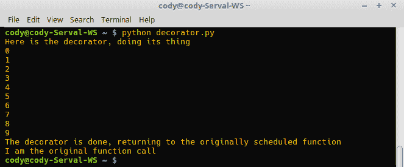

1.  为了消除`a_funct = fun_decorator(a_funct)`这一行，我们可以使用语法糖（`@`符号）来注释主函数已被装饰器修改，如下所示在`decorator.py`中：

```py
        def fun_decorator(some_funct):
            def wrapper():
                print("Here is the decorator, doing its thing")
                for i in range(10):
                    print(i)
                print("The decorator is done, returning to the 
                       originally scheduled function")
                print(some_funct())
            return wrapper

        @fun_decorator
        def a_funct():
            text = "I am a decorated function call"
            return text

        a_funct()
```

1.  被装饰的函数的行为与它作为变量时相同：

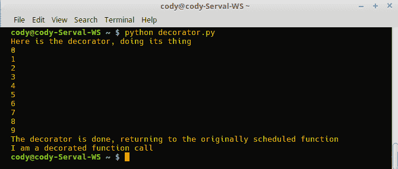

# 它是如何工作的...

当调用带有装饰器的函数时，调用会被装饰器函数捕获，然后它执行自己的工作。完成后，它将任务转交给原始函数，以完成工作。本质上，我们在前面讨论的所有关于函数的内容在处理装饰器时都适用。

**语法糖**是编程语言中的特殊语法，旨在通过使代码更容易阅读或编写来简化程序员的编程生活。语法糖表达式通过查看如果糖消失代码功能是否会丢失来识别。在装饰器的例子中，我们已经展示了即使没有`@`装饰器，装饰器功能也可以保持；我们只需手动将装饰器函数分配给主函数变量。

通过使用第一种方法，可以将装饰过的函数永久化，也就是说，如果将装饰过的函数分配给一个变量，那么每次都可以使用该变量来调用装饰过的函数，而不是原始函数。

方法也可以使用装饰器以及函数。虽然可以创建任何装饰器，但有一些标准装饰器可用于修改方法，以便与类以及实例一起使用。以下要点总结了所涵盖的不同方法：

+   实例方法是处理类时的常规使用方法。它们接受一个`object(self)`调用，其中`self`标识要与之一起工作的特定实例。

+   静态方法更为通用，能够与类的所有实例以及类本身一起工作。

+   类方法作用于类本身；实例不受影响。

# 使用函数装饰器

函数装饰器显然适用于函数。`@foo`装饰器行放置在函数定义之前的一行。这种语法糖会将一个函数的结果自动传递给另一个函数；在处理结束时，原始函数调用的名称应用于最终结果。对于系统来说，它看起来就像原始函数调用直接提供了结果。以下是一个装饰器外观的示例：

```py
@foo_decorator
def my_function():
    pass
```

当 Python 解释器到达这个代码块时，`my_function()`会被处理，其结果会被传递给`@foo_decorator`指向的函数。装饰器函数会被处理，其结果会替换原始的`my_function()`结果。本质上，装饰器劫持了函数调用，修改了原始结果，并用修改后的结果替换了原始函数应该提供的结果。

装饰器代码的修改可以是管理或增强原始调用。一旦函数完成了其工作，装饰器就会接管并对原始结果进行操作，返回修改后的代码。

这一概念被反复强调，因为它是装饰器最重要的部分；从表面上看，装饰器可能很复杂，当涉及装饰器时，可能很难弄清楚代码是如何工作的。

装饰器显然可以应用于任何与装饰器修改目标相关的函数。因此，在程序员的最佳利益中，创建足够通用的装饰器，以便它们可以被多个函数使用；否则，你不妨直接让函数完成最终结果，而不是浪费时间在只使用一次的装饰器上。

# 如何做到这一点...

本指南展示了如何创建一个装饰器，它可以用来检查传递给函数的参数。这可以通过多种方式处理，例如`if...else`检查、`assert`语句等，但通过使用装饰器，我们可以在任何以相同方式操作的函数上使用此代码：

1.  首先，我们必须决定装饰器将做什么。对于这个用例，装饰器函数将检查传递给函数的参数，并检查传递的值是否为整数。

1.  按照编写任何其他函数的方式编写装饰器函数：

```py
        def arg_check(func):
            def wrapper(num):
                if type(num) != int:
                    raise TypeError("Argument is not an integer")
                elif num <= 0:
                    raise ValueError("Argument is not positive")
                else:
                    return func(num)
            return wrapper
```

1.  编写将被装饰的函数。在这种情况下，我们只是简单地计算当提供半径时圆的一些测量值：

```py
        @arg_check
        def circle_measures(radius):
            circumference = 2 * pi * radius
            area = pi * radius * radius
            diameter = 2 * radius
            return (diameter, circumference, area)
```

1.  添加其余的代码，例如导入库和打印结果。以下为`arg_check.py`：

```py
       from math import pi 

       def arg_check(func):
           def wrapper(num):
               if type(num) != int:
                   raise TypeError("Argument is not an integer")
               elif num <= 0:
                   raise ValueError("Argument is not positive")
               else:
                   return func(num)
           return wrapper

        @arg_check
        def circle_measures(radius):
            circumference = 2 * pi * radius
            area = pi * radius * radius
            diameter = 2 * radius
            return (diameter, circumference, area)

        diameter, circumference, area = circle_measures(6)
        print("The diameter is", diameter, "\nThe circumference is", 
              circumference, "\nThe area is", area)
```

# 它是如何工作的...

当向`circle_measures()`函数提供值作为输入时，装饰器`@arg_check`会检查该值是否为整数以及是否为正数。如果满足要求，则允许函数完成并打印结果，如下面的截图所示：

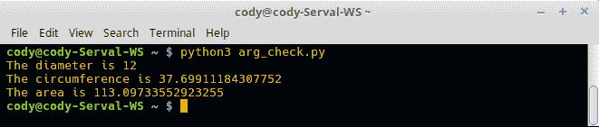

如果传递给函数的参数是负数，则会引发异常，如下面的截图所示：

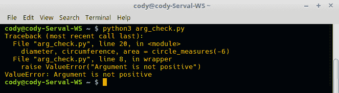

如果传入的参数不是整数，则会引发一个替代异常，如下面的截图所示：

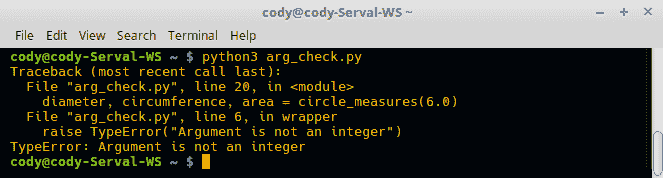

此代码依赖于传递给函数背后的值；没有机制允许用户输入。接受用户输入实际上使其稍微复杂一些。更改很简单，只需添加输入调用并将值传递给`circle_measures()`调用即可：

```py
r = input("Input radius: ")
diameter, circumference, area = circle_measures(r)
```

然而，由于输入被捕获为字符串，直接输入到函数中总是会出错，如下面的截图所示：

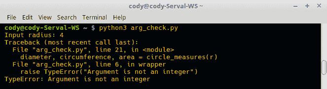

将用户输入转换为整数，即`diameter, circumference, area = circle_measures(int(r))`，乍一看，消除了这个问题，因为数字始终是整数。然而，如果用户提供的值实际上不能转换为整数，这只会造成另一个问题，如下面的截图所示：

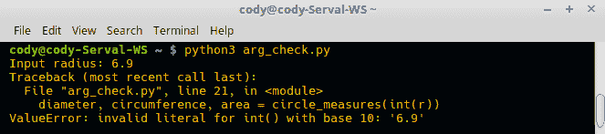

显然，经过一点努力，所有问题都可以解决，但这个例子展示了以下几点：

+   当你不必考虑所有可能的输入值时，使程序工作可能更容易。

+   如果在编写包装函数时投入一些思考，装饰器实际上可以使生活变得更简单。

+   有效地测试软件是软件开发的关键部分；测试边缘情况和潜在的越界数据输入可以揭示有趣的事情并防止潜在的安全问题。

# 使用类装饰器

从 Python 2.6 开始，装饰器被设计成与类一起工作。在这种情况下，而不是仅仅应用于函数，类装饰器可以用于类的单个实例或用于类本身。它们通常用于使开发者的逻辑意图更明显。它们还可以帮助在调用方法或处理对象时最小化错误。

# 如何做到这一点...

1.  类方法也可以进行装饰。实例方法是方法的最常见形式，即类中的函数。以下是一个包含一些方法的`cat_class.py`示例：

```py
        class Cat():
            def __init__(self, breed, age):
                """Initialization method to auto-populate an instance"""

                self.breed = breed
                self.age = age

            def cat_age(self):
                """Get the cat's age"""

                return self.age

            def breed(self):
                """Get the type of cat, e.g. short hair, long hair, etc."""

                return self.breed

            def __repr__(self):
                """Return string representation of Cat object.

                Without this method, only the object's 
                memory address will be printed.
                """
                return "{breed}, {age}".format(breed = self.breed, age = self.age)
```

1.  要使用此类，创建一个`Cat`实例，提供初始参数：

```py
         chip = Cat("domestic shorthair", 4)
```

1.  接下来，调用方法以确保它们能正常工作：

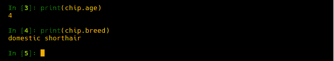

1.  注意，方法与特定实例相关联；它们不能在通用的`Cat`类上调用：

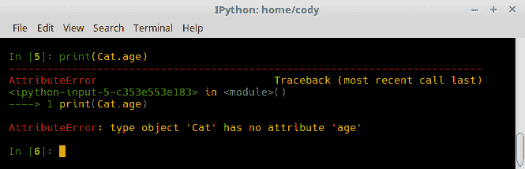

1.  静态方法是应用于所有实例的方法。它们通过在方法定义之前使用`@staticmethod`装饰器来表示。此外，方法本身在定义中不需要`self`参数（`static_method.py`）：

```py
        @staticmethod # This is required
            def cry():
                """Static method, available to all instances and the class

                Notice that 'self' is not a required argument
                """

                return "Nyao nyao" # It's a Japanese cat
```

1.  静态方法可以应用于实例和类本身：

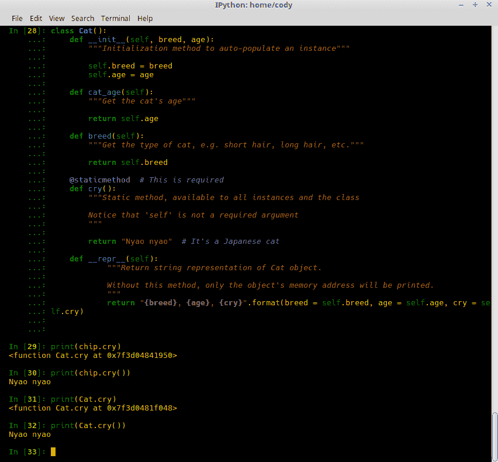

注意，在第 29 行和第 31 行，调用不带括号的静态方法返回方法的内存位置；该方法未绑定到实例，但也可供类使用。只有当使用括号时（第 30 行和第 32 行），才会显示正确的返回对象。

1.  类方法通过在创建方法之前使用`@classmethod`装饰器来识别。此外，方法参数是`cls`而不是`self`。以下代码可以添加到上一个示例中的静态方法之后（`class_method.py`）：

```py
        @classmethod # This is required
            def type(cls):
                """
                Class method, available only to classes.

                Notice that 'cls' is the argument, as opposed to 'self'
                """

                if cls.__name__ == "Cat":
                    return "Some sort of domestic cat."
                else:
                    return cls.__name__
```

1.  现在，当创建实例时，会检查它所属的类。如果通用的`Cat`类是生成器，则会打印一条消息。如果使用`Cat`的子类，则会打印出类的名称：

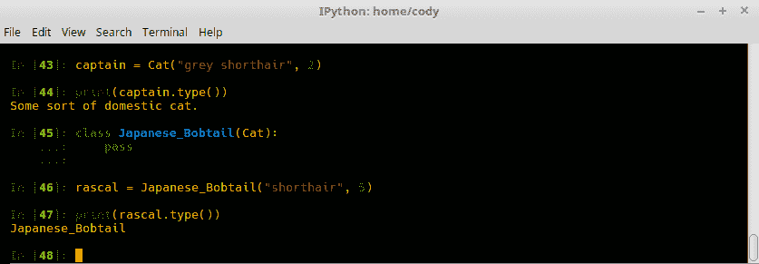

# 装饰器的示例

框架，如用于 Web 开发或图形界面设计的框架，通常具有装饰器来自动化开发者的功能。虽然开发者可以直接访问框架的某些部分，如模块和函数，但使用装饰器来简化这个过程可以使程序员的寿命更长。

例如，许多 Web 框架包括一个装饰器 `@login_required`，以确保用户在网站上执行任何操作之前已经通过网站认证。虽然登录和认证功能可以由开发者编码实现，但框架包括该功能，因为它构成了网站工作方式的一个基本部分。

由于它是网站功能的一个重要部分并且经常被使用，因此框架应该提供一个经过良好开发的认证方法。就像密码学一样，将其留给开发者正确实现可能会导致问题，因为做错比做对更容易。

# 准备工作

要使用这个配方，你必须安装 Flask Web 框架。然而，以下 Flask 示例并没有涵盖如何使用 Flask 的所有内容；安装只是为了确保不会出现错误。Flask 本身可能需要一本书来涵盖。本节旨在展示装饰器如何在现实世界中用于完成各种任务，而不是展示一个工作的 Flask 网站。

# 如何操作...

Flask 不包括登录装饰器函数，但文档确实提供了一个如何自己实现的例子 ([`flask.pocoo.org/docs/0.12/patterns/viewdecorators/`](http://flask.pocoo.org/docs/0.12/patterns/viewdecorators/))。即使它复制了 Flask 的功能，也不应将其用于生产环境，因为那时你必须确保对代码的任何修改都不会影响登录功能：

1.  从 Python 标准库的 `functools` 模块导入 `wraps` 函数。这是为了保留原始函数的数据：

```py
        from functools import wraps
```

1.  需要导入许多 Flask 工具。`g` 是 Flask 应用程序的全局变量，是一个仅在当前请求中有效的特殊对象，并为每个请求返回不同的值。`request` 是 Flask 中的默认请求对象；它记住匹配的端点和视图参数。`redirect` 返回一个 HTTP 30x 重定向代码，将客户端发送到正确的目的地。`url_for` 为给定的端点创建一个 URL（由函数调用创建的网页）：

```py
        from flask import g, request, redirect, url_for
```

1.  编写登录装饰器函数：

```py
        def login_required(f):
            @wraps(f)
            def decorated_function(*args, **kwargs):
                if g.user is None:
                    return redirect(url_for('login', next=request.url))
                return f(*args, **kwargs)
            return decorated_function
```

1.  在实现登录装饰器时，它是编写主函数之前最后使用的装饰器：

```py
        @app.route('/inventory')
        @login_required
        def inventory():
            pass
```

1.  装饰器的一个可能用途是设置计时函数来计时其他函数。这样，在运行脚本时，你不必从命令行调用 `time`。以下代码应写入一个文件，而不是输入到交互式 Python 提示符中（`time_decorator_creation.py`）：

```py
        import time

        def time_decorator(funct):
            def wrapper(*arg)
                result = funct(*arg)
                print(time.perf_counter())
                return result
            return wrapper
```

1.  `time_decorator` 可以与任何函数一起使用，以提供函数完成所需的时间。以下代码应写入与前面装饰器相同的文件（`time_dec.py`）：

```py
        # Silly little number cruncher
        import math

        @time_decorator
        def factorial_counter(x, y):
            fact = math.factorial(x)
            time.sleep(2)  # Force a delay to show the time decorator works
            fact2 = math.factorial(y)
            print(math.gcd(fact, fact2))

        factorial_counter(10000, 10)
```

1.  运行前面的代码会产生以下结果：

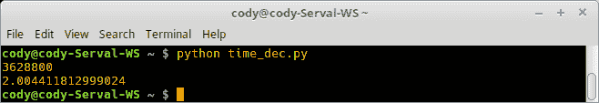

1.  这个示例（来自[`www.python.org/dev/peps/pep-0318/#examples`](https://www.python.org/dev/peps/pep-0318/#examples)）展示了如何向函数添加属性。一个用例可能是自动向函数添加数据，例如元数据（`add_attributes.py`）：

```py
        def attrs(**kwds):
            def decorate(f):
                for k in kwds:
                    setattr(f, k, kwds[k])
                return f
            return decorate

        @attrs(versionadded="2.2",
               author="Guido van Rossum")
        def mymethod(f):
            ...
```

1.  另一个来自 PEP-318 文档的示例是创建一个强制函数参数和返回类型的装饰器。这在程序运行接受/返回参数的脚本时很有用，但你无法保证可能输入的对象类型（`function_enforcement.py`）：

```py
        def accepts(*types):
            def check_accepts(f):
                assert len(types) == f.func_code.co_argcount
                def new_f(*args, **kwds):
                    for (a, t) in zip(args, types):
                        assert isinstance(a, t), \
                           "arg %r does not match %s" % (a,t)
                    return f(*args, **kwds)
            new_f.func_name = f.func_name
            return new_f
        return check_accepts

        def returns(rtype):
            def check_returns(f):
                def new_f(*args, **kwds):
                    result = f(*args, **kwds)
                    assert isinstance(result, rtype), \
                    "return value %r does not match %s" %
                    (result,rtype)
                return result
                new_f.func_name = f.func_name
            return new_f
        return check_returns

        @accepts(int, (int,float))
        @returns((int,float))
        def func(arg1, arg2):
           return arg1 * arg2
```

1.  如果你使用`nose`库编写单元测试，以下示例（来自[`stackoverflow.com/users/9567/torsten-marek`](https://stackoverflow.com/users/9567/torsten-marek)）展示了如何使用装饰器自动将参数传递给单元测试函数（完整代码未提供，仅提供最终函数调用的实现）：

```py
        @parameters(
            (2, 4, 6), 
            (5, 6, 11)
        )
        def test_add(a, b, expected):
            assert a + b == expected
```

# 它是如何工作的...

一旦导入`Flask`模块，登录装饰器函数提供了处理用户认证的主要逻辑。Python 标准库的`@wraps()`装饰器调用与之前我们用`def wrapper()`函数所做的一样，只是我们现在利用了`Flask`提供的`functools.wraps`函数。这是必要的，因为登录装饰器封装并替换了原始函数；如果没有包装器，原始数据在交接过程中会丢失。

`decorated_function()`函数可以接受任意数量的参数，无论是位置参数还是关键字：值对。这个函数首先检查全局对象`g.user`是否为`None`，即未登录的用户。如果是这种情况，用户将被自动重定向到`login`页面。由于 Flask 的工作方式，每个页面 URL 实际上是一个函数调用；函数的名称决定了 URI 路径（有关 Flask 功能的更多信息将在后面提供）。

如果用户已经登录，则使用登录装饰器接收到的参数调用`f()`函数（原始调用的函数）。最后，装饰器函数结束，将逻辑控制权返回给原始函数。

# 还有更多...

这里是一个真实世界的示例，来自作者创建的一个博客项目，使用 Flask Web 框架作为在线辅导课程的一部分（[`github.com/crystalattice/Blogful`](https://github.com/crystalattice/Blogful)）：

```py
@app.route("/") # Root (default) page to display when landing on web site
@app.route("/page/<int:page>") # Specific site page
@login_required # Force authentication
def entries(page=1):
    """
    Query the database entries of the blog.

    :param page: The page number of the site.
    :return: Template page with the number of entries specified, 
    Next/Previous links, page number, and total number of
    pages in the site
    """
    # Zero-indexed page
    default_entries = 10
    max_entries = 50

    # Set the number of entries displayed per page
    try:
        entry_limit = int(request.args.get('limit', default_entries)) 
        # Get the limit from HTML argument 'limit'
        assert entry_limit > 0 # Ensure positive number
        assert entry_limit <= max_entries 
        # Ensure entries don't exceed max value
    except (ValueError, AssertionError): 
        # Use default value if number of entries doesn't meet expectations
        entry_limit = default_entries

    page_index = page - 1

    count = session.query(Entry).count()

    start = page_index * PAGINATE_BY # Index of first entry on page
    end = start + PAGINATE_BY # Index of last entry on page
    total_pages = (count - 1) // PAGINATE_BY + 1 # Total number of pages
    has_next = page_index < total_pages - 1 # Does following page exit?
    has_prev = page_index > 0 # Does previous page exist?

    entries = session.query(Entry)
    entries = entries.order_by(Entry.datetime.desc())
    entries = entries[start:end]

    return render_template("entries.html",
                           entries=entries,
                           has_next=has_next,
                           has_prev=has_prev,
                           page=page,
                           total_pages=total_pages
                           )
```

在前面的示例中，有三个装饰器应用于函数入口：`@app.route("/")`、`@app.route("/page/<int:page>")`和`@login_required`。这些装饰器是 Flask 内置的，通过 Flask API 访问。`@app.route()`捕获 URL 请求并确定与 URL 相关的函数调用。`@login_required`来自 Flask 登录扩展，确保在处理函数之前用户已登录；如果没有，用户将被重定向到登录界面。

`entries`函数简单地用博客数据库中的条目填充网页。`@app.route("/")`指定当提供网站的根 URL 时，浏览器将被带到`entries`函数，该函数将处理请求并显示博客条目（对于 Flask 框架，`views.py`文件中的每个函数调用都成为一个 URL 地址。因此，`entries`在浏览器中看起来像`www.blog_website.com/entries`）。

装饰器`@app.route("/page/<int:page>")`指定当 URL 以资源定位器`/page/#`结尾时，例如`www.blog_website.com/page/2`，装饰器将页面请求重定向到`entries`，并显示指定页面的博客文章，在这种情况下是第 2 页。

`entries`默认为第一页，正如传递给它的参数所示。`default_entries`和`max_entries`决定了网站上可用的页数。显然，更改或删除这些值可以使博客网站将所有条目都显示在单个页面上。

`@login_required`装饰器捕获对`entries`函数的调用或重定向，并在 Flask 的认证模块中稍作停留。查询用户的会话以查看用户是否已与系统进行身份验证；如果没有，用户将被告知在访问网站之前需要进行身份验证。

虽然可以在不使用装饰器的情况下设置网站的功能，但希望可以看到使用装饰器使处理网站访问变得更加容易。在这种情况下，每当网络服务器被指示向浏览器发送博客文章页面时，URL 会被解析以查看它是否与根目录"`/`"或特定的页码匹配。如果是这样，则进行身份验证检查。如果用户已登录到网站，则最终在浏览器中显示博客文章条目。

对于这个特定的程序，装饰器也可以用来捕获添加和删除博客文章的请求，显示特定的博客条目（而不是整个页面），编辑条目，显示登录页面，以及注销用户。

下面的`decorator_args.py`来自 Flask 博客应用的另一个部分，展示了如何使用一个装饰器根据传递给它的参数执行不同的操作：

```py
@app.route("/entry/add", methods=["GET"])
@login_required # Force authentication
def add_entry_get():
    """Display the web form for a new blog entry"""
    return render_template("add_entry.html")

@app.route("/entry/add", methods=["POST"])
@login_required # Force authentication
def add_entry_post():
    """Take an entry form and put the data in the DB"""
    entry = Entry(
        title=request.form["title"],
        content=request.form["content"],
        author=current_user
    )
    session.add(entry)
    session.commit()
    return redirect(url_for("entries"))

@app.route("/login", methods=["GET"])
def login_get():
    """Display the login page"""
    return render_template("login.html")

@app.route("/login", methods=["POST"])
def login_post():
    """Check if user is in database"""
    email = request.form["email"]
    password = request.form["password"]
    user = session.query(User).filter_by(email=email).first()
    if not user or not check_password_hash(user.password, password):
        flash("Incorrect username or password", "danger")
        return redirect(url_for("login_get"))

    login_user(user)
    return redirect(request.args.get('next') or url_for("entries"))
```

在这些示例中，`/entry/add`和`/login` URI 调用都接受对数据库的`GET`或`POST` HTTP 请求。在`GET`请求的情况下，数据库被查询，所需信息被返回到屏幕上。如果 HTTP 请求是`POST`，则调用适当的装饰器，并将请求中提供的数据输入到数据库中。

在这两种情况下，装饰器函数实际上是相同的调用；唯一的区别是是否是`GET`或`POST`请求。装饰器根据这些参数知道该做什么。

在处理登录认证时，更好的选择是使用 [`flask-login.readthedocs.io/en/latest/`](https://flask-login.readthedocs.io/en/latest/) 扩展，它提供了以下功能：

+   存储活动用户的会话 ID

+   简单的用户登录和注销

+   限制视图仅对登录和注销用户可见

+   处理“记住我”功能

+   保护会话 cookie

+   与其他 Flask 扩展的集成

# 使用装饰器模块

由于装饰器提供的所有功能以及它们在 Python 包中的常用性，有人创建一个仅针对装饰器的包是不可避免的。[`pypi.python.org/pypi/decorator`](https://pypi.python.org/pypi/decorator) 提供了一个可使用 `pip` 安装的包，以帮助在使用装饰器时工作。

`decorator` 模块是一个非常稳定的（超过 10 年历史）工具，它提供了在不同 Python 版本之间保留装饰函数的能力。该模块的目标是简化装饰器使用，减少样板代码，并增强程序的可读性和可维护性。

装饰器可以分为两大类：签名保留和签名更改。保留装饰器接受一个函数调用并返回一个函数作为输出，而不改变函数调用的签名。这些装饰器是最常见的类型。

签名更改装饰器接受一个函数调用，但在输出时更改签名，或者简单地返回不可调用的对象。之前讨论过的 `@staticmethod` 和 `@classmethod` 是签名更改装饰器的例子。

Python 的反射能力提供了函数签名的识别。本质上，签名提供了关于函数的所有必要信息，即输入和输出参数、默认参数等，以便开发人员或程序知道如何使用该函数。

此模块旨在提供通用的生成器*工厂*，以隐藏创建签名保留装饰器的复杂性。保留装饰器虽然更常见，但并不一定容易从头编写代码，特别是如果装饰器需要接受任何签名的所有函数。

# 如何做到这一点...

装饰器在框架之外的一个常见用途是函数的缓存。缓存将函数调用的结果存储在字典中；如果函数再次以相同的参数调用，结果将从缓存中提取，而不是重新运行函数。已经创建了大量的缓存函数和装饰器，但大多数都不保留签名。以下示例取自 `decorator` 模块的文档([`decorator.readthedocs.io/en/latest/tests.documentation.html`](http://decorator.readthedocs.io/en/latest/tests.documentation.html))：

1.  可以编写一个缓存输入参数到字典的缓存装饰器（`memoize_dec.py`）：

```py
        import functools
        import time

        def memoize_uw(func):
            func.cache = {}

            def memoize(*args, **kw):
                if kw:  # frozenset is used to ensure hashability
                    key = args, frozenset(kw.items())
                else:
                    key = args
                if key not in func.cache:
                    func.cache[key] = func(*args, **kw)
                return func.cache[key]
            return functools.update_wrapper(memoize, func)
```

1.  一个简单的函数，有一个输入参数，运行得很好（`memoize_funct.py`）：

```py
        @memoize_uw
        def f1(x):
            "Simulate some long computation"
            time.sleep(1)
            return x
```

1.  当 Python 反射工具，如 `pydoc` 参与进来时，问题出现了。这些反射工具将看到装饰器声明可以接受任意数量的参数，因为它是一个通用函数签名。然而，实际情况是主函数 (`f1()`) 只接受一个参数。尝试使用多个参数将导致错误。

1.  如果使用 `decorator` 模块中的 `decorate` 函数，这个问题可以得到缓解。`decorate` 接受两个参数：一个描述装饰器功能的调用函数和要调用的主函数。

1.  在这种情况下，新的装饰器变成了两个独立的函数。第一个是 `main` 装饰器函数，即包装器（`call_dec.py`）：

```py
        import functools
        import time
        from decorator import *

        def _memoize(func, *args, **kw):
            if kw:  # frozenset is used to ensure hashability
                key = args, frozenset(kw.items())
            else:
                key = args
           cache = func.cache  # attribute added by memoize
        if key not in cache:
            cache[key] = func(*args, **kw)
        return cache[key]

```

1.  第二个函数是实际要调用的装饰器（`def_memoize.py`）：

```py
        def memoize(f): 
            """ A simple memoize implementation. 
            It works by adding a .cache dictionary to the  decorated 
            function. The cache will grow indefinitely, so it is your 
            responsibility to clear it, if needed. 
            """ 
            f.cache = {} 
            return decorate(f, _memoize)
```

1.  有两个独立的函数使得装饰器不再需要嵌套函数（这使得逻辑流程更容易理解），并且开发者被迫显式地传递要装饰的函数；闭包不再需要。

1.  以下代码是一个简单的睡眠计时器，用于模拟数据处理（`run_memoize.py`）：

```py
        import time

        @memoize
        def data_simulator():
            time.sleep(2)
            return "done"
```

1.  当第一次调用 `data_simulator()` 函数时，由于调用了 sleep 函数，将需要整整两秒钟才能运行。然而，当将来再次调用时，`done` 响应将是瞬间的，因为它是从缓存中提取的，而不是实际处理。

# 它是如何工作的...

初始的 `memoize_uw()` 装饰器创建一个空字典作为缓存。封装的 `memoize()` 函数接受任意数量的参数，并检查其中是否有关键字；如果有，则使用冻结集合来接受参数，并将它们用作关键字的值。如果没有提供关键字，则创建一个新的键：值项。

如果关键字尚未在缓存字典中，则将新项放入缓存；否则，从缓存中提取缓存的项并成为返回值。最后，整个装饰器关闭，并将最终值返回给主程序。

在新的 `_memoize()` 函数中，提供了相同的功能，但作为装饰器的调用函数，其参数签名必须以 `(f, *args, **kw)` 的形式。它还必须使用参数调用原始函数；这通过以下行演示：`cache[key] = func(*args, **kw)`。

新的 `memoize()` 装饰器实现了将缓存作为一个空字典，就像之前一样，但使用 `decorate()` 函数将 `_memoize()` 的结果返回给原始函数。

# 还有更多...

实际上，这里有很多移动部件，可能会很快变得令人困惑，尤其是对于经验不足的 Python 程序员。需要大量的实践和文档参考才能掌握装饰器和 `decorator` 模块。

你必须使用装饰器吗？不。它们只是被设计来让程序员的日常生活更轻松。此外，你应该了解它们，因为许多第三方库和包，尤其是 Web 和 GUI 框架，都使用了它们。

一旦你掌握了装饰器的一般用法，`decorator`模块可能会更有意义，同时也会显示出它在最小化手动编写的装饰器方面的实用性。该模块包含了许多本书没有涵盖的功能，例如直接将调用函数转换为装饰器、类装饰器以及处理阻塞调用，即一个不会允许程序继续执行直到该过程得到解决的过程。

# 参见

你也可以参考本章的*使用类装饰器*配方。
