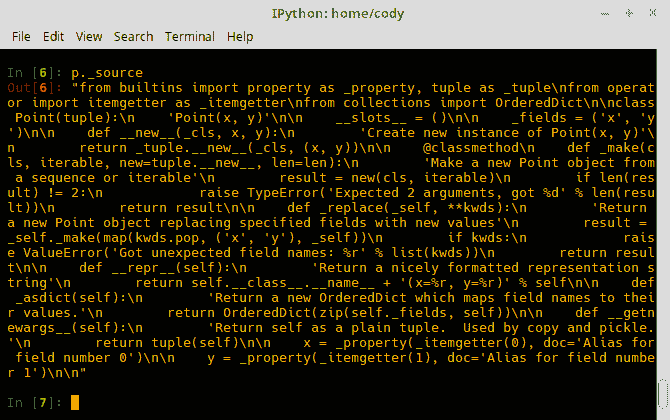
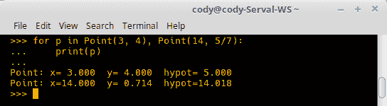
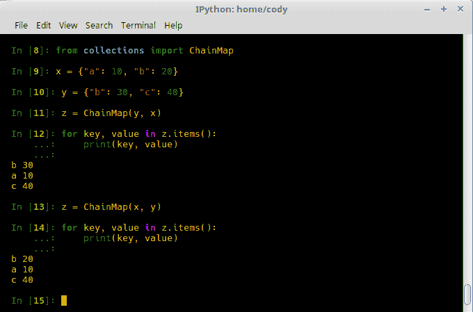
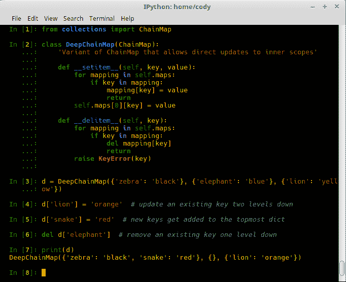
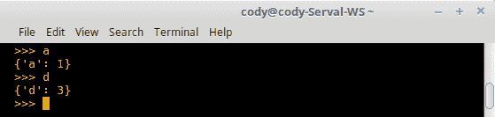
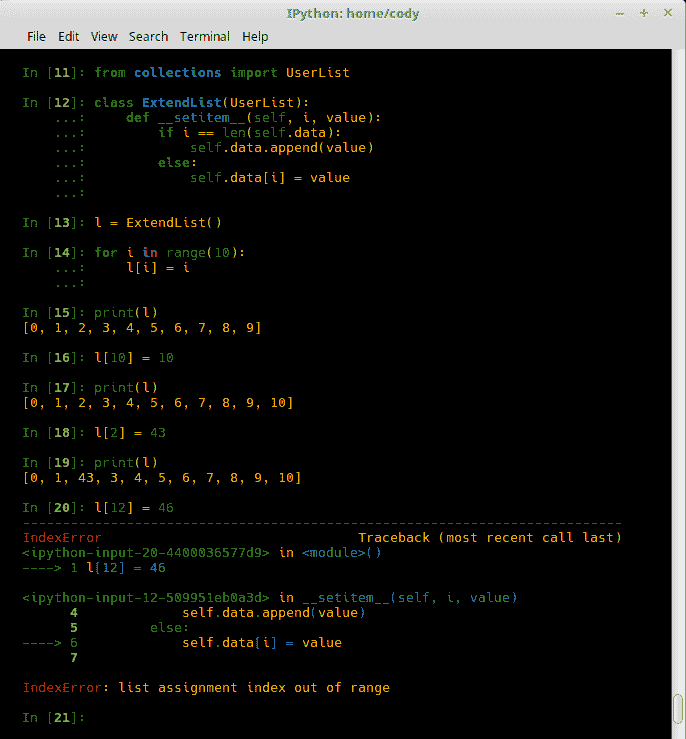
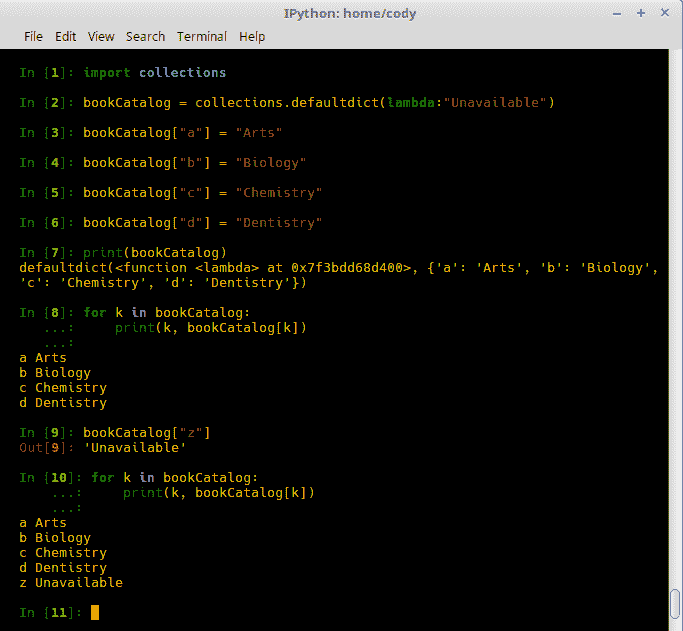
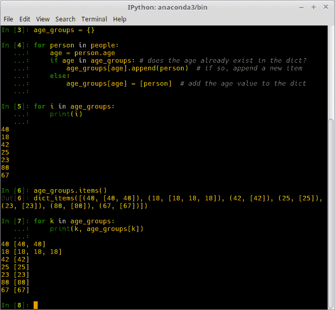
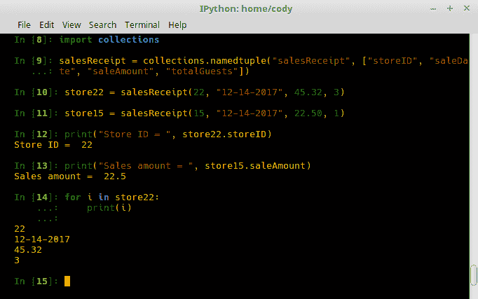

# 第四章：使用 Python 集合

在本章中，我们将探讨 Python 集合对象，它们在常规的内置 Python 容器（列表、元组、字典和集合是最常见的）的基础上增加了特定情况下的特殊功能。我们将涵盖：

+   容器回顾

+   实现 namedtuple

+   实现 deque

+   实现 ChainMap

+   实现 Counters

+   实现 OrderedDict

+   实现 defaultdict

+   实现 UserDict

+   实现 UserList

+   实现 UserString

+   改进 Python 集合

+   查看 collections 扩展模块

# 简介

虽然基础容器对大多数程序员来说已经足够处理数据存储的工作，但有时需要一些功能更强大、能力更全面的工具。集合是内置工具，它们提供了对常规容器的专业替代方案。大多数集合只是现有容器的子类或包装器，可以使开发者的生活更轻松，提供新功能，或者只为程序员提供更多选择，这样开发者就不必担心编写样板代码，可以专注于完成工作。

# 容器回顾

在我们深入研究集合之前，我们将花一点时间回顾现有的容器，以便我们知道它们提供了什么，没有提供什么。这将使我们更好地理解集合的功能和潜在限制。

序列类型包括列表、元组和范围，尽管在这里只有列表和元组是相关的。序列类型默认包含`__iter___`函数，因此它们可以自然地遍历它们包含的对象序列。

列表是可变序列，也就是说，它们可以在原地修改。它们最常持有同质项，但这不是必需的。列表可能是 Python 中最常用的容器，因为它很容易通过使用`<list>.append`来扩展序列添加新项目。

元组是不可变的，这意味着它们不能在原地修改，如果需要修改，必须创建一个新的元组。它们经常持有异质数据，例如捕获多个返回值。由于它们不能修改，因此如果想要确保一个顺序列表不会意外修改，它们也是很有用的。

字典将值映射到键。它们被称为哈希表、关联数组或在不同的编程语言中有其他名称。字典是可变的，就像列表一样，因此可以在原地更改而不必创建一个新的字典。字典的一个关键特性是键必须是可哈希的，也就是说，对象的哈希摘要在其生命周期内不能改变。因此，可变对象，如列表或其他字典，不能用作键。然而，它们可以用作映射到键的值。

集合类似于字典，因为它们是无序、可哈希对象的容器，但它们只是值；集合中不存在键。集合用于测试成员资格、从序列中删除重复项以及执行各种数学运算。

集合是可变对象，而 frozensets 是不可变的。由于集合可以修改，因此它们不适合用作字典键或另一个集合的元素。frozensets 是不可变的，因此可以用作字典键或集合元素。

# 如何做到这一点...

序列对象（列表和元组）有以下共同操作。注意：`s`和`t`是相同类型的序列；`n`、`i`、`j`和`k`是整数值，`x`是满足`s`要求的限制条件的对象：

+   `x in s`: 如果序列`s`中的项等于`x`，则返回`true`；否则，返回`false`

+   `x not in s`: 如果序列`s`中没有项等于`x`，则返回`true`；否则，返回`false`

+   `s + t`: 这将序列`s`与序列`t`连接（连接不可变序列会创建一个新对象）

+   `s * n`: 这将`s`添加到自身`n`次（序列中的项不会被复制，而是被多次引用）

+   `s[i]`: 这检索序列`s`中的第`i`项，计数从 0 开始（负数从序列的末尾开始计数，而不是从开始）

+   `s[i:j]`: 这检索`s`的切片，从`i`（包含）到`j`（不包含）

+   `s[i:j:k]`: 这从`s`中检索一个切片，从`i`到`j`，跳过`k`次

+   `len(s)`: 这返回`s`的长度

+   `min(s)`: 这返回`s`中的最小项

+   `max(s)`: 这返回`s`中的最大项

+   `s.index(x[, i[, j]])`: 这在`s`中索引`x`的第一个实例；可选地，它返回从索引`i`开始（可选地）并在索引`j`之前（可选地）的`x`

+   `s.count(x)`: 这返回`s`中`x`实例的总数

可变序列对象（如列表）有以下特定操作可用（注意：`s`是可变序列，`t`是可迭代对象，`i`和`j`是整数值，`x`对象满足任何序列限制）：

+   `s[i] = x`: 这用对象`x`替换索引位置`i`的对象

+   `s[i:j] = t`: 从`i`（包含）到`j`（不包含）的切片被对象`t`的内容替换

+   `del s[i:j]`: 这删除`s`从索引`i`到`j`的内容

+   `s[i:j:k] = t`: 这通过对象`t`（`t`必须与`s`具有相同的长度）替换从`i`到`j`（步长为`k`）的切片

+   `del s[i:j:k]`: 如果存在，根据切片索引和步长删除序列的元素

+   `s.append(x)`: 这将`x`添加到`s`的末尾

+   `s.clear()`: 这从序列中删除所有元素

+   `s.copy()`: 这用于`s`的浅拷贝

+   `s.extend(t)`: 这使用`t`的内容扩展`s`（也可以使用`s += t`）

+   `s *= n`: 这用于将`s`的内容重复`n`次更新到`s`

+   `s.insert(i, x)`: 这在`s`的`i`位置插入`x`

+   `s.pop([i])`: 这用于从`s`中提取索引为`i`的项，作为结果返回，并从`s`中删除它（默认为从`s`中删除最后一个项）

+   `s.remove(x)`: 这用于从`s`中删除第一个匹配`x`的项（如果`x`不存在，则抛出异常）

+   `s.reverse()`: 这用于就地反转`s`

# 还有更多...

几乎 Python 中的每个容器都与特殊方法相关联。虽然之前描述的方法适用于各自的容器，但某些容器有仅适用于它们的方法。

# 列表和元组

除了实现所有常见的可变序列操作外，列表和元组还具有以下特殊方法可供使用：

+   `sort(*, [reverse=False, key=None])`: 这用于就地排序列表，使用`*<*`比较器。通过使用`reverse=True`可以实现反向比较，即从高到低。可选的`key`参数指定一个函数，该函数返回按函数排序的列表。

作为使用`key`参数的示例，假设你有一个列表的列表：

```py
>>> l = [[3, 56], [2, 34], [6, 98], [1, 43]]
```

要对列表进行排序，请在列表上调用`sort()`方法，然后打印列表。如果没有将两个步骤合并成一个函数，它们必须单独调用。这实际上是一个特性，因为通常排序后的列表会被程序操作，而不是总是打印出来：

```py
>>> l.sort()
>>> l
[[1, 43], [2, 34], [3, 56], [6, 98]]
```

如果你想要不同的排序，例如按每个列表项的第二个项目排序，可以将该参数作为函数的参数传递：

```py
>>> l = [[3, 56], [2, 34], [6, 98], [1, 43]]
>>> def diffSort(item):
...     return item[1]
... 
>>> l.sort(key=diffSort)
>>> l
[[2, 34], [1, 43], [3, 56], [6, 98]]
```

在这个例子中，你可以看到排序不是按每个子列表中的第一个项目进行的，而是按第二个项目进行的，即现在是`34->43->56->98`而不是`1->2->3->6`。

# 字典

作为可映射对象，字典有许多内置方法，因为它们不能使用正常的序列操作（注意：`d`代表一个字典，`key`是字典的特定键，`value`是与键关联的值）：

+   `len(d)`: 这返回字典中的项目数量。

+   `d[key]`: 这返回与`key`关联的`value`。

+   `d[key] = value`: 这用于设置`key`到`value`的映射。

+   `del d[key]`: 这删除与`key`关联的值。

+   `key in d`: 如果`key`存在于字典中，则返回`True`；否则，返回`False`。

+   `key not in d`: 如果`key`存在于字典中，则返回`False`；否则，返回`True`。

+   `iter(d)`: 这从字典`keys`返回一个迭代器对象。要实际使用迭代的`keys`，必须使用`for`循环。

+   `clear()`: 这从字典中删除所有项。

+   `copy()`: 这返回字典的浅拷贝。

+   `fromkeys(seq[, value])`: 这使用`seq`中列出的`keys`创建一个新的字典，并将它们的`values`设置为`value`。如果没有提供`value`，则默认为`None`。

+   `get(key[, default])`: 如果 `key` 存在，则返回与 `key` 关联的 `value`。否则，返回 `default` 值。如果未设置 `default`，则返回 `None`，即没有响应，但不是错误。

+   `items()`: 返回字典中 `key:value` 对的 `view` 对象。

+   `keys()`: 返回仅包含字典键的 `view` 对象。

+   `pop(key[, default])`: 当 `key` 存在于字典中时使用；从字典中移除并返回其 `value`；否则，返回 `default`。如果未提供 `default` 且 `key` 不存在，则引发错误。

+   `popitem()`: 从字典中移除并返回一个任意的键值对。由于字典是无序的，返回的键值对实际上是随机选择的。

+   `setdefault(key[, default])`: 当 `key` 存在于字典中时使用；返回其 `value`。如果不存在，则使用提供的 `key` 和 `default` 值创建一个新的 `key:value` 对。如果未设置 `default`，则默认为 `None`。

+   `update([other])`: 通过从 `other` 中更新对来修改字典。如果存在现有的 `keys`，则将覆盖它们。`other` 可以是另一个字典或 `key:value` 对的迭代对象，例如元组。

+   `values()`: 返回字典值的 `view` 对象。

字典 `view` 对象实际上是动态对象，显示字典的项；当字典发生变化时，视图会更新以反映这些变化。`view` 对象实际上有自己的方法可用：

+   `len(dictview)`: 返回字典中的项目数量

+   `iter(dictview)`：返回一个迭代器对象，遍历字典的 `keys`、`values` 或 `key:value` 对

+   `x in dictview`: 如果 `x` 存在于 `view` 对象中，则返回 `True`

# 集合

由于集合与字典相似，它们有许多与它们相关联的方法，这些方法适用于集合和冻结集合：

+   `len(s)`: 返回集合 `s` 中的项目数量

+   `x in s`: 如果 `x` 存在于 `s` 中，则返回 `True`；否则，返回 `False`

+   `x not in s`: 如果 `x` 存在于 `s` 中，则返回 `False`；否则，返回 `True`

+   `isdisjoint(other)`: 如果集合与对象 `other` 没有共同元素，则返回 `True`

+   `issubset(other)`: 测试集合中的所有元素是否也存在于 `other` 中

+   `issuperset(other)`: 测试 `other` 中的所有元素是否也存在于 `set` 中

+   `union(*others)`: 返回一个新的集合，包含原始 `set` 和所有其他对象中的元素

+   `intersection(*others)`: 返回一个新的集合，仅包含 `set` 和所有其他对象之间的共同元素

+   `difference(*others)`: 返回一个新的集合，仅包含存在于 `set` 中但不在 `others` 中的元素

+   `symmetric_difference(other)`: 返回一个新的集合，包含存在于 `set` 或 `other` 中，但不同时存在于两者中的元素

+   `copy()`: 返回一个新的集合，包含集合的浅拷贝

以下是一些仅适用于集合而不适用于 frozenset 的方法：

+   `update(*others)`: 这通过从所有`others`中添加元素来更新集合。

+   `intersection_update(*others)`: 这通过仅保留在`set`和`others`中都存在的元素来更新集合。

+   `difference_update(*others)`: 这通过仅保留在`others`中找到的元素来更新集合。

+   `symmetric_difference_update(other)`: 这通过仅保留在`set`或`other`中找到的元素来更新集合，但不包括两者共有的元素。

+   `add(elem)`: 这将`elem`添加到集合中。

+   `remove(elem)`: 从集合中删除`elem`；如果`elem`不存在，则抛出异常。

+   `discard(elem)`: 如果存在`elem`，则从集合中删除它。

+   `pop()`: 如果集合中存在`elem`，则从集合中删除它并返回其值；如果集合中没有值，则抛出异常。

+   `clear()`: 这将从集合中删除所有元素。

# 实现 namedtuple

使用`namedtuple`，开发者可以为元组中的每个项目赋予意义，并允许通过名称而不是索引值访问元组的字段。这允许代码更易读且具有更好的自文档性。命名元组可以替代常规元组而不会产生不利影响。

命名元组可以被视为使用字典类型的`key:value`对，但不是真正的键到值的映射，因为命名元组只是将名称分配给序列索引位置，即 name=value，但可能有助于从概念上将其视为不变的映射对。命名位置可以通过名称或位置索引来调用。

`namedtuple`是通过以下命令格式生成的：

```py
collections.namedtuple(typename, field_names, *, verbose=False, rename=False, module=None)
```

以下是对先前命令各部分的解释：

+   `typename`: 正在创建的元组子类的名称。子类实例会自动生成包含`typename`和字段名称的`docstrings`，以及创建一个自动以`name=value`格式列出元组内容的`__repr__`方法。

+   `field_names`: 一个字符串序列（列表或元组），用于表示元组字段的名称，例如，[*X*-axis, *Y*-axis, *Z*-axis]。字段名称也可以使用单个字符串表示，而不是序列对象，字段名称之间由空格或逗号分隔，例如 *X*-axis, *Y*-axis, *Z*-axis。可以使用任何合法的 Python 名称；不允许的名称包括以数字或下划线开头，以及任何 Python 关键字。

+   `*`: 它有助于捕获所有参数输入。这实际上与更常见的`*args`没有区别，因为`*`是 Python 处理参数时关注的项；`args`只是程序员使用的一个约定。

+   `verbose`: (已弃用)如果为真，则构建后将会打印类定义。如今，首选的做法是打印`_source`属性。

+   `rename`: 如果为真，无效的字段名称将自动替换为位置名称。例如，`abc, def, xyz, abc` 将自动变为 `abc, _1, xyz, _3` 以替换重复的 `abc` 和 Python 关键字 `def`。

+   `module`: 如果已定义，则将 `namedtuple` 的 `__module__` 属性设置为提供的值。

# 如何做到这一点...

官方文档已经相当不错了，所以这里有一个例子来自 [`docs.python.org/3/library/collections.html#collections.namedtuple`](https://docs.python.org/3/library/collections.html#collections.namedtuple)：

1.  创建 `namedtuple`：

```py
 >>> from collections import namedtuple
 >>> Point = namedtuple("Point", ["x", "y"])
```

1.  创建 `namedtuple` 的新实例。您可以使用位置或关键字参数：

```py
 >>> p = Point(11, y=22)
```

1.  新的 `namedtuple` 可以像普通元组一样索引：

```py
 >>> p[0] + p[1]
 33
```

1.  它也可以像常规元组一样解包：

```py
 >>> x, y = p
 >>> x, y
 (11, 22)
```

1.  可以通过分配的名称而不是索引来访问元组对象：

```py
 >>> p.x + p.y
 33
```

1.  因为 `__repr__` 是自动提供的，所以调用 `namedtuple` 实例提供了有关 `namedtuple` 的所有信息：

```py
 >>> p
 Point(x=11, y=22)
```

1.  文档中的另一个例子展示了如何使用 CSV 或 SQLite 利用命名元组。首先，创建一个 `namedtuple` (`employee_record_tuple.py`):

```py
        EmployeeRecord = namedtuple('EmployeeRecord', 'name, age, title, 
                                    department, paygrade')
```

1.  对于 CSV 文件，导入 `csv` 模块，然后将导入的文件数据映射到 `namedtuple`。使用 "`rb`" 是因为 CSV 格式被认为是一种二进制文件类型，尽管它是可读的。`_make()` 方法将在下一节（`import_csv.py`）中解释：

```py
        import csv
        for emp in map(EmployeeRecord._make, csv.reader(open("employees.csv", "rb"))):
            print(emp.name, emp.title)
```

1.  对于 SQLite，导入模块并创建连接。在执行游标以从数据库中选择字段之后，它们就像 CSV 示例（`import_sqlite.py`）一样映射到 `namedtuple`：

```py
        import sqlite3
        conn = sqlite3.connect('/companydata')
        cursor = conn.cursor()
        cursor.execute('SELECT name, age, title, department, paygrade FROM employees')
        for emp in map(EmployeeRecord._make, cursor.fetchall()):
            print(emp.name, emp.title)
```

# 还有更多...

如前例所示，命名元组具有特殊的方法和属性可用，以及普通元组的方法。`namedtuple` 的方法和属性用下划线前缀表示，以确保它们不与字段名称冲突，如下所示：

+   `<namedtuple>._make(iterable)`: 一个类方法，它从一个现有的序列或可迭代对象创建一个新的实例：

```py
 >>> t = [12, 34]
 >>> Point._make(t)
 Point(x=12, y=34)
```

+   `<namedtuple>._asdict()`: 它返回一个将字段名称映射到相应值的 `OrderedDict` 对象：

```py
 >>> p = Point(x=12, y=34)
 >>> p._asdict()
 OrderedDict([('x', 11), ('y', 22)])>
```

+   `<namedtupled>._replace(**kwargs)`: 它返回一个命名元组的实例，该实例用新值替换特定字段：

```py
 >>> p = Point(x=11, y=22)
 >>> p._replace(x=33)
 Point(x=33, y=22)
 >>> for partnum, record in inventory.items():
 ... inventory[partnum] = record._replace(price=newprices[partnum], timestamp=time.now())
```

+   `<namedtuple>._source`: 此属性提供了一个字符串，其中包含实际创建 `namedtuple` 类的原始 Python 源代码；此代码使 `namedtuple` 具有自文档功能。该字符串可以打印、执行、保存到文件、作为模块导入等：



+   `<namedtuple>._fields`: 它返回一个字段名称字符串的元组。这在需要从现有的命名元组创建新的命名元组时很有用：

```py
 >>> p._fields # view the field names
 ('x', 'y')
 >>> Color = namedtuple('Color', 'red green blue')
 >>> Pixel = namedtuple('Pixel', Point._fields +  Color._fields)
 >>> Pixel(11, 22, 128, 255, 0)
 Pixel(x=11, y=22, red=128, green=255, blue=0)
```

除了前面提到的方法和属性外，命名元组还有一些特殊功能可以利用，以最大限度地提高其多功能性。

+   如果一个字段的名称是字符串，可以使用`getattr()`来获取其值：

```py
 >>> getattr(p, "x")
 11
```

+   由于`field:value`映射，字典可以被转换为命名元组。用于展开参数列表的双星运算符，即`**kwargs`，被用来获得这种效果：

```py
 >>> position = {"x": 11, "y": 22}
 >>> Point(**position)
 Point(x=11, y=22)
```

+   作为正常的 Python 类，命名元组可以被继承以修改或添加功能。以下是从文档中添加计算字段和固定宽度打印的示例：

```py
 >>> class Point(namedtuple('Point', ['x', 'y'])):
 ...     __slots__ = ()
 ...     @property
 ...     def hypot(self):
 ...         return (self.x ** 2 + self.y ** 2) ** 0.5
 ...     def __str__(self):
 ...         return 'Point: x=%6.3f y=%6.3f hypot=%6.3f' % 
                  (self.x, self.y, self.hypot)
```

我们将得到以下输出：



`@property`装饰器是 getter 和 setter 接口的替代方案。虽然不是详细的说明，但以下是好奇者的简要总结。如果一个模块从一开始就使用 getter 和 setter 方法编写，则更新时没有问题。然而，如果一个模块在以后的时间加入了它们，任何使用该模块编写的程序都必须重写以包含新功能。这是因为 getter/setter 方法检索和分配值到变量，替换了以前的功能，例如通过初始化，或者在使用越界值时抛出异常。

使用`@property`装饰器意味着实现修改后的模块的程序不需要重写；所有更改都在模块内部。因此，向后兼容性得到保持，模块的用户不需要担心内部细节。

+   通过直接修改`namedtuple __doc__`字段，可以自定义`docstrings`以反映`namedtuple`字段：

```py
 >>> Book = namedtuple('Book', ['id', 'title', 'authors'])
 >>> Book.__doc__ += ': Hardcover book in active collection'
 >>> Book.id.__doc__ = '13-digit ISBN'
 >>> Book.title.__doc__ = 'Title of first printing'
 >>> Book.authors.__doc__ = 'List of authors sorted by last name'
```

+   最后，可以通过`_replace()`方法设置默认值：

```py
 >>> Account = namedtuple('Account', 'owner balance
                               transaction_count')
 >>> default_account = Account('<owner name>', 0.0, 0)
 >>> johns_account = default_account._replace(owner='John')
 >>> janes_account = default_account._replace(owner='Jane')
```

# 实现 deque

Deques（发音为*decks*）是类似于列表的容器，可以从两端快速追加和弹出值。这个名字 deque 来源于这个动作：双端队列。Deques 是线程安全的，这意味着数据以这种方式被操作，所有线程的行为都不会覆盖数据或以其他方式执行未预期的操作。从 deque 的两端弹出的值具有相同的性能，无论它们是在队列的前端还是后端。

对于熟悉大 O 符号的人来说，前端的弹出值和后端的弹出值的性能都是*O(1)*。对于不熟悉大 O 符号的人来说，这仅仅意味着 deque 从前面弹出值所需的时间与从后面弹出值所需的时间相同。这很重要，因为具有类似 deque 操作列表被优化用于快速、固定长度的操作，并且在弹出和插入值时，由于它们都修改数据结构的大小和位置，性能会受到影响，为*O(n)*。*O(n)*简单来说就是完成一个过程所需的时间与输入值的数量成线性关系，并且成正比。

使用双端队列的缺点是它们的数据访问速度较慢；也就是说，从双端队列中读取数据在功能上比从列表中读取要慢。因此，当需要快速从双端队列的任一端插入/删除数据时，双端队列是理想的。

使用双端队列的格式如下：

```py
collections.deque([iterable[, maxlen]])
```

+   `iterable`: 可以迭代的 数据对象。这种迭代用于生成一个新的双端队列对象，该对象以从左到右的方式初始化，即使用 `append()` 在每个迭代的对象上填充一个空的双端队列对象。如果没有指定 `iterable`，则创建一个空的双端队列对象。

+   `maxlen`: 它指定双端队列对象的最大长度。如果没有提供，或者如果它等于 `None`，则双端队列可以扩展到任何长度。如果双端队列的最大长度被超过，那么对于添加到其中的每个元素，都会从另一端移除等量的元素。在功能上，有限长度的双端队列类似于 *NIX 中的 `tail` 命令；它们也用于事务跟踪，以及监控数据池中的最近数据事务。

与双端队列一起使用的方法与列表类似，但它们由于自身的性质而自然具有它们自己的特殊方法：

+   `append(x)`: 它将值 `x` 添加到双端队列对象的末尾（右侧）。

+   `appendleft(x)`: 它将值 `x` 添加到双端队列的前端（左侧）。

+   `clear()`: 它从双端队列中删除所有项目。

+   `copy()`: 它创建双端队列的浅拷贝。

+   `count(x)`: 它计算双端队列中等于 `x` 的元素数量。

+   `extend(iterable)`: 它通过从 `iterable` 中追加项目来扩展双端队列的末尾。

+   `extendleft(iterable)`: 它通过从 `iterable` 中追加项目来扩展双端队列的前端；这导致 `iterable` 中的项目在双端队列中反转。

+   `index(x[, start[, stop]])`: 它返回 `x` 在双端队列中的位置；如果提供了，则位置将被限制在 `start` 索引之后和 `stop` 位置之前。如果找到，则返回第一个匹配项；否则，给出错误。

+   `insert(i, x)`: 它在位置 `i` 插入项目 `x`；如果双端队列是有限的，并且插入导致超过最大长度，则将发生错误。

+   `pop()`: 它从双端队列的末尾移除并返回一个元素。如果双端队列中没有元素，将发生错误。

+   `popleft()`: 它从双端队列的前端移除并返回一个元素；如果没有元素，则返回错误。

+   `remove(value)`: 它删除第一个匹配 `value` 的项目；如果没有匹配项，则发生错误。

+   `reverse()`: 它就地反转双端队列。

+   `rotate(n=1)`: 它将双端队列向右旋转 `n` 次，将末尾元素移动到前面。如果 `n` 是负数，则旋转方向为左。

除了前面提到的方法外，双端队列还可以执行以下操作：

+   `Iteration`: 遍历序列

+   `Pickling`: 数据序列化

+   `len(deque)`: 长度评估

+   `reversed(deque)`: 返回反转对象

+   `copy.copy(deque)`: 浅拷贝

+   `copy.deepcopy(deque)`: 深度复制

+   `in`：通过 `in` 操作符进行成员资格测试

+   `deque[1]`: 索引访问

在双端队列末尾的索引访问是快速的 *[O(1)]*，但在中间会减慢到 *O(n)*。如前所述，如果对序列中项的快速随机访问比从两端插入/删除的能力更重要，那么列表对象是更好的选择。

# 如何做到这一点...

让我们通过一个例子来了解 [`docs.python.org/3/library/collections.html#collections.deque`](https://docs.python.org/3/library/collections.html#collections.deque)：

1.  从 `collections` 模块导入 `deque`：

```py
 >>> from collections import deque
```

1.  创建一个 `deque` 对象。在这种情况下，我们将将其作为参数传递一个字符串对象：

```py
 >>> d = deque("ghi")
```

1.  简单地对字符串进行迭代：

```py
 >>> for elem in d: 
 ...     print(elem.upper())
 G
 H
 I
```

1.  向双端队列的前端和后端添加额外的项目：

```py
 >>> d.append('j') # add a new entry to the right side
 >>> d.appendleft('f') # add a new entry to the left side
```

1.  显示新的 `deque` 对象：

```py
 >>> d # show the representation of the deque
 deque(['f', 'g', 'h', 'i', 'j'])
```

1.  弹出最左和最右的元素：

```py
 >>> d.pop() 
 'j'
 >>> d.popleft() 
 'f'
```

1.  显示更新的 `deque` 对象：

```py
 >>> list(d) 
 ['g', 'h', 'i']
```

1.  看到双端队列可以像列表一样访问：

```py
 >>> d[0] # peek at leftmost item
 'g'
 >>> d[-1] # peek at rightmost item
 'i'
```

1.  在原地反转双端队列对象并从中创建一个列表：

```py
 >>> list(reversed(d)) 
 ['i', 'h', 'g']
```

1.  在双端队列中搜索一个项目：

```py
 >>> 'h' in d 
 True
```

1.  同时向双端队列添加多个项目：

```py
 >>> d.extend('jkl') 
 >>> d
 deque(['g', 'h', 'i', 'j', 'k', 'l'])<
```

1.  在双端队列的内容中来回旋转：

```py
 >>> d.rotate(1) # right rotation
 >>> d
 deque(['l', 'g', 'h', 'i', 'j', 'k'])
 >>> d.rotate(-1) # left rotation
 >>> d
 deque(['g', 'h', 'i', 'j', 'k', 'l'])
```

1.  创建一个新的、反转的 `deque` 对象：

```py
 >>> deque(reversed(d)) 
 deque(['l', 'k', 'j', 'i', 'h', 'g'])
```

1.  删除双端队列的内容并显示无法再对其进行操作：

```py
 >>> d.clear() # empty the deque
 >>> d.pop() # cannot pop from an empty deque
 Traceback (most recent call last):
 File "<pyshell#6>", line 1, in -toplevel-
 d.pop()
 IndexError: pop from an empty deque
```

1.  向双端队列（deque）的前端添加新项目（结果顺序与输入顺序相反）：

```py
 >>> d.extendleft('abc') 
 >>> d
 deque(['c', 'b', 'a'])
```

1.  如果双端队列对象分配了 `maxlength`，它可以像 *NIX 操作系统中的 `tail` 一样工作：

```py
 def tail(filename, n=10):
 'Return the last n lines of a file'
 with open(filename) as f:
 return deque(f, n)
```

1.  创建一个 **FIFO**（**先进先出**）容器。输入被追加到 `deque` 对象的右侧，输出从左侧弹出：

```py
       from collections import deque
       import itertools

       def moving_average(iterable, n=3):
            # moving_average([40, 30, 50, 46, 39, 44]) –> 
                              40.0 42.0 45.0 43.0
            # http://en.wikipedia.org/wiki/Moving_average
            it = iter(iterable) 
            # create an iterable object from input argument
            d = deque(itertools.islice(it, n-1))  
            # create deque object by slicing iterable
            d.appendleft(0)
            s = sum(d)
            for elem in it:
                s += elem - d.popleft()
                d.append(elem)
                yield s / n  
                # yield is like "return" but is used with generators
```

1.  创建一个纯 Python 代码版本的 `del d[n]`（`del` 在 Python 中实际上是一个编译后的 C 文件）：

```py
        def delete_nth(d, n):
            d.rotate(-n)
            d.popleft()
            d.rotate(n)
```

# 实现 ChainMap

ChainMap 是一个类似于字典的类，用于创建多个映射的单个视图。它允许快速链接多个映射，使它们都可以被视为单个单元，这在模拟嵌套作用域和模板时非常有用。这比创建新字典并反复运行 `update()` 调用要快。

创建 `ChainMap` 的命令如下：

```py
collections.ChainMap(*maps)
```

如同往常，`*maps` 简单地是传递给组合成单个可更新视图的多个字典或其他映射对象的数量。如果没有传递映射，则创建一个空字典，以便新的链至少有一个映射可用。

映射本身在幕后包含在一个列表中。该列表是一个公共对象，可以通过 `maps` 属性对其进行访问或更新。当查找键时，搜索发生在映射列表中，直到找到键。然而，对列表的修改仅发生在第一个映射上。

为了保持内存需求低，`ChainMap` 不复制所有映射，而是通过引用使用映射。因此，如果底层映射被修改，它将立即对 `ChainMap` 对象可用。

所有正常的字典方法都可用，以及以下特殊的`ChainMap`方法：

+   `maps`：它之前被提到过；这是一个用户可访问的映射列表。该列表基于搜索顺序，即从第一个搜索到最后一个搜索。此列表可以被修改以更改要搜索的映射。

+   `new_child(m=None)`:它返回一个新的`ChainMap`，包含一个新的映射，然后是当前实例的所有映射。如果传递了`m`的值，它将成为列表前面的第一个映射。如果没有提供，则使用空字典。此方法可以用来创建可以更新而不修改父映射值的子上下文。

+   `parents`：它返回一个新的`ChainMap`，包含当前实例中除了第一个之外的所有映射。这在搜索时跳过第一个映射很有用。

# 如何做到这一点...

1.  `chainmap_import.py`是一个基本的示例，展示了`ChainMap`在实际使用中的操作。首先，导入`ChainMap`，然后创建两个字典。从这两个字典创建一个`ChainMap`对象。最后，打印出`ChainMap`中的键值对：



注意字典的顺序如何影响打印的结果，如果两个键相同，因为第一个映射是首先搜索的对象。

1.  以下示例来自 Python 文档[`docs.python.org/3/library/collections.html#collections.ChainMap`](https://docs.python.org/3/library/collections.html#collections.ChainMap)。`chainmap_builtins.py`模拟 Python 查找对象引用的方式：首先搜索`locals`，然后是`globals`，最后是 Python 的`builtins`：

```py
       import builtins
        pylookup = ChainMap(locals(), globals(), vars(builtins))
```

1.  `chainmap_combined.py`展示了如何允许用户指定的参数覆盖环境变量，而环境变量反过来又覆盖默认值：

```py
       from collections import ChainMap
        import os, argparse

        defaults = {'color': 'red', 'user': 'guest'} 

        parser = argparse.ArgumentParser()
        parser.add_argument('-u', '–user')
        parser.add_argument('-c', '–color')
        namespace = parser.parse_args()
        command_line_args = {k:v for k, v in vars(namespace).items() if v}

        combined = ChainMap(command_line_args, os.environ, defaults)
        print(combined['color'])
        print(combined['user'])
```

+   +   库被导入，并将默认值应用于字典。

    +   用户输入捕获使用`argparse`编码，具体寻找用户和颜色参数。

    +   从用户输入生成命令行参数的字典。

    +   命令行参数、操作系统环境变量和默认值都被合并成一个`ChainMap`。

    +   最后，选定的颜色和用户被打印到屏幕上。按照顺序，它们将是指定的默认值、操作系统环境变量或命令行输入值，具体取决于颜色和环境变量是否存在，或者用户是否向 Python 命令提供了参数。

    +   当运行时，此代码简单地打印以下内容：

```py
 red
 guest
```

1.  上下文管理器允许正确管理资源。例如，`file_open.py`是一个常见的打开文件的方法：

```py
       with open('file.txt', 'r') as infile:
            for line in infile:
                print('{}'.format(line))
```

前面的示例使用上下文管理器读取文件，并在不再使用时自动关闭它。`chainmap_nested_context.py`模拟嵌套上下文：

```py
       c = ChainMap()  # Create root context
        d = c.new_child()  # Create nested child context
        e = c.new_child()  # Child of c, independent from d
        e.maps[0]  # Current context dictionary – like Python's locals()
        e.maps[-1]  # Root context – like Python's globals()
        e.parents  # Enclosing context chain – like Python's nonlocals
        d['x']  # Get first key in the chain of contexts
        d['x'] = 1  # Set value in current context
        del d['x']  # Delete from current context
        list(d)  # All nested values
        k in d  # Check all nested values
        len(d)  # Number of nested values
        d.items()  # All nested items
        dict(d) # Flatten into a regular dictionary
```

+   +   首先，创建`ChainMap`及其两个子类（记住，`ChainMap`是一个类，尽管它表现得像字典对象）

    +   `e.maps[0]`基本上表示：“获取局部作用域的上下文”

    +   `e.maps[-1]`在上下文中向后移动，即在作用域树中向上移动一级，并获取全局作用域（如果你再向上移动一级，你将处于 Python 的`builtins`作用域）

    +   `e.parents`的行为类似于 Python 的`nonlocal`语句，它允许绑定到局部作用域之外但不是全局的变量，即绑定封装代码到封装代码

    +   变量设置完成后，链中的第一个字典键被设置并赋值，然后被删除

    +   接下来，列出（键）、检查、计数并列出（对）嵌套结构中的所有项

    +   最后，将嵌套子项转换为常规字典

1.  由于`ChainMap`的默认操作是在查找时遍历整个链，但只修改链中列出的第一个映射，要修改链中更低的映射，可以创建一个子类来更新第一个映射之外的关键字（`deep_chainmap.py`）：



这个类定义了两个方法：

+   +   `__setitem__()`，接受一个键和一个值作为参数。`ChainMap`中的每个映射对象都会检查键是否存在。如果存在，则将该值赋给特定映射的键。如果键不存在，则将新的一对添加到第一个映射对象。

    +   `__delitem__()`，接受一个键作为其参数。再次，映射会被遍历以找到与键参数匹配的项。如果找到匹配项，则从映射中删除该项对。如果没有找到匹配项，则生成错误。

# 实现 Counter

`Counter`集合是另一种类似字典的对象，用于计数可哈希对象。与字典类似，Counter 是元素的未排序映射（存储为键）及其相应的数量（存储为值）。值计数以整数形式存储，但可以是任何值，包括零和负数。

从技术上讲，Counter 是字典类的子类，因此它可以访问所有传统的字典方法。此外，它还有以下特殊方法可用：

+   `elements()`: 它返回一个迭代器对象，遍历键元素，直到其数量值达到。元素以随机顺序打印，如果一个元素的计数小于一，则不会打印。

+   `most_common([n])`: 它返回一个列表，包含最常见的元素及其计数，从最常见到最少。如果提供了`n`，则只返回该数量的元素，否则返回所有元素。

+   `subtract([iterable or mapping])`: 它从提供的参数中减去另一个可迭代对象或映射中的元素数量。输入和输出都可以小于一。

+   `fromkeys(iterable)`: 这个方法，对于普通字典来说是通用的，但对于 Counter 对象则不可用。

+   `update([iterable or mapping])`：将元素添加到现有的可迭代对象或映射中。当向可迭代对象添加时，只期望元素序列，而不是键：值对。

# 如何做到这一点...

1.  这里是如何创建一个新的`Counter`对象，如从[`docs.python.org/3/library/collections.html#collections.Counter`](https://docs.python.org/3/library/collections.html#collections.Counter)所示：

```py
 >>> from collections import Counter
      >>> c = Counter() # a new, empty counter
 >>> c = Counter('gallahad') # a new counter from an iterable
 >>> c = Counter({'red': 4, 'blue': 2}) # a new counter from a mapping
 >>> c = Counter(cats=4, dogs=8) # a new counter from keyword args
```

+   +   第一个对象只是一个空 Counter，就像创建一个空字典一样。

        第二个`Counter`创建了一个文本字符串的映射，计算每个唯一字母的计数，如下所示：

```py
 >>> c Counter({'a': 3, 'l': 2, 'g': 1, 'h': 1, 'd': 1})
```

+   +   第三个`Counter`对象是直接从字典创建的，每个键的数量由用户提供。

    +   最终对象与前面的类似，只是关键字参数而不是字典映射。

1.  与`Counter`的交互与字典相同，只是它们已被优化，如果`Counter`中不存在项，则返回值为`0`，而不是引发错误：

```py
 >>> count = Counter(["spam", "eggs", "bacon"])
 >>> count["toast"]
 0
 >>> count
 Counter({'spam': 1, 'eggs': 1, 'bacon': 1})
```

1.  要从`Counter`中删除一个元素，必须使用`del`语句。简单地将它的值改为零只会改变值，而不会从`Counter`中删除元素：

```py
 >>> count["bacon"] = 0 # assigning a value of 0 to "bacon"
 >>> count
 Counter({'spam': 1, 'eggs': 1, 'bacon': 0})
 >>> del count["bacon"] # del must be used to actually remove "bacon"
 >>> count
 Counter({'spam': 1, 'eggs': 1})
```

1.  这就是遍历`Counter`元素的方式：

```py
 >>> count.elements()  # iterators create an object in memory
 <itertools.chain object at 0x7f210f769a90>
 >>> sorted(count.elements())  
      # use another function to actually print the iterated values
 ['eggs', 'spam']
```

1.  这就是如何检索`Counter`对象中最常见的元素：

```py
 >>> c = Counter('gallahad')
 >>> c.most_common()  # return all values
 [('a', 3), ('l', 2), ('g', 1), ('h', 1), ('d', 1)]
 >>> c.most_common(3)  # return top three
 [('a', 3), ('l', 2), ('g', 1)]
```

1.  这就是从元素中减去值的方式：

```py
 >>> c = Counter(a=4, b=2, c=0, d=-2)
 >>> d = Counter(a=1, b=2, c=3, d=4)
 >>> c.subtract(d)
 >>> c
 Counter({'a': 3, 'b': 0, 'c': -3, 'd': -6})
```

1.  如 Python 文档[`docs.python.org/3/library/collections.html#collections.Counter`](https://docs.python.org/3/library/collections.html#collections.Counter)中所述，当与 Counter 一起工作时，有一些常见的操作，如下所示。其中一些可能是显而易见的，因为 Counter 是一种字典类型；而另一些则是由于它们的以数字为中心的行为而独特于 Counter：

```py
        sum(c.values()) # total of all counts
        c.clear() # reset all counts
        list(c) # list unique elements
        set(c) # convert to a set
        dict(c) # convert to a regular dictionary
        c.items() # convert to a list of (elem, cnt) pairs
        Counter(dict(list_of_pairs)) 
        # convert from a list of (elem, cnt) pairs
        c.most_common()[:-n-1:-1] # n least common elements
        +c # remove zero and negative counts
```

1.  因为 Counter 是唯一的字典，所以 Counter 提供了一些数学运算，允许将`Counter`对象组合成多重集（计数大于零的 Counter）。其中一些是基本的算术运算，而另一些则类似于*集合*中可用的操作。

加法和减法会将不同`Counter`对象的元素相加/减。交集和并集返回它们`Counter`对象的最小和最大元素。当使用有符号整数作为输入时，任何输出值为零或更小的值都会被忽略，并且不会返回。如果使用负值或零作为输入，则只返回具有正值的结果：

```py
 >>> c = Counter(a=3, b=1)
      >>> d = Counter(a=1, b=2)
      >>> c + d           #  add two counters  together:  c[x] + d[x]
      Counter({'a': 4, 'b': 3})
      >>> c - d           #  subtract (keeping only positive counts)
      Counter({'a': 2})
      >>> c & d           #  intersection:  min(c[x], d[x]) 
      Counter({'a': 1, 'b': 1})
      >>> c | d           #  union:  max(c[x], d[x])
      Counter({'a': 3, 'b': 2})
```

1.  如前文第 7 步所述，对于向空`Counter`添加或从空`Counter`中减去，有单目快捷方式可用：

```py
 >>> c = Counter(a=2, b=-4)
 >>> +c # removes negative and zero values
 Counter({'a': 2})
 >>> -c # inverts signs; negative values are ignored
 Counter({'b': 4})
```

# 还有更多...

如从零和负数不被返回所明显，Counter 设计用于与正整数一起使用，主要是在维护运行计数方面。然而，这并不意味着不能使用负值或其他类型。

作为字典类的子类，`Counters`实际上对键或值没有任何限制。虽然值通常用于表示增加或减少的计数，但任何 Python 对象都可以存储在值字段中。对于就地操作，例如增加一个值，值类型只需要支持加法和减法。因此，可以使用分数、小数和浮点类型来代替整数，并且支持负值。这也适用于`update()`和`subtract()`方法；负数和零值可以作为输入或输出使用。

# 实现`OrderedDict`

与`Counter`类似，`OrderedDict`是字典子类，不会随机化字典项的顺序。当项被添加到`OrderedDict`中时，它会记住键插入的顺序并保持该顺序。即使新条目覆盖了现有键，字典中的位置也不会改变。然而，如果删除一个条目，重新插入它将把它放在字典的末尾。

`OrderedDict`作为`dict`的子类，继承了字典中所有可用的方法。`OrderedDict`也有三个特殊方法可用：

+   `popitem(last=True)`：它返回并移除字典末尾的键：值对。如果`last`未提供或手动设置为`True`，则弹出值是**后进先出**（**LIFO**）。如果`last`设置为`False`，则弹出值是先进先出（FIFO）。

+   `move_to_end(key, last=True)`：它将提供的键移动到字典的末尾。如果`last`设置为`True`，则键向右移动。如果`last`设置为`False`，则键被发送到前面。如果键不存在，将生成错误。

+   `reversed()`：由于`OrderedDict`对象是有序的，它们可以像可迭代对象一样进行操作；在这种情况下，可以在`OrderedDict`上执行反向迭代。

# 如何做到这一点...

1.  以下示例来自[`docs.python.org/3/library/collections.html#collections.OrderedDict.`](https://docs.python.org/3/library/collections.html#collections.OrderedDict) 下的`ordereddict_use.py`，展示了如何使用`OrderedDict`创建一个排序后的字典：[`docs.python.org/3/library/collections.html#collections.OrderedDict`](https://docs.python.org/3/library/collections.html#collections.OrderedDict)

```py
 >>> from collections import OrderedDict
      >>> d = {'banana': 3, 'apple': 4, 'pear': 1, 'orange': 2}  
          # regular unsorted dictionary
 >>> OrderedDict(sorted(d.items(), key=lambda t: t[0]))  
          # dictionary sorted by key
 OrderedDict([('apple', 4), ('banana', 3), ('orange', 2), 
                   ('pear', 1)])
 >>> OrderedDict(sorted(d.items(), key=lambda t: t[1]))  
          # dictionary sorted by value
 OrderedDict([('pear', 1), ('orange', 2), ('banana', 3), 
                   ('apple', 4)])
 >>> OrderedDict(sorted(d.items(), key=lambda t: len(t[0])))  
          # dictionary sorted by length of the key string
 OrderedDict([('pear', 1), ('apple', 4), 
                   ('orange', 2), ('banana', 3)])
```

虽然`d`是一个普通字典，但在就地排序后将其传递给`OrderedDict`创建的字典不仅像列表一样排序，而且在删除条目时保持有序排列。然而，添加新键会将它们放在字典的末尾，从而破坏排序。

注意，`OrderedDict`的第二个参数是一个由 lambda 函数生成的键。Lambda 函数仅仅是匿名函数：不需要完整的`def`语句就可以创建的函数。它们允许函数在变量或参数可以使用的位置运行，因为当处理时，它们像正常函数一样返回一个值。

在这种情况下，在第一个 `OrderedDict` 中，键是当 lambda 函数从字典中提取键时返回的值。第二个 `OrderedDict` 传递每个字典项的值。第三个 `OrderedDict` 使用等于每个字典键长度的值。

1.  以下示例展示了如何使用 `move_to_end()` 方法：

```py
 >>> d = OrderedDict.fromkeys('abcde')
 >>> d.move_to_end('b')
 >>> ''.join(d.keys())
 'acdeb'
 >>> d.move_to_end('b', last=False)
 >>> ''.join(d.keys())
 'bacde'
```

+   +   首先，创建了一个 `OrderedDict` 对象，使用一个简短的字符串解析以生成字典的键。

    +   将键 `b` 移动到 `OrderedDict` 的末尾。

    +   使用 `join()` 方法将字符串键的列表转换为单个字符串，否则你会得到以下结果：

```py
 >>> d.keys()
 odict_keys(['a', 'c', 'd', 'e', 'b'])
```

+   +   下一个操作将键 *b* 移动到前面。最终值被连接并打印出来以验证移动是否正确。

1.  下面的 `ordereddict_stor_keys.py` 创建了一个类，该类按照最后添加的键的顺序保留存储的项：

```py
       class LastUpdatedOrderedDict(OrderedDict):
           'Store items in the order the keys were last added'
           def __setitem__(self, key, value):
               if key in self:
                   del self[key]
               OrderedDict.__setitem__(self, key, value)
```

+   +   这个类只有一个方法，用于在字典中设置键值对。实际上，该方法递归；调用自身的行为允许记住键最后插入的顺序。

    +   如果键参数已经存在，则删除原始条目并将插入点移动到字典的末尾。

1.  下面的 `ordereddict_counter.py` 展示了如何使用 `OrderedDict` 与 `Counter` 结合，以便 `Counter` 可以记住首次遇到元素时的顺序：

```py
        class OrderedCounter(Counter, OrderedDict):
            'Counter that remembers the order elements are first 
             encountered'

            def __repr__(self):
                return '%s(%r)' % (self.__class__.__name__, 
                                   OrderedDict(self))

            def __reduce__(self):
                return self.__class__, (OrderedDict(self),)
```

1.  +   这个类有些独特，因为它从两个父类继承。互联网上的一些人不喜欢多重继承，因为它可能会使代码管理变得困难。个人而言，这位作者认为项目是否真的需要多重继承，或者是否可以用其他方式（如装饰器）完成，这并不是说多重继承没有其位置，只是应该有很好的理由。

在这种情况下，由于我们正在创建一个结合了 `Counter` 和 `OrderedDict` 特性的独特类，实际上没有其他方法可以生成解决方案而不从这些类中继承。

1.  +   在这个类中定义了两个方法。两个方法都使用 *名称改写*（双下划线）来创建不与其他同名方法冲突的 `private` 实例方法。名称改写本质上将方法名称转换为 `classname__methodname`，因此下划线方法仅与特定类相关联。

    +   `__repr__` 生成类的字符串表示形式；否则，当直接尝试打印类时，只会显示类对象的内存地址。此方法返回的字符串只是类名和字典对象。

    +   `__reduce__` 方法执行两项操作。[`docs.python.org/3.6/library/pickle.html#object`](https://docs.python.org/3.6/library/pickle.html#object) `__reduce__` 指示该方法由 `pickle` 使用来创建一个可调用对象（在本例中，是类本身）的元组以及一个用于可调用对象的参数元组，即字典。此外，复制协议实现 `__reduce__` 以确保对象的复制正确工作。

1.  如 *pickle* 文档中所述，直接在类中使用 `__reduce__` 可能会导致错误，应使用高级接口。下面的 `ordereddict_reduce.py` 是使用它时可以提供帮助的示例，因为它实际上在复制 `OrderedCounter` 对象时发挥了作用：

```py
 >>> class OrderedCounter(Counter, OrderedDict): 
      ...      'Counter that remembers the order elements are first seen' 
      ...      def __repr__(self): 
      ...          return '%s(%r)' % (self.__class__.__name__, 
      ...                             OrderedDict(self)) 
      ...      def __reduce__(self): 
      ...          return self.__class__, (OrderedDict(self),) 
      ... 
      >>> oc = OrderedCounter('abracadabra') 
      >>> import copy 
      >>> copy.copy(oc) 
      OrderedCounter(OrderedDict([('a', 5), ('b', 2), ('r', 2), ('c', 1), ('d', 1)])) 
```

现在，去掉 `__reduce__` 方法：

```py
 >>> del OrderedCounter.__reduce__ 
     >>> copy.copy(oc) 
     OrderedCounter(OrderedDict([('b', 2), ('a', 5), ('c', 1), ('r', 2), ('d', 1)])) 
```

# 实现 `defaultdict`

另一个字典子类 `defaultdict` 调用工厂函数以提供缺失的值；基本上，它创建任何你尝试访问的项目，但仅当它们当前不存在时。这样，在尝试访问不存在的键时，你不会得到 `KeyError`。

所有标准字典方法都可用，以及以下方法：

+   `__missing__(key)`: 当请求的键未找到时，`dict` 类的 `__getitem__()` 方法会使用此方法。它返回的任何键（或如果没有键则抛出异常）都会传递给 `__getitem__()`，然后根据需要进行处理。

    假设 `default_factory` 不是 `None`，此方法会调用工厂以获取 `key` 的默认值，然后将该值作为 `key` 放入字典中，然后返回给调用者。如果工厂值是 `None`，则抛出带有 `key` 作为参数的异常。如果 `default_factory` 自身抛出异常，则异常会原样传递。

    `__missing__()` 方法仅与 `__getitem__()` 一起使用；所有其他字典方法都被忽略。因此，`default_factory` 只能通过此方法访问。

+   `default_factory`: 虽然它不是一个方法，但作为 `__missing__()` 方法的属性使用，它由字典构造函数的第一个参数初始化（如果有的话）；如果没有提供参数，则默认为 `None`。

# 如何做到这一点...

以下示例取自 Python 文档中的 [`docs.python.org/3/library/collections.html#collections.defaultdict`](https://docs.python.org/3/library/collections.html#collections.defaultdict)：

1.  列表是 `default_factory` 的常见来源，因为它可以轻松地将一系列键：值对组合成列表字典，如下所示：

```py
 >>> from collections import defaultdict
      >>> s = [('yellow', 1), ('blue', 2), ('yellow', 3), ('blue', 4), ('red', 1)] >>> d = defaultdict(list) >>> for k, v in s: ...     d[k].append(v) ... >>> sorted(d.items()) [('blue', [2, 4]), ('red', [1]), ('yellow', [1, 3])]
```

+   +   首先，创建一个元组列表。这些元组匹配一个字符串和一个整数。

    +   使用空列表作为工厂参数创建 `defaultdict`。

    +   遍历元组列表，将元组键：值对分配给 `defaultdict` 列表的工厂。

    +   当打印排序后的字典时，它显示`defaultdict`为元组列表中的每个新项创建了一个新键。如果一个键已经存在于字典中，那么元组的值将通过`append`函数添加到键的值作为列表中的新项。基本上，元组的列表被缩短为一个键:值对，该对识别与特定键相关的所有值。

1.  执行之前操作的另一种方法是使用`dict`类的`setdefault()`方法。然而，`setdefault()`可能比使用`defaultdict`慢且复杂：

```py
 >>> d = {} >>> for k, v in s: ...     d.setdefault(k, []).append(v) ... >>> sorted(d.items()) [('blue', [2, 4]), ('red', [1]), ('yellow', [1, 3])]
```

+   +   在这种情况下，创建了一个空字典（在这个例子中使用了相同的元组列表）。

    +   接下来，元组被拆分为键和值。使用`setdefault()`方法将一个带有空值的键分配给字典，然后值被添加到键的空列表中（或者追加到现有的值）。

    +   虽然`setdefault()`的处理时间可能非常接近`defaultdict`，但对于像这样的小脚本，它可能会在大型项目中累积。此外，使用`setdefault()`看起来不如`defaultdict`代码直观。

1.  如果工厂设置为整数，可以使用`defaultdict`进行计数：

```py
 >>> s = 'mississippi'
 >>> d = defaultdict(int)
 >>> for k in s:
 ...     d[k] += 1
 ...
 >>> sorted(d.items())
 [('i', 4), ('m', 1), ('p', 2), ('s', 4)]
```

+   +   在这个例子中，设置了一个字符串，然后使用整数作为`default_factory`的`defaultdict`。

    +   接下来，对于字符串中的每个字符，创建一个计数器来在遍历字符串时计数每个字符。在查看每个字符时，会检查它是否已经存在于字典中。如果没有，工厂调用`int()`函数生成一个默认计数等于零。然后，在遍历字符串的其余部分时，新值接收一个零计数，而现有值则递增。

    +   最终的字典被排序并显示其内容。在这种情况下，初始字符串中每个字符的数量被打印到屏幕上。

1.  之前示例的一个替代方法是使用 lambda 函数。因为`int()`总是返回零，可以通过一个（功能上）空的 lambda 生成一个替代的起始值（这可以是类型，而不仅仅是整数）：

```py
 >>> def constant_factory(value): ...     return lambda: value >>> d = defaultdict(constant_factory('<missing>')) >>> d.update(name='John', action='ran') >>> '%(name)s %(action)s to %(object)s' % d 'John ran to <missing>'
```

+   +   在这个例子中，`constant_factory`函数接受一个值，然后将其返回给调用者。

    +   `defaultdict`使用`constant_factory`生成传递给它的任何值；在这种情况下，它是一个字符串。

    +   `defaultdict`被更新以传递键参数。

    +   映射到字典键的值被处理。由于从传递给键参数的对象中缺少一个，lambda 函数通过传递给它的字符串提供它。

1.  如果`default_factory`将`set`类型作为参数，可以使用`defaultdict`创建一个集合的字典：

```py
 >>> s = [("apple", 1), ("banana", 2), ("carrot", 3), ("banana", 4), ("carrot", 1), ("banana", 4)]      >>> d = defaultdict(set)
      >>> for k, v in s:
      ...     d[k].add(v)
      ...
      >>> sorted(d.items())
      [('apple', {1}), ('banana', {2, 4}), ('carrot', {1, 3})]
```

+   +   在这里，创建了一个元组列表。将空`set`作为工厂参数提供给`defaultdict`。

    +   遍历元组的列表，从元组中生成字典的键和值。值被添加到与键关联的集合中。

    +   打印字典项显示了列表中的各种重复元组是如何合并成两个字典映射的。

# 实现 UserDict

UserDict 是字典的包装器，使得子类化 `dict` 类更加容易。它已经被直接子类化 `dict` 的能力所取代，但它确实使得工作更加容易，因为它允许底层字典作为属性访问。其主要用途是向后兼容，即 Python 2.2 之前的版本，所以如果你不需要兼容性，通常最好是直接子类化 `dict`*.*

`UserDict` 除了正常的字典操作之外，只有一个特殊属性：

+   `data`：一个真实的字典，用于保存 `UserDict` 类的内容

当创建 `UserDict` 时，它接受一个可选参数，即它要持有的初始数据；这个初始数据可以通过 `data` 属性访问。

# 如何实现...

1.  `UserDict` 非常简单易用。创建一个 `UserDict` 实例并向其提供一个映射：

```py
 >>> from collections import UserDict
 >>> a = UserDict(a=1)
 >>> d = dict(d=3)  # regular dictionary for comparison
```

1.  如果你直接调用实例，它将像预期的正常字典一样工作：



1.  如果你使用 `data` 属性，你将得到与 `UserDict` 实例相同的结果。然而，因为正常字典不支持此属性，你会得到一个错误，如下所示：

```py
 >>> a.data
 {'a': 1}
 >>> d.data
 Traceback (most recent call last):
 File "<stdin>", line 1, in <module>
 AttributeError: 'dict' object has no attribute 'data'
```

1.  要访问字典中的项，你必须遍历它们或调用 `items()`。虽然 `UserDict` 实例支持相同的方法，但 `items()` 返回的视图有明显的不同：

```py
 >>> for k in d:
 ...     print(k, d[k])
 ... 
 d 3
 >>> d.items()
 dict_items([('d', 3)])
 >>> for k in a:
 ...     print(k, a[k])
 ... 
 a 1
 >>> a.items()
 ItemsView({'a': 1})
```

注意到字典对象返回一个键/值元组。`UserDict` 返回实际的字典对象。根据你所做的工作，这个差异可能很重要，正如使用 `data` 属性访问字典的能力一样。

# 实现 UserList

这个包装器类似于 `UserDict`，但它应用于列表而不是字典。其主要用途是创建允许继承和方法重写或新方法的列表子类的基础类。这允许在列表中添加新功能。

再次，像 `UserDict` 一样，`UserList` 已经被直接从 `list` 继承的能力所取代。但是，再次，使用 `UserList` 可能比使用列表子类更容易。虽然 `UserList` 具有正常列表的方法和能力，但它添加了 `data` 属性来保存底层列表对象的内容。

# 如何实现...

1.  `userlist_import.py` 展示了如何将 `UserList` 作为新列表对象的超类使用。在这种情况下，我们将创建一个类，允许通过简单地对该列表赋值来添加列表，而不是必须调用 `append()` 函数：



+   +   首先，在*第 11 行*，需要从*collections*模块导入`UserList`。

    +   接下来，在*第 12 行*创建了一个名为`ExtendList`的类，它是`UserList`的子类。这为任何`ExtendList`实例提供了列表功能。创建了一个 setter 方法，它接受一个整数和一个值。如果提供的整数等于列表的长度，则将值参数追加到列表中。否则，索引`i`处的值将被新的值替换。

    +   在*第 13 行*创建了一个类的实例，并在*第 14 行*用一系列数字填充。

    +   打印实例（*第 15 行*）显示，通过赋值而不是使用`append()`接受了数字的范围。

    +   可以通过简单地给指定的索引位置赋值来手动扩展列表（*第 16 行*）。

    +   可以替换给定索引位置的值，如*第 18 行*所示。

    +   最后，*第 20 行*显示，就像正常的列表一样，如果尝试访问列表现有范围之外的索引值，将收到错误。

# 还有更多...

当子类化`UserList`时，期望子类提供一个可以无参数或有一个参数调用的构造函数。如果期望列表操作返回一个新的序列，它将尝试创建实际实现类的实例。因此，它期望构造函数能够接受单个参数，即作为数据源的服务于序列对象。

可以创建一个不遵循此要求的类，但所有派生类的特殊方法都必须被重写，因为使用默认方法的功能不能得到保证。

# 实现`UserString`

就像`UserDict`和`UserList`一样，`UserString`是一个字符串包装器，它通过提供底层字符串作为属性，使得字符串的子类化更容易。这样做的方式是直接子类化`string`；这个类主要提供是为了向后兼容性或简单的情况，在这些情况下，子类化`string`对于功能来说过于冗余。

虽然所有字符串方法都是可用的，例如`UserDict`和`UserList`，但`UserString`添加了`data`属性，以便更容易地访问底层字符串对象。`UserString`的内容最初设置为某种类型的序列的副本；该序列可以是字节、字符串、另一个`UserString`或其子类，或任何其他可以转换为字符串的序列对象。

# 如何做到这一点...

1.  `userstring_import.py`很简单，它展示了如何创建一个方法来将序列追加到字符串中，就像向列表中添加更多项一样：

```py
 >>> from collections import UserString
 >>> class AppendString(UserString):
 ...     def append(self, s):
 ...         self.data = self.data + s
 ... 
 >>> s = AppendString("abracadabra")
 >>> s.append("spam and bananas")
 >>> print(s)
 abracadabraspam and bananas
 >>> l = "banana" 
      # show that regular strings don't have an append method
 >>> l.append("apple")
 Traceback (most recent call last):
 File "<stdin>", line 1, in <module>
 AttributeError: 'str' object has no attribute 'append'
```

+   +   第一步，像往常一样，是从`collections`模块导入`UserString`类。

    +   接下来，创建了一个简单的`AppendString`子类。它的唯一方法是`append()`，它接受一个序列作为其参数，并返回实例数据与提供的任何序列连接的结果。

    +   创建了一个 `AppendString` 类的实例，并传入一个简单的字符串作为其参数。

    +   通过添加另一个字符串来测试类的函数，并打印实例的最终内容。打印的字符串显示，新字符串已被添加到原始参数的末尾。

    +   接下来，我们演示了常规字符串没有使用 `append()` 方法连接字符串的能力。创建了一个字符串，然后尝试将其附加到另一个字符串上。由于 `str` 类没有 `append()` 方法，因此会生成错误。

# 改进 Python 集合

这个部分旨在展示通过使用可用的各种 Python 集合来改进你的编码方法的不同方式。并不是每个集合数据类型都有代表，但某些容器的一些有趣的用例被探索了。

# 如何做到这一点...

以下示例根据它们使用的特定集合进行分隔。我们将使用 iPython 交互式地创建这些示例。

# 默认字典

1.  对于这个示例（`book_catalog.py`），我们将为书籍类别创建一个简化的排序方案；`default_factory` 将是一个匿名函数，它返回一个字符串：



1.  +   *第 1 行* 简单地导入了 `collections` 模块，允许访问 `defaultdict` 类。

    +   *第 2 行* 创建了一个 `defaultdict` 的实例。工厂函数的参数是一个简单的字符串，表示所选的项目不存在。

    +   *第 3 行* – *第 6 行* 为字典创建条目。

    +   *第 7 行* 打印了字典的默认表示形式。

    +   *第 8 行* 是字典的一个更易于阅读的表示形式。这只是为了更容易地看到键：值映射。

    +   *第 9 行* 调用了一个不存在的条目。由于它还没有被添加到字典中，所以提供了一个响应，表明它不可用。

    +   *第 10 行* 是字典映射的另一种打印。然而，在这个例子中，它显示键 `z` 已被添加到字典中，并赋予了默认值。

1.  常见的编程需求之一是根据特定标准对列表元素进行分组。一种方法是为标准创建一个按索引的字典。例如，创建了一个类，它获取一个人的年龄并返回一个字符串表示（`class_adult.py`）：

```py
 In [1]: class Adult():
 ...:     def __init__(self, age):
 ...:         self.age = age
 ...:     def __repr__(self):
 ...:         return "{}".format(self.age)
 ...: 
```

这创建了 `Adult` 类。定义了两个方法；`__init__()` 在创建实例时简单地填充 `age` 变量。`__repr__()` 允许我们打印 `age` 变量中包含的值的字符串表示，而不是让实例打印其内存地址。

1.  为了填充这个类的实例，我们将在 `adult_list_comp.py` 中手动分配年龄，因为我们想看看如何将相同的值分组在一起：

```py
 In [2]: people = [Adult(age) for age in (40, 18, 40, 42, 18, 25, 23, 80, 67, 18)] 
```

在这种情况下，使用列表推导式轻松快速地创建 `Adult` 类的所有实例，而不是设置一个 `for` 循环。

1.  将这些个体按年龄分组的一种方法是通过遍历实例，填充字典，然后通过列表进行分组，如下所示在`age_groups.py`中：



+   +   在第 3 行创建了一个空字典。

    +   在第 4 行是一个`for`循环，遍历`persons`列表中所有`Adult`实例。对于每个实例，变量`age`被设置为实例的`age`值。如果该值已经在字典中，则将新项追加到字典内的列表中。如果年龄值不在字典中，则创建一个新的条目。

    +   在第 5 行显示了字典中的不同年龄组。在这种情况下，在十个条目中，只有创建了七个组。

    +   在第 6 行打印了字典中的所有键值对；这显示了字典是如何生成的更详细的情况。仔细观察，我们可以看到`persons`列表中的每个独特年龄都有一个自己的键。与每个键关联的值都是`persons`中与键匹配的单独值。换句话说，所有重复的值都被放在同一个组中。

    +   在第 7 行是一个显示字典项的替代方法。这使得查看重复条目实际上是如何与各自的键相关联的更容易。

1.  做这件事的另一种方法，并且是一种更干净的方法，是使用`defaultdict`，如下所示在`defaultdict_age_groups.py`中：

```py
 In [8]: from collections import defaultdict
 In [9]: age_groups = defaultdict(list)
 In [10]: for person in people:
 ...:     age_groups[person.age].append(person)
 ...: 
 In [11]: for k in age_groups:
 ...:     print(k, age_groups[k])
 ...: 
 40 [40, 40]
 18 [18, 18, 18]
 42 [42]
 25 [25]
 23 [23]
 80 [80]
 67 [67]
```

+   +   第 8 行从`collections`模块导入`defaultdict`。

    +   第 9 行创建了一个接受空列表的`defaultdict`实例，如果键缺失，将为字典创建值。因此，每个新键都将自动为其生成一个列表。

    +   第 10 行是第 4 行的简化版本，消除了大量的繁琐代码。

    +   第 11 行是字典的另一种打印方式，显示使用`defaultdict`而不是之前更粗暴的方法也能达到相同的结果。

# 命名元组

1.  下面的`namedtuples_sales.py`将创建一个餐厅收据，指示商店 ID、销售日期、金额和客人数量：



+   +   第 9 行显示了命名元组的创建。命名元组的第一个参数是元组子类的名称。其余参数是元组的字段。

    +   第 10 行和第 11 行创建了两个不同的餐厅，显示了同一天的收入。

    +   第 12 行和第 13 行显示了如何使用字段名而不是索引来访问不同元组中的单个字段。

    +   第 14 行显示这些餐厅实例确实是实际的元组。它们可以像常规序列一样迭代，使用整数来标识每个字段的索引。

1.  创建命名元组的一种常见方法是不必逐个创建每个实例，只需将可迭代对象转换为 `namedtuple` 使用 `_make`。输入的可迭代对象可以是列表、元组或字典。在 `receipts_make.py` 中，我们取一个列表，其值符合 `namedtuple` 字段的要求，并将其直接转换为命名元组：

```py
 In [18]: my_list = [27, "11-13-2017", 84.98, 5]
 In [19]: store27 = salesReceipt._make(my_list)
 In [20]: print(store27)
 salesReceipt(storeID=27, saleDate='11-13-2017', saleAmount=84.98, totalGuests=5)
```

+   +   *第 18 行* 创建了用于转换的列表。

    +   *第 19 行* 使用 `_make` 方法将列表转换为 `namedtuple` 对象。

    +   *第 20 行* 打印出新的 `namedtuple` 实例，显示转换后的 `namedtuple` 中的数据与手动创建的 `namedtuple` 没有区别。

1.  如果你只想查看命名元组对象中的字段名，可以使用 `._fields` 标识符：

```py
 In [21]: print(store15._fields)
 ('storeID', 'saleDate', 'saleAmount', 'totalGuests')
```

1.  最后一个示例展示了在处理 CSV 文件时如何使用命名元组，允许通过名称而不是索引访问数据。这样，数据更容易处理，因为每个字段都有意义，而不是试图确定哪个索引值适用于所需的字段。

当然，你必须有一个可用的 CSV 文件才能使用这个示例。`sales_csv.py` 显示结构很简单，因为你只需要每行有四个条目，分别表示商店 ID、销售日期、销售金额和总客人数：

```py
 In [22]: from csv import reader

      In [23]: with open("sales_record.csv", "r") as input_file:
      ...:     csv_fields = reader(input_file)
      ...:     for field_list in csv_fields:
      ...:         store_record = salesReceipt._make(field_list)
      ...:         total_sales += float(store_record.saleAmount)
      ...:         

      In [24]: print("Total sales = ", total_sales)
      Total sales =  105.97
```

+   +   在 *第 22 行*，我们从 `csv` 模块中导入 `reader` 方法。

    +   *第 23 行* 展示了导入 CSV 文件的一种方法。使用传统的 *with open...* 方法确保文件在不再使用时自动关闭。

CSV 文件中的每个字段都被读入一个变量，然后对其进行迭代。CSV 字段通过 `_make` 方法转换为命名元组。

最后，将 CSV 文件中所有条目的总销售额汇总并放入一个变量中。注意，在求和之前，将值转换为 `float`，以确保不会由于类型不匹配而产生错误。

+   +   在 *第 24 行*，打印出总销售额，显示 CSV 文件中的记录已被正确检索和转换。

# 有序字典

1.  有序字典是解决排名问题（如学生成绩或比赛）的理想工具。以下示例查看学生成绩，其中字典包含一个等于学生姓名的键，其值是测试成绩。问题是按测试分数对学生进行排序，如 `student_grades.py` 中所示：

```py
 In [30]: student_grades = {}
 In [31]: student_grades["Jeffrey"] = 98
 In [32]: student_grades["Sarah"] = 85
 In [33]: student_grades["Kim"] = 92
 In [34]: student_grades["Carl"] = 87
 In [35]: student_grades["Mindy"] = 98
 In [36]: student_grades
 Out[36]: {'Carl': 87, 'Jeffrey': 98, 'Kim': 92, 'Mindy': 98, 'Sarah': 85}
 In [37]: sorted(student_grades.items(), key=lambda t: t[0])
 Out[37]: [('Carl', 87), ('Jeffrey', 98), ('Kim', 92), ('Mindy', 98), ('Sarah', 85)]
 In [38]: sorted(student_grades.items(), key = lambda t: t[1])
 Out[38]: [('Sarah', 85), ('Carl', 87), ('Kim', 92), ('Jeffrey', 98), ('Mindy', 98)]
 In [39]: sorted(student_grades.items(), key = lambda t: -t[1])
 Out[39]: [('Jeffrey', 98), ('Mindy', 98), ('Kim', 92), ('Carl', 87), ('Sarah', 85)]
 In [40]: rankings = collections.OrderedDict(sorted(student_grades.items(), key = lambda t: -t[1]))
 In [41]: rankings
 Out[41]: 
 OrderedDict([('Jeffrey', 98),
 ('Mindy', 98),
 ('Kim', 92),
 ('Carl', 87),
 ('Sarah', 85)])
```

+   +   我们在 *第 30 行* 创建了一个空字典，然后使用 *第 31 行* 到 *第 35 行* 中的项填充它。

    +   *第 36 行* 只是打印出正常的、随机的字典项顺序。

    +   在 *第 37 行*，执行了传统的排序，即根据键排序。由于键是字符串，它们按字母顺序排序。

    +   在 *第 38 行* 执行了另一种排序：按值排序。在这种情况下，排序是从最低值到最高值。

    +   要从最高到最低对成绩进行排序，我们在 *第 39 行* 使用了倒序排序。

    +   在 *第 40 行*，我们从 *第 39 行* 的倒序排序中取出，并使用它来填充一个 `OrderedDict`。

    +   在 *第 41 行* 打印出 `OrderedDict` 实例显示，该字典保持了输入值的顺序，而不是像 *第 36 行* 那样随机化它们。

# 查看 collections – extended 模块

如果你搜索 PyPI，你会找到 collections-extended 模块（[`pypi.python.org/pypi/collections-extended/1.0.0`](https://pypi.python.org/pypi/collections-extended/1.0.0)）。Collections-extended 扩展了可用的集合类型数量。

以下类包括：

+   `bag`：它与多重集等价，bags 通过允许 bag 的元素有多个实例来构建在默认的 *set* 容器之上。

一个 `bag`（在其他语言中也称为多重集）将集合的概念推广，使其允许元素有多个实例。例如，*{a, a, b}* 和 *{a, b}* 是不同的 bag，但它们是同一个集合的一部分。`bag` 中只能使用可哈希的元素。关于 bag 的一个重要点是元素的多重性。多重性是指特定 bag 中元素实例的数量，即 bag 中有多少个重复值。

+   `setlist`：这创建了一个有序、索引化的唯一元素集合。`setlist` 用于创建一个类似于 *有序集合* 的对象，但其元素可以通过索引访问，而不仅仅是通过链接集合。提供了两种 `setlist` 类：`setlist` 和 `frozensetlist`。比较两个 `setlist` 对象不会工作；虽然等价性测试是可行的，但其他比较（如 s1 > s2）不会工作，因为没有方法可以指定是按顺序比较还是按集合比较。

+   `bijection`：它是一个将键映射到唯一值的函数。`bijection` 是两个集合之间的函数，其中一个集合中的每个元素与另一个集合中的唯一元素配对，反之亦然。所有元素都配对，没有元素是未配对的。一个简单的方式来想象这种分配座位：每个人都有一个座位，每个座位都有人分配，没有人被分配给多个座位，也没有座位有超过一个人坐着。

+   `RangeMap`：它将范围映射到值。`RangeMap` 将范围映射到值；换句话说，范围成为映射到值的键。所有键都必须是可哈希的，并且可以与其他键比较，但不必是同一类型。在创建 `RangeMap` 实例时，可以提供映射，或者实例可以一开始就是空的。每个项目都被假定为范围的开始及其关联的值。范围的结束是映射中下一个最大的键，所以如果范围是开放的，当提供一个较大的范围起始值时，它将自动关闭。

除了上述类之外，还包括 bags 和 setlists 的可哈希版本。

# 准备工作

`collections-extended`可以通过 PyPI 使用`pip`进行安装：

```py
pip install collections-extended
```

正常使用类似于其他模块：

```py
from collections_extended import [bag, frozenbag, setlist, frozensetlist, bijection, RangeMap]
```

# 如何做到这一点...

在接下来的例子中，我们将单独讨论每个集合类。这些例子来自[`collections-extended.lenzm.net.`](http://collections-extended.lenzm.net)

# 集合列表

1.  `ext_collections_setlist.py`演示了如何使用`集合列表`：

```py
 >>> from collections_extended import setlist
 >>> import string
 >>> sl = setlist(string.ascii_lowercase)
 >>> sl
 setlist(('a', 'b', 'c', 'd', 'e', 'f', 'g', 'h', 'i', 'j', 'k', 'l', 'm', 'n', 'o', 'p', 'q', 'r', 's', 't', 'u', 'v', 'w', 'x', 'y', 'z'))
 >>> sl[3]
 'd'
 >>> sl[-1]
 'z'
 True
 >>> sl.index('m')  # so is finding the index of an element
 12
 >>> sl.insert(1, 'd')  # inserting an element already in raises a ValueError
 Traceback (most recent call last):
 ...
 raise ValueError
 ValueError
 >>> sl.index('d')
 3
```

+   +   首先，必须导入`集合列表`。我们还导入了`string`类，以便访问其公共模块变量。

    +   创建了一个`集合列表`实例，使用`string`类的`ascii_lowercase`变量，它提供了一个所有 ASCII 字符的小写字符串。

    +   打印实例，只是为了演示它包含的内容。

    +   几种索引操作被展示出来，证明了`集合列表`在通过索引访问项目方面像列表一样工作。注意，*反向索引*是可用的，也就是说，不是通过变量的索引位置访问变量，而是通过搜索值返回其索引位置。

# 袋子

1.  袋子可以与集合比较，包括其他袋子。以下我们看到袋子是如何与集合比较的：

```py
 >>> from collections_extended import bag
 >>> bag() == set()
 True
 >>> bag('a') == set('a')
 True
 >>> bag('ab') == set('a')
 False
 >>> bag('a') == set('ab')
 False
 >>> bag('aa') == set('a')
 False
 >>> bag('aa') == set('ab')
 False
 >>> bag('ac') == set('ab')
 False
 >>> bag('ac') <= set('ab')
 False
 >>> bag('ac') >= set('ab')
 False
 >>> bag('a') <= bag('a') < bag('aa')
 True
 >>> bag('aa') <= bag('a')
 False
```

+   +   首先，比较显示空袋子等于空集合。

    +   接下来，两个袋子中相同的单个元素显示它们仍然在比较上相等。

    +   向袋子中添加新元素会破坏与单元素集合的平衡，正如预期的那样。当向集合中添加额外元素并与单元素袋子进行比较时，也会发生同样的事情。

    +   包含重复元素的袋子（多重性 = 2）不等于只有一个元素的集合，即使它们的值相同。

    +   提前跳过，包含两个不同元素的袋子不能充分地与包含不同元素的集合相比较。虽然期望相等性测试失败，但大于和小于比较也失败了。

    +   根据比较，测试袋子之间可能成功。单元素袋子显然等于自身，并且小于元素多重性`> 1`的袋子。

    +   相反，多重性`> 1`不会小于或等于多重性为 1。

1.  袋子与`Counter`集合大致相关，但提供不同的功能。`ext_collections_bag_compare.py`展示了袋子和 Counter 如何处理添加和删除元素：

```py
 >>> from collections import Counter
      >>> c = Counter()
 >>> c['a'] += 1
 >>> c['a'] -= 1
 >>> 'a' in c
 True
 >>> b = bag()
 >>> b.add('a')
 >>> 'a' in b
 True
 >>> b.remove('a')
 >>> 'a' in b
 False
```

+   +   创建了一个`Counter`实例，并用一个元素填充。

    +   当通过减法移除元素时，它仍然在内存中活跃，因为它实际上还没有从`Counter`中删除（要实际删除`Counter`元素，必须使用`del`函数）。

    +   当创建袋子实例并向其中添加元素时，元素的存在是明显的。然而，当在袋子元素上使用`remove()`函数时，该元素实际上被移除了。

1.  以下示例演示了当添加、删除和重复元素时，Counter 和袋子如何处理对象长度。

```py
 >>> c = Counter()
 >>> c['a'] += 1
 >>> len(c)
 1
 >>> c['a'] -= 1
 >>> len(c)
 1
 >>> c['a'] += 2
 >>> len(c)
 1
 >>> len(Counter('aaabbc'))
 3
 >>> b = bag()
 >>> b.add('a')
 >>> len(b)
 1
 >>> b.remove('a')
 >>> len(b)
 0
 >>> len(bag('aaabbc'))
 6
```

+   +   创建了一个`Counter`实例并填充。

    +   只添加一个元素，实例的长度为 1。

    +   当元素从`Counter`中减去时，长度仍然是 1，因为该元素实际上并未从`Counter`中移除。

    +   向`Counter`中添加多个相同元素的副本不会扩展长度。`Counter`仅跟踪添加了多少个具有相同值的元素，但不会将这些值附加到其实际长度上。

    +   向袋子中添加和删除元素，无论它们是否重复，实际上都会影响袋子对象的长度。

1.  当迭代时，袋子再次与`Counter`的行为不同：

```py
 >>> for item in Counter('aaa'): print(item)
 a
 >>> for item in bag('aaa'): print(item)
 a
 a
```

+   +   虽然`Counter`只打印它包含的元素（因为元素是一个键，其值等于该键的数量），但实际上袋子包含所有包含的元素，所以它会打印每个元素。

1.  为袋子提供了几种新方法：

+   +   `num_unique_elements`：它返回袋子中唯一元素的数量。

    +   `unique_elements()`：它返回袋子中所有唯一元素的一个集合。

    +   `nlargest(n=None)`：它返回最常见的前`n`个元素及其数量，从最常见到最少见。如果未提供`n`，则返回所有元素。

    +   `copy()`：它返回袋子的浅拷贝。

    +   `isdisjoint(other: Iterable)`：它测试袋子是否与提供的`Iterable`不交集。

    +   `from_mapping(map: Mapping)`：一个类方法，用于从提供的`Mapping`创建袋子；将元素映射到计数。

# RangeMap

1.  下面，我们创建一个空的`RangeMap`，然后手动用美国总统的日期范围填充它：

```py
 >>> from collections_extended import RangeMap
 >>> from datetime import date
 >>> us_presidents = RangeMap()
 >>> us_presidents[date(1993, 1, 20):date(2001, 1, 20)] = 'Bill Clinton'
 >>> us_presidents[date(2001, 1, 20):date(2009, 1, 20)] = 'George W. Bush'
 >>> us_presidents[date(2009, 1, 20):] = 'Barack Obama'
 >>> us_presidents[date(2001, 1, 19)]
 'Bill Clinton'
 >>> us_presidents[date(2001, 1, 20)]
 'George W. Bush'
 >>> us_presidents[date(2021, 3, 1)]
 'Barack Obama'
 >>> us_presidents[date(2017, 1, 20):] = 'Someone New'
 >>> us_presidents[date(2021, 3, 1)]
 'Someone New'
```

+   +   `RangeMap`是从`collections-extended`模块导入的，`date`是从`datetime`导入的，并创建了一个新的`RangeMap`实例。

    +   一个日期范围作为两个美国总统的键，而一个开放式范围则给第三个。

    +   与字典类似，向`RangeMap`实例提供适当的键会返回其值。

    +   如果输入的范围与之前的条目重叠，则新条目成为重叠范围的末尾键，并开始一个新的开放式范围。因此，"Someone New"的值被分配给 2021 年，而不是之前开放式范围的值"Barack Obama"。

# 双射

1.  双射函数在许多数学领域中都很常见，例如在等价关系、同胚、微分同胚、排列群和射影映射的定义中。以下示例仅演示如何创建和检查`bijection`对象，但并未深入到实现的细节：

```py
 >>> from collections_extended import bijection
 >>> bij = bijection({'a': 1, 'b': 2, 'c': 3})
 >>> bij.inverse[2]
 'b'
 >>> bij['a'] = 2
 >>> bij == bijection({'a': 2, 'c': 3})
 True
 >>> bij.inverse[1] = 'a'
 >>> bij == bijection({'a': 1, 'c': 3})
 True
```

+   +   如同往常，类是从模块中导入的，并创建了一个实例。实例参数是一个简单的字典，将字符串映射到整数。

    +   使用`inverse`函数，打印出值的键。提供键，就像正常字典一样，显示其对应的值。

    +   真值测试表明该实例等于该实例的缩略版。请注意，这并不是比较两个双射实例是否具有完全相同的映射，只是它们确实将单个键映射到单个值。
