# 第五章：生成器、协程和并行处理

在本章中，我们将探讨生成器、协程和并行处理。具体来说，我们将涵盖以下主题：

+   Python 中迭代是如何工作的

+   使用 itertools 模块

+   使用生成器函数

+   使用协程模拟多线程

+   何时使用并行处理

+   进程分叉

+   如何实现多线程

+   如何实现多进程

尽管本章将要涵盖的各种主题似乎彼此之间没有太多关联，但它们确实相互影响。首先，迭代是通过遍历序列的过程；Python 提供了多种遍历对象的方法。生成器是按顺序生成值的函数，在幕后实现迭代功能。

这就进入了并行处理。协程使用生成器有效地创建多个进程以实现多任务处理，但它由程序员控制。多线程根据操作系统决定何时切换处理，而不是程序员；这允许并发。多进程利用多个 CPU 以实现真正的并行处理。

不再拖延，让我们开始我们的旅程。

# Python 中迭代是如何工作的

在 Python 中，迭代器是一个表示数据流的对象。虽然迭代器适用于容器，但特别是序列始终支持迭代。

迭代器具有可用的 `__next__()` 方法（或内置的 `next()` 函数）。多次调用 `next()` 会从数据流中返回连续的项目。当没有更多项目可用时，会抛出 `StopIteration` 异常。

任何类都可以通过定义 `container.__iter__()` 方法来使用迭代器。此方法返回一个迭代器对象，通常是 `self`。此对象是支持迭代器协议所必需的。可以支持不同类型的迭代，每种类型都提供特定的迭代器请求。例如，树结构可以支持广度优先和深度优先遍历。

之前提到的迭代器协议实际上包含两个方法：`iterator.__next__()` 和 `iterator.__iter__()`。（注意 `__iter__()` 与上面的类不同。）

正如我们已经讨论过的 `__next__()`，对 `__iter__()` 进行简短讨论是必要的。`__iter__()` 方法返回迭代器对象本身；这允许容器和迭代器与 `for` 和 `in` 语句一起使用。

# 如何做到...

1.  迭代器的最常见用途是循环遍历序列，打印出每个元素：

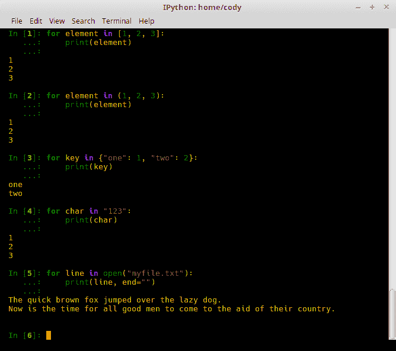

+   +   在前面的例子中，我们只是遍历了各种序列容器，具体来说是一个列表（*第 1 行*）、一个元组（*第 2 行*）、字典键（*第 3 行*）、字符串中的字符（*第 4 行*）和文件中的行（*第 5 行*）。

    +   尽管字典不是序列类型，而是映射类型，但它确实支持迭代，因为它有一个仅适用于字典键的 `iter()` 调用。

1.  当使用 `for` 语句时，它会调用容器上的内置 `iter()` 函数。`iter()` 函数返回一个迭代器对象，该对象定义了 `__next__()` 方法以按顺序访问容器中的每个元素。当容器为空时，会引发 `StopIteration` 异常，迭代过程退出。

1.  如果需要，可以手动调用 `__next__()` 方法，如下所示：

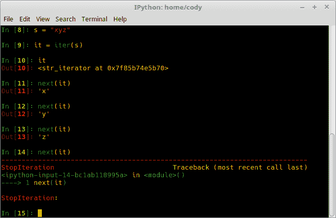

+   +   在 *第 8 行* 中，创建一个由三个字符组成的字符串。

    +   在 *第 9 行* 中，手动创建一个字符串的迭代器对象。

    +   在 *第 10 行* 中，显示了迭代器对象在内存中的位置。它还显示了它是什么类型的迭代器，即字符串迭代器。

    +   在 *第 11 行*-*第 13 行* 中，手动调用 `__next__()` 方法，该方法通过迭代器对象可用。

    +   在 *第 14 行* 中，尝试调用字符串中的下一个字符，但由于此时字符串为空，会引发异常，终止迭代过程。

1.  修改迭代过程相对简单：

+   +   创建一个类对象

    +   定义一个 `__iter__()` 方法，该方法返回一个可以使用 `__next__()` 方法的对象，通常是 `self`，如果类在其自身中定义了 `__next__()`。`reverse_seq.py` 展示了这样一个例子：

```py
        class Reverse_Seq:
            def __init__(self, data_in):
                self.data = data_in
                self.index = len(data_in) # Go to last element
            def __iter__(self):
                return self  # Needed to use __next__()
            def __next__(self):
                if self.index == 0: # No more elements
                    raise StopIteration  # Manually stop the iterator
                self.index = self.index - 1  # Go to previous element in sequence
                return self.data[self.index] # Return element at index
```

以下截图显示了前面的代码块如何处理数据输入：

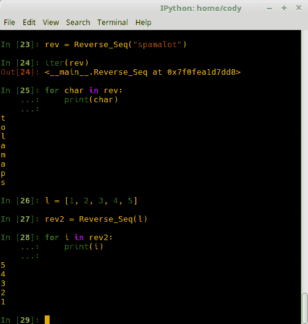

+   +   示例代码创建了一个类，用于通过提供的序列反向迭代。输入数据可以是任何序列对象。该类将初始索引值定义为提供的序列中的最后一个项目。

    +   在 *第 23 行* 中，创建了一个类的实例，提供了一个字符串序列参数。

    +   在 *第 24 行* 中，简单地显示了内存中的实例。

    +   在 *第 25 行* 中，调用迭代过程，从提供的序列的末尾开始向前移动。

    +   在 *第 26 行* 中，创建另一种类型的序列，即列表。

    +   在 *第 27 行* 中，将列表传递给一个新的实例。

    +   与 *第 25 行* 类似，我们在 *第 28 行* 中通过列表向后工作。这证明了可以使用此类反向迭代任何序列对象。

1.  为了更详细地探索迭代器，我们将通过迭代过程进行讲解，手动对序列中的每个项目调用 `next()`：

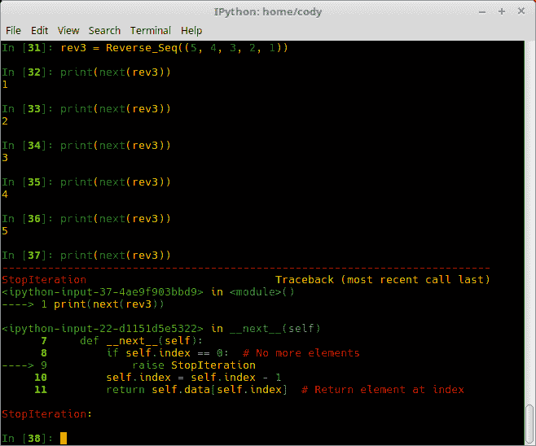

+   +   在 *第 31 行*，这次我们将一个元组对象直接传递给实例参数。

    +   在 *第 32 行*-*第 36 行* 中，我们手动从元组中提取下一个元素。

    +   在 *第 37 行* 中，当没有更多元素要处理时，会给出错误。

# 使用 itertools 模块

除了标准的迭代协议之外，Python 还提供了`itertools`模块。此模块提供了一系列迭代构建块，单独使用或组合使用，可以创建用于高效循环的特殊迭代工具。

# 如何实现...

`itertools`主要有三类：无限迭代器、组合迭代器和在最短输入序列上终止的迭代器。

# 无限迭代器

无限迭代器会重复返回值，直到达到终止条件：

1.  `count(start=0, step=1)`函数返回从提供的`start`参数开始的均匀间隔的值。步长提供以跳过值。此函数经常与`map()`一起使用来生成连续的数据点。当与`zip()`一起使用时，它可以用来添加序列号：

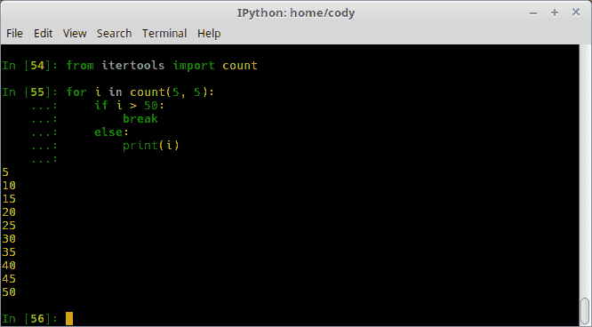

+   +   在这个例子中，我们在第 54 行从`itertools`模块中导入`count()`函数。

    +   在第 55 行，我们创建一个计数循环，从整数`5`开始，步长为`5`，即以五的倍数计数。当计数超过`50`时，循环退出。

1.  `cycle(iterable)`函数从可迭代对象中返回元素并保存每个元素的副本。当序列完成时，保存的副本将被返回；这会永远重复：

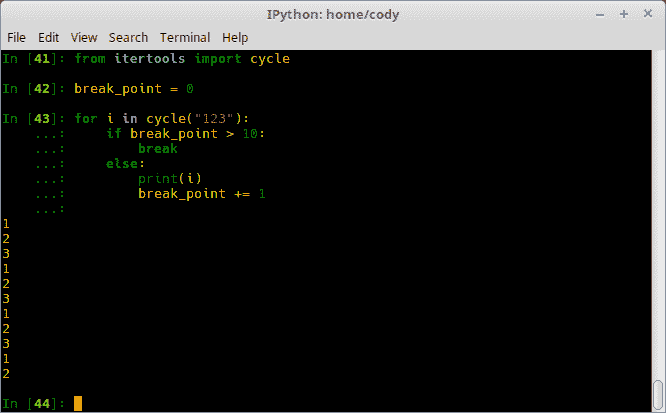

+   +   在导入`cycle()`函数后，我们创建一个计数器变量。这是因为如果没有外部条件停止它，`cycle()`将无限期地继续。

    +   循环将反复打印字符串`123`，直到满足退出条件，在这种情况下，在屏幕上打印了 10 个字符后。

1.  `repeat(object, [, times])`函数在未提供`times`值的情况下无限期地返回`object`。虽然它可能看起来没有明显的用途，但`repeat()`与`map()`函数一起使用，将不变的参数映射到被调用的函数，以及与`zip()`一起使用，以创建元组记录的常数部分。

`repeat()`迭代器的一个好处是重复的单个对象只分配了唯一的内存空间。如果你想正常地重复一个对象，即*x * n*，多个*x*的副本将被放入内存中：

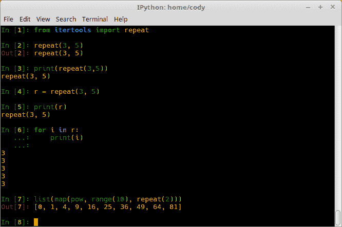

+   +   在导入`repeat()`类后，我们在第 2 行运行命令。

    +   由于返回对象是一个迭代器，直接调用`repeat()`命令（第 2 行和第 3 行）除了返回对象本身之外，不会做任何事情。

    +   在我们可以对迭代器做任何事情之前，我们必须创建一个实例（第 4 行）。

    +   再次直接调用实例（第 5 行）只会给我们`repeat()`对象。

    +   使用迭代遍历实例（第 6 行）显示了实际的重复过程。

    +   第 7 行给出了使用`repeat()`与`map()`结合提供一个稳定值流的例子，用于传递给`map()`。在这种情况下，该行通过将`pow()`函数映射到 10 个重复的整数范围，创建了一个平方值的列表。

# 组合迭代器

组合迭代器关注元素集合的枚举、组合和排列：

1.  `product(*iterables, repeat=1)`迭代器从输入的可迭代对象生成笛卡尔积；它本质上与在生成器中使用嵌套`for`循环相同。嵌套循环遍历输入的可迭代对象，最右边的元素在每次迭代时递增。返回的模式取决于输入；也就是说，如果输入的可迭代对象已排序，则输出乘积元组也将排序。

需要指出的是，笛卡尔积不是数学乘积；也就是说，它们不是乘法的结果。实际上，它们是解析几何的一部分，并且是来自每个输入集的所有可能的有序数组合。换句话说，如果一条线由两个不同的点定义，每个点都有一个*x, y*值，那么乘积集将包含来自这两个集的所有可能的有序对，第一个值来自第一个集，第二个值来自第二个集。以下示例显示了由三个点集生成的笛卡尔积：

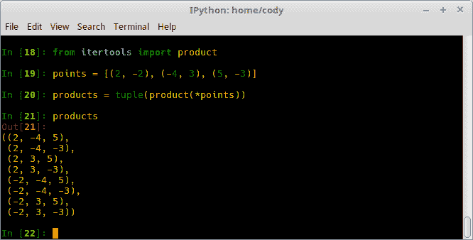

+   +   在*第 18 行*中，将`product()`函数导入到程序中。

    +   第 19 行创建了一个包含三个集合的列表，例如表示一个三维盒子中的线。

    +   在*第 20 行*中，将`product()`的迭代器分配给一个变量。在这种情况下，最终对象是一个元组，用于收集最终的集合。

    +   第 21 行显示了从三个输入集创建的乘积集。已经生成了所有可能的输入值组合。

1.  `permutations(iterable, r=None)`函数返回`iterable`参数提供的元素的连续`r`长度排列。如果未提供`r`，则遍历提供的参数的完整长度，提供所有可能的排列。元素被认为是其位置的唯一，而不是其值，因此如果输入元素是唯一的，则返回的排列中不会有重复的值：

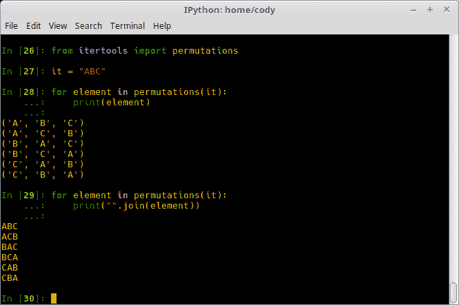

+   +   导入后，创建了一个短字符串并将其传递给`permutations()`函数（*第 28 行*）。

    +   打印排列的结果以元组的形式提供。

    +   为了以更正常的方式返回元组中的项，可以使用`join()`函数（*第 29 行*）。

1.  `combinations_with_replacement(iterable, r)`函数返回`iterable`中元素的`r`长度子集；这允许元素重复，与正常的`combinations()`不同：

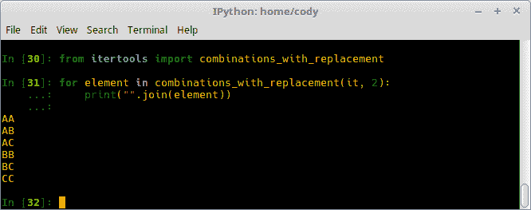

+   +   在这个例子中，我们将返回的值限制为从上一个示例的 *第 27 行* 开始的输入字符串的仅两个元素。

    +   因为元素可以重复，如果我们设置 `r=3`，我们得到 *第 34 行* 中的结果。与 *第 28 行* 相比，不仅结果更多，而且元素被重复；有时这是所希望的，但通常不是。

# 终止迭代器

终止迭代器返回值，直到迭代最短输入序列，然后终止：

1.  `accumulate(iterable[, func])` 函数返回一个累积总和的迭代器，或其他二元函数的结果，这取决于 `func` 参数提供的值。如果提供了 `func`，它应该是两个参数的函数。`iterable` 元素可以是 `func` 作为参数使用的任何类型。默认函数是 `addition`。以下示例显示了此默认功能：

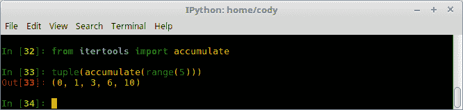

由于默认函数是加法，使用 `accumulate` 添加五个数字的范围返回每个加法过程的和。前一次加法的和是下一次加法计算的输入值之一。因此，在 *第 37 行* 的输出中可以看到：*0 + 0 = 0, 0 + 1 = 1, 1 + 2 = 3, 3 + 3 = 6, 6 + 4 = 10*。

`func` 参数有多种用途。它可以设置为 `min()` 以在迭代过程中跟踪最小值，`max()` 以跟踪最大值，或者 `operator.mul()` 以跟踪乘积，如下面的示例所示：

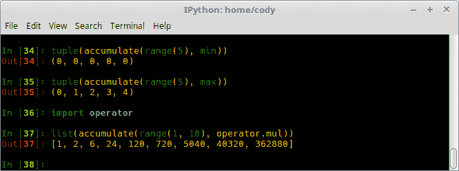

+   +   *第 34 行* 显示了迭代过程中处理的最小值。在这种情况下，由于可迭代参数是 `range()`，最低值将是零。

    +   如果我们切换到跟踪最大运行值 (*第 35 行*)，结果显示每次加法都会显示下一个要添加的值。

    +   *第 36 行* 导入了 `operator`，然后在 *第 37 行* 中用于乘以给定范围内的每个后续值。请注意，范围必须从 1 开始，否则所有结果都将为零，因为每个值都将与范围中的初始起始零值相乘。

1.  `accumulate()` 的一种用途是债务管理；可以通过累积利息和考虑付款来创建摊销表：

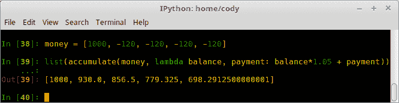

+   +   *第 38 行* 显示了一笔初始贷款 1000 美元，然后四次付款各 120 美元。

    +   *第 39 行* 使用 lambda 函数返回当前余额，`money` 列表中的每个值用作付款，前一个余额作为输入余额值。`1.05` 的值等于 5% 的利率。

1.  `accumulate()` 的另一个用途是递归关系。递归关系是一个方程，它通过给定一个或多个初始项递归地定义一个序列或多维数组；序列的后续项被定义为前一项的函数。

在以下示例中，在为可迭代对象提供一个初始值并将累积总和传递给`func`参数之后，创建了一个递归关系。这个特定的例子适用于逻辑映射（这就是混沌行为如何从简单的非线性动力学方程中发展而来），并来自[`docs.python.org/3.6/library/itertools.html#itertools.accumulate`](https://docs.python.org/3.6/library/itertools.html#itertools.accumulate)：

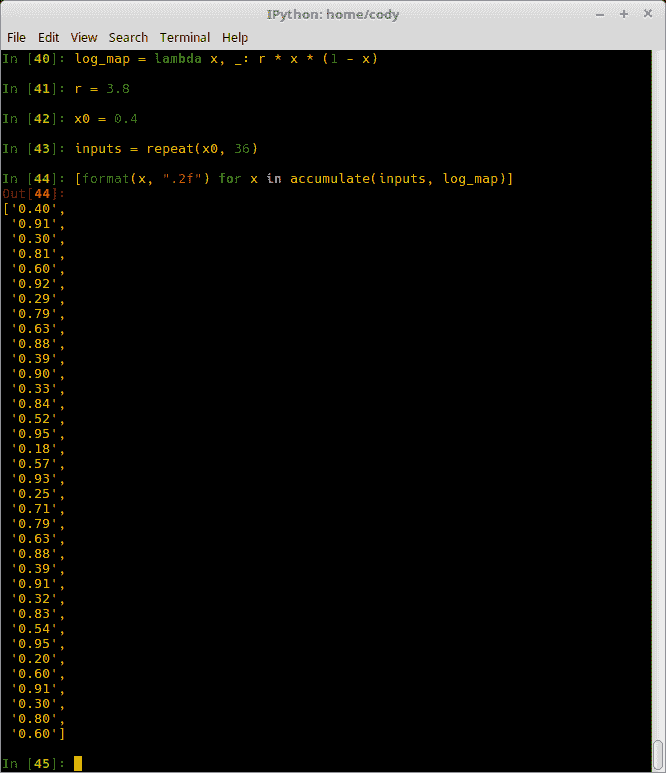

+   +   由于这本书不是用来讨论诸如混沌递归关系等主题的，所以我不深入探讨这段代码的实际工作原理。然而，我将指出*第 40 行*显示了一个只有一个输入参数`x`的 lambda 函数。其他值被忽略，因为`r`是从随后分配的变量中取的*第 41 行*。

    +   在*第 43 行*，只提供了初始的`x`值给`iterable`参数。同时注意这也是`repeat()`迭代工具在实际应用中的例子。

    +   *第 44 行*定义了一个列表推导式，打印出`x`的两位小数值，当`log_map`匿名函数通过累加器运行时。

1.  `chain(*iterables)`函数从第一个可迭代参数返回元素，直到没有更多值。此时，处理下一个可迭代参数直到为空。这会一直持续到所有可迭代参数都完成。`chain()`函数本质上将多个序列转换为一个序列：

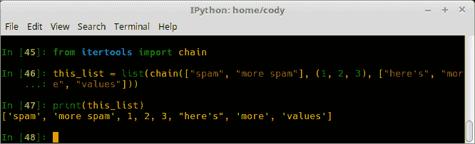

+   +   在导入`chain`工具后，我们在*第 46 行*创建了一个列表对象，该对象将两个列表和一个元组传递给`chain()`。这些参数也可以是预定义的变量，但在这个例子中它们只是原始数据。

    +   当我们在*第 47 行*打印出`chain`结果时，我们看到它已将所有不同的序列对象合并为一个列表。

1.  完成相同任务的一种替代方法是简单地连接对象：

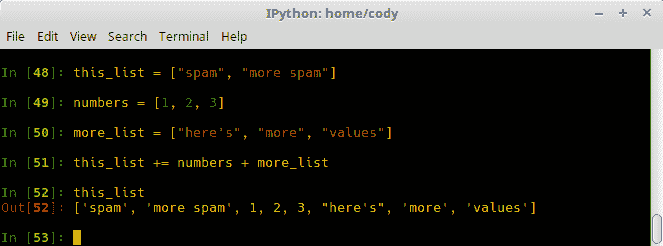

+   +   *第 55 行*至*第 57 行*从*第 53 行*中使用的原始数据创建变量。

    +   *第 58 行*将所有列表连接在一起。在*第 59 行*打印结果时，显示的输出与*第 54 行*达到的输出相同。两种方法都是正确的；使用哪种方法取决于哪种方法对开发者来说更有意义。

1.  存在`chain()`的一个修改版本——`chain.from_iterable(iterable)`。这实际上与`chain`相同，只是它从单个可迭代参数中链式连接输入。该参数是惰性评估的，这意味着它将表达式评估延迟到其值需要时。例如，在 Python 2 中，`range()`函数立即评估，所以当函数被检查时，由`range()`产生的所有整数都存储在内存中。

1.  相比之下，Python 3 有一个懒加载的`range()`评估。虽然可以将变量分配给`range()`调用，但调用本身会驻留在内存中，而整数只有在需要时才会被调用到存在。考虑以下示例：

+   +   在下面的示例屏幕截图，我们看到，当在 Python 2 中打印一个范围变量时，所有整数都立即可用；当调用索引值时，其结果显然提供：

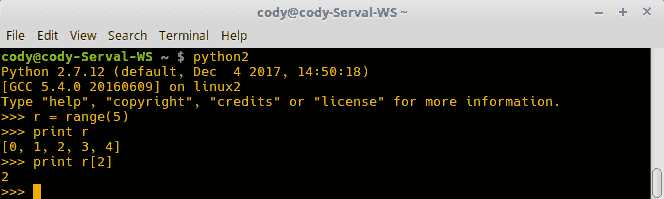

+   +   在下一个示例屏幕截图，Python 3 只返回`range`对象，而不是整个整数列表。然而，当调用索引值时，它被返回，因为此时`range`对象被评估以确定索引的值。然而，只确定那个值；再次尝试打印变量时，仍然显示`range`对象，而不是整数列表：

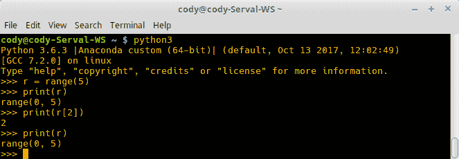

1.  回到`chain.from_iterable()`，以下示例显示了如何使用它：


+   +   在这种情况下，`from_iterable()`实际上是`chain`类的一个方法，因此使用点命名法调用。

    +   与正常的`chain`调用接受单独的可迭代对象不同，`from_iterable`接受一个包含多个元素的单一对象，例如，一个典型的列表。元素在返回值中组合成一个单一对象。

1.  使用`compress(data, selectors)`，创建一个迭代器，从`data`参数中过滤元素，并只返回与`selectors`匹配的元素。当`data`或`selectors`中的任何一个为空时，过程结束。

实际上，匹配发生在`selectors`中的元素被评估为`True`时，而不是匹配确切的元素类型。因此，使用布尔类型值，即`True`/*`False`或 1/0：

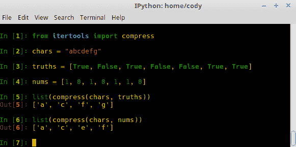

+   +   前面的例子表明，布尔值（*第 3 行*）和二进制整数（*第 4 行*）都可以用作`selectors`的比较值。

1.  `dropwhile(predicate, iterable)`函数创建一个迭代器，在`predicate`为`true`时从`iterable`中丢弃元素。当`predicate`为`false`时，将返回每个元素。值得注意的是，迭代器不会显示任何输出，直到`predicate`变为`false`，因此输出可能存在一些延迟：

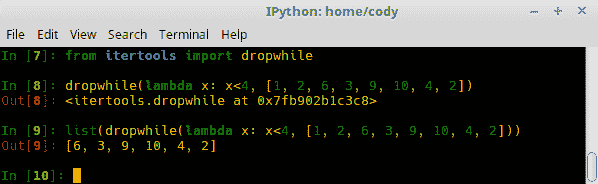

+   +   前面的例子使用匿名 lambda 函数丢弃所有小于 4 的值。*第 8 行*强调了迭代器对象在没有被能够处理迭代器的某个东西处理的情况下不会自动执行任何事情。

    +   因此，*第 9 行*将`dropwhile`对象传递给一个列表，该列表运行 lambda 函数并丢弃可迭代参数内的所有值，只返回大于或等于四的值。

1.  与`dropwhile`*相同，* `filterfalse(predicate, iterable)`过滤`iterable`中的元素，并仅返回那些`predicate`为`False`的元素。相反，如果`predicate`是`None`，则它仅返回那些自身就是`False`的元素*.*

应该指出，与`dropwhile`不同，`filterfalse`会评估每个单独的元素。`dropwhile`对象仅在执行到`false`比较时才会停止工作；之后，所有内容都会被返回。因此，`filterfalse`可以用来确保每个项目都被评估，而`dropwhile`则可以用作一次性检查：

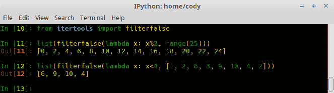

+   +   在这个例子中，`filterfalse`使用一个 lambda 函数（*第 11 行*），该函数使用一系列数字的余数来返回那些余数为零的值。由于零被认为是`False`，因此只有那些值会被返回。

    +   为了与`dropwhile`更容易地进行比较，我们将使用与*第 12 行*中`dropwhile`示例相同的输入。这是一个展示每个元素都是单独评估的好方法，因为唯一的输出是大于或等于 4 的值。在`dropwhile`示例中，尽管返回的数字相同，但`2`和`3`的值也被返回，尽管它们小于 4，因为`dropwhile`在第一个`False`值出现时未能打开。

1.  `groupby(iterable, key=None)`方法产生一个迭代器，它返回从提供的`iterable`中连续的键和组。`key`函数是一个计算每个元素键值的函数；如果`key`是`None`，则默认返回未更改的元素。最好在相同的`key`函数上对`iterable`进行预排序。

此方法与 Unix 中的`uniq`过滤器以类似的方式运行，因为它在`key`函数值改变时创建一个新的组或一个断点。然而，它与 SQL 的`group by`函数不同，因为后者无论输入顺序如何都会聚合共同元素。

要使用以下示例，请确保使用与*第 34 行*中相同的`from itertools import groupby`：

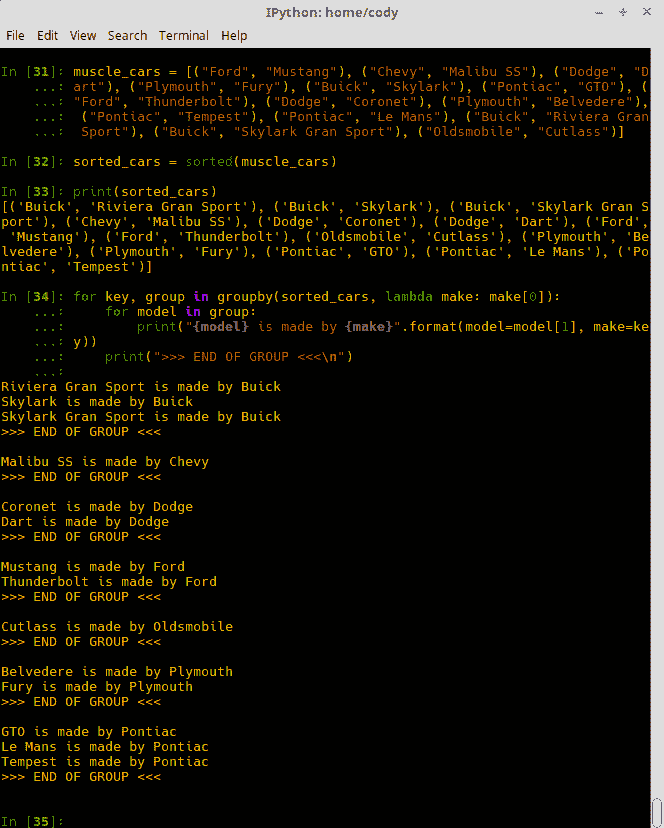

+   +   对于这个例子，*第 31 行*只是一个包含汽车制造商和型号的元组列表。

    +   *第 32 行*根据每个元组的第一个项目对列表进行排序，如*第 33 行*所示。

    +   *第 34 行*实际上实现了`groupby`方法。`groupby`方法将其参数作为排序后的列表和一个匿名函数，告诉`groupby`使用每个元组的第一个项目作为分组键。

1.  然后，在一个封闭的循环中，我们查看元组的第二个元素，并打印出模型（第二个元组元素）和列表中的汽车（第一个元组元素，即组键）。我们通过添加一个分隔线来结束，以指示每个组结束的位置。

1.  以下截图显示了如果你忘记对输入的可迭代进行排序会发生什么。在这种情况下，`groupby` 仍然通过分组常见元素来工作，但前提是它们在可迭代中依次排列：

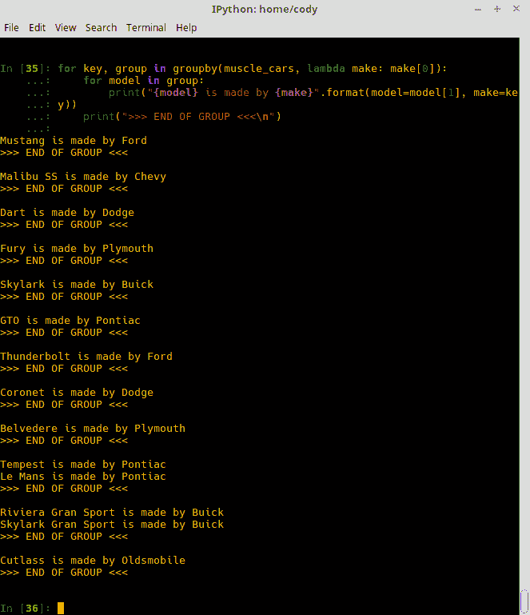

1.  `isslice(iterable[, start], stop[, step])` 函数从 `iterable` 参数返回选定的元素。如果提供了 `start` 并且不是零，则跳过 `iterable` 中的元素，直到达到起始索引。如果 `stop` 为 `None`，则处理 `iterable` 中的所有元素。`isslice()` 函数与常规切片不同，因为它不允许 `start`、`stop` 或 `step` 为负数：

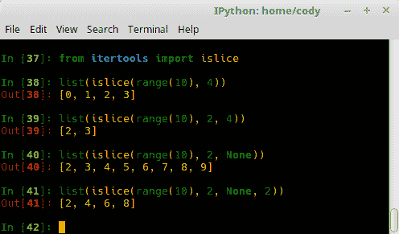

+   +   上述示例显示了可以使用 `islice` 的不同变体。*第 38* 行显示了迭代器在返回四个元素索引后停止。

    +   *第 39* 行显示了迭代器从元素索引 `2` 开始，并在索引 `4` 之后停止。

    +   第 *40* 行从索引 `2` 开始，并返回 `iterable` 中的所有值。

    +   第 *41* 行与 *40* 行相同，区别在于返回值有一个步长为 `2`。

1.  `starmap(function, iterable)` 方法使用来自 `iterable` 的参数计算 `function`。当参数参数预先打包；也就是说，它们已经组合成单个可迭代中的元组时，使用该方法代替 `map()`。本质上，`starmap()` 可以接受任意数量的参数（因此名称中的 `star` 部分），而 `map()` 只能接受两个参数：

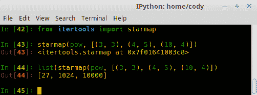

+   +   导入后，在 *第 43* 行创建并确认了 `starmap` 对象。

    +   在 *第 44* 行显示 `starmap` 的结果，我们可以看到可以输入任意数量的参数，因此 `starmap(*)` 类似于 `function(*)`，而 `map()` 更像 `function(a, b)`。

1.  `takewhile(predicate, iterable)` 方法生成一个迭代器，只要 `predicate` 为 `true`，就返回 `iterable` 中的所有元素。在实践中，`takewhile()` 是 `dropwhile()` 的反义词。一旦 `predicate` 变为 `False`，就不再处理进一步元素：

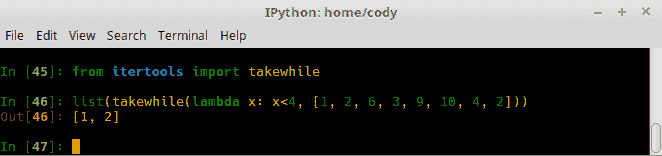

+   +   *第 46* 行显示，在可迭代输入中的元素被处理，直到处理结果为 `false`；在这种情况下，`6` 不小于 `4`。此时，不再进行进一步处理，并返回到那时成功处理的迭代器。

1.  `tee(iterable, n=2)` 方法从单个可迭代参数返回 `n` 个独立的迭代器。换句话说，你可以从单个可迭代输入创建多个迭代器。

一旦`tee()`完成了其工作，`iterable`就不应该在其他地方使用，否则它可能会在没有更新`tee()`输出迭代器的情况下被修改。此外，生成的迭代器可能需要大量的内存分配；如果一个迭代器在另一个迭代器开始之前使用了大部分或全部数据，那么使用`list()`比使用`tee()`更快：

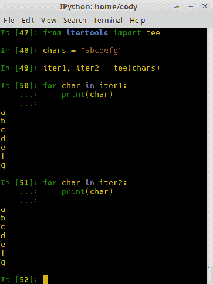

+   +   在这个例子中，在第*48*行创建了一个简单的字符字符串。

    +   在第*49*行执行了解包操作。由于我们为生成的迭代器使用默认的`n=2`，因此只需要两个变量。

    +   第*50*行和*51*行显示，在处理`tee()`之后，我们现在有两个相同的迭代器对象。

1.  最后要介绍的是`zip_longest(*iterables, fillvalue=None)`。这个方法创建一个迭代器，它从每个可迭代输入参数中聚合元素；简而言之，将两个或多个可迭代合并为一个。如果参数长度不均匀，缺失的元素会用`fillvalue`填充。这个方法的迭代会一直持续到最长的可迭代参数为空。如果最长的参数可能是无限的，应该使用包装器来限制调用次数，例如`islice()`或`takewhile()`：

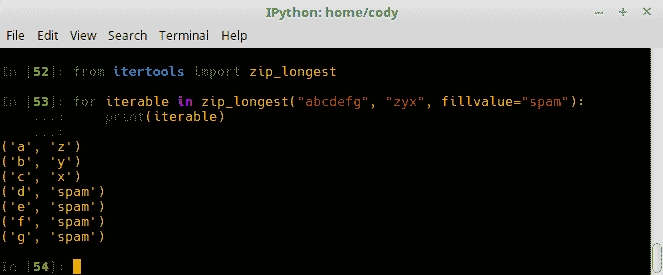

+   +   在这个例子中，我们向`zip_longest()`提供了两个内联字符串参数，填充值是另一个字符串。打印结果显示参数`1`与参数`2`合并，直到参数`2`中没有更多的字符可用。在那个点上，提供`fillvalue`作为替代，直到参数`1`为空。

# 使用生成器函数

生成器允许你声明一个像迭代器一样工作的函数。这允许你编写一个自定义函数，可以在`for`循环或其他迭代能力中使用。生成器的关键特性是它产生一个值，而不是使用`return`。

当调用生成器函数时，它返回一个称为生成器的迭代器。这个生成器控制生成器函数的操作。当生成器被调用时，函数像正常一样执行，但当逻辑流程达到`yield`语句时，处理会暂停并返回第一次评估的结果。

在暂停期间，函数的局部状态被保留在内存中；就像一个正常函数在完成其处理时被暂停一样。当再次调用生成器以恢复它时，它继续就像什么都没发生一样，返回下一个评估值，然后再次暂停。这会一直持续到所有要处理的值都完成，此时会抛出一个`StopIteration`异常。

# 如何实现...

1.  生成器函数的创建非常简单。定义一个函数，但不要使用`return`，而是使用关键字`yield`。

```py
        def my_generator(x):
            while x:
                x -= 1
                yield x
```

1.  创建函数的一个实例。别忘了参数：

```py
        mygen = my_generator(5)
```

1.  将实例作为`next()`的参数调用：

```py
        next(mygen)
```

1.  继续直到迭代停止。

# 它是如何工作的...

这里是一个生成器在行动中的例子：

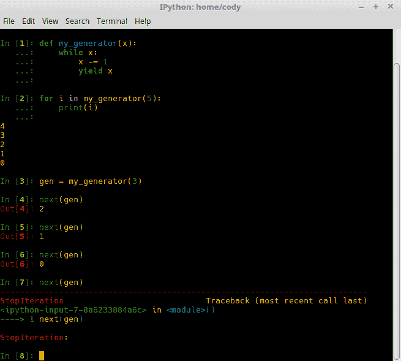

+   *第 1 行*简单地创建了之前提供的函数。

+   *第 2 行*像调用常规函数一样调用生成器，表明生成器可以像常规函数一样操作。如果你想要结果的永久副本，可以将结果捕获在`list`对象中。

+   *第 3 行*创建了一个生成器的实例。

+   *第 4 行*至*第 6 行*展示了生成器通常是如何使用的。通过将生成器实例作为`next()`的参数调用，生成器处理在每个评估周期后暂停。而不是一次性接收所有结果，当通过`next()`调用时，只从生成器提供单个值。这是由于使用了`yield`而不是`return`*.*

+   在*第 7 行*，生成器中不再有要评估的值，因此处理被取消，并返回预期的`StopIteration`异常。

如此例所示，生成器的工作方式与其它迭代函数完全一样。它们只是让你能够编写迭代操作，而无需定义具有`__iter__`和`__next__`方法的迭代器类。然而，一个要注意的问题是生成器只能使用一次；在遍历序列之后，它就不再在内存中了。要多次迭代，你必须再次调用生成器。

# 还有更多...

默认情况下，生成器提供懒加载评估：它们不会在明确调用之前执行任何过程操作。当处理大型数据集时，例如处理数百万次计算，这是一个非常有价值的特性。如果你试图一次性将所有结果存储在内存中，即通过常规函数调用，你可能会耗尽空间。

另一个选项是当你不确定你是否真的需要使用返回的所有值。如果你不会使用它，就没有必要进行计算，因此你可以减少内存占用并提高性能。

另一个选项是当你想要调用另一个生成器或访问其他资源，但你想控制访问发生的时间。如果你不需要立即响应，例如，你不想将结果存储在临时变量中，那么能够在期望的时间运行生成器可以帮助设计过程。

生成器的一个很好的用途是替换回调函数。回调函数由其他东西调用，执行它们的处理，并偶尔向调用者发送状态报告。这固有的问题是全处理，即所有内容一次性处理并存储在内存中以供访问。

如果使用生成器，将发生相同的处理，但没有状态报告给调用者。生成器函数在需要报告时简单地产生值。调用者获取生成器的结果，并将报告工作作为简单的 `for` 循环处理，该循环包装了生成器调用。如果出于某种原因，你仍然希望生成器一次性提供所有内容，你可以简单地在一个 `list` 中包装生成器调用。

Python 使用这两种情况的不同版本。在 Python 2 中，`os.path.walk()` 使用回调函数，而 Python 3 有 `os.walk()`，它使用文件系统遍历生成器。

最后，有一个最后的技巧可以帮助提高 Python 的性能。通常，列表推导式用于快速遍历列表，如下面的示例所示：

```py
l = [x for x in foo if x % 2 == 0]
```

可以以类似的方式创建一个简单的生成器。基本上，你只需要将方括号替换为圆括号：

```py
g = (x for x in foo if x % 2 == 0)
```

一旦有了这个，你就可以在简单的 `for` 循环中使用生成器实例：

```py
for i in g:
```

这是正在使用的过程：

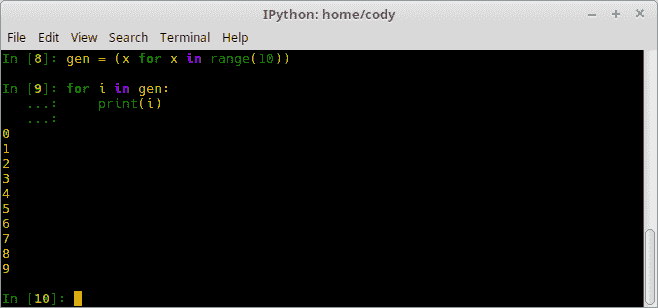

使用生成器而不是列表推导式的优点是无需中间内存存储。值是按需创建的，就像这样，所以整个列表不会一次性全部加载到内存中。这可以实现显著的速度提升并减少内存使用，具体取决于程序。

# 使用协程模拟多线程

在生成器可以通过 `yield` 从函数生成数据的地方，如果它们在变量赋值的右侧使用 `=` 符号，它们也可以接受数据。这创建了一个协程。

协程是一种函数类型，可以通过 `yield`* 在其代码中的预定义位置暂停和恢复执行。除了 `yield()` 之外，协程还有 `send()` 和 `close()` 函数用于处理数据。`send()` 函数将数据传递给协程（函数的 *接受* 部分）和 `close()` 终止协程（因为没有方法让垃圾回收自动为我们关闭它）。

使用 `asyncio` 模块允许协程被用来编写单线程的并发程序。由于它们是单线程的，它们仍然只执行一个任务，但并发模拟了多线程。关于并发和并行编程的更多信息可以在下一节中找到，*何时使用并行处理*。

# 如何做到这一点...

1.  定义函数：

```py
        def cor():
            hi = yield "Hello"
            yield hi
```

1.  创建一个实例：

```py
        cor = cor()
```

1.  使用 `next()` 处理函数：

```py
        print(next(cor))
```

1.  使用 `send()` 向函数提供一个输入值：

```py
        print(cor.send("World"))
```

1.  这就是组合在一起的样子：

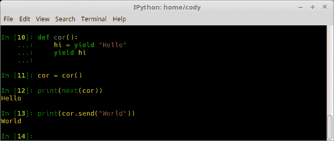

1.  为了使生活更轻松并避免每次都手动调用 `next()`，`coroutine_decorator.py` 展示了如何创建一个装饰器来为我们处理迭代：

```py
        def coroutine(funct):
            def wrapper(*args, **kwargs):
                cor = funct(*args, **kwargs)
                next(cor)
                return cor
            return wrapper
```

根据官方文档（[`docs.python.org/3/library/asyncio-task.html#coroutines`](https://docs.python.org/3/library/asyncio-task.html#coroutines)），最好使用`@asyncio.coroutine`来装饰基于生成器的协程。这并不是强制性的，但它使得与`async def`协程兼容，同时也起到文档的作用。

1.  `asyncio_concurrent.py`，来自[`docs.python.org/3/library/asyncio-task.html#example-chain-coroutines`](https://docs.python.org/3/library/asyncio-task.html#example-chain-coroutines)，展示了如何使用`asyncio`进行并发处理：

```py
        import asyncio

        async def compute(x, y):
            print("Compute %s + %s ..." % (x, y))
            await asyncio.sleep(1.0)
            return x + y

        async def print_sum(x, y):
            result = await compute(x, y)
            print("%s + %s = %s" % (x, y, result))

        loop = asyncio.get_event_loop()
        loop.run_until_complete(print_sum(1, 2))
        loop.close()
```

+   +   事件循环被启动（`get_event_loop()`）并调用`print_sum()`

    +   当`print_sum()`协程调用`compute()`时，它被挂起

    +   `compute()`协程启动但立即进入休眠状态 1 秒

    +   当`compute()`重新启动时，它完成其计算并返回结果

    +   `print_sum()`协程接收结果并打印它

    +   没有更多的计算要执行，因此`print_sum()`协程引发`StopIteration`异常

    +   该异常导致事件循环终止，循环被关闭

1.  这里是`asyncio_multi_jobs.py`（[`docs.python.org/3/library/asyncio-task.html#example-parallel-execution-of-tasks`](https://docs.python.org/3/library/asyncio-task.html#example-parallel-execution-of-tasks)），它展示了多个作业并发执行的更好示例：

```py
        import asyncio

        async def factorial(name, number):
            f = 1
            for i in range(2, number+1):
                print("Task %s: Compute factorial(%s)..." % (name, i))
            await asyncio.sleep(1)
            f *= i
            print("Task %s: factorial(%s) = %s" % (name, number, f))

        loop = asyncio.get_event_loop()
        loop.run_until_complete(asyncio.gather(
            factorial("A", 2),
            factorial("B", 3),
            factorial("C", 4),
        ))
        loop.close()
```

在这个例子中，创建了三个阶乘协程。由于代码的异步性质，它们不一定按顺序启动，也不一定按顺序处理和完成。

1.  你的结果可能会有所不同，但以下是此代码输出的一个示例：

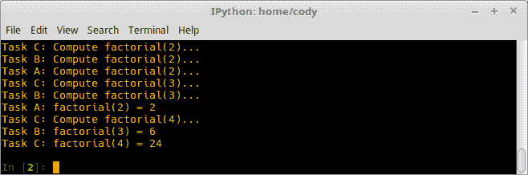

如所见，工作是从相反的顺序开始的；如果你查看官方文档，它们是按顺序开始的。每个任务完成的时间不同，因此，虽然结果是有序的，但每个单独的任务所需的时间各不相同。这也可以与官方文档进行比较。

# 还有更多...

当使用异步代码时，开发者必须仔细考虑所使用的库和模块。任何导入的模块都需要是非阻塞的；也就是说，它们不能在等待其他事情完成时停止代码执行。

此外，还需要创建一个涉及事件循环的协程调度，以手动处理协程调度。虽然操作系统可以在内部处理多线程和多进程，但协程调度（由于其本质）必须由开发者处理。因此，虽然协程和异步操作可以是强大且有用的工具，但它们也需要大量的工作才能正确实现。

# 何时使用并行处理

并发意味着停止一个任务去处理另一个任务。使用协程时，函数停止执行并等待更多输入以继续。从这个意义上说，您可以同时有多个操作挂起；当时间到了，计算机简单地切换到下一个操作。

这就是操作系统中的多任务处理的来源：单个 CPU 可以通过在它们之间切换来同时处理多个任务。简单来说，并发是指在给定的时间段内处理多个线程。相比之下，并行性意味着系统同时运行两个或更多线程；也就是说，在给定的时间点处理多个线程。这只能在有多个 CPU 核心可用的情况下发生。

并行化代码的好处在于用更少的资源做更多的事情。在这种情况下，就是用更少的 CPU 周期完成更多的工作。在多核系统出现之前，提高性能的唯一真正方法是增加计算机的时钟速度，使得系统在给定的时间内能完成更多的工作。随着更高的 CPU 频率带来的热限制问题，制造商发现增加核心数量并降低频率可以在不过热系统并减少能耗的情况下提供类似的好处，这在便携式设备中至关重要。根据任务的不同，将一个任务分成多个较小的任务，在多核设备上实际上可能比增加时钟速度更快。

制作并行程序的最大问题在于确定何时并行化会有帮助。并非所有任务都需要这种提升，有时如果你尝试使用并行编程，实际上可能会使事情变慢。虽然可以检查某些类型的问题并做出决定，但根据作者的经验，有时你只能尝试一下，看看会发生什么。

# 如何做到这一点...

与传统的代码编写流程相比，这将是更多关于确定是否使用以及使用哪种类型的并行处理范例的流程图：

+   您的数据集有多大？如果您的数据集很小（根据您的经验），那么单线程进程可能不会对您造成太大的伤害。

+   您的数据处理和逻辑流程能否分成同时进行的操作？通常，程序类型和正在处理的数据类型不允许任何类型的并发或并行编程。

+   您的处理是 CPU 受限还是 I/O 受限？CPU 密集型应用程序最好使用多进程来解决，而 I/O 密集型应用程序则更适合使用多线程处理。

+   您是否需要一个共享内存池？在共享内存池中，您必须确保每个数据请求不会与数据写入同时发生，即竞态条件，因此锁定每个数据事务是必要的。非共享内存需要创建线程/进程之间的通信调用，如果需要数据传输。

+   你已经确定了瓶颈在哪里吗？在设计并行程序之前，你必须找到进程中的问题点。虽然你可以并行化整个程序，但如果你专注于优化数据瓶颈和做大部分工作的函数，你会得到更好的回报。

# 还有更多...

列出的前几步并不全面。设计并行程序需要大量的实践，你可以找到只有并行编程的大学课程，例如[`ocw.mit.edu/courses/mathematics/18-337j-parallel-computing-fall-2011/`](https://ocw.mit.edu/courses/mathematics/18-337j-parallel-computing-fall-2011/)。

还必须强调的是，你应该花时间确定你试图解决的问题是否可以并行化。计算机科学中使用的例子之一是排序算法。例如，如果你有一组需要从小到大排序的数字，你可以将整个组分成两两一组，即比较两个数字。然后，这些子组可以同时进行比较。然后，你可以将一些组合并在一起，并执行另一个同时比较。这样做足够多次，你最终会得到最终的、排序的答案。

如果你仔细想想，并行处理与递归编程类似，因为你必须将问题分解成更小的部分，或者至少识别出相似的操作。主要目标是找到可以独立执行的任务，以及需要交换数据的任务。独立任务允许工作在独立工作者之间分配，而数据交换任务有助于定义哪些任务需要在单个工作者中组合在一起。

如果你的程序在运行时导致系统响应变慢，你可能需要考虑并行化它。通过启动新的线程或进程，可以让系统在执行程序工作的同时，仍然对用户输入保持响应。

# 进程创建

进程创建是并行化工作的传统方法，尤其是在*nix 操作系统上。当一个程序被创建时，操作系统只是简单地创建原始程序的一个新副本，包括其内存状态，然后同时运行这两个版本的程序。自然地，这个副本程序可以有自己的创建，形成一个以原始、父进程为根的层次结构，有众多子进程和孙进程副本。如果父程序被杀死，子进程仍然可以正常操作。

# 如何实现...

在 Python 中，要创建一个进程，你只需要导入`os`模块并调用`fork()`函数。以下示例创建了一个简单的父/子进程创建程序：

1.  导入必要的`os`模块以访问`fork()`：

```py
        import os
```

1.  定义子进程：

```py
        def child():
            print("Child {} calling".format(os.getpid()))
            os._exit(0)
```

1.  创建父进程：

```py
        def parent():
            for i in range(10):
                newchild = os.fork()
                if newchild == 0:
                    child()
                else:
                    print("Parent {parent} calling. Creating child {child}".format(parent=os.getpid(), child=newchild))
            i += 1
```

# 它是如何工作的...

子进程非常简单。它所做的只是返回子进程的进程 ID。`os._exit()`调用很重要，因为它确保在父进程被杀死时，子进程被杀死并且不是僵尸进程。

由于父进程将被分叉以创建新的子进程，因此它是`关键`函数。只有一个父进程被创建；所有其他进程都将作为子进程。

以下截图演示了一种可能的结果；由于每个系统的进程 ID 都不同，您的结果将不同：

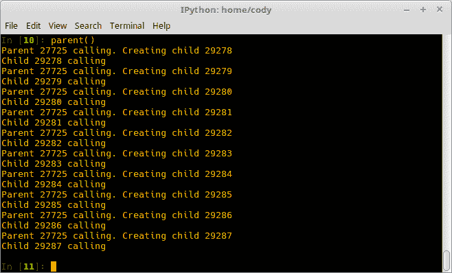

如您从输出中看到的，子进程可能不会立即创建；父进程在子进程真正开始运行之前可能有机会生成几个子进程。另一个要点：明确杀死子进程可以确保子进程不会返回父循环并生成自己的进程，这会产生孙进程。

# 还有更多...

使用`os.fork()`的问题在于它只在*nix 操作系统上可靠地工作，包括 Mac。Windows 使用不同的分叉模型；除非你恰好运行了 Cygwin（一个允许*nix 类似功能的 Windows 应用程序），否则你将不得不依赖于线程或`multiprocessing`模块。

# 如何实现多线程

由于分叉不是完全跨平台兼容的，在并行 Python 编程中使用了两个主要的并行工作者：线程和进程。线程通常是许多程序员的“首选”并行工具。简单来说，线程是同时完成更大任务的独立工作者。一个任务可以有多个线程。

一个很好的例子是网页浏览器：当在 Windows 任务管理器中查看或使用 Linux 中的`ps`命令时，浏览器本身是一个单独的进程，但浏览器可以生成许多线程来完成任务，例如访问 URL、渲染 HTML、处理 JavaScript 等。所有这些线程都在共同努力完成浏览器进程的任务。

线程有时被称为**轻量级进程**，因为它们像*nix 分叉进程一样并行运行，但实际上它们是由单个父进程生成的。线程常用于图形界面中等待和响应用户交互。它们也是适合设计成多个独立任务的程序的首选；这使得它们非常适合网络，在网络上，I/O 操作是瓶颈，而不是 CPU。

# 如何实现...

1.  首先，我们将创建`single_thread.py`来为我们提供一个基准进行比较。在这个例子中，我们将联系一些网站，并计算打开所有这些网站连接所需的时间：

```py
        import urllib.request
        import urllib.error
        import time

        def single_thread_retrieval():
            start_time = time.time()
            urls = ["https://www.python.org", 
                    "https://www.google.com", 
                    "https://www.techdirt.com",
                    "https://www.facebook.com",
                    "https://www.ibm.com",
                    "https://www.dell.com",
                    "https://www.amd.com",
                    "https://www.yahoo.com",
                    "https://www.microsoft.com",
                    "https://www.apache.org"]
            try:
                for url in urls:
                    urllib.request.urlopen(url)
            except urllib.error.HTTPError:
                pass
            return time.time() - start_time
```

+   +   由于我们将要联系网站，我们需要导入`urllib.request`来实际打开连接，以及`urllib.error`以防无法连接到网站。

    +   为了做一个基准测试，我们需要知道运行函数需要多长时间，因此我们需要导入`time`*.*

    +   在创建函数时，我们首先确定函数开始的时间。

    +   接下来，我们创建一个要访问的 URL 列表。您可以随意添加或修改此列表。

    +   如果在访问网站时出现任何错误，我们将实际的网站请求包裹在 `try...except` 块中。

    +   对于列表中的每个网站，我们打开到该网站的连接。因为我们只关心连接所需的时间，所以我们不对 `urlopen()` 返回的对象做任何处理。

    +   如果网站出现错误，例如 403 禁止访问，我们简单地忽略它并继续。

    +   最后，我们计算函数运行并返回所需的总时间。

1.  因为我们要访问网站，并且连接可能会波动，所以我们将编写 `time_funct.py` 来计算运行前面函数的平均时间。这最好作为前面示例中的函数使用，但如果需要也可以单独使用：

```py
        import statistics

        times = []

        def avg_time(func, val):
            for num in range(val):
                times.append(func)
        return statistics.mean(times)
```

+   +   我们导入 `statistics` 库，因为它提供了基本的数学函数，例如计算平均值。

    +   创建一个空列表来存储单个时间计算。

    +   创建一个平均函数。在这种情况下，为了允许它在其他情况下使用，它接受一个函数调用和一个整数作为参数。

    +   整数参数成为运行函数参数的次数。

    +   最后，我们计算平均时间并返回该值。

1.  为了找出访问 10 个 URL 的平均单线程时间，我们只需打印 `avg_time()` 函数的结果：

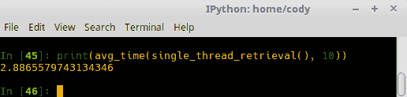

1.  现在，让我们将其与 `multi_thread_retrieval.py` 进行比较。与单线程应用程序相比，编写这个程序更复杂，示例可能可以以更简洁的方式重写，但对我们来说已经足够了。文件本身被分成三部分，如下所示，以帮助解释。

```py
        import time 
        import threading 
        import queue 
        import urllib.request, urllib.error 

        class Receiver(threading.Thread): 
            def __init__(self, queue): 
                threading.Thread.__init__(self)
                self._queue = queue 

            def run(self):
                while True: 
                    url = self._queue.get() 
                    if isinstance(url, str) and url == 'quit':
                        break
                    try:
                        urllib.request.urlopen(url)
                    except urllib.error.HTTPError:
                        pass
```

+   +   首先，我们需要导入几个模块。其中两个新模块是 `threading` 和 `queue`，在处理多个线程时是必要的。

    +   我们为接收 URL 并实际执行 URL 请求的对象创建了一个类。这个类本身继承自 `Thread` 类，允许它继承线程功能。

    +   初始化方法创建一个新的线程并将输入数据填充到一个队列变量中。

1.  `run` 方法查看队列变量并从中拉取 URL。只要 URL 不是 `quit`，程序将尝试访问网站。如果在访问网站时生成异常，它将被跳过，就像单线程程序一样：

```py
        def Creator():
            urls = ["https://www.python.org", 
                    "https://www.google.com", 
                    "https://www.techdirt.com",
                    "https://www.facebook.com",
                    "https://www.ibm.com",
                    "https://www.dell.com",
                    "https://www.amd.com",
                    "https://www.yahoo.com",
                    "https://www.microsoft.com",
                    "https://www.apache.org"]

            cue = queue.Queue()
            worker_threads = build_worker_pool(cue, 4)
            start_time = time.time()
```

+   +   接下来，我们定义一个将 URL 推送到接收器的函数。单线程程序中的 URL 列表再次被使用。为了保持明确，我们将队列重命名为 `cue`，否则我们会在 `queue` 模块中遇到问题。

    +   使用队列创建一个包含四个线程的工作池。这个池可用于工作请求；当一个工作线程完成一个任务后，它将返回池中并等待另一个任务。

1.  我们再次有了开始时间，因此我们可以计算任务将花费多长时间：

```py
            for url in urls: 
                cue.put(url) 

            for worker in worker_threads:
                cue.put('quit')
            for worker in worker_threads:
                worker.join()

            print('Done! Time taken: {}'.format(time.time() - start_time))

        def build_worker_pool(cue, size):
            workers = []
            for _ in range(size):
                worker = Receiver(cue)
                worker.start() 
                workers.append(worker)
            return workers

        if __name__ == '__main__':
            Creator()
```

+   +   接下来，我们有三个 `for` 循环，从列表中获取 URL 并填充队列。当列表为空时，提供的下一个 URL 是单词 `quit`。最后的循环将所有工作线程连接在一起。基本上，主线程在子线程处理数据时被暂停。当它们完成时，它们会通知主线程，然后主线程继续。

    +   最后的函数创建工作池。根据提供给池管理器的整数，会启动一定数量的线程并开始执行提供的任务。线程被追加到一个空列表中，并将完整的列表返回到之前的步骤 `f`。

1.  这里是不同线程数量的结果：

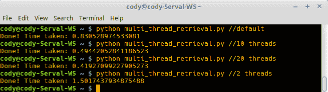

默认的线程数（4）比 10 个单线程调用的平均值快约 3.5 倍：

+   +   使用 10 个线程，速度提升接近 6 倍。

    +   当有 20 个线程时，我们达到了收益递减的点。在这种情况下，速度提升仅为 7 倍。这是有道理的，因为列表中只有 10 个 URL。

    +   为了好玩，我们发现使用两个线程可以带来 2 倍的速度提升。这同样是有道理的，因为我们有双倍的工人数量。

# 还有更多...

虽然多线程有好处，但重要的是要认识到在什么情况下多线程是有益的，在什么情况下它是一个负担。

# 优点

多线程带来了一些优势，这也是为什么它成为许多开发者非常受欢迎的选择的原因：

+   当进程生成新线程时，繁重的工作已经由进程完成。新线程不需要像分叉程序那样复制整个程序，内存需求低，因此几乎没有性能开销。如果你查看任务管理器或在 Linux 中查看线程，你会看到数百或甚至数千个线程正在使用，但你的系统仍然响应。

+   与处理实际进程相比，编程线程相对容易。

+   线程可以使用共享内存空间，由父进程控制。这个内存空间是线程之间如何相互通信和共享数据的方式。在 Python 中，这意味着全局命名空间、对象传递和程序范围内的组件（如导入的模块）对所有给定进程的每个线程都是可用的。

+   线程编程在操作系统之间是可移植的。正如所提到的，Windows 不直接支持进程分叉，但每个操作系统都支持线程。编写一次代码，它就可以在任何地方运行。

+   对于 I/O 限制的应用程序来说是一个好的选择，因为应用程序的响应性得到了提高。

# 缺点

然而，多线程也有一些缺点。一些是多线程范式的固有缺点，而其他（如 GIL）则是特定于 Python 的：

+   线程不能直接启动另一个程序。它们只能并行调用由它们产生的程序中的函数或方法，也就是说，线程只能利用和与其父进程的组件交互，但不能与其他程序一起工作。

+   线程必须通过同步和队列来竞争，以确保操作不会阻塞其他操作。例如，每个程序只有一个`stdin`、`stdout`和`stderr`可用，并且该程序的所有线程都必须共享这些接口，因此管理线程冲突可能会成为一个问题。

+   **全局解释器锁**（**GIL**）是许多线程程序员的噩梦。简单来说，GIL 阻止多个线程同时在 Python 解释器环境中运行。虽然操作系统可能有成百上千个线程，但 Python 程序一次只能利用 Python 环境。当一个 Python 线程想要执行工作，它必须锁定解释器直到工作完成。然后，下一个线程获得对解释器的访问并依次锁定。换句话说，你可以有多线程，但你不能有真正的、同时的操作。正因为如此，线程不能跨多个 CPU 分割；你只能在单个 CPU 内进行多线程。

+   共享内存意味着崩溃/行为不当的线程可能会破坏数据并损坏父进程。

# 如何实现多进程

Python 中的多进程涉及启动独立的进程，这与分叉类似。这绕过了全局解释器锁（GIL）及其对多个线程的影响，但你必须处理增加的内存使用量和为所有进程产生的多个 Python 解释器实例的开销。然而，在多核系统中，多进程可以利用不同的 CPU，从而实现真正的并行处理；更多的核心=更多的处理能力。

由于没有足够的空间涵盖关于并行 Python 编程的所有内容（关于这个主题已经写出了整本书），我将通过演示如何使用`Pool()`来自动化多进程来结束这一章，`Pool()`可以自动控制工作进程。`Pool()`接受多个输入参数，其中最重要的可能是进程数。默认情况下，`Pool()`使用系统上所有可用的 CPU。这很有用，因为如果你的系统升级了，你的程序将自动使用更多的处理能力，而无需重写。

# 如何做到这一点...

1.  使用`pool()`是与多进程一起工作的最简单方法，因为你不必手动生成进程并控制它们之间的交互。显然，这限制了你的程序，因为你必须弄清楚如何编写程序以利用`pool()`，而手动控制则给你更多的灵活性。`multi_process_retrieval.py`演示了如何使用`pool()`来分配工作：

```py
        import urllib.request, urllib.error 
        from multiprocessing.dummy import Pool 
        import time

        start_time = time.time()

        urls = ["https://www.python.org", 
                "https://www.google.com", 
                "https://www.techdirt.com",
                "https://www.facebook.com",
                "https://www.ibm.com",
                "https://www.dell.com",
                "https://www.amd.com",
                "https://www.yahoo.com",
                "https://www.microsoft.com",
                "https://www.apache.org"]

        # Make the Pool of workers
        pool = Pool(4) 

        # Open the urls in their own process
        try:
            pool.map(urllib.request.urlopen, urls)
        except urllib.error.HTTPError:
            pass

        #close the pool and wait for the work to finish 
        pool.close() 
        pool.join() 

        print('Done! Time taken: {}'.format(time.time() - start_time))
```

+   +   和之前一样，我们将访问相同的网站，因此需要导入`urllib`模块和`time`。我们还需要从`multiprocessing`模块导入`Pool()`。

    +   再次，我们记录开始时间，以便计算检索所需的时间。

    +   和多线程示例一样，我们创建了一个工人池；这次是四个。在这种情况下，`multiprocessing.pool()`需要更少的设置：分配一个`Pool()`实例就足够了。至少对于像这样的简单程序，不需要处理队列。

    +   我们使用`try...except`块来启动池中的工人，以防访问网站时出现问题。在这个例子中，我们使用`map()`将每个 URL 放入列表中，并使用`urlopen`进程。

    +   关闭工人池，并将它们连接起来，这样主进程就会暂停，直到其他进程完成。

    +   最后，打印出所花费的时间。

1.  下面的截图显示了部分样本结果：

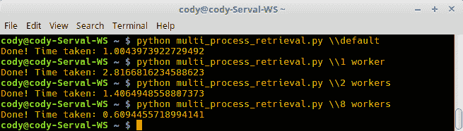

+   +   使用我们给池提供的默认值（四个工人），结果大约是 1 秒。这和多线程相似；虽然可以归因于网络连接的不稳定性，但启动较重的进程而不是轻量级的线程会有一些开销。

    +   将池减少到 1 个工人，所需时间大约为 3 秒。再次，这相当于单线程应用程序 10 次运行的平均时间，这是有道理的，因为这正是同一件事。

    +   将池增加到两个工人，所需时间大约是单个工人的时间的一半，正如预期的那样。

    +   使用 8 名工人可以得到比 4 名工人多一半的时间，这表明处理时间随着可以投入的 CPU 数量的增加而线性减少。

1.  由于作者的计算器有八个核心，所以使用 8 名工人可能是在性能方面我们能期望的最好的了。为了确认这一点，以下展示了向池中投入更多工人的结果：

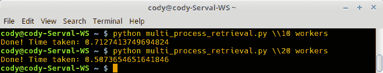

+   +   使用 10 名工人（比可用的 CPU 数量多两个），实际上速度比使用 8 名工人还要慢。

    +   然而，使用 20 名工人，程序速度提高了 16%。实际上，速度差异是由于网络问题，而不是计算机速度。再次，由于只有八个核心，将更多工人放入池中并没有帮助，因为只能同时执行八个工人的任务。

# 还有更多...

关于`multiprocessing.pool()`需要注意的一点是：如果你没有提供一个整数参数来指定池中工人的数量，程序将默认使用系统中可用的所有 CPU。如果你有一个双核系统，你会得到两个工人。如果你有一个拥有 48 个核心的怪物级系统，那么你会得到 48 个工人。

当涉及到核心时，如果你有支持超线程的英特尔 CPU，每个单独的 CPU 在多进程处理时都算作两个。所以，如果你计划编写大量的并行化软件，可能最好多花些钱，以最大化你能够获得的超线程 CPU 数量。

`map()` 函数是一个将另一个函数应用于序列（通常是列表）的函数。它需要一点时间来习惯（至少对我来说是这样的），但一旦你弄明白了，它也是一个很好的快捷方式。以使用单线程网络检索代码为例，你可以将 `for` 循环重写为 `map(urllib.request.urlopen, urls)`。重要的是要记住，你传递给函数的项目必须是一个序列（列表、元组、字典等），否则你会得到一个错误。

将 `map()` 与 `Pool()` 结合使用可以消除你通常必须做的许多手动模板。不过，需要注意的是，你可能需要调整创建的进程数量。虽然 `Pool()` 默认使用它找到的所有 CPU，但你也可以给它一个整数参数，明确地告诉它要启动多少个进程，即多于或少于你实际拥有的 CPU 数量。为了获得最佳性能，你必须调整你的程序，直到你得到递减的回报。

如果你的程序将要长时间运行，这也是很重要的。如果你打算在你的主计算机上运行它，你不想用尽所有的处理能力，否则这会使你的计算机不可用。当刚开始学习如何编写并行程序时，这位作者的双核系统在测试多进程和单进程性能差异时，超过 20 分钟都无法使用。

# 使用 Python 的数学模块

在本章中，我们将介绍 Python 的 `math` 模块以及其中提供的各种数学函数。我们还将讨论与数学相关的模块，包括密码学和统计学。具体来说，我们将讨论以下主题：

+   使用数学模块的函数和常量

+   处理复数

+   提高十进制数

+   使用分数提高精度

+   处理随机数

+   使用 secrets 模块

+   实现基本统计

+   使用 comath 提高功能

Python 使用一系列抽象基类来表示类似数字的类。虽然由抽象类定义的类型不能实例化，但它们被用来创建一个数字子类塔：number -> complex -> real -> rational -> integral。

原因是为了允许接受数字作为参数的函数确定参数的性质，从而允许在不进行用户干预的情况下应用后端功能。例如，切片需要参数为整数，而 math 模块函数需要实数作为参数。通过确保使用这些数字类，Python 可以提供固有功能，例如算术运算、连接等，这些功能由使用的类型确定。

# 使用 math 模块中的函数和常量

Python 的 `math` 模块是内置的；因此，它总是可用于导入。它包含的数学函数由 C 标准定义，所以如果有什么问题，请责怪 C 开发者。

复数由一个单独的模块 (`cmath`) 处理，因此 math 模块只能用于整数和浮点数。这是故意为之的，因为处理复数比大多数人需要的通用函数要复杂得多。除非另有说明，所有数学参数都可以是整数或浮点数。

# 如何做到这一点...

1.  `ceil(x)` 函数返回大于等于 `x` 的最小整数。不使用常规的数学舍入，因此 `12.3` 将被舍入到 `13`，而不是从 `12.5` 开始向上舍入；任何大于 `x.0` 的值都将向上舍入到下一个值，如下面的截图所示：

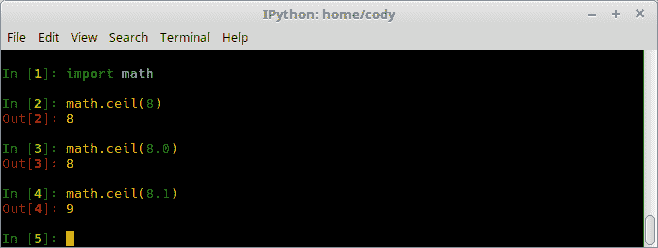

1.  `copysign(x, y)` 函数返回一个具有 `x` 的绝对值但具有 `y` 符号的浮点值。如果操作系统支持有符号的零，则 `copysign(1.0, -0.0)` 将给出 `-1.0` 的值，如下面的截图所示：

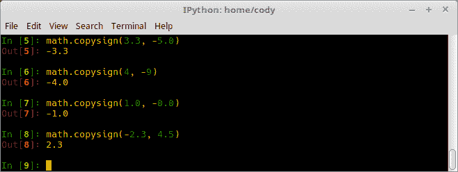

1.  `fabs(x)` 函数返回一个参数的绝对值，实际上是从参数中移除了符号：

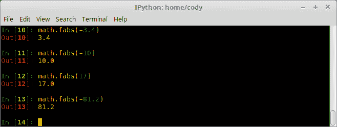

1.  `factorial(x)` 函数返回 `x` 的阶乘；如果参数不是整数或为负数，将生成错误：

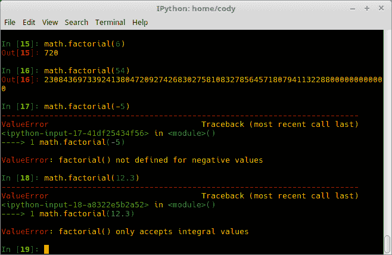

1.  `floor(x)` 函数返回小于等于 `x` 的最大整数。与 `ceil` 类似，常规舍入被忽略；在这种情况下，浮点值被截断，转换为整数：

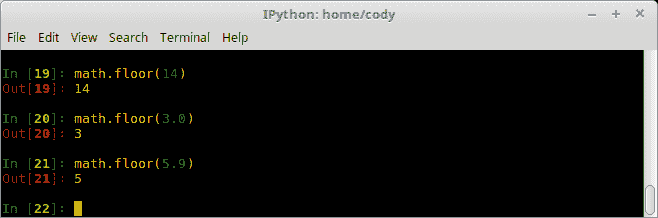

1.  `fmod(x, y)` 函数返回两个参数的模数。这是由操作系统的 C 库定义的，因此结果可能因平台而异。它与正常的 `x % y` 操作不同，因为 `fmod` 返回一个与 `x` 具有相同符号的结果，并且对于浮点类型在数学上是精确的；正常的模数返回一个具有 `y` 符号的结果，可能会产生舍入错误。因此，对于浮点类型应使用 `fmod`，而对于整数应使用正常的模数：

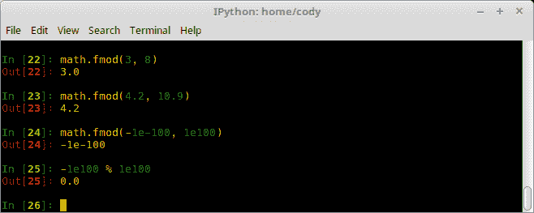

在这里，*第 24 行* 显示 `fmod` 可以提供包括符号在内的大指数值的正确值。*第 25 行* 显示了正常模运算的结果，它四舍五入到错误为零的值。

1.  `frexp(x)` 函数返回 `x` 的尾数（数字的小数部分）[`m`] 和指数 [`e`]。`m` 是一个浮点数，`e` 是一个整数，使得 `m * 2**e = x`。此函数通常用于以可移植的方式查看浮点值的内部表示：


1.  `fsum(iterable)` 函数返回一个可迭代对象中值的浮点数总和。通过跟踪中间部分总和来避免默认 `sum()` 函数中发现的精度问题，尽管准确性取决于操作系统，因为后端 C 库可能会引起舍入错误：

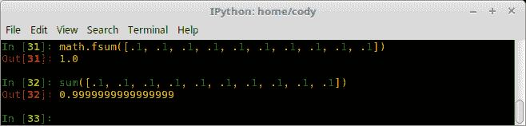

1.  `gcd(a, b)` 函数返回两个整数参数的最大公约数：

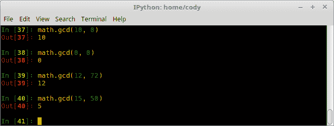

1.  `isclose(a, b, *, rel_tol=1e-09, abs_tol=0.0)` 函数如果 `a` 和 `b` 在数值上彼此接近则返回 `True`，如果不接近则返回 `False`。*足够接近* 的确定来自相对和绝对容差。

    相对容差 (`rel_tol`) 是允许的参数之间的最大差异，相对于 `a` 或 `b` 的较大绝对值。默认值确保两个参数值在九位小数处相同。

    绝对容差 (`abs_tol`) 是允许的最小差异；它在比较接近零的值时特别有用：

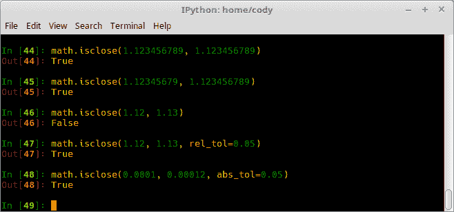

+   +   *第 44 行* 只是一个简单的检查，它比较了完全相同的值。

    +   *第 45 行* 将第一个参数四舍五入到第八位小数，并使用默认值进行比较。

    +   *第 46 行* 在两位小数处比较值。使用默认值，它们的值并不接近，尽管它们只相差 1/100。

    +   *第 47 行* 使用与 *第 46 行* 相同的值，但将相对容差更改为 5%。这个变化使得它们被认为是彼此接近的。

    +   *第 48 行* 做了类似的事情，但它是在查看接近零的值，因此绝对容差从 0% 不同更改为 5%。

1.  `isfinite(x)` 函数如果 *`x`* 是有限数，即不是 `inf` 或 `NaN`，则返回 `True`；只有当参数是无限或不是数字时才返回 `False`。数字 0.0 被认为是有限数：

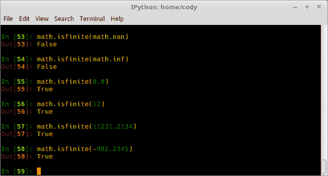

1.  `isinf(x)` 函数如果参数是 `±∞` 则返回 `True`；对于任何其他值返回 `False`：

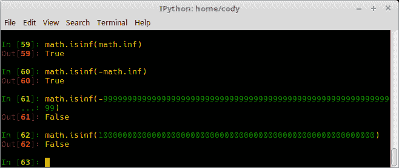

1.  `isnan(x)` 函数如果参数是 `NaN`（非数字）则返回 `True`，否则返回 `False`：

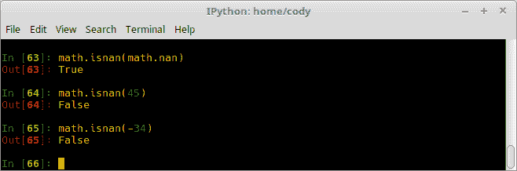

1.  `ldexp(x, i)` 函数是 `frexp()` 的逆函数，返回 `x * 2^i`：

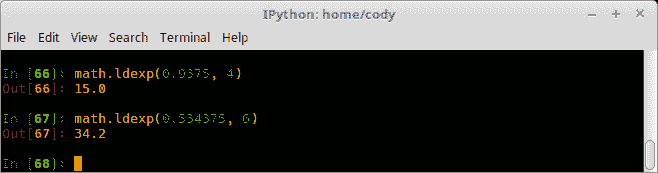

前一个截图使用了之前的 `frexp()` 截图的结果，展示了如何反向操作以找到原始浮点值。

1.  `modf(x)` 函数返回参数的整数部分和小数部分；两个返回值都是带有参数符号的浮点数：


注意到小数部分有舍入误差。将结果限制在所需的最小精度可能有助于减轻显示时的这个问题，但使用原始值进行计算可能会导致计算过程中出现显著的误差传播。

1.  `trunc(x)` 函数返回实数的截断整数部分，即它将浮点数转换为整数：


1.  `exp(x)` 函数返回 `e^x`，其中 `e` 是自然对数：


1.  `expm1(x)` 函数返回 `e^x - 1`。这主要用于 `x` 的较小值，因为手动计算可能会导致精度损失。使用 `expm1()` 可以保持精度，而不会出现舍入误差：


当指数为 `-9`，即 `0.000000001` 时，手动创建公式 `e^x - 1` 会出现显著的舍入误差。使用 `expm1` 可以保持完全精度。

1.  `log(x[, base])` 函数在提供一个参数时返回 `x` 的自然对数；提供两个参数时返回 `x` 到给定底数的对数：


1.  `log1p(x)` 函数返回 `1 + x` 的以 `-e` 为底的对数。当 `x` 接近零时，结果计算以最大化精度：


1.  `log2(x)` 函数返回 `x` 的以 `-2` 为底的对数。这比使用 `log(x, 2)` 更准确：


如此截图所示，当参数的小数位数超过 30 时，`log2` 的精度才真正成为一个因素。

1.  `log10(x)` 函数返回 `x` 的以 10 为底的对数。像 `log2` 一样，它通常比 `log(x, 10)` 更准确：


在这种情况下，示例表明当参数超过 40 位小数时，精度会有所不同。当然，具体结果会根据使用情况而有所不同，因此最好使用模块提供的函数。

1.  `pow(x, y)` 函数返回 `x^y`。`math.pow()` 函数将参数转换为浮点类型；要计算精确的整数值，请使用内置的 `pow()` 函数或 `**` 运算符：


+   +   第 116 行和第 117 行比较了使用内置的 `pow` 与 `math.pow` 的输出：

    +   *第 119 行* 和 *第 120 行* 显示了底层库中的差异。当任一参数为零或 `NaN` 时，结果为 `1.0`，即使预期会出现错误。虽然 Python 尽可能遵循 C99 标准，但存在限制，这是其中之一。

1.  `sqrt(x)` 函数返回 `√x`：


如 *第 123 行* 所示，取负数的根会产生错误，这是预期的。要处理负数的平方根，必须使用 `cmath` 模块。

1.  `acos(x)` 函数返回 `x` 的反余弦值，以弧度为单位：


如预期，参数 `>1` 将返回错误，因为当从弧度转换为十进制时，值总是小于一。

1.  `asin(x)` 函数返回 `x` 的反正弦值，以弧度为单位：


再次强调，值 `>1` 会导致错误，因此请确保首先将您的参数转换为正确的弧度值。

1.  `atan(x)` 函数返回 `x` 的反正切值，以弧度为单位：


1.  `atan2(y, x)` 函数返回 `atan(y / x)` 的结果，以弧度为单位，介于 `-π` 到 `π` 之间。从原点到 `(x,y)` 的向量形成第一象限的角度，即正 *X* 轴。这意味着 `atan2` 可以计算角度的正确象限，因为已知两个参数的符号：


1.  `hypot(x, y)` 函数返回边长为 `x` 和 `y` 的三角形的斜边长度*.* 这实际上是勾股定理的快捷方式：*√(x² + y²)*：


1.  `cos(x)` 函数返回 `x` 的余弦值，以弧度为单位。

1.  `sin(x)` 函数返回 `x` 的正弦值，以弧度为单位。

1.  `tan(x)` 函数返回 `x` 的正切值，以弧度为单位。

1.  `degrees(x)` 函数将参数从弧度转换为度：


1.  `radian(x)` 函数将度转换为弧度：


1.  为了节省空间，我不会提供所有以下函数的示例，但这里是一个 Python 中可用的双曲三角函数列表：`acosh(x)`*,* `asinh(x)`*,* `atanh(x)`*,* `cosh(x)`*,* `sinh(x)`*,* 和 `tanh(x)`。这些函数与常规三角函数的操作方式相同，只是它们用于双曲线而不是圆。

1.  `erf(x)` 函数返回 `x` 处的错误函数，即高斯误差函数。这用于计算统计函数，例如累积标准正态分布，如 [`docs.python.org/3/library/math.html`](https://docs.python.org/3/library/math.html) 中所示：


1.  `erfc(x)` 函数返回在 `x` 处的补余误差函数，定义为 `1.0 - erf(x)`。这在 `x` 的值很大时使用，因为减法会导致显著性损失：


1.  `gamma(x)` 函数返回 `x` 处的伽玛函数：


1.  `lgamma(x)` 函数返回在 `x` 处伽玛函数的绝对值的自然对数：


1.  `pi` 代表 Pi（3.14...）在操作系统可用精度下的值。

1.  `e` 代表欧拉数（2.718...）在系统可用精度下的值。

1.  `tau` 代表常数 `2pi`（6.28...）在系统可用精度下的值。

1.  `inf` 代表浮点类型 `∞`。`- ∞` 用 `-inf` 表示。

1.  `nan` 代表浮点类型 `not a number`。

# 复数的处理

因为复数，即具有虚数部分的数，不能与常规的数学模块函数一起使用，所以 `cmath` 模块可用于这些特殊数字。

作为内置模块，它始终可用于导入。值得注意的是，函数接受整数、浮点数和复数作为参数。它们还将接受任何具有 `__complex__()` 或 `__float__()` 方法的 Python 对象，作为其类的一部分。

在支持有符号零的系统上，分支切割（[`en.wikipedia.org/wiki/Branch_point#Branch_cuts`](https://en.wikipedia.org/wiki/Branch_point#Branch_cuts)）在切割的两侧都是连续的，因为零的符号指定了分支在切割的哪一侧。在不支持有符号零的系统上，下一节中特定函数的连续性被标记。

# 如何做到这一点...

以下函数和常数与它们的常规数学类似物操作相同，除非有说明：

+   `exp(x)`: 计算数学常数 `e` 的 `x` 次幂。

+   `log(x[, base])`: 存在一条分支切割——从 `0` 沿负实轴到 `-∞`，并从上方连续。

+   `log10(x)`: 与 `log` 具有相同的分支切割。

+   `sqrt(x)`: 与 `log` 具有相同的分支切割。

+   `acos(x)`: 两条分支切割——一条从 `1` 沿实轴到 `∞`，并从下方连续。另一条从 `-1` 向左延伸到 `-∞`，并从上方连续。

+   `asin(x)`: 与 `acos` 具有相同的分支切割。

+   `atan(x)`: 两条分支切割：一条从 `1j` 沿虚轴到 `∞j`，并从右侧连续。另一条从 `*-*1j` 到 `-∞j`，并从左侧连续。

+   `cos(x)`: 计算 `x` 的余弦值。

+   `sin(x)`: 计算 `x` 的正弦值。

+   `tan(x)`: 计算 `x` 的正切值。

+   `acosh(x)`: 从 `1` 到左侧沿实轴到 `-∞` 有一条分支切割，从上方连续。

+   `asinh(x)`: 两条切割——一条从 `1j` 沿虚轴到 `∞j`，并从右侧连续。另一条从 `-1j` 沿虚轴到 `-∞j`，并从左侧连续。

+   `atanh(x)`: 两个切线——一个从 1 到实数 `∞`，从上方连续。另一个从 `-1` 到实数 `-∞`，从上方连续。

+   `cosh(x)`: 计算 `x` 的双曲余弦。

+   `sinh(x)`: 计算 `x` 的双曲正弦。

+   `tanh(x)`: 计算 `x` 的双曲正切。

+   `pi`: 返回数学常数 π 作为数字。

+   `e`: 返回数学常数 *e* 作为数字。

+   `tau`: 返回数学常数 τ 作为数字。

+   `inf`: 表示浮点值 `∞`。

+   `nan`: 表示浮点值 "不是一个数"。

`cmath` 模块中的新常数包括以下内容：

+   `infj`: 常数复数，实部为 0，虚部为 `∞j`

+   `nanj`: 常数复数，实部为 0，虚部为 `NaN`

`cmath` 模块支持极坐标。在 Python 中，`z` 代表实部 `z.real` 和虚部 `z.imag`。使用极坐标，`z` 由模数 `r` 和相位角 `φ`（phi）定义：

+   `phase(x)` 函数返回 `x`（作为复数提供）的相位；返回值是一个浮点数。结果在 -π 和 π 范围内，分支切线沿负实轴，从上方连续：


+   `polar(x)` 函数返回 `x` 在极坐标中的相位，作为一个 `(r, φ)` 对：


+   `rect(r, phi)` 函数返回复数 `x` 作为 (实部, 虚部) 对：


# 改进十进制数

Python 的内置十进制模块提供了对快速、精确浮点计算的改进支持。普通浮点类型基于二进制对象；十进制浮点数完全不同。具体来说，它通过以下方式改进了普通浮点类型：

+   按照人们在学校学习的方式操作，而不是强迫人们适应新的算术范式。

+   准确表示十进制值，而不是得到如下结果：


+   确保在计算过程中保持十进制值的精确性，防止舍入误差累积。

+   考虑有效数字，例如，1.20 + 2.10 = 3.20，而不是 3.2，以及 1.20 * 1.30 = 1.5600。

+   允许用户指定精度，最高 28 位。这与 float 不同，float 的精度取决于平台。

+   普通的二进制浮点类型只向用户暴露了一小部分功能。十进制浮点数暴露了标准中所有必需的部分，允许完全控制所有计算。

+   支持精确的定点算术和四舍五入的浮点算术。

十进制浮点数有三个主要概念：十进制数本身、算术上下文和信号处理。十进制数是不可变的、有符号的且是有效的，即尾随零不会被截断。算术上下文指定诸如精度、舍入、指数限制等事项。信号是异常条件，其处理取决于应用需求。

# 如何做到这一点...

因为官方文档([`docs.python.org/3/library/decimal.html`](https://docs.python.org/3/library/decimal.html))包含超过 35 页，本节将只简要介绍十进制模块：

1.  当使用十进制模块时，弄清楚当前条件并如有必要进行修改是个好主意：


在这种情况下，`getcontext`告诉我们以下信息：

1.  +   系统设置为 28 位精度。

    +   舍入到最近的整数，如果存在平局，则舍入到最近的偶数整数。

    +   Emin 和 Emax 是指数允许的底部/顶部限制。

    +   使用大写字母表示指数，例如，*1.2E+12*。

    +   限制设置为允许指数调整到最多`Emax`。

    +   标志监控异常条件，直到明确清除。这也是检查上下文是首先要做的事情之一的原因，以确保没有设置不希望设置的标志。

    +   捕获指定的条件，并在条件发生时引发错误。

1.  十进制可以从整数、浮点数、字符串或元组创建：


1.  一个值得使用的信号是`FloatOperation`，因为它会在构造函数或排序比较中混合十进制和浮点数时发出警告：


1.  当声明新的`Decimal`时，小数点的意义仅由提供的数字位数确定。舍入和精度仅在算术操作期间适用：


注意，精度值为 4 表示只显示四位数字，无论小数点后提供多少位数值。

1.  下面是一个简例，说明十进制对象如何与其他 Python 对象交互：


# 使用分数提高精度

`fractions`模块为 Python 添加了对有理数算术的支持。而不是使用*x/y*来表示分数，可以写出真正的、精确的分数；前者方法返回一个浮点类型，可能或可能不是真正准确的。

可用构造函数从整数对、另一个分数、浮点数、十进制或字符串创建分数。如果分母为 0，则生成`ZeroDivisionError`。

# 如何做到这一点...

分数类有以下属性和方法可用：

+   `numerator`：这返回最低项中的分子。

+   `denominator`：这返回最低项中的分母。

+   `from_float(float)`: 这是一个构造函数，它接受一个浮点数类型并创建一个表示参数精确值的分数。通常直接从浮点数创建分数实例会更简单。

+   `from_decimal(dec)`: 这是一个构造函数，它接受一个十进制实例并创建一个表示参数精确值的分数。通常直接从十进制实例创建分数实例会更简单。

+   `limit_denominator(max=1000000)`: 这个函数返回一个与参数最接近的分数，其分母不大于`max`。这对于近似浮点数很有用。

+   `__floor__()`: 这个函数返回小于等于分数的最大整数。它也可以通过`math.floor()`访问。

+   `__ceil__()`: 这个函数返回大于等于分数的最小整数。它也可以通过`math.ceil()`访问。

+   `__round__(); __round__(n)`: 第一个方法返回最接近分数的整数，四舍五入到偶数。第二个方法将分数四舍五入到最接近的`Fraction(1, 10**n)`的倍数，四舍五入到偶数。它也可以通过`round()`访问。

+   `gcd(a, b)`: 这个函数返回两个参数的最大公约数。自`v3.5`以来已弃用，取而代之的是`math.gcd()`。

下面的截图显示了分数模块的一些用例：


# 处理随机数

以数学为导向的`random`模块使用**伪随机数生成器**（**PRNG**）用于各种应用。它旨在用于建模和仿真目的，不应用于任何安全或密码学程序。

PRNGs 使用种子值作为生成器的参数。这允许重新创建随机化场景或确定序列中下一个生成的随机值；因此，它们不是密码学安全的。PRNG 的一个常见应用是在安全密钥链中；密钥链中的 PRNG 提供了与服务器上相同的种子值。因此，服务器和密钥链将在完全相同的时间拥有相同的数字，允许用户将数字作为第二种身份验证方式输入。

# 如何做到这一点...

注意，这里提供了生成命令输出时的示例。还请注意，由于这些是随机值，您的结果可能会有所不同：

+   `seed(a=None, version=2)`函数初始化伪随机数生成器（PRNG）。如果`a`为`None`，将使用任何可用的基于系统的随机数源来生成种子；否则，使用当前系统时间作为种子值。如果`a`是一个整数，则它将直接用作种子值。

    `version`可以是 1 或 2。默认是 2，这意味着字符串、字节和字节数组将被转换为整数，并且所有位都将用于种子。如果使用版本 1（在处理 3.2 之前的版本时是必要的），转换为整数将创建一个更小的种子值范围。

+   `getstate()`函数返回一个对象，它捕获 PRNG 的内部状态。

+   `setstate(state)` 函数将内部生成器状态恢复到 `state` 的值。与 `getstate` 一起使用，这允许将 PRNG 设置为先前条件。

+   `getrandbits(k)` 函数返回一个由 `k` 个随机位组成的整数：


+   `randrange(stop); randrange(start, stop[, step])` 函数从一组数字中返回一个随机选择的值；本质上，它将 `range` 函数转换为一个随机数选择器，限于它生成的整数范围：


+   `randint(a, b)` 函数返回一个介于 `a` 和 `b` 之间（包括 `a` 和 `b`）的随机整数：


+   `choice(seq)` 函数从预先制作的序列中返回一个随机元素。与 `randrange` 创建一个数字范围不同；如果序列参数为空，将生成错误。

+   `choices(population, weights=None, *, cum_weights=None, k=1)` 函数返回一个由 `k` 个元素组成的列表，这些元素是从预先制作的 `population` 中有放回地选择的。

+   `weights` 允许根据 `weights` 序列的相对权重进行选择，而 `cum_weights` 则根据序列的累积权重进行选择。如果两个参数都没有提供，则选择基于等概率。

+   `shuffle(x[, random])` 函数就地打乱提供的序列。`random` 函数实际上是一个返回随机浮点数的函数；默认情况下，它是 `random()` 函数。

+   `sample(population, k)` 函数返回一个由 `k` 个唯一元素组成的列表，这些元素来自提供的序列或集合；它提供了随机抽样不重复的功能。它返回一个新列表，包含来自原始序列的元素，而不影响原始序列。

+   `random()` 函数返回一个介于 0.0（包括）到 1.0（不包括）之间的随机浮点数。

+   `uniform(a, b)` 函数返回一个介于 `a` 和 `b` 之间的随机浮点数，包括 `a` 和 `b`。

+   `triangular(low, high, mode)` 函数返回一个介于 `low`（默认为 0）和 `high`（默认为 1）之间的随机浮点数，具有指定的 `mode`（默认为中间值）。

+   `betavariate(alpha, beta)` 函数基于 `alpha` 和 `beta`（均大于 0）创建一个贝塔分布。返回的值介于 0 和 1 之间。

+   `expovariate(lambd)` 函数创建一个指数分布。`lambd` 是期望平均值除以 1.0，且不应为零。如果 `lambd` 为正，则返回的值是 0 到 ∞；如果为负，则返回 -∞ 到 0。

+   `gammavariate(alpha, beta)` 函数基于 `alpha` 和 `beta`（均大于 0）创建一个伽马分布。

+   `gauss(mu, sigma)` 函数创建一个高斯分布（钟形曲线）；`mu` 是均值，`sigma` 是标准差。此函数比 `normalvariate()` 快，但仅略快，因为它不是线程安全的。

+   `lognormvariate(mu, sigma)` 函数创建一个对数正态分布；`mu` 可以是任何值，但 `sigma` 必须大于 0。

+   `normalvariate(mu, sigma)` 函数创建一个正态分布；`mu` 是均值，`sigma` 是标准差。这是线程安全的，以避免竞争条件。

+   `vonmisesvariate(mu, kappa)` 函数创建一个**双变量冯·米塞斯**（**BVM**）分布来描述环面上的值；`mu` 是均值角度，用弧度表示，介于 0 和 2π之间，`kappa` 是集中参数，其值大于等于 0。如果`kappa` = 0，则此分布简化为 0 到 2π范围内的均匀随机角度。

+   `paretovariate(alpha)` 函数创建一个帕累托分布；`alpha` 是形状参数。

+   `weibullvariate(alpha, beta)` 函数创建一个韦伯分布；`alpha` 是尺度参数，`beta` 是形状参数。

+   `SystemRandom([seed])` 函数使用`os.urandom()`从操作系统源创建随机数，但并非所有系统都提供。因为它不是基于软件的，所以结果是不可重复的，也就是说，这是用于真正随机数的情况，例如加密。

下面的截图包含了一些`random`函数操作的示例：


# 使用`secrets`模块

此模块虽然不属于数学集，但很重要，因为它生成的是加密安全的随机数。因此，我们将探讨这个模块与随机模块的不同之处。

# 如何做到...

+   `SystemRandom` 类与`random.SystemRandom` 类相同，即它提供随机数并使用系统最佳质量的随机种子源。

+   `choice(sequence)` 方法也像`random.choice()`方法一样工作。

+   `randbelow(n)` 函数返回一个在范围 `[0, n)` 内的随机整数。

+   `randbits(k)` 方法返回一个具有`k`个随机位的整数。

+   `token_bytes([nbytes=None])` 函数返回一个随机字节字符串。如果没有提供`nbytes`，则使用合理的默认值；如果提供了，返回的字符串包含那么多字节。

+   `token_hex([nbytes=None])` 函数返回一个十六进制随机文本字符串。字符串中使用的字节被转换为每个字节两个十六进制数字。

+   `token_urlsafe([nbytes=None])` 函数返回一个随机的、URL 安全的文本字符串，该字符串由随机字节组成。该字符串是 Base64 编码的，因此平均返回的字节大约是 1.3 个字符。

+   `compare_digest(a, b)` 函数如果参数相等则返回`True`，如果不相等则返回`False`。其功能是减少使用时间攻击的能力。

+   下面是一些使用`secrets`模块部分的示例：


+   +   *第 3 行* 创建了一个包含 ASCII 字母表中所有字母和所有数字的字符串。

    +   *第 4 行* 创建了一个由前一个字符串中所有可用的字母数字值组成的 12 个字符的简单密码。

    +   *第 6 行* 创建了一个更复杂的密码，至少包含一个大小写字母和一个至少包含五个数字。

    +   *第 8 行* 创建了一个足够强大的令牌，可用于网站的密码恢复/重置。

# 实现基本统计

从版本 3.4 开始，Python 提供了基本统计工具。虽然它们远不如 NumPy、SciPy、Pandas 等全面，但在需要执行简单计算而不想使用或无法访问高级数值模块时很有用。

# 如何做到这一点...

注意，以下截图中的`import`语句被省略了：

1.  `mean(data)`函数返回序列或迭代器的正常平均值：


+   +   *第 3 行* 是整数的平均值。

    +   *第 4 行* 是浮点数的平均值。

    +   *第 6 行* 和 *第 8 行* 显示，分数可以平均，也可以是小数。

1.  `harmonic_mean(data)`函数返回序列或迭代器的调和平均值。调和平均值是参数倒数算术平均值的倒数，通常在需要平均速率或比率时使用。

例如，如果一辆车以 60 英里/小时的速度行驶了给定距离，然后以 50 英里/小时的速度返回同样的距离，其平均速度将是 60 和 50 的调和平均数，即 2/(1/60 + 1/50) = 54.5 英里/小时：


这非常接近 55 英里/小时的常规平均值，所以让我们看看一个更大的差异，比如 20 英里/小时和 80 英里/小时：


在这个例子中，调和平均数更合适的原因是，正常的算术平均数没有考虑到完成相同距离所需的时间，也就是说，以 20 英里/小时的速度行驶给定距离所需的时间是 80 英里/小时的四倍。

如果距离是 120 英里，那么以 20 英里/小时的速度行驶需要六小时，而以 80 英里/小时的速度只需要一个半小时。总行程将是 240 英里，总时间是 7.5 小时。240 英里/7.5 小时 = 32 英里/小时。

1.  `median(data)`函数返回序列或迭代器的中间值：


+   +   *第 19 行* 说明了当数据点的数量为偶数时，返回两个中间值的平均值。

    +   当数据点的数量为奇数（*第 20 行*）时，则返回中间值。

1.  `median_low(data)`函数返回序列或迭代器的低中位数。当数据集包含离散值且希望返回的值是数据集的一部分时使用：


+   +   如果数据集是奇数（*第 21 行*），则返回中间值，就像正常的平均值一样。

    +   如果数据集是偶数（*第 22 行*），则返回两个中间值中较小的一个。

1.  `median_high(data)`函数返回序列或迭代器的高中位数。当数据集包含离散值且希望返回的值是数据集的一部分时使用：


+   +   *第 23 行* 显示，如果数据集是偶数，则返回两个中间值中较大的一个。

    +   *第 24 行* 显示当数据中有奇数个值时，返回正常的中位数。

1.  `median_grouped(data, interval=1)` 函数返回一组连续数据的平均值，使用插值并在第 50 百分位计算：


在此屏幕截图中，组别为 5-15，15-25，25-35 和 35-45，显示的值位于这些组的中部。中间值位于 15-25 组，因此必须进行插值。通过调整间隔，即调整组距，插值结果会改变。

1.  `mode(data)` 函数从 `data` 返回最常见值，并假设 `data` 是离散的。它可以用于数值或非数值数据：


+   +   *第 30 行* 显示如果没有单个值具有最大的计数，将生成错误。

1.  `pstdev(data, mu=None)` 函数返回总体标准差。如果没有提供 `mu`，则自动计算数据集的平均值：


+   +   *第 1 行* 是一个基本的标准差。然而，数据集的平均值可以传递给该方法，因此不需要单独计算（*第 32-34 行*）。

1.  `pvariance(data, mu=None)` 函数返回总体数据集的方差。与 `pstdev` 中相同的参数条件适用。支持小数和分数：


虽然 `mu` 应该是数据集的计算平均值，但传入错误值可能会改变结果（这也适用于 `pstdev`）。

1.  `stdev(data, xbar=None)` 函数与 `pstdev` 具有相同的功能，但设计用于与总体样本一起使用，而不是整个总体。

1.  `variance(data, xbar=None)` 函数提供与 `pvariance` 相同的功能，但应仅用于样本而不是总体。

# 使用 comath 提高功能

PyPi 提供了 `comath` 模块，它为 Python 添加了额外的数学功能。

# 准备工作

可以使用或下载并安装从 [`pypi.python.org/pypi/comath/0.0.3`](https://pypi.python.org/pypi/comath/0.0.3) 的 wheel 包或 `.tar.gz` 文件来安装该模块：

```py
pip install comath
```

# 如何操作...

注意，这里没有显示 `comath` 中的所有函数，因为一些函数需要额外的包，如 NumPy，这超出了本书的范围，或者是对现有 `math` 函数的修改版本：

1.  `array.percentile(sorted_list, percent [, key=lambda x: x])` 函数从排序后的数字列表中返回所需的百分位数（由 `percent` 定义）：


+   +   对于数字列表，*第 4 行* 返回第 10 百分位数。

    +   *第 5 行* 返回第 30 百分位数。

    +   *第 6 行* 返回第 50 百分位数。

    +   *第 7 行* 返回第 75 百分位数。

    +   *第 8 行* 返回第 99 百分位数。

1.  `func.get_smooth_step_function(min_val, max_val, switch_point, smooth_factor)`函数返回一个函数，当其值从给定的切换点到无穷大增加时，该函数会平滑地从最小值移动到最大值。

从图形上看，这看起来像一条 S 形曲线，切换点位于曲线的中间。一个使用示例是取一个音频信号，将其平滑以减少锯齿状并显示显著峰值的位置：


+   +   函数在第 10 行定义。

    +   第 11 行显示`smooth`确实是一个由函数返回的函数。

    +   第 12 行到第 16 行显示了图表上各种位置的返回值。接近中心的位置，结果围绕 1.0，而线段两端的值接近 0（最小端）到接近 2（最大端）。

1.  `func.closest_larger_power_of_2(number)`函数返回大于参数的最接近的 2 的幂：


1.  `metric`模块有四个与度量相关的类，它们都做类似的事情。

+   +   `MovingMetricTracker`类创建一个对象，用于跟踪和计算移动度量值。

    +   `MovingAverageTracker`类创建一个对象来跟踪和计算移动平均值。

    +   `MovingVarianceTracker`类创建一个对象来跟踪和计算移动方差。

    +   `MovingPrecisionTracker`类创建一个对象来跟踪和计算移动精度度量。

1.  虽然它们都测量不同的事物，但用法相同，所以以下截图只演示一个：


+   +   因为所有`Moving*Tracker`类都是抽象的，所以创建一个新类只需要简单地从所需的`comath`类继承（*第 35 行*）。

    +   创建一个实例（*第 36 行*）允许访问抽象类方法（*第 37 行*-*第 40 行*）。在这种情况下，我们只是在计算过程中更新一个计数器，作为值的变化。最终，我们得到计算过程中的平均值。

1.  `segment.LineSegment`类是一个定义一维线段的类。提供了方法来允许对线段进行一些有用的测试：


+   +   第 50 行显示了线段实例的创建。参数是线段的端点。

    +   第 51 行和第 52 行测试`contains()`方法，该方法指示提供的参数是否位于线段的边界内。

    +   第 53 行和第 54 行使用`intersection()`方法返回一个集合。传入一个序列，并只返回那些在线段边界内的值。
