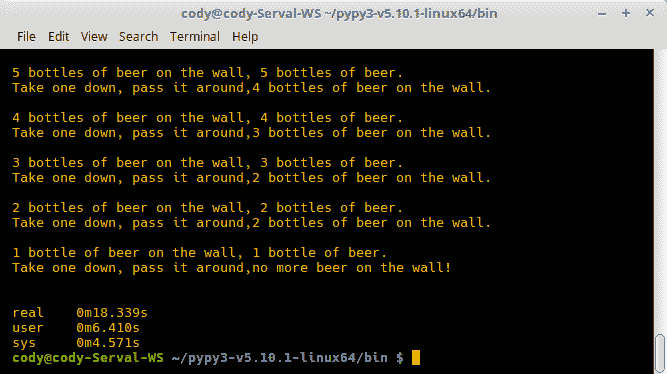
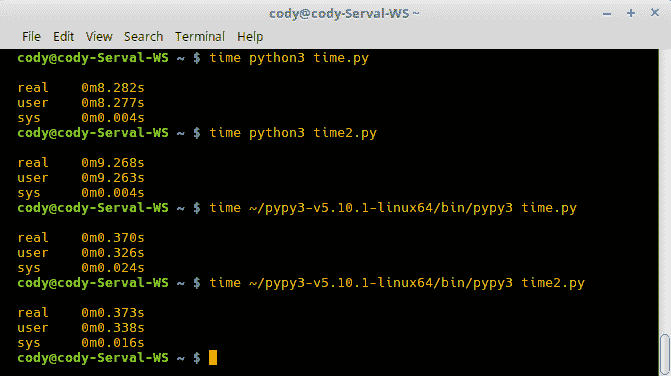
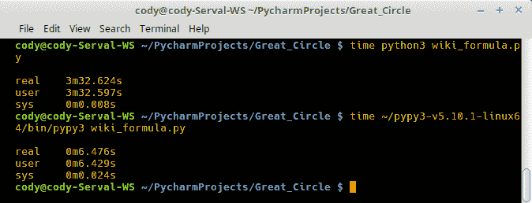
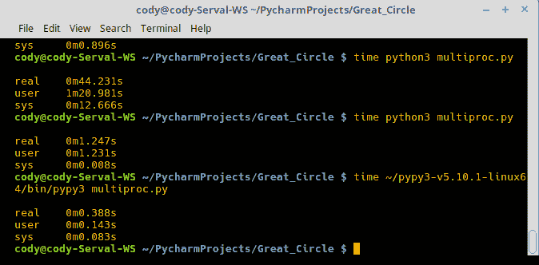

# 使用 PyPy 提高 Python 性能

在本章中，我们将介绍 PyPy，这是 Python 的编译版本，旨在提高 Python 程序的性能。我们将讨论以下内容：

+   什么是 PyPy？

+   什么是 RPython？

+   一些真实世界的例子

# 简介

Python 是一种解释型语言。解释型语言使用中间件来读取源代码并生成特定系统的机器语言。编译型语言使用编译器将源代码直接转换为机器语言；在这个过程中没有中间步骤。

编译型语言的好处是，没有解释步骤，代码可以直接由系统执行，并产生最快的处理时间。此外，编译器能够在将源代码转换为机器代码的过程中查看源代码，并应用优化以使机器代码更快。

例如，如果编译器正在分析源代码，并看到代码在某个特定的循环中花费了大量时间，它可以将代码应用几种优化算法之一来提高性能，例如将单个循环拆分成多个循环，每个循环处理原始循环体的一部分。

相反，解释型语言使程序员的编程生活更加轻松，因为这些语言通常更容易编写，并且它们通常有一个交互式提示，允许开发者在将其放入最终程序之前测试代码。这导致了解释型语言的另一个观点：它们没有编译步骤，因此看到程序的结果几乎是即时的。如果代码中存在错误，开发者会立即知道，而不是在（可能很长的）编译之后。（虽然大多数错误都是在编译过程中由编译器识别的，但也有一些错误不会被捕获，例如在 [`www.learncpp.com/cpp-programming/eight-c-programming-mistakes-the-compiler-wont-catch/`](http://www.learncpp.com/cpp-programming/eight-c-programming-mistakes-the-compiler-wont-catch/) 中识别的错误。)

作为一个快速示例，说明解释型语言和编译型语言之间可能出现的速度差异，以下是一些来自 [`benchmarksgame.alioth.debian.org/u64q/compare.php?lang=python3&lang2=gpp`](https://benchmarksgame.alioth.debian.org/u64q/compare.php?lang=python3&lang2=gpp) 的 C++ 与 Python 的时间比较：

| **任务** | **Python (secs)** | **C++ (secs)** |
| --- | --- | --- |
| π 数字 | 3.43 | 1.88 |
| 反向互补 | 18.79 | 3.08 |
| 正则表达式更新 | 15.22 | 1.61 |
| 曼德布罗特 | 225.24 | 1.51 |

# 什么是 PyPy？

PyPy 是 Python 的另一种实现。虽然正常的 Python 是使用 C 语言构建的（因此有替代术语：CPython），但 PyPy 是基于 **RPython**（**受限 Python**）语言的。RPython 限制了 Python 语言；这些限制意味着 PyPy 可以查看 RPython 代码，将其转换为 C 代码，然后编译成机器代码。

PyPy 的主要方面是**即时编译器**（JIT）。具体来说，它使用跟踪 JIT，该 JIT 监视频繁执行的循环并将它们编译成本地机器代码。由于程序经常花费大量时间在循环中，将这些循环编译成本地代码最大化它们处理数据的速度。

使用 RPython 时，JIT 编译器接收已知的代码，即编译器不需要花费时间解析代码的元数据来确定对象的类型、占用的内存空间等。因此，它能够有效地将 CPython 代码转换为 C 代码，然后转换为系统的本地汇编语言。

虽然对象类型仍然像正常 Python 一样推断，不像静态类型语言那样声明，但每个变量只能与一个类型相关联，并且在代码中不能更改。例如，关于 Python 的一个常见展示是以下都是 Python 中的合法变量赋值；`x`没有关于自己的继承知识，因此可以随时更改：

```py
x = 2
x = "a_string"
```

但在 RPython 中，这不被允许，因为一旦变量被声明，即使像空列表一样，它永远不能更改类型，例如，从列表转换为元组。

由于它与 CPython 不同，使用 PyPy 时可能存在兼容性问题。尽管它们的设计师努力提供两个实现之间的最大兼容性，但有一些已知问题([`pypy.org/compat.html`](http://pypy.org/compat.html))。

PyPy 的主要功能如下：

+   速度：目前，PyPy 的平均速度比 CPython 快 7.6 倍([`speed.pypy.org`](http://speed.pypy.org))。根据模块的不同，速度提升可以达到 98%。请注意，有两种主要情况 PyPy 不会提供速度提升：

    +   对于 JIT 编译器来说太短，无法预热的应用程序。一个程序必须运行几秒钟，因此大量简单的脚本将无法从 PyPy 中受益。

    +   显然，如果程序不是运行 Python 代码，而是使用运行时库，例如 C 函数（例如，Python 只是编译代码块之间的粘合语言），那么你不会注意到 PyPy 的性能差异。

+   内存使用：PyPy 程序通常比 CPython 有更好的内存管理，即几百 MB 的大小。虽然这并不总是如此，但可能通过 PyPy 有一些资源改进，尽管这取决于程序的细节。

+   PyPy 集成了 Stackless 支持，允许改进的并发处理支持。

+   其他语言实现了 RPython：Prolog、Smalltalk、JavaScript、Io、Scheme、Gameboy、Ruby（称为 Topaz）和 PHP（称为 HippyVM）。

+   可用原型沙箱环境进行测试。它旨在用处理与外部进程通信的代码占位符替换对外部库的调用，该外部进程处理策略。

# 准备工作

安装 PyPy 可能很简单或很困难，这取决于你的系统。二进制文件适用于 Windows、macOS 和 Linux 操作系统的 x86、ARM、PowerPC 和 s390x CPU，并且提供了 Python 2.7 和 3.5 版本。

如果在 Linux 上安装，二进制文件仅适用于它们编译的发行版。不幸的是，这意味着许多更新的发行版版本将无法使用。例如，支持的最新 Ubuntu 版本是 16.04，而 Windows 没有可用的 64 位版本。如果你不使用为你的版本专门编写的二进制文件，你很可能会收到错误消息。

如果你正在运行 Linux，并且它不是下载网站上列出的发行版之一，你可以选择修改你的发行版以使其工作，或者尝试便携式 PyPy 二进制文件。便携式 PyPy 是尝试为各种 Linux 发行版编写 64 位 x86 兼容的二进制文件，而无需额外的库或操作系统配置更改。这些便携式二进制文件是使用 Docker 创建的，因此虽然它们应该没有问题地工作，但像任何技术一样，你的体验可能会有所不同。

除了 PyPy，这些便携式二进制文件还包括 `virtenv` 以保持一切分离，并提供 OpenSSL、SQLite3、libffi、expat 和 Tcl/Tk。

# 如何操作...

1.  要运行 PyPy，只需前往放置二进制文件的目录并调用 PyPy：


如所见，它看起来像标准的 Python 交互式解释器，因此你可以像平常一样实验你的代码。

1.  为了演示 PyPy 与常规 Python 的速度比较，我们将创建几个文件，以及一个 C 文件，以查看 PyPy 的 JIT 编译器的性能如何：

+   +   我们将以下内容保存为 `add_funct.py`：

```py
                 def add(x, y):
                      return x + y 
```

+   +   以下是 `loop_funct.py`**：**

```py
                  from file1 import add
                      def loop():
                          i = 0
                          a = 0.0
                          while i < 1000000000:    
                              a += 1.0
                              add(a, a)
                              i += 1
                      if __name__ == "__main__":
                          loop() 
```

+   +   `loop_funct.c` 是用于比较的 C 代码：

```py
                  double add(double x, double y)
                  {
                    return x + y;
                  }
                  int main(void)
                  {
                    int i = 0;
                    double x = 0;
                    while (i < 1000000000) {
                      x += 1.0;
                      add(x, x);
                      i++;
                    }
                    return 0;
                  }
```

1.  以下截图显示了每种程序类型的计时：

+   +   Python:


+   +   PyPy:


+   +   C:


1.  使用 PyPy 相对于 Python 的速度提升为 99.5%。PyPy 和 C 之间的速度差异为 97.3%，但将 C 与 Python 进行比较则导致 99.9% 的提升。在涉及人类交互的程序中，C 和 PyPy 的时间差异实际上可以忽略不计，但在长时间运行的非交互式程序中，这种时间差异会累积起来。这足以证明将 Python 代码重写为 C 代码是合理的吗？可能不是，但可能值得将瓶颈代码重写为 C 代码，然后将这些数据传递给 Python。

1.  `beer_loop.py` 显示，如果 PyPy 可以在执行函数的循环上工作，它将最为有效。以下程序虽然迭代时间较长，但本质上只是一个计数器。循环没有调用任何函数或做很多除了打印字符串的事情：

```py
        for i in range(1000000, 0, -1):
            if i > 1:
                print("{} bottles of beer on the wall, 
                       {} bottles of beer.".format(i, i))
            if i > 2:
                additional = str(i - 1) + " bottles of beer on the wall."
            else:
                additional = "1 bottle of beer on the wall."
            if i == 1:    
                print("1 bottle of beer on the wall, 1 bottle of beer.")
                additional = "no more beer on the wall!"
                print("Take one down, pass it around, 
                       {}\n".format(additional)) 
```

1.  如果我们同时测量正常 Python 调用和 PyPy，我们会看到时间大致相同：



上一张截图显示了正常 Python 3 运行一百万次迭代的耗时。


上一张截图是针对 PyPy 的。虽然两者之间大约有 25%的差距，但 PyPy 的速度提升远不及上面第 4 步显示的结果（超过 99%的速度提升）。即使额外运行了几次以查看是否有编译文件已经存在会带来差异，作者也没有能够改善结果。因此，虽然 PyPy 可以在许多不同的 Python 程序上提高性能，但真正的改进发生在最热的函数上，即执行最频繁的函数。因此，最大化性能的一种方法是在可能的情况下简单地让代码利用函数。

# 还有更多...

当然，有方法可以改进代码，比如实际使用循环而不是迭代器，但这展示了几个要点：

+   只是因为使用了 PyPy，并不意味着它会提高程序性能。不仅必须确保使用 PyPy 子集的 Python 命令，还意味着代码必须以利用 PyPy 改进能力的方式编写。

+   虽然使用编译语言可以达到最大性能，但使用 PyPy 意味着你不必经常重写你的代码。当然，如果你的代码处理时间较长，但又不能为 PyPy 优化，那么编译可能就是你的最佳选择。

    例如，编写百万瓶代码的 C 版本，编译时间少于 1 秒。这比 PyPy 的时间快了 99%。

+   这也指出，先编写代码，然后进行性能建模和识别瓶颈会更好。这些区域将是关键的关注点，无论是用编译语言重写还是研究 PyPy。

PyPy 文档([`pypy.org/performance.html`](http://pypy.org/performance.html))提供了一些关于在重构或重写代码之前如何优化代码的提示：

+   使用回归测试。就像任何测试代码一样，它需要前期投入大量时间来确定所需的测试以及实际代码编写。但是，在重构时，它允许你尝试不同的优化而不用担心添加大量隐藏的错误。

+   使用性能分析器来实际测量你代码的整体运行时间以及各个部分的时间。这样，你就能确切知道时间消耗在哪里，从而可以专注于这些区域，而不是猜测瓶颈在哪里。

+   回到并行处理，请注意 I/O 密集型代码与 CPU 密集型代码的区别。I/O 密集型代码依赖于数据传输，并且从多线程中受益最大，而不是显著的代码优化；在数据处理依赖于 I/O 连接速度之前，你可以在代码上做这么多。

    CPU 密集型代码是你在重构和优化方面获得最大价值的地方。这是因为 CPU 需要处理大量数据，所以代码中的任何优化，如编译它或并行化它，都会对性能速度产生影响。

+   虽然你可以始终用编译语言重写你的代码，但这违背了使用 Python 的目的。更好的技术是调整你的算法，以最大化数据处理方面的性能。当你发现新的瓶颈时，你可能会经历多次调整和算法优化的迭代。

+   较小的程序本质上比较大的程序运行得更快。这是因为 CPU 上的不同缓存级别越接近核心就越小，但它们也越快。如果你能创建一个程序，或者至少是子程序，使其能够适应缓存空间，那么它的速度将和缓存本身一样快。

    程序越小，代码越简单，因为简单的代码会生成更短的机器语言操作码。问题来自于算法调整；提高算法性能通常意味着使用节省时间但占用空间的技巧，如预计算或反向映射。

# 什么是 RPython？

RPython 是创建 PyPy 所使用的语言。技术上，它被认为是一个实现动态编程语言的翻译和支持框架，将语言规范与实现方面分离。这意味着 RPython 可以用于 Python 以外的其他语言，尽管它最常与 Python 相关联。这也意味着任何动态语言都将从 JIT 编译器中受益，并允许在实现选择时采用混合匹配的风格。

虽然过去已经创建了某些环境来在源代码和目标系统之间提供抽象，例如.NET 和 Java 虚拟机，但 RPython 使用 CPython 的一个子集来创建作为简单解释器的语言，与底层系统细节的直接连接很少。随后的工具链通过使用所需的适当低级方面，为指定的平台创建了一个坚实的虚拟机。这允许进一步定制功能和平台配置。

在实现语言时，开发者必须应对语言本身、将运行这些语言的平台以及开发过程中做出的设计决策。PyPy 和 RPython 开发的总体目标是使这些开发变量可以独立修改。因此，可以修改或替换使用的语言，针对特定平台的代码可以优化以满足不同的模型需求和期望的权衡，并且可以编写针对不同物理和虚拟平台的翻译后端。

因此，尽管像.NET 这样的框架试图为开发者创建一个通用的环境以进行目标定位，PyPy 则努力允许开发者基本上做他们想做的任何事情，以任何他们想要的方式。即时编译器是实现这一目标的一种方式，因为它们是以语言无关的方式制作的。

# 如何做到这一点...

RPython 不是为编写程序而设计的，而是为编写软件解释器而设计的。如果您想加速您的 Python 代码，那么只需使用 PyPy。RPython 的唯一目的是允许开发动态语言解释器。

根据前面的提示，本节不会遍历正常的代码示例。我们将介绍 RPython 与 Python 之间的差异，以便您了解 RPython 作为 Python 子集的含义，以及如果您打算编写解释器可能需要考虑的一些因素。

# 流限制

+   变量应只包含在每个控制点只包含一种类型的值。换句话说，当组合控制路径时，例如`if...else`语句，应避免使用相同的变量名来表示两种不同类型的值，例如字符串和整数。

+   模块内的所有全局值都被视为常量，并且在程序运行期间不能改变。

+   所有控制结构都是允许的，但`for`循环仅限于内置类型，生成器受到严格的限制。

+   `range`和`xrange`函数被同等对待，尽管`xrange`字段在 Python 中不可访问。

+   在运行时定义类或函数是被禁止的。

+   虽然支持生成器，但它们的范围有限，并且您不能在单个控制点合并不同的生成器。

+   异常得到了完全支持。然而，与常规 Python 相比，异常的生成略有不同。

# 对象限制

+   整数、浮点数和布尔值都按预期工作。

+   大多数字符串方法都已实现，但实现的方法中并非所有参数都被接受。字符串格式化有限，Unicode 支持也是如此。

+   元组必须是固定长度，并且列表到元组的转换不是以通用方式处理的，因为 RPython 无法非静态地确定结果长度。

+   列表作为分配的数组实现。负数和越界索引仅在有限情况下允许。显然，固定长度的列表将优化得更好，但向列表中添加元素相对较快。

+   字典必须具有唯一的键，但自定义哈希函数或自定义等价性将被忽略。

+   集合不支持，但可以通过创建字典并为每个键提供 `None` 作为值来模拟。

+   列表推导可以用来创建已分配、初始化的数组。

+   函数可以声明默认参数和 `*args`，但不允许 `**keywords` 参数。一般来说，函数可以正常工作，但在调用具有动态参数数量的函数时必须小心。

+   大多数内置函数都是可用的，但它们的支持可能与预期不同。

+   支持类，只要启动后方法和属性没有改变。完全支持单继承，但不支持多继承。

+   提供了一般对象支持，因此创建自定义对象不应遇到重大问题。然而，只有有限的一组特殊方法可用于自定义对象，例如 `__init__`。

# 整数类型

由于 Python 2 和 Python 3 之间整数实现的不同，通常使用带符号算术的普通整数。这意味着在翻译之前，*longs* 用于溢出情况，但在翻译之后，会发生静默回绕。然而，在需要更多控制的情况下，提供了以下函数和类：

+   `ovfcheck()`：仅当单个算术操作用作参数时才应使用。此函数将以溢出检查模式执行其操作。

+   `intmask()`：用于回绕算术，并返回其参数的低位，屏蔽任何不属于 C 带符号长整型的部分。这允许 Python 将之前的操作中的 `long` 转换为 `int`。代码生成器忽略此函数，因为它们默认执行回绕和带符号算术。

+   `r_uint`：这是一个纯 Python 实现的本地机器大小的无符号整数，它会静默地回绕。这是为了在整个程序中利用 `r_uint` 实例实现一致的类型；所有与这些实例的操作都将假定是无符号的。将带符号整数与 `r_uint` 实例混合会导致无符号整数。要转换回带符号整数，应使用 `intmask()` 函数。

# 还有更多...

为了澄清，RPython 不是一个编译器。它是一个开发框架，也是一个编程语言，具体来说是常规 Python 的一个子集。PyPy 使用 RPython 作为其编程语言来实现 JIT 编译器。

# 一些实际示例

这里有一些 PyPy 如何提高性能的更多示例，以及一些环境的实际用途。

# 如何做到这一点...

1.  以下代码（`time.py`*）使用勾股定理计算具有递增边长的多个三角形的斜边：

```py
        import math

        TIMES = 10000000
        a = 1
        b = 1

        for i in range(TIMES):
            c = math.sqrt(math.pow(a, 2) + math.pow(b, 2))
            a += 1
            b += 2
```

1.  以下代码（`time2.py`）与 `pythag_theorem.py` 做相同的事情，但将计算放在函数中，而不是在行内执行计算：

```py
        import math

        TIMES = 10000000
        a = 1
        b = 1

        def calcMath(i, a, b):
            return math.sqrt(math.pow(a, 2) + math.pow(b, 2))

        for i in range(TIMES):
            c = calcMath(i, a, b)
            a += 1
            b += 2 
```

1.  以下截图显示了常规 Python 和 PyPy 在`time.py`和`time2.py`两个文件中的完成时间差异：



对于 Python，内联调用和函数调用的耗时几乎相同。PyPy 在这两次计算之间的差异相同，但 PyPy 与 Python 之间的速度提升了 96%。

这证明了两个主要问题：

+   +   当调用函数时，Python 会受到性能的影响，这是由于查找函数和调用函数所涉及的开销成本

    +   当允许 PyPy 优化重复调用的代码时，PyPy 可以产生显著的影响

1.  如果我们修改代码，使`time.py`和`time2.py`都只运行一次，即`TIMES=1`，以下结果会出现：


通过一次代码遍历，Python 的内联调用和函数调用的耗时在功能上是等效的。此外，PyPy 编译代码并处理代码所需的开销导致处理时间更长。

1.  将计数改为 10 亿并再次运行程序，走向另一个极端：

+   +   以下为常规 Python 运行`time.py`的结果：


+   +   以下为常规 Python 运行`time2.py`的结果：


+   +   以下为 PyPy 运行`time.py`的结果：


+   +   以下为 PyPy 运行`time2.py`的结果：


第一张截图是 Python 完成`time.py`的时间：近 14.5 分钟。由于必须处理函数调用，第二张截图显示 Python 的时间增加到近 17 分钟。

与此相比，PyPy 似乎并不太在意。第三张和第四张截图都显示了几乎相同的时间，不到 1 分钟。考虑到我们计算了 10 亿个勾股定理方程，这是一个出色的成绩。

1.  一个现实世界的例子是计算大圆距离，这是导航中确定球面上两点之间最短距离的常见计算。`great_circle.py`是使用维基百科上的公式创建的（[`en.wikipedia.org/w/index.php?title=Great-circle_distance&oldid=819870157`](https://en.wikipedia.org/w/index.php?title=Great-circle_distance&oldid=819870157)）：

```py
        from math import cos, sin, atan2, fabs, sqrt, pow, radians
        r = 6371 # Earth's radius at equator in kilometers

        # Alamo
        lat1 = 29.42569
        lat1_rads = radians(lat1)
        long1 = -98.48503
        long1_rads = radians(long1)

        # Tokyo Tower
        lat2 = 35.65857
        lat2_rads = radians(lat2)
        long2 = 139.745484
        long2_rads = radians(long2)

        delta = fabs(long1_rads - long2_rads)

        def great_circle(lat1_rads, lat2_rads, delta):
            x = (sin(lat1_rads) * sin(lat2_rads)) + (cos(lat1_rads) * cos(lat2_rads) * cos(delta))
            y = sqrt(pow((cos(lat2_rads) * sin(delta)), 2)  + pow((cos(lat1_rads) * sin(lat2_rads)) - (sin(lat1_rads) * cos(lat2_rads) * cos(delta)), 2))
            angle = atan2(y, x)
            dist = r * angle
            return dist

        num = 100000000
        for i in range(num):
            great_circle(lat1_rads, lat2_rads, delta) 
```

值得指出的是，我们使用了一些`math`模块的函数。出于完全披露的目的，作者最初忘记考虑弧度的使用，结果偏差了 1,300。

1.  我们可以设置一个循环来计算相同两点之间的距离，就像之前的例子一样。在这种情况下，我们再次使用了 10 亿：



这里的时间差异表明，使用 PyPy 可以提高 97%的性能。

1.  作为有趣的比较，我们将重写大圆代码以使用多进程。这样做是因为没有 I/O 操作发生，所以在 CPU 密集型操作中多线程不会带来太多好处。

由于这只是一个简单的测试，代码没有进行任何优化。它只是创建了一个包含八个工作进程的池，并以异步方式调用`great_circle()`函数。

1.  为了不拖慢时间，这个例子中只进行了 100 万个函数调用：



在这个例子中，首先执行了多进程调用，耗时近 45 秒。代码被修改以移除多进程调用，并使用正常的 Python 和 PyPy 运行，分别耗时近 1.5 秒和 0.5 秒。

# 还有更多...

多进程示例表明，虽然多进程在某些情况下很有用，但必须付出相当大的努力来优化程序以充分利用多进程。此外，多进程可能比单线程操作慢，因为每个进程都必须重新启动，就像函数调用开销一样。

每个进程占用一个 CPU 核心也存在问题。虽然这有助于代码处理的并行化，但这也意味着核心在处理完成之前实际上是被锁定的。

对于低于 100 万的计数，多进程表现良好。在 10 万个调用时，总时间略低于 4 秒。在 1 万个调用时，时间不到 0.5 秒，这与 PyPy 的时间相当。

然而，当尝试使用原始的 10 亿个调用运行此代码时，这位作者的电脑（具有八个核心）严重卡住。在尝试终止进程后，电脑在 1.5 小时后最终释放了锁。

多进程代码导致这种情况的原因有很多。主要部分是它没有很好地优化，只是简单地尝试在资源可用时调用函数。每个进程都占用 CPU 周期和内存空间，所以最终会有一个点，新的进程必须等待资源变得可用。

另一方面，串行处理，如 Python 或 PyPy，没有这种开销问题，可以直接插入并运行以处理代码。即使在多次调用中，它们也能快速处理。当然，这更多是一个人为的测试，实际项目在哪种方法最好方面会有很大差异。

最终，这很好地展示了 PyPy 的能力以及它与多进程的比较。将 PyPy 与多进程结合可能可行，但根据阅读材料，PyPy 社区似乎对提高并行处理性能不感兴趣，所以你的结果可能会有所不同。
