# 第一章：认识 Tkinter

欢迎来到使用 Tkinter 进行 GUI 编程的激动人心世界。本章旨在让您熟悉 Tkinter，这是所有标准 Python 发行版内置的**图形用户界面**（**GUI**）库。

Tkinter（发音为 tea-kay-inter）是 Python 对 Tk 的接口，Tk 是 Tcl/Tk 的 GUI 工具包。

**Tcl**（**工具命令语言**），发音为 tickle，是一种在嵌入式应用、测试、原型设计和 GUI 开发领域流行的脚本语言。另一方面，Tk 是一个开源的多平台小部件工具包，被许多不同的语言用来构建 GUI 程序。

Tkinter 界面作为 Python 模块实现——在 Python 2.x 版本中为`Tkinter.py`，在 Python 3.x 版本中为`tkinter/__init__.py`。如果你查看源代码，Tkinter 实际上是一个围绕使用 Tcl/Tk 库的 C 扩展的包装器。

Tkinter 适用于广泛的领域，从小型桌面应用程序到跨各种学科的科学研究建模和研究努力。

当一个学习 Python 的人需要过渡到 GUI 编程时，Tkinter 似乎是最简单和最快完成工作的方法。

Tkinter 是 Python 中用于 GUI 应用程序编程的强大工具。使 Tkinter 成为 GUI 编程优秀选择的特性包括以下内容：

+   学习起来很简单（比任何其他 Python GUI 包都要简单）

+   相当少的代码就能生成强大的图形用户界面应用程序

+   分层设计确保易于掌握

+   它可以在所有操作系统上通用

+   它易于访问，因为它随标准 Python 发行版预安装

没有任何其他的 Python GUI 工具包同时具备所有这些功能。

本章的目的是让您对 Tkinter 感到舒适。它旨在向您介绍使用 Tkinter 进行 GUI 编程的各种组件。

我们相信，在本章中你将发展的概念将使你能够在你感兴趣的领域中应用和发展 GUI 应用程序。

我们希望您从本章学习的关键要点包括以下内容：

+   理解根窗口的概念和主循环

+   理解小部件——程序的构建块

+   熟悉可用的组件列表

+   使用不同的几何管理器来开发布局

+   将事件和回调应用于使程序功能化

+   通过使用样式选项和配置根部件来设置部件样式

# 技术要求

我们假设您对 Python 有基本的了解。您必须知道如何编写和运行 Python 的基本程序。

我们将在 Linux Mint 平台上开发我们的应用程序。然而，由于 Tkinter 是跨平台的，你可以在 Windows、Mac 或任何其他 Linux 发行版上按照本书中的说明进行操作，无需对代码进行任何修改。

# 项目概述

到本章结束时，你将已经开发出几个部分功能性的模拟应用程序，例如以下截图所示：

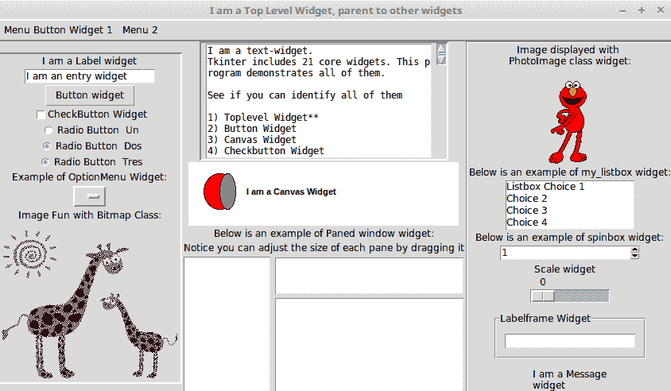

我们将这些应用程序称为虚拟应用程序，因为它们既不是完全功能性的，也不提供任何实际用途，除了展示 Tkinter 的特定功能。

# 开始使用

我们将使用 Python 3.6.3 版本编写所有项目，这是撰写时 Python 的最新 *稳定* 版本。

Python 下载包和不同平台的下载说明可在[`www.python.org/downloads/release/python-363/`](https://www.python.org/downloads/release/python-363/)找到。

macOS X 和 Windows 平台的安装程序二进制文件可在上述链接中获取。

如果你正在使用 Unix、Linux 或 BSD 系统，以下步骤将指导你从源代码安装 Python。

首先，使用您适用的包管理器在您的计算机上安装`tk8.6-dev`和`python3-tk`软件包。例如，在基于 Debian 的系统上，如 Ubuntu 和 Mint，请在终端中运行以下两个命令：

```py
sudo apt install tk8.6-dev
sudo apt install python3-tk
```

从前面的链接下载 Python 3.6.3 并将其解压到您选择的任何位置。在您解压 Python 的位置打开终端，并输入以下命令：

```py
./configure
 make
 make test
 sudo make altinstall
```

这应该在您的计算机上安装 Python 3.6.3。现在打开命令行并输入以下命令：

```py
$ python3.6
```

这将打开 Python 3.6 交互式 shell。输入以下命令：

```py
>>> import tkinter
```

此命令应无错误执行。如果没有错误信息，则 Tkinter 模块已安装在你的 Python 发行版上。

当使用本书中的示例时，我们不支持除 Python 3.6.3 以外的任何 Python 版本，该版本捆绑了 Tkinter Tcl/Tk 版本 8.6。然而，大多数示例应该在其他次要的 Python 3 版本上直接运行无误。

要检查您的 Python 安装是否具有正确的 Tkinter 版本，请在您的 IDLE 或交互式 shell 中输入以下命令：

```py
>>> import tkinter
>>> tkinter._test()
```

这应该确认 Tcl/Tk 版本为 8.6。我们现在可以开始构建我们的 GUI 程序了！

下一步骤是可选的，您可以根据自己的意愿跳过它们。虽然前面的步骤对我们开发程序已经足够，但我强烈建议您使用虚拟环境来开发您的程序。

虚拟环境提供了一个与系统程序无冲突的独立环境，并且可以在任何其他系统上轻松复制。

因此，现在让我们设置一个虚拟环境。首先，创建一个文件夹，用于存放本书的所有项目。我们可以称它为`myTkinterProjects`或者任何适合你的名字。

接下来，找到您计算机上 Python 3.6 的安装位置。在我的计算机上，我可以通过运行以下命令来找到 Python 安装的位置：

```py
$ which python3.6
```

记录下位置。对我来说是`/usr/local/bin/python3.6`*。*现在在你的`myTkinterProjects`文件夹中打开一个终端，并运行以下命令：

```py
$ virtualenv -p /location/of /python3.6   myvenv/
```

这将在你的项目文件夹内名为`myvenv`的文件夹中创建一个新的虚拟环境。

最后，我们需要激活这个虚拟环境。这通过运行以下命令来完成：

```py
$ source myenv/bin/activate
```

现在如果您输入命令 `python`，它应该从您的虚拟环境中选择 Python 3.6.3。

从现在开始，每次我们需要运行一个 Python 脚本或安装一个新的模块，我们首先使用前面的命令激活虚拟环境，然后在新的虚拟环境中运行或安装该模块。

# 图形用户界面编程 – 整体概述

作为图形用户界面（GUI）程序员，你通常需要负责决定你程序以下三个方面的内容：

+   屏幕上应该显示哪些组件？

这涉及到选择构成用户界面的组件。典型的组件包括按钮、输入字段、复选框、单选按钮和滚动条。在 Tkinter 中，您添加到 GUI 的组件被称为**小部件**。小部件（简称窗口小工具）是构成应用程序前端图形组件。

+   组件应该放在哪里？

这包括决定各种组件的位置和结构布局。在 Tkinter 中，这被称为**几何管理**。

+   组件是如何交互和表现的？

这涉及到为每个组件添加功能。每个组件或小部件都执行某些操作。例如，一个按钮在被点击时会产生响应。滚动条处理滚动，复选框和单选按钮使用户能够做出一些选择。在 Tkinter 中，各种小部件的功能是通过命令绑定或使用**回调函数**的**事件绑定**来管理的。

以下图表展示了 GUI 编程的三个组成部分：

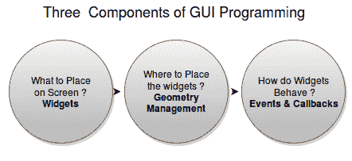

# 根窗口 – 你的绘图板

图形用户界面编程是一门艺术，就像所有艺术一样，你需要一块画板来捕捉你的想法。你将使用的画板被称为**根窗口**。我们的第一个目标是准备好根窗口。

以下截图展示了我们将要创建的根窗口：

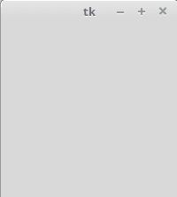

绘制根窗口很简单。你只需要以下三行代码：

```py
import tkinter as tk
root = tk.Tk() #line 2
root.mainloop()
```

将其保存为`.py`文件扩展名或查看`1.01.py`文件中的代码。在 IDLE 窗口中打开它，或使用以下命令在激活的虚拟环境中运行它：

```py
$ python 1.01.py
```

运行此程序应生成一个空白的根窗口，如图中所示的前一个截图。此窗口配备了功能性的最小化、最大化和关闭按钮，以及一个空白框架。

下载示例代码

您可以从[`www.packtpub.com`](http://www.packtpub.com)的账户下载您购买的所有 Packt 书籍的示例代码文件。除了访问 Packt 的官方网站外，您还可以在[`github.com/PacktPublishing/Tkinter-GUI-Application-Development-Blueprints-Second-Edition`](https://github.com/PacktPublishing/Tkinter-GUI-Application-Development-Blueprints-Second-Edition)找到这本书的代码文件。如果您在其他地方购买了这本书，您可以访问[`www.packtpub.com/support`](http://www.packtpub.com/support)并注册，以便直接将文件通过电子邮件发送给您。

以下是对前面代码的描述：

+   第一行将`tkinter`模块导入到命名空间中，并以`tk`作为其别名。现在我们可以通过在名称后附加别名 tk 来访问 Tkinter 中所有类的定义、属性和方法，例如`tk.Tk()`。

+   第二行创建了一个`tkinter.Tk`类的实例。这创建了一个被称为**根窗口**的东西，这在前面截图中有展示。根据惯例，Tkinter 中的根窗口通常被称为**root**，但你也可以自由地用任何其他名字来称呼它。

+   第三行执行了 root 对象的`mainloop`（即事件循环）方法。`mainloop`方法正是保持 root 窗口可见的原因。如果你删除第三行，第二行创建的窗口将在脚本停止运行后立即消失。这会发生得如此之快，以至于你甚至看不到窗口出现在你的屏幕上。保持`mainloop`方法运行也允许你保持程序运行，直到你按下关闭按钮，这将退出`mainloop`。

+   Tkinter 还暴露了 `mainloop` 方法为 `tkinter.mainloop()`。因此，你可以直接调用 `mainloop()` 而不是调用 `root.mainloop()`。

恭喜！你已经完成了第一个目标，那就是绘制根窗口。现在，你已经准备好了你的画板（根窗口）。现在，准备好用你的想象力来描绘它吧！

将这三行代码（如代码`1.01.py`所示）牢记于心。这三行代码生成了您的根窗口，它将容纳所有其他图形组件。这些行构成了您在 Tkinter 中开发的任何 GUI 应用程序的骨架。使您的 GUI 应用程序功能化的全部代码将位于此代码的第 2 行（新对象创建）和第 3 行（`mainloop`）之间。

# Widgets – GUI 程序的构建块

现在我们已经准备好了顶级窗口或根窗口，是时候思考这样一个问题了：哪些组件应该出现在窗口中？在 Tkinter 术语中，这些组件被称为**小部件**。

添加小部件所使用的语法如下：

```py
my_widget = tk.Widget-name (its container window, ** its configuration options)
```

在下面的示例（`1.02.py`）中，我们将向根容器添加两个小部件，一个标签和一个按钮。同时，请注意所有小部件是如何添加到我们在第一个示例中定义的骨架代码之间的：

```py
import tkinter as tk
root = tk.Tk()
label = tk.Label(root, text="I am a label widget")
button = tk.Button(root, text="I am a button")
label.pack()
button.pack()
root.mainloop()
```

运行前面的代码(`1.02.py`)将生成一个带有标签和按钮小部件的窗口，如下面的截图所示：

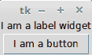

以下是对前面代码的描述：

+   此代码为标签小部件添加了一个名为`label`的新实例。第一个参数定义了根元素作为其父元素或容器。第二个参数配置了其文本选项，以读取`我是一个标签小部件`。

+   同样，我们定义了一个 Button 小部件的实例。这也被绑定到根窗口作为其父窗口。

+   我们使用了`pack()`方法，这基本上是必需的，用于在窗口中定位标签和按钮小部件。当探索几何管理任务时，我们将讨论`pack()`方法以及几个其他相关概念。然而，你必须注意，对于小部件要显示出来，某种形式的几何规格是必不可少的。

# 一些重要的部件功能

注意以下所有小部件共有的几个重要特性：

+   所有小部件实际上都是它们各自小部件类的派生对象。因此，一个如`button = Button(its_parent)`这样的语句实际上是从`Button`类创建了一个按钮实例。

+   每个小部件都有一组选项来决定其行为和外观。这包括文本标签、颜色和字体大小等属性。例如，按钮小部件具有管理其标签、控制其大小、更改前景和背景颜色、更改边框大小等属性。

+   要设置这些属性，您可以在创建小部件时直接设置值，如前一个示例所示。或者，您也可以稍后通过使用`.config()`或`.configure()`方法来设置或更改小部件的选项。请注意，`.config()`或`.configure()`方法是可互换的，并提供相同的功能。实际上，`.config()`方法仅仅是`.configure()`方法的别名。

# 创建小部件的方法

在 Tkinter 中创建小部件有两种方法。

第一种方法涉及在一行中创建一个小部件，然后在下一行添加`pack()`方法（或其他布局管理器），如下所示：

```py
my_label = tk.Label(root, text="I am a label widget")
my_label.pack()
```

或者，你也可以将这两行一起写，如下所示：

```py
tk.Label(root, text="I am a label widget").pack()
```

您可以选择保存对创建的部件的引用（例如，`my_label`，如第一个示例所示），或者创建一个部件而不保留对其的任何引用（如第二个示例所示）。

理想情况下，你应该保留对组件的引用，以防在程序中稍后需要访问该组件。例如，当你需要调用其内部方法或修改其内容时，这很有用。如果组件状态在创建后应保持静态，那么你不需要保留对组件的引用。

注意，调用 `pack()`（或其他几何管理器）总是返回 `None`。因此，考虑以下情况：你创建了一个小部件，并在同一行上添加了一个几何管理器（例如，`pack()`），如下所示：`my_label = tk.Label(...).pack()`。在这种情况下，你并没有创建小部件的引用。相反，你为 `my_label` 变量创建了一个 `None` 类型的对象。所以，当你后来尝试通过引用修改小部件时，你会得到一个错误，因为你实际上是在尝试对一个 `None` 类型的对象进行操作。如果你需要一个小部件的引用，你必须在一行上创建它，然后在第二行上指定其几何（例如 `pack()`），如下所示：

`my_label = tk.Label(...)`

`my_label.pack()`

这是最常见的初学者犯的错误之一。

# 了解 Tkinter 核心小部件

现在，你将了解所有核心的 Tkinter 小部件。在前面的示例中，你已经看到了其中的两个——标签（Label）和按钮（Button）小部件。现在，让我们来探索所有其他的核心 Tkinter 小部件。

Tkinter 包含 21 个核心小部件，具体如下：

| **顶级** | **标签** | **按钮** |
| --- | --- | --- |
| 画布 | 复选按钮 | 输入框 |
| 框架 | 标签框架 | 列表框 |
| 菜单 | 菜单按钮 | 消息 |
| 选项菜单 | 分割窗口 | 单选按钮 |
| 尺度 | 滚动条 | 微调框 |
| 文本 | 位图 | 图片 |

让我们编写一个程序来显示根窗口中的所有这些小部件。

# 向父窗口添加小部件

添加小部件所使用的格式与我们在上一个任务中讨论的相同。为了给您一个关于如何操作的直观印象，这里有一些示例代码，展示了如何添加一些常见的小部件：

```py
Label(parent, text="Enter your Password:")
Button(parent, text="Search")
Checkbutton(parent, text="Remember Me", variable=v, value=True)
Entry(parent, width=30)
Radiobutton(parent, text="Male", variable=v, value=1)
Radiobutton(parent, text="Female", variable=v, value=2)
OptionMenu(parent, var, "Select Country", "USA", "UK", "India","Others")
Scrollbar(parent, orient=VERTICAL, command= text.yview)
```

你能否发现每个小部件共有的模式？你能发现其中的差异吗？

作为提醒，添加小部件的语法如下：

```py
Widget-name(its_parent, **its_configuration_options)
```

使用相同的模式，让我们将所有 21 个核心 Tkinter 小部件添加到一个虚拟应用程序（`1.03.py`）中。我们在此不展示完整代码。`1.03.py` 的代码摘要如下：

1.  我们创建一个顶级窗口和一个`mainloop`，正如之前示例中所示。

1.  我们添加了一个框架小部件并将其命名为`menu_bar`。请注意，框架小部件只是持有其他小部件的容器小部件。框架小部件非常适合将小部件分组在一起。添加框架的语法与所有其他小部件的语法相同：

```py
        frame = Frame(root)
        frame.pack()
```

1.  将`菜单栏`框架作为容器，我们向其中添加了两个小部件：

    +   菜单按钮

    +   菜单

1.  我们创建另一个框架小部件并将其命名为`frame`。将`frame`作为容器/父小部件，我们向其中添加以下七个小部件：

    +   标签

    +   输入框

    +   按钮

    +   复选框

    +   单选按钮

    +   选项菜单

    +   `位图` 类

1.  我们接着创建另一个框架小部件。我们向框架中添加了六个更多的小部件：

    +   `Image` 类

    +   列表框（Listbox）

    +   滚动框（Spinbox）

    +   滑块（Scale）

    +   标签框架（LabelFrame）

    +   消息

1.  我们接着创建另一个框架小部件。我们再向框架中添加两个小部件：

    +   文本

    +   滚动条

1.  我们创建另一个框架小部件并将其添加两个更多的小部件：

    +   Canvas

    +   PanedWindow

这些构成了 Tkinter 的 21 个核心小部件。现在你已经瞥见了所有的小部件，让我们来讨论如何使用布局管理器来指定这些小部件的位置。

# Tkinter 布局管理器

你可能还记得，我们在上一节开发的虚拟应用程序中使用了 `pack()` 方法来添加小部件。`pack()` 方法是 Tkinter 中几何管理的一个例子。

`pack()`方法并不是管理您界面几何形状的唯一方式。实际上，Tkinter 中有三种几何形状管理器，允许您指定顶级或父窗口中小部件的位置。

三种几何管理器如下：

+   **pack**: 这是我们迄今为止所使用的布局方式。对于简单的布局来说，使用起来很简单，但对于稍微复杂一些的布局，它可能会变得非常复杂。

+   **网格布局**：这是最常用的几何管理器，它提供了一个类似表格的管理功能布局，便于进行布局管理。

+   **位置**: 这是最受欢迎度最低的，但它为小部件的绝对定位提供了最佳的控制。

现在，让我们来看看这三个几何管理器在实际操作中的几个示例。

# 包布局管理器

打包管理器在用言语解释时可能有些棘手，最好是通过实际操作代码库来理解。Tkinter 的作者 Fredrik Lundh 建议我们想象根节点就像一张带有中心小开口的弹性薄片。打包几何管理器在弹性薄片上打一个足够容纳小部件的孔。小部件被放置在间隙的给定内边缘（默认为顶部边缘）上。然后它会重复这个过程，直到所有小部件都被容纳进去。

最后，当所有的小部件都包装在弹性薄片内时，几何管理器会计算所有小部件的边界框。然后它使父小部件足够大，以便容纳所有子小部件。

当打包子小部件时，打包管理器区分以下三种空间：

+   未声明的空间

+   声称但未使用的空间

+   声称和使用的空间

打包中最常用的选项包括以下内容：

+   `side`: `LEFT`, `TOP`, `RIGHT`, 和 `BOTTOM` (这些决定小部件的对齐方式)

+   `fill`: X, Y, BOTH, 和 NONE（这些决定小部件是否可以增长大小）

+   `expand`: 布尔值，例如 `tkinter.YES`/`tkinter.NO`，`1` / `0`，以及 `True`/`False`

+   `anchor`: NW, N, `NE`, `E`, `SE`, S, SW, `W`, and CENTER (对应于主要方向)

+   内部填充（`ipadx` 和 `ipady`）用于小部件内部的填充，以及外部填充（`padx` 和 `pady`），它们的所有默认值均为零

让我们看看演示代码，它展示了该软件包的一些功能特性。

两个最常用的包装选项是 `fill` 和 `expand`：

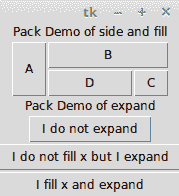

以下代码（`1.04.py`）生成一个类似于前一个截图所示的图形用户界面：

```py
import tkinter as tk
root = tk.Tk()
frame = tk.Frame(root)
# demo of side and fill options
tk.Label(frame, text="Pack Demo of side and fill").pack()
tk.Button(frame, text="A").pack(side=tk.LEFT, fill=tk.Y)
tk.Button(frame, text="B").pack(side=tk.TOP, fill=tk.X)
tk.Button(frame, text="C").pack(side=tk.RIGHT, fill=tk.NONE)
tk.Button(frame, text="D").pack(side=tk.TOP, fill=tk.BOTH)
frame.pack()
# note the top frame does not expand or fill in X or Y directions
# demo of expand options - best understood by expanding the root
#vwidget and seeing the effect on all the three buttons below.
tk.Label (root, text="Pack Demo of expand").pack()
tk.Button(root, text="I do not expand").pack()
tk.Button(root, text="I do not fill x but I expand").pack(expand = 1)
tk.Button(root, text="I fill x and expand").pack(fill=tk.X, expand=1)
root.mainloop()
```

以下是对前面代码的描述：

+   当你在根框架中插入 `A` 按钮，它会捕获框架的最左侧区域，并扩展以填充 `Y` 维度。因为填充选项被指定为 `fill=tk.Y`，它会占据它想要的全部区域，并填充其容器框架的 `Y` 维度。

+   因为框架本身包含一个不带任何打包选项的简单 `pack()` 方法，所以它占用最小的空间来容纳其所有子控件。

+   如果你通过向下或向侧面拉动来增加根窗口的大小，你会发现框架内的所有按钮都不会随着根窗口的扩大而填充或扩展。

+   `B`、`C`和`D`按钮的位置是基于为每个按钮指定的侧面和填充选项来确定的。

+   接下来的三个按钮（在`B`、`C`和`D`之后）展示了`expand`选项的使用。`expand=1`的值表示按钮在窗口调整大小时会移动其位置。没有明确`expand`选项的按钮将保持在原位，并且不会对其父容器（在这种情况下是根窗口）大小的变化做出响应。

+   学习这段代码的最佳方式是将根窗口调整大小，以观察它对各种按钮产生的影响。

+   `anchor` 属性（在前面代码中未使用）提供了一种将小部件相对于参考点定位的方法。如果未指定 `anchor` 属性，则打包管理器将小部件放置在可用空间或打包框的中心。允许的其他选项包括四个基本方向（N、S、`E` 和 `W`）以及任意两个方向的组合。因此，`anchor` 属性的有效值包括 `CENTER`（默认值）、N、S、E、`W`、NW、NE、SW 和 SE。

Tkinter 几何管理器的大多数属性值可以是未加引号的全部大写字母（例如 `side=tk.TOP` 和 `anchor=tk.SE`），也可以是加引号的小写字母（例如 `side='top'` 和 `anchor='se'`）。

我们将在我们的某些项目中使用 pack 布局管理器。因此，熟悉 pack 及其选项将是有益的。

包管理器非常适合以下两种情况：

+   以自上而下的方式放置小部件

+   将小部件并排放置

`1.05.py` 展示了这两个场景的示例：

```py
parent = tk.Frame(root)
# placing widgets top-down
tk.Button(parent, text='ALL IS WELL').pack(fill=tk.X)
tk.Button(parent, text='BACK TO BASICS').pack(fill=tk.X)
tk.Button(parent, text='CATCH ME IF U CAN').pack(fill=tk.X)
# placing widgets side by side
tk.Button(parent, text='LEFT').pack(side=tk.LEFT)
tk.Button(parent, text='CENTER').pack(side=tk.LEFT)
tk.Button(parent, text='RIGHT').pack(side=tk.LEFT)
parent.pack()
```

上述代码生成了一个图形用户界面，如下截图所示：

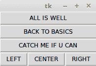

要获取完整的包参考，请在 Python 命令行中输入以下命令：

```py
>> import tkinter
>>> help(tkinter.Pack) 
```

除了通过文档获得交互式帮助外，Python 的交互式解释器（REPL）也是迭代和快速原型化 Tkinter 程序的出色工具。

你应该在何处使用 pack() 布局管理器？

使用包管理器相对于接下来将要讨论的`grid`方法来说有些复杂，但它在以下情况下是一个很好的选择：

+   使小部件填充整个容器框架

+   将几个小部件叠加或并排放置（如前一张截图所示）

尽管您可以通过在多个框架中嵌套小部件来创建复杂的布局，但您会发现网格几何管理器更适合大多数复杂布局。

# 网格布局管理器

网格布局管理器易于理解，可能是 Tkinter 中最有用的布局管理器。网格布局管理器的核心思想是将容器框架组织成一个二维表格，该表格被划分为若干行和列。然后，表格中的每个单元格都可以被定位以容纳一个小部件。在这种情况下，单元格是想象中的行和列的交点。

注意，在`网格`方法中，每个单元格只能容纳一个小部件。然而，可以将小部件设置为跨越多个单元格。

在每个单元格内，您可以使用 sticky 选项进一步对组件的位置进行对齐。sticky 选项决定了组件如何扩展。如果其容器单元格的大小大于它所包含的组件大小，则可以使用一个或多个 N、S、`E` 和 `W` 选项或 NW、`NE`、SW 和 `SE` 选项来指定 sticky 选项。

未指定粘性时，粘性默认设置为单元格中小部件的中心。

让我们看看演示代码，它展示了网格几何管理器的一些特性。`1.06.py`中的代码生成一个 GUI，如下截图所示：


以下代码（`1.06.py`）生成了前面的 GUI：

```py

import tkinter as tk
root = tk.Tk()
tk.Label(root, text="Username").grid(row=0, sticky=tk.W)
tk.Label(root, text="Password").grid(row=1, sticky=tk.W)
tk.Entry(root).grid(row=0, column=1, sticky=tk.E)
tk.Entry(root).grid(row=1, column=1, sticky=tk.E)
tk.Button(root, text="Login").grid(row=2, column=1, sticky=tk.E)
root.mainloop()
```

以下是对前面代码的描述：

+   查看在行和列位置定义的网格位置，对于跨越整个框架的虚拟网格表。看看在标签上使用`sticky=tk.W`是如何使它们固定在左侧的，从而实现整洁的布局。

+   每一列（或每一行的宽度）都是自动根据单元格中小部件的高度或宽度来决定的。因此，您无需担心指定行或列的宽度是否相等。如果您需要额外的控制，您可以指定小部件的宽度。

+   您可以使用`sticky=tk.NSEW`参数来使小部件可扩展并填充整个网格的单元格。

在更复杂的场景中，您的组件可能跨越网格中的多个单元格。为了创建跨越多个单元格的网格，`grid`方法提供了便捷的选项，例如`rowspan`和`columnspan`。

此外，你可能经常需要在网格中的单元格之间提供一些填充。网格管理器提供了`padx`和`pady`选项来提供需要放置在部件周围的填充。

类似地，`ipadx` 和 `ipady` 选项用于内部填充。这些选项在控件内部添加填充。外部和内部填充的默认值是 `0`。

让我们来看一个网格管理器的示例，其中我们使用了网格方法的大部分常用参数，例如 `row`、`column`、`padx`、`pady`、`rowspan` 和 `columnspan`。

`1.07.py`生成了一个 GUI，如下面的截图所示，以演示如何使用网格几何管理器选项：

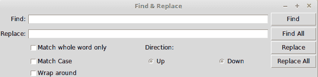

以下代码（`1.07.py`）生成了前面的 GUI：

```py
import tkinter as tk
parent = tk.Tk()
parent.title('Find & Replace')
tk.Label(parent, text="Find:").grid(row=0, column=0, sticky='e')
tk.Entry(parent, width=60).grid(row=0, column=1, padx=2, pady=2, 
                                sticky='we', columnspan=9)
tk.Label(parent, text="Replace:").grid(row=1, column=0, sticky='e')
tk.Entry(parent).grid(row=1, column=1, padx=2, pady=2, sticky='we',
                       columnspan=9)
tk.Button(parent, text="Find").grid( row=0, column=10, sticky='e' + 'w', 
                                padx=2, pady=2)
tk.Button(parent, text="Find All").grid(
                     row=1, column=10, sticky='e' + 'w', padx=2)
tk.Button(parent, text="Replace").grid(row=2, column=10, sticky='e' +
                               'w', padx=2)
tk.Button(parent, text="Replace All").grid(
                     row=3, column=10, sticky='e' + 'w', padx=2)
tk.Checkbutton(parent, text='Match whole word only').grid(
                     row=2, column=1, columnspan=4, sticky='w')
tk.Checkbutton(parent, text='Match Case').grid(
                     row=3, column=1, columnspan=4, sticky='w')
tk.Checkbutton(parent, text='Wrap around').grid(
                     row=4, column=1, columnspan=4, sticky='w')
tk.Label(parent, text="Direction:").grid(row=2, column=6, sticky='w')
tk.Radiobutton(parent, text='Up', value=1).grid(
                     row=3, column=6, columnspan=6, sticky='w')
tk.Radiobutton(parent, text='Down', value=2).grid(
                     row=3, column=7, columnspan=2, sticky='e')
parent.mainloop()
```

注意仅 14 行核心网格管理器代码就能生成如前截图所示的复杂布局。另一方面，如果使用打包管理器来开发，将会更加繁琐。

另一个有时可以使用的网格选项是`widget.grid_forget()`方法。此方法可用于从屏幕上隐藏小部件。当你使用此选项时，小部件仍然存在于其原始位置，但它变得不可见。隐藏的小部件可以被再次显示，但原本分配给小部件的网格选项将会丢失。

类似地，存在一个 `widget.grid_remove()` 方法可以移除小部件，但在这个情况下，当你再次使小部件可见时，它所有的网格选项都将被恢复。

要获取完整的网格参考，请在 Python 命令行中输入以下命令：

```py
>>> import tkinter
>>> help(tkinter.Grid)
```

你应该在何处使用网格几何管理器？

网格管理器是开发复杂布局的强大工具。通过将容器小部件分解成行和列的网格，然后在这些网格中放置所需的小部件，可以轻松实现复杂结构。它也常用于开发不同类型的对话框。

现在我们将深入探讨配置网格的列和行大小。

不同的部件有不同的高度和宽度。因此，当您以行和列的形式指定部件的位置时，单元格会自动扩展以容纳该部件。

通常，所有网格行的长度会自动调整，使其等于其最高单元格的长度。同样，所有网格列的宽度也会调整，使其等于最宽小部件单元格的宽度。

如果你想要一个更小的部件来填充更大的单元格或者使其保持在单元格的任何一边，你可以使用部件上的粘性属性来控制这一方面。

然而，您可以通过以下代码来覆盖列和行的自动尺寸：

```py
w.columnconfigure(n, option=value, ...) AND
w.rowconfigure(n, option=value, ...)
```

使用这些选项来配置给定小部件`w`在第*n*列或第*n*行的选项，指定选项、最小尺寸、填充和权重。请注意，行号从`0`开始，而不是`1`。

可用的选项如下：

| **选项** | **描述** |
| --- | --- |
| minsize | 这是列或行的最小像素大小。如果给定列或行中没有小部件，即使有此 minsize 指定，单元格也不会出现。 |
| 填充 | 这是在像素中添加到指定列或行的外部填充，其大小将超过最大单元格的大小。 |

| 重量 | 这指定了行或列的相对权重，然后分配额外的空间。这使得行或列可拉伸。例如，以下代码将额外的五分之二空间分配给第一列，三分之五分配给第二列：`w.columnconfigure(0, weight=2)`

`columnconfigure()` 和 `rowconfigure()` 方法通常用于实现小部件的动态调整大小，尤其是在调整根窗口大小时。

你不能在同一个容器窗口中同时使用`grid`和`pack`方法。如果你尝试这样做，你的程序将引发一个`_tkinter.TclError`错误。

# 地理位置管理器

Tkinter 中，位置几何管理器是最不常用的几何管理器。然而，它有其用途，因为它允许您通过使用 (*x*,*y*) 坐标系统来精确地定位其父框架内的小部件。

可以通过在任何标准小部件上使用 `place()` 方法来访问位置管理器。

空间几何的重要选项包括以下内容：

+   绝对定位（以 *x*=*N* 或 *y*=*N* 的形式指定）

+   相对定位（关键选项包括 `relx`、`rely`、`relwidth` 和 `relheight`）

与位置一起常用的其他选项包括 `width` 和 `anchor`（默认为 NW）。

请参考`1.08.py`以演示常见的选项：

```py
import tkinter as tk
root = tk.Tk()
# Absolute positioning
tk.Button(root, text="Absolute Placement").place(x=20, y=10)
# Relative positioning
tk.Button(root, text="Relative").place(relx=0.8, rely=0.2, relwidth=0.5, 
                              width=10,  anchor=tk.NE)
root.mainloop()
```

仅通过查看代码或窗口框架，你可能看不出绝对位置和相对位置之间有多大差别。然而，如果你尝试调整窗口大小，你会观察到绝对位置按钮不会改变其坐标，而相对位置按钮则会改变其坐标和大小，以适应根窗口的新尺寸：

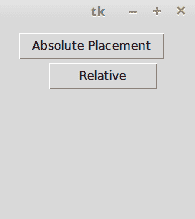

要获取完整的`位置`引用，请在 Python 壳中输入以下命令：

```py
>>> import tkinter
>>> help(tkinter.Place)
```

你应该在何时使用位置管理器？

地方管理者在需要实现自定义几何管理器或由最终用户决定小部件放置位置的情况下非常有用。

虽然打包管理器和网格管理器不能在同一个框架中一起使用，但位置管理器可以与同一容器框架内的任何几何管理器一起使用。

地点管理器很少被使用，因为如果你使用它，你必须担心确切的坐标。如果你对一个部件进行微小的更改，你很可能还需要更改其他部件的 *x*、*y* 值，这可能会非常繁琐。我们将在 第七章*钢琴辅导* 中使用地点管理器。

这是我们关于 Tkinter 中几何管理的讨论的总结。

在本节中，您了解了如何实现 pack、grid 和 place 几何管理器。您还了解了每个几何管理器的优缺点。

你了解到“pack”布局适合简单的横向或纵向小部件排列。你还了解到网格管理器最适合处理复杂布局。你看到了“place”几何管理器的示例，并探讨了它为何很少被使用的原因。

你现在应该能够使用这些 Tkinter 布局管理器来规划和执行你程序的不同布局。

# 事件和回调 – 为程序注入活力

现在你已经学会了如何将小部件添加到屏幕上并将它们放置到你想要的位置，让我们将注意力转向 GUI 编程的第三个组成部分。

这解决了如何使小部件功能化的问题。

使小工具功能化包括使其对事件做出响应，例如按下按钮、键盘上的按键以及鼠标点击。

这需要将回调函数与特定事件关联起来。回调函数通常通过命令绑定规则与特定的小部件事件关联，这些规则将在下一节中讨论。

# 命令绑定

向按钮添加功能的最简单方式被称为**命令绑定**，其中回调函数以`command = some_callback`的形式在部件选项中提及。请注意，`command`选项仅适用于少数选定的部件。

查看以下示例代码：

```py
def my_callback ():
   # do something when button is clicked
```

在定义了前面的回调函数之后，我们可以将其连接到，比如说，一个按钮，使用带有指向回调函数的`command`选项，如下所示：

```py
tk.Button(root, text="Click me", command=my_callback)
```

**回调**是一个函数内存引用（如前例中的`my_callback`），由另一个函数（如前例中的`Button`）调用，并将第一个函数作为参数。简单来说，回调是你提供给另一个函数的函数，以便它可以调用它。

注意，`my_callback` 是从 `command` 选项的 widget 中不带括号 `()` 传递的，因为当设置回调函数时，需要传递一个函数的引用而不是实际调用它。

如果你添加括号，即`()`，就像对任何正常函数所做的那样，程序运行时就会立即调用。相比之下，回调函数仅在事件发生时（在这种情况下是按钮的按下）才会被调用。

# 将参数传递给回调函数

如果回调函数不接受任何参数，可以使用一个简单的函数来处理，例如前面代码中所示的那个。然而，如果回调函数需要接受参数，我们可以使用`lambda`函数，如下面的代码片段所示：

```py
def my_callback (argument)
   #do something with argument
```

然后，在代码的另一个地方，我们定义了一个带有命令回调的按钮，该回调函数接受一些参数，如下所示：

```py
tk.Button(root,text="Click", command=lambda: my_callback ('some argument'))
```

Python 从函数式编程中借鉴了一种特定的语法，称为 `lambda` 函数。`lambda` 函数允许你即时定义一个单行、无名的函数。

使用 `lambda` 的格式如下：

```py
lambda arg: #do something with arg in a single line
```

这里有一个例子：

```py
square = lambda x: x**2
```

现在，我们可以调用`square`方法，如下所示：

```py
>> print(square(5)) ## prints 25 to the console
```

# 命令选项的限制

按钮小部件和其他一些小部件中可用的`command`选项是一个可以使编程按钮点击事件变得简单的函数。许多其他小部件不提供等效的命令绑定选项。

默认情况下，命令按钮绑定到左键点击和空格键。它不会绑定到*回车*键。因此，如果你使用`command`函数绑定按钮，它将响应空格键而不是*回车*键。这对许多用户来说是不直观的。更糟糕的是，你不能轻易地更改命令函数的绑定。教训是，虽然命令绑定是一个非常方便的工具，但在决定自己的绑定时，它的灵活性不足。

这就带我们来到了处理事件的下一个方法。

# 事件绑定

幸运的是，Tkinter 提供了一种名为 `bind()` 的替代事件绑定机制，让您能够处理不同的事件。绑定事件的常用语法如下：

```py
widget.bind(event, handler, add=None)
```

当小部件中发生与事件描述相对应的事件时，它不仅调用相关的处理程序，并将事件对象的实例作为参数传递，而且还调用事件的详细信息。如果此小部件已存在对该事件的绑定，则通常用新处理程序替换旧回调，但您可以通过将`add='+'`作为最后一个参数传递来触发两个回调。

让我们来看一下`bind()`方法的示例（代码`1.09.py`）：

```py
import tkinter as tk
root = tk.Tk()
tk.Label(root, text='Click at different\n locations in the frame below').pack()

def callback(event):
    print(dir(event))
    print("you clicked at", event.x, event.y)

frame = tk.Frame(root, bg='khaki', width=130, height=80)
frame.bind("<Button-1>", callback)
frame.pack()
root.mainloop()
```

以下是对前面代码的描述：

+   我们将 Frame 小部件绑定到 `<Button-1>` 事件，这对应于左键点击。当此事件发生时，它调用 `callback` 函数，并将一个对象实例作为其参数传递。

+   我们定义了`callback(event)`函数。注意，它接受由事件生成的事件对象`event`作为参数。

+   我们通过使用`dir(event)`来检查事件对象，它返回传递给它的事件对象的属性名称的排序列表。这将打印出以下列表：

```py
 [ '__doc__' , '__module__' , 'char' , 'delta' , 'height' , 'keycode' , 'keysym' , keysym_num' , 'num' , 'send_event' , 'serial' , 'state' ,'time' , 'type' , 'widget' , 'width' , 'x' , 'x_root' , 'y' , 'y_root ']
```

+   从对象生成的属性列表中，我们使用两个属性，`event.x` 和 `event.y`，来打印点击点的坐标。

当你运行前面的代码（代码`1.09.py`），它会产生一个窗口，如下面的截图所示：

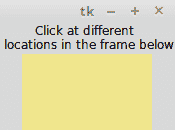

当你在根窗口中的黄色色框内任意位置进行左键点击时，它会在控制台输出信息。传递到控制台的一个示例信息如下：

```py
['__doc__', '__module__', 'char', 'delta', 'height', 'keycode', 'keysym', 'keysym_num', 'num', 'send_event', 'serial', 'state', 'time', 'type', 'widget', 'width', 'x', 'x_root', 'y', 'y_root']
 You clicked at 63 36.
```

# 事件模式

在上一个示例中，你学习了如何使用 `<Button-1>` 事件来表示左键点击。这是 Tkinter 中的一个内置模式，将其映射到左键点击事件。Tkinter 具有一个详尽的映射方案，可以完美地识别此类事件。

这里有一些示例，以帮助您了解事件模式：

| **事件模式** | **相关事件** |
| --- | --- |
| `<Button-1>` | 鼠标左键点击 |
| `<KeyPress-B>` |  按下 *B* 键的键盘操作 |
| `<Alt-Control-KeyPress- KP_Delete>` | 按下 *Alt* + *Ctrl* + *Del* 的键盘操作 |

通常，映射模式具有以下形式：

```py
<[event modifier-]...event type [-event detail]>
```

通常，一个事件模式将包括以下内容：

+   **事件类型**：一些常见的事件类型包括 `Button`、`ButtonRelease`、`KeyRelease`、`Keypress`、`FocusIn`、`FocusOut`、`Leave`（当鼠标离开小部件时）和 `MouseWheel`。要获取事件类型的完整列表，请参阅[`www.tcl.tk/man/tcl8.6/TkCmd/bind.htm#M7`](http://www.tcl.tk/man/tcl8.6/TkCmd/bind.htm#M7)中的`event`类型部分。

+   **事件修饰符**（可选）：一些常见的事件修饰符包括 `Alt`、`Any`（类似于 `<Any-KeyPress>` 使用），`Control`、`Double`（类似于 `<Double-Button-1>` 表示左鼠标按钮的双击），`Lock` 和 `Shift`。要获取事件修饰符的完整列表，请参阅[`www.tcl.tk/man/tcl8.6/TkCmd/bind.htm#M6`](http://www.tcl.tk/man/tcl8.6/TkCmd/bind.htm#M6)中的“事件修饰符”部分。

+   **事件详情**（可选）：鼠标事件详情通过数字 1 表示左键点击，数字 2 表示右键点击。同样，键盘上的每个按键按下都可以由按键字母本身表示（例如，在`<KeyPress-B>`中表示为*B*），或者使用缩写为`keysym`的按键符号。例如，键盘上的向上箭头键由`keysym`值`KP_Up`表示。对于完整的`keysym`映射，请参阅[`www.tcl.tk/man/tcl8.6/TkCmd/bind.htm`](https://www.tcl.tk/man/tcl8.6/TkCmd/bind.htm)。

让我们来看一个在部件上绑定事件的实际例子（完整的工作示例请参考代码 `1.10.py`）：


以下是一个修改过的代码片段；它将给你一个关于常见

使用了事件绑定：

```py
widget.bind("<Button-1>", callback) #bind widget to left mouse click
widget.bind("<Button-2>", callback) # bind to right mouse click
widget.bind("<Return>", callback)# bind to Return(Enter) Key
widget.bind("<FocusIn>", callback) #bind to Focus in Event
widget.bind("<KeyPress-A>", callback)# bind to keypress A
widget.bind("<KeyPress-Caps_Lock>", callback)# bind to CapsLock keysym
widget.bind("<KeyPress-F1>", callback)# bind widget to F1 keysym
widget.bind("<KeyPress-KP_5>", callback)# bind to keypad number 5
widget.bind("<Motion>", callback) # bind to motion over widget
widget.bind("<Any-KeyPress>", callback) # bind to any keypress
```

而不是将事件绑定到特定的控件，您也可以将其绑定到顶级窗口。语法保持不变，只是现在您需要在根窗口的根实例上调用它，例如`root.bind()`。

# 绑定级别

在上一节中，你学习了如何将事件绑定到小部件的实例。这可以被称为**实例级绑定**。

然而，有时你可能需要将事件绑定到整个应用程序。在某些情况下，你可能希望将事件绑定到特定类别的窗口小部件。Tkinter 为此提供了以下级别的绑定选项：

+   **应用级绑定**：应用级绑定允许你在应用程序的所有窗口和控件中使用相同的绑定，只要应用程序中的任何一个窗口处于焦点状态。应用级绑定的语法如下：

```py
widget.bind_all(event, callback, add=None)
```

典型的使用模式如下：

```py
root.bind_all('<F1>', show_help)
```

在此处的应用级绑定意味着，无论当前聚焦的窗口小部件是什么，只要应用程序处于聚焦状态，按下 *F1* 键总是会触发 `show_help` 回调。

+   **类级绑定**：您还可以在特定类级别绑定事件。这通常用于为特定小部件类的所有实例设置相同的行为。类级绑定的语法如下：

```py
w.bind_class(class_name, event, callback, add=None)
```

典型的使用模式如下：

```py
my_entry.bind_class('Entry', '<Control-V>', paste)
```

在前面的示例中，所有条目小部件都将绑定到 `<Control-V>` 事件，这将调用一个名为 `paste` (event) 的方法。

事件传播

大多数键盘和鼠标事件发生在操作系统级别。事件从其源头按层次向上传播，直到找到具有相应绑定的窗口。事件的传播并不会停止在这里。它会继续向上传播，寻找来自其他小部件的其他绑定，直到达到根窗口。如果它达到了根窗口并且没有发现任何绑定，则该事件将被忽略。

# 处理特定小部件的变量

你需要具有广泛多样小部件的变量。你很可能需要一个字符串变量来跟踪用户输入到输入小部件或文本小部件中的内容。你很可能需要一个布尔变量来跟踪用户是否勾选了复选框小部件。你需要整数变量来跟踪在旋转框或滑块小部件中输入的值。

为了应对小部件特定变量的变化，Tkinter 提供了自己的 `variable` 类。您可以使用从该 Tkinter `variable` 类派生的变量来跟踪小部件特定的值。Tkinter 提供了一些常用的预定义变量。它们是 `StringVar`、`IntVar`、`BooleanVar` 和 `DoubleVar`。

您可以使用这些变量在回调函数内部捕获并处理变量值的变化。如果需要，您还可以定义自己的变量类型。

创建 Tkinter 变量很简单。你只需调用构造函数：

```py
my_string = tk.StringVar()
ticked_yes = tk.BooleanVar()
group_choice = tk.IntVar()
volume = tk.DoubleVar() 
```

变量创建后，您可以用作小部件选项，如下所示：

```py
tk.Entry(root, textvariable=my_string)
tk.Checkbutton(root, text="Remember Me", variable=ticked_yes)
tk.Radiobutton(root, text="Option1", variable=group_choice, value="option1") 
tk.Scale(root, label="Volume Control", variable=volume, from =0, to=10)
```

此外，Tkinter 通过 `set()` 和 `get()` 方法提供了访问变量值的途径，如下所示：

```py
my_var.set("FooBar") # setting value of variable
my_var.get() # Assessing the value of variable from say a callback 
```

Tkinter `变量` 类的演示可以在 `1.11.py` 代码文件中找到。该代码生成一个窗口，如下面的截图所示：

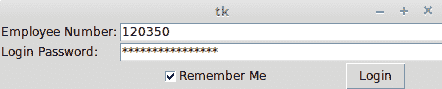

这就结束了我们对事件和回调的简要讨论。以下是我们所讨论内容的简要总结：

+   命令绑定，用于将简单的小部件绑定到特定函数

+   使用`widget.bind_all`(`event`, `callback`, `add=None`)方法进行事件绑定，将键盘和鼠标事件绑定到您的控件上，并在特定事件发生时调用回调函数

+   使用 `lambda` 函数向回调传递额外的参数

+   使用 `bind_all()` 和 `bind_class()` 将事件绑定到整个应用程序或特定类别的控件

+   使用 Tkinter 的 `variable` 类来设置和获取特定小部件的变量值

简而言之，你现在已经知道了如何让你的图形用户界面程序对最终用户请求做出响应！

# 事件解绑和虚拟事件

除了你之前看到的绑定方法之外，你可能会在某些情况下发现以下两个与事件相关的选项很有用：

+   **解绑:** Tkinter 提供了解绑选项来撤销之前绑定的效果。语法如下：

```py
widget.unbind(event)
```

以下是一些其用法的示例：

```py
entry.unbind('<Alt-Shift-5>')
root.unbind_all('<F1>')
root.unbind_class('Entry', '<KeyPress-Del>')
```

+   **虚拟事件**：Tkinter 还允许你创建自己的事件。你可以为这些虚拟事件命名任何你想要的名称。例如，假设你想创建一个名为 `<<commit>>` 的新事件，该事件由 *F9* 键触发。要在指定的小部件上创建此虚拟事件，请使用以下语法：

```py
widget.event_add('<<commit>>', '<KeyRelease-F9>')
```

您可以通过使用常规的 `bind()` 方法将 `<<commit>>` 绑定到一个回调，如下所示：

```py
widget.bind('<<commit>>', callback)
```

其他与事件相关的方法可以通过在 Python 终端中输入以下行来访问：

```py
>>> import tkinter
>>> help(tkinter.Event)
```

现在你已经准备好使用 Tkinter 深入实际应用开发，让我们花些时间探索 Tkinter 提供的一些自定义样式选项。我们还将查看一些与根窗口常用的一些配置选项。

# 以风格化的方式完成

到目前为止，我们一直依赖 Tkinter 为我们的小部件提供特定平台的样式。然而，您可以指定您自己的小部件样式，例如它们的颜色、字体大小、边框宽度和浮雕效果。以下章节提供了 Tkinter 中可用的样式功能的简要介绍。

你可能记得，我们可以在实例化小部件时指定其选项，如下所示：

```py
my_button = tk.Button(parent, **configuration options)
```

或者，您可以通过以下方式使用 `configure()` 来指定小部件选项：

```py
my_button.configure(**options)
```

样式选项也可以作为小部件的选项来指定，无论是在创建小部件时，还是通过使用`configure`选项来稍后指定。

# 指定样式

在样式管理的范畴内，我们将介绍如何将不同的颜色、字体、边框宽度、浮雕效果、光标和位图图标应用到小部件上。

首先，让我们看看如何指定小部件的颜色选项。对于大多数小部件，你可以指定以下两种类型的颜色：

+   背景颜色

+   前景颜色

您可以通过使用红色(*r*)、绿色(*g*)和蓝色(*b*)的十六进制颜色代码来指定颜色。常用的表示方法有`#rgb`（4 位）、`#rrggbb`（8 位）和`#rrrgggbbb`（12 位）。

例如，`#fff` 是白色，`#000000` 是黑色，`#f00` 是红色（R=`0xf`，G=`0x0`，B=`0x0`），`#00ff00` 是绿色（R=`0x00`，G=`0xff`，B=`0x00`），而 `#000000fff` 是蓝色（R=`0x000`，G=`0x000`，B=`0xfff`）。

或者，Tkinter 提供了标准颜色名称的映射。要查看预定义的命名颜色列表，请访问 [`wiki.tcl.tk/37701`](http://wiki.tcl.tk/37701) 或 [`wiki.tcl.tk/16166`](http://wiki.tcl.tk/16166).

接下来，让我们看看如何为我们的小部件指定字体。字体可以通过以下字符串签名表示为一个字符串：

```py
{font family} fontsize fontstyle
```

上述语法的元素可以解释如下：

+   `字体族`: 这是指完整的字体族长名称。它最好使用小写，例如 `font="{nimbus roman} 36 bold italic"`。

+   `字体大小`: 这是以打印机点单位（`pt`）或像素单位（`px`）表示的。

+   `fontstyle`: 这是一种普通/粗体/斜体和下划线/删除线的混合。

以下是一些说明指定字体方法的示例：

```py
widget.configure (font='Times 8')
widget.configure(font='Helvetica 24 bold italic')
```

如果你将 Tkinter 的尺寸设置为普通整数，则测量将以像素为单位进行。或者，Tkinter 还接受其他四种测量单位，分别是 `m`（毫米）、`c`（厘米）、`i`（英寸）和 `p`（打印点，大约为 1/72")。

例如，如果你想以打印机的点为单位指定按钮的换行长度，你可以这样指定：

```py
button.configure(wraplength="36p")
```

Tkinter 大多数小部件的默认边框宽度为 *2* 像素。您可以通过明确指定来更改小部件的边框宽度，如下所示行所示：

```py
button.configure(borderwidth=5)
```

小部件的浮雕样式指的是小部件中最高和最低海拔之间的差异。Tkinter 提供了六种可能的浮雕样式——`flat`、`raised`、`sunken`、`groove`、`solid`和`ridge`：

```py
button.configure(relief='raised')
```

Tkinter 允许你在鼠标悬停在特定小部件上时更改鼠标光标的样式。这可以通过使用 cursor 选项来完成，如下所示：

```py
button.configure(cursor='cross')
```

要查看可用的光标完整列表，请参阅[`www.tcl.tk/man/tcl8.6/TkCmd/cursors.htm`](https://www.tcl.tk/man/tcl8.6/TkCmd/cursors.htm).

虽然您可以在每个小部件级别指定样式选项，但有时对每个小部件单独进行操作可能会感到繁琐。小部件特定的样式有以下缺点：

+   它将逻辑和展示合并到一个文件中，使得代码变得庞大且难以管理

+   任何样式更改都必须单独应用于每个小部件

+   它违反了有效编码的“不要重复自己”（DRY）原则，因为你一直在为大量的小部件指定相同的样式

幸运的是，Tkinter 现在提供了一种将展示与逻辑分离并在所谓的 **外部选项数据库** 中指定样式的途径。这只是一个文本文件，您可以在其中指定常见的样式选项。

一个典型的选项数据库文本文件看起来是这样的：

```py
*background: AntiqueWhite1
*Text*background: #454545
*Button*foreground: gray55
*Button*relief: raised
*Button*width: 3
```

在其最简单的用法中，这里的星号（`*****`）符号表示该特定样式应用于给定小部件的所有实例。对于星号在样式中的更复杂用法，请参阅[`infohost.nmt.edu/tcc/help/pubs/tkinter/web/resource-lines.html`](http://infohost.nmt.edu/tcc/help/pubs/tkinter/web/resource-lines.html)。

这些条目被放置在一个外部文本（`.txt`）文件中。要将这种样式应用到特定的代码片段上，你可以在代码中早期使用`option_readfile()`函数来调用它，如下所示：

```py
root.option_readfile('optionDB.txt')
```

让我们来看一个使用这个外部样式文本文件在程序中的示例（见代码 `1.12.py`）：

```py
import tkinter as tk
root = tk.Tk()
root.configure(background='#4D4D4D')#top level styling
# connecting to the external styling optionDB.txt
root.option_readfile('optionDB.txt')
#widget specific styling
mytext = tk.Text(root, background='#101010', foreground="#D6D6D6",
              borderwidth=18, relief='sunken',width=17, height=5)
mytext.insert(tk.END, "Style is knowing who you are, what you want to
                   say, and not giving a damn.")
mytext.grid(row=0, column=0, columnspan=6, padx=5, pady=5)
# all the below widgets get their styling from optionDB.txt file
tk.Button(root, text='*').grid(row=1, column=1)
tk.Button(root, text='^').grid(row=1, column=2)
tk.Button(root, text='#').grid(row=1, column=3)
tk.Button(root, text='<').grid(row=2, column=1)
tk.Button(root, text='OK', cursor='target').grid(row=2, column=2)#changing cursor style
tk.Button(root, text='>').grid(row=2, column=3)
tk.Button(root, text='+').grid(row=3, column=1)
tk.Button(root, text='v').grid(row=3, column=2)
tk.Button(root, text='-').grid(row=3, column=3)
for i in range(9):
   tk.Button(root, text=str(i+1)).grid(row=4+i//3, column=1+i%3)
root.mainloop()
```

以下是对前面代码的描述：

+   代码连接到一个名为 `optionDB.txt` 的外部样式文件，该文件定义了小部件的通用样式。

+   下一个代码段创建了一个文本小部件，并在小部件级别指定了样式。

+   下一段代码包含几个按钮，所有这些按钮的样式都源自集中式的`optionDB.txt`文件。其中一个按钮还定义了一个自定义的光标。

在绝对数值中指定属性，例如字体大小、边框宽度、小部件宽度、小部件高度和填充，正如我们在前面的示例中所做的那样，这可能会导致在不同操作系统之间（如 Ubuntu、Windows 和 Mac）出现一些显示差异，如下面的截图所示。这是由于不同操作系统的渲染引擎存在差异：

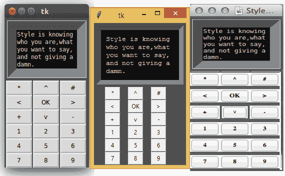

当部署跨平台应用时，最好避免使用绝对数值来指定属性大小。通常，让平台处理属性大小是最佳选择。

# 一些常见的根窗口选项

现在我们已经讨论完了样式选项，让我们来总结一下根窗口常用的一些选项：

| **方法**  | **描述** |
| --- | --- |
| `*root.geometry('142x280+150+200')` | 您可以通过使用`widthxheight` + `xoffset` + `yoffset`格式的字符串来指定根窗口的大小和位置。 |
| `self.root.wm_iconbitmap('mynewicon.ico')` OR `self.root.iconbitmap('mynewicon.ico ')` | 这将标题栏图标更改为与默认 Tk 图标不同的图标。 |

| `root.overrideredirect(1)` | 这将移除根边框。它隐藏包含最小化按钮的框架。

最大化，和关闭按钮。 |

让我们更详细地解释这些样式选项：

+   `root.geometry('142x280+150+200')`: 指定根窗口的几何形状限制了根窗口的启动大小。如果小部件无法适应指定的尺寸，它们将被从窗口中裁剪掉。通常最好不指定此参数，让 Tkinter 为你决定。

+   `self.root.wm_iconbitmap('my_icon.ico')` 或 `self.root.iconbitmap('my_icon.ico ')`: 此选项仅适用于 Windows。基于 Unix 的操作系统不会显示标题栏图标。

# 获取交互式帮助

本节不仅适用于 Tkinter，也适用于任何可能需要帮助的 Python 对象。

假设你需要参考 Tkinter 的 pack 布局管理器。你可以在 Python 的交互式 shell 中通过使用 help 命令来获取交互式帮助，如下所示：

```py
>>> import tkinter
>>> help(tkinter.Pack)
```

这提供了 Tkinter 中定义在 `Pack` 类下所有方法的详细帮助文档。

您同样可以为所有其他单个小部件获得帮助。例如，您可以通过在交互式外壳中输入以下命令来查看标签小部件的全面且权威的帮助文档：

```py
 >>>help(tkinter.Label)
```

这提供了一份以下内容的列表：

+   所有在`Label`类中定义的方法

+   `Label`小部件的所有标准和小部件特定选项

+   所有从其他类继承的方法

最后，当对某个方法不确定时，请查看 Tkinter 的源代码，它位于`<Python 安装位置>\lib\`。例如，在我的 Linux Mint 操作系统上，Tkinter 的源代码位于`/usr/lib/python3.6.3/tkinter`目录中。您还可能发现查看其他模块的源代码实现很有用，例如`颜色选择器`、`文件对话框`和`ttk`模块，以及其他位于上述目录中的模块。

# 摘要

这章内容到此结束。本章旨在提供一个 Tkinter 的高级概述。我们逐一探讨了驱动 Tkinter 程序的所有重要概念。

你现在已经知道了什么是根窗口以及如何设置它。你也了解了 21 个核心 Tkinter 小部件以及如何设置它们。我们还探讨了如何使用`Pack`、`Grid`和`Place`布局管理器来布局我们的程序，以及如何通过使用`events`和`callbacks`来使我们的程序具有功能性。最后，你看到了如何将自定义样式应用到 GUI 程序中。

总结来说，我们现在可以开始思考如何使用 Tkinter 制作有趣、实用且时尚的图形用户界面程序了！在下一章中，我们将构建我们的第一个真实应用程序——一个文本编辑器。

# QA 部分

在你继续阅读下一章之前，请确保你能满意地回答这些问题：

+   什么是根窗口？

+   什么是主循环？

+   你如何创建一个根窗口？

+   小部件是什么？如何在 Tkinter 中创建小部件？

+   你能列出或识别出 Tkinter 中所有可用的控件吗？

+   几何管理器有哪些用途？

+   你能列出 Tkinter 中所有可用的几何管理器吗？

+   在 GUI 程序中，什么是事件？

+   什么是回调函数？回调函数与普通函数有何不同？

+   你如何将回调应用于事件？

+   你如何使用样式选项来设置小部件的样式？

+   根窗口有哪些常见的配置选项？

# 进一步阅读

将本章的示例进行修改，以不同的方式布局小部件，或者调整代码以实现其他功能，这样可以帮助你熟悉操作。

我们建议您使用以下命令在您的 Python shell 中查看所有三个几何管理器的文档：

```py
>>> import tkinter
>>> help(tkinter.Pack)
>>> help(tkinter.Grid)
>>> help(tkinter.Place)
```

你也可以在[`infohost.nmt.edu/tcc/help/pubs/tkinter/web/index.html`](http://infohost.nmt.edu/tcc/help/pubs/tkinter/web/index.html)找到关于 Tkinter 的优秀文档。
