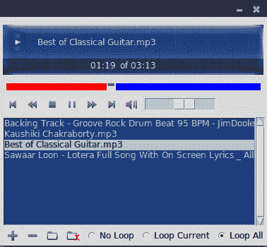
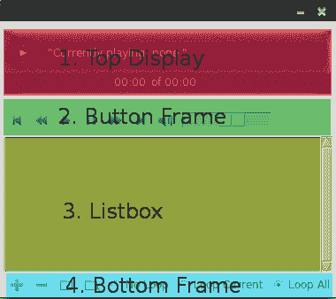
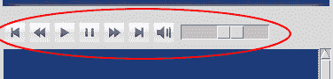
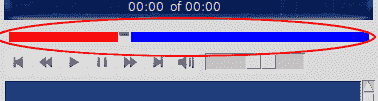
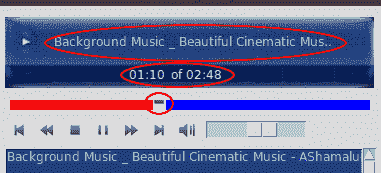
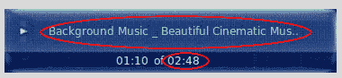
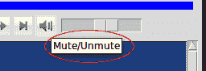

# 构建一个音频播放器

让我们构建一个音频播放器！我们的应用程序应该具备典型音频播放器提供的功能，例如播放、暂停、快进、快退、下一曲、静音、音量调节、时间搜索等。它应该让听众能够轻松访问他们本地驱动器上的媒体文件或媒体库。音频播放器应该做到所有这些，并且更多。让我们开始吧！

以下为本章节的关键目标：

+   探索 Tkinter 小部件，即滑块（Slider）、列表框（Listbox）、单选按钮（Radiobutton）和画布（Canvas）

+   通过扩展现有小部件在 Tkinter 中创建新小部件

+   理解虚拟活动及其用法

+   学习在 Tkinter 动画中使用的最常见编码模式

+   学习一些常见的 Tkinter 扩展，如 Pmw、WCK 和 TIX

# 章节概述

让我们把我们的音频播放器称为*Achtung Baby*。

音频播放器将能够播放**AU**、**MP2**、**MP3**、**OGG/Vorbis**、**WAV**和**WMA**格式的音频文件。它将具备您期望的小型媒体播放器所拥有的所有控制功能。

我们将使用跨平台模块来编写代码。这将确保玩家可以在 Windows、macOS X 和 Linux 平台上播放音频文件。

完成后，音频播放器将呈现如下：



本章最重要的收获可能是学习如何创建自己的 Tkinter 小部件。

在前一张截图中的搜索栏是一个自定义小部件的例子，这个小部件在 Tkinter 中不是原生可用的，但为了这个特定的用例而手工制作。

在你学会了如何创建自定义小部件之后，你能够创造的内容将只受限于你的想象力。

# 外部库需求

除了 Python 的几个内置模块外，我们将在本项目中使用以下两个外部模块：

1.  用于音频处理的 `pyglet` 库

1.  **Pmw**（代表**Python megawidget**）用于核心 Tkinter 中不可用的控件

# Pyglet 模块

Pyglet 是一个跨平台的 Python 窗口和多媒体库。您可以从 [`bitbucket.org/pyglet/pyglet/wiki/Download`](https://bitbucket.org/pyglet/pyglet/wiki/Download) 下载。

Pyglet 可以使用 pip 安装程序进行安装，这是 Python 的默认包管理器，通过以下命令进行安装：

```py
pip3 install pyglet
```

Windows 用户也可以从[`www.lfd.uci.edu/~gohlke/pythonlibs/#pyglet`](http://www.lfd.uci.edu/~gohlke/pythonlibs/#pyglet)下载并安装`pyglet`的二进制包。

Pyglet 需要另一个名为 `AVbin` 的模块来支持播放 MP2 和 MP3 等文件格式。`AVbin` 可以从 [`avbin.github.io`](http://avbin.github.io) 的下载部分获取。

# Pmw Tkinter 扩展

我们将使用 Pmw Tkinter 扩展来编写一些在核心 Tkinter 中不可用的小部件功能。Pmw 可以通过使用 pip 命令行工具进行安装，如下所示：

```py
pip3 install pmw 
```

Pmw 也可以从所有平台的源代码包中安装。该包可以从[`sourceforge.net/projects/pmw/`](http://sourceforge.net/projects/pmw/)下载。

安装完 `pyglet`、`AVbin` 和 Pmw 后，从 Python 壳中执行以下命令：

```py
>> import pyglet, Pmw
>>> pyglet.version
 '1.3.0'
>>> Pmw.version()
 '2.0.1' 
```

如果命令执行没有错误信息，并且`pyglet`和 Pmw 的版本与前面代码中显示的相同，那么你就可以开始编写你的音频播放器了。

# 程序结构和宏观骨架

我们的首要目标是构建程序的广泛模块化结构。像往常一样，我们将数据结构、音频相关逻辑和展示逻辑分别保存在三个独立的文件中。因此，我们将创建三个独立的文件，分别命名为`model.py`、`player.py`和`view.py`（参见`代码 5.01`）。

让我们在各自的文件中创建一个空的`Model`类和一个空的`Player`类。以下是为`5.01`版本的`model.py`文件提供的代码：

```py
class Model:
  def __init__(self):
    pass
```

这里是`5.01`版本的`player.py`代码：

```py
import pyglet
class Player():
  def __init__(self):
    pass
```

接下来，让我们创建`View`类。现在我们将`Model`和`Player`类留空。然而，我们将通过编写大多数玩家视图元素来完成这个迭代。

让我们从在`View`类中导入所需的模块开始，如下所示：

```py
import tkinter as tk
import tkinter.filedialog
import tkinter.messagebox
import tkinter.ttk
```

此外，在`View`命名空间中导入空的`Model`和`Player`类（参见代码`5.01`—`view.py`）：

```py
import model
import player
```

然而，由于我们不希望将逻辑与其表示混合在一起，我们在`Model`类中不导入`View`。简而言之，`Model`类对如何将其数据呈现给前端用户一无所知。

注意，在这个程序中我们没有使用`Controller`类。我们在第四章，“棋盘游戏”中看到了如何使用控制器。虽然控制器是避免`Model`类和`View`类之间直接耦合的好方法，但对于像这样的小程序来说，它们可能有些过度。

现在，让我们创建顶层窗口。同时，我们还将创建`Model`和`Player`类的实例，并将它们作为参数传递给`View`类，如下所示（参见代码`5.01`—`view.py`）：

```py
if __name__ == '__main__':
  root = Tk()
  root.resizable(width=False, height=False)
  player = player.Player()
  model = model.Model()
  app = View(root, model, player)
  root.mainloop()
```

现在模板代码已经编写完成，让我们开始编写实际的`View`类，如下所示（参见代码`5.01`—`view.py`):

```py
 class View:
   def __init__(self,root, model, player):
    self.root = root
    self.model = model
    self.player = player
    self.create_gui()

  def create_gui(self):
    self.root.title(AUDIO_PLAYER_NAME)
    self.create_top_display()
    self.create_button_frame()
    self.create_list_box()
    self.create_bottom_frame()
    self.create_context_menu()

```

`__init__` 方法现在应该对你来说已经很熟悉了。`__init__` 方法的最后一行调用了一个名为 `create_gui` 的方法，该方法负责创建整个 GUI。`create_gui` 方法反过来又简单地调用了五个不同的方法，其中每个方法负责创建 GUI 的不同部分。

我们通过在代码中添加 `root.resizable(width=False, height=False)` 使根窗口不可调整大小。

我们不会重新展示创建 GUI 的完整代码，因为我们之前已经编写过类似的控件。但是，这五种方法结合在一起，就能创建出以下截图所示的 GUI：



为了区分，我们在前面的截图中也用不同的方式标记了这四个部分。第五种方法创建的是右键点击上下文菜单，这里没有显示。

用于创建所有这些图形用户界面元素的代码你现在应该已经熟悉了。然而，请注意以下几点关于代码的内容（参见代码 `5.01`—`view.py`）：

+   在前面的代码中使用的所有图片都已存储在一个名为 `icons` 的单独文件夹中。

+   我们已经使用网格几何管理器将所有元素放置在顶层窗口上。

+   顶部显示区域通过使用 `canvas.create_image()` 方法创建了一个画布小部件，并放置了一个覆盖图像。当前播放的文本和顶部显示中的计时器是通过使用 `canvas.create_text()` 方法创建的。放置这些元素所使用的坐标是基于试错法决定的。作为提醒，画布坐标是从左上角测量的。

+   **按钮框架**部分简单创建按钮，并使用图像代替文本，使用以下代码：

    ```py
    button=tk.Button(parent, image=previous_track_icon)
    ```

+   **按钮框架**部分也使用了 ttk Scale 小部件，它可以作为音量滑块使用。这是通过以下代码创建的：

    ```py
    self.volume_scale = tkinter.ttk.Scale(frame, from_=0.0, to=1.0, command=self.on_volume_scale_changed)
    ```

+   Scale 控件中的`from`和`to`值被选为`0.0`和`1.0`，因为这些是`pyglet`库用来表示最小和最大音量的数字，这将在下一节中看到。

+   列表框部分通过使用 Tkinter 列表框小部件来创建播放列表，该小部件使用以下代码：

    ```py
    self.list_box = tk.Listbox(frame, activestyle='none', cursor='hand2', bg='#1C3D7D', fg='#A0B9E9', selectmode=tk.EXTENDED, height=10)
    ```

+   上一段代码中的`select mode=EXTENDED`选项意味着这个列表框将允许一次性选择多个列表项。如果省略这一行，列表框小部件的默认行为是每次只允许选择一个项。

+   `activestyle='none'`选项意味着我们不希望为选定的项目添加下划线。

+   列表框部分连接到滚动条小部件，这与我们在前面的章节中所做的是类似的。

+   **底部框架**部分添加了几个图像按钮，就像我们之前做的那样。它还使用`for`循环创建了三个单选按钮小部件。

+   最后，请注意，我们完全跳过了滚动条的创建，因为它是一个在 Tkinter 中未原生定义的自定义小部件。这是我们将在其独立部分中创建的内容。

列表框小部件通过 selectmode 选项提供了以下四种选择模式：

+   `SINGLE`: 这允许每次只选择一行

+   `BROWSE`（默认模式）：这与`SINGLE`类似，但它允许你通过拖动鼠标来移动选择项

+   `MULTIPLE`: 这允许通过逐个点击项目进行多次选择

+   `EXTENDED`: 这允许使用 *Shift* 和 *Ctrl* 键选择多个范围的项

除了创建所有这些小部件外，我们还为其中大多数小部件添加了命令回调。这些命令回调目前指向以下空的非功能方法（参见代码`5.01`—`view.py`）：

```py
 on_previous_track_button_clicked()
 on_rewind_button_clicked()
 on_play_stop_button_clicked()
 on_pause_unpause_button_clicked()
 on_mute_unmute_button_clicked()
 on_fast_forward_button_clicked()
 on_next_track_button_clicked()
 on_volume_scale_changed(, value)
 on_add_file_button_clicked()
 on_remove_selected_button_clicked()
 on_add_directory_button_clicked()
 on_empty_play_list_button_clicked()
 on_remove_selected_context_menu_clicked()
 on_play_list_double_clicked(event=None)

```

这些方法现在都不起作用。我们将在这里结束迭代，因为在我们考虑使小部件起作用之前，我们还需要做几件事情。

# 决定数据结构

坚持模型第一的哲学，让我们花些时间来决定程序中合适的数据库结构或模型。

音频播放器的数据结构相当简单。我们期望模型做的只是跟踪播放列表。主要数据是一个名为 `play_list` 的列表，而 `Model` 类则负责向播放列表中添加和移除项目。

因此，我们为该程序设计了以下`Model`类（参见代码`5.02`—`model.py`):

```py
class Model:
  def __init__(self):
    self.__play_list = []

  @property
  def play_list(self):
     return self.__play_list

  def get_file_to_play(self, file_index):
    return self.__play_list[file_index]

  def clear_play_list(self):
    self.__play_list.clear()

  def add_to_play_list(self, file_name):
    self.__play_list.append(file_name)

  def remove_item_from_play_list_at_index(self, index):
    del self.__play_list[index]
```

前面的代码中没有什么花哨的地方。这个对象仅仅是一个 Python 列表，其中包含各种实用方法，可以用来向列表中添加和删除项目。

`play_list` 方法已被声明为一个属性，因此我们不需要为播放列表编写 `getter` 方法。这无疑是更符合 Python 风格的，因为像 `play_list = self.play_list` 这样的语句比 `play_list = self.get_play_list()` 更易于阅读。

# 创建玩家类

现在，我们来编写`Player`类的代码。这个类将负责处理音频播放及其相关功能，例如暂停、停止、快进、快退、音量调整、静音等等。

我们将使用`pyglet`库来处理这些功能。

Pyglet 是一个跨平台库，它使用 `AVbin` 模块来支持大量音频文件。

你可能想查看 pyglet 播放器的 API 文档，该文档可在 [`bitbucket.org/pyglet/pyglet/wiki/Home`](https://bitbucket.org/pyglet/pyglet/wiki/Home) 找到。

您也可以通过在 Python 交互式壳中输入以下两行来访问 pyglet 媒体播放器类的文档：

```py
>>> import pyglet
>>> help(pyglet.media) 
```

在[`pyglet.readthedocs.org/`](https://pyglet.readthedocs.org/)的在线文档中，我们了解到可以通过以下代码播放音频文件：

```py
 player= pyglet.media.Player()
 source = pyglet.media.load(<<audio file to be played>>)
 player.queue(source)
 player.play()
```

因此，`Player` 类的代码如下（参见代码 `5.02`—`player.py`):

```py
 import pyglet

 FORWARD_REWIND_JUMP_TIME = 20

 class Player:
   def __init__(self):
     self.player = pyglet.media.Player()
     self.player.volume = 0.6

  def play_media(self, audio_file):
    self.reset_player()
    self.player = pyglet.media.Player()
    self.source = pyglet.media.load(audio_file)
    self.player.queue(self.source)
    self.player.play()

  def reset_player(self):
    self.player.pause()
    self.player.delete()

 def is_playing(self):
   try:
     elapsed_time = int(self.player.time)
     is_playing = elapsed_time < int(self.track_length)
   except:
     is_playing = False
   return is_playing

 def seek(self, time):
   try:
    self.player.seek(time)
   except AttributeError:
    pass

 @property
 def track_length(self):
   try:
     return self.source.duration
   except AttributeError:
     return 0

 @property
 def volume(self):
   return self.player.volume

 @property
 def elapsed_play_duration(self):
  return self.player.time

@volume.setter
def volume(self, volume):
  self.player.volume = volume

def unpause(self):
  self.player.play()

def pause(self):
  self.player.pause()

def stop(self):
  self.reset_player()

def mute(self):
 self.player.volume = 0.0

def unmute(self, newvolume_level):
 self.player.volume = newvolume_level

def fast_forward(self):
  time = self.player.time + FORWARD_REWIND_JUMP_TIME
  try:
    if self.source.duration > time:
      self.seek(time)
    else:
      self.seek(self.source.duration)
  except AttributeError:
    pass

def rewind(self):
 time = self.player.time - FORWARD_REWIND_JUMP_TIME
 try:
   self.seek(time)
 except:
   self.seek(0)
```

上述代码基于`pyglet` API 构建，该 API 非常直观。我们在此不会深入探讨音频编程的细节，并将`pyglet`库视为一个黑盒，它能够实现其声明的内容，即能够播放和控制音频。

以下是你应该注意的关于前面代码的重要事项：

+   我们定义了`play_media`方法，该方法负责播放音频。所有其他方法支持与播放相关的其他功能，例如暂停、停止、倒带、快进、静音等等。

+   注意，每次代码想要播放音频文件时，都会定义一个新的 pyglet `Player` 类。虽然我们可以使用相同的播放器实例来播放多个音频文件，但结果却是 `pyglet` 库没有 `stop` 方法。我们唯一能够停止播放音频文件的方式就是通过终止 `Player` 对象，并为下一个音频文件播放创建一个新的 `Player` 对象。

+   当我们选择外部实现，就像在这里为音频 API 所做的那样时，我们首先在[`docs.python.org/3.6/library/`](https://docs.python.org/3.6/library/)的 Python 标准库中进行了搜索。

+   由于标准库中没有适合我们的包，我们将注意力转向了 Python 包索引，以检查是否存在另一个高级音频接口实现。Python 包索引可以在[`pypi.python.org/`](http://pypi.python.org/)找到。

+   幸运的是，我们遇到了几个音频包。在将包与我们的需求进行比较并观察其社区活跃度后，我们选择了`pyglet`。虽然同样可以使用其他几个包来实现这个程序，但这将会涉及不同复杂程度的操作。

通常情况下，你向下深入协议栈，你的程序将变得更加复杂。

然而，在协议的较低层，你将获得对实现细节的更精细控制，但这会以增加学习曲线为代价。

此外，请注意，大多数音频库都会随着时间的推移而发生变化。虽然这个当前的音频库可能会随着时间的推移而变得无法使用，但你可以轻松修改`Player`类以使用其他音频库，并且仍然能够使用这个程序，只要你保持`Player`类中定义的接口。

这就结束了迭代。我们现在有一个可以操作音频文件的`Player`类。我们有一个由`play_list`组成的数据结构，它包含各种方法来向播放列表中添加和删除文件。接下来，我们将探讨如何从程序的前端添加和删除文件到播放列表。

# 从播放列表中添加和删除项目

让我们编写一些代码来实现一个功能，允许我们从播放列表中添加和删除项目。更具体地说，我们将编写以下截图中标出的四个按钮对应的函数代码：


从左到右，四个按钮执行以下功能：

+   从左数第一个按钮可以将单个音频文件添加到播放列表

+   第二个按钮会从播放列表中删除所有选中的项目

+   第三个按钮会扫描目录以查找音频文件，并将所有找到的音频文件添加到播放列表中

+   最后一个按钮清空播放列表

由于添加这些功能需要我们与 Tkinter 的 Listbox 小部件进行交互，让我们花些时间来了解 Listbox 小部件：

我们可以创建一个类似于创建任何其他小部件的 Listbox 小部件，如下所示：

```py
 play_list = tk.ListBox(parent, **configurable options)
```

当你最初创建一个 Listbox 小部件时，它是空的。要将一行或多行文本插入到 Listbox 中，请使用`insert()`方法，该方法需要两个参数，即文本需要插入的位置的索引和需要插入的实际字符串，如下所示：

```py
 play_list.insert(0, "First Item")
 play_list.insert(1, "Second Item")
 play_list.insert(END, "Last Item")
```

`curselection()` 方法返回列表中所有选中项的索引，而 `get()` 方法返回给定索引的列表项，如下所示：

```py
 play_list.curselection() # returns a tuple of all selected items
 play_list.curselection()[0] # returns first selected item
 play_list.get(1) # returns second item from the list
 play_list.get(0, END) # returns all items from the list
```

此外，Listbox 小部件还有其他可配置选项。

要获取完整的 Listbox 小部件参考，请在 Python 交互式壳中输入以下内容：

```py
 >>> import tkinter
 >>> help(tkinter.Listbox)
```

现在我们已经知道了如何从列表框小部件中添加和删除项目，让我们将这些函数编码到播放器中。

让我们从修改与四个按钮相关联的命令回调开始，具体如下（参见代码 `5.03`—`view.py`）：

```py
def on_add_file_button_clicked(self):
 self.add_audio_file()

def on_remove_selected_button_clicked(self):
 self.remove_selected_file()

def on_add_directory_button_clicked(self):
 self.add_all_audio_files_from_directory()

def on_clear_play_list_button_clicked(self):
 self.clear_play_list()

def on_remove_selected_context_menu_clicked(self):
 self.remove_selected_file()
```

这四种方法所做的只是调用其他四种方法来完成实际的任务，即向播放列表中添加或删除项目。所有这些方法都会在以下两个地方更新`play_list`项目：

+   在可见的 Listbox 小部件中

+   在由`Model`类维护的后端数据结构播放列表中

让我们定义四种新的方法。

# 添加单个音频文件

添加文件涉及使用 Tkinter `filedialog`请求位置并更新前端和后端，如下所示（参见代码`5.03`—`view.py`）：

```py
def add_audio_file(self):
 audio_file = tkinter.filedialog.askopenfilename(filetypes=[(
       'All supported', '.mp3 .wav'), ('.mp3 files', '.mp3'),('.wav files', '.wav')])
 if audio_file:
   self.model.add_to_play_list(audio_file)
   file_path, file_name = os.path.split(audio_file)
   self.list_box.insert(tk.END, file_name)
```

# 从播放列表中移除所选文件

由于列表框允许进行多项选择，我们遍历所有选定的项目，将它们从前端列表框小部件以及模型`play_list`中移除，如下所示（参见代码`5.03`—`view.py`）：

```py
def remove_selected_files(self):
 try:
  selected_indexes = self.list_box.curselection()
  for index in reversed(selected_indexes):
    self.list_box.delete(index)
    self.model.remove_item_from_play_list_at_index(index)
 except IndexError:
   pass
```

注意，我们在从播放列表中删除项目之前会反转元组，因为我们希望从末尾开始删除项目，因为删除操作会导致播放列表项的索引发生变化。如果我们不从末尾删除项目，我们可能会最终从列表中删除错误的项目，因为它的索引在每次迭代中都会被修改。

由于我们在这里已经定义了这种方法，让我们将其添加为右键删除菜单的命令回调，如下所示：

```py
def on_remove_selected_context_menu_clicked(self):
  self.remove_selected_files()
```

# 添加目录中的所有文件

以下代码使用`os.walk()`方法递归遍历所有文件，查找`.wav`和`.mp3`文件，具体如下（参见代码`5.03`—`view.py`）：

```py
def add_all_audio_files_from_directory(self):
  directory_path = tkinter.filedialog.askdirectory()
  if not directory_path: return
  audio_files_in_directory =  self.get_all_audio_file_from_directory(directory_path)
  for audio_file in audio_files_in_directory:
     self.model.add_to_play_list(audio_file)
     file_path, file_name = os.path.split(audio_file)
     self.list_box.insert(tk.END, file_name)

def get_all_audio_file_from_directory(self, directory_path):
  audio_files_in_directory = []
  for (dirpath, dirnames, filenames) in os.walk(directory_path):
    for audio_file in filenames:
      if audio_file.endswith(".mp3") or audio_file.endswith(".wav"):
        audio_files_in_directory.append(dirpath + "/"  + audio_file)
  return audio_files_in_directory
```

# 清空播放列表

代码如下（见代码 `5.03`—`view.py`）：

```py
def empty_play_list(self):
 self.model.empty_play_list()
 self.list_box.delete(0, END)
```

这完成了我们的第三次迭代。在这个迭代中，我们看到了如何使用 Listbox 小部件。特别是，我们看到了如何向 Listbox 小部件添加项目，从 Listbox 小部件中选择一个特定的项目，以及如何从中删除一个或多个项目。

您现在有一个播放列表，您可以使用音频播放器左下角的四个按钮添加和删除项目。

# 播放音频和添加音频控件

在这次迭代中，我们将编写以下截图中所标记的功能的代码：



这包括播放/停止、暂停/恢复、下一曲、上一曲、快进、倒带、音量调整以及静音/取消静音等功能。

# 添加播放/停止功能

现在我们有了播放列表和可以播放音频的`Player`类，播放音频的操作仅仅是更新当前曲目索引并调用`play`方法。

因此，让我们添加一个属性，如下所示（参见代码`5.04`—`view.py`):

```py
current_track_index = 0 
```

此外，**播放**按钮应作为在`播放`和`停止`功能之间的切换。Python 的 `itertools` 模块提供了 `cycle` 方法，这是一个在两个或多个值之间切换的非常方便的方式。

因此，导入`itertools`模块并定义一个新的属性，如下所示（参见代码`5.04`—`view.py`）：

```py
toggle_play_stop = itertools.cycle(["play","stop"]) 
```

现在，每次我们调用 `next(toggle_play_stop)`，返回的值会在 `play` 和 `stop` 字符串之间切换。

Itertools 是 Python 中一个非常强大的标准库，它可以模拟许多来自函数式编程范式的 **可迭代对象**。在 Python 中，可迭代对象是一个实现了 `next()` 方法的接口。每次对 `next()` 的后续调用都是 **惰性评估** 的——这使得它们以最有效的方式遍历大型序列变得合适。这里使用的 `cycle()` 工具是一个可以提供无限交替值序列的迭代器的例子，而无需定义大型数据结构。

以下为`itertools`模块的文档：

[`docs.python.org/3/library/itertools.html`](https://docs.python.org/3/library/itertools.html)

接下来，修改`on_play_stop_button_clicked()`方法，使其看起来像这样（参见代码`5.04`—`view.py`):

```py
def on_play_stop_button_clicked(self):
  action = next(self.toggle_play_stop)
  if action == 'play':
   try:
     self.current_track_index = self.list_box.curselection()[0]
   except IndexError:
     self.current_track_index = 0
   self.start_play()
 elif action == 'stop':
   self.stop_play()

```

上述方法简单地切换在调用`start_play()`和`stop_play()`方法之间，这些方法定义如下：

```py
def start_play(self):
 try:
   audio_file = self.model.get_file_to_play(self.current_track_index)
 except IndexError:
   return
 self.play_stop_button.config(image=self.stop_icon)
 self.player.play_media(audio_file)

def stop_play(self):
 self.play_stop_button.config(image=self.play_icon)
 self.player.stop()
```

上述代码调用了`Player`类中定义的`play`和`stop`方法。它还通过使用`widget.config(image=new_image_icon)`方法，将按钮图像从*播放*图标更改为*停止*图标。

当我们处理`play`函数时，让我们修改命令回调，以便用户只需通过双击即可播放曲目。我们之前已经定义了一个名为`on_play_list_double_clicked`的方法，目前它是空的。

简单地按照以下方式修改它：

```py
def on_play_list_double_clicked(self, event=None):
 self.current_track_index = int(self.list_box.curselection()[0])
 self.start_play()
```

# 添加暂停/恢复功能

由于我们需要一个按钮来在暂停和继续之间切换，我们再次使用来自 `itertools` 模块的 `cycle()` 方法。定义一个属性，如下所示（参见代码 `5.04`—`view.py`）：

```py
toggle_pause_unpause = itertools.cycle(["pause","unpause"])
```

然后，修改按钮附加的命令回调，如下所示：

```py
def on_pause_unpause_button_clicked(self):
 action = next(self.toggle_pause_unpause)
 if action == 'pause':
   self.player.pause()
 elif action == 'unpause':
   self.player.unpause()

```

这处理了程序中的暂停和恢复功能。

# 添加静音/取消静音功能

这与编码暂停/恢复功能类似。我们需要一个属性，可以在“静音”和“取消静音”字符串之间切换。相应地，添加一个属性，如下所示（参见代码`5.04`—`view.py`）：

```py
toggle_mute_unmute = itertools.cycle(["mute","unmute"]) 
```

然后，修改命令回调以从`player`类调用`mute`或`unmute`函数，更改按钮图标为静音或取消静音的图片，并相应地调整音量刻度，如下所示（参见代码`5.04`—`view.py`）：

```py
def on_mute_unmute_button_clicked(self):
  action = next(self.toggle_mute_unmute)
  if action == 'mute':
    self.volume_at_time_of_mute = self.player.volume
    self.player.mute()
    self.volume_scale.set(0)
    self.mute_unmute_button.config(image=self.mute_icon)
  elif action == 'unmute':
    self.player.unmute(self.volume_at_time_of_mute)
    self.volume_scale.set(self.volume_at_time_of_mute)
    self.mute_unmute_button.config(image=self.unmute_icon)
```

# 快进/倒退功能

快进和快退的代码是最简单的。我们已经在`Player`类中定义了处理这些功能的方法。现在，只需要将它们连接到相应的命令回调函数，如下所示：

```py
def on_fast_forward_button_clicked(self):
  self.player.fast_forward()

def on_rewind_button_clicked(self):
  self.player.rewind()
```

# 添加下一曲目/上一曲目功能

虽然我们在`Player`类中定义了快进和快退的代码，但我们没有在那里定义与下一曲和上一曲相关的方法，因为这可以通过现有的`play`方法来处理。你所需要做的只是简单地增加或减少`current_track`的值，然后调用`play`方法。因此，在`View`类中定义两个方法，如下所示（参见代码`5.04`—`view.py`）：

```py
def play_previous_track(self):
  self.current_track_index = max(0, self.current_track_index - 1)
  self.start_play()

def play_next_track(self):
  self.current_track_index = min(self.list_box.size() - 1, 
    self.current_track_index + 1)
  self.start_play()

```

然后，只需将这些两种方法分别附加到相应的命令回调中，如下所示（参见代码`5.04`—`view.py`）：

```py
def on_previous_track_button_clicked(self):
  self.play_previous_track()

def on_next_track_button_clicked(self):
  self.play_next_track()
```

# 添加体积变化函数

我们已经在`Player`类中定义了`volume`方法。现在，你所需要做的就是简单地获取音量比例小部件的值，并在`Player`类中设置音量。

此外，确保在音量变为零的情况下，我们将音量按钮图标更改为静音图像（参见代码`5.04`—`view.py`）：

```py
def on_volume_scale_changed(self, value):
  self.player.volume = self.volume_scale.get()
  if self.volume_scale.get() == 0.0:
    self.mute_unmute_button.config(image=self.mute_icon)
  else:
    self.mute_unmute_button.config(image=self.unmute_icon)
```

这就完成了迭代。现在玩家已经足够功能化，可以被称为音频播放器。请继续向播放器添加一些音乐文件。按下播放按钮，享受音乐吧！尝试使用我们在这次迭代中定义的其他播放器控制功能，它们应该会按预期工作。

# 创建一个搜索栏

现在，让我们给音频播放器添加一个进度条。Tkinter 提供了 Scale 小部件，我们之前用它来制作音量条。Scale 小部件原本也可以用作进度条。

但我们想要更华丽一些。此外，缩放小部件在不同平台上看起来也会不同。相反，我们希望滑块在所有平台上看起来都是统一的。这就是我们可以创建自己的小部件来满足音频播放器定制需求的地方。

让我们创建自己的 Seekbar 小部件，如图下所示：



创建我们自己的小部件最简单的方法是从现有的小部件或`Widget`类继承。

当你查看 Tkinter 的源代码时，你会发现所有的小部件都继承自一个名为 `Widget` 的类。`Widget` 类反过来又继承自另一个名为 `BaseWidget` 的类。`BaseWidget` 类包含了用于处理小部件的 `destroy()` 方法的代码，但它并不了解几何管理器。

因此，如果我们想让我们的自定义小部件能够了解并使用几何管理器，例如 `pack`、`grid` 或 `place`，我们需要从 `Widget` 类或另一个 Tkinter 小部件继承。

假设我们想要创建一个名为 `Wonderwidget` 的部件。我们可以通过从 `Widget` 类继承来实现这一点，如下所示：

```py
from tkinter import *

class Wonderwidget(Widget):
 def __init__(self, parent, **options):
    Widget.__init__(self, parent, options)
```

这四行代码创建了一个名为 `Wonderwidget` 的部件，它可以使用 `pack`、`place` 或 `grid` 等几何管理器进行定位。

然而，对于更实用的用例，我们通常继承现有的 Tkinter 小部件，例如 `Text`、`Button`、`Scale`、`Canvas` 等等。在我们的情况下，我们将通过继承 `Canvas` 类来创建 `Seekbar` 小部件。

创建一个名为 `seekbar.py` 的新文件（参见代码 `5.05.py`）。然后，创建一个名为 `Seekbar` 的新类，该类继承自 `Canvas` 小部件，如下所示：

```py
from tkinter import *

class Seekbar(Canvas):

  def __init__(self, parent, called_from, **options):
    Canvas.__init__(self, parent, options)
    self.parent = parent
    self.width = options['width']
    self.red_rectangle = self.create_rectangle(0, 0, 0, 0,fill="red")
    self.seekbar_knob_image = PhotoImage(file="../icons/seekbar_knob.gif")
    self.seekbar_knob = self.create_image(0, 0, 
      image=self.seekbar_knob_image)
```

上述代码调用了父类 `Canvas` 的 `__init__` 方法，以所有作为参数传递的与画布相关的选项初始化底层画布。

就这么少的代码，让我们回到`View`类中的`create_top_display()`方法，添加这个新小部件，具体如下：

```py
self.seek_bar = Seekbar(frame, background="blue", width=SEEKBAR_WIDTH, height=10)
self.seek_bar.grid(row=2, columnspan=10, sticky='ew', padx=5)
```

在这里，`SEEKBAR_WIDTH` 是一个我们定义为等于 360 像素的常量。

如果你现在运行 `view.py`，你将看到 `Seekbar` 小部件在其位置上。

搜索栏无法使用，因为当点击搜索栏旋钮时，它不会移动。

为了使滑动条能够滑动，我们将通过定义一个新的方法并从`__init__`方法中调用它来绑定鼠标按钮，如下所示（参见代码`5.05`—`seekbar.py`）：

```py
def bind_mouse_button(self):
  self.bind('<Button-1>', self.on_seekbar_clicked)
  self.bind('<B1-Motion>', self.on_seekbar_clicked)
  self.tag_bind(self.red_rectangle, '<B1-Motion>',
  self.on_seekbar_clicked)
  self.tag_bind(self.seekbar_knob, '<B1-Motion>',
  self.on_seekbar_clicked) 
```

我们将整个画布、红色矩形和滑动条旋钮绑定到单个名为 `on_seekbar_clicked` 的方法上，该方法可以定义为如下（参见代码 `5.05`—`seekbar.py`）：

```py
def on_seekbar_clicked(self, event=None):
  self.slide_to_position(event.x) 
```

上述方法简单地调用了另一个名为 `slide_to_position` 的方法，该方法负责改变旋钮的位置和红色矩形的大小（参见代码 `5.05`—`seekbar.py`）：

```py
def slide_to_position(self, new_position):
  if 0 <= new_position <= self.width:
  self.coords(self.red_rectangle, 0, 0, new_position, new_position)
  self.coords(self.seekbar_knob, new_position, 0)
  self.event_generate("<<SeekbarPositionChanged>>", x=new_position)
```

上述代码将旋钮滑动到新位置。更重要的是，最后一行创建了一个名为 `SeekbarPositionChanged` 的自定义事件。这个事件将允许任何使用此自定义小部件的代码适当地处理该事件。

第二个参数 `x=new_position` 将 `x` 的值添加到 `event.x` 中，使其对事件处理器可用。

到目前为止，我们只处理过事件。Tkinter 还允许我们创建自己的事件，这些事件被称为 **虚拟事件**。

我们可以通过将名称用双对`<<...>>`括起来来指定任何事件名称。

在前面的代码中，我们生成了一个名为`<<SeekbarPositionChanged>>`的虚拟事件。

我们随后将其绑定到`View`类中的相应事件处理器，具体如下：

```py
self.root.bind("<<SeekbarPositionChanged>>",self.seek_new_position)
```

这就是自定义`Seekbar`小部件的全部内容。我们可以在`seekbar.py`中编写一个小测试，以检查`Seekbar`小部件是否按预期工作：

```py
class TestSeekBar :
  def __init__(self):
    root = tk.Tk()
    root.bind("<<SeekbarPositionChanged>>", self.seek_new_position)
    frame = tk.Frame(root)
    frame.grid(row=1, pady=10, padx=10)
    c = Seekbar(frame, background="blue", width=360, height=10)
    c.grid(row=2, columnspan=10, sticky='ew', padx=5)
    root.mainloop()

  def seek_new_position(self, event):
    print("Dragged to x:", event.x)

if __name__ == '__main__':
 TestSeekBar()

```

尝试运行 `5.05`—`seekbar.py` 程序；它应该会生成一个进度条。进度条应该在您拖动进度条旋钮或在画布上的各个位置点击时滑动。

这一次迭代到此结束。我们将在下一次迭代中使音频播放器的定位条功能化。

# 音频播放期间的单一更新

音频程序必须在音频轨道开始播放时立即更新一些信息。总的来说，程序需要监控和更新的更新类型有两种：

+   **一次性更新**：此类例子包括轨道名称和轨道总长度。

+   **持续更新**：此类例子包括寻道按钮的位置和播放进度。我们还需要持续检查是否已播放完一首曲目，以便根据用户选择的循环选项播放下一首曲目、重新播放当前曲目或停止播放。

这两种更新将影响音频播放器的部分区域，如下所示截图：



让我们从一次性更新开始，因为它们相对容易实现。

由于这些更新必须在播放开始时发生，让我们定义一个名为 `manage_one_time_updates()` 的方法，并在 `View` 类的 `start_play()` 方法中调用它，如下所示（参见代码 `5.06`—`view.py`）：

```py
def manage_one_time_track_updates_on_play_start(self):
  self.update_now_playing_text()
  self.display_track_duration()
```

接下来，按照以下方式定义在前面方法中调用的所有方法：

```py
def update_now_playing_text(self):
  current_track = self.model.play_list[self.current_track_index]
  file_path, file_name = os.path.split(current_track)
  truncated_track_name = truncate_text(file_name, 40)
  self.canvas.itemconfig(self.track_name, text=truncated_track_name)

def display_track_duration(self):
  self.track_length = self.player.track_length
  minutes, seconds = get_time_in_minute_seconds(self.track_length)
  track_length_string = 'of {0:02d}:{1:02d}'.format(minutes, seconds)
  self.canvas.itemconfig(self.track_length_text, text=track_length_string)
```

这两种方法简单地通过调用 `canvas.itemconfig` 来找出轨道名称和轨道时长，并更新相关的画布文本。

就像我们使用 `config` 来更改与小部件相关的选项一样，`Canvas` 小部件使用 `itemconfig` 来更改画布内单个项目的选项。`itemconfig` 的格式如下：

```py
canvas.itemconfig(itemid, **options).
```

让我们在名为 `helpers.py` 的新文件中定义两个辅助方法，并在视图命名空间中导入这些方法。这两个方法分别是 `truncate_text` 和 `get_time_in_minutes_seconds`。相关代码可以在 `5.06`—`helpers.py` 文件中找到。

这样就处理了一次性更新。现在，当你运行 `5.06`—`view.py` 并播放一些音频文件时，播放器应该更新轨道名称，并在顶部控制台中显示总轨道时长，如下面的截图所示：



我们将在下一次迭代中负责定期更新。

# 管理持续更新

接下来，我们将更新寻道旋钮的位置和已播放的持续时间，如下所示截图：


这只是基于 Tkinter 的简单动画形式。

使用 Tkinter 动画最常见的方式是先绘制一个单独的框架，然后通过 Tkinter 的 after 方法调用相同的方法，具体如下：

```py
def animate(self):
 self.draw_frame()
 self.after(500, self.animate)
```

记录一下`self.after`方法，它会在循环中调用`animate`方法。一旦被调用，这个函数将每隔`500`毫秒更新一次帧。你还可以添加一些条件来跳出动画循环。在 Tkinter 中，所有动画都是这样处理的。我们将在接下来的几个示例中反复使用这项技术。

现在我们已经知道了如何在 Tkinter 中管理动画，让我们使用这个模式来定义一个处理这些周期性更新的方法。

定义一个名为 `manage_periodic_updates_during_play` 的方法，该方法每秒调用自己一次以更新计时器和进度条，如下所示（参见代码 `5.07`—`view.py`）：

```py
def manage_periodic_updates_during_play(self):
 self.update_clock()
 self.update_seek_bar()
 self.root.after(1000, self.manage_periodic_updates_during_play)
```

然后，定义两个名为 `update_clock` 和 `update_seek_bar` 的方法，它们用于更新前一个截图中所突出显示的部分。

`update_clock` 方法从 `Player` 类获取已过时间（以秒为单位），将其转换为分钟和秒，并使用 `canvas.itemconfig` 更新画布文本，具体如下（参见代码 `5.07`—`view.py`）：

```py
def update_clock(self):
  self.elapsed_play_duration = self.player.elapsed_play_duration
  minutes, seconds = get_time_in_minute_seconds(self.elapsed_play_duration)
  current_time_string = '{0:02d}:{1:02d}'.format(minutes, seconds)
  self.canvas.itemconfig(self.clock, text=current_time_string)
```

你可能还记得，我们之前在`Seekbar`类中定义了一个`slide_to_position`方法。`update_seek_bar`方法只是简单地计算滑块的相对位置，然后调用`slide_to_position`方法来滑动滑块的旋钮，如下所示（参见代码`5.07`—`view.py`）：

```py
def update_seek_bar(self):
  seek_bar_position = SEEKBAR_WIDTH *
  self.player.elapsed_play_duration /self.track_length
  self.seek_bar.slide_to_position(seek_bar_position)
```

现在，如果你运行 `5.07`–`view.py`，添加一个音频文件并播放它，顶部显示中的已过时长应该会持续更新。随着播放的进行，进度条也应该向前移动。

那很好，但还有一个小的细节没有完善。我们希望当用户在进度条上点击某个位置时，播放的音频能够跳转到新的位置。跳转到新位置的代码很简单（见代码 `5.07`—`view.py`):

```py
def seek_new_position(self, event=None):
 time = self.player.track_length * event.x /SEEKBAR_WIDTH
 self.player.seek(time) 
```

然而，前述方法需要在滑动条位置改变时被调用。我们可以通过在`5.07`—`view.py`中添加对虚拟事件的绑定来实现这一点，如下所示：

```py
self.root.bind("<<SeekbarPositionChanged>>", self.seek_new_position)
```

现在，当你运行 `5.07`—`view.py`，播放音频文件并点击进度条；音频应该从新位置开始播放。

这就结束了迭代。我们将在下一次迭代中查看如何遍历轨道。

# 遍历轨道

让我们添加一个允许用户循环播放歌曲的功能。我们已经定义了单选按钮来允许三种选择，如下面的截图所示：


从本质上讲，玩家应从以下三个选项中选择：

+   无循环：播放一首曲目并结束

+   循环播放：重复播放单个曲目

+   循环全部：依次循环整个播放列表

在特定轨道播放结束后，需要立即做出选择其中一种选项的决定。判断一个轨道是否已经结束的最佳位置，是在我们之前创建的周期性更新循环中。

因此，修改`manage_periodic_updates_during_play()`方法，添加以下两条高亮代码（见代码`5.08`—`view.py`）：

```py
def manage_periodic_updates_during_play(self):
  self.update_clock()
  self.update_seek_bar()
  if not self.player.is_playing():
    if self.not_to_loop(): return
  self.root.after(1000, self.manage_periodic_updates_during_play)
```

这实际上意味着只有在当前播放的曲目结束时才会检查循环决策。然后，定义`not_to_loop()`方法，如下所示（参见代码`5.09`—`view.py`）：

```py
def not_to_loop(self):
  selected_loop_choice = self.loop_value.get()
  if selected_loop_choice == 1: # no loop
    return True
  elif selected_loop_choice == 2: # loop current
    self.start_play()
    return False
  elif selected_loop_choice == 3: #loop all
    self.play_next_track()
  return True 
```

代码首先检查所选单选按钮的值，并根据所选选项，做出循环选择：

+   如果选择的循环值为 `1`（无循环），则不执行任何操作并返回 `True`，从而跳出连续更新循环。

+   如果选定的循环值为 `2`（循环当前歌曲），它将再次调用 `start_play` 方法并返回 `False`。因此，我们不会跳出更新循环。

+   如果循环值是 `3`（循环全部），它将调用 `play_next_track` 方法并返回 `True`。因此，我们跳出之前的更新循环。

音频播放器现在可以根据用户设置的循环偏好来循环播放播放列表。

让我们通过重写关闭按钮来结束这次迭代，这样当用户在播放时决定关闭播放器时，音频播放器可以正确地删除播放器对象。

要重写销毁方法，首先在`View __init__`方法中添加一个协议覆盖命令，如下所示（参见代码`5.08`—`view.py`）：

```py
self.root.protocol('WM_DELETE_WINDOW', self.close_player) 
```

最后，定义`close_player`方法，如下所示：

```py
def close_player(self):
 self.player.stop()
 self.root.destroy() 
```

这就完成了迭代。我们编写了循环遍历轨道所需的逻辑，然后覆盖了关闭按钮，以确保在我们退出播放器之前，正在播放的轨道被停止。

# 添加工具提示

在这个最终迭代中，我们将为我们的播放器中的所有按钮添加一个名为**气球小部件**的工具提示。

工具提示是一个当你在“边界小部件”（在我们的例子中是按钮）上悬停鼠标时出现的**弹出窗口**。应用程序的典型工具提示将如下所示：



尽管 Tkinter 的核心库拥有许多有用的控件，但它远非完整。对我们来说，工具提示或气球控件并不是作为 Tkinter 的核心控件提供的。因此，我们在所谓的**Tkinter 扩展**中寻找这些控件。

这些扩展不过是扩展的 Tkinter 小部件集合，就像我们创建的自定义进度条一样。

实际上，Tkinter 扩展有成百上千种。事实上，我们就在本章中编写了自己的 Tkinter 扩展。

然而，以下是一些流行的 Tkinter 扩展：

+   **Pmw**: ([`pmw.sourceforge.net`](http://pmw.sourceforge.net))

+   **Tix**: ([`wiki.Python.org/moin/Tix`](http://wiki.Python.org/moin/Tix))

+   **TkZinc**: ([`wiki.Python.org/moin/TkZinc`](http://wiki.Python.org/moin/TkZinc))

+   **小部件构建工具包 (WCK)**: ([`effbot.org/zone/wck.htm`](http://effbot.org/zone/wck.htm))

# Pmw 扩展列表

谈及 Pmw，以下是从该包中快速列出的一些小部件扩展和对话框。

# 小部件

以下表格显示了一系列小部件扩展列表：

| 按钮框 | 组合框 | 计数器 | 输入字段 |
| --- | --- | --- | --- |
| 群组 | 历史文本 | 标记小部件 | 主菜单栏 |
| 菜单栏 | 消息栏 | 笔记本 | 选项菜单 |
| 分割小部件 | 单选选择框 | 滚动画布 | 滚动字段 |
| 滚动框架 | 滚动列表框 | 滚动文本 | 时间计数器 |

# 对话

以下表格显示了一组小部件对话框列表：

| 关于对话框 | 组合框对话框 | 计数器对话框 | 对话框 |
| --- | --- | --- | --- |
| 消息对话框 | 提示对话框 | 选择对话框 | 文本对话框 |

# 杂项

以下是由 Pmw 提供的杂项小部件列表：

+   `气球`

+   `Blt`（用于图形生成）

+   `颜色模块`功能

Pmw 提供了大量扩展小部件。要演示所有这些小部件，请浏览您之前安装的 Pmw 包，并寻找名为 `demo` 的目录。在 `demo` 目录中，寻找一个名为 `All.py` 的文件，该文件使用示例代码演示了所有这些 Pmw 扩展。

Pmw 提供了 `Balloon` 小部件的实现，该实现将在当前示例中使用。首先，将 `Pmw` 导入命名空间，如下所示（参见代码 `5.09`—`view.py`）：

```py
import Pmw 
```

接下来，在`create_gui`方法中实例化`Balloon`小部件，如下所示：

```py
self.balloon = Pmw.Balloon(self.root) 
```

最后，将`气球`小部件绑定到音频播放器中的每个按钮小部件。我们不会为每个按钮重复代码。然而，格式如下：

```py
balloon.bind(name of widget, 'Description for the balloon') 
```

因此，添加文件按钮将具有气球绑定，如下所示：

```py
self.balloon.bind(add_file_button, 'Add New File') 
```

为`5.09`—`view.py`中的每个按钮添加类似的代码。

这完成了迭代。我们使用 Pmw Tkinter 扩展为音频播放器的按钮添加了气球提示。最重要的是，我们了解了 Tkinter 扩展及其使用时机。

当你需要一个作为核心小部件不可用的 widget 实现时，尝试在 Pmw 或 TIX 中寻找其实现。如果你找不到一个符合你需求的实现，请在互联网上搜索其他 Tkinter 扩展。如果你仍然找不到你想要的实现，那么是时候自己构建一个了。

这就结束了本章的内容。音频播放器已准备就绪！

# 摘要

让我们回顾一下本章中我们提到的事情。

除了加强我们在前几章讨论的许多 GUI 编程技术之外，你还学会了如何使用更多的小部件，例如 Listbox、ttk Scale 和 Radiobutton。我们还深入探讨了 Canvas 小部件的功能。

最重要的是，我们学会了如何创建自定义小部件，从而扩展了 Tkinter 的核心小部件。这是一个非常强大的技术，可以应用于将各种功能构建到程序中。

我们看到了如何生成和处理虚拟事件。

我们看到了在 Tkinter 程序中应用动画的最常见技术。这种技术也可以用来构建各种有趣的游戏。

最后，我们了解了一些常见的 Tkinter 扩展，例如 Pmw、WCK、TIX 等等。

现在，让我们迷失在一些音乐中！

# QA 部分

在你继续阅读下一章之前，请确保你能回答这些问题

满意度：

+   我们如何在 Tkinter 中创建自己的自定义小部件？

+   你如何使用 Tkinter 创建动画？

+   什么是虚拟活动？何时以及如何使用它们？

+   Tkinter 扩展是什么？哪些是最受欢迎的？

# 进一步阅读

查看 Tkinter 流行扩展（如 Pmw、Tix、WCK 等）的文档。注意记录这些扩展中常见的控件。
