# 涂鸦应用

我们在第五章，“构建音频播放器”中使用了 Canvas 小部件来定义一个自定义小部件。Canvas 小部件确实是 Tkinter 的亮点之一。它是一个非常强大且灵活的小部件。因此，让我们将本章的大部分内容用于详细探讨 Canvas 小部件。

我们现在将开发一个绘图应用程序。该应用程序将允许用户绘制手绘线条、直线、圆形、矩形、弧线和其他多边形。它还将允许用户定义新的复杂形状。

除了探索 Canvas 小部件，我们还将基于 Tkinter 接口开发一个微型的 GUI 框架。正如您将看到的，框架是最大化代码重用的一种很好的方式。这使得它们成为快速应用开发（RAD）的强大工具。**快速应用开发（RAD）**。

本章的一些关键学习目标如下：

+   掌握 Canvas 小部件 API

+   学习构建和使用自定义 GUI 框架以实现最大程度地代码复用和快速应用开发

+   学习使用 Tkinter 的 `colorchooser` 模块

+   学习使用 ttk ComboBox 小部件

+   了解可用的小部件方法

+   巩固我们在先前项目中学习到的知识

# 应用概述

在其最终形态下，我们的油漆应用程序将如下所示：

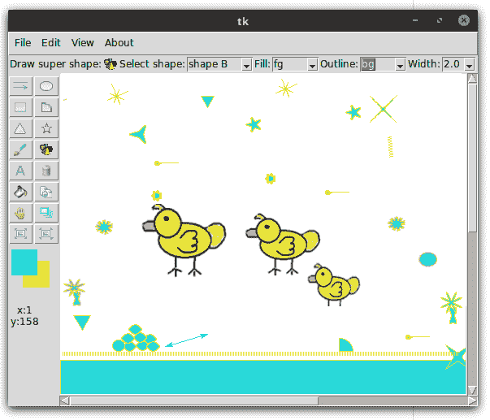

本章没有外部库的要求，因此让我们直接进入代码部分。

# 创建一个微型框架

那么为什么我们还需要在 Tkinter 之上再添加一个框架呢？如果我们只需要构建一个单独的程序，我们其实不需要构建一个框架。然而，如果我们发现自己反复地编写相同的样板代码，那么我们就需要框架。也就是说，框架是一个工具，它让我们能够轻松地生成通用的和经常使用的模式。

例如，考虑一下程序中使用的菜单。菜单在大多数程序中都是一个常见的元素，然而每次我们坐下来编写程序时，都需要手动制作每个菜单项。如果我们能进一步抽象以简化菜单生成会怎样呢？

这就是框架派上用场的地方。

假设你有一个程序，它有 10 个不同的顶级菜单。假设每个顶级菜单有五个菜单项。那么我们不得不写上 50 行代码仅仅是为了显示这 50 个菜单项。你不仅要手动将它们链接到其他命令，还要为每个菜单项设置大量的选项。

如果我们对所有的小部件都这样做，我们的 GUI 编程就变成了打字练习。你写的每一行额外代码都会增加程序的复杂性，使得其他人阅读、维护、修改和/或调试代码变得更加困难。

这就是使用自定义框架能帮到我们的地方。让我们开发一个微型的框架，使菜单生成对我们来说变得简单易行。

我们创建一个文件，`framework.py`，并在该文件中创建一个新的类，`Framework`。每个使用此框架的类都必须继承这个类，并且应该通过调用 super 方法将根窗口作为参数传递给这个类，如下所示：

```py
super().__init__(root)
```

这将使在`Framework`类中定义的所有方法对继承类可用。

我们现在将定义一个方法，`build_menu`，它接受一个预期格式的元组作为输入，并自动为我们创建菜单。让我们定义一个任意规则，即菜单项的每一组必须由元组中的一个单独条目来表示。

此外，我们制定了一条规则，即元组中的每个项目都必须按照以下格式呈现：

```py
'Top Level Menu Name – Menu Item Name / Accelrator /Commandcallback/Underlinenumber'
```

`MenuSeparator` 用字符串 `'sep'` 表示。

菜单定义的另一种表示方法可以是将其指定为一个元组，而不是字符串定义，这就像是要求用户预先分割定义，而不是我们不得不从字符串中提取菜单定义。

例如，将这个元组作为参数传递给`build_menu`方法应该会生成如下代码所示的三种菜单：

```py
menu_items = (
'File - &New/Ctrl+N/self.new_file, &Open/Ctrl+O/self.open_file',
'Edit - Undo/Ctrl+Z/self.undo', 
'sep',
'Options/Ctrl+T/self.options',
'About - About//self.about'
)
```

查看以下截图：

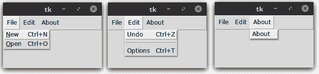

字符串的第一个项目（破折号`-`之前的部分）代表顶级菜单按钮。字符串中每个由正斜杠(`/`)分隔的后续部分代表一个菜单项、其快捷键以及附加的命令回调函数。

`&` 符号的位置代表需要加下划线的快捷键位置。如果我们遇到字符串 `sep`，我们添加一个菜单分隔符。

现在我们已经定义了规则，`build_menu` 函数的代码如下：（参见 `framework.py` 代码）：

```py
def build_menu(self, menu_definition):
  menu_bar = tk.Menu(self.root)
  for definition in menu_definition:
    menu = tk.Menu(menu_bar, tearoff=0)
    top_level_menu, pull_down_menus = definition.split('-')
    menu_items = map(str.strip, pull_down_menus.split(','))
    for item in menu_items:
      self._add_menu_command(menu, item)
    menu_bar.add_cascade(label=top_level_menu, menu=menu)
  self.root.config(menu=menu_bar)

def _add_menu_command(self, menu, item):
  if item == 'sep':
    menu.add_separator()
  else:
    menu_label, accelrator_key, command_callback =item.split('/')
    try:
      underline = menu_label.index('&')
      menu_label = menu_label.replace('&', '', 1)
    except ValueError:
      underline = None
    menu.add_command(label=menu_label,underline=underline, 
      accelerator=accelrator_key,
        command=eval(command_callback))
```

代码的描述如下：

+   该`build_menu`方法通过名为`menu_definition`的元组进行操作，必须按照之前讨论的精确格式指定所有所需的菜单和菜单项。

+   它遍历元组中的每个项目，根据破折号（`–`）分隔符拆分项目，为破折号（`-`）分隔符左侧的每个项目构建顶部菜单按钮。

+   然后根据逗号（`,`）分隔符将字符串的第二部分进行分割。

+   然后它遍历这一部分，为每个部分创建菜单项，使用另一个方法 `_add_menu_command` 添加加速键、命令回调和下划线键。

+   `_add_menu_command` 方法遍历字符串，如果找到字符串 `sep`，则添加一个分隔符。如果没有找到，它将在字符串中搜索下一个和号（`&`）。如果找到了一个，它将计算其索引位置并将其分配给下划线变量。然后，它将和号值替换为空字符串，因为我们不希望在菜单项中显示和号。

+   如果字符串中未找到与号（&），则代码将`None`赋值给下划线变量。

+   最后，代码为菜单项添加了一个命令回调、快捷键和下划线值。请注意，我们的框架仅添加了快捷键标签。将事件绑定到键上是由开发者负责的。

我们的 GUI 框架制作演示到此结束。现在我们可以通过为每组菜单添加一行新内容，简单地定义 literally hundreds of 菜单。

然而，这是一个相当基础的框架。定义条目的规则是完全任意的。分隔符的选择意味着我们不能再使用作为我们使用此框架定义的任何菜单的分隔符的破折号（`-`）、斜杠（`/`）和和号（`&`）字符。

我们的框架并未为任何其他小部件设定规则。实际上，这个定义甚至不足以生成其他类型的菜单，例如级联菜单、复选框菜单或单选按钮菜单。然而，我们不会进一步扩展框架，因为已经开发出了框架设计和使用的概念，而这正是我们在绘图应用程序中需要使用的所有内容。

我们还在`framework.py`文件中包含了一个小测试。如果你将该文件作为一个独立程序执行，它应该会弹出一个窗口并定义一些用于测试的菜单。

完整的框架使用更结构化的标记语言来表示规则。XML 是编写 GUI 框架中最受欢迎的选择之一。您可以在以下链接中找到一个基于 XML 的完整 Tkinter RAD (tkRAD) 框架的示例：[`github.com/muxuezi/tkRAD`](https://github.com/muxuezi/tkRAD)。使用此框架的一个简单菜单实现可以在此处查看：[`github.com/muxuezi/tkRAD/blob/master/xml/rad_xml_menu.py`](https://github.com/muxuezi/tkRAD/blob/master/xml/rad_xml_menu.py).

使用框架来编写小型程序可能有些过度，但对于大型程序来说，它们是无价之宝。希望你现在能够欣赏到使用框架来编写大型程序的益处。

现在我们有了`build_menu`的代码，我们可以扩展它以添加所需的任意数量的菜单项，而无需为每个菜单项编写重复且类似的代码。

这标志着我们第一次迭代的结束。在下一步中，我们将使用这个小巧的框架来定义我们的绘图程序的菜单。

# 设置一个广泛的 GUI 结构

让我们现在设置程序的大致 GUI 元素。我们将在`6.01.py`中创建一个`PaintApplication`类。由于我们想使用我们的框架来绘制菜单，我们将框架导入到我们的文件中，并如下继承自`Framework`类：

```py
import framework

class PaintApplication(framework.Framework):

  def __init__(self, root):
    super().__init__(root)
    self.create_gui()
```

`__init__` 方法调用了另一个方法，`create_gui`，该方法负责为我们程序创建基本的 GUI 结构。

`create_gui` 方法简单地将任务委托给五个独立的方法，每个方法负责创建 GUI 的一个部分，具体如下（参见代码 `6.01.py`）：

```py
def create_gui(self):
  self.create_menu()
  self.create_top_bar()
  self.create_tool_bar()
  self.create_drawing_canvas()
  self.bind_menu_accelrator_keys()
```

这五种方法共同构建了一个结构，如下面的截图所示（参见代码 `6.01.py`）：

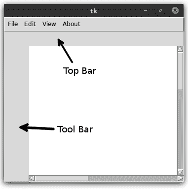

我们在前面的所有章节中都编写了类似的代码，因此在这里我们将不会重复这些五种方法的代码。然而，请注意关于`6.01.py`中代码的以下几点：

+   由于我们想使用该框架，我们继承自`Framework`类并使用`super()`调用其`__init__`方法

+   `create_menu` 方法指定了我们的菜单定义的元组，并调用我们在框架中之前定义的 `build_menu` 方法

我们定义了许多将在以后实现的方法。每个空方法都被添加为单个菜单项的命令回调。这里定义的空方法有：

```py
on_new_file_menu_clicked()
on_save_menu_clicked()
on_save_as_menu_clicked()
on_close_menu_clicked()
on_canvas_zoom_out_menu_clicked()
on_canvas_zoom_in_menu_clicked()
on_undo_menu_clicked()
on_about_menu_clicked() 
```

这为我们程序提供了一个广泛的 GUI 结构。接下来，我们将探讨如何与绘图画布进行交互。

# 处理鼠标事件

当我们在绘画程序中绘制时，我们使用鼠标作为主要输入设备。

主要有两种鼠标事件会在绘图画布上引起变化，因此值得关注：

+   点击并释放

+   点击、拖动并释放

此外，还有一种第三种事件，我们对它的兴趣有限——那就是没有点击按钮的鼠标移动。由于未点击的移动通常不会在画布上引起任何变化，所以我们对此的兴趣有限。

我们忽略右键点击和滚轮滚动，因为我们不会在我们的程序中使用它们。

在这两种先前情况下，我们需要知道鼠标最初点击的位置以及释放的位置。对于点击和释放，这两个位置可能是相同的。对于点击、拖动和释放，通常这两个位置是不同的。

因此，我们定义了四个属性来跟踪这两个位置的坐标（参见代码`6.02.py`）：

```py
start_x, start_y = 0, 0
end_x, end_y = 0, 0
```

我们当前的目标是将鼠标事件绑定，以便任何点击或拖动都能给我们提供这四个起始和结束坐标的值。

Canvas 小部件的坐标从左上角开始（`0, 0`是顶部角落）。

Canvas 小部件使用两个坐标系：

+   **窗口坐标系**，其始终以左上角为`0, 0`，无论你在画布上下滚动多少

+   **画布坐标系**，它指定了项目实际上在画布上的绘制位置

我们主要关注画布坐标系，但鼠标事件会发出窗口坐标系统上的数据。要将窗口坐标系转换为画布坐标系，我们可以使用以下方法：

```py
 canvas_x = canvas.canvasx(event.x)
 canvas_y = canvas.canvasy(event.y) 
```

让我们现在修改我们的`__init__`方法，使其也调用一个方法，`bind_mouse`。我们定义`bind_mouse`方法如下（见代码`6.02.py`）：

```py
def bind_mouse(self):
  self.canvas.bind("<Button-1>", self.on_mouse_button_pressed)
  self.canvas.bind( "<Button1-Motion>", 
                   self.on_mouse_button_pressed_motion)
  self.canvas.bind( "<Button1-ButtonRelease>",  
    self.on_mouse_button_released)
  self.canvas.bind("<Motion>", self.on_mouse_unpressed_motion)

```

我们随后定义了刚才所提到的前三种方法。目前我们通过创建一个空方法来忽略未按下的运动。请记住，我们感兴趣的是获取起始和结束坐标，这些坐标的获取方式如下（参见代码`6.02.py`）：

```py
def on_mouse_button_pressed(self, event):
  self.start_x = self.end_x = self.canvas.canvasx(event.x)
  self.start_y = self.end_y = self.canvas.canvasy(event.y)
  print("start_x, start_y = ", self.start_x, self.start_y)

def on_mouse_button_pressed_motion(self, event):
  self.end_x = self.canvas.canvasx(event.x)
  self.end_y = self.canvas.canvasy(event.y)

def on_mouse_button_released(self, event):
  self.end_x = self.canvas.canvasx(event.x)
  self.end_y = self.canvas.canvasy(event.y)
  print("end_x, end_y = ", self.end_x, self.end_y)
```

我们暂时添加了两个`print`语句来在控制台显示这四个值（参见代码`6.02.py`）。

现在我们已经知道了鼠标开始和结束事件的坐标位置，我们可以对这些事件进行操作，在画布上执行各种活动。

# 添加工具栏按钮

接下来，我们需要在左侧工具栏中添加 16 个按钮。此外，根据点击的是哪个按钮，顶部栏将显示不同的选项，如下所示：

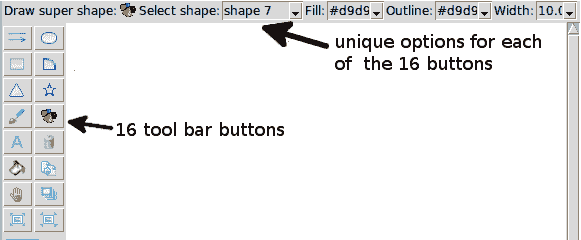

我们不希望我们的代码结构因为需要在 16 个函数之间切换而变得过于臃肿，因此我们将动态调用这些方法。

我们首先定义了一个包含所有 16 个函数名称的元组（参见代码`6.01.py`）：

```py
tool_bar_functions = (
 "draw_line", "draw_oval", "draw_rectangle", "draw_arc",
 "draw_triangle", "draw_star", "draw_irregular_line",
 "draw_super_shape", "draw_text", "delete_item",
 "fill_item", "duplicate_item", "move_to_top",
 "drag_item", "enlarge_item_size", "reduce_item_size"
 )
```

这样做可以确保我们不需要从代码中显式地调用每个方法。我们可以使用元组的索引来检索方法名称，并通过以下方式动态调用它：

```py
 getattr(self, self.toolbar_functions[index]) 
```

这在这里是有道理的，因为我们最终将通过简单地扩展`toolbar_functions`元组来为我们的绘图程序添加更多功能。

我们进一步定义一个属性，`selected_tool_bar_function`，它将跟踪哪个按钮是最后被点击的。我们将其初始化为第一个按钮（`draw_line`）如下：

```py
selected_tool_bar_function = tool_bar_functions[0] 
```

接下来，我们创建一个名为 `icons` 的文件夹，并为所有这 16 个工具栏按钮添加图标。这些图标的命名与对应的功能名称相同。

保持这种一致性使我们能够使用相同的元组来遍历并构建我们的工具栏按钮。这种编程风格可以称之为**约定优于配置**的编程。

我们接下来创建生成实际按钮的方法（参见代码`6.03.py`）：

```py
def create_tool_bar_buttons(self):
  for index, name in enumerate(self.tool_bar_functions):
    icon = tk.PhotoImage(file='icons/' + name + '.gif')
    self.button = tk.Button(self.tool_bar, image=icon, command=lambda
 index=index: self.on_tool_bar_button_clicked(index))
    self.button.grid(row=index // 2, column=1 + index % 2, sticky='nsew')
    self.button.image = icon
```

上述代码创建了所有按钮并将命令回调添加到按钮中，如所示。因此，我们相应地定义命令回调如下（参见代码`6.03.py`）：

```py
def on_tool_bar_button_clicked(self, button_index):
  self.selected_tool_bar_function = self.tool_bar_functions[button_index]
  self.remove_options_from_top_bar()
  self.display_options_in_the_top_bar()
```

前述方法设置了`selected_tool_bar_function`的值。接下来，它调用了以下定义的两个方法（参见代码`6.03.py`）：

```py
def remove_options_from_top_bar(self):
  for child in self.top_bar.winfo_children():
    child.destroy()
```

在我们能够显示新选按钮的选项之前，需要移除顶部栏中当前显示的所有选项。刚才使用的 `winfo_children` 方法返回的是这个部件所有子部件的列表。

现在我们已经从顶部栏中移除了所有项目，我们定义了顶部栏上选定的工具图标：

```py
def display_options_in_the_top_bar(self):
  self.show_selected_tool_icon_in_top_bar(self.selected_tool_bar_function)
```

目前，此方法仅调用另一个方法来在顶部栏中显示所选工具图标。然而，我们将在本章的后续部分将此方法用作添加选项到顶部栏的中心位置。

我们在这里不讨论`show_selected_tool_icon_in_top_bar`方法，因为它只是将带有图标的标签添加到顶部栏（参见代码`6.03.py`）：

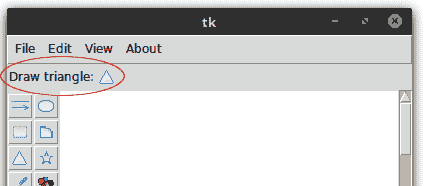

现在，如果你运行代码`6.03.py`，它应该会在左侧工具栏中显示所有 16 个按钮。此外，点击任何一个按钮都应该在顶部栏中显示所选的按钮，如图中所示的前一个截图。

之前使用的 `winfo_children()` 方法是所有小部件都可以调用的部件方法的一个例子。Tkinter 中定义了几个有用的部件方法。

除了所有小部件都有的小部件方法外，还有一些方法仅在顶层窗口中可用。您可以通过在您的 Python 3 控制台中输入以下内容来获取所有这些可用方法及其描述的列表：

+   `**>>> 导入 tkinter**`

+   `**>>> help (tkinter.Misc)**`

+   `**>>> help(tkinter.Wm)**`

这些资源可在[`effbot.org/tkinterbook/widget.htm`](http://effbot.org/tkinterbook/widget.htm)和[`effbot.org/tkinterbook/wm.htm`](http://effbot.org/tkinterbook/wm.htm)在线获取。

鼓励您查看所有这些可用的方法。

接下来，我们将扩展我们的程序，以便实际上在画布上绘制项目。

# 在画布上绘制项目

添加到画布上的对象被称为**项目**。使用不同的创建方法如`create_line`、`create_arc`、`create_oval`、`create_rectangle`、`create_polygon`、`create_text`、`create_bitmap`和`create_image`可以将新项目添加到画布上。

添加到画布上的项目将被放置在堆栈中。新项目被添加到画布上已有的项目之上。每次您使用各种创建方法之一添加一个项目时，它都会返回一个唯一的项句柄或一个唯一的整数项 ID。这个项句柄可以用来引用和操作添加的项目。

除了项目处理程序外，项目还可以具有以下项目指定符：

+   `tags` 是我们可以添加到一项或多项内容的指定符

+   `ALL`（或字符串 all）匹配画布上的所有项目

+   当前（或 `current`）匹配鼠标指针下的项目（如果有）

我们可以使用前面提到的任何项目指定符来指定作用于画布项的方法。

要给一个项目添加标签，您需要指定标签（它是一个字符串）作为其配置选项，无论是在创建对象时还是在之后使用`itemconfig`方法或`addtag_withtag`方法，如下所示：

```py
canvas.create_rectangle(10, 10, 50, 50, tags="foo")
canvas.itemconfig(item_specifier, tags="spam")
canvas.addtag_withtag("spam", "baz")
```

您可以通过传入字符串元组作为标签，一次性给一个项目添加多个标签，如下所示：

```py
canvas.itemconfig(item_specifier, tags=("tag_A", "tag_B"))
```

要获取与项目处理程序关联的所有标签，请按以下方式使用`gettags`：

```py
canvas.gettags(item_handle)
```

这将返回与该项目句柄相关联的所有标签的元组。

要获取所有具有给定标签的项的句柄，请使用 `find_withtag`：

```py
canvas.find_withtag("spam")
```

这将返回所有带有垃圾邮件标签的项目句柄的元组。

根据这些信息，让我们编写前六个按钮的功能代码，如图所示：

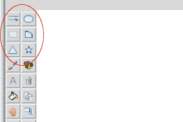

更具体地说，我们将为以下在之前定义的元组 `tool_bar_functions` 中已经定义的功能名称编写代码：`"draw_line"`，`"draw_oval"`，`"draw_rectangle"`，`"draw_arc"`，以及 `"draw_triangle"` 和 `"draw_star"`。

这里是`draw_line`函数的代码（参见代码`6.04.py`）：

```py
def draw_line(self):
  self.current_item = self.canvas.create_line(self.start_x, 
    self.start_y, self.end_x,                                
      self.end_y, fill=self.fill, width=self.width, arrow=self.arrow, 
        dash=self.dash)
```

这使用了`create_line`方法，并从起始的*x*, *y*坐标绘制一条线到结束的*x*, *y*坐标。我们定义了四个新的属性来处理线的四个不同属性：

+   `fill`: 线条颜色。默认为 `black`，在我们的程序中初始化为红色。

+   `width`: 默认值为 `1`，在我们的程序中初始化为 `2`。

+   `箭头`: 默认为 `None`。可用的选项有：`None`、`First`、`Last`、`Both`。

+   `破折号`: 一种`破折号`模式，表示一系列线段长度。只有奇数线段会被绘制。

我们将在稍后提供从顶部栏更改这四个值的选项，因此这些值已被添加为类属性。

还要注意的是，由于 `create_line`（以及所有创建方法）返回创建项的项句柄，我们将其存储在一个名为 `current_item` 的属性中。这使得我们可以访问最后创建的项，我们很快就会将其用于良好。

接下来，这是`draw_oval`函数的代码（参见代码`6.04.py`）：

```py
def draw_oval(self):
 self.current_item = self.canvas.create_oval(self.start_x, 
   self.start_y, self.end_x,  
     self.end_y, outline=self.outline, fill=self.fill,width=self.width)
```

这与`draw_line`的代码相同，除了我们添加了一个名为 outline 的新属性，用于处理轮廓颜色。

我们将不会讨论`create_rectangle`和`create_arc`的代码，这些代码几乎与这里讨论的`draw_oval`代码相同（参见代码`6.04.py`）。

现在我们来讨论 `create_polygon` 方法。这个方法可以用来创建各种有趣的形状。让我们从一个简单的例子开始，绘制一个等边三角形（参见代码 `6.04.py`）：

```py
def draw_triangle(self):
  dx = self.end_x - self.start_x
  dy = self.end_y - self.start_y
  z = complex(dx, dy)
  radius, angle0 = cmath.polar(z)
  edges = 3
  points = list()
  for edge in range(edges):
    angle = angle0 + edge * (2 * math.pi) / edges
    points.append(self.start_x + radius * math.cos(angle))
    points.append(self.start_y + radius * math.sin(angle))
  self.current_item = self.canvas.create_polygon(points, 
    outline=self.outline,  
      fill=self.fill, width=self.width)
```

上述代码首先将 *x*、*y* 坐标系中的变化从笛卡尔坐标系转换为由角度和半径表示的极坐标系。然后，使用以下公式计算三角形所有三边的 *x*、*y* 坐标：

```py
x = r*cosσ and y = r*sinσ 
```

一旦我们得到了三角形三个顶点的 x, y 坐标，我们就调用 `create_polygon` 方法来绘制三角形。

现在我们使用 `create_polygon` 方法来绘制星星。星星（以及许多其他多边形）可以想象成两个同心圆上的点或辐条集合，如下面的图所示：

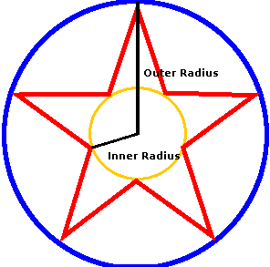

前图中显示的星星有五个辐条。我们稍后会让用户能够更改辐条的数量。因此，让我们首先定义一个类属性如下：

```py
number_of_spokes = 5
```

星星的形状也由内圆半径与外圆半径的比值决定，正如前图所示。这个比值被称为**辐条比**。对于标准星，这个比值是 2。改变这个比值也可以产生各种有趣的星星形状。然而，在我们的例子中，我们将保持这个比值在`2`。根据这些规则，`draw_star`函数的代码定义如下（参见代码`6.04.py`）：

```py

 def draw_star(self):
   dx = self.end_x - self.start_x
   dy = self.end_y - self.start_y
   z = complex(dx, dy)
   radius_out, angle0 = cmath.polar(z)
   radius_in = radius_out / 2 # this is the spoke ratio
   points = list()
   for edge in range(self.number_of_spokes):
      # outer circle angle
      angle = angle0 + edge * (2 * math.pi) / self.number_of_spokes  
      # x coordinate (outer circle)
      points.append(self.start_x + radius_out * math.cos(angle)) 
      # y coordinate (outer circle)
      points.append(self.start_y + radius_out * math.sin(angle)) 
      # inner circle angle
      angle += math.pi / self.number_of_spokes
      # x coordinate (inner circle)
      points.append(self.start_x + radius_in * math.cos(angle))
      # y coordinate (inner circle)
      points.append(self.start_y + radius_in * math.sin(angle))
   self.current_item = self.canvas.create_polygon(points, outline=self.outline, fill=self.fill, width=self.width)
```

上述代码注释丰富，以便您理解。这与我们用来绘制三角形的代码非常相似。

现在，我们不再像三角形那样在一个圆上有点，而是在两个圆上有点。我们再次使用同样的技术，首先将鼠标事件中的 *x*，*y* 坐标转换为极坐标。一旦我们得到极坐标，移动圆上的点就变得容易了。

然后，我们将点按照给定的角度移动，并转换回笛卡尔坐标系。我们持续将所有点追加到一个名为 **points** 的空列表中。一旦我们有了所有点，最后一行调用画布对象的 `create_polygon` 方法来绘制星星。

现在我们已经拥有了创建这六个形状的所有方法。但是，它们需要从某个地方被调用，以便绘图能够发生。而且，我们已经决定它们将会被动态调用。

因此，我们定义了一个方法，`execute_selected_method`，它接受所选工具栏功能的字符串，将字符串转换为可调用的函数，并动态执行它。

代码如下（见代码 `6.04.py`）：

```py
def execute_selected_method(self):
  self.current_item = None
  func = getattr(self, self.selected_tool_bar_function, 
    self.function_not_defined)
  func()
```

此方法 `getattr` 在运行时提供了一个对给定字符串中方法的引用。第二个参数提供了一个回退机制，如果第一个参数中的方法对象未找到，则提供第二个方法的引用。

这有助于我们优雅地处理动态创建的方法不存在的情况。我们只需将这些情况的处理方法定义为空方法即可（参见代码`6.04.py`）：

```py
def function_not_defined(self):
   pass
```

因此，我们现在有一个方法来动态执行所选的方法。我们把这个方法插在哪里呢？

由于绘图必须在鼠标点击时开始，我们从`on_mouse_button_pressed`方法中调用一次`execute_selected_method`方法。

在鼠标被拖动到点击位置时，绘图必须继续。因此，我们从`on_mouse_button_pressed_motion`方法中再次调用此方法。

然而，尽管我们希望在鼠标移动过程中保留最后绘制的对象，但我们希望移除除最后绘制的对象之外的所有其他项目。因此，我们修改了`on_mouse_button_pressed_motion`函数，如下所示（参见代码`6.04.py`）：

```py
def on_mouse_button_pressed_motion(self, event):
  self.end_x = self.canvas.canvasx(event.x)
  self.end_y = self.canvas.canvasy(event.y)
  self.canvas.delete(self.current_item)
  self.execute_selected_method()
```

现在，如果你运行 `6.04.py`，工具栏上最上面的六个按钮应该像以下截图所示那样工作：

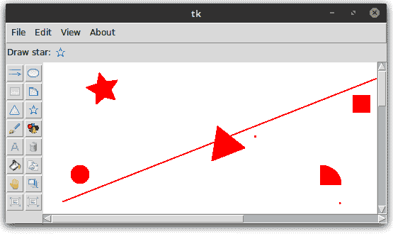

# 添加颜色调色板

我们现在可以在我们的绘图程序中绘制基本形状。然而，我们仍然不能改变这些形状的颜色。在我们允许用户更改颜色之前，我们必须提供一个让他们选择颜色的方法。

因此，我们将提供一个颜色选择器，让用户选择两种不同的颜色：前景色和背景色。

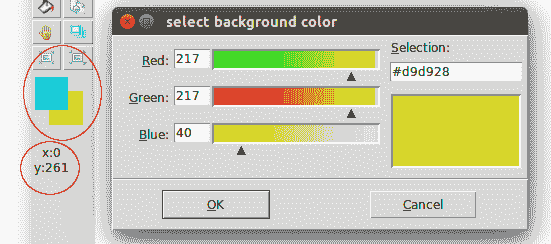

当我们进行时，也可以添加一个标签来显示鼠标在画布上悬停时的 *x*、*y* 坐标，正如前一个截图中所突出显示的。

让我们从调色板开始。这两个调色板不过是放置在画布上的两个小矩形项目。为了展示这两个矩形，我们定义了一个方法，`create_color_palette`，并从现有的`create_gui`方法中调用它。

`create_color_palette` 函数的代码如下（参见代码 `6.05.py`）：

```py
def create_color_palette(self):
  self.color_palette = Canvas(self.tool_bar, height=55, width=55)
  self.color_palette.grid(row=10, column=1, columnspan=2, pady=5, padx=3)
  self.background_palette = self.color_palette.create_rectangle( 15, 
    15, 48, 48,       
      outline=self.background, fill=self.background)
  self.foreground_palette = self.color_palette.create_rectangle(
    1, 1, 33, 33, outline=self.foreground, fill=self.foreground)
  self.bind_color_palette()
```

该方法以调用名为 `bind_color_palette` 的方法结束，该方法定义如下（见代码 `6.05.py`）：

```py
def bind_color_palette(self):
   self.color_palette.tag_bind(self.background_palette, 
                              "<Button-1>", self.set_background_color)
   self.color_palette.tag_bind(self.foreground_palette, 
                              "<Button-1>", self.set_foreground_color)
```

上述代码简单地使用 Canvas 小部件的`tag_bind`方法将鼠标点击绑定到两个尚未定义的方法，`set_background_color`和`set_foreground_color`。

这是`tag_bind`方法的签名：

```py
tag_bind(item, event=None, callback, add=None)
```

此方法为所有匹配项添加事件绑定。请注意，这些绑定应用于项，而不是标签。例如，如果你在调用`tag_bind`之后将现有标签添加到新项中，新项将不会自动绑定到事件。

接下来，让我们定义一个实际打开颜色选择器并根据用户选择的颜色设置前景色和背景色的方法。

Tkinter 自带一个内置的`colorchooser`模块，我们将其导入到我们的命名空间中，如下所示（参见代码`6.06.py`):

```py
from tkinter import colorchooser
```

要打开颜色选择器，我们需要调用它的`askcolor`方法，如下所示：

```py
def get_color_from_chooser(self, initial_color, color_type="a"):
  color = colorchooser.askcolor(color=initial_color, title="select {}            
                                    color".format(color_type))[-1]
  if color:
    return color
  else:  # dialog has been cancelled
    return initial_color
```

点击“确定”后，颜色选择器返回一个形式为的元组：

```py
((217.84765625, 12.046875, 217.84765625), '#d90cd9') 
```

当元组的第一个元素是包含所选颜色的 RGB 值的另一个元组，而元组的最后一个元素代表所选颜色的十六进制颜色代码时，如果点击了取消按钮，它将返回`None`。

我们随后使用前面的方法来设置前景和背景颜色如下：

```py
def set_foreground_color(self, event=None):
  self.foreground = self.get_color_from_chooser(self.foreground, 
    "foreground")
  self.color_palette.itemconfig(self.foreground_palette, width=0, 
    fill=self.foreground)

def set_background_color(self, event=None):
  self.background = self.get_color_from_chooser( self.background,  
    "background")
  self.color_palette.itemconfig(self.background_palette, width=0, 
    fill=self.background)
```

这就完成了我们画图程序中颜色选择器的编码。然而，请注意，您所选择的颜色将仅改变前景和背景属性的值。它不会改变画布上绘制项目的颜色。我们将在单独的迭代中完成这一点。

最后，让我们定义显示当前鼠标位置在标签中的方法。

我们创建了两种新的方法（参见代码`6.05.py`）：

```py
def create_current_coordinate_label(self):
  self.current_coordinate_label = Label(self.tool_bar, text='x:0\ny: 0 ')
  self.current_coordinate_label.grid( row=13, column=1, columnspan=2, 
    pady=5, padx=1, sticky='w')

def show_current_coordinates(self, event=None):
  x_coordinate = event.x
  y_coordinate = event.y
  coordinate_string = "x:{0}\ny:{1}".format(x_coordinate, y_coordinate)
  self.current_coordinate_label.config(text=coordinate_string)
```

我们从现有的 `on_mouse_unpressed_motion` 方法中调用 `show_current_coordinates` 如下（参见代码 `6.05.py`）：

```py
def on_mouse_unpressed_motion(self, event):
 self.show_current_coordinates(event)
```

# 添加绘图方法顶部栏选项

每个工具栏上的 16 个按钮都可以有自己的选项。就像我们动态调用与工具栏按钮相关的函数一样，我们还将再次调用方法来动态显示顶栏的选项。

因此，我们决定处理顶部栏选项的方法将通过在现有方法后附加字符串 `_options` 来命名。

假设我们想要显示`draw_line`方法的选项，它将在名为`draw_line_options`的方法中定义。同样，我们还需要定义诸如`draw_arc_options`、`draw_star_options`等其他方法。

我们在`display_options_in_the_top_bar`方法中实现这种动态调用，具体如下（参见代码`6.06.py`):

```py
def display_options_in_the_top_bar(self):
  self.show_selected_tool_icon_in_top_bar(self.selected_tool_bar_function)
  options_function_name = 
    "{}_options".format(self.selected_tool_bar_function)
  func = getattr(self, options_function_name, self.function_not_defined)
  func()
```

现在，有了这段代码，每次点击工具栏按钮时，程序都会寻找一个通过在当前按钮相关的方法名称后附加`_options`字符串来命名的方法。如果找到了，它将被执行。如果没有找到，将调用后备函数`function_not_defined`，这是一个空方法，用于静默忽略方法的缺失。

Canvas 小部件允许您指定大多数形状的填充颜色、轮廓颜色和边框宽度作为它们的可配置选项。

除了这些，Canvas 小部件还有许多其他可配置选项，用于这些基本形状。例如，对于一条线，你可以指定它是否在末端有箭头形状，或者是否为虚线。

我们需要在前六个按钮中显示以下顶级选项：

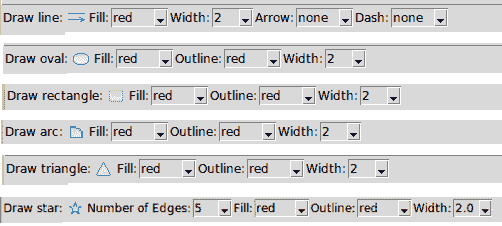

如所示，我们需要创建用于填充、轮廓、宽度、箭头和虚线的 Combobox 小部件。我们首先将 `ttk` 模块导入到我们的命名空间中，然后创建如以下代码所示的小部件 Combobox（参见代码 `6.06.py`）：

```py
def create_fill_options_combobox(self):
  Label(self.top_bar, text='Fill:').pack(side="left")
  self.fill_combobox = ttk.Combobox(self.top_bar, state='readonly', 
    width=5)
  self.fill_combobox.pack(side="left")
  self.fill_combobox['values'] = ('none', 'fg', 'bg', 'black', 'white')
  self.fill_combobox.bind('<<ComboboxSelected>>', self.set_fill)
  self.fill_combobox.set(self.fill)
```

ttk Combobox 小部件绑定到另一个名为 `set_fill` 的方法，该方法定义如下 (`6.06.py`):

```py
def set_fill(self, event=None):
  fill_color = self.fill_combobox.get()
  if fill_color == 'none':
    self.fill = '' # transparent
  elif fill_color == 'fg':
    self.fill = self.foreground
  elif fill_color == 'bg':
   self.fill = self.background
  else:
   self.fill = fill_color
```

我们为`width`、`outline`、`arrow`和`dash`属性定义了一个类似的`combobox`。我们还定义了一个`combobox`，允许用户更改星形中的辐条数量。

由于所有这些方法的代码与我们刚刚讨论的代码非常相似，我们在这里不对其进行探讨 (`6.06.py`)*.*

最后，我们将所需的组合框添加到六个选项方法中的每一个，具体如下：

```py
def draw_line_options(self):
  self.create_fill_options_combobox()
  self.create_width_options_combobox()
  self.create_arrow_options_combobox()
  self.create_dash_options_combobox() 
```

所有其他五个工具栏按钮也有类似的代码（参见代码`6.06.py`）。

现在，如果你运行代码`6.06.py`，它应该显示前六个按钮的选项。

当你更改选项时，更改将在画布上的所有后续绘图中得到反映。

然而，我们的代码中存在一个小错误。如果有人将填充颜色选为了前景颜色怎么办？然后他们从颜色调色板中更改了前景颜色。尽管这改变了前景属性的值，但它并没有改变填充属性的值。我们的程序将继续使用旧的填充颜色值。

为了修复这个错误，我们修改了`set_background_color`和`set_foreground_color`的代码，使其调用两个新的方法：

```py
def try_to_set_fill_after_palette_change(self):
  try:
    self.set_fill()
  except:
    pass

def try_to_set_outline_after_palette_change(self):
  try:
   self.set_outline()
  except:
   pass

```

这两种方法被放在一个 `try…except` 块中，因为并非每个工具栏按钮都会有一个填充和轮廓选项的 `combobox`。即使一个工具栏按钮有填充或轮廓 `combobox`，它也可能没有被选中来使用前景或背景颜色。

最后，由于我们希望`draw_line`选项在程序启动时立即填充顶部栏，我们在`create_gui`方法中添加了以下两行代码（参见`6.06.py`代码）：

```py
self.show_selected_tool_icon_in_top_bar("draw_line")
self.draw_line_options() 
```

这次迭代到此结束。我们将在下一个迭代中为几个其他工具栏按钮添加功能。

# 绘制不规则线条和超级形状

让我们现在添加绘制不规则或连续自由流动线条的功能。我们还将添加在绘图画布上绘制各种有趣形状的能力，如图所示：

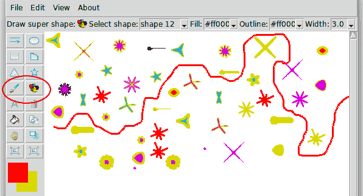

作为提醒，我们所有的按钮都链接到在`tool_bar_functions`元组中定义的动态函数。此外，我们可以通过在函数名中添加`_options`字符串来为特定的函数指定唯一选项。

# 绘制不规则线条

要添加绘制不规则线条的功能，我们只需定义名为 `draw_irregular_line` 的方法。要指定出现在顶部栏中的选项，我们需要定义名为 `draw_irregular_line_options` 的方法。

我们将 `draw_irregular_line` 方法定义为如下（参见代码 `6.07.py`）：

```py
def draw_irregular_line(self):
 self.current_item = self.canvas.create_line(
   self.start_x, self.start_y, self.end_x, self.end_y, fill=self.fill, 
     width=self.width)
 self.canvas.bind("<B1-Motion>", self.draw_irregular_line_update_x_y)

def draw_irregular_line_update_x_y(self, event=None):
 self.start_x, self.start_y = self.end_x, self.end_y
 self.end_x, self.end_y = event.x, event.y
 self.draw_irregular_line()
```

上述代码与`draw_line`函数的代码类似，但增加了一条额外的线，将鼠标点击的移动绑定到一个新方法，该方法用结束的*x*，*y*坐标替换开始的*x*，*y*坐标，并再次调用`draw_irregular_line`方法，从而以连续的方式绘制。

顶部栏中显示的选项是通过以下方法定义的（参见代码`6.07.py`）：

```py
def draw_irregular_line_options(self):
  self.create_fill_options_combobox()
  self.create_width_options_combobox() 
```

现在我们可以画不规则的线条在画布上了。然而，由于我们修改了鼠标绑定，所有其他方法也将开始以连续的方式绘制。

因此，我们需要将按钮重新绑定到它们原始的绑定上。我们通过修改`on_tool_bar_button_clicked`函数来调用`bind_mouse`函数，然后该函数将鼠标绑定恢复到其原始行为。

将事件绑定添加到多个方法中会清除之前的绑定，新绑定将替换任何现有的绑定。

或者，您可以使用`add="+"`作为附加参数来保持对同一事件的多个绑定，如下所示：

`mywidget.bind("<SomeEvent>", method1, add="+")`

`mywidget.bind("<SameEvent>", method2, add="+")`

这将使相同的事件绑定到`method1`和`method2`。

# 绘制超级形状

我们将这些形状称为超级形状，因为我们可以使用一个名为**超级公式**的单个数学公式构建许多有趣的形状。有关公式的更多详细信息，请参阅[`en.wikipedia.org/wiki/Superformula`](https://en.wikipedia.org/wiki/Superformula)。

超级公式包含六个输入参数：`a`、`b`、`m`、`n1`、`n2`和`n3`。改变这五个参数会产生自然界中发现的多种形状，例如贝壳、海星、花朵等形状。

我们并不深入探讨这个公式的原理或运作方式。我们只是编写了一个方法，给定这五个参数，它会返回独特形状的坐标。然后我们将这些坐标传递给我们的`create_polygon`方法，在画布上创建这些形状。返回这些点的这个方法定义如下（见代码`6.07.py`）：

```py
def get_super_shape_points(self, a, b, m, n1, n2, n3):
  # https://en.wikipedia.org/wiki/Superformula
  points = []
  for i in self.float_range(0, 2 * math.pi, 0.01):
   raux = (abs(1 / a * abs(math.cos(m * i / 4))) ** n2 + \
           abs(1 / b * abs(math.sin(m * i / 4))) ** n3)
   r = abs(raux) ** (-1 / n1)
   x = self.end_x + r * math.cos(i)
   y = self.end_y + r * math.sin(i)
   points.extend((x, y))
return points
```

该方法使用自定义的 `float_range` 方法，因为 Python 的内置 `range` 方法不允许使用浮点步长。`float_range` 生成器方法定义如下：

```py
def float_range(self, x, y, step):
  while x < y:
   yield x
   x += step
```

接下来，我们定义`draw_super_shape`方法，该方法使用计算出的点创建一个多边形（参见代码`6.07.py`）：

```py
def draw_super_shape(self):
  points = self.get_super_shape_points 
    (*super_shapes[self.selected_super_shape])
  self.current_item = self.canvas.create_polygon(points, 
    outline=self.outline,  
      fill=self.fill, width=self.width)
```

现在我们希望向超级公式提供一组不同的五个参数。我们定义一个新的文件名为 `supershapes.py`，其中包含一个名为 `super_shapes` 的字典，该字典以形状名称和五个参数的形式表示不同的形状，如下所示：

```py
super_shapes = {
 "shape A": (1.5, 1.5, 5, 2, 7, 7),
 "shape B": (1.5, 1.5, 3, 5, 18, 18),
 "shape C": (1.4, 1.4, 4, 2, 4, 13),
 "shape D": (1.6, 1.6, 7, 3, 4, 17),
 "shape E": (1.9, 1.9, 7, 3, 6, 6),
 "shape F": (4, 4, 19, 9, 14, 11),
 "shape G": (12, 12, 1, 15, 20, 3),
 "shape H": (1.5, 1.5, 8, 1, 1, 8),
 "shape I": (1.2, 1.2, 8, 1, 5, 8),
 "shape J": (8, 8, 3, 6, 6, 6),
 "shape K": (8, 8, 2, 1, 1, 1),
 "shape L": (1.1, 1.1, 16, 0.5, 0.5, 16)
 }
```

我们还定义了一个属性（参见代码`6.07.py`）：

```py
selected_super_shape = "shape A" 
```

接下来，我们定义一个`combobox`，让用户从之前定义的形状中选择（`6.07.py`）：

```py
def create_super_shapes_options_combobox(self):
  Label(self.top_bar, text='Select shape:').pack(side="left")
  self.super_shape_combobox = ttk.Combobox(self.top_bar, 
    state='readonly', width=8)
  self.super_shape_combobox.pack(side="left")
  self.super_shape_combobox['values'] = sorted(tuple(shape for shape in  
    super_shapes.keys()))
  self.super_shape_combobox.bind('<<ComboboxSelected>>', 
    self.set_selected_super_shape)
  self.super_shape_combobox.set(self.selected_super_shape)
```

我们定义了一种方法，用于设置`selected_super_shape`的选定形状值（参见代码`6.07.py`）：

```py
def set_selected_super_shape(self, event=None):
  self.selected_super_shape = self.super_shape_combobox.get()
```

最后，我们定义了`draw_super_shapes_options`，它显示了我们在顶部选项栏中想要显示的所有选项（参见代码`6.07.py`）：

```py
def draw_super_shape_options(self):
  self.create_super_shapes_options_combobox()
  self.create_fill_options_combobox()
  self.create_outline_options_combobox()
  self.create_width_options_combobox()
```

这就完成了迭代。现在你可以运行 `*6.07.py*` 并绘制不规则线条以及我们在 `supershapes.py` 文件中定义的所有超形状。实际上，你只需通过更改五个参数的值，就可以扩展 `super_shapes` 字典来添加更多形状。你可以查看 [`en.wikipedia.org/wiki/Superformula`](https://en.wikipedia.org/wiki/Superformula) 了解创建有趣形状的参数值。

# 向剩余的按钮添加功能

我们现在将编写与剩余工具栏按钮相关的功能代码：

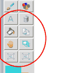

具体来说，我们将编写以下函数：`draw_text`、`delete_item`、`fill_item`、`duplicate_item`、`move_to_top`、`drag_item`、`enlarge_item_size`和`reduce_item_size`。

让我们从`draw_text`的代码开始。当用户点击`draw_text`按钮时，我们希望在顶部栏显示以下选项：

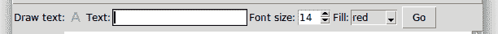

用户可以在文本框中输入文本并指定其字体大小和填充颜色。一旦用户按下“Go”按钮，文本就会出现在画布的中央。

因此，我们将`draw_text_options`方法定义为如下（参见代码`6.08.py`）：

```py
def draw_text_options(self):
  Label(self.top_bar, text='Text:').pack(side="left")
  self.text_entry_widget = Entry(self.top_bar, width=20)
  self.text_entry_widget.pack(side="left")
  Label(self.top_bar, text='Font size:').pack(side="left")
  self.font_size_spinbox = Spinbox(self.top_bar, from_=14, to=100, width=3)
  self.font_size_spinbox.pack(side="left")
  self.create_fill_options_combobox()
  self.create_text_button = Button(self.top_bar,                  
    text="Go", command=self.on_create_text_button_clicked)
  self.create_text_button.pack(side="left", padx=5)
```

上述代码一目了然。Go 按钮连接到一个名为`on_create_text_button_clicked`的命令回调，其定义如下（参见代码`6.08.py`）：

```py
def on_create_text_button_clicked(self):
  entered_text = self.text_entry_widget.get()
  center_x = self.canvas.winfo_width()/2
  center_y = self.canvas.winfo_height()/2
  font_size = self.font_size_spinbox.get()
  self.canvas.create_text(center_x, center_y, font=("", font_size),   
    text=entered_text, fill=self.fill)
```

我们的 `draw_text` 方法现在已可用。接下来，让我们编写 `delete_item` 方法。

我们现在想要进行的操作与它们的 predecessors 略有不同。以前，我们在画布上创建项目。现在，我们必须针对画布上已经存在的项目。

需要被定位的目标项是用户用鼠标点击的那个。幸运的是，使用当前标签获取鼠标下方的目标项句柄非常简单。

因此，`delete_item` 函数的代码如下（参见代码 `6.08.py`）：

```py
def delete_item(self):
  self.current_item = None
  self.canvas.delete("current") 
```

现在，如果您从工具栏中选择删除按钮并点击画布上的任何项目，该项目将被删除。

接下来，让我们编写`fill_item`和`fill_item_options`方法（参见代码`6.08.py`）：

```py
def fill_item(self):
  try:
    self.canvas.itemconfig("current", fill=self.fill, outline=self.outline)
  except TclError:
     self.canvas.itemconfig("current", fill=self.fill)
```

我们不得不使用`try…except`块，因为一些画布项目如线条和文本没有轮廓选项：

```py
def fill_item_options(self):
  self.create_fill_options_combobox()
  self.create_outline_options_combobox()
```

接下来，我们编写`duplicate_item`方法。为了复制一个项目，我们需要知道以下三件事：

+   项目类型——如果项目是`直线`、`椭圆`、`弧线`、`矩形`或`多边形`

+   该项目的坐标

+   项目配置

我们可以使用`type`方法将项目类型作为字符串获取，如下所示：`canvas.type(item_specifier)`

这将返回一个如`line`、`oval`、`arc`、`rectangle`或`polygon`这样的字符串。为了重新创建相同类型的项，我们需要将字符串`create_`附加到返回的类型上并调用该方法。

通过调用坐标方法，可以获取给定项目的坐标，如下所示：

`` `coordinates = canvas.coords("item_specifier")` ``

获取一个项目的配置可以通过以下命令以字典的形式获得：

`canvas.itemconfig(item_specifier)`

这将返回一个项目的所有配置，无论是否指定。例如，以下是调用前面方法在画布项目上返回的字典的一个示例：

```py
{'outline': ('outline', '', '', 'black', 'red'), 'outlinestipple':
 ('outlinestipple', '', '', '', ''), 'activestipple':
 ('activestipple', '', '', '', ''), 'state': ('state', '', '',
 '', ''), 'offset': ('offset', '', '', '0,0', '0,0'),
 'activefill': ('activefill', '', '', '', ''), 'disabledwidth':
 ('disabledwidth', '', '', '0.0', '0'), 'disabledoutlinestipple':
 ('disabledoutlinestipple', '', '', '', ''), 'outlineoffset':
 ('outlineoffset', '', '', '0,0', '0,0'), 'width': ('width', '',
 '', '1.0', '2.0'), 'disabledfill': ('disabledfill', '', '', '',
 ''), 'disabledoutline': ('disabledoutline', '', '', '', ''),
 'dash': ('dash', '', '', '', ''), 'disableddash':
 ('disableddash', '', '', '', ''), 'disabledstipple':
 ('disabledstipple', '', '', '', ''), 'tags': ('tags', '', '',
 '', 'current'), 'stipple': ('stipple', '', '', '', ''),
 'activewidth': ('activewidth', '', '', '0.0', '0.0'),
 'activedash': ('activedash', '', '', '', ''), 'dashoffset':
 ('dashoffset', '', '', '0', '0'), 'activeoutlinestipple':
 ('activeoutlinestipple', '', '', '', ''), 'activeoutline':
 ('activeoutline', '', '', '', ''), 'fill': ('fill', '', '', '',
 'red')}
```

显然，我们不需要那些为空或为零的配置值。因此，我们编写了一个方法来过滤掉所有不必要的配置：

```py
def get_all_configurations_for_item(self):
  configuration_dict = {}
  for key, value in self.canvas.itemconfig("current").items():
      if value[-1] and value[-1] not in ["0", "0.0", "0,0", "current"]:
         configuration_dict[key] = value[-1]
 return configuration_dict
```

现在我们知道了如何获取所有必要的元素来复制画布项目，以下是`duplicate_item`函数的代码（参见代码`6.08.py`）：

```py
def duplicate_item(self):
  try:
     function_name = "create_" + self.canvas.type("current")
  except TypeError:
     return
  coordinates = tuple(map(lambda i: i+10, self.canvas.coords("current")))
  configurations = self.get_all_configurations_for_item()
   self.canvas_function_wrapper(function_name, coordinates, configurations)
```

最后，最后一行调用了一个`包装器`函数，该函数实际上运行了复制画布项的函数（参见代码`6.08.py`）：

```py
def canvas_function_wrapper(self, function_name, *arg, **kwargs):
  func = getattr(self.canvas, function_name)
  func(*arg, **kwargs) 
```

现在，如果您创建一个项目，选择复制项目按钮，然后点击该项目，就会创建一个复制项目。然而，由于我们不希望复制项目正好位于现有项目上方，我们将其坐标从被复制的项目坐标偏移`10`像素。这种偏移是在以下行中完成的：

```py
coordinates = tuple(map(lambda i: i+10, self.canvas.coords("current")))
```

现在，如果你在画布上创建一个项目，选择复制项目按钮，然后点击该项目，它的副本将在原始项目偏移`10`像素的位置创建。

接下来，我们编写`move_to_top`方法。我们已经讨论过，添加到画布上的项目是逐个叠加的。如果我们想移动之前添加到画布上的一个项目呢？以下图示展示了将一个项目移动到另一个项目之上的含义：


我们使用`tag_raise`和`tag_lower`方法来移动栈中的项目上下移动。我们使用`tag_raise`来定义`move_to_top`方法如下（参见代码`6.08.py`）：

```py
def move_to_top(self):
  self.current_item = None
  self.canvas.tag_raise("current")
```

上述代码将点击的项目在项目堆栈中提升到最高位置。

当你在画布上绘制多个项目时，这些项目会被放置在一个堆栈中。默认情况下，新项目会被添加到之前绘制在画布上的项目之上。然而，你可以通过以下方式更改堆栈顺序：

`canvas.tag_raise(item)`.

如果多个项目匹配，它们都会被移动，并保持它们相对的顺序。然而，这种方法不会改变您在画布内绘制的任何新窗口项目的堆叠顺序。

然后还有 `find_above` 和 `find_below` 方法，您可以使用这些方法在画布堆叠顺序中查找位于某个项目上方或下方的项目。

接下来，我们将定义`drag_item`方法。此方法使用移动方法来改变给定项的坐标（参见代码`6.08.py`）：

```py
def drag_item(self):
 self.canvas.move("current", self.end_x - self.start_x, self.end_y -  self.start_y)
 self.canvas.bind("<B1-Motion>", self.drag_item_update_x_y)

def drag_item_update_x_y(self, event):
 self.start_x, self.start_y = self.end_x, self.end_y
 self.end_x, self.end_y = event.x, event.y
 self.drag_item()
```

由于我们希望阻力连续发生而不是从一个地方跳跃到另一个地方，我们暂时将鼠标绑定绑定到更新起始和结束坐标，就像我们在定义`draw_irregular_line`方法时做的那样。

最后，我们定义了两种方法来放大和缩小项目大小。我们将使用`canvas.scale`方法将项目大小增加和减少 20%：

```py
def enlarge_item_size(self):
  self.current_item = None
  if self.canvas.find_withtag("current"):
    self.canvas.scale("current", self.end_x, self.end_y, 1.2, 1.2)
    self.canvas.config(scrollregion=self.canvas.bbox(tk.ALL))

def reduce_item_size(self):
  self.current_item = None
  if self.canvas.find_withtag("current"):
    self.canvas.scale("current", self.end_x, self.end_y, .8, .8)
    self.canvas.config(scrollregion=self.canvas.bbox(tk.ALL))
```

注意，在项目大小调整后，我们立即重新配置滚动区域选项以更新滚动条。

`bbox` 方法返回一个项目的边界框。语法是：`.canvas.bbox(item_specifier)`。这返回一个长度为 4 的元组作为边界框。如果省略了项目指定符，则返回所有项目的边界框。

注意，边界框的值是近似的，可能比实际值相差几个像素。

这完成了迭代。左侧工具栏中的所有按钮现在都已启用（参见代码`6.08.py`）。

# 向菜单项添加功能

回想一下，在创建我们的菜单时使用`Framework`类，我们创建了与菜单项相关联的空方法。现在，我们将修改这些空方法，使它们变得可用（参见代码`6.09.py`）

文件 | 新菜单：

画布删除方法可以用于删除一个项目，给定一个项目指定符。在这里，我们使用`ALL`来删除画布上的所有项目：

```py
def on_new_file_menu_clicked(self, event=None):
  self.start_new_project()

def start_new_project(self):
  self.canvas.delete(ALL)
  self.canvas.config(bg="#ffffff")
  self.root.title('untitled')
```

文件 | 保存, 文件 | 另存为:

Tkinter 允许您使用 `postscript()` 命令将画布对象保存为 postscript 文件。请注意，然而，生成的 postscript 文件无法保存画布上的图像或任何嵌入的控件。此外，请注意，Tkinter 控件的 pickling 或保存为 `.jpg` 或 `.png` 格式是不可能的。这是 Tkinter 的主要限制之一。

这里是保存和另存为功能的代码（参见代码`6.09.py`）：

```py
def actual_save(self):
  self.canvas.postscript(file=self.file_name, colormode='color')
  self.root.title(self.file_name)
```

我们没有讨论“关闭”和“关于”菜单，因为我们已经在所有之前的项目中编码了类似的菜单（见代码`6.09.py`）。

编辑 | 撤销:

回想一下，所有添加到画布上的项目都存储在堆栈中。我们可以使用画布命令来访问堆栈：

```py
canvas.find("all") 
```

使用这个功能，我们实现了一个非常基础的撤销操作，它允许我们删除画布上最后绘制的项目。

因此，添加撤销功能的代码如下（参见代码`6.09.py`):

```py
def on_undo_menu_clicked(self, event=None):
   self.undo()

def undo(self):
  items_stack = list(self.canvas.find("all"))
  try:
    last_item_id = items_stack.pop()
  except IndexError:
    return
  self.canvas.delete(last_item_id)

```

注意，这不会撤销任何样式更改，例如颜色、宽度、轮廓等变化。实际上，它只能删除堆栈中的最后一个项目。

我们可以通过保存所有操作到一个合适的数据结构中来实现一个完整的撤销栈，但这将是一个值得单独成章的练习。

除了我们在这里使用的查找方法外，Canvas 小部件还有一个名为：

```py
find_closest(x, y, halo=None, start=None) 
```

它返回画布上给定位置最近的项的手柄。这意味着如果画布上只有一个项，无论你点击得有多近或多远，它都会被选中。

如果，另一方面，你只想在某个特定区域内使用对象，你可以使用：

```py
find_overlapping(x1, y1, x2, y2) 
```

这将返回所有与给定矩形重叠或完全被其包围的项目。

现在我们已经掌握了要操作的项目，我们可以继续进行我们想要对项目做的任何操作。

要查看完整的画布方法列表，请参阅[`infohost.nmt.edu/tcc/help/pubs/tkinter/web/canvas-methods.html`](http://infohost.nmt.edu/tcc/help/pubs/tkinter/web/canvas-methods.html).

查看视图 | 放大视图，查看视图 | 缩小视图：

最后，我们使用 `canvas.scale` 方法定义了这两种方法。我们之前已经使用过缩放方法来放大和缩小单个项目。在这里，我们只需在 `ALL` 项目指定器上使用该方法，如下代码所示（参见代码 `6.09.py`）：

```py
def canvas_zoom_in(self):
  self.canvas.scale("all", 0, 0, 1.2, 1.2)
  self.canvas.config(scrollregion=self.canvas.bbox(ALL))
```

这就结束了迭代和这一章节。

# 摘要

总结来说，在本章中，我们首先在 Tkinter 之上创建了一个自定义的 GUI 框架。

我们看到了如何使用 GUI 框架来生成我们程序的样板代码，从而确保最大程度的代码复用和快速应用开发。

接下来，我们详细探讨了 Canvas 小部件。我们了解了如何创建各种画布项目。然后，我们看到了如何使用标签或 ID 来操作这些画布项目的属性。

我们看到了 Tkinter 的 `colorchooser` 模块在实际中的应用。我们使用了 ttk Combobox 小部件。我们还查看了一些所有 Tkinter 小部件都有的常用方法。

我们也看到了编写使用约定而非配置来简化程序逻辑流程的程序的好处。

# QA 部分

在你继续阅读下一章之前，请确保你能回答这些问题

满意度：

+   什么是软件框架？为什么它们会被使用？

+   在什么情况下使用软件框架而不是从头编写代码是有益的？

+   什么是结构化标记语言？你能列举一些吗？

+   什么是约定优于配置的软件设计范式？

+   在 Tkinter 的 Canvas 小部件的上下文中，标签有什么用途？

# 进一步阅读

阅读 Tkinter Canvas 小部件的完整文档。您可以通过在 Python 命令行中输入以下命令来找到文档：

```py
>>> import tkinter
>>>  help(tkinter.Canvas)
```
