# 第七章：钢琴辅导

在上一章中，我们探讨了 Canvas 小部件可用的常见选项。现在，让我们看看 PhotoImage 小部件的实际应用。

让我们构建一个名为 *钢琴辅导* 的程序。这个程序将帮助新手钢琴演奏者识别音阶、和弦以及和弦进行。它还将帮助钢琴学习者学习和识别乐谱上的音乐。拥有一些音乐知识的人会感到如鱼得水，但如果你对钢琴或音阶、和弦、和弦进行等音乐术语一无所知，也不要担心。随着我们的进展，我们将涵盖音乐知识的最基本内容。

在其最终形式中，该程序看起来如下：

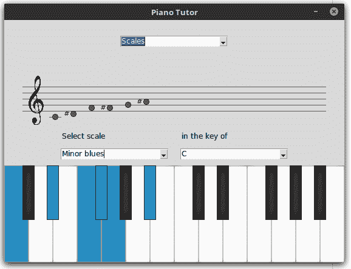

钢琴辅导课程将包含*三个主要部分*，您可以从最顶部的下拉菜单中选择。具体如下：

+   规模查找器

+   和弦查找器

+   和弦进行构建器

本章的一些关键目标包括：

+   理解在根窗口上定义的一些重要方法

+   使用 PhotoImage 小部件类

+   Place 几何管理器的实际应用

+   理解网格权重

+   学习如何处理看似复杂的概念，例如以计算机能够理解的方式表示音乐知识

+   使用 JSON 存储数据

# 技术要求

除了 Tkinter，我们还将使用几个标准的 Python 库。接下来的导入应该不会出现任何错误，因为它们在大多数 Python 发行版中都是内置的：

```py
import json, collections, functools, math
```

此外，我们使用`simpleaudio`模块，这是一个允许我们在钢琴上播放音符的模块。

您可以使用以下命令安装 `simpleaudio`：

```py
pip3 install simpleaudio
```

# 钢琴术语简要入门

由于这是一个与钢琴相关的程序，因此需要简要了解在此背景下使用的某些常用术语。

在本节中，我们将以此图作为参考：

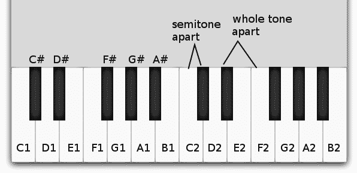

钢琴的键盘由一组 12 个键（七个白键和五个黑键）组成，这形成了所谓的**音阶**。这 12 个键的模式不断重复，在标准钢琴上总共有 88 个键。在先前的图像中，这个模式重复了两次（从*C1*到*B1*，然后从*C2*到*B2*）。

任何两个相邻键之间的距离被称为**半音**。请注意这个术语，因为我们将会使用半音来定义所有与钢琴相关的规则——即键之间的距离度量。两个半音的间隔被称为**全音**。就我们的程序而言，我们不会关心全音。

钢琴的白键被标记为音符名称 *A* 到 *G*。然而，按照惯例，音符的计数从 *C* 开始。*C* 是位于两组黑色键之前的第一个白键。白键的名称标记在键上，而黑键的名称则标记在其上方。

由于存在多套 12 个键的集合，它们通过在其后附加一个数字来相互区分。例如，*C1* 是第一个白键，而 *C2* 是同一位置上的键，但音高高一个八度。紧挨着 *C* 的黑键被称为 **C#**（**C sharp**）。由于它也在 **D** 键之前，它还有一个名字——*D* 平（D♭）。然而，我们将坚持使用升号符号（#）来称呼所有黑键。由于音符 *E* 和 *B* 没有升音键，它们后面不直接跟着任何黑键。

# 学习关于比例的知识

**音阶**是一系列从特定模式中选取的 12 个音符的有序序列，这赋予它一种特有的感觉，可能是快乐的、悲伤的、异国情调的、东方的、神秘的或叛逆的感觉。音阶可以从 12 个音符中的任何一个音符开始，并遵循一个确定的模式。音阶的第一个音符被称为其**基音**，它遵循的模式决定了音阶的类型。

对我们来说，有一个特别的音阶称为**大调音阶**。从任何键开始，大调音阶遵循以下模式：

W W S W W W S

其中 *W* 代表全音（两个键的跳跃）和 *S* 代表半音（一个键的跳跃）。

例如，如果你依次演奏音符 *C1*、*D1*、*E1*、*F1*、*G1*、*A1*、*B1*、*C2*，然后再返回，你就演奏了一个 *C* 大调。大调听起来让人振奋，而另一个名为小调的音阶听起来可能有点悲伤。不用担心名称——有成百上千种音阶，我们只需要知道音阶是一系列按照一定规则一起演奏的音符的 *序列*。

# 学习和弦

相比之下，**和弦**是指同时演奏两个或更多音符。例如，如果我同时演奏三个音符 C、F 和 G；那就是一个和弦。和弦通常为音乐提供低音部分。

如果你一遍又一遍地弹奏同一个和弦，它听起来会单调乏味——所以你会从一个和弦跳到另一个和弦——再次遵循一个规则。这被称为**和弦进行**。更简单地说，一系列有序的和弦被称为和弦进行。

音乐符号可以写在乐谱或**五线谱**上，它由五条线组成。音符由黑色圆点表示，这些圆点可以位于线上或它们之间的空白处。以下五线谱上显示了两个八度音符的名称。标记为**高音谱号**的图标表示这些音符应由右手演奏：

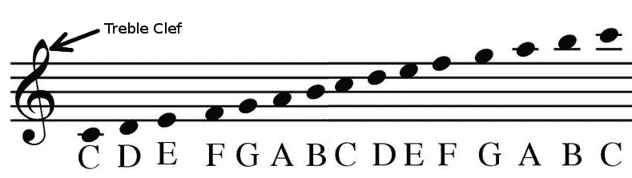

不要担心，我们完成项目时不需要记住音乐符号。然而，我们在绘制乐谱时将会将其作为参考。

我们现在已经拥有了编写这个程序所需的所有音乐知识。让我们开始编码。

# 构建广泛的 GUI 结构

我们像往常一样从构建根窗口开始（`7.01/view.py`）：

```py
root = Tk()
SCREEN_WIDTH = root.winfo_screenwidth()
SCREEN_HEIGHT = root.winfo_screenheight()
SCREEN_X_CENTER = (SCREEN_WIDTH - WINDOW_WIDTH) / 2
SCREEN_Y_CENTER = (SCREEN_HEIGHT - WINDOW_HEIGHT) / 2
root.geometry('%dx%d+%d+%d' % (WINDOW_WIDTH, WINDOW_HEIGHT, SCREEN_X_CENTER,  SCREEN_Y_CENTER))
root.resizable(False, False)
PianoTutor(root)
root.mainloop()
```

我们还创建了一个名为 `constants.py`（`7.01`）的新文件，该文件目前包含窗口的高度参数。

我们使用两种根窗口方法，`root.winfo_screenwidth()` 和 `root_winfo_screenheight()`，分别获取屏幕的宽度和高度。我们定义了两个常量，`WINDOW_WIDTH` 和 `WINDOW_HEIGHT`，然后将窗口放置在计算机屏幕的 *x*，*y* 中心。

注意到这一行代码 `root.resizable(False, False)`。这个 `root` 窗口方法接受两个布尔参数来决定窗口是否在 *x* 和 *y* 方向上可调整大小。将这两个参数都设置为 `False` 使得我们的窗口大小固定。

根窗口随后被传递给一个新的类，`PianoTutor`，该类负责构建程序的内部结构。这个类将在下面定义。

该程序的图形用户界面分为四个主要行：

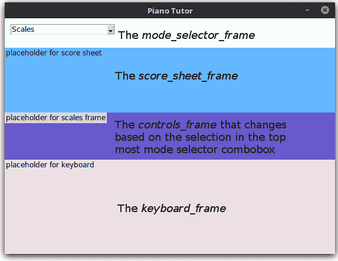

最顶行是在名为 `mode_selector_frame` 的 `Frame` 中构建的，并包含一个 `combobox`，允许用户从三个选项中选择一个——音阶、和弦以及和弦进行。

第二行是放置乐谱的占位符，因此被称为`score_sheet_frame`。

第三行需要一点注意。根据在顶部`combobox`中选择的选项，这一行的内容会发生变化。在我们目前的代码中（`7.01/view.py`*），它显示三个不同颜色的框架，对应于使用顶部`combobox`可以做出的三种不同选择。由于我们将在这一框架上放置控件，我们决定将其称为`controls_frame`，因为没有更好的名字。

第四行显示了钢琴键盘，框架被命名为 `keyboard_frame`，其实现将在标题为 *制作钢琴键盘* 的章节中进行讨论。

# 建立骨架结构

首先，我们创建一个名为 `PianoTutor` 的类（`7.01/view.py`），其 `__init__` 方法定义如下：

```py
class PianoTutor:

  def __init__(self, root):
    self.root = root
    self.root.title('Piano Tutor')
    self.build_mode_selector_frame()
    self.build_score_sheet_frame()
    self.build_controls_frame()
    self.build_keyboard_frame()
    self.build_chords_frame()
    self.build_progressions_frame()
    self.build_scales_frame()
```

在前面的代码中，我们只是简单地定义了方法调用，以构建多个具有预定义高度的 Frame 小部件。由于我们在前几章中已经编写了类似的代码，因此我们不会对前面的代码进行过多解释。

让我们来看一下创建框架的一个示例。所有其他框架都遵循类似的模式（`7.01 /view.py`）并且在此处不会进行讨论：

```py
 def build_score_sheet_frame(self):
   self.score_sheet_frame = Frame(self.root, width=WINDOW_WIDTH, height=                    
                      SCORE_DISPLAY_HEIGHT, background='SteelBlue1')
   self.score_sheet_frame.grid_propagate(False)
   Label(self.score_sheet_frame, text='placeholder for score sheet',  
                       background='SteelBlue1').grid(row=1, column=1)
   self.score_sheet_frame.grid(row=1, column=0)
```

这是通过`grid`布局管理器创建简单`Frame`的过程。然而，请注意这一行`self.score_sheet_frame.grid_propagate(False)`。

在 Tkinter 中，容器窗口（前一个示例中的 Frame）被设计为*自动调整大小以适应*其内容。

尽管我们明确地为框架添加了宽度或高度，如果我们注释掉`grid_propagate(false)`这一行，你会注意到我们提供的宽度和高度参数被简单地忽略，框架将缩小以恰好适应其子元素——在我们的例子中是标签小部件的高度。我们不希望允许框架缩小，而`grid_propagate(False)`则让我们实现了这一点。

如果我们使用包管理器，我们会使用 `frame.pack_propagate(False)` 来达到相同的效果。

接下来，我们最顶层的模式选择器 `combobox` 绑定到以下回调函数（`7.01/view.py`）：

```py
self.mode_selector.bind("<<ComboboxSelected>>", self.on_mode_changed)
```

这是我们定义`on_mode_changed`方法的方式（`7.01/view.py`）：

```py
def on_mode_changed(self, event):
  selected_mode = self.mode_selector.get()
  if selected_mode == 'Scales':
    self.show_scales_frame()
  elif selected_mode == 'Chords':
    self.show_chords_frame()
  elif selected_mode == 'Chord Progressions':
    self.show_progressions_frame()

def show_scales_frame(self):
  self.chords_frame.grid_remove()
  self.progressions_frame.grid_remove()
  self.scales_frame.grid()

def show_chords_frame(self):
  self.chords_frame.grid()
  self.progressions_frame.grid_remove()
  self.scales_frame.grid_remove()

def show_progressions_frame(self):
  self.chords_frame.grid_remove()
  self.progressions_frame.grid()
  self.scales_frame.grid_remove()
```

记下之前提到的 `grid_remove()` 方法。此方法将从网格管理器中移除小部件，从而使其不可见。您可以通过对其使用 `grid()` 来再次使其可见。因此，每当用户从最顶部的 `combobox` 中选择三个选项之一（`Scales`、`Chords` 和 `Chord Progression`）时，其他两个框架将使用 `grid_remove` 隐藏，而所选选项的框架将使用 `grid` 显示出来。

这完成了第一次迭代，我们在其中定义了具有根据顶部组合框中的选择在音阶、和弦和弦进行框架之间切换能力的广泛 GUI 结构。

# 制作钢琴键盘

让我们现在构建钢琴键盘。键盘上的所有键都将使用标签小部件（Label widget）制作。我们将使用 Tkinter 的`PhotoImage`类将标签小部件与黑白键的图像叠加。

`PhotoImage` 类用于在标签、文本、按钮和画布小部件中显示图像。我们在第二章，“制作文本编辑器”中使用了它来为按钮添加图标。由于这个类只能处理 `.gif` 或 `.bpm` 格式的图像，我们在名为 `pictures` 的文件夹中添加了四个 `.gif` 图像。这四个图像分别是 `black_key.gif`、`white_key.gif`、`black_key_pressed.gif` 和 `white_key_pressed.gif`。

由于我们将反复引用这些图像，我们将其引用添加到`7.02` `constants.py`文件中：

```py
WHITE_KEY_IMAGE = '../pictures/white_key.gif'
WHITE_KEY_PRESSED_IMAGE = '../pictures/white_key_pressed.gif'
BLACK_KEY_IMAGE = '../pictures/black_key.gif'
BLACK_KEY_PRESSED_IMAGE = '../pictures/black_key_pressed.gif'
```

之前使用的符号 `../` 是一种指定相对于当前工作目录的文件路径的方法。单个 `../` 表示退回一个目录，一对两个 `../../` 表示退回两个目录，以此类推。这个系统通常被大多数现代操作系统所支持。然而，一些非常古老的操作系统可能不支持它。因此，一个更好但更啰嗦的方法是使用 Python 的 `os` 模块来遍历目录。

接下来，我们将定义一个名为 `create_key` 的方法，该方法在给定的 `x` 位置为我们创建一个钢琴键：

```py
 def create_key(self, img, key_name, x_coordinate):
   key_image = PhotoImage(file=img)
   label = Label(self.keyboard_frame, image=key_image, border=0)
   label.image = key_image
   label.place(x=x_coordinate, y=0)
   label.name = key_name
   label.bind('<Button-1>', self.on_key_pressed)
   label.bind('<ButtonRelease-1>', self.on_key_released)
   self.keys.append(label)
   return label
```

这里是一个简短的代码描述：

+   注意，由于我们希望将键放置在特定的 x 坐标上，我们使用了 `place` 几何管理器。我们曾在 第一章，*认识 Tkinter* 中简要介绍了 place 几何管理器。现在是一个很好的时机来观察这个很少使用的几何管理器在实际中的应用。

+   此方法也接受一个图像位置作为其输入，并创建一个`PhotoImage`类，然后使用前一个示例中的`image=key_image`选项将该类附加到标签小部件上。

+   第三个参数，`key_name`，通过使用命令`widget.name = key_name`附加到创建的标签小部件上。这需要在以后识别哪个特定的键被按下。例如，为了创建第一个键*C1*，我们将名称*C1*附加到标签小部件上，然后以后可以通过调用`widget.name`来访问这个字符串值。

+   我们将标签绑定到两个事件，`'<Button-1>'` 和 `'<ButtonRelease-1>'`，以处理鼠标按下事件。

+   最后，我们将对新创建的小部件的引用添加到此处新定义的属性`self.keys`中。我们保留这个引用，因为我们还需要更改这些小部件的图片以突出显示键。

现在我们已经将事件附加到两个回调函数上了，接下来让我们定义它们：

```py
def on_key_pressed(self, event):
  print(event.widget.name + ' pressed') 
  self.change_image_to_pressed(event)

def on_key_released(self, event):
  print(event.widget.name + ' released' ) 
  self.change_image_to_unpressed(event)
```

目前，之前的方法会在按下键后打印按键名称，然后调用另外两个方法，在按键按下和释放时将按下标签的图像更改为不同颜色的图像：

```py
def change_image_to_pressed(self, event):
 if len(event.widget.name) == 2:
   img = WHITE_KEY_PRESSED_IMAGE
 elif len(event.widget.name) == 3:
   img = BLACK_KEY_PRESSED_IMAGE
 key_img = PhotoImage(file=img)
 event.widget.configure(image=key_img)
 event.widget.image = key_img

def change_image_to_unpressed(self, event):
  if len(event.widget.name) == 2:
    img = WHITE_KEY_IMAGE
  elif len(event.widget.name) == 3:
    img = BLACK_KEY_IMAGE
  key_img = PhotoImage(file=img)
  event.widget.configure(image=key_img)
  event.widget.image = key_img
```

白键小部件将有一个长度为`2`的名称（例如，`C1`，`D2`，`G1`），而黑键将有一个长度为`3`的图像（例如，`C#1`，`D#1`）。我们利用这一事实来决定是否使用黑键图像或白键图像。前述代码的其余部分应该是不言自明的。

# 组装键盘

现在终于到了将所有前面的方法结合起来构建我们完整的八度键盘的时候了。

我们首先在文件 `constants.py` 中定义了从 *C1* 到 *B2* 所有键的精确 `x_coordinates` 如下：

```py
WHITE_KEY_X_COORDINATES = [0,40, 80,120, 160, 200, 240,280, 320, 360, 400, 440, 480,520]
BLACK_KEY_X_COORDINATES = [30,70,150,190, 230, 310, 350, 430,470, 510]
```

前面的 *x* 坐标数值是通过简单的试错法获得的，以模拟它们在键盘上的位置。

然后我们将之前定义的 `build_keyboard_frame` 方法修改如下：

```py
 def build_keyboard_frame(self):
   self.keyboard_frame = Frame(self.root, width=WINDOW_WIDTH, 
               height=KEYBOARD_HEIGHT,   background='LavenderBlush2')
   self.keyboard_frame.grid_propagate(False)
   self.keyboard_frame.grid(row=4, column=0, sticky="nsew")
   for index, key in enumerate(WHITE_KEY_NAMES):
     x = WHITE_KEY_X_COORDINATES[index]
     self.create_key(WHITE_KEY_IMAGE, key, x )
   for index, key in enumerate(BLACK_KEY_NAMES):
     x = BLACK_KEY_X_COORDINATES[index]
     self.create_key(BLACK_KEY_IMAGE, key, x)
```

前一种方法的头三行保持与上一次迭代中定义的状态不变。然后我们遍历所有白键和黑键，在给定的 *x* 坐标处为它们创建标签。

这就完成了迭代。如果你现在运行 `7.02 view.py`，你应该看到一个八度键盘。当你按下任何键时，该键的图像应该变为蓝色，并且应该在终端中打印出按下的或释放的键的名称：

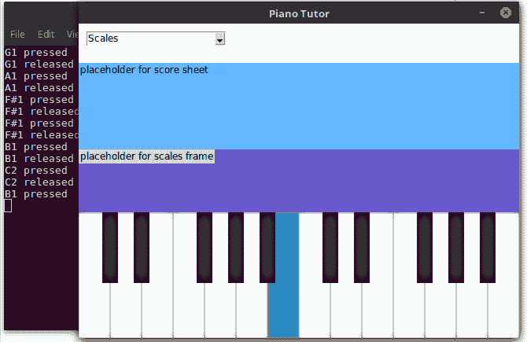

# 播放音频

首先，我们在本章代码文件夹中名为 `sounds` 的文件夹中添加了 24 个 `.wav` 格式的声音样本。这些音频文件对应于我们键盘上的 24 个音符。音频文件按照其代表的音符名称命名。

为了将音频处理与 GUI 代码分离，我们创建了一个名为`audio.py`的新文件（`7.03`）。代码定义如下：

```py
import simpleaudio as sa
from _thread import start_new_thread
import time

def play_note(note_name):
 wave_obj = sa.WaveObject.from_wave_file('sounds/' + note_name + '.wav')
 wave_obj.play()

def play_scale(scale):
 for note in scale:
   play_note(note)
   time.sleep(0.5)

def play_scale_in_new_thread(scale):
  start_new_thread(play_scale,(scale,))

def play_chord(scale):
  for note in scale:
    play_note(note)

def play_chord_in_new_thread(chord):
  start_new_thread(play_chord,(chord,))
```

代码描述如下：

+   `play_note` 方法遵循 `simpleaudio` 提供的 API 来播放音频文件

+   `play_scale` 方法接收一个音符列表并按顺序播放它们，在每播放一个音符之间留有时间间隔

+   `play_chord` 方法接受一个音符列表并一起播放这些音符

+   最后两种方法在新线程中调用这些方法，因为我们不想在播放这些音符时阻塞主 GUI 线程。

接下来，让我们导入这个文件（`7.03` `view.py`）：

```py
from audio import play_note    
```

接下来，修改`on_key_pressed`方法以播放指定的音符：

```py
def on_key_pressed(self, event):
 play_note(event.widget.name)
 self.change_image_to_pressed(event)
```

这就完成了迭代。如果你现在运行代码并按键盘上的任意键，它应该会播放那个键的音符。

接下来，我们开始构建实际的辅导工具。接下来的三个部分将开发音阶、和弦和弦进行部分。我们将从构建音阶辅导工具开始。

# 构建音阶辅导师

定义给定音阶应演奏哪些音符的所有规则都添加在一个名为 `scales.json` 的 JSON 文件中，该文件位于名为 `json` 的文件夹内。让我们来看看 `scales.json` 文件的前几行：

```py
{
 "Major": [ 0, 2, 4, 5, 7, 9, 11 ],
 "Minor": [ 0, 2, 3, 5, 7, 8, 10 ],
 "Harmonic minor": [ 0, 2, 3, 5, 7, 8, 11 ],
 "Melodic minor": [ 0, 2, 3, 5, 7, 9, 11 ],
 "Major blues": [ 0, 2, 3, 4, 7, 9 ],
 "Minor blues": [ 0, 3, 5, 6, 7, 10 ],
...
}
```

回想一下，音阶是一系列依次演奏的音符。音阶的第一个音符被称为其**根音**或**调性**。所以，如果你从一个音符，比如说音符*B*开始演奏音阶，你就是在*B*调上演奏音阶。

让我们来看一下键值对中的第四项。键名为 `"Melodic minor"`，其关联的值为 `[ 0, 2, 3, 5, 7, 9, 11 ]`。这意味着，要在 *B* 音上演奏旋律小调音阶，你需要将 *B* 作为第一个音项——在值列表中由 `0` 表示。下一个键比 *B* 高两个半音，第三个键比 *B* 高三个半音，接下来是 5，然后是 7，9，最后是比 *B* 高 11 个半音。

所以总结一下——为了在 B 调上演奏旋律小调，你需要按下以下键位：

```py
B, B+2, B+3, B+5, B+7, B+9 and B+11 keys
```

前面的数字代表半音。

因此，我们的任务是——给定一个音阶及其键，我们的程序应该突出显示这些键并播放它们：

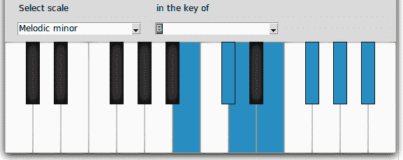

首先需要构建两个`combobox`，一个用于缩放，另一个用于键，正如之前所示。这对您来说应该很容易，因为我们之前章节中已经构建过`combobox`多次。

第二步涉及将 JSON 文件读入我们的程序中。

引用自 json.org ([`json.org/`](http://json.org/)):

JSON（JavaScript 对象表示法）是一种轻量级的数据交换格式。它易于人类阅读和编写。它也易于机器解析和生成。这些是通用的数据结构。几乎所有的现代编程语言都以某种形式支持它们。一个可以与编程语言交换的数据格式也基于这些结构是有意义的。更多关于 JSON 的信息请参阅[`www.json.org`](https://www.json.org)。

Python 实现了一个用于读取和写入 JSON 数据的标准模块，该模块名称恰当地被称为 `json`。

我们首先在我们的命名空间中导入内置的`json`模块：

```py
import json
```

我们接下来添加一个新的方法，`self.load_json_files()`，并在类的`__init__`方法中调用它：

```py
def load_json_files(self):
  with open(SCALES_JSON_FILE, 'r') as f:
    self.scales = json.load(f, object_pairs_hook=OrderedDict)
```

`SCALES_JSON_FILE` 路径在文件 `constants.py` 中定义*。*这会将刻度数据作为字典加载到 `self.scales` 属性中：

您可以使用`json.load`命令读取 JSON 文件。您可以使用`json.dump`命令写入 JSON 文件。然而，`json.load`方法不会保留解析的 JSON 文档中的键顺序。也就是说，`json.load`打乱了键的顺序。我们不希望打乱键的顺序，并希望它们按照在文件中提到的顺序出现。因此，我们使用`collections`模块中的`OrderedDict`类来保留键顺序。这是通过将第二个参数传递为`object_pairs_hook=OrderedDict`来实现的。`OrderedDict`是一个 Python 字典对象，它记得键首次插入的顺序。

现在我们已经有了`scales`数据作为字典`self.scales`可用，我们的下一个任务是确定要突出的键。我们首先在类的`__init__`方法中创建一个新的属性：

```py
self.keys_to_highlight = []  
```

接下来，我们定义了用于突出显示一个关键点的方法，以及用于突出显示一系列关键点的方法：

```py
def highlight_key(self, key_name):
 if len(key_name) == 2:
   img = WHITE_KEY_PRESSED_IMAGE
 elif len(key_name) == 3:
   img = BLACK_KEY_PRESSED_IMAGE
 key_img = PhotoImage(file=img)
 for widget in self.keys:
  if widget.name == key_name:
    widget.configure(image=key_img)
    widget.image = key_img

def highlight_list_of_keys(self, key_names):
  for key in key_names:
     self.highlight_key(key)
```

上述代码与之前我们编写的用于在按键时突出显示关键内容的代码类似。接下来，我们还需要方法来移除现有的突出显示：

```py
def remove_key_highlight(self, key_name):
  if len(key_name) == 2:
    img = WHITE_KEY_IMAGE
  elif len(key_name) == 3:
    img = BLACK_KEY_IMAGE
  key_img = PhotoImage(file=img)
  for widget in self.keys:
   if widget.name == key_name:
    widget.configure(image=key_img)
    widget.image = key_img

def remove_all_key_highlights(self):
  for key in self.keys_to_highlight:
    self.remove_key_highlight(key)
  self.keys_to_highlight = []
```

这里的逻辑与我们所应用的用于突出显示键的逻辑完全相同。

现在我们有了高亮和移除键高亮的方法，让我们定义两个组合框（用于缩放和键选择）所附加的回调函数：

```py
def on_scale_changed(self, event):
  self.remove_all_key_highlights()
  self.find_scale(event)

def on_scale_key_changed(self, event):
  self.remove_all_key_highlights()
  self.find_scale(event)
```

最后，这是选择哪些键要高亮的逻辑。此外，一旦我们有了要高亮的键列表，我们就将其传递给之前定义的`play_scale_in_new_thread`方法，该方法播放实际的音阶声音：

```py
def find_scale(self, event=None):
 self.selected_scale = self.scale_selector.get()
 self.scale_selected_key = self.scale_key_selector.get()
 index_of_selected_key = KEYS.index(self.scale_selected_key)
 self.keys_to_highlight = [ ALL_KEYS[i+index_of_selected_key] \
 for i in self.scales[self.selected_scale]]
 self.highlight_list_of_keys(self.keys_to_highlight)
 play_scale_in_new_thread(self.keys_to_highlight)
```

请注意代码中高亮的部分。

因此，给定所选键的索引，我们只需将所选比例列表中的所有项相加，即可获得要突出显示的键列表。

我们也希望程序运行时立即调用这个方法。因此，我们在`__init__`方法中直接添加了对`self.find_scale()`的调用。这确保了程序运行后，我们会被演奏的**C 大调音阶**（`combobox`中的默认选择）所迎接。

这就完成了迭代。现在如果你去运行 `7.04 view.py` 并选择合适的比例和键名，键盘将会高亮显示这些键，并且为你播放出来。

# 构建和弦查找部分

现在我们已经对处理 *JSON* 文件有了一定的了解，这应该很容易。让我们来看看 `json` 目录下 `chords.json` 文件的头几行：

```py
{
 "Major" : [0, 4, 7],
 "Minor" : [0, 3, 7],
 "Sus4" : [0, 5, 7],
 "5" : [0, 4, 6],
 "Diminished" : [0, 3, 6],
 ...
}
```

这与音阶结构非常相似。假设我们想要了解 C#大和弦的形态。所以我们从 C#键开始，它是`0`。然后我们查看大和弦的列表，它读作：`[0, 4, 7]`。所以从 C#开始，下一个需要突出的键是比它高 4 个半音的`4`，下一个是比 C#高 7 个半音的键。因此，C#大和弦的最终和弦结构将是：

```py
C#,    (C# + 4 semitones) ,      (C# + 7 semitones) 
```

界面（GUI）也非常类似于刻度（scales）部分：

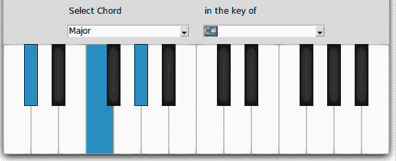

我们首先在`7.05 constants.py`文件中为`chords.json`文件路径添加一个常数：

```py
CHORDS_JSON_FILE = '../json/chords.json'
```

接下来，我们在新的类属性中读取这个文件的内容，`self.chords`：

```py
 with open(CHORDS_JSON_FILE, 'r') as f:
   self.chords = json.load(f, object_pairs_hook=OrderedDict)
```

我们随后修改和弦框架 GUI 以添加两个`combobox`（参见`7.05 view.py`中的完整 GUI `build_chords_frame`）：

```py
self.chords_selector = ttk.Combobox(self.chords_frame,  values=[k for k 
  in self.chords.keys()])
self.chords_selector.current(0)
self.chords_selector.bind("<<ComboboxSelected>>", self.on_chord_changed)
self.chords_selector.grid(row=1, column=1, sticky='e', padx=10, 
  pady=10)
self.chords_key_selector = ttk.Combobox(self.chords_frame, values=[k  
  for k in KEYS])
self.chords_key_selector.current(0)
self.chords_key_selector.bind("<<ComboboxSelected>>", self.on_chords_key_changed)
```

接下来，我们添加了之前定义的两个事件回调：

```py
def on_chord_changed(self, event):
  self.remove_all_key_highlights()
  self.find_chord(event)

def on_chords_key_changed(self, event):
  self.remove_all_key_highlights()
  self.find_chord(event)
```

`find_chord` 方法查询 `self.chords` 字典以获取要高亮显示的键，将根音符的键偏移量添加到其中，并调用它进行高亮显示和播放：

```py
def find_chord(self, event=None):
  self.selected_chord = self.chords_selector.get()
  self.chords_selected_key = self.chords_key_selector.get()
  index_of_selected_key = KEYS.index(self.chords_selected_key)
  self.keys_to_highlight = [ ALL_KEYS[i+index_of_selected_key] for \
                         i in self.chords[self.selected_chord]]
  self.highlight_list_of_keys(self.keys_to_highlight)
  play_chord_in_new_thread(self.keys_to_highlight)
```

本迭代中的最终代码修改了`on_mode_changed`方法，以便在选择和弦模式时立即突出显示和弦：

```py
 def on_mode_changed(self, event):
   self.remove_all_key_highlights()
   selected_mode = self.mode_selector.get()
   if selected_mode == 'Scales':
     self.show_scales_frame()
     self.find_scale()
   elif selected_mode == 'Chords':
     self.show_chords_frame()
     self.find_chord()
   elif selected_mode == 'Chord Progressions':
     self.show_progressions_frame()
```

这就完成了迭代。如果你现在运行 `7.05 view.py`，你会找到一个功能性的和弦部分，它让我们能够在不同的音阶中找到不同种类的和弦。

# 构建和弦进行教程

和弦进行部分的 GUI 组件比前两个部分稍微进化一些。下面是一个典型的和弦进行 GUI 的样貌：

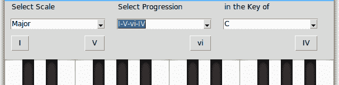

注意，本节使用的是组合框，而前几节使用的是两个。根据中间组合框中选择的进度，我们需要绘制一定数量的按钮，每个按钮代表完整和弦进行中的一个和弦。

在前面的截图里，请注意进度组合框的值为 I-V-vi-IV。这代表四个用连字符分隔的罗马数字。这意味着这个和弦进行由四个和弦组成。同时，注意其中一些罗马数字（I、V、IV 等）是大写字母，而另一些（vi）是小写字母。系列中的所有大写字母表示大和弦，而每个小写字母代表小和弦。

接下来，让我们看一下来自`json`文件夹的`progressions.json`文件：

```py
{
 "Major": {
 "I-IV-V": [ "0", "5", "7" ],
 "ii-V-I": [ "2", "7", "0" ],
 "I-V-vi-IV": [ "0", "7", "9", "5" ],
... more here},
 "Minor": {
 "i-VI-VII": [ "0", "9", "11"],
 "i-iv-VII": [ "0", "5", "11"],
 "i-iv-v": [ "0", "5", "7" ],
..more here
}
 }
```

首先，和弦进行大致分为两种类型——大调和小调。每种类型都有一系列和弦进行，这些和弦进行通过一组罗马数字来标识。

让我们看看一个例子，看看这是如何工作的。

假设我们想要在*C*调中显示主要和弦进行`ii-V-I`，如下截图所示：

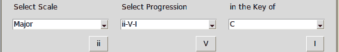

JSON 文件在“主要”部分列出的进度如下：

```py
 "ii-V-I": [ "2", "7", "0" ]
```

让我们先在表中列出和弦进行中的 12 个音符，从和弦的根音开始（以我们的例子中的 C 音为例）。我们需要为这个进行选择 2^(nd)，7^(th)，和 0^(th)的音符：

| **C** | C# | **D** | D# | E | F | F# | **G** | G# | A | A# | B |
| --- | --- | --- | --- | --- | --- | --- | --- | --- | --- | --- | --- |

关键音符是 D(第 2 个), G(第 7 个), 和 C(第 0 个)。手握这些音符后——我们接下来需要确定每个音符是构成大和弦还是小和弦。这很简单。那些用小写罗马数字标注的音符构成小和弦，而那些用大写罗马数字标注的音符构成大和弦。

根据这个规则，我们在 *C* 调的和弦进行中的最终和弦是：

D 小调 - G 大调 - C 大调

确定这些之后，我们的程序应该动态创建三个按钮。点击这些按钮后，应该分别播放前面的三个和弦。

让我们编写这个功能。我们首先在`7.06 constants.py`中定义和弦进行文件的位置：

```py
PROGRESSIONS_JSON_FILE = '../json/progressions.json'
```

我们随后从方法 `load_json_files()` 中将其加载到一个名为 `self.progressions` 的属性中：

```py
 with open(PROGRESSIONS_JSON_FILE, 'r') as f:
    self.progressions = json.load(f, object_pairs_hook=OrderedDict)
```

接下来，我们修改进度框架以添加三个`combobox`元素。请参阅`build_progressions_frame`的代码`7.06 view.py`。

这三个组合框连接到以下三个回调函数：

```py
def on_progression_scale_changed(self, event):
 selected_progression_scale = self.progression_scale_selector.get()
 progressions = [k for k in  
   self.progressions[selected_progression_scale].keys()]
 self.progression_selector['values'] = progressions
 self.progression_selector.current(0)
 self.show_progression_buttons()

def on_progression_key_changed(self,event):
 self.show_progression_buttons()

def on_progression_changed(self,event):
 self.show_progression_buttons()
```

三种组合框中最复杂的是进度尺度组合框。它允许你选择**主调**和**副调**进度尺度。根据你的选择，它将从 JSON 文件中填充第二个组合框的进度值。这正是`on_progression_scale_changed`方法的前四行所做的事情。

除了那个之外，前面定义的所有三个回调方法都会调用`show_progression_buttons`方法，该方法定义如下：

```py
def show_progression_buttons(self):
 self.destroy_current_progression_buttons()
 selected_progression_scale = self.progression_scale_selector.get()
 selected_progression = self.progression_selector.get().split('-')
 self.progression_buttons = []
 for i in range(len(selected_progression)):
   self.progression_buttons.append(Button(self.progressions_frame,                     
         text=selected_progression[i],
         command=partial(self.on_progression_button_clicked, i)))
   sticky = 'W' if i == 0 else 'E' 
   col = i if i > 1 else 1
   self.progression_buttons[i].grid(column=col, row=2, sticky=sticky, 
     padx=10)
```

上述代码动态创建按钮——每个和弦进行一个按钮，并将所有按钮存储在一个名为 `self.progression_buttons` 的列表中。我们将保留这个引用，因为每次选择新的和弦进行时，我们都需要销毁这些按钮并创建新的按钮。

注意使用来自`functools`模块的`partial`方法来定义按钮命令回调。由于按钮是动态创建的，我们需要跟踪按钮编号。我们使用这个方便的`partials`方法，它允许我们只使用部分参数调用一个方法。引用 Python 的文档——`partial()`函数用于部分函数应用，它将函数的部分参数和/或关键字*冻结*，从而生成一个具有简化签名的新的对象。您可以在[`docs.python.org/3/library/functools.html#functools.partial`](https://docs.python.org/3/library/functools.html#functools.partial)了解更多关于部分函数应用的信息。

前面的代码调用了`destroy_button`方法，其任务是清除框架以便绘制下一组按钮，以防选择新的进度。代码如下：

```py
def destroy_current_progression_buttons(self):
 for buttons in self.progression_buttons:
    buttons.destroy()
```

最后，我们希望在点击按钮时显示和弦进行中的单个和弦。这被定义为如下：

```py
def on_progression_button_clicked(self, i):
  self.remove_all_key_highlights()
  selected_progression = self.progression_selector.get().split('-')[i]
  if any(x.isupper() for x in selected_progression):
     selected_chord = 'Major'
  else: 
    selected_chord = 'Minor'
  key_offset = ROMAN_TO_NUMBER[selected_progression]
  selected_key = self.progression_key_selector.get() 
  index_of_selected_key = (KEYS.index(selected_key)+ key_offset)% 12
  self.keys_to_highlight = [ ALL_KEYS[j+index_of_selected_key] for j in   
                             self.chords[selected_chord]]
  self.highlight_list_of_keys(self.keys_to_highlight)
  play_chord_in_new_thread(self.keys_to_highlight)
```

这里是对前面代码的简要描述：

+   我们首先使用连字符（`-`）分隔符将文本拆分，例如`ii-V-I`。然后我们遍历列表并检查它是否为大写或小写。如果它是大写，则`selected_chord`变量被设置为`Major`，如果不是，则设置为`Minor`*.*

+   键的索引是通过将键值与 JSON 文件中提到的数字相加来计算的。我们应用模运算符（`%`）到相加的值上，以确保该值不超过 12 个音符的限制。

+   由于数字是以罗马数字存储的（这是音乐家使用的惯例），我们需要将其转换为整数。我们通过在`7.05/constants.py`中定义一个简单的键值映射来实现这一点：

```py
ROMAN_TO_NUMBER = { 'I':0, 'II': 2, 'III':4, 'IV':5, 'V': 7, 'VI':9, 'VII': 11, 'i':0, 'ii': 2, 'iii':4, 'iv':5, 'v': 7, 'vi':9, 'vii': 11}
```

+   注意，我们已经将所有从 0 开始的数字进行了映射，映射遵循大调式模式（`W W H W W S`），其中`W`代表全音（两个键跳跃）而`S`代表半音（一个键跳跃）。

+   现在我们知道，如果和弦是大调或小调，其余的代码与我们之前用来识别单个和弦的代码完全相同。然后我们突出显示并演奏单个和弦。

最后，我们将`on_mode_changed`进行修改，以添加对`show_progression_buttons()`的调用，这样每次我们切换到和弦进行部分时，第一个和弦进行按钮就会自动为我们设置。

这完成了迭代。我们的和弦进行部分已经准备好了。运行代码`7.06/view.py`。在和弦进行辅导程序中，你可以从下拉菜单中选择和弦进行类型（大调或小调）、进行方式和其键，程序将为和弦进行中的每个和弦创建一个按钮。按下单个按钮，它将为你播放该进行方式中的和弦。

# 构建得分生成器

让我们现在构建得分生成器。这个生成器将显示钢琴上演奏的任何音乐符号。为了程序的模块化，我们将把程序构建在一个名为 `score_maker.py` 的单独文件中。

我们首先定义一个类 `ScoreMaker`。由于我们只展示两个八度的音符，我们将定义一个常量 `NOTES`，列出所有音符（`7.06/score_maker.py`）:

```py
class ScoreMaker:

NOTES = ['C1','D1', 'E1', 'F1', 'G1','A1', 'B1', 'C2','D2', 'E2', 'F2', 'G2','A2', 'B2']
```

这个类的`__init__`方法接收容器作为参数。这是这个类将要绘制分数的容器（`7.06/score_maker.py`）：

```py
def __init__(self, container):
   self.canvas = Canvas(container, width=500, height = 110)
   self.canvas.grid(row=0, column = 1)
   container.update_idletasks() 
   self.canvas_width = self.canvas.winfo_width()
   self.treble_clef_image = PhotoImage(file='../pictures/treble-clef.gif')
   self.sharp_image = PhotoImage(file='../pictures/sharp.gif')

```

注意在`container`框架中使用`update_idletasks()`。在这里调用此方法是必要的，因为我们上一行代码中创建了一个画布，这需要重绘小部件。然而，重绘将在事件循环的下一轮运行后才会发生。但我们希望在画布创建后立即知道其宽度。显式调用`update_idletasks`会立即执行所有挂起的任务，包括几何管理。这确保我们在下一步中能够得到正确的画布宽度。如果你注释掉`update_idletasks`这一行并尝试打印画布的宽度，即使我们明确将其设置为`500`，它也会打印出`1`。

我们还初始化了两个 `.gif` 图片，我们将使用它们来绘制分数。`treble_clef` 图片将被用来在分数左侧绘制高音谱号，而 `sharp_image` 将在所有升音（黑键上的音符）之前绘制一个升号（#）符号。

Tkinter 使用事件循环的概念来处理所有事件。这里有一篇优秀的文章深入解释了这个概念 [`wiki.tcl.tk/1527`](http://wiki.tcl.tk/1527)。`update_idletask` 是所有小部件上可用的方法的一个例子。访问 [`effbot.org/tkinterbook/widget.htm`](http://effbot.org/tkinterbook/widget.htm) 查看所有小部件上可调用的方法列表。

我们的首要任务是画五条等间距的线在画布上。因此，我们定义了一种新的方法来完成这个任务：

```py
 def _draw_five_lines(self):
   w = self.canvas_width
   self.canvas.create_line(0,40,w,40, fill="#555")
   self.canvas.create_line(0,50,w,50, fill="#555")
   self.canvas.create_line(0,60,w,60, fill="#555")
   self.canvas.create_line(0,70,w,70, fill="#555")
   self.canvas.create_line(0,80,w,80, fill="#555")
```

这创建了五个相互平行的线条，每条线之间相隔 10 像素。方法名称中的下划线表示这是一个类中的私有方法。虽然 Python 不强制执行方法隐私，但这告诉用户不要直接在他们的程序中使用此方法。

然后我们构建一个方法，该方法实际上调用前一个方法并在左侧添加一个高音谱号，从而创建一个空谱表，我们可以在其上绘制音符：

```py
 def _create_treble_staff(self):
  self._draw_five_lines()
  self.canvas.create_image(10, 20, image=self.treble_clef_image, anchor=NW)
```

首先，我们需要区分绘制和弦与绘制音阶的音符。由于和弦中的所有音符都是一起演奏的，因此和弦的音符在单个 *x* 位置上绘制。相比之下，音阶中的音符在规则的 *x* 偏移量上绘制，如下所示：

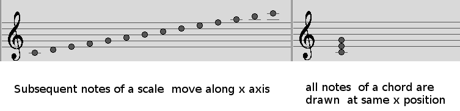

由于我们需要在固定间隔内调整 *x* 值以适应刻度，我们使用 `itertools` 模块中的 `count` 方法来提供一个不断增长的 *x* 值：

```py
import itertools 
self.x_counter = itertools.count(start=50, step=30)
```

现在每次调用`x = next(self.x_counter)`都会将*x*增加`30`。

现在是绘制实际笔记到画布上的代码：

```py
 def _draw_single_note(self, note, is_in_chord=False):
   is_sharp = "#" in note 
   note = note.replace("#","")
   radius = 9
   if is_in_chord:
     x = 75
   else: 
     x = next(self.x_counter)
   i = self.NOTES.index(note)
   y = 85-(5*i)
   self.canvas.create_oval(x,y,x+radius, y+ radius, fill="#555")
   if is_sharp:
     self.canvas.create_image(x-10,y, image=self.sharp_image, anchor=NW)
   if note=="C1":
     self.canvas.create_line(x-5,90,x+15, 90, fill="#555")
   elif note=="G2":
     self.canvas.create_line(x-5,35,x+15, 35, fill="#555")
   elif note=="A2":
     self.canvas.create_line(x-5,35,x+15, 35, fill="#555")
   elif note=="B2":
     self.canvas.create_line(x-5,35,x+15, 35, fill="#555")
     self.canvas.create_line(x-5,25,x+15, 25, fill="#555") 
```

前述代码的描述如下：

+   该方法接受一个音符名称，例如，`C1` 或 *D2*#，并在适当的位置绘制一个椭圆形。

+   我们需要获取绘制椭圆的*x*，*y*值。

+   我们首先计算 *x* 值。如果音符是和弦的一部分，我们将 *x* 值固定在 `75` 像素，而如果音符是音阶的一部分，则通过在 `itertool counter` 方法上调用 `next` 来将 *x* 值从上一个 *x* 值增加 *30* 像素。

接下来，我们计算 *y* 值。 执行此操作的代码如下：

```py
i = self.NOTES.index(note)
y = 85-(5*i)
```

基本上，*y* 偏移量是根据列表中音符的索引计算的，每个后续音符偏移 `5` 像素。数字 `85` 是通过试错法得到的。

现在我们有了 *x* 和 *y* 值，我们只需绘制给定 `半径` 的椭圆：

```py
self.canvas.create_oval(x,y,x+radius, y+ radius, fill="#555")
```

如果音符是升音符，即如果它包含字符`#`，则会在音符的椭圆左侧 10 像素处绘制`#`图像。

音符 C1、G2、A2 和 B2 绘制在五条线之外。因此，除了椭圆形之外，我们还需要画一条小横线穿过它们。这正是最后 11 行`if…else`语句所实现的功能。

最后，我们有`draw_notes`方法和`draw_chord`方法，分别用于绘制音符和和弦。这两个方法的名字前没有下划线，这意味着我们只通过这两个方法暴露了我们的程序接口：

```py
def draw_notes(self, notes):
  self._clean_score_sheet()
  self._create_treble_staff()
  for note in notes:
    self._draw_single_note(note)

def draw_chord(self, chord):
  self._clean_score_sheet()
  self._create_treble_staff()
  for note in chord:
    self._draw_single_note(note, is_in_chord=True)
```

现在我们已经准备好了`ScoreMaker`，我们只需将其导入到`7.07/view.py`中：

```py
from score_maker import ScoreMaker
```

我们修改`build_score_sheet_frame`以实例化`ScoreMaker`：

```py
self.score_maker = ScoreMaker(self.score_sheet_frame) 
```

我们随后修改`find_scale`以添加此行（`7.07/view.py`）：

```py
self.score_maker.draw_notes(self.keys_to_highlight)
```

我们同样修改了 `find_chord` 和 `on_progression_button_clicked` 以添加此行 (`7.07/view.py`):

```py
self.score_maker.draw_chord(self.keys_to_highlight)
```

这就标志着这个项目的结束。如果你现在运行 `7.07/view.py`，你应该会看到一个功能齐全的得分生成器和一个功能齐全的钢琴辅导工具。

然而，让我们以对窗口响应性的简要讨论来结束这一章。

# 关于窗口响应性的说明

在这个程序中，我们使用了`.grid_propagate(False)`来确保我们的框架不会缩小以适应其内容，而是保持在我们制作框架时指定的固定高度和宽度。

这个例子中这做得很好，但这使得我们的窗口及其内容大小固定。这通常被称为非响应式窗口。

让我们以程序 `nonresponsive.py` 作为非响应式窗口的例子。这个程序简单地在一行中绘制了 `10` 个按钮：

```py
from tkinter import Tk, Button
root = Tk()

for x in range(10):
 btn = Button(root, text=x )
 btn.grid(column=x, row=1, sticky='nsew')

root.mainloop()
```

运行此程序并调整窗口大小。这些按钮绘制在根窗口上，并且无响应。按钮的大小保持固定。它们不会根据窗口大小的变化而调整大小。如果窗口大小减小，一些按钮甚至会从视图中消失。

相比之下，让我们来看看程序 `responsive.py`：

```py
from tkinter import Tk, Button, Grid

root = Tk()

for x in range(10):
 Grid.rowconfigure(root, x, weight=1)
 Grid.columnconfigure(root, x, weight=1)
 btn = Button(root, text=x )
 btn.grid(column=x, row=1, sticky='nsew')

root.mainloop()
```

如果你运行这个程序并调整窗口大小，你会看到按钮会相应地调整自身大小以适应容器根窗口。那么这两段之前的代码有什么区别呢？我们只是简单地在第二个程序中添加了这两行：

```py
Grid.rowconfigure(root, x, weight=1)
Grid.columnconfigure(root, x, weight=1) 
```

这两行代码向容器中的`x`^(th)按钮小部件添加了**非零权重**（`weight=1`）（在前面的示例中是根）。

这里的关键是理解权重的重要性。如果我们有两个小部件，`widget1` 和 `widget2`，并且分别给它们分配权重 3 和 1。现在当你调整其父元素的大小时，`widget1` 将占据 3/4 的空间，而 `widget2` 将占据 1/4 的空间。

这是`rowconfigure`和`columnconfigure`的文档：

[`infohost.nmt.edu/tcc/help/pubs/tkinter/web/grid-config.html`](http://infohost.nmt.edu/tcc/help/pubs/tkinter/web/grid-config.html).

# 在代码上进行实验

体验这段代码的最佳方式是逐一进行以下调整，运行程序，并调整窗口大小以查看每个选项的效果。

作为第一次调整，将权重改为`0`：

```py
 Grid.rowconfigure(root, x, weight=0)
 Grid.columnconfigure(root, x, weight=0)
```

这将再次使窗口无响应。

接下来，将权重重新分配回 1，然后注释掉其中一行，观察差异。如果你注释掉`rowconfigure`行，按钮将在*y*方向上响应，但在*x*方向上则不响应，反之亦然对于`columnconfigure`。

将程序恢复到其原始状态，然后在每个循环中通过将权重更改为`x`来分配不同的权重：

```py
 Grid.rowconfigure(root, x, weight=x)
 Grid.columnconfigure(root, x, weight=x)
```

因此，第一个按钮的权重将为 0，第二个按钮的权重将为 1，以此类推。现在，如果你运行程序并调整窗口大小，权重为 9 的最后一个按钮将是最灵敏的（将占据可用空间的最大比例），而权重为 0 的第一个按钮将完全不灵敏（固定大小），如下面的截图所示：

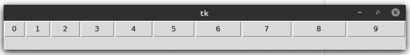

作为最后的调整，将程序恢复到其原始状态，并将第二个参数的值更改为一个固定数字，比如说 *2*：

```py
 Grid.rowconfigure(root, 2, weight=1)
 Grid.columnconfigure(root, 2, weight=1)
```

这将只分配权重到第三个按钮（计数从 0 开始），因此第三个按钮变得响应，而其他按钮保持非响应状态，如下面的截图所示：

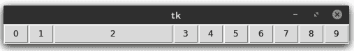

实际上，在这个最后的情况下，因为我们只对一个单个的小部件分配权重，我们完全可以把它分配在循环之外。

# 使用 `<Configure>` 处理小部件尺寸调整

可能会有这样的情况，当用户调整窗口或小部件大小时，你<indexentry content="窗口响应性：小部件调整大小，处理方式">想要执行一些特定的操作。Tkinter 提供了一个名为 `<Configure>` 的事件，它可以绑定到一个回调函数上，以响应小部件大小的变化。

这里有一个简单的例子（见 `handle_widget_resize.py`）：

```py
from tkinter import Tk, Label, Pack

root= Tk()
label = Label(root, text = 'I am a Frame', bg='red')
label.pack(fill='both', expand=True)

def on_label_resized(event):
  print('New Width', label.winfo_width())
  print('New Height', label.winfo_height())

label.bind("<Configure>", on_label_resized)
root.mainloop()
```

代码的描述如下：

+   我们在`root`窗口中有一个标签小部件。我们为标签设置了`pack`选项为`(fill='both', expand=True)`，因为我们希望它在`root`窗口大小调整时能够相应地调整大小。

+   我们将一个回调函数附加到 `<Configure>` 事件上，以监听标签小部件大小的任何变化。一旦标签小部件发生变化，它就会触发对方法 `on_label_resized` 的调用。

现在如果您调整窗口大小，标签也会随之调整，这会触发`on_label_resized`事件，将标签小部件的新高度和宽度打印到控制台。这可以用来调整屏幕上项目的位置。

这就结束了我们对窗口响应性的简要讨论。

# 摘要

我们使用了几个有用的标准模块，例如 `functools`、`itertools` 和 `json`。

我们学习了如何处理 *JSON* 文件。JSON 帮助我们呈现关于我们领域的复杂规则，并且相较于在数据库中存储相同信息来说，它是一个更简单、更便携的替代方案。

我们探讨了`widget.grid_propagate(False)`的实际用法及其在非响应性方面的局限性。

我们看到了`collections`模块中`OrderedDict`的用法和`functools`模块中`partials`的用法。

我们研究了各种根窗口方法，例如`root.geometry`、`root.winfo_screenwidth`和`root.resizable`。

我们查看了`widget.update_idletasks`，它允许我们在不需要等待主循环下一次运行的情况下清除所有挂起的更新。

最后，我们探讨了在 Tkinter 中使窗口响应式所需的步骤。

# QA 部分

在你继续阅读下一章之前，请确保你能回答这些问题

满意度：

+   `functools`模块中的`partial`函数有什么用途？

+   在 Tkinter 程序中，何时以及为什么需要使用`widget.update_idletasks`？

+   如果需要，我们该如何处理 Tkinter 中主窗口或任何其他小部件的调整大小问题？

+   JSON 中有哪些可用的数据结构？（了解更多信息请参阅：[`www.json.org/`](https://www.json.org/))

+   你如何在 Tkinter 中使小部件响应式？

# 进一步阅读

了解更多关于 JSON 数据结构的信息。它们非常流行，并被广泛应用于各个领域。另一种结构是 XML。阅读有关 XML 和 JSON 的内容，以及何时以及为什么应该选择其中一种而不是另一种。

Python 的 collections 模块提供了一些非常灵活和有用的数据结构，例如 `namedtuple`、`deque`、`Counter`、`dict`、`OrderedDict`、`defaultdict`、`chainMap`、`UserDict`、`UserList` 和 `userString`。这些数据结构可以在各种用例中适当使用。更多信息可以在[这里](https://docs.python.org/3/library/collections.html)找到。

我们在程序中使用了外部音频文件和外部图像。这意味着如果需要打包和分发，它们需要与程序捆绑在一起。可以使用所谓的**base-64 编码**来对音频文件和图像进行另一种打包。音频文件和图像可以被 base-64 编码到文本文件中，然后由程序读取并解码，用作音频文件或图像文件。阅读有关 base-64 编码的信息，如果你有足够的动力，尝试将此程序中使用的所有音频文件和图像转换为 base-64 编码。有关 base-64 编码的更多信息，请参阅此处：[`en.wikipedia.org/wiki/Base64`](https://en.wikipedia.org/wiki/Base64)。

Python 的 base-64 编码实现可以在这里找到：[`docs.python.org/3/library/base64.html`](https://docs.python.org/3/library/base64.html).
