# 第八章：在画布上尽情玩耍

Canvas 无疑是 Tkinter 中最灵活的控件之一。鉴于它提供了对每个单独像素绘制的直接控制，结合一些数学知识，它可以用来创建各种巧妙的可视化效果。虽然可能性是无限的，但我们将在本章中探讨如何实现一些重要的数学思想。

本章的关键目标是：

+   学习使用 Tkinter 画布进行动画制作

+   理解在画布上使用极坐标和笛卡尔坐标的用法

+   实现常微分方程

+   给定公式列表进行建模模拟

+   建模 3D 图形和研究在 3D 动画中常用的某些常见变换矩阵

注意，本章中的许多代码示例需要进行大量计算。然而，为了速度而进行的代码优化并不是我们的首要选择。这里的主要目标是理解底层概念。

# 创建屏幕保护程序

我们将从一个屏幕保护程序开始。该程序将包含几个随机颜色和随机大小的球，以随机速度在屏幕上四处弹跳，如下面的截图所示：

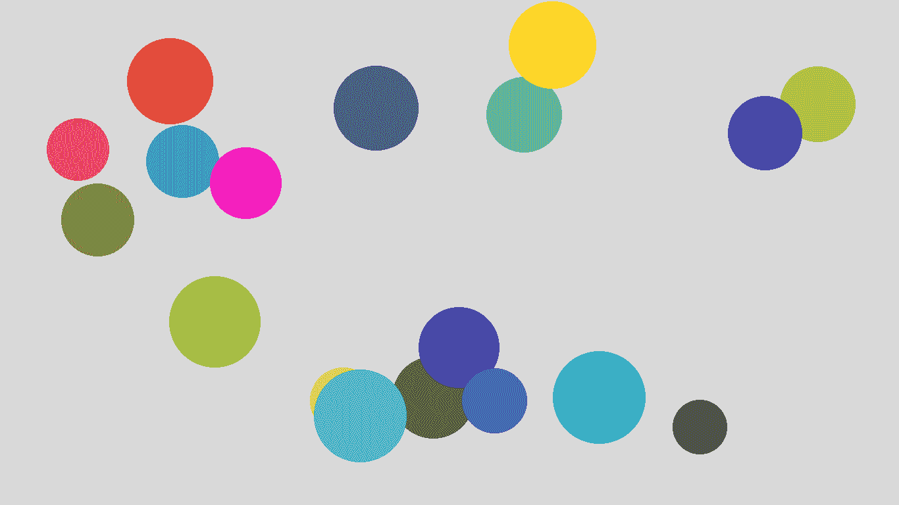

让我们创建一个类来生成具有随机属性的球。相应地，我们定义一个新的类名为`RandomBall`。请参考代码文件`8.01_screensaver`：

```py
class RandomBall:

def __init__(self, canvas):
 self.canvas = canvas
 self.screen_width = canvas.winfo_screenwidth()
 self.screen_height = canvas.winfo_screenheight()
 self.create_ball()

def create_ball(self):
 self.generate_random_attributes()
 self.create_oval() 

def generate_random_attributes(self):
 self.radius = r = randint(40, 70)
 self.x_coordinate = randint(r, self.screen_width - r)
 self.y_coordinate = randint(r, self.screen_height - r)
 self.x_velocity = randint(6, 12)
 self.y_velocity = randint(6, 12)
 self.color = self.generate_random_color()

def generate_random_color(self):
 r = lambda: randint(0, 0xffff)
 return '#{:04x}{:04x}{:04x}'.format(r(), r(), r())

def create_oval(self):
 x1 = self.x_coordinate - self.radius
 y1 = self.y_coordinate - self.radius
 x2 = self.x_coordinate + self.radius
 y2 = self.y_coordinate + self.radius
 self.ball = self.canvas.create_oval( x1, y1, x2, y2, fill=self.color, 
   outline=self.color)

def move_ball(self):
 self.check_screen_bounds()
 self.x_coordinate += self.x_velocity
 self.y_coordinate += self.y_velocity
 self.canvas.move(self.ball, self.x_velocity, self.y_velocity)

def check_screen_bounds(self):
 r = self.radius
 if not r < self.y_coordinate < self.screen_height - r:
   self.y_velocity = -self.y_velocity
 if not r < self.x_coordinate < self.screen_width - r:
   self.x_velocity = -self.x_velocity
```

这是前面代码的描述：

+   这里有两个关键方法：`create_ball` 和 `move_ball`。所有其他方法都是这两个方法的辅助。`__init__` 方法接受一个 `canvas` 作为参数，然后调用 `create_ball` 方法在给定的画布上绘制球。要移动球，我们需要显式地调用 `move_ball` 方法。

+   `create_ball` 方法使用了 `canvas.create_oval()` 方法，而 `move_ball` 方法使用了 `canvas.move(item, dx, dy)` 方法，其中 `dx` 和 `dy` 是画布项的 `x` 和 `y` 偏移量。

+   此外，请注意我们是如何为球体创建一个随机颜色的。因为十六进制颜色编码系统为红色、绿色和蓝色中的每一个都使用最多四个十六进制数字，所以每种颜色都有多达 `0xffff` 种可能性。因此，我们创建了一个生成从 `0-0xffff` 的随机数的 lambda 函数，并使用这个函数生成三个随机数。我们使用格式说明符 `#{:04x}{:04x}{:04x}` 将这个十进制数字转换为它的两位等效十六进制表示，以获取球体的随机颜色代码。

这就是`RandomBall`类的全部内容。我们可以使用这个类来创建我们想要在屏幕保护程序中显示的任意数量的球对象。

接下来，让我们创建一个将显示实际屏保的`ScreenSaver`类：

```py
class ScreenSaver:

balls = []

def __init__(self, number_of_balls):
 self.root = Tk()
 self.number_of_balls = number_of_balls
 self.root.attributes('-fullscreen', True)
 self.root.attributes('-alpha', 0.1)
 self.root.wm_attributes('-alpha',0.1)
 self.quit_on_interaction()
 self.create_screensaver()
 self.root.mainloop()

def create_screensaver(self):
 self.create_canvas()
 self.add_balls_to_canvas()
 self.animate_balls()

def create_canvas(self):
 self.canvas = Canvas(self.root)
 self.canvas.pack(expand=1, fill=BOTH)

def add_balls_to_canvas(self):
 for i in range(self.number_of_balls):
    self.balls.append(RandomBall(self.canvas))

def quit_on_interaction(self):
  for seq in ('<Any-KeyPress>', '<Any-Button>', '<Motion>'):
    self.root.bind(seq, self.quit_screensaver)

def animate_balls(self):
 for ball in self.balls:
    ball.move_ball()
 self.root.after(30, self.animate_balls)

def quit_screensaver(self, event):
   self.root.destroy()
```

代码的描述如下：

+   ScreenSaver 类的 `__init__` 方法接受球的数量 (`number_of_balls`) 作为其参数

+   我们使用 `root.attributes ( -fullscreen, True )` 来从父窗口移除包围框架，使其成为一个全屏窗口。

+   `quit_on_interaction` 方法将根绑定到在用户端发生任何交互时调用我们的 `quit_screensaver` 方法。

+   我们随后使用 `Canvas(self.root)` 创建一个画布来覆盖整个屏幕，并使用 `pack ( expand=1, fill=BOTH )` 选项来填充整个屏幕。

+   我们使用`RandomBall`类创建了几个随机的球体对象，并将画布小部件实例作为其参数传递。

+   我们最终调用了`animate_balls`方法，该方法使用标准的`widget.after()`方法以每 30 毫秒的固定间隔循环运行动画。

+   要运行屏幕保护程序，我们需要从我们的`ScreenSaver`类实例化一个对象，并将球的数量作为其参数传递，如下所示：`ScreenSaver(number_of_balls=18)`

我们的保护屏现在已经准备好了！实际上，如果你正在使用 Windows 平台，并且当你学习如何从 Python 程序创建可执行程序（在第十章 Chapter 10，*杂项提示*）中讨论过），你可以为这个保护屏创建一个带有`.exe`扩展名的可执行文件。然后你可以将其扩展名从`.exe`更改为`.scr`，右键点击，并选择安装来将其添加到你的屏幕保护程序列表中。

# 使用 Tkinter 绘图

Tkinter 不是一个绘图工具。然而，如果您需要使用 Tkinter 绘制图表，您可以使用 Canvas 小部件来绘制图表。

在这次迭代中，我们将绘制以下图表：

+   饼图 (`8.02_pie_chart.py`)

+   柱状图 (`8.03_bar_graph.py`)

+   散点图 (`8.04_scatter_plot.py`)

三张图如下所示：

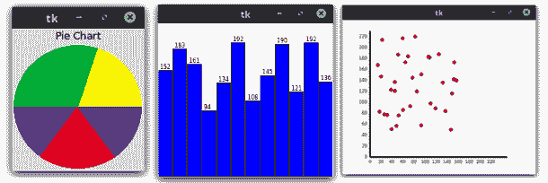

首先让我们看看饼图。您可以使用 Tkinter 中的 Canvas 小部件的`create_arc`方法轻松创建饼图。

`create_arc` 方法具有以下签名：

```py
item_id = canvas.create_arc(x1, y1, x2, y2, option, ...)
```

点(`x1`, `y1`)是矩形左上角的顶点，而点(`x2`, `y2`)是矩形右下角的顶点，弧线就拟合在这个矩形内。如果边界矩形是正方形，它就形成了一个圆。该方法还接受两个参数，分别命名为`start`和`extent`，我们将使用这两个参数来创建饼图。

`start`选项指定了弧线的起始角度，以度为单位，从`+x`方向测量。当省略时，得到完整的椭圆。`extent`选项指定了弧线的宽度，以度为单位。

弧线从由`start`选项给出的角度开始，逆时针绘制，直到达到`extent`选项指定的度数。

要创建饼图，我们定义一个方法，该方法在给定一个数字 *n* 的情况下，将圆分成，比如说，1,000 个相等的部分，然后给定一个小于 1,000 的数字，返回弧线上的等效角度。由于圆有 360 度，该方法定义如下：

```py
total_value_to_represent_by_pie_chart = 1000
def angle(n):
   return 360.0 * n / total_value_to_represent_by_pie_chart
```

接下来，我们使用如下代码来绘制饼图的各个部分：

```py
canvas.create_arc((2,2,152,152), fill="#FAF402", outline="#FAF402", start=angle(0), extent = angle(200))
```

您可以在 `8.02_pie_chart.py` 中查看饼图的示例。

接下来是条形图。这非常简单。我们使用`create_rectangle`来绘制条形图：

```py
plot_data= [random.randint(75,200) for r in range(12)]
for x, y in enumerate(plot_data):
  x1 = x + x * bar_width
  y1 = canvas_height - y 
  x2 = x + x * bar_width + bar_width
  y2 = canvas_height
  canv.create_rectangle(x1, y1, x2, y2, fill="blue")
  canv.create_text(x1+3, y1, font=("", 6),
    text=str(y),anchor='sw' )
```

这里有一个重要的事项需要注意。由于 Canvas 小部件表示从左上角开始的 `y` 坐标，我们需要从画布高度中减去 `y` 位置，以获得图表的 `y` 坐标。

您可以查看条形图的完整代码，位于`8.03_bar_graph.py`文件中。

同样，我们使用 `create_oval` 方法来绘制散点图。请查看 `8.04_scatter_plot.py`*.* 中的散点图代码。

接下来，让我们看看如何将 `matplotlib` 图形嵌入到 Tkinter 中。

使用 Tkinter 画布绘制图表在简单情况下可能效果不错。然而，当涉及到绘制更复杂和交互式的图表时，Tkinter 并不是最佳选择。

几个 Python 模块已被开发用于制作图表。然而，`matplotlib`在用 Python 生成专业质量的交互式图表方面脱颖而出，成为当之无愧的佼佼者。

尽管对`matplotlib`的详细讨论超出了本书的范围，但我们仍将简要地看看如何在 Tkinter 画布上嵌入由 matplotlib 生成的图形。

您可以使用以下命令安装`matplotlib`和 NumPy（`matplotlib`的依赖项）：

```py
pip3 install matplotlib pip3 install numpy
```

`matplotlib` 针对许多类型的用例和输出格式。`matplotlib` 的不同用例包括：

+   从 Python 命令行创建交互式图表

+   将 `matplotlib` 集成到 Tkinter、wxPython 或 PyGTK 等 GUI 模块中

+   从模拟中生成 PostScript 图像

+   在后端 Web 服务器上提供网页服务

为了针对所有这些用例，`matplotlib` 使用了后端的概念。为了在 Tkinter 上显示 `matplotlib` 图形，我们使用了一个名为 `TkAgg` 的后端。

我们如下将后端导入`matplotlib`：

```py
import tkinter as tk
from numpy import arange, sin, pi
from matplotlib.backends.backend_tkagg import FigureCanvasTkAgg,NavigationToolbar2TkAgg
from matplotlib.figure import Figure
```

我们随后创建`matplotlib`图表，就像在`matplotlib` API 中通常所做的那样：

```py
f = Figure(figsize=(5,4), dpi=100)
a = f.add_subplot(111)
t = arange(-1.0, 1.0, 0.001)
s = t*sin(1/t)
a.plot(t, s)
```

最后，我们使用`TkAgg`后端将生成的图嵌入到`tkinter`主循环中，如下所示：

```py
canvas = FigureCanvasTkAgg(f, master=root)
canvas.get_tk_widget().pack(side=tk.TOP, fill=tk.BOTH, expand=1)
```

我们也可以使用以下命令嵌入`matplotlib`的导航工具栏：

```py
toolbar = NavigationToolbar2TkAgg(canvas, root )
toolbar.update()
```

上述代码（`8.05_matplotlib_embedding_graphs.py`）生成了一个如图所示的图表：

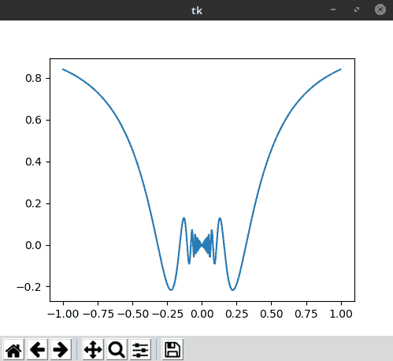

# 使用 Tkinter 绘制的极坐标图

空间中的一个点可以用笛卡尔坐标系中的两个数字 **x** 和 **y** 来表示。同样的点也可以通过使用从原点（**r**）的距离和从 *x* 轴的角度（theta）来表示极坐标，如下面的图所示：

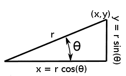

要在极坐标和笛卡尔坐标之间进行转换，我们使用以下等式：

*x = r cos(θ) 和 y = r sin(θ)*

在极坐标图上绘制以**r**和**θ**表示的方程更容易，这种特殊的图称为**极坐标图**，它被分成许多同心圆和从中心辐射出的径线。径线通常以 15◦的间隔排列，而同心圆的半径取决于从中心测量的距离所使用的比例尺。以下是我们将要绘制的极坐标图的示例：

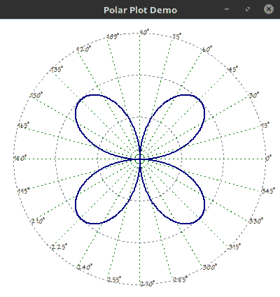

Tkinter 画布理解笛卡尔坐标系。然而，从极坐标转换为笛卡尔坐标很容易。因此，我们相应地定义了一个名为`polar_to_cartesian`的方法；请参阅`8.06_polar_plot.py`：

```py
def polar_to_cartesian(r, theta, scaling_factor, x_center, y_center):
 x = r * math.cos(theta) * scaling_factor + x_center
 y = r * math.sin(theta) * scaling_factor + y_center
 return(x, y)
```

这里是对前面代码的简要描述：

+   该方法将输入的 (`r`, `theta`) 值转换为 (`x`, `y`) 坐标，使用等式 *x= r cos(θ) 和 y = rsin(θ)*。

+   前一个方程中的`scaling_factor`决定了在我们极坐标图中多少像素等于一个单位，并且被设置为常数。改变它将改变图表的大小。

+   我们将 `x_center` 和 `y_center` 的值加到最终结果中。`x_center` 被定义为 `window_width` 的一半，而 `y_center` 是窗口大小的一半。我们添加这些值作为偏移量，因为 Canvas 将 (*0*,*0*) 视为画布的左上角，而我们的目标是把画布的中心视为 (*0*,*0*)。

我们首先在 Tkinter 根窗口中创建一个画布，并使用以下代码在画布上添加径向线和同心圆：

```py
# draw radial lines at interval of 15 degrees
for theta in range(0,360,15): 
 r = 180
 x, y = x_center + math.cos(math.radians(theta))*r, \
        y_center - math.sin(math.radians(theta)) *r
 c.create_line(x_center, y_center, x, y, fill='green', dash=(2, 4),\
               activedash=(6, 5, 2, 4) )
 c.create_text(x, y, anchor=W, font="Purisa 8", text=str(theta) + '°')

# draw concentric_circles
for radius in range(1,4):
 x_max = x_center + radius * scaling_factor
 x_min = x_center - radius * scaling_factor
 y_max = y_center + radius * scaling_factor
 y_min = y_center - radius * scaling_factor
 c.create_oval(x_max, y_max, x_min, y_min, width=1, outline='grey', \
               dash=(2, 4), activedash=(6, 5, 2, 4))
```

现在我们已经准备好了坐标纸，是时候绘制实际的极坐标图了。以下代码在图上绘制了极坐标方程 `r = 2*math.sin(2*theta)` 的 `3000` 个点：

```py
for theta in range(0, 3000):
  r = 2*math.sin(2*theta)
  x, y = polar_to_cartesian(r, theta, scaling_factor, x_center, y_center)
  c.create_oval(x, y, x, y, width=1, outline='navy')
```

这就形成了 `form. r = a sin nθ` 的曲线，其中 `n` 是偶数。它是一个 **2n 瓣的蔷薇花**。如果 `n` 是奇数，它将形成一个 **n 瓣的蔷薇花**。通过改变前一种方法中的 `r` 方程，你可以绘制出许多其他好看的图形。以下是一些你可以尝试的其他方程：

```py
r = 0.0006 * theta   # an archimedean spiral
r = 1 + 2*math.cos(theta) # cardoid pattern
r = 3 * math.cos(theta) # circle
r = 2*math.sin(5*theta) # 5 leaved rose
r = 3 * math.cos(3*theta) # 3 leaved rose
r = 2 * math.sin(theta)**2 # a  lemniscate
r = (4 * math.cos(2*theta))**1/2 # another lemniscate
```

你还可以调整单个方程的参数，看看它们对图表造成的影响。

这完成了迭代。

# 重力模拟

让我们现在模拟重力。我们将使用牛顿的万有引力定律来模拟四个行星（水星、金星、地球和火星）以及我们自己的月球的运动。

我们的模拟假设太阳位于中心，但不会为太阳画一个椭圆形，因为这会使我们的行星在那个尺度上变得不可见。我们的模拟程序显示了四颗行星和月球在圆形轨道上旋转（`8.07_gravity_simulation.py`）：

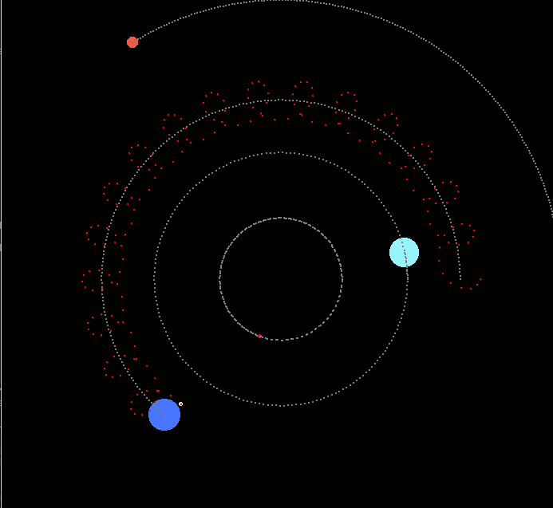

尽管该系统可以扩展以包括太阳系中的其他行星——但由于行星大小和距离的差异如此不成比例，将它们全部放在我们屏幕的矩形窗口中是不可能的。例如，要让木星这样的行星显示出来，会使地球等行星的大小和距离变得小于一个像素，从而使其变得不可见。因此，我们的可视化仅限于四个相对较近的行星和我们的月球。您可以在以下链接找到整个太阳系的一个非常富有洞察力的交互式可视化，标题为*如果月亮只有 1 像素*：[`joshworth.com/dev/pixelspace/pixelspace_solarsystem.html`](http://joshworth.com/dev/pixelspace/pixelspace_solarsystem.html).

牛顿万有引力定律确立了万有引力是普遍存在的，并且所有物体都通过一个与两物体质量和它们之间的距离有关的引力相互吸引的事实，使用以下公式表示：

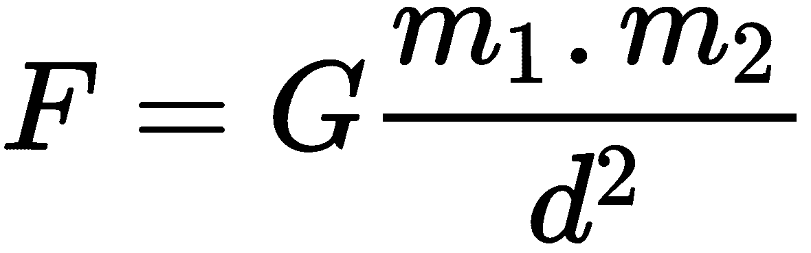

位置：

+   **F** = 两个物体之间的引力

+   **m1** = 物体 1 的质量

+   **m2** = 物体 2 的质量

+   **d** = 两个物体之间的距离

+   **G** = 6.673 x 10^(-11) N m²/kg²

一旦前述方程给出了引力，我们就可以使用这个公式来找到物体的角速度：


上述公式适用于圆周运动，这在某种程度上是对椭圆轨道上行星实际运动的近似。掌握了角速度后，我们可以得到角位置（θ）：

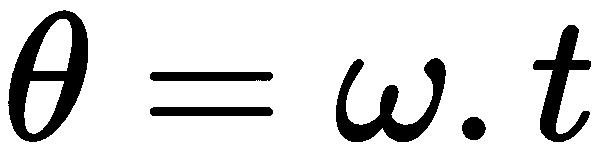

拥有从太阳（中心）的距离和θ值，我们可以将其从极坐标转换为笛卡尔坐标，就像我们在之前的例子中所做的那样。接下来，只需在 Tkinter 画布上不同位置绘制球体即可。

拿到公式后，我们定义一个`Planet`类（`8.07_gravity_simulation.py`）：

```py
class Planet:
 sun_mass = 1.989 * math.pow(10, 30)
 G = 6.67 * math.pow(10, -11)

 def __init__(self, name, mass, distance, radius, color, canvas):
  self.name = name
  self.mass = mass
  self.distance = distance
  self.radius = radius
  self.canvas = canvas
  self.color = color
  self.angular_velocity = -math.sqrt(self.gravitational_force() /
                          (self.mass * self.distance))
  self.oval_id = self.draw_initial_planet()
  self.scaled_radius = self.radius_scaler(self.radius)
  self.scaled_distance = self.distance_scaler(self.distance)
```

尽管前面的代码大部分是变量的简单实例化，请注意它接受一个画布作为输入，并在其上绘制行星。

我们还需要将行星的距离和半径缩小以适应我们的窗口屏幕，因此我们在类中定义了两种方法来缩放距离和半径 (`8.07_gravity_simulation.py`)：

```py
def distance_scaler(self, value):
  #[57.91, 4497.1] scaled to [0, self.canvas.winfo_width()/2]
  return (self.canvas.winfo_width() / 2 - 1) * (value - 1e10) /  
    (2.27e11 - 1e10) + 1 

def radius_scaler(self, value):
  #[2439, 6051.8] scaled to [0, self.canvas.winfo_width()/2]
  return (16 * (value - 2439) / (6052 - 2439)) + 2
```

为了缩放距离，我们取最大距离并将其缩放到画布宽度的一半。对于半径的缩放，我们从前四个行星中取最大和最小半径，并将它们与任意数 16 相乘，这样行星的缩放在屏幕上看起来是可接受的。大部分前面的代码是通过实验确定屏幕上看起来最好的效果，数字完全是任意选择的。

构造函数随后调用一个方法，`draw_initial_planet`，该方法在画布上创建一个按比例缩放的椭圆，并位于按比例缩放的距离处。同时，它还返回创建的椭圆的唯一 ID，以便可以使用 ID 作为句柄来更新椭圆的位置。

我们随后定义了两个辅助方法，使用我们之前讨论过的公式：

```py
def gravitational_force(self):
 force = self.G * (self.mass * self.sun_mass) / math.pow(self.distance, 2)
 return force

def angular_position(self, t):
 theta = self.angular_velocity * t
 return theta
```

现在我们计算角位置（`theta`），将其从极坐标转换为笛卡尔坐标，并更新与该行星相关的椭圆的 *x*、*y* 位置。我们使用 `create_rectangle` 函数为行星位置留下一个 1 像素的轨迹：

```py
def update_location(self, t):
 theta = self.angular_position(t)
 x, y = self.coordinates(theta)
 scaled_radius = self.scaled_radius
 self.canvas.create_rectangle(x, y, x, y, outline="grey")
 self.canvas.coords(self.oval_id, x - scaled_radius, y - scaled_radius,
                   x + scaled_radius, y + scaled_radius)
```

将极坐标转换为笛卡尔坐标的代码如下：

```py
def coordinates(self, theta):
 screen_dim = self.canvas.winfo_width()
 y = self.scaled_distance * math.sin(theta) + screen_dim / 2
 x = self.scaled_distance * math.cos(theta) + screen_dim / 2
 return (x, y)
```

接下来，我们定义一个`Moon`类，它在所有方面都与`Planet`类相似，因此它继承自`Planet`类。然而，最重要的区别是它不是以距离太阳和太阳的质量作为参考，而是以距离地球和地球的质量作为参考。由于按实际值缩放会使月球的大小小于 1 像素，因此我们为月球硬编码了缩放距离和缩放半径值，以便在屏幕上显示。由于月球需要绕地球运行，我们还需要将地球作为额外参数传递给`Moon`类的`__init__`方法（`8.07_gravity_simulation.py`）。

最后，我们创建了四颗行星和月球，传入它们从维基百科获取的实际值：

```py
#name,mass,distance,radius, color, canvas
mercury = Planet("Mercury", 3.302e23, 5.7e10, 2439.7, 'red2', canvas)
venus = Planet("Venus", 4.8685e24, 1.08e11, 6051.8, 'CadetBlue1', canvas)
earth = Planet("Earth", 5.973e24, 1.49e11, 6378, 'RoyalBlue1', canvas)
mars = Planet("Mars", 6.4185e23, 2.27e11, 3396, 'tomato2', canvas)
planets = [mercury, venus, earth, mars]
moon = Moon("Moon", 7.347e22, 3.844e5, 173, 'white', canvas, earth)
```

然后我们创建一个 Tkinter 画布并定义一个每 100 毫秒运行一次的`update_bodies_positions`方法，如下所示：

```py
time = 0
time_step = 100000

def update_bodies_position():
 global time, time_step
 for planet in planets:
   planet.update_location(time)
 moon.update_location(time)
 time = time + time_step
 root.after(100, update_bodies_position)
```

这标志着重力模拟项目的结束。如果你现在去运行`8.07_gravity_simulation.py`，你可以看到行星和我们的月球对重力作用的响应。

# 绘制分形

分形是一种永无止境的图案，它在所有尺度上都会重复出现。分形在自然界中无处不在。我们在我们的血管、树木的枝条以及我们星系的结构中都能找到它们，它们的美丽之处在于它们是由简单的公式构成的。

我们将通过绘制一个名为曼德布罗特集的分数形来展示这些看似复杂现象的简单性。在本节中，我们假设读者具备集合理论和复数的基本知识。我们的代码生成的曼德布罗特集看起来如下所示：

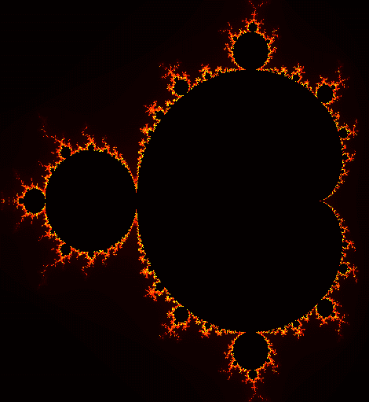

曼德布罗特集定义为复数集，*c*：

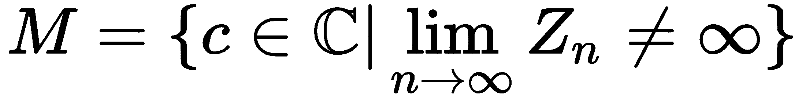

以便复数 *c* 遵循以下递归关系：

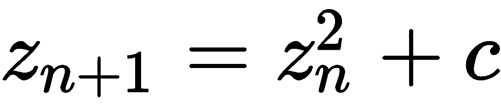

将递归关系视为函数，其中最后一个输出作为输入传递到下一个迭代中相同的函数。

因此，曼德布罗特集只包括那些在经过任意次迭代后，前述方程不会将复数*z*[n]的值爆炸到无穷大的复数。

为了更清晰地理解，如果我们把数字 1 视为*c*并应用于前面的方程（注意，1 也是一个没有虚部的复数——因此实数是复数的一个子集，所以它们也位于复平面上）：

| **n 次迭代后 z 的值(z[n])** | **z[n+1] = z²[n] + c，其中 c = 1** |
| --- | --- |
| z[0] | 0² + 1 = 1 |
| z[1] | 1² + 1 = 2 |
| z[2] | 2² +1 = 5 |
| z[3] | 5² +1 = 26 |

很明显，随着迭代次数趋向于无穷大，之前的序列将会爆炸到无穷大。由于这个复数 1 会使方程爆炸，它不是曼德布罗集的一部分。

将此与另一个数字 c = -1 进行对比，其值在下一表中给出：

| **n 次迭代后 z 的值(z[n])** | **z[n+1] = z²[n] + c 对于 c = -1 的值** |
| --- | --- |
| z[0] | 0² + -1 = -1 |
| z[1] | -1² + -1  = 0 |
| z[2] | 0² + -1 = -1 |
| z[3] | -1² + -1 = 0 |

注意，你可以将前面的序列一直延续到无穷大，但数值将在 *-1* 和 *0* 之间交替，因此永远不会爆炸。这使得复数 *-1* 有资格被包含在曼德布罗特集中。

现在，让我们尝试对前面的方程进行建模。

需要克服的一个直接问题是，我们无法在之前的方程中建模无穷大。幸运的是，从方程中可以看出，如果复数 *z* 的绝对值一旦超过 *2*，方程最终会爆炸。

因此，检查方程是否爆炸的确定方法就是检查复数 *Z > 2* 的模。复数 *a + ib* 的模定义为如下：

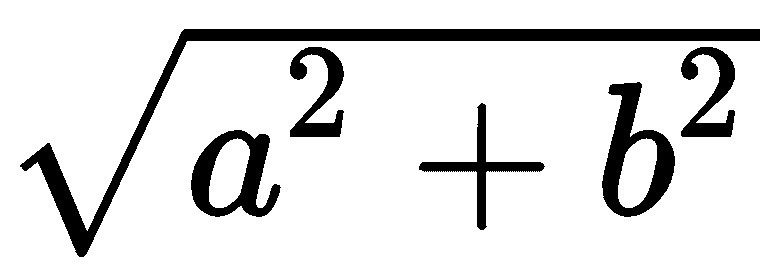

因此，为了检查复数 *a+ib* 是否会使前面的方程爆炸，我们需要检查以下内容：


或者：

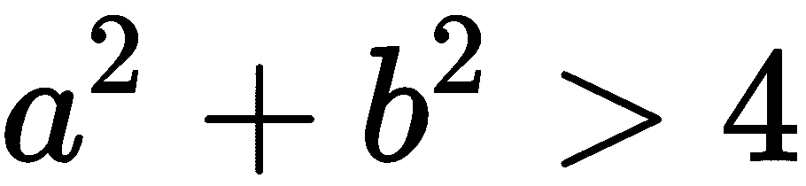

接下来需要考虑的问题是，我们应该迭代*Zn*多少次才能看到其幅度是否超过*2*？

这个答案取决于你希望在最终图像中获得的图像分辨率类型。一般来说，最大迭代次数越高，图像分辨率就越高，但受限于单个像素的大小，超过这个限制你将无法在细节上更进一步。在实践中，几百次的迭代就足够了。我们使用最大迭代次数为`200`，因为这对于我们将要绘制的较小规模的图像来说，足够确定方程是否爆炸。因此，我们在`8.08_Mandelbrot.py`中定义了一个变量，如下所示：

```py
max_number_of_iterations = 200
```

接下来，我们定义一个方法，该方法接受复数的实部和虚部，并判断该复数输入是否会导致方程爆炸。

例如，该方法对于输入值`1`应该返回`2`，因为对于输入值`1`，爆炸路径在第二次迭代时就被检测到了。然而，如果我们给它一个输入值`-1`，方程永远不会爆炸，因此它会运行最大迭代次数并返回`maximum_iteration_count`，我们将其定义为`200`，这相当于说该数值属于曼德布罗特集（`8.08_Mandelbrot.py`）：

```py
print(mandelbrot_set_check(1, 0)) # returns 2
print(mandelbrot_set_check(-1, 0)) # returns 200
```

因此，我们定义`mandelbrot_set_check`方法如下（`8.08_Mandelbrot.py`）：

```py
def mandelbrot_set_check(real, imaginary):
  iteration_count = 0
  z_real = 0.0
  z_imaginary = 0.0
  while iteration_count < max_number_of_iterations and \
        z_real * z_real + z_imaginary * z_imaginary < 4.0:
    temp = z_real * z_real - z_imaginary * z_imaginary + real
    z_imaginary = 2.0 * z_real * z_imaginary + imaginary
    z_real = temp
    iteration_count += 1
  return iteration_count
```

代码简单地实现了曼德布罗集的递归关系。

虽然知道一个复数是否位于曼德布罗特集中已经足够，但我们还记录了迭代次数，也称为逃逸时间，这是复数爆炸所需的迭代次数，如果它确实爆炸了。如果迭代次数返回为`maximum_number_of_iterations`，这意味着复数没有使方程爆炸，逃逸时间是无限的，也就是说，这个数是曼德布罗特集的一部分。我们记录迭代次数，因为我们将会使用这些数据以不同的颜色绘制具有不同逃逸时间的区域。

现在我们有了判断一个复数是否属于曼德布罗集的方法，我们需要一组复数来运行这个方法。为了做到这一点，我们首先定义一个最大和最小的复数，然后我们将检查这个范围内的复数是否包含在曼德布罗集中。注意，在下面的例子中，我们已将复数的范围设置为 *-1.5-1i 和 0.7+1i*。

你可以尝试这些复数的不同范围，只要面积落在半径为 2 的圆内，它将打印出曼德布罗特集的不同区域：

```py
min_real, max_real, min_imaginary, max_imaginary = -1.5, 0.7, -1.0, 1.0
```

让我们接下来定义`image_width`和`image_height`变量，如下所示：

```py
image_width = 512
image_height = 512
```

要在图像中绘制曼德布罗特集，我们需要将图像的每个像素坐标映射到我们的复数上。定义了复数的实部和虚部的最大和最小范围后，只需将复数插值映射到像素坐标即可。

以下两种方法为我们做到了这一点 (`8.08_Mandelbrot.py`):

```py
def map_pixels_to_real(x):
  real_range = max_real - min_real
  return x * (real_range / image_width) + min_real

def map_pixels_to_imaginary(y):
  imaginary_range = max_imaginary - min_imaginary
  return y * (imaginary_range / image_height) + min_imaginary
```

现在我们准备绘制实际图像。我们创建一个 Tkinter 根窗口，在其上方绘制一个画布，然后运行以下循环：

```py
for y in range(image_height):
 for x in range(image_width):
   real = map_pixels_to_real(x)
   imaginary = map_pixels_to_imaginary(y)
   num_iterations = mandelbrot_set_check(real, imaginary)
   rgb = get_color(num_iterations)
   canvas.create_rectangle([x, y, x, y], fill=rgb, width=0)
```

上述代码对图像中的每个像素进行处理，将其`x`、`y`坐标分别映射到实数和虚数，然后将这个数字发送到`mandelbrot_set_check`方法，该方法反过来返回数字爆炸所需的迭代次数。如果数字没有爆炸，它返回`maximum_number_of_iterations`的值。有了这个数字，我们调用另一个方法，该方法提供一个 RGB 颜色代码，这仅仅基于一些任意数字。它只是增加了美观价值，你可以玩转不同任意设计的颜色映射方案来生成不同颜色的 Mandelbrot 图像。最后，我们使用这个颜色填充画布上的(*x*，*y*)^(th)像素。

这就完成了迭代。我们的代码现在可以生成曼德布罗特集了。然而，请注意，这段代码生成曼德布罗特集需要一些时间。

# Voronoi 图

我们现在将绘制一个 Voronoi 图。Voronoi 图是一种简单但非常强大的工具，用于模拟许多物理系统。维基百科（[`en.wikipedia.org/wiki/Voronoi_diagram#Applications`](https://en.wikipedia.org/wiki/Voronoi_diagram#Applications)）列出了超过 20 个科学和技术领域，其中 Voronoi 图被用于模拟和解决现实世界的问题。

绘制 Voronoi 图的规则有很多小的变化，但最常见的 Voronoi 图是通过在二维平面上选择有限数量的点来制作的。我们称这些点为种子或吸引点。以下图像中显示的蓝色小点即为吸引点。然后我们将平面上所有的点映射或附着到它们最近的吸引点上。所有靠近特定吸引点的点都绘制成一种颜色，这把平面分割成所谓的**Voronoi 单元**，如下面的图所示：


绘制 Voronoi 图有许多高效但复杂的算法。然而，我们将使用最简单的算法来理解。然而，简单是有代价的。与其他更快但更复杂的算法相比，该算法在计算时需要更多的时间。

我们将首先在给定宽度和高度的画布上创建一定数量的随机吸引点。相应地，我们在程序中定义了三个变量（`8.09_vornoi_diagram.py`）:

```py
width = 800
height = 500
number_of_attractor_points = 125
```

接下来，我们在 Tkinter 根窗口上创建一个具有先前宽度和高度的画布，并将画布传递给名为`generate_vornoi_diagram`的方法，该方法为我们完成所有处理和绘图工作。其代码如下：

```py
def create_voronoi_diagram(canvas, w, h, number_of_attractor_points):
  attractor_points = []
  colors = []
  for i in range(number_of_attractor_points):
    attractor_points.append((random.randrange(w), random.randrange(h)))
    colors.append('#%02x%02x%02x' % (random.randrange(256),
                                     random.randrange(256),
                                     random.randrange(256)))
  for y in range(h):
    for x in range(w):
      minimum_distance = math.hypot(w , h )
      index_of_nearest_attractor = -1
      for i in range(number_of_attractor_points):
        distance = math.hypot(attractor_points[i][0] - x, 
          attractor_points[i][1] - y)
        if distance < minimum_distance:
          minimum_distance = distance
          index_of_nearest_attractor = i
      canvas.create_rectangle([x, y, x, y], 
        fill=colors[index_of_neasrest_attractor], width=0)
  for point in attractor_points:
    x, y = point
    dot = [x - 1, y - 1, x + 1, y + 1]
    canvas.create_rectangle(dot, fill='blue', width=1)
```

这里是对前面代码的简要描述：

+   我们首先创建两个列表。第一个`for`循环用于将每个吸引点(`attractor_points`)的元组(*x*, *y*)填充到`attractor_points`列表中。我们还创建另一个列表，`colors`，它包含每个吸引点单元格的随机颜色十六进制字符串。

+   第二层嵌套的`for`循环遍历画布上的每个像素，并找到最近的吸引子的索引。一旦确定了这个索引，它就会使用分配给那个吸引子点的颜色来着色单个像素。

+   最后的 `for` 循环将为每个吸引点绘制一个重叠的蓝色方块。这个循环故意放在最后运行，以确保吸引点能够覆盖彩色单元格区域。

由于前面的代码需要通过三个嵌套循环来检查平面上每个 *x*, *y* 位置与每个吸引点之间的对应关系，根据大 O 记号，它的计算复杂度为 O(n³)。这意味着该算法根本无法扩展到绘制更大尺寸的图像，这也解释了为什么即使是这个尺寸适中的图像，这段代码生成 Voronoi 图也需要一些时间。更高效的算法是可用的，如果你不想重新发明轮子，甚至可以使用来自 `scipy.spatial` 模块的 `Voronoi` 类来实现这一点，这将快得多。这留给你作为探索的练习。

这部分内容到此结束。如果你现在运行`8.09_vornoi_diagram.py`程序，它应该会生成一个沃罗诺伊图。

# 弹簧摆模拟

许多现实世界现象都可以被称为**动态系统**。这类系统的状态随时间变化。建模这类系统需要使用**微分方程**。以下我们将以一个例子来说明如何建模一个连接到弹簧的摆，如图所示。摆来回摆动。此外，由于摆锤连接到弹簧，摆锤也会上下振荡：

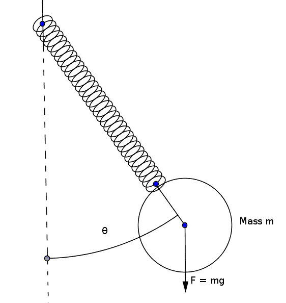

我们研究两个变量随时间的变化：

+   弹簧的长度 l

+   弹簧与中心线之间的角度（θ），如图所示的前一图。

由于有两个变量随时间变化，我们系统在任何时刻的状态都可以通过使用四个状态变量来表示：

+   弹簧长度（l）

+   春季长度变化（dl/dt），即速度

+   角度 (θ)

+   角度变化（dθ/dt），即角速度

它们由以下四个微分方程建模：

+   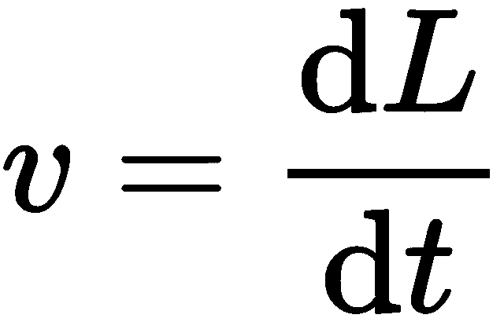

+   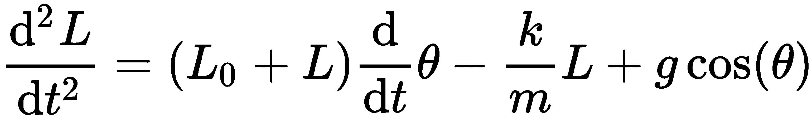

+   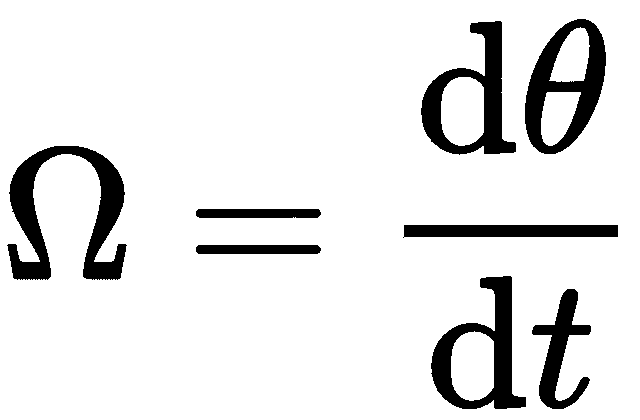

+   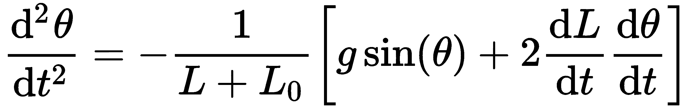

第一个方程衡量线性速度，即 *L* 随时间变化的速率。第二个方程是二阶导数，它给出了加速度。第三个方程衡量 theta 随时间的变化，因此代表角速度。最后一个方程是 theta 随时间的二阶导数，因此它代表角加速度。

让我们先定义以下常数：

```py
UNSTRETCHED_SPRING_LENGTH = 30
SPRING_CONSTANT = 0.1
MASS = 0.3
GRAVITY = 9.8
NUMBER_OF_STEPS_IN_SIMULATION = 500
```

因此，让我们首先定义这四个状态变量的初始值：

```py
state_vector = [ 1, 1, 0.3, 1 ]  
# 4 values represent 'l', 'dl/dt', 'θ', 'dθ/dt' respectively
```

然后，我们定义了`differentials_functions`方法，该方法返回先前定义的四个微分函数的数组：

```py
def differential_functions(state_vector, time):
 func1 = state_vector[1]
 func2 = (UNSTRETCHED_SPRING_LENGHT + state_vector[0]) * 
   state_vector[3]**2 -  
   (SPRING_CONSTANT / MASS * state_vector[0]) + GRAVITY * 
     np.cos(state_vector[2])
 func3 = state_vector[3]
 func4 = -(GRAVITY * np.sin(state_vector[2]) + 2.0 * state_vector[1] * 
   state_vector[3]) / (UNSTRETCHED_SPRING_LENGHT + state_vector[0])
 return np.array([func1, func2, func3, func4])
```

接下来，我们将使用 `scipy.integrate.odeint` 来求解微分方程。此方法可以用来求解以下形式的常微分方程组：

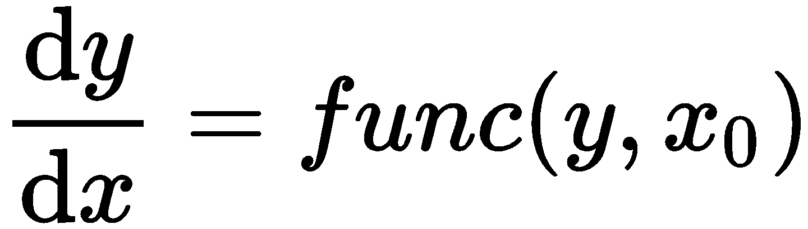

这是`scipy.integrate.odeint`函数的签名：

```py
scipy.integrate.odeint(func, y0, t, optional arguments)
```

位置：

+   `func`: 可调用函数(y, t0, ...), 用于计算 y 在 t0 处的导数

+   `y0`: 初始条件数组（可以是一个向量）

+   `t`: 用于求解 y 的时间点数组

初始值点应该是这个序列的第一个元素。

此方法以导数函数（`func`）、初始状态值数组（`yθ`）和时间数组（`t`）作为输入。它返回与这些时间相对应的状态值数组。

由于我们是针对时间进行微分，我们需要一个变量来跟踪时间（`8.10_spring_pendulum.py`）：

```py
time = np.linspace(0, 37, NUMBER_OF_STEPS_IN_SIMULATION)
```

这里数字`37`是采样时间的步长。改变这个值将会改变模拟的速度。

现在我们终于使用 `scipy.integrate.odeint` 解决了微分方程组，如下所示 (`8.10_spring_pendulum.py`):

```py
ode_solution = odeint(differential_functions, state_vector, time)
```

由于我们将模拟步数设置为 500，并且有四个状态变量，`odeint`方法返回一个形状为(*500*, *4*)的 numpy 数组，其中每一行代表在特定时间点上四个状态变量的值。

现在回想一下，我们的状态向量是一个包含四个值的列表，`['l', 'dl/dt', 'θ', 'dθ/dt']`。因此，第 0 列返回值 `'l'`，而第 2 列代表值 `'θ'`。这是极坐标格式的表示。我们的画布理解笛卡尔坐标系。因此，我们按照以下方式获得每个(*l*, *θ*)值的笛卡尔坐标(*x*, *y*)（`8.10_spring_pendulum.py`）:

```py
x_coordinates = (UNSTRETCHED_SPRING_LENGHT + ode_solution[:, 0]) 
                * np.sin(ode_solution[:, 2])
y_coordinates = (UNSTRETCHED_SPRING_LENGHT + ode_solution[:, 0]) 
                * np.cos(ode_solution[:, 2])
```

拿到这些数据后，现在只需将其绘制在画布上。因此，我们在`mainloop`中创建一个 Canvas 小部件，并调用一个每 15 毫秒运行一次的`update_graph`方法，该方法会删除画布上的所有内容并重新绘制线条和一个椭圆（摆球）。我们还添加了一个增量变量，`plot_step`，每次模拟结束时都会重置为零。这使摆锤能够永远摆动（`8.10_spring_pendulum.py`）：

```py
plot_step = 0

def update_graph():
 global plot_step
 if plot_step == NUMBER_OF_STEPS_IN_SIMULATION: # simulation ended
   plot_step = 0 # repeat the simulation
 x, y = int(x_coordinates[plot_step]) + w / 2, 
   int(y_coordinates[plot_step] + h / 2)
 canvas.delete('all')
 canvas.create_line(w / 2, 0, x, y, dash=(2, 1), width=1, fill="gold4")
 canvas.create_oval(x - 10, y - 10, x + 10, y + 10, outline="gold4", 
   fill="lavender")
 plot_step = plot_step + 1
 root.after(15, update_graph)
```

这将创建一个弹簧摆，如下面的截图所示：

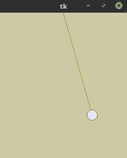

这就完成了迭代。你可以通过改变常数的值（质量、弹簧常数和重力）来探索这个模拟。此外，改变初始状态向量的元素，例如角度和速度，程序应该会像在现实世界中那样做出响应。

我们看到了如何获得常微分方程（ODE），它是对仅一个变量的导数。这个概念的扩展是**偏微分方程**（**PDEs**），它是对多个变量的导数。更复杂的现象，如电磁学、流体力学、热传递、电磁理论和各种生物模型，都是由偏微分方程建模的。

FEniCS 计算平台([`fenicsproject.org/`](https://fenicsproject.org/))是一个流行的开源软件工具，用于通过 Python 绑定解决偏微分方程（PDEs）。

# 混沌游戏 – 从随机性中构建三角形

混沌游戏指的是当随机数的选取受到某些约束时，随机数产生的分形图案。让我们来看一下最简单的混沌游戏之一的规则：

1.  我们首先在平面上创建三个点以形成一个三角形。

1.  要开始游戏，我们在三角形内随机画一个点。

1.  我们随后掷骰子。根据结果，我们在上一点和三角形的任意一个顶点之间移动一半的距离。例如，如果结果是 1 或 2，我们就从上一点移动到顶点 A 的一半距离。如果结果是 3 或 4，我们就从当前点向顶点 B 移动一半的距离，或者如果结果是 5 或 6，我们就画出下一个点，这个点位于当前点和顶点 C 之间的一半距离，如下面的图像所示。这个过程会反复进行：

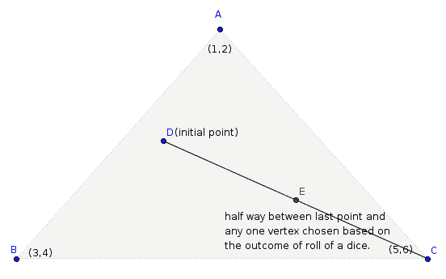

这里是其中的惊喜部分。虽然除了三个顶点之外的所有点都是随机选择的，但最终结果并不是一组随机的点集，而是一个分形——一组重复的三角形模式，被称为谢尔宾斯基三角形，如下面的截图所示。据一些数学家所说，这是对宇宙秩序的窥视，这种秩序隐藏在看似混乱的事物之中：

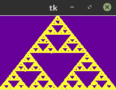

注意，在四个点的集合内重复这条规则并不会产生分形。然而，对顶点选择施加一些特定的限制会产生各种有趣的分形形状。您可以在[`en.wikipedia.org/wiki/Chaos_game`](https://en.wikipedia.org/wiki/Chaos_game)上了解更多关于从混沌游戏中产生的不同分形品种的信息。

让我们现在编写这个程序。我们首先定义三角形的三个顶点，如图中所示的前一个截图：

```py
v1 = (float(WIDTH/2), 0.0)
v2 = (0.00, float(HEIGHT))
v3 = (float(WIDTH), float(HEIGHT))
```

在这里，`WIDTH` 和 `HEIGHT` 代表窗口的尺寸。

我们接下来的任务是选择三角形内部的一个随机点作为起点。这可以通过所谓的**重心坐标**来实现。

设 *V1*, *V2*, *V3* 为三角形的三个顶点。三角形内部的点 *P* 可以表示为 *P = aV[1] + bV[2] + cV[3]*，其中 *a+b+c=1* 且 *a, b, c* 均满足 *≥ 0*。如果我们已知 *a* 和 *b*，则可以通过 *1-a-b* 计算出 *c*。

因此我们生成两个随机数，`a` 和 `b`，每个都在范围 [*0*,*1*] 内，使得它们的和 ≤ 1。如果两个随机点的和超过 1，我们将 `a` 替换为 1-a，将 `b` 替换为 1-b，这样它们的和就会回到 1 以下。然后，aV[1] + bV[2] + cV[3] 在三角形内部是均匀分布的。

现在我们已经得到了重心坐标 a、b 和 c，我们可以计算出三角形内部的点 P，即 aV1 + bV2 + cV3。以下是这个想法在代码（`8.11_chaos_game.py`）中的表达：

```py
def random_point_inside_triangle(v1, v2, v3):
  a = random.random()
  b = random.random()
  if a + b > 1:
    a = 1-a
    b = 1-b
  c = 1 - a -b
  x = (a*v1[0])+(b*v2[0])+(c*v3[0]);
  y = (a*v1[1])+(b*v2[1])+(c*v3[1]);
  return (x,y)
```

我们接下来定义一种计算两点之间中点距离的方法：

```py
def midway_point(p1, p2):
  x = p1[0] + (p2[0] - p1[0]) //2
  y = p1[1] + (p2[1] - p1[1]) //2
  return (x,y)
```

这是在两点之间基于勾股定理的简单线性插值。注意，在 Python 中，`/`运算符执行浮点除法，而`//`运算符执行整数除法（丢弃余数）。

接下来，我们将游戏的规则放入一个名为 `get_next_point` 的方法中：

```py
def get_next_point():
  global last_point
  roll = random.choice(range(6))+1
  mid_point = None
  if roll == 1 or roll == 2:
    mid_point = midway_point(last_point, v1)
  elif roll == 3 or roll == 4:
    mid_point = midway_point(last_point, v2)
  elif roll == 5 or roll == 6:
    mid_point = midway_point(last_point, v3)
 last_point = mid_point
 return mid_point
```

最后，我们创建一个 Tkinter 画布并定义一个名为`update`的方法，以便每 1 毫秒绘制单个像素，如下所示：

```py
def update():
 x,y = get_next_point()
 canvas.create_rectangle(x, y, x, y, outline="#FFFF33")
 root.after(1, update)
```

调用这个`update`方法会在我们的混沌游戏中创建分形图案。

# 叶序

叶序一词源自希腊语单词 phýllon（意为叶子）和 táxis（意为排列）。因此，叶序是研究叶子与花朵中发现的螺旋排列方式的研究。

在本节中，我们将编写以下花卉图案的代码：

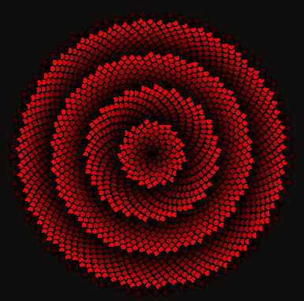

该程序的数学细节来自书籍《植物算法学》的**第四章**——您可以从这里获取其 PDF 版本：[`algorithmicbotany.org/papers/abop/abop-ch4.pdf.`](http://algorithmicbotany.org/papers/abop/abop-ch4.pdf)

这里是我们将在本章中使用的两个公式：

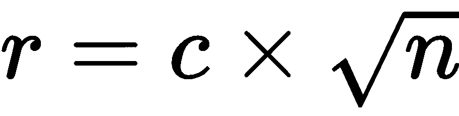  和 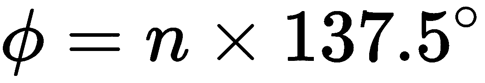

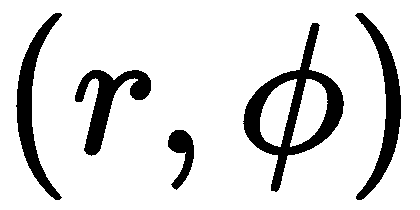。正如您将看到的，我们的叶序将由螺旋图案排列的点组成。所以，前一个例子中的变量 *n* 代表从螺旋中心开始计数的第 *n* 个点的数量或索引。变量 c 被用作一个比例因子，它决定了点在最终图像中看起来是近还是远。角度 `137.5` 与黄金比例和斐波那契角度相关，看起来最自然。您可以在链接的 PDF 中了解更多相关信息。

首先，我们定义到目前为止所讨论的所有值：

```py
width, height = 500, 500
number_of_dots = 2000
angle = 137.5
scaling_factor = 4
dot_size = 4
n = np.arange(number_of_dots)
r = np.zeros(number_of_dots)
phi = np.zeros(number_of_dots)
x= np.zeros(number_of_dots)
y= np.zeros(number_of_dots)
dots = []
colors = []
```

接下来，我们创建一个 Tkinter 画布，并将颜色添加到`colors`列表中。我们还使用`create_oval`创建点，并将所有椭圆的引用保存到`dots`列表中：

```py
for i in n:
  r = (scaling_factor * np.sqrt(i) * 6 ) %256
  color = '#%02x%02x%02x' % (int(r) , 0, 0)
  colors.append(color)
  dots.append(canvas.create_oval(x[i]-dot_size, y[i]-dot_size,
                    x[i]+dot_size, y[i]+dot_size, fill=color ))
```

在前面代码中定义的颜色是基于`r`的值，并且完全是任意的。我们本可以使用任何其他变量或规则来定义颜色。

最后，我们定义了更新函数，该函数每 15 毫秒计算`r`和`∅`的值，并更新画布上所有椭圆的坐标：

```py
def update():
 global angle
 angle +=0.000001
 phi = angle * n
 r = scaling_factor * np.sqrt(n)
 x = r * np.cos(phi) + width/2
 y = r * np.sin(phi) + height/2
 for i in n:
 canvas.coords(dots[i],x[i]-dot_size, y[i]-dot_size,x[i]+dot_size, 
   y[i]+dot_size )
 root.after(15, update )
```

你现在应该能看到叶序模式。尝试更改所有参数，看看图像如何变化。

# 使用 Tkinter 的 3D 图形

Tkinter 的 Canvas 小部件允许使用精确的坐标进行绘图。因此，它可以用来创建各种 3D 图形。此外，我们之前已经看到了 Tkinter 的动画功能。我们还可以将这些功能应用到 3D 动画中。

让我们创建一个简单的应用程序，在其中我们创建一个位于中心的立方体。我们添加事件监听器以在鼠标事件上旋转立方体。我们还制作了一个小动画，当没有鼠标干预时，立方体会自行旋转。

在其最终形态下，应用程序将如下所示 (`8.13_3D_graphics.py`):

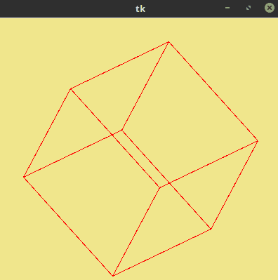

在 Python 中，通过使用特殊的 * 操作符可以进行转置或解压，任何三维空间中的点都可以用 *x*、*y* 和 *z* 坐标来表示。这通常表示为以下形式的向量：

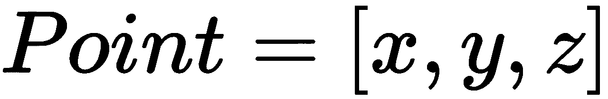

这是一个行向量的例子，因为所有三个点都写在一行中。

这对人类阅读来说很方便。然而，按照惯例，并且为了某些我们稍后会看到的数学优势，位置被视为一个列向量。因此，它被写成如下列的形式：

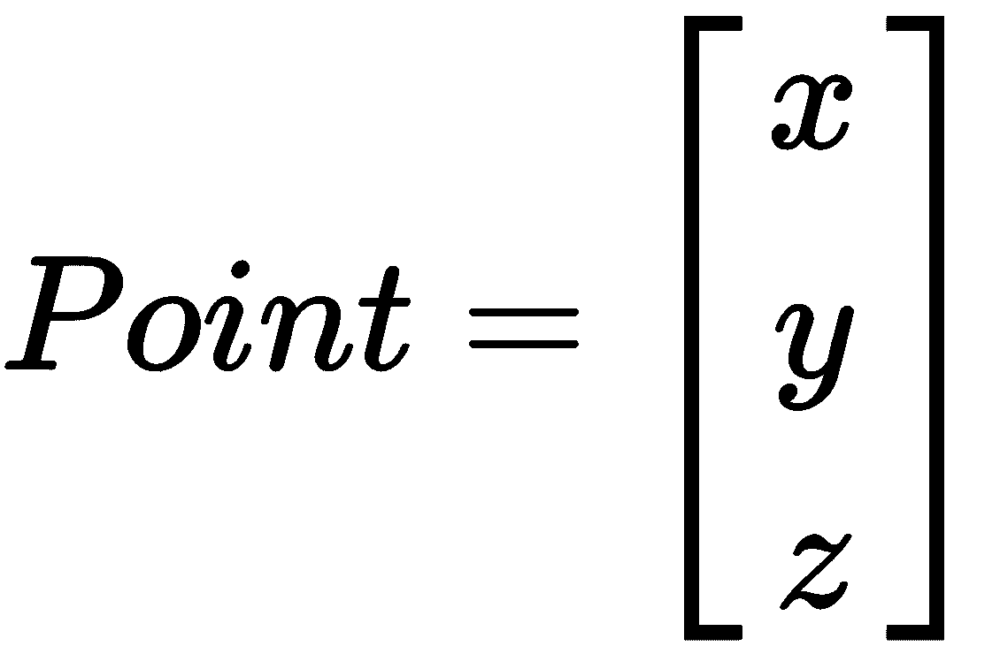

由于形状是一系列点的集合，因此它本质上是一系列列向量的集合。一系列列向量构成了一个矩阵，其中矩阵的每一列代表 3D 空间中的一个单独的点：

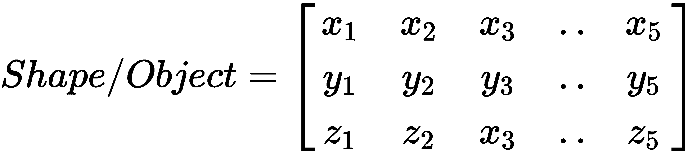

让我们以一个立方体为例。一个立方体有八个定义的顶点。一个代表性的立方体可以有以下八个点，其中心位于[*0*，*0*，*0*]：

```py
Vertex 1 : [-100,-100,-100],
Vertex 2 : [-100, 100,-100],
Vertex 3: [-100,-100,100],
Vertex 4: [-100,100,100],
Vertex 5: [100,-100,-100],
Vertex 6: [100,100,-100],
Vertex 7: [100,-100,100],
Vertex 8: [100,100,100]
```

然而，在这里顶点被表示为行向量。为了将向量表示为列向量，我们需要转置前面的矩阵。由于转置将是一个常见的操作，让我们首先创建一个名为 `MatrixHelpers` 的类，并定义一个名为 `transpose_matrix`( `8.13_3D_graphics.py`): 的方法。

```py
class MatrixHelpers():

  def transpose_matrix(self,matrix):
    return list(zip(*matrix))
```

在 Python 中，可以通过使用特殊的`*`运算符来实现转置或解压，这使得`zip`函数成为其自身的逆函数。

前述坐标的另一个问题是它以 (*0*,*0*,*0*) 为中心。这意味着如果我们尝试在画布上绘制前述点，它只会部分显示，位于画布的左上角，类似于这样：

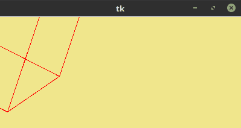

我们需要将所有点移动到屏幕中心。我们可以通过向原始矩阵添加*x*和*y*偏移值来实现这一点。

因此，我们定义一个新的方法，命名为 `translate_matrix`，如下所示：

```py
def translate_vector(self, x,y,dx,dy):
  return x+dx, y+dy
```

现在我们来绘制实际的立方体。我们定义了一个名为 `Cube` 的新类，它继承自 `MatrixHelper` 类，因为我们想使用在 `MatrixHelper` 类中定义的 `transpose_matrix` 和 `translate_vector` 方法（参见 `code 8.13_3D_graphics.py`）：

```py
class Cube(MatrixHelpers):
  def __init__(self, root):
   self.root = root
   self.init_data()
   self.create_canvas()
   self.draw_cube()
```

`__init__` 方法简单地调用了四个新方法。`init_data` 方法设置了立方体所有八个顶点的坐标值（`8.13_3D_graphics.py`）：

```py
def init_data(self):
  self.cube = self.transpose_matrix([
            [-100,-100,-100],
            [-100, 100,-100],
            [-100,-100,100],
            [-100,100,100],
            [100,-100,-100],
            [100,100,-100],
            [100,-100,100],
            [100,100,100]
         ])
```

`create_canvas` 方法在根窗口上创建一个 `400` x `400` 尺寸的画布，并为画布指定背景和填充颜色：

```py
 def create_canvas(self):
   self.canvas = Canvas(self.root, width=400, height=400, background=self.bg_color)
   self.canvas.pack(fill=BOTH,expand=YES)
```

最后，我们定义了`draw_cube`方法，该方法使用`canvas.create_line`在选定的点之间绘制线条。我们不想在所有点之间绘制线条，而是希望在选定的某些顶点之间绘制线条以形成一个立方体。因此，我们相应地定义了该方法，如下所示（`8.13_3D_graphics.py`）：

```py
def draw_cube(self):
 cube_points_to_draw_line = [[0, 1, 2, 4],
           [3, 1, 2, 7],
           [5, 1, 4, 7],
           [6, 2, 4, 7]]
 w = self.canvas.winfo_width()/2
 h = self.canvas.winfo_height()/2
 self.canvas.delete(ALL)
 for i in cube_points_to_draw_line:
  for j in i:
    self.canvas.create_line(self.translate_vector(self.cube[0][i[0]], 
     self.cube[1][i[0]], w, h), 
    self.translate_vector(self.cube[0][j], self.cube[1][j], w, h), fill 
      = self.fg_color)
```

这段代码在画布上绘制了一个立方体。然而，由于立方体是优先绘制的，所以我们看到的是正面的一个正方形。为了看到立方体，我们需要将立方体旋转到不同的角度。这引出了 3D 变换的话题。

通过将形状矩阵与另一个称为变换矩阵的矩阵相乘，可以实现多种 3D 变换，例如缩放、旋转、剪切、反射和正交投影。

例如，缩放形状的变换矩阵是：

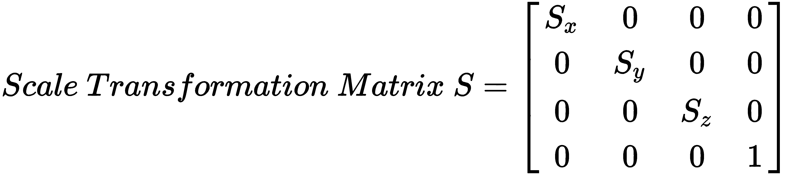

其中 *S*[x]、*S*[y] 和 *S*[z] 分别是沿 *x*、*y* 和 *z* 方向的缩放因子。将任何形状矩阵与这个矩阵相乘，你就能得到缩放形状的矩阵。

因此，让我们向我们的`MatrixHelper`类（`8.13_3D_graphics.py`）中添加一个名为`matrix_multiply`的新方法：

```py
def matrix_multiply(self, matrix_a, matrix_b):
  zip_b = list(zip(*matrix_b))
  return [[sum(ele_a*ele_b for ele_a, ele_b in zip(row_a, col_b)) 
          for col_b in zip_b] for row_a in matrix_a]
```

接下来，让我们添加旋转立方体的功能。我们将使用旋转变换矩阵。此外，由于旋转可以沿着任何 *x*、*y* 或 *z* 轴进行，实际上存在三个不同的变换矩阵。以下为三个旋转矩阵：

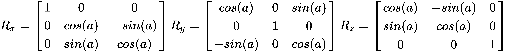

将形状坐标乘以给定值 *a* 的第一个矩阵，你得到形状绕 *x* 轴逆时针旋转了角度 *a*。同样，其他两个矩阵分别绕 *y* 轴和 *z* 轴旋转。

要按顺时针方向旋转，我们只需将前一个矩阵中所有正弦值的符号翻转即可。

注意，然而，旋转的顺序很重要。所以如果你首先沿着*x*轴旋转，然后沿着*y*轴旋转，这和首先沿着*y*轴旋转，然后沿着*x*轴旋转是不一样的。

更多关于旋转矩阵的详细信息可以在[`en.wikipedia.org/wiki/Rotation_matrix`](https://en.wikipedia.org/wiki/Rotation_matrix)找到。

因此，既然我们已经知道了三个旋转矩阵，那么让我们在我们的`MatrixHelper`类（`8.13_3D_graphics.py`）中定义以下三个方法：

```py
def rotate_along_x(self, x, shape):
   return self.matrix_multiply([[1, 0, 0],
                                [0, cos(x), -sin(x)], 
                                [0, sin(x), cos(x)]], shape)

def rotate_along_y(self, y, shape):
   return self.matrix_multiply([[cos(y), 0, sin(y)], 
                                [0, 1, 0], 
                                [-sin(y), 0, cos(y)]], shape)

def rotate_along_z(self, z, shape):
   return self.matrix_multiply([[cos(z), sin(z), 0],
                                [-sin(z), cos(z), 0], 
                                [0, 0, 1]], shape)
```

接下来，我们定义一个名为 `continually_rotate` 的方法，并在我们的 `Cube` 类的 `__init__` 方法中调用此方法：

```py
def continually_rotate(self):
 self.cube = self.rotate_along_x(0.01, self.cube)
 self.cube = self.rotate_along_y(0.01, self.cube)
 self.cube = self.rotate_along_z(0.01, self.cube)
 self.draw_cube()
 self.root.after(15, self.continually_rotate)
```

该方法使用 `root.after` 每 15 毫秒调用自身。在每次循环中，立方体的坐标沿所有三个轴旋转 `0.01` 度。随后调用绘制立方体，使用一组新的坐标。现在，如果你运行此代码，立方体会持续旋转。

接下来，让我们将立方体的旋转绑定到鼠标按钮点击和鼠标移动。这样用户就可以通过点击并拖动鼠标在立方体上旋转立方体。

因此，我们定义以下方法并将其命名为`Cube`类的`__init__`方法：

```py
def bind_mouse_buttons(self):
  self.canvas.bind("<Button-1>", self.on_mouse_clicked)
  self.canvas.bind("<B1-Motion>", self.on_mouse_motion)
```

前一个事件绑定中链接的方法定义如下：

```py
def on_mouse_clicked(self, event):
  self.last_x = event.x
  self.last_y = event.y

def on_mouse_motion(self, event):
  dx = self.last_y - event.y
  self.cube = self.rotate_along_x(self.epsilon(-dx), self.cube)
  dy = self.last_x - event.x
  self.cube = self.rotate_along_y(self.epsilon(dy), self.cube)
  self.draw_cube()
  self.on_mouse_clicked(event)
```

注意，前面提到的方法是将鼠标沿 *y* 轴的位移映射到沿 *x* 轴的旋转，反之亦然。

此外，请注意代码的最后一行调用了`on_mouse_clicked()`函数来更新`last_x`和`last_y`的值。如果你跳过那一行，当你从最后点击的位置增加位移时，旋转会变得极其快速。

此方法还指代另一种名为 epsilon 的方法，该方法将距离转换为等效角度以进行旋转。epsilon 方法定义如下：

```py
self.epsilon = lambda d: d * 0.01
```

这里所说的ε是通过将位移 d 与任意值 0.01 相乘得到的。您可以通过改变这个值来增加或减少旋转对鼠标位移的灵敏度。

现在，立方体对鼠标点击和拖动操作在画布上的响应。这标志着本章最后一个项目的结束。

在这里，我们只是刚刚触及了 3D 图形的表面。有关使用 Tkinter 进行 3D 编程的更详细讨论，可以在[`sites.google.com/site/3dprogramminginpython/`](https://sites.google.com/site/3dprogramminginpython/)找到。

也有尝试进一步抽象化并构建 Tkinter 的 3D 编程框架。你可以在 [`github.com/calroc/Tkinter3D`](https://github.com/calroc/Tkinter3D) 找到一个 Tkinter 的 3D 框架示例。

本章内容到此结束，同时也结束了我们对 Canvas 小部件的实验。在下一章中，我们将探讨编写 GUI 应用程序中最常见的一些主题，例如使用队列数据结构、数据库编程、网络编程、进程间通信、使用`asyncio`模块，以及编程中的一些其他重要概念。

# 摘要

让我们总结一下本章讨论的概念。

我们制作了一个屏幕保护程序，在这个过程中学习了如何在 Tkinter 画布上实现动画。接下来，我们看到了如何在画布上创建笛卡尔和极坐标图。我们还学习了如何将 `matplotlib` 图表嵌入到 Tkinter 窗口中。

我们随后实现了一个基本的引力模拟，展示了我们如何将一个物理模型通过 Tkinter 画布进行实现。我们窥见了沃罗诺伊图（Voronoi diagrams）的实现过程，这些图被用于模拟和解决许多实际世界的实际问题。

我们还构建了一些漂亮的可视化效果，例如曼德布罗特集和叶形星系。

最后，我们学习了如何使用 Tkinter 画布通过变换矩阵来绘制和动画化 3D 图形。

# QA 部分

这里有一些问题供您思考：

+   你如何将极坐标转换为笛卡尔坐标？在什么情况下我们应该优先选择一个坐标系而不是另一个？

+   你如何在 Tkinter 画布上动画化？什么决定了动画的速度？

+   我们如何使用微分方程在 Tkinter 画布上模拟现实世界的现象？

+   分形在现实世界中有哪些应用？

+   分形仍在积极研究中。你能找出一些依赖分形使用的尖端技术吗？

+   Voronoi 图在现实世界中有哪些应用？

+   我们如何将我们的 3D 立方体程序扩展以显示其他物体的网格——比如说汽车模型、人体或现实世界中的物体？

# 进一步阅读

曼德布罗集的近亲是朱利亚集。阅读有关朱利亚集的内容，然后修改`8.07_Mandelbrot.py`以生成朱利亚集。分形是一个非常有趣的研究主题，而且它们背后的许多数学问题仍然未被探索。除了它们看起来很美之外，它们还被广泛应用于许多实际应用中。参见[`en.wikipedia.org/wiki/Fractal#Applications_in_technology`](https://en.wikipedia.org/wiki/Fractal#Applications_in_technology)。

如果分形引起了你的兴趣，你还可以看看曼德布罗集的其他变体，例如磁铁 1 分形和佛陀分形。

如果你对学习混沌行为感兴趣，尝试在 Tkinter 画布上绘制 Hénon 函数。

我们模拟了一个弹簧摆，它以确定性的方式工作。然而，将两个摆组合成一个双摆会形成一个混沌的动态系统。尽管这样的系统遵循常微分方程，但最终结果可能会因初始条件的微小变化而大幅变化。尝试通过修改我们的弹簧摆来模拟双摆可能值得尝试。

我们使用了 `scipy` 中的内置 `odeint` 方法。然而，我们也可以使用欧拉法或龙格-库塔法编写自己的变体。你可以在这里了解更多关于这些用于近似常微分方程的数值方法：[常微分方程的数值方法](https://en.wikipedia.org/wiki/Numerical_methods_for_ordinary_differential_equations)。

如果整洁或引人入胜的视觉呈现看起来像是一件有趣的事情去做，这里还有一些你可能会感兴趣的项目：巴恩斯利蕨叶、细胞自动机、洛伦兹吸引子，以及使用 Verlet 积分模拟可撕裂布料。

光线追踪是一种强大但非常简单的 3D 渲染技术，可以轻松地在大约 100 行代码中实现。
