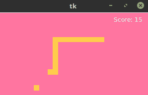
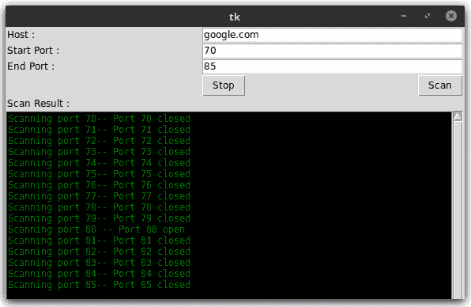
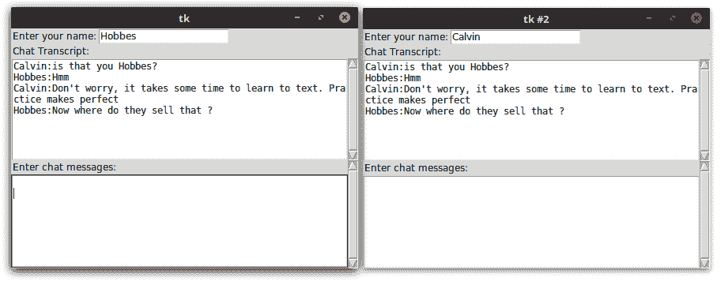
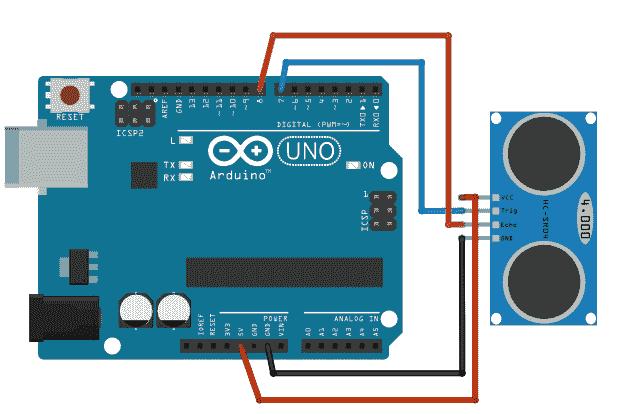
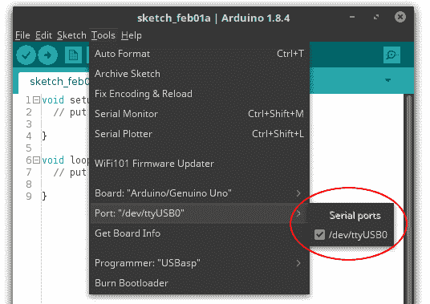

# 第九章：多种趣味项目

到目前为止，我们已经探索了 Tkinter 的大部分重要特性。让我们利用本章来探讨在编写 GUI 应用程序时虽然不是 Tkinter 的核心，但经常遇到的一些编程方面。

在本章中，我们将从不同领域开发几个小型应用程序。我们将构建的应用程序包括：

+   蛇形游戏应用

+   天气预报应用

+   端口扫描应用程序

+   聊天应用程序

+   电话簿应用程序

+   超声波测距扫描仪应用

本章的一些关键目标包括：

+   学习使用 `Queue` 模块以避免在编写多线程程序时出现的竞态条件和其它同步问题

+   理解网络数据挖掘的基本原理

+   为了理解套接字编程以及学习服务器-客户端架构的基础

+   学习数据库编程

+   学习如何使用 `asyncio` 与 Tkinter

+   学习如何使用串行通信接口和交互外部硬件组件

# 技术要求

本章中的大多数项目都依赖于标准库，不需要额外的东西。例外的是超声波测距仪项目，该项目需要一个 Arduino 板和一个超声波测距仪传感器。硬件相对便宜（低于 10 美元）。你也可以选择不购买硬件，仍然可以阅读该项目，了解两台设备之间如何进行串行通信。

此外，您还需要下载并安装 Arduino **集成开发环境**（**IDE**），其具体细节将在项目本身中进行讨论。

# 构建一个贪吃蛇游戏

让我们现在构建一个简单的贪吃蛇游戏。像往常一样，我们将使用`Canvas`小部件为我们的蛇程序提供平台。我们将使用`canvas.create_line`来绘制蛇，以及`canvas.create_rectangle`来绘制蛇的食物。

本项目的首要目标是学习如何在多线程应用程序中把`Queue`模块用作**同步技术**。

编写多线程应用程序会面临不同线程之间同步的挑战。当多个线程试图同时访问共享数据时，数据很可能会被损坏或以程序中未预期的方式修改。这被称为**竞态条件**。

# 理解竞态条件

`9.01_race_condition.py` 代码演示了竞态条件。程序如下：

```py
import threading

class RaceConditionDemo:
  def __init__(self):
    self.shared_var = 0
    self.total_count = 100000
    self.demo_of_race_condition()

  def increment(self):
    for i in range(self.total_count):
      self.shared_var += 1

  def decrement(self):
    for i in range(self.total_count):
      self.shared_var -= 1

  def demo_of_race_condition(self):
    t1 = threading.Thread(target=self.increment)
    t2 = threading.Thread(target=self.decrement)
    t1.start()
    t2.start()
    t1.join()
    t2.join()
    print("value of shared_var after all increments & decrements :", self.shared_var)

if __name__ == "__main__":
  for i in range(100):
     RaceConditionDemo()
```

前面的代码包含两个名为 `increment` 和 `decrement` 的方法，这两个方法都操作一个名为 `shared_var` 的单个共享变量。这两个方法是从不同的线程中调用的。

人们会预期在共享变量上进行相同数量的增加和减少操作，其值在结束时不会发生变化。然而，当你运行这个程序，比如像之前那样运行 100 次，每次连续运行都会得到共享变量的不同值。这是一个经典的例子，说明了竞争条件如何使程序输出变得非确定性。

竞态条件发生是因为我们根本无法预测线程的执行顺序。操作系统执行得非常随机，因此每次程序运行时线程的执行顺序都会有所不同。

# 使用同步原语

为了处理这种复杂性，`threading`模块提供了一些同步原语，例如锁、join 操作、信号量、事件和条件变量。

`9.02_lock_demo.py` 通过引入此行使用 `lock` 对前面的代码进行了轻微修改：

```py
self.lock = threading.Lock()
```

接下来，每次要修改`shared_variable`时，都是在获取一个`lock`之后进行的。当变量被修改后，`lock`会被释放，如下面的代码所示：

```py
self.lock.acquire()
self.shared_var += 1
self.lock.release()
```

这使我们能够避免竞态条件。由于此代码使用`锁`进行操作，在等量的增加和减少之后，它不会在共享变量中产生任何变化。

使用`锁`机制来避免竞态条件似乎很简单。然而，随着程序复杂性的增加，可能会有许多地方会修改变量。追踪大型代码库中可能被修改的变量位置通常是一项困难的任务。

# 使用队列

在大多数情况下，使用**队列**更安全、更简单。简单来说，队列是一种线程安全的复合内存结构。队列有效地按顺序将资源的访问权限分配给多个线程，并且是推荐的设计模式，适用于大多数需要并发的场景。

`Queue`模块提供了一种实现不同类型队列的方法，例如 FIFO（默认实现）、LIFO 队列和优先队列，并且该模块自带了运行多线程程序所需的所有锁定语义的内置实现。

这里是`Queue`模块基本用法的快速总结：

```py
my_queue = Queue() #create empty queue
my_queue.put(data)# put items into queue
task = my_queue.get () #get the next item in the queue
my_queue.task_done() # called when a queued task has completed
my_queue.join() # awaits for all tasks in queue to get completed
```

让我们看看使用队列实现多线程应用程序的一个简单示例（见`9.03_threading_with_queue.py`）：

```py
import queue
import threading

class Consumer(threading.Thread):

  def __init__(self, queue):
   threading.Thread.__init__(self)
   self.queue = queue

  def run(self):
    while True:
      task = self.queue.get()
      self.do_task(task)

  def do_task(self, task):
    print ('doing task{}'.format(task))
    self.queue.task_done()

def producer(tasks):
    my_queque = queue.Queue()
    # populate queue with tasks
    for task in tasks:
      my_queque.put(task)
    # create 6 threads and pass the queue as its argument
    for i in range(6):
      my_thread = Consumer(my_queque)
      my_thread.daemon = True
      my_thread.start()
    # wait for the queue to finish
    my_queque.join()
    print ('all tasks completed')

if __name__ == "__main__":
  tasks = 'A B C D E F'.split()
  producer(tasks)
```

代码的描述如下：

+   我们首先创建一个`Consumer`类，它继承自 Python 的`threading`模块。`__init__`方法接受一个队列作为其参数。

+   我们随后覆盖了`threading`模块的`run`方法，通过使用`queue.get()`从队列中获取每个项目，然后将其传递给`task_handler`方法，该方法实际上执行当前队列项中指定的任务。在我们的示例中，它除了打印任务的名称外，没有做任何有用的事情。

+   在我们的`task_handler`方法完成特定线程的工作后，它通过使用`queue.task_done()`方法向队列发送一个信号，告知任务已完成。

+   在我们的`Consumer`类外部，我们在`producer()`模块函数中创建了一个空队列。这个队列通过使用`queue.put(task)`方法被填充了一个任务列表。

+   我们随后创建了六个不同的线程，并将这个已填充的队列作为其参数传递。现在，由于任务由队列处理，所有线程都会自动确保任务按照线程遇到它们的顺序完成，而不会造成任何死锁或两个不同的线程试图处理同一个队列任务的情况。

+   在创建每个线程时，我们也会使用 `my_thread.daemon = True` 创建一个守护线程池。这样做一旦所有线程完成执行，就会将控制权传递给我们的主程序。如果你注释掉这一行，程序仍然会运行，但在所有线程完成执行队列中的任务后，程序将无法退出。如果没有守护线程，你将不得不跟踪所有线程，并在你的程序完全退出之前告诉它们退出。

+   最后，`queue.join()` 方法确保程序流程在此等待，直到所有排队任务实际上完成并且队列变为空。

# 构建贪吃蛇游戏

在了解了使用队列处理多线程应用程序的背景信息之后，让我们构建我们的贪吃蛇游戏。

游戏完成后，其外观将如下所示：



# 视图类

让我们先通过创建一个基本的`View`类来开始编写我们的游戏代码。这个类将负责创建 GUI，检查*游戏结束*逻辑，并且最重要的是充当消费者，从队列中取出项目并处理它们以更新视图（参见`9.04_game_of_snake.py`）：

```py
class View(Tk):
  def __init__(self, queue):
    Tk.__init__(self)
    self.queue = queue
    self.create_gui()

  def create_gui(self):
    self.canvas = Canvas(self, width=495, height=305, bg='#FF75A0')
    self.canvas.pack()
    self.snake = self.canvas.create_line((0, 0), (0,0),fill='#FFCC4C', 
      width=10)
    self.food = self.canvas.create_rectangle(0, 0, 0, 0,  
      fill='#FFCC4C', outline='#FFCC4C')
    self.points_earned = self.canvas.create_text(455, 15, fill='white', 
      text='Score:0')
```

到现在为止，前面的代码应该对你来说已经很熟悉了，因为我们以前写过类似的代码。然而，请注意，我们现在的`View`类不是将根实例作为参数传递给其`__init__`方法，而是从`Tk`类继承。这行代码`Tk.__init__(self)`确保根窗口对所有这个类的所有方法都是可用的。这样我们就可以通过简单地引用`self`来避免在每一行都写上根属性。

本节课还将包含处理队列中放入的项目代码。在编写了将项目放入队列的类之后，我们将继续编写本节课的其余代码。

# 食品类别

接下来，我们将创建`Food`类（参见`9.04_game_of_snake.py`）：

```py
class Food:

def __init__(self, queue):
 self.queue = queue
 self.generate_food()

def generate_food(self):
 x = random.randrange(5, 480, 10)
 y = random.randrange(5, 295, 10)
 self.position = (x, y)
 rectangle_position = (x - 5, y - 5, x + 5, y + 5)
 self.queue.put({'food': rectangle_position})
```

代码的描述如下：

+   因为我们希望从队列内部集中处理所有数据，所以我们把队列作为参数传递给`Food`类的`__init__`方法。

+   `__init__` 方法调用了另一个名为 `generate_food` 的方法，该方法负责在画布上随机位置生成蛇的食物。

+   `generate_food` 方法在画布上生成一个随机的 (`x`, `y`) 位置。然而，因为坐标重合的地方只是画布上的一个很小的点，几乎看不见。因此，我们生成一个扩展的坐标（`rectangle_position`），范围从比 (`x`, `y`) 坐标小五个值的范围到比相同坐标高五个值的范围。使用这个范围，我们可以在画布上创建一个容易看见的小矩形，它将代表我们的食物。

+   然而，我们在这里并没有创建矩形。相反，我们使用 `queue.put` 将食物（矩形）的坐标传递到我们的队列中。

# 蛇类

现在我们来创建`Snake`类。我们已经在中央队列中分配了一个任务来生成我们的食物。然而，这个任务并没有涉及到额外的线程。我们也可以在不使用线程的情况下生成我们的`Snake`类。但是，因为我们正在讨论实现多线程应用程序的方法，所以让我们将我们的`Snake`类实现为从单独的线程中工作（参见`9.04_game_of_snake.py`）：

```py
class Snake(threading.Thread):

  is_game_over = False

  def __init__(self, queue):
    threading.Thread.__init__(self)
    self.queue = queue
    self.daemon = True
    self.points_earned = 0
    self.snake_points = [(495, 55), (485, 55), (475, 55), (465, 55), 
      (455, 55)]
    self.food = Food(queue)
    self.direction = 'Left'
    self.start()

  def run(self):
    while not self.is_game_over:
      self.queue.put({'move': self.snake_points})
    time.sleep(0.1)
    self.move()

  def on_keypress(self, e):
    self.direction = e.keysym

  def move(self):
   new_snake_point = self.calculate_new_coordinates()
   if self.food.position == new_snake_point:
     self.points_earned += 1
     self.queue.put({'points_earned': self.points_earned})
     self.food.generate_food()
   else:
     self.snake_points.pop(0)
   self.check_game_over(new_snake_point)
   self.snake_points.append(new_snake_point)

  def calculate_new_coordinates(self):
    last_x, last_y = self.snake_points[-1]
    if self.direction == 'Up':
      new_snake_point = (last_x, last_y - 10)
    elif self.direction == 'Down':
      new_snake_point = (last_x, last_y + 10)
    elif self.direction == 'Left':
      new_snake_point = (last_x - 10, last_y)
    elif self.direction == 'Right':
      new_snake_point = (last_x + 10, last_y)
    return new_snake_point

  def check_game_over(self, snake_point):
    x, y = snake_point
    if not -5 < x < 505 or not -5 < y < 315 or snake_point in self.snake_points:
      self.is_game_over = True
      self.queue.put({'game_over': True})
```

代码的描述如下：

+   我们创建一个名为 `Snake` 的类，使其在一个独立的线程中运行。这个类以 `queue` 作为其输入参数。

+   我们将玩家获得的成绩初始化为零，并使用属性`self.snake_points`设置蛇的初始位置。注意，最初，蛇的长度为`40`像素。

+   最后，我们启动线程并创建一个无限循环，以小间隔调用`move()`方法。在每次循环运行期间，该方法通过`self.snake_points`属性，将一个字典填充到`queue`中，其中键为移动，值为蛇的更新位置。

+   首先，`move`方法根据键盘事件获取蛇的最新坐标。它使用一个名为`calculate_new_coordinates`的独立方法来获取最新的坐标。

+   然后它会检查新坐标的位置是否与食物的位置相匹配。如果它们匹配，它会将玩家的得分增加一分，并调用`Food`类的`generate_food`方法在新的位置生成新的食物。

+   如果当前点与食物坐标不重合，它将使用 `self.snake_points.pop(0)` 删除蛇坐标中的第一个项目。

+   然后，它调用另一个名为 `check_game_over` 的方法来检查蛇是否撞到墙壁或自身。如果蛇发生碰撞，它将在队列中添加一个新的字典项，其值为 `'game_over':True`。

+   最后，如果游戏尚未结束，它会将蛇的新位置添加到列表 `self.snake_points` 中。这会自动加入到队列中，因为我们已经在 `Snake` 类的 `run()` 方法中定义了 `self.queue.put({'move': self.snake_points })`，以便在游戏未结束的情况下每 `0.1` 秒更新一次。

# 队列处理器

现在队列中已经填充了各种可执行项，让我们创建`queue_handler`方法来处理队列中的项目并相应地更新`View`。

我们在`View`类中定义了`queue_handler()`方法如下：

```py
def queue_handler(self):
 try:
   while True:
     task = self.queue.get_nowait()
     if 'game_over' in task:
       self.game_over()
     elif 'move' in task:
       points = [x for point in task['move'] for x in point]
       self.canvas.coords(self.snake, *points)
     elif 'food' in task:
       self.canvas.coords(self.food, *task['food'])
     elif 'points_earned' in task:
       self.canvas.itemconfigure(self.points_earned, text='Score:  
                               {}'.format (task['points_earned'])) 
     self.queue.task_done()
 except queue.Empty:
   self.after(100, self.queue_handler)
```

代码的描述如下：

+   `queue_handler` 方法会陷入一个无限循环，使用 `task = self.queue.get_nowait()` 在队列中查找任务。如果队列变为空，循环会通过 `canvas.after` 重新启动。

+   当我们使用 `queue_get_nowait()` 时，调用不会阻塞调用线程直到有项目可用。如果可用，它会从队列中移除并返回一个项目。如果队列是空的，它会引发 `Queue.Empty`。

+   一旦从队列中获取了一个任务，该方法会检查其键。

+   如果键是`game_over`，它将调用另一个名为`game_over()`的方法，我们将在下面定义它。

+   如果任务的键是`move`，它使用`canvas.coords`将线条移动到其新位置。

+   如果键是`points_earned`，它将更新画布上的分数。

当一个任务执行完成后，它通过`task_done()`方法向线程发出信号。最后，我们创建主循环如下：

```py
def main():
  q = queue.Queue()
  gui = View(q)
  snake = Snake(q)
  for key in ("Left", "Right", "Up", "Down"):
    gui.bind("<Key-{}>".format(key), snake.on_keypress)
    gui.mainloop()

if __name__ == '__main__':
  main()
```

我们的游戏现在已可运行。去尝试控制蛇，同时保持它的肚子饱饱的。

# 创建一个天气播报应用程序

让我们现在构建一个简单的天气报告应用。任何给定位置的天气数据将从网络中获取，进行适当的格式化，并展示给用户。

我们将使用一个名为 `urllib` 的高级模块从网络中获取天气数据。`urllib` 模块是 Python 的标准库的一部分，它提供了一个易于使用的 API，用于处理 URL。它包含四个子模块：

+   `urllib.request`: 用于打开和读取 URL

+   `urllib.error`: 用于处理由 `urllib.request` 引起的异常

+   `urllib.parse`: 用于解析 URL

+   `urllib.robotparser`: 用于解析 `robots.txt` 文件

使用 `urllib.request`，获取网页内容只需三行代码   (参见 `9.05_urllib_demo.py`):

```py
import urllib.request

with urllib.request.urlopen('http://www.packtpub.com/') as f:
  print(f.read())
```

这将打印整个 HTML 源代码或网页[`www.packtpub.com`](http://www.packtpub.com)的响应。本质上，这是从网络中挖掘信息的核心。

现在我们已经知道了如何从 URL 获取数据，让我们将其应用到构建我们的天气报告应用中。这个应用应该从用户那里获取位置输入，并获取相关的天气数据，如下面的截图所示：


我们创建了一个名为 `WeatherReporter` 的类，并在类外部的 `mainloop` 中调用它（参见 `9.06_weather_reporter.py` 的代码）：

```py
def main():
  root=Tk()
  WeatherReporter(root)
  root.mainloop()

if __name__ == '__main__':
  main()
```

我们在这里不讨论创建此 GUI 的代码，因为我们已经在所有前面的章节中多次进行过类似的编码。天气数据在画布上显示（见`9.06_weather_reporter.py`）：

当你指定一个位置并点击**前往**按钮时，它会调用一个名为`on_show_weather_button_clicked`的命令回调。

我们随后从网站获取天气数据。

从网站获取数据有两种方法。第一种方法涉及从网站获取 HTML 响应，然后解析收到的 HTML 响应以获取与我们相关的数据。这种数据提取方式被称为**网站抓取**。

**Scrapy** 和 **Beautiful Soup** 是两个流行的网站抓取框架，用于从网站中提取数据。您可以在[`scrapy.org/`](http://scrapy.org/) 和 [`www.crummy.com/software/BeautifulSoup/`](http://www.crummy.com/software/BeautifulSoup/) 找到这两个库的官方文档。

网站抓取是一种相当粗糙的方法，只有在给定网站不提供结构化数据检索方式时才会使用。另一方面，一些网站愿意通过一组 API 共享数据，前提是你使用指定的 URL 结构查询数据。这显然比网站抓取更优雅，因为数据是以可靠和*相互同意*的格式进行交换的。

对于我们的天气报道应用，我们希望针对特定位置查询一些天气频道，然后检索并显示数据到我们的画布上。

幸运的是，有几个天气 API 我们可以使用。在我们的示例中，我们将使用以下网站提供的天气数据：

[`openweathermap.org/`](http://openweathermap.org/)

为了使用 API，您需要在此处注册一个免费的 API 密钥：

[注册](http://home.openweathermap.org/users/sign_up)

`OpenWeatherMap` 服务提供免费的天气数据和预报 API。该网站收集来自全球超过 40,000 个气象站的天气数据，数据可以通过城市名称和地理坐标，或者它们的内部城市 ID 进行评估。

该网站提供两种数据格式的天气数据：

+   **JSON** （**JavaScript 对象表示法**）

+   **XML** （**可扩展标记语言**）

XML 和 JSON 是两种流行的可互换数据序列化格式，广泛用于在不同应用程序之间交换数据，这些应用程序可能运行在不同的平台和不同的编程语言上，从而提供了互操作性的好处。

JSON 比 XML 更简单，因为它的语法更简单，并且更直接地映射到现代编程语言中使用的数据结构。JSON 更适合交换数据，但 XML 适合交换文档。

API 文档告诉我们查询的例子如下：

```py
api.openweathermap.org/data/2.5/weather?q=London,uk&APPID={APIKEY} 
```

上述代码返回伦敦的天气数据，格式如下：

```py
{"coord":{"lon":-0.12574,"lat":51.50853},"sys":{"country":"GB","sunrise":1377147503,"sunset":1377198481},"weather":[{"id":500,"main":"Rain", "description": "light rain","icon":"10d"}],"base":"gdps stations","main":{"temp":294.2, "pressure":1020,"humidity":88, "temp_min":292.04,"temp_max":296.48},"wind":{"speed":1,"deg":0},"rain":{"1h":0.25},"clouds":{"
 all":40},"dt":1377178327,"id":2643743,"name":"London","cod":200}
```

JSON 的语法简单。任何 JSON 数据都是一个名称/值对，并且每条数据都由逗号与其它数据分隔。JSON 使用花括号 `{}` 来包含对象，使用方括号 `[ ]` 来包含数组。因此，我们在应用程序中定义了一个方法来获取以 JSON 格式的天气数据（见 `9.06_weather_reporter.py`）：

```py
def get_data_from_url(self):
 try:
   params = urllib.parse.urlencode( {'q': self.location.get(), 'APPID': self.APIKEY},
    encoding="utf-8")
   api_url = ('http://api.openweathermap.org/data/2.5/weather?{}'.format(params))
   with urllib.request.urlopen(api_url) as f:
     json_data = f.read()
     return json_data
 except IOError as e:
   messagebox.showerror('Unable to connect', 'Unable to connect %s' % e)
   sys.exit(1)
```

代码的描述如下：

+   此方法使用 `urllib` 从网站检索响应。它以 JSON 格式返回响应。

+   现在，我们将开始处理 JSON 数据。使用 API 返回的天气数据是以 JSON 格式编码的。我们需要将这些数据转换为 Python 数据类型。Python 提供了一个内置的 `json` 模块，它简化了编码/解码 JSON 数据的过程。因此，我们将 `json` 模块导入到我们的当前命名空间中。

然后，我们将使用这个模块将检索到的 JSON 数据转换为 Python 字典格式（参见 `9.06_weather_reporter.py`）：

```py
def json_to_dict(self, json_data):
 decoder = json.JSONDecoder()
 decoded_json_data = decoder.decode(json_data.decode("utf-8"))
 flattened_dict = {}
 for key, value in decoded_json_data.items():
   if key == 'weather':
     for ke, va in value[0].items():
       flattened_dict[str(ke)] =  str(va).upper()
     continue
   try:
     for k, v in value.items():
     flattened_dict[str(k)] = str(v).upper()
   except:
     flattened_dict[str(key)] = str(value).upper()
 return flattened_dict 
```

现在我们已经拥有了 API 提供的所有与天气相关的信息字典，我们只需使用`canvas.create_text`和`canvas.create_image`来显示检索到的天气数据。显示天气数据的代码是自我解释的（见`9.06_weather_reporter.py`）。

我们的天气报道应用现在已启用。

当您从 Python 程序访问服务器时，在发送请求后留出小的时间间隔非常重要。

一个典型的 Python 程序每秒可以执行数百万条指令。然而，向你发送数据的另一端的服务器并没有配备以那种速度工作的能力。如果你在短时间内有意或无意地向服务器发送大量请求，你可能会阻止它为正常网络用户处理常规请求。这构成了对服务器所谓的**拒绝服务**（**DOS**）攻击。如果你的程序没有发送有限数量的良好行为请求，你可能会被禁止访问，或者在最坏的情况下，因为破坏服务器而被告上法庭。

总结天气报告的代码，我们使用`urllib`模块来查询数据提供者提供的天气 API。数据以 JSON 格式获取。然后，将 JSON 数据解码成 Python 可读的格式（字典）。

转换后的数据随后使用 `create_text` 和 `create_image` 方法在画布上显示。

# 一个简单的套接字示例

本项目的目标是向您介绍网络编程的基础知识以及如何在您的图形用户界面应用程序中使用它。

Python 对网络编程有着强大的支持。在最低级别上，Python 提供了一个 `socket` 模块，它允许你使用简单易用、面向对象的接口连接和与网络进行交互。

对于那些刚开始学习套接字编程的人来说，**套接字**是计算机进行任何网络通信的基本概念。例如，当你在你浏览器中输入`www.packtpub.com`时，你的计算机操作系统会打开一个套接字并连接到远程服务器以为你获取网页。任何需要连接到网络的应用程序都会发生同样的事情。

更具体地说，套接字指的是一个通信端点，它由一个包含以下信息的五个元素元组来表征：

```py
(protocol, local address, local port, remote address, remote port) 
```

这个元组必须对于在本地机器和远程机器之间通信的通道是唯一的。

套接字可以是面向连接的或无连接的。面向连接的套接字允许根据需要双向传输数据。无连接套接字（或数据报套接字）一次只能传输一条消息，而不需要建立开放连接。

套接字可以分为不同的类型或家族。最常用的两种套接字家族是`AF_INET`（用于互联网连接）和`AF_UNIX`（用于 Unix 机器上的进程间通信）。在我们的聊天程序中，我们将使用`AF_INET`。

这是最底层程序员可以访问网络的级别。在套接字层之下，是原始的 UDP 和 TCP 连接，这些连接由计算机的操作系统处理，程序员没有直接的访问点。

让我们简要地看看`socket`模块中可用的一些 API：

| **API**  | **描述** |
| --- | --- |

| `socket.socket` `(addressfamily=AF_INET,`

`type=SOCK_STREAM, proto=0,`

`fileno=None)` | 创建一个套接字。`addressfamily` 表示提供地址的格式，通常是 IP 地址；类型通常是 `SOCK_STREAM` 用于 TCP 或 `SOCK_DGRAM` 用于 UDP 连接协议。协议号通常是零，也可以省略。返回一个套接字对象。 |

| `socket.bind(address)` | 将本地地址与套接字关联。套接字必须尚未绑定。（地址的格式取决于创建套接字时定义的地址族。） |
| --- | --- |
| `socket.listen(backlog)` | 声明接受连接的意愿。backlog 参数指定了队列中最大连接数，其值至少为零；最大值依赖于系统。 |
| `socket.accept()` | 被动建立传入连接。在接受之前，套接字必须绑定到一个地址并监听连接。返回一个 (`conn`, `address`) 对，其中 `conn` 是一个可用于在连接上发送和接收数据的新的套接字对象，而 `address` 是连接另一端绑定到套接字上的地址。 |
| `socket.connect()` | 主动尝试在指定地址上与远程套接字建立连接。 |
| `socket.send(bytes)/socket.sendall(bytes)` | 通过连接发送一些数据。与 `send()` 不同，`sendall()` 会继续从字节中发送数据，直到所有数据都已发送或发生错误。成功时返回 `None`。 |
| `socket.recv(bufsize)` | 通过连接接收一些数据。返回一个表示接收到的数据的字节对象。一次要接收的数据的最大量由`bufsize`指定。 |
| `socket.close()` | 释放连接。底层系统资源（例如，文件描述符）也被关闭。 |

如果你查看本项目代码包中的 `9.07_socket_demo.py` Python 文件，你会发现它发送了一个看起来非常晦涩的 `GET` 请求，以从以下代码行中的 URL 获取内容：

```py
message = "GET / HTTP/1.1 \r\nHost:" + host + "\r\n\r\nAccept: text/html\r\n\r\n"
```

从服务器接收到的数据也是以数据包的形式发送的，我们的任务是收集所有数据并在我们这一端将其组装起来。

# 构建一个端口扫描器

现在我们已经了解了套接字编程的基础，让我们来构建一个端口扫描器。

端口对计算机而言就像入口对房屋一样。一台计算机有 65,535 个端口，通过这些端口它可以与外界进行通信。大多数端口默认是关闭的。然而，通常情况下，计算机需要保持某些端口开启，以便网络上的其他计算机能够连接并进行通信。

端口扫描器是一种软件，它扫描计算机的所有端口，以找出哪些端口是开放的并且正在监听传入的通信。端口扫描被网络管理员用来加强他们的安全制度，但它也被黑客用来寻找入侵计算机的入口点。

在您使用此工具扫描随机网站服务器之前，重要的是要知道，在一些司法管辖区，未经适当授权的端口扫描是非法的。许多互联网服务提供商(ISP)禁止端口扫描。此外，许多网站都有明确政策禁止任何端口扫描尝试。已有未经授权扫描被定罪的案例。

如果您使用此工具扫描第三方网站，甚至可能需要咨询律师。即使网站对端口扫描保持沉默，但在扫描其端口之前获得网站的授权总是更好的。重复扫描

对单个目标的尝试也可能导致您的 IP 地址被管理员阻止。

我们建议您仅在使用您有权扫描的计算机或具有宽松政策允许有限且非破坏性扫描的网站上使用此工具来分析安全漏洞。

在消除这些免责声明之后，让我们开始构建端口扫描器。在完成之后，我们的端口扫描器将如下所示：



我们不讨论创建前面 GUI 的代码，因为这应该对你来说很简单。请参阅`9.08_port_scanner.py`以获取完整的代码。我们反而讨论与端口扫描相关的代码。

端口扫描使用了多种技术。TCP SYN 扫描是最常用的技术。它利用了 TCP 使用的三次握手协议，这涉及到发送和接收 SYN、SYN-ACK 和 ACK 消息。在这里，SYN 代表同步，ACK 代表确认。访问 [`en.wikipedia.org/wiki/Transmission_Control_Protocol`](https://en.wikipedia.org/wiki/Transmission_Control_Protocol) 了解关于此三次握手协议的更多详情。

TCP SYN 扫描涉及发送一个 SYN 数据包，仿佛你将要建立一个真实连接，然后等待响应。来自目标的主机 SYN/ACK 响应意味着端口是开放的。RST（重置）响应表明端口是关闭的。如果没有收到任何响应，则认为端口被过滤。

另一种常见的技巧，也是我们将用于端口扫描的技巧，被称为 TCP 连接扫描器。这涉及到使用 connect 系统调用向目标操作系统请求建立连接。这正是网络浏览器和其他高级客户端建立连接的方式。

connect 命令与目标建立实际连接，这与 TCP SYN 扫描的半开扫描相反。由于建立了完整的连接，connect 扫描比 SYN 扫描慢，并且需要更多的传输来找出端口是否开放。此外，目标机器更有可能记录连接，因此它不如 SYN 扫描隐蔽。

因此，检查端口是否开放的代码定义如下（见`9.08_port_scanner.py`）：

```py
def is_port_open(self,url, port):
 try:
   s = socket.socket(socket.AF_INET, socket.SOCK_STREAM)
   s.settimeout(1)
   s.connect((socket.gethostbyname(url), port))
   s.close()
   return True
 except:
   return False
```

注意，前面的代码只是简单地使用 `socket.connect` 来建立连接以探测端口

我们将之前的方法称为另一种方法，即`start_scan`，它简单地遍历用户提供的范围内的每个端口：

```py
def start_scan(self, url, start_port, end_port):
 for port in range (start_port, end_port+1):
   if not self.stop:
     self.output_to_console("Scanning port{}".format(port))
     if self.is_port_open(url, port):
       self.output_to_console(" -- Port {} open \n".format(port))
     else:
       self.output_to_console("-- Port {} closed \n".format(port))
```

最后，我们不希望调用此方法阻塞我们的 Tkinter 主循环。因此，我们如下在一个新线程中调用前面的方法：

```py
def scan_in_a_new_thread(self):
  url = self.host_entry.get()
  start_port = int(self.start_port_entry.get())
  end_port = int(self.end_port_entry.get())
  thread = Thread(target=self.start_scan, args=(url, start_port, 
    end_port ))
  thread.start()
```

上述方法获取用户输入的值，并将它们作为参数传递给新线程中的`start_scan`方法。

代码的其余部分仅用于创建和更新带有结果的图形用户界面，应该很容易理解。这标志着端口扫描项目的结束。

# 构建一个聊天应用

接下来，让我们构建一个多客户端聊天室。这个程序的目标是更深入地探索套接字编程。本节还实现了并讨论了在所有网络程序中都非常常见的客户端-服务器架构。

我们的聊天程序将包括一个聊天服务器，该服务器会在指定的端口上监听并接收所有传入的消息。

它还维护一个连接到服务器的聊天客户端列表。然后，它将任何接收到的消息广播给所有已连接的客户端：



让我们从聊天服务器的代码开始。

服务器运行在远程主机上，并绑定到一个特定的端口号。服务器只是等待，监听套接字以等待客户端发起连接请求。

这是聊天服务器的代码（见`9.09_chat_server.py`）：

```py
class ChatServer:
  clients_list = []
  last_received_message = ""

  def __init__(self):
    self.create_listening_server()

  def create_listening_server(self):
    self.server_socket = socket.socket(socket.AF_INET, socket.SOCK_STREAM)
    local_ip = '127.0.0.1'
    local_port = 10319
    self.server_socket.setsockopt(socket.SOL_SOCKET, 
      socket.SO_REUSEADDR, 1)
    self.server_socket.bind((local_ip, local_port))
    print("Listening for incoming messages..")
    self.server_socket.listen(5)
    self.receive_messages_in_a_new_thread()

  def receive_messages_in_a_new_thread(self):
    while 1:
      client = so, (ip, port) = self.server_socket.accept()
      self.add_to_clients_list(client)
      print ('Connected to ', ip , ':' , str(port))   
      t = threading.Thread(target=self.receive_messages, args=(so,))
      t.start()

  def receive_messages(self, so):
    while True:
      incoming_buffer = so.recv(256)
      if not incoming_buffer: break
      self.last_received_message = incoming_buffer.decode('utf-8')
      self.broadcast_to_all_clients(so)
      so.close()

  def broadcast_to_all_clients(self, senders_socket):
     for client in self.clients_list:
        socket, (ip, port) = client
        if socket is not senders_socket:
           socket.sendall(self.last_received_message.encode('utf-8'))

  def add_to_clients_list(self, client):
      if client not in self.clients_list:
         self.clients_list.append(client)

if __name__ == "__main__":
ChatServer()
```

前述代码的描述如下：

+   我们使用行`self.server_socket = socket(AF_INET, SOCK_STREAM)`创建一个 IPv4 地址族的 TCP 套接字。IPv4 套接字使用 32 位数字来表示地址大小。它是最受欢迎的寻址方案，占用了大部分当前的互联网流量。IPv6 是一个较新的编号系统，具有 128 位的地址大小，从而提供了更大的地址池。IPv6 已经得到一些采用，但尚未成为主流标准。

+   `SOCK_STREAM`参数表示我们将使用 TCP 连接进行通信。另一个不太受欢迎的选项是使用`SOCK_DGRAM`，它指的是 UDP 传输模式。

+   TCP 比 UDP 更可靠，因为它提供了防止数据包丢失的保证。它还负责在接收端正确排序字节。如果我们使用 UDP 协议，我们就必须处理数据包丢失、重复以及接收端数据包的排序问题。

+   我们在上一段代码中使用了 `socket.bind(('127.0.01', 10319))` 来绑定套接字。我们也可以选择使用 `socket.bind` `((socket.gethostname( ), 10319)`，这样套接字就会对外界可见。或者，我们也可以指定一个空字符串，例如 `socket.bind((' ', 10319))`，使得套接字可以通过机器上的任何地址访问。

+   `socket.setsockopt(SOL_SOCKET, SO_REUSEADDR, 1)` 这行代码允许其他套接字绑定到这个本地端口，除非端口上已经有一个活跃的套接字绑定。这使我们能够在服务器崩溃后重启时绕过“地址已在使用”的错误信息。

+   行 `self.server_socket.accept()` 在远程客户端连接到服务器后立即返回一个形式为 `(socket, (ip, port))` 的值。然后，每个客户端通过以下数据唯一标识：`(socket, (ip, port))`。

+   这行代码 `Thread(target=self.receive_messages, args=(so,))` 在一个新的线程上接收每条新消息。

+   最后，这一行代码 `socket.sendall(self.last_received_message.encode('utf-8'))` 将消息发送给单个客户端。

+   `receive_messages` 方法使用 `socket.recv` 方法接收消息。`socket.recv` 方法在缓冲区中接收消息。你有责任反复调用该方法，直到整个消息被处理完毕。当 `socket.recv` 方法返回 `0` 字节时，意味着发送者已经关闭了连接。然后我们跳出无限循环，并从缓冲区中获取完整的消息。

还要注意，网络上的消息传输是以字节为单位的。

我们发送的任何消息都必须使用`outgoing_message.encode('utf-8')`转换为字节形式。同样，我们从网络接收到的任何消息都必须从字节转换为字符串或任何其他格式。

将字节转换为字符串，我们使用 `incoming_bytes.decode('utf-8')`。

我们的服务器现在已经准备好了。接下来，让我们构建聊天客户端。

我们的聊天客户端应该连接到远程服务器并向服务器发送消息。它还应该监听来自中央聊天服务器的任何传入消息。我们没有为我们的聊天客户端复制整个代码。具体来说，我们省略了生成我们聊天客户端 GUI 的代码，因为我们之前已经编写过类似的控件。

我们聊天客户端中发送和接收聊天服务器消息的部分代码如下（见 `9.10_chat_client.py`）：

```py
class ChatClient:
  client_socket = None
  last_received_message = None

  def __init__(self, root):
    self.root = root
    self.initialize_socket()
    self.initialize_gui()
    self.listen_for_incoming_messages_in_a_thread()

  def initialize_socket(self):
    self.client_socket = socket(AF_INET, SOCK_STREAM)
    remote_ip = '127.0.0.1'
    remote_port = 10319
    self.client_socket.connect((remote_ip, remote_port))

  def listen_for_incoming_messages_in_a_thread(self):
    t = Thread(target=self.recieve_message_from_server,
    args=(self.client_socket,))
    t.start()

  def recieve_message_from_server(self, so):
    while True:
      buf = so.recv(256)
      if not buf:
        break 
      self.chat_transcript_area.insert('end',buf.decode('utf-8') + '\n')
      self.chat_transcript_area.yview(END)
    so.close()

  def send_chat(self):
    senders_name = self.name_widget.get().strip() + ":"
    data = self.enter_text_widget.get(1.0, 'end').strip()
    message = (senders_name + data).encode('utf-8')
    self.chat_transcript_area.insert('end', message.decode('utf-8') + '\n')
    self.chat_transcript_area.yview(END)
    self.client_socket.send(message)
    self.enter_text_widget.delete(1.0, 'end')
    return 'break'
```

这段代码与我们聊天服务器的代码非常相似。以下是代码的简要描述：

+   我们首先使用 `socket(AF_INET, SOCK_STREAM)` 创建一个套接字

+   我们随后使用 `socket.connect()` 将套接字连接到我们的聊天服务器的远程 IP 地址和端口。

+   我们使用 `socket.recv()` 从服务器接收消息

+   我们使用 `socket.send()` 向服务器发送消息

注意，当客户端尝试使用 `socket.connect` 方法连接到服务器时，操作系统将为客户端分配一个唯一但随机的端口号，以便在服务器返回消息时识别该客户端。

端口号从 `0` 到 `1023` 被称为知名端口、保留端口或系统端口。它们被操作系统用于提供广泛使用的网络服务。例如，端口 `21` 保留用于 FTP 服务，端口 `80` 保留用于 HTTP 服务，端口 `22` 保留用于 SSH 和 SFTP，端口 `443` 保留用于基于 TLS/SSL 的安全 HTTP 服务（HTTPS）。

操作系统分配给我们的客户端的随机端口是从高于系统保留端口的端口池中选择的。所有保留端口的列表可以在以下链接找到：

[TCP 和 UDP 端口号列表](https://en.wikipedia.org/wiki/List_of_TCP_and_UDP_port_numbers).

完整的聊天客户端代码可以在`9.10_chat_client.py`中找到。聊天功能现在已启用，但请注意，我们尚未在`ChatServer`中编写从`clients_list`中移除用户的逻辑。这意味着即使你关闭了聊天窗口，聊天服务器仍然会尝试向已关闭的客户端发送聊天消息，因为我们尚未从服务器中移除该客户端。我们在此处不会实现它，但如果你希望实现这一功能，你可以轻松地覆盖窗口的`close`方法并向`ChatServer`发送一条消息以从客户端列表中删除该客户端。

那就结束了聊天应用项目。

# 创建一个电话簿应用程序

让我们现在构建一个简单的电话簿应用程序，允许用户存储姓名和电话号码。

本项目的学习目标主要涉及能够使用 Tkinter 与关系型数据库一起存储和操作记录。我们已看到一些使用序列化的基本对象持久化示例。关系型数据库通过关系代数的规则扩展这种持久化，将数据存储在表中。

Python 为多种数据库引擎提供了数据库接口。其中一些常用的数据库引擎包括 MySQL、SQLite、PostgreSQL、Oracle、Ingres、SAP DB、Informix、Sybase、Firebird、IBM DB2、Microsoft SQL Server 和 Microsoft Access。

我们将使用 SQLite 来存储我们的电话簿应用程序的数据。

SQLite 是一个无需服务器、无需配置、自包含的 SQL 数据库引擎，适用于开发嵌入式应用程序。SQLite 的源代码属于公共领域，这使得它在各种商业和非商业项目中都可以免费使用。

与许多其他 SQL 数据库不同，SQLite 不需要运行一个单独的服务器进程。相反，SQLite 将所有数据直接存储到存储在计算机磁盘上的平面文件中。这些文件在不同平台之间易于移植，使其成为满足较小和较简单数据库实施需求的一个非常受欢迎的选择。

Python 自带对 SQLite3 的支持标准库。然而，我们需要下载 SQLite3 命令行工具，这样我们才能使用命令行创建、修改和访问数据库。Windows、Linux 和 macOS 的命令行 shell 可以从[`sqlite.org/download.html`](http://sqlite.org/download.html)下载。

按照网站上的说明，将 SQLite 命令行工具安装到您选择的任何位置。

让我们现在来实现我们的电话簿应用程序。应用程序将如下所示：


该应用程序将演示数据库编程中涉及的一些常见操作。用户应能够使用此应用程序创建新记录、读取现有记录、更新现有记录以及从数据库中删除记录。这些活动共同构成了所谓的数据库上的**CRUD**（创建、读取、更新和删除）操作。

为了创建数据库，我们打开操作系统的命令行工具。在命令行中，我们首先导航到需要创建新数据库文件的目录。为了创建数据库，我们只需使用以下命令：

```py
sqlite3 phonebook.db
```

这将在我们执行命令的文件夹中创建一个名为 `phonebook.db` 的数据库文件。同时，它还会显示类似于以下的消息：

```py
SQLite version 3.7.17 2018-01-31 00:56:22
Enter ".help" for instructions
Enter SQL statements terminated with a ";"
sqlite>
```

我们已经创建了一个名为 `phonebook.db` 的数据库。然而，数据库文件目前是空的。它不包含任何表或任何数据。因此，如果我们运行此命令，将不会得到任何结果：

```py
sqlite> .tables
```

目前，让我们通过输入以下命令来退出命令行工具：

```py
sqlite> .exit
```

我们希望在数据库中存储联系人信息，因此我们将创建`contacts`表。我们的数据库表应存储一个人的姓名和电话号码。此外，为每个人或表中的每条记录保留一个唯一的识别号码是良好的实践。这是因为可能有多个人的姓名或联系号码相同。

在我们的`phonebook.db`数据库中创建一个表格时，我们再次打开命令行工具并导航到创建数据库的目录。我们再次通过输入以下命令进入 SQLite3 终端：

```py
sqlite3 phonebook.db
```

这次，没有创建新的数据库。相反，现在该命令打开现有的`phonebook.db`数据库，因为它已经存在于磁盘上。

接下来，我们创建一个名为 contacts 的表，并从命令行向表中添加三个列：

```py
sqlite> CREATE TABLE contacts
(
contactid INTEGER PRIMARY KEY AUTOINCREMENT,
name STRING NOT NULL,
contactnumber INTEGER NOT NULL
);
```

您可以通过输入以下命令来验证联系人表是否已创建：

```py
sqlite>.table
```

这将打印出当前打开的数据库中所有表的名字。你将得到以下输出：

```py
sqlite>.table
contacts
```

让我们先创建一个基本的 GUI，它将允许我们添加、查看、删除和修改记录。我们创建一个名为`phoneBook`的类，并在其中创建所有 GUI 小部件。

我们不讨论创建 GUI 的整个代码，因为我们过去已经编写过类似的结构。然而，我们使用了一个名为`Treeview`的新 ttk 小部件。创建`Treeview`的代码如下（`9.11_phonebook.py`）：

```py
def create_tree_view(self):
 self.tree = ttk.Treeview(height=5, columns=2)
 self.tree.grid(row=4, column=0, columnspan=2)
 self.tree.heading('#0', text='Name', anchor=W)
 self.tree.heading(2, text='Phone Number', anchor=W)
```

要向`Treeview`添加项目，我们使用以下代码：

```py
self.tree.insert('', 0, text=row[1], values=row[2])
```

要获取`Treeview`中的所有项目，我们使用以下代码：

```py
items = self.tree.get_children()
```

要从`Treeview`中删除项目，我们使用以下代码：

```py
self.tree.delete(item)
```

接下来，让我们准备查询数据库的代码：

```py
db_filename = 'phonebook.db'

def execute_db_query(self, query, parameters=()):
  with sqlite3.connect(self.db_filename) as conn:
    cursor = conn.cursor()
    query_result = cursor.execute(query, parameters)
    conn.commit()
  return query_result
```

代码描述如下：

+   该方法建立了与我们之前创建的`phonebook.db`数据库的连接。

+   下一行，`cursor = conn.cursor()` 创建了一个游标对象。游标是一个按照 SQL 标准要求的控制结构，它使我们能够遍历数据库中的记录。

+   下一行，`cursor.execute(query)`，将对数据库执行查询操作。

+   这行代码 `conn.commit()` 实际上是将这些更改提交/保存到数据库中。

我们现在可以使用前面的方法在数据库上执行 CRUD 查询。

# 创建一个新的记录

每当用户在提供的输入小部件中输入新的姓名和电话号码，然后点击添加记录按钮时，都需要创建一个新的记录。

添加新记录的数据库查询如下：

```py
query = 'INSERT INTO contacts VALUES(NULL,?, ?)'
parameters = (self.namefield.get(), self.numfield.get())
self.execute_db_query(query, parameters)
```

# 从数据库中读取

从数据库中读取所有记录的数据库查询如下：

```py
query = 'SELECT * FROM contacts ORDER BY name desc'
phone_book_entries = self.execute_db_query(query)
```

前一个变量`phone_book_entries`包含数据库中所有记录的列表。

# 更新记录

要更新现有联系人的电话号码，我们使用以下代码：

```py
query = 'UPDATE contacts SET contactnumber=? WHERE contactnumber=? AND name=?'
parameters = (newphone, old_phone_number, name)
self.execute_db_query(query, parameters)
```

# 删除记录

要删除现有联系人的电话号码，我们使用以下代码：

```py
query = 'DELETE FROM contacts WHERE name = ?'
self.execute_db_query(query, (name,))
```

剩余的代码是支持性图形用户界面。请参阅`9.11_phonebook.py`以获取完整的代码。我们现在已经完成了基本电话簿应用的编码。

我们已经了解了如何创建数据库，向数据库中添加表，以及如何查询数据库来添加、修改、删除和查看数据库中的项目。我们的电话簿应用程序展示了如何在数据库上执行基本的 CRUD 操作。

此外，由于基本数据库操作相似，你现在可以考虑使用其他数据库系统，例如 MySQL、PostgreSQL、Oracle、Ingres、SAP DB、Informix、Sybase、Firebird、IBM DB2、Microsoft SQL Server 和 Microsoft Access。

# 使用 asyncio 与 Tkinter 结合

从 Python 3.4 版本开始，引入了一个名为 `asyncio` 的新模块，作为 Python 的标准模块。

术语 **Asyncio** 是由两个单词组合而成：async + I/O。Async 指的是并发，意味着一次做多件事。另一方面，I/O 指的是处理 I/O 绑定任务。一个 **绑定任务** 指的是让程序忙碌的事情。例如，如果你在进行计算密集型的数学处理，处理器会花费大部分时间——因此，这是一个 **CPU 绑定任务**。相反，如果你正在等待来自网络的响应、数据库的结果或用户的输入，那么这个任务就是 **I/O 绑定**。

简而言之，`asyncio`模块提供了并发性，尤其是针对 I/O 密集型任务。并发性确保你不必等待 I/O 密集型任务的结果。

假设你需要从多个 URL 获取内容，然后处理获取到的内容以提取标题并在 Tkinter 窗口中显示。显然，你不能在运行 Tkinter 主循环的同一线程中获取内容，因为这会使根窗口在获取内容时变得无响应。

所以一个选择是为每个 URL 创建一个新的线程。虽然这可以是一个选择，但它并不是一个非常可扩展的选择，因为一次创建成千上万个线程会导致代码复杂性大大增加。 我们在当前章节的开头已经看到了一个竞态条件的演示（`9.01_race_condition.py`），其中运行多个线程会使控制共享状态变得困难。 此外，由于上下文切换是一项昂贵且耗时的操作，程序在仅创建几个线程后可能会变得缓慢。

正是这里，`asyncio` 出现来拯救我们。与依赖于线程的多线程相比，`asyncio` 使用了事件循环的概念。

为了演示，这里是一个 Tkinter 程序，点击按钮后模拟获取 10 个 URL：

```py
from tkinter import Tk, Button
import asyncio
import threading
import random

def asyncio_thread(event_loop):
  print('The tasks of fetching multiple URLs begins')
  event_loop.run_until_complete(simulate_fetch_all_urls())

def execute_tasks_in_a_new_thread(event_loop):
  """ Button-Event-Handler starting the asyncio part. """
  threading.Thread(target=asyncio_thread, args=(event_loop, )).start()

async def simulate_fetch_one_url(url):
  """ We simulate fetching of URL by sleeping for a random time """
  seconds = random.randint(1, 8)
  await asyncio.sleep(seconds)
  return 'url: {}\t fetched in {} seconds'.format(url, seconds)

async def simulate_fetch_all_urls():
  """ Creating and starting 10 i/o bound tasks. """
  all_tasks = [simulate_fetch_one_url(url) for url in range(10)]
  completed, pending = await asyncio.wait(all_tasks)
  results = [task.result() for task in completed]
  print('\n'.join(results))

def check_if_button_freezed():
  print('This button is responsive even when a list of i/o tasks are in progress')

def main(event_loop):
  root = Tk()
  Button( master=root, text='Fetch All URLs',
        command=lambda: execute_tasks_in_a_new_thread(event_loop)).pack()
  Button(master=root, text='This will not Freeze',  
                      command=check_if_button_freezed).pack()
  root.mainloop()

if __name__ == '__main__':
  event_loop = asyncio.get_event_loop()
  main(event_loop)
```

这里是对代码（`9.12_async_demo.py`）的简要描述：

+   使用 `asyncio` 模块的第一步是使用代码 `event_loop = asyncio.get_event_loop()` 构建一个事件循环。内部，这个 `event_loop` 将使用协程和未来来安排分配给它的所有任务，以异步方式执行 I/O 绑定任务。

+   我们将这个`event_loop`作为参数传递给 Tkinter 根窗口，以便它可以使用这个事件循环来调度异步任务。

+   负责执行 I/O 密集型任务的该方法通过在方法定义前添加关键字`async`来定义。本质上，任何需要从事件循环中执行的方法都必须添加关键字`async`。

+   该方法使用 `await asyncio.sleep(sec)` 模拟耗时 I/O 阻塞任务。在实际情况下，你可能使用它来获取 URL 的内容或执行类似的 I/O 阻塞任务。

+   我们在一个新的线程中开始执行异步任务。这个单独的线程使用`event_loop.run_until_complete(simulate_fetch_all_urls())`命令来执行任务列表。请注意，这与为每个任务创建一个线程是不同的。在这种情况下，我们只创建一个线程来将其从 Tkinter 主循环中隔离出来。

+   这行代码 `all_tasks = [simulate_fetch_one_url(url) for url in range(10)]` 将所有异步任务合并为一个列表。然后，这个包含所有 I/O 密集型任务的列表被传递给 `completed, pending = await asyncio.wait(all_tasks)`，它以非阻塞方式等待所有任务完成。一旦所有任务完成，结果将被填充到 `completed` 变量中。

+   我们通过`results = [task.result() for task in completed]`获取单个任务的成果。

+   我们最终将所有结果打印到控制台。

使用 `asyncio` 的好处是，我们不需要为每个任务创建一个线程，因此代码也不必为每个单独的任务进行上下文切换。因此，使用 `asyncio` 我们可以扩展到检索数千个 URL，而不会减慢我们的程序，也不必担心单独管理每个线程的结果。

这就结束了我们关于使用`asyncio`模块与 Tkinter 结合的简要讨论。

# 与硬件/串行通信接口

物联网（**IoT**）现在正成为现实。我们在智能医疗设备、自动驾驶汽车、智能工厂和智能家居中看到了物联网的一瞥。大量此类物联网应用都是围绕使用传感器和执行器捕获数据这一理念构建的。

物联网（IoT）的兴起很大程度上归功于微控制器的普及，这使得测试和构建此类嵌入式系统的产品原型变得非常容易。微控制器是一种集成的设备，内置处理器和可编程内存。大多数典型的微控制器提供通用输入/输出引脚，这些引脚既可以用来接收来自传感器的数据，也可以根据上传到微控制器的某些程序发送数据。

在这个项目中，我们将使用最受欢迎的微控制器之一——Arduino Uno——来演示如何构建一个可以从外部设备读取数据的程序。我们将构建一个超声波测距仪。如果你对这个项目感兴趣，你可以购买硬件并自己搭建——这个项目的总成本不到五美元。然而，如果你不打算实施它，你只需阅读这一节即可。我们在这里的主要目标是展示如何使用所谓的串行通信将外部硬件的数据导入 Tkinter。

# 硬件

首先，我们需要一块 Arduino Uno 板（或任何其他 Arduino 板）。我们还需要一个超声波测距传感器。快速的网络搜索显示，价格低于四分之一的美元就有数百种测距传感器。我们使用的是名为 HC-SR04-Ultrasonic Range Finder 的传感器，但几乎任何其他传感器都可以。我们选择的传感器提供了 2 厘米至 300 厘米距离范围内的测距能力，精度高达 3 毫米。

这些传感器使用声纳来确定物体距离，就像海豚和蝙蝠一样。以下是传感器计算距离的方法。该模块有两个单元。发射器发射超声波，而接收器读取任何反射回来的超声波。由于超声波的速度是固定且已知的，通过计算发射和反射之间的时间，我们可以计算出反射超声波的物体距离。

这就是硬件的设置方式：



在左侧是 Arduino Uno 板。超声波传感器位于右侧。如您所见，传感器有四个标记为 VCC、Trig、Echo 和 GND 的引脚。传感器的规格说明显示它需要 5 伏电压才能运行。因此，我们将 VCC 引脚连接到 Arduino 引脚上读取 5V 的引脚。同样，传感器的地线引脚（GND）连接到 Arduino 板上的 GND 引脚。现在传感器已通电。我们将 Trig 引脚连接到 Arduino 板上的 8 号引脚，将 Echo 引脚连接到 7 号引脚。每次我们在 8 号引脚上提供一个高脉冲时，传感器将触发超声波，然后 Echo 引脚将返回超声波反射所需的时间，我们将这个时间读取到 Arduino 的 7 号引脚上。

# 编写 Arduino 草图

在 Arduino 的世界里，您上传到微控制器的程序被称为草图。您可以使用以下链接下载的免费**集成开发环境**（**IDE**）来编写这些草图：

[Arduino 软件下载](https://www.arduino.cc/en/Main/Software)

一旦你完成了程序，你可以通过 IDE 上的上传按钮将其上传到你的 Arduino 板，然后就是：你的板子开始执行你所要求它做的事情。

每个 Arduino 草图都将包含两个方法，你可以在这里定义程序的逻辑：

+   `setup()`: 用于一次性初始化

+   `loop()`: 对于板子持续不断执行直到耗尽电力的操作

这里是我们上传到 Arduino 的代码（见`9.13.arduino_sketch.ino`）：

```py
const int triggerPin = 8;
const int echoBackPin = 7;

void setup() {
 Serial.begin(9600);
 pinMode(triggerPin, OUTPUT);
 pinMode(echoBackPin, INPUT);
}

void loop() {
  long duration, distanceIncm;
  // trigger ultrasound ping
  digitalWrite(triggerPin, LOW);
  delayMicroseconds(2);
  digitalWrite(triggerPin, HIGH);
  delayMicroseconds(5);
  digitalWrite(triggerPin, LOW);
  // receive input from the sensor
  duration = pulseIn(echoBackPin, HIGH);

  //calculate distance
  distanceIncm = duration / 29 / 2;

  // send data over serial port
  Serial.print(distanceIncm);
  Serial.println();
  delay(100);
}
```

代码描述如下：

+   前两行表示我们将在 Arduino 板上使用引脚编号`7`和`8`，并将它们分配给变量名`triggerPin`和`echoBackPin`。

+   `setup` 函数初始化串行端口并将其波特率设置为 9600。波特率定义为每秒发生的信号变化次数。在用 Python 的 Tkinter 读取数据时，我们将使用相同的波特率。

+   代码 `pinMode(triggerPin, OUTPUT)` 表示我们现在将使用引脚 `8` 向传感器发送输出脉冲。

+   同样地，代码 `pinMode(echoBackPin, INPUT);` 声明我们将使用引脚 `7` 来接收传感器的输入。

+   在循环内部，我们首先将引脚 `triggerPin` 设置为低脉冲。然后通过触发一个持续 `2` 微秒的高电压脉冲来触发传感器发射超声波。这会使传感器发射超声波持续 `5` 微秒。随后我们将引脚标记为 `LOW` 以停止触发超声波脉冲。

+   我们随后使用`duration = pulseIn(ioPin, HIGH)`来计时在`echoBackPin`上接收到的信号。这给出了超声波反射回来的时间（以微秒为单位）。

+   由于声速为 340 m/s 或每厘米 29 微秒，我们使用公式 `distance = speed * time` 来计算距离。但是，由于这是反射声波往返所需的时间，实际距离是这个值的一半。也许应该用 Python 来做这个数学计算？在这里使用`long`方法进行除法将得到一个整数，因此不会很精确。注意，我们也可以将这个计算从 Arduino 转移到我们的 Python 代码中，因为大多数 Arduino 处理器不支持硬件上的浮点数，在这样的有限处理器上通过软件进行计算可能会使其变得缓慢。

+   行`delay(100)`确保前一行代码每`100`毫秒运行一次，发送超声波脉冲并测量传感器指向的物体的距离。

当这段代码上传到 Arduino 板后，它会在延迟 100 毫秒后开始发送`5`微秒的超声波脉冲。同时，它还会在每一个这样的循环中向你的电脑的串行端口发送一条消息。

现在是时候用 Python 来读取它，然后在 Tkinter 小部件中显示它了。

# 读取串行数据

我们将使用`pyserial`模块从串行端口读取数据。然而，这并不是一个标准的 Python 模块，需要安装。我们可以使用以下 pip 命令来安装它：

```py
pip install pyserial

```

一旦我们能够从 Arduino 板上获取数据，我们就可以进一步处理它或以我们想要的方式绘制它。然而，这里的目的是简单地显示 Arduino 板通过串行端口发送的任何数据，如下面的 Tkinter 窗口所示（`9.14_read_from_serial_port.py`）：


为了读取串行端口，我们首先需要确定这条消息是通过哪个端口发送的。你可以通过两种方式来完成这个操作。

首先，您可以从 Arduino IDE 的“工具”菜单中找到端口的名称，如下所示：



或者，您可以从命令行运行以下命令：

```py
python -m serial.tools.list_ports
```

这将打印出所有活动串行端口的列表。一旦你手头有了端口名称，数据读取将使用以下代码完成：

```py
from tkinter import Tk, Label
import serial

ser = serial.Serial()
ser.port = "/dev/ttyUSB0"
ser.baudrate = 9600
try:
 ser.open()
except serial.SerialException:
 print("Could not open serial port: " + ser.port)

root = Tk()
root.geometry('{}x{}'.format(200, 100))
label = Label(root, font=("Helvetica", 26))
label.pack(fill='both')

def read_serial_data():
 if ser.isOpen():
   try:
     response = ser.readline()
     label.config(text='Distance : \n' + response.decode("utf-8").rstrip() + ' cm')
   except serial.SerialException:
     print("no message received")

root.after(100, read_serial_data)
read_serial_data()
root.mainloop()
```

代码的描述如下：

+   我们首先通过调用`ser = serial.Serial()`来获取`Serial`类的一个实例。然后我们指定端口号和波特率。这与我们在之前的 Arduino 代码中使用的波特率相同。

+   我们通过调用 `ser.open()` 打开串行端口，并使用 `ser.readline()` 读取数据。

+   剩余的代码是 Tkinter 特定的，用于创建 GUI 并在`Label`小部件中显示结果。

这部分和这一章到此结束。

在下一章中，我们将通过讨论你在编写 GUI 程序时可能遇到的各种问题来结束本书。

# 摘要

让我们总结一下本章讨论的概念。

我们学习了创建线程的潜在危险以及由此产生的竞态条件。

我们学习了如何使用队列数据结构来编写多线程应用程序，无需担心多个试图访问相同内存的线程之间的同步问题，也不需要使用复杂的同步原语。

天气预报应用向我们介绍了网络编程的基础以及如何接入互联网获取数据。我们讨论了两种用于数据交换的流行结构，即 XML 和 JSON。

端口扫描器和聊天程序讨论了进程间和远程通信的套接字编程基础。在我们的聊天程序中，我们使用了 TCP/IP 协议来发送和接收消息。我们还看到了客户端-服务器架构的基本示例。

我们看到了网络中所有形式的通信都是通过字节来实现的，以及我们如何将数据转换为字节，再将字节转换回所需格式的数据。

电话簿应用程序向我们展示了如何与数据库打交道。我们看到了如何在数据库上执行基本的 CRUD 操作。

接下来，我们了解了如何使用 `asyncio` 模块以非阻塞和可扩展的方式获取 I/O 绑定任务，无需担心一次性管理大量线程的状态。

最后，我们学习了如何通过串行通信与外部硬件接口，以收集传感器的数据。

# QA 部分

这里有一些问题供您思考：

+   什么是竞态条件？如何避免竞态条件？

+   使用队列数据结构的优点有哪些？

+   市面上最受欢迎的开源数据库有哪些？

+   最常见的进程间通信模式有哪些？

+   你会在什么情况下使用 `asyncio` 模块？

+   使用串行通信有哪些优缺点？有哪些替代方案？

+   JSON 和 XML 文件格式用于什么？与使用数据库相比，它们有什么优点和缺点？

# 进一步阅读

我们使用 Python 代码在我们的数据库上执行基本的 CRUD 操作。值得注意的是，随着应用程序变得更大和更复杂，程序员应该考虑使用**ORM（对象关系映射）**库来代替直接的 CRUD 操作。更多关于 ORM 及其优势的信息，请参阅[`blogs.learnnowonline.com/2012/08/28/4-benefits-of-object-relational-mapping-orm/`](http://blogs.learnnowonline.com/2012/08/28/4-benefits-of-object-relational-mapping-orm/)。

我们在`9.02_lock_demo.py`中使用了线程锁作为同步原语。还有其他几种同步原语可以被用来替代。了解更多其他同步原语的信息，请访问[`www.usenix.org/legacy/publications/library/proceedings/bsdcon02/full_papers/baldwin/baldwin_html/node5.html.`](https://www.usenix.org/legacy/publications/library/proceedings/bsdcon02/full_papers/baldwin/baldwin_html/node5.html)

[Python PEP 3156](https://www.python.org/dev/peps/pep-3156/)

`asyncio`中的事件循环内部使用协程和未来来实现异步行为。学习如何使用协程和未来可以成为编写更高效和可扩展程序的有价值工具。

套接字通常用于进程间通信。然而，还有许多其他进程间通信的方法。简要阅读[`nptel.ac.in/courses/106108101/pdf/Lecture_Notes/Mod%207_LN.pdf`](http://nptel.ac.in/courses/106108101/pdf/Lecture_Notes/Mod%207_LN.pdf)是值得努力的。
