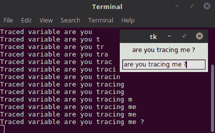
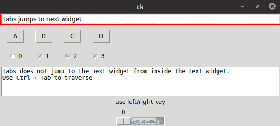
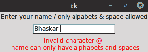
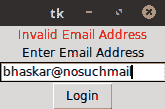
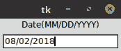
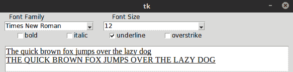
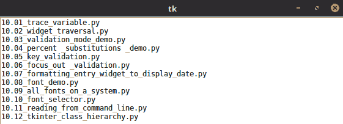
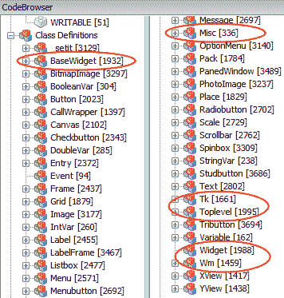
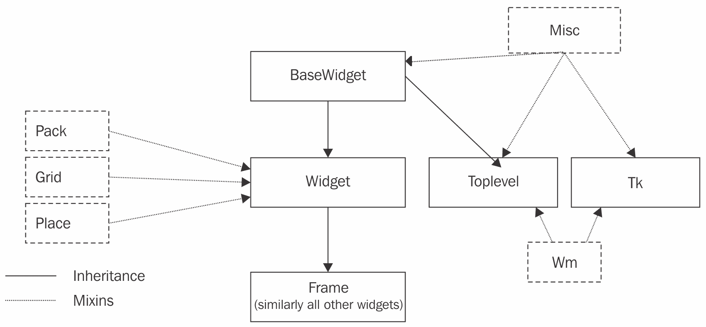

# 杂项提示

我们已经到达了这本书的最后一章。让我们通过探讨一些概念来结束我们对 Tkinter 的讨论，尽管这些概念在许多**图形用户界面**（**GUI**）程序中非常常见，但在前面的章节中并未出现。

我们在本章中将涵盖以下内容：

+   跟踪 Tkinter 变量并在变量值变化时附加回调函数

+   理解默认键盘小部件遍历规则以提供一致的用户体验

+   使用内置的 Tkinter 机制验证用户输入

+   将小部件的内容格式化，以便用户与小部件交互

+   理解 Tkinter 如何处理字体以及在 Tkinter 中使用自定义字体的最佳实践

+   将命令行输出重定向到 Tkinter

+   查看 Tkinter 的源代码以理解类层次结构

+   突出一些当前在程序设计和实现中涉及的最佳实践

+   深入了解代码清理和程序优化

+   将 Tkinter 应用程序作为独立程序分发给最终用户

+   理解 Tkinter 的局限性

+   探索 Tkinter 的替代方案，了解何时使用它们代替 Tkinter 更为合适以及涉及到的权衡利弊

+   将 Tkinter 程序回迁到较旧的 Python 2.x 版本中，这些程序是用 Python 3.x 版本编写的

让我们开始吧！

# 跟踪 Tkinter 变量

当你为小部件指定一个 Tkinter 变量，例如`textvariable`（`textvariable = myvar`），小部件会自动在变量值变化时更新。然而，有时除了更新小部件外，你还需要在读取或写入（或修改）变量时进行一些额外的处理。

Tkinter 提供了一种方法来附加一个回调方法，该方法将在每次访问变量的值时被触发。因此，回调函数充当变量观察者。

回调创建方法命名为 `trace_variable(self, mode, callback)` 或简称为 `trace(self, mode, callback)`。

模式参数可以取值为 `r`、`w` 或 `u`，分别代表 *读取*、*写入* 或 *未定义*。根据模式指定，当变量被读取或写入时，回调方法会被触发。

默认情况下，回调方法接收三个参数。参数按照其位置顺序如下：

+   Tkinter 变量的名称

+   当 Tkinter 变量是一个数组时，变量的索引，否则为空字符串

+   访问模式（`r`，`w` 或 `u`）

注意，触发的回调函数也可能修改变量的值。然而，这种修改不会触发额外的回调。

让我们来看一个 Tkinter 中变量追踪的例子。看看一个追踪的 Tkinter 变量的变化是如何触发回调函数的（参见代码 `10.01_trace_variable.py`）：

```py
from tkinter import Tk, Label, Entry, StringVar
root = Tk()
my_variable = StringVar()  

def trace_when_my_variable_written(var, indx, mode):
   print ("Traced variable {}".format(my_variable.get()))

my_variable.trace_variable("w", trace_when_my_variable_written)

Label(root, textvariable = my_variable).pack(padx=5, pady=5)
Entry(root, textvariable = my_variable).pack(padx=5, pady=5)

root.mainloop()
```

以下行代码将回调函数附加到`trace`变量：

```py
my_variable.trace_variable("w", trace_when_my_variable_written)
```

现在，每次你在条目小部件中写入内容时，都会修改`my_variable`的值。因为我们已经在`my_variable`上设置了`trace`，它会触发回调方法，在我们的例子中，这个方法简单地将在控制台中打印新的值，如下面的截图所示：



变量的`trace`（跟踪）在显式删除之前是活跃的。你可以使用以下命令来删除`trace`：

```py
trace_vdelete(self, mode, callback_to_be_deleted)
```

`trace` 方法返回回调方法的 ID 和名称。这可以用来获取需要删除的回调方法的名称。

# 小部件遍历

如果一个图形用户界面（GUI）包含多个小部件，当你明确地点击某个小部件时，该小部件可以获得焦点。或者，可以通过按键盘上的*Tab*键，按照小部件在程序中创建的顺序将焦点转移到其他小部件上。

因此，按照我们希望用户遍历它们的顺序创建小部件至关重要。否则，用户在使用键盘在各个小部件之间导航时将会遇到困难。

不同的控件被设计成对不同的键盘按键有不同的响应。因此，让我们花些时间来尝试理解使用键盘在控件之间导航的规则。

查看`10.02_widget_traversal.py`文件以了解不同小部件的键盘遍历行为。代码显示的窗口如下截图所示：



代码将不会在此处给出，因为它非常简单（参见`10.02_widget_traversal.py`代码）。它仅仅添加了一个条目小部件、几个按钮、几个单选按钮、一个文本小部件、一个标签小部件和一个刻度小部件。

代码演示了这些小部件在 Tkinter 中的默认键盘遍历行为。

以下是一些你应该注意的重要要点：

+   使用 *Tab* 键可以向前遍历，而 *Shift* + *Tab* 可以向后遍历。

+   用户可以按照它们创建的顺序遍历小部件。首先访问父级小部件（除非使用`takefocus = 0`将其排除），然后是所有子小部件。

+   您可以使用 `widget.focus_force()` 来强制将输入焦点置于一个部件上。

+   您不能通过使用 *Tab* 键来遍历文本小部件，因为文本小部件可以包含作为其内容的制表符。相反，您可以通过使用 *Ctrl* + *Tab* 来遍历文本小部件。

+   小部件上的按钮可以使用空格键进行按下。同样，复选框和单选按钮也可以使用空格键进行遍历。

+   您可以通过使用上下箭头在列表框小部件中上下移动项目。

+   比例控件对左右箭头键以及上下箭头键做出响应。同样，滚动条控件根据其方向对左右或上下箭头键做出响应。

+   默认情况下，大多数小部件（除 Frame、Label 和菜单外）在它们获得焦点时都会有一个轮廓。这个轮廓通常显示为围绕小部件的细黑边框。您甚至可以通过将这些小部件的`highlightthickness`选项设置为非零整数来使 Frame 和 Label 小部件显示这个轮廓。

+   我们可以通过在代码中使用`highlightcolor= 'red'`来改变轮廓的颜色。

+   标签页的导航路径不包括框架、标签和菜单。然而，可以通过使用`takefocus = 1`选项将它们包含在导航路径中。您可以使用`takefocus = 0`选项显式地从标签页的导航路径中排除一个小部件。

# 验证用户输入

让我们讨论 Tkinter 中的输入数据验证。

我们在书中开发的大部分应用程序都是基于点选的（如鼓机、棋类游戏和绘图应用），在这些应用中不需要验证用户输入。然而，在如电话簿应用这样的程序中，用户输入一些数据，我们将这些数据存储在数据库中，数据验证是必须的。

忽略用户输入验证在此类应用中可能很危险，因为输入数据可能会被用于 SQL 注入。一般来说，允许用户输入文本数据的应用程序是验证用户输入的良好候选者。实际上，不信任用户输入几乎被视为一条准则。

错误的用户输入可能是故意的或偶然的。在任何情况下，如果你未能验证或清理数据，你的程序可能会出现意外的错误。在最坏的情况下，用户输入可能被用来注入有害代码，这些代码可能足以使程序崩溃或清除整个数据库。

小部件，例如列表框（Listbox）、组合框（Combobox）和单选按钮（Radiobuttons），允许有限的输入选项，因此它们通常不能被误用来输入错误的数据。另一方面，像输入框小部件（Entry widget）、旋转框小部件（Spinbox widget）和文本小部件（Text widget）这样的小部件允许用户有较大的输入可能性，因此它们需要被验证以确保正确性。

要在组件上启用验证，您需要向组件指定一个额外的`validate = 'validationmode'`表单选项。

例如，如果你想在 Entry 小部件上启用验证，你首先需要指定验证选项，如下所示：

`Entry( root, validate="all", validatecommand=vcmd)`

验证可以在以下验证模式之一中发生：

| **验证模式** | **说明** |
| --- | --- |
| `none` | 这是默认模式。如果将 `validate` 设置为 `none`，则不会发生验证。 |
| `focus` | 当`validate`设置为 focus 时，`validate`命令会被调用两次——一次是在小部件获得焦点时，另一次是在焦点丢失时。 |
| `focusin` | 当小部件获得焦点时调用`validate`命令。 |
| `focusout` | 当小部件失去焦点时调用`validate`命令。 |
| `key` | 当条目被编辑时，会调用`validate`命令。 |
| `all` | 在所有上述情况下都会调用 `validate` 命令。 |

`10.03_validation_mode_demo.py` 代码文件通过将它们附加到单个 `validation` 方法上来演示所有这些验证模式。在代码中，注意不同 Entry 小部件对不同事件的响应方式。一些 Entry 小部件在焦点事件上调用 `validation` 方法，其他小部件在将按键输入到小部件时调用 `validation` 方法，还有一些小部件则使用焦点和按键事件的组合。

尽管我们确实设置了验证模式以触发`validate`方法，但我们仍需要一些数据来与规则进行验证。这些数据通过百分比替换传递给`validate`方法。例如，我们将模式作为参数传递给

通过在`validate`命令上执行百分比替换来使用`validate`方法，如下命令所示：

```py
vcmd = (self.root.register(self.validate_data), '%V')
```

这之后是将`v`的值作为参数传递给`validate`方法：

```py
def validate_data(self, v)
```

除了 `%V`，Tkinter 还识别以下百分比替换：

| **百分比替换** | **解释** |
| --- | --- |
| `%d` | 在小部件上执行的操作类型（`1` 表示插入，`0` 表示删除，`-1` 表示焦点、强制或 `textvariable` 验证）。 |
| `%i` | 插入或删除的字符字符串的索引（如果有的话）。否则，它将是 `-1`。 |
| `%P` | 如果允许编辑，条目中的值。如果您正在配置 Entry 小部件以具有新的 `textvariable`，这将是指定 `textvariable` 的值。 |
| `%s` | 编辑前的条目当前值。 |
| `%S` | 正在被插入或删除的文本字符串（如果有）。否则，`{}`。 |
| `%v` | 当前已设置的验证类型。 |
| `%V` | 触发回调方法的验证类型（`key`、`focusin`、`focusout`和强制）。 |
| `%W` | 条目小部件的名称。 |

这些替换值为我们提供了验证输入所需的数据。

让我们传递所有这些值，并通过一个虚拟的 `validate` 方法来打印它们，只是为了看看在执行验证时我们可以期望得到什么样的数据（参见 `10.04_percent_substitutions_demo.py` 代码）：

```py
class PercentSubstitutionsDemo():

  def __init__(self):
    self.root = tk.Tk()
    tk.Label(text='Type Something Below').pack()
    vcmd = (self.root.register(self.validate), '%d', '%i', '%P', '%s',
                                                '%S', '%v', '%V', '%W')
    tk.Entry(self.root, validate="all", validatecommand=vcmd).pack()
    self.root.mainloop()

  def validate(self, d, i, P, s, S, v, V, W):
    print("Following Data is received for running our validation checks:")
    print("d:{}".format(d))
    print("i:{}".format(i))
    print("P:{}".format(P))
    print("s:{}".format(s))
    print("S:{}".format(S))
    print("v:{}".format(v))
    print("V:{}".format(V))
    print("W:{}".format(W))
    # returning true for now 
    # in actual validation you return true if data is valid 
    # else return false
    return True
```

注意我们通过传递所有可能的百分比替换到回调函数中注册的`validate`方法所在的行。

特别注意由 `%P` 和 `%s` 返回的数据，因为它们与用户在输入小部件中实际输入的数据相关。在大多数情况下，您将检查这两个数据源中的任何一个，以验证规则。

现在我们已经了解了数据验证的规则背景，让我们看看两个演示输入验证的实际例子。

# 关键验证模式演示

假设我们有一个要求输入用户名的表单。我们希望用户在输入名字时只使用字母或空格字符。因此，不应允许使用一些特殊字符，如下面的小部件截图所示：



这显然是一个需要使用`key`验证模式的案例，因为我们希望在每次按键后检查一个条目是否有效。我们需要检查的百分比替换是`%S`，因为它会返回插入或删除的文本字符串。

Entry 小部件。因此，验证 Entry 小部件的代码如下（参见`10.05_key_validation.py`代码）：

```py
import tkinter as tk

class KeyValidationDemo():
  def __init__(self):
    root = tk.Tk()
    tk.Label(root, text='Enter your name / only alpabets & space 
      allowed').pack()
    vcmd = (root.register(self.validate_data), '%S')
    invcmd = (root.register(self.invalid_name), '%S')
    tk.Entry(root, validate="key",validatecommand=vcmd, 
               invalidcommand=invcmd).pack(pady=5, padx=5)
    self.error_message = tk.Label(root, text='', fg='red')
    self.error_message.pack()
    root.mainloop()

  def validate_data(self, S):
    self.error_message.config(text='')
    return (S.isalpha() or S == ' ')

  def invalid_name(self, S):
    self.error_message.config(text='Invalid character %s \n 
                     name can only have alphabets and spaces' % S)
    app = KeyValidationDemo()
```

前述代码的描述如下：

+   我们首先注册两个选项，即`validatecommand ( vcmd )`和`invalidcommand ( invcmd )`。

+   在示例中，`validatecommand` 被注册为调用 `validate_data` 方法，而 `invalidcommand` 选项被注册为调用另一个名为 `invalid_name` 的方法。

+   `validatecommand`选项指定了一个需要评估的方法，该方法将验证输入。验证方法必须返回一个布尔值，其中`True`表示输入的数据有效，而`False`返回值表示数据无效。

+   如果验证方法返回 `False`（无效数据），则不会将数据添加到条目小部件中，并且会评估为 `invalidcommand` 注册的脚本。在我们的情况下，无效验证将调用 `invalid_name` 方法。`invalidcommand` 方法通常负责显示错误消息或将焦点设置回条目小部件。

# 离焦验证模式演示

之前的示例演示了在`key`模式下的验证。这意味着验证方法在每次按键后都会被调用，以检查输入是否有效。

然而，有些情况下你可能想要检查整个输入到小部件中的字符串，而不是检查单个按键输入。

例如，当一个条目小部件接受一个有效的电子邮件地址时，我们理想情况下希望在用户输入完整电子邮件地址之后而不是在每次按键输入之后检查其有效性。这将适用于`focusout`模式的验证。

查看`10.06_focus_out_validation.py`以了解在`focusout`模式下的电子邮件验证演示，该模式为我们提供了以下 GUI：



上述演示的代码如下：

```py
import tkinter as tk
import re

class FocusOutValidationDemo():
  def __init__(self):
    self.master = tk.Tk()
    self.error_message = tk.Label(text='', fg='red') 
    self.error_message.pack()
    tk.Label(text='Enter Email Address').pack()
    vcmd = (self.master.register(self.validate_email), '%P')
    invcmd = (self.master.register(self.invalid_email), '%P')
    self.email_entry = tk.Entry(self.master, validate="focusout", 
              validatecommand=vcmd, invalidcommand=invcmd)
    self.email_entry.pack()
    tk.Button(self.master, text="Login").pack()
    tk.mainloop()

  def validate_email(self, P):
    self.error_message.config(text='')
    x = re.match(r"[^@]+@[^@]+\.[^@]+", P)
    return (x != None)

  def invalid_email(self, P):
    self.error_message.config(text='Invalid Email Address')
    self.email_entry.focus_set()

app = FocusOutValidationDemo()
```

这段代码与之前的验证示例有很多相似之处。然而，请注意以下差异：

+   验证模式设置为`focusout`，与上一个示例中的`key`模式相对比。这意味着验证仅在 Entry 小部件失去焦点时进行。验证发生在你按下*Tab*键时。因此，如果输入无效，输入框不会失去焦点。

+   此程序使用由 `%P` 百分比替换提供的数据，而先前的示例使用了 `%S`。这是可以理解的，因为 `%P` 提供了在输入小部件中输入的值，但 `%S` 提供了最后按键的值。

+   此程序使用正则表达式来检查输入的值是否对应有效的电子邮件格式。验证通常依赖于正则表达式。要涵盖这个主题需要大量的解释，但这超出了本书的范围。有关正则表达式模块的更多信息，请访问[`docs.python.org/3.6/library/re.html`](http://docs.python.org/3.6/library/re.html)。

这就结束了我们对 Tkinter 中输入验证的讨论。希望你现在应该能够根据你的自定义需求实现输入验证。

# 格式化小部件数据

输入数据，如日期、时间、电话号码、信用卡号码、网站 URL 和 IP 地址，都有相应的显示格式。例如，日期可以更好地以`MM/DD/YYYY`格式表示。

幸运的是，当用户在组件中输入数据时，格式化所需格式的数据很容易，如下面的截图所示：



`10.07_formatting_entry_widget_to_display_date.py` 代码自动格式化用户输入，在需要的位置插入正斜杠，以显示用户输入的日期，格式为 `MM/DD/YYYY`：

```py
from tkinter import Tk, Entry, Label, StringVar, INSERT

class FormatEntryWidgetDemo:

  def __init__(self, root):
    Label(root, text='Date(MM/DD/YYYY)').pack()
    self.entered_date = StringVar()
    self.date_entry = Entry(textvariable=self.entered_date)
    self.date_entry.pack(padx=5, pady=5)  
    self.date_entry.focus_set()
    self.slash_positions = [2, 5]
    root.bind('<Key>', self.format_date_entry_widget)

  def format_date_entry_widget(self, event):
    entry_list = [c for c in self.entered_date.get() if c !='/']
    for pos in self.slash_positions:
      if len(entry_list) > pos:
        entry_list.insert(pos, '/')
    self.entered_date.set(''.join(entry_list))
    # Controlling cursor
    cursor_position = self.date_entry.index(INSERT) # current cursor 
      position
    for pos in self.slash_positions:
      if cursor_position == (pos + 1): # if cursor position is on slash
        cursor_position += 1
    if event.keysym not in ['BackSpace', 'Right', 'Left','Up', 'Down']:
      self.date_entry.icursor(cursor_position)

root = Tk()
FormatEntryWidgetDemo(root)
root.mainloop()
```

前述代码的描述如下：

+   Entry 小部件绑定到按键事件，每次新的按键都会调用相关的`format_date_entry_widget`回调方法。

+   首先，`format_date_entry_widget` 方法将输入的文本分解成一个名为 `entry_list` 的等效列表，并忽略用户可能输入的斜杠/符号。

+   然后它遍历`self.slash_positions`列表，并在`entry_list`中所有必需的位置插入斜杠符号。这个操作的结果是一个在所有正确位置都插入了斜杠的列表。

+   下一行使用 `join()` 将此列表转换为等效的字符串，然后将 Entry 小部件的值设置为该字符串。这确保了 Entry 小部件的文本格式化为上述日期格式。

+   剩余的代码片段仅用于控制光标，确保光标在遇到斜杠符号时前进一个位置。它还确保了诸如*退格*、右键、左键、上键和下键等按键操作得到正确处理。

注意，此方法并不验证日期值，用户可能会添加一个无效的日期。这里定义的方法将简单地通过在第三位和第六位添加正斜杠来格式化它。将日期验证添加到此示例作为一项练习留给你来完成。

这就结束了我们在小部件内格式化数据的简要讨论。希望你现在能够创建适用于各种输入数据的格式化小部件，以便在特定格式中更好地显示。

# 更多关于字体

许多 Tkinter 小部件允许你在创建小部件时或稍后通过使用 `configure()` 选项来指定自定义字体规范。在大多数情况下，默认字体提供了标准的视觉和感觉。然而，如果你想更改字体规范，Tkinter 允许你这样做。但有一个注意事项。

当你指定自己的字体时，你需要确保它在你的程序打算部署的所有平台上看起来都很好，因为某个平台上字体可能看起来不错，但在另一个平台上可能看起来很糟糕。除非你清楚自己在做什么，否则始终建议坚持使用 Tkinter 的默认字体。

大多数平台都有自己的标准字体集，这些字体由平台的本地小部件使用。因此，与其试图在特定平台上重新发明轮子，或者为特定平台提供什么字体可用，Tkinter 将这些标准平台特定字体分配给其小部件，从而在每一个平台上提供原生外观和感觉。

Tkinter 将九种字体分配给九个不同的名称；你可以在你的程序中使用这些字体。字体名称如下：

+   `TkDefaultFont`

+   `TkTextFont`

+   `TkFixedFont`

+   `TkMenuFont`

+   `TkHeadingFont`

+   `TkCaptionFont`

+   `TkSmallCaptionFont`

+   `TkIconFont`

+   `TkTooltipFont`

因此，你可以在你的程序中以以下方式使用它们：

```py
Label(text="Sale Up to 50% Off !", font="TkHeadingFont 20")
Label(text="**Conditions Apply", font="TkSmallCaptionFont 8") 
```

使用这些字体标记，你可以放心，你的字体将在所有平台上看起来都很原生。

# 对字体有更精细的控制

除了上述处理字体的方法外，Tkinter 还提供了一个独立的 `Font` 类实现。这个类的源代码位于与 Tkinter 源代码相同的文件夹中。

在我的 Linux 机器上，源代码位于 `/usr/local/lib/python3.6/tkinter/font.py`。在 Windows（默认安装 Python 3.6）的情况下，位置是 `C:\Program Files (x86)\Python36-32\Lib\tkinter\font.py`。

要使用此模块，您需要将字体导入到您的命名空间中，如下所示（参见`10.08_font_demo.py`代码）：

```py
from tkinter import Tk, Label, Pack
from tkinter import font
root = Tk()
label = Label(root, text="Humpty Dumpty was pushed")
label.pack()
current_font = font.Font(font=label['font'])
print ('Actual :', str(current_font.actual()))
print ('Family : ', current_font.cget("family"))
print ('Weight : ', current_font.cget("weight"))
print ('Text width of Dumpty : {}'.format(current_font.measure("Dumpty")))
print ('Metrics:', str(current_font.metrics()))
current_font.config(size=14)
label.config(font=current_font)
print ('New Actual :', str(current_font.actual()))
root.mainloop()
```

这个程序在我的终端上的控制台输出如下：

```py
Actual: {'slant': 'roman', 'underline': 0, 'family': 'DejaVu Sans', 'weight': 'normal', 'size': -12, 'overstrike': 0}
Family: DejaVu Sans
Weight: normal
Text width of Dumpty: 49
Metrics: {'fixed': 0, 'descent': 3, 'ascent': 12, 'linespace':15}
New actual: {'slant': 'roman', 'underline': 0, 'family': 'DejaVu Sans', 'weight': 'normal', 'size': 14, 'overstrike': 0}
```

正如您所看到的，`font`模块提供了对字体各个方面的更精细的控制，这些方面在其他情况下是无法访问的。

# 构建字体选择器

现在我们已经看到了 Tkinter 的 `font` 模块中可用的基本功能，接下来让我们实现一个类似于以下截图所示的字体选择器：



构建前一个屏幕截图所示字体选择器的关键是获取系统上安装的所有字体的列表。从`font`模块调用`families()`方法可以获取系统上所有可用的字体的元组。因此，当你运行以下代码时，系统上所有可用的字体的元组将被打印出来（请参阅`10.09_all_fonts_on_a_system.py`代码）:

```py
from tkinter import Tk, font
root = Tk()
all_fonts = font.families()
print(all_fonts) # this prints the tuple containing all fonts on a system.
```

注意，由于`font`是 Tkinter 的一个子模块，在它能够获取元组之前，需要有一个`Tk()`实例，该实例加载了 Tcl 解释器。

现在我们已经拥有了系统上所有可用的字体元组，我们只需要创建前面截图所示的 GUI，并将相关的回调函数附加到所有小部件上。

我们将不会讨论创建前面截图所示 GUI 的代码。请查看`10.10_font_selector.py`以获取完整的代码。然而，请注意，该代码将以下回调附加到所有小部件上：

```py
def on_value_change(self, event=None):
  self.current_font.config(family=self.family.get(), size=self.size.get(),    
           weight=self.weight.get(), slant=self.slant.get(),  
           underline=self.underline.get(),  
           overstrike=self.overstrike.get())
  self.text.tag_config('fontspecs', font=self.current_font)
```

在这里，`fontspecs` 是我们附加到文本小部件中示例文本上的自定义标签，如下所示：

```py
self.text.insert(INSERT, '{}\n{}'.format(self.sample_text,  
                          self.sample_text.upper()), 'fontspecs')
```

这就结束了我们在 Tkinter 中玩转字体的简短讨论。

# 将命令行输出重定向到 Tkinter

你可能偶尔需要将命令行的输出重定向到图形用户界面，例如 Tkinter。将命令行的输出传递到 Tkinter 的能力，为在 Unix 和 Linux 操作系统以及 Windows 机器上的 Windows Shell 使用 shell 的固有功能打开了一个广阔的可能性池。

我们将通过使用 Python 的 `subprocess` 模块来演示这一点，该模块允许我们启动新的进程，连接到新进程的输入、输出和错误管道，并从程序中获取返回代码。

关于`subprocess`模块的详细讨论可以在[`docs.python.org/3/library/subprocess.html`](https://docs.python.org/3/library/subprocess.html)找到。

我们将使用来自`subprocess`模块的`Popen`类来创建一个新的进程。

`Popen` 类提供了一种跨平台创建新进程的方法，并且具有以下长签名来处理大多数常见和特殊的使用场景：

```py
subprocess.Popen(args, bufsize=-1, executable=None, stdin=None, stdout=None, stderr=None, preexec_fn=None, close_fds=True, shell=False, cwd=None, env=None, universal_newlines=False, startupinfo=None, creationflags=0, restore_signals=True, start_new_session=False, pass_fds=())
```

这是一个简单的程序，展示了我们如何将 `ls` Bash 命令的输出重定向到 Tkinter 的文本小部件。作为提醒，Bash 脚本语言中的 `ls` 命令返回所有文件和目录的列表（参见 `10.11_reading_from_command_line.py` 代码）：

```py
from tkinter import Tk, Text, END
from subprocess import Popen, PIPE
root = Tk()
text = Text(root)
text.pack()

#replace "ls" with "dir" in the next line on windows platform
with Popen(["ls"], stdout=PIPE, bufsize=1, universal_newlines=True) as p:
   for line in p.stdout:
      text.insert(END, line)

root.mainloop()
```

Windows 用户请注意，您需要在前面代码的高亮部分将`ls`替换为`dir`以获得等效的结果。

此外，请注意，您可以通过以下格式向`Popen`传递额外的参数：

```py
Popen(['your command', arg0, arg1, ...])
```

更好的是，你可以在新进程中传递需要执行脚本的文件名。运行脚本文件的代码如下：

```py
Popen('path/toexecutable/script',stdout=sub.PIPE,stderr=sub.PIPE)
```

然而，需要执行的脚本文件必须包含一个适当的 shebang 声明，以便程序为您的脚本选择一个合适的执行环境。例如，如果您打算运行 Python 脚本，您的脚本必须以`#!/usr/bin/env python3`形式的 shebang 开始。同样，您需要包含`#!/bin/sh`来运行与 Bourne 兼容的 shell 脚本。在 Windows 上不需要 shebang。二进制可执行文件也不需要。

运行前面的程序会弹出一个窗口，并将当前目录下所有文件的列表添加到文本小部件中，如下面的截图所示：



虽然前面的程序很简单，但这种技术有很多实际用途。例如，你可能记得我们在上一章中构建了一个聊天服务器。每次有新的客户端连接到服务器时，它都会将客户端详细信息打印到终端。我们本可以将那个输出重定向到一个新的 Tkinter 应用程序。这将使我们能够为服务器创建一个仪表板；从那里，我们可以监控所有连接到服务器的传入连接。

这为我们打开了重用任何用其他编程语言（如 Perl 或 Bash）编写的命令行脚本的大门，并直接将其集成到 Tkinter 程序中。

这就结束了关于将命令行输出重定向到 Tkinter 程序的简要部分。

# Tkinter 的类层次结构

作为程序员，我们几乎不需要理解 Tkinter 的类层次结构。毕竟，到目前为止，我们能够在不关心整体类层次结构的情况下编写所有应用程序。然而，了解类层次结构使我们能够`追踪`方法在源代码或方法源文档中的起源。

为了理解 Tkinter 的类层次结构，让我们来看看 Tkinter 的源代码。在 Windows 安装中，Tkinter 的源代码位于 `path\of\Python\Installation\Lib\tkinter\`。在我的 Linux 机器上，

源代码位于 `/usr/lib/python3.6/tkinter/` 。

如果你在一个代码编辑器中打开这个文件夹中的 `__init__.py` 文件，并查看其 Tkinter 中的类定义列表，你会看到以下结构：



那么，你在这里能看到什么？我们为每个核心 Tkinter 小部件提供了类定义。

此外，我们还有为不同的几何管理器和 Tkinter 内部定义的变量类型提供的类定义。这些类定义正是您通常期望存在的。

然而，除了这些之外，你还会看到一些更多的类名，例如`BaseWidget, Misc`, `Tk`, `Toplevel`, `Widget`, 和 `Wm`。所有这些类都在前面的截图中被圈出。那么，这些类提供了哪些服务，它们在更大的体系结构中又处于什么位置呢？

让我们使用`inspect`模块来查看 Tkinter 的类层次结构。我们将首先检查 Frame 小部件的类层次结构，以此代表所有其他小部件的类层次结构。我们还将查看

`Tk` 和 `Toplevel` 类在 Tkinter 的整体类层次结构中的作用（`10.12_tkinter_class_hierarchy.py`）：

```py
import tkinter
import inspect

print ('Class Hierarchy for Frame Widget')

for i, classname in enumerate(inspect.getmro(tkinter.Frame)):
  print( '\t{}: {}'.format(i, classname))

print ('Class Hierarchy for Toplevel')
for i, classname in enumerate(inspect.getmro(tkinter.Toplevel)):
  print ('\t{}:{}'.format(i, classname))

print ('Class Hierarchy for Tk')
for i, classname in enumerate(inspect.getmro(tkinter.Tk)):
  print ('\t{}: {}'.format(i, classname))
```

前一个程序的输出如下：

```py
Class Hierarchy for Frame Widget
 0: <class 'tkinter.Frame'>
 1: <class 'tkinter.Widget'>
 2: <class 'tkinter.BaseWidget'>
 3: <class 'tkinter.Misc'>
 4: <class 'tkinter.Pack'>
 5: <class 'tkinter.Place'>
 6: <class 'tkinter.Grid'>
 7: <class 'object'>
Class Hierarchy for Toplevel
 0:<class 'tkinter.Toplevel'>
 1:<class 'tkinter.BaseWidget'>
 2:<class 'tkinter.Misc'>
 3:<class 'tkinter.Wm'>
 4:<class 'object'>
Class Hierarchy for Tk
 0: <class 'tkinter.Tk'>
 1: <class 'tkinter.Misc'>
 2: <class 'tkinter.Wm'>
 3: <class 'object'>
```

前述代码的描述如下：

+   `inspect`模块中的`getmro`(`classname`)函数返回一个元组，其中包含`classname`的所有祖先，按照**方法解析顺序**（**MRO**）指定的顺序排列。MRO 指的是基类被调用的顺序。

    在查找给定方法时，会搜索类。

+   通过检查 MRO（方法解析顺序）和源代码，你会了解到`Frame`类继承自`Widget`类，而`Widget`类又继承自`BaseWidget`类。

+   `Widget` 类是一个空的类，其类定义如下：`class Widget(BaseWidget, Pack, Place, Grid)`。

+   正如您所看到的，这就是在几何管理器中定义的方法（包括 pack、place 和 grid 混合器）如何对所有小部件可用。

+   `BaseWidget` 类具有以下类定义：`class BaseWidget(Misc)`。此类公开了可以被程序员使用的销毁方法。

+   在这个层级中，`Misc` 类中定义的所有实用方法都对小部件可用。

+   `Misc` 类是一个通用的混入类，它提供了我们在应用程序中大量使用到的功能。我们程序中使用的部分方法，如 `Misc` 类中定义的，包括 `after()`, `bbox()`, `bind_all()`, `bind_tag()`, `focus_set()`, `mainloop()`, `update()`, `update_idletask()`, 和 `winfo_children()`。要获取 `Misc` 类提供的完整功能列表，请在 Python 交互式外壳中运行以下命令：

```py
>>> import tkinter
>>> help(tkinter.Misc)
```

现在，让我们来看看`Tk`和`Toplevel`类：

+   `Tk` 类在屏幕上返回一个新的 `Toplevel` 小部件。`Tk` 类的 `__init__` 方法通过调用名为 `loadtk()` 的方法来负责创建一个新的 Tcl 解释器。该类定义了一个名为 `report_callback_exception()` 的方法，该方法负责在 `sys.stderr` 上报告错误和异常。

+   Tkinter 的 `Toplevel` 类的 `__init__` 方法负责创建应用程序的主窗口。该类的构造函数接受各种可选参数，例如 `bg`、`background`、`bd`、`borderwidth`、`class`、`height`、`highlightbackground`、`highlightcolor`、`highlightthickness`、`menu` 和 `relief`。

+   要获取`Toplevel`和`Tk`类提供的所有方法列表，请在 Python 交互式 shell 中运行以下命令：`help(tkinter.Toplevel); help(tkinter.Tk)`。

+   除了继承自`Misc`混合类之外，`Toplevel`和`Tk`类还继承自`Wm`混合类的方法。

+   `Wm`（代表窗口管理器）混合类提供了许多方法，使我们能够与窗口管理器进行通信。这个类中一些常用的方法包括 `wm_iconify`、`wm_deiconify`、`wm_overrideredirect`、`title`、`wm_withdraw`、`wm_transient` 和 `wm_resizable`。要获取 `Wm` 类提供的所有函数的完整列表，请在 Python 交互式外壳中运行以下命令：`help(tkinter.Wm)`。

在将类层次结构翻译后，从上一个程序中获得并通过检查源代码，我们得到了 Tkinter 的层次结构，如下所示：



除了正常的继承关系，这在前面图表中通过不间断的线条展示，Tkinter 还提供了一系列的混入（或辅助类）。

`mixin` 是一个设计用来不直接使用，而是通过多重继承与其他类结合的类。

Tkinter 混合类可以大致分为以下两类：

+   几何混合类：这些包括`Grid`、`Pack`和`Place`类

+   实现混入（mixins）：这些包括以下类：

    +   `Misc` 类，由根窗口和 `widget` 类使用，提供了一些 Tk 和窗口相关的服务

    +   `Wm` 类，该类被根窗口和 Toplevel 小部件使用，提供了一些窗口管理服务

这就结束了我们对 Tkinter 的简要内部探索。希望这能让你对 Tkinter 的内部工作原理有所了解。如果你对任何给定方法的文档有任何疑问，可以直接查看该方法的实际实现。

# 程序设计技巧

让我们来看看一些通用的程序设计技巧。

# 模型优先策略与代码优先策略

一个设计良好的模型就是完成了一半的工作。话虽如此，当你开始编写程序时，模型有时并不十分明显。在这种情况下，你可以打破规则，尝试先编写代码的哲学。其思路是从零开始逐步构建你的程序，随着你对程序愿景的逐渐清晰，重构你的代码和模型。

# 将模型与视图分离

将模型或数据结构从视图中分离出来是构建可扩展应用的关键。虽然将这两个组件混合使用是可能的，但你很快会发现你的程序变得杂乱无章，难以维护。

# 选择合适的数据结构

选择合适的数据结构可以对程序的性能产生深远影响。如果你的程序需要你花费大量时间进行查找，如果可行的话，请使用字典。当你只需要遍历一个集合时，相比于字典，更倾向于使用列表，因为字典占用的空间更大。当你的数据是不可变时，更倾向于使用元组而不是列表，因为元组比列表遍历得更快。

# 命名变量和方法

为你的变量和方法使用有意义的、自我说明的名称。名称应该不留下任何关于变量或方法意图的混淆。对于集合使用复数名称，否则使用单数名称。返回布尔值的方法应该附加诸如 *is* 或 *has* 这样的词语。坚持风格指南，但你也应该知道何时打破它们。

# 单一职责原则

单一职责原则建议一个函数/类/方法应该只做一件事，并且应该把它做到极致，做好。这意味着我们不应该试图在函数内部处理多件事情。

# 松散耦合

尽可能地减少程序中的耦合或依赖。以下是这个主题的一个著名引言：

计算机科学中的所有问题都可以通过另一层间接方式来解决。

– 戴维·惠勒

假设你的程序有一个播放按钮。一个直接的冲动可能是将它链接到程序中的`play`方法。然而，你可以进一步将其拆分为两个方法。你可能将播放按钮链接到一个名为`on_play_button_clicked`的方法，该方法随后调用实际的`play`方法。这种做法的优势在于，你可能希望在点击播放按钮时处理额外的事情，例如在程序中的某个位置显示当前曲目信息。

因此，你现在可以使用`on_play_button_clicked`方法将点击事件从实际播放方法中解耦，然后处理对多个方法的调用。

然而，你必须抵制添加过多间接层的诱惑，因为你的程序可能会迅速变得混乱，并且可能失去控制。

# 处理错误和异常

Python 遵循**EAFP**（即**更容易请求原谅而不是请求许可**）的编码风格，这与大多数编程语言遵循的**LBYL**（即**三思而后行**）风格相反。

因此，在 Python 中，以类似于以下方式处理异常通常比使用 if-then 块检查条件更简洁。

所以当用 Python 编写代码时，而不是使用以下这种编码风格：

```py
if some_thing_wrong:
  do_something_else()
else:
  do_something_normal()
```

考虑使用这个代替：

```py
try:
  do_some_thing_normal()
except some_thing_wrong:
  do_some_thing_else()
```

# 处理跨平台差异

尽管 Tkinter 是一个跨平台模块，但你可能会遇到这样的情况：为某个操作系统编写的代码在其他操作系统上可能无法按预期工作。我们已经在之前的“将命令行输出重定向到 Tkinter”的例子中看到了这样一个例子。在这种情况下，你可以通过首先识别程序正在运行的操作系统，然后使用条件语句为不同的操作系统运行不同的代码行来克服这些跨平台差异。

这里是一个简短的片段，展示了这个概念：

```py
 from platform import uname
 operating_system = uname()[0]
 if ( operating_system == "Linux" ):
   canvas.bind('<Button-4>', wheelUp) # X11
   canvas.bind('<Button-5>', wheelDown)
 elif ( operating_system == "Darwin" ):
   canvas.bind('<MouseWheel>', wheel) # MacOS
 else: 
   canvas.bind_all('<MouseWheel>', wheel) # windows
```

这里特定的问题是，在 Windows 和 macOS 上，鼠标滚轮事件由 `<MouseWheel>` 事件名称表示，但在 Linux 发行版上则是 `<Button-4>` 和 `<Button-5>`。前面的代码使用 Python 的平台模块来识别操作系统，并为不同的操作系统遵循不同的代码行。

# 程序优化技巧

接下来，让我们看看一些通用的优化程序的建议。

# 使用过滤器和映射

Python 提供了两个内置函数，名为`filter`和`map`，可以直接操作集合，而不是必须遍历集合中的每个项目。`filter`、`map`和`reduce`函数比循环更快，因为大部分工作都是由用 C 语言编写的底层代码完成的。

`filter(function, list)` 函数返回一个列表（Python 3.x 中的迭代器），其中包含所有函数返回真值的项目。以下命令是一个示例：

```py
print filter(lambda num: num>6, range(1,10))# prints [7, 8,9]
```

这比在列表上运行条件 if-then 检查要快。

`map(function_name, list)` 函数将 `function_name` 应用到列表中的每个项目上，并返回一个新列表中的值（在 Python 3.x 中返回迭代器而不是列表）。以下命令是一个示例：

```py
print map(lambda num: num+5, range(1,5)) #prints [6, 7, 8,9]
```

这比通过循环遍历列表并将每个元素加`5`要快。

# 优化变量

你在程序中选择变量的方式可以显著影响程序执行的速度。例如，如果你在实例化小部件后不需要更改其内容或属性，那么不要创建一个类级别的实例。

例如，如果需要使标签小部件保持静态，请使用`Label(root, text='Name').pack(side=LEFT)`而不是使用以下代码片段：

```py
self.mylabel = Label(root, text='Name')
self.mylabel.pack(side=LEFT)
```

同样，如果你不打算多次使用它们，请不要创建局部变量。例如，使用 `mylabel.config (text= event.keysym)` 而不是首先创建一个名为 key 的局部变量然后只使用一次：

```py
key = event.keysym
mylabel.config (text=key)
```

如果局部变量需要被多次使用，那么创建一个局部变量可能是有意义的。

# 分析你的程序

性能分析涉及生成详细的统计数据，以显示程序中各种例程执行的频率和持续时间。这有助于你隔离程序中的问题部分，而这些部分可能需要重新设计。

Python 提供了一个名为`cProfile`的内置模块，该模块能够生成与程序相关的详细统计信息。该模块提供了诸如总程序运行时间、每个函数的运行时间以及每个函数被调用的次数等详细信息。这些统计信息使得确定需要优化的代码部分变得容易。

特别是，`cProfile`为函数或脚本提供以下数据：

+   `ncalls`: 这表示一个函数被调用的次数

+   `tottime`: 这表示一个函数所花费的时间，不包括调用其他函数所花费的时间

+   `percall`: 这是指 `tottime` 除以 `ncalls`

+   `cumtime`: 这表示一个函数所花费的时间，包括调用其他函数的时间

+   `percall`: 这是指 `cumtime` 除以 `tottime`

要分析名为 `spam()` 的函数，请使用以下代码：

```py
import cProfile
cProfile.run('spam()','spam.profile')
```

您可以使用另一个名为 `pstats` 的模块来查看配置文件的结果，具体操作如下：

```py
import pstats
stats = pstats.Stats('spam.profile')
stats.strip_dirs().sort_stats('time').print_stats()
```

更重要的是，您可以分析整个脚本。假设您想分析一个名为 `myscript.py` 的脚本。您只需使用命令行工具导航到该脚本的目录，然后输入并运行以下命令：

```py
python -m cProfile myscript.py
```

在`8.08_vornoi_diagram`代码上运行前面命令的部分输出如下，来自第八章，《在画布上玩转》：

```py
57607465 function calls (57607420 primitive calls) in 110.040 seconds
Ordered by: standard name
ncalls tottime percall cumtime percall filename:lineno(function)
 1 50.100 50.100 95.452 95.452 8.09_vornoi_diagram.py:15(create_voronoi_diagram)
 1 0.000 0.000 110.040 110.040 8.09_vornoi_diagram.py:5(<module>)
 400125 2.423 0.000 14.616 0.000 __init__.py:2313(_create)
 400125 0.661 0.000 15.277 0.000 __init__.py:2342(create_rectangle)
 400128 1.849 0.000 2.743 0.000 __init__.py:95(_cnfmerge)
 625 0.001 0.000 0.003 0.000 random.py:170(randrange)
 625 0.002 0.000 0.002 0.000 random.py:220(_randbelow)
 50400000 30.072 0.000 30.072 0.000 {built-in method math.hypot}
 1 14.202 14.202 14.358 14.358 {method 'mainloop' of '_tkinter.tkapp' objects}
```

我特意选择分析这个程序，因为它执行时间很长。在这种情况下，它运行了大约 110 秒，大部分时间都花在了运行`create_vornoi_diagram`函数上（大约 95 秒）。所以现在这个函数是优化完美的候选者。

除了`cProfile`模块之外，还有其他模块，例如`PyCallGraph`和`objgraph`，它们为配置数据提供可视化的图表。

# 其他优化技巧

优化是一个广泛的话题，有很多事情可以做。如果你对代码优化感兴趣，可以开始阅读官方的 Python 优化技巧，这些技巧可以在[`wiki.python.org/moin/PythonSpeed/PerformanceTips`](http://wiki.python.org/moin/PythonSpeed/PerformanceTips)找到。

# 分发 Tkinter 应用程序

因此，你已经准备好了你的新应用程序，并想要与世界上其他人分享。你该如何做呢？

当然，你需要安装 Python 以便你的程序能够运行。Windows 系统没有预装 Python。大多数现代 Linux 发行版和 macOS 都预装了 Python，但你并不需要任何版本的 Python。你需要的是与程序最初编写时版本兼容的 Python 版本。

此外，如果你的程序使用了第三方模块，你需要安装适合所需 Python 版本的相应模块。这无疑是一个处理起来过于多样化的情况。

幸运的是，我们有像 Freeze tools 这样的工具，它允许我们将 Python 程序作为独立应用程序进行分发。

由于需要处理的平台种类繁多，您可以从大量 Freeze 工具选项中进行选择。因此，本书不会对其中任何一种工具进行详细讨论。

我们将在以下章节中列出一些最先进的冷冻工具。如果你找到一个符合你分发需求的工具，你可以查看其文档以获取更多信息。

# py2exe

如果你只需要在 Windows 上分发你的 Python 应用程序，py2exe 可能是最坚固的工具。它可以将 Python 程序转换为可执行 Windows 程序，这些程序可以在不要求安装 Python 的情况下运行。

更多信息、下载链接以及相关教程可在[`www.py2exe.org/`](http://www.py2exe.org/)找到。

# py2app

py2app 在 macOS 上执行的任务与 py2exe 在 Windows 上执行的任务相同。如果你只需要在 macOS 上分发你的 Python 应用程序，py2app 是一个经过时间考验的工具。更多信息可在[`pythonhosted.org/py2app/`](https://pythonhosted.org/py2app/)找到。

# PyInstaller

PyInstaller 作为冻结工具在过去的几年中获得了人气，因为它支持广泛的平台，例如 Windows、Linux、macOS X、Solaris 和 AIX。

此外，使用 PyInstaller 创建的可执行文件声称比其他冻结工具占用更少的空间，因为它使用了透明压缩。PyInstaller 的另一个重要特性是它对大量第三方软件包的即插即用兼容性。可以通过访问[`www.pyinstaller.org/`](http://www.pyinstaller.org/)来查看完整的功能列表、下载和文档。

# 其他冷冻工具

以下是一些其他的冷冻工具：

+   **冻结**：这个工具包含在标准的 Python 发行版中。冻结只能用于在 Unix 系统上编译可执行文件。然而，该程序过于简单，甚至无法处理常见的第三方库。更多关于这个工具的信息可以在[`wiki.python.org/moin/Freeze`](http://wiki.python.org/moin/Freeze)找到。

+   **cx_Freeze**：这个工具与 py2exe 和 py2app 类似，但它声称可以在 Python 工作的所有平台上通用。更多关于这个工具的信息可以在[`cx-freeze.sourceforge.net/index.html`](http://cx-freeze.sourceforge.net/index.html)找到。

如果你正在分发一个小程序，一个冻结工具可能正是你所需要的。

然而，如果你有一个大型程序，比如说，有很多外部第三方库依赖，或者依赖项不被任何现有的冻结工具支持，那么你的应用程序可能正是适合进行打包的候选者。

使用 Python 解释器运行你的应用程序。

# Tkinter 的局限性

我们已经探索了 Tkinter 的强大功能。也许 Tkinter 最伟大的力量在于其易用性和轻量级特性。Tkinter 提供了一个非常强大的 API，尤其是在 Text 小部件和 Canvas 小部件方面。

然而，其易用性和轻量级特性也带来了一些限制。

# 有限数量的核心小部件

Tkinter 只提供少量基本小部件，并且缺少现代小部件的集合。它需要 Ttk、Pmw、TIX 和其他扩展来提供一些真正有用的部件。即使有了这些扩展，Tkinter 也无法与其他 GUI 工具提供的部件范围相匹配，例如高级 wxPython 部件集和 PyQt。

例如，wxPython 的 HtmlWindow 小部件让用户能够轻松地显示 HTML 内容。虽然有人尝试在 Tkinter 中提供类似的扩展，但它们远远不能令人满意。同样，wxPython 的高级用户界面库中还有其他小部件和混入，例如浮动/停靠框架和视角加载与保存；Tkinter 用户只能寄希望于这些小部件将在未来的版本中包含在内。

# 非 Python 对象

Tkinter 小部件不是一等 Python 对象。因此，我们必须使用诸如`Intvar`、`StringVar`和`BooleanVar`之类的变通方法来处理 Tkinter 中的变量。这增加了一层小的复杂性，因为 Tcl 解释器返回的错误信息并不非常 Python 友好，这使得调试变得更加困难。

# 不支持打印

Tkinter 正确地受到批评，因为它没有提供任何打印功能的支持。

Canvas 小部件在 PostScript 格式中提供了有限的打印支持。PostScript 格式在可用性方面过于受限。与此相比，wxPython 提供了一个完整的打印解决方案，以打印框架的形式出现。

# 不支持较新的图像格式

Tkinter 本身不支持诸如 JPEG 和 PNG 这样的图像格式。Tkinter 的 `PhotoImage` 类只能读取 GIF 和 PGM/PPM 格式的图像。尽管有诸如使用 `PIL` 模块的 `ImageTk` 和 `Image` 子模块等解决方案，但如果 Tkinter 本身支持流行的图像格式会更好。

# 消极的开发社区

Tkinter 常被批评为拥有相对不活跃的开发社区。这在很大程度上是正确的。Tkinter 的文档已经多年处于持续完善的状态。

近年来出现了大量的 Tkinter 扩展，但其中大部分已经很长时间没有进行活跃开发了。

Tkinter 支持者用以下论点反驳：Tkinter 是一种稳定且成熟的技术，不需要频繁修订，与一些仍在开发中的其他 GUI 模块不同。

# Tkinter 的替代方案

如果一个程序可以用 Tkinter 编写，那么在简单性和可维护性方面，这可能是最佳选择。然而，如果上述限制阻碍了你的进程，你可以探索一些 Tkinter 的其他替代方案。

除了 Tkinter，还有其他几个流行的 Python GUI 工具包。其中最受欢迎的包括 wxPython、PyQt、PySide 和 PyGTK。以下是这些工具包的简要讨论。

# wxPython

wxPython 是 `wxWidgets` 的 Python 接口，一个流行的开源 GUI 库。使用 wxPython 编写的代码可以在大多数主要平台上移植，例如 Windows、Linux 和 macOS。

wxPython 界面通常被认为在构建复杂 GUI 方面优于 Tkinter，主要是因为它拥有大量原生支持的控件。然而，Tkinter 的支持者对此观点提出异议。

`wxWidgets` 接口最初是用 C++ 编程语言编写的。因此，wxPython 继承了 C++ 程序典型的很大一部分复杂性。wxPython 提供了一个非常庞大的类库，并且通常需要更多的代码来生成与 Tkinter 相同的界面。然而，作为这种复杂性的交换，wxPython 提供了比 Tkinter 更多的内置小部件。

由于其固有的复杂性，wxPython 已经出现了几个 GUI 构建工具包，例如**wxGlade**、**wxFormBuilder**和**wxDesigner**。wxPython 安装包中包含了演示程序，可以帮助你快速开始使用这个工具包。要下载工具包或获取有关 wxPython 的更多信息，请访问[`wxpython.org/`](http://wxpython.org/)。

# PyQt

PyQt 是一个用于跨平台 GUI 工具包 Qt 的 Python 接口，Qt 是由一家名为 Riverbank Computing 的英国公司开发和维护的项目。

PyQt，拥有数百个类和数千个函数，可能是目前 Python 中用于 GUI 编程功能最全面的 GUI 库。然而，这种功能负载也带来了许多复杂性和陡峭的学习曲线。

Qt 及其子库 pyQt 支持非常丰富的控件集。除此之外，它还内置了对网络编程、SQL 数据库、线程、多媒体框架、正则表达式、XML、SVG 等多种功能的支持。Qt 的设计器功能允许我们从**所见即所得**（**WYSIWYG**）的界面生成 GUI 代码。

PyQt 可在多种许可证下使用，包括 GNU、**通用公共许可证**（**GPL**）以及商业许可证。然而，它最大的缺点是，与 Qt 不同，它不可在 ** Lesser General Public License**（**LGPL**）下使用。

# PySide

如果你正在寻找适用于 Python 的 LGPL 版本的 Qt 绑定，你可能想探索 PySide。PySide 最初于 2009 年 8 月由 Qt 工具包的前所有者诺基亚以 LGPL 许可发布。现在它归 Digia 所有。更多关于 PySide 的信息可以通过访问 [`qt-project.org/wiki/PySide`](http://qt-project.org/wiki/PySide) 获取。

# PyGTK

PyGTK 是 GTK + 图形用户界面库的 Python 绑定集合。PyGTK 应用程序是跨平台的，可以在 Windows、Linux、macOS 以及其他操作系统上运行。PyGTK 是免费的，并且遵循 LGPL 许可协议。因此，你可以几乎无限制地使用、修改和分发它。

更多关于 PyGTK 的信息可以通过访问 [`www.pygtk.org/`](http://www.pygtk.org/) 获取。

# 其他选项

除了这些流行的工具包之外，还有一系列适用于 Python GUI 编程的工具包可用。

熟悉 Java GUI 库（如 Swing 和 AWT）的 Java 程序员可以通过使用 **Jython** 无缝访问这些库。同样，C# 程序员可以使用 **IronPython** 从 **.NET** 框架中访问 GUI 构建功能。

要获取一份完整的其他可供 Python 开发者使用的 GUI 工具列表，请访问[`wiki.python.org/moin/GuiProgramming`](http://wiki.python.org/moin/GuiProgramming)。

# Python 2.x 中的 Tkinter

在 2008 年，Python 语言的作者 Guido van Rossum 将该语言分叉为两个分支——2.x 和 3.x。这样做是为了清理语言并使其更加一致。

Python 3.x 与 Python 2.x 不再兼容。例如，Python 2.x 中的 print 语句被现在的 `print()` 函数所取代，该函数现在将参数作为参数接收。

我们使用 Python 3.x 版本编写了所有 Tkinter 程序。然而，如果你需要维护或编写新的 Python 2.x 版本的 Tkinter 程序，过渡应该不会非常困难。

Tkinter 的核心功能在 2.x 和 3.x 版本之间保持不变。从 Python 2.x 迁移到 Python 3.x 时，Tkinter 的唯一重大变化涉及更改 Tkinter 模块的导入方式。

Tkinter 在 Python 3.x 中已被重命名为 `tkinter`（已移除大小写）。

注意，在 3.x 版本中，`lib-tk`目录被重命名为`tkinter`。在这个目录内部，`Tkinter.py`文件被重命名为`__init__.py`，因此`tkinter`成为一个可导入的模块。

因此，最大的区别在于你将 `tkinter` 模块导入当前命名空间的方式：

```py
import Tkinter  # for Python 2
import tkinter  # for Python 3
```

此外，请注意以下变更。

注意到 Python 3 版本在模块命名约定方面更加简洁、优雅和系统化，它使用小写字母命名模块：

| **Python 3** | **Python 2** |
| --- | --- |
| `导入 tkinter.ttk` 或 `从 tkinter 导入 ttk` | `导入 ttk` |
| `导入 tkinter.messagebox` | `导入 tkMessageBox` |
| `导入 tkinter.colorchooser` | `导入 tkColorChooser` |
| `导入 tkinter.filedialog` | `导入 tkFileDialog` |
| `导入 tkinter.simpledialog` | `导入 tkSimpleDialog` |
| `导入 tkinter.commondialog` | `导入 tkCommonDialog` |
| `导入 tkinter.font` | `导入 tkFont` |
| `导入 tkinter.scrolledtext` | `导入 ScrolledText` |
| `导入 tkinter.tix` | `导入 Tix` |

以下版本将适用于两种情况：

```py
try:
  import tkinter as tk
except ImportError:
  import Tkinter as tk

try:
  import tkinter.messagebox
except:
  import tkMessageBox
```

# 摘要

为了总结本书，让我们概括一下在设计应用程序时涉及的一些关键步骤。根据您想要设计的内容，选择一个合适的数据结构来逻辑地表示您的需求。如果需要，可以将原始数据结构组合成复杂结构，例如，比如说，字典列表或元组。为构成您应用程序的对象创建类。添加需要操作的和用于操作这些属性的方法。通过使用 Python 标准库和外部库提供的不同 API 来操作属性。

我们在这本书中尝试构建了几个应用程序。然后，我们查看了一下代码的解释。然而，当你试图在顺序文本中解释软件开发过程时，你有时会通过暗示而误导你的读者，使他们认为

软件程序的开发是一个线性过程。这几乎是不正确的。

实际的编程通常不会这样进行。实际上，中小型程序通常是在一个逐步的试错过程中编写的，在这个过程中，假设会发生变化，结构也会在应用开发的过程中进行修改。

这里是如何开发一个从小型到中型应用的过程：

1.  从一个简单的脚本开始。

1.  设定一个可实现的小目标，实施它，然后以渐进的方式考虑为你的程序添加下一个功能。

1.  你可能一开始就引入类结构，也可能不引入。如果你对问题域很清楚，你可能会从一开始就引入类结构。

1.  如果你一开始不确定类的结构，可以先从简单的程序代码开始。随着你的程序开始增长，你可能会开始遇到很多全局变量。正是在这里，你将开始对程序的结构维度有所认识。现在就是时候重构和重新组织你的程序，引入类结构了。

1.  增强你的程序以抵御未预见的运行时故障和边缘情况，使其准备好投入生产使用。

这本书的内容到此结束。如果您有任何建议或反馈，请给我们留下评论。如果您觉得这本书有帮助，请在线评分并帮助我们传播信息。

# QA 部分

这里有一些问题供您思考：

+   我们如何处理 Tkinter 在不同平台之间的差异？

+   使用 Tkinter 的优点和局限性是什么？

+   Tkinter 有哪些常见的替代方案？

+   Tkinter 中有哪些验证模式？

+   什么是程序分析？我们如何在 Python 中进行程序分析？
