# 第一章。认识 Tkinter

欢迎来到 Tkinter 的激动人心的 GUI 编程世界。本项目旨在让您熟悉 Tkinter，这是所有标准 Python 发行版内置的**图形用户界面**（**GUI**）接口。

**Tkinter**（发音为“tea-kay-inter”）是 Python 对 Tk 的接口，Tk 是 Tcl/Tk 的 GUI 工具包。

**Tcl**（发音为“tickle”，是**工具命令语言**的缩写）是在嵌入式应用、测试、原型设计和 GUI 开发领域流行的脚本语言。另一方面，Tk 是一个开源的多平台小部件工具包，被许多不同的语言用于构建 GUI 程序。

Tkinter 接口作为 Python 模块`Tkinter.py`实现，它只是围绕使用 Tcl/Tk 库的 C 扩展的包装器。

Tkinter 适用于广泛应用于各种领域的应用，从小型桌面应用程序到跨多个学科的科学建模和研究工作。

我们相信，您在这里将开发的概念将使您能够将 GUI 应用程序应用于您感兴趣的领域。让我们开始吧！

# 任务简报

本项目的目的是让您对 Tkinter 感到舒适。它旨在向您介绍 Tkinter 的 GUI 编程的各种组件。

到这个项目结束时，您将开发出几个部分功能性的模拟应用程序，如下所示：


本项目中开发的应用程序是“模拟应用程序”，因为它们不是完全功能性的。实际上，每个小型模拟应用程序的目的是向您介绍 Tkinter 编程的一些特定方面。这将为您从项目 2、“制作文本编辑器”开始的一些有趣且完全功能性的项目想法奠定基础。

## 为什么它如此出色？

编程 GUI 应用程序的能力（与简单的控制台应用程序相比）为程序员打开了一个全新的世界。它将程序的焦点从程序员转移到最终用户，使程序员能够接触到更广泛的受众。

当学习 Python 的人需要过渡到 GUI 编程时，Tkinter 似乎是最简单、最快完成任务的方式。Tkinter 是 Python 中编程 GUI 应用程序的出色工具。

使 Tkinter 成为 GUI 编程优秀选择的特性包括：

+   它易于学习（比任何其他 Python GUI 包都简单）

+   相对少量的代码可以产生强大的 GUI 应用程序

+   分层设计确保了它易于掌握

+   它可以在所有操作系统上运行

+   它易于访问，因为它随标准 Python 发行版预安装

没有其他 GUI 工具包同时具备所有这些功能。

## 您的热门目标

我们希望您从这个项目中吸取的关键概念包括：

+   理解根窗口和主循环的概念

+   理解小部件——您程序的构建块

+   熟悉可用的小部件列表

+   使用三个几何管理器：pack、grid 和 place 来开发布局

+   学习如何应用事件和回调使您的程序功能化

+   使用样式选项对您的部件进行样式设置并配置根部件

## 任务清单

假设您对 Python 的数据结构、语法和语义有基本了解。为了与本项目一起工作，您必须在您的计算机上安装一个可工作的 Python 2.7.3 副本。

Python 下载包和不同平台的下载说明可在[`www.Python.org/getit/releases/2.7.3/`](http://www.Python.org/getit/releases/2.7.3/)找到。

我们将在 Windows 7 平台上开发我们的应用程序。然而，由于 Tkinter 真正是跨平台的，您可以在 Mac 或 Linux 发行版上跟随，而无需对我们的代码进行任何修改。

安装后，打开 IDLE 窗口并输入：

```py
>>>from Tkinter import *

```

如果您已安装 Python 2.7，此 shell 命令应无错误执行。

如果没有错误消息，Tkinter 模块已安装到您的 Python 发行版中。当使用本书中的示例时，我们不支持除 Python 2.7 以外的任何 Python 版本，Python 2.7 捆绑了 Tkinter Tcl/Tk 版本 8.5。

要测试您的 Python 安装中是否有正确的 Tkinter 版本，请在您的 IDLE 或交互式 shell 中输入以下命令：

```py
>>> import Tkinter
>>>Tkinter._test()

```

这应该会弹出一个窗口，窗口中的第一行显示**这是 Tcl/Tk 版本 8.5**。请确保它不是 8.4 或任何更早的版本，因为版本 8.5 在其先前版本上有了很大的改进。

如果您的版本测试确认它是 Tcl/Tk 版本 8.5，那么您就可以开始编写 Tkinter GUI 应用程序了。让我们开始吧！

# 根窗口 – 您的绘图板

GUI 编程是一门艺术，就像所有艺术一样，您需要一个画板来捕捉您的想法。您将使用的画板被称为**根窗口**。我们的第一个目标是准备好根窗口。

## Engage Thrusters

以下截图展示了我们将要创建的根窗口：

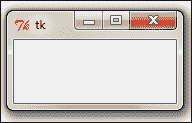

绘制根窗口很简单。您只需要以下三行代码：

```py
from Tkinter import * 
root = Tk()
root.mainloop()

```

将其保存为`.py`文件扩展名或查看代码`1.01.py`。在 IDLE 窗口中打开它，并从**运行**菜单（IDLE 中的*F5*）运行程序。运行此程序应生成一个如前截图所示的空白根窗口。此窗口配备了功能化的最小化、最大化和关闭按钮，以及一个空白框架。

### 小贴士

**下载示例代码**

你可以从你购买的所有 Packt 书籍的账户中下载示例代码文件。[`www.packtpub.com`](http://www.packtpub.com)。如果你在其他地方购买了这本书，你可以访问[`www.packtpub.com/support`](http://www.packtpub.com/support)并注册，以便将文件直接通过电子邮件发送给你。

代码的描述如下：

+   第一行将 Tkinter 的所有（`*`）类、属性和方法导入当前工作区。

+   第二行创建了一个`Tkinter.Tk`类的实例。这创建了你在提供的截图中所看到的“根”窗口。按照惯例，Tkinter 中的根窗口通常被称为“root”，但你也可以用任何其他名字来调用它。

+   第三行执行了`root`对象的`mainloop`（即事件循环）方法。`mainloop`方法使根窗口保持可见。如果你删除第三行，第 2 行创建的窗口将立即消失，因为脚本停止运行。这会发生得如此之快，以至于你甚至看不到窗口出现在你的屏幕上。保持`mainloop`运行还让你能够保持程序运行，直到你按下关闭按钮，这将退出主循环。

## 目标完成 - 简短回顾

恭喜！你已经完成了第一个目标，即绘制根窗口。你现在已经准备好了你的绘图画布（根窗口）。现在准备好用你的想象力来绘制它吧！

### 注意

将以下三行代码（如*code 1.01.py*所示）记住。这三行代码生成了你的根窗口，它将容纳所有其他图形组件。这些行构成了你将在 Tkinter 中开发的任何 GUI 应用程序的骨架。所有使你的 GUI 应用程序功能化的代码都将位于此代码的第 2 行（新对象创建）和第 3 行（`mainloop`）之间。

## 分类情报

本节描述了导入 Tkinter 模块的不同方式。

在前面的例子中，我们使用以下命令导入 Tkinter：

```py
from Tkinter import *

```

这种导入方法简化了模块中定义的方法的处理。也就是说，你可以直接访问这些方法。通常，被认为是不好的做法像我们这里这样做，导入模块的所有（`*`）方法。这是因为如果你从其他模块导入具有相同方法名的所有方法，会导致方法的覆盖。

有几种导入 Tkinter 的方法可以避免这种重叠，其中一种常见的方法是：

```py
import Tkinter

```

这种导入方式不会将 Tkinter 内部定义的所有方法列表污染命名空间。然而，现在 Tkinter 中的每个方法都必须使用格式`Tkinter.methodA`来调用，而不是直接调用方法。

另一种常用的导入方式如下：

```py
import Tkinter as Tk 

```

在这里，你也不应该将所有 Tkinter 方法都污染当前命名空间，现在你可以访问如`Tk.methodA`这样的方法。"Tk"是一个方便、易于输入的别名，许多开发者常用它来导入 Tkinter。

### 整体情况

作为 GUI 程序员，你通常需要决定你程序的三方面：

+   **屏幕上应该显示哪些组件？**：这涉及到选择构成用户界面的组件。典型组件包括按钮、输入字段、复选框、单选按钮、滚动条等。在 Tkinter 中，你添加到 GUI 的组件被称为小部件。

+   **组件应该放在哪里？**：这涉及到决定每个组件在整体设计结构中的位置或放置。这包括对位置和各个组件的结构布局问题所做的决定。在 Tkinter 中，这被称为**几何管理**。

+   **组件如何交互和表现？**：这涉及到为每个组件添加功能。每个组件或小部件都执行一些工作。例如，按钮在被点击时做出响应；滚动条处理滚动；复选框和单选按钮使用户能够做出一些选择。在 Tkinter 中，各种小部件的功能是通过`command`绑定或使用**回调函数**的`event`绑定来管理的。

让我们深入探讨 Tkinter 中的这三个组件。

# 小部件——你的 GUI 程序的基本构建块

现在我们已经准备好了 Toplevel 窗口，是时候思考问题，窗口中应该出现哪些组件？在 Tkinter 术语中，这些组件被称为**小部件**。

## 启动推进器

添加小部件的语法如下：

```py
mywidget = Widget-name (its container window,**configuration options)
```

在以下示例（参考代码`01.02.py`）中，我们向根框架添加了两个小部件，一个标签和一个按钮。注意所有小部件是如何添加到我们在第一个示例中定义的骨架代码之间的。

```py
from Tkinter import *
root = Tk() 
mylabel = Label(root,text="I am a label widget")    
mybutton = Button(root,text="I am a button")       
mylabel.pack()
mybutton.pack()
root.mainloop()
```

代码的描述如下：

+   这段代码为**标签**小部件添加了一个新的实例，`mylabel`。第一个参数定义`root`为其父或容器。第二个参数配置其文本选项为`"I am a label widget"`。

+   我们同样定义了一个**按钮**小部件的实例。这也绑定到根窗口作为其父。

+   我们使用`pack()`方法，这是在窗口中定位标签和按钮小部件的基本要求。我们将在“几何管理任务”下讨论`pack()`方法和几个其他相关概念。然而，你必须注意，某种形式的几何规范对于小部件在 Toplevel 窗口中显示是必不可少的。

+   运行此代码将生成以下截图所示的窗口。它将有一个自定义标签和一个自定义按钮：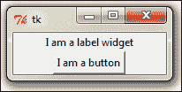

## 目标完成 - 简短回顾

在这次迭代中，我们学习了以下内容：

+   小部件是什么。

+   如何在容器窗口框架内实例化和显示 widget。

+   如何在实例化时设置 widget 的选项。

+   指定几何选项（如`pack()`）以显示 widget 的重要性。我们将在后续任务中进一步讨论这一点。

## 分类情报

+   所有 widget 实际上都是它们各自**widget 类**的派生对象。因此，`mybutton = Button(myContainer)`这样的语句实际上是从`Button`类创建按钮实例。

+   每个 widget 都有一组选项，决定了其行为和外观。这包括文本标签、颜色、字体大小等属性。例如，按钮 widget 有管理其标签、控制其大小、更改前景色和背景色、更改边框大小等属性。

+   要设置这些属性，你可以在创建 widget 时直接设置值，就像我们在前面的例子中所做的那样。或者，你可以稍后通过使用`.config()`或`.configure()`方法设置或更改 widget 的选项。请注意，`.config()`或`.configure()`方法是可互换的，并提供相同的功能。

### 小贴士

你也可以在创建 widget 的新实例时在同一行添加`pack()`方法。例如，考虑以下代码：

```py
mylabel = Label(root,text="I am a label widget")
mylabel.pack()
```

如果你直接实例化 widget，你可以将这两行代码一起写，如下所示：

```py
Label(root,text="I am a label widget").pack()
```

你可以保留创建的 widget 的引用（如第一个例子中的`mylabel`），或者你可以创建一个没有保留任何引用的 widget（如第二个例子）。

如果 widget 的内容可能在程序的稍后阶段被某些操作修改，理想情况下你应该保留引用。如果 widget 的状态在创建后保持静态，你不需要保留 widget 的引用。

此外，请注意，调用`pack()`（或其他几何管理器）总是返回`None`。因此，考虑你创建一个 widget 并保留对其的引用，并在同一行添加几何管理器（例如`pack()`），如下所示：

```py
mylabel = Label(…).pack()
```

在这种情况下，你实际上并没有创建 widget 的引用，而是为变量`mylabel`创建了一个`None`类型对象。

因此，当你稍后尝试通过引用修改 widget 时，你会得到一个错误，因为你实际上正在尝试对一个`None`类型对象进行操作。

这是最常见的初学者错误之一。

# 了解核心 Tkinter widget

在这次迭代中，我们将了解所有核心 Tkinter widget。在前面的例子中，我们已经看到了其中的两个——标签和按钮 widget。现在让我们看看所有其他核心 Tkinter widget。

## 准备起飞

Tkinter 包括 21 个核心 widget。具体如下：

| Toplevel widget | Label widget | Button widget |
| --- | --- | --- |
| Canvas widget | Checkbutton widget | Entry widget |
| Frame widget | LabelFrame widget | Listbox widget |
| 菜单 widget | Menubutton widget | 消息 widget |
| OptionMenu widget | PanedWindow widget | Radiobutton widget |
| 滑块小部件 | 滚动条小部件 | 滚动框小部件 |
| 文本小部件 | 位图类小部件 | 图像类小部件 |

让我们编写一个程序，将这些小部件包含在我们的根窗口中。

## 启动推进器

添加小部件的格式与我们之前讨论的任务中相同。为了给你一个感觉，这里有一些添加一些常见小部件的示例代码：

```py
Label(parent, text=" Enter your Password:") 
Button(parent, text="Search")
Checkbutton(parent, text='RememberMe', variable=v, value=True)
Entry(parent, width=30)
Radiobutton(parent, text=Male, variable=v, value=1)
Radiobutton(parent, text=Female, variable=v, value=2)
OptionMenu(parent, var, "Select Country", "USA", "UK", "India", Others")
Scrollbar(parent, orient=VERTICAL, command=mytext.yview)

```

你能发现每个小部件的共同模式吗？你能发现差异吗？

作为提醒，添加小部件的语法是：

```py
Widget-name (its container window, *configuration options)

```

### 小贴士

创建所有之前提到的小部件的方法是相同的。大多数配置选项也将相似。然而，一些配置选项会根据小部件的不同而有所变化。

例如，按钮和标签小部件将有一个配置文本的选项，但滚动条没有文本配置选项。

使用相同的模式，现在让我们将所有 21 个核心 Tkinter 小部件添加到一个虚拟应用程序（代码`01.03.py`）中。

### 小贴士

不要因为程序的大小而感到害怕。相反，寻找用于初始化和显示所有小部件的共同模式。为了重申，添加小部件的语法是：

```py
mywidget = Widget-name (container, all widget-options)
```

注意到每个小部件的配置选项如何根据初始化的小部件类型略有不同。

请参考代码`1.03.py`以查看所有 Tkinter 小部件的演示。`1.03.py`的代码摘要如下：

+   我们创建了一个顶层窗口并创建了一个主循环，就像之前示例中看到的那样。

+   我们添加了一个名为`menubar`的框架小部件。请注意，框架小部件只是持有其他小部件的容器小部件。框架小部件非常适合将小部件分组在一起。添加框架的语法与其他所有小部件的语法相同：

    ```py
    myframe = Frame(root)
    myframe.pack()
    ```

+   将`menubar`框架作为容器，我们向其中添加了两个小部件，菜单按钮和菜单小部件。

+   我们创建了一个新的框架并命名为`myframe1`。将`myframe1`作为容器/父小部件，我们向其中添加了七个小部件：

    +   标签、输入框、按钮、复选框、单选按钮、选项菜单和位图类小部件。

+   然后，我们继续创建`myframe2`，另一个框架小部件。我们向其中添加了六个更多的小部件：

    +   图像类、列表框、滚动框、滑块、标签框架和信息小部件。

+   我们接着创建`myframe3`，另一个框架小部件。我们向其中添加了两个更多的小部件，文本和滚动条小部件。

+   最后，我们创建了最后一个框架`myframe4`，另一个框架小部件。我们向其中添加了两个更多的小部件，画布和分割窗口小部件。

所有这些小部件构成了 Tkinter 的 21 个核心小部件。

### 注意

仔细阅读代码解释，并在示例代码`01.03.py`中找到相应的代码片段。观察每个小部件是如何创建的。尝试识别每个小部件在 Tkinter 中使用的类名。看看所有小部件中哪些是相同的，以及不同的小部件之间有哪些变化？

在`1.03.py`中花几分钟阅读和理解代码，将真正帮助你欣赏 Tkinter 程序的简洁性和整体结构。

最后，请注意，我们已经在每个部件上使用了`.pack()`来显示它在其容器框架内。我们将在下一个任务中讨论`.pack()`。然而，现在只需注意，我们已经使用了名为`pack()`的东西，没有它，部件根本不会显示。

## 目标完成 - 简短总结

你在 GUI 编程工作中已经达到了一个重要的里程碑。

你现在已经了解了 Tkinter 的所有 21 个核心部件。你可以通过它们的类名来识别它们，你可以在根框架或根框架内的子框架中创建它们。你现在知道如何配置部件的选项。

通过这种方式，你现在已经看到了 Tkinter 程序的第一块也是最重要的构建块。你已经掌握了 Tkinter 部件。

## 分类情报

与我们迄今为止的示例一样，部件选项可以在实例化时设置。或者，可以使用以下语法在实例化后配置选项：

```py
widget.configure(**options)
```

这是一个非常实用的工具，它允许你在创建部件后动态地更改部件选项。我们将在所有项目中非常频繁地使用它。

对于常见的部件配置选项，请参阅附录 B 中的*部件的通用选项*部分，*快速参考表*。

# 几何管理

在了解了所有核心 Tkinter 部件之后，现在让我们将注意力转向 GUI 编程的第二个组成部分——放置这些部件的问题。

这是由 Tkinter 的几何管理器选项处理的。GUI 编程的这部分涉及决定部件的位置、整体布局以及各种部件在屏幕上的相对位置。

## 准备起飞

回想一下，我们使用了`pack()`方法来向上一节中开发的虚拟应用程序添加部件。`pack()`是 Tkinter 中几何管理的一个例子。

`pack()`不是管理界面几何形状的唯一方法。事实上，Tkinter 中有三个几何管理器允许你指定 Toplevel 或父窗口内部件的位置。

几何管理器如下：

+   `pack`：这是我们迄今为止使用过的。对于简单的布局来说很简单，但对于稍微复杂的布局可能会变得非常复杂。

+   `grid`：这是最常用的几何管理器，它提供了一种类似于表格的布局管理功能，便于布局管理。

+   `place`：这是最不受欢迎的，但提供了对部件绝对定位的最佳控制。

## 启动推进器

现在，让我们看看所有三种几何管理器在实际操作中的例子。

### `pack`几何管理器

`pack`几何管理器的名称来源于它实际上是在主框架中按先来先服务的原则将部件打包到可用的空间中。

`pack`几何管理器将“从属部件”放入“父空间”。在打包从属部件时，`pack`管理器区分三种空间：

+   未声明的空间

+   声称但未使用的空间

+   声称和使用的空间

在`pack()`中最常用的选项包括：

+   `side`: `LEFT`, `TOP`, `RIGHT`, 和 `BOTTOM`（这些决定了小部件的对齐方式）

+   `fill`: `X`，`Y`，`BOTH`，和 `NONE`（这些决定了小部件是否可以增长尺寸）

+   `expand` :`1`/`0` 或 `Yes`/`No`（对应于相应的值）

+   `anchor`: `NW`, `N`, `NE`, `E`, `SE`, `S`, `SW`, `W`, 和 `CENTER`（对应于基本方向）

+   内部填充（`ipadx`和`ipady`）和外部填充（`padx`和`pady`），它们都默认为 0 值

让我们看看一些演示代码，这些代码说明了`pack`的一些功能。以下是一个代码片段（代码`1.04.py`），它生成一个类似于以下屏幕截图的 GUI：

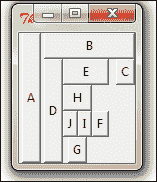

```py
from Tkinter import *
root = Tk()
Button(root, text="A").pack(side=LEFT, expand=YES, fill=Y)
Button(root, text="B").pack(side=TOP, expand=YES, fill=BOTH)
Button(root, text="C").pack(side=RIGHT, expand=YES, fill=NONE, anchor=NE)
Button(root, text="D").pack(side=LEFT, expand=NO, fill=Y)
Button(root, text="E").pack(side=TOP, expand=NO, fill=BOTH)
Button(root, text="F").pack(side=RIGHT, expand=NO, fill=NONE)
Button(root, text="G").pack(side=BOTTOM, expand=YES, fill=Y)
Button(root, text="H").pack(side=TOP, expand=NO, fill=BOTH)
Button(root, text="I").pack(side=RIGHT, expand=NO)
Button(root, text="J").pack(anchor=SE)
root.mainloop()

```

代码的描述如下所示：

+   当你在`root`框架中插入按钮**A**时，它捕获框架的最左侧区域，它扩展并填充了*Y*维度。因为扩展和填充选项被指定为肯定，它声称它想要的全部区域并填充了*Y*维度。如果你通过向下拖动根窗口来增加其大小，你会注意到按钮**A**在向下方向（沿着*Y*坐标）扩展，但窗口的侧向增加并不会导致按钮**A**的横向尺寸增加。

+   当你在根窗口中插入下一个按钮**B**时，它会从剩余区域中获取空间，但将其自身对齐到`TOP`，扩展填充可用区域，并填充可用空间的*X*和*Y*坐标。

+   第三个按钮**C**调整到剩余空间的右侧。但由于填充被指定为`NONE`，它只占用容纳按钮内文本所需的空间。如果你扩展根窗口，按钮**C**的大小不会改变。

+   在某些行中使用的`anchor`属性提供了一种将小部件相对于参考点定位的方法。如果没有指定`anchor`属性，`pack`管理器将小部件放置在可用空间或**填充框**的中心。其他允许的选项包括四个基本方向（`N`，`S`，`E`和`W`）以及任意两个方向的组合。因此，`anchor`属性的合法值包括：`CENTER`（默认），`N`，`S`，`E`，`W`，`NW`，`NE`，`SW`和`SE`。

其余行的描述留给你作为练习去探索。研究这段代码的最佳方式是注释掉所有代码行，然后逐个引入每个连续的按钮。在每一步，尝试调整窗口大小以查看它对各种按钮的影响。

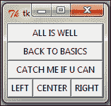

我们将在我们的项目中使用`pack`几何管理器，因此熟悉`pack`及其选项将是一项值得做的练习。

### 注意

注意，大多数 Tkinter 几何管理器属性的值可以是大写字母（无需引号，如`side=TOP`，`anchor=SE`）或小写字母（但需在引号内，如`side='top'`，`anchor='se'`）。

要获取完整的`pack`管理器参考，请参阅附录 B 中的*《pack 管理器》*部分，*快速参考表*。

### 小贴士

**你应该在哪里使用`pack()`几何管理器？**

与我们接下来要讨论的`grid`方法相比，使用`pack`管理器稍微复杂一些，但在以下情况下它是一个很好的选择：

+   使小部件填充完整的容器框架

+   将多个小部件堆叠或并排放置（如前一个屏幕截图所示）。请参阅代码`1.05.py`。

虽然您可以通过在多个框架中嵌套小部件来创建复杂的布局，但您会发现`grid`几何管理器更适合大多数复杂布局。

### 网格几何管理器

`grid`几何管理器是最容易理解，也许也是 Tkinter 中最有用的几何管理器。`grid`几何管理器的核心思想是将容器框架划分为一个二维表格，该表格由多个行和列组成。然后，表中的每个单元格都可以用来放置小部件。在这种情况下，**单元格**是虚拟行和列的交点。请注意，在`grid`方法中，每个单元格只能放置一个小部件。然而，小部件可以被设置为跨越多个单元格。

在每个单元格内，您可以使用`STICKY`选项进一步对齐小部件的位置。`sticky`选项决定了当其容器单元格大于包含的小部件大小时，小部件如何扩展。`sticky`选项可以使用一个或多个`N`、`S`、`E`和`W`，或`NW`、`NE`、`SW`和`SE`选项来指定。

未指定粘性则默认为将小部件粘附在单元格中心。

现在我们来看一个演示代码，它展示了`grid`几何管理器的一些功能。`1.06.py`中的代码生成一个类似于 GUI 的图形，如图所示：

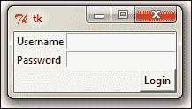

```py
from Tkinter import *
root = Tk()
Label(root, text="Username").grid(row=0, sticky=W)
Label(root, text="Password").grid(row=1, sticky=W)
Entry(root).grid(row=0, column=1, sticky=E)
Entry(root).grid(row=1, column=1, sticky=E)
Button(root, text="Login").grid(row=2, column=1, sticky=E)
root.mainloop()

```

代码的描述如下：

+   查看在表示整个框架的虚拟网格表中按行和列位置定义的网格位置。看看`sticky=W`在两个标签上的使用如何使它们粘附在西部或左侧，从而实现整洁的布局。

+   每列的宽度（或每行的长度）自动由单元格中包含的小部件的高度或宽度决定。因此，您无需担心指定行或列的宽度相等。如果您需要额外的控制，可以指定小部件的宽度。

+   您可以使用参数`sticky=N+S+E+W`使小部件可扩展以填充整个网格单元格。

在更复杂的场景中，您的部件可能跨越网格中的多个单元格。为了使网格跨越多个单元格，`grid`方法提供了非常方便的选项，如`rowspan`和`columnspan`。

此外，您可能经常需要在网格单元格之间提供一些填充。`grid`管理器提供了`padx`和`pady`选项，以在单元格中为部件提供填充。

类似地，还有`ipadx`和`ipady`选项用于内部填充。外部和内部填充的默认值是`0`。

让我们看看`grid`管理器的例子，其中我们使用了`grid`方法的大部分常见参数，如`row`、`column`、`padx`、`pady`、`rowspan`和`columnspan`的实际应用。

`1.08.py`代码是`grid()`几何管理器选项的演示：

```py
from Tkinter import *
top = Tk()
top.title('Find & Replace')

Label(top,text="Find:").grid(row=0, column=0, sticky='e')
Entry(top).grid(row=0,column=1,padx=2,pady=2,sticky='we',columnspan=9)

Label(top, text="Replace:").grid(row=1, column=0, sticky='e')
Entry(top).grid(row=1,column=1,padx=2,pady=2,sticky='we',columnspan=9)

Button(top, text="Find").grid(row=0, column=10, sticky='ew', padx=2, pady=2)
Button(top, text="Find All").grid(row=1, column=10, sticky='ew', padx=2)
Button(top, text="Replace").grid(row=2, column=10, sticky='ew', padx=2)
Button(top, text="Replace All").grid(row=3, column=10, sticky='ew', padx=2)

Checkbutton(top, text='Match whole word only').grid(row =2, column=1, columnspan=4, sticky='w')
Checkbutton(top, text='Match Case').grid(row =3, column=1, columnspan=4, sticky='w')
Checkbutton(top, text='Wrap around').grid(row =4, column=1, columnspan=4, sticky='w')

Label(top, text="Direction:").grid(row=2, column=6, sticky='w')
Radiobutton(top, text='Up', value=1).grid(row=3, column=6, columnspan=6, sticky='w')
Radiobutton(top, text='Down', value=2).grid(row=3, column=7, columnspan=2, sticky='e')

top.mainloop()

```

注意，仅仅 14 行核心`grid`管理器代码就能生成如以下截图所示的复杂布局。相比之下，使用`pack`管理器开发将会更加繁琐：

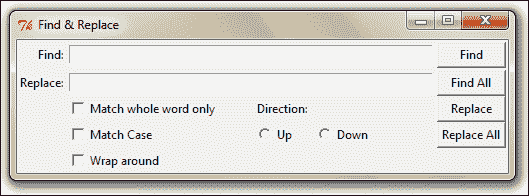

另一个您有时可以使用的`grid`选项是`widget.grid_forget()`方法。此方法可以用来从屏幕上隐藏部件。当您使用此选项时，部件仍然存在于其位置，但变得不可见。隐藏的部件可以再次变得可见，但您最初分配给部件的任何`grid`选项都将丢失。

类似地，还有一个`widget.grid_remove()`方法可以移除部件，但在这个情况下，当您再次使部件可见时，所有其`grid`选项都将被恢复。

对于完整的`grid()`参考，请参阅附录 B 中的*“网格管理器”*部分，*快速参考表*。

### 小贴士

**您应该在何处使用`grid()`几何管理器？**

`grid`管理器是开发复杂布局的强大工具。通过将容器部件分解成行和列的网格，然后将部件放置在所需的网格中，可以轻松实现复杂结构。

它也常用于开发不同类型的对话框。

现在，我们将深入了解配置网格列和行的尺寸。

不同的部件有不同的高度和宽度。因此，当您以行和列的术语指定部件的位置时，单元格会自动扩展以容纳部件。

通常，所有网格行的自动调整高度以适应其最高的单元格。同样，所有网格列的宽度会调整到最宽部件单元格的宽度。

如果您想要一个更小的部件填充更大的单元格或保持在单元格的任何一边，您可以使用部件上的`sticky`属性来控制这一点。

然而，您可以使用以下代码来覆盖列和行的自动尺寸：

```py
w.columnconfigure(n, option=value, ...)  AND 
w.rowconfigure(N, option=value, ...)
```

使用这些选项来配置给定的小部件`w`在列`n`中的选项，指定`minsize`、`pad`和`weight`的值。

这里可用的选项如以下表格中所述：

| 选项 | 描述 |
| --- | --- |
| `minsize` | 列或行的最小像素大小。如果给定列或行中没有小部件，则即使有此 `minsize` 指定，单元格也不会出现。 |
| `pad` | 在指定列或行的大小之外，添加到最大单元格大小的像素外部填充。 |

| `weight` | 这指定了行或列的相对权重，然后分配额外的空间。这允许使行或列可伸缩。例如，以下代码将五分之二的额外空间分配给第一列，将五分之三分配给第二列：

```py
w.columnconfigure(0, weight=2)
w.columnconfigure(1, weight=3)
```

|

`columnconfigure()` 和 `rowconfigure()` 方法通常用于实现小部件的动态调整大小，尤其是在调整根窗口时。

### 注意

你不能在同一个容器窗口中使用 `grid` 和 `pack` 方法。如果你尝试这样做，你的程序将进入无限协商循环。

### `place` 几何管理器

`place` 几何管理器是 Tkinter 中最不常用的几何管理器。尽管如此，它在某些情况下有其用途，因为它允许你使用 *X*-*Y* 坐标系精确地在父框架内定位小部件。

可以使用 `place()` 方法对所有标准小部件进行 `place` 管理器的评估。

`place` 几何管理器的重要选项包括：

+   绝对定位（以 `x=N` 或 `y=N` 的形式指定）

+   相对定位（关键选项包括 `relx`、`rely`、`relwidth` 和 `relheight`）

与 `place()` 常一起使用的其他选项包括 `width` 和 `anchor`（默认为 `NW`）。请参考 `1.09.py` 中的代码以演示常见的 `place` 选项：

```py
from Tkinter import *
root = Tk()
# Absolute positioning
Button(root,text="Absolute Placement").place(x=20, y=10)
# Relative positioning
Button(root, text="Relative").place(relx=0.8, rely=0.2, relwidth=0.5, width=10, anchor = NE)
root.mainloop()
```

仅通过查看代码或窗口框架，你可能看不到绝对位置和相对位置之间太大的区别。然而，如果你尝试调整窗口大小，你会注意到绝对定位的按钮不会改变其坐标，而相对定位的按钮会改变其坐标和大小以适应根窗口的新大小。

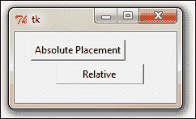

对于完整的 `place()` 参考，请查看 附录 B 中的 *`place` 管理器* 部分，*快速参考表*。

### 提示

**你应该在什么情况下使用 `place` 管理器？**

在需要实现自定义几何管理器且小部件位置由最终用户决定的情况下，`place` 管理器非常有用。

虽然 `pack()` 和 `grid()` 管理器不能在同一个框架中一起使用，但 `place()` 管理器可以与同一容器框架内的任何其他几何管理器一起使用。

`place` 管理器很少被使用。这是因为如果你使用它，你必须担心确切的坐标。比如说，如果你对一个小部件进行了一些小的修改，那么你很可能还需要更改其他小部件的 *X*-*Y* 值，这可能会非常繁琐。

我们不会在我们的项目中使用`place`管理器。然而，了解基于坐标定位的选项存在可以在某些情况下有所帮助。

## 目标完成 – 简短总结

这就结束了我们对 Tkinter 中几何管理的讨论。

在本节中，你实现了`pack`、`grid`和`place`几何管理器的示例。你还了解了每个几何管理器的优点和缺点。

你了解到`pack`最适合简单的侧向或自上而下的小部件定位。你还看到`grid`管理器最适合处理复杂布局。你看到了`place`几何管理器的示例以及为什么它很少使用的原因。

现在，你应该能够使用 Tkinter 的这些几何管理器来规划和执行你程序的不同布局。

# 事件和回调——为程序注入活力

现在我们已经学会了如何将小部件添加到屏幕上以及如何将它们定位在我们想要的位置，让我们将注意力转向 GUI 编程的第三个组成部分。这解决了如何使小部件具有功能的问题。

使小部件具有功能涉及使它们对按钮按下、键盘上的按键、鼠标点击等事件做出响应。这需要将回调函数与特定事件关联起来。

## 启动推进器

回调通常与特定的小部件事件相关联，使用`command`绑定规则，这将在下一节中详细说明。

### 命令绑定

向按钮添加功能的最简单方法称为`command`绑定，其中回调函数以`command = some_callback`的形式在小部件选项中提及。

看一下下面的示例代码：

```py
def my_callback ():
  # do something
  Button(root,text="Click",command= my_callback) 
```

注意，`my_callback`是在小部件的`command`选项中不带括号`()`调用的。这是因为当回调函数被设置时，必须传递一个函数的引用而不是实际调用它。

### 向回调传递参数

如果回调函数不接受任何参数，它可以像我们刚才使用的那样用简单的函数处理。然而，如果回调函数需要接受一些参数，我们可以使用下面的代码片段中展示的`lambda`函数：

```py
def my_callback (somearg):
  #do something with argument
  Button(root,text="Click",command=lambda: my_callback ('some argument'))
```

Python 从名为`lambda`的功能性程序中借用语法。`lambda`函数允许你动态定义一个单行、无名的函数。

使用`lambda`的格式是`lambda arg: #do something with arg in a single line`，例如：

```py
lambda x: return x²
```

### 注意

请注意，与按钮小部件一起提供的`command`选项实际上是一个替代函数，用于简化按钮事件的编程。许多其他小部件不提供任何等效的`command`绑定选项。

默认情况下，命令按钮绑定到左键点击和空格键。它不会绑定到回车键。因此，如果你使用 `command` 函数绑定按钮，它将响应空格键而不是回车键。这对许多 Windows 用户来说可能不太直观。更糟糕的是，你不能改变 `command` 函数的这个绑定。教训是，尽管 `command` 绑定是一个非常方便的工具，但它并不提供让你自己决定绑定的独立性。

### 事件绑定

幸运的是，Tkinter 提供了一种名为 `bind()` 的替代事件绑定机制，让你可以处理不同的事件。绑定事件的常规语法如下：

```py
widget.bind(event, handler)
```

当与事件描述相对应的事件在控件中发生时，它会调用相关处理程序，并将事件对象的实例及其详细信息作为参数传递。

让我们看看 `bind()` 方法的示例（参考代码文件 `1.10.py`）：

```py
from Tkinter import *
root = Tk()
Label(root, text='Click at different\n locations in the frame below').pack()
def mycallback(event):
 print dir(event) 
 print "you clicked at", event.x, event.y
myframe = Frame(root, bg='khaki', width=130, height=80)
myframe.bind("<Button-1>", mycallback) 
myframe.pack()
root.mainloop()
```

代码的描述如下：

+   我们将 Frame 小部件绑定到事件 `<Button-1>`，这对应于鼠标的左键点击。当这个事件发生时，它会调用函数 `mycallback`，并将一个对象实例作为其参数传递。

+   我们定义了函数 `mycallback(event)`。注意，它将事件对象作为参数。

+   我们使用 `dir(event)` 来检查事件对象，它返回传递给它的事件对象的属性名称的排序列表。这会打印出列表：

    +   `['__doc__', '__module__', 'char', 'delta', 'height', 'keycode', 'keysym', 'keysym_num', 'num', 'send_event', 'serial', 'state', 'time', 'type', 'widget', 'width', 'x', 'x_root', 'y', 'y_root']`。

+   从对象生成的属性列表中，我们使用了两个属性，`event.x` 和 `event.y`，来打印点击点的坐标。

当你运行此代码时，它会生成一个类似于图中所示的窗口。当你在此框架的任何地方左键点击时，它会向控制台输出消息。传递给控制台的一个示例消息如下：

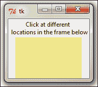

```py
['__doc__', '__module__', 'char', 'delta', 'height', 'keycode', 'keysym', 'keysym_num', 'num', 'send_event', 'serial', 'state', 'time', 'type', 'widget', 'width', 'x', 'x_root', 'y', 'y_root']
You clicked at 63 36.
```

### 事件模式

在前面的例子中，你看到了我们如何使用事件 `<Button-1>` 来表示鼠标的左键点击。这是 Tkinter 中的一个内置模式，将其映射到鼠标的左键点击事件。Tkinter 有一个详尽的映射方案，可以精确地识别此类事件。

这里有一些示例，以给你一个关于事件模式的概念：

| 事件模式 | 关联事件 |
| --- | --- |
| `<Button-1>` | 鼠标左键点击 |
| `<KeyPress-B>` | 按键 *B* 的键盘按下 |
| `<Alt-Control-KeyPress- KP_Delete>` | 按下 *Alt* + *Ctrl* + *Delete* 的键盘 |

通常，映射模式具有以下形式：

```py
<[event modifier-]...event type [-event detail]>

```

通常，事件模式将包括：

+   **事件类型**（必需）：一些常见的事件类型包括`Button`、`ButtonRelease`、`KeyRelease`、`Keypress`、`FocusIn`、`FocusOut`、`Leave`（鼠标离开小部件）和`MouseWheel`。对于事件类型的完整列表，请参阅附录 B 中的*事件类型*部分，*快速参考表*。

+   **事件修饰符**（可选）：一些常见的事件修饰符包括`Alt`、`Any`（如 `<Any-KeyPress>` 中使用）、`Control`、`Double`（如 `<Double-Button-1>` 表示左鼠标按钮的双击）、`Lock`和`Shift`。对于事件修饰符的完整列表，请参阅附录 B 中的*事件修饰符*部分，*快速参考表*。

+   **事件细节**（可选）：鼠标事件细节通过数字`1`表示左键点击，数字`2`表示右键点击。同样，每个键盘按键通过键字母本身（例如 `<KeyPress-B>` 中的 *B*）或使用缩写为**keysym**的键符号来表示。例如，键盘上的上箭头键由`keysym`值`KP_Up`表示。对于完整的`keysym`映射，请参阅附录 B 中的*事件细节*部分，*快速参考表*。

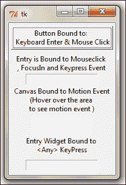

让我们来看一个关于小部件上`event`绑定的实际例子。（完整的示例代码请参考`1.11.py`）。以下是对常用`event`绑定的代码片段的修改，以供参考：

```py
widget.bind("<Button-1>",callback)  #bind widget to left mouse click
widget.bind("<Button-2>", callback) # bind to right mouse click
widget.bind("<Return>", callback)# bind  to Return(Enter) Key 
widget.bind("<FocusIn>", callback) #bind  to  Focus in Event
widget.bind("<KeyPress-A>", callback)# bind  to keypress A
widget.bind("<KeyPress-Caps_Lock>", callback)# bind to CapsLockkeysym
widget.bind("<KeyPress-F1>", callback)# bind widget to F1 keysym
widget.bind("<KeyPress-KP_5>", callback)# bind to keypad number 5
widget.bind('<Motion>', callback) # bind to motion over widget
widget.bind("<Any-KeyPress>", callback) # bind to any keypress

```

而不是将事件绑定到特定的小部件，你也可以将其绑定到 Toplevel 窗口。语法保持不变，但现在你需要在根窗口的根实例上调用它，如`root.bind()`。

### 绑定级别

在上一节中，你看到了如何将事件绑定到小部件的实例。这可以称为**实例级绑定**。

然而，有时你可能需要将事件绑定到整个应用程序。在其他时候，你可能希望将事件绑定到特定类的小部件。Tkinter 为此提供了不同级别的绑定选项：

+   **应用级绑定**：应用级绑定将允许你在应用程序的所有窗口和控件中使用相同的绑定，只要应用程序中的任何一个窗口处于焦点状态。

    应用级绑定的语法如下：

    ```py
    w.bind_all(event, callback)
    ```

    典型的使用模式如下：

    ```py
    root.bind_all('<F1>', show_help)
    ```

    在这里，应用级绑定意味着无论当前焦点下的哪个小部件被选中，只要应用程序处于活动焦点状态，按下*F1*键总是会触发`show_help`回调函数。

+   **类级绑定**：你还可以在特定类级别绑定事件。这通常用于设置特定小部件类的所有实例的相同行为。

    类级绑定的语法如下：

    ```py
    w.bind_class(className, event, callback)
    ```

    典型的使用模式如下：

    ```py
    myentry.bind_class('Entry', '<Control-V>', paste)
    ```

    在前面的示例中，所有输入小部件都将绑定到 `<Control-V>` 事件，该事件将调用名为 `'paste (event)'` 的方法。

### 注意

**事件传播**

大多数键盘事件和鼠标事件在操作系统级别发生。它从事件源向上级联，直到找到一个具有相应绑定的事件窗口。事件传播不会在这里停止。它会向上传播，寻找其他小部件的其他绑定，直到达到根窗口。如果它达到了根窗口并且没有发现绑定，则该事件将被忽略。

### 处理特定小部件的变量

你需要与各种小部件一起使用变量。你可能需要一个字符串变量来跟踪用户输入到输入小部件或文本小部件中的内容。你很可能需要一个布尔变量来跟踪用户是否选中了复选框小部件。你需要整数变量来跟踪在 Spinbox 或滑块小部件中输入的值。

为了响应特定小部件变量的变化，Tkinter 提供了自己的变量类。你用来跟踪特定小部件值的变量必须从这个 Tkinter 变量类中派生。Tkinter 提供了一些常用的预定义变量。它们是 `StringVar`、`IntVar`、`BooleanVar` 和 `DoubleVar`。

你可以使用这些变量在回调函数内部捕获和操作变量值的更改。如果需要，你也可以定义自己的变量类型。

创建 Tkinter 变量很简单。你只需调用所需的构造函数：

```py
mystring = StringVar()
ticked_yes = BooleanVar()
option1 = IntVar()
volume = DoubleVar()

```

变量创建后，你可以将其用作小部件选项，如下所示：

```py
Entry(root, textvariable = mystring) 
Checkbutton(root, text="Remember Me", variable=ticked_yes)
Radiobutton(root, text="Option1", variable=option1, value="option1") #radiobutton
Scale(root, label="Volume Control", variable=volume, from =0, to=10) # slider

```

此外，Tkinter 通过 `set()` 和 `get()` 方法提供对变量值的访问：

```py
myvar.set("Wassup Dude") # setting  value of variable
myvar.get() # Assessing the value of variable from say a callback

```

Tkinter 变量类的演示可以在代码文件 `1.12.py` 中找到。该代码生成一个类似于以下截图的窗口：

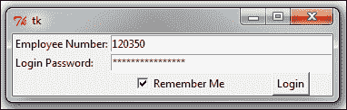

## 目标完成 - 简短回顾

在本课中，你学习了：

+   将简单小部件绑定到特定函数的 `command` 绑定

+   使用 `lambda` 函数，如果你需要处理参数

+   使用 `widget.bind(event, callback)` 方法绑定键盘和鼠标事件到你的小部件，并在某些事件发生时调用回调函数

+   如何向回调传递额外的参数

+   如何使用 `bind_all()` 和 `bind_class()` 将事件绑定到整个应用程序或特定类的小部件

+   如何使用 Tkinter 变量类设置和获取特定小部件变量的值

简而言之，你现在知道如何让你的 GUI 程序变得功能齐全！

## 分类英特尔

除了我们之前看到的 `bind` 方法之外，你可能会在某些情况下发现这两个与事件相关的选项很有用：

+   `unbind`：Tkinter 提供了 `unbind` 选项来撤销之前绑定的效果。语法如下：

    ```py
    widget.unbind(event)
    ```

    以下是一些使用示例：

    ```py
    entry.unbind('<Alt-Shift-5>')
    root.unbind_all('<F1>')
    root.unbind_class('Entry', '<KeyPress-Del>')
    ```

+   **虚拟事件**：Tkinter 还允许你创建自己的事件。你可以给这些虚拟事件起任何你想要的名字。

    例如，假设你想创建一个名为`<<commit>>`的新事件，该事件由*F9*键触发。要在给定的小部件上创建这个虚拟事件，请使用以下语法：

    ```py
    widget.event_add('<<commit>>', '<F-9>')
    ```

    然后，你可以使用正常的`bind()`方法将`<<commit>>`绑定到任何回调函数上：

    ```py
    widget.bind('<<commit>>', callback)
    ```

其他与事件相关的方法列在附录 B 的*其他与事件相关的方法*部分，*快速参考表*。

现在你已经准备好使用 Tkinter 进行实际的应用程序开发，让我们花些时间探索 Tkinter 提供的几个自定义样式选项。我们还将查看一些与根窗口一起常用的配置选项。

# 做得有风格

到目前为止，我们一直依赖 Tkinter 为我们的小部件提供特定平台的基础样式。然而，你可以根据自己的需求指定小部件的样式，包括颜色、字体大小、边框宽度和浮雕效果。Tkinter 中可用的样式功能将在以下任务中进行简要介绍。

## 准备起飞

回想一下，我们可以在小部件实例化时指定小部件选项，如下所示：

```py
mybutton = Button(parent, **configuration options) 
```

或者，你也可以使用`configure()`函数来指定小部件选项：

```py
mybutton.configure(**options)
```

样式选项也可以作为小部件的选项指定，无论是在实例化时还是在之后使用 configure 选项。

## 启动推进器

在样式的范畴内，我们将介绍如何将不同的颜色、字体、边框宽度、浮雕效果、光标和位图图标应用到我们的小部件上。我们还将在本节稍后查看一些根配置。

让我们先看看如何指定小部件的颜色选项。对于大多数小部件，你可以指定两种类型的颜色：

+   背景颜色

+   前景颜色

你可以使用红色、绿色和蓝色的比例使用十六进制颜色代码来指定颜色。常用的表示方式有`#rgb`（4 位）、`#rrggbb`（8 位）和`#rrrgggbbb`（12 位）。

例如，`#fff`是白色，`#000000`是黑色，`#fff000000`是红色。

或者，Tkinter 提供了标准颜色名称的映射。要查看预定义的颜色列表，请打开 Python 安装目录（在我的情况下，是`C:\Python27\Tools\pynche`）中的`Tools`文件夹内的名为`pynche`的程序。在程序中点击**查看** | **颜色列表窗口**。

接下来，指定字体最简单和最常见的方式是将它表示为一个元组。标准的表示方式如下：

```py
widget.configure( font= 'font family, fontsize, optional style modifiers like bold, italic, underline and overstrike')
```

下面是一些示例，用于说明指定字体的方法：

```py
widget.configure (font='Times, 8')
widget.configure  (font = 'Helvetica 24 bold italic')
```

### 注意

如果你将 Tkinter 的尺寸设置为纯整数，则测量单位为像素。或者，Tkinter 接受四种其他测量单位：m（毫米）、c（厘米）、i（英寸）和 p（打印点，大约是 1/72"）。

大多数 Tkinter 小部件的默认边框宽度为 2 像素。您可以通过明确指定来更改小部件的边框宽度，如下所示：

```py
button.configure (borderwidth=5)
```

小部件的浮雕样式指的是小部件中最高和最低海拔之间的差异。Tkinter 提供了五种可能的浮雕样式：`flat`、`raised`、`sunken`、`groove` 和 `ridge`。

```py
button.configure (relief='raised')
```

Tkinter 允许您在悬停在特定小部件上时更改鼠标光标的样式。这可以通过使用选项光标来完成，如下例所示：

```py
button.configure (cursor='cross')
```

对于可用光标的完整列表，请参阅 附录 B 中的 *可用光标列表* 部分，*快速参考表*。

虽然您可以在每个小部件级别指定样式选项，但有时为每个小部件单独这样做可能会很繁琐。特定小部件的样式有几个缺点：

+   它将逻辑和展示混合在一个文件中，使得代码庞大且难以管理

+   任何样式上的更改都应应用于每个小部件单独

+   由于您为大量小部件指定相同的样式，这违反了有效编码的 **不要重复自己**（**DRY**）原则

幸运的是，Tkinter 现在提供了一种将展示与逻辑分离并指定称为外部“选项数据库”中的样式的方法。这仅仅是一个文本文件，您可以在其中指定通用样式选项。

一个典型的选项数据库文本文件可能看起来如下：

```py
*font: Arial 10
*Label*font: Times 12 bold
*background: AntiqueWhite1
*Text*background: #454545
*Button*foreground:gray55
*Button*relief: raised
*Button*width: 3
```

这里的星号 (`*`) 符号表示特定的样式适用于给定小部件的所有实例。

这些条目放置在外部文本 `(.txt)` 文件中。要将此样式应用于特定的代码片段，您只需在代码早期使用 `option_readfile()` 调用即可，如下所示：

```py
root.option_readfile('optionDB.txt')
```

既然我们已经讨论了样式选项，让我们以一些常用的根窗口选项的讨论来结束：

| 方法 | 描述 |
| --- | --- |

|

```py
root.title("title of my program")

```

| 指定标题栏的标题 |
| --- |

|

```py
root.geometry('142x280+150+200') 

```

| 您可以使用 `widthxheight` + `xoffset` + `yoffset` 形式的字符串来指定根窗口的大小和位置 |
| --- |

|

```py
self.root.wm_iconbitmap('mynewicon.ico')

```

或者

```py
self.root.iconbitmap('mynewicon.ico ')

```

| 将标题栏图标更改为与默认 Tk 图标不同的图标 |
| --- |

|

```py
root.overrideredirect(1)

```

| 移除根边框框架 |
| --- |

现在让我们看看一个例子，其中我们应用了之前讨论的所有样式选项和根窗口选项（参见代码 `01.13.py`）：

```py
from Tkinter import *
root = Tk()

#demo of some important root methods
root.geometry('142x280+150+200') #specify root window size and position
root.title("Style Demo") #specifying title of the program
self.root.wm_iconbitmap('brush1.ico')#changing the default icon
#root.overrideredirect(1) # remove the root border - uncomment #this line to see the difference
root.configure(background='#4D4D4D')#top level styling

# connecting to the external styling optionDB.txt
root.option_readfile('optionDB.txt')

#widget specific styling
mytext = Text(root, background='#101010', foreground="#D6D6D6", borderwidth=18, relief='sunken', width=16, height=5 )
mytext.insert(END, "Style is knowing \nwho you are, what \nyou want to say, \nand not giving a \ndamn.")
mytext.grid(row=0, column=0, columnspan=6, padx=5, pady=5)

# all the below widgets derive their styling from optionDB.txt file
Button(root, text='*' ).grid(row=1, column=1)
Button(root, text='^' ).grid(row=1, column=2)
Button(root, text='#' ).grid(row=1, column=3)
Button(root, text='<' ).grid(row=2, column=1)
Button(root, text='OK', cursor='target').grid(row=2, column=2)
Button(root, text='>').grid(row=2, column=3)
Button(root, text='+' ).grid(row=3, column=1)
Button(root, text='v', font='Verdana 8').grid(row=3, column=2)
Button(root, text='-' ).grid(row=3, column=3)
fori in range(0,10,1):
  Button(root, text=str(i) ).grid( column=3 if i%3==0  else (1 if i%3==1 else 2), row= 4 if i<=3  else (5 if i<=6 else 6))

#styling with built-in bitmap images
mybitmaps = ['info', 'error', 'hourglass', 'questhead', 'question', 'warning']
for i in mybitmaps:
  Button(root, bitmap=i,  width=20,height=20).grid(row=(mybitmaps.index(i)+1), column=4,sticky='nw')

root.mainloop()
```

上述代码的描述如下：

+   代码的第一部分使用一些重要的根方法来定义几何形状、程序标题、程序图标以及移除根窗口边框的方法。

+   代码随后连接到一个名为 `optionDB.txt` 的外部样式文件，该文件定义了小部件的通用样式。

+   下一部分代码创建了一个 Text 小部件，并在小部件级别指定了样式。

+   下一段代码有几个按钮，所有这些按钮的风格都源自集中的`optionDb.txt`文件。其中一个按钮还定义了一个自定义光标。

+   代码的最后一段使用内置的位图图像样式了一些按钮。

运行这个程序会产生如下截图所示的窗口：

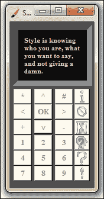

## 目标完成 - 简短总结

在这个任务中，我们探讨了如何使用样式选项来修改 Tkinter 的默认样式。我们看到了如何为我们的 GUI 程序指定自定义颜色、字体、浮雕效果和光标。我们还看到了如何使用选项数据库将样式与逻辑分离。最后，我们探索了一些配置我们的根窗口的常见选项。

# 任务完成

这使我们到达了项目 1，“认识 Tkinter”的结尾。该项目旨在提供一个 Tkinter 的高级概述。我们已经逐步了解了驱动 Tkinter 程序的所有重要概念。现在我们知道了：

+   根窗口是什么以及如何设置它

+   21 个核心 Tkinter 小部件是什么以及如何设置它们

+   如何使用`pack`、`grid`和`place`布局管理器来布局我们的程序

+   如何使用事件和回调使我们的程序功能化

+   如何将自定义样式应用到我们的 GUI 程序中

总结一下，我们现在可以开始考虑使用 Tkinter 制作有趣、功能性强且风格独特的 GUI 程序了！

# 热身挑战

是时候接受你的第一个 Hotshot 挑战了！你的任务是构建一个简单的计算器（如果你有雄心，可以是一个科学计算器）。它应该是完全功能性的，并且应该有自定义样式的按钮和屏幕。尽量让它看起来尽可能接近真实的物理计算器。

当你完成时，我们邀请你搜索你电脑上的复杂 GUI 程序。这些可以从你的操作系统程序，如搜索栏，到一些基于简单对话框的小部件。尝试使用 Tkinter 复制任何选定的 GUI。
