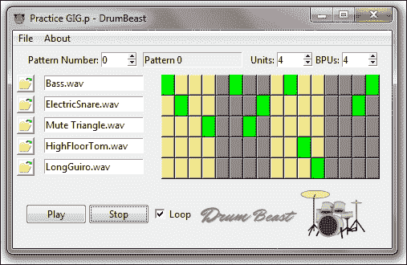
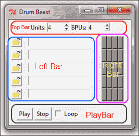
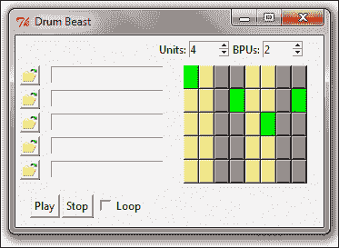
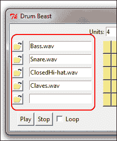
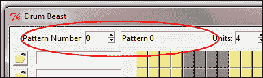
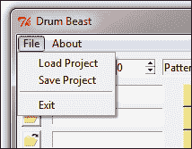
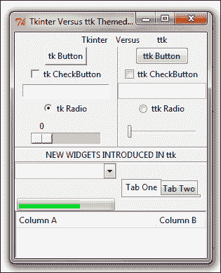
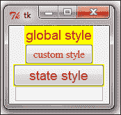

# 第三章：可编程鼓机

在上一个项目中，我们构建了一个文本编辑器。在这个过程中，我们查看了一些常见的 Tkinter 小部件，如 Menu、Buttons、Label 和 Text。现在，让我们做一些音乐。让我们使用 Tkinter 和一些其他 Python 模块构建一个跨平台鼓机。

# 任务简报

在这个项目中，我们将构建一个可编程的鼓机。鼓机的图形用户界面基于 Tkinter。您可以使用无限数量的鼓样本创建无限数量的节拍模式。然后您可以在项目中存储多个 riff，并在以后播放或编辑项目。



要创建自己的鼓点模式，只需使用左侧的按钮加载一些鼓样本。您可以更改构成节拍模式的单位，这反过来又决定了节奏的速度。您还可以决定每个单位中的节拍数。大多数西方节拍每个单位有四个节拍，华尔兹每个单位有三个节拍，我在这台机器上创作的某些印度和阿拉伯节奏每个单位有 3 到 16 个节拍！

## 为什么它如此出色？

不要被 GUI 的小尺寸所误导。这是一个功能强大的鼓机，可以与一些大型商业鼓机程序提供的功能相媲美。到这个项目的结束时，您应该能够扩展它，超越一些商业鼓程序。

该机器的一些关键特性包括：

+   大量节拍

+   大量模式以伴随歌曲

+   每个模式中节拍数可变

+   使用 16 位，44100 kHz WAV 样本（单声道或立体声）

+   支持各种文件格式

+   能够保存包含多个模式的多个项目

在 `Loops` 子目录中提供了一些鼓样本；然而，您可以加载任何其他鼓样本。您可以从互联网上免费下载大量样本。

在开发这个程序的过程中，我们进一步调整 Tkinter，并查看在 GUI 编程中通常遇到的一些重要概念和想法。

## 您的热门目标

承担这个项目的关键目标包括：

+   理解 Tkinter 在面向对象上下文中的应用

+   使用一些其他 Tkinter 小部件，如 Spinbox、Button、Entry 和 Checkbutton

+   使用 `grid` 几何管理器

+   使用 ttk 主题小部件

+   理解与 Tkinter 相关的线程编程

+   使用 Python 标准库中的其他常见模块

+   使用 `pickle` 模块进行对象持久化

除了这些关键概念之外，我们在项目过程中讨论了其他几个 GUI 编程的重要要点。

## 任务清单

在这个项目中，我们将使用一些标准 Python 分发中的内置库。这包括 `Tkinter`、`ttk`、`tkFileDialog`、`tkMessageBox`、`os`、`time`、`threading`、`wave` 和 `pickle` 模块。

要验证这些模块是否存在，只需在 IDLE 交互式提示符中运行以下语句：

```py
>>> import Tkinter, ttk, os, time, threading, wave, pickle, tkFileDialog, tkMessageBox

```

这不应该导致错误，因为标准的 Python 发行版已经将这些模块内置到发行版中。

除了这个之外，您还需要添加一个名为`pymedia`的额外 Python 模块。

可以在[`pymedia.org/`](http://pymedia.org/)下载`pymedia`模块。

安装模块后，您可以通过导入它来验证：

```py
>>> import pymedia

```

如果没有报告错误，你就可以开始编程鼓机了。让我们开始吧！

# 使用面向对象编程设置 GUI

我们作为上一个项目开发的文本编辑程序是使用过程式代码设置的。虽然它提供了一些快速编码的好处，但它本质上是一个单一的过程。

我们开始遇到全局变量。函数定义需要在调用它们的代码之上定义，最重要的是，代码不可重用。

因此，我们需要某种方式来确保我们的代码更具可重用性。这就是为什么程序员更喜欢使用**面向对象编程（OOP**）来组织他们的代码到类中。

面向对象编程（OOP）是一种编程范式，它将重点从操纵它们的逻辑转移到我们想要操纵的对象上。

这与将程序视为一个逻辑过程，该过程接受输入，处理它并产生一些输出的过程式编程相反。

面向对象编程提供了诸如数据抽象、封装、继承和多态等好处。此外，面向对象编程为程序提供了清晰的模块化结构。由于可以创建新的对象而不必修改现有的对象，因此代码修改和维护变得容易。

让我们使用面向对象编程来构建我们的鼓程序，以展示这些功能的一些示例。

## 准备起飞

我们鼓程序的指示性 OOP 结构可能如下所示（参见`3.01.py`中的代码）：

```py
from Tkinter import *
class DrumMachine():
  def app(self):
    self.root = Tk()
    # all other code are called from here
    self.root.mainloop()

if __name__ == '__main__':
  dm = DrumMachine()
  dm.app()
```

代码的描述如下所示：

+   我们创建一个名为`DrumMachine`的类，并定义一个`app()`方法来初始化顶层窗口

+   如果程序作为独立程序运行，将创建一个新的对象，并调用`app`方法来创建顶层窗口

+   此代码创建一个空的顶层窗口

现在我们已经准备好了顶层窗口，让我们向其中添加一些小部件。在这个迭代中，我们将放置顶部栏、左侧栏（允许我们上传鼓样本的区域）、右侧栏（具有定义节拍模式的按钮）和底部的播放栏（其中有一个**播放**按钮、一个**停止**按钮和一个**循环**复选按钮）。

四个区域已在不同的方框中划分，以将小部件分组到单独的框架中，如下面的截图所示：



## 启动推进器

1.  首先，我们将创建顶部栏。顶部栏是包含 Spinbox 小部件的栏，允许用户在节奏模式中更改单位和每单位节拍。这两个一起决定了节奏的速度和循环模式，如下所示（参见`3.02.py`中的代码）：

    ```py
    def create_top_bar(self):
      top_bar_frame = Frame(self.root)
      top_bar_frame.config(height=25)
      top_bar_frame.grid(row=0, columnspan=12, rowspan=10, padx=5, pady=5)
      Label(top_bar_frame, text='Units:').grid(row=0, column=4)
      self.units = IntVar()
      self.units.set(4)
      self.bpu_widget = Spinbox(top_bar_frame, from_=1, to=10, width=5, textvariable=self.units)
      self.bpu_widget.grid(row=0, column=5)
      Label(top_bar_frame, text='BPUs:').grid(row=0, column=6)
      self.bpu = IntVar()
      self.bpu.set(4)
      self.units_widget = Spinbox(top_bar_frame, from_=1, to=8, width=5, textvariable=self.bpu)
      self.units_widget.grid(row=0, column=7)
    ```

    代码的描述如下：

    +   我们首先创建一个新的方法来创建顶部栏。我们添加一个框架`top_bar_frame`用于顶部栏，然后添加两个 spin boxes 来跟踪单位和每单位节拍值。现在我们不添加`command`回调。回调将在稍后添加。

    +   我们定义了两个 Tkinter 变量`self.units`和`self.bpu`来保存 Spinbox 小部件的当前值。这是因为我们将在该方法的作用域之外需要这些变量，所以将其定义为对象变量（`self`）。

    +   小部件使用`grid`几何管理器进行放置。

1.  接下来，我们将创建左侧栏。左侧栏是允许用户加载鼓样本的栏。左侧栏的每一行都允许加载一个独特的鼓样本。鼓样本通常是不同鼓（如贝斯、钹、军鼓、钟、克拉韦斯）的小型`.wav`或`.ogg`文件样本，或者用户决定的其他样本。

    左侧栏上的按钮将打开上传文件。当用户上传鼓样本时，鼓样本的名称将自动填充到该按钮相邻的 Entry 小部件中。

    因此，每一行都有一个按钮和一个 Entry 小部件（参考`3.02.py`中的代码）：

    ```py
    MAX_DRUM_NUM = 5
    def create_left_pad(self):
      '''creating actual pattern editor pad'''
      left_frame = Frame(self.root)
      left_frame.grid(row=10, column=0, columnspan=6, sticky=W+E+N+S)
      tbicon = PhotoImage(file='images/openfile.gif')
      for i in range(0, MAX_DRUM_NUM):
        button = Button(left_frame, image=tbicon)
        button.image = tbicon
        button.grid(row=i, column=0, padx=5, pady=2)
        self.drum_entry = Entry(left_frame)
        self.drum_entry.grid(row=i, column=4, padx=7, pady=2)
    ```

    代码的描述如下：

    +   可以加载的最大鼓样本数被定义为常量`MAX_DRUM_NUM`

    +   我们创建另一个名为`left_frame`的框架来容纳这个区域的各种小部件

    +   通过循环，我们为需要允许用户加载的鼓样本数量创建 Button 和 Entry 小部件

1.  接下来，我们将创建右侧栏。右侧栏是允许用户定义节拍模式的区域。这个区域由一系列按钮组成。按钮的行数等于可以加载的鼓样本数。按钮的列数由用户在顶部栏的 spin boxes 中选择的单位和每单位节拍数决定。按钮的列数等于单位和每单位节拍数的乘积。

    目前我们还没有将旋转框与按钮连接起来。现在，让我们为每个可以加载的鼓样本放置四个按钮列，如下所示（参考`3.02.py`中的代码）：

    ```py
    def create_right_pad(self):
      right_frame = Frame(self.root)
      right_frame.grid(row=10, column=6,sticky=W+E+N+S, padx=15, pady=2)
      self.button = [[0 for x in range(4)] for x in range(MAX_DRUM_NUM)]
      for i in range(MAX_DRUM_NUM):
        for j in range(4):
          self.button[i][j] = Button(right_frame, bg='grey55')
          self.button[i][j].grid(row=i, column=j)
    ```

    代码的描述如下：

    +   我们创建另一个框架`right_frame`来容纳这些按钮。

    +   使用列表推导，我们创建了一个大小为`4 * MAX_DRUM_NUM`的空列表。

    +   目前，我们只是简单地添加四个按钮列来占据空间。按钮的行数保持等于最大鼓样本数，以便每行按钮对应一个样本。

    ### 备注

    将小部件分组到不同的方法中是有原因的。

    例如，我们使用两个独立的方法 `create_left_pad` 和 `create_right_pad` 创建了左侧鼓垫和右侧鼓垫。如果我们在这两个相同的方法中定义了这两组小部件，由于 BPU 和单元的变化，每次左侧按钮改变时，用户都需要重新加载鼓样本。这对最终用户来说将是事倍功半。

    根据经验法则，始终建议将相关的部件放在单个方法中。然而，决定类结构更多的是一种艺术，而不是科学，需要一生去学习和完善。

1.  接下来我们将创建播放条。底部的播放条包括 **播放** 按钮、**停止** 按钮和一个 **循环** 复选按钮。请参考 `3.02.py` 中的代码，如下所示：

    ```py
    def create_play_bar(self):
      playbar_frame = Frame(self.root, height=15)
      ln = MAX_DRUM_NUM+10
      playbar_frame.grid(row=ln, columnspan=13, sticky=W+E, padx=15,pa dy=10)
      button = Button( playbar_frame, text ='Play')
      button.grid(row= ln, column=1, padx=1)
      button = Button( playbar_frame, text ='Stop')='Stop')
      button.grid(row= ln, column=3, padx=1)
      loop = BooleanVar()
      loopbutton = Checkbutton(playbar_frame, text='Loop',variable=loop)
      loopbutton.grid(row=ln, column=16, padx=1)
    ```

    代码的描述如下：

    +   代码相当直观。它创建了一个框架 `playbar_frame`，并在其中放置了两个按钮和一个复选按钮。

    +   创建了一个 Tkinter `BooleanVar()` 来跟踪 Checkbutton 的状态。

1.  现在我们已经创建了所有的小部件，现在是时候通过显式调用创建它们的那些方法来实际显示它们了。我们在程序的主循环中这样做，如下所示（请参考 `3.02.py` 中的代码）：

    ```py
    def app(self):
      self.root = Tk()
      self.root.title('Drum Beast')
      self.create_top_bar()
      self.create_left_pad()
      self.create_right_pad()
      self.create_play_bar()
      self.root.mainloop()
    ```

    ### 注意

    而不是定义一个单独的方法 `app()` 来运行我们的主循环，我们也可以通过创建一个名为 `__init__` 的初始化方法来运行主循环。

    在那种情况下，我们就不需要显式调用 `app()` 方法来运行程序。然而，如果有人需要在另一个程序中使用这个类，它将无谓地创建一个 GUI。

    从 `app()` 方法中显式调用 `mainloop` 函数为我们使用代码作为其他程序的库留出了空间。

## 目标完成 – 简短总结

这完成了我们的第一次迭代。在这个迭代中，我们成功地创建了鼓程序的基本结构。这包括创建顶部、左侧、右侧和底部的框架，这些框架根据鼓程序的要求持有不同的小部件。

我们还看到了以面向对象编程风格构建 Tkinter GUI 程序的最常见方式之一。

# 完成模式编辑器

在上一个迭代中，我们编写了一个虚拟的 `create_right_pad`，其中包含四列按钮。然而，在我们的程序方案中，按钮的列数取决于最终用户选择的 **单元** 和每单位节拍数（**BPU**）值。

按钮的列数应该等于：

单元数量 x BPU

此外，为了区分每个单元，每个连续的按钮单元应以不同的颜色显示。此外，当按钮被点击时，其颜色应改变以跟踪用户定义的模式，如下面的截图所示：



让我们将这三个功能添加到我们的鼓编辑器中。

## 启动推进器

1.  首先，我们将从将按钮连接到**单位**和**BPU** Spinbox 小部件开始。代码很简单。我们从顶部栏中的两个 Spinbox 小部件添加`command`回调来调用我们的`create_right_pad`方法。请参考`3.03.py`中的代码：

    ```py
    self.units_widget = Spinbox(topbar_frame, from_=1, to=8, width=5, textvariable=self.units, command= self.create_right_pad)
    self.bpu_widget = Spinbox(topbar_frame, from_=1, to=10, width=5, textvariable=self.bpu, command= self.create_right_pad)
    ```

    然后，我们按照以下方式修改现有的`create_right_pad`方法，并在`3.03.py`代码中：

    ```py
    def create_right_pad(self):
      bpu = self.bpu.get()
      units = self.units.get()
      c = bpu * units
      right_frame = Frame(self.root)
      right_frame.grid(row=10, column=6,sticky=W+E+N+S, padx=15, pady=2)
      self.button = [[0 for x in range(c)] for x inrange(MAX_DRUM_NUM)]
      for i in range(MAX_DRUM_NUM):
        for j in range(c):
          color = 'grey55' if (j/bpu)%2 else 'khaki'
          self.button[i][j] = Button(right_frame,  bg=color, width=1, command=self.button_clicked(i,j,bpu))
          self.button[i][j].grid(row=i, column=j)
    ```

    代码的描述如下所示：

    +   在我们的`right_frame`框架中，我们通过双重嵌套循环创建一个二维矩阵，其中行数等于常量`MAX_DRUM_NUM`，而列数等于**单位**和**BPU**的乘积。

    +   每个按钮的颜色配置为`grey55`或`khaki`，具体取决于因子`j/bpu`是偶数还是奇数。

    +   现在如果您运行代码（代码`3.03.py`），您会发现按钮的数量会根据您在单位和 bpu Spinbox 中做出的选择而变化。此外，每个单位将以交替的土色和灰色着色。

    +   注意我们是如何用变量`i`和`j`定义按钮的`grid`几何位置的。

1.  现在按钮对单位和 bpu 的变化做出响应，是时候将这些按钮更改为切换按钮了。当用户点击任何按钮时，按钮的颜色应变为绿色。当按钮再次被点击时，颜色恢复到其原始颜色。我们需要这个功能来定义节拍模式。

    我们首先为我们的按钮添加一个`command`回调，将按钮的行、列和 bpu 作为参数传递给新的`button_clicked`方法（请参考`3.03.py`中的代码），如下所示：

    ```py
    self.button[i][j] = (Button(right_frame, bg='grey55', width=1, command=self.Button_clicked(i,j,bpu)))
    ```

    我们然后定义`button_clicked`方法如下所示：

    ```py
    def button_clicked(self,i,j,bpu):
      def callback():                 
        btn = self.button[i][j]
        color = 'grey55' if (j/bpu)%2 else 'khaki'
        new_color = 'green' if btn.cget('bg') != 'green' else color
        btn.config(bg=new_color)
      return callback
    ```

    代码的描述如下所示：

    +   我们的`button_clicked`方法接受三个参数：`i, j`和`bpu`。

    +   变量`i`和`j`让我们跟踪哪个按钮被点击。然而，请注意，当按钮尚未创建时，`command`回调`self.Button_clicked(i,j,bpu)`会引用`i`和`j`。为了跟踪用户点击的按钮，我们在`self.button_clicked`函数中封装了一个单独的`callback()`函数，然后它返回一个回调。现在，我们的方法将为每个按钮记录返回不同的`i`和`j`值。

    +   `bpu`参数用于计算按钮的原始颜色。如果按钮被切换，则需要此参数以将按钮的颜色恢复到其原始颜色。在我们将按钮的颜色更改为绿色之前，我们将原始颜色存储在变量`color`中。

## 目标完成 - 简短总结

我们现在已经完成了右侧鼓垫的编码。在这个过程中，我们创建了一个按钮的二维列表`self.button`，其中`self.button[i][j]`指的是第*i*行和*j*列的按钮。

这些按钮中的每一个都可以打开或关闭，以表示是否为该特定按钮播放鼓样本。

当按钮处于开启状态时，其颜色会变为绿色。如果它被关闭，它会恢复到原始颜色。这种结构可以很容易地用来定义一个节拍模式。

在此过程中，我们看到了对 Spinbox 和 Button 小部件的更高级使用。

# 加载鼓样本

我们的主要目标是播放用户决定的节拍模式顺序中的声音文件。为此，我们需要将声音文件添加到鼓机中。

我们的程序没有预加载任何鼓文件。相反，我们希望让用户从广泛的鼓文件中选择。因此，除了正常的鼓之外，你可以播放日本的小太鼓、印度的手鼓、拉丁美洲的邦戈鼓，或者几乎任何你想添加到你的节奏中的声音。你所需要的只是一个包含该声音样本的小`.wav`或`.ogg`文件。



让我们编写代码来添加这个鼓样本到我们的程序中。

鼓样本应该加载在左侧的条上，如图中所示的前一个屏幕截图。我们已经在鼓垫的左侧创建了带有文件夹图标的按钮。所需的功能很简单。

当用户点击任何一个左侧按钮时，应该打开一个文件对话框，让用户选择一个`.wav`或`.ogg`文件。当用户选择文件并点击**打开**时，该按钮旁边的 Entry 小部件应该填充文件的名称。此外，鼓样本文件的存储位置应该添加到一个列表中，以便稍后播放。

## 启动推进器

1.  首先，我们将导入所需的模块。为了打开声音文件，我们将使用`tkFileDialog`模块。我们还将使用`tkMessageBox`模块来显示某些弹出消息。我们还需要使用`os`模块提取给定声音样本的文件名。让我们首先将以下代码中的三个模块（参考`3.04.py`中的相同代码）导入到我们的当前命名空间中：

    ```py
    import tkFileDialog
    import tkMessageBox
    import os
    ```

1.  接下来，我们将添加属性来跟踪加载的样本。用户不可避免地会加载多个鼓样本。因此，我们需要跟踪鼓样本加载的 Entry 小部件、每个鼓样本的位置以及表示当前鼓号的数字。相应地，我们创建了两个名为`self.widget_drum_name`和`self.widget_drum_file_name`的列表来存储 Entry 小部件实例和文件位置。

    我们还声明了一个变量`self.current_drum_no`来跟踪当前鼓号。

    我们选择在初始化方法`__init__`（参考`3.04.py`中的代码）下初始化这些变量和列表：

    ```py
    def __init__(self):
      self.widget_drum_name = []
      self.widget_drum_file_name = [0]*MAX_DRUM_NUM
      self.current_drum_no = 0
    ```

    然后，我们修改我们的`create_left_pad`方法，包括一个将所有鼓条 Entry 小部件的列表追加到我们新创建的列表`self.widget_drum_name`中的行：

    ```py
    self.widget_drum_name.append(self.drum_entry)
    ```

1.  然后，我们在`create_left_pad`方法中的按钮上添加一个`command`回调来加载鼓样本，如下面的代码片段所示：

    ```py
    button = Button(left_frame, image=tbicon, command=self.drum_load(i))
    ```

1.  最后，我们按照以下方式编写我们的`drum_load`方法（参考`3.04.py`中的代码）：

    ```py
    def drum_load(self, drum_no):
      def callback(): 
        self.current_drum_no = drum_no
        try:
          file_name = tkFileDialog.askopenfilename(defaultextension=".wav", filetypes=[("Wave Files","*.wav"),("OGG Files","*.ogg")])Files","*.ogg")])
          if not file_name: return
          try:
            delself.widget_drum_file_name[drum_no]
          except: pass
          self.widget_drum_file_name.insert(drum_no, file_name)
          drum_name = os.path.basename(file_name)
          self.widget_drum_name[drum_no].delete(0, END)
          self.widget_drum_name[drum_no].insert(0, drum_name)
        except:
          tkMessageBox.showerror('Invalid', "Error loading drum samples")
        return callback
    ```

    代码的描述如下：

    +   我们在函数内部定义一个回调函数，因为我们需要跟踪几个鼓样本。

    +   为了跟踪通过哪个小部件加载了声音样本，我们将`self.current_drum_no`的值设置为从按钮`command`回调接收到的`drum_num`值。

    +   在一个`try`块中，我们使用`tkFileDialog.askopenfilename`获取鼓样本的文件名。然后我们检查文件名是否已经存在于我们的文件名列表中。如果是，我们将其删除。

    +   使用`os.path.basename`模块从`os`模块中获取文件名，并将其插入到相应的 Entry 小部件中。

    +   如果`askopenfilename`失败，我们使用`tkMessageBox.showerror`来显示自定义错误消息。

## 目标完成 – 简短总结

在这次迭代中，我们导入了处理对话框和消息框的模块。然后我们添加了跟踪鼓样本的属性。最后，我们为按钮添加了`command`回调，当按钮被点击时，会打开一个对话框供用户选择鼓样本。

我们现在的代码能够加载鼓样本并存储所有必要的记录，我们将需要这些记录来播放鼓点模式。

接下来，让我们将注意力转向根据用户定义的模式播放鼓样本。

# 播放鼓机

现在我们已经有了加载鼓样本和定义鼓点模式的机制，让我们添加播放这些鼓点模式的能力。在许多方面，这是我们程序的核心。

让我们先了解我们想要实现的功能。一旦用户加载了一个或多个鼓样本，并使用切换按钮定义了鼓点模式，我们需要扫描模式的每一列，看看是否找到一个绿色按钮。如果找到了，我们的代码应该在继续之前播放相应的鼓样本。此外，同一列上的绿色按钮应该几乎同时播放，而每一列之间应该有一定的间隔时间，这将定义音乐的节奏。

## 准备起飞

我们将使用`pymedia`模块来播放声音文件。`pymedia`模块可以在多个操作系统上播放多种声音格式，如`.wav`、`.ogg`、`.mp3`、`.avi`、`.divx`、`.dvd`和`.cdda`。

不深入探讨 pymedia 如何播放声音文件，官方文档告诉我们可以使用以下代码示例来播放音频文件：

```py
import time, wave, pymedia.audio.sound as sound 
f= wave.open( 'YOUR FILE NAME', 'rb' )
sampleRate= f.getframerate()
channels= f.getnchannels() 
format= sound.AFMT_S16_LE
snd= sound.Output( sampleRate, channels, format )
s= f.readframes( 300000 )
snd.play( s )
```

如果你将此段代码作为一个独立的脚本运行，并用支持音频文件的文件位置替换`'YOUR FILE NAME'`，这应该在你的电脑上播放媒体文件。

使用此代码示例，我们将实现鼓机的播放功能。

## 启动推进器

1.  首先，让我们将所有必要的模块导入到我们的命名空间中（参考`3.05.py`中的代码）：

    ```py
    import time
    import wave
    import pymedia.audio.sound as sound
    ```

1.  接下来，我们将定义`play_sound`方法如下：

    ```py
    def play_sound(self, sound_filename):
      try:
        self.s = wave.open(sound_filename, 'rb')
        sample_rate = self.s.getframerate()
        channels = self.s.getnchannels()
        frmt = sound.AFMT_S16_LE
              self.snd= sound.Output(sample_rate, channels, frmt)
              s = self.s.readframes(300000)
        self.snd.play(s)
      except:
        pass
    ```

    这种方法只是简单地使用`pymedia`提供的 API，并将其包装成一个接受文件名并播放的方法。

1.  现在我们来定义`play`方法，它实际上播放节拍样本：

    ```py
    def play(self):
      for i in range(len(self.button[0])):
        for item in self.button:
          try:
            if item[i].cget('bg') == 'green':
            if not self.widget_drum_file_name [self.button.index(item)]:continue
            sound_filename = self.widget_drum_file_name [self.button.index(item)]
             self.play_sound(sound_filename)
          except: continue
          time.sleep(3/4.0)
    ```

    代码的描述如下：

    +   我们遍历所有按钮，在移动到下一列之前扫描每一列。对于每个按钮，我们使用`widget.cget()`来检查其颜色是否为绿色。

    +   如果颜色是绿色，我们检查是否有相应的鼓样本已加载。如果没有，我们忽略绿色按钮，并使用`continue`跳过循环中的下一个项目。

    +   如果颜色是绿色，并且已加载相应的鼓样本，我们使用之前定义的`pymedia`包装方法来播放音频播放该样本。

    +   在移动到下一列之前，代码被设置为暂停一小段时间。如果代码没有暂停一小段时间，程序会以非常快的速度连续播放所有样本。

    +   我们选择让代码暂停八分之一秒的时间。你可以改变这个暂停时间来调整节奏。

## 目标完成 - 简短总结

在这次迭代中，我们添加了播放已加载鼓样本的功能。

我们的音乐机现在可以正常工作了。你可以加载鼓样本，定义节拍模式，当你点击**播放**按钮时，音乐机就会播放那个节拍模式！

### 注意

在这个例子中，我们根据按钮的颜色来决定是否播放鼓样本。这在这里是为了演示目的。然而，将逻辑与外观混合并不是一个好的实践。更好的想法是为按钮实现一个数据结构，它可以跟踪按钮状态为“点击”或“未点击”，然后根据这个按钮的状态播放音频。实现这种双重按钮状态留给你作为练习去探索。

## 分类英特尔

在我们之前的代码中，我们使用`widget.cget()`来获取按钮`bg`选项的当前值，以检查它是否为绿色。你可以使用`w.cget(key)`来返回小部件选项的当前值。另外，请注意，即使你在配置小部件选项时给出了非字符串值，`cget()`也总是以字符串的形式返回值。

与`widget.cget()`方法类似，Tkinter 为所有小部件提供了各种各样的方法。有关基本小部件方法的列表，请参阅附录 B 中的*基本小部件方法*部分，*快速参考表*。

如果你想知道特定小部件配置的所有选项，你可以使用`widget.config()`方法，如下所示：（参见`3.06.py`中的代码）

```py
from Tkinter import *
root = Tk()
widget = Button(root, text="#", bg='green')
widget.pack()
print widget.config()
print widget.config('bg')
root.mainloop()
```

这段代码将打印一个字典，显示所有小部件选项及其值的元组列表。例如，在前面的代码中，`print widget.config('bg')`这一行打印了一个元组：

```py
('background', 'background', 'Background', <border object at 022A1AC8>, 'green')
```

# Tkinter 和线程

我们的鼓机以我们想要的方式播放模式。然而，有一个小问题。`play`方法阻塞了我们的 Tkinter 程序的主循环。它不会将控制权交还给主循环，直到播放完所有的声音样本。

这意味着，如果你现在想点击**停止**按钮或更改其他小部件，你必须等待`play`循环完成。

你可能已经注意到，当你点击**播放**按钮时，它会在声音循环播放的时间内保持按下状态。在这段时间内，你无法访问 Toplevel 窗口中的任何其他小部件。

这显然是一个错误。在播放仍在进行时，我们需要一种方法将控制权交还给 Tkinter 主循环。

## 准备起飞

我们可以实现的 simplest 方法之一是在`play`循环中使用`root.update()`方法。这会在每个声音样本播放后更新`root.mainloop()`方法（参见`3.07.py`中的注释代码）。

然而，这是一个不太优雅的方法，因为控制权在 GUI 中传递时会有一些延迟。因此，你可能会在其他小部件的响应中体验到轻微的延迟。

此外，如果其他事件导致该方法被调用，可能会导致嵌套的事件循环。

一个更好的解决方案是从单独的线程中运行`play`方法。为此，让我们使用 Python 的`threading`模块。

## 启动推进器

1.  让我们先在我们的命名空间中导入`threading`模块（参考`3.07.py`中的代码）：

    ```py
    import threading
    ```

1.  现在，让我们创建一个方法，它调用`self.play()`方法在单独的线程中运行。这通过线程模型重定向`play`：

    ```py
    def play_in_thread(self):
      self.thread = threading.Thread(None, self.play, None, (), {})
      self.thread.start()
    ```

1.  最后，将`play_bar`方法中**播放**按钮的`command`回调从现有的`self.play()`方法更改为`self.play_in_thread()`：

    ```py
    button=Button(playbar_frame, text ='Play', command= self.play_in_thread)
    ```

    现在，如果你加载一些鼓样本，定义节拍模式，并点击**播放**按钮，声音将在单独的线程中播放，而不会阻止主循环更新（参考`3.07.py`中的代码）。

1.  下一步将是编写**停止**按钮的代码。**停止**按钮的作用很简单；它只是停止当前正在播放的模式。为此，我们首先为**停止**按钮添加一个`command`回调，调用`stop_play`方法，如下所示（参见`3.07.py`中的代码）：

    ```py
    button=Button(playbar_frame, text='Stop', command= self.stop_play)
    ```

    然后，我们定义`stop_play`方法如下：

    ```py
    def stop_play(self):
      self.keep_playing = False
    ```

1.  我们现在从单独的线程中运行`play`方法。然而，如果用户多次点击按钮，这将产生更多的线程，播放节拍。为了避免这种情况，按钮应该配置为`state='disabled'`，并在序列完成后再次启用。

    要在程序开始运行时禁用**播放**按钮，我们在`play_in_thread`方法中添加以下行（参考`3.07.py`中的代码）：

    ```py
    self.start_button.config(state='disabled')
    ```

    类似地，当序列播放完毕或点击**停止**按钮时，我们希望再次启用**播放**按钮。为了启用它，我们在`play`和`stop_play`方法中添加了以下行：

    ```py
    self.start_button.config(state='normal')
    ```

    ### 注意

    **Tkinter 和线程安全**

    Tkinter 不是线程安全的。Tkinter 解释器仅在运行主循环的线程中有效。任何对小部件的调用理想情况下应该从创建主循环的线程中进行。从其他线程调用特定于小部件的命令是可能的（正如我们在这里所做的那样），但并不可靠。

    当从另一个线程调用小部件时，事件会被排队到解释器线程，该线程执行命令并将结果传回调用线程。如果主循环正在运行但未处理事件，有时会导致不可预测的异常。

    我们对现有的`play`方法所做的唯一更改是将整个代码包含在一个`try-except`块中。我们这样做是因为 Tkinter 不是线程安全的，在处理`play`线程时可能会引起一些不希望的异常。我们能做的最好的事情就是使用`try-except`块忽略这些情况。

    ### 小贴士

    **mtTkinter – Tkinter 的线程安全版本**

    如果您发现自己正在处理一个本质上多线程的项目，您可能需要考虑查看**mtTkinter** **—**Tkinter 的线程安全版本。有关 mtTkinter 的更多信息，请访问[`Tkinter.unPythonic.net/wiki/mtTkinter`](http://Tkinter.unPythonic.net/wiki/mtTkinter)。

    对于更专业的多进程需求，您还可以查看*multiprocessing 模块*或一个*事件模型*，如**Twisted**。

1.  最后一步是编写**循环**复选框的代码。**循环**复选框的作用很简单。如果**循环**复选框未选中，则模式只播放一次。如果选中，模式将无限循环播放。只有当**循环**复选框未选中或按下**停止**按钮时，模式才会停止播放。

    我们向**循环**复选框添加了一个`command`回调：

    ```py
    loopbutton = Checkbutton(playbar_frame, text='Loop', variable=loop, command=lambda: self.LoopPlay(loop.get())) )
    ```

    我们随后定义了`loop_play`方法如下：

    ```py
    def loop_play(self, xval):
      self.loop = xval
    ```

    配备这两个变量，我们修改了`play`方法，使其在`self.keep_playing`等于`True`时继续播放（参见`3.07.py`中的代码）。

    如果`self.loop`的值等于`False`，我们将`self.keep_playing`的值设置为`False`，从而跳出播放循环。

## 目标完成 – 简短总结

这完成了项目迭代。在本轮中，我们改进了`play`方法，使其能够在单独的线程中播放音频文件。

我们使用了 Python 内置的线程模块在单独的线程中播放循环。我们研究了 Tkinter 的一些线程相关限制以及一些克服这些限制的方法。

我们还编写了**停止**按钮和**循环**复选框的功能。

# 更多节奏模式

我们的音乐鼓程序现在功能齐全。您可以加载鼓样本并定义一个节拍模式，我们的鼓机将播放它。现在让我们扩展我们的鼓程序，以便我们能够在同一个程序中创建多个模式。

而不是单个鼓模式，现在我们将有一个模式列表。在播放模式时，用户将能够在许多不同的节拍模式之间切换。这将允许鼓手在表演中添加变化。

## 启动推进器

1.  我们需要做的第一件事是在顶部栏中添加一个 Spinbox 小部件（如下面的截图所示），它将记录模式数量。我们还在 Spinbox 小部件旁边添加了一个 Entry 小部件，以跟踪模式名称，该名称由在 Spinbox 中选择的数字决定。

    这段代码被添加到`create_top_bar`方法中（参考`3.08.py`中的代码）:

    ```py
    Label(top_bar_frame, text='Pattern Number:').grid(row=0, column=1)
    self.patt = IntVar()
    self.patt.set(0)
    self.prevpatvalue = 0 # to trace last click
    Spinbox(top_bar_frame, from_=0, to=9, width=5, textvariable=self.patt, command=self.record_pattern).grid(row=0, column=2)
    self.pat_name = Entry(top_bar_frame)
    self.pat_name.grid(row=0, column=3, padx=7,pady=2)
    self.pat_name.insert(0, 'Pattern %s'%self.patt.get())
    self.pat_name.config(state='readonly')
    ```

    代码的描述如下：

    +   模式编号存储在 Tkinter 整数变量`self.patt`中。

    +   存储相应模式名称的 Entry 小部件称为`self.pat_name`。这个小部件被标记为“只读”，因为我们不希望允许用户修改名称。

    +   Spinbox 小部件有一个`command`回调到新的`record_pattern`方法。

1.  现在我们来编写`record_pattern`方法。这个方法的作用是跟踪给定模式的状态。因此，对于每个模式，它需要跟踪模式编号、单元、BPU、加载的鼓样本以及用户为该模式编号定义的节拍模式。我们将这些信息存储在一个名为`self.pattern_list`的列表中。

    我们的图案 Spinbox 允许添加 10 个模式。因此，我们首先初始化`self.pattern_list`为一个包含 10 个空格的空列表。

    我们在类的`__init__`方法中初始化它，如下所示（也见于`3.08.py`中的代码）:

    ```py
    self.pattern_list = [None]*10
    ```

    现在我们来编写`record_pattern`方法：

    ```py
    def record_pattern(self):
      pattern_num, bpu, units = self.patt.get(),self.bpu.get(), self.units.get()
      self.pat_name.config(state='normal')
      self.pat_name.delete(0, END)
      self.pat_name.insert(0, 'Pattern %s'%pattern_num)
      self.pat_name.config(state='readonly')
      prevpval = self.prevpatvalue
      self.prevpatvalue = pattern_num
      c = bpu*units
      self.buttonpickleformat =[[0] * c for x in range MAX_DRUM_NUM)]
      for i in range(MAX_DRUM_NUM):
        for j in range(c):
          if self.button[i][j].config('bg')[-1] == 'green':
            self.buttonpickleformat[i][j] = 'active'
            self.pattern_list[prevpval] = {'df': self.widget_drum_file_name, 'bl': self.buttonpickleformat, 'bpu':bpu, 'units':units}
      self.reconstruct_pattern(pattern_num, bpu, units)
    ```

    代码的描述如下：

    +   第一行简单地获取当前模式编号、bout 和要记录的模式单元的值。

    +   这段代码的接下来的四行执行一个简单的任务。对于每个模式的变化，它只是将新的模式名称更新到相应的 Entry 小部件中。由于 Entry 小部件是“只读”的，我们首先将其状态配置为`normal`，以便我们可以在 Entry 小部件中输入文本。然后我们删除可能已经写入小部件中的任何内容，并使用 Python 字符串格式化`pattern_num'Pattern %s'%pattern_num`输入新的模式名称。最后，我们将 entry 小部件恢复到`read only`状态。

    +   接下来的两行代码跟踪最后一个 Spinbox 小部件的编号。

    +   接下来的四行代码实际上在名为`self.buttonpickleformat`的二维列表中记录用户定义模式的当前状态。该列表首先初始化为一个空的二维矩阵，考虑到模式制作器的尺寸。

    +   循环接着遍历当前模式中的每个按钮。如果按钮未被选中（不是绿色），它将保留值为 `0`。如果按钮被选中（绿色），相应位置的值将从 `0` 更改为 `active`。使用这个列表，我们可以在以后轻松地重现用户定义的模式。

    +   最后，所有这些与模式相关的数据都存储为字典的列表：`self.pattern_list[prevpval] = {'df': self.widget_drum_file_name, 'bl': self.buttonpickleformat, 'bpu':bpu, 'units':units}`

    +   键 `df` 存储鼓文件名列表。键 `bl` 存储按钮定义的模式。键 `bpu` 存储该模式的 BPU，键 `units` 存储该模式的单位。

    +   现在所有这些与模式相关的项都已存储为字典，我们可以轻松地使用字典来重建模式。最后一行调用 `reconstruct_pattern()` 方法，它实际上为我们完成了重建。

1.  现在我们已经存储了模式记录，我们需要一种方法在鼓板上重建这些模式。我们定义了一个新的方法 `reconstruct_pattern` 来处理它，如下所示（参见 `3.08.py` 中的代码）：

    ```py
        def reconstruct_pattern(self,pattern_num, bpu, units):
            self.widget_drum_file_name = [0]*MAX_DRUM_NUM
            try:
                self.df = self.pattern_list[pattern_num]['df']
                for i in range(len(self.df)):
                        file_name = self.df[i]
                        if file_name == 0:
                            self.widget_drum_name[i].delete(0, END)
                            continue
                        self.widget_drum_file_name.insert(i, file_name)
                        drum_name = os.path.basename(file_name)
                        self.widget_drum_name[i].delete(0, END)
                        self.widget_drum_name[i].insert(0, drum_name)
            except:            
                    for i in range(MAX_DRUM_NUM):
                        try: self.df
                        except:self.widget_drum_name[i].delete(0, END)
            try:
                bpu = self.pattern_list[pattern_num]['bpu']
                units = self.pattern_list[pattern_num]['units']
            except:
                return
            self.bpu_widget.delete(0, END)
            self.bpu_widget.insert(0, bpu)
            self.units_widget.delete(0, END)
            self.units_widget.insert(0, units)
            self.create_right_pad()
            c = bpu * units
            self.create_right_pad()
            try:
                for i in range(MAX_DRUM_NUM):
                    for j in range(c):
                        if self.pattern_list[pattern_num]['bl'][i][j] == 'active':
                           self.button[i][j].config(bg='green')
            except:return
    ```

    这段代码可以分为三个主要部分：

    +   重建鼓样本上传

    +   重建 BPU 和单位

    +   重建节拍模式

    在重建了这三样东西之后，我们可以轻松地重放任何节拍模式。以下是对每个部分的简要描述：

    +   对于给定的模式，可以从字典项 `self.pattern_list[pattern_num]['df']` 的键值对中轻松获取鼓文件名列表。然后我们遍历这个列表，并用每个鼓样本的文件名填充条目小部件。

    +   然后，我们从字典键 `self.pattern_list[pattern_num]['bpu']` 和 `self.pattern_list[pattern_num]['units']` 中获取 BPU 和单位的值。我们将这些值插入到相应的 Spinbox 小部件中，然后调用 `create_right_pad()` 方法，该方法在右侧面板上放置所需数量的按钮。

    +   在最后一次迭代中，我们获取字典键 `self.pattern_list[pattern_num]['bl']` 的值，它给出了绿色按钮的位置。通过循环迭代，我们检查是否需要将特定的按钮设置为 `active`。如果是，我们改变按钮的颜色为绿色。

    +   结合起来，我们现在可以加载之前记录的鼓样本，设置它们的**单位**和**BPU**值，并根据之前设置的值重建节拍模式。

    +   在每个阶段，代码检查是否因为无效的文件标记而无法重建特定的模式。如果它发现一些无效的标记，它将使用适当的异常处理跳出代码。

点击**播放**按钮，鼓机将开始播放声音。更改模式编号并定义一个新的节拍模式。新模式将开始播放。回到旧的模式，旧的模式将再次播放（参考 `3.08.py` 中的代码）。

## 目标完成 - 简短总结

我们已经完成了代码编写，使鼓机支持存储多个节拍模式，并且只需更改模式编号即可播放这些模式。这使用户能够为歌曲的引子、副歌、桥段和其他部分制作不同的节奏。

在这个过程中，我们看到了如何使用 Python 的内置数据类型来存储自定义数据，并以任何需要的方式重现它们。

# 对象持久化

在先前的迭代中，我们添加了定义多个节拍模式的功能。然而，节拍模式只能在单个脚本运行时播放。当程序关闭并重新启动时，所有之前的模式数据都会丢失。

我们需要一种方法来持久化或存储节拍模式，使其超出单个程序运行的范围。我们需要将值以某种形式存储在文件存储中，并重新加载、播放甚至编辑模式。我们需要某种形式的对象持久化。

## 准备起飞

Python 提供了几个用于对象持久化的模块。我们将用于持久化的模块称为**pickle 模块**。这是一个 Python 的标准库。

在 Python 中，表示为字节串的对象称为**pickle**。**Pickling**，也称为**对象序列化**，允许我们将我们的对象转换为字节串。从字节串重新构建对象的过程称为**unpickling**或**反序列化**。

关于`pickle`模块的更多信息可在[`docs.python.org/2/library/pickle.html`](http://docs.python.org/2/library/pickle.html)找到。

让我们用一个简单的例子来说明：

```py
import pickle
party_menu= ['Bread', 'Salad', 'Bordelaise','Wine', 'Truffles']
pickle.dump(party_menu, open( "mymenu.p", "wb" ) )
```

首先，我们使用`pickle.dump`序列化或 pickle 我们的列表`PartyMenu`，并将其保存到外部文件`mymenu.p`中。

我们稍后使用`pickle.load`检索对象：

```py
import pickle
menu= pickle.load( open( "mymenu.p", "rb" ) )
print menu # ['Bread', 'Salad', 'Bordelaise', 'Wine', 'Truffles']
```

记住，在我们之前的迭代中，我们创建了一个列表，称为`self.pattern_list`，其中列表的每个项目都是一个字典，用于存储关于单个节拍模式的详细信息。

如果我们需要重用这些信息，我们只需要 pickle 这个`self.pattern_list`。保存了对象之后，我们稍后可以轻松地反 pickle 文件来重建我们的节拍模式。

## 启动推进器

1.  我们首先需要向我们的程序中添加三个顶级菜单项，如下面的截图所示：

    +   **文件** | **加载项目**

    +   **文件** | **保存项目**

    +   **文件** | **退出**

    当我们创建菜单项时，让我们也添加一个**关于**菜单项：

    +   **关于** | **关于**

    在这里，我们特别关注保存项目（pickle）和加载项目回（unpickle）。菜单项的代码定义在名为`create_top_menu`的单独方法中，如下面的代码所示（也请参阅`3.09.py`中的代码）：

    ```py
    def create_top_menu(self):
      self.menubar = Menu(self.root)
      self.filemenu = Menu(self.menubar, tearoff=0 ) 
      self.filemenu.add_command(label="Load Project",command=self.load_project )
      self.filemenu.add_command(label="Save Project",command=self.save_project)
      self.filemenu.add_separator()
      self.filemenu.add_command(label="Exit",command=self.exit_app) 
      self.menubar.add_cascade(label="File",menu=self.filemenu)
      self.aboutmenu = Menu(self.menubar, tearoff=0 ) 
      self.aboutmenu.add_command(label="About",command=self.about)
      self.menubar.add_cascade(label="About",menu=self.aboutmenu)
      self.root.config(menu=self.menubar)   
    ```

    代码是自我解释的。我们在过去两个项目中创建了类似的菜单项。最后，为了显示这个菜单，我们从`Main`方法中调用这个方法。

1.  要序列化我们的对象，我们首先将`pickle`模块导入当前命名空间，如下所示（参见`3.09.py`中的代码）：

    ```py
    import pickle
    ```

    **保存项目**菜单有一个`command`回调函数附加到`self.save_project`，这是我们定义序列化过程的地方：

    ```py
    def save_project(self):
      self.record_pattern() #make sure last pattern is recorded
      file_name = tkFileDialog.asksaveasfilename(filetypes=[('Drum Beat File','*.bt')] , title="Save project as...")
      pickle.dump(self.pattern_list,open( file_name, "wb" ) "wb" ) )
      self.root.title(os.path.basename(filenamefile_name) + " - DrumBeast")
    ```

    代码的描述如下：

    +   回想一下，只有在用户更改模式编号时，模式才会添加到`self.pattern_list`中。在用户可能已经定义了打击模式但可能没有点击模式编号的 Spinbox 小部件的情况下，该模式不会包含在`self.pattern_list`中。为了确保它被添加，我们首先调用`self.record_pattern`来捕获这个打击模式。

    +   当用户点击**保存项目**菜单时，会调用`save_project`方法，因此我们需要给用户一个选项将项目保存到文件中。我们选择定义一个新的文件扩展名（`.bt`）来跟踪我们的打击模式。

    +   当用户指定具有`.bt`扩展名的文件名时，使用`pickle.dump`将`self.pattern_list`对象中的数据写入文件。

    +   最后，将 Toplevel 窗口的标题更改以反映文件名。

1.  我们已经完成了对象的序列化。现在让我们编写反序列化过程。

    反序列化过程由一个名为`load_project`的方法处理，该方法从**加载项目**菜单调用如下：

    ```py
    def load_project(self):
      file_name = tkFileDialog.askopenfilename(filetypes=[('Drum Beat File','*.bt')], title='Load Project') 
      if file_name == '':return
      self.root.title(os.path.basename(file_name) + " - DrumBeast")
      fh = open(file_name,"rb") # open the file in reading mode
      try:
        while True: # load from the file until EOF is reached
          self.pattern_list = pickle.load(fh)
      exceptEOFError:
        pass
      fh.close()
      try:
        self.Reconstruct_pattern(0,pattern_listself.pattern_list[0]['bpu'],pattern_listself.pattern_list[0]['units'])
      except:
        tkMessageBox.showerror("Error","An unexpected erroroccurred trying to reconstruct patterns")
    ```

    代码的描述如下：

    +   当用户点击**加载项目**菜单时，方法的第一行会弹出一个**打开文件**窗口。当用户指定一个具有`.bt`扩展名的已保存文件时，文件名被存储在一个名为`file_name`的变量中。

    +   如果返回的文件名为`none`，因为用户取消了**打开文件**对话框，则不执行任何操作。

    +   如果提供了文件名，Toplevel 窗口的标题会更改以添加文件名。然后以读取模式打开文件，并将文件内容读取到`self.pattern_list`中，使用`pickle.load`。

    +   `self.pattern_list`现在包含了之前序列化中定义的打击模式列表。文件被关闭，`self.pattern_list`中的第一个模式在鼓机中重建。如果在序列化文件中定义了多个模式，你可以通过更改模式编号的 Spinbox 小部件来查看每个模式。

    +   尝试播放任何模式，你应该能够精确地回放该模式，就像在保存时定义的那样。

        ### 小贴士

        虽然序列化很棒，但序列化（pickle）容易受到恶意或错误数据的影响。你可能只想在数据来自可信来源或设置了适当的验证机制时使用 pickle。

        你也可能发现`json`模块对于序列化**JSON**和**ElementTree**对象很有用，或者对于解析 XML 数据的**xml.minidom**库相关。

1.  现在，让我们完成我们的`exit`和`about`命令的编码：

    ```py
    def about(self):
      tkMessageBox.showinfo("About", "About Info")

    def exit_app(self):
      if tkMessageBox.askokcancel("Quit", "Really Quit?"):
        self.root.destroy()
    ```

    并将此行添加到我们的`app`方法中，以覆盖 Toplevel 窗口的**关闭**按钮：

    ```py
    self.root.protocol('WM_DELETE_WINDOW', self.exit_app)
    ```

    这一点不言自明。我们在之前的项目中已经进行了类似的编码。

## 目标完成 – 简短总结

在这次迭代中，我们使用了 Python 内置的 `pickle` 模块来序列化和反序列化用户定义的节奏模式。

这现在使我们能够保存用户定义的模式。我们还提供了加载、回放和编辑项目的功能。

现在，如果你在程序中定义了一个或多个节奏模式，你可以使用 `.bt` 文件扩展名保存项目。你可以在以后加载项目，并从你上次停止的地方开始工作。

在处理顶部菜单的同时，我们也完成了 **关于** 和 **退出** 菜单项的代码。

# ttk 主题小部件

我们几乎完成了鼓机的编程。然而，我们希望通过介绍 ttk 主题小部件来结束这个项目。

## 准备发射升空

在许多平台如 Windows 和 X11 上，Tkinter 并未绑定到本地平台小部件。Tk 工具包（以及 Tkinter）最初出现在 X-Window 系统上，因此，它采用了 Motif 风格，这是 X-Window 系统上 GUI 开发的既定标准。当 Tk 被移植到其他平台，如 Windows 和 Mac OS 时，这种 Motif 风格开始与这些平台的外观格格不入。

由于这一点，有些人甚至认为 Tkinter 小部件相当丑陋，并且与这样的桌面环境不太融合。

Tkinter 的另一个批评基于这样一个事实：Tkinter 允许通过将逻辑和样式作为小部件选项来更改，从而将逻辑和样式混合在一起。

它还被批评缺乏任何类型的主题支持。虽然我们通过选项数据库看到了集中式样式的示例，但这种方法要求在组件级别进行样式设置。例如，它不允许对两个按钮组件进行不同的选择性样式设置。这使得开发者在实现类似组的小部件的视觉一致性时区分它们与其他组的小部件变得困难。因此，许多 GUI 开发者转向了 Tkinter 的替代品，如 **wxPython**、**glade**、**PyQT** 等。

在 Tkinter 8.5 中，Tkinter 的制作者通过引入 `ttk` 模块来尝试解决所有这些担忧，`ttk` 模块可以被视为对原始 Tkinter 模块的一种改进。

让我们来看看 ttk 主题小部件模块提供的某些功能。

`ttk` 做的第一件事是提供一组内置主题，允许 Tk 小部件看起来像应用程序正在运行的本地桌面环境。

此外，它还引入了六个新的小部件：Combobox、Notebook、Progressbar、Separator、Sizegrip 和 Treeview，并将它们添加到小部件列表中，同时支持 11 个核心 Tkinter 小部件，包括 Button、Checkbutton、Entry、Frame、Label、LabelFrame、Menubutton、PanedWindow、Radiobutton、Scale 和 Scrollbar。

要使用 `ttk` 模块，我们首先将其导入当前命名空间：

```py
import ttk
```

你可以按如下方式显示 `ttk` 小部件（参见 `3.10.py` 中的代码）：

```py
ttk.Button(root, text='ttk Button').grid(row=1, column=1)
ttk.Checkbutton(root, text='tkCheckButton').grid(row=2, column=1)
```

要比较正常 Tkinter 小部件和对应 ttk 小部件之间的显示效果，请参阅 `3.10.py` 中的代码，该代码生成一个窗口，如下面的截图所示。注意小部件在你的平台上看起来如何更像本地小部件。



`3.10.py` 还展示了 `ttk` 模块中引入的所有新小部件的示例。

### 小贴士

你甚至可以通过以下方式在导入 `Tkinter` 之后导入 `ttk` 来覆盖基本 Tkinter 小部件：

```py
from Tkinter import *
from ttk import *
```

这会导致所有属于 Tk 和 ttk 的公共小部件都被 ttk 小部件替换。

这直接的好处是使用新小部件，这为跨平台提供了更好的外观和感觉。

然而，这种导入方式的缺点是，你无法区分小部件类是从哪个模块导入的。这很重要，因为 `Tkinter` 和 `ttk` 小部件类并不完全可互换。在这种情况下，一个明确的解决方案是按照以下代码导入它们：`import Tkinter as tk`

```py
import ttk
```

尽管 Tkinter 和 ttk 小部件的大多数配置选项都是通用的，但 ttk 主题小部件不支持 `fg`、`bg`、`relief`、`border` 等样式选项。这是故意从 ttk 中移除的，以尝试将逻辑和样式分开。

相反，所有与样式相关的选项都由相应的样式名称处理。在标准的 `ttk` 模块中，每个小部件都有一个关联的样式名称。你可以使用 `widget.winfo_class()` 方法检索小部件的默认样式名称。

例如，考虑一个 ttk 按钮：

```py
>>> b = ttk.Button()
>>> b.winfo_class()

```

这会打印出 **Tbutton**，这是 `ttk.Button` 的默认样式名称。有关不同小部件的默认 ttk 样式名称列表，请参阅 附录 B 中的 *The ttk widgets* 部分，*快速参考表*。

除了默认样式外，你还可以将自定义样式类分配给小部件或小部件组。要设置新样式，请使用以下命令：

```py
x = ttk.Style()
```

要配置默认样式的样式选项，请使用以下命令：

```py
x.configure('mystyle.Defaultstyle', **styling options)

```

要在某个小部件上使用新样式，请使用以下命令：

```py
ttk.Widget(root, style='mystyle.Defaultstyle')

```

接下来我们将讨论 ttk 主题。

样式用于控制单个小部件的外观。另一方面，主题控制整个 GUI 的外观。更简单地说，主题是一组样式的集合。将样式分组到主题中允许用户一次性切换整个 GUI 的设计。像样式一样，所有主题都通过它们的名称唯一标识。可以通过以下方式获取可用主题的列表：

```py
>>> x = ttk.Style()
>>>x.theme_names()
('winnative', 'clam', 'alt', 'default', 'classic', 'xpnative')

```

要获取当前活动主题的名称：

```py
>>>x.theme_use()
'xpnative'

```

你可以使用以下命令切换到另一个主题：

```py
x.theme_use('yournewthemename')

```

让我们通过一个示例（参考 `3.11.py` 中的代码，该代码生成如下截图所示的窗口）来查看 ttk 的各种样式和主题相关选项：



```py
from Tkinter import *
import ttk
root= Tk()
x = ttk.Style()
x.configure('.', font='Arial 14', foreground='brown', background='yellow')
x.configure('danger.TButton', font='Times 12', foreground='red', padding=1)
ttk.Label(root, text='global style').pack()
ttk.Button(root, text='custom style', style='danger.TButton').pack()
# Different  styling for different widget states
x.map("s.TButton", foreground=[('pressed', 'red'), ('active', 'blue')])
ttk.Button(text="state style", style="s.TButton").pack()
# Overriding current theme styles 
curr_theme = x.theme_use()
x.theme_settings(curr_theme, { "TEntry": { "configure":  {"padding": 2}, "map": {"foreground": [("focus", "red")]}  }})
ttk.Entry().pack()
root.mainloop()
```

代码的描述如下列所示：

+   代码的前三行导入`Tkinter`和`ttk`，并设置一个新的根窗口。

+   下一行`x = ttk.Style()`是您为您的样式赋予名称`x`的地方。

+   下一行使用`x.configure`配置了一个程序范围内的样式配置。配置的第一个参数点字符（`.`）表示此样式将应用于 Toplevel 窗口及其所有子元素。这就是为什么所有我们的小部件都得到了黄色的背景。

+   下一行创建了一个默认样式（`TButton`）的扩展（`danger`）。这就是创建自定义样式的方法，它是基于基本默认样式的变体。

+   下一行创建了一个`ttk.label`小部件。由于我们没有为这个小部件指定任何样式，它继承了为 Toplevel 窗口指定的全局样式。

+   下一行创建一个`ttk.button`小部件，并指定它使用我们自定义的样式定义`'danger.TButton.'`。这就是为什么这个按钮的前景色变成了红色。注意，它仍然继承了我们在之前定义的全局 Toplevel 样式的背景颜色，黄色。

+   下一两行代码演示了 ttk 如何允许对不同的小部件状态进行样式化。在这个例子中，我们对一个`ttk.button`小部件的不同状态进行了样式化，以显示不同的颜色。请点击这个第二个按钮，看看不同的样式如何应用于按钮的不同状态。在这里，我们使用`map(style, query_options, **kw)`来指定小部件状态变化时的动态样式值。

+   下一行获取当前适用的主题。然后使用以下方式覆盖主题的 Entry 小部件的一些选项：

    ```py
    x.theme_settings('themename', ***options)
    ```

现在我们知道了如何使我们的小部件看起来更像原生平台小部件，让我们将鼓机的**播放**和**停止**按钮从 Tkinter Checkbutton 更改为`ttk.button`。同时，也将**循环**复选按钮从 Tkinter Checkbutton 更改为 ttk Checkbutton。

## 启动推进器

1.  我们首先将`ttk`导入我们的命名空间，并将`ttk`附加到`play`和`stop`按钮上，如下所示（参见`3.12.py`中的代码）：

    ```py
    import ttk
    ```

1.  然后，我们简单地修改`create_play_bar`方法中的按钮和复选按钮，如下所示：

    ```py
    button = ttk.Button()
    loopbutton = ttk.Checkbutton(**options)
    ```

    ### 注意

    注意，这些更改使按钮和复选按钮看起来更接近您工作平台的原生小部件。

    此外，请注意，我们无法修改我们在模式编辑器中使用的 Tkinter 按钮。这是因为我们的代码大量使用按钮的背景颜色来决定逻辑。ttk 按钮没有可配置的`bg`选项，因此不能用于我们的右侧鼓垫按钮。

1.  作为快速结束练习，让我们在播放条的右侧添加一个图像。同时，也添加一个 Toplevel 窗口的图标（参见`3.12.py`中的代码）：

    要添加图像，我们将以下内容添加到`create_play_bar`方法中：

    ```py
    photo = PhotoImage(file='images/sig.gif')
    label = Label(playbar_frame, image=photo)
    label.image = photo
    label.grid(row=ln, column=35, padx=1, sticky=E)
    ```

    要添加一个顶层图标，我们在`Main`方法中添加以下行：

    ```py
    if os.path.isfile('images/beast.ico'):self.root.iconbitmap('images/beast.ico')
    ```

## 目标完成 – 简短总结

这标志着这个项目的最后迭代。在这个迭代中，我们首先了解了如何以及为什么使用 ttk 主题小部件来改善我们程序的外观和感觉。

我们在鼓程序中使用了 ttk 按钮和 ttk 复选框按钮来改善其外观。我们还了解了为什么我们程序中的某些 Tkinter 按钮不能被 ttk 按钮替换。

# 任务完成

在 Tkinter 的实验中我们已经走了很长的路。在这个项目中，我们制作了一个功能强大的鼓机，拥有众多特性。

在这个过程中，我们触及了构建 Tkinter GUI 程序所需的一些关键概念。

总结来说，我们探讨了 Tkinter 基于 GUI 程序的关键概念：

+   将 Tkinter 程序作为类和对象来构建

+   与 Tkinter 的 Spinbox、Button、Entry 和 Checkbutton 等小部件一起工作

+   使用`grid`布局管理器来构建复杂的布局

+   理解与 Tkinter 相关的线程编程

+   与 Python 标准库中的其他常见模块一起工作

+   使用`pickle`模块实现对象持久化

+   与 ttk 主题小部件一起工作

# 热身挑战

鼓机需要你的关注。作为你的热身挑战的一部分，请向你的鼓机添加以下功能：

+   当前应用程序检查按钮是否为绿色来决定按钮是否处于按下状态。修改代码，使这种逻辑不是基于按钮的颜色，而是通过一个单独的变量来跟踪选中的按钮。

+   在你的鼓机中添加一个节拍速度刻度，用户可以使用滑块来改变节拍的速度。

+   为每个鼓样本添加音量控制，允许用户分别调整每个鼓样本的音量。

+   为每个鼓样本添加一个静音按钮。如果用户点击了某个鼓样本的 Checkbutton，则该行的声音将不会播放。这样，用户可以停止整行播放，而无需更改该行的模式。

+   在你的鼓机中添加一个计时器，显示自上次按下播放按钮以来经过的时间。
