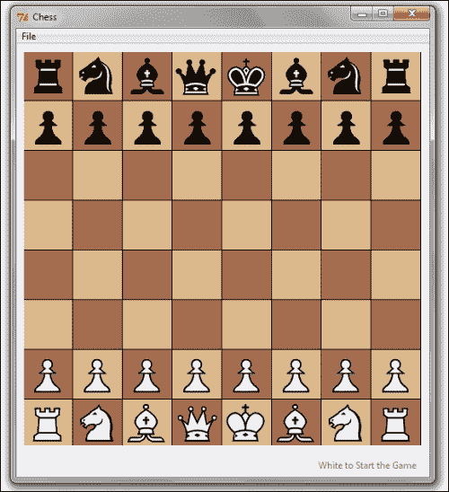
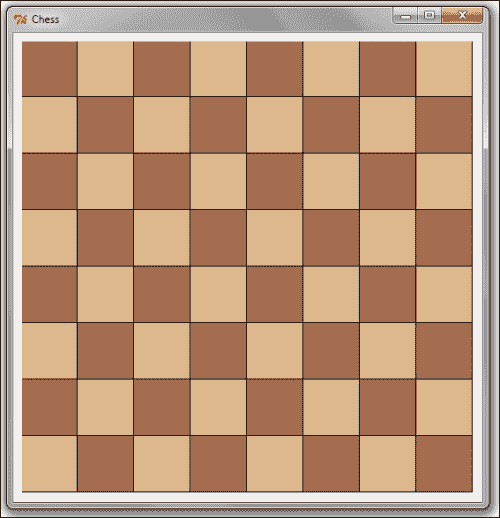
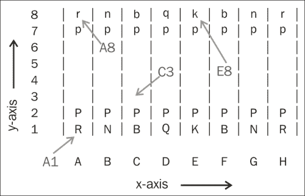
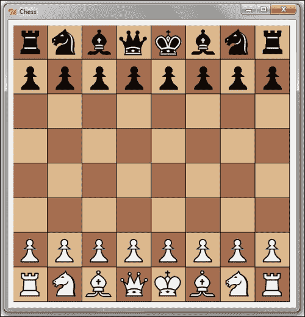
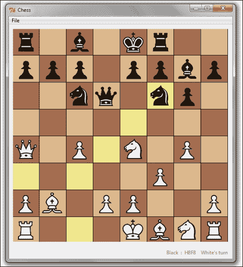
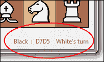

# 第四章：棋盘游戏

现在我们将在 Tkinter 中构建一个棋盘游戏。你不需要成为棋艺大师就能构建这个游戏。如果你曾经玩过棋类游戏，并且了解控制棋子的基本规则，你就准备好编写这个程序了。

如果你从未玩过棋类游戏，并且不知道基本规则，你最好在开始编程这个应用程序之前先从互联网上阅读这些规则。

# 任务简报

在其最终形式中，我们的棋盘游戏将看起来像以下截图：



我们的棋盘游戏将强制执行适用于棋类游戏的所有标准规则。一些高级规则和功能留给你作为练习来完成。

## 为什么它如此出色？

在构建我们的棋盘游戏应用的过程中，我们接触到了 Tkinter Canvas 小部件，这被认为是 Tkinter 中最强大和最灵活的功能之一。

正如你在项目过程中将看到的，Canvas 小部件是一个真正的强大工具，对于 GUI 程序员来说非常有用。它可以用来使用线条、矩形、椭圆和多边形绘制复合对象。它还将允许你以极高的精度在画布上定位图像。

此外，Canvas 小部件将允许你将任何其他小部件（如标签、按钮、刻度和其他小部件）放置在其上。这使得它成为容纳各种不同 GUI 程序小部件的理想容器。

除了学习 Canvas 小部件外，你还将了解如何使用 Python 内置类型来结构化你的数据。你还将被介绍到涉及选择相关对象并将它们按适当的粒度组织到类和模块中的概念。

随着应用程序的发展，我们还介绍了几个你将在各种应用程序开发项目中经常使用的 Python 模块。

## 你的高目标

以下是这个项目的关键目标：

+   如何将程序结构化为模型和视图组件

+   如何用期望的符号表示问题域

+   探索 Tkinter Canvas 小部件的灵活性和强大功能

+   Canvas 坐标、对象 ID 和标签的基本用法

+   如何处理 Tkinter photo image 类不支持的新图像格式

+   GUI 程序中逻辑层和表示层之间的典型交互

## 任务清单

在我们的程序中，我们需要处理 PNG 图像。Tkinter photo image 类和其他 Python 标准库不支持 PNG 处理。我们将使用**Python Imaging Library**（**PIL**）来渲染 PNG 文件。

要安装 PIL 包，请访问：

[`www.pythonware.com/products/pil/`](http://www.pythonware.com/products/pil/)

如果你正在 Windows x64（64 位）或 MacOSX 机器上工作，你可能需要安装并使用 Pillow，它是 PIL 的替代品，从：

[`www.lfd.uci.edu/~gohlke/pythonlibs/#pillow`](http://www.lfd.uci.edu/~gohlke/pythonlibs/#pillow)

在你安装了包之后，转到你的 Python 交互式提示符并输入：

`>>from PIL import ImageTk`

如果没有错误信息执行，你就准备好制作棋类应用了。

# 构建我们的程序结构

我们的所有先前项目都结构化为一个单独的文件。然而，随着程序复杂性的增加，我们需要将我们的程序分解为模块和类结构。

大型应用程序的开发通常从记录**软件需求规格说明书**（**SRS**）开始。这通常随后是使用几个建模工具对结构进行图形表示，例如类、组合、继承和信息隐藏。这些工具可以是流程图、**统一建模语言**（**UML**）、数据流图、维恩图（用于数据库建模）以及几种其他工具。

当问题域不是很清晰时，这些工具非常有用。然而，如果你曾经玩过棋类游戏，你对问题域非常熟悉。此外，我们的棋类程序可能被归类为中等规模程序，跨越几百行代码。因此，让我们跳过这些视觉工具，直接进入实际程序设计。

## 准备起飞

在这个迭代中，我们决定我们程序的整体结构。

在面向对象编程（OOP）的真正精神中，让我们首先列出我们将在程序中遇到的物体类型。直观地看一个棋盘告诉我们，我们有两组对象需要处理：

+   **棋盘**：它是一个 8 x 8 的方格棋盘，有交替着色的方格

+   **棋子**：它们是国王、王后、主教、骑士、车和兵

随着我们继续前进，我们可能会遇到也可能不会遇到其他对象。但我们肯定会遇到这两种对象。因此，无需进一步延迟，让我们在我们的项目文件夹中创建两个名为`chessboard.py`和`pieces.py`的文件。（见*代码文件夹 4.01*）

我们将使用这两个文件来定义相应的类，以保持与这两个对象相关的逻辑。请注意，这些文件将不会显示棋盘或其棋子；它将保留所有与棋盘和棋子相关的逻辑。在编程术语中，这通常被称为**模型**。

棋盘和棋子的实际显示将保存在一个单独的文件中，该文件将处理与程序相关的所有视图。

### 小贴士

将逻辑与表示分离的规则不仅应该用于决定你的文件结构，还应该在定义文件内的方法时应用。

每次你编写一个方法时，都尽量将其表示与逻辑分离。如果你发现一个方法混合了逻辑和表示，重构你的代码以分离这两个部分。避免将表示和逻辑耦合到同一个方法中。

将表示层（视图）与逻辑（模型）分开是一个好主意。因此，我们将创建一个名为 `gui.py` 的新文件来编写程序的所有可见组件，包括所有小部件。此文件将主要负责生成视图。

### 注意

除了模型和视图文件外，许多程序还保留一个单独的控制器文件，以将程序的行为方面与逻辑（模型）和展示（视图）解耦。这种结构分离被称为 **模型-视图-控制器**（**MVC**）编程风格。

然而，我们的棋类程序只有一个事件需要处理：移动棋子的鼠标点击。仅为此事件创建一个单独的控制器可能会使程序比应有的更复杂。

考虑到这种限制，我们将从名为 `GUI` 的单个类中处理展示（视图）和事件处理（控制器）。

现在我们已经准备好了文件结构，让我们开始编码。首先，让我们为棋盘编写 `GUI` 类，如下面的截图所示。因为这与视图部分相关，所以我们将此代码放在 `gui.py` 文件中。



## 启动推进器

### 第 1 步 – 创建 GUI 类

我们首先创建一个 `GUI` 类，并分配诸如行、列、方格颜色以及每个方格的像素尺寸等属性。我们初始化 `GUI` 类以创建棋盘的画布，如下所示（见 *代码 4.01 gui.py*）：

```py
from Tkinter import *
class GUI():
  rows = 8
  columns = 8
  color1 = "#DDB88C"
  color2 = "#A66D4F"
  dim_square = 64
  def __init__(self, parent):
       self.parent = parent
       canvas_width = self.columns * self.dim_square
       canvas_height = self.rows * self.dim_square
       self.canvas = Canvas(parent, width=canvas_width, height=canvas_height, background="grey")
       self.canvas.pack(padx=8, pady=8)
 self.draw_board()

```

代码的描述如下：

+   我们创建一个类 `GUI` 来处理视图文件的渲染。`GUI` 类的 `init` 方法在对象实例化时立即被调用。`init` 方法设置所需大小的 Canvas 小部件。这个画布将作为我们所有对象的容器，例如棋盘方格区域和最终的棋子。

+   我们使用了 Canvas 小部件作为容器，因为它为我们提供了处理基于事件精确位置坐标的任务的能力，例如鼠标按钮的点击。

+   然后 `init` 方法调用 `draw_board()` 方法，该方法负责创建类似棋盘的交替颜色的方块。

### 第 2 步 – 创建棋盘

现在，我们使用 `canvas.create_rectangle` 方法在棋盘上绘制方格，交替填充我们之前定义的两种颜色。

```py
def draw_board(self):
     color = self.color2
     for r in range(self.rows):
       color = self.color1 if color == self.color2 
	   else self.color2 # alternating between two colors
       for c in range(self.columns):
             x1 = (c * self.dim_square)
             y1 = ((7-r) * self.dim_square)
             x2 = x1 + self.dim_square
             y2 = y1 + self.dim_square
             self.canvas.create_rectangle(x1, y1, x2, y2, fill=color, tags="area")
             color = self.color1 if color == self.color2 else self.color2
```

代码的描述如下：

+   要在棋盘上绘制方格，我们使用 `canvas.create_rectangle()` 方法，该方法根据矩形的对角线相对角（上左和下右边缘的坐标）绘制矩形。

+   我们需要针对棋盘进行操作。因此，我们在棋盘上创建的每个方格上添加一个名为 `area` 的标签。这与我们在文本编辑程序中进行的文本小部件的标记类似。

### 第 3 步 – 创建 Tkinter 主循环

现在，我们将创建 Tkinter 主循环，如下所示：

```py
def main():
     root = Tk()
     root.title("Chess")
     gui = GUI(root)
     root.mainloop()
if __name__ == "__main__":
     main()
```

代码的描述如下：

+   在类外部，我们有一个主方法，它设置 Toplevel 窗口，启动 Tkinter 主循环，实例化一个`GUI`对象，并调用`drawboard()`方法。

### 注意

Tkinter Canvas 小部件允许你在指定的坐标位置绘制线条、椭圆形、矩形、圆弧和多边形形状。你还可以指定各种配置选项，例如填充、轮廓、宽度和这些形状的其它几个选项。

此外，Canvas 小部件还有一个巨大的方法列表和可配置选项。要获取与画布相关的完整选项列表，请在 Python 交互式 shell 中输入以下内容：

```py
>>> import Tkinter
>>> help(Tkinter.Canvas) 

```

你还可以在核心 Python 安装目录中访问 Tkinter 的文档。文档位于`path\to\python\installation\Doc\Python273`。

这是一个编译的 HTML 帮助文件。在帮助文件中搜索 Tkinter，你可以获得一个全面的参考，其中包含所有小部件的详细信息。

## 目标完成 – 简短总结

这完成了我们的第一次迭代。在这个迭代中，我们决定了象棋程序类的结构。我们创建了一个`GUI`类，并添加了通常期望棋盘拥有的属性。

我们也尝到了 Canvas 小部件的第一口。我们创建了一个空白画布，然后使用`canvas.create_rectangle`方法添加方形区域来创建我们的棋盘。

我们还创建了 Tkinter 主循环，并在主循环中从`GUI`类创建了一个对象。现在，如果你运行`code 4.01 gui.py`，你会看到一个棋盘。

## 分类情报

Canvas 小部件附带丰富的方法和可配置选项。然而，关于 Canvas 小部件有三个重要事项需要注意：

+   它使用坐标系来指定小部件上对象的位置。坐标以像素为单位测量。画布的左上角坐标为（0,0）。

+   它提供了添加图像和绘制基本形状（如线条、圆弧、椭圆形和多边形）的方法。

+   绘制在 Canvas 小部件上的对象通常通过分配一个 ID 或标签来处理。

# 结构化棋盘和棋子相关数据

在我们的鼓程序中，我们决定使用一种符号来描述一组节奏模式。然后我们可以存储（pickle）这种节奏模式符号，并在以后重新生成（unpickle）。象棋程序也是如此。它也需要一种合适的符号来描述棋子和它们在棋盘上的位置。

## 准备起飞

我们可以为表示棋子和它们的棋盘位置定义自己的符号，但结果证明，已经存在一个全球公认、简单、紧凑且标准的棋盘表示符号。这种符号称为**福斯思-爱德华斯符号**（**FEN**），可在[`en.wikipedia.org/wiki/Forsyth-Edwards_Notation`](http://en.wikipedia.org/wiki/Forsyth-Edwards_Notation)找到。

我们可能已经决定定义我们的符号，但在这里我们更倾向于不重新发明轮子。

棋局起始位置的 FEN 记录写作如下：

`rnbqkbnr/pppppppp/8/8/8/8/PPPPPPPP/RNBQKBNR w KQkq - 0 1`

关于这种记法的要点如下：

+   这种记法显示了一个棋局的六个记录。每个记录之间由一个空格分隔。

+   第一条记录显示了棋盘上棋子的位置。棋盘的每一行（等级）都由一个由 `/` 符号分隔的区域表示。

+   在第一条记录中，每个棋子由一个单独的字母识别（兵 = `p`，马 = `n`，象 = `b`，车 = `r`，后 = `q` 和王 = `k`）。

+   白方棋子使用大写字母表示（`PNBRQK`），但黑方棋子使用小写字母表示（`pnbrqk`）。

+   没有棋子的方格使用数字 `1` 到 `8`（空白方格的数量）表示。

+   第二条记录表示玩家的回合。字母 `w` 表示白方回合，字母 `b` 表示黑方回合。

+   第三条记录 `KQkq` 表示王车易位功能是否可用。如果没有王车易位，则为 `-`。否则，它包含一个或多个字母：`K`（白方可以王车易位至王翼），`Q`（白方可以王车易位至后翼），`k`（黑方可以王车易位至王翼），以及/或 `q`（黑方可以王车易位至后翼）。

+   第四条记录 `_` 捕获游戏中的吃过路兵细节。我们将在游戏中不实现王车易位和吃过路兵功能，因此现在可以安全地忽略这两个记录。

+   第五条记录跟踪棋局的半回合时钟。半回合时钟跟踪自上次兵的推进或上次捕获以来的回合数。这用于确定是否可以根据五十回合规则要求和棋。

+   第六条记录跟踪全回合数，每次黑方走棋后增加 1。这用于跟踪游戏的总长度。

如前所述的记法可以如下沿 x 轴和 y 轴表示：



使用这种记法，我们可以准确地表示棋盘上的任何特定方格。

棋子的颜色取决于字母是否为小写（黑色）或大写（白色）。

因此 **A1** 表示棋盘上最底部的最左方方格。目前，它被一个白方车占据。**C3** 位置目前为空，**E8** 有黑方王，**A8** 有黑方车。

依照这些规则，以下是如何在以下指示性回合后更改 FEN 记法（[`en.wikipedia.org/wiki/Forsyth-Edwards_Notation`](http://en.wikipedia.org/wiki/Forsyth-Edwards_Notation)）：

第一步棋后，兵从 `P` 移至 `e4`：

`rnbqkbnr/pppppppp/8/8/4P3/8/PPPP1PPP/RNBQKBNR b KQkq e3 0 1`

第二步棋后，兵从 `p` 移至 `c5`：

`rnbqkbnr/pp1ppppp/8/2p5/4P3/8/PPPP1PPP/RNBQKBNR w KQkq c6 0 2`

第三步棋后，将棋子从 `N` 移至 `f3`：

`rnbqkbnr/pp1ppppp/8/2p5/4P3/5N2/PPPP1PPP/RNBQKB1R b KQkq - 1 2`

我们所有的棋盘和棋子相关逻辑都将使用前面的表示法。因此，在我们继续编写游戏代码之前，完全理解这个表示法非常重要。

既然我们已经清楚地了解了前面的表示法，让我们将这个表示法应用到表示我们的棋盘上。关键思想是，给定一个 FEN 表示法，我们应该能够在棋盘上表示它。

## 启动推进器

### 第 1 步 - 创建棋子超类

现在，让我们首先编写`pieces.py`的模型代码（见*代码 4.02 pieces.py*），通过创建一个`Piece`超类如下：

```py
class Piece():
  def __init__(self, color):
     if color == 'black':
        self.shortname = self.shortname.lower()
     elif color == 'white':
        self.shortname = self.shortname.upper()
     self.color = color

  def ref(self, board):
   ''' Get a reference of chessboard instance'''
     self.board = board
```

代码描述如下：

+   我们定义了一个名为`Piece`的类。它的`__init__`方法，接受一个颜色作为参数。根据我们的 FEN 表示法，它将黑棋的简称改为小写字母，白棋的简称改为大写字母。颜色处理在超类`Piece`中完成，因为它是对所有棋子的共同特性。

+   我们还定义了一个名为`ref`的方法。它的唯一目的是获取棋盘实例到对象命名空间中，以便棋盘和棋子可以交互。我们需要这个方法，因为我们的棋子最终将与棋盘交互。因此，我们需要在`Piece`类中有一个棋盘实例的引用。

### 第 2 步 - 为所有棋子创建单独的子类

我们可以创建所有棋子的单独子类如下：

```py
class King(Piece):    shortname = 'k'
class Queen(Piece):    shortname = 'q'
class Rook(Piece):    shortname = 'r'
class Knight(Piece):    shortname = 'n'
class Bishop(Piece):    shortname = 'b'
class Pawn(Piece):   shortname = 'p'
```

代码描述如下：

+   我们为棋盘上找到的每个棋子定义了类。因此，我们有名为`King`、`Queen`、`Rook`、`Knight`、`Bishop`和`Pawn`的类。这些类是从`Piece`超类派生出来的。

+   目前，这些子类仅定义了与它们相关的简称。我们将在以后扩展这些子类，以定义和强制执行每个这些棋子的移动规则。

### 第 3 步 - 定义一个返回棋子实例的方法

我们将定义一个方法来返回棋子实例，如下所示：

```py
import sys
SHORT_NAME = {'R':'Rook', 'N':'Knight', 'B':'Bishop', 'Q':'Queen', 'K':'King', 'P':'Pawn'}
def create_piece(piece, color='white'):
     if piece in (None, ''): return
     if piece.isupper(): color = 'white'
     else: color = 'black'
     piece = SHORT_NAME[piece.upper()]
     module = sys.modules[__name__]
     return module.__dict__piece
```

代码描述如下：

+   代码定义了一个字典，其中包含棋子的简称和全名作为键值对。

+   然后，我们定义了一个名为`piece`的方法，它接受一个棋子简称并返回相应的棋子实例。

### 第 4 步 - 创建 Board 类

现在我们已经准备好了一个基本的棋子模型，让我们编写代码来处理它们在棋盘上的放置。我们在`chessboard.py`中编写这个模型（见*代码 4.02 chessboard.py*），通过创建一个`Board`类如下：

```py
import pieces
import re
START_PATTERN = 'rnbqkbnr/pppppppp/8/8/8/8/PPPPPPPP/RNBQKBNR w 0 1'
class Board(dict):
     y_axis = ('A', 'B', 'C', 'D', 'E', 'F', 'G', 'H')
     x_axis = (1,2,3,4,5,6,7,8)
     def __init__(self, patt = None):
        self.process_notation(START_PATTERN)
```

代码描述如下：

+   我们的代码从定义根据前面讨论的 FEN 表示法开始的起始模式。我们不包含王车易位和过路兵相关的表示法，因为我们不会在我们的程序中编写这些。

+   然后，我们将`Board`类定义为内置`dict`类型的子类。这是因为我们将存储模式作为字典。

+   然后，我们将`x_axis`和`y_axis`定义为棋盘的非不可变元组。

+   我们类的`__init__`方法只是简单地调用类的`process_notation`方法。

### 第 5 步 – 在棋盘上显示给定 FEN 表示的棋子

对于给定 FEN 表示的`Board`上的棋子，可以按以下方式显示：

```py
def process_notation(self, patt):
   self.clear()
   patt = patt.split('')
      # expand_whitespaces blanks

def expand_whitespaces(match): return '' * int(match.group(0))
   patt[0] = re.compile(r'\d').sub(expand_whitespaces, patt[0])
   for x, row in enumerate(patt[0].split('/')):
     for y, alphabet in enumerate(row):
        if alphabet == '': continue
        xycoord = self.alpha_notation((7-x,y))
        self[xycoord] = pieces.piece(alphabet)
        self[xycoord].ref(self)
     if patt[1] == 'w': self.player_turn = 'white'
     else: self.player_turn = 'black'
```

代码的描述如下：

+   `process_notation`方法的任务是首先将表示为整数的空白空间扩展为实际空间。它使用 Python 内置的正则表达式模块（`re`）来扩展给定 FEN 表示中的空白空间。

+   代码`expand_whitespaces`做了一些对于 Python 初学者可能有点棘手的事情。它将每个数字替换为相应数量的空白空间，这样你就可以假设空白空间是一个空方格。然后，它将 FEN 表示转换为对应于每个棋子的 x 和 y 字母数字坐标的字符串。为此，它调用另一个名为`alpha_notation`的方法，该方法在第 7 步中定义。

+   最后两行记录了玩家的回合。

### 第 6 步 – 检查给定坐标是否在棋盘上

最后，让我们通过定义一个方法来检查给定坐标是否在棋盘上结束这次迭代，如下所示（参见 *代码 4.02 chessboard.py*）：

```py
def is_on_board(self, coord):
     ifcoord[1] < 0 or coord[1] > 7 or coord[0] < 0 or coord[0] >7:
        return False
     else: return True
```

### 第 7 步 – 生成字母和数字表示

我们需要一种方法来将棋子的 x 和 y 坐标转换为字母等效表示，例如，A1，D5，E3，等等。因此，我们定义了`alpha_notation`方法如下：

```py
def alpha_notation(self,xycoord):
     if not self.is_on_board(xycoord): return
     return self.y_axis[xycoord[1]] + str(self.x_axis[xycoord[0]])
```

类似地，我们定义了一个方法，它接受 x,y 坐标作为输入，并返回其等效的数字表示，如下所示：

```py
def num_notation(self, xycoord):
     return int(xycoord[1])-1, self.y_axis.index(xycoord[0])
```

### 第 8 步 – 检查棋盘上占据的位置

在每次移动之前，我们需要检查给定颜色所有棋子所占据的所有位置。这不仅是为了计算有效移动，而且为了确保其他棋子的移动不会对国王造成将军。

因此，让我们定义一个方法来返回给定颜色所占据的坐标列表（参见 *代码 4.02 chessboard.py*），如下所示：

```py
def occupied(self, color):
     result = []
     for coord in self:
        if self[coord].color == color:
           result.append(coord)
           return result
```

### 第 9 步 – 处理错误和异常

为了处理错误和异常，我们定义了一个名为`ChessError`的自定义异常类，所有其他异常都将后来子类化到它，如下所示：

```py
classChessError(Exception): pass
```

## 目标完成 – 简短总结

在这次迭代中，我们创建了一个基本的`Piece`类和每个在棋盘上找到的棋子的虚拟子类。单个棋子类从父`Piece`类继承。我们在父类中处理颜色识别，因为这是我们需要为所有子类做的事情。

然后，我们定义了我们的`Board`类，并添加了一些我们每次在棋盘上移动棋子时都需要的某些方法。

我们还没有在棋盘上显示这些棋子。我们将在下一次迭代中这样做。

# 在棋盘上添加棋子

我们现在有一个将 FEN 符号转换为基于坐标的扩展表示的代码。现在，让我们编写代码来在棋盘上显示棋子，基于给定的 FEN 符号，如下截图所示：



## 准备起飞

我们将使用 PNG 图像来显示棋盘上的棋子。我们在名为 `pieces_image` 的文件夹中为每个棋子提供了 PNG 图像。图像是通过在每个棋子的短名后附加棋子的颜色来命名的。例如，黑后保存为 `qblack.png`，白骑士保存为 `nwhite.png`。

我们选择 PNG 而不是 GIF，因为与 GIF 不同，PNG 允许使用 alpha 通道（可变透明度）、在不同平台上自动进行伽玛校正以及颜色校正。

然而，`TkinterPhotoImage` 类不支持 PNG 格式。因此，我们使用 PIL 来处理 PNG 文件。

### 小贴士

目前，`TkinterPhotoImage` 类仅支持 GIF、PPM、XBM 和 PGM 格式的图像。这些格式目前都不流行。不幸的是，只有当 Tcl/Tk 开始支持这些格式时，才能添加对新格式的支持。

到那时，使用 PIL 可能会很有用，因为它支持包括 PNG、JPEG、GIF、TIFF 和 BMP 在内的几乎所有流行的图像格式。

除了在 Tkinter 中显示图像外，PIL 模块还可以用于图像处理，例如尺寸变换、格式转换、缩略图创建以及其他几个图像操作需求。

我们将在我们的视图文件 `gui.py` 中添加显示棋子的代码。

## 点火推进器

### 第 1 步 – 导入 PIL

由于我们将使用 PIL 模块来显示棋子的 PNG 图像，我们首先按照以下方式从 PIL 模块导入 `ImageTk`：

```py
from PIL import ImageTk
```

### 第 2 步 – 定义在棋盘上绘制棋子的方法

在棋盘上添加棋子的代码如下（见 *代码 4.03: gui.py*）：

```py
def draw_pieces(self): 
   self.canvas.delete("occupied")
   for xycoord, piece in self.chessboard.iteritems():
     x,y = self.chessboard.num_notation(xycoord)
     if piece is not None:
        filename = "../pieces_image/%s%s.png" % (piece.shortname.lower(), piece.color)
        piecename = "%s%s%s" % (piece.shortname, x, y)
        if (filename not in self.images):
           self.images[filename] = ImageTk.PhotoImage(file=filename)
        self.canvas.create_image(0,0, image=self.images[filename], tags=(piecename, "occupied"), anchor="c")
        x0 = (y * self.dim_square) + int(self.dim_square/2)
        y0 = ((7-x) * self.dim_square) + int(self.dim_square/2)
        self.canvas.coords(piecename, x0, y0)
```

代码的描述如下：

+   我们首先从 PIL 模块导入 `ImageTk`。我们需要这个来处理 PNG 图像。

+   我们定义了我们的 `draw_pieces()` 方法，其作用是为给定的 FEN 符号在棋盘上绘制棋子。因为 FEN 符号对所有类方法都是可用的，所以我们不需要将其作为参数传递。

+   请记住，我们已经创建了一个棋盘实例，它产生一个字典，包含一个棋子的基于坐标的位置和相应的棋子实例作为键值对。

+   我们使用 `iteritems()` 遍历字典，并将 x 和 y 坐标字符串分解为相应的基于 x 和 y 的数字表示法。

+   如果给定坐标存在棋子，我们使用 `canvas.create_image()` 将其添加到 Canvas 小部件中。

+   在这里需要注意的最重要的事情之一是我们为每个棋子添加了两个标签：棋子的名称和一个静态字符串名称 `occupied`。标签是在 Canvas 小部件内操作对象时可以使用的最重要的工具。

+   接下来的两行创建了给定棋盘大小的 x，y 坐标。

+   方法的最后一行使用`self.canvas.coords`将棋子放置在计算出的坐标上。

+   最后，我们需要调用我们新定义的方法。我们从`show()`方法中这样做，以调用棋子。

### 注意

让我们通过分析这里使用的两个与 canvas 相关的方

**canvas.create_image(x, y, *options)**: `create_image`方法接受两个参数，用于指定图像的位置坐标 x 和 y。在坐标之后，你可以指定任意数量的选项值对。在我们的例子中，我们使用了`anchor="c"`选项来保持图像在中心。

**canvas.coords(tag/id, x0, y0, x1, y1, ..., xn, yn)**: `coords()`方法决定或修改与给定标签或 ID 关联的项目坐标。如果没有指定坐标，它将返回一个元组，指定由给定标签或 ID 引用的项目坐标。如果指定了坐标，则它们将替换命名项目的当前坐标。如果标签或 ID 关联到多个项目，则只使用第一个项目。

随着我们不断深入，我们将更详细地了解 Canvas 小部件。然而，查看 Canvas 小部件的交互式帮助或可用方法和可配置选项列表可能很有用。

## 目标完成 – 简短总结

我们现在的代码可以接受 FEN 表示法，并在棋盘上显示对应的棋子图像。如果你修改了 FEN 表示法，棋盘上的棋子将相应地改变位置。

在这个过程中，我们熟悉了 Canvas 小部件的基本功能。我们还看到了两个与 canvas 相关的创建图像和更改坐标的方法。

最后，我们看到了如何通过使用 PIL 模块来处理 Tkinter 不支持格式的图像，从而克服 Tkinter 在图像处理上的限制。

# 强制棋子移动规则

在我们让这些棋子在鼠标点击时移动之前，我们需要知道给定棋子可以移动多少格。我们需要为每个棋子强制执行规则。

## 准备起飞

在我们开始编写规则之前，让我们快速回顾一下国际象棋的规则：

+   国王只能向任意方向移动一格：向上、向下、向侧和斜向。

+   后可以沿任意一个直线方向移动：向前、向后、向侧或斜向；只要不经过自己的棋子，可以尽可能远地移动。

+   车可以移动任意远，但只能向前、向后和向侧移动

+   象可以移动任意远，但只能斜着走。

+   马与其他棋子不同。它们必须先沿一个方向移动两格，然后以 90 度角再移动一格，遵循 L 的形状。马也是唯一可以跳过其他棋子的棋子。

+   兵向前移动，但可以斜向捕获。兵每次只能向前移动一个方格，除了它们的第一次移动，那时它们可以向前移动两个方格。兵只能斜向捕获它们前方的一个方格。

这里最重要的是，我们需要跟踪每个棋子的三个常见事物：

+   它的当前位置

+   移动允许的方向

+   棋子可以移动的距离

## 启动推进器

### 第 1 步 – 从`Pieces`超类跟踪所有棋子的可用移动

因为前面的东西可以在一个中心位置跟踪，让我们在我们的超类`Pieces`中定义一个名为`moves_available`的方法，用于跟踪所有棋子的可用移动，如下所示：

```py
    def moves_available(self, pos, diagonal, orthogonal, distance):
        board = self.board
        allowed_moves = []
        orth  = ((-1,0),(0,-1),(0,1),(1,0))
        diag  = ((-1,-1),(-1,1),(1,-1),(1,1))
        piece = self
        beginningpos = board.num_notation(pos.upper())
        if orthogonal and diagonal:
            directions = diag+orth
        elif diagonal:
            directions = diag
        elif orthogonal:
            directions = orth

        for x,y in directions:
            collision = False
            for step in range(1, distance+1):
                if collision: break
                dest = beginningpos[0]+step*x, beginningpos[1]+step*y
                if self.board.alpha_notation(dest) not in board.occupied('white') + board.occupied('black'):
                    allowed_moves.append(dest)
                elif self.board.alpha_notation(dest) in board.occupied(piece.color):
                    collision = True
                else:
                    allowed_moves.append(dest)
                    collision = True
        allowed_moves = filter(board.is_on_board, allowed_moves)
        return map(board.alpha_notation, allowed_moves)
```

代码的描述如下：

+   该方法接受四个参数：棋子的当前位置，两个表示是否允许棋子进行对角线和正交移动的布尔值，以及棋子一次可以移动的方格数。

+   根据这些参数，该方法收集给定棋子的所有允许移动到一个列表中，`allowed_moves`。

+   收集了所有移动方向后，代码会遍历所有位置以检测任何可能的碰撞。如果检测到碰撞，它会跳出循环，否则会将坐标添加到`allowed_moveslist`中。

+   `collision = True`是我们跳出循环的方式。我们需要在两种情况下跳出循环：当目的地被占用时，以及当它没有被占用，并且我们已经将那个位置添加到我们的可能移动列表中。

+   第二行最后过滤掉那些超出棋盘的移动，最后一行返回所有允许移动的等效棋盘表示。

### 注意

定义了我们的`moves_available`方法后，我们现在只需从不同的棋子类中调用它。（见 *代码 4.04: pieces.py*）。

### 第 2 步 – 国王、皇后、车和象类的规则

棋盘上的国王、皇后、车和象有相对简单的规则来规范它们。这些棋子只能在其移动方向上捕获。

此外，它们可以在正交、对角或这两种方向的组合中移动。我们已经在我们的超类中编码了`moves_available`来处理这些方向。

因此，决定它们的可用移动只需将正确的参数传递给我们的`moves_available`方法。

```py
class King(Piece):
   shortname = 'k'
   def moves_available(self,pos):
     return super(King, self).moves_available(pos.upper(), True, True, 1)
class Queen(Piece):
   shortname = 'q'
   def moves_available(self,pos):
     return super(Queen,self).moves_available(pos.upper(), True, True, 8)
class Rook(Piece):
   shortname = 'r'
   def moves_available(self,pos):
     return super(Rook, self).moves_available(pos.upper(), False, True, 8)
class Bishop(Piece):
   shortname = 'b'
   def moves_available(self,pos):
     return super(Bishop,self).moves_available(pos.upper(), True, False, 8)
```

### 第 3 步 – 马的规则

马是一种不同的生物，因为它既不沿正交也不沿对角移动。它还可以跳过其他棋子。

因此，让我们从我们的`Knight`类中重写`moves_available`方法。

`Knight`类定义如下（见 *代码 4.04: pieces.py*）：

```py
class Knight(Piece):
   shortname = 'n'
   def moves_available(self,pos):
     board = self.board
     allowed_moves = []
     beginningpos = board.num_notation(pos.upper())
     piece = board.get(pos.upper())
     changes=((-2,-1),(-2,1),(-1,-2),(-1,2),(1,-2),(1,2),(2,-1),(2,1))
     for x,y in changes:
        dest = beginningpos[0]+x, beginningpos[1]+y
        if(board.alpha_notation(dest) not in board.occupied(piece.color)):
           allowed_moves.append(dest)
        allowed_moves = filter(board.is_on_board, allowed_moves)
     return map(board.alpha_notation, allowed_moves)
```

代码的描述如下：

+   该方法与我们的上一个超类方法非常相似。然而，与超类方法不同，变化被表示为捕获一个方向上的两个方格的移动，然后在一个 90 度的角度上再移动一次。

+   与超级类不同，我们不需要跟踪碰撞，因为马可以跳过其他棋子。

### 第 4 步 - 兵的规则

兵也有独特的移动方式，它向前移动，但可以向前方对角线捕获。

我们同样可以在 `Pawn` 类内部覆盖 `moves_available` 类，如下所示（见 *代码 4.04: pieces.py*）：

```py
class Pawn(Piece):
    shortname = 'p'
    def moves_available(self, pos):
        board = self.board        
        piece = self
        if self.color == 'white':
            startpos, direction, enemy = 1, 1, 'black'
        else:
            startpos, direction, enemy = 6, -1, 'white'
        allowed_moves = []
        prohibited = board.occupied('white') + board.occupied('black')
        beginningpos   = board.num_notation(pos.upper())
        forward = beginningpos[0] + direction, beginningpos[1]
        # Can a piece move forward?
        if board.alpha_notation(forward) not in prohibited:
            allowed_moves.append(forward)
            if beginningpos[0] == startpos:
                # If pawn in starting pos allow a double move
                double_forward = (forward[0] + direction, forward[1])
                if board.alpha_notation(double_forward) not in prohibited:
                    allowed_moves.append(double_forward)
        # Check for Capturing Moves Available
        for a in range(-1, 2, 2):
            attack = beginningpos[0] + direction, beginningpos[1] + a
            if board.letter_notation(attack) in board.occupied(enemy):
                allowed_moves.append(attack)
        allowed_moves = filter(board.is_on_board, allowed_moves)
        return map(board.alpha_notation, allowed_moves)
```

代码的描述如下：

+   我们首先根据兵是黑色还是白色分配变量 `startpos`、`direction` 和 `enemy`。

+   与我们之前的 `moves_allowed` 方法类似，此方法也收集所有允许的走法到一个空白列表 `allowed_moves` 中。

+   我们随后通过连接所有黑白棋子占据的方格列表来收集所有禁止的走法。

+   我们定义了一个列表 `forward`，它保存了兵当前位置前方一个方格的位置。

+   如果前方有棋子，兵不能向前移动。如果前方位置没有被禁止，该位置将被添加到我们的 `allowed_moves` 列表中。

+   兵可以从起始位置向前移动两步。我们检查当前位置是否是起始位置，如果是，我们将双重移动添加到我们的 `allowed_moves` 列表中。

+   兵只能向前方对角线相邻的棋子进行捕获。因此，我们分配一个变量 `attack` 来跟踪棋盘上的对角线相邻位置。如果对角线相邻的方格被敌人占据，该位置符合添加到我们的列表 `allowed_moves` 中。

+   我们随后过滤我们的列表，移除所有可能超出棋盘边界的位置。

+   最后一行返回所有允许的走法，作为一个对应字母标记的列表，正如我们在所有之前的定义中所做的那样。

## 目标完成 - 简短总结

在这次迭代中，我们编写了与棋盘上棋子移动相关的规则执行逻辑。

# 棋盘逻辑

在我们允许棋子在鼠标点击时移动之前，我们必须记录棋盘上所有可能的移动选项。在每次移动时，我们还需要检查这是否是给定玩家的合法回合，以及提议的走法是否不会导致对国王的将军。

现在，对国王的将军可能不仅来自移动的棋子，还可能来自棋盘上任何其他棋子，这是由于这种移动造成的。因此，在每一步之后，我们需要计算对手所有棋子的可能走法。

因此，我们需要两种方法来：

+   跟踪一个玩家所有可用走法

+   验证是否有对国王的将军

让我们把前面方法的代码添加到我们的 `Board` 类中。（见 *代码 4.05: chessboard.py*）

## 启动推进器

### 第 1 步：跟踪所有可用走法

跟踪一个玩家所有可用走法的代码如下：

```py
def all_moves_available(self, color):
   result = []
   for coord in self.keys():
     if (self[coord] is not None) and self[coord].color == color:
        moves = self[coord].moves_available(coord)
        if moves: result += moves
   return result
```

代码的描述如下：

+   我们已经在之前的迭代中编写了我们的`moves_available`方法。该方法简单地遍历字典中的每个项，并将给定颜色的每个棋子的`moves_available`结果追加到名为`result`的列表中。

### 第 2 步：获取国王当前位置

在我们编写验证国王是否受将军的方法之前，我们首先需要知道国王的确切位置。让我们定义一个方法来获取国王的当前位置，如下（见*代码 4.05：chessboard.py*）：

```py
def position_of_king(self, color):
   for pos in self.keys():
     if is instance(self[pos], pieces.King) and self[pos].color == color:
        return pos
```

上述代码简单地遍历字典中的所有项。如果给定位置是`King`类的实例，它简单地返回其位置。

### 第 3 步：验证国王是否受到将军

最后，我们定义了一种方法来验证国王是否受到对手的将军，如下所示：

```py
def king_in_check(self, color):
   kingpos =  self.position_of_king(color)
   opponent = ('black' if color =='white' else 'white')
   for pieces in self.iteritems():
     if kingpos in self.all_moves_available(opponent):
        return True
     else:
        return False
```

代码的描述如下：

+   我们首先获取国王的当前位置和对手的颜色。

+   然后，我们遍历对手所有棋子的所有可能走法。如果国王的位置与所有可能走法中的任何一个位置重合，则国王处于将军状态，我们返回`True`，否则返回`False`。

## 目标完成 - 简短总结

这完成了我们的迭代目标。我们现在可以检查游戏中某个特定点的所有可用走法。我们还可以验证国王是否受到对手团队的将军。

# 使棋盘功能化

现在我们已经设置了所有棋子和棋盘相关的验证规则，让我们现在给我们的棋盘注入活力。在这个迭代中，我们将使我们的棋盘游戏完全功能化。

在两名玩家之间的游戏中，我们的棋盘将类似于以下截图所示：



本迭代的目的是在左键点击时移动棋子。当玩家点击一个棋子时，我们的代码应首先检查这是否是该棋子的合法回合。

在第一次点击时，选择要移动的棋子，并在棋盘上突出显示该棋子的所有允许走法。第二次点击应该在目标方格上。如果第二次点击在有效的目标方格上，则棋子应从源方格移动到目标方格。

我们还需要编写捕获棋子和将军国王的事件。其他需要跟踪的属性包括捕获的棋子列表、半回合时钟计数、全回合数计数以及所有先前走法的记录。

## 启动推进器

### 第 1 步 - 更新 FEN 表示法变化后的棋盘

到目前为止，我们已经有能力将原始 FEN 表示法显示在棋盘上。然而，我们需要一种方法，可以接受任何 FEN 表示法并更新棋盘上的显示。我们定义了一个名为`show()`的新方法来完成此操作，如下所示：

```py
def show(self, pat):
        self.clear()
        pat = pat.split(' ')
        def expand(match): return ' ' * int(match.group(0))
        pat[0] = re.compile(r'\d').sub(expand, pat[0])
        for x, row in enumerate(pat[0].split('/')):
            for y, letter in enumerate(row):
                if letter == ' ': continue
                coord = self.alpha_notation((7-x,y))
                self[coord] = pieces.create_piece(letter)
                self[coord].place(self)
        if pat[1] == 'w': self.player_turn = 'white'
        else: self.player_turn = 'black'
        self.halfmove_clock = int(pat[2])
        self.fullmove_number = int(pat[3])
```

### 第 2 步 - 绑定鼠标点击事件

棋子需要在鼠标点击时移动。因此，我们需要跟踪鼠标点击事件。我们只需要跟踪在 Canvas 小部件上的鼠标点击。因此，我们将在 `init` 方法中创建 Canvas 小部件的代码之后立即添加一个事件处理器到我们的 `GUI` 类中，如下所示（见 *代码 4.06: gui.py, __init__ 方法*）：

```py
self.canvas.bind("<Button-1>", self.square_clicked)
```

这将把左键点击事件绑定到一个新方法 `square_clicked`。然而，在我们坐下来定义这个方法之前，让我们暂停一下，思考我们需要跟踪程序的一些属性。

### 第 3 步 – 添加属性以跟踪所选棋子和剩余棋子

首先，我们需要跟踪每次移动后棋盘上剩余的所有棋子。因此，我们将创建一个名为 pieces 的字典来跟踪这一点。我们还需要跟踪鼠标点击所选的棋子名称。我们将其存储在一个属性 `selected_piece` 中。当玩家点击一个棋子时，我们需要突出显示该棋子的所有有效移动。我们将该棋子的所有有效移动存储在一个名为 `focused` 的列表中。在我们定义任何方法之前，让我们在 `GUI` 类中定义这三个属性。我们修改 `GUI` 类以包括这些属性，如下所示：

```py
class GUI:
   pieces = {}
   selected_piece = None
   focused = None
   #other attributes from previous iterations
```

### 第 4 步 – 识别点击的方格

我们将编写 `square_clicked` 方法，该方法由我们之前定义的事件处理器调用。

该方法的预期功能有两方面。我们应该能够定位被点击棋子的坐标。第一次点击应选择一个给定的棋子。第二次点击应将棋子从源方格移动到目标方格。

该方法定义为如下（见 *代码 4.06: gui.py*）：

```py
def square_clicked(self, event):
   col_size = row_size = self.dim_square
   selected_column = event.x / col_size
   selected_row = 7 - (event.y / row_size)
   pos = self.chessboard.alpha_notation((selected_row, selected_column))
   try:
     piece = self.chessboard[pos]
   except:
     pass
   if self.selected_piece:
      self.shift(self.selected_piece[1], pos)
      self.selected_piece = None
      self.focused = None
      self.pieces = {}
      self.draw_board()
      self.draw_pieces()
   self.focus(pos)
   self.draw_board()
```

代码的描述如下：

+   代码的第一部分计算被点击棋子的坐标。根据计算出的坐标，它将相应的字母表示存储在一个名为 `pos` 的变量中。

+   然后尝试将变量 piece 分配给相应的棋子实例。如果点击的方格上没有棋子实例，它将简单地忽略点击。

+   方法的第二部分检查这是否是第二个点击，目的是将棋子移动到目标方格。如果是第二个点击，它将调用 `shift` 方法，传入源坐标和目标坐标作为其两个参数。

+   如果位移成功，它将所有之前设置的属性重置为其原始的空值，并调用我们的 `draw_board` 和 `draw_pieces` 方法来重新绘制棋盘和棋子。

+   如果这是第一次点击，它将调用一个名为 `focus` 的方法来突出显示第一次点击的所有可用移动，然后调用绘制新棋盘。

在编写 `square_clicked` 方法的所需功能时，我们在其中调用了几个新的方法。我们需要定义这些新方法。

### 第 5 步 – 获取源和目标位置

我们从 `square_clicked` 方法中调用了 `shift` 方法。以下实现的 shift 代码仅负责收集移位操作所需的必要参数。

在保持逻辑与展示分离的精神下，我们在这个视图类中不处理移位相关的规则。相反，我们将 `shift` 方法的任务从 `GUI` 类委托给 `Board` 类。一旦移位的逻辑或验证被实现，棋子移位的可见部分再次在我们的 `GUI` 类的 `draw_board` 方法中发生。

虽然一开始这可能看起来有些过度，但将逻辑和展示结构化在不同的层中对于代码的重用、可扩展性和可维护性非常重要。

代码如下：

```py
def shift(self, p1, p2):
   piece = self.chessboard[p1]
   try:
     dest_piece = self.chessboard[p2]
   except:
     dest_piece = None
   if dest_piece is None or dest_piece.color != piece.color:
     try:
        self.chessboard.shift(p1, p2)
     except:
        pass
```

代码首先检查目标位置是否存在棋子。如果目标位置没有棋子，它将调用来自 `chessboard.py` 的 `shift` 方法。

### 第 6 步 – 收集要突出显示的移动列表

我们还从 `square_clicked` 方法中调用了 focus 方法。这个方法的目的在于将给定棋子的所有可能移动收集到一个名为 `focused` 的列表中。实际的可移动性聚焦发生在我们 GUI 类的 `draw_board` 方法中。

代码如下（见代码 4.06：gui.py）：

```py
def focus(self, pos):
   try:
     piece = self.chessboard[pos]
   except:
     piece=None
   if piece is not None and (piece.color == self.chessboard.player_turn):
     self.selected_piece = (self.chessboard[pos], pos)
     self.focused = map(self.chessboard.num_notation, (self.chessboard[pos].moves_available(pos)))
```

### 第 7 步 – 修改 draw_board 以突出显示允许的移动

在 `square_clicked` 方法中，我们调用了 `draw_board` 方法来处理重新绘制或更改棋子的坐标。我们当前的 `draw_board` 方法还没有配备处理这个功能，因为我们最初只设计它来提供一个空白棋盘。让我们首先修改我们的 `draw_board` 方法来处理这个功能，如下（见 *代码 4.06：gui.py*）：

```py
highlightcolor ="khaki"
def draw_board(self):
    color = self.color2
    for row in range(self.rows):
     color = self.color1 if color == self.color2 else self.color2
     for col in range(self.columns):
        x1 = (col * self.dim_square)
        y1 = ((7-row) * self.dim_square)
        x2 = x1 + self.dim_square
        y2 = y1 + self.dim_square
 if(self.focused is not None and (row, col) in self.focused):
 self.canvas.create_rectangle(x1, y1, x2, y2, fill=self.highlightcolor, tags="area")
        else:
           self.canvas.create_rectangle(x1, y1, x2, y2, fill=color, tags="area")
           color = self.color1 if color == self.color2 else self.color2
 for name in self.pieces:
 self.pieces[name] = (self.pieces[name][0], self.pieces[name][1])
 x0 = (self.pieces[name][1] * self.dim_square) + int(self.dim_square/2)
 y0 = ((7-self.pieces[name][0]) * self.dim_square) + int(self.dim_square/2)
 self.canvas.coords(name, x0, y0)
 self.canvas.tag_raise("occupied")
 self.canvas.tag_lower("area")

```

代码的描述如下：

+   在现有的 `draw_board` 方法中添加的内容在上面的代码中突出显示。我们首先定义了一个名为 `highlightcolor` 的属性，并为其分配了一个颜色。

+   代码的本质修改是为了处理点击。高亮显示代码的第一部分用不同的颜色突出显示所有可用的移动。

+   高亮显示代码的第二部分更改了棋子实例的坐标，以便位于新的坐标上。注意使用 `canvas.coords(name, x0, y0)` 来更改坐标。

+   最后两行更改了由标签指定的选项的优先级。

### 注意

如果画布上的对象被标记为多个标签，则堆栈顶部的标签定义的选项具有更高的优先级。然而，你可以通过使用 `tag_raise(name)` 或 `tag_lower(name)` 来更改标签的优先级。

要获取与画布相关的选项的完整列表，请参考使用命令行中的 `help(Tkinter.Canvas)` 对 Canvas 小部件的交互式帮助。

### 第 8 步 – 定义用于保持游戏统计信息的属性

由于为我们的棋子添加了移动性，我们需要向我们的 `Board` 类添加以下新属性以保持游戏统计信息，如下（见 *代码 4.06：chessboard.py*）：

```py
Class Board(dict):
   #other attributes from previous iteration
   captured_pieces = { 'white': [], 'black': [] }
   player_turn = None
   halfmove_clock = 0
   fullmove_number = 1
   history = []
```

### 第 9 步 – 预移动验证

为了这个，我们将编写 `Board` 类的 `shift` 方法，如下所示（见 *代码 4.06: chessboard.py*）：

```py
    def shift(self, p1, p2):
        p1, p2 = p1.upper(), p2.upper()
        piece = self[p1]
        try:
            dest  = self[p2]
        except:
            dest = None
        if self.player_turn != piece.color:
            raise NotYourTurn("Not " + piece.color + "'s turn!")
        enemy = ('white' if piece.color == 'black' else 'black' )
        moves_available = piece.moves_available(p1)
        if p2 not in moves_available:
            raise InvalidMove
        if self.all_moves_available(enemy):
            if self.is_in_check_after_move(p1,p2):
                raise Check
        if not moves_available and self.king_in_check(piece.color):
            raise CheckMate
        elif not moves_available:
            raise Draw
        else:
            self.move(p1, p2)
            self.complete_move(piece, dest, p1,p2)
```

代码的描述如下：

+   代码首先检查目标位置上是否存在棋子。

+   然后它检查是否是玩家的有效回合。如果不是，它会抛出一个异常。

+   然后检查移动是否被提议到有效位置。如果玩家试图将棋子移动到无效位置，它会抛出一个相应的异常。

+   然后它检查国王是否受到攻击。为了做到这一点，它调用一个名为 `is_in_check_after_move` 的方法，该方法定义如下：

    ```py
    def is_in_check_after_move(self, p1, p2):
        temp = deepcopy(self)
        temp.unvalidated_move(p1,p2)
        returntemp.king_in_check(self[p1].color)
    ```

+   此方法创建对象的深拷贝，并在临时拷贝上尝试移动棋子。作为备注，集合的浅拷贝是集合结构的拷贝，而不是元素的拷贝。当你进行浅拷贝时，两个集合现在共享单个元素，所以一个地方的改变也会影响另一个。相比之下，深拷贝会复制一切，包括结构和元素。我们需要创建棋盘的深拷贝，因为我们想在移动之前检查国王是否做出有效移动，并且我们想在不以任何方式修改原始对象状态的情况下做到这一点。

+   在临时拷贝上执行移动后，它检查国王是否受到攻击以返回 `True` 或 `False`。如果临时棋盘上的国王受到攻击，它会抛出一个异常，不允许在我们的实际棋盘上进行这样的移动。

+   类似地，它检查是否有可能发生将死或平局，并相应地抛出异常。

+   如果没有抛出异常，它最终会调用一个名为 `move` 的方法，该方法实际上执行移动操作。

### 第 10 步 – 棋子的实际移动

棋子的实际移动可以编码如下：

```py
def move(self, p1, p2):
   piece = self[p1]
   try:
     dest = self[p2]
   except:
     pass

   del self[p1]
   self[p2] = piece
```

### 第 11 步 – 移动后的更新

实际执行移动后，它调用另一个名为 `complete_move` 的方法，按照以下方式更新游戏统计信息：

```py
    def complete_move(self, piece, dest, p1, p2):
        enemy = ('white' if piece.color == 'black' else 'black' )
        if piece.color == 'black':
            self.fullmove_number += 1
        self.halfmove_clock +=1
        self.player_turn = enemy
        abbr = piece.shortname
        if abbr == 'P':
            abbr = ''
            self.halfmove_clock = 0
        if dest is None:
            movetext = abbr +  p2.lower()
        else:
            movetext = abbr + 'x' + p2.lower()
            self.halfmove_clock = 0
        self.history.append(movetext)
```

前面的方法执行以下任务：

+   跟踪统计信息，例如移动次数、半回合时钟

+   改变玩家的回合

+   检查是否有棋子被移动以重置半回合时钟

+   最后，将最后一步移动添加到我们的历史列表中

### 第 12 步 – 处理异常和错误的类

最后，我们添加了以下空类以处理我们抛出的各种异常：

```py
class Check(ChessError): pass
classInvalidMove(ChessError): pass
classCheckMate(ChessError): pass
class Draw(ChessError): pass
classNotYourTurn(ChessError): pass
```

## 目标完成 – 简短总结

让我们总结一下在这个迭代中我们所做的事情

+   我们首先将鼠标点击事件绑定到一个名为 `square_clicked` 的方法上。

+   我们添加了属性来跟踪选中的棋子和棋盘上剩余的棋子。

+   然后我们识别了被点击的方块，随后收集了起始和目标位置。

+   我们还收集了所选棋子的所有可能移动列表，并将它们突出显示。

+   然后我们定义了属性以保持重要的游戏统计信息。

+   然后我们进行了一些预移动验证，接着在棋盘上实际移动棋子。

+   在一个棋子被移动后，我们更新了关于游戏的统计数据。

+   在这次迭代中，我们定义了几个异常。我们只是定义了空类来静默处理它们。

我们的国际象棋游戏现在功能齐全。现在，两位玩家可以在我们的应用程序上玩一局棋。

# 添加菜单和信息框架

虽然我们的游戏已经完全可用，但让我们给它添加两个小功能。

让我们在**文件** | **新游戏**下添加一个顶部菜单项。当点击时，它应该将棋盘重置为新游戏。

此外，让我们在底部添加一个小的框架来显示与游戏相关的信息，例如最后一步移动、下一个回合、检查、和棋以及将军。



## 启动推进器

### 第 1 步 – 创建顶部菜单

我们的 Canvas 小部件是在`GUI`类的`__init__`方法中设置的。

让我们修改它以包括顶部菜单，如下所示（见 *代码 4.06: gui.py*）：

```py
def __init__(self, parent, chessboard):
   self.chessboard = chessboard
   self.parent = parent
 self.menubar = Menu(parent)
 self.filemenu = Menu(self.menubar, tearoff=0)
 self.filemenu.add_command(label="New Game", command=self.new_game)
 self.menubar.add_cascade(label="File", menu=self.filemenu)
 self.parent.config(menu=self.menubar)

```

### 第 2 步 – 添加底部框架以显示游戏统计信息

让我们也添加一个底部框架来显示游戏统计信息，如下所示（见 *代码 4.06: gui.py*）：

```py
self.btmfrm = Frame(parent, height=64)
self.info_label = Label(self.btmfrm, text="   White to Start the Game  ", fg=self.color2)
self.info_label.pack(side=RIGHT, padx=8, pady=5)
self.btmfrm.pack(fill="x", side=BOTTOM)
```

对现有初始化方法的修改被突出显示。代码是自我解释的。我们在所有之前的项目中都做了类似的事情。

### 第 3 步 – 从文件 | 新游戏菜单开始新游戏

**文件** | **新游戏**菜单项调用我们的`new_game()`方法。`new_game()`的代码如下（见 *代码 4.06: gui.py*）：

```py
def new_game(self):
    self.chessboard.show(chessboard.START_PATTERN)
    self.draw_board()
    self.draw_pieces()
    self.info_label.config(text="White to Start the Game", fg='red')
```

### 第 4 步 – 每次移动后更新底部标签

最后，在每次移动后，我们希望更新标签以显示移动的详细信息以及关于下一位玩家回合的信息。我们还想更新框架以显示在移动尝试过程中可能发生的任何错误或异常。因此，我们相应地修改了`GUI`类的`shift`方法，如下所示以完成此更新：

```py
def shift(self, p1, p2):
   piece = self.chessboard[p1]
   try:
     dest_piece = self.chessboard[p2]
   except:
     dest_piece = None
   if dest_piece is None or dest_piece.color != piece.color:
     try:
        self.chessboard.shift(p1,p2)
 exceptchessboard.ChessError as error:
 self.info_label["text"] = error.__class__.__name__
 else:
 turn = ('white' if piece.color == 'black' else 'black')
 self.info_label["text"] = '' + piece.color.capitalize() +"  :  "+ p1 + p2 + '' + turn.capitalize() + '\'s turn'

```

代码的描述如下所示：

+   我们对`shift`方法的修改被突出显示。我们只是将`Board`类的`shift`方法包含在一个 try except 块中。如果位移成功，标签小部件将更新以显示当前移动和下一位玩家的回合。

+   如果位移不成功，无论是由于无效的移动还是对国王的检查，相应的错误类名将显示在带有`error.__class__.__name__`的标签上。

## 目标完成 – 简短总结

这完成了我们这次迭代的目标。现在，在棋局过程中，应用程序会向玩家显示一些有用的信息。

我们还添加了一个**文件** | **新菜单**项，可以用来将棋盘重置到起始位置。

# 任务完成

我们现在来到了项目的尾声。

那么，我们在这里取得了什么成果呢？让我们列出从这个项目中获得的所有关键学习点：

+   如何将程序结构化为模型和视图组件

+   如何用期望的符号表示问题域

+   探索 Tkinter Canvas 小部件的多样性和强大功能

+   Canvas 坐标、对象 ID 和标签的基本用法

+   如何处理新的图像格式

+   在 GUI 程序中逻辑层和表示层之间的典型交互

从下一个项目开始，我们将更详细地查看不同的 Tkinter 小部件。

# 热门挑战

这里有两个热门挑战供您挑战：

1.  添加并实现以下菜单项：

    +   **文件**| **保存**：保存游戏状态

    +   **文件**| **打开**：加载之前保存的游戏

    +   **编辑**| **撤销**：允许玩家撤销已进行的回合

    +   **编辑**|**重做**：允许玩家重做任何之前的撤销操作

    +   **查看**| **移动历史**：打开一个新的 Toplevel 窗口以显示游戏的历史

    +   **关于**| **关于**：显示有关游戏的信息

1.  在游戏中实现王车易位和过路兵的功能。
