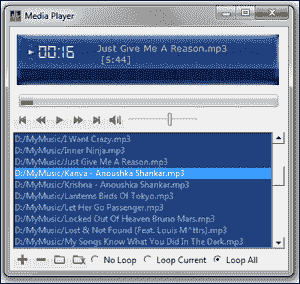
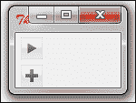
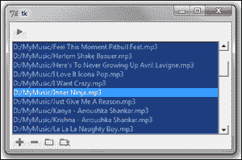
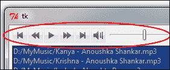
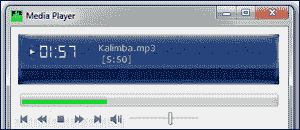
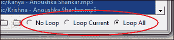
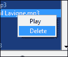
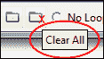

# 第五章：音频播放器

现在我们来构建一个音频媒体播放器！

我们的应用程序应具备典型媒体播放器的功能，如播放、暂停、快进、快退、下一曲、静音、音量更新等。我们的播放器应允许听众轻松访问其本地驱动器中的单个媒体文件或媒体库。

此外，我们的播放器还应能够扫描整个目录以查找歌曲，并相应地自动更新包含所有支持格式的播放列表。所有这些以及更多。

让我们开始我们的项目！

# 任务简报

完成后，我们的播放器将如下所示：



我们的音频播放器将能够播放 AU、MP2、MP3、OGG/Vorbis、WAV 和 WMA 格式的音频文件。它将拥有您期望的小型媒体播放器所具有的所有控件。

我们将使用跨平台模块来编写我们的代码。这将确保我们的播放器可以在 Windows、Mac OS X 和 Linux 平台上播放音频文件。

## 为什么它如此出色？

除了在测试代码的同时能够听到好音乐，这个项目还将向我们介绍与 Tkinter GUI 编程相关的几个新想法。

首先，我们将与新的小部件集一起工作，例如 Listbox、Progressbar、Scale、Radiobutton 和 PMW Balloon 小部件。

我们还研究了 Canvas 小部件在容纳和精确定位其中其他小部件方面的强大功能。

在项目的后期，我们将查看一个名为 PMW 的 Tkinter 扩展。我们还讨论了一些我们没有使用但值得在 GUI 编程工具箱中拥有的 Tkinter 扩展。

虽然这不是本书的主题，但我们还简要了解了使用 Python 进行音频编程的世界，这必然涉及到如何与外部库和 API 实现协同工作。

## 你的高目标

为这个项目概述的一些关键目标包括：

+   巩固我们之前的经验和从之前的项目中学习

+   与新的小部件集一起工作，例如 Listbox、Scale、Progressbar 和 Radiobutton

+   了解 Canvas 小部件的更多功能

+   与外部 API 协同工作

+   了解一些常见的 Tkinter 扩展，如 PMW、WCK、Tix 等

+   在开发的每个阶段学习如何重构代码

## 任务清单

我们将使用以下额外的库来完成这个项目：

### Pyglet 音频处理

窗口用户可以从以下位置下载并安装 pyglet 的二进制包：

[`www.lfd.uci.edu/~gohlke/pythonlibs/#pyglet`](http://www.lfd.uci.edu/~gohlke/pythonlibs/#pyglet)

Mac OS X 和 Linux 用户应从以下源 ZIP 文件下载并编译 pyglet：

[`www.pyglet.org/download.html`](http://www.pyglet.org/download.html)

当从源代码安装时，你还需要将`AVbin.dll`添加到你的当前程序目录中。DLL 文件的链接也可以在先前的下载页面找到。

### PMW Tkinter 扩展

我们将使用**Python mega widgets**（**PMW**）Tkinter 扩展来编写一些在核心 Tkinter 中不可用的小部件功能。PMW 必须从源包安装到所有平台。该包可以从以下网址下载：

[`sourceforge.net/projects/pmw/files/Pmw/Pmw.1.3.3/`](http://sourceforge.net/projects/pmw/files/Pmw/Pmw.1.3.3/)

### 注意

我们在我们的应用程序中使用版本 1.3.3，其他版本的 PMW 可能不与我们的代码兼容。

### 额外字体

这是一个可选组件，仅用于增强我们的样式。我们安装了一个字体来模仿数字时钟的字体。我们在这个项目中使用了以下字体：

[`www.dafont.com/ds-digital.font`](http://www.dafont.com/ds-digital.font)

在您安装了 pyglet 和 PMW 之后，从您的 Python shell 中执行以下命令：

```py
>>> import pyglet, Pmw

```

如果命令执行没有错误信息，您就可以开始编写您的媒体播放器代码了。

# 获取音频播放

我们项目的第一个目标是添加播放音频文件的能力。像往常一样，我们将把音频相关逻辑与我们的 GUI 部分分开。因此，我们创建了两个单独的文件：`main-gui.py`和`player.py`。（见*代码 5.01*）

## 准备起飞

我们首先编写一个基本的 GUI，其中包括一个播放按钮（在播放和停止功能之间切换）和一个添加文件按钮。在这个迭代的最后，我们应该能够加载一个文件，播放它，并停止它。到本节结束时，我们的应用程序将看起来像以下截图：



## 启动推进器

### 第 1 步 – 创建 GUI 类

让我们创建`GUI`类。`main-gui.py`的代码如下（见*代码 5.01 main-gui.py*）：

```py
from Tkinter import *
import tkFileDialog
import player
class GUI:
   def __init__(self, player):
     self.player = player
     player.parent = self
     self.root = Tk()
     self.create_button_frame()
     self.create_bottom_frame()
     self.root.mainloop()
```

代码的描述如下：

+   我们创建了一个名为`GUI`的类，并在其`__init__`方法中运行 Tkinter 主循环。

+   我们将把实际的音频操作逻辑，如播放、暂停、倒带、快进等，放在一个稍后定义的单独类中。然而，因为我们希望这些功能在`GUI`类中可用，所以我们把从那个`player`类实例化的对象作为参数传递给我们的`__init__`方法。

+   在`__init__`方法中的`self.player = player`这一行确保了`player`类实例在整个`GUI`类中可用。

+   就像我们要从`GUI`类中访问`player`类的属性和方法一样，我们也希望`GUI`类的方法和属性在`player`类中可用。因此，我们在`__init__`方法中使用`player.parent = self`这一行。这创建了对 self 的引用，因此可以使用`parent.attribute`和`parent.method()`语法在`player`类内部评估所有其方法。

+   使用这两行代码，我们确保了`GUI`类的所有属性都将可用在`player`类中，反之亦然；`player`类的所有属性也将可用在`GUI`类中。

### 第 2 步 – 创建播放按钮和添加文件按钮

因此，我们添加了两个方法：`create_button_frame`和`create_bottom_frame`。`create_button_frame`方法包含播放按钮，而`create_bottom_frame`方法包含添加文件按钮，如下所示：

```py
def create_button_frame(self):
    buttonframe= Frame(self.root)
    self.playicon = PhotoImage(file='../icons/play.gif')
    self.stopicon = PhotoImage(file='../icons/stop.gif')
    self.playbtn=Button(buttonframe, text ='play', image=self.playicon, borderwidth=0, command=self.toggle_play_pause)
   self.playbtn.image = self.playicon
   self.playbtn.grid(row=3, column=3)
   buttonframe.grid(row=1, pady=4, padx=5)

def create_bottom_frame(self):
    bottomframe = Frame(self.root)
    add_fileicon = PhotoImage(file='../icons/add_file.gif')
   add_filebtn=Button(bottomframe, image=add_fileicon, borderwidth=0, text='Add File', command=self.add_file)
   add_filebtn.image = add_fileicon
   add_filebtn.grid(row=2, column=1)
   bottomframe.grid(row=2, sticky='w', padx=5)
```

代码的描述如下：

+   每个按钮都与一个`TkinterPhotoImage`类图标相关联。我们已经在名为`icons`的单独文件夹中提供了一套图标。

### 第 3 步 – 在播放和暂停之间切换

播放按钮有一个命令回调，用于在播放和停止功能之间切换按钮。`toggle`方法定义如下：

```py
def toggle_play_pause(self):
    if self.playbtn['text'] =='play':
     self.playbtn.config(text='stop', image=self.stopicon)
     self.player.start_play_thread()
   elif self.playbtn['text'] =='stop':
     self.playbtn.config(text ='play', image=self.playicon)
     self.player.pause()
```

代码的描述如下：

+   `toggle_play_pause`方法会在播放和暂停图标之间交替更改图标。它还会调用`player`类的`play`和`pause`方法来播放和暂停歌曲。

### 第 4 步 – 添加文件对话框

添加文件按钮打开`tkFileDialog`，将打开的文件与一个名为`currentTrack`的类属性相关联，如下所示：

```py
def add_file(self):
    tfile = tkFileDialog.askopenfilename(filetypes=[('All supported', '.mp3 .wav .ogg'), ('All files', '*.*')])
   self.currentTrack = tfile
```

### 第 5 步 – 创建播放器类

现在，让我们编写基本的`player`类代码。目前，我们只将播放和暂停功能添加到该类。我们的`player`类代码建立在 pyglet 库的基础上。

### 注意

Pyglet 提供了一个面向对象的接口，用于开发丰富的媒体应用程序，如游戏、音频和视频工具等。它是 Python 程序员在媒体处理方面的热门选择，因为它没有外部依赖，支持大量格式，并且可在所有主要操作系统上使用。

在我们继续之前，你可能想查看 pyglet 播放器的 API 文档，该文档可在以下位置找到：

[`www.pyglet.org/doc/api/pyglet.media.Player-class.html`](http://www.pyglet.org/doc/api/pyglet.media.Player-class.html)

文档告诉我们可以使用以下代码播放音频文件：

```py
myplayer= pyglet.media.Player()
source = pyglet.media.load(<<audio file to be played>>)
myplayer.queue(source)
myplayer.play()
pyglet.app.run()
```

我们将使用此代码片段来播放音频文件。因此，我们的`Player`类代码如下（见*代码 5.01 player.py*）：

```py
import pyglet
from threading import Thread
class Player():
   parent = None
   def play_media(self):
     try:
        self.myplayer= pyglet.media.Player()
        self.source = pyglet.media.load(self.parent.currentTrack)
        self.myplayer.queue(self.source)
        self.myplayer.play()
        pyglet.app.run()
     except:
        pass

   def start_play_thread(self):
     player_thread = Thread(target=self.play_media)
     player_thread.start()

   def pause(self):
     try:
        self.myplayer.pause()
        self.paused = True
     except: pass
```

代码的描述如下：

+   我们创建了一个名为`Player`的类，并将其父类初始化为`None`。回想一下，在我们的`GUI`类中，我们定义了一个引用`player.parent = self`，以便在`player`类内部评估我们的`GUI`类属性。

+   我们然后定义我们的`play_media`方法，该方法负责实际播放声音。该方法访问`GUI`类的`currentTrack`属性并尝试播放它。

+   虽然这段代码可以播放音频文件，但 pyglet 需要运行它自己的事件循环来播放音频。这意味着它将在播放完整个声音后，将控制权返回到我们的 GUI 主循环，如果在直接运行时，将会冻结 Tkinter 主循环。

+   因此，我们需要在单独的线程中调用播放方法。我们使用 threading 模块定义了一个名为`start_play_thread`的新方法，它简单地在一个单独的线程中调用我们的`play_media`方法，从而防止 GUI 冻结。

+   最后，我们定义了暂停方法，该方法可以暂停或停止当前播放的音频文件。Pyglet 不区分暂停和停止功能。因此，我们通常使用暂停命令来停止音频。

### 第 6 步 – 运行应用程序

我们最终通过创建一个`GUI`类的对象来运行应用程序。因为这个`GUI`类需要一个`player`类的对象，所以我们实例化了一个播放器对象，并将其作为参数传递给我们的`GUI`类，如下所示：

```py
if __name__ == '__main__':
   playerobj = player.Player()
   app = GUI(playerobj)
```

代码的描述如下所示：

+   代码的最后部分创建了一个我们尚未定义的`player`类的对象。`player`类将负责使用 pyglet 进行所有音频操作。

+   我们首先创建了一个`player`类的对象，并将其作为参数传递给我们的`GUI`类的`__init__`方法。这确保了`player`类的所有属性和方法都可以在`GUI`类中使用`player.attribute`和`player.method()`的语法在内部使用。

## 目标完成 – 简短总结

这完成了我们的第一次迭代。

在本节中，我们创建了一个`GUI`类，添加了一个在播放和暂停之间切换的按钮。我们还添加了一个按钮，使用`tkFileDialog`来添加文件。

我们还创建了一个`Player`类，该类使用 pyglet 来播放音频文件。文件在单独的线程中播放，以避免在播放音频时冻结 Tkinter 主循环。

最后，我们通过首先创建一个播放器对象，并将其作为参数传递给由我们的`GUI`类创建的另一个对象来运行我们的应用程序。

现在我们有一个功能齐全的音频播放器，你可以使用`tkFileDialog`加载单个文件。加载后，你可以按下播放按钮，音频文件开始播放。你可以通过点击播放按钮来停止音频，该按钮在播放和暂停功能之间切换。

# 添加播放列表

现在我们有了播放单个音频文件的能力，但如果一个音频播放器不支持播放列表，那它又是什么呢？

让我们在播放器中添加播放列表功能。一旦添加了播放列表，我们就需要相应地提供按钮来添加文件到播放列表，从播放列表中删除文件，以及从所选目录添加所有支持的文件，并能够一次性删除列表中的所有项目。

在这一迭代的最后，我们将有一个如下截图所示的播放器：



## 准备起飞

我们将使用 Tkinter Listbox 小部件来提供播放列表。让我们看看 Listbox 小部件的一些关键特性：

+   你创建一个 Listbox 就像创建任何其他小部件一样，如下所示：

    ```py
    mylist = ListBox(parent, **configurable options)
    ```

+   当您最初创建列表小部件时，它是空的。要将一行或多行文本插入列表小部件，您使用`insert()`方法，该方法需要两个参数：文本要插入的位置的索引以及要插入的实际字符串，如下所示：

    ```py
    mylist.insert(0, "First Item")
    mylist.insert(END, "Last Item")
    ```

+   `curselection()`方法返回列表中所有选中项的索引，而`get()`方法返回给定索引的列表项，如下所示：

    ```py
    mylist.curselection() # returns a tuple of all selected items
    mylist.curselection()[0] # returns first selected item
    mylist.get(1) # returns second item from the list
    mylist.get(0, END) # returns all items from the list
    ```

+   此外，列表小部件还有几个其他可配置的选项。要获取完整的列表小部件参考信息，请在您的 Python 交互式 shell 中输入以下内容：

    ```py
    >>> import Tkinter
    >>> help(Tkinter.Listbox)

    ```

## 启动推进器

### 第 1 步 – 添加一个空的列表小部件

让我们先添加一个空的列表小部件，如下所示（见*code 5.02 main-gui.py*）：

```py
def create_list_frame(self):
    list_frame = Frame(self.root)
    self.Listbox = Listbox(list_frame, activestyle='none', cursor='hand2', bg='#1C3D7D', fg='#A0B9E9', selectmode=EXTENDED, width=60, height =10)
   self.Listbox.pack(side=LEFT, fill=BOTH, expand=1)
   self.Listbox.bind("<Double-Button-1>", self.identify_track_to_play)
   scrollbar = Scrollbar(list_frame)
   scrollbar.pack(side=RIGHT, fill=BOTH)
   self.Listbox.config(yscrollcommand=scrollbar.set)
   scrollbar.config(command=self.Listbox.yview)
   list_frame.grid(row=4, padx=5)
```

代码的描述如下：

+   我们创建了一个新的框架，名为`list_frame`，用于存放我们的列表小部件。

+   在这个框架内，我们创建了一个列表小部件并设置了一些样式选项，例如背景颜色、前景颜色和鼠标光标。使用列表小部件选项`activestyle`设置活动行的样式，这意味着我们不想在选中项下划线。

+   `selectmode`选项配置为扩展。请参阅以下信息框以获取可用选项及其含义。我们将使用`EXTENDED`选择模式，因为尽管一次可以播放一个文件，但我们希望允许用户一次选择多个文件进行删除。

+   我们向列表小部件添加了一个滚动条，这与我们在文本编辑器项目中的做法类似。

+   我们将鼠标的双击绑定到另一个名为`identify_track_to_play`的方法。

### 注意

列表小部件提供了四种选择模式，使用`selectmode`选项如下：

`SINGLE`：它允许一次只选择一行。

`BROWSE`（默认模式）：它与`SINGLE`类似，但允许通过拖动鼠标移动选择。

`MULTIPLE`：它允许通过逐个点击项目进行多选。

`EXTENDED`：它允许使用*Shift*和*Control*键选择多个范围的项。

### 第 2 步 – 识别要播放的曲目

在第一次迭代中，我们的程序比较简单，因为我们只有一首歌要播放。然而，给定一个播放列表，现在我们必须确定从给定列表中需要播放哪首歌。

规则很简单。如果用户点击一首特定的歌曲，它就成为我们的选中曲目。如果用户没有做出选择并点击播放按钮，播放列表中的第一首歌曲应该被播放。用代码表示如下（见*code 5.02 main-gui.py*）：

```py
def identify_track_to_play(self, event=None):
   try:
     indx = int(self.Listbox.curselection()[0])
     if self.Listbox.get(indx) == "":
        self.del_selected()
     except:
        indx = 0
        self.currentTrack =self.Listbox.get(indx)
 self.player.start_play_thread()

```

### 第 3 步 – 向列表添加项目

现在我们有了列表小部件，并且可以通过双击来播放任何项目，让我们添加填充和从列表中删除项目的方法。

然而，在我们对列表进行任何修改之前，让我们首先定义一个名为`alltracks`的空列表来跟踪播放列表中的所有项目。在列表发生任何更改后，我们需要更新此列表，如下所示（见*code 5.02 main-gui.py*）：

```py
alltracks = []
```

我们在上一个部分中已经创建了一个`添加文件`方法。现在让我们稍作修改，以便选定的文件不会成为选定的曲目，而是被添加到播放列表中，如下所示（见*代码 5.02 main-gui.py*）：

```py
def add_file(self):
    filename = tkFileDialog.askopenfilename(filetypes=[('All supported', '.mp3 .wav'), ('.mp3 files', '.mp3'), ('.wav files', '.wav')])
    if filename:
      self.Listbox.insert(END, filename)
    self.alltracks = list(self.Listbox.get(0, END))
```

代码的描述如下列所示：

+   通过`tkFileDialog`选定的文件被插入到列表框的末尾，并且我们的属性`alltracks`被更新为 Listbox 小部件中的所有元素。

+   注意，`get()`方法返回一个包含所有项目的元组。因为元组是不可变的，所以我们通过使用`list`类型声明显式地将元组转换为列表。

### 第 4 步 – 从列表中删除项目

让我们添加一个新按钮来删除选定的文件。这添加到我们现有的`create_bottom_frame`方法中，如下所示（见*代码 5.02 main-gui.py*）：

```py
del_selectedicon = PhotoImage(file='../icons/del_selected.gif')
del_selectedbtn=Button(bottomframe, image=del_selectedicon, padx=0, borderwidth=0, text='Delete', command=self.del_selected)
del_selectedbtn.image = del_selectedicon
del_selectedbtn.grid(row=5, column=2)
```

此按钮有一个名为`del_selected`的方法的命令回调。`del_selected`的代码如下：

```py
def del_selected(self):
    whilelen(self.Listbox.curselection())>0:
      self.Listbox.delete(self.Listbox.curselection()[0])
    self.alltracks = list(self.Listbox.get(0, END))
```

如往常一样，我们在从 Listbox 小部件中删除项目后更新我们的`alltracks`列表。

现在，您可以从列表框中选择一个项目，然后点击删除按钮，从列表框中删除所有选定的项目。

### 第 5 步 – 向列表中添加多个项目

向播放列表中添加单个音频文件可能会变得繁琐。我们希望允许用户选择一个目录，并且我们的列表应该填充来自该目录的所有支持的媒体格式。

因此，我们添加了一个新的按钮，允许添加给定目录中的所有媒体文件。这也添加到我们现有的`create_bottom_frame`方法中，如下所示（见*代码 5.02 main-gui.py*）：

```py
add_diricon = PhotoImage(file='../icons/add_dir.gif')
add_dirbtn=Button(bottomframe, image=add_diricon, borderwidth=0, padx=0, text='Add Dir', command=self.add_dir)
add_dirbtn.image = add_diricon
add_dirbtn.grid(row=5, column=3)
```

我们需要使用`os`模块来获取所有支持的类型。让我们首先将`os`模块导入到当前命名空间中，如下所示：

```py
import os
```

现在相关的命令回调如下：

```py
  def add_dir(self):
     path = tkFileDialog.askdirectory()
     if path:
        tfileList = []
        for (dirpath, dirnames, filenames) in os.walk(path):
           for tfile in filenames:
              if tfile.endswith(".mp3") or tfile.endswith(".wav") or tfile.endswith(".ogg"):
                 tfileList.append(dirpath+"/"+tfile)
        for item in tfileList:
           self.listbox.insert(END, item)
        self.alltracks = list(self.listbox.get(0, END))
```

代码的描述如下列所示：

+   `add_dir`方法首先创建一个临时列表，`tfilelist`。

+   然后它遍历通过`tkFileDialog.askdirectory()`方法获取的所有文件名。如果它遇到支持的文件格式，它将文件追加到临时列表中。

+   然后它遍历`tfilelist`中的所有项目，将它们插入到我们的 Listbox 中。

+   最后，它使用新修改的列表中的所有项目更新我们的`alltracks`属性。

### 第 6 步 – 删除所有项目

最后，我们添加一个按钮来删除播放列表中的所有项目。相关的按钮添加到`create_bottom_frame`方法中，如下所示：

```py
delallicon = PhotoImage(file='../icons/delall.gif')
delallbtn = Button(bottomframe, image=delallicon, borderwidth=0, padx=0, text='Clear All', command=self.clear_list)
delallbtn.image = delallicon
delallbtn.grid(row=5, column=4)
```

现在它的相关命令回调如下：

```py
def clear_list(self):
    self.Listbox.delete(0, END)
    self.alltracks =list(self.Listbox.get(0, END))
```

## 目标完成 – 简短总结

这完成了我们的第二次迭代。

在这次迭代中，我们学习了如何使用 Listbox 小部件。特别是，我们学会了如何向 Listbox 小部件添加项目，向其中添加项目，从 Listbox 小部件中选择特定项目，以及从中删除一个或多个项目。

现在，您有一个可以添加和删除项目的播放列表。

Listbox 小部件在项目上双击鼠标按钮时有一个事件绑定。这个相关的事件回调函数选择被点击的项目，并将其发送到另一个线程进行播放。

在这个过程中，我们看到了在 Listbox 小部件上执行的一些常见操作。

# 向播放器添加更多控制

现在我们有了播放列表，我们需要确保歌曲按队列播放。我们还需要添加一些在音频播放器中通常可以看到的控制按钮，如“下一曲”、“上一曲”、“快进”、“回放”和“静音”按钮。我们还需要提供一个方法来更改播放音量。

在这个迭代结束时，我们的播放器在顶部按钮框架中会有以下额外的控制按钮：



pyglet API 文档为所有这些控制提供了简单的接口。为了您的参考，文档可在以下网址找到：

[`www.pyglet.org/doc/api/pyglet.media.Player-class.html`](http://www.pyglet.org/doc/api/pyglet.media.Player-class.html)

让我们从向我们的`Player`类添加处理这些方法的方法开始。

## 启动推进器

### 第 1 步 – 快进曲目

我们可以这样快进曲目（见 *代码 5.03 player.py*）：

```py
FWDREWNDTIME = 20
#time to seek ahead or backwards in seconds
def fast_fwd(self):
   try:
     current_time = self.myplayer.time
     self.myplayer.seek(current_time+FWDREWNDTIME)
   except:pass
```

### 第 2 步 – 回放曲目

我们可以这样回放曲目：

```py
def rewind(self):
   try:
     current_time = self.myplayer.time
     self.myplayer.seek(current_time-FWDREWNDTIME)
   except:pass
```

### 第 3 步 – 暂停曲目

我们可以这样暂停一个曲目：

```py
def pause(self):
   try:
     self.myplayer.pause()
     self.paused = True
   except: pass
```

### 第 4 步 – 设置播放音量

我们可以这样设置播放音量：

```py
def set_vol(self, vol):
   try:
     self.myplayer.volume = vol
   except:pass
```

### 第 5 步 – 静音和取消静音曲目

我们可以这样静音和取消静音曲目：

```py
def mute(self):
   try:
     self.myplayer.volume = 0.0
     self.parent.volscale.set(0.0)
   except:pass

def unmute(self):
   self.set_vol(self.vol)
   self.parent.volscale.set(0.3)
```

我们在这里不会详细讨论代码。为了实现这些功能，我们使用了 pyglet 的 API 文档，该文档可在以下网址找到：

[`www.pyglet.org/doc/api/pyglet.media.Player-class.html`](http://www.pyglet.org/doc/api/pyglet.media.Player-class.html)

你也可以通过在 Python 交互式外壳中输入这两行来访问 pyglet 媒体播放器类的文档：

```py
>>> import pyglet
>>> help (pyglet.media.Player)

```

### 注意

我们一直在程序中使用 try/except 块来隐藏来自`player`类的所有错误。

这可能不是最好的编程实践，但我们忽略所有`player`类的错误，以免偏离我们对 Tkinter 的讨论。

在正常情况下，你会使用不同的 except 块来处理所有不同类型的错误。

### 第 6 步 – 添加控制按钮

现在我们有了处理事件的后端代码，如快进、回放、音量更改、静音等，现在是时候向我们的`GUI`类添加每个这些控制的按钮了。我们将每个按钮链接到其相应的命令回调。

因此，我们修改我们的`create_button_frame`小部件以添加这些新控制按钮的按钮。

在我们之前的项目中已经添加了数百个按钮。因此，为了简洁起见，我们在这里不重复整个代码。相反，我们仅展示作为其样本之一的“上一曲目”按钮的实现，以及它是如何调用`player`类的`previous()`方法的关联命令回调（见 *代码 5.03 GUI.py*）：

```py
previcon = PhotoImage(file='../icons/previous.gif')
prevbtn=Button(buttonframe, image=previcon, borderwidth=0, padx=0, command=self.prev_track)
prevbtn.image = previcon
prevbtn.grid(row=3, column=1, sticky='w')
```

### 第 7 步 - 使用 ttk Scale 小部件更改音量

除了这些按钮外，我们还使用 ttk Scale 小部件允许用户更改音量。Tkinter 核心中的原生 Scale 小部件实现看起来相当过时，所以我们选择了 ttk Scale 小部件，它具有与核心 Tkinter Scale 小部件相同的可配置选项，如下所示：

```py
self.volscale = ttk.Scale(buttonframe, from_=0.0, to =1.0 , command=self.vol_update)
self.volscale.set(0.6)
self.volscale.grid(row=3, column=7, padx=5)
```

根据 pyglet 文档，播放音量必须指定为一个范围从`0.0`（无声音）到`1.0`（最大声音）的浮点数，我们的`updateVolume`方法就是基于这个。

这有一个附加的回调到`GUI`类中的另一个方法`vol_update`，它简单地将任务委托给`player`方法来处理音量变化。

```py
def vol_update(self, e):
    vol = float(e)
    self.player.set_vol(vol)
```

代码的描述如下：

+   pyglet 的`Player`类期望音量被指定为一个浮点数，但这里的命令接收到的 scale 的新值是一个字符串。因此，我们首先将其转换为浮点数，然后将其传递给`player`类的`set_vol`方法。

## 目标完成 - 简短总结

这完成了第二次迭代，我们在程序中添加了播放控制功能。

这一节更多的是关于坚持 pyglet 的 API 文档，并把它作为一个黑盒来信任它所承诺的功能：即能够播放和控制音频。

我们还在构建音量控制的实际演示中看到了如何使用 ttk Scale 小部件。

## 分类情报

当涉及到选择外部实现（就像我们在音频 API 中所做的那样）时，我们首先在以下位置搜索 Python 标准库：

[`docs.python.org/library/`](http://docs.python.org/library/)

由于标准库没有适合我们的合适包，我们将注意力转向 Python 包索引，看看是否存在另一个高级音频接口实现。Python 包索引位于：

[`pypi.python.org/`](http://pypi.python.org/)

幸运的是，我们遇到了几个音频包。在比较这些包与我们的需求以及看到其社区活跃度后，我们选择了 pyglet。虽然可以用几个其他包实现相同的程序，但复杂度各不相同。

### 小贴士

通常，你越深入协议堆栈，你的程序就会越复杂。

然而，在协议的较低层，你可以在增加学习曲线的成本下获得对实现的更精细控制。

例如，由于 pyglet 的`player`类没有区分暂停和停止功能，我们不得不完全放弃暂停功能，并接受一个更简单的实现，其中暂停和停止意味着相同。

为了更精细地控制音频源，我们不得不深入研究协议堆栈，但我们现在将避免这样做，以免偏离主题。

# 添加顶级显示控制台

在这个迭代中，我们将在玩家顶部添加一个显示控制台。这个控制台将显示音乐播放器的计时器。它还将显示当前播放的曲目。

我们还将编写一个进度条，它将显示当前播放曲目的进度。

在这个迭代的最后，我们玩家的顶部框架将看起来像以下截图：



## 准备起飞

我们需要精确地将计时器时钟文本和当前播放曲目文本放置在图像的顶部。

请记住，Canvas 小部件允许在内部以精确的坐标控制方式深度嵌套其他小部件。这正是我们想要显示控制台的方式。因此，我们将使用 Canvas 小部件作为控制台的容器。

## 启动推进器

### 第 1 步 – 创建顶部控制台和进度条

因此，我们在`GUI`类中定义了一个名为`create_console_frame`的新方法，它包含我们的图像、时钟文本和当前播放文本，以创建顶部控制台和进度条，如下所示（见*代码 5.04 GUI.py*）：

```py
def create_console_frame(self):
   consoleframe = Frame(self.root)
   self.canvas = Canvas(consoleframe, width=370, height=90)
   self.canvas.grid(row=1)
   photo = PhotoImage(file='../icons/glassframe.gif')
   self.canvas.image = photo
   self.console = self.canvas.create_image(0, 10, anchor=NW, image=photo)
   self.clock = self.canvas.create_text(32, 34, anchor=W, fill='#CBE4F6', font="DS-Digital 20", text="00:00")
   self.songname = self.canvas.create_text(115, 37, anchor=W, fill='#9CEDAC', font="Verdana 10", text='\"Currently playing: none [00.00] \"')
   self.progressBar = ttk.Progressbar(consoleframe, length =1, mode="determinate")
   self.progressBar.grid(row=2, columnspan=10, sticky='ew', padx=5)
   consoleframe.grid(row=1, pady=1, padx=0)
```

代码的描述如下：

+   代码定义了一个新的框架，`consoleframe`，并将所需高度和宽度的 Canvas 小部件添加到框架中。

+   我们使用`canvas.create_image`来添加背景图像。背景图像位于`icons`文件夹中。

+   我们使用`canvas.create_text`添加一个用于显示时钟的文本和一个用于显示当前播放曲目的文本。每个文本的期望位置都使用 x，y 坐标指定。

+   我们还指定了一个特殊的字体来显示我们的时钟。如果这个字体安装在了电脑上，文本将以指定的字体显示。如果字体未安装，则使用默认字体显示。

+   最后，我们显示一个 ttkProgressbar 小部件，它将用于显示曲目播放时的进度。我们使用进度条的确定模式，因为我们想显示相对于整个长度的完成情况。目前，曲目的整体长度初始化为`1`。随着歌曲的开始播放，它将被更新。

### 注意

ttkProgressbar 小部件显示操作的进度状态。进度条可以运行在两种模式：

`Determinate`：这种模式显示了相对于总工作量的完成量。

`Indeterminate`：这种模式提供了一个动画的进度显示，但不会显示完成的工作的相对量。

### 第 2 步 – 获取曲目的总时长

每次新歌曲开始播放时，显示面板的内容和进度条上的进度都需要更新。在我们的当前代码中，当用户点击播放按钮或双击特定曲目，或者点击下一曲或上一曲按钮时，新歌曲开始播放。

在我们更新时钟或进度条之前，我们需要知道两件事：

+   当前曲目的总长度

+   当前曲目播放的持续时间

幸运的是，pyglet 提供了 API 调用来确定这两件事。根据其文档，当前播放歌曲的总长度可以通过以下代码获得：`source.duration`。

同样，可以使用`myplayer.time`获取当前播放的持续时间。

因此，我们在`Player`类中定义了两个新方法来获取这两个变量的值，如下（*代码 5.04player.py*）：

```py
def song_len(self):
   try:
     self.song_length = self.source.duration
   except:
     self.song_length = 0
   return self.song_length
def current_time(self):
   try:
     current_time = self.myplayer.time
   except:
     current_time = 0
   return current_time
```

现在，我们稍微修改一下`start_play_thread`方法，使其调用我们的`song_len`方法，以便我们的`song_length`属性能够更新为歌曲长度值。

```py
def start_play_thread(self):
   player_thread = Thread(target=self.play_media)
   player_thread.start()
 time.sleep(1)
 self.song_len()

```

注意，我们使方法休眠一秒钟，以便让长度元数据填充。如果我们不使其休眠一秒钟，代码会执行得太快，以至于在`song_length`变量被 pyglet 更新之前就会结束。

现在，我们可以访问总长度和当前播放的持续时间。我们现在希望在每次播放新曲目时更新当前曲目。

### 第 3 步 – 在播放启动时更新控制台

当用户点击播放按钮、双击特定歌曲或点击下一曲或上一曲按钮时，会播放新曲目。

如果你查看之前的迭代代码（*代码 5.03 GUI.py*），所有这些方法都调用`self.player.start_play_thread()`功能来启动播放。然而，现在我们需要在每次启动新的播放线程时更新控制台显示。

因此，我们需要重构我们的代码。首先，我们将所有调用`player.start_play_thread()`的路由到一个单一的方法中，该方法将在播放线程启动时更新显示。

### 第 4 步 – 定期更新计时器和进度条

因此，我们定义了一个名为`launch_play`的新方法，并将之前代码中所有`player.start_play_thread()`的实例替换为现在调用我们的`launch_play`方法，如下（见*代码 5.04.py main-gui.py*）：

```py
def launch_play(self):
   try:
     self.player.pause()
   except:
     pass
   self.player.start_play_thread()
   song_lenminute = str(int(self.player.song_length/60))
   song_lenseconds = str (int(self.player.song_length%60))
   filename = self.currentTrack.split('/')[-1] + '\n ['+ song_lenminute+':'+song_lenseconds+']'
 self.canvas.itemconfig(self.songname, text=filename)
 self.progressBar["maximum"]=self.player.song_length
 self.update_clock_and_progressbar()

```

代码的描述如下：

+   代码首先尝试停止当时可能正在播放的任何其他曲目，因为我们不希望在特定时间内播放多个曲目。

+   然后它开始在另一个线程中播放下一首曲目。线程方法会自动更新歌曲长度，现在我们可以通过变量`self.player.song_len`访问歌曲长度。

+   接下来的两行将歌曲长度转换为等价的分钟和秒。

+   下一行将文件名分割，并从完整路径中获取歌曲名称。然后它将计算出的分钟和秒数追加到文件名中。

+   我们为进度条设置了`maximum`值，这是一个浮点数，指定了进度条的最大值。要查看 ttk Progressbar 的所有可配置选项，请在你的 Python 交互式控制台中输入以下内容：

    ```py
    >>> import ttk
    >>> help(ttk.Progressbar)

    ```

+   下一行使用`canvas.itemconfig`更新显示控制台中的歌曲名称和歌曲长度。

    ### 注意

    就像我们使用 `config` 来更改与小部件相关选项的值一样，Canvas 小部件使用 `itemconfig` 来更改画布内单个项目的选项。

    `itemconfig` 的格式如下：`itemconfig(itemid, **options)`。

在这一步，我们将学习如何定期更新计时器和进度条。尽管对于一首特定的歌曲，歌曲名称和歌曲长度只需更新一次，但播放时间和进度条需要在小间隔内更新。因此，我们通过一个名为 `update_clock_and_progressbar()` 的独立方法来处理它。

我们希望以你通常在数字时钟中找到的格式显示时间。因此，我们定义了一个名为 `timepattern` 的字符串格式，如下所示：

`timepattern = '{0:02d}:{1:02d}'`。

现在，让我们将注意力转向更新显示时钟和进度条。我们已经调用了 `update_clock_and_progressbar()`，它应该负责这项工作。现在让我们编写这个方法，如下所示（见 *Code 5.04.py main-gui.py*）：

```py
def update_clock_and_progressbar(self):
   current_time = self.player.current_time()
   song_len = (self.player.song_len())
   currtimeminutes = int(current_time/60)
   currtimeseconds = int(current_time%60)
   currtimestrng = self.timepattern.format(currtimeminutes, currtimeseconds)
   self.canvas.itemconfig(self.clock, text= currtimestrng)
   self.progressBar["value"] = current_time
 self.root.update()
   if current_time == song_len: #track is over
     self.canvas.itemconfig(self.clock, text= '00:00')
     self.timer=[0,0]
     self.progressBar["value"] = 0
   else:
     self.canvas.after(1000, self.update_clock_and_progressbar)

```

此代码每 1000 毫秒运行一次，强制根更新，并更改时间和进度条值。为了保持定期运行，它在每 1000 毫秒后调用自己。

当一首曲目结束时，它会将计时器和进度条的重置为零，并退出更新循环。

### 注意

我们使用了 `canvas.after` 方法以一秒的间隔调用相同的方法。因此，在整个当前曲目的播放过程中，该方法将以一秒的间隔被调用。我们还设置了一个条件，当当前曲目播放结束时跳出循环。

## 目标完成 - 简短总结

这完成了这一迭代。在这个迭代中，我们构建了一个功能性的显示控制台和进度条来显示时间和当前曲目的信息。

我们首先在根窗口的顶部创建了一个空白画布。然后我们添加了一个类似于显示控制台的画面。然后我们使用 `canvas.create_text` 来精确地定位计时器时钟、当前播放曲目的名称和总曲目长度在控制台中。

我们还创建了一个 ttk 进度条。

我们然后使用 pyglet API 计算了曲目长度。接下来，我们通过一个中间方法播放曲目，该方法更新控制台上的当前播放曲目信息。

我们还添加了一个方法来定期更新时钟和进度条。

# 循环播放曲目

因此，现在我们有一个功能性的播放器。尽管它缺少一个关键功能。没有循环跟踪。这意味着每次用户收听曲目时，播放器在播放完该曲目后会停止。它不会跳转到播放列表中的下一曲目。

让我们提供一些单选按钮，让用户选择循环结构。在这个迭代的结束时，我们将向我们的播放器添加以下功能：



从本质上讲，我们的播放器应该提供以下选择：

+   **无循环**：播放一首曲目并结束

+   **循环当前**：重复播放单个曲目

+   **全部循环**：播放整个播放列表，一首接一首

让我们来编写这个功能。

## 启动推进器

### 第 1 步 – 创建单选按钮

在`GUI`类中创建单选按钮的对应代码如下（见*代码 5.05 main-gui.py*）：

```py
#radio buttons added to create_bottom_frame
self.loopv = IntVar()
self.loopv.set(3)
for txt, val in self.loopchoices:
   Radiobutton(bottomframe, text=txt, variable=self.loopv, value=val).grid(row=5, column=4+val, pady=3)
```

### 第 2 步 – 歌曲结束回调

让我们先看看当歌曲结束时播放器结束逻辑的代码。我们需要一种方法在歌曲播放完成后调用一个方法。幸运的是，pyglet 播放器允许一个`on_eos`（歌曲结束）回调。

我们首先修改了`player`类中现有的`play_media`方法，以包含这个回调函数。（见*代码 5.05 player.py*）

```py
self.myplayer.push_handlers(on_eos=self.what_next)
```

这个回调在给定歌曲结束时执行。我们将回调添加到名为`what_next`的方法中。

### 第 3 步 – 下一步是什么？

这个`what_next`方法本质上是在循环中查找所选选项并相应地采取一些行动。`what_next`的代码如下：

```py
def what_next(self):
   if self.stopped:
     self.stopped = False
     return None
   if self.parent.loopv.get() == 1:
     # No Loop
     return None
   if self.parent.loopv.get() == 2:
     # Loop current
     self.parent.launch_play()
   if self.parent.loopv.get() == 3:
     # Loop All
     self.fetch_next_track()
```

代码的描述如下：

+   如果在中间停止了曲目，`on_eos`回调也会被调用。这意味着如果发生停止操作，我们不想做任何事情。因此，我们通过调用一个空返回来跳出方法。

+   然后代码检查`self.parent.selectedloopchoice`的值。

+   如果选定的循环值是`1`（**不循环**），它不会播放下一首歌曲，而是通过返回语句跳出方法。

+   如果循环值是`2`（循环当前歌曲），它再次调用`launch_play`方法而不更改当前曲目。

+   如果循环值是`3`（**全部循环**），它将调用另一个名为`fetch_next_track`的方法。

### 第 4 步 – 获取下一曲目

获取下一曲目的`fetch_next_track`方法的代码如下：

```py
def fetch_next_track(self):
   try:
     next_trackindx = self.parent.alltracks.index(self.parent.currentTrack) +1
     self.parent.currentTrack = self.parent.alltracks[next_trackindx]
     self.parent.launch_play()
   except:pass
     # end of list – do nothing
```

代码的描述如下：

+   这段代码简单地增加索引值，将当前曲目变量设置为所有歌曲列表中的下一个项目，并调用`launch_play()`来播放下一曲目。

## 目标完成 – 简短总结

这完成了我们在播放器中循环的编码。

这次迭代依赖于 pyglet 允许一个`on_oes`（歌曲结束）回调。在曲目结束时，我们使用这个回调来检查用户指定的循环选择。

如果用户不想循环播放列表，我们传递一个空返回语句。如果用户想要循环当前歌曲，我们调用`launch_play`方法而不增加当前曲目。如果用户想要循环整个列表，我们调用一个名为`fetch_next_track`的方法，该方法将歌曲索引增加一个，然后调用`launch_play`方法来播放下一首歌曲。

在这次迭代中，我们还看到了单选按钮的一个示例用法。

我们的播放器现在可以根据用户提供的偏好循环播放播放列表。

# 添加上下文菜单

在这次快速迭代中，我们添加了一个上下文弹出菜单或右键单击菜单，带有对播放器上一些常见操作的快捷方式。

目前，我们将在右键菜单中添加两个功能：**播放**和**删除**。

完成后，右键菜单将打开，如下面的截图所示：



## 启动推进器

### 第 1 步 – 创建上下文菜单

我们在我们的文本编辑器中做了类似的功能上下文菜单，所以这里做一个快速总结。

我们添加了一个新方法`context_menu`，并从`GUI __init__`方法中调用它，如下所示（见*代码 5.06 main-gui.py*）：

```py
def create_context_menu(self):
   self.context_menu = Menu(self.root, tearoff=0)
   self.context_menu.add_command(label="Play", command=self.identify_track_to_play)
   self.context_menu.add_command(label="Delete", command=self.del_selected)
```

我们还定义了一个`show_context_menu`方法，并将其绑定到`create_list_frame`中的鼠标右键点击`<<Button-3>>`，紧挨着 Listbox 控件定义的地方，如下所示：

```py
def show_context_menuContext_menu(self,event):
   self.context_menu.tk_popup(event.x_root+45, event.y_root+10,0)
```

### 第 2 步：重写关闭按钮

当我们做到这一点时，让我们编写一个被忽视的小功能。现在我们已经有了遍历整个播放列表的能力，我们不希望播放器在停止播放的歌曲之前关闭。因此，让我们重写`root.destroy()`方法，在退出之前停止曲目。

要重写 destroy 方法，我们首先在`GUI __init__`方法中添加一个协议重写方法，如下所示（见*代码 5.06 main-gui.py*）：

```py
self.root.protocol('WM_DELETE_WINDOW', self.close_player)
```

最后，让我们定义我们的`close_player`方法，如下所示：

```py
def close_player(self):
   if tkMessageBox.askokcancel("Quit", "Really want to quit?"):
     try:
        self.player.pause()
     except:
        pass
     self.root.destroy()
```

## 目标完成 – 简短总结

现在上下文菜单已添加到我们的程序中。用户现在可以右键单击一个项目，选择播放或删除它。

我们还重写了我们的关闭按钮，以确保在我们退出播放器之前，任何正在播放的曲目都会停止。

# 添加工具提示并完成我们的播放器

在这次迭代中，我们将工具提示（也称为气球控件）添加到我们播放器中的所有按钮上。

工具提示是一个小弹出窗口，当你在绑定控件（在我们的例子中是按钮）上悬停鼠标时会出现。我们应用程序上的典型工具提示如下面的截图所示：



## 准备起飞

虽然 Tkinter 的核心库有许多有用的控件，但它远非完整。对我们来说，工具提示或气球控件并不是作为 Tkinter 的核心控件提供的。因此，我们在所谓的**Tkinter 扩展**中寻找这些控件。

这些扩展实际上只是经过修改的 Tkinter 控件，以实现 Tkinter 未提供的新功能。

实际上，有数百个 Tkinter 扩展。事实上，我们可以编写自己的 Tkinter 扩展。然而，一些流行的 Tkinter 扩展如下：

+   **Python Mega Widgets**（**PMW**）可在[`pmw.sourceforge.net`](http://pmw.sourceforge.net)找到

+   **Tix**可在[`wiki.Python.org/moin/Tix`](http://wiki.Python.org/moin/Tix)找到

+   **TkZinc**可在[`wiki.Python.org/moin/TkZinc`](http://wiki.Python.org/moin/TkZinc)找到

+   **Widget Construction Kit**（**WCK**）可在[`effbot.org/zone/wck.htm`](http://effbot.org/zone/wck.htm)找到

### PMW 扩展列表

谈到 PMW，以下是从该包中提供的快速控件扩展列表：

#### 控件

+   ButtonBox

+   ComboBox

+   计数器

+   EntryField

+   Group

+   HistoryText

+   LabeledWidget

+   MainMenuBar

+   MenuBar

+   MessageBar

+   NoteBook

+   OptionMenu

+   PanedWidget

+   RadioSelect

+   ScrolledCanvas

+   ScrolledField

+   ScrolledFrame

+   ScrolledListBox

+   ScrolledText

+   时间计数器

#### 对话框

+   AboutDialog

+   ComboBoxDialog

+   CounterDialog

+   Dialog

+   MessageDialog

+   PromptDialog

+   SelectionDialog

+   TextDialog

#### 杂项

+   Balloon

+   Blt（用于图形生成）

+   颜色模块函数

### 提示

PMW 提供了大量扩展小部件的列表。要演示所有这些小部件，请浏览您之前安装的 PMW 包，并查找名为 `demo` 的目录。在 `demo` 目录中，查找名为 `all.py` 的文件，该文件演示了所有 PMW 扩展及其示例代码。

## 启动推进器

### 第 1 步 – 导入 PMW

PMW 提供了气球小部件的实现，但它不是 Tkinter 标准库的一部分。我们需要添加它。要添加 PMW，请参考我们在 *任务清单* 部分的讨论。一旦添加，您需要将 PMW 导入到您的命名空间中，如下所示（参见 *代码 5.07 main-gui.py*）：

```py
import Pmw
```

### 第 2 步 – 实例化气球小部件

然后，我们在 `__init__` 方法中从主循环中实例化气球小部件，如下所示：

```py
   self.balloon = Pmw.Balloon(self.root)
```

### 第 3 步 – 为我们播放器中的所有按钮添加气球工具提示

最后，我们将气球小部件绑定到我们播放器中的每个按钮小部件上。我们不会为每个按钮重复代码。然而，格式如下：

```py
balloon.bind(name of widget, 'Description for the balloon')
```

因此，我们的“添加文件”按钮将具有以下气球绑定：

```py
self.balloon.bind(add_filebtn, 'Add New File')
```

我们在 *5.07 main-gui.py* 中的每个按钮上添加了类似的代码。

在结束这个迭代之前，让我们给我们的播放器添加一个标题，并添加一个标题栏图标，如下所示：

```py
self.root.title('Media Player')
self.root.iconbitmap('../icons/mp.ico')
```

## 目标完成 – 简短总结

这完成了迭代。我们使用 PMW Tkinter 扩展为我们的播放器按钮添加了气球工具提示。

最重要的是，我们了解了 Tkinter 扩展及其何时使用。

### 提示

当您遇到一个作为核心小部件不可用的小部件实现需求时，请尝试在 PMW 或 Tix 中查找其实现。如果您找不到适合您需求的一个，请在互联网上搜索其他 Tkinter 扩展。

如果您仍然找不到您想要实现的功能，请尝试使用 WCK，它允许您实现所有类型的自定义小部件。然而，请注意 WCK 已经长时间没有活跃开发了。

# 任务完成

这标志着本项目的结束。我们的音频媒体播放器已经准备好了！

让我们回顾一下在这个项目中我们提到的事情。

我们在这个项目中涉及的一些主题可以总结如下：

+   我们加强了许多在前一个项目中讨论过的 GUI 编程技术

+   我们学习了如何使用更多的小部件，例如 Listbox、ttk Scale、Progressbar 和 Radiobutton

+   我们进一步了解了 Canvas 小部件的强大功能

+   我们看到了如何使用外部 API 来简化程序开发

+   我们了解了一些常见的 Tkinter 扩展，例如 PMW、WCK、Tix 等

+   我们还看到了如何在开发的每个阶段重构代码

# 热身挑战

这里有一些你可以尝试的挑战：

+   目前，我们的代码是单独添加每个按钮的。这使得程序变得冗长，并添加了不必要的样板代码。重构此代码，使用循环来添加所有按钮。这应该会显著缩短我们`GUI`类的长度，同时简化按钮的处理，使其可以通过一个小循环来处理。

+   目前，程序仅在单个程序运行期间记录歌曲。歌曲需要在后续运行中加载。尝试通过对象持久化，根据上次运行的播放列表历史自动加载播放列表。

+   找到一个 Python 包，让你能够从音频文件中提取有用的元数据：例如作者、流派、频率和声道数。使用这些元数据在显示控制台中显示更多关于当前曲目信息。

+   为播放器添加皮肤功能，让用户可以为播放器选择不同的皮肤。

+   注意查找一些支持在线音频流的网络相关包。整合能够收听在线电台的功能。
