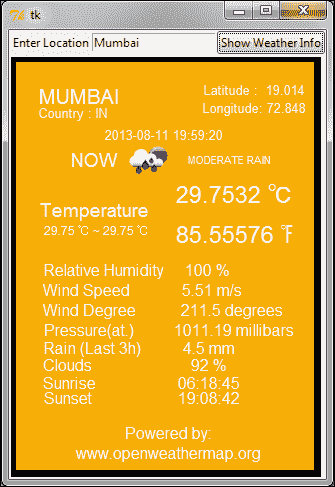
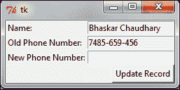
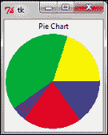
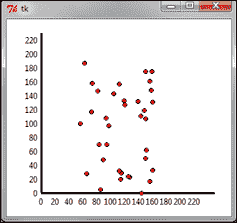

# 第七章 一些有趣的项目想法

在先前的项目中，我们已经探索了 Tkinter 的大部分重要功能。现在开发新项目就是扩展我们迄今为止所学的内容。在这个项目中，我们将构建几个部分功能的应用程序，您可以继续开发。

# 任务简报

在这个项目中，我们将为来自不同领域的几个应用程序开发“裸骨结构”。我们将构建的应用程序包括：

+   屏幕保护程序

+   贪吃蛇游戏

+   天气预报员

+   电话簿应用程序

+   使用 Tkinter 绘图

## 为什么它如此出色？

您会发现这个项目很有用，因为我们将进一步深入了解 Tkinter **Canvas**小部件的力量，并为我们的屏幕保护程序程序开发一些基本动画。

在开发贪吃蛇游戏时，我们将学习如何高效地使用**队列实现**来开发多线程 Python 应用程序。正如您将看到的，当处理多线程应用程序时，这是一个非常有用的工具。

天气预报员应用程序将向您介绍网络编程的基础。您将学习如何挖掘互联网上看似无限的资源。

电话簿应用程序将向您展示如何与数据库一起工作。这对于开发任何需要持久性的大型应用程序至关重要。

最后，我们将探讨 Tkinter 的基本绘图能力。我们还将探讨在 Tkinter 中嵌入 matplotlib 图表的方法。

## 您的热门目标

为此项目概述的关键目标包括开发和理解以下内容：

+   Tkinter 画布的基本动画

+   为多线程 Tkinter 应用程序实现队列

+   网络编程和利用互联网资源

+   与数据交换格式（如 JSON 和 XML）一起工作

+   数据库编程和数据库的基本 CRUD 操作

+   使用 Tkinter 绘图

# 创建屏幕保护程序

我们将首先为我们的桌面创建一个屏幕保护程序。屏幕保护程序将包含几个随机颜色和随机大小的球，以随机速度在屏幕上弹跳，如下面的截图所示：


## 启动推进器

执行以下步骤以创建屏幕保护程序：

1.  让我们创建一个类来生成具有随机属性的球。相应地，我们定义一个新的类名为`RandomBall`来实现这一点（请参阅代码包中的`7.01 screensaver.py`Python 文件）：

    ```py
    from random import randint
    class RandomBall:
        def __init__(self, canvas, scrnwidth, scrnheight):
            self.canvas = canvas
            self.xpos = randint(10, int(scrnwidth))
            self.ypos = randint(10, int(scrnheight))
            self.xvelocity = randint(6,12)
            self.yvelocity = randint(6,12)
            self.scrnwidth = scrnwidth
            self.scrnheight = scrnheight
            self.radius = randint(40,70)
            r = lambda: randint(0,255)
            self.color = '#%02x%02x%02x' % (r(),r(),r())
    ```

    以下是代码的描述：

    +   `__init__`方法接受三个参数，即 Canvas 小部件的实例、屏幕宽度和屏幕高度。然后它将球的初始*x*和*y*位置初始化为随机数，从`0`开始，到最大屏幕坐标。

    +   它还初始化了球在*x*和*y*方向上的速度，球的半径和颜色以随机方式变化。

    +   因为十六进制颜色编码系统为红色、绿色和蓝色中的每一个颜色使用两个十六进制数字，所以每种颜色有 16²（256）种可能性。因此，我们创建了一个生成 0-255 之间随机数的 lambda 函数，并使用这个函数生成三个随机数。我们使用格式%02x 将这个十进制数转换为它的两位等效十六进制表示，以生成球的随机颜色。

1.  第二个方法使用画布的`create_oval`方法创建实际的球（参考代码包中可用的`7.01 screensaver.py` Python 文件）：

    ```py
    def create_ball(self):
     x1 = self.xpos-self.radius
     y1 = self.ypos-self.radius
     x2 = self.xpos+self.radius
     y2 = self.ypos+self.radius
     self.itm = canvas.create_oval
    (x1, y1, x2, y2,
     fill=self.color, outline=self.color)

    ```

1.  现在，让我们编写处理屏幕上球移动的方法。

    该方法还会检查球是否已经到达屏幕的任何一边的尽头。如果球实际上已经到达屏幕的尽头，它将简单地通过给球的速率添加负号来改变方向。

    该方法最终使用`canvas.move`方法移动球（参考`7.01 screensaver.py`）：

    ```py
    def move_ball(self):
     self.xpos += self.xvelocity
     self.ypos += self.yvelocity
     #Check if the Direction of ball movement is to be changed
     if self.ypos>= self.scrnheight - self.radius:
     self.yvelocity = - self.yvelocity # change direction
     if self.ypos<= self.radius :
     self.yvelocity = abs(self.yvelocity)
     if self.xpos>= self.scrnwidth- self.radius or self.xpos<= self.radius:
     self.xvelocity = -self.xvelocity # change direction
     self.canvas.move(self.itm
    , self.xvelocity, self.yvelocity)

    ```

    这就是我们的`RandomBall`类的全部内容。我们可以使用这个类来创建我们想要在屏幕保护程序中显示的任意数量的球对象。

1.  现在，我们已经编写了生成球和移动它们的代码方法，让我们创建我们的屏幕保护程序。我们现在创建一个名为`ScreenSaver`的类，它将显示实际的屏幕保护程序：

    ```py
    class ScreenSaver:
    balls = []

    def __init__(self, num_balls):
        self.root = Tk()
        w, h = self.root.winfo_screenwidth(),self.root.winfo_screenheight()
        self.root.overrideredirect(1)
        self.root.geometry("%dx%d+0+0" % (w, h))
        self.root.attributes('-alpha', 0.3)
        self.root.bind('<Any-KeyPress>', quit)
        self.root.bind('<Any-Button>', quit)
        self.root.bind('<Motion>', quit)
        self.canvas = Canvas(self.root, width=w, height=h)
        self.canvas.pack()
        for i in range(num_balls):
            ball = RandomBall(self.canvas, scrnwidth=w, scrnheight=h)
            ball.create_ball()
            self.balls.append(ball)
        self.run_screen_saver()
        self.root.mainloop()
    ```

    代码的描述如下：

    +   `ScreenSaver`类的`__init__`方法接受球的数量（`num_balls`）作为其参数。

    +   然后，我们创建一个根窗口并使用`winfo`方法计算屏幕的高度和宽度。

    +   我们使用`root.overrideredirect(1)`来从父窗口中移除封装的框架。

    +   然后，我们指定父窗口的几何形状以填充整个屏幕。

    +   我们使用`root.attributes('-alpha', 0.3)`使父窗口透明。我们添加了`0.3`的透明度，使窗口半透明。

    +   然后，我们将根绑定到在点击鼠标按钮、按下任何键盘按钮或鼠标移动时调用我们的`quit`命令。这是为了确保我们的程序表现得像屏幕保护程序，在用户端有任何交互时退出。

    +   然后，我们创建一个画布来覆盖整个屏幕，使用`Canvas(self.root, width=w, height=h)`。

    +   我们从`RandomBall`类中创建了几个随机球对象，并将画布小部件实例、屏幕的宽度和高度作为其参数传递。

    +   我们最终在`ScreenSaver`类中调用`run_screen_saver()`方法来运行屏幕保护程序，这将在下文中讨论。

1.  在这一步，我们将运行`ScreenSaver`类：

    ```py
    def run_screensaver():
     for ball in balls:
     ball.move_ball()
     canvas.after(20, runScreenSaver)

    ```

    代码的描述如下：

    +   `run_screensaver()`方法通过每隔 20 毫秒调用自身来简单地移动每个球。

    +   我们还在`ScreenSaver`类中定义了`quit`方法，用于从主循环退出并退出程序：

        ```py
         def quit(event):
         root.destroy()

        ```

    +   要运行屏幕保护程序，我们从一个`ScreenSaver`类实例中实例化一个对象，并将球的数量作为其参数传递：

        ```py
        if __name__ == "__main__":
         ScreenSaver(18)  ##18 is the number of balls

        ```

### 注意

我们在之前的代码中使用了两个顶层窗口方法 `root.overrideredirect` 和 `root.attributes`。

有关可以应用于顶层窗口的方法的完整列表，请参阅附录 B 中的 *The Toplevel window methods* 部分，*快速参考表*。

## 目标完成 - 简短总结

我们的屏保已经准备好了！

实际上，如果你在 Windows 平台上工作，并且当你学习如何从 Python 程序（在附录 A 中讨论，*杂项提示*）创建可执行程序时，你可以为这个屏保创建一个具有`.exe`扩展名的可执行文件。然后，你可以将其扩展名从`.exe`更改为`.scr`，右键单击，并选择**安装**将其添加到你的屏保列表中！

# 构建贪吃蛇游戏

现在我们来构建一个简单的贪吃蛇游戏。像往常一样，我们将使用画布小部件为我们的贪吃蛇程序提供平台。

我们将使用 `canvas.create_line` 来绘制我们的蛇，并使用 `canvas.create_rectangle` 来绘制蛇的食物。

## 准备起飞

本项目的首要目标之一是介绍 Python 中的队列实现，正如我们与**线程**模块结合使用的那样。

到目前为止，我们构建了单线程应用程序。然而，当应用程序中有多个线程时，线程处理可能会变得困难，并且这些线程需要在它们之间共享属性或资源。在这种情况下，你根本无法预测线程的执行顺序。操作系统每次都非常随机和迅速地执行它。

为了处理这种复杂性，线程模块提供了一些同步工具，例如锁、join、信号量、事件和条件变量。然而，在大多数情况下，使用队列更安全、更简单。简单来说，**队列**是一个线程安全的复合内存结构；队列有效地以顺序方式将资源访问渠道传递给多个线程，并且是推荐的设计模式，适用于大多数需要并发的场景。

**队列**模块提供了一种实现不同类型的队列的方法，例如**FIFO**（默认实现）、**LIFO**队列和**优先级**队列，并且此模块包含运行多线程程序所需的所有锁定语义的内置实现。

### 注意

关于队列模块的更多信息可以在以下链接中找到：

[`docs.Python.org/2/library/queue.html`](http://docs.Python.org/2/library/queue.html)

这里是对队列模块基本用法的一个快速总结：

```py
myqueue = Queue() #create empty queue
myqueue.put(data)# put items into queue
task = myqueue.get () #get the next item in the queue
myqueue.task_done() # called when a queued task has completed
myqueue.join() # called when all tasks in queue get completed
```

让我们看看使用队列实现多线程应用程序的一个简单示例（请参阅代码包中可用的 `7.02 threading with queue.py`）：

```py
import Queue
import threading
class Worker(threading.Thread):
    def __init__(self, queue):
        threading.Thread.__init__(self)
        self.queue = queue

    def run(self):
        while True:
            task = self.queue.get()
            self.taskHandler(task)

    def taskHandler(self, job):
        print'doing task %s'%job
        self.queue.task_done()
    def main(tasks):
        queue = Queue.Queue()
        for task in tasks:
            queue.put(task)
    # create some threads and assign them queue
        for i in range(6):
            mythread = Worker(queue)
            mythread.setDaemon(True)
            mythread.start()
        queue.join()
        print'all tasks completed'

    if __name__ == "__main__":
            tasks = 'A B C D E F'.split()
            main(tasks)
```

代码的描述如下：

+   我们首先创建一个 `Worker` 类，它继承自 Python 的 `threading` 模块。`__init__` 方法接受一个队列作为其参数。

+   然后，我们覆盖了`threading`模块的`run`方法，使用`queue.get()`从队列中获取每个项目，然后将其传递给`taskHandler`方法，该方法实际上执行当前队列项中指定的任务。在我们的例子中，它没有做任何有用的事情，只是打印出任务的名称。

+   在`taskHandler`方法完成特定线程的工作后，它通过使用`queue.task_done()`方法向队列发送一个信号，表明任务已经完成。

+   在我们的`Worker`类外部，我们在`main()`方法中创建了一个空队列。这个队列使用`queue.put(task)`用一系列任务填充。

+   然后，我们创建了六个不同的线程，并将这个填充好的队列作为其参数传递。现在，由于任务由队列处理，所有线程都会自动确保任务按照线程遇到的顺序完成，而不会造成任何死锁或两个不同的线程试图处理同一个队列任务。

+   在创建每个线程的时候，我们也使用`mythread.setDaemon(True)`方法创建了一个守护线程池。这样做会在所有线程完成执行后将控制权交回主程序。如果你注释掉这一行，程序仍然会运行，但在所有线程完成队列中的任务执行后，程序将无法退出。如果没有守护线程，你将不得不跟踪所有线程，并在你的程序完全退出之前告诉它们退出。

+   最后，`queue.join()`方法确保程序流程等待在那里，直到队列变为空。

现在我们知道了如何使用队列有效地处理多线程应用程序，让我们构建我们的蛇游戏。在其最终形式中，游戏将类似于以下截图所示（请参考代码包中可用的`7.03 game of snake.py` Python 文件）：


## 启动推进器

1.  让我们开始编写我们的游戏，首先创建一个基本的`GUI`类。

    ```py
    class GUI(Tk):
        def __init__(self, queue):
            Tk.__init__(self)
            self.queue = queue
            self.is_game_over = False
            self.canvas = Canvas(self, width=495, height=305, bg='#FF75A0')
            self.canvas.pack()
            self.snake = self.canvas.create_line((0, 0), (0,0), fill='#FFCC4C', width=10)
            self.food = self.canvas.create_rectangle(0, 0, 0, 0, fill='#FFCC4C', outline='#FFCC4C')
            self.points_earned = self.canvas.create_text(455, 15, fill='white', text='Score: 0')
            self.queue_handler()
    ```

    代码的描述如下：

    +   到现在为止，这段代码对你来说应该已经很熟悉了，因为我们之前已经多次创建了类似的`GUI`类。

    +   然而，我们的 GUI 类现在不是将根实例作为参数传递给其`__init__`方法，而是从 Tk 类继承。`Tk.__init__(self)`这一行确保根窗口对所有这个类的方法都是可用的。这样我们就可以通过简单地引用`self`来避免在每一行都写上`root`属性。

    +   然后，我们初始化画布、线条（蛇）、矩形（食物）和文本（用于显示分数）。

    +   然后，我们调用函数`queueHandler()`。这个尚未定义的方法将与之前队列示例中定义的`main`方法类似。这将是一个中心方法，它将处理队列中的所有任务。一旦我们向队列中添加了一些任务，我们就会回来定义这个方法。

1.  现在，我们将创建一个`Food`类，如下面的代码片段所示：

    ```py
    class Food():
        def __init__(self, queue):
            self.queue = queue
            self.generate_food()

        def generate_food(self):
               x = random.randrange(5, 480, 10)
                y = random.randrange(5, 295, 10)
            self.position = x, y
            self.exppos = x - 5, y - 5, x + 5, y + 5
            self.queue.put({'food': self.exppos})
    ```

    以下是代码的描述：

    +   因为我们希望从队列内部集中处理所有数据，所以我们把队列作为一个参数传递给`Food`类的`__init__`方法。我们选择在主程序线程中运行这个操作，以展示一个在主线程中执行的字节码如何与其他线程的属性和方法进行通信。

    +   `__init__`方法调用另一个名为`generate_food()`的方法，该方法负责在画布上随机位置生成蛇食物。

    +   `generate_food`方法在画布上生成一个随机的*(x, y)*位置。然而，因为坐标重合的地方只是画布上的一个小点，几乎看不见。因此，我们生成一个扩展的坐标(`self.exppos`)，范围从*(x,y)*坐标的五值以下到五值以上。使用这个范围，我们可以在画布上创建一个小的矩形，这将很容易看见，并代表我们的食物。

    ### 注意

    然而，我们在这里并没有创建矩形。相反，我们使用`queue.put`将食物（矩形）的坐标传递到我们的队列中。因为这个队列将被所有我们的类使用，我们将有一个名为`queue_handler()`的集中式工作者，它将处理这个队列，并在稍后从我们的 GUI 类生成矩形。这是队列实现背后的核心思想。

1.  现在我们来创建`Snake`类。我们已经将生成食物的任务传递给了中央队列。然而，这个任务没有涉及任何线程。我们也可以不使用线程来生成我们的蛇类。然而，因为我们正在讨论实现多线程应用程序的方法，所以让我们将我们的蛇类实现为从单独的线程中工作（参考`7.03 game of snake.py`）：

    ```py
    class Snake(threading.Thread):
        def __init__(self, gui, queue):
            threading.Thread.__init__(self)
            self.gui = gui
            self.queue = queue
            self.daemon = True
            self.points_earned = 0
            self.snake_points = [(495, 55), (485, 55), (475, 55), (465, 55), (455, 55)]
            self.food = Food(queue)
            self.direction = 'Left'
            self.start()

    def run(self):
        while not self.gui.is_game_over:
            self.queue.put({'move':self.snake_points})
            time.sleep(0.1)
            self.move()
    ```

    以下是代码的描述：

    +   首先，我们创建一个名为`Snake`的类，从单独的线程中运行。这个类接受 GUI 和队列作为它的输入参数。

    +   我们初始化玩家获得的成绩为零，并使用属性`self.snake_points`设置蛇的初始位置。

    +   最后，我们启动线程并创建一个无限循环，以小间隔调用`move()`方法。在每次循环运行中，该方法通过`self.snake_points`属性将一个包含键为`'move'`和值为蛇更新位置的字典填充到队列中。

1.  在这一步，我们将使蛇移动。

    上面的线程初始化调用`Snake`类的`move()`方法，在画布上移动蛇。然而，在我们能够移动蛇之前，我们需要知道蛇应该移动的方向。这显然取决于用户按下的特定键（左/右/上/下键）。

    因此，我们需要将这些四个事件绑定到 Canvas 小部件上。我们将在稍后进行实际的绑定。然而，我们现在可以创建一个名为`key_pressed`的方法，该方法将`key_press`事件本身作为其参数，并根据按下的键设置方向值。

    ```py
    def key_pressed(self, e):
    	self.direction = e.keysym
    ```

    现在我们有了方向，让我们编写`move`方法：

    ```py
    def move(self):
        new_snake_point = self.calculate_new_coordinates()
        if self.food.position == new_snake_point:
            self.points_earned += 1
            self.queue.put({'points_earned':self.points_earned })
            self.food.generate_food()
        else:
            self.snake_points.pop(0)
            self.check_game_over(new_snake_point)
            self.snake_points.append(new_snake_point)

    def calculate_new_coordinates(self):
        last_x, last_y = self.snake_points[-1]
        if self.direction == 'Up':
            new_snake_point = last_x, (last_y - 10)
        elif self.direction == 'Down':
            new_snake_point = last_x, (last_y + 10)
        elif self.direction == 'Left':
            new_snake_point = (last_x - 10), last_y
        elif self.direction == 'Right':
            new_snake_point = (last_x + 10), last_y
        return new_snake_point

    def check_game_over(self, snake_point):
        x,y = snake_point[0], snake_point[1]
        if not -5 < x < 505 or not -5 < y < 315 or snake_point in self.snake_points:
                self.queue.put({'game_over':True})
    ```

    代码的描述如下：

    +   首先，`move`方法根据键盘事件获取蛇的最新坐标。它使用一个名为`calculate_new_coordinates`的单独方法来获取最新坐标。

    +   然后它会检查新坐标的位置是否与食物的位置一致。如果它们匹配，它会将玩家的得分增加一分，并调用`Food`类的`generate_food`方法在新的位置生成新的食物。

    +   如果当前点与食物坐标不一致，它将使用`self.snake_points.pop(0)`从蛇坐标中删除最后一个项目。

    +   然后，它会调用另一个名为`check_game_over`的方法来检查蛇是否撞到墙壁或撞到自己。如果蛇确实撞到了，它会在队列中追加一个新的字典项，其值为`'game_over':True`。

    +   最后，如果游戏没有结束，它会将蛇的新位置追加到列表`self.snake_points`中。这会自动添加到队列中，因为我们已经在`Snake`类的`run()`方法中定义了`self.queue.put({'move':self.snake_points})`，以便在游戏没有结束时每 0.1 秒更新一次。

1.  现在，让我们创建队列处理程序。

    现在，我们有一个`Food`类从主程序线程中向集中队列提供食物。我们还有一个`Snake`类从一个线程中向队列添加数据，以及一个`GUI`类从另一个线程中运行`queue_handler`方法。因此，队列是这三个线程之间交互的中心点。

    现在，是时候处理这些数据以更新画布上的内容了。因此，我们在`GUI`类中相应地定义了`queue_handler()`方法来处理队列中的项目。

    ```py
    def queue_handler(self):
        try:
            while True:
                task = self.queue.get(block=False)
                if task.has_key('game_over'):
                    self.game_over()
                elif task.has_key('move'):
                    points = [x for point in task['move'] for x in point]
                    self.canvas.coords(self.snake, *points)
                elif task.has_key('food'):
                    self.canvas.coords(self.food, *task['food'])
                elif task.has_key('points_earned'):
                 self.canvas.itemconfigure(self.points_earned, text='Score:{}'.format(task['points_earned']))
               self.queue.task_done()
        except Queue.Empty:
            if not self.is_game_over:
                self.canvas.after(100, self.queue_handler)
    ```

    代码的描述如下：

    +   `queue_handler`方法进入一个无限循环，使用`task = self.queue.get(block=False)`在队列中查找任务。如果队列变为空，循环会使用`canvas.after`重新启动。

    +   一旦从队列中获取了一个任务，该方法会检查其键。

    +   如果键是`'game_over'`，它调用我们定义的另一个名为`game_over()`的方法。

    +   如果任务的键是`'move'`，它使用`canvas.coords`将线移动到新的位置。

    +   如果键是`'points_earned'`，它会在画布上更新得分。

    +   当一个任务的执行完成后，它会使用`task_done()`方法向线程发出信号。

    ### 注意

    `queue.get`可以接受`block=True`（默认）和`block=False`作为其参数。

    当块设置为 `False` 时，如果队列中有可用项，它会移除并返回一个项。如果队列为空，它将引发 `Queue.Empty`。当块设置为 `True` 时，`queue.get` 通过如果需要暂停调用线程，直到队列中有可用项。

1.  在这一步，我们将编写处理游戏 `game_over` 功能的方法。

    `queue_handler` 方法在匹配队列键的情况下调用 `game_over` 方法：

    ```py
    def game_over(self):
        self.is_game_over = True
        self.canvas.create_text(200, 150, fill='white', text='Game Over') 
        quitbtn = Button(self, text='Quit', command =self.destroy)
     self.canvas.create_window(200, 180, anchor='nw', window=quitbtn)

    ```

    以下是代码的描述：

    +   我们首先将 `game_over` 属性设置为 `True`。这有助于我们退出 `queue_handler` 的无限循环。然后，我们在画布上添加一个显示内容为 **游戏结束** 的文本。

    +   我们还在画布内添加了一个 **退出** 按钮，该按钮附加了一个命令回调，用于退出根窗口。

        ### 小贴士

        记住如何在画布小部件内附加其他小部件。

1.  让我们运行游戏。游戏现在已准备就绪。要运行游戏，我们在所有其他类之外创建一个名为 `main()` 的函数：

    ```py
    def main():
        queue = Queue.Queue()
        gui     = GUI(queue)
        snake = Snake(gui, queue)
        gui.bind('<Key-Left>', snake.key_pressed)
        gui.bind('<Key-Right>', snake.key_pressed)
        gui.bind('<Key-Up>', snake.key_pressed)
        gui.bind('<Key-Down>', snake.key_pressed)
        gui.mainloop()

    if __name__ == '__main__':
        main()
    ```

    我们创建一个空队列，并将其作为参数传递给我们的三个类，以便它们可以将任务喂送到队列中。我们还绑定四个方向键到之前在 `Snake` 类中定义的 `key_pressed` 方法。

## 目标完成 - 简要回顾

我们的游戏现在已功能正常。去尝试控制蛇，同时保持它的肚子饱饱的。

总结来说，我们创建了三个类，如 `Food`、`Snake` 和 `GUI`。这三个类将它们各自类相关的任务信息喂送到一个集中的队列中，这个队列作为参数传递给所有类。

然后，我们创建一个名为 `queue_handler` 的集中式方法，该方法通过轮询任务一次并以非阻塞方式完成任务来处理队列中的任务。

这个游戏可以不使用线程和队列来实现，但会慢一些，更长，也更复杂。通过使用队列来有效管理多个线程的数据，我们能够将程序代码控制在 150 行以下。

希望你现在能够实现队列来管理你在工作中设计的其他程序。

# 创建天气报告

现在我们来构建一个简单的天气报告应用。这个项目的目标是向您介绍网络编程的基础，这是与 Tkinter 结合使用的。

## 准备起飞

Python 对网络编程有很好的支持。在最低级别，Python 提供了一个套接字模块，它允许你使用简单易用的面向对象接口连接和与网络交互。

对于不了解网络编程的人来说，套接字是计算机进行任何类型网络通信的基本概念。这是程序员可以访问网络的最低级别。在套接字层之下是原始的 UDP 和 TCP 连接，这些连接由计算机的操作系统处理，程序员没有直接的访问点。例如，当你将 [www.packtpub.com](http://www.packtpub.com) 输入到浏览器中时，你的计算机操作系统打开一个套接字并连接到 [packtpub.com](http://packtpub.com) 来获取网页并显示给你。任何需要连接到网络的应用程序都会发生同样的事情。

让我们简要地看看套接字模块中可用的某些 API：

```py
s = socket.socket(socket.AF_INET, socket.SOCK_STREAM) # create a #socket
socket.gethostbyname( host ) # resolving host IP from host name
s.connect((ip , port)) #Connect to remote server
s.sendall(message)
s.recv(message_size)
```

如果你查看此项目的代码包中的 `7.04 socket demo.py` Python 文件，你会发现它发送了一个非常晦涩的 GET 请求来从以下代码行获取 URL 的内容：

`message = "GET / HTTP/1.1\r\n\r\n"`

从服务器接收的数据也以数据包的形式发送，我们的任务是收集所有数据并在我们这一端组装它们。所有这些使得直接套接字编程变得繁琐。我们不希望编写代码来从网络中获取数据。

因此，我们将使用一个名为 `urllib` 的高级模块，该模块建立在套接字模块之上，但使用起来更简单。`urllib` 模块是 Python 标准库的一部分。使用此协议，从网页获取内容变为四行代码（请参阅 `7.05 urllib demo.py` 中的代码）：

```py
import urllib
data =  urllib.urlopen('http://www.packtpub.com')
print data.read()
data.close()
```

这将打印整个 HTML 源代码或网页的响应。本质上，这是从网络中挖掘数据和信息的核心。

现在我们知道了如何从 URL 获取数据，让我们将其应用于构建一个小型天气报告应用程序。

此应用程序应从用户处获取位置作为输入，并获取相关的天气数据。



## 启动推进器

1.  首先，我们将创建应用程序的 GUI。现在这对你来说应该很容易。我们创建一个名为 `WeatherReporter` 的类，并在主循环外部调用它。请参阅 `7.06 weather reporter.py` 的代码：

    ```py
    def main():
        root=Tk()
        WeatherReporter(root)
        root.mainloop()

    if __name__ == '__main__':
        main()
    ```

    `WeatherReporter` 类的 GUI 组件由两个方法组成：`top_frame()` 和 `display_frame()`。`top_frame()` 方法创建一个输入小部件和一个显示 **显示天气信息** 的按钮。

    `display_frame()` 方法创建一个画布，实际天气数据将在其中显示：

    ```py
    class WeatherReporter:
        def __init__(self, root):
            self.root = root
            self.top_frame()
            self.display_frame()

        def top_frame(self):
            topfrm = Frame(self.root)
            topfrm.grid(row=1, sticky='w')
            Label(topfrm, text='Enter Location').grid(row=1, column=2, sticky='w')
            self.enteredlocation = StringVar()
            Entry(topfrm, textvariable=self.enteredlocation).grid(row=1, column=2, sticky='w')
            ttk.Button(topfrm, text='Show Weather Info', command=self.show_weather_button_clicked).grid(row=1, column=3, sticky='w')

        def display_frame(self):
            displayfrm = Frame(self.root)
            displayfrm.grid(row=2, sticky='ew', columnspan=5)
            self.canvas = Canvas(displayfrm, height='410',width='300', background='black', borderwidth=5)
            self.canvas.create_rectangle(5, 5, 305, 415,fill='#F6AF06')
            self.canvas.grid(row=2, sticky='w', columnspan=5)
    ```

1.  在第二步中，我们将从网站上获取天气数据。

    从网站获取数据有两种方式。第一种方法涉及从网站获取 HTML 响应，然后解析收到的 HTML 响应以获取与我们相关的数据。这种数据提取称为 **网站抓取**。

    网站抓取是一种相当原始的方法，仅在给定网站不提供结构化数据检索方式时使用。另一方面，一些网站愿意通过一组 API 共享数据，前提是你使用指定的 URL 结构查询数据。这显然比网站抓取更优雅，因为数据以可靠和“相互同意”的格式交换。

    对于我们的天气报告应用，我们希望查询给定位置的某些天气频道，并相应地检索和显示数据在我们的画布上。幸运的是，有几个天气 API 允许我们这样做。

    ### 注意

    在我们的示例中，我们将使用以下网站提供的天气数据：

    [`openweathermap.org/`](http://openweathermap.org/)

    OpenWeatherMap 服务提供免费的天气数据和预报 API。该网站从全球超过 40,000 个气象站收集天气数据，数据可以通过城市名称、地理坐标或其内部城市 ID 进行评估。

    该网站提供两种数据格式的天气数据：

    +   JSON（JavaScript 对象表示法）

    +   XML

    ### 注意

    XML 和 JSON 是两种广泛使用的可互换数据序列化格式，广泛用于不同平台和不同编程语言的应用程序之间的数据交换，从而提供了互操作性的好处。

    JSON 比 XML 简单，因为它的语法更简单，并且它更直接地映射到现代编程语言中使用的数结构。JSON 更适合数据交换，但 XML 更适合文档交换。

    网站的 API 文档告诉我们，查询如`api.openweathermap.org/data/2.5/weather?q=London,uk`将返回以 JSON 格式表示的伦敦天气数据，如下所示：

    ```py
    {"coord":{"lon":-0.12574,"lat":51.50853},"sys":{"country":"GB","sunrise":1377147503,"sunset":1377198481},"weather":[{"id":500,"main":"Rain","description":"light rain","icon":"10d"}],"base":"gdps stations","main":{"temp":294.2,"pressure":1020,"humidity":88,"temp_min":292.04,"temp_max":296.48},"wind":{"speed":1,"deg":0},"rain":{"1h":0.25},"clouds":{"all":40},"dt":1377178327,"id":2643743,"name":"London","cod":200}
    ```

    JSON 的语法很简单。任何 JSON 数据都是一个名称/值对，其中每个数据项通过逗号与其他数据项分隔。JSON 使用花括号`{}`来包含对象，使用方括号`[ ]`来包含数组。因此，我们在我们的应用程序中定义了一个方法来获取 JSON 格式的天气数据（参考此项目代码包中的`7.06 weather reporter.py`）：

    ```py
    def get_weather_data(self):
        try:
            apiurl = 'http://api.openweathermap.org/data
            /2.5/weather?q=%s'%self.enteredlocation.get()
            data =  urllib.urlopen(apiurl)
            jdata= data.read()
            returnjdata
        except IOError as e:
            tkMessageBox.showerror('Unable to connect', 'Unable toconnect %s'%e) 
    ```

    此方法使用`urllib`从网站检索响应。它以 JSON 格式返回响应。

1.  现在，我们将开始处理 JSON 数据。通过 API 返回的天气数据是编码在 JSON 格式的。我们需要将此数据转换为 Python 数据类型。Python 提供了一个内置的`json`模块，它简化了“编码-解码”JSON 数据的过程。因此，我们将`json`模块导入到当前命名空间中。

    然后，我们将使用此模块将检索到的 JSON 数据转换为 Python 字典格式（参考`7.06 weather reporter.py`）：

    ```py
    def json_to_dict(self, jdata):
        mydecoder = json.JSONDecoder()
        decodedjdata = mydecoder.decode(jdata)
        flatteneddict = {}
        for key, value in decodedjdata.items():
            if key == 'weather':
                forke,va in value[0].items():
                    flatteneddict[str(ke)] = str(va).upper() 
                    continue
            try:
                fork,v in value.items():
                flatteneddict[str(k)] = str(v).upper()
            except:
                flatteneddict[str(key)] = str(value).upper()
            returnflatteneddict
    ```

1.  最后，我们将显示检索到的天气数据。现在，我们已经有了 API 提供的所有与天气相关的信息的字典，让我们给按钮添加一个命令回调：

    ```py
    def show_weather_button_clicked(self):
        if not self.enteredlocation.get():
            return
        self.canvas.delete(ALL)
        self.canvas.create_rectangle( 5, 5,305,415,fill='#F6AF06')
        data = self.get_weather_data()
        data =self.json_to_dict(data)
        self.display_final(data)
    ```

    `display_final`方法简单地从字典中取出每个条目，并使用`create_text`在画布上显示它。我们不包含`display_final`的代码，因为它仅仅是在画布上显示数据，这个想法现在应该已经很明确了。API 还提供了与图标相关的数据。图标存储在名为`weatherimages`的文件夹中（参考代码包中提供的同名文件夹），并使用`canvas.create_image`显示适当的图标。

## 目标完成 - 简要回顾

我们的天气报道应用程序现在已功能齐全。本质上，该应用程序使用`urllib`模块查询我们数据提供商提供的天气 API。数据以 JSON 格式获取。然后 JSON 数据被解码成 Python 可读的格式（字典）。

转换后的数据随后使用`create_text`和`create_image`方法在画布上显示。

## 分类情报

当您从 Python 程序访问服务器时，在发送请求后保持小的时间间隔非常重要。

一个典型的 Python 程序每秒可以运行数百万条指令。然而，在另一端向您发送数据的服务器永远不会配备以这种速度工作的能力。

如果您在短时间内有意或无意地发送大量请求到服务器，可能会妨碍它为正常网络用户处理常规请求。这构成了对服务器的**拒绝服务**（DOS）攻击。如果您的程序没有发送有限数量的良好行为请求，您可能会被禁止，或者在更糟糕的情况下，因破坏服务器而起诉。

# 创建电话簿应用程序

现在我们来构建一个简单的电话簿应用程序，允许用户存储姓名和电话号码。用户应该能够使用此应用程序创建新记录、读取现有记录、更新现有记录以及从数据库中删除记录。这些活动共同构成了在数据库上所知的**CRUD**（创建、读取、更新和删除）操作。

本项目的核心学习目标是与 Tkinter 一起使用关系数据库存储和操作记录。

我们已经看到了一些使用序列化的基本对象持久化示例。关系数据库通过关系代数的规则扩展这种持久性，将数据存储到表中。

Python 为广泛的数据库引擎提供了数据库接口。此外，Python 提供了一个通用的接口标准，可以用来访问数据库引擎，但它不是作为 Python 模块原生的。

一些常用的数据库引擎包括 MySQL、SQLite、PostgreSQL、Oracle、Ingres、SAP DB、Informix、Sybase、Firebird、IBM DB2、Microsoft SQL Server、Microsoft Access 等等。

我们将使用 SQLite 存储电话簿应用程序的数据。

## 准备起飞

SQLite 是一个无服务器、零配置、自包含的 SQL 数据库引擎，适用于开发嵌入式应用程序。SQLite 的源代码属于公共领域，这使得它可以在所有商业和非商业项目中免费使用。

与许多其他 SQL 数据库不同，SQLite 不需要运行单独的服务器进程。相反，SQLite 将所有数据直接存储到计算机磁盘上的平面文件中。这些文件在不同平台上易于移植，使其成为小型和简单数据库实现需求的热门选择。

Python 2.7 内置了 sqlite3 支持的标准库。然而，我们需要下载 sqlite3 命令行工具，这样我们就可以使用命令行工具创建、修改和访问数据库。Windows、Linux 和 Mac OS X 的命令行壳可以从 [`sqlite.org/download.html`](http://sqlite.org/download.html) 下载。

按照网站上的说明，将 SQLite 命令行工具安装到您选择的任何位置。

现在我们来实现我们的电话簿应用程序。该应用程序将类似于以下截图所示。该应用程序将演示数据库编程中的一些常见操作，如下所示：


## 启动推进器

1.  为了创建数据库，我们打开操作系统的命令行工具。在 Windows 上，我们通常通过在运行控制台中键入 `cmd` 来调用命令行。

    在命令行中，我们首先导航到需要创建新数据库文件的目录。为了创建数据库，我们只需使用此命令：

    ```py
    sqlite3 phonebook.db

    ```

    这将在我们执行命令的文件夹中创建一个名为 `phonebook.db` 的数据库文件。它还会显示类似于以下的消息：

    ```py
    SQLite version 3.7.17 2013-05-20 00:56:22
    Enter ".help" for instructions
    Enter SQL statements terminated with a ";"
    sqlite>

    ```

    我们现在已经创建了一个名为 `phonebook.db` 的数据库。然而，数据库文件目前是空的。它不包含任何表或数据。因此，如果我们运行以下命令，我们将得到没有结果：

    ```py
    sqlite> .tables

    ```

    现在让我们通过键入以下内容退出命令行工具：

    ```py
    sqlite> .exit

    ```

1.  我们想在数据库中存储联系人，这就是为什么我们需要创建 `contacts` 表。直观上，我们的数据库表应该存储一个人的姓名和电话号码。此外，为每个人或表中的每个条目保留一个唯一的识别号码是一个好习惯。这是因为可能有多个人的名字或联系号码相同。

    要在 `phonebook.db` 数据库中创建一个表，我们再次打开命令行工具并导航到创建数据库的目录。我们再次通过键入以下内容进入 sqlite3 终端：

    ```py
    sqlite3 phonebook.db

    ```

    这次没有创建新的数据库。相反，该命令现在打开现有的 `phonebook.db` 数据库，因为它已经存在于磁盘上。

    接下来，我们创建一个名为 `contacts` 的表，并从命令行向表中添加三个列：

    ```py
    sqlite> CREATE TABLE contacts
    (
    contactid INTEGER PRIMARY KEY AUTOINCREMENT,
    name STRINGNOT NULL,
    contactnumber INTEGER NOT NULL
    );

    ```

    您可以通过输入以下命令来验证是否创建了 `contacts` 表：

    ```py
    sqlite>.table

    ```

    这将打印出当前打开的数据库中所有表的名字。您将得到以下输出：

    ```py
    sqlite>.table
    contacts

    ```

1.  让我们先创建一个基本的 GUI，这样我们就可以添加、查看、删除和修改记录。我们创建一个名为 `PhoneBook` 的类，并在其 `__init__` 方法中创建所有 GUI 小部件（参考 `7.07 phonebook.py`）：

    ```py
    class PhoneBook:
    def __init__(self, master):
        # all widgets created here
    ```

    我们在这里不重写代码，因为我们已经在所有之前的项目中创建了类似的部件。

1.  让我们开始创建我们创建的数据库文件中的记录。每次用户在提供的输入小部件中输入新的姓名和电话号码，并点击 **添加记录** 按钮时，都会创建一个新的记录。

    ```py
    def create_record(self):
        name = self.namefield.get()
        num = self.numfield.get()
        if name == "":
            self.msg["text"] = "Please Enter name"
            return
        if num == "":
            self.msg["text"] = "Please Enter Number"
            return
        conn = sqlite3.connect('phonebook.db')
        c = conn.cursor()
        c.execute("INSERT INTO contacts VALUES(NULL,?, ?)", (name,num))
        conn.commit()
        c.close()
        self.namefield.delete(0, END)
        self.numfield.delete(0, END)
        self.msg["text"] = "Phone Record of %s Added" %name
    ```

    代码的描述如下：

    +   如上所述定义的 `create_record` 方法被附加为 **添加记录** 按钮的命令回调。

    +   当调用 `create_record` 方法时，它会检索在 **姓名** 和 **联系号码** 输入字段中输入的姓名和号码值。

    +   如果姓名或号码字段为空，它将打印一条错误消息并退出。

    +   如果姓名和号码字段有效，该方法将连接到我们之前创建的 `phonebook.db` 数据库。

    +   下一个行，`c = conn.cursor()`，创建了一个游标对象。游标是一个按照 SQL 标准要求的控制结构，它使我们能够遍历数据库中的记录。

    +   下一个行，`c.execute(query)` 是实际将姓名和电话号码插入数据库的行。注意，它包括三个插入值：第一个是自动递增的联系人 ID 对应的 NULL 值，这是通过我们在 `contacts` 表中创建的来添加的。

    +   `conn.commit()` 这一行实际上将更改提交到数据库，而 `c.close()` 行则关闭了与数据库的连接。

1.  在执行上述步骤之后，我们将查看存储在数据库中的记录。该方法负责从数据库中检索所有记录并在树形小部件中显示它们。

    ```py
    def view_records(self):
        x = self.tree.get_children()
        for item in x: 
            self.tree.delete(item)
        conn = sqlite3.connect('phonebook.db')
        c = conn.cursor()
        list = c.execute("SELECT * FROM contacts ORDER BY namedesc")
        for row in list:
            self.tree.insert("",0,text=row[1],values=row[2])
        c.close()
    ```

    代码的描述如下：

    +   `view_records` 方法首先删除在树形小部件中显示的所有现有项目

    +   然后，它建立数据库连接并查询数据库以按姓名降序获取所有数据

    +   最后，它遍历检索到的记录以更新树形小部件的内容

1.  现在，在电话簿应用程序中，我们将删除一些记录。`delete_record` 方法简单地负责根据给定的姓名标准从数据库中删除一行：

    ```py
    def delete_record(self):
        self.msg["text"] = ""
        conn = sqlite3.connect('phonebook.db')
          c = conn.cursor()
        name = self.tree.item(self.tree.selection())['text']
     query = "DELETE FROM contacts WHERE name = '%s';" %name
     c.execute(query)
        conn.commit()
        c.close()
        self.msg["text"] = "Phone Record for %s Deleted" %name
    ```

    ### 小贴士

    尽管我们根据姓名创建了此删除查询，但如果两个人或更多人具有相同的姓名，这种方法会存在删除多个条目的风险。更好的方法是根据主键或联系人 ID 来删除条目，因为每个条目在表中的联系人 ID 都是唯一的。

1.  电话簿应用程序中的最终操作是修改记录。当用户选择一个特定的记录并点击**修改所选**按钮时，它会打开一个新顶层窗口，就像这里显示的那样：

    此窗口是通过`open_modify_window`方法创建的，该方法定义在`7.07 phonebook.py` Python 文件中。我们不会复制此方法的代码，因为现在你应该已经能够舒适地创建这样的窗口。

    当用户指定一个新的数字并点击**更新记录**按钮时，它会调用`update_record`方法，该方法定义如下：

    ```py
    def update_record(self, newphone,oldphone, name):
        conn = sqlite3.connect('phonebook.db')
        c = conn.cursor()
        c.execute("UPDATE contacts SET contactnumber=? WHEREcontactnumber=? AND name=?", (newphone, oldphone, name)) 
        conn.commit()
        c.close()
        self.tl.destroy()
        self.msg["text"] = "Phone Number of %s modified" %name
    ```

## 目标完成 - 简短总结

我们已经完成了基本电话簿应用程序的编码。

更重要的是，我们已经看到了如何与数据库一起工作。我们的电话簿应用程序展示了如何在数据库上执行基本的创建、读取、更新和删除（CRUD）操作。

我们已经看到了如何创建数据库，向数据库添加表，以及查询数据库以添加、修改、删除和查看数据库中的项目。

此外，由于基本数据库操作相似，你现在可以考虑使用其他数据库系统，例如 MySQL、PostgreSQL、Oracle、Ingres、SAP DB、Informix、Sybase、Firebird、IBM DB2、Microsoft SQL Server 和 Microsoft Access。

# 使用 Tkinter 进行绘图

让我们通过查看 Tkinter canvas 小部件的绘图能力来总结这个项目。

## Engage Thrusters

在这个菜谱中，我们将看到我们如何可以绘制：

+   饼图

+   散点图

+   条形图

+   嵌入 matplotlib 图形

让我们先看看饼图：



1.  您可以使用 Canvas 小部件的`create_arc`方法轻松地在 Tkinter 中创建饼图。示例饼图代码在`7.08 pie chart.py`中提供：

    ```py
    import Tkinter
    root = Tkinter.Tk()
    def prop(n): 
        return 360.0 * n / 1000

    Tkinter.Label(root, text='Pie Chart').pack()
    c = Tkinter.Canvas(width=154, height=154)
    c.pack()
    c.create_arc((2,2,152,152), fill="#FAF402", outline="#FAF402", start=prop(0), extent = prop(200))
    c.create_arc((2,2,152,152), fill="#00AC36", outline="#00AC36", start=prop(200), extent = prop(400))
    c.create_arc((2,2,152,152), fill="#7A0871", outline="#7A0871", start=prop(600), extent = prop(50))
    c.create_arc((2,2,152,152), fill="#E00022", outline="#E00022", start=prop(650), extent = prop(200))
    c.create_arc((2,2,152,152), fill="#294994", outline="#294994",  start=prop(850), extent = prop(150))
    root.mainloop()
    ```

    代码的描述如下：

    +   饼图的每个部分都是通过改变以下两个`create_arc`选项来绘制的：

        `start`：此选项指定起始角度。默认为`0.0`。

        `extent`：此选项指定`arc`相对于起始角度的大小。默认为`90.0`。

1.  接下来，我们将绘制一个示例散点图：

    类似地，我们可以使用`create_line`来绘制*x*和*y*轴，并使用`create_oval`来绘制散点图，如前述截图所示。示例散点图代码在`7.09 scatter plot.py` Python 文件中提供：

    ```py
    import Tkinter
    import random
    root = Tkinter.Tk()
    c = Tkinter.Canvas(root, width=350, height=280, bg='white')
    c.grid()
    #create x-axis
    c.create_line(50, 250, 300, 250, width=3)
    for i in range(12):
        x = 50 + (i * 20)
    c.create_text(x, 255, anchor='n', text='%d'% (20*i))
    # create y-axis
    c.create_line(50, 250, 50, 20, width=3)
    for i in range(12):
        y = 250 - (i * 20)
    c.create_text(45, y, anchor='e', text='%d'% (20*i))
    #create scatter plots from random x-y values
    for i in range(35):
        x,y = random.randint(100,210), random.randint(50,250)
     c.create_oval(x-3, y-3, x+3, y+3, width=1, fill='red')
    root.mainloop()
    ```

1.  现在，让我们绘制一个示例条形图：

    可以使用 Canvas 小部件的`create_rectangle`方法轻松生成条形图。示例条形图代码在`7.10 bar graph.py`中提供：

    ```py
    import Tkinter
    import random
    root = Tkinter.Tk()
    cwidth = 250
    cheight = 220
    barWidth = 20
    canv = Tkinter.Canvas(root, width=cwidth, height=cheight, bg= 'white')
    canv.pack()

    plotdata= [random.randint(0,200) for r in xrange(12)]

    for x, y in enumerate(plotdata):
        x1 = x  + x * barWidth
        y1 = cheight - y 
        x2 = x  + x * barWidth + barWidth    
        y2 = cheight
        canv.create_rectangle(x1, y1, x2, y2, fill="blue")
        canv.create_text(x1+3, y1, text=str(y), anchor='sw')

    root.mainloop()
    ```

1.  最后，我们将探讨如何在 Tkinter Toplevel 窗口中嵌入 matplotlib 图形。

    使用 Tkinter Canvas 绘制图形对于简单情况可能工作得很好。然而，当涉及到绘制更复杂和交互式图形时，Tkinter 可能不是最好的库。

    事实上，当涉及到使用 Python 生成专业质量的图形时，matplotlib 与 **NumPy** 模块结合使用是首选选择。

    

    尽管对 matplotlib 的详细讨论超出了本书的范围，但我们将简要看看如何在 Tkinter 画布上嵌入由 matplotlib 生成的图形。

    ### 小贴士

    如果你对探索 Python 的高级绘图感兴趣，你可以通过在 [`matplotlib.org/users/installing.html`](http://matplotlib.org/users/installing.html) 可用的安装说明的帮助下安装 matplotlib 和 NumPy（matplotlib 的依赖项）。

    ```py
    import Tkinter as Tk
    from numpy import arange, sin, pi
    from matplotlib.backends.backend_tkagg import FigureCanvasTkAgg, NavigationToolbar2TkAgg
    from matplotlib.figure import Figure
    root = Tk.Tk()
    #creating the graph
    f = Figure(figsize=(5,4), dpi=100)
    a = f.add_subplot(111)
    t = arange(-1.0,1.0,0.001)
    s = t*sin(1/t)
    a.plot(t,s)
    # embedding matplotlib figure 'f' on a tk.DrawingArea
    canvas = FigureCanvasTkAgg(f, master=root)
    canvas.get_tk_widget().pack(side=Tk.TOP, fill=Tk.BOTH, expand=1)
    #creating toolbar
    toolbar = NavigationToolbar2TkAgg( canvas, root )
    toolbar.update()
    root.mainloop()
    ```

## 目标完成 – 简要回顾

这完成了我们对 Tkinter 绘图能力的简要讨论。

在这次迭代中，我们看到了如何使用 Tkinter Canvas 绘制基本的图表，如饼图、散点图和条形图。

我们还看到了如何在 Tkinter 绘图区域嵌入更复杂的 matplotlib 图形。

# 任务完成

这标志着本项目的结束。在这个项目中，我们深入研究了 Tkinter Canvas 小部件可以完成的一些众多事情。

我们还学习了如何使用 Queue 实现来编写多线程应用程序。

天气预报员应用程序向我们介绍了网络编程的基础知识以及如何利用互联网来满足我们的数据需求。

电话簿应用程序展示了我们如何与数据库协同工作。

最后，我们探讨了 Tkinter 的基本绘图能力，以及如何在 Tkinter 中嵌入 matplotlib 图形。

# 热门挑战

+   **屏保挑战**：我们在屏保程序中使用了 Canvas 小部件的 `create_oval` 方法来创建多个球。尝试通过用其他 Canvas 支持的形状（如线条、矩形和弧线）替换椭圆来实验。

    事实上，因为你可以使用 Canvas 上的 `create_image` 方法，那么创建一个充满不同种类鱼、蜗牛、水生动物和植物的鱼缸怎么样？你甚至可以添加正在海洋生物中穿梭的跳伞者！

+   **蛇游戏挑战**：通过在画布上引入迷宫来实现蛇游戏的多个级别。

+   **网络编程挑战**：实现任何其他利用互联网上可用数据为最终用户提供价值的程序。

+   **数据库挑战**：回顾你的媒体播放器程序，并实现一个数据库来存储播放列表，并在程序运行时自动填充媒体播放器。

+   **绘图挑战**：探索 matplotlib 的高级绘图功能。
