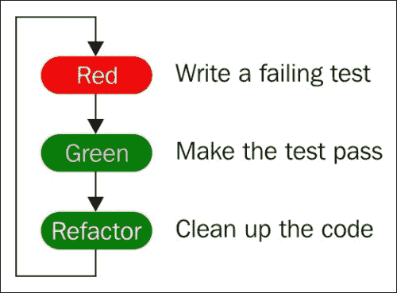
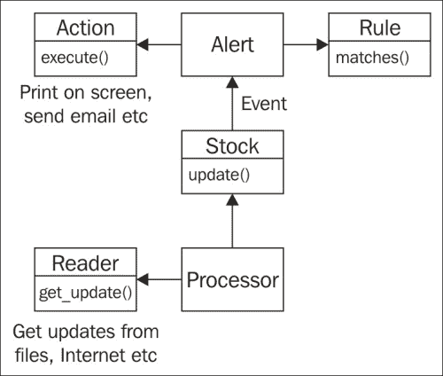

# 第一章. 测试驱动开发入门

我第一次接触**测试驱动开发**（**TDD**）是在 2002 年。当时，它还没有像现在这样普及，我记得看到两位开发者先编写了一些测试，然后才实现功能。我觉得这是一种相当奇怪的写代码方式，并且很快就忘记了它。直到 2004 年，当我参与一个具有挑战性的项目时，我才再次想起了 TDD。我们面临的是一团糟的代码，难以测试，每次更改似乎都会产生一系列新的错误。我想，为什么不试试 TDD 看看它效果如何呢？ suffice to say，TDD 改变了我对软件开发的观点。我们停止了编写混乱的意大利面代码，开始编写设计更好、更易于维护的代码。回归失败率大幅下降。我上瘾了。

也许，就像我一样，你在项目中遇到了一些挑战，并想知道 TDD 如何帮助你。或者，也许你听到业界很多人对 TDD 大加赞扬，你想知道这一切究竟是怎么回事。也许你一直在阅读关于 TDD 将在不久的将来成为一项必备技能的文章，并想尽快掌握它。无论你的动机是什么，我希望这本书能帮助你实现目标。

TDD 不仅仅是一个库或 API；它是一种不同的软件开发方式。在本书中，我们将讨论如何将这个过程应用于编写 Python 软件。我们很幸运，因为 Python 从一开始就提供了对 TDD 的出色支持。事实上，单元测试自 2001 年 4 月 Python 2.1 版本发布以来一直是 Python 标准库的组成部分。自那时以来，已经添加了许多改进，Python 3.4 版本中包含的最新版本拥有许多令人兴奋的功能，我们将在本书的整个过程中探讨这些功能。

# 前提条件

本书将使用 Python 3.4。大多数技术同样适用于 Python 2.6+，但可能需要对本书中提供的示例进行一些小的修改，以便它们能够运行。附录 B，*使用较旧的 Python 版本*列出了这些修改。

本书假设读者具备中级 Python 理解能力。在本书中，我们将使用 Python 语言特性，如 lambda 表达式、装饰器、生成器和属性，并假设读者熟悉它们。虽然我们将在遇到这些特性时简要描述它们，但本书不会深入探讨它们的工作原理，而是选择专注于如何测试此类代码。

### 注意

注意，如果你在你的系统上只安装了 Python 2.x，那么请访问[`python.org`](http://python.org)并下载 Python 3.4 系列的最新版本。对于 Linux 用户，如果你的系统上没有安装 Python 3.4，那么请检查你的发行版的软件包仓库以获取最新版本。如果没有软件包存在，或者你使用的是非标准的或较旧的发行版，那么你可能需要从源代码编译它。有关如何操作的说明可在[`docs.python.org/devguide/setup.html`](https://docs.python.org/devguide/setup.html)找到。

由于 TDD 是一种动手编码活动，本书将在整个过程中使用大量的代码片段。我们建议你通过输入代码并亲自运行它来跟随。当你能够看到代码（或没有工作）在你面前运行时，理解代码和概念要容易得多，而不是仅仅阅读本书中的代码。

### 小贴士

**获取代码**

你可以从你购买的所有 Packt Publishing 书籍的账户中下载示例代码文件。[`www.packtpub.com`](http://www.packtpub.com)。如果你在其他地方购买了这本书，你可以访问[`www.packtpub.com/support`](http://www.packtpub.com/support)并注册，以便将文件直接通过电子邮件发送给你。

本书中的所有代码都可以在[`github.com/siddhi/test_driven_python`](https://github.com/siddhi/test_driven_python)上找到。你可以选择存储库的特定分支来获取本章开始的代码，并从这个起点开始学习本章。你也可以选择分支上的标签来获取本章末尾的代码，如果你更喜欢跳到代码的末尾。

# 理解测试驱动开发

在前几段的热潮之后，你可能想知道测试驱动开发究竟是什么，以及它是否是一种复杂的程序，需要很多技能来实现。实际上，测试驱动开发非常简单。下面的流程图显示了过程中的三个步骤。



让我们更详细地回顾一下前面的流程图。

+   **红色**：第一步是编写一个小型单元测试用例。因为我们只编写了测试，还没有编写实现，所以这个测试自然会失败。

+   **绿色**：接下来，我们编写实现所需功能的代码。在这个阶段，我们并不是要创建最佳的设计或最易读的代码。我们只想得到一个简单的东西，它能通过测试。

+   **重构**：现在测试通过了，我们回头看看代码，看看是否可以改进。这可能涉及改进设计，或使其更易读或更易于维护。我们可以使用迄今为止编写的测试来确保我们在重构步骤中没有破坏任何东西。

+   当我们进行下一个测试并实现下一个功能片段时，这个循环会重复进行。

熟悉 TDD 的开发者通常每小时会经历多次这个循环，每次实现功能的小步骤。

## TDD 与单元测试与集成测试的比较

在我们继续前进之前，让我们短暂地偏离一下，定义一些术语并了解它们之间的区别。很容易在这些术语之间感到困惑，它们在不同的地方经常被赋予不同的含义。

在这个术语的最广泛意义上，**单元测试**简单地说就是测试单个代码单元，将其与其他可能与之集成的代码隔离开。传统上，单元测试是主要由测试工程师执行的活动。这些工程师会接受开发者给出的代码，并通过一系列测试来验证代码是否工作。由于此代码在集成之前进行了测试，这个过程符合单元测试的定义。传统的单元测试通常是一项手动工作，测试工程师手动执行测试用例，尽管一些团队会更进一步，自动化测试。

**集成测试**是涉及系统多个单元的测试。目标是检查这些单元是否已正确集成。一个典型的集成测试可能是访问一个网页，填写一个表单，并检查屏幕上是否显示了正确的消息。为了使这个测试通过，UI 必须正确显示表单，输入必须被正确捕获，并且该输入必须传递给任何逻辑处理。这些步骤可能涉及在生成消息和 UI 正确显示之前从数据库中读取和写入。只有当所有这些交互都成功时，集成测试才会通过。如果任何一步失败，集成测试将失败。

到目前为止，一个合理的问题可能是询问我们为什么需要单元测试。为什么不只写集成测试，一个测试就能一次性检查应用中的许多部分呢？原因是集成测试无法精确指出失败的位置。一个失败的集成测试可能存在 UI、逻辑或数据读取或写入过程中的错误。需要大量调查才能找到错误并修复它。相比之下，良好的单元测试会在失败时精确指出是什么出了问题。开发者可以直接找到问题所在并修复错误。

在这个过程中，团队开始转向一个过程，即开发者自己为他们所实现的功能编写测试。这些测试会在开发者完成实现后编写，并有助于验证代码是否按预期工作。这些测试通常是自动化的。这样的过程通常被称为**开发者测试**或**开发者单元测试**。

TDD 通过在开始实现之前编写测试，将开发者测试推进了一步。

+   **开发者测试**：开发者编写的任何类型的自动化单元测试，无论是功能实现之前还是之后。

+   **单元测试**：由开发者或测试人员对应用程序的特定单元进行的任何类型的测试。这些测试可能是自动化的，也可以手动运行。

+   **集成测试**：涉及两个或更多单元一起工作的任何类型的测试。这些测试通常由测试人员执行，但也可以由开发人员执行。这些测试可能是手动或自动的。

如我们所见，单元测试是一个通用术语，而开发者测试是单元测试的一个特定子集，TDD 是开发者测试的一种特定形式。

表面上看，传统的单元测试、开发者测试和 TDD 看起来很相似。它们似乎都是关于为单个代码单元编写测试，只有基于谁编写测试以及测试是在代码编写之前还是之后编写的细微差别。

然而，深入挖掘，差异就出现了。首先，意图大不相同。传统的单元测试和开发者测试都是关于编写测试来验证代码是否按预期工作。另一方面，TDD 的主要焦点实际上并不是测试。在实现相应功能之前简单地编写一个测试，就改变了我们实现功能时的思维方式。生成的代码更易于测试，通常具有简单优雅的设计，并且更易于维护和阅读。这是因为使类易于测试也鼓励良好的设计实践，例如解耦依赖关系和编写小型、模块化的类。

因此，可以说 TDD 完全是关于编写更好的代码，而最终得到一个完全自动化的测试套件只是一个愉快的副作用。

这种意图上的差异在测试类型上表现出来。开发者测试通常会产生大型测试用例，其中相当一部分测试代码涉及测试设置。相比之下，使用 TDD 编写的测试非常小且数量众多。有些人喜欢称它们为微测试，以区分它们与其他开发者测试或传统单元测试。TDD 风格的单元测试还试图非常快地运行，因为它们在开发过程中每隔几分钟就会执行一次。

最后，TDD（测试驱动开发）中编写的测试是推动开发前进的测试，而不一定是覆盖所有可想象场景的测试。例如，一个本应处理文件的函数可能会有处理文件存在或不存在的情况的测试，但可能不会有测试来查看如果文件大小为 1TB 会发生什么。后者可能是测试人员可能会测试的情况，但在 TDD 中除非函数明显预期可以处理这样的文件，否则这种测试是不寻常的。

这真正突出了 TDD 与其他单元测试形式之间的区别。

### 备注

TDD 是关于编写更好、更干净、更易于维护的代码，而不仅仅是关于测试。

# 使用 TDD 构建股票警报应用程序

在本书的整个过程中，我们将使用 TDD 构建一个简单的股票警报应用程序。该应用程序将监听来自来源的股票更新。来源可以是任何东西——互联网上的服务器，硬盘上的文件，或其他东西。我们将能够定义规则，当规则匹配时，应用程序会发送给我们电子邮件或短信。

例如，我们可以定义一条规则为“如果 AAPL 股价突破 550 美元，则发送给我一封电子邮件”。一旦定义，应用程序将监控更新，并在规则匹配时发送电子邮件。

## 编写我们的第一个测试

谈话已经足够。让我们开始我们的应用程序。从检查之前提到的应用程序描述来看，我们似乎需要以下模块：

+   一种读取股票价格更新的方法，无论是从互联网还是从文件中

+   管理股票信息以便我们可以处理的方法

+   定义规则并匹配当前股票信息的方法

+   当规则匹配时发送电子邮件或短信的方法

根据这些要求，我们将使用以下设计：



每个术语如下讨论：

+   **警报**：这是应用程序的核心。警报将一个**规则**映射到一个**动作**。当规则匹配时，执行该动作。

+   **规则**：一个**规则**包含我们想要检查的条件。当规则匹配时，我们应该收到警报。

+   **动作**：这是规则匹配时要执行的动作。这可能只是简单地打印屏幕上的消息，或者在更实际的工作场景中，我们可能会发送电子邮件或短信。

+   **股票**：**股票**类跟踪股票的当前价格以及可能的价格历史。当有更新时，它会向**警报**发送一个**事件**。然后警报检查是否匹配规则以及是否需要执行任何动作。

+   **事件**：当**股票**更新时，此类用于向**警报**发送事件。

+   **处理器**：处理器从**读者**那里获取股票更新，并使用最新数据更新**股票**。更新股票会导致事件触发，进而导致警报检查规则匹配。

+   **读者**：**读者**从某个来源获取股票警报。在这本书中，我们将从简单的列表或文件中获取更新，但你也可以构建其他读者以从互联网或其他地方获取更新。

在所有这些类中，管理股票信息的方式似乎是最简单的，所以让我们从这里开始。我们要做的是创建一个 `Stock` 类。这个类将保存当前股票的信息。它将存储当前价格和可能的一些最近价格历史。当我们想要匹配规则时，我们可以使用这个类。

要开始，创建一个名为 `src` 的目录。这个目录将保存我们所有的源代码。在这本书的其余部分，我们将把这个目录称为项目根目录。在 `src` 目录内，创建一个名为 `stock_alerter` 的子目录。这是我们将要实现股票警报模块的目录。

好的，让我们开始实现这个类。

不！等等！记得之前描述的 TDD 流程吗？第一步是编写测试，在我们编写实现代码之前。通过先编写测试，我们现在有机会思考我们想让这个类做什么。

那么，我们到底想让这个类做什么呢？让我们从一个简单的事情开始：

+   `Stock` 类应该用股票代码进行实例化

+   一旦实例化，并且在任何更新之前，价格应该是 `None`

当然，我们还想让这个类做更多的事情，但我们会稍后再考虑。我们不会提出一个非常全面的特性列表，而是会一次关注一小块功能。现在，前面的期望已经足够了。

要将前面的期望转换为代码，在项目根目录下创建一个名为 `stock.py` 的文件，并将以下代码放入其中：

```py
import unittest
class StockTest(unittest.TestCase):
    def test_price_of_a_new_stock_class_should_be_None(self):
        stock = Stock("GOOG")
        self.assertIsNone(stock.price)
if __name__ == "__main__":
    unittest.main()
```

这段代码做了什么？

1.  首先，我们导入 `unittest`。这是我们将要使用的测试框架所在的库。幸运的是，它默认包含在 Python 标准库中，总是可用，所以我们不需要安装任何东西，可以直接导入模块。

1.  第二，我们创建一个名为 `StockTest` 的类。这个类将包含 `Stock` 类的所有测试用例。这只是将相关的测试分组在一起的一种方便方式。没有规定每个类都应该有一个对应的测试类。有时，如果我们对一个类有很多测试，那么我们可能想为每个单独的行为创建单独的测试类，或者以其他方式分组测试。然而，在大多数情况下，为实际类创建一个测试类是最佳做法。

1.  我们的 `StockTest` 类继承自 `unittest` 模块中的 `TestCase` 类。所有测试都需要继承这个类，以便被识别为测试类。

1.  在课堂上，我们有一个方法。这个方法是一个测试用例。`unittest` 框架会选取任何以 `test` 开头的方法。这个方法的名字描述了测试要检查的内容。这样，当我们几个月后回来时，我们仍然记得测试做了什么。

1.  测试创建了一个 `Stock` 对象，然后检查价格是否为 `None`。`assertIsNone` 是我们从它继承的 `TestCase` 类提供的一个方法。它检查其参数是否为 `None`。如果参数不是 `None`，它将引发一个 `AssertionError` 并使测试失败。否则，执行将继续到下一行。由于那是方法的最后一行，测试完成并标记为通过。

1.  最后一段检查模块是否直接从命令行执行。在这种情况下，`__name__` 变量将具有 `__main__` 的值，并且代码将执行 `unittest.main()` 函数。此函数将扫描当前文件中的所有测试并执行它们。我们需要在条件中包装此函数调用的原因是因为如果模块被导入到另一个文件中，这部分将不会执行。

恭喜！你已经完成了第一个失败的测试。通常，一个失败的测试会是一个令人担忧的原因，但在这个情况下，一个失败的测试意味着我们已经完成了过程的第一个步骤，可以继续到下一个步骤。

## 分析测试输出

现在我们已经编写了测试，是时候运行它了。要运行测试，只需执行文件。假设当前目录是 `src` 目录，以下是要执行文件的命令：

+   Windows：

    ```py
    python.exe stock_alerter\stock.py

    ```

+   Linux/Mac：

    ```py
    python3 stock_alerter/stock.py

    ```

如果 Python 可执行文件不在你的路径上，那么你将必须在这里给出完整的可执行文件路径。在某些 Linux 发行版中，文件可能被称为 `python34` 或 `python3.4` 而不是 `python3`。

当我们运行文件时，输出看起来如下所示：

```py
E
=====================================================================
ERROR: test_price_of_a_new_stock_class_should_be_None (__main__.StockTest)
---------------------------------------------------------------------
Traceback (most recent call last):
 File "stock_alerter\stock.py", line 6, in test_price_of_a_new_stock_class_should_be_None
 stock = Stock("GOOG")
NameError: name 'Stock' is not defined
---------------------------------------------------------------------
Ran 1 test in 0.001s

FAILED (errors=1)

```

如预期，测试失败了，因为我们还没有创建 `Stock` 类。

让我们更详细地看看那个输出：

+   第一行上的 `E` 表示测试产生了错误。如果测试通过了，那么你会在那一行看到一个点。一个失败的测试将被标记为 `F`。由于我们只有一个测试，所以那里只有一个字符。当我们有多个测试时，每个测试的状态将显示在同一行上，每个测试一个字符。

+   在显示所有测试状态之后，我们将获得任何测试错误和失败的更详细说明。它告诉我们是否有失败或错误（在这种情况下用 `ERROR` 表示），以及测试的名称和它所属的类。随后是一个跟踪回溯，这样我们知道失败发生在哪里。

+   最后，有一个总结显示了执行了多少个测试，有多少通过了或失败了，以及有多少产生了错误。

## 测试错误与测试失败

测试可能不通过有两个原因：它可能失败了，或者它可能引发了错误。这两个之间有一个小的区别。**失败**表示我们期望某种结果（通常通过断言），但得到了其他东西。例如，在我们的测试中，我们断言 `stock.price` 是 `None`。假设 `stock.price` 除了 `None` 之外还有其他值，那么测试将失败。

错误表明发生了意外情况，通常是一个意外的异常被抛出。在我们之前的例子中，我们得到一个错误是因为`Stock`类尚未定义。

在这两种情况下，测试都没有通过，但原因不同，这些原因分别作为测试失败和测试错误单独报告。

## 使测试通过

现在我们有一个失败的测试，让我们让它通过。在`stock.py`文件中`import unittest`行之后添加以下代码：

```py
class Stock:
    def __init__(self, symbol):
        self.symbol = symbol
        self.price = None
```

我们在这里所做的只是实现足够的代码以通过测试。我们创建了`Stock`类，这样测试就不会因为缺少它而抱怨，并且我们将`price`属性初始化为`None`。

那么，这个类的其余实现呢？这可以稍后处理。我们现在的重点是让这个类的当前期望通过。随着我们编写更多的测试，我们最终也会实现这个类的更多部分。

再次运行文件，这次输出应该如下所示：

```py
.
---------------------------------------------------------------------
Ran 1 test in 0.000s

OK

```

第一行有一个点，这表示测试正在通过。最后的`OK`消息告诉我们所有测试都已通过。

最后一步是对代码进行重构。由于代码量很少，实际上没有什么可以清理的。因此，我们可以跳过重构步骤，直接开始下一个测试。

# 重新组织测试代码

我们在同一个文件中添加了测试用例，这是为独立脚本和不太复杂的应用程序添加测试用例的一个好方法。然而，对于更大的应用程序，将测试代码与生产代码分开是一个好主意。

组织测试代码的这种模式有两种常见模式。

第一种模式是将测试代码保存在一个单独的根目录中，如下所示：

```py
root
|
+- package
|  |
|  +- file1
|  +- file2
|
+- test
   |
   +- test_file1
   +- test_file2
```

另一种模式是将测试代码作为主代码的一个子模块，如下所示：

```py
root
|
+- package
   |
   +- file1
   +- file2
   +- test
      |
      +- test_file1
      +- test_file2
```

第一种模式通常用于独立模块，因为它允许我们将代码和测试一起分发。测试通常可以在不进行大量设置或配置的情况下运行。第二种模式在应用程序需要打包而不包含测试代码时具有优势，例如在部署到生产服务器或向客户（在商业应用程序的情况下）分发时。然而，这两种模式都很受欢迎，主要取决于个人偏好，选择哪种方法。

我们将在本书中遵循第一种模式。要开始，在`stock_alerter`目录中创建一个名为`tests`的目录。接下来，在这个目录中创建一个名为`test_stock.py`的文件。我们将把所有的测试用例与源文件一一对应。这意味着，一个名为`sample.py`的文件将在`tests/test_sample.py`文件中有其测试用例。这是一个简单的命名约定，有助于快速定位测试用例。

最后，我们将我们的测试用例移动到这个文件中。我们还需要导入`Stock`类，以便在测试用例中使用它。我们的`test_stock.py`文件现在看起来如下：

```py
import unittest
from ..stock import Stock

class StockTest(unittest.TestCase):
    def test_price_of_a_new_stock_class_should_be_None(self):
        stock = Stock("GOOG")
        self.assertIsNone(stock.price)
```

记得从`stock.py`中删除`import unittest`行，因为它现在不再包含测试代码。之前我们只有一个独立的脚本，但现在我们有一个`stock_alerter`模块和一个`stock_alerter.tests`子模块。由于我们现在正在使用模块，我们还应该在`stock_alerter`和`tests`目录中添加一个空的`__init__.py`文件。

我们现在的文件布局应该如下所示：

```py
src
|
+- stock_alerter
   |
   +- __init__.py
   +- stock.py
   +- tests
      +- __init__.py
      +- test_stock.py
```

## 重新组织后的测试运行

如果你已经注意到，测试代码中不再有对`unittest.main()`的调用。在单个脚本中包含对`unittest.main()`的调用效果很好，因为它允许我们通过简单地执行文件来运行测试。然而，这不是一个可扩展的解决方案。如果我们有数百个文件，我们希望一次性运行所有测试，而不必逐个执行每个文件。

为了解决这个问题，Python 3 从命令行提供了非常出色的测试发现和执行能力。只需进入`src`目录并运行以下命令：

+   Windows：

    ```py
    python.exe -m unittest

    ```

+   Linux/Mac：

    ```py
    python3 -m unittest

    ```

此命令将遍历当前目录及其所有子目录，并运行找到的所有测试。这是默认的自动发现执行模式，其中命令搜索所有文件并运行测试。自动发现也可以通过以下命令显式运行：

```py
python3 -m unittest discover

```

可以使用以下参数自定义自动发现，以检查特定目录或文件：

+   `-s start_directory`：指定发现应开始的起始目录。默认为当前目录。

+   `-t top_directory`：指定顶级目录。这是从该目录执行导入的目录。如果起始目录位于包内并且由于导入错误而出现错误，则此选项很重要。默认为起始目录。

+   `-p file_pattern`：用于识别测试文件的文件模式。默认情况下，它检查以`test`开头的 Python 文件。如果我们给测试文件命名其他名称（例如，`stock_test.py`），那么我们必须传递此参数，以便正确地将文件识别为测试文件。

为了说明起始目录和顶级目录之间的区别，请从`src`目录运行以下命令：

```py
python3 -m unittest discover -s stock_alerter

```

前面的命令将因导入错误而失败。原因是当起始目录设置为`stock_alerter`时，`tests`目录被导入为顶级模块，相对导入失败。为了解决这个问题，我们需要使用以下命令：

```py
python3 -m unittest discover -s stock_alerter -t .

```

此命令将导入相对于顶级目录的所有模块，因此`stock_alerter`正确地成为主模块。

你也可以禁用自动发现，并仅指定要运行的某些测试：

+   传递一个模块名称将只运行该模块内的测试。例如，使用`python3 -m unittest stock_alerter.tests.test_stock`将只运行`test_stock.py`中的测试。

+   您可以将范围进一步细化到特定的类或方法，例如使用`python3 -m unittest stock_alerter.tests.test_stock.StockTest`。

# 摘要

恭喜！您已经完成了一个 TDD 的循环。如您所见，每个循环都非常快。有些循环，比如我们刚刚经历的，可以在几秒钟内完成。其他循环可能涉及相当多的清理工作，可能需要相当长的时间。每个循环都会实现一个小测试，一小部分功能以通过测试，然后进行一些清理以确保代码质量。

在本章中，我们探讨了 TDD 是什么，它与其他形式的单元和集成测试有何不同，并编写了我们的第一个测试。

到目前为止，我们的实现仍然非常小且非常简单。您可能会想知道，为了编写和实现这四行非常简单的代码，所有的炒作是否都值得。在接下来的几章中，我们将通过示例进一步深入探讨过程。
