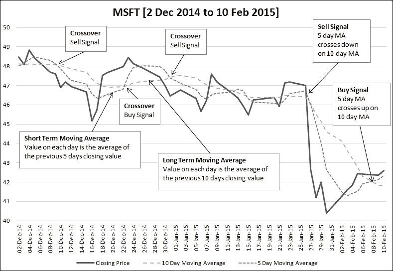

# 第三章 代码异味和重构

在上一章中，我们更详细地介绍了 TDD 周期。在本章中，我们将探讨相关的概念：代码异味和重构。

遵循测试驱动开发过程的最大优点之一是，我们编写的测试总是存在，以确保我们不会破坏任何东西。这为我们提供了一个安全网，可以随意修改代码，并确保代码易于阅读、易于维护且编写良好。没有测试，我们总是对即将破坏某物感到担忧，而且往往决定什么都不做。这导致代码随着时间的推移而退化，直到它变得如此混乱，以至于没有人愿意再触碰它。结果是，实现新功能所需的时间更长，这不仅因为设计混乱，而且因为我们必须进行广泛的测试以确保现有功能没有破坏。

因此，我们绝对不能跳过 TDD 周期的第三步：重构。

### 注意

本章的代码从上一章的练习完成后的点开始。参见附录 A，*练习答案*，了解练习中做出的更改，或者从[`github.com/siddhi/test_driven_python`](https://github.com/siddhi/test_driven_python)下载本章代码的起点。

# 双交叉移动平均

在上一章中，我们编写了一个检查上升趋势的方法。在本章中，我们将通过开发一个检查双交叉移动平均的方法来继续那个例子。

**双交叉移动平均**（**DMAC**）是一个简单的指标，用于显示股票的短期趋势与长期趋势相比。

下图显示了 DMAC 的工作原理：



考虑一个股票，其收盘价如上所示。首先，我们计算两个移动平均趋势。短期（5 天）移动平均是通过计算较短天数内的移动平均得到的。长期移动平均是通过计算较长天数内的移动平均得到的，例如最后 10 天的移动平均。

当我们绘制长期和短期移动平均图时，我们会看到在某些点上，短期图从低于长期图交叉到高于长期图。这一点代表一个**买入信号**。在其他点上，短期图从上方交叉到下方。这一点代表一个**卖出信号**。在所有其他点上，不应采取任何行动。

# 实现双交叉移动平均

我们将要实现一个名为`get_crossover_signal`的方法，用于`Stock`类。以下是该方法的以下要求：

+   该方法接受一个日期作为参数，并返回该日期是否有任何交叉。

+   如果存在**买入信号**（5 天移动平均线从下方交叉到上方），则该方法应返回 1

+   如果存在**卖出信号**（5 天移动平均线从上方交叉到下方），则该方法应返回-1

+   如果没有交叉，则该方法返回 0（**中性信号**）

+   该方法应仅考虑收盘价（该日期的最后更新），而不是该日期的开盘价或中间价

+   如果该日期没有更新，则该方法应使用前一天的收盘价

+   如果没有足够的数据来计算长期移动平均数（我们需要至少 11 天的收盘价），则该方法应返回 0

# 识别代码异味

以下是一个通过测试的实现（要查看测试用例列表，请从[`github.com/siddhi/test_driven_python`](https://github.com/siddhi/test_driven_python)下载本章的代码）。该实现使用了`datetime`模块中的`timedelta`类，因此您需要在文件顶部导入它才能使其工作。

```py
    def get_crossover_signal(self, on_date):
        cpl = []
        for i in range(11):
            chk = on_date.date() - timedelta(i)
            for price_event in reversed(self.price_history):
                if price_event.timestamp.date() > chk:
                    pass
                if price_event.timestamp.date() == chk:
                    cpl.insert(0, price_event)
                    break
                if price_event.timestamp.date() < chk:
                    cpl.insert(0, price_event)
                    break

        # Return NEUTRAL signal
        if len(cpl) < 11:
            return 0

        # BUY signal
        if sum([update.price for update in cpl[-11:-1]])/10 \
                > sum([update.price for update in cpl[-6:-1]])/5 \
            and sum([update.price for update in cpl[-10:]])/10 \
                < sum([update.price for update in cpl[-5:]])/5:
                    return 1

        # BUY signal
        if sum([update.price for update in cpl[-11:-1]])/10 \
                < sum([update.price for update in cpl[-6:-1]])/5 \
            and sum([update.price for update in cpl[-10:]])/10 \
                > sum([update.price for update in cpl[-5:]])/5:
                    return -1

        # NEUTRAL signal
        return 0
```

虽然上述代码实现了功能，但它完全无法阅读。这就是在跳过重构步骤时会发生的情况。几个月后回来修复错误或添加功能时，理解它将花费很长时间。因此，定期重构至关重要。

你能在这段代码中找到哪些问题？以下是一些问题：

+   **长方法**：长方法和类难以阅读和理解。

+   **不清晰的命名**：例如，变量`cpl`应该代表什么？

+   **复杂的条件语句**：`if`条件相当复杂，不清楚它们具体检查了什么。

+   **糟糕的注释**：所有注释都没有描述性，而且另外两个注释都说了`买入信号`。显然，其中一个是错误的。

+   **魔法常数**：在多个地方，数字 5、10、-11 等被硬编码。假设我们决定将长期移动平均数改为使用 20 天周期，那么我们需要更改哪些地方？我们可能会遗漏一个更改的可能性有多大？

+   **代码重复**：这两个条件似乎几乎相同，只有非常小的差异。

所有这些问题通常被称为代码异味。**代码异味**是简单且易于发现的模式，可以通过重构来改进代码。有时，通过进行一些简单的更改就可以修正代码异味。有时，它甚至可能导致设计本身的改变。

# 代码重构

**重构**是通过一系列非常小的步骤来清理代码或更改设计的过程。在重构过程中不添加或删除任何新功能。重构的目的是通过消除一些代码异味来使代码变得更好。有各种各样的重构，从极其简单的到更复杂的重构。让我们将这些应用于上面的代码。

## 重命名变量和重命名方法的重构

这两种可能是最简单的重构。名称本身就说明了问题——重构是将变量或方法重命名。虽然简单，但它们非常重要，因为糟糕的变量和方法名称在代码中非常常见。

以下是将**重命名变量**重构应用于代码的步骤：

1.  运行所有测试以确保它们通过。

1.  改变变量的名称，并在所有使用该变量的地方进行更改。

1.  再次运行所有测试以确保我们没有破坏任何东西。

**重命名方法**重构遵循以下步骤：

1.  运行所有测试以确保它们通过。

1.  改变方法名称，并在所有调用此方法的地方进行更改。

1.  再次运行所有测试。

现在我们将重命名变量重构应用于我们的代码。`cpl`变量保存了过去 11 天股票的收盘价列表。我们应该将其重命名为更具描述性的名称，例如`closing_price_list`。我们现在就来做这件事：

1.  运行测试（测试用例列表在本书末尾的*练习*部分给出）。

1.  在方法的所有地方将`cpl`重命名为`closing_price_list`。

1.  再次运行测试。如果有任何地方我们忘记重命名变量，那么测试将失败，我们可以修复它并再次运行测试。

### 注意

**测试作为安全网**

在我们进行重构之前，拥有一个坚实的测试集是至关重要的。这是因为测试让我们有信心在重构过程中没有破坏任何东西。在重构过程中，我们将多次运行测试，因为我们从一步到下一步进行。

现在我们将重命名变量重构应用于我们的代码。`cpl`变量保存了过去 11 天股票的收盘价列表。我们应该将其重命名为更具描述性的名称，例如`closing_price_list`。

快速搜索和替换后，代码现在看起来是这样的：

```py
def get_crossover_signal(self, on_date):
    closing_price_list = []
    for i in range(11):
        chk = on_date.date() - timedelta(i)
        for price_event in reversed(self.price_history):
            if price_event.timestamp.date() > chk:
                pass
            if price_event.timestamp.date() == chk:
                closing_price_list.insert(0, price_event)
                break
            if price_event.timestamp.date() < chk:
                closing_price_list.insert(0, price_event)
                break

    # Return NEUTRAL signal
    if len(closing_price_list) < 11:
        return 0

    # BUY signal
    if (sum([update.price
                 for update in closing_price_list[-11:-1]])/10
            > sum([update.price
                       for update in closing_price_list[-6:-1]])/5
        and sum([update.price
                     for update in closing_price_list[-10:]])/10
            < sum([update.price
                       for update in closing_price_list[-5:]])/5):
                return 1

    # BUY signal
    if (sum([update.price
                 for update in closing_price_list[-11:-1]])/10
            < sum([update.price
                 for update in closing_price_list[-6:-1]])/5
        and sum([update.price
                     for update in closing_price_list[-10:]])/10
            > sum([update.price
                       for update in closing_price_list[-5:]])/5):
                return -1

    # NEUTRAL signal
    return 0
```

## 注释风格

接下来，让我们看看方法中的注释。一般来说，注释是代码的坏味道，因为它们表明代码本身不易读。一些注释，如上面的代码中的注释，只是简单地重复了代码正在做什么。我们经常添加这样的注释，因为这样做比清理代码要容易。所以，无论何时我们看到注释，都值得探索是否需要代码清理。注释的另一个问题是它们可以非常容易地与代码不同步。当我们未来回来实现新功能时，我们没有更新注释是很常见的情况。当我们试图理解注释与代码不同步的代码时，这会导致大量的困惑。

并非所有注释都是不好的。有用的注释解释了为什么某个代码片段要以这种方式编写。这是仅通过阅读代码无法推断出的信息。考虑以下示例：

```py
# Halve the price if age is 60 or above
if age >= 60:
    price = price * 0.5

# People aged 60 or above are eligible for senior citizen discount
if age >= 60:
    price = price * 0.5

if age >= SENIOR_CITIZEN_AGE:
    price = price * SENIOR_CITIZEN_DISCOUNT
```

第一个示例显示了一个仅仅重复下面代码的注释。这里注释没有增加任何价值。粗略地看一下代码，读者就能确切地知道注释在说什么。

第二个示例显示了一个更好的注释。这个注释没有重复代码，而是解释了为什么存在这段特定代码的合理性。

在第三个示例中，硬编码的数字已经被常数替换。在这个例子中，代码是自我解释的，因此我们可以完全去掉注释。

三个示例展示了编写注释的理想过程。首先，我们看看是否可以通过某种方式使代码更清晰，以至于我们不需要注释。如果这不可能，那么就写一个注释，解释为什么代码要以这种方式编写。如果你倾向于写一个关于代码片段做什么的注释，那么请停下来思考是否需要重构代码。

## 将魔法数字替换为常数

如前一个示例所示，用常数替换硬编码的值可以完成两件事：首先，如果我们需要更改这些值，我们可以在一个地方完成更改，其次，常数更具描述性，有助于使代码更易读。

这个重构的过程如下：

1.  运行测试。

1.  创建常数，并用常数替换一个硬编码的值。

1.  再次运行测试。

1.  重复步骤 2 和 3，直到所有值都被常数替换。

我们的方法在所有计算中使用长期移动平均和短期移动平均的时间跨度。我们可以创建常数来标识这两个值，如下所示：

```py
class Stock:
    LONG_TERM_TIMESPAN = 10
    SHORT_TERM_TIMESPAN = 5

```

我们可以使用我们方法中的常数，如下所示：

```py
    def get_crossover_signal(self, on_date):
        closing_price_list = []
        NUM_DAYS = self.LONG_TERM_TIMESPAN + 1
        for i in range(NUM_DAYS):
            chk = on_date.date() - timedelta(i)
            for price_event in reversed(self.price_history):
                if price_event.timestamp.date() > chk:
                    pass
                if price_event.timestamp.date() == chk:
                    closing_price_list.insert(0, price_event)
                    break
                if price_event.timestamp.date() < chk:
                    closing_price_list.insert(0, price_event)
                    break
```

除了用于计算的常数外，我们还可以用更具描述性的`Enum`类替换返回值。这是 Python 3.4 中的一个新特性，我们可以在这里使用它。

### 注意

虽然`Enum`是 Python 3.4 标准库的一部分，但它也被回滚到更早的 Python 版本。如果你使用的是较旧的 Python 版本，请从 PyPy 下载并安装 enum34 包。

要做到这一点，我们首先按照以下方式导入`Enum`：

```py
from enum import Enum
```

然后我们创建枚举类。

```py
class StockSignal(Enum):
    buy = 1
    neutral = 0
    sell = -1
```

最后，我们可以用枚举替换返回值：

```py
        # NEUTRAL signal
        return StockSignal.neutral

```

通过这个更改，我们还可以删除返回值上面的注释，因为常量已经足够描述性。

## 提取方法重构

另一种使注释冗余的方法是将代码放入一个具有描述性名称的方法中。这也帮助将长方法分解成更小的、更容易理解的方法。**提取方法**重构用于此目的。提取方法重构的步骤如下：

1.  运行现有的测试。

1.  识别代码块中我们想要重构的变量，这些变量也在代码块之前使用。这些变量需要作为参数传递到我们的方法中。

1.  识别代码块中在代码块之后使用的变量。这些变量将是我们方法返回的值。

1.  创建一个具有描述性名称的方法，该方法接受上述变量作为参数。

1.  使新方法返回代码块之后需要的适当值。

1.  将代码块移动到方法中。用对方法的调用替换这些行。

1.  再次运行测试。

让我们将这种重构应用到我们的方法中。这个循环用于为前十一天的每一天创建一个收盘价列表：

```py
    def _get_closing_price_list(self, on_date, num_days):
        closing_price_list = []
        for i in range(num_days):
            chk = on_date.date() - timedelta(i)
            for price_event in reversed(self.price_history):
                if price_event.timestamp.date() > chk:
                    pass
                if price_event.timestamp.date() == chk:
                    closing_price_list.insert(0, price_event)
                    break
                if price_event.timestamp.date() < chk:
                    closing_price_list.insert(0, price_event)
                    break
        return closing_price_list
```

我们可以将这段代码提取到一个单独的方法中。以下是这样做的方法：

1.  首先，我们创建一个名为`_get_closing_price_list`的新方法：

    ```py
    def _get_closing_price_list(self, on_date, num_days):
        pass
    ```

    这个方法接受两个参数，因为那些值在循环中使用。目前它们是局部变量，但一旦我们将循环提取到这个方法中，我们就需要将这些值传递给方法。

1.  现在，我们将循环代码从主方法中剪切并粘贴到这个新方法中：

    ```py
    def _get_closing_price_list(self, on_date, num_days):
        closing_price_list = []
        for i in range(NUM_DAYS):
            chk = on_date.date() - timedelta(i)
            for price_event in reversed(self.price_history):
                if price_event.timestamp.date() > chk:
                    pass
                if price_event.timestamp.date() == chk:
                    closing_price_list.insert(0, price_event)
                    break
                if price_event.timestamp.date() < chk:
                    closing_price_list.insert(0, price_event)
                    break
    ```

1.  到目前为止，循环仍然引用的是`NUM_DAYS`常量，这是一个局部变量。我们需要将其更改为使用参数的值。我们还将此方法返回`closing_price_list`：

    ```py
    def _get_closing_price_list(self, on_date, num_days):
        closing_price_list = []
        for i in range(num_days):
            chk = on_date.date() - timedelta(i)
            for price_event in reversed(self.price_history):
                if price_event.timestamp.date() > chk:
                    pass
                if price_event.timestamp.date() == chk:
                    closing_price_list.insert(0, price_event)
                    break
                if price_event.timestamp.date() < chk:
                    closing_price_list.insert(0, price_event)
                    break
        return closing_price_list
    ```

1.  最后，我们将调用此方法的地方放在循环代码原本的位置：

    ```py
    def get_crossover_signal(self, on_date):
        NUM_DAYS = self.LONG_TERM_TIMESPAN + 1
        closing_price_list = \
            self._get_closing_price_list(on_date, NUM_DAYS)
    ```

现在，我们运行测试以确保我们没有破坏任何东西。它们都应该通过。

重构后的代码看起来像这样：

```py
def _get_closing_price_list(self, on_date, num_days):
    closing_price_list = []
    for i in range(num_days):
        chk = on_date.date() - timedelta(i)
        for price_event in reversed(self.price_history):
            if price_event.timestamp.date() > chk:
                pass
            if price_event.timestamp.date() == chk:
                closing_price_list.insert(0, price_event)
                break
            if price_event.timestamp.date() < chk:
                closing_price_list.insert(0, price_event)
                break
    return closing_price_list

def get_crossover_signal(self, on_date):
    NUM_DAYS = self.LONG_TERM_TIMESPAN + 1
    closing_price_list = \
        self._get_closing_price_list(on_date, NUM_DAYS)
    …
```

## 替换计算为临时变量

现在，让我们将注意力转向执行交叉检查的条件语句。

条件语句很混乱，因为我们同时进行许多计算和比较，这很难跟踪。我们可以通过使用临时变量来存储计算值，然后在条件中使用这些变量来清理它。

在这个重构中，我们并没有使用变量来达到任何目的，只是给计算一个名字，从而使代码更容易阅读。

以下是我们如何进行这个重构的：

1.  运行测试。

1.  将计算赋值给一个变量。变量的名称应该解释计算的目的。

1.  在条件中使用变量。

1.  运行测试。

让我们将条件语句中的四个计算提取到变量中：

```py
long_term_series = closing_price_list[-self.LONG_TERM_TIMESPAN:]
prev_long_term_series = \
    closing_price_list[-self.LONG_TERM_TIMESPAN-1:-1]
short_term_series = closing_price_list[-self.SHORT_TERM_TIMESPAN:]
prev_short_term_series = \
    closing_price_list[-self.SHORT_TERM_TIMESPAN-1:-1]
```

我们然后可以在条件中使用这些变量：

```py
if sum([update.price for update in prev_long_term_series])/10 \
    > sum([update.price for update in prev_short_term_series])/5 \
    and sum([update.price for update in long_term_series])/10 \
        < sum([update.price for update in short_term_series])/5:
            return StockSignal.buy
```

## 提取条件到方法

我们现在可以将注意力转向条件语句。在条件语句中并不清楚正在发生什么比较。一种处理方法是在上面的重构中继续使用**用临时变量替换计算**。另一种选择是应用**将条件提取到方法中**的重构。在这个重构中，我们将比较移动到它自己的方法中，并给它一个描述性的名称。

以下是对重构的步骤：

1.  运行测试。

1.  将整个条件语句移动到方法中。

1.  在条件之前调用该方法。

1.  运行测试。

这是目前我们拥有的条件代码：

```py
if sum([update.price for update in prev_long_term_series])/10 \> sum([update.price for update in prev_short_term_series])/5 \and sum([update.price for update in long_term_series])/10 \< sum([update.price for update in short_term_series])/5:
            return StockSignal.buy
```

首先，我们应用**用临时变量替换计算**的重构，并将移动平均计算提取到一个命名变量中：

```py
long_term_ma = sum([update.price
                    for update in long_term_series])\
                /self.LONG_TERM_TIMESPAN
prev_long_term_ma = sum([update.price
                         for update in prev_long_term_series])\
                     /self.LONG_TERM_TIMESPAN
short_term_ma = sum([update.price
                     for update in short_term_series])\
                /self.SHORT_TERM_TIMESPAN
prev_short_term_ma = sum([update.price
                          for update in prev_short_term_series])\
                     /self.SHORT_TERM_TIMESPAN
```

接下来，可以将条件语句中进行的比较提取到像这样的方法中：

```py
def _is_short_term_crossover_below_to_above(self, prev_short_term_ma,
                                            prev_long_term_ma,
                                            short_term_ma,
                                            long_term_ma):
    return prev_long_term_ma > prev_short_term_ma \
        and long_term_ma < short_term_ma

def _is_short_term_crossover_above_to_below(self, prev_short_term_ma,
                                            prev_long_term_ma,
                                            short_term_ma,
                                            long_term_ma):
    return prev_long_term_ma < prev_short_term_ma \
        and long_term_ma > short_term_ma
```

我们现在在`if`语句中调用该方法，将我们的临时变量作为参数传入：

```py
if self._is_short_term_crossover_below_to_above(prev_short_term_ma,
                                                prev_long_term_ma,
                                                short_term_ma,
                                                long_term_ma):
            return StockSignal.buy

if self._is_short_term_crossover_above_to_below(prev_short_term_ma,
                                                prev_long_term_ma,
                                                short_term_ma,
                                                long_term_ma):
            return StockSignal.sell

return StockSignal.neutral
```

这是经过最后几次重构后的方法看起来像这样：

```py
NUM_DAYS = self.LONG_TERM_TIMESPAN + 1
closing_price_list = self._get_closing_price_list(on_date, NUM_DAYS)

if len(closing_price_list) < NUM_DAYS:
    return StockSignal.neutral

long_term_series = closing_price_list[-self.LONG_TERM_TIMESPAN:]
prev_long_term_series = \
    closing_price_list[-self.LONG_TERM_TIMESPAN-1:-1]
short_term_series = closing_price_list[-self.SHORT_TERM_TIMESPAN:]
prev_short_term_series = \
    closing_price_list[-self.SHORT_TERM_TIMESPAN-1:-1]

long_term_ma = sum([update.price
                    for update in long_term_series])\
                /self.LONG_TERM_TIMESPAN
prev_long_term_ma = sum([update.price
                         for update in prev_long_term_series])\
                     /self.LONG_TERM_TIMESPAN
short_term_ma = sum([update.price
                     for update in short_term_series])\
                /self.SHORT_TERM_TIMESPAN
prev_short_term_ma = sum([update.price
                          for update in prev_short_term_series])\
                     /self.SHORT_TERM_TIMESPAN

if self._is_short_term_crossover_below_to_above(prev_short_term_ma,
                                                prev_long_term_ma,
                                                short_term_ma,
                                                long_term_ma):
            return StockSignal.buy

if self._is_short_term_crossover_above_to_below(prev_short_term_ma,
                                                prev_long_term_ma,
                                                short_term_ma,
                                                long_term_ma):
            return StockSignal.sell

return StockSignal.neutral
```

## DRY 原则

在编写良好代码的重要原则中，DRY 原则是最重要的。**DRY**代表**不要重复自己**。如果你发现自己多次（或相似）在多个地方编写相同的代码，那么重构将允许你将这种逻辑放在一个地方，并在需要的地方调用它。这可能只是将代码移动到函数中，并在每个地方调用该函数，或者可能是一个更复杂的重构。

再看看我们刚刚重构的条件语句：

```py
def _is_short_term_crossover_below_to_above(self, prev_short_term_ma,
                                            prev_long_term_ma,
                                            short_term_ma,
                                            long_term_ma):
    return prev_long_term_ma > prev_short_term_ma \
        and long_term_ma < short_term_ma

def _is_short_term_crossover_above_to_below(self, prev_short_term_ma,
                                            prev_long_term_ma,
                                            short_term_ma,
                                            long_term_ma):
    return prev_long_term_ma < prev_short_term_ma \
        and long_term_ma > short_term_ma
```

我们可以看到它们几乎相同。唯一的区别是比较的顺序相反。我们能否消除这种代码重复？

一种方法是在第一个方法中改变比较器的顺序：

```py
def _is_short_term_crossover_below_to_above(self, prev_short_term_ma,prev_long_term_ma,short_term_ma,long_term_ma):return prev_short_term_ma < prev_long_term_ma \
        and short_term_ma > long_term_ma
```

除了参数名称外，现在它与第二个方法完全相同：

```py
def _is_short_term_crossover_above_to_below(self, prev_short_term_ma,
                                            prev_long_term_ma,
                                            short_term_ma,
                                            long_term_ma):
    return prev_long_term_ma < prev_short_term_ma \
        and long_term_ma > short_term_ma
```

我们现在可以将两个方法合并为一个：

```py
def _is_crossover_below_to_above(self, prev_ma, prev_reference_ma,
                                 current_ma, current_reference_ma):
    return prev_ma < prev_reference_ma \
        and current_ma > current_reference_ma
```

并在两个条件语句中调用这个单一的方法：

```py
if self._is_crossover_below_to_above(prev_short_term_ma,
                                     prev_long_term_ma,
                                     short_term_ma,
                                     long_term_ma):
            return StockSignal.buy

if self._is_crossover_below_to_above(prev_long_term_ma,
                                     prev_short_term_ma,
                                     long_term_ma,
                                     short_term_ma):
            return StockSignal.sell
```

注意两个调用之间短期和长期参数的顺序是如何交换的。第一个检查短期移动平均线从下向上穿过长期移动平均线。第二个检查长期移动平均线从下向上穿过短期移动平均线——这等同于检查短期从上方穿过下方。通过在两种情况下（从下到上）执行相同的检查并交换参数，我们能够消除代码中的重复。

## 单一职责原则

到目前为止，我们已经执行了一系列局部重构。这些重构包括将代码移动到或从方法中，将计算拉入变量中等。这些重构提高了代码的可读性，但大多是局部更改，不会影响更大的设计。

从设计角度来看，导致类变得杂乱的最常见原因是没有遵循**单一职责原则**（**SRP**）。这个原则表明，一个类应该有一个单一、明确、连贯的目的。试图做太多不同事情的课程是设计不佳的指标。

让我们回顾一下`Stock`类是否符合这一标准。该类的基本职责如下：

+   为特定股票保存价格更新的历史记录

+   检查股票是否符合某些条件

此外，该类还执行以下操作：

+   计算每天的收盘价列表（或更一般地，处理时间序列的代码）

+   计算不同时间点的移动平均数

后两个责任应该分配给一个单独的类。

## 提取类

**提取类**重构用于将一些功能移动到单独的类中。这可能是最常用的设计重构。当我们看到某个类承担了多个责任时，这是一个理想的重构应用场景。

以下是我们想要做的事情：

+   将所有与时间序列管理相关的代码移动到`TimeSeries`类中

+   将所有与移动平均数相关的代码移动到`MovingAverage`类中

执行提取类重构的步骤如下：

1.  运行所有测试。

1.  创建一个新类。

1.  在`__init__`作用域中实例化新类，或者将其作为参数传递。

1.  将一个方法从源类移动到新类中。如果要移动的代码不在方法中，则首先使用提取方法重构将其提取到局部方法中。

1.  将所有局部调用更改为调用新类实例中的方法。

1.  再次运行测试。

1.  对每个要移动的功能重复步骤 3 到 5。

现在让我们将所有与时间序列相关的功能提取到`TimeSeries`类中。

首先，我们在`stock_alerter`目录中创建一个名为`timeseries.py`的文件。我们将在其中创建我们的类。

接下来，我们将在`timeseries.py`中创建一个空的`TimeSeries`类，如下所示：

```py
class TimeSeries:
    pass
```

到目前为止，我们一直使用 `price_history`，一个列表，来存储价格历史。我们现在想将所有这些信息存储在我们的 `TimeSeries` 类中。我们将逐步进行这个过渡。第一步是在 `Stock` 类中添加一个实例变量，如下所示：

```py
    def __init__(self, symbol):
        self.symbol = symbol
        self.price_history = []
        self.history = TimeSeries()
```

记得在做出这个更改之前在文件顶部导入 `TimeSeries`。现在我们可以将更新功能迁移到 `TimeSeries` 类中，如下所示：

```py
import bisect
import collections

Update = collections.namedtuple("Update", ["timestamp", "value"])

class TimeSeries:
    def __init__(self):
        self.series = []

    def update(self, timestamp, value):
        bisect.insort_left(self.series, Update(timestamp, value))
```

一旦迁移，我们就在 `Stock` 类中调用新的方法，如下所示：

```py
    def update(self, timestamp, price):
        if price < 0:
            raise ValueError("price should not be negative")
        bisect.insort_left(self.price_history, PriceEvent(timestamp, price))
        self.history.update(timestamp, price)
```

注意我们刚刚添加了对 timeseries 的调用，但我们还没有移除更新 `self.price_history` 的旧调用。这是因为这个列表仍然在其他地方直接使用。通过不立即删除此行，我们不会破坏任何功能。所有测试仍然通过。一旦我们完成迁移，我们将回来删除此行。

现在我们需要更改价格和 `is_increasing_trend` 方法，以停止使用 `self.price_history` 并开始使用时间序列类。它们目前看起来是这样的：

```py
def price(self):
    return self.price_history[-1].price \
        if self.price_history else None

def is_increasing_trend(self):
    return self.price_history[-3].price < \
        self.price_history[-2].price < self.price_history[-1].price
```

我们下一步是向 `TimeSeries` 添加一个字典访问方法：

```py
class TimeSeries:
    def __getitem__(self, index):
        return self.series[index]
```

这使我们能够将 `Stock.price` 和 `Stock.is_increasing_trend` 方法更改为使用 `TimeSeries` 类而不是访问 `self.price_history`。

```py
    def price(self):
        try:
           return self.history[-1].value
        except IndexError:
            return None

    def is_increasing_trend(self):
        return self.history[-3].value < \
            self.history[-2].value < self.history[-1].value
```

我们应该再次运行测试，以检查 `Stock.price` 和 `Stock.is_increasing_trend` 的新实现是否仍然按预期工作。所有 21 个测试都应该仍然通过。

## 将方法移动到类中

在 `self.price_history` 被使用的一个最终位置，是在 `_get_closing_price_list` 方法中。我们不是替换 `self.price_history` 的使用，而是将整个方法移动到 `TimeSeries` 类中。这是 **将方法移动到类中** 的重构。

为了进行这个重构，我们将执行以下操作：

1.  运行测试。

1.  将方法移动到目标类。如果方法使用任何实例变量，那么我们需要将它们添加到参数列表中。

1.  替换所有调用以使用其他类中的方法，并添加任何需要传递的新参数。

1.  一些调用者可能没有目标类的引用。在这种情况下，我们需要在 `__init__` 范围内实例化对象，或者将其引用作为参数传递。

1.  再次运行测试。

通常，在这个重构的末尾，我们需要在目标类中进行一些进一步的局部重构。因此，一些额外添加的参数可能需要移动到其他地方或进行更改。一些参数可能被添加到初始化器中，调用者相应地进行修改。

以下示例将使这一点更加清晰。让我们首先将 `_get_closing_price_list` 方法移动到 `TimeSeries` 类中。由于这将是新类中的一个公共方法，我们可以从名称中删除初始的下划线。

```py
class TimeSeries:
    def get_closing_price_list(self, on_date, num_days, price_history):
        closing_price_list = []
        for i in range(num_days):
            chk = on_date.date() - timedelta(i)
            for price_event in reversed(price_history):
                if price_event.timestamp.date() > chk:
                    pass
                if price_event.timestamp.date() == chk:
                    closing_price_list.insert(0, price_event)
                    break
                if price_event.timestamp.date() < chk:
                    closing_price_list.insert(0, price_event)
                    break
        return closing_price_list
```

注意我们添加到这个方法中的额外`price_history`参数。原始方法使用了`self.price_history`变量。由于这是`Stock`类的实例变量，它不在`TimeSeries`类中可用。为了解决这个问题，我们传入`price_history`作为参数并在方法中使用它。

来自`Stock`类的调用现在如下所示：

```py
    def get_crossover_signal(self, on_date):
        NUM_DAYS = self.LONG_TERM_TIMESPAN + 1
        closing_price_list = self.history.get_closing_price_list(on_date, NUM_DAYS, self.price_history)
```

我们在这个时候运行测试以验证所有测试是否仍在通过。

一旦我们验证测试通过，我们现在可以回过头来删除我们添加的额外参数。`TimeSeries`类有自己的实例变量`self.series`，其中包含价格历史。我们可以在方法中使用这个变量并删除额外参数。现在该方法如下：

```py
    def get_closing_price_list(self, on_date, num_days):
        closing_price_list = []
        for i in range(num_days):
            chk = on_date.date() - timedelta(i)
            for price_event in reversed(self.series):
                if price_event.timestamp.date() > chk:
                    pass
                if price_event.timestamp.date() == chk:
                    closing_price_list.insert(0, price_event)
                    break
                if price_event.timestamp.date() < chk:
                    closing_price_list.insert(0, price_event)
                    break
        return closing_price_list
```

调用如下所示：

```py
    def get_crossover_signal(self, on_date):
        NUM_DAYS = self.LONG_TERM_TIMESPAN + 1
        closing_price_list = self.history.get_closing_price_list(on_date, NUM_DAYS)
```

再次运行测试以检查一切是否正常，如下所示：

```py
==================================================================
ERROR: test_with_upward_crossover_returns_buy (stock_alerter.stock.StockCrossOverSignalTest)
------------------------------------------------------------------
Traceback (most recent call last):
 File "c:\Projects\tdd_with_python\src\stock_alerter\stock.py", line 239, in test_with_upward_crossover_returns_buy
 self.goog.get_crossover_signal(date_to_check))
 File "c:\Projects\tdd_with_python\src\stock_alerter\stock.py", line 63, in get_crossover_signal
 for update in long_term_series])\
 File "c:\Projects\tdd_with_python\src\stock_alerter\stock.py", line 63, in <listcomp>
 for update in long_term_series])\
AttributeError: 'Update' object has no attribute 'price'

Ran 21 tests in 0.018s

FAILED (errors=7)

```

哎呀！看起来有些测试失败了！

问题在于存储在`self.price_history`中的更新使用`price`属性来引用价格，但`timeseries`模块将其称为 value。因此，我们需要更改计算移动平均的地方，并将价格替换为 value。有了这个更改，测试再次通过，我们的移动平均计算现在如下所示：

```py
        long_term_ma = sum([update.value
                            for update in long_term_series])\
                        /self.LONG_TERM_TIMESPAN
        prev_long_term_ma = sum([update.value
                                 for update in prev_long_term_series])\
                             /self.LONG_TERM_TIMESPAN
        short_term_ma = sum([update.value
                             for update in short_term_series])\
                        /self.SHORT_TERM_TIMESPAN
        prev_short_term_ma = sum([update.value
                                  for update in prev_short_term_series])\
                             /self.SHORT_TERM_TIMESPAN
```

上述代码与之前相同，只是我们现在使用`update.value`而不是`update.price`。

现在，`price_history`在`Stock`类中不再被使用，因此我们可以将其从类中删除。我们还可以删除名为`PriceEvent`的元组以及任何未使用的导入。这些更改后的初始化器和更新方法如下：

```py
class Stock:
    LONG_TERM_TIMESPAN = 10
    SHORT_TERM_TIMESPAN = 5

    def __init__(self, symbol):
        self.symbol = symbol
        self.history = TimeSeries()

    def update(self, timestamp, price):
        if price < 0:
            raise ValueError("price should not be negative")
        self.history.update(timestamp, price)
```

通过这个更改，我们的提取类重构已经完成。

# 测试的重要性

提取类重构显示了拥有一个好的单元测试套件以及在重构期间频繁运行它的重要性。在移动代码时很容易忽略小事，这可能会导致代码损坏。通过经常运行测试，我们可以立即知道我们破坏了什么。这使得修复错误变得容易。如果我们测试之前就完成了整个重构，那么我们就不清楚重构的哪个步骤破坏了测试，我们就必须回过头来调试整个重构。

我们还需要做的一件事是在重构完成后调整测试。在一些重构中，例如提取类（Extract Class），我们可能会发现我们还需要将测试移动到新的类中。例如，如果我们有任何针对`_get_closing_price_list`方法的测试，那么我们会将这些测试移动到`TimeSeries`类中。在这种情况下，由于该方法不是公开的，我们没有为它们编写测试，也没有任何东西可以移动。

重构后，该方法已成为`TimeSeries`类的一个公开方法，目前还没有任何测试。回过头来为该方法编写一些测试是个好主意。

# 练习

正如我们将时间序列代码提取到其自己的类中一样，我们也可以将移动平均代码提取到单独的类中。尝试作为练习进行这个重构。完成后，查看附录以了解一个可能的解决方案的概述。

# 总结

下面是计算 DMAC 的伪代码算法：

1.  计算短期和长期移动平均。

1.  如果短期移动平均从底部穿过长期移动平均到顶部，那么*买入*。

1.  如果长期移动平均从底部穿过短期移动平均到顶部，那么*卖出*。

1.  否则什么也不做。

这是我们的起始代码，它通过了所有测试：

```py
def get_crossover_signal(self, on_date):
    cpl = []
    for i in range(11):
        chk = on_date.date() - timedelta(i)
        for price_event in reversed(self.price_history):
            if price_event.timestamp.date() > chk:
                pass
            if price_event.timestamp.date() == chk:
                cpl.insert(0, price_event)
                break
            if price_event.timestamp.date() < chk:
                cpl.insert(0, price_event)
                break

    # Return NEUTRAL signal
    if len(cpl) < 11:
        return 0

    # BUY signal
    if sum([update.price for update in cpl[-11:-1]])/10 \
            > sum([update.price for update in cpl[-6:-1]])/5 \
        and sum([update.price for update in cpl[-10:]])/10 \
            < sum([update.price for update in cpl[-5:]])/5:
                return 1

    # BUY signal
    if sum([update.price for update in cpl[-11:-1]])/10 \
            < sum([update.price for update in cpl[-6:-1]])/5 \
        and sum([update.price for update in cpl[-10:]])/10 \
            > sum([update.price for update in cpl[-5:]])/5:
                return -1

    # NEUTRAL signal
    return 0
```

在将移动平均代码提取到其自己的类中（参见上面的练习尝试这样做，或查看附录 A，*练习答案*以查看我们如何到达这里的其中一个解决方案）之后，这是`get_crossover_signal`方法的样子：

```py
def get_crossover_signal(self, on_date):
    long_term_ma = MovingAverage(self.history, self.LONG_TERM_TIMESPAN)
    short_term_ma = MovingAverage(self.history, self.SHORT_TERM_TIMESPAN)

    try:
        if self._is_crossover_below_to_above(
                on_date,
                short_term_ma,
                long_term_ma):
            return StockSignal.buy

        if self._is_crossover_below_to_above(
                on_date,
                long_term_ma,
                short_term_ma):
            return StockSignal.sell
    except NotEnoughDataException:
        return StockSignal.neutral

    return StockSignal.neutral
```

差异很明显。重构后的代码就像上面的伪代码一样，几乎是一对一对应。了解算法的人会立刻知道这个方法在做什么。我们不需要写一行注释来使它可读。我们无法对我们开始时的代码说同样的话。

新代码只有 9 条语句长，并将所有非核心功能委托给`TimeSeries`和`MovingAverage`类。这些类本身相当短，易于理解。总的来说，重构大大提高了代码的质量。

最好的部分是什么？我们进行了小的改动，并且始终将测试作为安全网，以确保我们没有破坏任何东西。没有测试，我们无法承担这些重构——破坏代码的风险太大。实际上，在编写本章中您看到的代码时，我多次破坏了测试。幸运的是，测试在那里，错误在几分钟内就被修复了。

一个人可能会问，我们迄今为止所进行的所有重构所需的时间。本章看起来相当庞大且令人畏惧，但一旦我们熟悉了这些技术，完成所有这些重构只需要大约 30 到 60 分钟。

# 摘要

在本章中，您查看了一些最常见的代码恶臭以及修复它们的常见重构。您一步一步地看到了如何在我们的项目中执行每个重构，以及一个好的测试套件如何使我们能够自信地执行这些重构。测试驱动开发和重构是相辅相成的，并且是任何开发者工具箱中的无价之宝。在下一章中，我们将探讨使用模拟对象测试代码交互。
